# 七、Volatility 内存取证

在前几章中，我们研究了各种类型的记忆。这包括 RAM 和交换（或分页）文件，这是硬盘驱动器中的一个区域，虽然速度较慢，但其功能与 RAM 相同。我们还讨论了 RAM 易失性的问题，这意味着当 RAM 芯片不再有电荷或电流时，RAM 中的数据很容易丢失。由于 RAM 上的数据是最不稳定的，因此在Volatility的*顺序*中排名很高，必须作为高优先级事项进行取证获取和保存。

许多类型的数据和取证工件驻留在 RAM 和分页文件中。如前所述，登录密码、用户信息、运行和隐藏进程，甚至加密密码只是执行 RAM 分析时可以找到的许多有趣数据类型中的一部分，进一步加剧了对内存取证的需求。

在本章中，我们将介绍非常强大的Volatility框架及其在内存取证中的许多用途。

# 关于Volatility框架

Volatility 框架是一个开源的、跨平台的事件响应框架，它附带了许多有用的插件，为研究人员提供了大量来自内存快照的信息，也称为**内存转储**。Volatility的概念已经存在了十年，除了分析运行和隐藏的进程外，它也是恶意软件分析的一个非常流行的选择。

要创建内存转储，可以使用 FTK imager、CAINE、Helix 和**LiME**（Linux 内存提取器**的缩写）等多种工具获取内存映像或内存转储，然后由这些工具在Volatility框架内进行调查和分析。**

Volatility 框架可以在支持 Python 的任何操作系统（32 位和 64 位）上运行，包括：

*   Windows XP、7、8、8.1 和 Windows 10
*   Windows Server 2003、2008、2012/R2 和 2016
*   Linux 2.6.11-4.2.3（包括 Kali、Debian、Ubuntu、CentOS 等）
*   马科斯豹（10.5.x）和雪豹（10.12.x）

Volatility 支持多种内存转储格式（32 位和 64 位），包括：

*   Windows 崩溃和休眠转储（Windows 7 及更早版本）
*   虚拟机
*   VMWare`.vmem`转储
*   VMware 已保存状态和挂起转储-`.vmss`/`.vmsn`
*   原始物理内存-`.dd`
*   IEEE 1394 FireWire 上的直接物理内存转储
*   **专家证人格式****EWF**—`.E01`
*   **QEMU**（**快速仿真器**

Volatility甚至允许在这些格式之间进行转换，并吹嘘能够完成类似工具所能完成的一切。

# 下载测试图像以与 Volatility 一起使用

在本章中，我们将使用一个名为`cridex.vmem`的 Windows XP 映像，它可以直接从[下载 https://github.com/volatilityfoundation/volatility/wiki/Memory-Samples](https://github.com/volatilityfoundation/volatility/wiki/Memory-Samples) 。

选择描述栏 Malware-Cridex 的链接下载`cridex.vmem`图像：

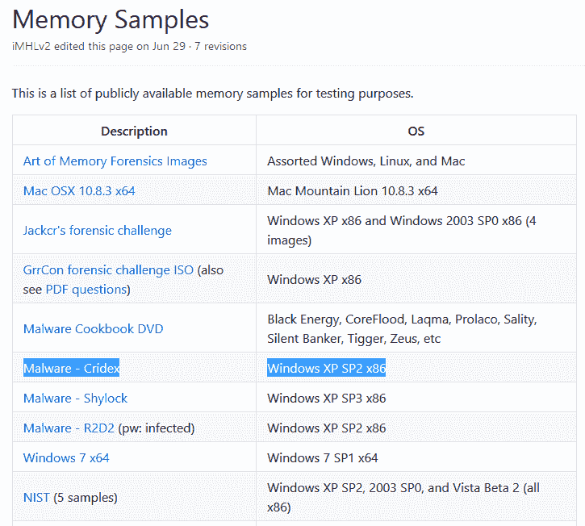

此页面上还有许多其他图像也可公开用于分析。为了练习使用 Volatility 框架并进一步提高您的分析技能，您可能希望下载任意数量的 Volatility，并使用 Volatility 中提供的各种插件。

# 图像定位

我们很快就会看到，Volatility 框架中的所有插件都是通过终端使用的。为了通过不必指定图像的长路径来更方便地访问图像文件，我们已将`cridex.vmem`图像移动到`Desktop`：

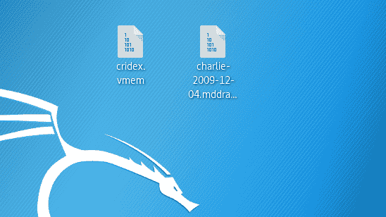

我们还可以将目录更改为`Desktop`，然后从那里运行 Volatility 框架及其插件。为此，我们打开一个新终端并键入以下命令：

```
cd Desktop
```

我们也可以通过键入`ls -l`来查看`Desktop`的内容，以确保`cridex.vmem`文件存在：

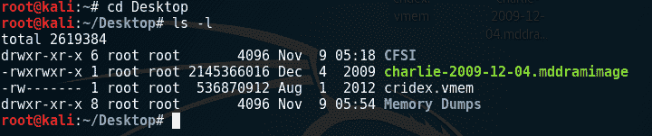

# 在 Kali-Linux 中使用 Volatility

要启动Volatility框架，请单击侧边栏底部的所有应用程序按钮，并在搜索栏中键入`volatility`：


点击Volatility图标在终端中启动程序。当波动开始时，我们看到正在使用的版本是`2.6`，并向我们提供了使用选项：

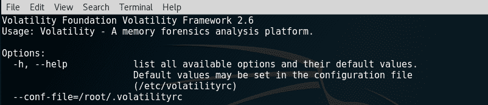

要查看指尖上所有插件的完整列表，请打开一个单独的终端并运行`volatility -h`命令，而不必滚动到用于运行 volatile plugin 命令的终端顶部：


下面的屏幕截图显示了 Volatility 框架中许多插件中的一部分：


此列表在执行分析时非常方便，因为每个插件都有自己的简短描述。下面的屏幕截图显示了`help`命令的一个片段，它给出了`imageinfo`插件的描述：


在 Volatility 中使用插件的格式为：

```
volatility -f [filename] [plugin] [options]
```

如前一节所示，要使用`imageinfo`插件，我们需要键入：

```
volatility -f cridex.vmem imageinfo
```

# 在Volatility中选择配置文件

所有操作系统都将信息存储在 RAM 中，但是，根据所使用的操作系统，它们可能位于内存中的不同位置。在 Volatility 中，我们必须选择一个最能识别操作系统和服务包类型的概要文件，以帮助 Volatility 识别存储工件和有用信息的位置。

选择一个配置文件相对简单，因为使用`imageinfo`插件，挥发性为我们做了所有的工作。

# imageinfo 插件

此插件提供有关使用的图像的信息，包括建议的操作系统和`Image Type (Service Pack)`，使用的`Number of Processors`，以及图像的日期和时间。

使用以下命令：

```
volatility -f cridex.vmem imageinfo
```

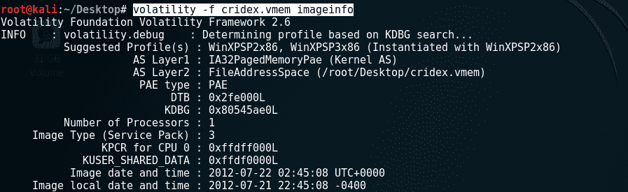

`imageinfo`输出显示`Suggested Profile(s)`为`WinXPSP2x86`和`WinXPSP3x86`：

*   **WinXP**：Windows XP
*   **SP2/SP3**：服务包 2/3
*   **x86**：32 位架构


映像类型或 service pack 显示为`3`，表明这是一个 Windows XP、service pack 3、32 位（x86）操作系统，将用作案例的配置文件：

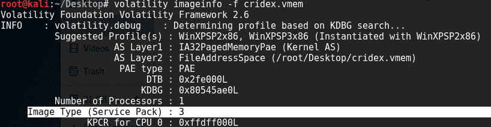

一旦选择了概要文件，我们现在可以继续使用 Volatility 插件来分析`cridex.vmem`图像。

# 过程识别与分析

为了在内存映像中识别和链接连接的进程、它们的 ID、启动时间和偏移位置，我们将使用以下四个插件开始：

*   `pslist`
*   `pstree`
*   `psscan`
*   `psxview`

# pslist 命令

此工具不仅显示所有正在运行的进程的列表，还提供有用的信息，如**进程 ID**（**PID**）和**父进程 PID**（**PPID**），并显示进程启动的时间。在本节显示的屏幕截图中，我们可以看到`System`、`winlogon.exe`、`services.exe`、`svchost.exe`和`explorer.exe`服务都是先启动，然后是`reader_sl.exe`、`alg.exe`，最后是`wuauclt.exe`。

PID 标识流程，PPID 标识流程的父级。查看`pslist`输出，我们可以看到`winlogon.exe`流程有`608`的`PID`和`368`的`PPID`。`services.exe`和`lsass.exe`过程的 PPID（直接在`winlogon.exe`过程之后）都是`608`，表明`winlogon.exe`实际上是`services.exe`和`lsass.exe`的 PPID。

对于那些新处理 ID 和进程本身的人，快速的 Google 搜索可以帮助识别和描述信息。熟悉许多启动过程也很有用，以便随时指出可能不寻常或可疑的过程。

还应注意过程的时间和顺序，因为这些可能有助于调查。在下面的屏幕截图中，我们可以看到`explorer.exe`、`spoolsv.exe`、`reader_sl.exe`等多个流程都是在`02:42:36 UTC+0000`的同时启动的。我们还可以看出，`explorer.exe`是`reader_sl.exe`的 PPID。

再加上这个分析，我们可以看到有两个`wuauclt.exe`的实例，其中`svchost.exe`作为 PPID。

使用的`pslist`命令如下：

```
volatility --profile=WinXPSP3x86 -f cridex.vmem pslist
```

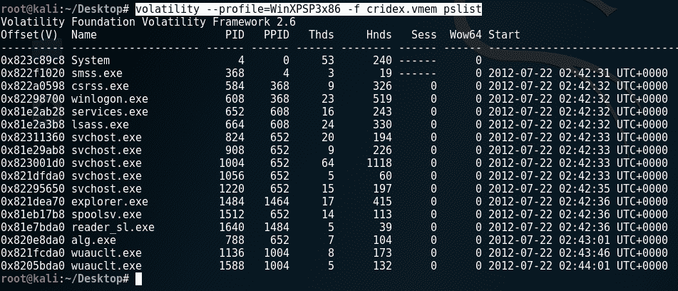

# pstree 命令

另一个可用于列出进程的进程标识命令是`pstree`命令。此命令显示与`pslist`命令相同的进程列表，但缩进也用于标识子进程和父进程。

在下面的屏幕截图中，列出的最后两个过程是`explorer.exe`和`reader_sl.exe`。`explorer.exe`不缩进，`reader_sl`缩进，表示`sl_reader`为子进程，`explorer.exe`为父进程：


# psscan 命令

查看正在运行的进程列表后，我们通过键入以下内容来运行`psscan`命令：

```
volatility --profile=WinXPSP3x86 -f cridex.vmem psscan
```

`psscan`命令显示不活动甚至隐藏的进程，这些进程可被恶意软件（如 rootkit）使用，并且众所周知，它们只是为了逃避用户和防病毒程序的发现。

应比较`pslist`和`psscan`命令的输出，以观察任何异常：


# psxview 插件

与`psscan`一样，`psxview`插件用于查找和列出隐藏的进程。然而，使用`psxview`可以运行多种扫描，包括`pslist`和`psscan`。

运行`psxview`插件的命令如下：

```
volatility --profile=WinXPSP3x86 -f cridex.vmem psxview
```

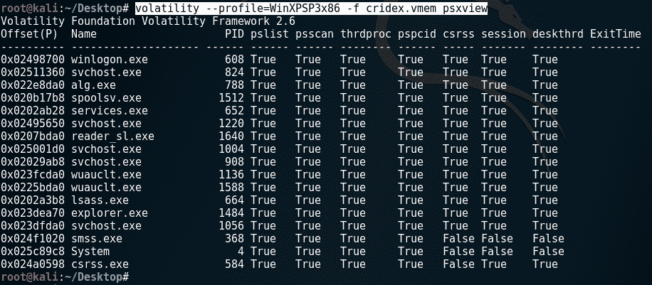

# 分析网络服务和连接

Volatility可用于识别和分析活动、终止和隐藏的连接以及端口和进程。支持所有协议，Volatility 还显示进程使用的端口的详细信息，包括它们的启动时间。

为此，我们使用以下三个命令：

*   `connections`
*   `connscan`
*   `sockets`

# 连接命令

`connections`命令列出该时间点的活动连接，显示带有端口和 PID 的本地和远程 IP 地址。`connections`命令仅用于 Windows XP 和 2003 服务器（32 位和 64 位）。`connections`命令的使用方式如下：

```
volatility --profile=WinXPSP3x86 -f cridex.vmem connections
```


# connscan 命令

此时，`connections`命令仅显示一个连接处于活动状态。要显示已终止连接的列表，请使用`connscan`命令。`connscan`命令也仅适用于 Windows XP 和 2003 Server（32 位和 64 位）系统：

```
volatility --profile=WinXPSP3x86 -f cridex.vmem connscan
```


使用`connscan`命令，我们可以看到同一个本地地址先前通过 IP`125.19.103.198:8080`连接到另一个`Remote Address`。`1484`的`Pid`告诉我们连接是由`explorer.exe`进程完成的（如前面使用`pslist`命令显示的）。

有关远程地址的更多信息，可使用 IP 查找工具和网站（如【T0）】获取 http://whatismyipaddress.com/ip-lookup ：


单击获取 IP 详细信息按钮，将向我们显示以下结果，包括 ISP 名称、大陆和国家详细信息，以及显示具有该 IP 的设备的大致位置的地图：

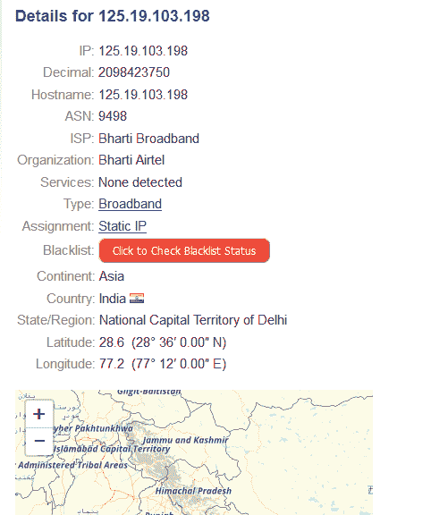

# 套接字插件

`sockets`插件可用于提供额外的连接信息。虽然 UDP 和 TCP 是以下屏幕截图输出中列出的唯一协议，`sockets`命令支持所有协议：

>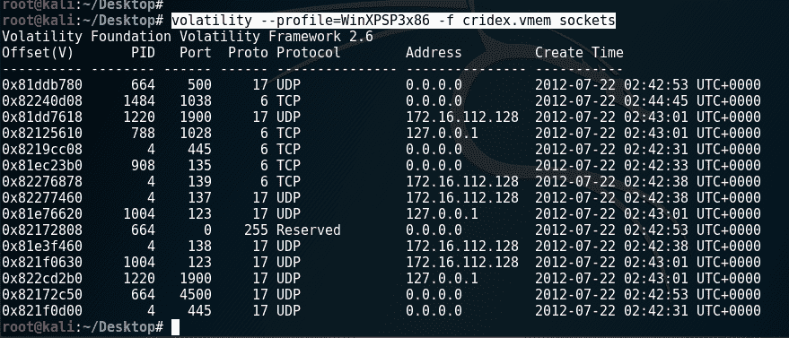

# 动态链接库分析

**DLL**（**动态链接库**）是 Microsoft 特有的，包含可同时被多个程序使用的代码。检查流程的运行 DDL 以及文件和产品的版本信息可能有助于关联流程。还应分析与用户帐户相关的进程和 DLL 信息。

对于这些任务，我们可以使用以下插件：

*   `verinfo`
*   `dlllist`
*   `getsids`

# verinfo 命令

此命令列出关于**PE**（**可移植可执行文件**文件的版本信息（`verinfo`）。该文件的输出通常相当长，因此可以在单独的终端中运行，如果调查人员不希望连续滚动当前终端以查看过去的插件命令列表和输出。

`verinfo`命令的使用方式如下：

```
volatility --profile=WinXPSP3x86 -f cridex.vmem verinfo
```


# dlllist 插件

`dlllist`插件在内存中列出了当时所有正在运行的 DLL。DLL 由可由多个程序同时使用的代码组成。

`dlllist`命令的使用方式如下：

```
volatility --profile=WinXPSP3x86 -f cridex.vmem dlllist
```


# getsids 命令

所有用户也可以通过**安全标识符**（**SID**进行唯一标识。`getsids`命令按照进程启动的顺序有四个非常有用的项（请参阅`pslist`和`pstree`命令屏幕截图）。

`getsids`命令输出的格式为：

```
[Process] (PID) [SID] (User)
```

列表中的第一个结果，例如，列表：

```
System (4) : S – 1 – 5- 18 (User)
```

*   `System`：流程
*   `(4)`：PID
*   `S - 1 - 5- 18`：SID
*   `User`：本地系统

如果 SID 中的最后一个数字在 500 范围内，则表示用户具有管理员权限。例如，`S – 1 – 5- 32-544`（管理员）。

`getsids`命令的使用方式如下：

```
volatility --profile=WinXPSP3x86 -f cridex.vmem getsids
```

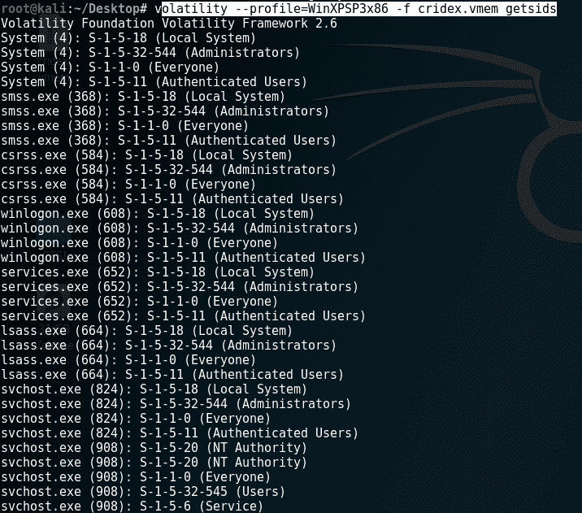

向下滚动`getsids`输出，我们可以看到一个 SID 为`S-1-5-21-79336058`（非管理员）的名为`Robert`的用户启动或访问了`explorer.exe`、PID`1484`：

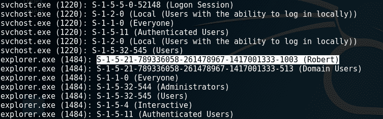

# 注册表分析

有关每个用户、设置、程序和 Windows 操作系统本身的信息都可以在注册表中找到。甚至可以在注册表中找到哈希密码。在 Windows 注册表分析中，我们将使用以下两个插件。

*   `hivescan`
*   `hivelist`

# hivescan 插件

`hivescan`插件显示可用注册表配置单元的物理位置。

运行`hivescan`的命令如下：

<pre>**volatility --profile=WinXPSP3x86 -f cridex.vmem hivescan**

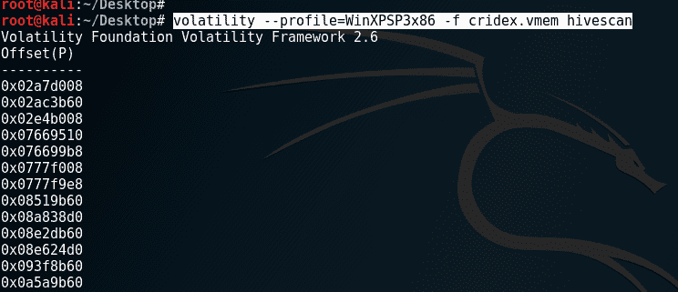

# hivelist 插件

有关注册表配置单元和 RAM 中位置的更详细（和有用）信息，可以使用`hivelist`插件。`hivelist`命令显示`Virtual`和`Physical`地址的详细信息，以及易于阅读的明文名称和位置。

用于运行`hivelist`的命令如下：

```
volatility --profile=WinXPSP3x86 -f cridex.vmem hivelist
```


# 密码转储

**安全账户管理器**（**SAM**文件）的位置也使用`hivelist`插件列出，如以下屏幕截图所示。`SAM`文件包含 Windows 计算机中用户名的哈希密码。`SAM`文件的路径在下面的屏幕截图中显示为`Windows\system32\config\SAM`。系统打开时，Windows 内的用户无法访问此文件。这可以进一步用于获取`SAM`文件中的散列密码，使用`wordlist`以及**John the Ripper**等密码破解工具破解密码，也可在 Kali Linux 中使用：


# 事件时间表

Volatility可以产生时间戳事件列表，这对于任何调查都是至关重要的。要生成此列表，我们将使用`timeliner`插件。

# timeliner 插件

`timeliner`插件通过提供获取图像时发生的所有事件的时间线来帮助调查人员。虽然我们知道在这个场景中发生了什么，但许多其他转储可能相当大，并且更加详细和复杂。

`timeliner`插件按时间对详细信息进行分组，包括进程、PID、进程偏移量、使用的 DDL、注册表详细信息和其他有用信息。

要运行`timeliner`命令，请键入以下内容：

```
volatility --profile=WinXPSP3x86 -f cridex.vmem timeliner
```


下面是进一步滚动其输出时的`timeliner`命令片段：


# 恶意软件分析

`malfind`插件为 Volatility 令人印象深刻的插件系列增添了新的亮点。

顾名思义，`malfind`插件用于发现或至少引导调查人员找到可能已注入各种进程的恶意软件的线索。`malfind`插件的输出可能特别长，因此应在单独的终端中运行，以避免在查看其他插件命令的输出时不断滚动。

用于运行`malfind`的命令如下：

```
volatility --profile=WinXPSP3x86 -f cridex.vmem malfind
```

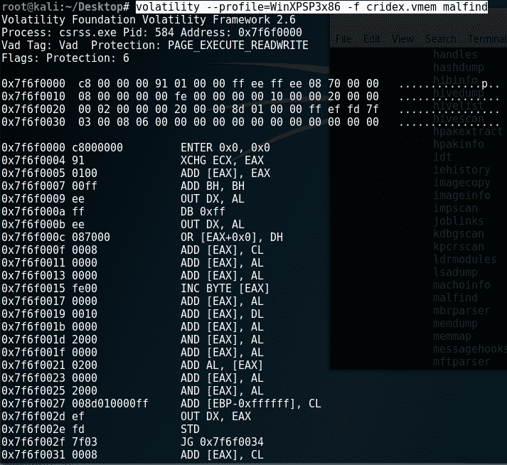

`malfind`插件也可以使用`-p`开关直接在进程上运行。

正如我们所发现的，`winlogon.exe`被分配了 PID`608`。要在 PID`608`上运行`malfind`，我们键入：

```
volatility --profile=WinXPSP3x86 -f cridex.vmem malfind -p 608
```


# 总结

在本章中，我们使用 Volatility 框架中的一些插件研究了内存取证和分析。处理Volatility的第一步也是最重要的一步是选择Volatility将在整个分析过程中使用的配置文件。此配置文件告诉您正在使用哪种类型的操作系统。一旦选择了概要文件，我们就能够使用这个多功能工具成功地执行进程、网络、注册表、DLL，甚至恶意软件分析。正如我们所看到的，Volatility可以在数字取证中执行几个重要功能，并且应该与我们以前用于执行深入和详细的取证分析和调查的其他工具一起使用。

请务必下载更多公开的内存图像和示例，以测试您在这方面的技能。当然，要尽可能多地开发插件，当然要记录你的发现并考虑在线分享。

在下一章中，我们将继续讨论另一个功能强大的工具，它可以完成从收购到报告的所有工作。让我们开始解剖Sleuth 工具包®。