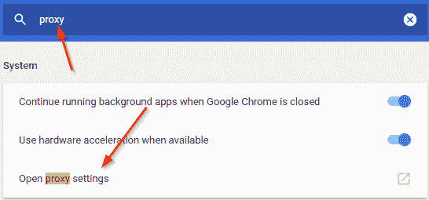
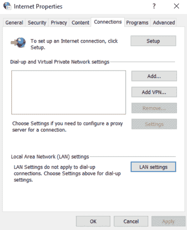
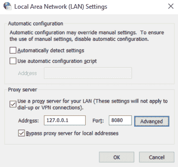
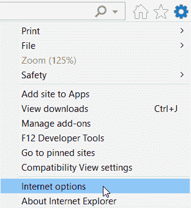
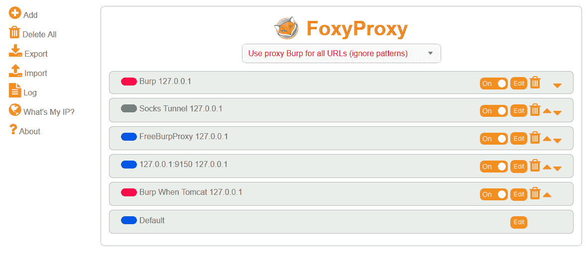
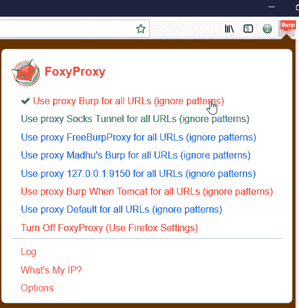
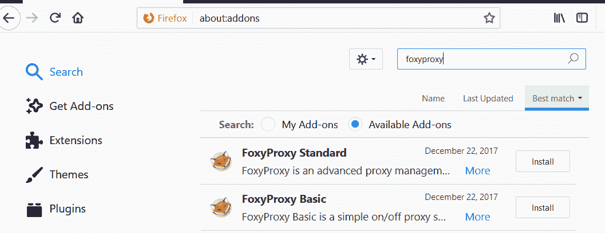
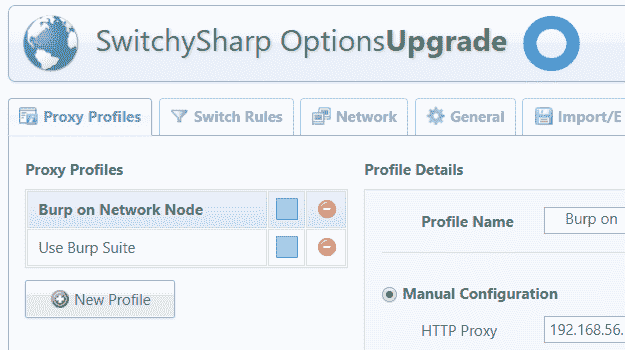

# 配置客户端和设置移动设备

一旦我们建立了 Burp 套件并将其配置为代理，通过它我们的所有通信将到达目标，我们就需要设置客户端与 Burp 进行通信，这样通信路径就完成了。

几乎所有可以与 HTTP/HTTPS 服务器通信的客户端都有一种设置代理端点的方法。这告诉客户机需要首先将流量发送到代理端点，然后代理端点将其转发到目标。不同的客户端有不同的方式设置此代理设置。一些客户端使用操作系统的代理设置来强制流量的路径。

在本章中，我们将了解如何为移动和传统计算设备上的各种常见客户端设置代理选项。

我们将在本章中介绍以下主题：

*   设置 Firefox、Chrome 和 Internet Explorer 以使用 Burp 套件（HTTP 和 HTTPS）
*   可用于管理代理设置的其他浏览器附加组件
*   为非代理感知客户端设置系统范围的代理
*   设置 Android 和 iOS 以使用 Burp 套件

# 设置 Firefox 以使用 Burp 套件（HTTP 和 HTTPS）

Firefox 已经成为黑客的最爱有一段时间了。这主要是由于有过多的附加组件允许您扩展其特性和功能。与业内其他浏览器相比，Firefox 的主要优势之一是能够使用与操作系统无关的代理设置。

Firefox 可以设置为使用特定的代理，即使操作系统有单独的系统代理集。这允许各种需要单独代理才能与 Firefox 结合使用的工具，同时确保 Firefox 采用单独的路径。

记住，没有浏览器，包括 Firefox，在私有/匿名模式下有单独的代理设置。

# 设置 Chrome 以使用 Burp 套件（HTTP 和 HTTPS）

Google Chrome 使用系统代理路由流量，除非使用命令行参数指定代理服务器。这既麻烦又有利，因为您可以在 Chrome 中设置代理，而无需打开 Chrome UI。

要在 Chrome 中设置代理选项，请执行以下步骤：

1.  单击右上角的三个点，然后选择设置：


2.  在“设置”窗口中，键入“代理”以查找“打开代理设置”选项：



3.  这将打开 Windows Internet 属性对话框。

4.  单击 LAN 设置打开设置页面：



5.  输入运行 Burp Suite 的系统的端口号和 IP 地址，如以下屏幕截图所示：



6.  您还可以单击“高级”为不同协议使用特定地址。请记住，这是一个系统范围的代理设置。


7.  单击“确定”应用设置。

# 在 Linux 上设置 Chrome 代理选项

在 Linux 上，当您尝试设置 Google Chrome 的代理选项时，可能会遇到错误，如下所示：

```
When running Google Chrome under a supported desktop environment, the system proxy settings will be used. However, either your system is not supported or there was a problem launching your system configuration.But you can still configure via the command line. Please see man google-chrome-stable for more information on flags and environment variables.
```

在这种情况下，您可以通过命令行参数指定代理服务器，也可以编辑安装 Chrome/Chrome 时创建的`.desktop`文件。

使用特定代理启动 Google Chrome 的命令行参数为：

# 设置 Internet Explorer 以使用 Burp 套件（HTTP 和 HTTPS）

Internet Explorer 和 Microsoft Edge 都使用 Windows 系统代理设置作为自己的首选项。

以下步骤将帮助您在 Internet Explorer 中设置代理选项：

1.  单击右上角的齿轮图标，然后选择 Internet 选项：



2.  “Internet 选项”对话框将打开。单击连接| LAN 设置以管理 Internet Explorer 的代理设置。

请记住，这是一个系统范围的代理设置，系统上的大多数程序也将遵守此设置，特别是当它们没有自己的代理设置时。

# 可用于管理代理设置的其他浏览器附加组件

在 web 应用程序渗透测试期间，可能需要切换代理设置。有时候，你可能希望直接连接到互联网，而其他时候，你可能希望你的流量通过打嗝。

还有一些情况下，你可能希望你的所有流量都通过打嗝，除了[google.com](http://google.com)。在这种情况下，切换浏览器的代理设置很容易成为不愉快的用户体验。

由于这些原因，Firefox 和 Chrome 有几个附加组件/扩展，允许您在单击某个选项时将浏览器的代理设置切换到其他代理。

让我们

# Firefox 的 FoxyProxy

在代理管理方面，Firefox 最受欢迎的插件是一个名为**FoxyProxy**的漂亮小插件，由 Eric H Jung 编写：



FoxyProxy 允许您创建多个配置文件，这些配置文件可以设置为不同的代理端点，并在需要时随意选择。

下面是在 Firefox 中创建多个配置文件时 FoxyProxy 的样子。此菜单作为 Firefox 窗口中的一个选项可用，单击即可激活：



让我们举一个设置代理选项的简单例子：

1.  使用 Firefox 的`about:addons`页面安装 Firefox 扩展。加载项名称为**FoxyProxy 标准**：



2.  一旦安装完成，设置按钮旁边的右上角将出现一个狐狸的小图标。
3.  单击 FoxyProxy 图标并选择选项。
4.  点击**添加**打开页面，添加新代理。
5.  添加描述您的 Burp 代理端点的所有详细信息。还要选择一种颜色。这是使用代理时福克斯图标将更改为的颜色：


6.  新创建的代理将出现在可用代理配置文件列表中。
7.  单击 fox 图标选择您的代理。您可以通过查看 Burp 中的流量来验证这是否有效：


8.  要关闭代理并使用 Firefox 默认选项（无代理），请选择关闭 FoxyProxy。

当涉及到过滤域名甚至 URL 时，这个插件非常强大。您可以添加匹配或不匹配的模式，并只使指定到特定域的流量通过 FoxyProxy，最终通过 Burp。

# Google Chrome 的代理交换机 Sharp

这是一个极好的附加组件，可以在 Chrome 运行时轻松切换代理，特别是当系统代理不在您希望发送 web 流量的位置时。



下面是 SwitchySharp 在 Google Chrome 中创建的多个配置文件的外观。此菜单在 Google Chrome 窗口中作为一个选项可用，单击即可激活：


1.  要开始使用该插件，请通过 Chrome web 应用商店[进行安装 https://chrome.google.com/webstore/category/extensions](https://chrome.google.com/webstore/category/extensions) ：

# 为非代理感知客户端设置全系统代理

在此上下文中，非代理感知客户端是通过 HTTPS 与 internet 通信的应用程序，但没有设置代理服务器以便捕获通过它们的流量的选项。这些应用程序使用系统代理设置。这在 Windows 上的厚客户端应用程序中很常见。

在这种情况下，我们可以设置一个系统范围的代理设置来处理我们的应用程序。可以通过命令行和 GUI 设置系统范围的代理设置。但是，了解命令行选项后，您可以编写它们的脚本，以便根据所使用的操作系统，使用 bash 脚本或批处理文件切换系统范围的代理设置。

# Linux 或 macOS X

要在 Linux 命令行上使用代理，必须根据流量类型设置环境变量`http_proxy`、`https_proxy`或`ftp_proxy`。

要有效地执行此操作，必须运行以下命令：

```
$ export http_proxy=http://127.0.0.1:8080$ export https_proxy="https:// 127.0.0.1:8080"$ export ftp_proxy="http:// 127.0.0.1:8080"
```

您可以通过`env`命令检查当前代理设置：

```
env | grep -i proxy
```

# 窗户

Windows 系统范围的代理设置可以通过 Internet 选项|连接| LAN 设置应用。也可以使用 netsh 命令应用此设置，如以下步骤所示：

1.  以管理员身份启动 cmd
2.  运行`netsh winhttp set proxy 127.0.0.1:8080`
3.  要检查设置是否已应用，请运行以下命令：

```
netsh winhttp show proxy
```

4.  要重置代理，请运行：

```
netsh winhttp show proxy
```

# 设置 Android 以使用 Burp 套件

要测试 Android 应用程序，甚至要通过 Android 设备测试 web 应用程序，您需要配置 Burp Proxy 在接口上启动侦听器，然后将 Android 设备和运行 Burp 的系统连接到同一无线网络。

这会使打嗝监听器变得可见，并可供同一网络上的 Android 设备访问。

按照以下步骤为 Android 设备设置代理：

1.  进入设置菜单。
2.  连接到与 Burp 相同的无线网络。

3.  如果已连接，请单击无线连接名称并选择管理网络设置，如以下屏幕截图所示：

4.  单击“显示高级选项”以显示代理设置。点击。。。

# 为什么要打嗝？让我们做一些基础工作吧！

Burp Suite 是一个代理，它允许您拦截和篡改从浏览器到应用服务器的每个请求。这为测试人员提供了测试应用程序所有途径的巨大能力，因为它显示了所有可用的端点。它作为一个中间件工作。它给您带来的最大优势是能够绕过客户端验证

它是一个智能工具，可以跟踪您的浏览历史，还可以管理网站结构，让您更好地了解可用的内容和新发现的途径。Burp 的核心优势在于，它允许您将 HTTP 请求转发到不同的 Burp 工具，并执行所需的任务。它可以是重复或自动攻击，解码某些参数，或比较两个或多个不同的请求。Burp 通过在运行时为用户解码参数，让用户能够理解不同的格式；例如，解码`ViewState`参数、美化 JSON 请求等。

# 设置 iOS 以使用 Burp 套件

要将 iOS 设备设置为与 Burp 一起工作，我们需要将 Burp 的网络侦听器地址（就像我们在 Android 设备上所做的那样）添加到 iOS 设备的网络配置中。

要实现此目的，请执行以下步骤：

1.  在 iOS 设备上，打开设置。
2.  假设您已连接到无线网络，请点击 Wi-Fi 选项，然后点击无线接入点名称旁边的信息图标。
3.  在 HTTP 代理部分下选择**手动**，输入 Burp 监听器的 IP 地址和端口号。
4.  返回并浏览到 iOS 设备浏览器上的 HTTP 站点，查看 Burp 是否接收到流量。

为了能够访问 HTTPS 站点，您需要在 iOS 设备中添加 Burp 的 CA 证书。到

# 总结

在本章中，我们学习了如何设置 Firefox、Chrome 和 Internet Explorer，通过 Burp 套件发送和接收 HTTP 和 HTTPS 流量。我们为非代理感知客户端配置了系统范围的代理设置。我们还了解了使代理之间切换变得轻而易举的浏览器附加组件和扩展。

在下一章中，我们将学习如何执行应用程序渗透测试