# 探索应用程序渗透测试的各个阶段

在本章中，我们将了解应用程序渗透测试所涉及的各个阶段，并对 Burp 套件工具进行全面概述。基于这些知识，我们将列举并收集有关目标的信息。

本章将介绍以下主题：

*   应用程序渗透测试的阶段
*   更好地了解打嗝套件

# 应用程序测试的阶段

理解应用程序 pentest 的各个阶段是很简单的，因为它奠定了基础，并确保 pentester 覆盖所有可能的端点并进行有效的扫描。web 应用程序 pentest 大致分为以下几个阶段：

*   规划与侦察
*   客户端代码分析
*   手动测试
*   自动测试
*   利用发现的问题
*   深入挖掘以进行数据过滤
*   拿贝壳
*   报告

在这些阶段中，规划和侦察阶段是最重要的阶段，因为测试人员可能会错过应用程序中的关键入口端点，并且这些区域可能未经测试。让我们更详细地探讨一下。。。

# 规划与侦察

在规划和侦察阶段，我们定义了渗透测试的范围。此初始阶段需要大量的计划，您需要回答以下问题：

*   圣灵降临节的范围是什么？
*   什么是受限 URL？
*   范围内的各个子域是什么？
*   是否有多个应用程序托管在同一个域的不同文件夹中？
*   是否存在托管此应用程序的其他平台（即移动应用程序、web 应用程序、桌面应用程序等）

一旦你回答了这些问题，你就会对什么是测试和什么不是测试有一些清晰的认识。根据是黑盒测试还是白盒测试，将进行进一步的枚举。在任何一种情况下，我们都必须继续查找范围内应用程序的所有文件和文件夹，并确定端点。稍后，在下一章中，我们将看到如何使用 Burp 发现新文件和文件夹。

# 客户端代码分析

根据测试类型，我们也可以执行代码分析。对于作为白盒测试一部分托管的应用程序，测试人员可以使用整个代码，他可以使用自定义工具执行整个代码审查，并根据代码逻辑查找漏洞。假设它是一个黑盒子，需要进行代码分析。给定一个黑盒场景，将进行的唯一代码分析是客户端代码和 JavaScript 库引用。根据分析，测试人员可以绕过这些脚本实现的某些验证逻辑，使我们能够执行某些攻击。

在下一章中，我们将详细讨论如何通过代码操作绕过客户端逻辑。。。

# 手动测试

在这个阶段，测试人员的头脑帮助他发现应用程序中的各种漏洞。在此阶段，攻击者通过模糊不同的输入字段并检查应用程序响应来手动测试缺陷。有时扫描器无法发现某些漏洞，并且非常需要用户干预，而这正是手动测试繁荣的地方。自动扫描仪往往会漏掉某些漏洞，例如：

*   各种业务逻辑缺陷
*   二阶 SQL 注入
*   Pentesting 密码参数
*   特权升级
*   敏感信息披露

# 各种业务逻辑缺陷

每个应用程序都有自己的逻辑集来完成某些功能。业务逻辑通常是完成作业所需的一组步骤。让我们举一个例子，如果用户想要在购物网站上购买产品，他必须遵循一系列步骤：

1.  选择一个项目
2.  指定产品的数量
3.  输入交货信息
4.  输入卡的详细信息
5.  完成支付网关程序
6.  购买完成
7.  待交付
8.  交付完成

正如您所看到的，涉及到很多步骤，这就是自动扫描仪失败的地方。

# 二阶 SQL 注入

二阶 SQL 的工作原理不同；web 应用程序中的一个页面接收恶意用户输入，而另一个页面或其他应用程序上的其他函数检索此恶意内容，并将其作为查询的一部分进行解析。自动扫描仪无法检测此类问题。但是，Burp 有一个实现的逻辑，可以帮助攻击者发现 SQL 二阶漏洞。

# Pentesting 密码参数

在将信息发送给第三方的应用程序中，例如从购物门户到支付网关信息（例如信用卡详细信息）的端点，信息由双方约定的密钥加密。自动扫描仪将无法扫描此类实例。如果应用程序意外地暴露了任何端点，那么通过手动分析，pentester 可以测试这些加密参数是否存在漏洞。

# 利用发现的问题

如前所述，一旦使用自动扫描仪和手动测试扫描了应用程序，该阶段就开始了。SQL 注入文件上传旁路、XXE 攻击等发现使攻击者/测试人员能够进一步挖掘并攻击应用程序以获取外壳。因此，一旦在这一阶段发现了问题，pentester 将继续利用这些问题来查看信息可以提取到的程度。在此阶段，攻击者可以链接多个漏洞，以查看是否会导致更大的错误。有许多关于 HackerOne 的提交报告显示了测试人员如何链接多个漏洞，最终导致远程代码执行。

# 特权升级

自动扫描程序不了解应用程序上可用的角色或访问级别，因此永远无法发现这些漏洞。因此，始终需要手动干预。

# 敏感信息披露

自动扫描器用于确定信息是否敏感的知识通常通过几个关键字和正则表达式的组合来完成，例如信用卡正则表达式或电话号码正则表达式。除此之外，一切都是人为干预。

下一章将详细介绍如何进行手动分析。

# 自动测试

自动扫描是在网络和 web 上执行的一个阶段。自动扫描器有助于发现从输入验证绕过到 SQL 注入的多个缺陷。需要自动扫描以快速加速多个发现。在自动扫描中，扫描程序模糊所有输入参数，以查找 OWASP 前 10 名中的漏洞，尤其是过时的插件和版本。它有助于根据可用字典查找敏感文件，如管理员登录名。您应该注意，应用程序 pentest 不应基于自动扫描实践得出结论。应始终进行手动干预以验证结果。很多时候。。。

# 深入挖掘以进行数据过滤

有时用户无法获取 shell，或者可能出现应用程序易受盲目 SQL 或 XXE 攻击的情况；那么现在该怎么办呢？在这种情况下，攻击者仍然可以尝试使用带外技术或简单技术过滤信息。使用这些技术，攻击者可以过滤大量信息，例如从数据库中提取用户凭据、通过 XXE 注入读取文件等等。在后面的章节中，我们将看到如何使用带外技术使用 Burp 进行数据过滤。

# 拿贝壳

当他们对五旬斋活动感到满意时，这是他们最喜欢的部分。一旦测试人员通过任何漏洞（如 SQL、RFI、文件上传、LFI 组合等）获得 shell，他就可以尝试查看是否可以提升他在服务器上的权限。如果他能使自己成为一个系统或根，那么这是一个完全的妥协，测试可以得出一个完全成功的结论。

# 报告

一旦测试完成，接下来就是最重要的阶段：报告。报告必须尽可能精确和细致地向组织解释漏洞及其影响。这是因为组织只会以报告的形式理解测试人员的工作。您还可以添加已测试的攻击以及应用程序如何抵御攻击，让组织/开发人员了解应用程序的强大程度。

# 更好地了解打嗝套件

在本节中，我们将了解 Burp 套件为测试人员提供的丰富的特性和功能。我们还将研究快速修复方法，帮助自动化整个 pentesting 过程，减少误报。这将有助于初学者理解 Burp 在 web 上编写应用程序时提供的强大功能。

# 打嗝套件的特点

Burp Suite 有多种选择，使我们能够高效地进行 pentesting。打开 Burp Suite 后，您将看到以下选项卡：

*   仪表板
*   目标
*   代理
*   入侵者
*   中继器
*   测序器
*   译码器
*   比较器
*   扩展器
*   项目选择
*   用户选项

这是打嗝套件的外观：

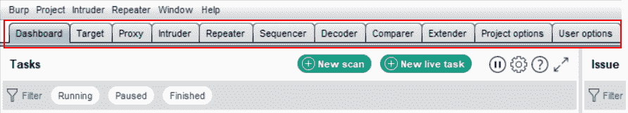

让我们一个接一个地了解所有这些选项，以便我们在后面的章节中执行 pentest 时，从这里开始就清楚地了解这些功能。

# 仪表板

Burp Suite 仪表板分为以下三个部分：

*   任务
*   发行活动
    *   顾问的
*   事件日志

这样，当测试仪运行自动扫描时，用户可以完全了解正在发生的情况。仪表板如以下屏幕截图所示：

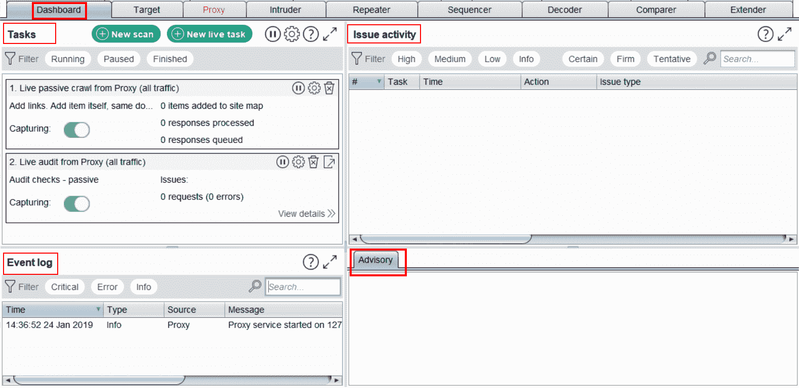

在任务选项中，测试人员可以单击新扫描并指定要扫描的网站。除了网站名称外，还有其他选项，例如配置扫描设置。单击“新建扫描”按钮后，您将看到如下屏幕：

这个

# 目标

**目标**选项卡允许您查看范围内应用程序的整个站点地图。它向用户显示应用程序上检测到的所有文件夹和文件以及构建逻辑。“目标”选项卡中还有许多其他功能。映射可以通过两种方式进行；一种是手动浏览，另一种是自动爬虫。如果测试人员正在进行手动浏览，请关闭代理截取并浏览应用程序。当不同页面的请求和响应在 Burp Suite 中不断填充时，Target 选项卡会按原样填充检测到的结构。这允许用户了解应用程序的外观以及整个应用程序中的文件夹和文件命名约定。好的，正如我们所知，在一个拥有大量页面的大型网站上，最合适的选择是使用自动爬虫，而不是手动方式，如以下屏幕截图所示：

您可以在目标页签中看到，**站点地图**、**范围**和**发布定义**三个子部分。让我们看看**Scope**选项卡提供了哪些功能。**范围**选项卡提供两个关键特性；一个是要在范围中包含哪些 web URL，另一个是要从范围中排除哪些 web URL。

在这里，测试人员可以输入 web URL 的特定文件夹，如果范围是主 URL，则可以输入整个 URL 本身。例如，假设要测试的应用程序位于[www.website.com/pentesting/](http://www.website.com/pentesting/)上，那么范围只能限于 pentesting 文件夹。如果是整个网站，则可以输入网站名称本身，如下所示：

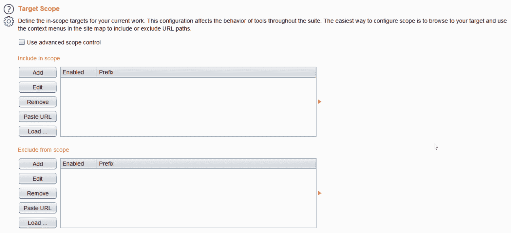

要添加 URL，只需点击**添加**并输入 URL 或带有文件夹路径的 URL。用户点击**添加**后，会出现如下画面：

类似地，**从作用域中排除**确保不会向**从作用域中排除**URL 发送任何测试或其他请求。当应用程序中存在某些可能是敏感页面的文件夹时（例如忘记密码功能或注册功能），这是非常有效的。

在生产环境中进行测试时，如果测试中包含了这些信息，那么会有大量垃圾邮件，清除这些信息会很繁琐，客户也不喜欢。因此，请确保使用此功能。另一种方法是右键单击特定文件，然后选择是否要将其排除或包括在范围中。例如，如果某个内容需要包含在范围内，则可以按照以下屏幕截图所示进行操作：

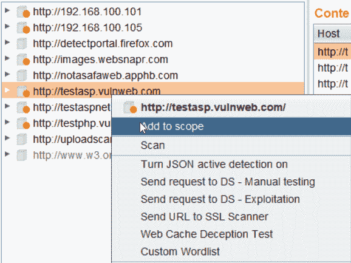

如果需要从作用域中排除特定路径或文件，可以通过右键单击 URL 并选择**从作用域中删除**来完成，如以下屏幕截图所示：

还有一个高级范围控制功能。当您在“范围”选项卡中启用它时，它使您能够输入协议类型，即 HTTP 或 HTTPS，然后输入 IP/IP 范围，以及端口号和文件，如以下屏幕截图所示：

问题定义包含 Burp 可以检测到的所有漏洞的所有定义。这让我们对 Burp 套件的丰富检测功能有了一个很好的了解，可以发现如此多的漏洞，如以下屏幕截图所示：

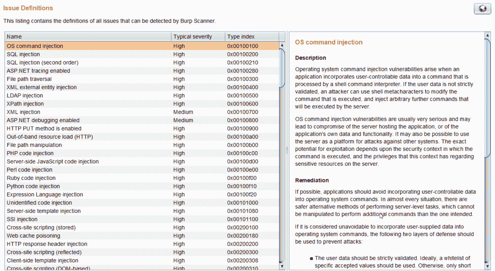

Burp 还在站点地图中提供过滤器，确定要显示的内容和需要隐藏的内容。例如，应该如何过滤请求，然后显示 MIME 类型，然后是状态代码。还有其他选项，例如按搜索词、按扩展名和按注释过滤。这些都是不言自明的，可以根据用户需求进行配置，如以下屏幕截图所示：

这有助于获得非常清晰的站点地图。

# 代理

这是整个工具的核心；打嗝套房里发生的一切都是通过这个地方发生的。“代理”选项卡允许您通过编辑请求并将其发送给中继器、入侵者或任何 Burp 测试模块来拦截请求并使用它。在这里，您可以决定测试人员希望对请求执行什么操作。**代理**页签如下图所示：

一旦一个请求被截获，就可以用不同的方式查看它。可用于简单 HTTP 请求的选项有 Raw、Params、header 和 Hex。根据请求的类型，如果是 web 套接字请求，则 web 套接字选项卡将。。。

# 入侵者

这是应用程序的核心功能。Burp 的这一特性允许用户自动化用户想要的过程。自动化用于对 web 应用程序执行攻击。这个特性是高度可定制的，可以用于各种任务，从暴力到利用 SQL 注入和 OS 命令注入等等。

入侵者有四个子选项卡，它们是：

*   **目标**
*   **位置**
*   **有效载荷**
*   **选项**

**目标**选项卡显示请求发送到的 IP 和端口，以及**开始攻击**按钮。单击此按钮一次，将完成要测试的特定请求的设置，如下所示：

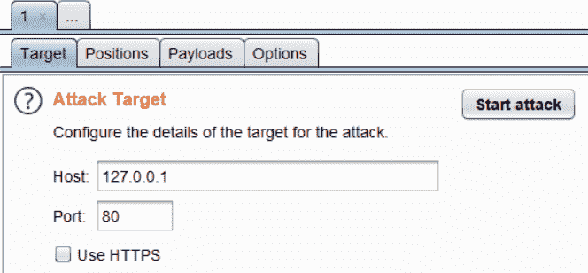

**入侵者**中的**位置**选项卡是选择有效负载位置的位置。如下图所示，`txtUsername`和`txtPassword`的**值**参数高亮显示。**添加**按钮添加分隔符；任何介于两个分隔符之间的内容都将成为一个攻击点。正如我们在示例请求中看到的，有两个位置需要进行自动化。**清除**按钮删除请求中的所有注射点，**自动**按钮添加所有可攻击的打嗝突出显示参数。

此选项卡中最有趣的是攻击类型。Burp 支持四种不同的 Tack 类型：

*   **狙击手**
*   **击锤**
*   **干草叉**
*   **集群炸弹**

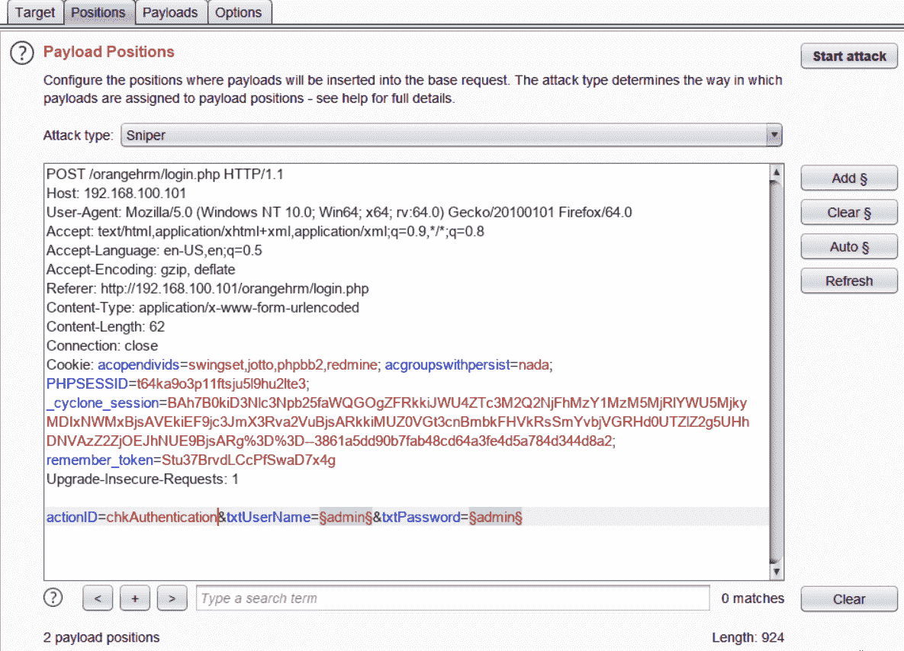

让我们更详细地了解一下攻击类型。

**狙击手**：狙击手支持一组有效载荷。它将一次发送一个有效载荷。假设有一个位置我们想要模糊，那么狙击手是最适合攻击自动化的。由于狙击手只向第一个攻击点发送一个有效载荷，所以在有两个攻击点时效率不高。一旦有效载荷集耗尽，它会将有效载荷发送到第二个攻击点，将第一个点保留为默认值。狙击手总是为单个输入攻击点选择。如果我们在前面的屏幕截图中使用 Sniper，它将首先模糊用户名，将密码保留为`admin`，然后模糊密码字段，将用户名字段保留为管理员请求中默认接收的用户名字段。

**打击油缸**：打击油缸也使用一组有效载荷。这里有趣的是，击锤在多个位置通过相同的有效载荷。这意味着，一旦指定了有效负载列表，它将在所有需要模糊化的标记位置发送第一个有效负载值，依此类推，直到最后一个有效负载。产生的有效载荷数量等于提供的有效载荷数量，与模糊位置无关。

**Pitchfork**：此攻击使用多组有效载荷。假设我们为模糊标记了两个位置，类似于前面的屏幕截图，并给出了两个有效载荷集；一个是用户名，另一个是密码。当发起攻击时，有效载荷集中的第一个有效载荷设置在第一个位置，第二个有效载荷集中的第一个有效载荷设置在第二个位置，攻击相应增加。攻击总数将等于有效负载数最少的有效负载集。

**集群炸弹**：此攻击使用多组有效载荷。它是所有有效载荷位置的完整排列组合。假设有两个有效负载位置，用户名和密码，以及两个不同的有效负载集，用户名集和密码集。攻击发生时，位置 1 的第一个有效载荷将沿着位置 2 的所有有效载荷集进行测试。一旦耗尽，则将第二个有效载荷设置在位置 1，并根据该位置测试第二组的所有有效载荷。因此，总的来说，生成的请求总数将是有效负载集中有效负载数量的乘积。那么，假设我们有 10 个有效载荷用于位置 1，10 个有效载荷用于位置 2：将发送的请求总数将为 100。

下一个选项卡是**有效载荷**选项卡。它包含四种不同的设置，分别是：

*   **有效载荷组**
*   **有效载荷选项**
*   **有效载荷处理**
*   **有效载荷编码**

**有效载荷集**：**有效载荷集**允许您指定在什么有效载荷位置输入什么类型的有效载荷。

**有效载荷选项**：此设置允许您设置有效载荷。如果是专业版，测试人员可以从可用的打嗝列表中进行设置，或者使用**加载功能加载一组自定义文件。。。**选项，如下图截图所示

**有效载荷处理**：此设置允许用户在使用每个有效载荷之前执行不同的任务来处理每个有效载荷。如以下屏幕截图所示，可以在开始攻击之前配置规则：

**有效载荷编码**：该设置允许通过复选框将自动编码设置为 on 或 off。用户可以根据被测试应用程序的依赖性，指定在发送用于测试之前需要对哪些字符进行 URL 编码，例如：

最后一个选项卡是**选项**选项卡，该选项卡允许测试人员配置其他设置以实现攻击自动化。它包含以下设置：

*   **请求头**
*   **请求引擎**
*   **攻击结果**
*   **Grep 匹配**
*   **Grep 提取物**
*   **Grep 有效载荷**
*   **重定向**

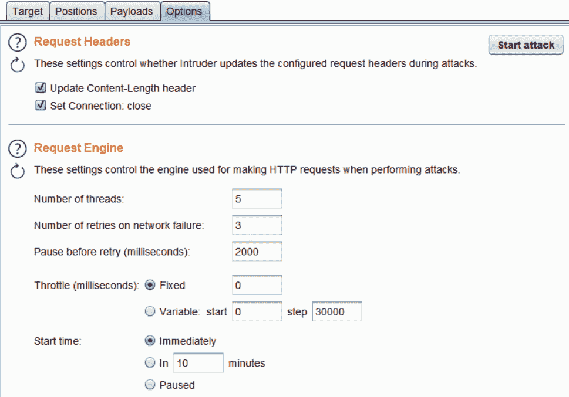

**请求头**：此设置允许用户根据有效负载的长度自动**更新内容长度头**，并设置**设置连接的头：关闭**，使其处于等待状态，不利用应用的资源。

**请求引擎**：请求引擎允许用户通过指定要使用的线程数、网络故障重试次数、暂停、节流等来控制测试速度，如下图所示：

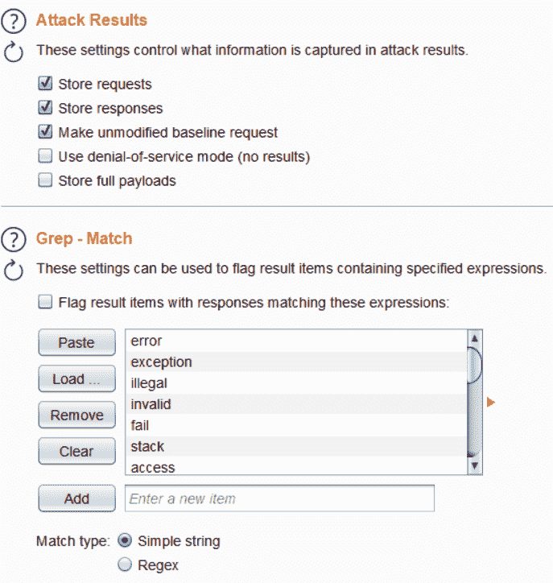

**攻击结果**：此设置允许测试人员根据攻击结果选择要捕获的信息

**Grep Match**：此设置允许用户突出显示某些字段，以便快速查看正在调用的特定表达式。例如，如果用户成功登录，则会有注销选项，因此如果用户在此处添加表达式 logout 并启用此设置，则请求将突出显示并易于发现，如下所示：

**Grep 有效载荷**：此设置用于标记包含与提交的有效载荷相同值的结果。

**重定向**：此设置告诉 Burp 在发送请求时检测到重定向时该怎么做

# 中继器

**中继器**允许测试人员通过修改并检查服务器如何响应，以递归方式提交相同的请求。假设测试人员正在测试特定请求的一个参数上的 SQL 注入或命令注入缺陷。测试人员可以在**代理**中捕获请求并发送给**中继器**，操作参数并发送给服务器检查响应，再次操作，并检查响应。它就像一个手动调试器。查看以下屏幕截图，以清楚了解第一个请求，这是一个简单的登录请求：

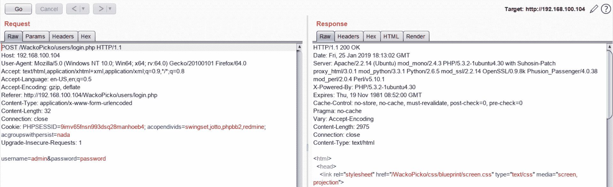

响应为**OK**。但是，如果我更改用户名的值。。。

# 比较器

打嗝比较器是一种打嗝功能，用于根据单词或字节比较来比较差异。这种比较可以在很多情况下使用。例如，假设用户希望比较成功登录响应和失败登录响应的差异。比较器将显示存在字节差异的区域。我们可以想到的另一个用途是测试 SQL 注入以查看差异。有两种比较。要将响应发送到比较器，只需右键单击响应并**发送到比较器**。请查看以下屏幕截图以供参考：

为了澄清，我们向 Comparer 发送了两个不同的响应：一个是成功登录，另一个是不成功登录。**比较器**工具栏如下所示：

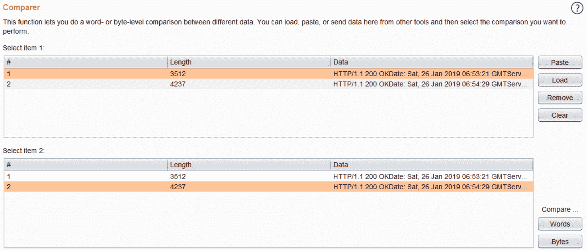

然后，测试人员可以从项目 1 中选择一个响应，从项目 2 中选择另一个响应，然后单击**按单词比较**，**按字节比较**。该工具将进行逐字比较，并显示删除、修改和添加等差异，例如：

对比以彩色编码的方案显示，如前面的**修改**、**删除**和**添加**截图所示。

# 测序器

**Sequencer**用于分析会话 cookie、CSRF 令牌和密码重置令牌的随机性。当我们借助**Sequencer**对**会话**令牌进行分析时，我们将对此进行更详细的讨论

有关 Burp Suite Sequencer 的更多信息，请访问[http://www.preflexsol.com/burpsuite.shtml](http://www.preflexsol.com/burpsuite.shtml)

# 译码器

此 Burp 实用程序允许测试人员在应用程序中遇到数据时编码、解码和散列数据。支持不同类型的编码器和哈希，例如：

| 编码器/解码器 | 平原 | 统一资源定位地址 | HTML | Base64 | ASCII 十六进制 | 十六进制 | 八进制 | 二进制的 | Gzip |

以下是使用**编码为的 base64 编码字符串密码的示例。。。**解码器中的一个选项：

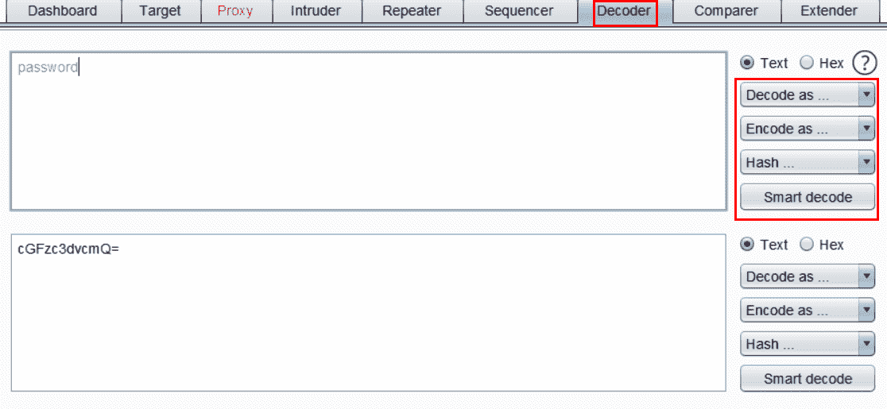

支持的哈希类型很多，从 SHA 到 SHA3-512，再到 MD5、MD2 等等。玩解码器，因为它将是一个非常方便的实用程序在五旬节。

# 扩展器

打嗝功能允许测试人员使用独立人员编写的不同扩展，作为打嗝功能的附加功能。打嗝是非常可伸缩的；用户甚至可以编写自己的代码来创建一个打嗝扩展，并将其嵌入以更好地利用打嗝。为了充分利用扩展，用户必须提供 Jython 和 JRubyJAR 文件的路径。我们将很快看到如何做到这一点。让我们看看下面的 Burp Extender 页面：

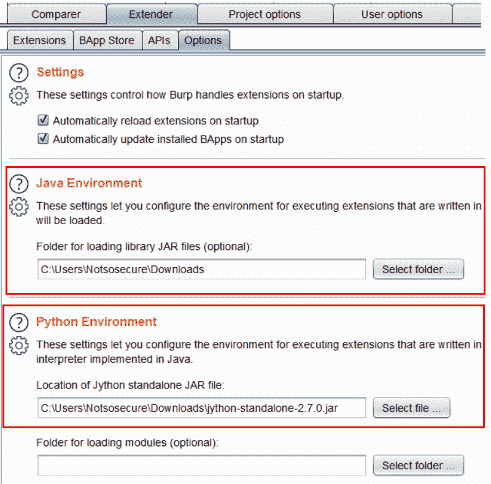

在 Extender 部分，转到**选项**页面，并提供下载的 Jython JAR 文件的路径。Jython JAR 可从[下载 http://www.jython.org/downloads.html ...](http://www.jython.org/downloads.html)

# 项目选择

项目选项与用户选项类似，但此选项卡仍特定于已启动的特定项目。它包含以下子选项卡：

*   **连接件**
*   **HTTP**
*   **SSl**
*   **课时**
*   **杂项**

**连接**选项卡包含以下项目的列表：

*   **平台认证**
*   **上游代理服务器**
*   **袜子代理**
*   ****超时****
*   **主机名解析**
*   ****超出范围请求****

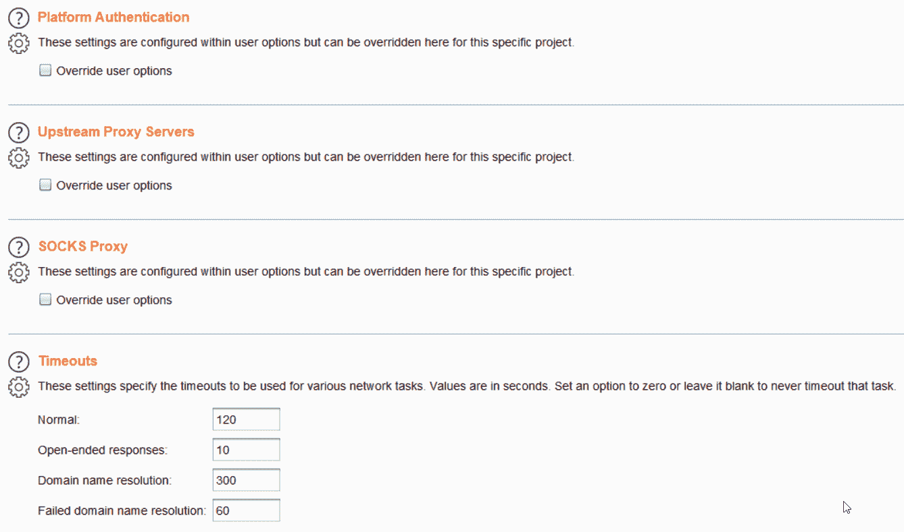

**平台认证**：**平台认证**包括通常在用户访问应用程序之前出现的认证（例如 HTTP 认证、NTLMv1、NTLMv2 认证、摘要认证等）。因此，如果在**用户选项**选项卡中未进行配置，则可以在此处使用该设置。我们将在**用户选项**菜单中详细了解可用的不同选项。

**上游代理服务器**：假设在一个组织中，要访问一个特定的应用程序，需要配置一个代理。但是，由于我们将流量重定向到 Burp 作为代理，用户将如何通过组织代理将请求重定向到特定的应用程序？这就是上游代理服务器发挥作用的地方。上游代理服务器允许您为组织配置代理，以便将请求发送到驻留在代理后面的特定应用程序

**超时**：Burp 在执行测试时向应用程序发送了很多请求。但是，它如何理解请求是否完成，是否应该等到服务器响应时，或者如果存在服务器无法访问的条件，或者某个特定请求的响应不可用，该怎么办？所有可通过 Burp 进行测试的线程可能最终都被利用并处于等待状态。因此，超时功能，用户可以根据场景指定何时终止特定请求。正如我们在下面的屏幕截图中看到的，有四种不同类型的超时。正常、开放式响应、域名解析和失败的域名解析：

**主机名解析**：假设存在这样一种情况，即用户希望为托管在特定 IP 上的特定应用程序提供别名。通常 DNS 解析发生在主机文件或 DNS 服务器级别。Burp 还为用户提供了指定的功能，这样用户可以说在此配置中`127.0.0.1`解析为 pentest，当用户输入`http://pentest/`时，将显示本地主机内容。这种配置可以在**主机名解析**页面进行。

**超出范围的请求**：Burp 提供了一个功能，可以防止任何超出范围的请求由 Burp 发出。提供的两个功能是删除所有范围外请求或使用在**目标**选项卡中定义的范围。

**项目**选项下一个子页签为**HTTP**。如果尚未在“用户选项”部分中配置，则包含与 HTTP 相关的所有设置。**HTTP**选项卡如下所示：

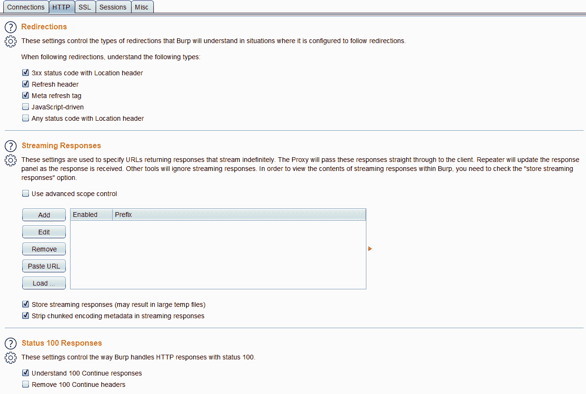

**HTTP**页签包含以下三种设置：

*   **重定向**
*   **流式响应**
*   **状态 100 请求**

在 TB1 中，这些设置允许 BRP 所考虑的重定向的类型并相应地进行处理。

**流式响应**：这些设置用于指定返回无限流式响应的 URL。Burp 要做的是将这些响应直接传递给客户。

**状态 100 响应**：通过此设置，用户可以控制 Burp 处理状态为 100 的 HTTP 响应的方式。用户可以选择理解 100 个响应，或者删除 100 个 continue 头。

下一个选项卡是**SSL**选项卡。在此，如果尚未在**用户选项**选项卡中配置，则可以设置特定项目的所有 SSL 相关配置，例如：

以下三个选项可用：

*   **SSL 协商**
*   **客户端 SSL 证书**
*   **服务器 SSL 证书**

**SSL 协商**：用户经常会因为**SSL 协商**错误而无法看到应用程序。在这里，用户可以通过手动说出要使用的密码来指定要进行的特定协商。如果单击“使用自定义协议和密码”，用户将获得所有可用密码的列表，然后可以取消选择导致错误的密码，然后访问应用程序，如以下屏幕截图所示：

如果它仍然不起作用，那么也有解决方案选项可用。用户可以选择在协商失败时自动选择兼容的 SSL 参数，或允许重新协商使用情况，甚至禁用 SSL 会话

**客户端 SSL 证书**：有时应用程序需要特定的证书，否则不会呈现应用程序的内容。这些证书也称为客户端 SSL 证书。Burp 提供了一种功能，用户可以在其中添加客户端证书，以便在主机请求时将其发送到主机。**客户端 SSL 证书**选项卡如下所示：

**服务器 SSL 证书**：此面板显示从 web 服务器接收的唯一 SSL 证书列表。可以双击该项目以查看整个证书。

接下来是**会话**选项卡，它处理该特定项目的所有会话相关信息。**会话**选项卡中有三种不同的设置，如下所示：

*   **会话处理规则**
*   **饼干罐**
*   **宏**

**会话处理规则**：会话规则允许用户让 Burp 对每个 HTTP 请求执行某些任务。每个规则都有一个定义的范围，只要用户点击**会话处理规则**设置的**添加**按钮，就可以使用定义。可以执行许多操作，例如添加会话 cookie、登录到应用程序、检查会话有效性等等。以下屏幕截图显示了会话处理规则中可用的定义：

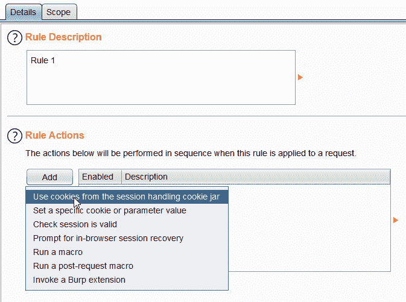

**饼干罐**：Burp 将网站发布的所有饼干存储在一个饼干罐中。会话处理规则利用这些 cookie，甚至更新它们以维护与应用程序的有效会话。在这里，测试人员可以选择所有 cookie 应该被获取和维护的位置，即**代理**、**扫描仪**、**中继器**、**入侵者**、**定序器**和**扩展器**。

**宏**：简单来说，宏就像一组包含多个请求的序列。它们可以用于会话处理或执行诸如获取反 CSRF 令牌之类的操作。我们将在讨论 Burp 及其宏时更详细地了解这一点。

下一个选项卡是**杂项**选项卡，其中包含特定项目设置的所有杂项设置。以下屏幕截图显示了**杂项**选项卡：

**杂项**中有以下三个主要设置：

*   **预定任务**
*   **打嗝协作服务器**
*   **测井**

**计划任务**：在计划任务部分，用户可以指定主要与执行方案相关的具体活动。用户可以选择在特定时间暂停或恢复执行，以确保时间限制。设置如以下屏幕截图所示：

**Burp Collaborator Server**：Burp Collaborator 是一种外部服务，用于获取带外类型的漏洞。Burp 有一个默认的 collaborator 服务器，但如果用户需要，他可以使用此设置配置自己的 collaborator 服务器，并可以使用**运行状况检查**选项了解其是否已正确配置。当我们讨论带外注射**攻击时，我们将更详细地了解打嗝合作者。**

**日志记录**：简单明了。此设置允许用户控制 HTTP 请求的日志记录。用户可以选择需要记录部分工具的请求和响应

这包括**项目****选项**部分。在扫描过程中，大多数情况下，除非需要特殊配置，否则不会更改这些设置，因此最好了解所有这些设置，以便更好地了解在出现场景时该怎么做。让我们转到下一个选项卡，**用户选项**选项卡。

# 用户选项

**用户选项**选项卡包含用户可以配置的所有设置，以便每次启动时默认运行打嗝。大部分设置与**项目****选项**中的设置相似；唯一的区别是，这是每次运行 Burp 时的永久配置，而**项目选项**仅在项目有特殊要求时配置。

**用户选项**中有以下四个选项卡：

*   **连接件**
*   **SSL**
*   **显示**
*   **杂项**

让我们看看下面的屏幕截图，看看**连接**选项卡的可用设置：

**连接**选项卡具有以下一组选项：

*   **平台认证。。。**

# 侦察和文件发现

在本模块中，我们将了解如何通过 Burp 检测应用程序中的文件和文件夹。此阶段很重要，因为它有助于映射整个站点结构，因为可能有某些文件夹无法通过站点超链接使用，但有时在应用程序上可用。通常情况下，人们最终会发现 web 应用程序中托管的许多敏感文件夹和文件都在范围内。检测此类文件和文件夹的能力完全取决于可用单词列表的强度。让我们继续，看看如何使用 Burp Suite 实现这一点。

# 使用 Burp 进行内容和文件发现

对于本模块，我们将使用**OWASP BWA**并查找可用应用程序集中的所有文件和文件夹。我们将了解如何通过 Burp 配置和设置必要的参数以执行内容发现

启动 OWASP BWA VM 并记下 IP 地址，在浏览器中访问应用程序，然后在 Burp Suite 中查看站点地图。它应该是这样的：

继续，右键单击 URL 地址，然后选择“参与工具”，然后单击“发现内容”。它将向您显示不同的参数集，您可以指定这些参数来开始自动。。。

# 总结

作为一个快速总结，我们已经看到了应用程序 pentest 的不同阶段，现在我们将开始研究不同的漏洞，以及如何使用 Burp 来发现这些漏洞。除此之外，我们还看到了 Burp 中可用的不同功能，以及用户可以轻松使用代理拦截的配置

在下一章中，我们将规划应用程序渗透测试的方法