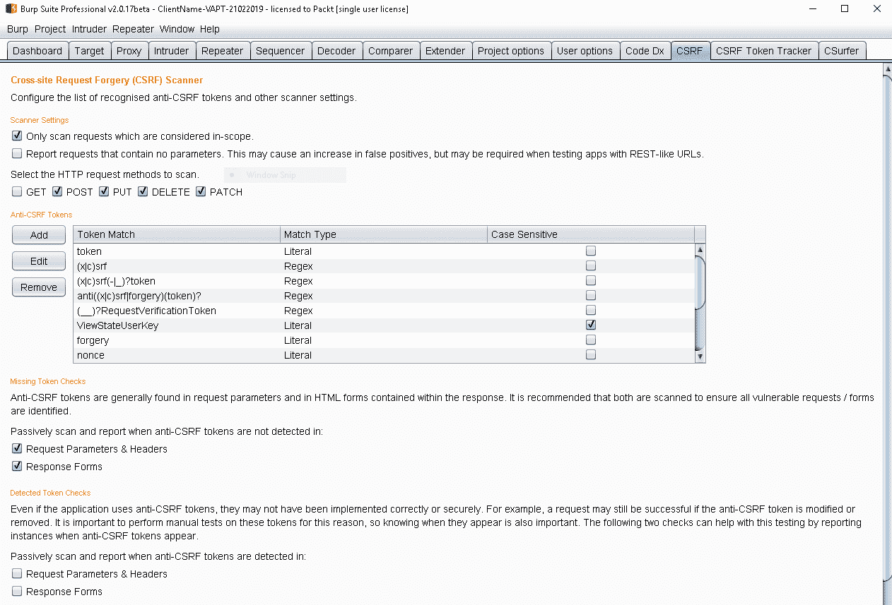
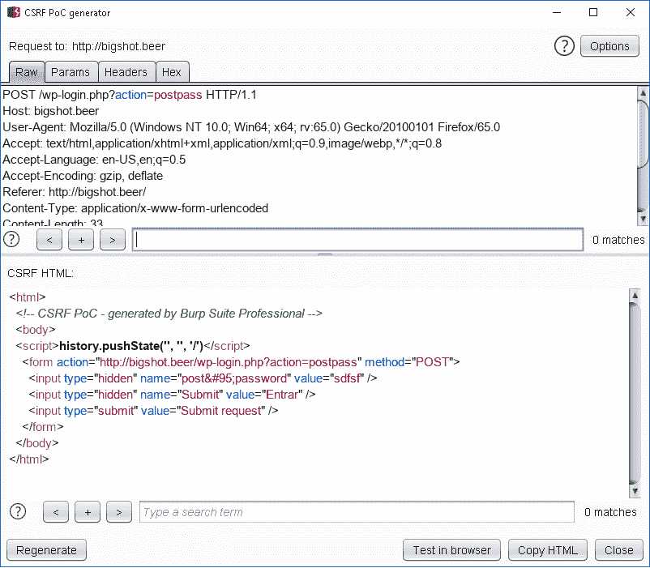
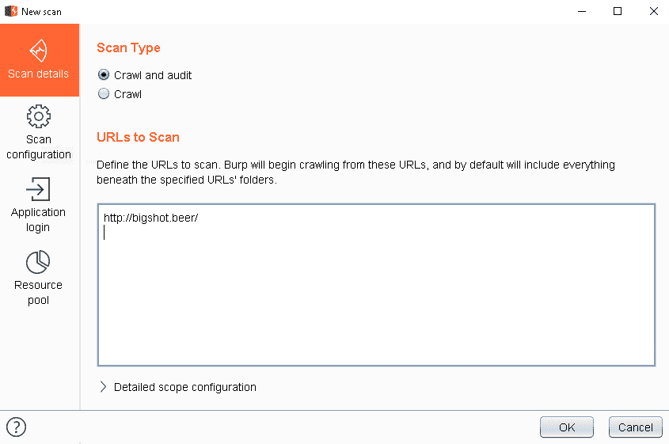
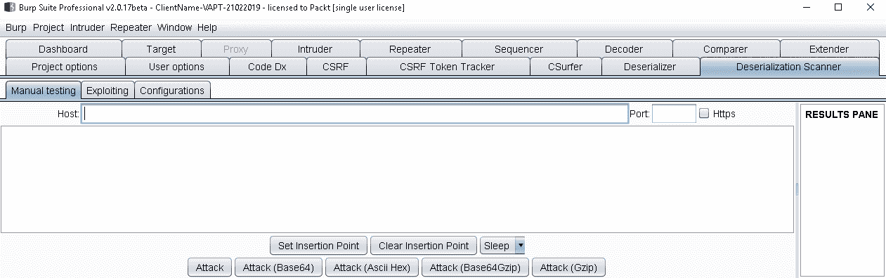
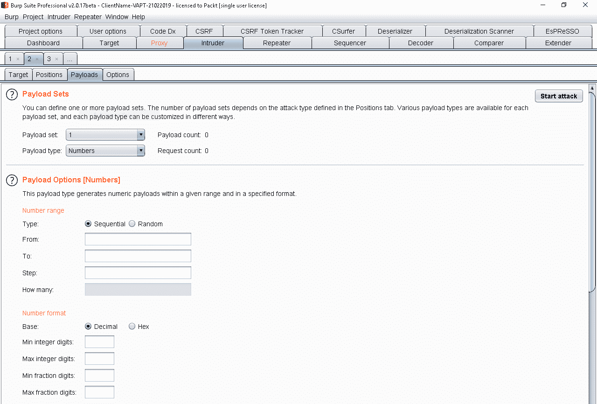
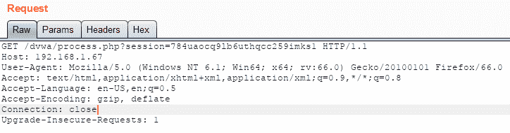
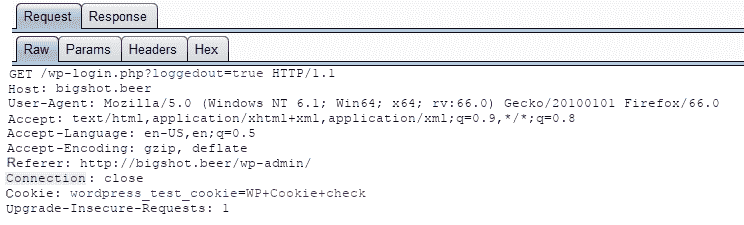

# 七、使用 BurpSuite 检测漏洞

正如我们在上一章中所看到的，BurpSuite对于识别不同类型的漏洞非常有用。在前一章中，大多数是使用入侵者工具检测到的输入验证错误。在本章中，我们将检查与输入验证缺陷无关的错误。

本章将介绍以下主题：

*   检测 CSRF
*   检测不安全的直接对象引用
*   检测安全错误配置
*   检测不安全的反序列化
*   检测 OAuth 相关问题
*   检测破坏的认证

# 检测 CSRF

**跨站点请求伪造**（**CSRF**是一个漏洞，允许恶意用户使用存储在其他应用中的信息在应用中进行操作。例如，假设您只使用一个网络（社交网络）登录到不同的应用。如果您向其他站点发送请求，它们将应用更改或操作，因为它们正在使用您提供给**中央**应用的信息。

因此，恶意用户可以通过创建假表单或假 URL 来攻击应用，从而在该应用中执行操作。这迫使用户在不知情的情况下执行应用。例如，看看这段 HTML 代码，它有一个隐藏到``标记的链接：

```
 
```

一开始，您觉得它没有什么不同，它只是一个无害的 HTML 标记。但是，当对其进行解析时，浏览器会获取标记所指向的资源并执行 URL。因此，如果恶意用户在该标记中隐藏包含操作（如更改密码）的 URL，则会执行该操作。

# 利用 BurpSuite检测 CSRF

为了检测 CSRF 漏洞，您需要做的第一件事是映射所有可能的授权操作。这是因为您需要测试每个操作，以发现是否可以使用存储的信息执行其中任何操作。要映射所有这些操作，可以使用目标工具。

Burp Suite 使用不同类型的方法映射应用。Burp Suite 可以手动地以被动方式收集所有请求、资源和 URL；但当然，它仅限于用户的范围。Burp Suite 还可以使用爬行和爬行技术制作自动地图。

在下面的屏幕截图中，您可以看到 Burp Suite 如何创建包含所有操作的应用树。。。

# 使用 BurpSuite检测 CSRF 的步骤

当然，BurpSuite扫描仪能够检测 CSRF 缺陷，但可能使用参数信息调用函数。为了以最可靠的方式进行检测，我们将使用代理工具和一个名为 CSRF scanner 的扩展。

1.  要安装 CSRF 扫描仪，请转到 Burp Suite 中的 Extender 选项卡，查看 CSRF 扫描仪的 BApp 存储，然后单击 install，如下所示：


2.  安装完成后，Burp Suite 中将出现一个新选项卡，显示该工具，如下所示：



3.  要检测 CSRF，请输入我们认为易受攻击的应用，并使用 intercept is on 按钮拦截请求。请记住，对于所有 CSRF 漏洞，您需要登录或建立会话。右键单击交战工具，然后生成 CSRF PoC。将打开一个新窗口，使用请求中公开的数据生成 HTML 表单，如下所示：



4.  验证表单中是否包含所有参数，然后将其复制到记事本或其他文本编辑器中，并将其另存为 HTML 文件。然后在 web 浏览器中打开它。您将看到一个只有一个按钮的空白网站，如下所示：


5.  点击提交请求，表格将发送至网站。由于这是一个**概念证明**（**PoC**），因此页面故意为空白，但如果需要创建更真实的页面，只需将表单添加到页面中即可。如果执行了这些操作，则 URL 容易受到 CSRF 的影响。

最后一个技巧是，如果您看到应用正在使用反 CSRF 令牌，请尝试检测该漏洞，因为有时开发人员忘记在所有功能中使用该令牌，因此可能会找到易受攻击的人。

# 检测不安全的直接对象引用

当参数获得对特定资源的访问权限时，会出现一个不安全的直接对象引用（**IDOR**漏洞。通过修改此参数，可以访问未经此用户授权的其他资源。通常，受影响的参数用作应用流的控制，例如，命名为`id`、`uid`、`r`、`url`、`ur`等。

使用 BurpSuite中的`Target`工具可以检测到这些类型的漏洞。与 CSRF 检测类似，检测到的 URL 越多，发现漏洞的可能性就越大：

1.  要将目标添加到范围，请转到 Burp Suite，并使用鼠标的第二个按钮，单击添加到范围选项。
2.  然后去。。。

# 检测安全错误配置

安全配置错误是相对的。在这一类中，引入了许多可能的错误，使用 Burp Suite 检测这些错误的最简单和准确的方法是通过扫描仪。

1.  打开 Burp Suite，当主仪表板显示时，单击 New scan（新扫描）。在这里可以定义要扫描的 URL 以及一些选项，如登录应用的凭据，如以下屏幕截图所示：



2.  这些测试是按类别分类的。扫描完成后，我们可以看到检测到一些与安全配置错误相关的问题，如以下屏幕截图所示：


正如我们所看到的，存在一些问题，如未加密的通信或清晰的提交密码，我们无法通过分析请求来检测这些问题，但扫描仪会标记出一个问题。

让我们回顾一些常见的安全性错误配置，我们将在下面的部分中详细研究这些错误配置。

# 未加密通信和明文协议

在大多数情况下，开发人员和系统管理员没有考虑到一个常见问题；这是使用未受保护的通信信道。有一些协议以明文形式发送信息，如果恶意用户截获网络中的流量（这相对容易），您可以看到所有信息，而不管这些信息是否敏感。这个问题通常被丢弃，因为 web 应用是公共的；但请记住，其中一些是内部的，也可以从公共网络访问。

# 默认凭据

可用于完全控制承载应用的服务器的另一个重要问题是默认凭据。有许多 web 服务器、邮件服务器、数据库服务器、CMS、电子商务工具等，它们在安装时都建立了默认密码。恶意用户很容易访问这些服务和应用。

# 无人值守安装

有时，当系统管理员安装软件时，该软件会与其他软件包一起提供，用于测试目的，或者只是作为主软件的一部分。如果可能的话，为了不允许访问或删除，必须有这些安装的清单。恶意用户可以发现这些无人参与的安装并利用其漏洞进行攻击。

# 测试信息

某些应用和软件包具有测试信息，如果恶意用户处于活动状态，这些信息可能会提供对其的访问。例如，一种常见的情况是 Oracle DBMS，它有一个数据库，其中包含用于测试目的的表，数据库管理员名为`tiger`，其密码为`scott`。

# 默认页面

应用（主要是 web 服务器）具有默认页面，恶意用户可以检测到这些页面并将其视为横幅抓取

尽管 Burp Suite 扫描器在检测此类问题时很有用，但我建议使用一种侧重于基础设施的漏洞扫描器，例如 Nessus、Qualys、前哨 24、OpenVAS 等。

# 检测不安全的反序列化

**反序列化**是将某种类型的数据传递给应用管理的其他数据的过程，例如，传递 JSON 格式的请求，该请求由应用解析并作为 XML 进行管理。此外，在涉及开发中使用的技术时，还存在反序列化漏洞。这些漏洞将特定类型的资源传递给二进制对象。

要了解该漏洞，请查看 CVE.2011-2092 中发布的下一段代码：

```
[RemoteClass(alias="javax.swing.JFrame")] 
public class JFrame { 
   public var title:String = "Gotcha!"; 
   public var defaultCloseOperation:int = 3; 
   public var visible:Boolean = true; 
} 
```

此代码是名为**JFrame**的数据类型的类定义。在下一段代码中，我们可以看到它是如何使用的：

```
InputStream is = request.getInputStream(); 
ObjectInputStream ois = new ObjectInputStream(is); 
AcmeObject acme = (AcmeObject)ois.readObject(); 
```

问题在于，任何类型的数据都可以输入到属性中，因为它们没有验证，如以下代码行所示：

```
Set root = new HashSet(); 
Set s1 = root; 
Set s2 = new HashSet(); 
for (int i = 0; i < 100; i++) { 
  Set t1 = new HashSet(); 
  Set t2 = new HashSet(); 
  t1.add("foo"); // make it not equal to t2 
  s1.add(t1); 
  s1.add(t2); 
  s2.add(t1); 
  s2.add(t2); 
  s1 = t1; 
  s2 = t2; 
} 
```

该漏洞源于拒绝服务，因此应用无法管理输入。这是一个不安全的反序列化漏洞。

# Java 反序列化扫描器

Java 反序列化扫描程序是一个 BurpSuite扩展，用于检测以下方面的问题：

*   Apache 通用集合 3 和 4
*   春天
*   Java 6、7 和 8
*   冬眠
*   JSON
*   罗马
*   小海狸

1.  要获得该软件包，请转到`Extender`工具，单击 BApp Store，然后安装该软件包。安装完成后，Burp Suite 将在界面中显示一个新选项卡，该选项卡将显示工具，如下所示：



2.  单击配置选项卡，在下面我们可以看到插件中激活的扫描：


3.  现在，要测试一个。。。

# 检测 OAuth 相关问题

OAuth 是一种开放标准，它允许通过在不同的应用之间共享授权信息而在应用中进行授权，而无需共享用户的标识。这是 Facebook、Google、Twitter、Plurk 等当前使用的标准。

与 OAuth 相关的最常见问题如下：

*   **不安全的存储秘密**：OAuth 是存储在客户端的信息。如果应用没有以正确的方式存储 OAuth 信息，则会公开对多个应用的访问。
*   **缺乏机密性**：OAuth 是一种与多个应用共享认证信息的协议，但是，如果与错误的应用共享，会发生什么情况？嗯，它可以被其他应用重用以窃取用户的访问权限。
*   **URL 重定向**：如果应用存在允许重定向的漏洞，恶意用户可以窃取 OAuth 信息。

# 检测 SSO 协议

BApp 存储中有一个名为**EsPReSSO**的扩展名**，用于检测应用使用的 SSO 协议并进行分类。检测到的协议如下：**

 ***   OpenID
*   布朗塞利德
*   萨米尔
*   非统组织
*   OpenID 连接
*   联外通
*   微软账户

安装 EsPReSSO 后，当 Burp Suite 检测到 SSO 协议的使用时，它将被标记，您可以单击它将其发送到 EsPReSSO 工具，以分析它是哪种协议，如以下屏幕截图所示：


# 使用 BurpSuite检测 OAuth 问题

与 OAuth 相关的问题非常不同，我们将在下面的部分中分析其中的一些问题。

# 重定向

打开 Burp Suite，并使用代理工具检测应用中可能的重定向。例如，假设您有一个可以使用社交网络访问的应用。此应用具有以下 URL：

```
www.site.tv 
```

拦截请求，并将标头中的 URL 修改为以下内容：

```
attacker.com/www.site.tv 
```

社交网络只是验证字符串[site.tv](http://site.tv)，并信任该应用。这是一个漏洞。

# 不安全存储

BurpSuite可以检测敏感信息是否由不受信任的通道发送；如果 OAuth 令牌是通过明文协议或未加密的通道发送的，那么它可以被拦截和重用。

OAuth 问题是非常具体的，但是，考虑到前面提到的问题，可以检测出弱点。

# 检测破坏的认证

断开的认证是一组影响应用的问题。以下列出了其中一些：

*   凭据的存储能力弱
*   可预测的登录凭据
*   URL 中公开的会话 ID
*   易受会话固定攻击的会话 ID
*   错误的超时执行

*   注销后不会破坏会话
*   由不受保护的通道发送的敏感信息

我们将解释如何使用 Burp Suite 检测这些问题。

# 检测凭据的弱存储

认证信息存在较大问题；它不仅存储在服务器端，还需要存储在客户端，可能不是以用户和密码的形式，而是以令牌、会话 ID 或应用用于跟踪用户和提供访问的其他内容的形式。

使用 BurpSuite，可以分析这些信息存储的位置。例如，在 Cookie 中存储信息非常常见，如以下屏幕截图所示：


这是基本认证的一个示例，它是内部应用的常见认证方法。此方法存在一个大问题，即它将 base64 格式的凭据存储到标头中，因此任何有权访问标头的人都可以获取密码，并将其解码为纯文本。

这不是唯一的问题；有些应用直接存储凭据。例如，请查看以下请求：

```
POST /userinfo.php HTTP/1.1 
Host: testphp.vulnweb.com 
User-Agent: Mozilla/5.0 (Windows NT 6.1; Win64; x64; rv:66.0) Gecko/20100101 Firefox/66.0 
Accept: text/html,application/xhtml+xml,application/xml;q=0.9,*/*;q=0.8 
Accept-Language: en-US,en;q=0.5 
Accept-Encoding: gzip, deflate 
Referer: http://testphp.vulnweb.com/login.php 
Content-Type: application/x-www-form-urlencoded 
Content-Length: 20 
Connection: close 
Cookie: admin:admin 
Upgrade-Insecure-Requests: 1 

id=1 
```

在这里，我们可以看到客户端发出的每个请求中直接发送到应用的凭据。

还有其他安全的地方可以保存凭据。例如，在移动应用的情况下，通常使用应用读取的内部或外部设备存储器中的文件。

诀窍是使用代理工具了解应用中的流程，以确定应用如何接收凭据以及工具对凭据的处理方式、使用的方法、凭据的存储位置、是否重用以及用户使用的令牌或跟踪 ID 的类型。

# 检测可预测的登录凭据

一些应用使用可预测的登录，这意味着恶意用户可能猜测下一个或上一个注册的用户名。例如，假设一家网上银行使用账号作为其应用的用户名；恶意用户可以创建一个可能的帐号列表，这些帐号大多按顺序猜测用户名。

检测此类漏洞的一个很好的工具是入侵者，它位于有效负载部分，可以选择创建顺序列表，如以下屏幕截图所示：



此外，还可以创建连续日期，甚至还有。。。

# URL 中公开的会话 ID

这不是一个很常见的问题，但在过去，有很多应用在 URL 中添加会话 ID。例如，请查看以下屏幕截图：



一旦检测到用于存储会话 ID 的变量，就可以应用筛选器来检测 URL 中的所有会话。

请看下一个屏幕截图。在这里，扫描仪检测到一个令牌，Burp Suite 列出了所有暴露的令牌：


# 易受会话固定攻击的会话 ID

当应用仅使用一个 ID 跟踪会话时，主要问题是该 ID 可用于窃取会话。例如，如果使用 Burp Suite 代理工具，则可以拦截发送会话 ID 的请求。此会话 ID 仅为一个用户创建。例如，请参阅以下请求：

```
GET /login.php HTTP/1.1 
Host: 192.168.1.67 
User-Agent: Mozilla/5.0 (Windows NT 6.1; Win64; x64; rv:66.0) Gecko/20100101 Firefox/66.0 
Accept: text/html,application/xhtml+xml,application/xml;q=0.9,*/*;q=0.8 
Accept-Language: en-US,en;q=0.5 
Accept-Encoding: gzip, deflate 
Connection: close 
Cookie: HPSESSID=784uaocq9lb6uthqcc259imks1 
Upgrade-Insecure-Requests: 1 
```

现在，使用另一个。。。

# 超时执行

要检测这个问题，您不需要使用像 Burp Suite 这样的工具；只需打开应用，登录，然后等待了解自动关闭会话所需的时间。像在线银行这样的应用需要由合规部在确定的时间内关闭会话。

一段时间后结束会议是个好主意；在用户窃取会话的情况下，它可以减少对应用的影响。

# 注销后不会破坏会话

要检查应用是否正确关闭会话，请使用 Burp Suite 打开应用，然后使用有效凭据登录应用：

1.  从下面的屏幕截图中可以看到，应用创建了一个用作来宾用户的会话：


2.  现在，访问该应用，您将看到该应用现在以登录用户的身份创建一个新会话。
3.  结束会议，如下所示：



4.  如果应用正确地销毁了会话，则无法重新发送请求。去。。。

# 总结

在本章中，我们回顾了如何检测特定漏洞。在前一章中，所解释的漏洞是通过检测模式检测出来的，在这种情况下，漏洞需要更多地了解应用的流程。

本章中解释的缺陷可用于获取敏感信息，破坏授权和认证，并成为更大妥协的一部分。在下一章中，我们将使用 Burp 工具和扩展来利用不同类型的漏洞。**