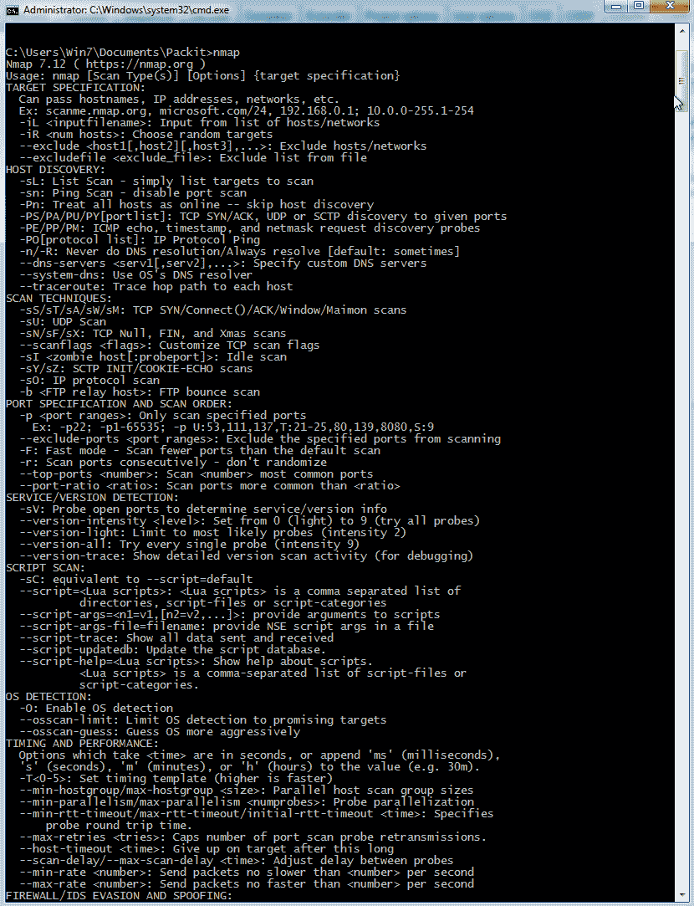
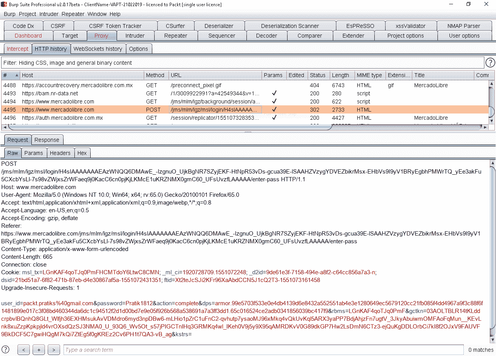
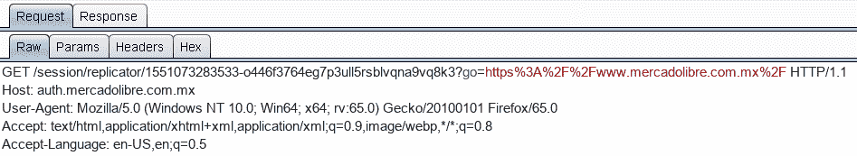
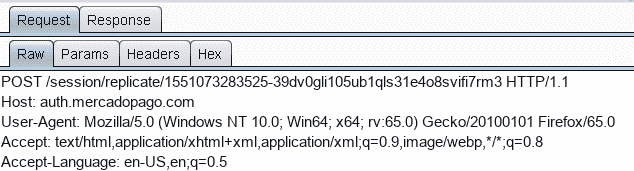

# 十一、破解大型在线零售商的认证

在前几章中，我们回顾了如何检测多种类型的漏洞，以及如何利用这些漏洞。我们还回顾了如何使用各种各样的扩展，以及如何开发我们的扩展。在本章中，我们将重述前几章中的所有概念，以评估生产中的应用并尝试打破其认证。

我们将在本章中介绍以下主题：

*   记住认证
*   大型在线零售商
*   进行信息收集

# 记住认证

正如您在[第 7 章](07.html)中所记得的，*使用 BurpSuite*检测漏洞，影响认证控制的问题如下：

*   凭据的存储能力弱
*   可预测的登录凭据
*   URL 中公开的会话 ID
*   易受会话固定攻击的会话 ID
*   错误的超时执行
*   注销后不会破坏会话
*   通过不受保护的通道发送的敏感信息

现在，使用 BurpSuite，我们将分析所有这些。

# 大型在线零售商

网上零售商的名单非常庞大，但以下是更受欢迎的零售商的名单：

*   易趣（所有区域变体）
*   自由市场
*   亚马逊

我们将以其中一个为例进行分析。请记住，本章中使用的所有信息都是公开的；我们不会披露这些应用上的任何公共或私人漏洞，解释不会影响应用的功能。

# 进行信息收集

我们将开始收集有关目标的信息。检测特定应用中使用的技术信息并确定潜在安全问题的最基本方法是首先浏览整个应用，使用正常流程，检测并记录应用中的每个入口点，并将我们感兴趣的不同 URL 添加到**范围**目标**工具中的**选项。

# 端口扫描

在实际评估中，审查应用的个人或公司与应用的所有者之间建立了协议。这是检测服务的第一步。

此任务通常使用 Nmap（[执行 https://nmap.org/](https://nmap.org/) ），这是一个命令行工具，用于检测远程主机上运行的端口和服务。使用 Nmap 并不复杂；您只需在命令行中键入`nmap`即可查看我们所有的不同选项，如以下屏幕截图所示：



要对主机执行标准扫描，可以使用以下命令：

```
nmap -vv -sV -O -Pn -p0-65535 -oA nmap_[IP] ...
```

# 认证方法分析

您应该逐个问题分析应用，以确定其是否易受攻击，如以下部分所述。

# 凭据的存储能力弱

应用以加密方式存储会话 ID，因此不易被提取。此外，会话 ID 与多个令牌组合在一起，并且 cookie 受到保护，不会被提取，如以下屏幕截图所示：


# 发现盲 SQL 注入

我们将要分析的 URL 是[www.dhl.com](http://www.dhl.com)。这是国际页面，但如果你可视化区域网站，它们是相似的，因此其中一个网站中的漏洞可能会复制其他网站。这发生在许多在不同国家开展业务的公司身上。实际上，有时公司在不同的国家有不同的代表，但 web 应用是相同的。

为了确定[dhl.com](http://dhl.com)是否有 SQL 注入，我们将进行三种不同的分析：

*   自动扫描
*   SQLMap 检测
*   入侵者检测

# 可预测的登录凭据

用户使用用户名或电子邮件进入应用，因此凭据是不可预测的。

# URL 中公开的会话 ID

回顾历史记录工具，我们可以看到 URL 中公开了一些令牌和会话，如下所示：



但是，应用并不只使用一个令牌，因此，仅使用其中一个令牌是没有用的。实际上，URL 中发送的令牌之一是请求跟踪器，如以下屏幕截图所示：







结论是，尽管 URL 中存在公开的令牌，但它们是不可利用的。

# 易受会话固定攻击的会话 ID

1.  以正常方式在浏览器中打开用户会话。
2.  然后，为完全不同的用户打开另一个会话。
3.  现在，使用**代理**工具拦截一个请求，并修改用户信息以尝试访问第二个用户的信息，如下所示：


当您打开[时 https://www.mercadolibre.com.mx/](https://www.mercadolibre.com.mx/) web 页面，您注意到应用显示了第一个信息的用户。因此，它不易受到会话固定的影响。

# 注销后不会破坏会话

使用注销选项关闭会话，然后转到**历史记录**，查找用户登录时发出的请求。右键点击**发送至中继器**，在不修改任何值的情况下，点击**Go**重新发送请求，如下所示：


结果是在用户未登录的情况下显示应用。因此，应用不易受攻击。

由于我们使用了一个墨西哥网站进行认证，屏幕截图中的一些文本是西班牙语。

# 通过不受保护的通道发送的敏感信息

仅使用被动扫描，这意味着没有攻击性操作，Burp Suite 检测到用户可以强制应用在未受保护的通道中使用。这意味着用户可以强制使用 HTTP 协议并以明文形式发送信息，而不是使用 HTTPS 协议。恶意用户可能会利用该漏洞，结合其他缺陷窃取用户信息，如下例所示：


此缺陷已得到确认。

# 总结

在本章中，我们展示了一个实际应用的分析。执行的任务包括协议和服务检测、请求和后分析以及漏洞检测

在下一章中，我们将使用最受欢迎的航运公司之一 DHL 执行本章中讨论的相同活动。