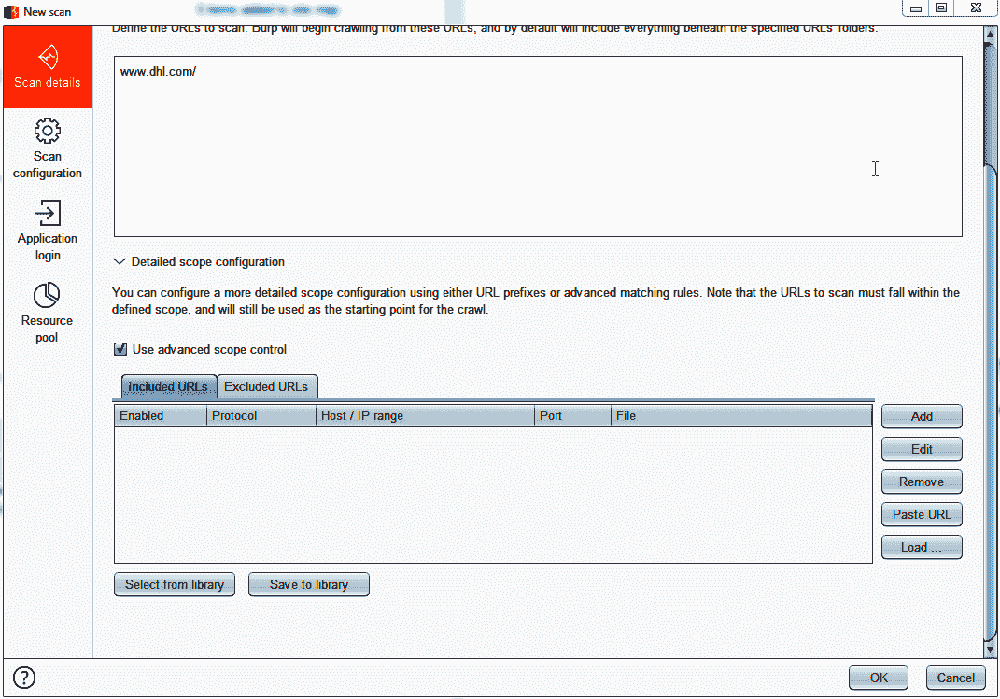

# 十二、利用和过滤大型航运公司的数据

所有的公司、企业和行业都使用技术，它们使用技术的方式也不同。对于有连续服务和高性能等优先级的零售商来说，这与在线银行应用不同，在线银行应用需要高度安全。当然，所有这些应用都有共同点，但由于不可能应用所有的控制，最重要的是确定实际需求的优先级。

在本章中，我们将讨论另一个场景，航运公司。我们将执行与过去示例中相同的活动，但这次使用的是最受欢迎的航运公司之一：DHL。

我们将报道。。。

# 自动扫描

检测 SQL 注入等漏洞的最简单方法是使用 Burp Suite 的扫描仪：

1.  要启动扫描，请打开 Burp Suite，转到主仪表板，然后单击新建扫描：


有一个我们以前没有探讨过的选项，用于在扫描期间控制范围。假设您的范围不全是 DHL 网站，只是[www.DHL.com](http://www.dhl.com)，但还有其他应用，如[mydhl.DHL.com](http://mydhl.dhl.com)和[intranet.DHL.com](http://intranet.dhl.com)等等。

2.  为了避免这种情况，Burp Suite 可以扫描这些其他应用；单击详细的范围配置。在这里，我们将看到两个名为 Include prefix options 和 Exclude prefix options 的选项卡。转到第二个选项卡，排除前缀选项，然后输入我们不想测试的应用，如下所示：


正如我们在前面的屏幕截图中所看到的，没有必要添加所有 URL。

3.  如果我们想对作用域更具选择性，我们可以选择一个 URL，通过单击“使用高级作用域控制”，我们可以在作用域中添加要测试或不要测试的每个 URL，如下所示：



Burp Suite 的扫描仪为我们提供了更多控制扫描的选项。

4.  点击扫描配置。在这里，您可以配置有关扫描仪如何执行应用发现以及如何执行安全测试的选项。

5.  单击 Add new，Burp Suite 将启动一个新窗口，可以在其中创建新规则，如下所示：


6.  在审计优化中，我们可以定义评估的速度。我建议选择低速度。这是为了避免入侵检测系统、负载平衡器以及其他可能阻塞扫描仪的安全和网络设备。如果您在 QA 环境中进行测试，您可以完全控制并直接访问应用服务器，而无需任何网络安全控制，那么您可以选择 Fast。

7.  下一节“报告的问题”用于选择扫描策略。默认情况下，Burp Suite 已按类别划分了可能的问题。但是，也可以按类型进行选择。例如，对于本练习，我们只选择 SQL 注入漏洞。它对于修复或验证 bug 非常有用，例如：


8.  在“测试期间处理应用错误”选项卡中，可以配置 Burp Suite 在检测错误时如何采取操作。这些选项可以帮助我们在必要时停止扫描。例如，目前，一些应用通常托管在云服务中。云服务非常擅长阻止扫描活动，因此，如果我们正在测试一个云托管的网站，经过几分钟的测试后，我们的 IP 地址可能会被阻止，Burp Suite 只会收到超时错误。我们可以在发生此类错误时停止扫描。
9.  在插入点类型中，可以定义插入测试字符串的位置。例如，您可以将测试仅限于 URL 参数、cookie 等。根据我的经验，最好尽可能测试所有的入口点。
10.  忽略插入点是一个有趣的选项，当我们想要限制应用产生的噪音或只是减少测试数量时，它可能会很有用。

您是否记得，在入侵者中，您可以选择要测试的参数？嗯，这是类似的。如果我们在变量中存储了跟踪令牌或会话 ID，那么测试它不是一个好主意，因此我们可以通过使用此选项跳出范围：


配置选项后，单击保存，然后单击确定以开始扫描。如果您认为这可能是一个应用策略，并且需要更多类型的应用，那么您可以将其保存为库并重新使用。扫描结果将显示在右侧部分。

# SQLMap 检测

现在，我们将使用 SQLMap 来检测和利用 DHL 站点中的 SQL 注入。

# 寻找入口点

DHL 应用如下所示：


我们可以直接看到要测试的不同输入，例如，搜索栏和跟踪框，但请查看以下请求：


在这个请求中，我们可以看到一些变量，但为了确定其中哪些可以用作注入点，我们需要分析它们的行为，如下所示：

*   `brand`：看起来该应用支持一些公司，所以可能“DHL”是目录的一部分，可能会受到注入的影响。
*   `AWB`：此变量是跟踪号，用于查找包裹的位置。很明显，这是一个很好的切入点。
*   `AWBS_crossrefpar1_taskcenter_taskcentertabs_item1229046233349_par_expandablelink_insideparsys_fasttrack`：它看起来也像一个 ID，所以可能是一个注射点。

减少要测试的点数很重要，因为在生产性应用中，测试越多，产生的噪音就越多。

# 使用 SQLMap

使用鼠标的第二个按钮，单击 Send to SQLMapper，如下所示：


要限制要测试的参数，请转到 Injection 选项卡并输入参数（用逗号分隔），然后单击 Run 按钮。

SQLMap 将被启动，如果这些参数中有任何一个易受攻击，SQLMap 将检测并利用注入。当 SQLMap 检测到您正在利用盲 SQL 注入时，它将要求您继续。只需按*Y*即可。

# 入侵者检测

使用手动请求检测 SQL 注入也是一种选择。我建议您在未成功检测漏洞的情况下审查应用时执行此操作。

首先，我们检测入口点，正如我们在上一节中回顾的那样。要检测与盲 SQL 注入相关的漏洞，可以使用以下测试字符串：

```
' waitfor delay '0:0:30'—
```

我们也可以在数据库管理系统中使用它的对应项。但我们为什么要这样做呢？您可能还记得，盲 SQL 注入最重要的特点是它们不会直接向用户返回错误或输出。因此，通过使用此字符串，我们等待看到响应中的延迟：

1.  为了覆盖更多参数，我们需要入侵者工具。对参数行为进行相同的分析，以确定哪个请求可能容易受到攻击，并使用鼠标的辅助按钮，按如下方式单击发送到入侵者：


2.  在入侵者中，为了进行快速测试，将延迟查询添加为唯一的有效负载，并将其启动到所有参数中，如下所示：


3.  回到“位置”选项卡，单击开始攻击。如果您认为已检测到可能的漏洞，请右键单击请求并选择“发送到中继器”。进入中继器后，修改测试字符串以添加更多延迟时间，如下所示：

```
' waitfor delay '0:0:10'—
' waitfor delay '0:0:20'—
' waitfor delay '0:0:30'—
' waitfor delay '0:0:40'—
' waitfor delay '0:0:50'—
' waitfor delay '0:0:59'—
```

这样做的目的是，如果漏洞确实存在，则确定何时使用接收响应的时间。

可以使用 BurpSuite协作器。在这些情况下使用它是一个很好的技巧，因为协作者是一个外部实体，作为接收者进行交互以发送数据库的输出，如以下屏幕截图所示：


# 剥削

检测到易受攻击的变量后，请在入侵者工具中使用通配符对其进行标记。

假设您想知道配送网站上包裹的跟踪编号。单击 Payloads 选项卡，选择 Number 选项作为有效负载类型。我们需要注入一系列数字，从 0000000000 到 99999999，从一到一，如下所示：


由于无法转储存储在数据库中的寄存器，我们将使用布尔值查找跟踪号。通过我们的入侵者攻击，使用正确的跟踪号码发送请求；应用将在中返回一个`True`值作为响应：

为了便于检测。。。

# 总结

在最后一章中，我们回顾了可用于评估应用的其他场景。在本章中，我们寻找 SQL 注入，并使用不同的方法开发其中一种注入。

对于应用安全评估，我建议避免手动利用方法，因为我们使用它们的时间会更少。当无法使用其他方法发现漏洞时，它们非常有用。

在本章中，您学习了如何分析请求中的参数行为，以推断哪些是易受攻击的，并减少分析时间。后来，我们研究了使用 BurpSuite的扫描仪、SQLMap 和入侵者工具检测盲目 SQL 注入漏洞。最后，我们学习了如何使用入侵者来利用盲 SQL 注入来猜测跟踪号。