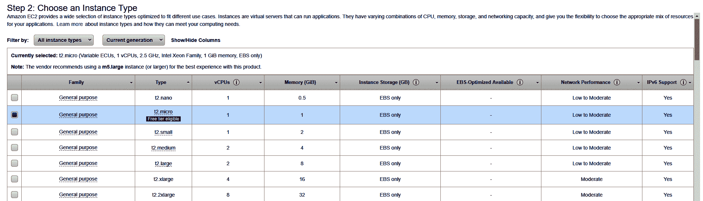
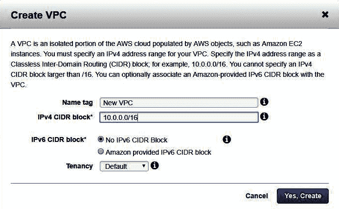
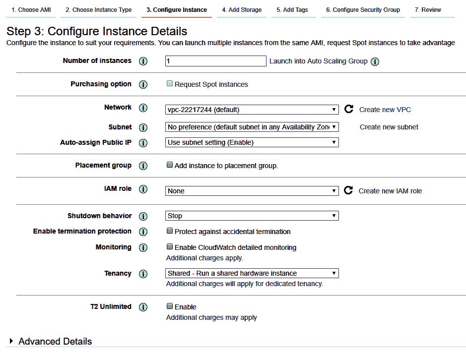
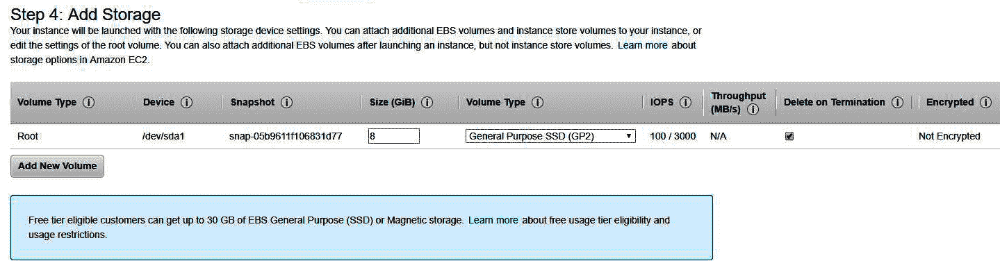
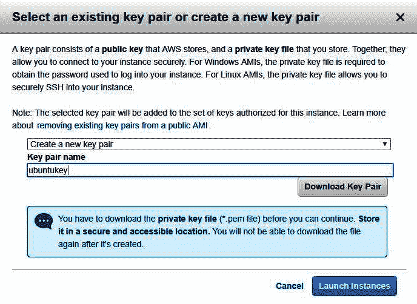
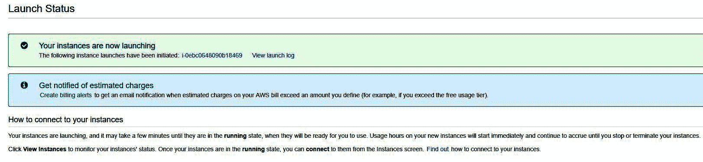
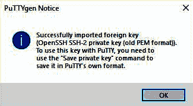
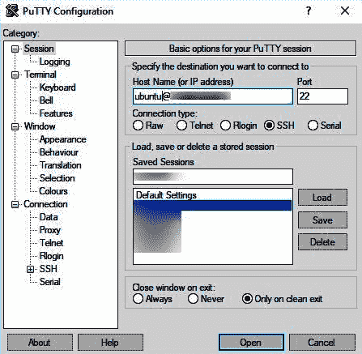
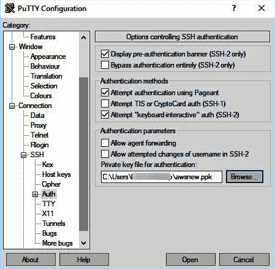

# 设置第一个 EC2 实例

AWS 最流行、最核心的组件是**弹性计算云**（**EC2**），EC2 通过虚拟机为开发者提供按需可扩展的计算基础设施。这意味着开发人员可以在选择的地理位置使用定制的规格启动虚拟机来运行其应用程序。

该服务是**弹性**，这意味着开发人员可以根据运营需要放大或缩小其基础设施，并且只按分钟支付活动服务器的费用。开发人员可以设置地理位置以减少延迟并实现高级别的冗余

本章重点介绍创建一个 Amazon EC2 实例，围绕该实例设置一个 VPC，并配置防火墙以限制对此 VPC 的远程访问

在本章中，我们将介绍以下主题：

*   如何使用可用的 AMI 运行安装程序自定义 EC2 实例
*   用于 EC2 实例的存储类型
*   防火墙和 VPC 配置
*   认证机制

# 技术要求

在本章中，我们将使用以下工具：

*   AWS EC2 实例
*   Ubuntu Linux AMI
*   SSH 客户端和浏览器

# 在 AWSEC2 上设置 Ubuntu

在本节中，我们将介绍如何在运行 Ubuntu AMI 的云上设置 EC2 实例，并查看我们可以根据需要定制的各种设置。

# Ubuntu AMI

正如我们在前面的章节中所看到的，设置 EC2 实例非常简单，只需点击几下鼠标即可快速完成。AWS Marketplace 有许多 AMI 可供部署。AWS Marketplace 还提供了一系列 AMI，这些 AMI 来自 SAP、Zend 和 Microsoft 等供应商，以及为任务关键型项目（如 DevOps 和 NAS）定制的开源 AMI：

1.  我们将首先在 AWS 市场上搜索 Ubuntu Linux AMI：


我们将使用撰写本文时最新的 Ubuntu AMI，Ubuntu 18.04 LTS-Bionic。

前面的屏幕截图显示了以下信息：

2.  在下一页中，我们选择 AMI 的实例类型：



选择实例类型

3.  AWS 为 Ubuntu 提供了一个名为 t2.micro 的免费层合格实例，该实例运行在 1 个 vCPU 和 1 GB 内存上，对于本教程来说已经足够了。确保已选择 t2.micro**并单击下一步。**

 **我们已经配置了 EC2 实例的 RAM 和 CPU。在下一节中，我们将了解如何配置其网络和专有网络设置。

# 配置专有网络设置

在上一节中，我们配置了 EC2 实例的 RAM 和 CPU。在本节中，我们将学习如何为 EC2 实例创建新的 VPC 和子网。

选择 t2.micro 作为实例类型后，将显示配置实例详细信息页面：


在本节中，我们将了解如何配置以下选项：

*   **实例数**：**这由读者决定要启动多少实例。在本章中，我们仅启动一个实例。**
***   **网络**：**我们来看看如何为我们的 EC2 资源创建一个新的 VPC。*****   **子网**：我们将考虑将 EC2 资源划分为专有网络内的不同子网。*   **自动分配公共 IP**：我们将启用此功能，以便从我们的机器上访问它。****

 ****让我们从创建 VPC 开始：

1.  单击“创建新专有网络”链接，我们将进入专有网络仪表板，在那里我们可以看到现有专有网络并创建新的专有网络：


2.  点击创建专有网络并将其命名为`New VPC`。

我们已经有了一个具有 IPv4 块`172.31.0.0/16`的 VPC 网络。让我们继续创建一个具有 IPv4 块`10.0.0.0/16`的新 VPC。如出现的对话框中所述，我们的 IPv4 CIDR 块大小只能介于`/16`和`/28`之间。

3.  点击 Yes，Create，您的 VPC 将在几秒钟内创建：



要在此 VPC 中启动 EC2 实例，我们必须创建一个子网。让我们转到子网部分，在新的 VPC 中创建一个子网。

4.  单击创建子网并为其命名为`New Subnet`。我们将选择我们创建的专有网络。选择`New VPC`后，VPC CIDR 块显示在显示屏上：


用户可以从提供的可用性区域中选择任何可用性区域。但是，我们将其保留为非首选项。

我们正在使用 IPv4 CIDR 块`10.0.1.0/24`创建子网，这意味着它将为我们提供从`10.0.1.1`到`10.0.1.254`的一系列 IP。但是，我们只有 251 个 IP 地址可以使用。这是因为`10.0.1.1`是为子网网关预留的，`10.0.1.2`是为 AWS DNS 预留的，`10.0.1.3`是为 AWS 将来的任何使用预留的

5.  完成后，我们选择我们的专有网络作为我们的新专有网络，并选择 subnet | new subnet。这是您的屏幕的外观：



6.让我们继续并添加存储：



如我们所见，每个 EC2 实例在启动时默认接收一个根存储设备。默认情况下，每个 EC2 实例都会获得一个默认的根存储。这是为了存放要启动的实例的操作系统文件。除此之外，如果需要，我们可以向 EC2 实例添加额外的存储。

# EC2 实例中使用的存储类型

Amazon 为 EC2 实例提供以下存储类型：

*   **弹性块存储（EBS）**：AWS 提供的高速存储卷。这些是 HDD 或 SSD 技术中提供的典型存储卷。这些是原始的、未格式化的，可以连接到任何 EC2 实例，就像在现实生活中安装硬盘一样。卷在使用前需要格式化。一旦设置好它们，就可以将它们连接、装载或卸载到任何 EC2 实例。这些卷速度快，最适合高速和频繁的数据写入和读取。这些卷可以设置为在 EC2 实例被销毁后保持。或者，您可以创建 EBS 卷的快照并从快照恢复数据。

*   **亚马逊 EC 实例库**：实例库存储卷物理连接到托管 EC2 实例的主机，用于临时存储数据。换句话说，一旦它所连接的 EC2 实例终止，实例存储卷也将丢失。

*   **亚马逊 EFS 文件系统**：**弹性文件系统**（**EFS**）只能与基于 Linux 的 EC2 实例一起使用，用于可扩展的文件存储。可扩展存储意味着文件系统可以根据用例进行大规模的扩展或收缩。在多个实例上运行的应用程序可以使用 EFS 作为其公共数据源，这意味着多个 EC2 实例可以同时使用 EFS。

*   **亚马逊 S3**：亚马逊 S3 是 AWS 的旗舰服务之一，用于在云上存储数据。它具有高度的可扩展性，使我们能够在任何时间存储和检索任意数量的数据。AmazonEC2 使用 AmazonS3 存储 EBS 快照和实例存储支持的 AMI。

默认情况下，我们的 EC2 实例有一个 8GB 的根卷。对于此活动，让我们向 EC2 实例添加一个额外的 EBS 卷：


我们可以看到，在 EBS 中，有五种不同的卷类型可用于不同的**每秒输入/输出操作**（**IOPS**）：

*   **通用 SSD（GP2）卷**：一种经济高效的存储解决方案，主要适用于各种工作负载的通用用途。此容量可在较长时间内维持 3000 IOPS，最低为 100 IOPS，最高为 10000 IOPS。GP2 卷提供了非常低的延迟级别，可以以每 GB 3 IOPS 的速度扩展。一个 GP2 卷可以分配 1 GB 到 16 TB 的空间。

*   **配置的 IOPS SSD（IO1）卷**：这些卷比 GP2 卷快得多，提供的性能也高得多。IO1 卷可以维持 100 到 32000 IOPS，是 GP2 的三倍多。这种类型的存储设计用于 I/O 密集型操作，如数据库。AWS 还允许您在创建 AWS 可以一致交付的 IO1 卷时指定 IOPS 速率。IO1 卷可以在最小 4 GB 到最大 16 TB 之间进行配置。

*   **吞吐量优化 HDD（ST1）**：ST1 是一种基于磁盘而非 SSD 的低成本存储解决方案。它们不能用作可引导卷，而是最适合存储频繁访问的数据，如日志处理和数据仓库。这些卷的范围只能从最小 1 GB 到最大 1 TB。

*   **冷硬盘（SC1）**：SC1 或冷硬盘卷虽然类似于 ST1 卷，但其设计并不用于保存频繁访问的数据。这些也是低成本的磁性存储卷，不能用作可引导卷。与 ST1 类似，这些卷的范围只能从最小 1 GB 到最大 1 TB。

在本教程中，我们将向机器添加额外的 40 GB EBS 卷通用 SSD（GP2）。不要忘记在终止时选中 Delete，否则在终止 EC2 实例后存储实例将继续存在。

我们不会在 EC2 实例中添加任何标记，所以让我们继续下一节，*安全组*。

# 配置防火墙设置

每个 EC2 实例都由其自己的虚拟防火墙（称为安全组）保护。这就像一个典型的防火墙，通过控制入站和出站流量来管理对 EC2 实例的访问。在设置 EC2 实例时，我们可以添加允许或拒绝关联 EC2 实例流量的规则。EC2 实例还可以分组到一个安全组中，这在一个防火墙规则需要应用于多个 EC2 实例时非常有用。修改规则后，更改将立即生效

默认情况下，运行 Linux AMI 映像的 EC2 实例具有远程访问所允许的 SSH 端口。对于 Windows 计算机，默认情况下允许 RDP：


正如我们所见，由于我们的 AMI 是一个 Ubuntu Linux 映像，AWS 已经自动配置了网络规则，只允许 SSH（端口 22）。让我们再添加一些允许 HTTP 和 HTTPS 的网络规则：


现在，我们都准备启动我们的 AMI。单击 Review and Launch，然后单击 Launch。

在下一节中，我们将介绍如何配置身份验证以访问 EC2 实例。

# 配置 EC2 身份验证

在 AWS 中，所有 AMI Linux 映像都配置为使用密钥对身份验证系统而不是密码对任何 SSH 会话进行身份验证。

在启动 EC2 实例之前，AWS 会提示我们配置 SSH 密钥对以便能够连接。我们可以创建自己的 SSH 密钥对，也可以使用现有的 SSH 密钥对：



1.  让我们创建一个新的密钥对，并将其命名为`ubuntukey`。
2.  然后，下载密钥对并启动实例。我们得到的密钥对文件是`ubuntukey.pem`。文件名将根据先前提供的密钥名进行更改。确保密钥文件安全存储。如果密钥丢失，AWS 将不会提供另一个密钥文件，您将无法再访问 EC2 实例。
3.  下载密钥文件后，AWS 会将您重定向到启动状态页面，让您知道您的 EC2 实例正在启动：



现在，我们可以转到 EC2 实例列表，找出已分配的公共 IP 地址。

现在，要连接到 AWS 机器，您可以从本地 Linux 机器进行连接：

*   调出终端并发出以下命令：

```
ssh -i <<keyname>>.pem ec2-user@<<your public ip>>
```

但是，从 Windows 本地计算机连接需要更多的工作：

1.  在本地机器上安装腻子。我们现在必须将`.pem`文件转换为`.ppk`文件，因为 PuTTY 只接受`.ppk`（PuTTY 私钥）。
2.  从“开始”菜单启动 PuTTYgen，然后单击“加载”。选择`All files`：


3.  现在，将 PuTTYgen 指向我们下载的`.pem`文件。PuTTYgen 将加载并转换您的文件：



4.  加载`.pem`文件后，单击保存私钥生成`.ppk`文件。PuTTY 会显示一条警告，并询问您是否要在不使用密码短语的情况下保存密钥。您可以选择`Yes`。
5.  为您的`.ppk`文件提供名称，然后单击保存。
6.  一旦我们将`.pem`文件转换成`.ppk`文件，我们就可以使用 PuTTY 连接到 EC2 实例。从“开始”菜单启动 PuTTY 开始。

7.  在主机名字段中，输入主机名`ubuntu@<<your public ip>>`。22 点离开港口：



8.  接下来，单击 SSH 旁边的+按钮。转到 Auth，在名为 Private key file for authentication 的字段旁边，单击 Browse。将 PuTTY 指向我们创建的`.ppk`文件：



9.  最后，单击 Open 以启动 SSH 会话：


由于这是您第一次登录实例，您将收到以下警报。

10.  单击 Yes 继续。您将通过 Ubuntu 实例的身份验证：


本章的练习到此结束。我们已经成功地创建了一台 EC2 机器，并学习了如何创建新的 VPC 和子网。我们还了解了 AWS 提供的不同类型的存储卷，并了解了如何为特定实例配置防火墙规则。最后，我们设置了身份验证并登录到我们的 Ubuntu 机器。

# 总结

本章向您介绍了如何设置 EC2 实例和配置设置 EC2 实例的所有细节，例如创建新的 VPC、在 VPC 内配置新的子网以及添加额外的存储。本章介绍了可用于 EC2 实例的不同类型的存储，如 EBS 和实例存储。此外，我们还了解了存储卷的类型及其适用范围。随后，我们学习了如何使用 EC2 实例的安全组配置防火墙规则。这就把我们带到了本章的结尾。

在下一章中，我们将学习如何对运行多个 EC2 实例的 AWS 环境执行实际渗透测试。此外，我们将学习如何使用 Metasploit 执行自动利用漏洞攻击，以及如何使用主机旋转在网络中执行横向移动。

# 进一步阅读

*   **存储**：[https://docs.aws.amazon.com/AWSEC2/latest/UserGuide/Storage.html](https://docs.aws.amazon.com/AWSEC2/latest/UserGuide/Storage.html)
*   **什么是亚马逊专有网络？**：[https://docs.aws.amazon.com/vpc/latest/userguide/what-is-amazon-vpc.html](https://docs.aws.amazon.com/vpc/latest/userguide/what-is-amazon-vpc.html)
*   **亚马逊 VPC 网络管理员指南**：[https://docs.aws.amazon.com/vpc/latest/adminguide/Welcome.html](https://docs.aws.amazon.com/vpc/latest/adminguide/Welcome.html)******