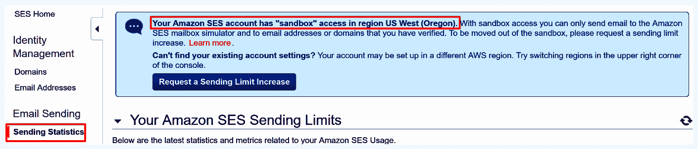
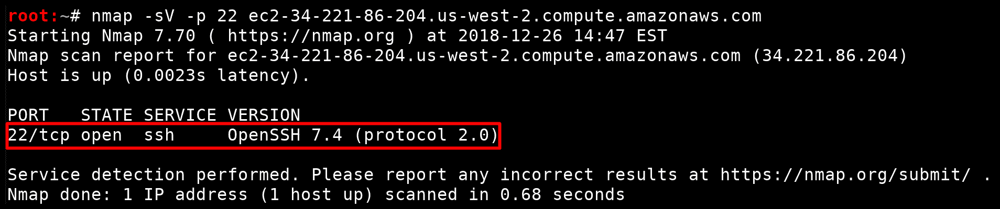
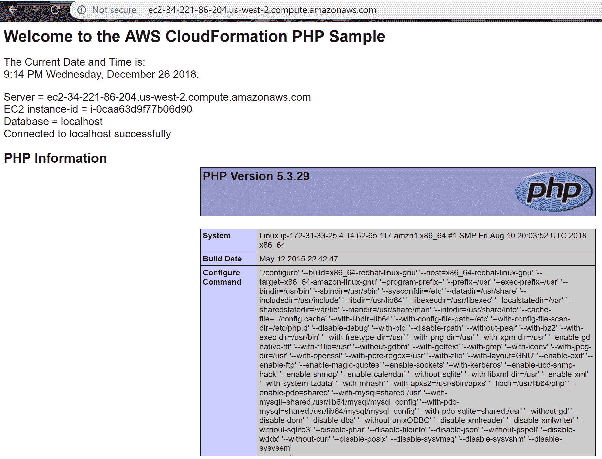
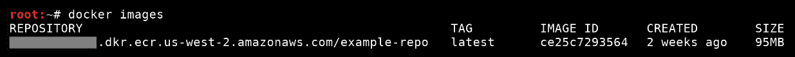

# 十四、针对其他服务

AWS 提供各种各样的服务，他们不断更新这些服务，同时发布新的服务。这本书中有太多的内容，不可能全部涵盖，但本章旨在介绍一些不太主流的服务，以及它们如何被滥用，以使我们作为攻击者受益。

重要的是要注意，每一个 AWS 服务在像攻击者一样看待它时都有可能受到某种形式的攻击，而且仅仅因为本书没有介绍它，并不意味着你不应该调查它。每个服务中都可能出现各种各样的安全问题，因此最好的做法是查看一个服务并确定它在现实世界中的使用方式，然后查找常见错误、不安全的默认值，或者只是为了让自己受益而遵循的坏做法。

我们将在本章中介绍的四种不同服务包括 Route 53，一种可扩展的 DNS/域管理服务；**简单电子邮件服务**（**SES**），一种托管电子邮件服务；CloudFormation，作为代码服务的基础设施；和**弹性容器注册表**（**ECR**），一个托管 Docker 容器注册表。

在本章中，我们将介绍以下主题：

*   53 号干线
*   SES
*   云层形成
*   ECR

# 53 号干线

53 号公路是一项很好的服务，出于几个不同的原因，你可以花一些时间来看看。主要原因是侦察，因为它允许我们关联 IP 和主机名，并发现域和子域，这就是我们将在这里介绍的内容。对于一些恶意攻击，这也是一项非常有成效的服务，我们将不深入讨论这些攻击，因为它们对我们渗透测试人员没有用处，但我们将在最后介绍它们，让您了解真正的恶意黑客在获得访问权限后可能会尝试和执行的操作。

# 托管区域

我们要做的第一件事是获取 53 号干线中托管区域的列表。我们可以使用以下 AWS CLI 命令收集此信息（我们可以将`--region`参数保留为 Route 53）：

```
aws route53 list-hosted-zones
```

输出应如下所示：

```
{
    "HostedZones": [
        {
            "Id": "/hostedzone/A22EWJRXPPQ21T",
            "Name": "test.com.",
            "CallerReference": "1Y89122F-2364-8G1E-P925-2B8OO1338Z31",
            "Config": {
                "Comment": "An example Hosted Zone",
                "PrivateZone": false
            },
            "ResourceRecordSetCount": 5
        }
    ]
}
```

因此，我们找到了一个公共托管区域（我们可以看到，`"PrivateZone"`被设置为`false`，并且其中创建了五个记录集（因为`"ResourceRecordSetCount"`是`5`。接下来，我们可以使用`ListResourceRecordSets`命令检查为`"test.com"`托管区域设置了哪些记录：

```
aws route53 list-resource-record-sets --hosted-zone-id A22EWJRXPPQ21T
```

响应可能会有点长，这取决于有多少记录集。它应该包括一个具有名称、类型、**生存时间**（**TTL**）的`"ResourceRecordSets"`列表和一个资源记录列表。这些记录可以是任何类型的 DNS 记录，例如 A 记录、**C****名称**（**CNAME**记录）和**邮件交换器**（MX）记录。此记录集列表可以与 EC2 之类的已知 IP 地址进行比较，以便您可以发现与您可以访问的特定服务器关联的主机名，甚至可以发现未知 IP、域和子域。

这是非常有用的，因为许多 web 服务器在直接访问服务器的 IP 地址时无法正确加载，因为它需要主机名，我们可以使用 Route 53 来正确计算和解析主机名。

这在查看路由 53 中的私有托管区域时也很有用，可以帮助您发现一旦您获得访问权，您在内部网络端可以使用哪些主机和 IP。

路由 53 中可能会发生许多恶意攻击，因此对该服务的访问受到高度限制非常重要。这些类型的攻击可能不会在渗透测试中使用，但为了您和您的客户的安全，最好了解这些攻击。最简单的攻击是只更改与记录关联的 IP 地址，这样任何访问该域的用户（如`test.com`）都会被定向到您自己的攻击者 IP 地址，您可以在那里尝试网络钓鱼或其他各种攻击。同样的攻击也适用于 CNAME 记录，只需将目标的子域指向攻击者托管的网站即可。当你控制一个网站的 DNS 记录时，有无限的可能性，但是小心不要把它们弄乱，给你正在测试的 AWS 环境带来一个大问题。

# 领域

Route 53 支持为各种 TLD 注册新域。作为攻击者，从理论上讲，您可以使用目标 AWS 帐户注册一个新域，然后将该域转移到另一个提供商进行管理，在那里您基本上可以拥有一个可供任意使用的一次性网站。这可能永远不会在渗透测试期间执行，并且只能用于恶意目的。

# 解析器

Route 53 DNS 解析器可用于在使用中的不同网络和 VPC 之间路由 DNS 查询。作为攻击者，这可能会让我们深入了解 AWS 中未托管的其他网络或 VPC 中的服务，但通常针对这些服务的任何实际攻击仅用于恶意使用，而不是我们作为渗透测试人员想要的。

# 简单电子邮件服务（SES）

SES 是一个小而有用的服务，允许管理您拥有的域和电子邮件帐户发送和接收电子邮件，但作为访问 SES 的攻击者，我们可以使用此服务进行信息收集和社会工程。根据您的受损用户对 SES 的访问权限以及注册的不同验证域/电子邮件帐户的相关设置，它可以允许针对我们目标公司的员工和客户进行严重的网络钓鱼和社会工程。

# 网络钓鱼

我们将假设我们入侵的帐户具有对 SES 的完全访问权限，以便我们可以检查所有攻击，但这可能需要调整，具体取决于您在现实场景中使用的访问类型。我们要做的第一件事是查找已验证的域和/或电子邮件地址。这些可能被隔离到单个区域或在几个不同的区域之间分离，因此在运行这些 API 调用时检查每个区域很重要。我们可以通过运行以下 AWS CLI 命令来发现`us-west-2`区域的这些已验证域/电子邮件地址：

```
aws ses list-identities --region us-west-2
```

输出将包含已添加到该区域的域和电子邮件地址，无论其状态如何。域/电子邮件地址状态说明其是否已验证、待验证、验证失败等，并且域/电子邮件地址必须经过验证才能与 SES 提供的其他功能一起使用。这是为了确认设置它的人拥有他们正在注册的任何东西。该命令的输出应如下所示：

```
{
    "Identities": [
        "test.com",
        "admin@example.com"
    ]
}
```

如果电子邮件地址是通过 SES 设置和验证的，则这意味着它可以单独用于电子邮件发送/接收，但如果整个域都设置和验证了，则意味着可以使用该域的任何子域中的任何电子邮件地址。这意味着如果设置并验证了`test.com`，则可以从`admin@test.com`、`admin@subdomain.test.com`、`test@test.com`或任何其他变体（[发送电子邮件 https://docs.aws.amazon.com/ses/latest/DeveloperGuide/verify-domains.html](https://docs.aws.amazon.com/ses/latest/DeveloperGuide/verify-domains.html) ）。这就是我们所希望看到的攻击者，因为我们可以用这种灵活性定制我们的网络钓鱼攻击。这些信息很有帮助，因为我们可能能够发现以前不知道的电子邮件/域，从而更容易制定看似真实的网络钓鱼攻击。

下一步，一旦我们找到了一个已验证的域和/或电子邮件地址，我们将希望确保在同一地区启用电子邮件发送。我们可以使用以下 AWS CLI 命令进行检查：

```
aws ses get-account-sending-enabled --region us-west-2
```

这应该返回`True`或`False`，这取决于`us-west-2`区域中的电子邮件发送是启用还是禁用。如果禁用发送，则没有其他具有验证域/电子邮件帐户的区域，并且我们拥有`"ses:UpdateAccountSendingEnabled"`权限，我们可以使用该权限重新启用发送，以允许我们执行钓鱼攻击。以下命令将执行此操作：

```
aws ses update-account-sending-enabled help --enabled --region us-west-2
```

但是，在其他人的环境中运行此操作时要小心，因为发送可能由于非常特定的原因而被禁用，再次启用它可能会导致未知问题。如果此命令成功，AWS CLI 将不会做出任何响应；否则，您将看到一个解释问题所在的错误。

接下来，我们要确认验证此区域中的域/电子邮件地址，这可以通过以下命令完成：

```
aws ses get-identity-verification-attributes --identities admin@example.com test.com
```

我们应该收到一个回复，表明`"admin@example.com"`和`"test.com"`是否得到验证。这应该类似于以下输出：

```
{
    "VerificationAttributes": {
        "test.com": {
            "VerificationStatus": "Pending",
            "VerificationToken": "ZRqAVsKLn+Q8hY3LoADDuwiKrwwxPP1QGk8iHoo+D+5="
        },
        "admin@example.com": {
            "VerificationStatus": "Success"
        }
    }
}
```

如我们所见，`"test.com"`仍在等待验证，因此我们无法使用它发送电子邮件，但`admin@example.com`已成功验证。

因此，我们在启用发送的区域中找到了一个已成功验证的身份；现在我们需要检查 it 的身份策略。我们可以使用以下命令执行此操作：

```
aws ses list-identity-policies --identity admin@example.com
```

如果返回一个空的策略名称列表，那么这意味着没有对该标识应用任何策略，这对我们来说意味着好消息，因为对该标识的使用没有限制。如果应用了策略，其名称将显示在响应中，这意味着我们需要使用`GetIdentityPolicies`命令进行后续操作：

```
aws ses get-identity-policies --identity admin@example.com --policy-names NameOfThePolicy
```

这将返回一个 JSON 文档，该文档指定谁可以使用我们指定的标识（`admin@example.com`）做什么。正如我们在过去看到的，这个 JSON 策略将作为另一个 JSON 对象中的转义字符串返回给我们。该策略应该是这样的（在将其从中的转义字符串转换为真实的 JSON 对象以便于查看之后）：

```
{
    "Version": "2008-10-17",
    "Statement": [
        {
            "Sid": "stmt1242527116212",
            "Effect": "Allow",
            "Principal": {
                "AWS": "arn:aws:iam::000000000000:user/ExampleAdmin"
            },
            "Action": "ses:SendEmail",
            "Resource": "arn:aws:ses:us-west-2:000000000000:identity/admin@example.com"
        }
    ]
}
```

这表明，具有`"arn:aws:iam::000000000000:user/ExampleAdmin"`ARN 的 IAM 用户是唯一可以使用`admin@example.com`电子邮件发送电子邮件的实体。这是一个我们需要通过修改此策略来升级权限的场景示例，因为即使我们拥有`"ses:SendEmail"`权限，此策略也会阻止我们使用它（因为我们假设我们不是`ExampleAdmin`IAM 用户）。

为了实现这一点，我们需要修改该策略，将我们自己的用户添加为可信主体。要添加我们自己，我们只需要将 Principal | AWS 密钥的值更改为数组，然后将我们自己用户的 ARN 作为可信主体添加进来。在我们这样做之后，政策应该是这样的：

```
{
    "Version": "2008-10-17",
    "Statement": [
        {
            "Sid": "stmt1242577186212",
            "Effect": "Allow",
            "Principal": {
                "AWS": [
                    "arn:aws:iam::000000000000:user/ExampleAdmin",
                    "arn:aws:iam::000000000000:user/CompromisedUser"
                ]
            },
            "Action": "ses:SendEmail",
            "Resource": "arn:aws:ses:us-west-2:000000000000:identity/admin@example.com"
        }
    ]
}
```

在此策略中，我们已授予`"CompromisedUser"`IAM 用户访问权限，我们假设该用户是我们在 pentest 中妥协的用户。另一个选项是允许访问您自己的 AWS 帐户，因为 SES 身份策略支持跨帐户电子邮件发送，因此在您添加其他帐户的 ARN（[后，您甚至不需要目标帐户的凭据 https://aws.amazon.com/about-aws/whats-new/2015/07/amazon-ses-now-supports-cross-account-sending/](https://aws.amazon.com/about-aws/whats-new/2015/07/amazon-ses-now-supports-cross-account-sending/) ).

我们可以使用 SES`PutIdentityPolicy`API 更新此策略：

```
aws ses put-identity-policy --identity admin@example.com --policy-name NameOfThePolicy --policy file://ses-policy-document.json
```

`ses-policy-document.json`文件包含我们之前添加的泄露用户信任的 JSON。如果更新成功，则不应有任何输出；否则，错误将解释发生了什么。

如果这是成功的，那么我们通过将自己添加为受信任的实体，基本上提升了 SES 身份权限。现在，该政策允许我们发送电子邮件，并且我们有了`ses:SendEmail`许可，我们几乎准备好进行网络钓鱼。

我们需要考虑的最后一件事是，经常账户是否仍在 SES 沙箱中。目前，如果不尝试发送电子邮件，就无法从 AWS CLI 确定这一点，但是如果您具有 AWS web 控制台访问权限，那么您将能够找到此信息。SES 沙箱限制向您的已验证电子邮件帐户/域列表之外的任何电子邮件帐户/域发送电子邮件。通常，您只能从 SES 中的已验证电子邮件帐户/域发送电子邮件，但如果您的帐户仍在 SES 沙箱中，则您只能从和向已验证电子邮件帐户/域发送电子邮件。这意味着，在我们的演示帐户中，如果它仍然在 SES 沙箱中，我们只能从`admin@example.com`发送电子邮件到`admin@example.com`。必须手动请求解除此限制，因此，如果您遇到使用 SES 的帐户，您可能会发现他们已经出于自己的业务需要脱离了 SES 沙箱。

如果您发现一个帐户仍在 SES 沙箱中，但具有已验证的域标识，这意味着您仍然可以从该域的任何电子邮件帐户向该域的任何电子邮件帐户发送电子邮件，这意味着您仍可能滥用此访问权限对员工进行内部网络钓鱼。

如果您使用受损帐户访问 AWS web 控制台，您可以通过访问 SES 控制台的发送统计信息页面来检查沙箱访问。您将需要检查在其中找到已验证身份的每个区域，以防一个区域仍在沙箱中，而另一个区域不在沙箱中。如果帐户仍在沙箱中，您将在以下屏幕截图中看到消息：



此屏幕截图中的 AWS 帐户仍限于 us-west-2 中的沙箱

当您准备开始发送钓鱼电子邮件时，值得检查目标可能已保存在其 SES 配置中的任何电子邮件模板。这可以让您了解此电子邮件帐户在发送电子邮件时通常使用的格式，以及通常发送的内容类型。您不会总能找到保存在 SES 中的模板，但当您找到时，它们会非常有用。我们可以通过`ListTemplates`API 找到任何现有模板：

```
aws ses list-templates --region us-west-2
```

然后我们可以使用`GetTemplate`API 来查看内容：

```
aws ses get-template --template-name TheTemplateName --region us-west-2
```

然后，我们可以围绕一个看起来很有希望的模板来构建我们的网络钓鱼电子邮件。

当所有这些都说了又做了，我们终于可以使用 SES`SendEmail`API 发送我们的钓鱼电子邮件了。有关设置 CLI 以发送电子邮件的更多信息，请参阅 SES 文档中的本指南：[https://docs.aws.amazon.com/cli/latest/reference/ses/send-email.html](https://docs.aws.amazon.com/cli/latest/reference/ses/send-email.html) 。现在，我们已经成功地使用合法模板从合法域发送钓鱼电子邮件，这几乎可以保证欺骗一些最终用户/员工披露敏感信息。

# 其他攻击

即使我们不能使用 SES`SendEmail`API，或者我们不想引起防御者不必要的注意，如果他们使用电子邮件模板，我们仍然可以滥用 SES 进行网络钓鱼。我们可以使用 SES`UpdateTemplate`API 来更新已经在 SES 中创建的电子邮件模板的文本/HTML。作为一名攻击者，我们可以利用它基本上建立后门网络钓鱼电子邮件。假设 Example Co.使用 SES 模板发送营销电子邮件。作为攻击者，我们可以进入并修改该特定模板，从而插入恶意链接和内容。然后，每次`Example Co.`发送营销电子邮件时，我们的恶意链接和内容都会被包括在内，这大大增加了我们的攻击有效的机会。

可以执行的另一种攻击是设置一个接收规则，以确定发送到那些已验证电子邮件/域的传入电子邮件会发生什么情况。通过使用 SES`CreateReceiptRule`API，我们可以设置一个接收规则，将所有传入消息发送到攻击者帐户中我们自己的 S3 存储桶，然后在那里我们可以读取敏感内容，或者接收规则支持的各种其他选项，例如触发 Lambda 函数。

# 攻击所有的云层

CloudFormation 是一项非常有用的服务，最近已经相当成熟。它本质上允许您编写代码，然后将其转换为 AWS 资源，允许您轻松地上下旋转资源，并从中心位置跟踪这些资源。CloudFormation 似乎遇到了一些与常规源代码相同的问题，包括硬编码机密、过度允许的部署等等，我们将在这里介绍这些问题。

在测试云层形成时，有很多东西要看。以下是我们将在本节中介绍的内容：

*   堆栈参数
*   堆栈输出值
*   堆栈终止保护
*   删除的堆栈
*   堆栈导出
*   堆栈模板
*   通过的角色

在本节中，我们基于 simple LAMP stack CloudFormation 示例模板，构建了一个简单的 LAMP stack，但做了一些修改。

我们要做的第一件事是使用 CloudFormation`DescribeStacks`API 收集每个区域堆栈的一些信息。同样，这些 API 是针对每个区域的，因此可能需要跨每个区域运行它们，以确保发现所有堆栈。我们可以通过运行以下 AWS CLI 命令来执行此操作：

```
aws cloudformation describe-stacks --region us-west-2
```

这个命令的好处在于，它将返回我们希望为每个堆栈查看的多个内容。

# 参数

我们要检查的第一条有趣的信息是`"Parameters"`下存储的内容。可用参数在堆栈模板中定义，然后在使用该模板创建新堆栈时传入值。这些参数的名称和值与相关堆栈一起存储，并显示在`DescribeStacks`API 调用响应的`"Parameters"`键下。

我们希望找到一些传递给参数的敏感信息，然后我们可以使用这些信息进一步访问环境。如果遵循最佳实践，那么理想情况下，我们不应该能够在堆栈的参数值中找到任何敏感信息，但我们发现，并不总是遵循最佳实践，某些敏感值会偶尔溜过去。最佳实践是在 CloudFormation 模板中定义参数时使用`NoEcho`属性，这可以防止传递给该参数的值被回显给运行`DescribeStacks`API 调用的任何人。如果使用`NoEcho`并将其设置为`true`，则在描述堆栈时，该参数仍将显示在`Parameters`下，但其值将被几个`"*"`字符截断。

对于我们为此演示创建的堆栈，将返回以下参数：

```
"Parameters": [
    {
        "ParameterKey": "KeyName",
        "ParameterValue": "MySSHKey"
    },
    {
        "ParameterKey": "DBPassword",
        "ParameterValue": "aPassword2!"
    },
    {
        "ParameterKey": "SSHLocation",
        "ParameterValue": "0.0.0.0/0"
    },
    {
        "ParameterKey": "DBName",
        "ParameterValue": "CustomerDatabase"
    },
    {
        "ParameterKey": "DBUser",
        "ParameterValue": "****"
    },
    {
        "ParameterKey": "DBRootPassword",
        "ParameterValue": "aRootPassW0rd@1!"
    },
    {
        "ParameterKey": "InstanceType",
        "ParameterValue": "t2.small"
    }
]
```

我们可以从这些信息中获得一些不同的东西。通过一些基本信息的收集，我们可以看到有一个名为`"MySSHKey"`的 SSH 密钥正在使用，允许从`"0.0.0.0/0"`进行 SSH 访问，有一个名为`"CustomerDatabase"`的数据库，还有一个`"t2.small"`类型的 EC2 实例。除此之外，我们还看到一些数据库密码和一个数据库用户名。

我们可以看到，`"DBUser"`的值为`"****"`，这可能意味着`DBUser`参数将`"NoEcho"`设置为`true`，因此在尝试读取时会对其值进行审查。也有可能`DBUser`的值实际上是`"****"`，但这可以通过检查堆栈的模板轻松确认，我们可以查看`DBUser`参数的约束和属性集。

由于`cleartext`值在`"DBPassword"`和`"DBRootPassword"`之下，我们知道设计此 CloudFormation 模板的人犯了一些错误。他们忘了为这两个参数设置`"NoEcho"`，所以任何人描述当前堆栈时都会返回`cleartext`密码。这对我们攻击者来说是好的，因为现在我们有了常规数据库用户的`cleartext`密码和数据库的根数据库用户的密码。我们可以再次分析模板，以找到这个数据库可能在哪里，或者我们如何访问它，但我们将在稍后到达那里。

除了`cleartext`密码之外，我们还看到`"SSHLocation"`被设置为`"0.0.0.0/0"`，我们可以假设这意味着一些服务器被设置为允许从该 IP 范围进行 SSH 访问，这意味着互联网上的任何人都可以访问 SSH 服务器，因为`0.0.0.0/0`是所有现有 IPv4 地址的表示。这对我们来说也是一个很好的信息，因为也许我们可以利用服务器上一些过时的 SSH 软件来获得访问权限或类似的东西。

# 输出值

接下来，我们将在前面描述 CloudFormation 堆栈时，检查`"Outputs"`下的值。我们所看到的本质上与`"Parameters"`中的内容相同，但这些值是在创建堆栈期间生成的值。同样，我们想寻找敏感信息。某些堆栈可能没有任何输出值，因此如果您遇到这种情况，那么演示的这一部分就没有什么可看的了。在我们的演示中，这是在描述堆栈时在堆栈的`Outputs`部分显示的内容：

```
"Outputs": [
    {
        "OutputKey": "WebsiteURL",
        "OutputValue": "http://ec2-34-221-86-204.us-west-2.compute.amazonaws.com",
        "Description": "URL for newly created LAMP stack"
    }
]
```

正如我们所看到的，这里没有任何*过于*敏感的内容，但它确实为我们提供了 EC2 实例的公共端点，该实例可能是在创建堆栈期间创建的。鉴于`"SSHLocation"`参数被设置为`0.0.0.0/0`，我们可能会在该服务器上找到一个打开的 SSH 端口（`22`。我们可以使用`nmap`运行服务扫描（`-sV`来验证这一点：



发现端口 22 已打开并正在运行 OpenSSH 版本 7.4

我们已经验证了该服务器上有一个打开的 SSH 端口，这与我们预期的一样。只需查看此 CloudFormation 堆栈的输出值，我们就能够识别此 EC2 实例的公共端点，该实例具有运行 SSH 服务器的端口`22``open`。

输出值可能包括敏感信息，例如凭据或 API 密钥。例如，模板需要创建新的 IAM 用户以及该用户的一组访问密钥。然后，这些访问键可能会显示在堆栈的输出值中，因为在创建堆栈之后，用户需要某种方式来访问它们（[https://docs.aws.amazon.com/AWSCloudFormation/latest/UserGuide/quickref-iam.html#scenario-iam 访问密钥](https://docs.aws.amazon.com/AWSCloudFormation/latest/UserGuide/quickref-iam.html#scenario-iam-accesskey)。这些密钥可能会授予我们进一步访问环境的权限，以期将特权提升到比我们现有的更高的级别。

# 奖金–发现 NoEcho 参数的值

正如我们前面讨论的，在参数上使用`NoEcho`属性可以防止在使用 DescribeStacks API 时显示其值，这样敏感值就不会暴露给任何可以进行该 API 调用的用户。有时（大多数情况下），`"NoEcho"`属性设置为`true`的值对于攻击者来说很有用，因为它们通常是密码或 API 密钥。不过，所有这些都没有丢失，因为有了正确的权限，您可以发现用于部署帐户中存在的 CloudFormation 堆栈的参数的值。

要做到这一点，您至少需要有`cloudformation:UpdateStack`权限。如果我们想从前面提到的演示堆栈中发现`NoEcho`参数`DBUser`，我们将首先使用`GetTemplate`API 命令下载该堆栈的模板。如果我们没有`GetTemplate`权限，我们可以创建自己的模板，但这将有效地删除堆栈创建的所有资源，并且我们没有将其包括在自定义模板中，因此我们将不讨论这一点。

将模板保存到当前目录中的`template.json`，然后像上一节一样，使用以下数据创建`params.json`：

```
[
    {
        "ParameterKey": "KeyName",
        "UsePreviousValue": true
    },
    {
        "ParameterKey": "DBPassword",
        "UsePreviousValue": true
    },
    {
        "ParameterKey": "DBUser",
        "UsePreviousValue": true
    },
    {
        "ParameterKey": "DBRootPassword",
        "UsePreviousValue": true
    }
]
```

这样我们就可以更新堆栈的模板，而无需修改已经传入的参数值，包括`"DBUser"`。

然后需要做的就是删除`DBUser`参数上的`"NoEcho"`属性或将其设置为`false`。此时，如果我们尝试更新堆栈，可能会收到以下消息：

```
An error occurred (ValidationError) when calling the UpdateStack operation: No updates are to be performed.
```

这是因为 CloudFormation 未识别`DBUser`的`"NoEcho"`参数的删除/更改。最简单的方法是在模板中的某个地方更改一些字符串。确保它不会导致任何问题，例如在某些代码中为注释添加空格之类的问题。确保不要将其插入某些配置中，以免在重新部署该资源时导致任何问题。然后，我们可以运行与之前相同的命令，使用此新模板更新堆栈：

```
aws cloudformation update-stack --stack-name Test-Lamp-Stack --region us-west-2 --template-body file://template.json --parameters file://params.json
```

现在，一旦堆栈完成更新，我们应该能够再次描述 Bestacks，并能够访问在创建堆栈时先前输入的未经检查的值：

```
{
  "ParameterKey": "DBUser",
  "ParameterValue": "admin"
}
```

正如我们从运行 DescribeCacks 的这部分输出中所看到的，`"DBUser"`的值已经被揭开，它向我们显示它被设置为`"admin"`的值。我们做了所有这些，发现了秘密价值，同时也没有对环境造成任何破坏，因此这对我们来说是双赢的。

# 终端保护

终止保护是一种可以启用的设置，用于阻止删除 CloudFormation 堆栈。要删除启用了终止保护的堆栈，首先需要禁用它，然后尝试删除该堆栈，这需要一组您可能没有的不同权限。通常，在 CloudFormation 堆栈上启用终止保护是一种最佳做法，因此，尽管它不会直接影响我们作为攻击者（除非我们试图删除所有内容），但最好检查每个堆栈的终止保护，并将其视为环境中的潜在配置错误。为了检查这个值，我们仍然使用`DescribeStacks`API，但它要求我们在 API 调用中专门命名堆栈。我们的演示堆栈名为`Test-Lamp-Stack`，因此为了确定该堆栈的终止保护设置，我们可以运行以下 AWS CLI 命令：

```
aws cloudformation describe-stacks --stack-name Test-Lamp-Stack --region us-west-2
```

结果应该与我们之前看到的一样，但它们将包括`EnableTerminationProtection`键，该键设置为`true`或`false`，用于指定是否启用终止保护。

# 删除的堆栈

CloudFormation 还允许您检查已删除的堆栈，但在 CLI 上这是一个稍微不同的过程。在 AWS web console CloudFormation stacks 页面中，有一个下拉框，可用于显示所有已删除的堆栈，如以下屏幕截图所示：


在 AWS web 控制台上列出已删除的 CloudFormation 堆栈

在 CLI 中，我们首先需要运行 CloudFormation`ListStacks`命令，该命令在使用 AWS CLI 时如下所示：

```
aws cloudformation list-stacks --region us-west-2
```

此命令将提供与`DescribeStacks`命令类似的输出，但它的详细程度稍低。`ListStacks`命令还包括已删除的 CloudFormation 堆栈，可以通过查看特定堆栈的 StackStatus 键来识别，其中的值将为`DELETE_COMPLETE`。

要获得有关已删除堆栈的更多详细信息，我们必须将它们显式地传递到`DescribeStacks`命令中。与活动堆栈不同，删除的堆栈不能通过其名称来引用，只能通过其唯一的堆栈 ID 来引用。唯一的堆栈 ID 只是来自`ListStacks`的输出的`"StackId"`键下的值。它将是一个 ARN，格式与此类似：

```
arn:aws:cloudformation:us-west-2:000000000000:stack/Deleted-Test-Lamp-Stack/23801r22-906h-53a0-pao3-74yre1420836
```

然后我们可以运行`DescribeStacks`命令并将该值传递到`--stack-name`参数中，如下所示：

```
aws cloudformation describe-stacks --stack-name arn:aws:cloudformation:us-west-2:000000000000:stack/Deleted-Test-Lamp-Stack/23801r22-906h-53a0-pao3-74yre1420836 --region us-west-2
```

该命令的输出看起来应该很熟悉，现在我们可以查看与该已删除堆栈关联的参数值和输出值。检查被删除的堆栈是否有秘密是很重要的，原因有很多，其中一个是堆栈被删除的原因可能是因为开发人员犯了一个错误，意外地暴露了敏感信息或类似的东西。

# 出口

CloudFormation 导出允许您在不同堆栈之间共享输出值，而无需担心引用其他堆栈。导出的任何值也将存储在导出它的堆栈的`"outputs"`下，因此如果您查看每个活动堆栈和已删除堆栈的输出值，您将已经查看了导出。不过，查看导出的聚合列表可能会很有用，以查看每个堆栈都有哪些信息可用。这可能使我们更容易了解更多关于 CloudFormation 堆栈的目标环境和/或用例的信息。要检索此数据，我们可以使用 AWS CLI 中的`ListExports`命令：

```
aws cloudformation list-exports --region us-west-2
```

输出将告诉您每个导出的名称和值以及导出的堆栈。

# 模板

现在我们想看看用于创建我们看到的 CloudFormation 堆栈的实际模板。我们可以使用 CloudFormation`GetTemplate`命令来实现这一点。此命令的工作方式与`DescribeStacks`命令类似，我们可以将模板名称传递给`--stack-name`参数，以检索特定堆栈的模板。它的工作方式也与此相同，如果要检索已删除堆栈的模板，则需要指定唯一的堆栈 ID 而不是名称。要获取演示堆栈的模板，我们可以运行以下 AWS CLI 命令：

```
aws cloudformation get-template --stack-name Test-Lamp-Stack --region us-west-2
```

响应应该包括用于创建我们命名的堆栈的 JSON/YAML 模板。

现在我们可以做一些事情，但是手动检查模板是最有效的。但是，在开始手动检查之前，对模板本身运行安全扫描程序以尝试发现其中指定的资产中的任何安全风险可能会很有用。为此目的创建的一些工具是为了在**持续集成**（**CI**/**持续部署**（**CD**）环境中进行设置和使用，例如 Skyscanner（[提供的`"cfripper"`环境 https://github.com/Skyscanner/cfripper/](https://github.com/Skyscanner/cfripper/) 。在本例中，我们将使用 Stelligent 的`"cfn_nag"`（[https://github.com/stelligent/cfn_nag](https://github.com/stelligent/cfn_nag) ），也可以针对包含 CloudFormation 模板的单个文件/目录运行。这些工具通常不会捕获所有内容，但它们可以在识别某些不安全的配置方面起到很大的帮助。

要使用`cfn_nag`（在撰写本文时，这可能会随着工具的更新而改变），我们假设已经安装了 Ruby 2.2.x，因此我们可以使用以下命令安装`cfn_nag`gem：

```
gem install cfn-nag
```

然后，我们可以将从 AWS API 检索到的模板保存到一个文件中，如`template.json`或`template.yaml`，具体取决于您拥有的模板类型。对于我们的演示，我们将其保存到了`template.json`，因此我们可以运行以下命令来扫描模板：

```
cfn_nag_scan --input-path ./template.json
```

输出应如下所示：


用 cfn_nag 扫描云形成模板的结果

输出显示我们扫描的模板输出`1`失败和`2`警告。这三个都与`"WebServerSecurityGroup"`及其入站/出站规则集关联。这两个警告是关于允许通过该安全组的过度许可入站规则，但是如果该安全组也定义了 SSH 入站规则，那么出现这两个警告是有意义的。这是因为我们知道，`0.0.0.0/0`范围允许入站访问 SSH，而不是`/32`IP 范围，这意味着允许世界访问 SSH。即使有了这些信息，仍然值得手动检查。

`cfn_nag`报告的故障可能与此无关，除非我们找到一种方法来破坏安全组后面的 EC2 实例，然后我们将开始关注设置了哪些出站访问规则。鉴于没有规定任何规则（根据`cfn_nag`，这意味着所有出站互联网接入都是允许的，我们不需要担心。

扫描模板后，很可能是手动检查的时间。手动检查将为我们提供有关模板设置的资源的大量信息，并且我们可能会找到存储在整个模板中的其他敏感信息。在我们最喜欢的文本编辑器中打开模板后，我们可以浏览其中的一些内容。我们应该再次检查参数，看看是否有任何硬编码的敏感默认值，但也因为我们可能得到该参数的确切描述。

正如我们之前所预期的，查看`"SSHLocation"`参数，我们可以看到有一个描述，说明可以用于 SSH 到 EC2 实例的 IP 地址范围。我们之前的猜测是正确的，但这是证实这类事情的好方法。`"Default"`键包含`"0.0.0.0/0"`值，这意味着我们正在查看的堆栈正在使用`"SSHLocation"`参数的默认值。在某些情况下，我们可能会找到硬编码到模板中的默认密码或 IP 地址。

接下来，我们将要签出此模板中定义的资源。在这里，我们可能会遇到各种各样的事情。其中一个例子是为创建的 EC2 实例启动脚本。我们可以通读那些寻找任何敏感信息的人，同时了解该堆栈部署的环境的设置/体系结构。

我们用于堆栈的模板有一些设置脚本，这些脚本似乎用于设置 MySQL 数据库和 PHPWeb 服务器。理想情况下，我们可以访问其中一个或两个，因此我们可以向下滚动到前面标记了`cfn_nag`的`"WebServerSecurityGroup"`，我们可以看到以下内容：

```
"WebServerSecurityGroup" : {
  "Type" : "AWS::EC2::SecurityGroup",
  "Properties" : {
    "GroupDescription" : "Enable HTTP access via port 80",
    "SecurityGroupIngress" : [
      {"IpProtocol" : "tcp", "FromPort" : "80", "ToPort" : "80", "CidrIp" : "0.0.0.0/0"},
      {"IpProtocol" : "tcp", "FromPort" : "22", "ToPort" : "22", "CidrIp" : { "Ref" : "SSHLocation"}}
    ]
  }
}
```

这告诉我们 web 服务器安全组允许从任何 IP 地址（`0.0.0.0/0`入站访问端口`80`，并允许从`"SSHLocation"`参数入站访问端口`22`，我们知道该参数也设置为`0.0.0.0/0`。现在，我们可以返回到前面为该堆栈签出的输出值，以再次获取服务器的主机名，现在我们知道端口`80`处于打开状态。如果我们导航到该 URL（[http://ec2-34-221-86-204.us-west-2.compute.amazonaws.com/](http://ec2-34-221-86-204.us-west-2.compute.amazonaws.com/) 在我们的浏览器中，我们看到以下页面：



托管在 CloudFormation 堆栈部署的 EC2 实例上的 web 服务器

除了我们刚才所做的之外，还可以检查 CloudFormation 模板，以确定堆栈部署的各种资源的设置，这可以帮助我们识别资源、错误配置、硬编码机密等等，而无需 AWS 权限来授予对这些实际资源的访问权。

# 通过的角色

创建 CloudFormation 堆栈时，可以选择将 IAM 角色传递给它以用于部署过程。如果传递了角色，则将使用该角色创建堆栈，但如果未传递角色，则 CloudFormation 仅使用当前用户权限部署堆栈。这就打开了权限升级的可能性，可以通过在创建角色时已经传递给角色的堆栈进行升级。

假设我们所妥协的用户有`"cloudformation:*"`权限，但没有`"iam:PassRole"`。这意味着我们不能通过创建一个新堆栈并向其传递一个比我们拥有的权限更高的角色来升级我们的权限（因为这需要`"iam:PassRole"`权限），但这确实意味着我们可以修改现有堆栈。

要确定哪些 CloudFormation 堆栈（如果有的话）已将角色传递给它们，我们可以返回到`DescribeStacks`命令的输出。如果堆栈的`"RoleARN"`键的值为 IAM 角色的 ARN，则该堆栈已被传递给角色。如果该键未显示，则该堆栈在创建时未传递角色。我们创建的演示堆栈被传递了一个角色。

现在，如果我们有必要的 IAM 权限，我们可以使用 IAM API 来确定传递给该堆栈的角色有哪些权限，但是如果我们没有，我们可以根据一些不同的事情进行推断。首先，角色的名称可以是一个小提示，例如，如果它包含`"EC2FullAccessForCloudFormation"`，则可以安全地假设该角色具有对 EC2 的完全访问权限。可以根据堆栈部署的资源来假定更可靠但不一定完整的权限集。如果某个堆栈部署了一个 EC2 实例，为其创建了一个安全组，创建了一个 S3 bucket，并设置了一个 RDS 数据库，那么可以安全地假设该角色有权执行所有这些操作。在我们的例子中，这是对 AWSAPI 的更多访问，而不仅仅是`"cloudformation:*"`，因此我们可以滥用该堆栈来进一步访问环境。

有几种方法可以检查这一点，包括只查看我们之前查看的原始 CloudFormation 模板，或者我们可以使用`DescribeStackResources`命令列出该堆栈创建的资源，然后从中做出访问假设。这可以通过从 AWS CLI 运行以下命令来完成：

```
aws cloudformation describe-stack-resources --stack-name Test-Lamp-Stack --region us-west-2
```

演示堆栈的输出如下所示：

```
{
    "StackResources": [
        {
            "StackName": "Test-Lamp-Stack",
            "StackId": "arn:aws:cloudformation:us-west-2:000000000000:stack/Deleted-Test-Lamp-Stack/23801r22-906h-53a0-pao3-74yre1420836",
            "LogicalResourceId": "WebServerInstance",
            "PhysicalResourceId": "i-0caa63d9f77b06d90",
            "ResourceType": "AWS::EC2::Instance",
            "Timestamp": "2018-12-26T18:55:59.189Z",
            "ResourceStatus": "CREATE_COMPLETE",
            "DriftInformation": {
                "StackResourceDriftStatus": "NOT_CHECKED"
            }
        },
        {
            "StackName": "Test-Lamp-Stack",
            "StackId": "arn:aws:cloudformation:us-west-2:000000000000:stack/Deleted-Test-Lamp-Stack/23801r22-906h-53a0-pao3-74yre1420836",
            "LogicalResourceId": "WebServerSecurityGroup",
            "PhysicalResourceId": "Test-Lamp-Stack-WebServerSecurityGroup-RA2RW6FRBYXX",
            "ResourceType": "AWS::EC2::SecurityGroup",
            "Timestamp": "2018-12-26T18:54:39.981Z",
            "ResourceStatus": "CREATE_COMPLETE",
            "DriftInformation": {
                "StackResourceDriftStatus": "NOT_CHECKED"
            }
        }
    ]
}
```

我们可以在这里看到，创建了一个 EC2 实例和一个 EC2 安全组，因此我们可以假设附加到此堆栈的角色至少有权执行这两项操作。然后，为了利用这些权限并提升我们自己的权限，我们可以使用`UpdateStack`命令。这允许我们更新/更改与目标堆栈关联的模板，允许我们向列表中添加/删除资源。为了减少对环境的干扰，我们可以从堆栈中提取现有模板，然后向其添加资源，以尽可能减少中断。这是因为未更改的现有资源不会被修改，因此我们不会导致拒绝服务。

在这一点上，接下来的步骤在很大程度上取决于形势。如果您发现某个堆栈具有 IAM 权限，请向模板添加一些 IAM 资源，以允许您升级访问，或者如果您发现某个堆栈具有 EC2 权限，就像我们在这里所做的那样，请使用您自己的 SSH 密钥或类似的内容添加一组 EC2 实例。如果我们继续向我们的演示堆栈中添加更多 EC2 实例，我们可能会访问 VPC 的内部，而 VPC 正用于这些资源，这可能会授予我们对环境的进一步、更特权的访问权。

执行此攻击的示例命令可能如下所示：

```
aws cloudformation update-stack --stack-name Test-Lamp-Stack --region us-west-2 --template-body file://template.json --parameters file://params.json
```

`template.json`文件将包含更新后的 CloudFormation 模板，`params.json`将包含指示堆栈使用所有已提供参数而不是新参数的内容：

```
[
    {
        "ParameterKey": "KeyName",
        "UsePreviousValue": true
    },
    {
        "ParameterKey": "DBPassword",
        "UsePreviousValue": true
    },
    {
        "ParameterKey": "DBUser",
        "UsePreviousValue": true
    },
    {
        "ParameterKey": "DBRootPassword",
        "UsePreviousValue": true
    }
]
```

现在，堆栈将更新并创建您的新资源，您将成功地使用传递的角色权限在 AWS 中执行 API 操作，从而有效地提升您自己的权限。

# 弹性容器注册表（ECR）

ECR 被描述为一个完全管理的 Docker 容器注册表，使开发人员能够轻松地存储、管理和部署 Docker 容器映像（[https://aws.amazon.com/ecr/](https://aws.amazon.com/ecr/) ）。如果存储库设置不正确，那么它使用的权限模型可能会允许一些严重的错误配置，主要是因为，根据设计，ECR 存储库可以公开或与其他帐户共享。这意味着，即使我们只有少量访问权限，配置错误的存储库也可能授予我们对环境的大量访问权限，这取决于它所承载的 Docker 映像中存储的内容。

如果我们以另一个帐户中的公共存储库为目标，那么我们需要的主要信息是存储库所在位置的帐户 ID。有几种方法可以得到它。如果您有目标帐户的凭据，最简单的方法是使用**简单令牌服务**（**STS**`GetCallerIdentity`API，它将为您提供一些包括您的帐户 ID 在内的信息。该命令如下所示：

```
aws sts get-caller-identity
```

问题是，它已登录到 CloudTrail，并清楚地显示您正试图收集有关您的用户/帐户的信息，这可能会给 defender 带来一些危险。还有其他方法，特别是基于 Rhino 安全实验室的研究，他们发布了一个脚本，在不接触 CloudTrail 的情况下列举了有关当前帐户的少量信息。这是通过某些服务披露的详细错误消息完成的，而 CloudTrail 还不支持这些服务，因此没有进行 API 调用的记录，但用户收集了一些信息，包括帐户 ID（[https://rhinosecuritylabs.com/aws/aws-iam-enumeration-2-0-bypassing-cloudtrail-logging/](https://rhinosecuritylabs.com/aws/aws-iam-enumeration-2-0-bypassing-cloudtrail-logging/) ）。

如果您的目标是您已泄露的帐户中的存储库，并且正在使用这些凭据进行这些 API 调用，那么帐户 ID 将无关紧要，因为在大多数情况下，它将自动默认为当前帐户。我们要做的第一件事是列出帐户中的存储库。这可以通过以下命令完成（如果您针对的是不同的帐户，请将帐户 ID 传递到`--registry-id`参数）：

```
aws ecr describe-repositories --region us-west-2
```

这应该列出当前区域中的存储库，包括它们的 ARN、注册表 ID、名称、URL 以及创建它们的时间。我们的示例返回了以下输出：

```
{
    "repositories": [
        {
            "repositoryArn": "arn:aws:ecr:us-west-2:000000000000:repository/example-repo",
            "registryId": "000000000000",
            "repositoryName": "example-repo",
            "repositoryUri": "000000000000.dkr.ecr.us-west-2.amazonaws.com/example-repo",
            "createdAt": 1545935093.0
       }
    ]
}
```

然后，我们可以使用`ListImages`命令获取存储在该存储库中的所有图像。对于我们之前发现的`example-repo`来说，看起来是这样的：

```
aws ecr list-images --repository-name example-repo --region us-west-2
```

此命令将为我们提供一个图像列表，包括它们的摘要和图像标签：

```
{
    "imageIds": [
        {
            "imageDigest": "sha256:afre1386e3j637213ab22f1a0551ff46t81aa3150cbh3b3a274h3d10a540r268",
            "imageTag": "latest"
        }
    ]
}
```

现在我们可以（希望）将这个图像拉到本地机器上并运行它，这样我们就可以看到里面有什么了。我们可以通过运行以下命令来实现这一点（同样，如果需要，在`--registry-id`参数中指定一个外部帐户 ID）：

```
$(aws ecr get-login --no-include-email --region us-west-2)
```

AWS 命令返回将您登录到目标注册表所需的 docker 命令，它周围的`$()`将自动执行该命令并让您登录。运行后您应该会看到`Login Succeeded`打印到控制台上。接下来，我们可以使用 Docker 提取图像，现在我们已通过存储库的身份验证：

```
docker pull 000000000000.dkr.ecr.us-west-2.amazonaws.com/example-repo:latest
```

现在，如果您运行`docker images`列出 Docker 图像，Docker 图像应该会被拉取，并且应该可用：



在下拉示例 repo Docker 图像后，将其列出

接下来，我们将运行这个映像并将自己放入其中的 bashshell 中，这样我们就可以探索文件系统并寻找任何好东西。我们可以通过以下方式实现这一点：

```
docker run -it --entrypoint /bin/bash 000000000000.dkr.ecr.us-west-2.amazonaws.com/example-repo:latest
```

现在，我们的 shell 应该作为根用户从本地计算机切换到 Docker 容器：


使用 Docker run 命令在我们正在启动的容器中输入 bash shell

在这里，您可以使用常规渗透测试技术来搜索操作系统。您应该查找源代码、配置文件、日志、环境文件或任何听起来有趣的东西。

如果这些命令中的任何一个由于授权问题而失败，我们可以继续检查与目标存储库关联的策略。这可以通过`GetRepositoryPolicy`命令完成：

```
aws ecr get-repository-policy --repository-name example-repo --region us-west-2
```

如果没有为存储库创建策略，则响应将是错误的；否则，它将返回一个 JSON 策略文档，指定哪些 AWS 主体可以对存储库执行哪些 ECR 命令。您可能会发现只有某些帐户或用户能够访问存储库，或者您可能会发现任何人都可以访问它（例如，如果允许`"*"`主体）。

如果您对 ECR 拥有正确的推送权限，另一种值得尝试的攻击是在现有映像中植入恶意软件，然后将更新推送到存储库，以便使用该映像的任何人都可以在您的恶意软件运行时启动该映像。根据目标在幕后使用的工作流，如果操作正确，可能需要很长时间才能在其图像中发现此类后门。

如果您知道正在使用这些 Docker 映像部署应用程序/服务，例如通过弹性容器服务（ECS），那么可能需要查找容器中您可以从外部利用的漏洞，然后访问这些服务器。为了帮助实现这一点，可以使用 Anchore Engine（[等工具对各种容器进行静态脆弱性分析 https://github.com/anchore/anchore-engine](https://github.com/anchore/anchore-engine) 、克莱尔（[https://github.com/coreos/clair](https://github.com/coreos/clair) ），或任何其他在线可用的。这些扫描的结果可以帮助您识别可以利用的已知漏洞。

# 总结

在攻击 AWS 环境时，列出他们正在使用的 AWS 服务的最终列表非常重要，因为它可以让您更好地制定攻击计划。除此之外，重要的是查看在所有这些服务中部署的配置和设置，以发现滥用的错误配置和功能，并希望将它们链接在一起以获得对环境的完全访问。

没有一个服务太小而无法查看，因为如果您有与每个 AWS 服务交互的权限，那么每个 AWS 服务都可能存在攻击向量。本章旨在展示对一些不太常见的 AWS 服务器（与 EC2、S3 等相比）的一些攻击，并试图说明许多服务具有以某种方式处理权限的策略文档，如 SES 标识策略或 ECR 存储库策略。这些服务都可能以类似的方式被滥用，例如错误配置策略或自行更新策略。

在下一章中，我们将了解 CloudTrail，它是 AWS 中央 API 日志记录服务。我们将研究如何安全地配置您的轨迹，以及如何将它们作为收集信息的 pentester 进行攻击，以及如何避免在试图隐藏在雷达之下时被记录。