# 使用 Scout 套件进行 AWS 安全审计

本章介绍另一个自动化工具，称为 Scout Suite，它在 AWS 基础设施内对攻击面执行审计，并报告可在 web 浏览器上查看的发现列表。Scout2 对于渗透测试人员在白盒服务期间非常有用，因为它允许快速评估各种 AWS 服务中的各种安全配置问题，并在易于阅读的仪表板上报告这些问题。这有助于识别一些悬挂较低的水果，否则可能需要更长的时间来检测。

本章将介绍以下主题：

*   设置易受攻击的 AWS 基础架构
*   配置和运行 Scout 套件
*   分析 Scout 套件扫描的结果
*   使用 Scout Suite 的规则

# 技术要求

本章将使用以下工具：

*   童子军套房

# 设置易受攻击的 AWS 基础架构

在本练习中，我们将创建一个易受攻击的 EC2 基础设施，包括一个新的 VPC、子网和一个公开的 EC2 实例。我们还将创建一个新的 S3 存储桶，它是可公开写入和可读的。

# 配置错误的 EC2 实例

在[第 4 章](04.html)中*设置您的第一个 EC2 实例*中，我们学习了如何创建新的 VPC 和子网。我们将首先创建一个新的 VPC 和子网，然后启动一个 EC2 实例，并公开所有端口。您可以参考[第 4 章](04.html)中的步骤*设置您的第一个 EC2 实例*来执行此操作：

1.  让我们从服务|专有网络|您的专有网络开始。
2.  单击创建专有网络并分配新的 IP 范围：

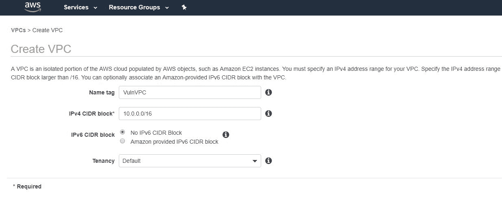

创建专有网络

在这里，我们将 VPC 命名为`VulnVPC`，并为其指定了`10.0.0.0/16`IP 范围。

3.  在 VPC 内创建新的子网：


创建子网

我们正在 VPC 内创建一个具有`10.0.1.0/24`IP 范围的新子网

4.  转到 Internet 网关并创建新网关；将此新网关连接到新 VPC：


创建新网关

5.  转到路由表并选择新的 VPC。然后，转到“管线”选项卡并单击“编辑管线”。

6.  添加新的`0.0.0.0/0`目的地并将目标设置为 internet 网关：


添加新目标并设置目标

7.  创建新的安全组并允许来自任何地方的所有流量：

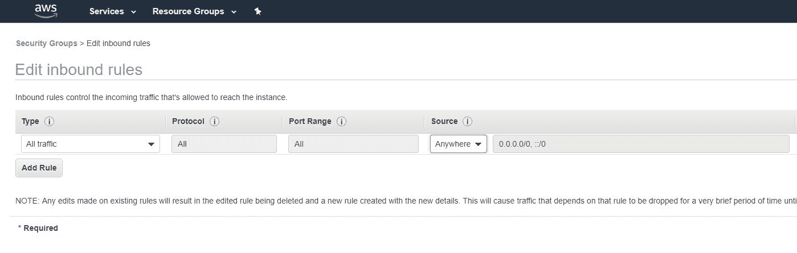

编辑入站规则

8.  现在，在新的 VPC 和子网中启动一个新的 EC2 实例：


启动新的 EC2 实例

9.  将其分配给易受攻击的安全组，如以下屏幕截图所示：

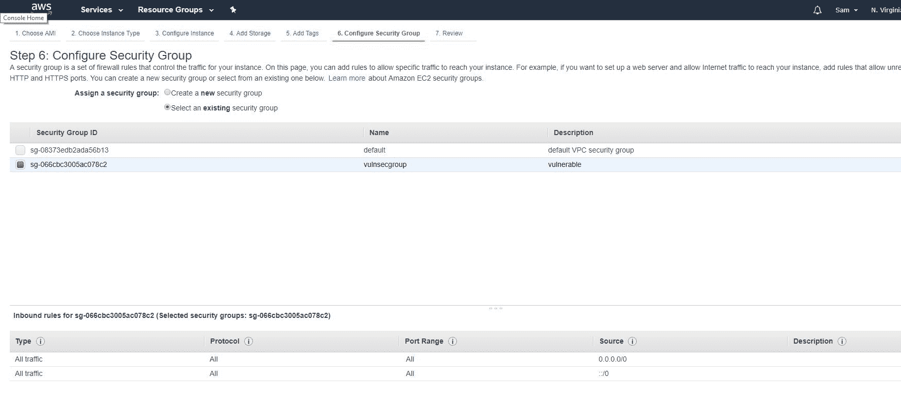

分配安全组 ID

10.  最后，启动 EC2 实例

我们的易受攻击的 EC2 基础设施已经准备好了。现在让我们也创建一个易受攻击的 S3 实例。

# 创建易受攻击的 S3 实例

在[第 7 章](07.html)*侦察–识别易受攻击的 S3 桶*中，我们了解了如何创建易受攻击的 S3 桶。是时候再次执行这些步骤了。让我们从服务开始| S3：

1.  创建一个新 bucket，命名它，然后转到设置权限
2.  禁用以下屏幕截图中给出的所有设置并创建 bucket：


设置权限

3.  进入 bucket 的**访问控制列表**并允许公共读写访问：

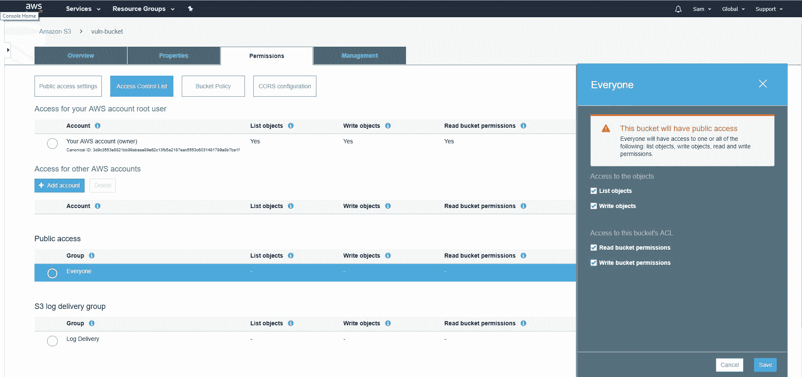

访问控制列表

4.  保存所有设置

我们脆弱的 AWS 基础设施已经就绪。接下来，我们将配置并运行 Scout Suite，看看它如何识别我们创建的所有安全错误配置。

# 配置和运行 Scout 套件

现在我们的易受攻击的 AWS 基础设施已经设置好，现在是配置和运行 Scout Suite 的时候了。Scout Suite 是一个自动化的云安全审计工具，可帮助我们评估和识别安全错误配置。它从云提供商公开的 API 中收集配置数据，并生成一份报告，突出显示可能存在漏洞的配置。该工具可跨多个云提供商工作，如 AWS、Azure 和**谷歌云平台**（**GCP**）

# 设置工具

要在 AWS 基础设施上运行该工具，我们必须设置具有特定权限的 IAM 用户来配置该工具：

1.  从访问 IAM 用户开始。
2.  点击**添加用户**按钮，如下图所示：

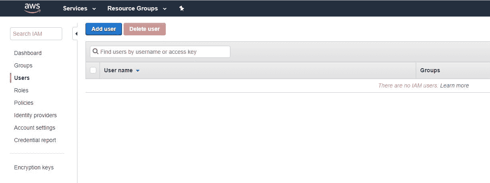

添加 IAM 用户

3.  我们将为此活动创建一个新的`auditor`用户。将访问类型设置为编程访问，然后继续。我们不需要访问 AWS 管理控制台，因此无需创建密码：

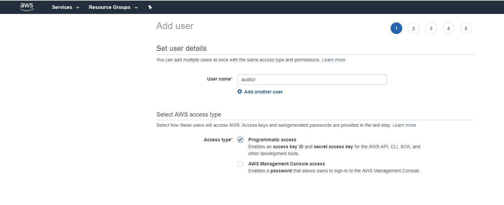

设置用户详细信息

4.  接下来，我们将为新的 IAM 用户设置策略。为了使该工具成功运行，我们需要向该用户提供两个特定策略，即 ReadOnlyAccess 和 SecurityAudit，如下屏幕截图所示：

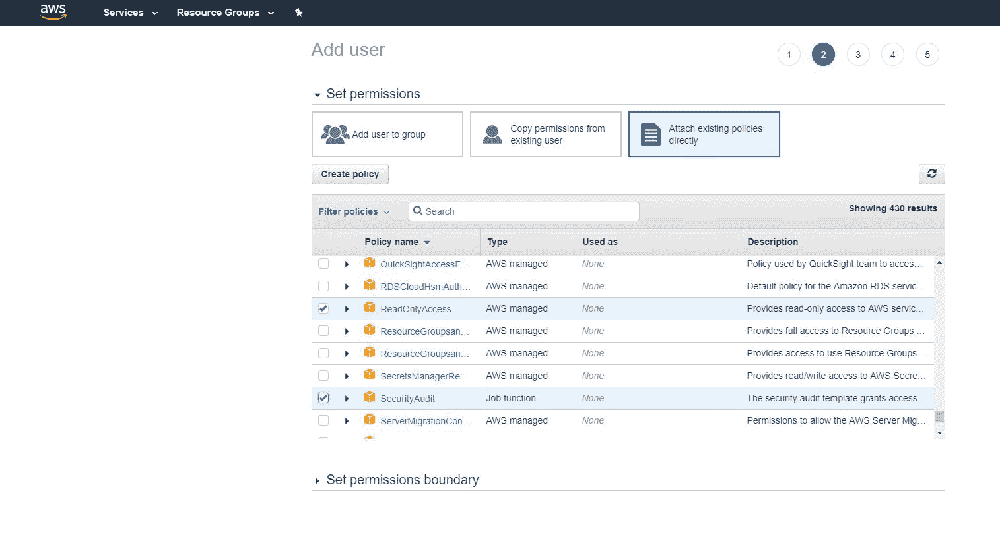

为我们的新 IAM 用户设置策略

在“设置权限”中选择这两个权限，然后继续。

5.  检查最终审核页面上的详细信息，然后继续：


审查细节

6.  最后，您将获得一条成功消息，以及访问密钥 ID 和秘密访问密钥凭据。请记下这些选项，因为配置 AWS CLI 需要它们：


显示成功消息的屏幕

7.单击“继续”，您将看到我们的用户已创建：

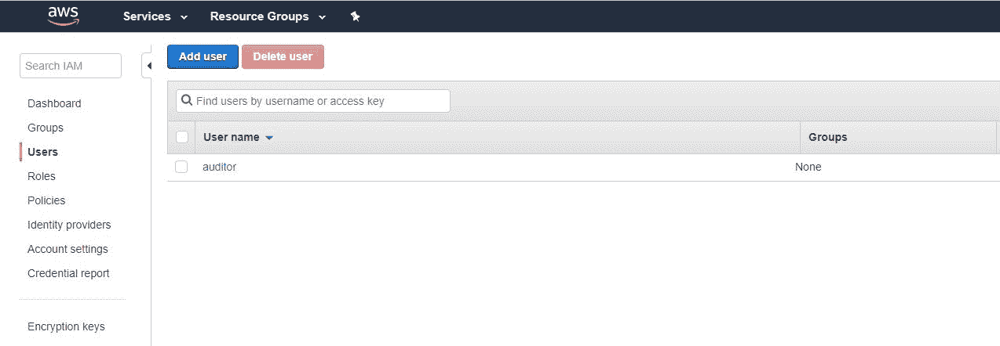

显示已创建用户的屏幕

接下来，我们将配置 AWS CLI for Scout Suite，以执行以下步骤：

1.  运行 AWS CLI 工具，并使用我们刚刚收到的凭据对其进行配置：

```
aws configure
```

2.  输入凭据并确保将您的区域设置为 AWS 基础设施所在的同一区域。
3.  现在让我们安装`scoutsuite`；我们可以通过`pip`安装，如下所示：

```
sudo pip install scoutsuite
```

或者，我们可以从 GitHub 存储库下载该工具：

```
git clone https://github.com/nccgroup/ScoutSuite
```

4.  如果您是从 GitHub 下载脚本，则需要运行以下命令来安装`ScoutSuite`的所有依赖项：

```
cd ScoutSuite
sudo pip install -r requirements.txt
```

如果要在 Python 虚拟环境中运行该工具，请在运行`pip install -r requirements.txt`之前运行以下命令：

```
virtualenv -p python3 venv
source venv/bin/activate
```

然后，运行`pip install -r requirements.txt`安装所有依赖项。

5.  最后，通过运行以下命令检查工具是否正常工作：

```
python Scout.py --help
```

如果显示帮助菜单，则表示我们的工具已成功设置。让我们看看如何运行该工具并对我们的基础设施进行评估。

# 跑步童子军套房

我们的工具现在可以运行了。要开始评估，只需运行以下命令。

如果使用`pip`安装，请使用以下命令：

```
Scout aws
```

如果正在运行 GitHub 脚本，请使用以下命令：

```
python Scout.py aws
```

该工具将收集每个 AWS 服务的数据，然后分析配置：


分析配置

该工具将生成一份 HTML 报告，该报告将保存在`scoutsuite-report`文件夹中。如果您已经在 AWS 上运行的 Kali 实例上运行了该工具，那么只需使用 SCP/WinSCP 下载文件即可。

# 分析 Scout 套件扫描的结果

让我们看一下我们的报告；Scout Suite 似乎发现了 AWS 基础设施中的许多问题，如以下屏幕截图所示：


Scout Suite 仪表板显示 AWS 基础架构中的问题

我们将逐一查看每个报告的问题。

让我们看一下 EC2 报告。正如您从报告中看到的，所有错误配置都从脆弱的 EC2 实例中列出：

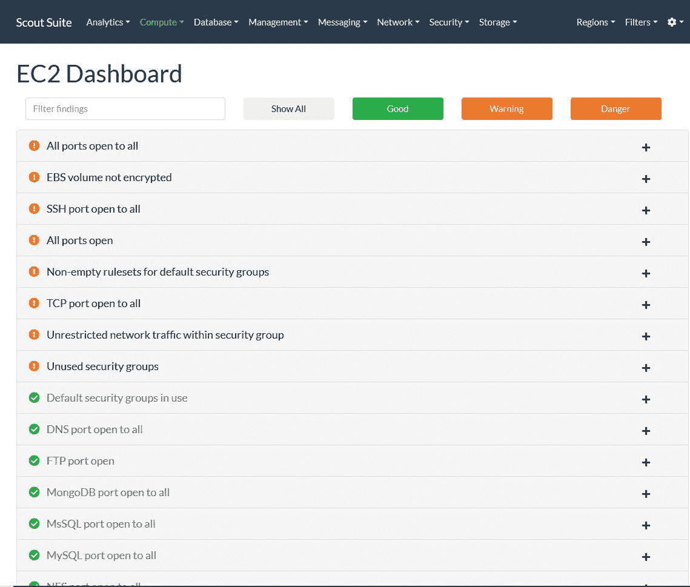

EC2 仪表板

如果您想更详细地查看每个问题，只需单击任何问题。让我们来看看所有开放的所有端口的细节：


所有端口对所有用户开放

在这里，我们有一个更详细的输出，说明错误配置在哪里，以及为什么它是一个问题。

现在，让我们看一下 S3 仪表板中的 S3 桶报告：

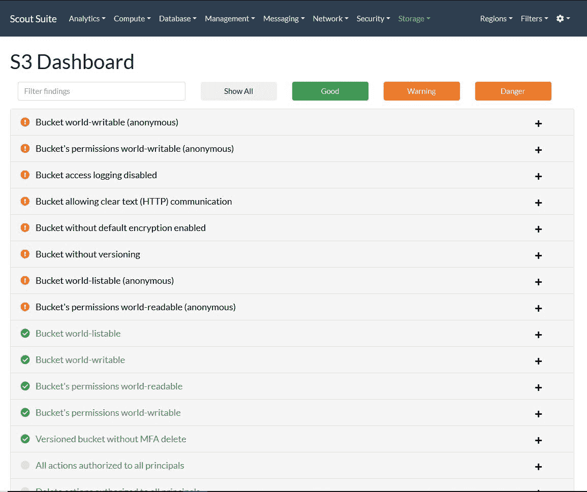

S3 仪表板

正如您在前面的屏幕截图中所看到的，该工具已成功识别我们创建的易受攻击的 S3 存储桶。

那么，我们的专有网络和子网呢？在专有网络服务中没有重要发现。但是，该工具已在 VPC 和子网的网络 ACL 中识别出我们需要调查的潜在威胁：

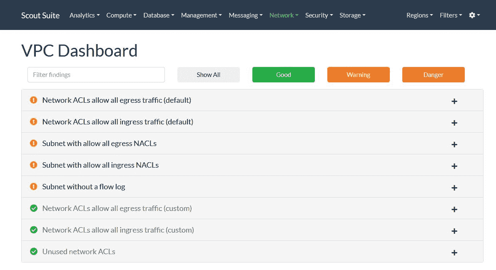

专有网络仪表板

我们还可以看到 IAM 服务中有一些重要的发现；让我们来看看这个问题：

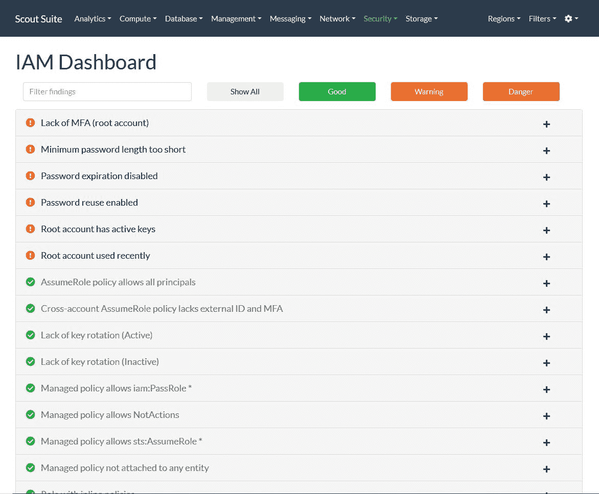

仪表板

这些发现对于审计人员识别易受攻击的密码策略和访问管理问题非常有帮助。这对于系统管理员确保遵循最佳实践也非常有用。

现在让我们来看看我们如何使用自定义规则集来根据我们的需求定制报表。

# 使用 Scout Suite 的规则

Scout Suite 为我们提供了使用自定义规则集（而不是默认规则集）审核基础结构的选项。这非常有用，因为在建立 AWS 基础设施时，每个组织都有自己的业务案例。使用自定义规则集可以帮助组织根据需要自定义工具的评估。

让我们来看看我们如何创建自己的规则集：

1.  要创建新的规则集，我们首先需要复制现有规则集。您可以在 GitHub 存储库的[中找到默认规则集文件 https://github.com/nccgroup/ScoutSuite/blob/master/ScoutSuite/providers/aws/rules/rulesets/detailed.json.](https://github.com/nccgroup/ScoutSuite/blob/master/ScoutSuite/providers/aws/rules/rulesets/detailed.json) 我们这样做的原因是为了确保我们拥有正确的规则集格式，从中我们可以构建自己的规则。
2.  下载文件并在文本编辑器中打开，如以下屏幕截图所示：

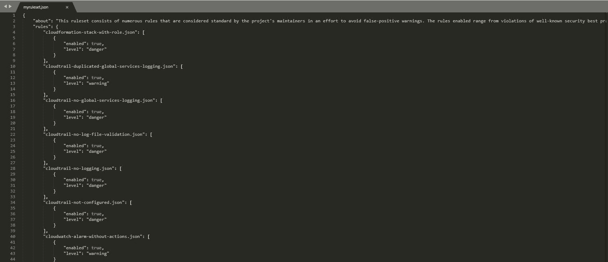

myruleset.json

3.  让我们在文件末尾修改以下设置：
    *   转到标题为`vpc-default-network-acls-allow-all.json`的设置。如果您没有对文件进行任何更改，则设置应在行号`1046`处。
    *   将`ingress`参数的严重性级别从`warning`更改为`danger`：


更改严重性级别


vpc-subnet-with-default-acls.json

4.  我们都设置了自定义规则集。现在使用自定义规则集运行 Scout Suite。使用`pip`安装时，发出以下命令：

```
Scout aws --ruleset myruleset.json
```

如果您正在使用 GitHub 脚本，请发出以下命令：

```
Scout.py aws --ruleset myruleset.json
```

如果您这次查看报告，您将看到先前报告的与专有网络相关的问题现在已标记为关键问题：

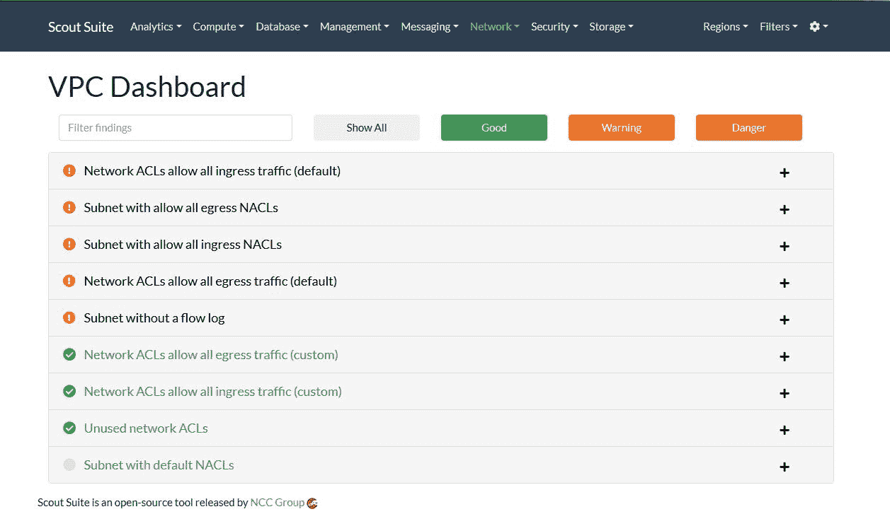

专有网络仪表板

此外，由于我们启用了`vpc-subnet-with-default-acls.json`设置，Scout Suite 这次报告了这些问题。

类似地，其他设置也可以根据其用例进行修改。

# 总结

在本章中，我们学习了如何设置和配置 Scout 套件。为了在 AWS 基础设施上运行 Scout Suite，我们创建了一个具有易受攻击配置的新 VPC 和子网，然后启动了一个具有易受攻击安全组的 EC2 实例。然后，我们运行 Scout Suite 来识别 AWS 基础设施中可能存在漏洞的配置，然后分析报告以了解漏洞是如何报告的。最后，我们学习了如何修改和使用定制的规则集来根据需要调整报告。

在下一章中，我们将介绍 AWS 基础设施的实际渗透测试。