# 使用 Pacu 进行 AWS 测试

尽管我们在本书中使用了 Pacu，但本章将采用从头开始讨论 Pacu 的方法。理想情况下，在本章末尾，您应该理解并能够利用 Pacu 提供的大部分功能。这意味着您将能够利用 Pacu 的一些更高级的功能，并且可以为项目贡献您自己的模块和研究成果。

在本章中，我们将深入了解 AWS 开发工具包 Pacu，在其中我们将了解以下几点：

*   什么是 Pacu，为什么它很重要，以及如何设置它
*   Pacu 提供的命令以及我们如何使用这些命令以实现我们的利益
*   我们如何自动化自己的任务并将其作为模块添加到 Pacu 中
*   简单介绍 PacuProxy 及其目的

对于 pentesting 领域的任何事情，尽可能多地实现自动化都是有帮助的。这使我们能够执行环境攻击和枚举，而无需手动在不同环境中反复运行多个 AWS**命令行界面**（**CLI**命令）。这种工具使我们能够节省时间，让我们有更多的时间花在测试过程的手动方面。有时这些工具是复杂的，需要对工具及其目标有透彻的了解，才能充分利用它的潜力。这就是为什么写这一章，是为了帮助您更好地理解 Pacu 提供了什么，以及您如何最好地利用这些产品。

# Pacu 历史

从一开始，Pacu 就是一个攻击性的 AWS 开发框架，由 Rhino 安全实验室的一小群开发人员和研究人员编写。开源，可在 GitHub 上获得 BSD-3 许可证（[https://github.com/RhinoSecurityLabs/pacu](https://github.com/RhinoSecurityLabs/pacu) ），Pacu 及其模块是用 Python 3 编写的。

Pacu 最初的想法来自 Rhino 渗透测试团队的研究积累。人们发现，越来越多的客户端正在使用云服务器提供商，如 AWS，还有许多未开发的领域似乎已经成熟，可以利用。随着 Rhino 团队中的想法、攻击向量和脚本的积累，很明显需要某种框架来汇总所有这些研究，并使其易于使用。作为渗透测试人员，还决定它应该能够很好地处理项目和 pentest，即使同时处理单独的项目和 pentest。

在提出内部提案和拟议项目的原型后，Pacu 被接受，团队开始形成今天的 Pacu 的过程。为了反映类似的项目，并确保 Pacu 跟上 AWS 不断发展的服务和相关的攻击向量，Pacu 的开发考虑到了可扩展性。这是为了方便地为项目提供外部贡献，以及一个简单的、可管理的基础设施，用于处理问题并方便地解决这些问题

# Pacu 入门

设置 Pacu 时需要做的第一件事是确保安装了 Git、Python3 和 PIP3。完成后，您可以按照简单的三步流程安装并运行 Pacu。从操作系统的 CLI（我们使用的是 Kali Linux）运行以下命令：

```
git clone https://github.com/RhinoSecurityLabs/pacu.git 
cd pacu/ && bash install.sh 
python3 pacu.py 
```

请注意，Windows 操作系统不正式支持 Pacu。

现在 Pacu 应该启动并完成配置和数据库创建过程。它应该首先告诉您它创建了一个新的`settings.py`文件，然后是一条消息，说明它创建了一个新的本地数据库文件。最后，它将询问您的新 Pacu 会话的名称。在本例中，我们将会话命名为`ExampleSession`：

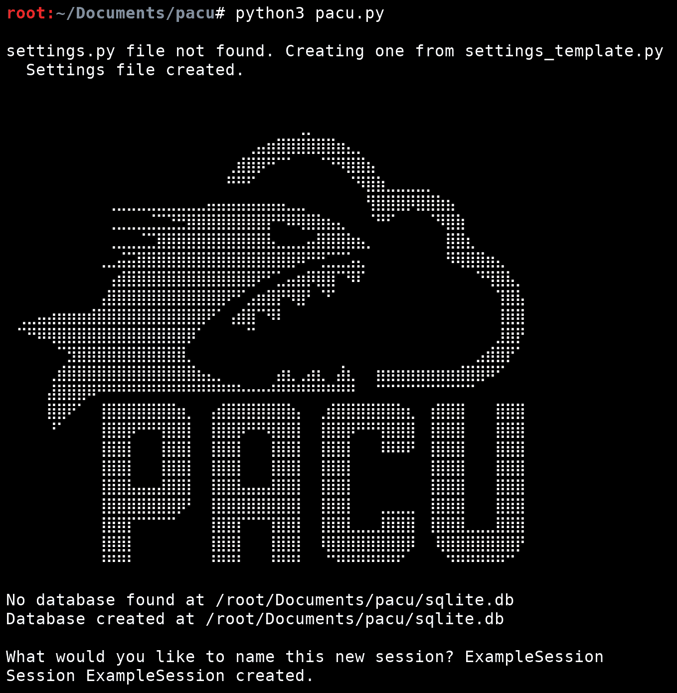

第一次在 Kali Linux 上启动 Pacu

现在，我们的新会话已经创建；`session`在 Pacu 中，基本上是一种在您正在处理的不同项目之间隔离数据、活动和凭证的方法。Pacu 使用本地 SQLite 数据库来管理会话和其中的数据，它允许创建任意数量的会话。作为 Pentest，会话可以被视为约定或公司，从某种意义上说，您可以同时处理两个不同的 AWS Pentest，因此您需要两个 Pacu 会话来分隔这两个会话。然后，每个 Pacu 会话将保存属于该特定业务或公司的所有数据、活动和凭证。这使您能够跨 Pacu 的多种不同用途处理相同的数据，从而减少对 AWS API 的 API 调用，这意味着您在日志中的隐藏程度要高得多。

`SQLAlchemy`Python 库用于管理 Pacu 和数据库之间的交互，但稍后我们将讨论这个问题。

接下来您应该看到的是来自 Pacu 的大量帮助信息输出，其中解释了 Pacu 启用的不同命令和功能。我们现在跳过这一步，稍后再讨论。

之后，如果您像我们一样运行 Kali Linux，您将看到一条类似于以下内容的消息：


Pacu 中的内置警卫防御

正如我们在[第 16 章](16.html)*GuardDuty*中所讨论的，显示此消息是因为 Pacu 检测到它正在 Kali Linux 主机上运行。GuardDuty 可以检测何时从 Kali Linux 服务器发出 AWS API 调用，并基于此标记警报，因此 Pacu 通过修改发送到 AWS 服务器的用户代理自动解决此问题。因此，当我们开始进攻时，警卫不会立即通知我们。同样的检查和解决过程也适用于 Parrot 和 PentooLinux。

之后，您应该进入 Pacu CLI，如下所示：

```
   Pacu (ExampleSession:No Keys Set) > 
```

这一行正在等待我们输入命令，它显示我们正在`ExampleSession`Pacu 会话中，没有设置任何 AWS 键。对于 Pacu 的大部分功能，需要一组 AWS 键，因此我们将继续使用`set_keys`Pacu 命令添加一些。运行此操作时，将要求我们提供 AWS 凭据的密钥别名、访问密钥 ID、秘密访问密钥和会话令牌。正如我们在本书前面讨论的，会话令牌字段是可选的，因为只有临时 AWS 凭据使用会话令牌。常规 IAM 用户只有访问密钥 ID 和机密访问密钥，因此在这种情况下，会话令牌字段将保持为空。密钥别名是一个任意名称，我们可以将其分配给正在添加的访问密钥集。它仅供我们（和 Pacu）参考，所以请选择对您有意义的内容。下面的屏幕截图显示了运行`set_keys`命令在 Pacu 数据库中添加 AWS 访问令牌时提供的输出和输入。在我们的示例中，我们选择了`ExampleUser`，因为这是为其创建密钥的用户的用户名：


将示例用户添加到 Pacu 数据库

如您所见，我们将密钥集命名为`ExampleUser`，然后在 Pacu CLI 提示符处替换`No Keys Set`，这表明`ExampleUser`密钥对是我们的活动密钥集。活动密钥集用于 Pacu 使用 AWS API 进行的任何身份验证。您可以使用相同的`set_keys`命令，但使用不同的密钥别名添加其他密钥集。如果在设置一对密钥时指定现有密钥别名，它将用您输入的内容覆盖该密钥别名下的任何现有值。

如果我们想在 Pacu 内交换密钥对，我们可以使用恰当命名的`swap_keys`Pacu 命令。这将允许我们从已在此 Pacu 会话中设置的密钥对列表中进行选择。假设在本例中，我们在 Pacu 中将`ExampleUser`和`SecondExampleUser`设置为密钥对，我们希望从`ExampleUser`切换到`SecondExampleUser`。我们只需运行`swap_keys`命令并选择所需的密钥对：


在会话内的 Pacu 密钥之间交换

正如您在前面的屏幕截图中所看到的，Pacu CLI 上的`ExampleUser`更改为`SecondExampleUser`，这表明我们有一组新的激活 AWS 密钥。

Pacu 基本上已经设置好并准备就绪，但是如果我们愿意，我们还可以做一些事情来定制会话，但是我们将在下一节中讨论这些命令。

# Pacu 命令

Pacu 有多种 CLI 命令，允许灵活定制和与当前会话以及 Pacu 提供的任何可用模块交互。在当前状态下，Pacu 提供以下命令：

*   `list/ls`
*   `search`
*   `help`
*   `whoami`
*   `data`
*   `services`
*   `regions`
*   `update_regions`
*   `set_regions`
*   `run/exec`
*   `set_keys`
*   `swap_keys`
*   `import_keys`
*   `exit/quit/Ctrl+C`
*   `aws`
*   `proxy`

以下小节将介绍这些命令中的每一个，包括描述、使用示例和实际用例。

# 列表/ls

`list`和`ls`命令相同，它们列出了所有可用的 Pacu 模块及其类别。以下屏幕截图显示了运行`ls`命令时返回的部分输出：

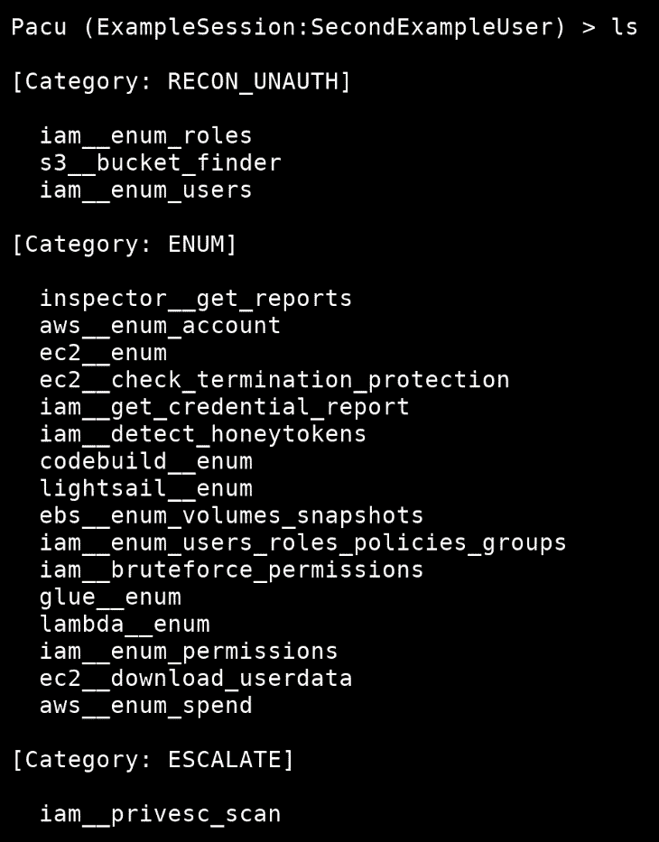

运行 ls 或 list 时返回的某些模块和类别

# 搜索[[cat]自我]<search term=""></search>

`search`命令完全按照您的想法执行–它搜索模块。通过返回类别和模块，它本质上与`ls`命令相同，但它也返回搜索到的每个模块的一行描述，以便更好地了解某个模块的功能。这是因为搜索的输出几乎肯定比只运行`ls`要小，因此有更具体的输出空间。

您还可以使用`cat`或`category`关键字作为搜索中的部分字符串，按类别搜索以列出该类别中的所有模块。

以下示例将返回名称中包含`ec2`的所有模块：

```
   search ec2 
```

以下示例将返回`PERSIST`类别中的所有模块：

```
   search category PERSIST 
```

因为`category`也可以指定为`cat`，所以获取`PERSIST`类别中所有模块的简写方式如下：

```
   search cat PERSIST 
```

下面的屏幕截图显示了`search cat PERSIST`命令的输出：


将返回持久化类别中的所有模块

# 帮助

`help`命令只是输出 Pacu 的帮助信息，其中包括可用的命令和每个命令的说明。它打印的数据与每次 Pacu 启动时自动打印的数据相同。

# 帮助

`help`命令还有另一个变体，您可以提供模块名称，它将返回该特定模块的帮助信息。这些数据包括一个长描述（比您`search`模块时显示的一行描述长）、必备模块、编写模块的人的学分以及所有可用或必需的参数。在继续使用某个特定模块之前，最好先阅读该模块的帮助文档，否则您可能会错过这些功能和怪癖。

以下屏幕截图显示了`iam__enum_permissions`模块的`help`输出：

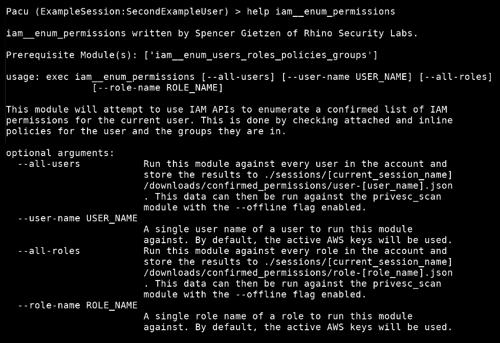

iam__enum_ 权限模块的帮助输出

# 哇

`whoami`命令将输出当前激活 AWS 密钥集的所有信息。这意味着，如果我们的活动集是`SecondExampleUser`用户，那么我将看到该用户的信息，而不是其他用户的信息。以下屏幕截图显示了作为`SecondExampleUser`用户的`whoami`命令的输出：

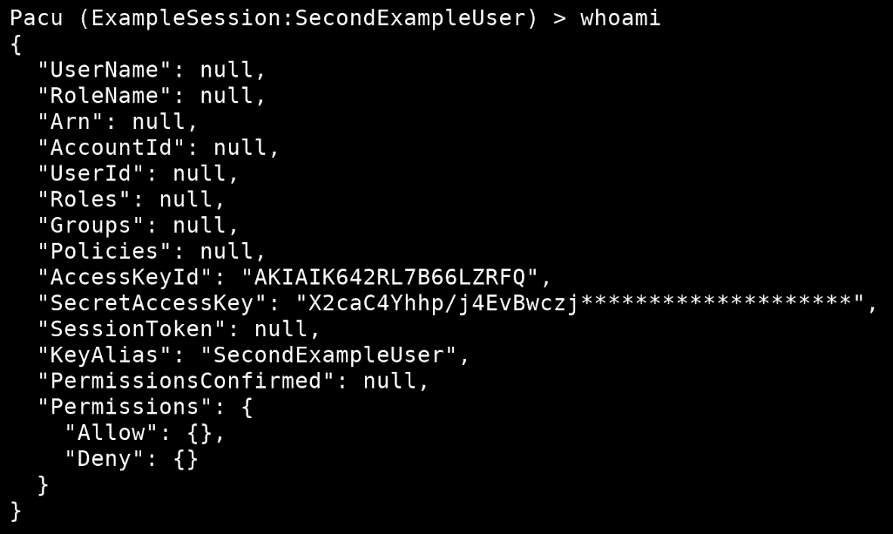

*Figure 8*: The output of whoami for the SecondExampleUser user

正如您所看到的，几乎所有内容都是空的或空的。这是因为当前会话中尚未运行任何模块。在运行提供此列表中信息的模块时，将填写此列表。例如，我刚刚运行了`iam__detect_honeytokens`模块，它填充了一些关于我的用户的识别信息。下面的屏幕截图显示了收集此信息后，`whoami`命令的更新输出：

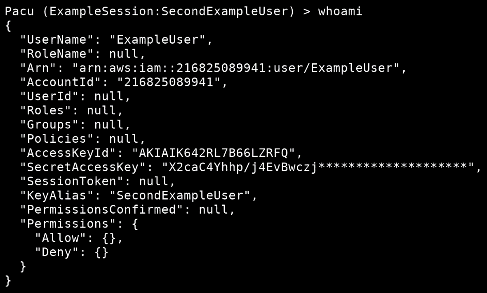

从 iam\uuuu detect\u honeytokens 模块填充的一些输出

我们可以看到，`UserName`、`Arn`和`AccountId`字段已经更新，因为这是`iam__detect_honeytokens`模块运行时获取的信息。其他模块在此输出中填写不同的信息，但`iam__enum_permissions`模块填写的信息最多，因为它列举了大量关于当前用户的信息，并将其保存到本地数据库中。

# 数据

`data`命令将输出当前活动会话中存储的所有数据，包括已枚举的 AWS 服务数据，以及会话期间定义的配置设置。下面的屏幕截图显示了`data`命令在我们现在所处位置的输出（即，尚未枚举任何 AWS 服务数据）：


*Figure 10*: The output of the data command without having enumerated any AWS data

我们可以看到添加到会话中的 AWS 密钥、会话的一些标识信息、修改的用户代理（因为我们使用的是 Kali Linux）、活动密钥集、会话区域（在`set_regions`命令部分讨论）和代理数据（在`proxy`命令部分讨论）。

如果我运行`run ec2__enum --instances`命令枚举目标帐户中的 EC2 实例，我应该能够在数据库中填充一些 EC2 数据，这将改变`data`命令的输出。下面的屏幕截图显示了枚举 EC2 实例后，`data`命令的新输出：

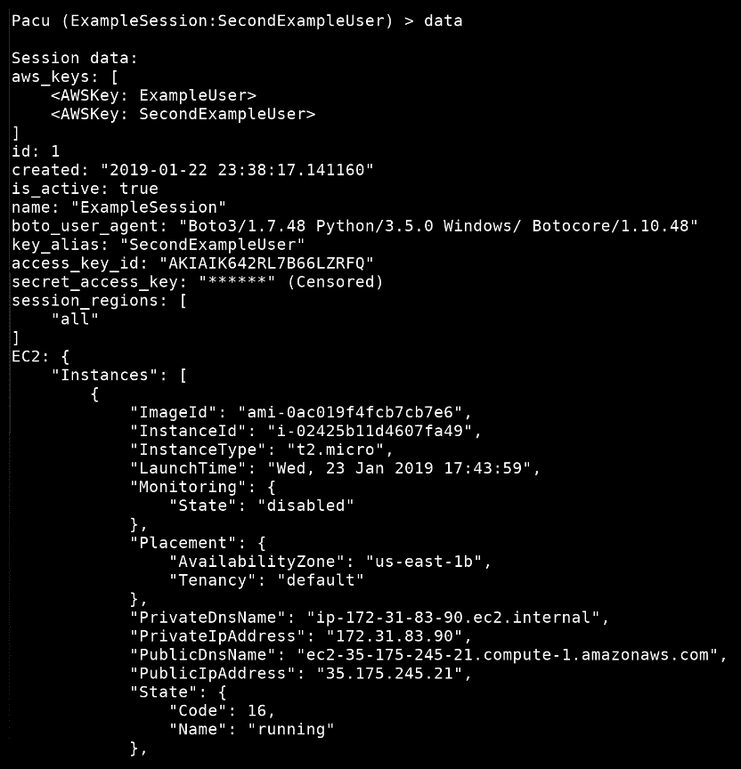

枚举 EC2 实例后数据命令的新输出

# 服务

`services`命令将输出数据库中存储有数据的任何 AWS 服务。鉴于我们只列举了 EC2 实例，EC2 应该是数据库中存储数据的唯一服务：

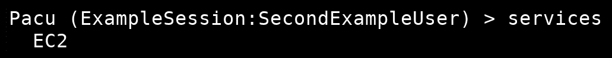

services 命令显示数据库中有 EC2 数据

这个命令与`data`命令的另一种形式很好地配合，这将在下一节中解释。

# 数据<service>代理</service>

此版本的`data`命令允许您请求比广泛的`data`命令更具体的信息，特别是因为数据库中存储了多种服务和数据类型，`data`命令的输出可能会变得相当大。我们可以将此命令传递给数据库中有数据的任何 AWS 服务，以获取该特定服务的信息，或者我们可以将`proxy`关键字传递给它以获取`PacuProxy`的信息（如`proxy`命令部分所述）。我们知道`services`输出`EC2`是我们唯一拥有数据的服务，所以我们可以运行`data EC2`获取相关 EC2 数据：

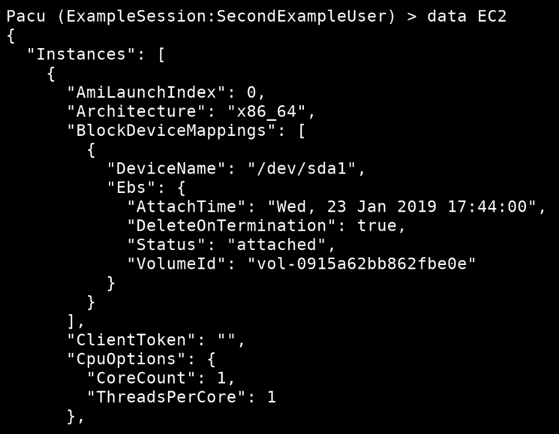

使用 data 命令获取 EC2 数据

我们也可以运行`data proxy`，但我们要等到以后才能开始。

# 区域

`regions`命令将列出 Pacu 支持的所有区域，通常是 AWS 用户可用的每个公共区域。当针对某一组区域运行模块时，或者当使用`set_regions`命令时，此命令会有所帮助，这将在后面的部分中讨论：

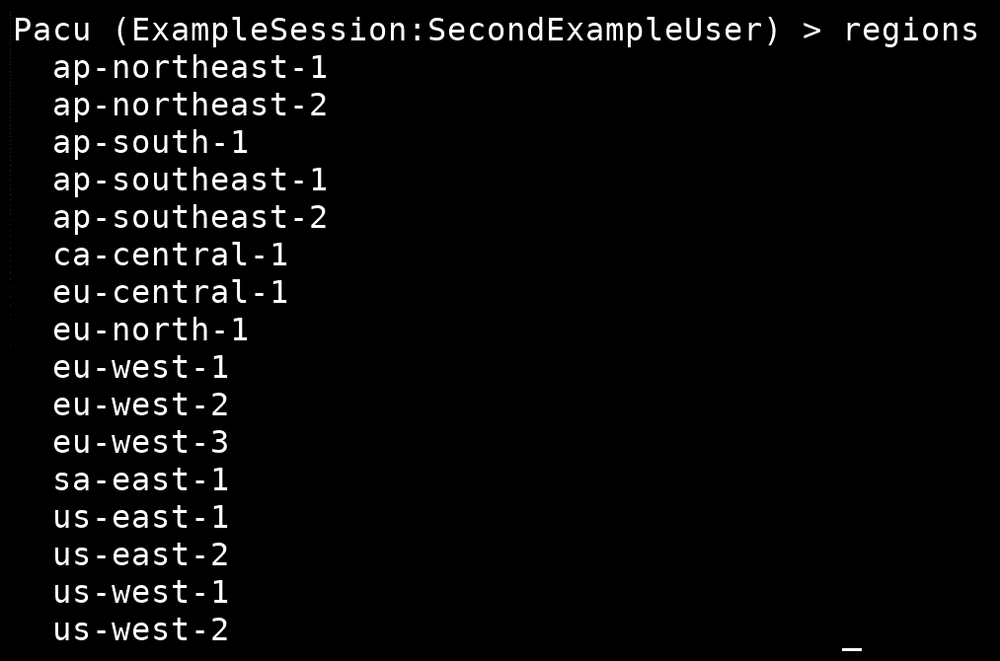

运行 regions 命令时，将列出此时支持的所有区域

# 更新区域

通常情况下，`update_regions`命令不需要由常规 Pacu 用户运行，但当您认为可能需要使用它时，了解它的用途非常重要。

此命令运行一个 bash 脚本，该脚本将执行以下操作：

1.  使用`python3 -m pip install --upgrade botocore`将您的 botocore Python3 库更新至最新可用版本。
2.  使用`python3 -m pip show botocore`定位 botocore 安装文件夹。

3.  然后，它将读取存储在 botocore 文件夹中的`endpoints.json`文件，解析出哪些服务可用，哪些区域支持这些服务。
4.  然后，它会将解析后的数据保存到 Pacu 文件夹中的`./modules/service_regions.json`文件中。

Pacu 将此作为支持服务和区域的指南。Pacu 开发人员将随推送到 GitHub 存储库的任何更新一起更新区域列表，但在两次 Pacu 更新之间可能会出现支持新区域的情况。在这种情况下，运行`update_regions`命令可能是有意义的，但如果不是这样，您可能可以将其留给开发人员。下面的屏幕截图显示了运行`update_regions`命令的输出，该命令获取最新版本的 botocore Python 库，然后从中提取最新的区域列表：


更新区域命令正在更新 Botocore

# 设置 _ 区域<region><region>…]</region></region>

`set_regions`命令是学习使用 Pacu 时需要了解的最重要的命令之一。如果正确使用，它可以大大减少对目标环境进行的 API 调用量，最终使我们在环境中的占用空间更小。

`set_regions`命令控制`session regions`配置选项的值。基本上，这个命令是用来告诉 Pacu，您只想在当前会话中以区域的*x*、*y*和*z*为目标。当您攻击一个只使用几个区域作为其整个基础设施的环境时，这一方法可能会派上用场。默认情况下，Pacu 会提示您在运行省略了`--regions`参数的模块时，是否要针对每个区域，但如果您已经知道只有几个区域会有有效结果，为什么要这样做？最终，它会在`wasted`API 调用中结束，这会使我们面临被防御者检测到的风险，并且几乎不会给我们带来任何好处。

使用`set_regions`命令时，您向其提供一个或多个 AWS 区域（在`regions`命令的输出中列出）。然后，Pacu 将只针对那些具有 API 调用的区域。如果您知道您的目标仅在两个区域使用 EC2，`us-west-2`和`us-east-1`，那么您将运行`set_regions us-west-2 us-east-1`，如以下屏幕截图所示：


将我们的会议区域设置为 us-west-2 和 us-east-1

现在，如果我们愿意，我们可以再次运行`data`命令，它的`session_regions`值将与前面看到的不同。它现在将包含两个字符串：`us-west-2`和`us-east-1`。

设置会话区域后，Pacu 将在运行模块时做出相应的反应。当您运行一个接受`--regions`作为参数但忽略该参数的模块时，Pacu 将首先获取目标服务的所有支持区域，然后将该列表与用户设置的会话区域列表进行比较。然后，它将只针对两个列表中的区域。这将防止您针对特定 AWS 服务不支持的区域运行模块，并防止您针对您不打算运行的任何区域运行模块。

会话区域集可随时更改，`all`关键字可用于返回到针对每个区域（默认）。它将像区域一样使用，如`set_regions all`：


在使用 set_regions 命令修改目标之前，警告我们正在瞄准每个 AWS 区域

# 运行/执行

`run`和`exec`命令的作用相同，它们运行模块。假设我们想要运行`ec2__enum`模块。我们可以先运行`help ec2__enum`来获取有关它的一些信息，包括支持哪些参数。然后，我们可以使用`run`或`exec`运行模块，并使用该命令传递任何参数。

如果我们想枚举`us-east-1`区域中的 EC2 实例，我们可以运行以下命令：

```
 run ec2__enum --instances --regions us-east-1 
```

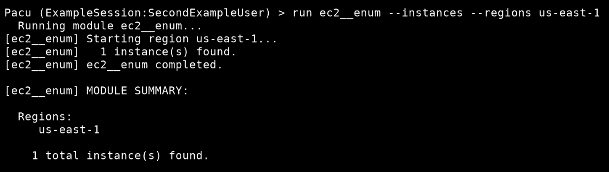

使用实例和区域参数运行 ec2__ 枚举模块

如您所见，我们将`--instances`参数指定为仅枚举 EC2 实例，并将`--regions`参数指定为仅枚举`us-east-1`区域中的 EC2 实例。

前面的屏幕截图还显示了模块输出的另一个重要方面–模块摘要部分。每个模块都有一个模块摘要，其要点是在输出的一小部分中提供模块的输出。有时，根据您正在运行的模块的配置，输出可能跨越多个屏幕，并且可能太长，超出了终端的历史记录。为了帮助尝试解决此问题，引入了模块摘要，以提供模块在整个执行过程中执行的发现或操作的摘要。

# 设置按键

在本书中，我们已经多次使用了`set_keys`命令。此命令用于向当前 Pacu 会话添加密钥集，或更新任何现有密钥集。如前所述，如果您在没有设置任何键的情况下运行`set_keys`命令，您将在 Pacu 中设置第一组或默认的键。在此之后，`set_keys`命令将自动尝试使用它提供的默认值更新激活的密钥集，但您可以通过修改提示您输入的密钥别名来更改此设置以添加另一组密钥。

与一组密钥关联的密钥别名基本上只针对您自己，因此您可以在密钥准备就绪时识别它们是什么密钥。通常，这意味着将密钥别名设置为拥有密钥的用户或角色的名称最有意义。在其他情况下，描述密钥集提供的访问可能更有意义。假设为您执行 pentest 的客户机向您发送两组密钥，一组具有管理员级别的访问权限，另一组具有开发人员级别的访问权限。在这种情况下，将它们命名为`Administrator`和`Developer`或类似的名称可能更有意义，而不是它们的用户名是什么。

正如您可能已经注意到的，Pacu 存储您的秘密访问密钥的任何地方都需要反映在屏幕上，Pacu 将审查该值。这使得机密访问密钥不会记录到 Pacu 命令/错误日志中，因此任何其他日志或越级偷窥者也无法访问。

# 交换密钥

我们也已经看过了`swap_keys`命令，但是这个命令在处理包含多组活动键的会话时非常有用。通过运行`swap_keys`，您将看到一个您之前添加到会话中的可用密钥列表，您可以从中选择哪个密钥成为活动密钥集。活动集是一组密钥，用于在运行任何进行身份验证的模块时向 AWS 进行身份验证。

# 导入 _ 键<profile name="">|——全部</profile>

`import_keys`命令旨在使 Pacu 和 AWS CLI 之间的连接更加容易。此命令将从 AWS CLI 导入凭据配置文件，并在活动会话中使用该信息创建一组新密钥。如果我们想要导入单个 AWS CLI 配置文件，您可以在命令中对其命名，如下面的屏幕截图所示，其中运行`import_keys default`：

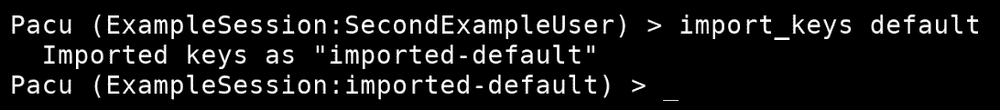

导入 AWS CLI 的默认配置文件的密钥

如前一屏幕截图所示，我们导入了`default`AWS CLI 配置文件作为`imported-default`密钥别名，以指示这些密钥已导入，配置文件名称为`default`。我们还可以看到，活动密钥集从`SecondExampleUser`切换到`imported-default`。如果需要，我们可以使用`swap_keys`命令将它们切换回原位。

我们还可以使用`--all`标志，而不是 AWS CLI 配置文件名称，Pacu 将向其中导入它可以找到的每个 AWS CLI 配置文件：

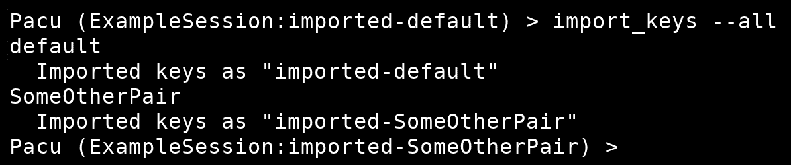

使用--all 参数从 AWS CLI 导入多个密钥对

# 退出/退出/Ctrl+C

输入`exit`或`quit`命令，或按键盘上的*Ctrl*+*C*键，将使 Pacu 在主菜单上优雅退出：


离开 Pacu 回到我的终点站

*Ctrl*+*C*还有另外一个用途；当一个模块正在执行中并且按下*Ctrl*+*C*时，该模块的执行将退出，您将返回到主 Pacu CLI。下面的屏幕截图显示了使用*Ctrl*+*C*退出`ec2__enum`模块的执行（`^C`是*Ctrl*+*C*在终端中显示的方式）：

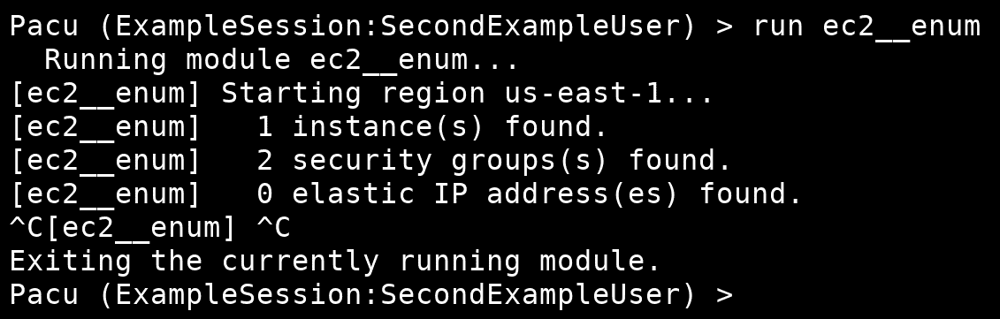

使用*Ctrl*+*C*组合键退出 ec2__ 枚举模块

# aws<command></command>

`aws`命令与其他 Pacu 命令略有不同。这实际上是一个将 AWS CLI 直接集成到 Pacu 中的命令，因此您无需退出 Pacu 即可运行 AWS CLI 命令。其工作方式是，如果 Pacu 检测到以`aws`作为第一个字开始运行的命令，它将把整个命令放到主机上的 bash shell 中。这意味着您可以将 Pacu 中的任何`aws`命令视为`bash`命令，因为它是。这允许您将 AWS CLI 命令的输出通过管道传输或重定向到系统上需要的任何位置。

需要特别注意的是，Pacu 和 AWS CLI 使用两种不同的凭据存储方法。Pacu 独立处理其凭据，AWS CLI 单独处理其凭据。这意味着，如果您在 Pacu 中，且`SecondExampleUser`是您的活动密钥集，AWS CLI 将**不**使用这些相同的凭据，除非您在 AWS CLI 中正确指定。AWS CLI 将正常运行，就像您从`bash`命令行运行一样，因此这意味着将自动使用`default`AWS CLI 配置文件，除非您使用`--profile`参数指定单独的配置文件。

下面的屏幕截图显示了从 Pacu 内部运行的`aws ec2 describe-instances`命令，由于它被传递到 bash shell，因此它被管道传输到`grep`中，以便可以在输出中搜索`ImageId`字，我们可以看到找到的 EC2 实例的图像 ID：

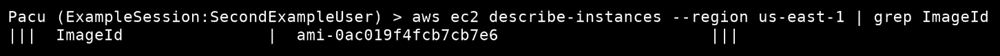

从 ec2 描述实例 API 调用的输出中重新映射 ImageId

我们没有指定要使用的 AWS CLI 配置文件，因此它自动使用默认配置文件，而不是`SecondExampleUser`Pacu 密钥对。

# 委托书<command></command>

`proxy`命令与称为`PacuProxy`的内置命令和控制功能相关联。`proxy`命令接受几个不同的子命令：

*   `start <ip> [port]`
*   `stop`
*   `kill <agent_id>`
*   `list/ls`
*   `use none|<agent_id>`
*   `shell <agent_id> <command>`
*   `fetch_ec2_keys <agent_id>`
*   `stager sh|ps`

我们不打算深入探讨这些命令的作用，但我们将在本章末尾的*PacuProxy 简介*一节中从更高的层次了解 PacuProxy。这是因为`PacuProxy`仍在开发中，当前版本不一定是最终版本，但其总体主题和目标保持不变。如果您有兴趣阅读更多关于 Pacu 和 PacuProxy 的高级产品，您可以访问 GitHub 上 Pacu Wiki 的*高级功能*部分：[https://github.com/RhinoSecurityLabs/pacu/wiki/Advanced-Capabilities](https://github.com/RhinoSecurityLabs/pacu/wiki/Advanced-Capabilities) 。

这些代理命令将在尝试在目标 AWS 帐户内处理受损的 EC2 主机时使用，但我们将在稍后探讨。

# 创建新模块

Pacu 的设计目的是允许外部对其自身及其包含的模块进行贡献。这就是为什么它是按照 BSD-3 开源许可证的方式构建和发布的。它是用 Python3 编写的，所以它的所有模块都是用 Python3 编写的。

Pacu 附带了一个模板，该模板存储在`./modules/template.py`文件中，这使得您可以轻松开始使用自己的模块。它包括使模块工作所需的一切，以及一些示例，说明如何使用 Pacu 核心程序公开的不同 API 来简化模块的构建。

# API

在开始之前，了解通过 Pacu 核心 API 可以使用哪些方法是非常有用的。以下列出了一些更重要的方法：

*   `session/get_active_session`
*   `get_proxy_settings`
*   `print/input`
*   `key_info`
*   `fetch_data`
*   `get_regions`
*   `install_dependencies`
*   `get_boto3_client/get_boto3_resource`

# 会话/获取活动会话

`session`变量在每个 Pacu 模块的主功能开始处创建。通过调用`get_active_session`Pacu API（导入为`pacu_main`进行定义）。此变量包含有关当前 Pacu 会话的所有信息，包括身份验证信息、AWS 服务数据以及 Pacu 存储的任何其他信息。

您可以通过以下方式复制为 EC2 服务存储的所有数据：

```
   ec2_data = copy.deepcopy(session.EC2) 
```

然后，您可以对`ec2_data`进行修改，当您准备将其写入数据库时，您可以在`session`上使用`update`方法：

```
   session.update(pacu_main.database, EC2=ec2_data) 
```

这一行基本上用`ec2_data`中存储的内容更新`pacu_main.database`数据库的`EC2`部分。最好将会话对象视为数据是不可变的，然后在完成数据修改后在最后更新它。这可以防止模块在执行过程中遇到错误时出现数据库内容问题。

# 获取\u 代理\u 设置

`pacu_main.get_proxy_settings`方法用于拉取当前会话中`PacuProxy`的相关信息。此方法可能不会在任何正常用例模块中使用，并且可能在需要与会话的代理设置交互/读取的`PacuProxy`特定模块中更有意义。

# 打印/输入

`print`和`input`方法从`pacu_main`导入，用于覆盖 Python 附带的默认`print`和`input`方法。这两种覆盖都允许打印到屏幕上的任何文本或输出也写入 Pacu 活动日志。它们还添加了一些参数，让您可以自定义打印方式。例如，您可能只想在命令日志中打印一些内容，而不是在屏幕上打印；在本例中，您可以使用`output='file'`参数。或者，您可能只想将输出打印到屏幕上，但不要将其显示在命令日志中，在这种情况下，您可以使用`output='screen'`参数。

`print`命令还将接受 JSON 字典作为其值，然后使用`json`库将输出转储到格式化的、易于阅读的视图中。在这些输出为字典的情况下，`print`函数将递归地扫描字典中是否出现`SecretAccessKey`。如果它发现了，它将在打印或记录之前检查它的值，这样您的密钥就不会以明文形式记录到 Pacu 屏幕/命令日志中。

# 密钥信息

`key_info`方法用于获取当前会话中活动 AWS 密钥集的相关信息。返回的数据与 Pacu CLI 中的`whoami`命令的输出非常相似，但这提供了一个用于检索数据的编程接口。您可以将名为`user`的变量的值设置为`key_info()`，这样您就可以访问当前用户的标识信息（例如名称、ARN 和帐户 ID），以及从`iam__enum_permissions`模块枚举的权限。

# 获取数据

`fetch_data`方法用于允许模块开发人员编写具有特定目标的模块。例如，编写更改 EC2 实例设置的模块的人不必担心枚举 EC2 实例。他们应该能够假设数据是可用的，然后编写代码来处理它。在幕后，`fetch_data`函数接受您传入的参数，其中包括所请求的数据、在数据不可用时枚举该数据的模块，以及运行该模块时传递给该模块的任何其他参数。

让我们考虑下面的代码块：

```
if fetch_data(['EC2', 'SecurityGroups'], 'ec2__enum', '--security-groups') is False:
        print('Pre-req module not run successfully. Exiting...')
        return
```

在第一行，我们看到一个`if`语句正在检查`fetch_data`的返回值是否为 false，然后报告前提模块没有成功运行，因此它正在退出当前模块。

如果您想在自己的模块中使用 EC2 安全组，您将使用此代码块获取该数据。首先，`fetch_data`方法将检查本地 Pacu 数据库，看看它是否已经为 EC2 安全组枚举了任何内容。如果有，它将返回`true`，模块编写器可以假设数据现在在数据库中。如果`fetch_data`在数据库中找不到数据，它将运行作为第二个参数传入的模块，并将标志作为第三个参数传入。在这种情况下，如果没有找到 EC2 安全组，它将运行`ec2__enum`模块并向其传递`--security-groups`参数。

然后，模块将执行并枚举所需的数据。如果成功，它将返回`true`，原始模块将继续自己的执行。但是，如果不成功，它将返回`false`以指示它无法枚举必要的数据，原因应该显示给用户。

# 获取区域

提供了`get_regions`方法，因此作为模块开发人员，您无需担心需要或想要针对哪些区域。你所需要做的就是编写你的模块，就好像每次它运行时，它都运行在一个区域列表上一样。您可以使用`get_regions`获取该区域列表，只需为其提供 AWS 服务名称。线路`get_regions('EC2')`将返回所有支持 EC2 服务的地区。

如果用户使用`set_regions`命令设置了会话区域，`get_regions('EC2')`将只返回支持 EC2 且在会话区域列表中的区域。因此，作为模块开发人员，您永远不需要考虑区域，您只需要假设可能有任何数量的区域是您可能需要瞄准的，并且在编写模块时没有向您提供这些信息。

# 安装依赖项

`install_dependencies`方法基本上是不推荐的，因为在撰写本文时，只有一个模块使用它，并且有计划以不同的方式集成此功能。现在，它用于安装模块所需的外部依赖项。

例如，使用此方法的一个模块是`s3__bucket_finder`模块，该模块使用 Git 克隆其使用的第三方工具，并下载所需的单词列表。如果依赖项本身是另一个 Git 存储库，或者太大而无法定期包含在 Pacu 中，那么这会很有帮助。

由于缺乏使用此方法和其他安全问题，此功能可能很快将从 Pacu 中删除。

# 获取客户端/获取资源

`get_boto3_client`和`get_boto3_resource`方法允许您与 boto3 Python 库交互，而无需担心大量配置选项。由于`PacuProxy`的要求、GuardDuty Kali/Parrot/Pentoo 用户代理绕过和身份验证，所有复杂的配置选项都是从模块开发人员看到的内容中抽象出来的。在背面，如果确实需要，仍然可以修改这些配置，但是模块不太可能需要这种粒度。

这些函数使得在单个区域中创建`boto3`客户端可以从以下步骤开始：

```
client = boto3.client(
    'ec2',
    region_name='us-east-1',
    aws_access_key_id='AKIAEXAMPLEKEY',
    aws_secret_access_key='examplekeyexamplekeyexamplekey',
    aws_session_token='examplesessiontokenexamplesessiontokenexamplesessiontokenexamplesessiontokenexamplesessiontokenexamplesessiontokenexamplesessiontoken',
    config=botocore.config.Config(
        proxies={'https': 'socks5://127.0.0.1:{}'.format(socks_port), 'http': 'socks5://127.0.0.1:{}'.format(socks_port)} if not proxy_settings.target_agent == [] else None,
        user_agent=user_agent,
        parameter_validation=parameter_validation
    )
)
```

您可以将其转换为更简洁、更短的代码行：

```
client = pacu_main.get_boto3_client('ec2', 'us-east-1')
```

这两行代码在 Pacu 中基本上做相同的事情，但第一行代码要长得多，需要大量的信息，作为模块开发人员，您不必担心这些信息。

# 模块结构与实现

只需查看 Pacu 附带的模板模块文件中的内容，就可以轻松了解 Pacu 模块结构。该文件中的每一行和每一节都会被注释，以描述它在做什么以及为什么要这样做。如果您更喜欢一个具体的示例，那么检查一些枚举模块的代码可能是有意义的，因为它们往往更简单，并且它们都与数据库交互。

假设我们想编写一个模块，枚举帐户中存在的存储桶，然后将该信息保存到 Pacu 数据库。总的来说，这应该是一个非常简单的模块。我们将进一步进行一步，甚至考虑编写一个枚举 S3 桶并已经打印出来的脚本。该脚本可能如下所示：

```
import boto3
import botocore

try:
    client = boto3.client('s3')

    buckets = client.list_buckets()['Buckets']

    print(buckets)
except botocore.exceptions.ClientError as error:
    print('Failed to list S3 buckets: {}'.format(error))
```

这是一个非常简单的脚本，有一些小的错误处理，但它的使用不是很灵活，因为目前它只使用默认的 AWS CLI 配置文件进行身份验证，因为在创建 boto3 客户端时没有指定凭据。

现在，让我们来看看一个干净的模块模板。这是删除所有命令和一些示例脚本后模板的外观，我们将不使用这些脚本：

```
#!/usr/bin/env python3
import argparse
from botocore.exceptions import ClientError

module_info = {
    'name': 's3__enum',
    'author': 'Example author of Example company',
    'category': 'ENUM',
    'one_liner': 'Enumerates S3 buckets in the target account.',
    'description': 'This module enumerates what S3 buckets exist in the target account and saves the information to the Pacu database.',
    'services': ['S3'],
    'prerequisite_modules': [],
    'external_dependencies': [],
    'arguments_to_autocomplete': [],
}

parser = argparse.ArgumentParser(add_help=False, description=module_info['description'])

def main(args, pacu_main):
    session = pacu_main.get_active_session()
    args = parser.parse_args(args)
    print = pacu_main.print

    return data

def summary(data, pacu_main):
    return 'Found {} S3 bucket(s).'.format(len(data['buckets']))
```

我们已经用解释 S3 枚举模块的必要数据填充了`module_info`变量，所以现在我们需要做的就是将代码移植过来。此外，我们还删除了从`pacu_main`导入的本模块中不使用的任何导入，例如`input`覆盖。这是因为我们不会要求用户在模块中输入，但我们将打印文本，因此我们保留`print`覆盖。

如果我们回到原来的 S3 脚本，我们基本上可以将 try/except 块复制到 Pacu 模块的`main`方法中。然后，我们需要做一些改变。我们不想再使用`boto3.client`创建 boto3 客户端，但我们希望使用`pacu_main.get_boto3_client`，因此我们将用`client = pacu_main.get_boto3_client('s3')`替换`client = boto3.client('s3')`。您可能已经注意到在`from botocore.exceptions import ClientError`模板文件的顶部，这意味着我们可以将错误处理从`botocore.exceptions.ClientError`更改为`ClientError`，其工作原理与之前相同。

我们不想打印存储桶，而是希望将它们存储在某个地方，以便在摘要、函数和 Pacu 数据库中引用。

为此，我们将声明一个`data`变量，该变量将保存模块执行期间的所有相关数据，并且它将具有一个`Buckets`键，用于保存 AWS 返回的 bucket 信息。

现在，我们的 S3 脚本已从以前看到的更改为以下内容：

```
data = {'Buckets': []}

try:
    client = pacu_main.get_boto3_client('s3')

     data['Buckets'] = client.list_buckets()['Buckets']
except botocore.exceptions.ClientError as error:
    print('Failed to list S3 buckets: {}'.format(error))
```

现在我们有了 bucket 名称列表，所以我们将使用`session`变量将它们存储在数据库中。在本例中，我们不关心数据库中已经存储了哪些 S3 数据，因为我们正在枚举一个新列表，而不是更新任何现有的列表。出于这个原因，我们不需要将数据从数据库中复制、更新，然后再放回数据库。我们可以用我们的更新来覆盖它。

这将看起来像这样：

```
    session.update(pacu_main.database, S3=data)
```

完成后，数据库将在 S3 部分中保存一个包含 S3 存储桶列表的对象，并且当前会话的任何用户都可以获取该对象。

现在模块完成了。要将其集成到 Pacu 中，我们只需在 Pacu 的 modules 文件夹中创建一个名为`s3__enum`的新文件夹（因为这是我们在`module_info`部分中命名的），将模块脚本保存为该文件夹中的`main.py`，在该文件夹中创建一个空的`__init__.py`文件，然后启动 Pacu。在列出模块或搜索模块时，我们不应该看到模块，这意味着我们现在也应该能够执行模块并接收有效结果：


搜索并运行我们的新模块

这很简单，但几分钟内我们就能够将一个常规 Python 脚本转换为一个 Pacu 模块，几乎没有什么麻烦。

整个模块的最终代码如下所示：

```
#!/usr/bin/env python3

# Import the necessary libraries
import argparse
from botocore.exceptions import ClientError

# Declare the required module info for the Pacu UI
module_info = {
    'name': 's3__enum',
    'author': 'Example author of Example company',
    'category': 'ENUM',
    'one_liner': 'Enumerates S3 buckets in the target account.',
    'description': 'This module enumerates what S3 buckets exist in the target account and saves the information to the Pacu database.',
    'services': ['S3'],
    'prerequisite_modules': [],
    'external_dependencies': [],
    'arguments_to_autocomplete': [],
}

# Define our argument parser, for if our module supported any arguments
parser = argparse.ArgumentParser(add_help=False, description=module_info['description'])

# Begin the main function, which is run when the module itself is run
def main(args, pacu_main):
    # Setup our session, arguments, and override the print function
    session = pacu_main.get_active_session()
    args = parser.parse_args(args)
    print = pacu_main.print

    # Create a variable to store data in as we enumerate it
    data = {'Buckets': []}

    # Attempt to list the buckets in the target account, catching any potential errors
    try:
        client = pacu_main.get_boto3_client('s3')

        data['Buckets'] = client.list_buckets()['Buckets']
    except ClientError as error:
        print('Failed to list S3 buckets: {}'.format(error))

    # Update the Pacu database with the S3 data that we enumerated
    session.update(pacu_main.database, S3=data)

    return data

# Define our summary function that outputs a short summary of the module execution after it is done
def summary(data, pacu_main):
    return 'Found {} S3 bucket(s).'.format(len(data['Buckets']))
```

最后一点，如果我们在前面工作的同一个会话中运行`services`命令，它现在应该包含 EC2 和 S3 的数据，正如预期的那样：

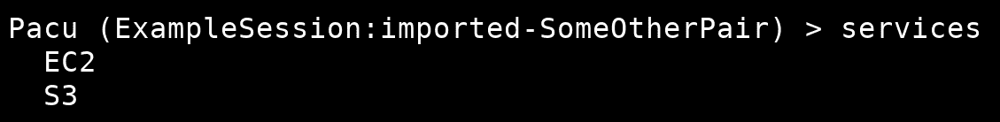

服务同时输出 EC2 和 S3，因为它们现在数据库中都有数据

这也意味着，如果我们愿意，我们可以运行`data S3`命令来获取任何 S3 数据。

# PACCUROXY 简介

在这本书中，人们已经多次提到了 PACCUROXY，但通常都会随意浏览一下。这是因为 PacuProxy 的目标是在攻击 AWS 环境时解决一个非常具体的问题，这通常超出了大多数移动到云的公司的安全态势。在一个非常基本的层面上，PacuProxy 只是另一个命令和控制框架，如 PowerShell Empire 和 MeterMeter，但与其他类似工具相比，PacuProxy 更面向云。

PacuProxy 的重要功能（除了一般 C2 功能，如有效负载生成、代理处理和模块）是直接集成到 Pacu 的工作流中。这意味着，当您破坏服务器（如 EC2 实例）时，您可以使用 PacuProxy 作为 C2 通道，基本上通过受损实例代理您的 Pacu 流量。这允许您从自己的计算机使用 Pacu 提供的所有功能，但所有流量都通过受损主机路由。当防守者查看日志并注意到您的恶意流量时，受损的 EC2 实例将显示为流量的来源，与他们不熟悉的随机 IP 地址相比，这看起来不那么可疑。

PacuProxy 还拥有自己的一组可以运行的模块，以及将功能集成到普通 Pacu 模块中的能力。一个例子是`systemsmanager__rce_ec2`模块。该模块滥用 AWS Systems Manager 服务，尝试在 EC2 实例上远程执行代码，但内置了与 PacuProxy 的集成，因此，如果您运行该模块时未指定在实例上运行的命令，并且您有 PacuProxy 侦听，它将自动生成一行 stager 并在主机上执行，让你完全控制它。

PacuProxy 特定模块的一个示例是从 EC2 元数据服务窃取凭据。您可以运行该模块，它将向该服务器上的元数据服务发出 HTTP 请求，以获取可能存在于其中的任何凭据，然后使用这些凭据在 Pacu 中创建一组新的密钥。然后，您将能够通过受损主机路由所有这些请求，而不会向 GuardDuty 或任何其他人通知发生了受损，即使所有内容都已安装并在您自己的主机上运行。

PacuProxy 仍处于最初创建时的早期阶段，因此本节保留了更多的技术细节，因为提供的任何技术细节可能很快就会过时。

# 总结

Pacu 提供了广泛的功能以及扩展现有功能的能力。它是为渗透测试 AWS 环境创建的第一个模块化攻击工具，由于它的支持，应该在未来很长一段时间内进行开发。在攻击 AWS 环境时，它是一个很好的优势，但它不是一个包罗万象的工具，因此学习攻击 AWS 的基本原理也很重要，而不是依赖其他人来为您自动化一切。

Pacu 仍在积极开发中，因此自撰写本文以来，功能可能会更改、添加或删除，因此在遇到问题时考虑到这一点很重要。Pacu 开发人员可以响应在 GitHub 中打开的问题和请求，因此这可能是支持运行 Pacu 的最佳资源。

在本章中，我们介绍了 Pacu 的基本用法及其提供的命令。我们还研究了如何为它编写第一个模块。希望您能够脱离本章，在 AWS pentests 期间高效地使用 Pacu 执行各种攻击。

在下一章中，我们将进一步介绍 AWS pentest 从头到尾的过程。这将帮助我们掌握真实世界的 AWS pentesting 场景，我们将如何以及何时使用 Pacu 等工具，以及如何围绕客户的需求和愿望开展工作。