# Kali NetHunter 简介

**黑客行为**对许多人来说都是一个有趣的话题，无论他们是在网络安全领域工作，还是只是对了解其具体操作方式感兴趣。通常，电视节目和电影都会将黑客纳入剧情。一些电视节目，无论是虚构的还是非虚构的，都是完全基于黑客的，其中著名的是《机器人先生》。在该节目中，一名年轻人利用现实世界的技术策划并实施了针对多个组织的各种网络攻击。

许多电视节目和电影经常显示黑客使用移动或其他手持设备渗透目标网络。这就引出了一个问题：是否有可能从手机等移动设备进行黑客攻击？这个问题的答案是*是*。我们被如此多的技术和如此多的智能设备所包围。想象一下，使用您的智能设备测试网络或系统的漏洞，并可能对其进行攻击；这肯定很酷。

在本章中，我们将介绍以下主题：

*   介绍 Kali NetHunter
*   Android 平台与安全模型
*   安装 Kali NetHunter

# 什么是 Kali NetHunter？

在本节开始之前，让我们先了解一下最流行的渗透测试 Linux 发行版 Kali Linux 的历史和发展。在曾经流行的 Kali Linux 之前，它的前身是**回溯**。追溯到 2006 年，由两家合并公司*Auditor Security Collection*和*Whax*创建。回溯操作系统是以 live CD 和 live USB 可引导介质的形式出现的，它允许渗透测试人员、系统管理员或黑客使用任何支持从 CD/DVD 和/或 USB 驱动器引导的计算机。由于 Backtrack 是一个基于 Linux 的操作系统，*live boot*简单地将任何一台计算机变成了网络上的黑客机器。

2011 年，Backtrack 演变为其最新版本，称为**Backtrack 5**。此时，Backtrack 包含了许多帮助渗透测试人员完成工作的工具和实用程序。 

回溯 5 中的一些工具包括：

*   **Metasploit**：Rapid7 创建的著名漏洞开发框架（[www.Rapid7.com](http://www.rapid7.com)）。
*   **SAINT**：由 SAINT 公司（[www.saintcorporation.com](http://www.saintcorporation.com)开发的知名漏洞评估工具。
*   **Maltego**：Paterva（[www.Paterva.com](http://www.paterva.com)创建的信息收集工具，利用数据挖掘技术，利用互联网上的各种资源。

2013 年，回溯分布发生重大变化；所有的支持都在演变为今天大家都知道的**Kali Linux**渗透测试 Linux 发行版时结束了。Kali Linux 的创建者，**攻击性安全**（[www.advance-Security.com](http://www.offensive-security.com)）从一开始就完全重新设计了回溯，使其成为基于*Debian 的*。Kali Linux 渗透测试平台附带了 600 多个预装工具，可以帮助渗透测试人员、安全工程师或取证人员履行职责。

Kali Linux 最初设计用于在计算机系统上运行，与它的前身类似，无论是实时启动（CD/DVD 或 USB）还是安装在本地硬盘驱动器上。2014 年，Kali Linux 的创始人进攻性安全公司发布了**Kali NetHunter。**该平台是为基于**Android**的设备发布的，通过取消使用台式机或笔记本电脑测试目标系统和网络的限制，为世界各地的渗透测试人员提供了更大的机会。

Kali NetHunter 允许渗透测试人员使用基于 Android 的设备，如智能手机或平板电脑，简单地四处走动。想象一下，在客户的系统上，特别是在其无线和内部网络上，分配一个安全审计是多么了不起，而执行审计所需要的只是一部智能手机

使用 NetHunter 进行渗透测试的一个示例场景是审核无线安全性，并测试组织网络中任何**自带设备**（**BYOD**策略的安全性。能够通过手持设备进行渗透测试非常重要，因为无线安全配置在网络中具有最多的安全漏洞。

有时，技术人员可能会在网络上部署无线路由器或**接入点**（**AP**），同时保留默认配置，包括默认或工厂分配的密码。在本书的学习过程中，我们将了解使用 Kali NetHunter 执行渗透测试的各种方法，以及如何利用可用的工具库对网络和系统执行成功的渗透测试。

# Kali NetHunter 中的工具

Kali NetHunter 平台具有 Kali Linux 中不可用的其他资源。这些额外的资源是专注渗透测试人员手中的强大工具。

# MAC 转换器

**此实用程序的名称说明了一切：它可以将设备的**网络接口卡**（**NIC**）的媒体访问控制（MAC）地址更改为随机值或测试仪定义的特定地址。Kali NetHunter 上的 MAC 转换器具有更改设备主机名的附加功能。这是一个非常有用的功能，可以帮助渗透测试人员进行社会工程攻击：**

 **

# MITM 框架

在网络上执行所有 MITM 攻击时，使用工具和实用程序的**中间人**（**MITM**框架。MITM 攻击是指黑客坐在受害者和其他设备之间，例如默认的互联网网关。攻击的目的是拦截沿途的所有交通。从下图中可以看出，从 PC 发送到 internet 的所有通信量（应直接发送到路由器（默认网关））均由上箭头指示。但是，如果网络上有攻击者，他们可以欺骗受害者的 PC，使其认为攻击者的机器现在是路由器（默认网关），并欺骗路由器使其相信攻击者的机器就是 PC：

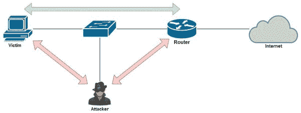

这是渗透测试仪的发电站。它的一些功能包括密钥记录、**地址解析协议**（**ARP**）缓存中毒攻击、欺骗和使用 SSLStip+功能的 SSL 剥离攻击。以下是 NetHunter 上 MITM 框架的主窗口：

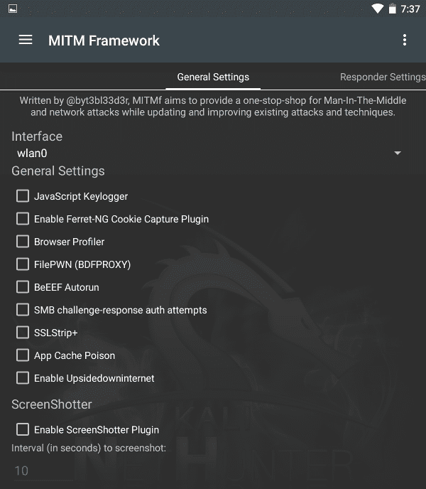

向右滑动，您将遇到另一部分，**欺骗设置**，这将允许渗透测试人员轻松在网络上执行 MITM 攻击：

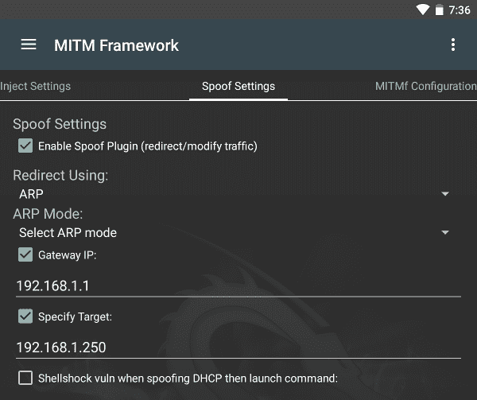

# 隐藏攻击

一次**人机界面设备**（**HID**攻击将 Kali NetHunter 设备（如支持**移动中的**（**OTG**的智能手机）转换为预编程键盘。如果渗透测试仪使用 OTG 电缆来创建 KALI NNTUNDER 设备和胡氏 T8T 目标计算机之间的物理连接，NetHunter 具有创建攻击向量的能力。vector 使用手机硬件和软件的组合来创建预编程键盘。预编程键盘的目的是将脚本攻击注入目标系统。

根据 Kali NetHunter 的官方文档，USB HID 攻击仅在**Teensy**设备上可用。Teensy 设备可在[找到 https://www.pjrc.com/teensy/](https://www.pjrc.com/teensy/) 。

# 猎鸭人躲了起来

USB 橡皮鸭由团队在**Hak5**（[www.Hak5.org](http://www.hak5.org)创建。它的目的是将每分钟 1000 字以上的有效负载注入目标设备。Kali NetHunter 允许渗透测试人员编写自定义或使用现有的*ducky*脚本，只需使用 DuckHunter HID 攻击功能即可将 ducky 脚本转换为 NetHunter HID 攻击格式。

要为 USB 橡皮鸭创建有效载荷，请访问[https://ducktoolkit.com/](https://ducktoolkit.com/) 了解更多信息。

Kali NetHunter 支持在 NetHunter 的 HID 攻击中转换**USB 橡皮鸭**脚本。什么是 USB 橡皮鸭？USB Rubber Ducky 是一款基于硬件的工具，看起来像 USB 闪存驱动器。

下面是一只 USB 橡皮鸭的图片。正如我们所看到的，ducky 有一个带有可移动 microSD 存储卡的主板。USB 橡皮鸭插入计算机的 USB 端口后即可通电。收到电源后，ducky 主板上的固件会检查 microSD 存储卡上是否存在任何有效负载。常规 USB 拇指驱动器不支持模块化外形，因此 USB 拇指驱动器不允许用户使用 microSD 卡扩展或更换闪存：

# badubmitm 攻击

到目前为止，您可能已经注意到在 Kali NetHunter 平台上存在一些惊人的基于 HID 和 USB 的攻击。*BadUSB MITM 攻击*允许渗透测试人员简单地使用 OTG 电缆在受害者的计算机和 NetHunter 设备之间创建物理连接。一旦建立连接，所有离开受害者计算机的网络流量将发送到 NetHunter 设备：

这种类型的攻击称为**中间人**（**MITM**）攻击，因为 NetHunter 设备将自身植入受害者的计算机与互联网或其正在传输数据的任何其他网络之间。

# MANA 无线工具包

即使您刚开始进行渗透测试，您也可能听说过一个名为**Aircrack ng**的无线安全审计框架。Kali NetHunter 上的 MANA Wireless Toolkit 的功能与 Aircrack ng 类似。法力可以创建邪恶孪生接入点并执行 MITM 攻击。

**邪恶孪生兄弟**是黑客植入组织的未经授权 AP。其目的是欺骗不知情的员工建立连接并通过网络传输敏感信息。通过使用邪恶孪生兄弟，黑客将能够轻松拦截和重新路由用户流量。

此工具允许渗透测试仪在创建邪恶孪生兄弟时配置以下内容：

*   **基本业务集标识符**（**BSSID**）：BSSID 是无线路由器或 AP 的**媒体访问控制**（**MAC**）。
*   **服务集标识符**（**SSID**）：SSID 是笔记本电脑、智能手机、平板电脑等看到的无线网络的名称。
*   **信道**：该信道在频谱上也称为无线频带。

# 软件无线电

**软件定义无线电**（**SDR**功能允许渗透测试人员结合使用**HackRF**设备（物理组件）和 Kali NetHunter Android 设备，使用各种无线无线电频率和空间。SDR 黑客攻击允许恶意用户监听无线电频率，从而使他们能够拦截警方扫描仪、飞机无线电传输等。

# 网络映射器

如果没有流行的网络扫描工具**网络映射器**（**Nmap**，渗透测试人员的工具包是不完整的。这被称为网络扫描器之王**，因为它比典型的网络扫描器做得更多。扫描允许渗透测试人员对目标进行分析，它有助于识别操作系统以及打开和关闭的端口，检测漏洞，确定正在运行的应用程序的服务版本，等等。**

以下是使用 NetHunter 应用程序上的 Nmap 扫描菜单提供的选项：

NMap 有很多好处：

*   可以确定目标的操作系统
*   检测 TCP 和 UDP 端口
*   通过执行横幅抓取来检测服务版本
*   检测目标设备对各种攻击和恶意软件的漏洞
*   可以使用诱饵特征来减少被发现的机会

# Metasploit 有效载荷生成器

渗透测试中最具挑战性的阶段之一是开发或获取阶段。有时渗透测试人员可能会使用**Metasploit Framework（MSF）**中的现有漏洞；但是，如果目标系统经过修补以防止此类攻击，则该攻击极有可能失败。MSF 中有**msfvenom**有效载荷生成器实用程序，它允许渗透测试仪创建定制的有效载荷。

Metasploit 有效载荷生成器允许渗透测试仪使用以下选项轻松创建有效载荷：

*   输出类型，如 ASP、Bash（`.sh`）、PHP、Powershell（`.ps1`）、Python（`.py`）、Windows（`.exe`）和等。此功能允许为特定平台制作有效负载。
*   设置 IP 地址和端口号。
*   有效负载选项可以是默认的 MSF 格式或命令提示符（CMD）。

以下是 Kali NetHunter 上 Metasploit 有效负载生成器的界面，我们可以看到各种可用选项，以及使用此应用程序创建有效负载的简单程度。完成后，有效负载可以发送到我们 Android 设备上的本地存储或 HTTP 地址：

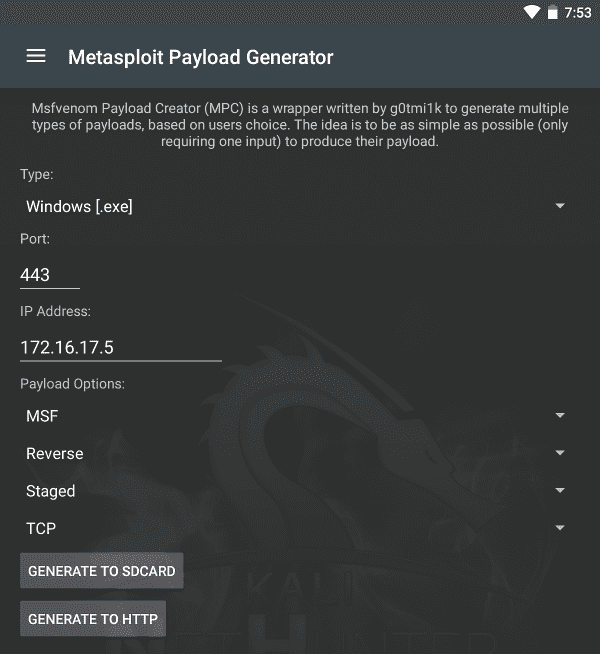

创建的有效载荷可以采用以下形式：

*   **反向或绑定**：受害者的终端（外壳）在受到攻击时被发送回攻击者，这称为反向连接。当攻击者成功破坏目标系统时，即会发生绑定外壳，该系统会自动获得一个外壳。

*   **分阶段或无阶段**：在阶段有效载荷中，开发分阶段进行。攻击向目标系统发送初始有效载荷；一旦泄露，剩余的有效载荷将下载到受害者的系统上。在无阶段有效负载中，单个有效负载使用其所有功能精心编制，并发送给潜在的受害者。

# 搜索页面

渗透测试人员有时可能需要已知的工作漏洞来攻击目标系统上的特定漏洞。**漏洞 DB**（[www.exploit-DB.com](http://www.exploit-db.com)）是团队在**攻击性安全**（[www.official-Security.com](http://www.offensive-security.com)维护的一个流行漏洞库。漏洞数据库包含许多由其社区开发和测试的漏洞，包括网络安全中的渗透测试人员和漏洞研究人员。

**searchsploit**工具允许渗透测试人员简单地搜索漏洞并将其直接下载到他们的 Kali NetHunter 设备上。该工具将向漏洞利用数据库官方存储库查询用户输入的任何搜索参数。一旦漏洞被下载，渗透测试仪可以按原样交付有效载荷或定制有效载荷以适应目标：

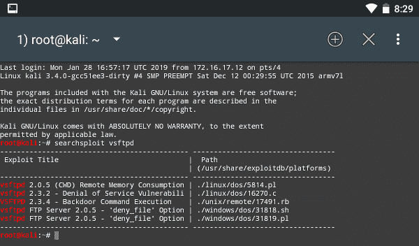

有关 SearchSploit 的完整手册，请访问[https://www.exploit-db.com/searchsploit](https://www.exploit-db.com/searchsploit) 。

# Android 平台与安全模型

Android 是一种流行的移动操作系统，它基于 Linux 的修改版本。另一个好处是开源，这为开发者和爱好者提供了在 Android 上创建自定义应用程序和修改的机会。基于 Linux 有很多好处，比如运行各种基于 Linux 的工具和实用程序。

当时，市场上有许多竞争对手，其中一些是在设备上使用 WebOS 操作系统的惠普（HP）、苹果的 iOS、微软的 Windows Phone 操作系统、黑莓的 RIM 操作系统以及在某些上使用的 Symbian 操作系统第一代手机制造商，如诺基亚。

# Android 架构

与所有操作系统一样，Android 的体系结构可以分层查看，包括体系结构的所有组件，如下所示：

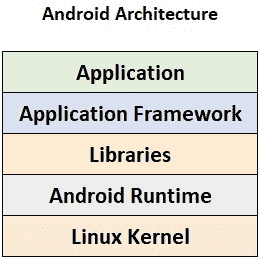

# 应用层

应用层包含移动设备的应用程序。这些应用程序包括浏览器、拨号器、通讯录、时钟和闹钟，通常显示在主屏幕上。

# 应用程序框架层

应用程序框架层允许基于 Android 的应用程序（如拨号器）与应用程序框架交互，应用程序框架反过来管理用于资源和语音呼叫管理的基本移动功能。

以下组件位于 Android 操作系统的应用框架内：

*   **软件包管理器**：跟踪当前安装的基于 Android 的应用程序。
*   **活动管理器**：处理设备上所有正在运行的应用程序的生命周期。
*   **内容提供商**：允许应用程序之间共享数据。
*   **电话经理**：负责建立、维护和终止设备上的通话。
*   **定位管理器**：管理**全球定位系统**（**GPS**等定位功能。
*   **资源管理器**：负责设备上应用中使用的资源类型。
*   **通知管理器**：在设备屏幕上显示通知和警报。
*   **Java API 框架：**允许开发人员创建使用 Java 编程语言编写的应用程序。这些框架允许安卓操作系统执行这些应用程序。

# Android 库

Android 使用一个用 C 和 C++编写的本地库，负责处理移动操作系统中的各种数据类型。

以下是它使用的一些库：

*   **媒体框架**：负责提供各种类型的媒体编解码器，允许录制和播放所有媒体类型，如 MP3 和 WAV。
*   **SQLite**：在基于 Android 的设备中用于数据存储的数据库。
*   **OpenGL/ES&SGL**：在设备屏幕上处理二维和三维计算机图形的渲染。
*   **WebKit**：负责使用网络浏览器引擎显示网页。

# 运行时环境

**Android 运行时**（**艺术**）允许每个应用程序在自己的进程和实例中执行，就像桌面上的虚拟机一样。ART 设计用于在智能手机和平板电脑等低内存设备上运行这些“虚拟实例/机器”。

# 内核

最重要的是，我们不能忘记 Android 操作系统背后的大脑，即负责与手持设备硬件组件接口的内核。Android 基于 Linux 操作系统当前的长期支持内核。在 Android 的开发过程中，对 Linux 内核进行了修改，以更好地满足移动操作系统的需求和功能。内核上的一个修改阻止用户在 Android 平台上安装原始 Linux 软件包。

# 安卓安全模型

为了更好地理解安卓的安全态势，我们将研究安卓背后的安全模型。我们将看看谷歌和安卓团队如何采取必要的额外措施来保护安卓设备及其用户的生态系统。

确保开源操作系统的安全有其挑战，Android 使用多层安全系统来保护其用户和平台。每个安卓设备通常都有一套由谷歌提供的安全服务，让我们看看其中的一些。

# 安卓设备管理器

**Android 设备管理器**既是一个 web 应用程序，也是一个移动应用程序，可用于跟踪您的 Android 智能手机或平板电脑。它可以播放声音，通过远程应用锁屏保护设备，从 Google 帐户远程注销您的 Android 设备，在锁屏上显示消息，并在设备被盗时远程擦除设备。

要访问 Android 设备管理器的功能，只需访问计算机上的 Google Play 商店或在智能设备上使用 Google Play 应用程序，然后搜索**Android 设备管理器**或**Google 查找我的设备**，如以下屏幕截图所示：

登录后，您将看到所有可用功能：

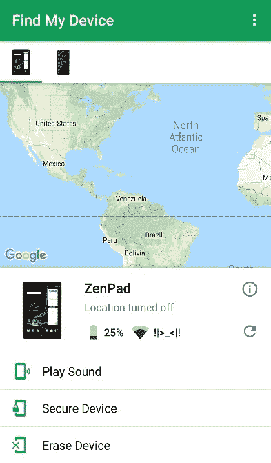

# 安全网

SafetyNet 保护基于 Android 的设备免受安全威胁，如恶意 URL、任何可能有害的应用程序和恶意软件感染，并检测设备是否已扎根。它通过持续监视应用程序和服务以防止设备上的任何威胁来保护用户。

# 验证应用程序

Android 操作系统可以检测设备上运行的有害应用程序或试图在设备上安装自己的应用程序。此功能将通知用户或自动阻止应用程序在设备上执行。此功能利用 Google Play Protect 的功能，定期扫描当前安装在设备上的应用程序以及用户试图安装的应用程序，以查找恶意迹象。此功能存在于 Android 操作系统安全性中。

谷歌持续监控应用程序；如果检测到某个应用程序是恶意的，Android 设备的屏幕上将显示一条通知，鼓励用户卸载该应用程序。这确保了 Android 用户的安全和隐私得到维护。

# 应用服务

应用程序服务允许本地安装在设备上的基于 Android 的应用程序利用基于云的服务和功能。基于云的服务和功能的一个例子是数据备份。应用服务的一个例子是 Android 设备设置菜单中的备份和重置功能。在用户许可的情况下，Android 可以自动将其设置备份到 Google 设备，因此在设备上重置出厂设置的情况下，可以轻松恢复配置。此外，应用程序服务总是有许多 Android 应用程序支持云备份和恢复功能。

# Android 更新

此功能负责检查和检索新软件版本的 Android 更新。这些更新通常由 Android 开发团队创建。智能手机制造商可以修改更新以适应其设备，并使用**无线**（**OTA**更新）将其交付给各种设备，或将其发布在其支持页面上，这将允许用户手动下载和更新其设备。

更新对于设备的安全非常重要。更新通常用于添加新功能和修复操作系统上的任何安全漏洞。Android 具有模块化的特定于安全的更新，因此为智能手机制造商提供了灵活性，可以更快地推动安全更新，同时比优先级不高的更新花费更多的开发时间。

# 谷歌游戏商店

谷歌 Play 商店是 Android 设备的官方应用（应用）商店。Google Play 服务通过 Google Play 商店为购买的应用程序提供许可验证，并对恶意应用程序执行连续安全扫描。

# 谷歌游戏保护

Google Play Protect 是 Google 为 Android 创建的移动威胁防护服务。这项服务包括内置的恶意软件保护，使用谷歌设计的机器学习技术和算法。

以下是安卓智能手机上谷歌 Play Protect 屏幕的截图；它显示两个可由用户手动启用或禁用的功能：

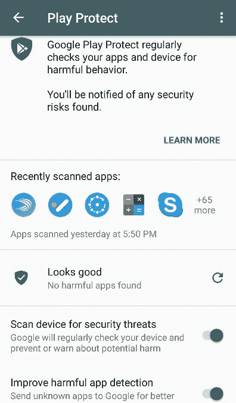

正如我们所看到的，Google Play Protect 将定期扫描本地设备，查找潜在的有害应用程序和威胁。因此，不需要用户干预——这一过程对我们来说是自动化的。

# 安装 NetHunter

Kali NetHunter 最初是为谷歌 Nexus 设备创建的，比如**Nexus 4 和****Nexus 5**智能手机以及**Nexus 7**和**Nexus 10**平板电脑。后来扩展到了**OnePlus 一款**智能手机，攻击性安全声明是*首选手机形式 factor NetHunter 设备*。在撰写本文时，Kali NetHunter 在来自不同制造商的各种设备上得到支持，如谷歌、OnePlus、三星、LG、HTC 和索尼。让我们看看如何在 Android 设备上安装 Kali NetHunter（在设备上安装 Kali NetHunter 之前，无论是智能手机还是平板电脑，请查看[上支持的设备列表）https://www.offensive-security.com/kali-linux-nethunter-download/](https://www.offensive-security.com/kali-linux-nethunter-download/) 或位于[的攻击性安全 Kali NetHunter GitHub 存储库中支持的设备和 ROM 列表 https://github.com/offensive-security/kali-nethunter/wiki](https://github.com/offensive-security/kali-nethunter/wiki) ：

1.  从[为您的设备下载 Kali NetHunter 的官方版本 https://www.offensive-security.com/kali-linux-nethunter-download](https://www.offensive-security.com/kali-linux-nethunter-download) 。下载的文件应该压缩。确保在继续之前验证哈希值。如果散列值不匹配，请不要使用它。如果您想创建 Kali NetHunter 的自定义版本，请参阅*构建 Kali NetHunter 以获取特定设备*部分。
2.  解锁您的 Android 设备。在 Android 设备上安装 Kali NetHunter 时，安装将在 Android 操作系统上进行。在执行以下步骤之前，请确保在您的计算机上安装并配置了必要的 Android 驱动程序。为此，请确保您的计算机上安装了*Android Studio*的副本。此软件可在[找到 https://developer.android.com/studio](https://developer.android.com/studio) 。Android Studio 将确保设备驱动程序安装正确且兼容。

3.  将设备设置为开发人员模式。导航到“设置”| About 并轻触构建编号几次，直到您看到一条通知，说明已启用开发人员模式。
4.  转到设置|开发者选项并启用高级重新启动和 Android 调试选项：

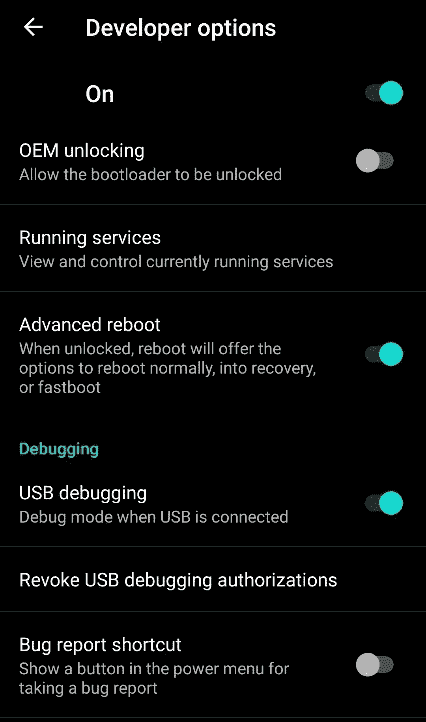

5.  为设备设置根目录（适用于 Nexus 和 OnePlus）。如果您使用的是*Nexus*设备，您可以使用**Nexus 根工具 KI****t**（[http://www.wugfresh.com/nrt/](http://www.wugfresh.com/nrt/) 。root toolkit 是一个*一体式*工具，用于安装设备驱动程序、解锁设备引导加载程序以及安装自定义恢复，例如**Team Win recovery Project（TWRP）**：

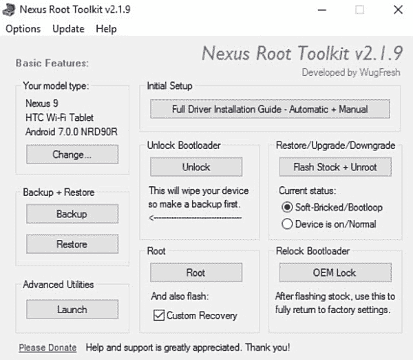

6.  选择初始设置选项**完整驱动程序安装指南**，然后按照安装向导进行操作。
7.  如果设备未解锁，请解锁引导加载程序。此过程将擦除整个设备。请确保在执行此步骤之前创建设备的备份。

8.  让我们*根目录*您的 Android 设备。点击**根目录**。如果您正在使用 Nexus，您将在屏幕上的**自定义恢复**旁边看到一个复选框，请确保取消选中该复选框。

9.  您的设备将自动重新启动。要验证您的设备是否已成功植根，您应该在设备菜单中看到一个名为***SuperSU***的新图标/应用程序。打开应用程序将验证设备的状态，无论是否授予 root 访问权限。

对于 OnePlus 设备，有专门为此设备制作的根工具，称为**培根工具包**（[http://www.wugfresh.com/brt/](http://www.wugfresh.com/brt/) ）。此外，进攻性安全团队还提供了使用 Windows 和 Linux 安装 Kali NetHunter 的详细过程。该指南可在[找到 https://github.com/offensive-security/kali-nethunter/wiki/Windows-install](https://github.com/offensive-security/kali-nethunter/wiki/Windows-install) 。如果您正在使用 Linux，请访问[https://github.com/offensive-security/nethunter-LRT](https://github.com/offensive-security/nethunter-LRT) 。

10.  前往谷歌 Play 商店安装**BusyBox**应用程序：

11.  安装**TWRP 管理器**应用程序。您也可以使用可从[下载的 APK 安装 TWRPhttps://twrp.me](https://twrp.me)

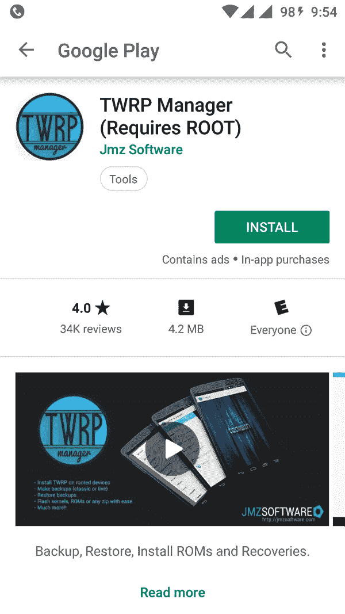

安装两个应用程序后，打开每个应用程序以确保它们正常运行。如果需要超级用户权限，只需选择“授予”或“允许”

12.  复制 Kali NetHunter 映像并将其粘贴到设备的根目录中。是时候安装自定义恢复了。
13.  打开**TWRP 管理器**应用，选择**恢复版本安装**选项。要开始安装，请单击**安装恢复**。
14.  从提供的选项重新启动设备：

15.  点击**安装**并选择目录中的 Kali NetHunter 映像 ZIP 文件。此时，自定义恢复会将 Kali NetHunter 闪存到您的设备上，并自动重新启动。

# 为特定设备构建 Kali NetHunter（可选）

许多智能手机制造商，如 OnePlus、三星、谷歌和 LG，每年生产各种各样的手机。你可能想知道，*我是否需要购买另一款基于 Android 的智能手机来托管 Kali NetHunter 平台？*答案很简单：*你没有*。为我们提供的好处之一是能够为我们的 Android 设备构建自定义版本的 NetHunter。在*步骤 3*中，您可以选择设备类型和智能手机当前运行的 Android 版本；这是为了确保输出文件与您的 Android 手机兼容。

如果您想从官方 GitHub 存储库构建自己的 Kali NetHunter 映像，请使用以下步骤：

1.  使用`git clone https://github.com/offensive-security/kali-nethunter`命令下载存储库：

2.  确保使用`cd kali-nethunter/nethunter-installer`命令将目录更改为新文件夹。接下来，在终端上运行`./bootstrap.sh`命令。在尝试在系统上下载任何设备文件夹之前，将出现一个交互式提示，询问一些问题：

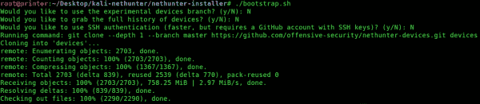

3.  使用`python build.py –h`命令查看可用于为您的设备构建自定义 Kali NetHunter 映像的选项：

要构建图像，我们可以使用`python build.py -d *<device>* --*<android version>*`语法。

如果您想为运行 Android Kitkat 的 Nexus 7（2013）设备构建 Kali NetHunter，可以使用`python build.py –d flo –kitkat`命令。

4.  构建完成后，输出将是一个存储在`nethunter-installer`目录中的`.zip`文件。只需将`.zip`文件复制到 Android 设备的根文件夹中，就可以进入 Kali NetHunter。

要在目录中快速找到`.zip`文件，请使用`ls –l |grep .zip`命令仅查看 ZIP 文件。

# 附加可选硬件

作为网络安全领域经验丰富或即将到来的渗透测试人员，如果没有外部网络接口卡（NIC）在 IEEE 802.11 无线网络上进行数据包注入，您的工具和组件库是不完整的。清单中的每一项都是由攻势安全团队推荐的，因为它们大多与标准的基于 Android 的移动设备兼容。这些外部 NIC 将允许渗透测试仪执行各种无线攻击，例如：

*   窃听，即监听目标的无线网络
*   捕获网络流量以供日后分析，包括可能通过网络传递的机密信息
*   捕获 WPA 握手以尝试执行各种密码破解技术
*   取消身份验证攻击

每个外部 NIC 都包含芯片组，允许 Kali Linux 和 Kali NetHunter 操作系统启用监视模式来执行这些攻击。

以下是使用 Android 智能手机的 Kali NetHunter 支持的外部无线网络接口卡（NIC）列表：

*   Atheros-ATH9KHTC（AR9271、AR7010）
*   Ralink-RT3070
*   Realtek-RTL8192CU
*   TP 链路 TL-WN722N
*   TP 链路 TL-WN822N v1-v3
*   阿尔法网络 AWUS036NEH
*   阿尔法网络 AWUS036NHA

*   阿尔法网络 AWUSO36NH
*   熊猫 PAU05 纳米

以下是 TL 链路 TL-WN722N 无线 NIC 的图片：

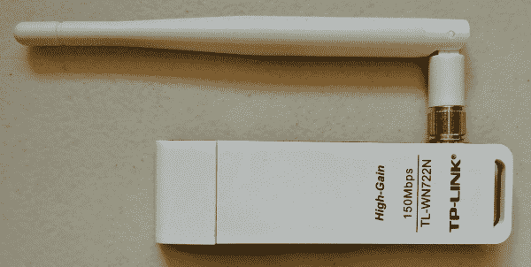

Alfa 网络适配器在渗透测试人员中很受欢迎，因为它们在 Kali-Linux 平台上具有可移植性和易用性。以下是 Alfa Networks AWUS036NHA 适配器的图片，该适配器支持 IEEE 802.11 b/g/n 标准，速度高达 150 Mbps：

# 总结

在本章中，我们探讨了使用手持设备（如智能手机或平板电脑）进行渗透测试的好处和便利性。然后我们介绍了 Kali Linux 的移动平台 NetHunter。我们讨论了在 Kali NetHunter 平台上预加载的独特工具和实用程序。我们了解了安卓安全模型，并探讨了其安全功能，这些功能的实现有助于保护安卓用户。本章最后介绍了如何安装 Kali NetHunter。

在下一章中，我们将探讨渗透测试的方法及其阶段。**