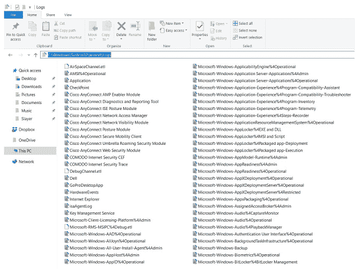
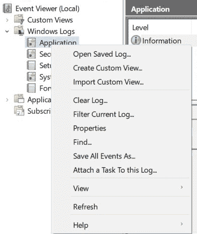
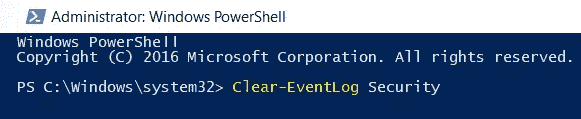
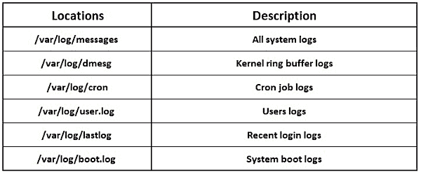
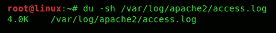
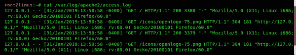

# 六、从目标中清除踪迹并移除证据

渗透测试过程中最重要的一个方面是确保系统上没有任何泄露痕迹。像黑客一样，你的目标可能是破坏目标系统或网络，但是，在终止连接或退出受害者系统时，不留下任何日志或剩余数据非常重要。此外，在渗透测试期间，可能会生成在系统和网络上留下痕迹的附加数据。

在本章中，我们将介绍以下主题：

*   清除 Windows 上的日志
*   在 Linux 上清除日志
*   从目标中删除文件

让我们潜水吧！

# 清除轨道

网络安全领域正以指数级速度增长；需要专业人员帮助打击和保护组织和公民免受网络威胁和威胁行为者的威胁，这一需求非常迫切。网络攻击可以是网络钓鱼、电子邮件、恶意软件感染，甚至勒索软件攻击；网络安全组织和认证机构，如欧共体理事会和 GIAC，认为数字世界中的取证需要有助于调查，以确定发生了什么，攻击是如何发生的，威胁行为人，以及更多可以帮助法庭起诉的细节。

在网络安全中，安全事件是指由组织的系统或网络触发的事件，表明存在危害。安全事件的一个例子是员工计算机上运行的恶意文件。反恶意软件保护软件将检测并触发警报进行调查。

数字取证领域为许多新工作打开了大门，如第一响应者、事件处理者、网络取证调查员和恶意软件研究人员。这些标题中的每一个都有一个共同的目标：确定系统是如何被威胁参与者破坏的。对于用户或应用程序在系统上执行的任何操作，都会生成并存储一条系统日志消息，以便于问责。在法医调查期间，检查员通常试图从系统中检索日志。日志消息将指示安全事件的整个历史记录。

# 日志类型及其位置

在这一节中，我们将讨论渗透测试仪应该考虑移除的各种类型的日志，以及这些日志可以在哪里找到。

# DHCP 服务器日志

这些日志负责网络上的 IP 地址分配。此日志存储潜在 DHCP 客户端和 DHCP 服务器之间发生的所有事务。最重要的是，客户端的**媒体访问控制**（**MAC**地址将存储在日志消息中。以下是 DHCP 服务器日志的位置：

*   DHCP 日志存储在 Windows 系统的`%SystemRoot%\System32\dhcp`目录中。
*   在 Linux 上，要查看 DHCP 日志，可以使用`cat /var/log/syslog | grep -Ei 'dhcp'`命令。

# 系统日志消息

当一个组织内发生网络攻击时，无论是 MITM 还是作为僵尸机器（僵尸网络军队的一部分）的系统，都会进行调查。法医调查员不仅在计算机、笔记本电脑和服务器上进行调查和分析，而且在网络上进行调查和分析。对于网络上发生的每个会话或事务，防火墙、入侵检测/预防系统（IDS/IPS）和其他网络安全设备等设备都会生成所有流量的日志。设备使用**Syslog**协议和框架以统一格式生成日志消息，其中包含网络专业人员需要并理解的所有必要细节。

在 Linux 系统上，系统日志位于`/var/log/syslog`。

# 数据包分析

此外，调查人员通过网络取证进行数据包分析，观察网段上的任何异常情况。数据包分析允许调查人员确定以下内容：

*   袭击的起因
*   上载和下载的文件
*   网络上的流量类型
*   攻击时间
*   提取的工件，如文件
*   URL 和域
*   袭击中的受害者机器
*   遥测信息

# Web 服务器日志

这些日志存储 web 服务器和客户端 web 浏览器之间所有 web 活动的日志消息。以下是每个 web 服务器的位置：

*   **互联网信息服务器**（**IIS**日志文件位于`%SystemDrive%\inetpub\logs\LogFiles`中。
*   Red Hat 中的 Apache、CentOS 和 Fedora 日志存储在`**/**var/log/httpd/access_log`和`/var/log/httpd/error_log`中。
*   对于 Debian 和 Ubuntu 系统，Apache web 服务器日志可在`/var/log/apache2/access_log`和`/var/log/apache2/error_log`中找到。
*   FreeBSD Apache 日志位于`/var/log/httpd-access.log`和`/var/log/httpd-error.log`。

# 数据库日志

在渗透测试期间，您的任务可能是操作目标数据库，无论是创建、修改、删除还是提取信息。在此过程中，数据库生成自己的日志消息集。

Microsoft SQL Server 的数据库日志可在`\\Microsoft SQL Server\MSSQL11.MSSQLSERVER\MSSQL\DATA\*.MDF`和`\\Microsoft SQL Server\MSSQL11.MSSQLSERVER\MSSQL\DATA\*.LDF`找到。调查人员可检查数据库中的错误日志，查看是否存在任何可疑活动，这些活动可在`\\Microsoft SQL Server\MSSQL11.MSSQLSERVER\MSSQL\LOG\ERRORLOG`中找到。

# 事件日志

事件日志是在有用户干预和无用户干预的情况下对系统执行的操作的记录。事件的安全日志如果用户已成功访问系统或登录尝试失败，则会记录启动或终止操作系统上程序的应用程序日志。事件日志记录系统上发生的一切，从通电到关机。

在 Windows 10 操作系统中，事件日志存储在注册表中的以下键位置：

`HKLM\System\ControlSet00x\Services\EventLog`

要查看 Windows 10 上可用事件日志的列表，请使用`wevtutil el`命令：


此外，使用`wevtutil gl <name of log>`命令将显示所选日志的配置信息：


此外，Windows 系统日志存储在本地系统的`C:\Windows\System32\winevt\Logs`中：



简单地修改或删除存储在这些位置的日志文件将对法医调查小组提出挑战；很难确定攻击的实际顺序，从而减少被抓住的机会。

# 清除 Windows 上的日志

在 Windows 操作系统中，**事件查看器**是一个在单个仪表板中显示所有**应用程序**、**安全性**、**设置**和**系统日志**的应用程序。要访问**事件查看器**，请单击**启动****Windows 管理工具****事件查看器**：



要在 Windows 上打开**事件查看器**的另一种方法，只需按键盘上的 Windows+*R*打开**运行**提示，然后键入`eventvwr.msc`并点击**确定**。

在**事件查看器**窗口中，只需选择**动作**窗格上的**清除日志**功能即可清除日志。要清除特定类别的日志，例如驻留在**应用程序**组中的所有日志，只需右键单击组名称并选择**清除日志**。

# 使用 PowerShell 清除 Windows 中的日志

PowerShell 是一个非常强大的命令行界面，它为系统管理员提供了对系统的大量控制，以便在 Windows、MacOS 和 Linux 操作系统中快速执行和自动化操作和任务。

要开始，请单击 Windows 口音上的，这是桌面左下角的开始图标，然后键入`powershell`。将出现 Windows PowerShell 应用程序，只需单击它即可启动，如以下屏幕截图所示：


确保您以管理员身份运行**Windows PowerShell**。以管理员权限运行程序或应用程序将删除标准用户将遇到的任何类型的限制。这些限制将包括安全特权。

现在，让我们做一些练习来清除日志：

*   **练习 1：清除所有事件日志**

使用`wevtutil el | Foreach-Object {wevtutil cl “$_”}`命令将清除 Windows 上的事件日志：


执行命令后，日志现在被擦除，如**事件查看器**中所示：


*   **练习 2：从计算机上清除特定日志**

`Clear-EventLog`命令允许管理员清除/擦除特定事件类别中的所有日志消息。使用此命令的语法为`Clear-EventLog <LogName>`：



如果您还记得，使用`wevtutil el`命令将为您提供系统上的日志类别列表。

使用`Get-Help`参数，然后使用`Clear-EventLog`*cmdlet 将为您提供其他选项：*

 *

我们已完成 PowerShell 练习。在下一节中，我们将了解如何使用命令提示符清除日志。

# 使用命令提示符清除 Windows 中的日志

在本节中，我们将了解如何使用命令提示符清除 Windows 操作系统上的日志：

*   **练习 1：清除单个日志**

之前，我们使用 Windows 命令提示符上的`wevtutil el`命令查看日志类型/类别列表。我们可以使用`wevtutil cl`后跟特定日志来擦除/清除日志类别中的条目：


此外，`clear-log`语法可以用作`cl`的替代：


*   **练习 2：使用单个脚本清除所有日志**

当我们运行`wevtutil el`命令时，我们看到了一长串事件日志类别。但是，清除每个类别相当耗时，因此请使用以下脚本在执行时清除每个类别：

```
for /F "tokens=*" %1 in ('wevtutil.exe el') DO wevtutil.exe cl "%1"
```


正如我们在前面的屏幕截图中所看到的，在执行我们的命令之后，每个日志文件都将被清除。在下一节中，我们将讨论在 Linux 中清除日志的方法。

# 在 Linux 中清除日志

与所有操作系统一样，日志也会生成并存储在基于 Linux 的系统上。日志文件是系统上发生的所有活动的记录。以下是 Linux 日志文件的一般位置：




以下是 Linux 系统上的其他日志位置：

*   **示例 1：使用空**清除日志

在本例中，我们将使用 null（一个不存在的对象）来删除文件的内容。我们将在 Linux 系统上清除 Apache`access.log`文件的日志。空对象是操作系统中没有任何属性或特征的实体。

要查找文件的位置，请使用后跟文件名的`locate`命令。在本练习中，我们使用`locate access.log`命令显示包含`access.log`字符串序列的所有文件的位置：


此外，我们可以在 Linux 中使用属于包的发现文件，并使用`locate apache2 | grep “access.log”`命令过滤搜索。

接下来，我们将使用`cat`命令和文件路径来确定是否存在任何日志条目：


如我们所见，前面的屏幕截图包含`access.log`文件中的条目。另外，我们使用`du –sh <filename>`命令来确定文件大小；如果为 0 KB，则文件为空；如果文件大小大于 0 KB，则文件包含以下条目：



现在我们将使用`cd /var/log/access.log`命令将目录更改为`access.log`文件的位置，并将 null 重定向到该文件：


如果我们再次对文件使用`cat`命令，我们会看到没有条目，文件大小为 0 KB：


*   **练习 2：使用 True 实用程序**清除日志

另一种从文件中清除/删除日志的技术是使用`True`实用程序。我们已经为我们的 web 服务器生成了一些流量，如以下屏幕截图所示：



目前，我们的文件大小为 8 KB：


使用`true`命令，后跟文件名或文件路径，将删除条目：


`true`命令/实用程序有一个描述，说明它不工作或什么也不做，成功。

现在，我们可以验证文件中是否没有条目，文件大小是否为 0 KB：


*   **使用流量计清除 Windows 日志**

在 Metasploit 框架中，存在一个非常先进且动态可扩展的有效负载，称为**计量器**。在渗透测试的攻击阶段使用此实用程序，将允许您在目标系统上执行 stager 有效负载，这可以在目标和攻击者的机器之间创建绑定甚至反转外壳。

Metasploit is an exploitation-development framework created by Rapid7 ([www.rapid7.com](http://www.rapid7.com)). It allows penetration testers to gather information about a target, discover vulnerabilities, create and deliver exploits and payloads onto a target, and create backdoors. It's like a penetration tester toolkit for discovering and exploiting vulnerabilities.

MeterMeter 设计为隐蔽、强大、和可扩展。一旦系统被成功利用，您可以使用`clearev`命令清除`Application`、`System`和`Security`的以下日志：


正如我们在前面的屏幕截图中所看到的，MeterMeter 正在清除目标系统上每个类别的日志。还列出了清除的条目数。

# 总结

在本章中，我们讨论了在渗透测试期间，在模拟对目标系统和网络的攻击时，如何保持隐蔽。我们讨论了各种类型的日志及其位置。此外，我们还研究了一些场景，在这些场景中，我们使用各种技术来清除 Windows 和 Linux 操作系统上的日志。

在下一章中，我们将介绍*包嗅探和流量分析*。我们将使用不同的技术捕获流量，并使用各种工具进行分析，以获取机密信息。*