# 七、包的嗅探和流量分析

在侦察或信息收集、渗透测试阶段，我们掌握的有关目标的信息和细节越多，就越有可能成功利用目标系统或网络上的漏洞。我们将了解 Kali Linux 和 NetHunter 中的各种嗅探和网络流量分析工具和实用程序。

在本章中，我们将介绍以下主题：

*   使用各种工具捕获网络流量
*   数据包分析

让我们潜水吧！

# 嗅探流量的必要性

为什么渗透测试人员需要了解包嗅探的好处？数据包嗅探使渗透测试仪能够监视和捕获沿网络段的网络流量。在计算机网络上嗅探也是一种窃听。窃听涉及将设备沿电线（如网络电缆或电话线）植入通信中，以监控和捕获敏感数据。

以下是一些可由数据包嗅探器捕获的敏感信息示例：

*   Telnet 通信量
*   FTP 用户名和密码
*   DNS 流量
*   网络流量
*   电子邮件流量
*   通常以明文格式发送任何用户名和密码

这些只是少数，但是更多的信息是以比特的形式通过网络发送的。嗅探器可以是基于硬件的，也可以是基于软件的，安装在网络上。基于硬件的嗅探器通常至少有两个接口（端口）；这允许基于硬件的嗅探器在线放置在网络上，并截获通过它的所有网络流量。

下图显示了一个网络嗅探器，该嗅探器已内联放置在交换机和路由器之间的网络上。来自客户端设备（如 PC 机）的所有流量（目的地为路由器或路由器以外的设备，反之亦然）将被设备或攻击者机器截获和捕获。但是，如果 PC 正在进行内部通信，例如 PC1 正在向 PC3 发送数据，则网络嗅探器将无法拦截或捕获流量，因为该流量将不会通过：


基于硬件的嗅探器可以是一个非常小的设备，可能只有一张信用卡或一盒火柴那么大。下面是一张由 Hak5 制作的小包松鼠的照片（[https://shop.hak5.org](https://shop.hak5.org) ）。它的功能之一是捕获内联传输的流量，并将其存储在 USB 闪存驱动器（可连接）上。该设备是为渗透测试人员和系统管理员创建的，因为它包含允许系统管理员远程访问网络并在局域网内的设备上执行故障排除技术的功能：


正如我们所看到的，这是一个内联数据包嗅探器。它将能够捕获并存储通过它的所有网络流量。

# 包嗅探技术的类型

数据包嗅探通常使用以下技术完成：

*   主动嗅探
*   被动嗅探

# 主动嗅探

主动嗅探涉及渗透测试人员执行的某种操作，例如将用户流量重定向到另一个网关，以便监视和捕获网络上的数据包。渗透测试人员可以通过修改 ARP 表中的 IP-MAC 条目，在受害者的机器上执行 ARP 缓存中毒攻击。

将伪造的 MAC 地址注入交换机将导致 CAM 表溢出，导致交换机将所有传入流量从所有其他端口溢出。

此外，在网络上安装恶意 DHCP 服务器可为客户端提供非合法的默认网关和 DNS 服务器。受害者的流量将被重定向到潜在的恶意网站，他们的流量可能被拦截。

渗透测试人员需要执行前体攻击，以重定向受害者的流量。下图简单概述了主动嗅探：


上图描绘了一个典型的**中间人**（**MITM**攻击。

# 被动嗅探

被动嗅探不需要太多干预。它允许渗透测试人员监视和捕获网络流量，而无需发起任何攻击来重定向用户流量。在被动嗅探中，渗透测试仪将与网络上的集线器建立连接，集线器将传入信号广播到所有其他端口。

下图显示了一个被动嗅探示例，其中攻击连接到网段上的集线器，并向其机器发送沿线路传输的所有流量的副本：


前面的拓扑显示了在网络上实现集线器的效果。

# 包嗅探的工具和技术

在本节中，我们将讨论各种工具和技术，它们可以帮助渗透测试人员在网络上成功捕获数据包。

# 空勤人员

最流行的无线破解工具之一是**Aircrack ng**。**Aircrack ng**实际上是一套专门用于无线网络的多种安全审计工具。

Aircrack ng 工具套件允许渗透测试人员监控无线网络，捕获空中的数据包，执行各种类型的攻击，创建流氓**接入点**（**AP**），并执行 WEP 和 WPA 破解。

在[第 13 章](12.html)*中，选择 Kali 设备和硬件*，我们简要介绍了使用外部无线**网络接口卡**（**NIC**），如阿尔法网络 AWUS036NHA。您如何确定无线加密狗或 WLAN NIC 是否能够在目标网络上监视或执行数据包注入？在**aircrack ng**中，有一个名为**airmon ng**的工具，允许您测试无线 NIC 的兼容性。

有关 Aircrack ng 工具套件的更多信息，请访问其官方网站：[www.ircrack-ng.org](http://www.aircrack-ng.org)。

在 aircrack ng 套件中，**airmon ng**工具用于监控无线网络。该工具可帮助渗透测试仪确定以下内容：

*   扩展服务集标识符（ESSID）
*   基本服务集标识符（BSSID）
*   用于目标无线网络的无线加密标准
*   渗透测试仪机器与无线路由器之间的近似距离
*   无线网络的工作信道

# 利用 airmon-ng 观测无线网络

首先，我们将验证设备上可用的无线接口数量。要执行此操作，请使用`iwconfig`命令，如以下屏幕截图所示：


仅使用`airmon-ng`命令将为您提供本地无线接口列表：


若要开始，必须终止在启用监视模式时可能导致干扰的任何进程。使用`airmon-ng check kill`命令检查并终止 Kali NetHunter 上的这些进程：


接下来，我们将使用`airmon-ng start wlan1`命令启用无线 NIC 开始监控（混杂）模式：


您可以使用`iwconfig`命令确定设备上可用的无线接口数量。

随着输出，出现一个新的逻辑接口：`wlan1mon`。该接口将用于执行 Aircrack ng 中的所有监控和捕获功能。

接下来，要查看您周围的所有无线网络，请使用`airodump-ng wlan1mon`命令：

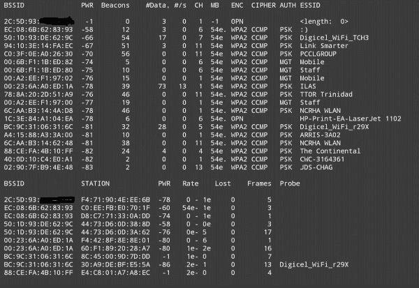

在屏幕截图的上半部分，我们可以看到以下内容：

*   **BSSID**：接入点或无线路由器的媒体访问控制（MAC）。
*   **压水堆**：额定功率。功率级别越低，离我们越远。
*   **信标**：来自特定 AP 或无线路由器的信标消息数。
*   **CH**：无线路由器运行的信道。
*   **Enc**：加密标准，如 WEP、WPA、WPA 或 Open。
*   **密码**：加密标准中使用的加密密码。
*   **认证**：认证机制，如预共享密钥（PSK）或管理（MGT）。
*   **ESSID**：移动设备看到的无线网络名称。这也称为服务集标识符（SSID）。

让我们观察一下输出的下半部分：


`STATION`列显示通过 BSSID 值与特定无线路由器关联的客户端的 MAC 地址。功率级别提供了客户端和设备之间的大致距离。探测器显示客户端正在查找的网络（SSID）。

使用以下命令将允许 pentester 监视、捕获并保存捕获数据的副本，以进行脱机分析，从而提升其性能：

```
airodump-ng –w offline_file –c <channel number> --bssid <MAC addr of router> wlan1mon
```

以下是演示如何使用命令序列的屏幕截图–目标无线路由器的部分 MAC 地址因隐私而模糊：


`-w`允许您在接口上存储流量监视器的副本。`-c`指定要监听的频道。信道号应与目标网络相同。`--bssid`指定目标无线路由器的 MAC 地址。

默认情况下，该文件保存在设备的根目录中。如果您在另一个目录中工作，请使用`ls –l`命令查看当前目录的内容。如果您不确定您的当前路径，请使用`pwd`命令，该命令显示您当前的工作目录。

# 欺骗

渗透测试人员可以用来确保能够捕获受害者流量的一种技术是执行 MITM 攻击。让我们想象一下，无线网络上有两个人，爱丽丝和鲍勃。他们都希望通过网络交换一些信息。然而，有一个 pentester，其任务是观察和捕获网络流量。

Alice 和 Bob 将他们的移动设备连接到无线路由器或接入点（AP）并开始通信。无线路由器是处理其所有流量转发的中间设备：

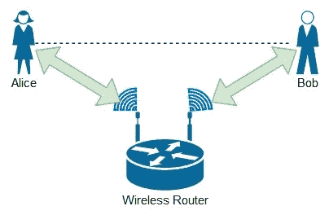

使用 arpsoof，Pentester 能够欺骗路由器的**媒体访问控制**（**MAC**）地址来欺骗受害者，使网络上的其他用户相信 Pentester 的机器现在是路由器或默认网关。下图显示 pentester 与 Alice 和 Bob 连接到同一无线网络。现在的目标是说服 Alice 的机器，到达 Bob 的唯一方法是将所有流量发送到 pentester，反之亦然，Bob 的网络流量：

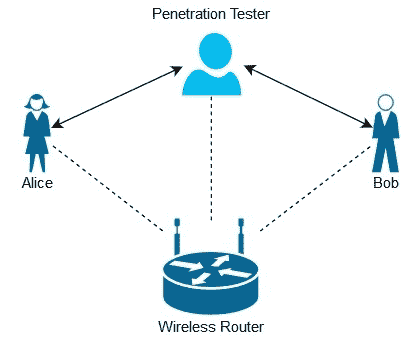

以下是`arpspoof`工具中使用的语法：

```
arpspoof –i <interface> -c <host ip> -t <target ip> <host ip> -r
```

*   `-i`：允许您指定一个接口
*   `-c`：指定硬件地址
*   `-t`：指定目标，如默认网关
*   `host`：指定拦截数据包的主机
*   `-r`：允许您捕获双向流量

为了成功执行 MITM 攻击，我们将有一名受害者 Alice 和一名 pentester 连接到同一网络。目标是确保 Alice 的机器认为默认网关是 pentester 的机器：


Alice 和 pentester 都连接到同一无线网络（虚线）。但是，pentester 使用以下命令确保 Alice 的所有流量通过其机器，然后其机器将其转发到实际的默认网关：

```
arpspoof –i wlan0 –t 172.16.17.18 –r 172.16.17.14
```


一旦在 pentester 的机器上执行该命令，它将向 Alice 和默认网关（无线路由器）发送连续的免费 ARP 消息，以确保其本地 ARP 缓存得到更新，并包含伪 ARP 条目。

# Dsniff

如创建者所述，**Dsniff**是网络审计工具和密码嗅探器的集合。它为渗透测试人员提供了执行 MITM 攻击、数据包分析和捕获网络数据包的能力。

在 KaliLinux 或 Kali NetHunter 上使用以下命令将使 Dsniff 能够侦听指定接口上的任何流量：

```
dsniff -i <*network adapter*>
```

下面的命令是使用`dsniff`监视点击设备上`wlan0`接口的流量的示例：

```
dsniff –i wlan0
```

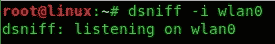

# 基斯米特

Kali NetHunter 中另一个非常流行的无线监控工具是 Kismet。**Kismet**就像一把用于无线网络的瑞士军刀。它可以嗅探无线网络上的数据包，提供具有战争驱动功能的渗透测试仪，并能够检测目标网络上的各种无线攻击和威胁。

要开始，请在 Kali NetHunter 的终端中键入`kismet`。您应该会看到以下屏幕出现；点击*回车*键选择`OK`：


Kismet 将请求您允许自动启动 Kismet 服务器；只需选择是：

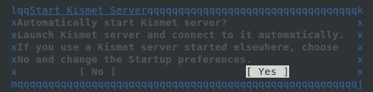

将出现以下窗口。如果决定启用日志记录，可以启用/禁用日志记录并为日志文件设置标题。我建议在选择**启动**之前禁用**显示控制台**选项。禁用**显示控制台**选项将直接进入 Kismet 的监控用户界面：


如果继续使用默认参数，则以下窗口是 console 窗口，其中显示 Kismet 执行的每个活动的日志。只需点击**关闭控制台窗口**即可查看 Kismet 监控用户界面：

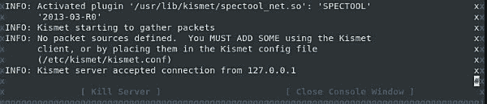

现在您已经了解了 Kismet 的主界面，让我们熟悉它并检查它的功能。要添加监控源，如无线接口，请选择`Kismet``Add Source`：


我选择添加我的`wlan1mon`接口作为源。请记住，您可以在 Kali NetHunter 上使用`iwconfig`命令来确定可用的无线接口：


Kismet 能够确定设备的制造商。

一旦您的源接口成功添加到 Kismet 上，您将开始看到各种无线网络正在窗口的上半部分填充。通过选择无线网络，下半部分列出了关联的客户端：

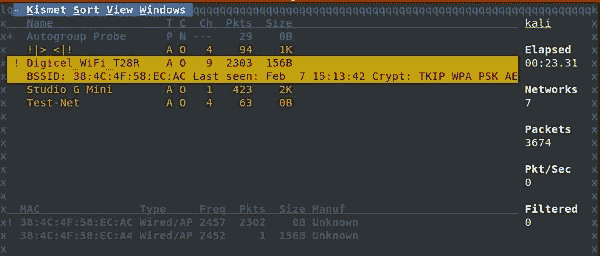

要获取有关目标网络的更多详细信息，请选择`Windows``Network Details`。如我们所见，Kismet 为我们提供了一个简化视图，其中包括目标的网络名称（SSID）、BSSID（MAC 地址）、设备类型、操作通道、射频、信号强度以及加密标准和类型：

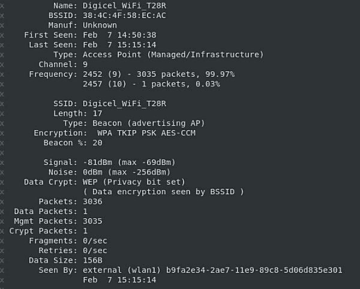

# Tcpdump

简单地说，`tcpdump`工具是一个命令行协议分析器。在远程访问渗透测试的情况下，此工具非常有用，例如您的 Kali NetHunter 设备，甚至在目标无线网络附近种植的树莓 Pi。

要启用监控，请输入`tcpdump –i wlan0`命令：


注意，一旦输入了前面的命令，结果就开始填充命令行界面。这对于执行实时分析来说是非常具有挑战性的。我建议您首先捕获数据包并将其存储在脱机文件中，然后执行分析。

要捕获网络数据包并将其存储在脱机文件中，我们可以使用`tcpdump –i wlan0 –w tcpdumpcapture.pcap`命令：


`–w`参数允许您指定要将捕获的数据写入的文件。在捕获过程中，结果不会在屏幕上填充，而是写入到`tcpdumpcapture.pcap`文件中。

使用`ls –l | grep .pcap`命令，我们可以看到文件按预期存在：

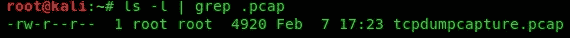

要验证或读取写入文件中的数据，请使用`tcpdump –r <filename>`命令：


# 沙克

**TShark**是另一个命令行网络协议分析器。它具有与 Wireshark 类似的功能，可以在实时网络上捕获流量，甚至可以读取以前保存以供进一步分析的脱机捕获。它的许多特性类似于前面提到的工具**tcpdump**工具。

要捕获数据包并将数据输出到文件中，我们可以使用`tshark –i <interface> -w <output file>`命令：


再次注意，当实时流量写入`tsharkcapture.pcap`文件时，终端上不会显示实时流量。但是，如果不使用`–w`参数，我们将看到所有到达`wlan0`接口的流量：

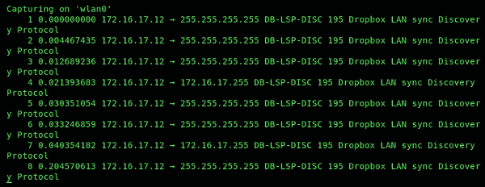

输出显示我网络上的另一台机器正在尝试为 Dropbox 执行 LAN 同步。

# MITM 框架

对于这个工具，名称说明了一切。它是一个 MITM 框架，包含许多功能，例如捕获受害者的 cookie 信息、执行密钥记录功能和地址解析协议（ARP）注入攻击以及欺骗。

在本练习中，我们将拦截受害者和默认网关之间的数据包。要开始，请打开 Android 设备上的菜单，然后打开 NetHunter 应用程序：


打开应用程序后，使用左侧的内置菜单展开类别列表。您将看到带有列表的 MITM 框架，单击它打开它：


将出现以下窗口，只需选择要用于攻击的界面：

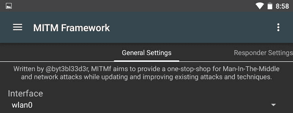

完成后，向右滑动，直到进入**欺骗设置**选项卡。只需启用欺骗插件，选择重定向模式为 ARP，并设置网关地址和受害者的 IP 地址，如以下屏幕截图所示：


配置完所有参数后，选择`Start MITMf attack`开始拦截数据包。请记住，您可以使用前面提到的任何数据包捕获工具，例如 TShack、Tcpdump，甚至 Dsniff，来捕获和离线存储数据包，以供以后分析。

# 数据包分析技术

在本节中，我们将讨论使用 Kali NetHunter 中的工具进行数据包分析。我们将使用取自[的各种样本文件 https://wiki.wireshark.org/SampleCaptures](https://wiki.wireshark.org/SampleCaptures) 和[https://www.honeynet.org/challenges](https://www.honeynet.org/challenges) 因为这些样本是为教育用途而制作的，并且包含了很多通常在生产网络上可以找到的数据。

# Dsniff

我们之前使用 Dsniff 来捕获数据包，但现在我们将使用它来帮助我们重新组装和查看脱机 PCAP 文件中发生的明文事务。对于本练习，我们将使用来自[的`telnet.cooked.pcap`文件 https://wiki.wireshark.org/SampleCaptures#Telnet](https://wiki.wireshark.org/SampleCaptures#Telnet) 。

使用`dnsiff –p <filename>`命令启用对先前保存的脱机捕获文件中的内容的处理。正如我们在下面的屏幕截图中所看到的，两台设备之间发生了通信：

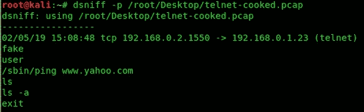

以下是我们能够解释的信息：

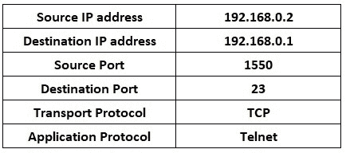

此外，我们知道它是一个 Telnet 连接，由 Dsniff 和目标端口`23`标识。下面的文本是从客户端（`192.168.0.2`发送到 telnet 服务器（`192.168.0.1`的实际命令。

# 沙克

我们可以使用 TShark 从脱机 PCAP 文件中收集信息。要获取用于访问每个唯一网站的每个 web 浏览器的副本，我们可以使用以下命令：

```
tshark -r conference.pcapng -Y http.request -T fields -e http.host -e http.user_agent | sort –u | uniq -c | sort -n
```

我们可以看到每个 URL（在下面的屏幕截图左侧）和向 web 服务器发出`HTTP GET`请求的用户代理（web 浏览器）：


让我们尝试检索所有 DNS 查询。为此，我们可以使用以下命令：

```
tshark -r conference.pcapng | grep "Standard query" | cut -d "A" -f 2 | sort –u
```

此命令从`conference.pcapng`文件读取内容，并创建一个初始筛选器，以仅显示包含`Standard query`字符串的行。完成后，它将删除任何不必要的数据，并在 DNS 查询中显示每个唯一的域名或主机名：


从保存的捕获文件中提取工件如何？这是有可能的。使用`–export-objects [smb, http, smb, tftp] <output_folder>`命令提取对象。在本例中，我们将提取使用 HTTP 应用程序协议传输的所有文件。我们首先使用以下命令：

```
tshark -nr conference.pcapng --export-objects http,tshark_folder
```

我们随后确认提取成功：

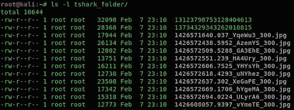

# Urlsnarf

**Urlsnark**用于嗅探来自实时网络流量甚至离线`.pcap`文件的 HTTP 请求。此工具可以帮助我们确定网络上的客户端访问了哪些网站。对于本练习，我们将使用来自[的`conference.pcap`文件 https://www.honeynet.org/node/1220](https://www.honeynet.org/node/1220) 。

要开始，请下载并在设备上脱机保存。使用`urlsnarf –p <file>`命令获取所有 HTTP 数据：


然而，正如您所看到的，输出是非常巨大的。让我们创建一个过滤器，仅为我们提供来自此文件的 HTTP URL。我们可以使用以下命令：

```
urlsnarf -p conference.pcapng | grep "http://" | cut -d "/" -f 5
```

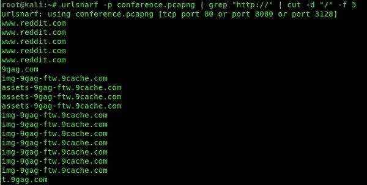

我们的输出现在清楚多了。我们有一个在此捕获期间用户访问的所有 URL 的列表。让我们创建另一个过滤器，以确定每次通信期间的用户代理（客户端的 web 浏览器）。使用以下命令将删除重复项并对输出进行排序：

```
urlsnarf -p conference.pcapng | grep "http://" | cut -d '"' -f 6 | sort –u
```


# Tcpdump

我们可以使用 Tcpdump 通过`tcpdump –r <file> -nn -A -s1500 -l | grep "User-Agent:" | sort –u`命令查看用户代理，如下图所示：

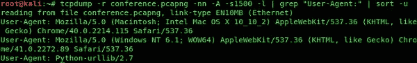

如上所述，用户代理决定 web 浏览器。这些信息在法医调查过程中很有用。此外，我们可以使用`tcpdump`查看捕获文件中的所有源和目标 IP 地址。

要使用源端口获取源 IP 地址列表，可以使用以下命令：

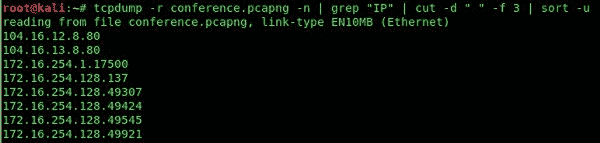

要查看所有目标 IP 地址和目标端口号，请使用以下命令：

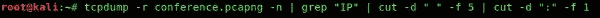

# 总结

在本章中，我们讨论了在网络上嗅探和分析数据包的好处。重点是获取敏感信息，这将有助于我们进行渗透测试。我们比较了主动和被动嗅探技术。此外，我们使用 Kali NetHunter 上的一套工具演示了各种数据包捕获技术和分析。我希望这一章对你的学习和职业生涯都是有益的。

在下一章中，我们将介绍目标无线设备和网络。