# 逃避侦查

在本书的整个过程中，我们讨论了许多主题，涵盖了渗透测试的各个阶段，从信息收集利用到跟踪。要在目标安全团队不知情的情况下成功执行渗透测试，你必须像黑客一样隐蔽。

除了在渗透测试期间检测和利用漏洞外，组织还使用这种类型的服务来测试其现有的安全控制和检测率。

如[第 2 章](02.html)*所述，了解 Pentesting 流程*的各个阶段，蓝色团队负责监控、检测和缓解母组织内部的任何安全威胁。如果蓝色团队未能检测到渗透测试人员的活动，这将意味着两件事：渗透测试人员非常隐蔽，组织的安全控制需要一些调整。

在本章中，我们将介绍以下主题：

*   隐形扫描
*   使用诱饵
*   碎裂
*   空闲扫描
*   加密

让我们潜水吧！

# 扫描

黑客攻击的第二阶段是扫描阶段。如[第 2 章](https://cdp.packtpub.com/hands_on_penetration_testing_with_kali_nethunter/wp-admin/post.php?post=35&action=edit#post_27)*中所述，了解测试过程*的各个阶段，扫描阶段有助于渗透测试人员获得大量有关目标系统和/或网络的详细信息。可能获取的一些信息包括操作系统和内部版本号、打开和关闭的服务端口、正在运行的应用程序及其服务版本，以及系统或设备组上是否存在特定漏洞。

然而，扫描过程将涉及我们的机器直接与目标系统或网络交互。作为一名有抱负的渗透测试人员，非常隐蔽并尽可能避免被目标的安全系统检测到是一种很好的做法。

在对客户机的网络基础设施进行渗透测试期间，客户机组织可能有一个积极监控安全环境的蓝色团队。如果您正在执行隐蔽测试，并且在渗透测试的早期或后期阶段被检测到，那么它就无法达到模拟真实世界攻击的目的，因为黑帽黑客会试图过滤数据并破坏系统

在扫描阶段，渗透测试仪使用了许多技术来避免被检测到。以下是其中一些技术：

*   隐形扫描
*   使用诱饵
*   空闲扫描
*   欺骗
*   碎裂

# 隐形扫描

如果渗透测试仪试图扫描目标，则很有可能在实际扫描目标之前建立 TCP 三方握手。对于网络上所有基于 TCP 的通信，初始建立一个**TCP 三方握手**；一旦建立，数据就会有规律地流动。

下图演示了两台设备之间的 TCP 三方握手。为了进一步解释 TCP 三方握手，让我们假设网络上有两个设备，a 和 B。假设设备 a 希望与设备 B 通信；设备 A 将向设备 B 发送 TCP**SYN**数据包，作为发起对话的方法。当设备 B 接收到 TCP**SYN**数据包时，会向设备 a 发送**SYN/ACK**数据包，当设备 a 接收到**SYN/ACK**数据包时，会通过发送 ACK 数据包进行确认。此时，这两个设备已建立 TCP 连接：

在 TCP 连接期间，对于从设备 a 或 B 接收到的每个数据包，接收方必须通过向发送方发送 TCP**ACK**数据包来确认接收，作为成功传递的指示。如果我们要在执行端口扫描时与目标设备建立 TCP 会话，很明显我们（攻击者）正试图在本机中进行入侵。换句话说，它被认为是嘈杂的。

为了帮助我们在渗透测试的扫描阶段，我们有 Nmap（网络映射器）工具。NMap 被誉为网络扫描仪之王，因为它不仅是简单的 ping-sweep 扫描仪之一，而且还可以包含许多对网络和安全专业人员都非常有用的功能。其中一个特点是它能够在目标系统或网络上执行*隐形扫描*。

*隐形扫描是如何工作的？*：如[第 4 章](04.html)、*扫描和枚举工具*中所述，攻击者机器会通过发送 SYN 数据包部分尝试与受害者机器创建完整的 TCP 三方握手；受害者将使用**SYN/ACK**数据包进行响应，但攻击者不会完成握手，而是发送**RST**数据包。

受害者在收到**RST**数据包后，会关闭连接，认为攻击者机器不再想要通信，但攻击者实际上是在激发受害者做出响应并提供开放端口列表。一个开放的港口就像一座房子里敞开的门；只要把门开着，窃贼就可以轻易地进入。这意味着，如果某个端口保持打开状态，攻击者可以使用此打开的端口作为进入系统的途径。下图演示了隐形扫描的工作原理：

使用 Nmap，我们可以通过键入`nmap –sS <*victim IP address*>`命令来执行隐形扫描：

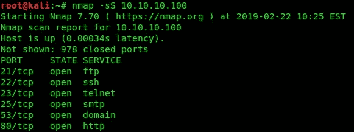

`–sS`参数表示我们正在进行隐形扫描。隐形扫描有时被称为 TCP**SYN**扫描或完全开放扫描。

# 诱饵

正如我们所注意到的，每当渗透测试人员在目标设备或网络上执行扫描时，攻击者的 IP 地址和 MAC 地址都会记录在受害者的机器上。这将使在网络上识别攻击者的机器变得非常容易。扫描时伪装自己的技术之一是使用诱饵，当受害者试图识别真正的攻击者机器时，将其甩开。

网络扫描仪之王 Nmap 再次帮助我们。Nmap 能够将多个源 IP 地址插入它发送到目标设备的探测中。为了进一步说明，让我们假设您正在向某人发送一封伪造的信，但是，在发件人的地址内，您在信封上插入了您的地址和其他几个地址。当邮件送达时，收件人不会太确定实际的发件人，因为有多个源地址。这使得实际确定正确的探针来源变得更加困难。要在 Nmap 上使用诱饵功能，我们可以使用`nmap –D <decoy1, decoy2, decoy3…> <target IP address>`命令。

`-D`允许您指定多个源地址作为诱饵：

让我们使用 Wireshark 查看攻击者机器和受害者之间发生的实际事务。网络上的攻击者计算机为 10.10.10.11，受害者计算机为 10.10.10.100。我们使用过滤器仅查看 Wireshark 上发送给目标的流量：

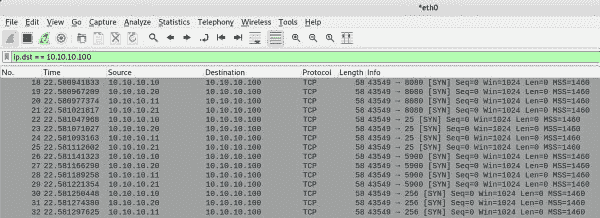

正如我们在屏幕截图中看到的，有多个探测器通过诱饵地址，真实的 IP 地址被发送到目标。

# 空闲扫描

一种较旧但仍然可用的扫描方法是使用空闲扫描技术。在空闲扫描中，攻击者机器（设备 A）向僵尸机器（设备 B）发送**SYN/ACK**数据包，以获取其碎片标识号。

**IPID** is sometimes referred to as **IP fragmentation ID**. Within the TCP/IP stack, before a device sends a datagram (message) onto a network, it is broken up into smaller pieces and then each is sent on its way to the destination. An IPID is assigned to each of these smaller pieces of the message (bits) to indicate they are of the same datagram or message.

由于攻击者机器没有使用**SYN**数据包而是**SYN/ACK**数据包启动连接，因此僵尸机器知道它没有收到**SYN**数据包的正式初始化，因此发送**RST**包含僵尸机器（设备 B）的 IPID 的数据包：

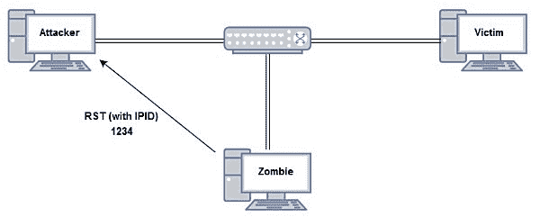

每次设备发送 IP 数据包时，IPID 都会增加。

此时，攻击者机器从网络上的僵尸机器获得了 IPID（1234）。接下来，攻击者将使用僵尸机器的伪造 IP 地址向实际的受害者机器发送一个**SYN**数据包（检查开放端口）。受害者将向僵尸发出**SYN/ACK**响应。僵尸知道之前没有从受害者那里收到 SYN 数据包，然后会向 IPID 发送**RST**数据包：

如果受害者上的端口关闭，目标将以**RST**响应僵尸，而不是**SYN/ACK**数据包：

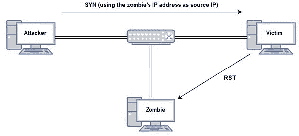

最后，攻击者将再次探测僵尸以获取僵尸的 IPID。攻击者将发送一个**SYN/ACK**数据包。如果僵尸响应的 IPID 为 1236，则会打开受害者上的端口：

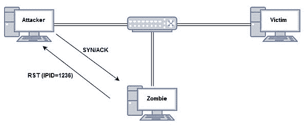

在最后一个阶段，如果僵尸的 IPID 没有增加 2（1234+2=1236），则受害者机器上的端口将关闭。当数据包在攻击者、僵尸和受害者的机器之间发送时，僵尸和目标的碎片 ID 将在通信时增加。我们可以使用 Nmap 执行空闲扫描，该命令的语法为`nmap –Pn –sI <zombie IP addr> <target IP addr>`**。** 

僵尸机器是这种扫描方法的理想选择，因为目标会认为探测是由僵尸机器而不是实际的攻击者机器完成的。

通过运行前面的命令，您将获得以下屏幕截图：

您可以随时使用`man nmap`命令查看 Nmap 的手动页面，也可以在终端窗口中键入`nmap`并按*回车*即可。

# MAC 欺骗

我们已经了解到，欺骗只是诱使目标相信流量或请求来自其他设备或可信来源。IP 和 MAC 地址都很容易被欺骗，因为 TCP/IP 协议套件不是为现代安全威胁而设计的。

为了防止网络中的 MAC 地址欺骗，网络安全专业人员可以在 Cisco IOS 交换机上实施**动态 ARP 检查（DAI）**。

要生成随机 MAC 地址并将其分配给接口，我们必须执行以下操作：

1.  使用`ifconfig wlan0 down`命令从逻辑上关闭接口：

2.  使用`macchanger –-show wlan0`命令验证指定接口上的当前和永久 MAC 地址：

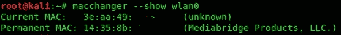

3.  使用**`macchanger --random wlan0`**命令生成 MAC 并分配给我们的`wlan0`接口：

4.  使用`ifconfig wlan0 up`命令重新启用接口：

此外，您可以使用**`macchanger –-help`**命令查看所有可用选项。

您运行**`macchanger –-help`**命令将获得以下截图：

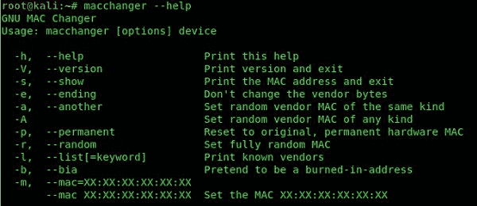

正如您所见，生成一个随机 MAC 地址来隐藏您的身份的可能性非常容易。

# 碎裂

黑客和渗透测试人员用来避免检测的另一种方法是**碎片化**。碎片将消息（数据包）分解成小块。碎片被放入网络中，因为这些微小的消息片段通常能够绕过几乎任何网络，用于安全设备和监控工具，这些工具可以主动观察网络流量和安全威胁活动。

在碎片攻击中，攻击者可以修改**生存时间**（**TTL**）或通过防火墙或**入侵防御系统**（**IPS**发送的每个比特之间的超时值。这将导致安全设备在重新组装过程中不容易检测到威胁并混淆设备。

攻击可以将有效载荷的碎片发送到受害机器，并让其重新组装到有效载荷，而根本不会被检测到。

Nmap 允许我们在目标设备上使用数据包碎片执行端口扫描。我们可以使用`nmap –f <target IP address>`命令：

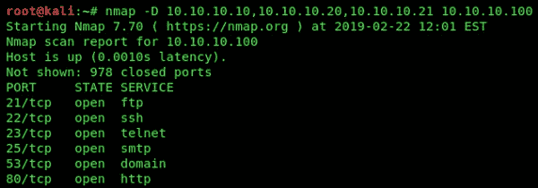

使用 Wireshark，我们可以看到每个探测器在发送到目标时是如何分解成更小的碎片的：

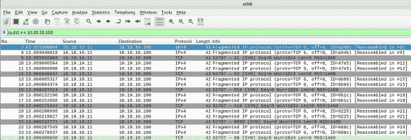

当网络具有 IDS、IPS 或防病毒软件时，此技术减少了被检测的机会。

# Metasploit 有效载荷发生器

在本书中，我们讨论了各种主题和工具。Kali NetHunter 平台中的一个特殊工具是**Metasploit 有效载荷生成器**。该工具的名称基本上描述了它的功能：使用 Metasploit 框架生成有效负载。在 Kali NetHunter 中打开应用程序后，我们收到以下信息：

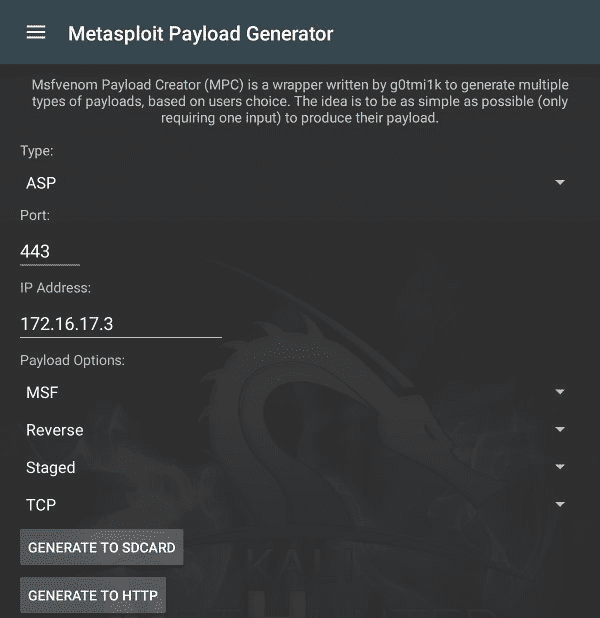

如您所见，我们可以选择要生成的有效负载类型、IP 地址和端口号以及其他有效负载选项。如果我们点击**类型**的下拉菜单，我们将看到以下选项：

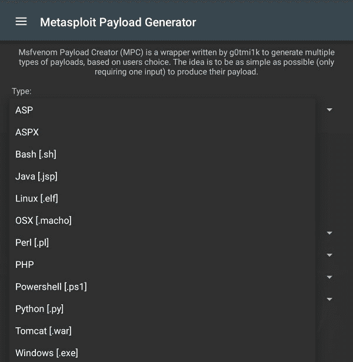

有许多不同的类型可供选择。利用此功能优点的一个示例是，如果要为 Microsoft Windows 系统创建有效负载，请选择 Windows（.exe）类型。这将使目标/受害者设备（在本例中为 Windows 操作系统）确信`.exe`文件可以信任，因为它似乎是本机可执行文件。

根据目标操作系统和渗透测试的目标，渗透测试人员提供了多个选项，如前面的屏幕截图所示。

# 加密流量

大多数组织都会部署**IPS**来主动监控入站和出站流量，特别注意本地或其他类型安全威胁中的任何恶意流量。

一种规避 IP 和反恶意软件系统的技术是使用加密。默认情况下，大多数防火墙无法检测加密数据包中的恶意软件。然而，下一代防火墙具有一种称为深度数据包检查（DPI）的功能，它通常将每个数据包的内容解包，并对其进行扫描和分析。如果没有检测到威胁，它将重新打包并将数据包发送到目的地。如果检测到威胁，防火墙将隔离它，并在其管理控制台界面和任何其他日志系统上发送警报。

此外，大多数 IPSE 没有解密消息以查看其内容的功能。这将允许攻击者加密恶意负载，并将其通过 IPS 设备而不被检测。下图显示了公司网络的典型设置；如果防火墙上的**DPI**被禁用，将允许加密文件（恶意负载）通过：

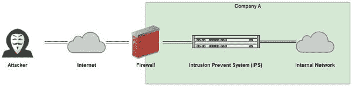

渗透测试人员可以使用**VirusTotal**网站（[www.VirusTotal.com](http://www.virustotal.com)）测试其加密有效负载，以检测各种反恶意软件引擎的检测级别。渗透测试人员的目标是确保所有或大多数反恶意软件程序都无法检测到您的有效负载。通过修改有效负载上的编码，我们还可以降低检测级别。

# 总结

在本章中，我们讨论了渗透测试人员可以用来避免检测的一些技术，例如欺骗 MAC 地址和扫描目标，同时不暴露我们的真实身份。但是，渗透测试人员不应仅限于使用本章中提到的技术和方法。作为渗透测试领域的网络安全专业人员，最大的好处是攻击者可以通过无数种方式试图隐藏。

在下一章中，我们将介绍硬化技术和对策。在那里，您将学习如何保护 Windows、Linux 和移动操作系统。