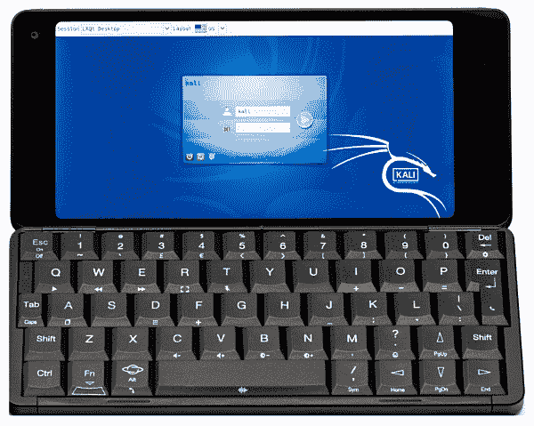
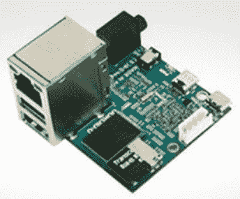
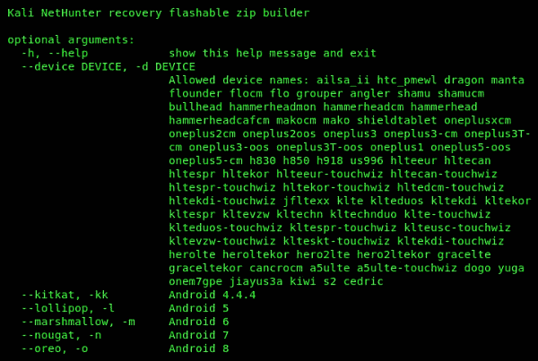
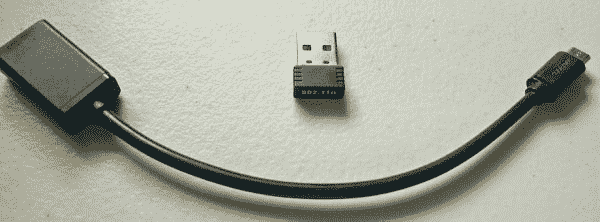

# 选择 Kali 设备和硬件

由于您几乎已经完成了这本书，我们还需要讨论一些重要的细节和组件，以确保您已经准备好进行渗透测试。

在本章中，我们将涵盖以下主题：

*   适用于 Kali Linux 的移动硬件
*   外部组件
*   附加硬件

在本书的学习过程中，您了解了渗透测试领域，特别是使用移动设备对目标系统或网络执行真实世界的模拟攻击和分析。然而，为 Kali Linux 选择合适的设备有时会有点麻烦。作为一名学生、安全专业人士、渗透测试人员，或者正在网络安全领域（尤其是渗透测试领域）起步的人，您可能会有以下问题：

*   Kali NetHunter 可以在任何移动设备上工作吗？
*   如果我没有兼容的设备，还有什么可以尝试的吗？
*   是否可以创建我自己的自定义版本的 Kali NetHunter？

让我们潜水吧！

# 小型计算机

最初，Kali Linux 渗透测试平台是一种操作系统，开发用于安装在计算机的本地**硬盘驱动器**（**HDD**）上，或从光盘（如**数字多功能盘**（**DVD**）上进行实时引导。多年来，Kali Linux 的开发扩展到了更新和更现代的设备，如智能手机和平板电脑，甚至还有其他配备**先进 RISC 机器**（**ARM**处理器）的设备，如树莓 Pi。

# 宝石掌上电脑

与基于 Android 的智能手机等现代移动设备相比，**Gem PDA**看起来有点*老派*。该设备结合了智能手机和**个人数字助理**（**PDA**的概念：

您可能想知道是什么使这个设备适合 Kali Linux。Gem PDA 支持最多三个操作系统的安装，因为它具有多引导功能。

以下是受支持的操作系统列表：

*   安卓
*   德比安
*   卡利 Linux
*   旗鱼

Gem PDA 的 Kali Linux 映像可在[找到 https://www.offensive-security.com/kali-linux-arm-images/](https://www.offensive-security.com/kali-linux-arm-images/) 。

# 树莓皮 2 和 3

**覆盆子 Pi**是一台只有信用卡大小的单主板计算机。把它想象成一台没有键盘、鼠标和驱动程序等外围设备的计算机。但是，CPU、RAM、输入/输出（I/O）模块和网络适配器都集成在一块单板上，使其成为微型计算机：

Raspberry Pi 3 型号 B+是目前市场上可用的最新型号，总体规格如下：

*   Cortex-A53（ARMv8）64 位 SoC，频率为 1.4GHz
*   1GB SDRAM
*   2.4GHz 和 5GHz IEEE 802.11.b/g/n/ac WLAN
*   蓝牙 v4.2
*   USB 2.0 上的千兆以太网
*   5V 2.5A 直流电源输入
*   以太网供电（PoE）
*   Micro SD 端口（用于操作系统）

# ODROID U2

**ODROID U2**是一款比信用卡更小的超小型微型计算机。该设备配有 Cortex-A9 四核 1.7 GHz 处理器，2 GB RAM，支持通过 micro HDMI 进行视频输出，10/100 Mbps 以太网用于网络连接，使用 MicroSD 进行存储，并需要 5V 2A 电源适配器：

支持 ARM 的设备列表可在官方的 Kali ARM 文档网站上找到：[https://docs.kali.org/category/kali-on-arm](https://docs.kali.org/category/kali-on-arm) 。此外，Kali NetHunter 图像可在[找到 https://github.com/offensive-security/kali-nethunter/wiki](https://github.com/offensive-security/kali-nethunter/wiki) [。](https://github.com/offensive-security/kali-nethunter/wiki)

# 移动硬件

为 Kali NetHunter 平台选择合适的移动设备并不像看上去那么困难。进攻性安全（[www.official-Security.com](http://www.offensive-security.com)的团队已经为我们创建了自定义图像，但是，有一个支持设备的列表。最初，KaliNetHunter 是为谷歌 Nexus 系列设备和 OnePlus 设计的：

*   Nexus 5
*   Nexus 6
*   Nexus 7
*   关系 9
*   Nexus 10
*   一加一

攻击性安全建议将 OnePlus One 作为 Kali NetHunter 平台的首选移动设备。要下载 Nexus 系列和 OnePlus One 设备的官方图片，请访问[https://www.offensive-security.com/kali-linux-nethunter-download/](https://www.offensive-security.com/kali-linux-nethunter-download/) 。

您可能认为首选设备的数量有很大的限制；幸运的是，还有一个受支持设备的附加列表：

如果您正在使用上表中列出的设备，则需要为您的设备构建自定义版本的 Kali NetHunter。请参考[第一章](01.html)*中的*建筑 Kali Nethunter*部分，Kali Nethunter 简介*。如果您需要更多信息，请参考官方文件：[https://github.com/offensive-security/kali-nethunter/wiki/Building-Nethunter](https://github.com/offensive-security/kali-nethunter/wiki/Building-Nethunter) 。

以下列出了受支持的 Android 设备的代码名和 Android 版本：

# 外部组件

在本节中，我们将讨论对使用 Kali NetHunter 模拟对目标的攻击的渗透测试人员有用的外部组件。

# 无线适配器

作为渗透测试仪，硬件的一个重要部分是外部无线适配器，用于对目标网络执行各种无线攻击。以下是与 Kali NetHunter 内核兼容的受支持无线适配器列表：

一些适配器可能由于各种原因无法工作，例如内核和驱动程序不兼容-适配器可能无法从 Android 设备接收到足够的电源；在这种情况下，建议使用带有外部电源的 Y 形电缆。

# OTG 电缆

此外，在使用 Kali NetHunter 时，一根**移动中的**（**OTG**电缆应该是组件列表的一部分。OTG 电缆将允许 USB 设备（如外部无线适配器）与 NetHunter 连接。

以下是带有 RT5370 迷你 USB WiFi 适配器的 OTG 电缆的图像：

# 总结

在本章中，我们将介绍一些支持 Kali Linux 操作系统的微型计算机。这些设备将允许渗透测试人员为目标网络创建自己的网络植入。在回顾为特定设备编译自定义 Kali NetHunter 映像的方法时，我们介绍了支持的移动设备列表。最后，如果没有无线网络适配器，渗透测试永远不会完成，因此提供了已知支持的移动设备无线适配器列表。

我希望这一章和这本书对你们的学习是有帮助和有用的，并将在网络安全的道路上对你们有益。谢谢你的关注！