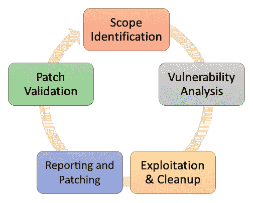

# 一、Web 应用渗透测试简介

在当今世界，有自动化工具和 SaaS 解决方案可以测试系统或应用的安全性。当应用需要测试业务逻辑缺陷时，自动化通常会在逻辑级别失败。了解渗透测试人员如何帮助组织在网络攻击前领先一步，以及组织为什么需要遵循严格的补丁管理周期来保护其资产，这一点很重要。

在本书中，您将学习如何对使用著名的 Metasploit 框架构建在不同平台上的 web 应用执行渗透测试。由于我们大多数人都听说过该工具及其在常规渗透测试中的重要性，本书将重点介绍如何在各种 web 应用上执行渗透测试，例如**内容管理系统**（**CMSes**）和**内容交付**和**内容集成**系统（**CD/CI**），使用 Metasploit 框架。要了解更多有关工具和技术的信息，我们首先需要了解渗透测试的基础知识

在本章中，我们将介绍以下主题：

*   什么是渗透测试？
*   渗透测试的类型
*   渗透测试的阶段
*   重要术语
*   渗透测试方法
*   **常见弱点列举**（**CWE**）

# 什么是渗透测试？

渗透测试，也称为 pen 测试，是对计算机系统进行的授权攻击，用于评估系统/网络的安全性。执行该测试是为了识别漏洞及其带来的风险。典型的渗透测试分为五个阶段，确定目标系统、其漏洞以及每个漏洞的可利用性。我们的目标是找到尽可能多的漏洞，并以普遍接受的格式向客户报告，以供客户理解。让我们在下一节中了解不同类型的渗透测试。

# 渗透试验的类型

根据客户的要求，渗透测试可分为三种类型：

*   白盒
*   黑匣子
*   灰盒

我们将在以下各节中讨论这些问题。

# 白盒渗透试验

**白盒渗透测试**或玻璃盒或透明盒渗透测试是一种测试类型，在这种测试中，客户完全共享有关目标系统、网络或应用的信息和细节，例如系统的登录凭据、网络设备的 SSH/Telnet 登录、，以及需要测试的应用源代码。由于从客户端检索到的有关其系统、网络或应用的信息高度敏感，因此建议您以加密格式保存所有信息。

# 黑箱渗透试验

**黑匣子渗透测试**是一种攻击者模拟测试，渗透测试人员将充当威胁参与者，没有目标系统、网络或应用的内部信息。这种类型的测试实际上侧重于渗透测试侦察的第一阶段。笔测试人员获得目标组织的信息越多，结果越好。在这种类型的测试中，笔测试仪没有提供任何架构图、网络布局或任何源代码文件

# 灰箱渗透试验

**灰盒渗透试验**是白盒和黑盒试验之间的中间点。在典型的灰盒测试中，笔测试仪具有一些应用、系统或网络的知识。由于其性质，这种类型的测试非常有效，并且更侧重于有最后期限的组织。使用客户提供的信息，pen 测试人员可以专注于风险更大的系统，并节省大量时间执行他们自己的侦察。

现在我们已经清楚地了解了可以进行的笔式测试的类型，让我们看看渗透测试的各个阶段

# 渗透测试的阶段

为了更好地理解渗透测试，让我们经历该过程的各个阶段：

*   **第一阶段：侦察**
*   **第二阶段：枚举**
*   **第三阶段：漏洞评估与分析**
*   **第四阶段：开发（包括开发后阶段）**
*   **第五阶段：报告**

这可以在下图中看到：

每个阶段都有自己的一套工具和技术，可以用来有效地执行测试。

# 侦察和情报收集

侦察是进行渗透测试的第一阶段。在此阶段，笔式测试仪将尝试识别有问题的系统或应用，并尽可能多地查找有关该系统或应用的信息。这是测试的最关键阶段，因为该步骤定义了攻击面。在白盒测试中，侦察可能并不重要，因为与范围内目标有关的所有信息都已由客户提供。

黑盒测试严重依赖于此阶段，因为没有向测试人员提供任何信息。在 web 应用渗透测试的上下文中，我们将重点识别 web 应用使用的技术、域/子域信息、HTTP 协议侦察和枚举，以及任何其他可以帮助我们提高效率的细节。目标和目标的范围通常在本阶段确定。

以下是可用于在 web 应用上执行侦察的工具列表：

*   **识别在****非标准端口（用户定义的自定义端口）**上运行的应用：Amap、Nmap 等
*   **识别 DNS 和子域**：dnsenum、dnsmap、dnswalk、dnsrecon、DNSTRATER、VIERE、dnscan、Sublist3r 等
*   **识别技术平台**：BlindElephant、Wappayzer、WhatWeb 等
*   **识别内容管理系统**：WPScan、Joomscan、CMScan、Drupscan 等

现在，让我们看看枚举。

# 列举

在枚举阶段，将扫描前一阶段（RECO）中识别的每个应用、系统或网络的不同攻击面，例如，web 应用的文件和目录枚举，以及网络设备的端口和服务。此阶段将帮助测试人员识别攻击向量。攻击向量是攻击者获取或穿透目标系统的路径或方法；在这种情况下，笔测试仪。最常见的攻击载体是钓鱼电子邮件、恶意软件和未修补的漏洞

pen 测试人员可以执行文件和目录枚举、HTTP 方法枚举、主机枚举和其他一些枚举方法，以查找可能存在漏洞的插入点。在白盒测试中，这个阶段并没有真正发挥重要作用，因为所有的信息和细节都已经提供给了测试人员，但这并不意味着你不应该完成这个阶段。执行枚举和扫描始终是一种良好的做法，即使提供了所有详细信息。这将帮助测试人员找到应用不支持的过时攻击路径，但可能有助于测试人员穿透网络。

此阶段对于黑盒和灰盒测试非常关键，因为通过对目标系统或应用执行侦察而检索的所有信息都由 pen 测试仪识别。如果手动执行，枚举可能会成为一个乏味的过程，因此有公开可用的工具和一些 Metasploit 模块可用于快速枚举应用。

以下是可用于在 web 应用上执行枚举的工具列表：

*   **F****文件和目录枚举**：Dirsearch、dirb、dirbuster、Metasploit Framework、BurpSuite、gobuster 等
*   **HTTP 协议支持的方法枚举**：Nmap、BurpSuite、Metasploit Framework、wfuzz 等
*   **对 r****ate 限制**的测试：硬硅钙石、ffuf、wfuzz 等

现在让我们看看漏洞评估。

# 漏洞评估和分析

一旦我们确定了攻击向量，我们需要执行漏洞扫描，这是在渗透测试的这一阶段发生的。对 web 应用进行漏洞评估，以识别网页、目录、HTTP 协议方法、HTTP 头等上的漏洞。扫描可以使用公开可用的工具或付费的许可工具完成。所有类型的测试白盒、黑盒和灰盒-严重依赖于此阶段

一旦漏洞扫描完成，我们需要评估和分析发现的每个漏洞，然后过滤掉误报。过滤掉误报有助于 pen 测试人员处理实际存在的漏洞，而不是由于时间延迟或扫描仪错误而发现的漏洞。所有漏洞过滤都发生在这一阶段。

以下是可用于对 web 应用执行漏洞评估和扫描的工具列表：

*   **系统和网络漏洞评估**：Nessus、OpenVAS 等
*   **Web 应用漏洞评估**：Nikto、Acunetix、Burpusuite、Nessus 等

# 剥削

开发阶段是继侦察阶段之后第二个最关键的阶段。此阶段证明在前一阶段中发现的某个漏洞是否可利用。如果 pen 测试人员能够利用发现的漏洞，那么他们总是能够识别渗透测试项目的成功。利用此漏洞可以使用某些工具（如 Metasploit Framework 和 Canvas）自动完成。这是因为我们不知道当我们使用有效负载时，某个 web 应用或系统将如何运行。

通常，在所有类型的测试中，我们都需要从客户端确认是否有权执行基于内存的攻击，例如利用缓冲区/堆溢出和运行内存损坏攻击。这样做的好处是，我们可以通过运行特定的漏洞攻击来访问目标系统（只有当目标系统易受此特定漏洞攻击时，这才有效）。使用此类漏洞利用的问题是系统/服务器/web 应用可能会崩溃，从而导致业务连续性问题。

一旦我们开发了一个系统或 web 应用，我们就可以停止开发，或者执行开发后工作（如果客户授权的话）在网络内部移动（旋转）并定位业务关键型服务器。

请确保所有有效负载、web shell、文件和脚本都已上载到目标系统进行攻击，以便在拍摄正确的**概念验证**（**PoC**屏幕截图后进行清理。在任何时候都应该这样做；否则，真正的攻击者可以找到 web 外壳并轻松使用它们攻击组织。

# 报告

报告阶段是渗透测试过程的最后阶段，包括报告在目标（范围内）上发现的每个漏洞。报告的漏洞将根据**通用漏洞评分系统**（**CVSS**定义的严重程度列出，这是一个用于评估漏洞的自由开放标准

作为笔测试人员，我们需要了解这一阶段对客户的重要性。测试人员在客户端系统上完成的所有工作都应该以结构化的格式报告。报告应包括对测试的简短介绍、工作范围、参与规则、简短明了的总结、发现的漏洞和每个漏洞的概念证明，以及参考链接中的一些建议和修补技术。

有一些公开可用的工具，如 Serpico、Magic Tree、Burpusuite 和 Acunetix，可用于简化报告过程。由于这是 pen 测试的一个重要阶段，测试期间发现的所有细节都应包含在报告中。

我们可以提供两种不同的报告：管理层的**执行报告**和现场技术团队的**技术报告**。这可以帮助组织的管理层和技术团队理解并修复渗透测试人员发现的漏洞。

# 重要术语

既然我们已经熟悉了这些标准，现在让我们来介绍一下我们将在接下来的章节中大量使用的重要术语：

*   **漏洞**：系统中的一个弱点，允许攻击者对其进行未经授权的访问。
*   **欺骗**：个人或程序成功地将数据屏蔽为其他内容，以获取非法利益的情况。
*   **利用**漏洞：利用漏洞未经授权访问系统/应用的一段代码、一个程序、一种方法或一系列命令。
*   **有效载荷**：在攻击后/攻击期间在系统上执行所需任务的实际代码。
*   **风险**：任何可能影响数据机密性、完整性和可用性的行为。未打补丁的软件、配置错误的服务器、不安全的上网习惯等等都会带来风险。
*   **威胁**：任何可能对计算机系统、网络或应用造成严重危害的行为。
*   **黑匣子**：测试人员不了解系统内部结构或功能的测试方法。
*   **白盒**：测试人员完全了解系统内部结构和功能的测试方法。

*   **漏洞奖励**：漏洞奖励计划是由许多网站和开发人员提供的一项交易，允许个人因报告漏洞而获得奖励，特别是与漏洞和漏洞相关的漏洞。
*   **SAST**：**静态应用安全测试**（**SAST**）是一种安全测试形式，依赖于对应用源代码的检查。
*   **DAST**：**动态应用安全测试**（**DAST**）是一种用于检测应用在运行状态下的安全漏洞的技术。
*   **模糊化**：一种自动测试技术，其中提供无效、意外或随机数据作为应用的输入。

现在我们已经了解了这个重要的术语，让我们继续学习测试方法。

# 渗透测试方法

众所周知，没有官方的渗透测试标准；然而，我们的安全社区为所有安全人员引入了一些标准。一些常见的标准有**开源安全测试方法手册**（**OSSTMM**）、**渗透测试执行标准**（**PTES**）和**信息系统安全评估框架**（**ISSAF**）。它们中的大多数遵循相同的方法，但它们的阶段名称不同。我们将在以下各节中逐一介绍，并详细介绍 PTE。

# 开源安全测试方法手册（OSSTMM）

OSSTMM 的定义见其官方网站[https://www.isecom.org/OSSTMM.3.pdf](https://www.isecom.org/OSSTMM.3.pdf) ：

这是一本经过同行审查的安全测试和分析手册，其结果是经过验证的事实。这些事实提供了可操作的信息，可以显著提高您的操作安全性。

使用 OSSTMM，审计将在运营层面上提供对安全性的精确估计，从而清除假设和不可靠的证据。它用于彻底的安全测试，设计为一致性和可重复性。作为一个开源项目，它对所有安全测试人员的贡献都是开放的，鼓励进行越来越精确、可操作和高效的安全测试。

OSSTMM 包括以下关键部分：

*   运营安全指标
*   信任分析
*   人类安全测试
*   物理安全测试
*   无线安全测试
*   电信安全测试
*   数据网络安全测试
*   合规条例
*   与**安全测试审计报告**（**星**一起上报）

# 运营安全指标

OSSTMM 部分的这一部分涉及需要保护的内容以及攻击面暴露的程度。这可以通过创建 RAV（攻击面无偏见的事实描述）来衡量

# 信任分析

在操作安全中，信任是指范围内的目标之间的交互，任何人都可以恶意利用这些交互。为了量化信任，我们需要理解并进行分析，以做出更加理性和合乎逻辑的决策。

# 人类安全测试

**人类安全****人类安全**是**人身安全****物理安全**的一个子部分，包含**心理手术****心理战**。测试这一方面的安全性需要与能够实际访问受保护资产的个人进行通信，例如，网关守卫。

# 物理安全测试

**物理安全****物理安全**指物理域内的物质安全。测试此通道需要与资产内设置的屏障和人员（看门人）进行非通信交互。

# 无线安全测试

**频谱安全**（**SPECSEC**是包括**电子安全**（**ELSEC**）、**信号安全**（**SIGSEC**）和**发射安全**（**EMSEC**的安全分类。测试该通道要求分析员在目标附近。

# 电信安全测试

**电信安全**是 ELSEC 的一个子集，描述组织的有线电信。测试此通道包括分析师和目标之间的交互。

# 数据网络安全测试

关于**数据网络安全**（通信安全**通信安全**）方面的测试需要与能够访问用于控制财产访问的操作数据的个人进行交互。

# 合规条例

所需的合规性类型取决于所在地和当前的政府、行业和企业类型，以及配套立法。简言之，合规是一套由立法或行业定义的一般政策，这些政策是强制性的。

# 《星报》报道

**安全测试审计报告**（**STAR**）的目的是作为执行总结，说明特定范围内测试目标的攻击面。

# OSSTMM 测试类型

OSSTMM 根据测试人员已知的信息量将测试类型分为六大类：

*   **盲**：**在本次测试中，分析员对目标不了解，但目标了解审计情况，并掌握分析员的所有细节。这可以看作是对分析员知识的测试。**
***   **双盲**：**在本测试中，分析员对目标、其防御、资产等一无所知。审计也没有通知目标公司。该测试用于检查分析员的知识和技能以及目标对未知威胁的准备情况。这也称为黑盒测试。*****   **灰盒**：**在本测试中，分析员对目标防御的了解有限，但对目标的资产和运作有完整的了解。在这种情况下，目标公司已为审计做好充分准备，并了解其全部细节。该测试也称为**漏洞测试*******   **双灰盒**：**这也称为白盒测试。目标公司提前了解范围和时间框架，但不了解有效载荷和测试向量*****   **串联**：**这也被称为内部审计或水晶球测试。在这个测试中，目标和分析师都知道审计的全部细节，但是这个测试没有检查目标对未知变量或向量的准备情况*****   **撤销**：**在本测试中，攻击者完全了解其目标的流程和操作安全，但目标不知道何时或如何进行审计。这也被称为红队演习。************

 ******以下是图形中表示的这些类型：

资料来源：https://www.isecom.org/OSSTMM.3.pdf
许可证：https://creativecommons.org/licenses/by/3.0/

现在我们已经阅读了不同的 OSSTMM 测试类型，让我们看看 ISSAF。

# 信息系统安全评估框架（ISSAF）

ISSAF 不是很活跃，但他们提供的指南相当全面。它旨在评估信息安全策略和组织是否符合 It 行业标准、法律和法规要求。ISSAF 的当前版本为 0.2。

它包括以下几个阶段：

*   项目管理
*   评估前、评估和评估后的指南和最佳做法
*   评估方法
*   审查信息安全政策和安全组织
*   风险评估方法的评价
*   技术控制评估
*   技术控制评估方法
*   密码安全

*   密码破解策略
*   Unix/Linux 系统安全评估
*   Windows 系统安全评估
*   Novell netware 安全评估
*   数据库安全评估
*   无线安全评估
*   交换机安全评估
*   路由器安全评估
*   防火墙安全评估
*   入侵检测系统安全评估
*   VPN 安全评估
*   防病毒系统安全评估与管理策略
*   Web 应用安全评估
*   **存储区域网络****SAN**安全
*   互联网用户安全
*   As 400 安全
*   源代码审计
*   二进制审计
*   社会工程
*   物理安全评估
*   事件分析
*   审查记录/监测和审计过程
*   业务连续性规划和灾难恢复
*   安全意识和培训
*   外包安全问题
*   知识库
*   安全评估项目的法律方面
*   **保密协议**（**保密协议**
*   安全评估合同
*   征求建议书模板
*   桌面安全检查表窗口
*   Linux 安全检查表
*   Solaris 操作系统安全检查表
*   默认端口防火墙
*   默认端口 ID/IP

# 渗透测试执行标准（PTES）

本标准是使用最广泛的标准，涵盖了与笔试相关的几乎所有内容。

PTES 分为七个阶段：

*   参与前互动
*   情报收集
*   威胁建模
*   漏洞分析
*   剥削
*   实施漏洞利用
*   报告

让我们简单地看一下这些阶段中的每一个都涉及到什么。

# 参与前互动

参与前交互在活动开始之前进行，例如定义活动的范围，这通常涉及映射网络 IP、web 应用、无线网络等。

范围界定完成后，在供应商之间建立沟通渠道，并最终确定事件报告流程。这些交互还包括状态更新、呼叫、法律流程以及项目的开始和结束日期。

# 情报收集

情报收集是一个用于收集尽可能多的目标信息的过程。这是 pen 测试中最关键的部分，因为我们拥有的信息越多，我们可以用来执行活动的攻击向量就越多。对于白盒活动，所有这些信息都已提供给测试团队。

# 威胁建模

威胁建模是一个过程，通过该过程可以识别和列举潜在威胁，并确定缓解措施的优先级。威胁建模取决于收集信息的数量和质量；有了这些信息，活动可以分为几个阶段，然后使用自动化工具和逻辑攻击执行

以下是威胁模型的思维导图：

（学分：[http://www.pentest-standard.org/index.php/Threat_Modelling](http://www.pentest-standard.org/index.php/Threat_Modelling)
许可证：[GNU 免费文档许可证 1.2](http://www.gnu.org/licenses/old-licenses/fdl-1.2.txt)

现在让我们来看一下漏洞分析。

# 漏洞分析

漏洞分析是发现攻击者可以使用的漏洞的过程。这些缺陷可以是从开放端口、服务错误配置到 SQL 注入的任何缺陷。有很多工具可以帮助执行漏洞分析，例如 Nmap、Acunetix 和 Burp Suite。新工具目前每隔几周发布一次。

# 剥削

利用漏洞是通过规避基于漏洞评估的保护机制来访问系统的过程。利用漏洞可以是公开的，也可以是零日。

# 剥削后

后利用是一个阶段，目标是确定妥协的关键性，然后为将来的使用维护访问权限。该阶段必须始终遵循保护客户和保护我们自己的参与规则（根据活动要求覆盖跟踪）。

# 报告

报告是最重要的阶段之一，因为解决所有问题完全取决于报告中提供的细节。报告必须包含三个关键要素：

*   错误的严重性
*   复制错误所需的步骤
*   补丁建议

总之，pen 测试生命周期阶段可以以下列方式呈现：

在下一节中，我们将讨论公共弱点枚举（CWE）和两个顶级 CWE。

# 常见弱点枚举（CWE）

在本节中，我们将讨论**常见弱点枚举**（**CWE**）。CWE 是一本通用的在线词典，收录了在计算机软件中发现的弱点。在本节中，我们将介绍两个著名的 CWE—OWASP Top 10 和 SAN Top 25。

# OWASP 前 10 名

**开放式 Web 应用安全项目**（**OWASP**）是一家为计算机和互联网应用提供公正、真实、经济高效信息的组织。

2020 年的当前列表包含以下错误：

*   注射
*   断开的身份验证
*   敏感数据暴露
*   **XML 外部实体**（**XXE**）

*   中断的访问控制
*   安全配置错误
*   **跨站点脚本**（**XSS**）
*   不安全反序列化
*   使用具有已知漏洞的组件
*   记录和监测不足

# SANS 前 25 名

SANS 前 25 名名单是 MITRE SANS 研究所与美国和欧洲许多顶级软件安全专家的合作。它由以下漏洞组成：

*   SQL 命令（“SQL 注入”）中使用的特殊元素的中和不正确
*   操作系统命令（“操作系统命令注入”）中使用的特殊元素未正确中和
*   不检查输入大小的缓冲区复制（“经典缓冲区溢出”）
*   网页生成过程中输入的中和不正确（“跨站点脚本编写”）
*   缺少关键函数的身份验证
*   缺少授权
*   硬编码凭证的使用
*   丢失敏感数据的加密
*   不受限制地上载危险类型的文件
*   在安全决策中依赖不受信任的输入
*   以不必要的特权执行
*   **跨站点请求伪造****CSRF**
*   不正确地将路径名限制为受限目录（“路径遍历”）
*   在没有完整性检查的情况下下载代码
*   不正确的授权
*   包含来自不受信任的控制范围的功能
*   关键资源的权限分配不正确
*   潜在危险功能的使用
*   使用损坏的或有风险的加密算法
*   缓冲区大小的计算不正确

*   对过度身份验证尝试的不当限制
*   URL 重定向到不受信任的站点（“打开重定向”）
*   非受控格式字符串
*   整数溢出或换行
*   使用不含盐的单向散列

我们将在本书后面的章节中详细介绍其中的一些漏洞。

# 总结

在本章中，我们首先介绍渗透测试及其类型和阶段。我们介绍了 pen 测试方法和生命周期，并介绍了一些重要的术语。然后，我们看了 OWASP 前 10 名和 SAN 前 25 名。

在下一章中，我们将了解 Metasploit 的要点，包括 Metasploit 框架、安装和设置。

# 问题

1.  是否有维护**常见弱点列举**（**CWE**列表的数据库？

2.  我在哪里可以找到 OWASP 前 10 名和 SAN 前 25 名列表？

3.  进行渗透测试所需的工具是否免费？

4.  基于 OSSTMM 和 PTES 的渗透测试有何不同？

# 进一步阅读

*   **安全与开放方法研究所****ISECOM**：[http://www.isecom.org/](http://www.isecom.org/)
*   笔试标准网站：[http://www.pentest-standard.org/index.php/Main_Page](http://www.pentest-standard.org/index.php/Main_Page)******