# Pentesting CMSes-Drupal

在上一章中，我们解释了如何在 Joomla 网站上执行渗透测试。WordPress、Joomla 和 Drupal 之间有很大的区别，特别是在安全性和体系结构方面。在本章中，我们将学习 Drupal 及其体系结构，以及如何测试基于 Drupal 的网站。

在本章中，我们将介绍以下主题：

*   Drupal 及其体系结构简介
*   Drupal 侦察和枚举
*   使用 droopescan 进行 Drupal 漏洞扫描
*   利用 Drupal

# 技术要求

对于本章，您将需要以下内容：

*   对 PHP 有一定的了解
*   了解 Metasploit 框架的基础知识
*   了解基本的 Linux 命令，如`grep`和`ag`
*   了解打嗝套件的基本知识

# Drupal 及其体系结构简介

Drupal 是一个用 PHP 编写的免费、开源的**内容管理系统**（**CMS**。它最初是由**Dries Buyteart**作为留言板编写的，但在 2001 年成为一个开源项目。尽管与其他 CMSE 相比，Drupal 被认为使用起来有点棘手，但它确实提供了一个内置 API 来促进定制模块的开发。

# Drupal 架构

描述 Drupal 架构的一般方法是将其分为四个主要部分，如下图所示：

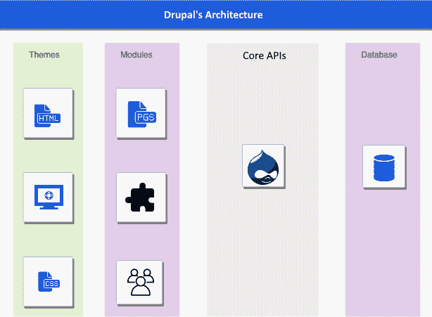

为了理解体系结构，让我们首先了解 Drupal 的组件。Drupal 的组件如下所示：

*   **主题：**主题是定义 Drupal 网站用户界面的文件集合。这些文件包含用 PHP、HTML 和 JavaScript 编写的代码。

*   **模块：**模块是事件驱动的代码文件，可用于扩展 Drupal 的功能。一些模块是 Drupal 开发团队维护的已知核心模块，因为它们是 Drupal 操作的重要部分。

*   **核心 API:**Drupal 的核心是用于与内容和其他模块通信的 API。这些 API 包括以下内容：

    *   **数据库 API**：允许开发者轻松更新/修改数据库中的数据。

    *   **缓存 API**：该 API 存储页面响应，这样浏览器就不必在每次请求时都呈现页面。

    *   **会话处理 API**：跟踪不同用户及其在网站上的活动。

*   **数据库**：存储所有数据的地方。Drupal 支持不同类型的数据库，如 MySQL、Postgres 和 SQLite。

现在我们已经对 Drupal 的体系结构有了基本的了解，接下来让我们看看目录结构。

# 目录结构

Drupal 具有以下目录结构：

*   **核心**：由默认 Drupal 安装使用的文件组成。
*   **模块**：安装在 Drupal 中的所有自定义创建的模块都存储在这里。
*   **配置文件**：此文件夹存储安装配置文件。安装配置文件包含有关预装模块、主题和给定 Drupal 站点配置的信息。
*   **站点**：如果 Drupal 与多个站点一起使用，则包含特定于站点的模块。
*   **主题**：基本主题和所有其他自定义主题都存储在此目录中。
*   **供应商**：此目录包含 Drupal 使用的后端库，如 Symfony。

默认 Drupal 安装的目录结构如以下屏幕截图所示：

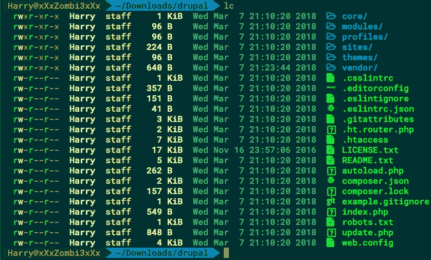

现在我们已经了解了 Drupal 及其目录结构的基本知识，让我们继续下一个主题：Drupal 侦察和枚举。

# Drupal 侦察和枚举

正如我们在前面章节中所讨论的，侦察和枚举是任何类型的渗透测试中的关键步骤。在本节中，我们将介绍一些可用于识别 Drupal 安装和已安装版本的方法。

# 通过 README.txt 进行检测

这是最简单和最基本的技术。我们只需访问`README.txt`页面，就会看到一行内容为`"Protect files and directories from prying eyes"`：

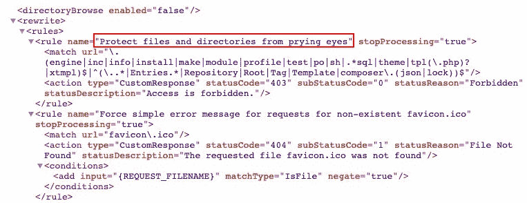

这将表明该实例确实是一个 Drupal 实例。

# 通过元标记进行检测

具有`name`属性`"Generator"`的元标记标识用于生成文档/网页的软件。在 meta 标签的`content`属性中公开了版本号：

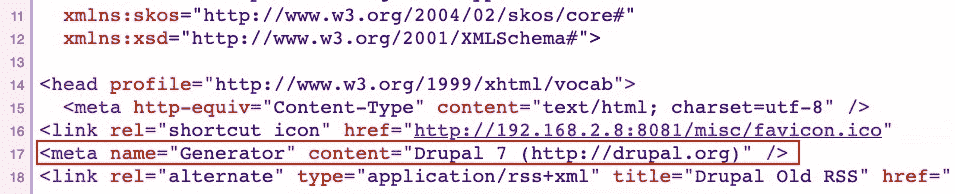

基于 Drupal 的网站的源代码中通常有这个标签。

# 通过服务器头进行检测

如果服务器响应中存在以下标题之一，也可以识别 Drupal：

*   **X-Generator HTTP 头**：标识 Drupal 网站。
*   **X-Drupal-Cache 头**：该头由 Drupal 的缓存使用。如果标题值为**X-Drupal-Cache:MISS**，这意味着页面不是从缓存的显示中提供的，如果您看到**X-Drupal-Cache:HIT**，这意味着页面是从缓存中提供的。

*   **X-Drupal-Dynamic-Cache 头**：动态缓存用于站点加载动态内容（缓存页面），个性化部分除外。
*   **到期日：1978 年 11 月 19 日**。

以下屏幕截图显示了服务器响应中的这些标题：


动态缓存头`X-Drupal-Dynamic-Cache`是在 Drupal 版本 8+中引入的，不适用于 Drupal 版本 7 或更早版本。

# 通过 CHANGELOG.txt 进行检测

有时，`CHANGELOG.txt`文件也会透露版本号。可在此处找到此文件：

```
/CHANGELOG.txt 
/core/CHANGELOG.txt
```

我们可以浏览`/CHANGELOG.txt`或`/core/CHANGELOG.txt`来识别安装的 Drupal 版本：

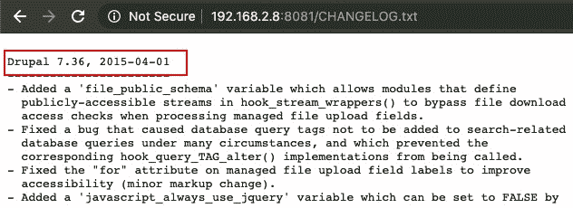

在某些情况下，我们可能找不到`CHANGELOG.txt`文件。在这种情况下，我们可以尝试本节中提到的其他检测技术。

# 通过 install.php 进行检测

虽然建议在安装后删除`install.php`文件，但开发人员通常将其留在服务器上。它可用于查找 Drupal 安装的版本号：

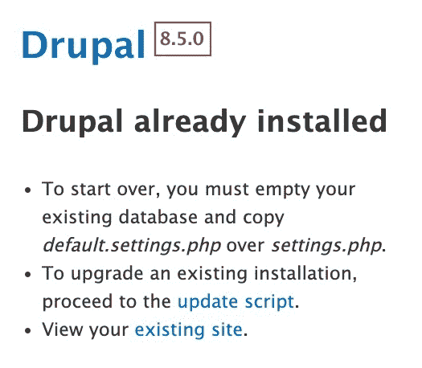

This method can only be used for Drupal version 8.x.

这些检测技术只会识别站点是否安装了 Drupal，以及安装后使用的版本。它找不到 Drupal 中安装的插件、主题和模块。为了识别插件、主题和模块，我们需要列举它们。我们需要列举插件、主题和模块，因为这些是攻击者可以用来控制 Drupal 站点的入口点。作为渗透测试人员，我们需要找到易受攻击的插件、主题和模块（安装了版本）并报告它们。

# 插件、主题和模块枚举

现在几乎所有在线可用的开源工具都使用一种非常常见的技术来枚举 Drupal 插件、主题和模块。对于枚举，我们只需在`themes/`、`plugins/`和`modules/`目录中查找以下文件：

```
/README.txt 
/LICENSE.txt 
/CHANGELOG.txt
```

`README.txt`文件提供插件、主题和模块版本。它甚至还公开了 Drupal 版本号，`LICENSE.txt`文件包括 GNU**通用公共许可证**（**GPL**许可证）。如果`plugins/`、`themes/`或`modules/`目录中的任何一个包含此文件，则表示安装了特定的插件、主题或模块。`CHANGELOG.txt`文件公开了已安装插件、主题或模块的版本号。

模块名称可以从`README.txt`文件或 URL 本身找到，如以下屏幕截图所示：


对于枚举，我们可以编写自己的 Metasploit 包装器模块，也可以使用第三方开源工具 DroopScan。要编写我们自己的包装器，我们可以按照上一章中所做的操作，[第 8 章](08.html)、*Pentesting CMSE–WordPress*。我们现在将使用 droopescan 进行漏洞扫描。

# 使用 droopescan 进行 Drupal 漏洞扫描

没有 Metasploit 模块可以在 Drupal 上执行漏洞扫描。因此，我们需要使用第三方工具，如 droopescan，来帮助我们发现 Drupal 中的漏洞。droopescan 可从[下载 https://github.com/droope/droopescan](https://github.com/droope/droopescan) ：

1.  让我们使用以下命令克隆 droopescan 的 Git 存储库以进行安装：

```
git clone https://github.com/droope/droopescan
```

以下屏幕截图显示了前面命令的输出：

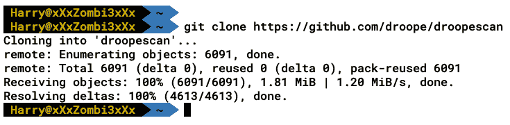

2.  在运行 droopescan 之前，我们仍然需要安装必要的 Python 模块，这可以使用以下命令完成：

```
pip install -r requirements.txt
```

3.  在系统上安装所有软件包后，我们可以通过使用以下命令执行 droopescan 来测试安装：

```
./droopescan
```

4.  如果执行 droopescan 时出错，我们也可以使用以下命令执行：

```
python droopescan
```

5.  安装 droopescan 后，我们可以执行以下命令在 Drupal 上运行漏洞扫描：

```
./droopescan scan drupal -u <URL>
```

以下屏幕截图显示了前面命令的输出：


droopescan 是一种基于插件的扫描程序，它可以识别多个 CMSE（但主要是 Drupal）中的漏洞。droopescan 使用预先构建的单词列表，通过蛮力检测模块、主题和插件。所以，这一切都取决于我们的单词列表有多好。我们还可以找到其他基于 Drupal 的漏洞扫描器，它们可以用来识别 Drupal 中的漏洞。唯一的区别是他们使用的语言（为了效率）和他们使用的单词列表。

当我们在 Drupal CMS 中发现漏洞时，我们可以继续查找这些漏洞的公开漏洞。最著名的漏洞之一是 Drupalgeddon。在下一节中，我们将介绍 Drupalgeddon2 漏洞，并了解如何利用该漏洞。

# 利用 Drupal

利用 Drupal 时，我们需要记住以下攻击向量：

*   枚举 Drupal 用户进行暴力攻击
*   通过中断的身份验证（可猜测的密码）利用 Drupal
*   利用插件、主题或模块进行任意文件公开和上载、持久性**跨站点脚本编制**（**XSS**等
*   利用 Drupal 核心组件进行 SQL 注入和**远程代码执行**（**RCE**）

对于不同版本的 Drupal，可以使用不同的公共漏洞。有时，我们可以使用公共漏洞访问 Drupal 站点，而有时我们必须更改漏洞以使其正常工作。首先理解利用漏洞并在以后执行它始终是一种良好的做法。现在让我们关注 Drupalgeddon2 的公开漏洞。

# 使用 Drupalgeddon2 开发 Drupal

2018 年 3 月 28 日，Drupal 发布了一条建议，强调了 Drupal 不同版本中的 RCE 漏洞。后来更名为 Drupalgeddon2。Drupal 版本 6 引入了表单 API，表单 API 用于在表单呈现期间更改数据，在 Drupal 7 中，这被概括为**可呈现数组**。可渲染数组包含键值结构中的元数据，并在渲染过程中使用：

```
[ 
'#type' => 'email', 
'#title => '<em> Email Address</em>', 
'#prefix' => '<div>', 
'#suffix' => '</div>' 
] 
```

现在让我们了解一下这种基于表单的漏洞。

# 了解 Drupalgeddon 漏洞

Drupalgeddon 漏洞与特定注册表有关。此表单在所有 Drupal 安装中都可用，无需任何身份验证即可访问。在此表单中，电子邮件字段允许来自用户的未初始化输入，从而允许攻击者将数组注入表单数组结构（作为`email`字段的值）。以下属性可用于利用此漏洞进行攻击：

*   `#post_render`
*   `#lazy_builder`
*   `#pre_render`
*   `#access_callback`

Metasploit 的漏洞利用模块使用`#post_render`属性将有效负载注入`mail`阵列，如下所示：

```
[ mail[#post_render][]': 'exec', // Function to be used for RCE mail[#type]': 'markup', 'mail[#markup]': 'whoami' // Command ] 
```

渲染时会调用`exec()`函数，执行`whoami`命令并返回输出。现在，让我们向前看，看看这个漏洞在起作用。

在`/core/lib/Drupal/Core/Render/Renderer.php`中可以找到以下代码：

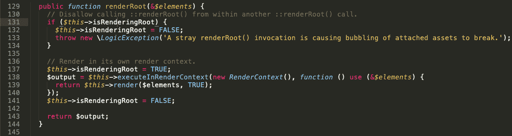

`/core/modules/file/src/Element/ManagedFile.php`如图所示：

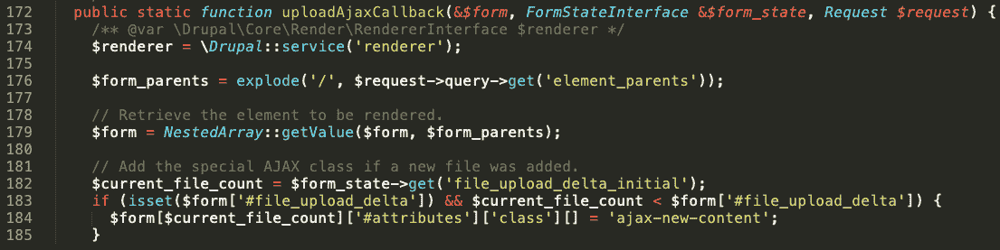

我们可以看到表单值使用斜杠分解，然后使用`NestedArray::getValue()`函数获取值。根据返回的数据，呈现结果。在这种情况下，`$form["user_picture"]["widget"][0]`变为`user_picture/widget/0`。我们可以将自己的路径输入到所需的元素。账户登记表中有`mail`和`name`参数。`name`参数过滤用户数据，`email`参数不过滤。我们可以将这个参数转换成一个数组，并提交一行以`#`开头的键。

回到`/core/lib/Drupal/Core/Render/Renderer.php`，我们看到`#post_render`属性取`#children`元素，然后传递给`call_user_func()`函数，如下图：


这来自 PHP 手册：


如果我们通过`call_user_func(system,id)`，它将作为`system(id)`执行。所以我们需要将`#post_render`定义为`exec()`，将`#children`定义为我们想要传递到`exec()`的值：

```
[ 
mail[#post_render][]': printf, 
mail[#type]': 'markup', 
'mail[#children]': testing123 
] 
```

另一种方法是使用`#markup`元素，互联网上的其他漏洞利用也使用该元素。

# 使用 Metasploit 开发 Drupalgeddon2

Metasploit 模块也可用于利用 Drupalgeddon2 漏洞，我们可以通过在 msfconsole 中执行以下命令来使用它：

```
use exploit/unix/webapp/drupal_drupalgeddon2
```

现在，执行以下步骤以利用该漏洞：

1.  要查看选项，我们运行`show options`，如下所示：

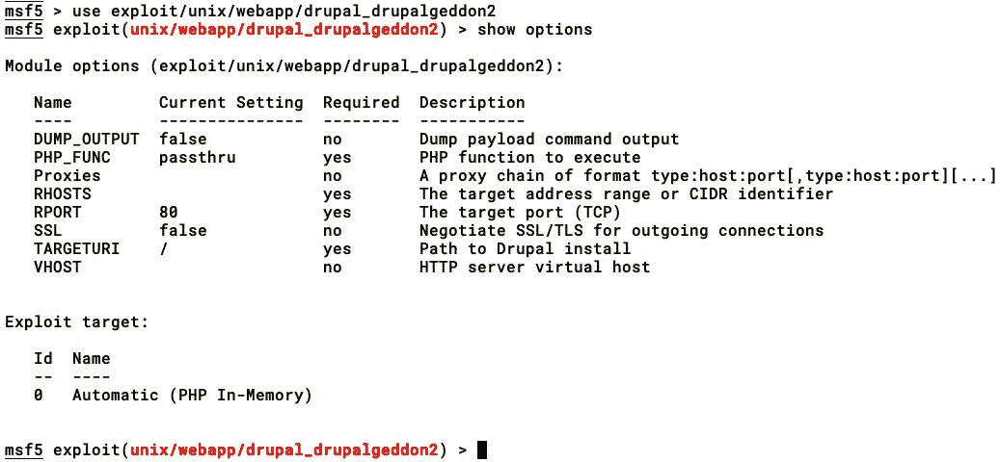

2.  接下来，我们设置`rhosts`和`rport`选项，如下图所示：


3.  当攻击运行时，它首先通过向`/`发出请求，在响应头或元标记中查找 Drupal 版本来执行指纹识别，如下所示：

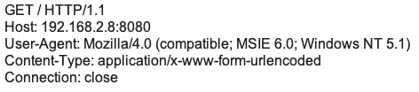

4.  接下来，它通过调用`CHANGELOG.txt`并查找`SA-CORE-2018-002`补丁来执行补丁级别检查，如下所示：

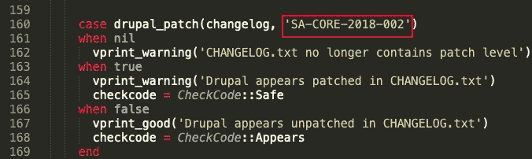

当前两个步骤完成时，漏洞攻击通过简单调用`printf`函数打印一个值来确认 RCE 的存在：

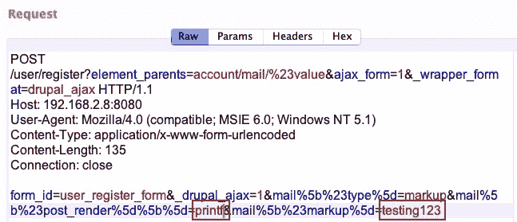

在前面的屏幕截图中，我们使用了`testing123`字符串。如果服务器以`testing123`响应，则服务器具有 Drupalgeddon2 漏洞：


使用 PHP 的`passthru()`功能确认 RCE，执行`id`、`whoami`和`uname -a`命令：


服务器返回对执行的命令的响应，如下所示：


5.  最后一步是发送 PHP MeterMeter 负载，该负载在内存中注入并执行，如下所示：


成功执行后，我们将在终端中打开一个 MeterMeter 会话：


现在，让我们看另一个 Drupal 利用的例子，并尝试了解它是如何工作的。

# RESTful Web 服务漏洞–unserialize（）

2019 年 2 月，CVE-2019-6340 发布，披露了 Drupal 的 RESTful web 服务模块中的一个 bug。可以利用此缺陷执行 RCE。只有当 Drupal 安装安装了所有 web 服务（**HAL**、**序列化**、**RESTful web 服务**和**HTTP 基本身份验证**时，RCE 才可能，如以下屏幕截图所示）：

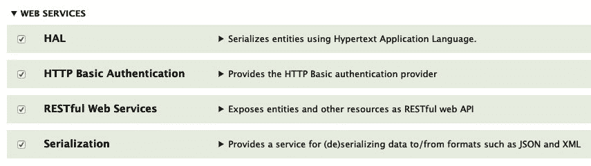

restfulweb 服务模块使用 restapi 与 Drupal 通信，restapi 可以对网站资源执行更新、读取和写入等操作。它依赖于序列化模块对发送到 API 和从 API 发送的数据进行序列化。Drupal 8 Core 使用**超文本应用程序语言**（**HAL**模块），该模块在启用时使用 HAL 序列化实体。我们可以通过使用带有`_format=hal_json`参数的`GET`方法请求节点来检查 Drupal 服务器是否启用了这些 web 服务，如以下屏幕截图所示：


如果安装了模块，那么我们将得到一个基于 JSON 的响应，如下所示：

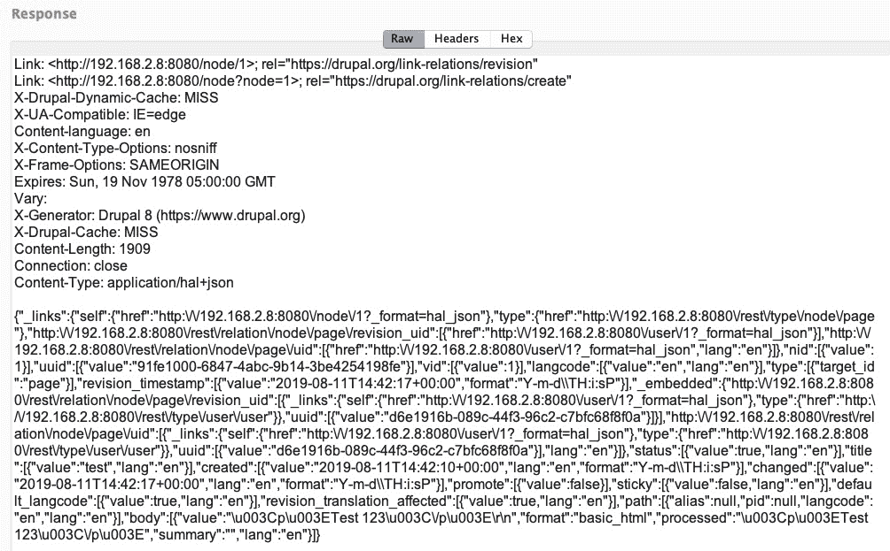

如果服务器没有 web 服务模块，我们会得到一个`406`（`Not Acceptable`）HTTP 代码错误：

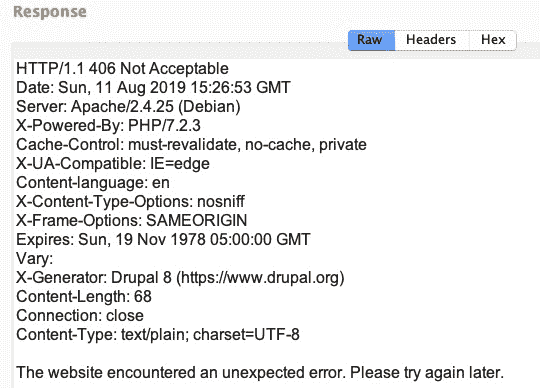

此漏洞的存在是因为`LinkItem`类接受未初始化的用户输入并将其传递给`unserialize()`函数：

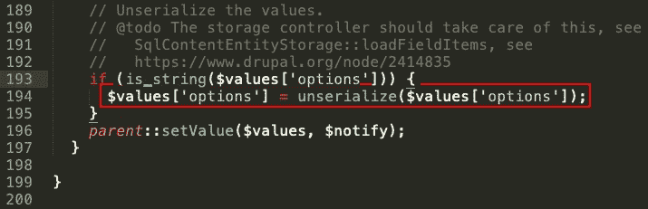

从下面的截图可以看出，根据`unserialize()`函数的 PHP 手册，在使用`unserialize()`时，我们不应该让不可信的用户输入传递给该函数：

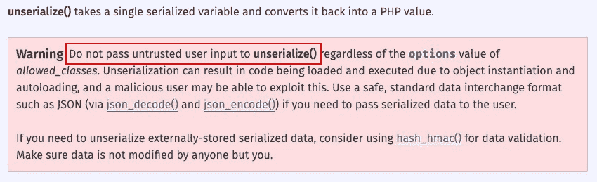

要利用此漏洞，应满足**三个**条件：

*   应用程序应该有一个可以由我们控制的`unserialize()`功能。
*   应用程序必须有一个实现执行危险语句的 PHP 神奇方法（`destruct()`或`wakeup()`的类。
*   需要有一个使用应用程序中加载的类的序列化负载。

从前面的屏幕截图中，我们可以确认我们已经控制了`$value['options']`表单实体。为了检查神奇的方法，让我们使用以下命令在源代码中搜索`destruct()`函数：

```
ag __destruct | grep guzzlehttp
```

以下屏幕截图显示了前面命令的输出：


 **Note**: You have to install the `ag` package before executing the preceding command.

在前面的屏幕截图中，我们删除了`guzzlehttp`，因为 Guzzle 被 Drupal8 用作 PHP HTTP 客户端和构建 RESTful web 服务客户端的框架。

通过查看`FnStream.php`文件（参见前面的截图），我们可以看到`__destruct()`魔术方法正在调用`call_user_func()`函数，如下截图所示：


`call_user_func()`是一个非常危险的函数，尤其是当传递多个参数时。我们可以使用此函数执行函数注入攻击：

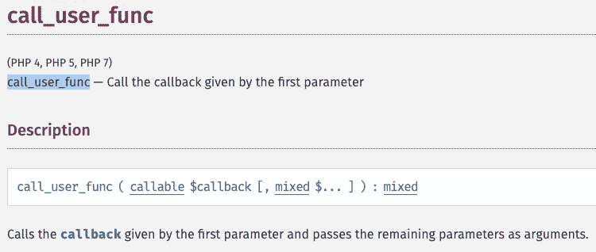

根据 OWASP，函数注入攻击包括将来自客户端的函数名插入或**注入**到应用程序中。成功的函数注入攻击可以执行任何内置或用户定义的函数。函数注入攻击是一种注入攻击，将任意函数名（有时带有参数）注入应用程序并执行。如果将参数传递给注入函数，则会导致 RCE。

根据 Drupal API 文档，`LinkItem`类用于实现`link`字段类型：

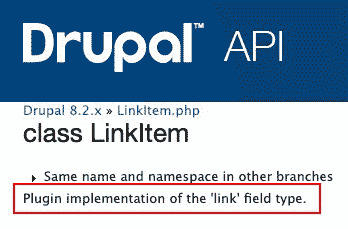

我们知道`LinkItem`类将未初始化的用户输入传递给`unserialize()`函数，但是要调用这个类，我们需要先调用一个实体。实体可以是特定实体类型的一个实例，如注释、分类术语或用户配置文件，也可以是一组实例，如博客文章、文章或产品。我们需要找到`LinkItem`用于导航的实体。让我们使用以下命令在源代码中搜索实体：

```
ag LinkItem | grep Entity
```

以下屏幕截图显示了前面命令的输出：

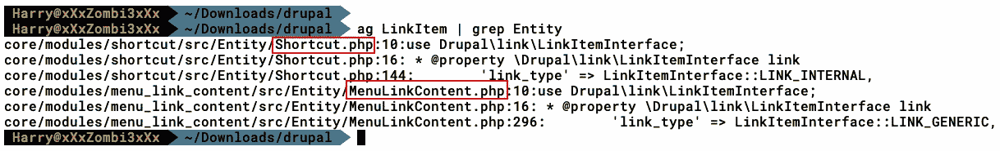

我们可以从前面的屏幕截图中看到，`LinkItem`用于导航到`MenuLinkContent.php`和`Shortcut.php`实体，我们可以从`Shortcut.php`文件中看到，快捷实体正在创建一个`link`属性：


要触发`unserialize()`功能，我们需要将我们目前解释的所有元素对齐：

```
{ "link": [ { "value": "link", "options": "<SERIALIZED_PAYLOAD>" } ], "_links": { "type": { "href": "localhost/rest/type/shortcut/default" } } } 
```

现在我们已经满足了三个条件中的两个，剩下的唯一要做的就是创建序列化负载。创建序列化负载的方法有多种，但我们将使用一个名为**PHP 通用小工具链**（**PHPGGC**的库来为 Guzzle 创建序列化负载。要使用`phpggc`生成序列化有效负载，我们使用以下命令：

```
./phpggc <gadget chain> <function> <command> --json
```

以下屏幕截图显示了前面命令的输出：

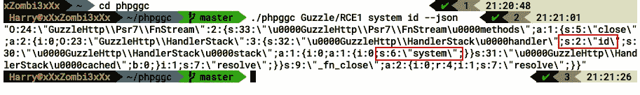

在前面的屏幕截图中生成的 JSON 序列化负载将调用`system()`函数并运行`id`命令。我们将使用以下 URL 格式的`GET/POST/PUT`方法提交整个有效负载：`localhost/node/1?_format=hal_json`

服务器将执行`id`命令并返回如下输出：

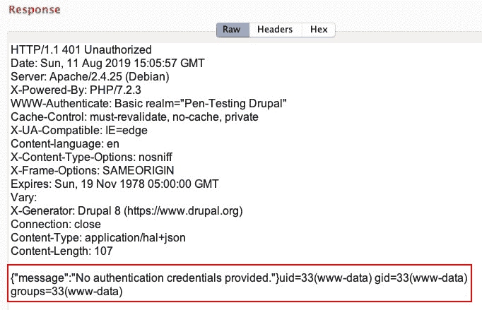

我们已经成功地实现了 RCE，但问题仍然存在：为什么序列化的有效负载能够工作？要回答这个问题，我们需要了解一般序列化数据的外观，并了解序列化格式。

# 理解序列化

为了了解对 To.t0t 函数的基本理解，我们来看看下面的 PHP 代码片段：

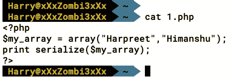

在前面的代码中，我们使用以下元素初始化了一个名为`my_array`的数组：

*   `my_array[0] = "Harpreet"`
*   `my_array[1] = "Himanshu"`

然后，我们使用`serialize()`函数为数组生成序列化数据。正如您在以下屏幕截图中所看到的，序列化数据流如下所示：

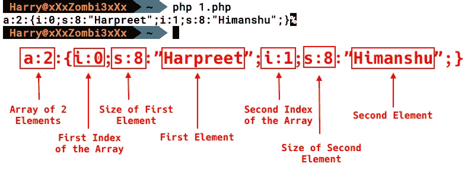

其他常用的 PHP 序列化格式有：

*   `a`：数组
*   `b`：布尔型
*   `i`：整数
*   `d`：双倍
*   `O`：普通对象
*   `r`：对象引用
*   `s`：字符串
*   `C`：自定义对象

Metasploit 还内置了针对此漏洞的漏洞攻击。查看该漏洞的源代码，我们注意到它使用的负载几乎与 PHPGCC 生成的负载相同：


唯一的区别是，命令及其长度是根据我们通过利用选项提供的输入动态设置的

正如我们在下面的屏幕截图中所看到的（我们正在调用`__destruct()`函数），要在`call_user_func()`中执行函数注入，我们必须控制`_fn_close`方法，以便将`system()`、`passthru()`、`eval()`等危险函数作为第一个参数轻松传递给`call_user_func()`：


要控制`_fn_close`方法，我们必须查看构造函数（`__construct()`：

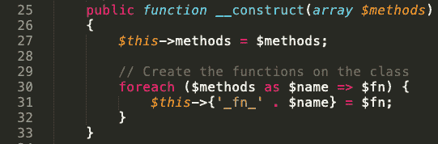

从前面的屏幕截图可以看出，`$methods`数组作为参数传递给构造函数。`__construct()`函数将通过在`$methods`数组中循环，然后在`_fn_`字符串前面加上前缀来创建函数。如果`$methods`数组中有`close`字符串，则该字符串前面会加上`_fn_`，形成`_fn_close `方法。现在，让我们看看`$methods`数组中的元素：


从前面的屏幕截图可以清楚地看到，`$methods`数组中有一个值为`close`的元素。现在我们知道了如何控制`_fn_close`方法，接下来，我们必须找到一种方法将危险函数和要执行的命令传递给`_fn_close`。为此，我们必须创建一个**流行链**。

# 什么是流行音乐连锁？

内存损坏漏洞，如缓冲区溢出和格式字符串，如果内存防御措施，如**数据执行预防**（**DEP**）和**地址空间布局随机化**（**ASLR**）到位，则**等代码重用技术将返回到 libc**（**ret2libc**和**面向返回的编程**（**ROP**）代码重用技术在基于 PHP 的 web 应用程序中也是可行的，它使用对象的概念。一种可以利用对象属性进行开发的代码重用技术是**面向属性编程（POP）**。

POP 链是针对 web 应用程序中对象注入漏洞的一种攻击方法，该漏洞利用任意修改注入到给定 web 应用程序中的对象属性的能力。然后，可以相应地操作受害者应用程序的数据和控制流。

要创建 POP 链，序列化的有效负载使用`GuzzleHttp`的`HandlerStack`类：

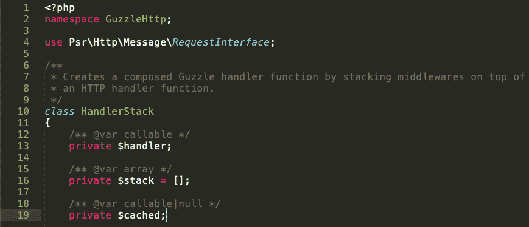

我们将命令传递给`handler`方法，将危险函数传递给`stack[]`方法，如下图所示：

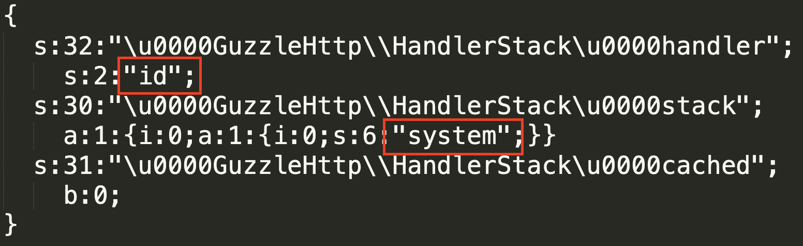

调用析构函数后（在对象销毁时自动完成调用），`_fn_close`方法的属性传递给`call_user_func()`，并执行`system(id)`：

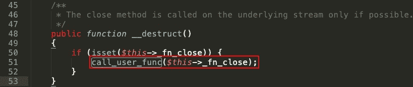

接下来，我们将反序列化有效负载。

# 反序列化有效负载

为了更清楚地理解有效负载，我们可以将其反序列化并在其上使用`var_dump`。根据 PHP 手册，`var_dump`显示一个或多个表达式的结构化信息（包括类型和值）。数组和对象由`var_dump`递归探索，值缩进以显示结构。我们也可以使用`print_r()`功能执行相同的操作：

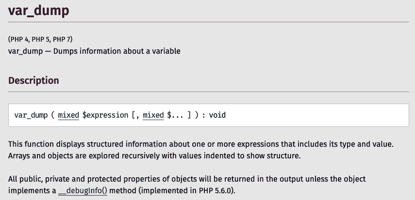

因为我们使用了基于`GuzzleHttp`客户端的有效负载，所以我们需要安装 Guzzle。我们可以使用以下 PHP 代码取消序列化：

```
<?php
require __DIR__ . '/vendor/autoload.php';
$obj= unserialize(json_decode(file_get_contents("./payload.txt")));
var_dump($obj);
?>
```

运行代码将为我们提供以下输出：

```
object(GuzzleHttp\Psr7\FnStream)#3 (2) {["methods":"GuzzleHttp\Psr7\FnStream":private]=>array(1) {["close"]=>array(2) {[0]=>object(GuzzleHttp\HandlerStack)#2 (3) {["handler":"GuzzleHttp\HandlerStack" :private]=>string(1) "id"["stack":"GuzzleHttp\HandlerStack":private]=>array(1) {[0]=>array(1) {[0]=>string(4) "system"}}["cached":"GuzzleHttp\HandlerStack" :private]=>bool(false)}[1]=>string(7) "resolve"}}["_fn_close"]=>array(2) {[0]=>object(GuzzleHttp\HandlerStack)#2 (3) {["handler":"GuzzleHttp\HandlerStack" :private]=>string(1) "id"["stack":"GuzzleHttp\HandlerStack":private]=>array(1) {[0]=>array(1) {[0]=>string(4) "system"}}["cached":"GuzzleHttp\HandlerStack" :private]=>bool(false)}[1]=>string(7) "resolve"}
```

当执行时，这将导致`system()`函数以作为参数传递给该函数的命令执行，并将输出返回给我们。

# 使用 Metasploit 通过 unserialize（）利用 RESTful Web 服务 RCE

现在我们了解了序列化的概念以及有效负载是如何序列化的，让我们使用 Metasploit`exploit`模块来利用此漏洞。让我们执行以下命令来使用`exploit`模块：

```
use exploit/unix/webapp/drupal_restws_unserialize
```

以下屏幕截图显示了前面命令的输出：


然后设置选项并运行漏洞利用。在运行 Metasploit 模块时，我们将观察到它首先执行补丁级别检查，要求`CHANGELOG.txt`查找**SA-CORE-2019-003**补丁。执行`id`命令以确认 Drupal 安装上的 RCE，如下所示：

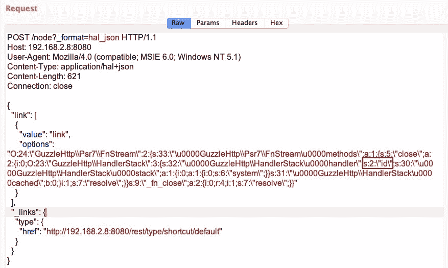

成功利用后，服务器将返回`id`命令的输出，如下所示：

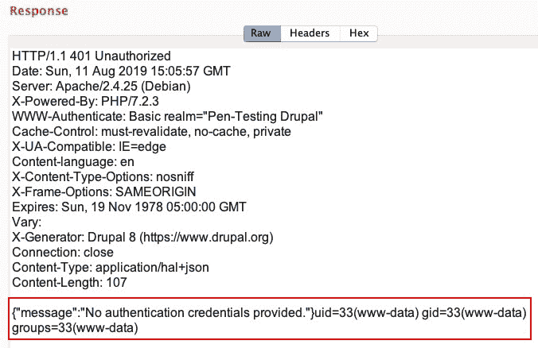

然后，PHP MeterMeter 代码被序列化并发送到服务器，MeterMeter 会话在 Metasploit 中打开，如下所示：

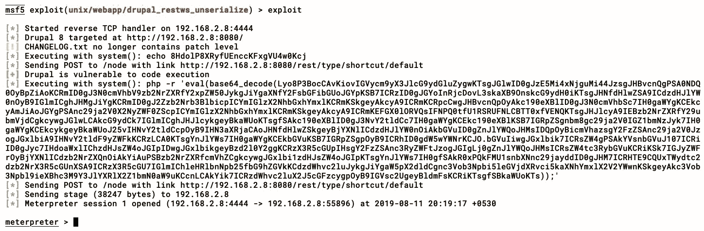

我们通过利用 RESTfulWeb 服务模块实现了对 Drupal 服务器的访问。

# 总结

本章首先讨论 Drupal 的体系结构以及目录结构。然后，我们学习了如何手动和自动执行 Drupal 侦察。之后，我们查看了两次利用的示例，并对整个利用过程进行了逐步演练。

在下一章中，我们将介绍 JBoss 服务器的枚举和利用。

# 问题

1.  是否可以使用相同的漏洞攻击不同版本的 Drupal？

2.  我们是否需要在本地安装 Drupal 以利用远程 Drupal 站点？

3.  RESTful API Web 服务漏洞不起作用——对此我们能做些什么？

4.  我们可以访问 Drupal 管理员帐户–如何在服务器上实现 RCE？

5.  我们在 Drupal 站点上发现了一个`.swp`**文件——这是否可用于攻击？**

 **# 进一步阅读

*   Drupal 8 的体系结构：[https://www.drupal.org/docs/8/modules/entity-browser/architecture](https://www.drupal.org/docs/8/modules/entity-browser/architecture)
*   深入了解 Drupal 8 RCE:[https://www.ambionics.io/blog/drupal8-rce](https://www.ambionics.io/blog/drupal8-rce)**