# 十四、Web 应用模糊测试——逻辑错误查找

在前面的章节中，我们已经了解了 Metasploit 基础知识、可用于 web 应用渗透测试的 Metasploit 模块、使用 Metasploit 模块执行侦察和枚举、Metasploit 支持的不同技术和不同的**内容管理系统**（**CMSes**），以及使用的不同开发技术。在本章中，我们将学习 web 应用渗透测试的另一个重要方面—web 应用模糊化。

Web 应用模糊化并不是通用渗透测试用例中的强制阶段。然而，这是发现逻辑漏洞的关键一步。基于 web 应用服务器对特定请求的响应方式，fuzzer 可用于了解服务器的行为，以发现测试人员肉眼看不到的缺陷。Metasploit 附带三个 web fuzzer 模块，可用于测试 web 应用中表单和其他字段中的内存溢出。在本章中，我们将通过涵盖以下主题来学习模糊化：

*   什么是模糊？
*   模糊术语
*   模糊攻击类型
*   web 应用模糊简介
*   识别 web 应用攻击向量
*   情节

# 技术要求

本章的技术要求如下：

*   Wfuzz:[https://github.com/xmendez/wfuzz](https://github.com/xmendez/wfuzz)
*   Ffuf:[https://github.com/ffuf/ffuf](https://github.com/ffuf/ffuf)
*   打嗝套房：[https://portswigger.net/burp](https://portswigger.net/burp)

# 什么是模糊？

Fuzzing，也称为 fuzz 测试，是一种黑盒软件测试，用于通过自动使用格式错误/半格式错误的数据来查找实现错误。模糊测试是由 1989 岁的 Barton Miller 教授和他的学生在威斯康星大学麦迪逊分校开发的（他们正在进行的工作可以在 http://www.cs.wisc.edu/~bart/fuzz/。在执行模糊测试时，会观察应用/软件响应，并根据其行为的变化（崩溃或挂起），发现实现错误。简而言之，模糊化过程如下：


我们需要确定需要模糊化的目标和输入向量（对于系统应用）以及端点（对于 web 应用）。生成正确的输入种子（随机模糊数据）后，将错误/半错误的模糊数据作为输入提供给模糊器进行测试。

同时，我们需要通过监视和分析服务器/应用响应来了解整个模糊测试中应用的行为（web 应用模糊时的 web 服务器响应，以及系统应用模糊时的应用诊断信息/跟踪信息，包括 FTP 服务器、SSH 服务器和 SMTP 服务器）。为了更好地理解模糊测试，让我们先学习模糊测试中使用的一些常用术语。

# 模糊术语

为了更好地理解模糊和模糊技术，让我们看看不同的模糊术语，这将有助于我们掌握本章中使用的模糊概念和技术：

*   **Fuzzer:**Fuzzer 是一种程序/工具，它将格式错误/半格式错误的数据注入服务器/web 应用，并观察应用的行为以检测错误。fuzzer 使用的畸形/半畸形数据是使用生成器生成的。
*   **生成器：**生成器使用模糊向量和一些随机数据的组合。生成的数据随后被送入 fuzzer，fuzzer 将这些格式错误的数据注入应用。
*   **模糊向量：**模糊向量是模糊器使用的已知危险值。通过观察应用的行为，模糊程序可以注入不同的模糊向量。
*   **输入种子：**这些是 fuzzer 用于测试的有效输入样本。输入种子可以是任何包含 fuzzer 使用的数据格式的测试文件。然后，生成器将根据 fuzzer 使用的输入种子生成数据。如果仔细选择输入种子，我们可以在应用中发现大量错误。
*   **检测：**这是用于测量应用性能和诊断信息（包括任何错误）的技术。在模糊化过程中，插装技术将临时控制运行时被模糊化的应用/软件，就像拦截器一样，从跟踪信息中查找错误。

现在我们已经学习了一些新的术语，让我们看看可以用来执行模糊测试的攻击类型。

# 模糊攻击类型

模糊程序通常会尝试使用数字（有符号/无符号整数或浮点数）、字符（URL 或命令行输入）、用户输入文本、纯二进制序列等进行组合攻击。可以从这些类型生成模糊向量列表。例如，对于整数，模糊向量可以是零、负值或非常大的整数值；对于字符，模糊向量可以是转义字符、Unicode 字符、URL 编码字符、特殊字符或所有字符的序列。一旦生成模糊向量列表，模糊程序将使用该列表对应用执行模糊处理

# 应用模糊

对于基于桌面的应用，fuzzer 可以在其界面（按钮序列、文本输入等的组合）、命令行选项（如果适用）和应用提供的导入/导出功能上执行 fuzzing。

对于基于 web 的应用，fuzzer 可以对其 URL、用户输入表单、HTTP 请求头、HTTP POST 数据、HTTP 协议和 HTTP 方法执行 fuzzing。

# 协议模糊化

协议模糊器将伪造网络数据包并将其发送到服务器。如果在协议栈中有一个 bug，它将通过协议模糊显示出来。

# 文件格式模糊

文件格式模糊通常用于程序在文件中导入/导出数据流的情况。要执行文件格式模糊，必须生成具有不同文件格式的多个输入种子，并将它们保存在单个文件中。fuzzer 随后将使用保存的文件作为服务器/应用的输入，记录可能发生的任何类型的崩溃。我们现在将进入下一节，它将向我们介绍 web 应用模糊化。

# web 应用模糊简介

现在我们已经清楚地了解了模糊概念、术语和攻击类型，让我们从基于 web 应用的模糊开始。如前所述，基于 web 应用的模糊化是通过使用 URL、表单、标题和方法作为主要模糊向量来完成的。在本章中，我们将使用以下工具对基于 HTTP 的 web 应用进行模糊化：**Wfuzz**、**Ffuf**和**Burp Suite**。在继续之前，让我们安装本节中概述的工具来查找逻辑错误。

# Fuzzer 安装（Wfuzz）

Wfuzz 是一个基于 Python 的 web 应用 fuzzer，它使用 replacive 技术将命令中的**FUZZ**关键字替换为给定给 fuzzer 的 FUZZ 向量。此 fuzzer 可以在不同的 web 应用组件中执行复杂的 web 安全攻击，例如参数、身份验证、表单、目录/文件和标题。Wfuzz 还配备了各种模块，包括迭代器、编码器、有效负载、打印机和脚本。根据 web 应用，我们可以使用这些模块执行成功的模糊测试：

1.  我们可以通过克隆 GitHub 存储库来安装**Wfuzz**工具，如下面的屏幕截图所示：

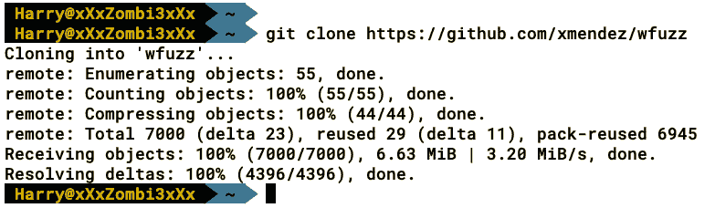

2.  在运行该工具之前，我们需要通过执行`python setup.py install`命令来安装它。这将在系统上安装所有文件，如下面的屏幕截图所示：

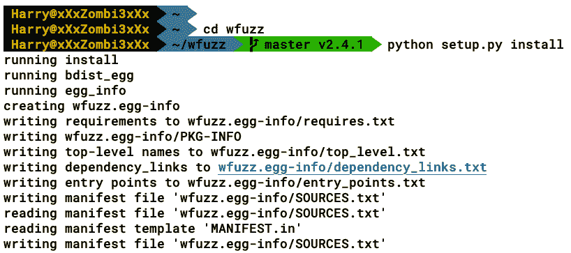

3.  为了确认工具是否已成功安装，让我们执行`wfuzz -h`命令：


**现在让我们安装第二个工具，我们将在本章中使用，**Fuzz Faster U Fool**（**ffuf**）。**

 **# Fuzzer 安装（ffuf）

**Fuzz Faster U Fool**（**ffuf**是一款用 Go 编写的 web 应用 fuzzer，具有 Gobuster 功能以及**Wfuzz**功能。我们可以从[克隆 GitHub 存储库 https://github.com/ffuf/ffuf](https://github.com/ffuf/ffuf) 或者我们可以从[下载预编译版本 https://github.com/ffuf/ffuf/releases](https://github.com/ffuf/ffuf/releases) 。让我们按照以下步骤进行安装：

1.  我们可以使用`git clone https://github.com/ffuf/ffuf`命令或`go get https://github.com/ffuf/ffuf`克隆存储库。让我们克隆存储库：

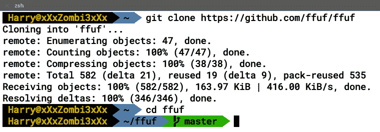

2.  现在，让我们通过执行`go build .`命令来安装它：


3.  成功构建后，我们可以看到在同一目录中创建了一个编译程序`ffuf`。我们可以运行程序，如以下屏幕截图所示：


4.  本章的第三个也是最后一个工具是臭名昭著的 Burp Suite 入侵者：

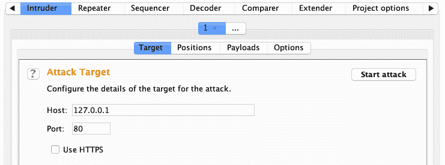

现在我们已经安装了执行模糊化所需的所有工具，让我们尝试了解在 web 应用上执行模糊化时将使用的模糊化输入和向量。

# 识别 web 应用攻击向量

攻击向量是 web 应用的区域/部分，fuzzer 可以在其中注入格式错误/半错误的数据。对于 web 应用，以下是我们可以执行模糊化的部分：

*   HTTP 请求谓词
*   HTTP 请求 URI
*   HTTP 请求头
*   HTTP`POST`数据
*   HTTP 协议的旧版本

让我们试着了解 web 应用模糊化的每个部分和所有模糊向量。

# HTTP 请求谓词

请求谓词也称为请求方法，web 应用客户端使用这些方法来指示要对服务器上的给定资源执行的所需操作。所使用的每个方法都取决于客户端从服务器所需的资源。一些最常见的 HTTP 动词有`GET`、`POST`、`OPTIONS`、`HEAD`、`PUT`、`DELETE`、`TRACE`、`PATCH`和`CONNECT`。

模糊 HTTP 请求方法可以帮助我们根据模糊程序提供的不同方法识别 web 应用响应中的变化。我们还可以确定 web 应用服务器允许的方法，这些方法可用于检查一些攻击测试用例。

# 使用 Wfuzz 模糊 HTTP 方法/谓词

模糊 HTTP 方法非常简单，同时也非常有用。让我们尝试使用**Wfuzz**模糊一个简单 web 应用上的 HTTP 谓词。模糊 HTTP 请求方法可以通过以下步骤完成：

1.  在终端执行以下命令开始**Wfuzz**：

```
wfuzz -z list,PUT-POST-HEAD-OPTIONS-TRACE-GET -X FUZZ <url>
```

2.  以下屏幕截图显示了前面命令的输出：


`-z`选项用于输入有效载荷。在本例中，我们使用了常见 HTTP 请求方法（`GET`、`POST`、`HEAD`、`OPTIONS`、`TRACE`、`PUT`的列表（`-z`、<列表名>）。

`-X`选项用于提供 fuzzer 使用的 HTTP 请求方法。如果没有提供`-X`选项，fuzzer 将默认使用 HTTP`GET`请求方法进行 fuzzing。

现在，让我们看看如何使用**ffuf**模糊 HTTP 动词。

# 使用 ffuf 模糊 HTTP 方法/谓词

我们还可以使用**ffuf 模糊请求头。**

我们可以执行以下命令，使用 wordlist 模糊请求头：

```
./ffuf -c -X FUZZ -w <http_methods_wordlist> -u <url>
```

以下屏幕截图显示了前面命令的输出：


正如我们在前面的屏幕截图中所看到的，fuzzer 发现了一些 web 应用服务器可以接受的 HTTP 方法。让我们试着用打嗝套件来模糊同一个案例。

`-c`

**ffuf**

# 使用 Burp 套件入侵者模糊 HTTP 方法/动词

通过单击入侵者选项卡并打开位置子选项卡，还可以使用 Burp Suite 入侵者模糊 HTTP 动词。Burp 套件将自动标记与**§**有效载荷标记符相匹配的`[parameter]=[value]`格式的任何值。Burp 套件将有效负载标记中的任何内容视为模糊向量。Burp 套件入侵者支持四种攻击类型：狙击手、击锤、干草叉和集束炸弹。有关攻击类型的详细信息，请参考[https://portswigger.net/burp/documentation/desktop/tools/intruder/positions.](https://portswigger.net/burp/documentation/desktop/tools/intruder/positions)

让我们通过单击 clear§按钮清除模糊向量位置，如下面的屏幕截图所示：


为了模糊 HTTP 请求方法，让我们通过单击 add§按钮添加有效负载标记（**§**，如下面的屏幕截图所示：

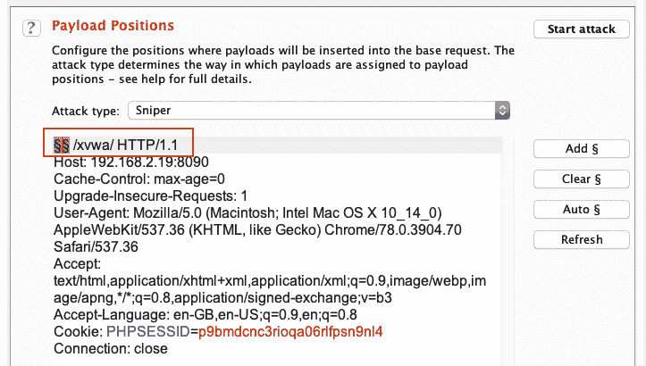

既然设置了有效负载标记，我们需要定义入侵者应该用于模糊化的有效负载。这可以通过单击“有效载荷”选项卡来完成（如下面的屏幕截图所示）。在本例中，我们将使用包含一些常见 HTTP 请求方法的单词列表。首先将有效负载类型设置为`Simple list`，然后单击 Load…（加载）按钮加载列表，即可使用单词列表：


加载单词列表后，我们可以单击开始攻击按钮开始模糊化：

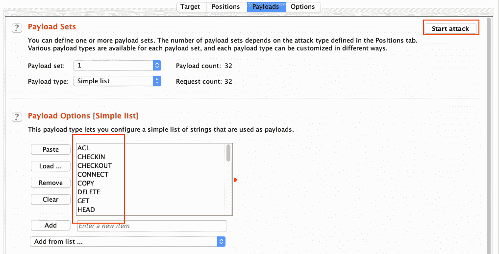

将打开一个新窗口，显示模糊结果，如下面的屏幕截图所示：


在前面的屏幕截图中，我们可以看到服务器在使用 HTTP CONNECT 和 TRACE 方法时分别使用 HTTP`400`（**坏请求**）和 HTTP`405`（**方法不允许**代码进行响应。这向我们展示了 web 应用服务器关于这两个请求头的行为。

注意：我们也可以使用其他在线免费提供的自定义列表来模糊 HTTP 方法。

# HTTP 请求 URI

要开始 HTTP 请求 URI 模糊化，我们首先需要了解 URI 结构。URI 具有以下普遍可接受的结构：

```
http://[domain]/[Path]/[Page].[Extension]?[ParameterName]=[ParameterValue]
```

# 使用 Wfuzz 模糊 HTTP 请求 URl 路径

要在 Wfuzz 的帮助下模糊 URI 路径，让我们执行以下命令：

```
wfuzz -w <wordlist> <url>/FUZZ
```

以下屏幕截图显示了前面命令的输出：

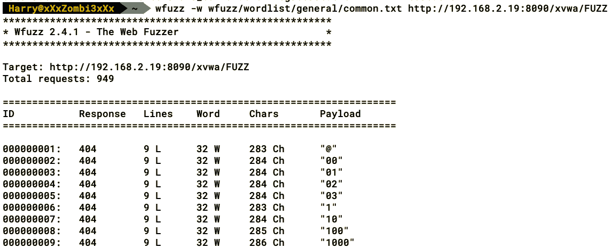

使用`--hc`开关，我们可以根据 HTTP 代码过滤出结果。在本例中，我们已经过滤了 HTTP`404`（**未找到**）代码，如下截图所示：


**我们可以使用**ffuf**做同样的事情。**

 **# 使用 ffuf 模糊 HTTP 请求 URl 路径

**为了模糊 URI 路径，让我们执行以下命令：**

 **```
./ffuf -c -w <wordlist> -u <url>/FUZZ
```

以下屏幕截图显示了前面命令的输出：


在上述两种情况下，`FUZZ`关键字将替换为用于模糊目录名的单词列表项。正如我们在前面的屏幕截图中看到的，当 fuzzer 请求 css、img、js 和 setup 时，服务器用 HTTP`301`响应。通过观察响应和单词的大小，我们可以得出结论，fuzzer 能够在 web 应用服务器中找到目录。

# 使用 Burp 套件入侵者模糊 HTTP 请求 URl 路径

现在我们已经使用了**Wfuzz**和**ffuf**来模糊 URI 路径，让我们在 Burp Suite 入侵者中尝试同样的方法。这里的概念是相同的。让我们放置一个有效负载标记（如下面的屏幕截图所示），以便 fuzzer 向向量发送数据：

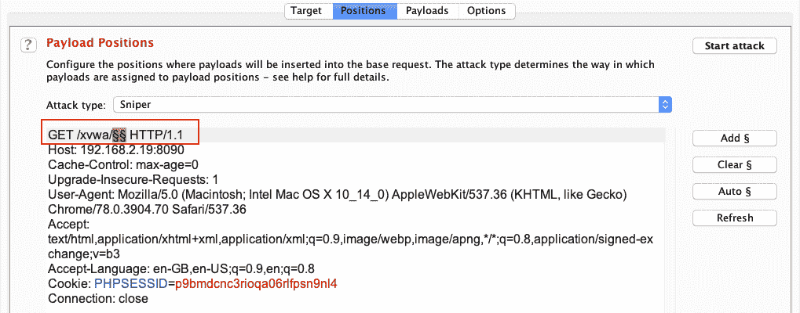

让我们将有效负载类型设置为`Simple list`并使用 Load…（加载）按钮导入单词列表：

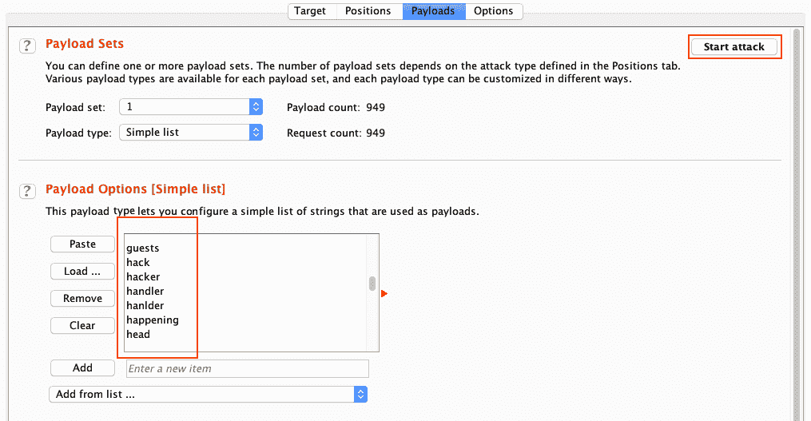

单击开始攻击按钮（如前面的屏幕截图所示），入侵者将尝试使用提供给它的自定义单词列表模糊 URI 路径。fuzzer 的结果将显示在另一个窗口中，其中包含 HTTP 响应代码和长度，我们可以在下面的屏幕截图中看到：


正如我们在前面的屏幕截图中所看到的，我们能够模糊 web 应用服务器的 URI 路径（目录）。现在，让我们看看如何使用相同的工具模糊 URI 文件名和文件扩展名。

# 使用 Wfuzz 模糊 HTTP 请求 URl 文件名和文件扩展名

Wfuzz 还可以模糊 web 应用服务器的文件名和文件扩展名：

*   `wfuzz -c --hc=404 -z file,SecLists/Discovery/Web-Content/raft-small-files-lowercase.txt http://192.168.2.19:8090/xvwa/FUZZ.php`（文件名模糊化）
*   `wfuzz -c --hc=404 -z list,php-asp-aspx-jsp-txt http://192.168.2.19:8090/xvwa/home.FUZZ`（文件扩展名模糊）

# 使用 ffuf 模糊 HTTP 请求 URl 文件名和文件扩展名

要模糊 HTTP 请求 URI 文件名和文件扩展名，可以对 ffuf 模糊器使用以下命令：

*   `ffuf -c -w <wordlist> -u http://192.168.2.19:8090/xvwa/FUZZ.php`（文件名模糊化）
*   `ffuf -c -w <wordlist> -u http://192.168.2.19:8090/xvwa/home.FUZZ`（文件扩展名模糊）

# 使用 Burp 套件入侵者模糊 HTTP 请求 URl 文件名和文件扩展名

有效负载标记放在文件扩展名之前以模糊文件名（如下面的屏幕截图所示）：


有效负载标记放在文件名之后，以模糊文件扩展名（如下面的屏幕截图所示）：

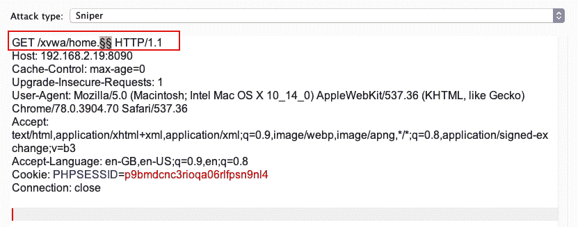

Wfuzz 和 Burp Suite 入侵者最酷的地方是能够使用多个模糊向量模糊多个有效负载位置。

# 使用 Wfuzz（GET 参数+值）模糊 HTTP 请求 URl

Wfuzz 通过添加**fuzz**、**Fuzz2Z**、**Fuzz3Z**来内置模糊多个有效载荷位置的功能。。。关键词。假设我们想要模糊化`GET`参数名和 web 应用服务器的值。由于我们不能在两个模糊向量中使用相同的字表，我们将使用**模糊**和**FUZ2Z**关键字来执行模糊。让我们在 Wfuzz 中执行以下命令：

```
wfuzz -c -z list,<parameter_wordlist> -z <value_wordlist> http://<target>:<port>/?FUZZ=FUZ2Z
```

正如我们在前面的命令中所看到的，我们已经使用`-z`选项（是的，我们可以重复使用`-z`、`-H`和`-b`选项）输入了**Wfuzz**两个单词列表`parameter_wordlist`和`value_wordlist`，并且`[parameter]=[value]`以`/?FUZZ=FUZ2Z`格式显示。执行此命令后，模糊程序将使用`parameter_wordlist`中的第一个条目，将其替换为`FUZZ`关键字，然后通过`FUZ2Z`循环所有`value_wordlist`条目。像这样，模糊程序将模糊两个单词列表。现在让我们看看如何使用入侵者实现同样的功能。

# 使用 Burp 套件入侵者模糊 HTTP 请求 URl（获取参数+值）

在 Burp 套件中，不同的攻击类型可以帮助我们进行此类测试。为了同时模糊两个单词列表，我们将在入侵者中使用集束炸弹攻击类型：

1.  首先，让我们将攻击类型设置为集束炸弹，并将有效负载标记设置为/？§=§（如以下屏幕截图所示）：

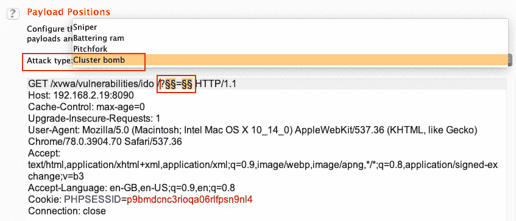

2.  在本例中，我们将使用两个有效负载集，因此让我们设置第一个有效负载集（参数名称），并将有效负载类型更改为简单列表：


3.  现在配置了第一个有效负载集，让我们配置第二个有效负载集（参数值）。将有效负载设置为`2`后，让我们将有效负载类型更改为`Numbers`。由于参数值是整数格式（在本例中），我们将范围设置为从`1`到`5`，并将步骤设置为`1`：


4.  我们的入侵者现在配置为通过多个有效负载集进行模糊化。让我们通过单击开始攻击按钮（如前面的屏幕截图所示）开始模糊测试。然后，我们将看到以下屏幕：


成功

正如我们从前面的屏幕截图中看到的，入侵者能够找到带有一些参数值的项参数名。我们如何区分找到的参数名称和值与 wordlist 中的其他条目？通过观察响应长度。

让我们尝试使用**Wfuzz**（目录、文件和文件扩展名）模糊三个模糊向量。这肯定需要很多时间，因为它同时组合了不同的有效负载集。要模糊目录、文件名和文件扩展名，可以执行以下命令：

```
wfuzz -c --hc=404 -z file,SecLists/Discovery/Web-Content/raft-small-directories-lowercase.txt -z file,wfuzz/wordlist/general/common.txt -z list,php-txt http://192.168.2.19/FUZZ/FUZ2Z.FUZ3Z
```

以下屏幕截图显示了前面命令的输出：


结果可以根据字符数（`--hh`、单词数（`--hw`）或行数（`--hl`）进行过滤：

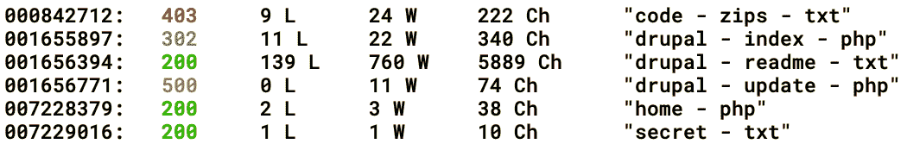

现在我们已经了解了如何模糊 HTTP 请求 URI，让我们了解如何模糊 HTTP 头。

# HTTP 请求头

模糊化请求头在概念上与模糊化 URI 相同。唯一的区别是，通过模糊化请求头发现的漏洞数量将高于模糊化 URI 时发现的漏洞数量，因为这些头被发送到 web 应用服务器，服务器在内部处理这些头。这意味着我们有更大的范围来发现漏洞。

有不同类型的 HTTP 头在起作用：

*   标准 HTTP 头文件（`Cookie`、`User-Agent`、`Accept`、`Host`等）
*   非标准 HTTP 头文件（`X-Forwarded-For`、`X-Requested-With`、`DNT`等）
*   自定义标题（除非标准标题外，以`X-`开头的任何其他标题）

让我们试着理解如何使用与本章其余部分相同的模糊器模糊每种类型的标题。

# 使用 Wfuzz、ffuf 和 Burp 套件模糊标准 HTTP 头

web 服务器通常使用标准 HTTP 头来处理客户端请求。在执行 web 应用渗透测试时，建议了解 web 应用的工作原理以及 web 应用服务器如何处理请求头（标准和非标准）。更好地理解 web 应用可以帮助我们定义一些相当不错的模糊向量，这将大大提高在 web 应用中发现逻辑缺陷的概率。在本主题中，我们将通过一些自定义测试用例来了解如何模糊 web 应用。

# 场景 1–Cookie 头模糊

让我们来看看下面的场景。我们有一个 PHP 文件，`- cookie_test.php`。我们请求此文件，其`Cookie`标志为`lang=en_us.php`：

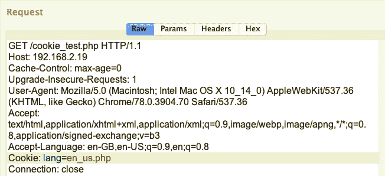

**服务器使用*英语*的消息语言进行响应：**

 **

**从`en_us.php`文件中，我们可能会认为`cookie`参数包括来自服务器的文件（文件包含）并执行该文件，而该文件又打印来自服务器的消息。**

 **现在让我们看看如何使用**Wfuzz**模糊`cookie`标题：

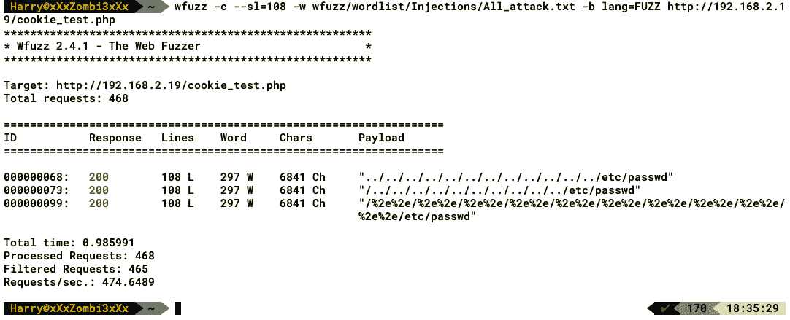

正如我们在前面的屏幕截图中看到的，`-b`选项用于提供`cookie`值，我们使用了`lang=FUZZ`。使用基于 web 应用攻击的模糊向量，我们能够找到有效负载，服务器使用不同的响应长度进行响应。这里，我们使用 fuzzer 发现的一个有效载荷：

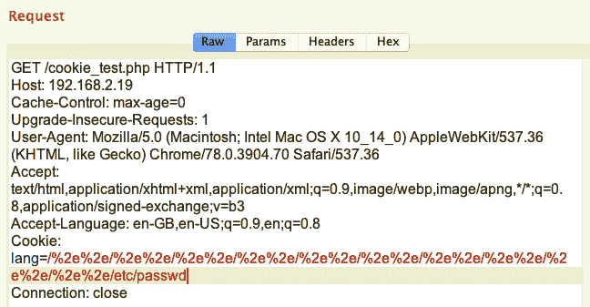

我们能够确认存在文件包含漏洞：


**同样可以使用**ffuf**执行以下命令：**

 **```
fuff -c -b lang=FUZZ -w <wordlist> -u http://192.168.2.19/cookie_test.php
```

对于 Burp Suite，我们只需要将有效负载标记添加到`Cookie`头中：

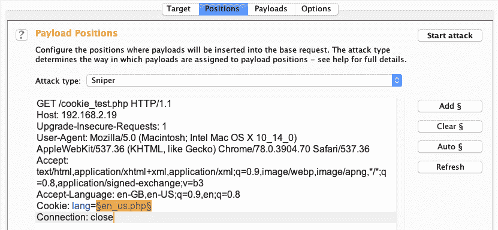

类似地，我们可以使用相同的工具模糊用户定义的`Cookie`头。让我们看看这个。

# 场景 2–用户定义的 cookie 头模糊

此场景与前一场景不同。在这个场景中，我们将从服务器请求附有`lang=en_us`cookie 值的`cookie_test.php`文件：


服务器响应未经授权的访问！，正如我们在下面的屏幕截图中所看到的：

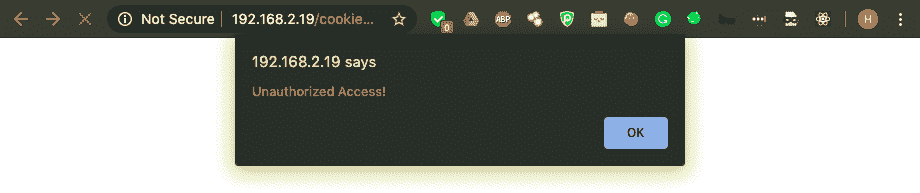

仅通过正常请求，服务器将定义的 cookie 回显给我们：


假设我们的目标是访问`home.php`文件，但它现在受到限制，如下所示：


由于没有登录身份验证页面，我们可以向服务器进行身份验证，因此我们必须假设身份验证是在`User-Agent`部分或`Cookie`部分进行的。让我们假设身份验证是通过检查 cookie 值来完成的。客户端可以使用用户定义的 cookie 值连接到服务器并成功进行身份验证。要模糊用户定义的盲 cookie 值，让我们使用 wfuzz 执行以下命令：

```
wfuzz --sh=239 -c -z file,<username_wordlist> -z file,<password_wordlist> -b lang=en_us -b FUZZ=FUZ2Z <url>
```

以下屏幕截图显示了前面命令的输出：


哇！正如我们在前面的屏幕截图中所看到的，当插入值为`Cookie: admin=admin;`的用户定义 cookie 时，服务器以不同的页面响应。让我们使用相同的用户定义 cookie 参数名称和值来请求相同的页面：

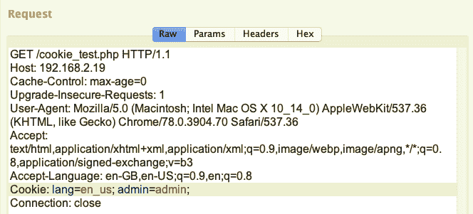

 **正如我们在下面的屏幕截图中看到的，服务器正在将我们重定向到`home.php`页面：


模糊用户定义的 cookie 参数名称和值，我们能够使用`cookie_test.php`页面访问`home.php`页面进行身份验证：


同样的方法可用于查找各种漏洞，如 SQL 注入、XSS 和 RCE。

注意：这完全取决于 web 应用以及 web 应用如何处理`Cookie`头。如果`Сookie`头只是用来提供服务器到客户端的临时会话，那么除了测试基于会话的漏洞之外，我们没有什么可以做的。

其他标准头也可以模糊化，包括`User-Agent`、`Host`、`Accept`和`Content-Type`。在模糊化非标准 HTTP 头的情况下，我们可以使用一个字列表来检查模糊器请求的每个头的服务器响应。有时，通过使用这些非标准头，例如 X-Forwarded-For 和其他头，我们可以绕过服务器对应用施加的基于 IP 的访问限制。

# 使用 Wfuzz、ffuf 和 Burp 套件模糊自定义标题

在许多 web 应用中，开发人员引入了一些自定义 HTTP 头，然后在处理请求时解析这些头。从生成特定于用户的令牌到允许通过此类自定义头进行访问控制，这些头具有完全不同的功能级别。在这种情况下，开发人员有时会忘记清理用户输入，这反过来可能成为攻击的目标。让我们看看如何使用 Wfuzz、ffuf 和 Burp 套件模糊自定义标题。

# 场景 3–自定义标题模糊

在这个场景中，我们有一个在 PHP 上运行的应用–`custom_header.php`。我们从服务器请求以下页面：

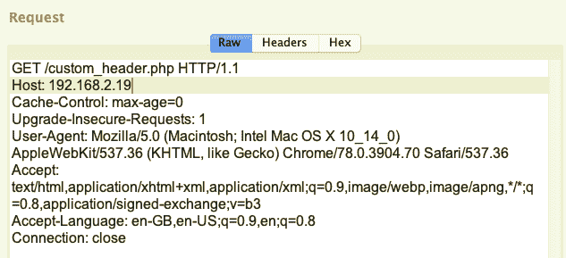

服务器响应未经授权的访问！消息和两个未知标题–`X-isAdmin: false`和`X-User: Joe`（如下面的屏幕截图所示）：

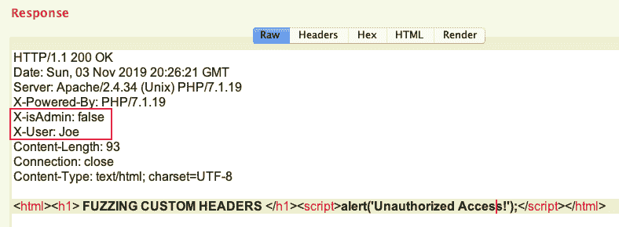

**来自服务器的消息如下：**

 **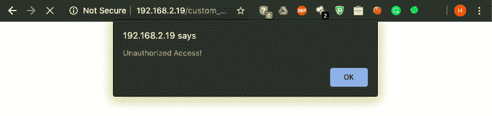

通过观察这两个自定义头，我们可以假设服务器也在处理这些头。第一个头，即`X-isAdmin`，看起来像一个接受布尔值的自定义头：`true`或`false`。另一个标题`X-User`可能接受用户的名字，因此该值为字符串格式。让我们使用**Wfuzz**对这些标题进行模糊处理，并找出我们可以对此做些什么。让我们在**Wfuzz**中执行以下命令：

```
wfuzz -c -z list,true-false -z file,<username_wordlist> -H “X-isAdmin: FUZZ” -H “X-User: FUZ2Z” <url>
```

以下屏幕截图显示了前面命令的输出：

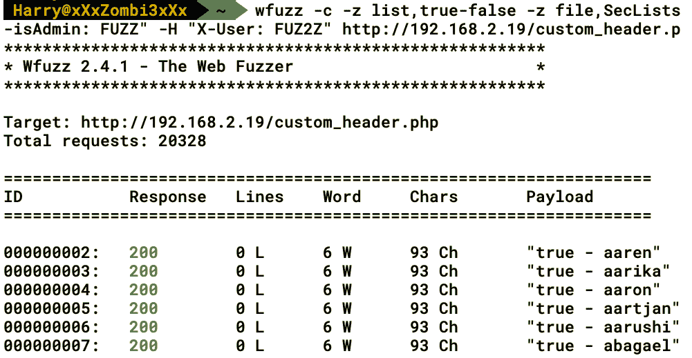

我们可以在 HTTP 请求的多个位置使用`-H`标志。现在，我们从服务器获得了相同的响应，让我们根据字符长度（即`--hh`标志）过滤出结果：

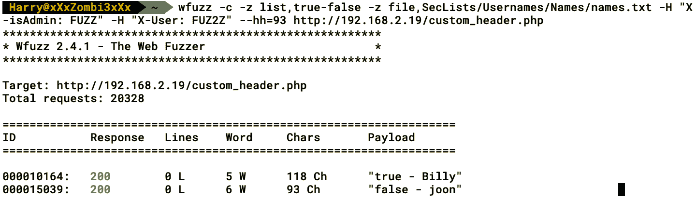

难以置信的我们找到了`X-isAdmin: true`和`X-User: Billy`的值。这意味着比利是这里的管理员。在 HTTP 请求中使用此自定义标头，让我们看看是否可以访问该页面：


正如我们在下面的屏幕截图中所看到的，我们能够使用自定义 HTTP 头对页面进行身份验证，并且在身份验证之后，服务器将我们重定向到`home.php`页面：

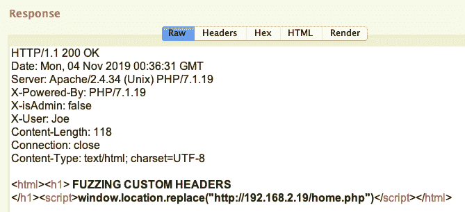

`home.php`页面如下所示：


现在我们已经对模糊 HTTP 请求头有了一些了解，我们也可以在 HTTP`POST`参数上使用类似的模糊技术，我们可以在下面的屏幕截图中看到：

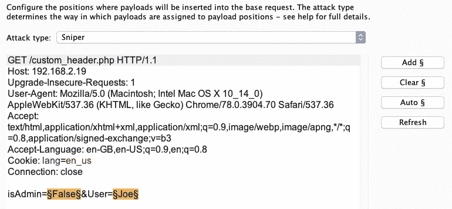

同样，我们还可以模糊 HTTP`POST`参数，以找到应用支持的 API 以及这些 API 参数支持的可接受值。

对 web 应用攻击向量执行模糊测试可以让我们更深入地了解 web 应用渗透测试。当模糊程序发现有趣的东西时，记录每个请求和响应总是一个好的做法。最后，如果向模糊测试人员提供详细的模糊数据，则模糊测试是非常有效的。在大多数情况下，模糊测试可以发现代码执行和其他一般 web 应用扫描程序无法发现的技术漏洞。

# 总结

在本章中，我们首先学习了模糊化的基础知识和不同类型的模糊化攻击。然后，我们深入研究了 web 应用模糊化，并查看了**Wfuzz**和**ffuf**的安装。之后，我们对 HTTP 请求谓词和请求 URI 执行模糊处理。在本章末尾，我们研究了三种场景：cookie 头模糊、用户定义的 cookie 头模糊和自定义头模糊。了解了模糊测试之后，您现在可以了解 web 应用的行为，这将帮助您发现技术和逻辑漏洞。您可以在执行 bug 奖励或玩挑战性的**捕获标志**（**CTFs**时，将模糊测试作为常规渗透测试的一部分

在下一章中，我们将介绍渗透测试报告中必须包含的要点。

# 问题

1.  我可以在基于 SSL 的 web 应用上执行模糊化吗？

2.  Windows 是否支持这些模糊器（本章中提到的模糊器）？

3.  我是否需要在所有 web 应用渗透测试中执行模糊化？

4.  如果我执行模糊化，我会发现什么类型的漏洞？

# 进一步阅读

*   Wfuzz 下载页面：[https://github.com/xmendez/wfuzz](https://github.com/xmendez/wfuzz)
*   ffuf 下载页面：[https://github.com/ffuf/ffuf](https://github.com/ffuf/ffuf)
*   打嗝套房官方网站：[https://portswigger.net/burp](https://portswigger.net/burp)
*   了解模糊化的基础知识：[https://owasp.org/www-community/Fuzzing](https://owasp.org/www-community/Fuzzing)
*   了解 web 应用攻击向量：[https://www.blackhat.com/presentations/bh-dc-07/Sutton/Presentation/bh-dc-07-Sutton-up.pdf](https://www.blackhat.com/presentations/bh-dc-07/Sutton/Presentation/bh-dc-07-Sutton-up.pdf)****************