# 一、BurpSuite 即使入门

欢迎使用即时BurpSuite入门。这本书是专门为你提供所有的信息，你需要得到设置BurpSuite。您将学习 Burp Suite 的基础知识，开始测试您的第一个应用程序，并发现一些使用 Burp Suite 的提示和技巧。

本文件包含以下章节：

*那么什么是BurpSuite？*-了解BurpSuite到底是什么，你能用它做些什么，以及为什么它这么棒。

*安装*-学习如何下载和设置 Burp 套件，以便您可以尽快使用它。

*快速入门*-本节将向您展示如何执行 Burp Suite 的核心任务之一；拦截 HTTP/S 请求并执行篡改。按照以下步骤拦截、检查和修改客户端和服务器之间的 HTTP/S 流量。

*您需要了解的*前 8 项功能–在这里，您将学习如何使用 Burp Suite 最重要的功能执行八项任务。在本节结束时，您将能够使用目标站点地图功能、抓取 web 应用程序、启动扫描以检测安全漏洞、自动化定制攻击、操纵和迭代 web 请求、分析应用程序数据的随机性，以多种格式对数据进行解码和编码，并比较站点地图以检测授权错误。

*你应该了解的人和地方*-每个安全项目都以社区为中心。本节为您提供了许多指向项目页面和论坛的有用链接，以及许多关于 Burp Suite 的有用文章、教程和博客

# 那么，BurpSuite是什么？

**Burp Suite**是一个易于使用的 web 应用安全集成平台。Burp 包括多个无缝集成的工具，允许您测试现代 web 应用程序的每个组件和方面。无论您是否需要验证身份验证机制的健壮性、会话令牌的可预测性或应用程序中存在的输入验证检查点，Burp 都是安全从业人员的瑞士军刀。它不仅允许深入的手动评估，而且还结合了自动技术来枚举和分析 web 应用程序资源。

Burp 由 PortSwigger Ltd.开发，分两个版本发行：

*   不Burp
*   Burp专家

### 注

尽管专业版包含一个自动 web 应用程序扫描程序和许多增强功能，但免费版非常适合启动，因为它包含了查找第一个漏洞所需的所有基本工具。如果您想了解两个版本之间的差异以及专业许可证的成本，请访问[http://www.portswigger.net](http://www.portswigger.net) ，该工具的官方网站。

本质上，Burp 是一个本地 web 代理，允许拦截、检查和修改用户浏览器和目标网站之间的 HTTP/S 请求和响应。当用户在 web 应用程序中导航时，该工具获取所有访问的页面、脚本、参数和其他组件的详细信息。浏览器和服务器之间的流量最终可以可视化、分析、修改和重复多次。Burp Suite 中包含的不同工具可以通过上面的选项卡轻松区分：

*   **目标**：此工具允许聚合所有 web 应用资源，从而指导用户进行整个安全测试。
*   **代理**：是该工具的核心组件，可以拦截和修改所有网络流量。
*   **爬行器**：可用于发现新页面和参数的自动爬行器。
*   **扫描仪**：完整的 web 应用程序安全扫描仪，仅提供专业版。
*   **入侵者**：Burp 入侵者允许定制和自动化 web 请求。使用不同内容重复多次相同的请求可以执行**模糊化**。Web 模糊化通常包括向目标应用程序发送意外的输入。此过程可能有助于识别安全缺陷。
*   **Repeater**：一个简单但功能强大的工具，可用于手动修改和重新发布 web 请求。
*   **Sequencer**：Burp Sequencer 是验证安全令牌、cookie 等的随机性和可预测性的完美工具。
*   **解码器**：允许使用多种编码方案（如 URLencode）或常用哈希函数（如 MD5）对数据进行编码和解码
*   **比较器**：一种视觉*差异*工具，可用于检测网页之间的变化。

Burp 的主窗口显示在以下屏幕截图中：


# 安装

通过几个简单的步骤，您可以设置 Burp 套件和浏览器。

## 步骤 1–我需要什么？

开始之前，您需要检查系统要求，如下所示：

*   磁盘空间：至少 100 MB 可用空间。临时文件、保存配置和Burp状态文件需要磁盘空间。
*   内存：至少 2 GB。这个内存量通常是足够的。如果您正在测试大型应用程序，则可能需要更多。
*   操作系统：Burp 套件适用于 Windows、Mac OS X 和 Linux
*   软件组件：运行 Burp 套件需要更新的 Oracle Java 运行时环境（v1.6 或更高版本）。或者，也可以使用 OpenJDK，尽管它没有得到官方支持。此外，确保安装最新版本的现代浏览器（Firefox、Internet Explorer、Chrome、Safari 或 Opera）。作者建议使用 Mozilla Firefox。

## 步骤 2–下载BurpSuite

Burp 套件可以从[下载为压缩包 http://www.portswigger.net/burp/download.html](http://www.portswigger.net/burp/download.html) 。

我建议您下载免费版，并开始评估软件的基本功能。最终，您可能会决定购买具有所有高级功能的专业版许可证。

下载并解压缩归档文件后，您将看到一个包含 Java 归档（JAR）文件的文件夹。

## 步骤 3–启动BurpSuite

在撰写本文时提供的最新免费版本中，Burp Suite 的 JAR 名为`burpsuite_v1.4.01.jar`。可以使用以下命令启动此可执行 Java 存档。

### 窗户

1.  点击**开始**。
2.  点击**运行**。
3.  键入`cmd`并按*进入*。
4.  使用命令`cd`（例如，`cd burpsuite_v1.4.01`）移动到包含Burp的罐子的文件夹。
5.  使用`java -Xmx2g -jar burpsuite_v1.4.01.jar`启动Burp。

### Linux 和 Mac OS X

1.  打开一个终端。
2.  使用命令`cd`（例如，`cd burpsuite_v1.4.01`）移动到包含Burp的罐子的文件夹。
3.  使用`java -Xmx2g -jar burpsuite_v1.4.01.jar`启动Burp。

选项`-Xmx2g`用于将分配给 Java 的最大内存增加到 2GB。

请注意，在某些平台（例如 Windows）上，只需双击 JAR 文件即可启动 Burp Suite。但是，以这种方式执行 Burp 不允许您自定义该工具的最大可用内存。

几秒钟后，主 Burp Suite 窗口将出现在屏幕中央。如果没有，我们建议仔细检查所有命令，并仔细阅读命令行中的任何错误消息。常见错误包括错误的权限或错误的路径。

## 步骤 4–验证 Burp 代理配置

Burp 代理充当从浏览器到目标 web 应用程序的请求的中介。因此，在连接浏览器之前，即使配置正确，也无法立即显示。

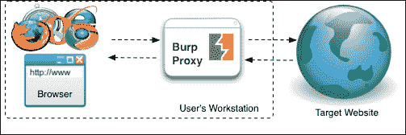

Burp 代理如何与浏览器和目标网站交互

默认情况下，Burp 代理配置为侦听端口**8080/tcp**。要验证计算机上没有其他软件干扰它（例如，使用相同的 TCP 端口），您可以在**代理****选项**选项卡中检查代理侦听器。如果标记了**running**复选框，则 Burp Proxy 已准备好接收来自浏览器的请求。如果出现错误，您将在**警报**选项卡中注意到异常的存在。在某些情况下，可能需要更改端口并重新启动侦听器，只需单击**运行**复选框。

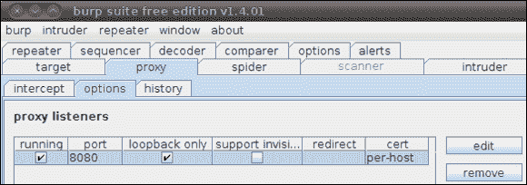

Burp 代理配置

通过选择代理项并点击**编辑**可以修改配置。例如，您可以通过在**本地侦听器端口**文本框中键入新端口号，然后单击**更新**来更改端口。最后，再次点击**运行**复选框，如果尚未选中，则启动侦听器。

如果选中了**仅环回**复选框，则 Burp Proxy 将仅允许从本地计算机进行连接。否则，如果其他计算机需要远程访问 Burp，可以取消选择此选项。

### 注

请注意，由于存在安全隐患，不鼓励将 Burp 代理侦听器公开给网络中的其他主机。

如果您正在测试标准 web 应用程序，则可以跳到*步骤 5–配置浏览器*。在大多数情况下，这些是 Burp 代理所需的唯一配置。

在特定情况下，例如，在测试独立客户端或通过 HTTP/S 通信的移动应用程序时，您可能需要选中**支持非代理感知客户端的不可见代理**复选框，并在相应字段中手动输入目标主机和端口。这样，Burp 将处理所有非代理类型的请求，允许您将所有流量重定向到目标主机。

## 步骤 5–配置浏览器

在这个阶段，只需要配置您最喜欢的浏览器，以便通过 Burp 代理重定向所有 HTTP/S 请求，而不是实际的目标网站。如果在上一步中未更改 Burp 中的默认配置，则需要将 HTTP 和 HTTPS 的代理主机地址设置为`127.0.0.1`，代理端口设置为`8080`。

为两种最常见的浏览器提供了分步配置：Mozilla Firefox 和 Internet Explorer。对于其他浏览器，如 Safari、Chrome 和 Opera，请参阅官方浏览器文档。我建议您使用 Mozilla Firefox，因为它的多功能性。此外，在撰写本文时，Mozilla Firefox 不包含任何可能干扰您测试的嵌入式**反跨站点脚本**（**XSS**过滤器。

### Mozilla Firefox

1.  进入 Firefox 菜单，点击**首选项**。
2.  在**高级**选项中，在**网络**选项卡下，点击连接**设置**。
3.  选择**手动代理配置**。
4.  输入代理主机地址（例如，**127.0.0.1**）和代理端口（例如，**8080**），如*步骤 4–验证 Burp 代理配置*中配置的。
5.  选择**将此代理服务器用于所有协议**。
6.  确保从的**无代理字段中删除所有异常。**
7.  Click **OK** and close all windows.

    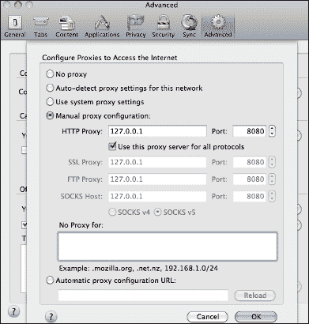

    Mozilla Firefox 中的代理配置

### 微软 Internet Explorer

1.  进入**工具**菜单，点击**互联网选项**。
2.  在**连接**选项卡下，点击**LAN 设置**。
3.  选择**为您的 LAN**使用代理。
4.  点击**高级**。
5.  在**HTTP**字段中，输入代理主机地址（例如`127.0.0.1`）和代理端口（例如**8080**）。
6.  选择**对所有协议**使用相同的代理服务器。
7.  确保删除**中以**开头的地址的“请勿使用代理服务器”字段中的所有异常。
8.  点击**确定**并关闭所有窗口。

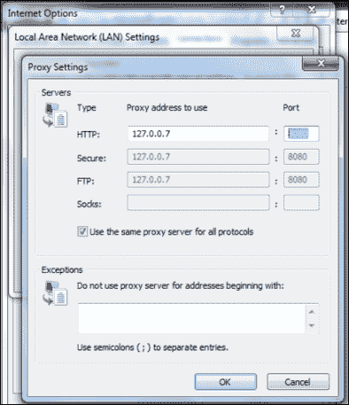

Internet Explorer 中的代理配置

独立于使用的特定浏览器，确保禁用所有可能干扰 Burp Suite 的扩展和附加功能。这些包括第三方代理插件和安全增强功能（例如，反 XSS 过滤器、NoScript 等）。如果可能，创建一个专用概要文件，仅用于测试目的。

## 就这样！！

至此，您应该已经安装了 Burp Suite，并且您的浏览器应该正确配置为拦截所有请求。

进入浏览器，输入[http://www.packtpub.com/ 在地址栏中点击](http://www.packtpub.com/)并按*进入*。如果所有配置都正确，Burp 代理将拦截您的请求。在 Burp Suite 中，转到**代理****截取**选项卡，确认 web 请求正在等待您的批准。

按钮上的**截取应突出显示；单击它并允许请求通过Burp传输。回到浏览器中，您应该会像往常一样看到 Packt 发布页面。此外，您可以看到，在选项卡**目标****站点地图**下，正在填充一棵资源树。**

### 注

确保不时验证 Burp 代理拦截配置。如果您正在浏览应用程序，而浏览器未加载页面，则 Burp 可能正在停止请求或响应。

如果您的浏览器以不同的方式运行，或者事情没有按照描述的方式运行，请重复前面的步骤，确保 Burp Proxy 正在正确侦听，并且已配置浏览器以连接到 Burp。

假设您已经成功地设置了 Burp 套件，现在是开始测试应用程序的时候了。

### 还有一件事。。。

正如您已经知道的，Burp 套件支持 HTTP 和 HTTPS。后者是一种广泛使用的协议，用于浏览器和服务器之间的安全通信。如今，HTTPS 是保护网上购物、网上银行和其他敏感操作的标准。使用此协议，HTTP 被封装在 SSL/TLS 层上。HTTPS 保护数据传输免受网络嗅探和所谓的**中间人**（**MitM**攻击。

在我们的设置中，Burp 套件被精确地配置为中间人，因为它应该窃听所有请求和响应。作为副作用，通过访问 HTTPS 网页（例如，[https://www.twitter.com](https://www.twitter.com) ），您会注意到浏览器最初会显示一个安全警告。例如，在 Firefox 中，您将看到一个**此连接不可信**页面。在这些情况下，您需要通过点击**我了解风险**手动批准连接，然后**添加例外。。。**再次**确认安全异常**。要确保 Burp Proxy 确实引起了警告，您可能需要单击证书状态**视图。。。**并验证该证书属于 PortSwigger CA。


Mozilla Firefox 中的无效证书警告

类似地，使用 Internet Explorer 或其他浏览器，可以绕过安全警告并继续导航。例如，在 Google Chrome 中，您只需点击警告页面中的**继续**。

### 注

请注意，我们正在有意识地调整浏览器以允许流量窃听。因此，不鼓励在使用 Burp Suite 时进行在线购物、检查电子邮件、访问银行门户或其他敏感活动。事实上，强烈建议在专门为测试目的配置的浏览器上使用 Burp。

# 快速启动–使用 Burp 代理

Burp代理是整个BurpSuite的重要组成部分。此工具允许您拦截浏览器（客户端）和目标应用程序（服务器）之间的 web 流量。多亏了上一节中描述的设置，我们现在能够深入了解 web 应用程序的工作原理。

在 Burp Proxy 的顶部，您将注意到以下三个选项卡：

*   **拦截**：可以在此窗口检查和修改传输中的 HTTP 请求和响应
*   **选项**：可在此窗口调整代理配置和高级首选项
*   **历史**：所有截获的流量都可以在此窗口快速分析

### 注

如果您不熟悉 HTTP 协议或希望更新您的知识，*HTTP 变得非常简单，这是编写客户端和服务器的实用指南*，可在[找到 http://www.jmarshall.com/easy/http/](http://www.jmarshall.com/easy/http/) 表示一个紧凑的参考。

## 步骤 1–拦截 web 请求

启动 Burp 并配置浏览器后，让我们拦截第一个 HTTP 请求。在本练习中，我们将拦截对发布者网站的简单请求：

1.  在**截取**选项卡中，通过检查**截取**按钮，确保 Burp 代理正确停止传输中的所有请求。这应标记为**截获在**上。
2.  In the browser, type [http://www.packtpub.com/](http://www.packtpub.com/) in the URL bar and press *Enter*.

    回到 Burp Proxy，您应该能够看到浏览器发出的 HTTP 请求。在此阶段，请求在 Burp 代理中暂时停止，等待用户转发或停止它。

    例如，按 forward 并返回浏览器。您应该看到 Packt Publishing 的主页，因为您通常会与网站进行交互。

3.  再次输入[http://www.packtpub.com/ 在 URL 栏中点击](http://www.packtpub.com/)，然后按*进入*。
4.  Let's press **drop** this time.

    回到浏览器，页面将包含警告**Burp proxy error：消息被用户**丢弃。我们已经删除了请求，因此 Burp Proxy 没有将请求转发到服务器。结果，浏览器接收到一个临时 HTML 页面，其中包含由 Burp 生成的警告消息，而不是原始 HTML 内容。

5.  Let's try one more time. Type [http://www.packtpub.com/](http://www.packtpub.com/) in the URL bar of the browser and press *Enter*.

    一旦请求被 Burp 代理正确捕获，**操作**按钮将激活。单击它以显示上下文菜单。这是一项重要的功能，因为它允许您在任何其他 Burp 工具中导入当前的 web 请求。

您已经可以想象拥有一套集成工具的潜力，这些工具允许您如此轻松地操作和分析 web 请求。例如，如果我们想解码请求，只需点击**发送到解码器**即可。

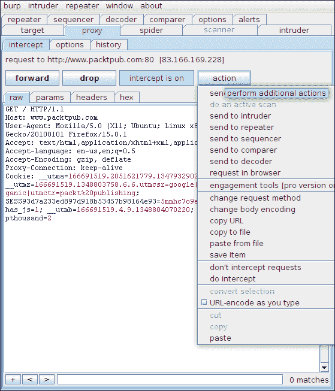

Burp代理

在 Burp Proxy 中，我们还可以决定自动转发所有请求，而无需等待用户转发或放弃通信。点击**截取**按钮，可以从**截取开启**切换到**截取关闭**。然而，代理将记录传输中的所有请求。

此外，Burp Proxy 允许您自动截获与特定特征匹配的所有响应。从 Burp Proxy**options**选项卡中的**intercept server response**部分中查看大量可用选项。例如，只有当客户端的请求被截获时，才有可能截获服务器的响应。这在测试输入验证漏洞时非常有用，因为我们通常对评估服务器对所有篡改请求的响应感兴趣。或者，您可能只希望截取和检查具有特定返回代码的响应（例如，200OK）。

## 步骤 2–检查 web 请求

一旦请求被正确拦截，就可以使用以下四个 Burp Proxy message analysis 选项卡之一检查整个内容、标题和参数：

*   **原始**：此视图允许您在简单的文本编辑器中以原始格式显示 web 请求。这是一种非常方便的可视化方法，因为它可以为进一步更改内容提供最大的灵活性。
*   **参数**：在这个视图中，重点是用户提供的参数（GET/POST 参数、cookies）。在复杂请求的情况下，这是特别重要的，因为它允许考虑潜在漏洞的所有入口点。只要适用，Burp Proxy 也将自动执行 URL 解码。此外，Burp 代理将尝试解析常用格式，包括 JSON。
*   **头**：同样，此视图以表格形式显示 HTTP 头名称和值。
*   **十六进制**：如果是二进制内容，检查资源的十六进制表示是有用的。此视图允许在传统的十六进制编辑器中显示请求。

**历史记录**选项卡允许您分析通过代理传输的所有 web 请求：

1.  Click on the **history** tab. At the top, Burp Proxy shows all the requests in the bundle. At the bottom, it displays the content of the request and response corresponding to the specific selection. If you have previously modified the request, Burp Proxy **history** will also display the modified version.

    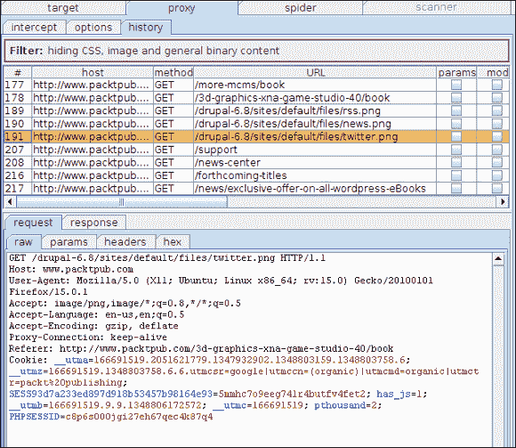

    显示 Burp 代理截获的 HTTP 请求和响应

2.  通过双击其中一个请求，Burp 将自动打开一个包含特定内容的新窗口。在此窗口中，可以使用**上一个**和**下一个**按钮浏览所有捕获的通信。
3.  回到**历史**选项卡，Burp Proxy 显示每个项目的若干详细信息，包括请求方法、URL、响应代码和长度。每个请求都由一个在左侧列中可见的数字唯一标识。
4.  单击请求标识符。Burp Proxy 允许您为特定项目设置颜色。这对于强调重要的请求或响应非常有帮助。例如，在初始应用程序枚举期间，您可能会注意到一个有趣的请求；您可以标记它，稍后再回来进行进一步测试。当您必须评估一系列请求以重现特定的应用程序行为时，Burp Proxy**history**也很有用。
5.  单击历史记录列表顶部的显示过滤器以隐藏不相关的内容。如果要分析至少包含一个参数的所有 HTTP 请求，请选中**仅显示参数化的**复选框。如果您想显示具有特定响应的请求，只需在**按状态代码过滤**选项中选择相应的响应代码即可。此时，您可能已经了解了该工具过滤和显示感兴趣流量的潜力。

### 注

此外，在使用 Burp Suite Professional 时，您还可以使用**按搜索词过滤**选项。当您需要分析数百个请求或响应时，此功能尤其重要，因为您只能通过使用正则表达式或简单地匹配特定字符串来过滤相关流量。使用此功能，您还可以发现嵌入在被截获页面中的敏感信息（例如凭据）。

## 步骤 3–篡改 web 请求

作为典型安全评估的一部分，您需要修改 HTTP 请求并分析 web 应用程序响应。例如，要识别 SQL 注入漏洞，必须在所有用户提供的输入（包括 HTTP 头、cookie 和 GET/POST 参数）中注入常见的攻击向量（例如，单引号）。

### 注

如果您想更新关于常见 web 应用程序漏洞的知识，请参阅[上的*OWASP 十大项目*文章 https://www.owasp.org/index.php/Category:OWASP_Top_Ten_Project](https://www.owasp.org/index.php/Category:OWASP_Top_Ten_Project) 是一个很好的起点。

使用 Burp 篡改 web 请求就像在文本编辑器中编辑字符串一样简单：

1.  拦截至少包含一个 HTTP 参数的请求。例如，您可以将浏览器指向[http://www.packtpub.com/books/all?keys=ASP](http://www.packtpub.com/books/all?keys=ASP) 。
2.  进入**Burp代理****拦截**。此时，您应该看到相应的 HTTP 请求。
3.  从**原始**视图，您可以简单地编辑传输中 web 请求的任何方面。例如，您可以将`GET`参数的`keys`值从`ASP`更改为`PHP`。编辑请求，如下所示：

    ```
    GET /books/all?keys=PHP HTTP/1.1 
    Host: www.packtpub.com
    User-Agent: Mozilla/5.0 (X11; Ubuntu; Linux x86_64; rv:15.0) Gecko/20100101 Firefox/15.0.1 
    Accept: text/html,application/xhtml+xml,application/xml;q=0.9,*/*;q=0.8 
    Accept-Language: en-us,en;q=0.5 
    Accept-Encoding: gzip, deflate 
    Proxy-Connection: keep-alive
    ```

4.  点击**前进**返回浏览器。这将导致使用字符串`PHP`执行搜索查询。您可以通过简单地检查 HTML 页面中的结果来验证它。

虽然我们使用了**原始**视图来更改之前的 HTTP 请求，但实际上可以使用任何 Burp 代理视图。例如，在**参数**视图中，可以通过以下步骤添加新参数：

1.  点击**新建**（右侧），从Burp代理**参数**视图。
2.  选择合适的参数类型（**URL**、**主体**或**cookie**）。GET 参数应使用**URL**，而**body**表示 POST 参数。
3.  键入新创建的参数的名称和值。

## 高级功能

在使用 Burp Proxy 提供的基本功能进行练习之后，您几乎可以尝试更高级的配置了。

### 匹配并更换

让我们设想一下，您正在测试一个应用程序，该应用程序是为使用计算机上的标准浏览器的移动设备设计的。在大多数情况下，web 服务器检查浏览器提供的用户代理，以确定特定平台，并使用更适合移动电话和平板电脑的定制资源进行响应。在这种情况下，您会特别发现 Burp Proxy 提供的**匹配和替换**功能非常有用。让我们配置 Burp Proxy 以篡改用户代理 HTTP 头字段：

1.  在 Burp Proxy 的**选项**选项卡中，向下滚动至**匹配并替换**部分。
2.  在**匹配和替换**表下，一个下拉列表和两个文本字段允许创建自定义规则。从下拉列表中选择**请求头**，因为我们想要创建与 HTTP 请求相关的匹配条件。
3.  Type `^User-Agent.*$` in the first text field. This field represents the match within the HTTP request. Burp Proxy's **match and replace** feature allows you to use simple strings as well as complex regular expressions.

    ### 注

    如果您不熟悉正则表达式，请查看[http://www.regular-expressions.info/quickstart.html](http://www.regular-expressions.info/quickstart.html) 。

4.  在第二个文本字段中，键入`Mozilla/5.0 (iPhone; U; CPU like Mac OS X; en) AppleWebKit/4h20+ (KHTML, like Gecko) Version/3.0 Mobile/1C25 Safari/419.3`或任何其他要模拟的假用户代理。
5.  Click **add** and verify that the new match has been added to the list; this button is shown here:

    

    Burp 代理匹配和替换列表

6.  Intercept a request, leave it to pass through the proxy, and verify that it has been automatically modified by the tool.

    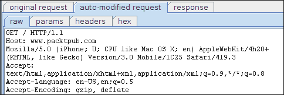

    自动修改 Burp 代理中的 HTTP 头

### HTML 修改

Burp Proxy 另一个有趣的功能是自动修改 HTML，可以在**Burp Proxy****选项**中的相应部分激活和配置。通过使用此函数，您可以自动删除所有收到的 HTTP 响应的 JavaScript 或修改 HTML 表单。

一些应用程序以禁用的 HTML 表单字段或 JavaScript 代码的形式部署客户端验证。如果要验证是否存在强制特定数据格式的服务器端控件，则需要使用无效数据篡改请求。在这些情况下，您可以手动篡改代理中的请求，或者启用 HTML 修改以删除任何客户端验证，并使用浏览器提交无效数据。此函数还可用于显示隐藏的表单字段。

让我们看看如何在实践中激活此功能：

1.  在 Burp Proxy 中，进入**选项**，向下滚动至**HTML 修改**部分。
2.  此部分提供多种选项：**取消隐藏隐藏表单字段**以显示隐藏的 HTML 表单字段；**启用禁用表单字段**以提交 HTML 页面内的所有输入表单；**删除输入字段长度限制**以允许文本字段中存在超长字符串；**移除 JavaScript 表单验证**使 Burp 代理 HTML 表单中的所有`onsubmit`处理程序 JavaScript 函数；**移除所有 JavaScript**完全移除所有 JS 脚本；**移除对象标记**移除 HTML 文档中的嵌入对象。
3.  选中所需复选框以激活自动 HTML 修改。

使用此功能，您将能够了解 web 应用程序是否强制执行服务器端验证。例如，一些不安全的应用程序仅使用客户端验证（例如，通过 JavaScript 函数）。您可以通过选中**删除 JavaScript 表单验证**复选框激活自动 HTML 修改功能，以便直接从浏览器执行输入验证测试。

# 您需要了解的 8 大功能

当你开始使用BurpSuite时，你很快就会意识到你可以用它做很多事情。本节将向您介绍 Burp 工具中最常用的任务和最有用的功能

### 注

免责声明：请勿尝试对您未经授权的网站使用 Burp 来发现安全漏洞。在许多司法管辖区，未经授权访问或攻击计算机系统是非法的。

## 1–使用目标站点地图功能

web 应用程序安全评估过程中的第一个活动包括探索应用程序以枚举资源和端点。使用 Burp Suite，您可以简单地浏览应用程序并像通常使用浏览器一样使用所有功能。Burp Suite 跟踪所有 HTTP 请求和响应，并使用目标站点地图功能显示所有数据。


Burp目标地点图

Burp**Target**选项卡以方便的层次表示法显示所有端点和参数。此视图通常称为站点地图。映射所有应用程序资源的过程至关重要，Burp site map 允许您快速分析应用程序的攻击面。

从站点地图树可以选择我们评估的目标，并缩小所有内置工具的范围。这是一项重要功能，因为它允许 Burp 的用户关注相关资源，并防止与第三方网站进行任何交互。让我们看看如何做到这一点：

1.  在 Burp Target 的**站点地图**选项卡中，通过点击包含域名的根节点（例如，[来选择您的应用程序 http://www.packtpub.com/](http://www.packtpub.com/) ）。
2.  右键单击并单击**将项目添加到范围**以减少整个BurpSuite的范围内目标。默认情况下，范围项目列表中的 Burp 为空，所有域都被视为审核的一部分
3.  此外，点击 Burp**目标****站点地图****过滤**区域，可以过滤掉与其他域相关的资源。然后从**过滤器的【请求类型】**部分中选择**仅在范围项目**中显示
4.  此时，站点地图应仅显示属于所选域的资源。也可以通过检查 Burp**Target****scope**选项卡中的**include in scope**表来验证此设置。

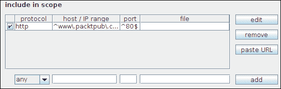

范围项目中的Burp目标

在此表单中，还可以手动添加、编辑或删除范围内的项目。例如，如果要包含新域，可以按以下方式进行：

1.  在**包含范围**表下，选择对应的协议（**任意**、**http**或**https**）
2.  在左侧的第一个文本字段中，指定一个正则表达式，用于标识要添加到作用域的域或子域（例如，**^www\.authors.packtpub\.com$**），如上图所示。Burp 中的正则表达式语法与 Perl 中的最相似。
3.  在中心文本字段中，指定标识适当端口号的正则表达式（例如，**http**通常为`^80$`，而**https**通常为`^443$`。
4.  或者，可以在第三个文本字段中为文件和文件夹指定正则表达式。如果要分析和测试整个应用程序域，请将此字段留空。
5.  最后，点击**添加**并确认**包含范围**表中的复选框已自动选中。

### 注

重要的请注意，将工具的范围缩小到分析中的应用程序是至关重要的。此设置将防止对第三方应用程序的任何非自愿请求和攻击。

同样，通过使用**exclude from scope**表，可以定义工具不应该检查的资源。此功能允许为超出限制的端点定义一个黑名单，这对于使 Burp 避免注销功能、重置按钮或其他破坏性操作特别有用。

在站点地图中，从任何域和任何项（端点或参数），可以通过右键单击特定项来调用上下文菜单。


Burp目标上下文菜单

此机制允许您通过选择以下项目之一，在所有 Burp Suite 工具中快速导入请求/响应：

*   **爬行此分支**激活Burp爬行器
*   **主动/被动扫描该分支**使用Burp扫描仪启动自动扫描（仅限专业版）
*   **发送给入侵者**发起定制攻击
*   **发送至中继器**对同一请求进行反复修改和重新迭代
*   **发送给 sequencer**分析应用数据的可预测性
*   **发送到比较器（请求/响应）**直观比较多个请求或响应

这些功能将在本章的以下章节中描述。

此外，上下文菜单允许在浏览器中重现 HTTP 请求和响应。这对于在分析客户端攻击期间验证特定浏览器的行为（例如，跨站点脚本编写、UI 更正等）特别有用。

1.  从站点地图树中选择一个请求。
2.  右键点击并在浏览器中选择**请求。**
3.  选择使用**当前浏览器会话**或**原始会话**选项，使用会话令牌Burp-在保存的请求中可用（如果适用）。
4.  弹出窗口将显示一个虚拟 URL（例如：[http://burp/repeat/0](http://burp/repeat/0) ）。点击**复制**。
5.  在浏览器中，按*Ctrl*+*V*或使用工具栏菜单中相应的命令粘贴 URL。
6.  最后，按*输入*在浏览器内模拟请求

在安全测试过程中，请查阅站点地图，以验证您是否分析了所有应用程序入口点。Burp Spider 等 Burp 工具将帮助您自动填充站点地图。工具已请求的资源以黑色标记，而由其他资源链接但未通过 Burp 检索的端点以灰色标记。

## 2–使用 Burp 爬行器爬行 web 应用程序

Burp Spider 允许自动抓取 web 应用程序并检索可见和隐藏的资源。该工具使用多种技术来最大化结果，包括在以前保存的 HTTP 响应中发现的以下链接以及自动提交 web 表单。

第一步需要使用 Burp spider 中的**选项**选项卡设置 spider。尽管在大多数情况下，默认选项足以实现良好的效果，但您可能需要自定义一些 spider 的首选项

*   对于大型网站，可能需要修改**最大链接深度**，它表示资源可遵循的最大重定向次数。
*   对于系统资源有限的脆弱主机，您可能需要在**spider engine**部分的**thread count**文本框中更改线程数，以减少线程数。此外，您还可以增加网络故障时的重试次数以及每次尝试前的暂停时间。
*   如果您想让 Burp Spider 自动提交凭证，您可以在**应用程序登录**部分定义用户名和密码。

Burp Spider 另一个有趣的功能是可以定义工具用来自动提交 HTML 表单的**名称**和**值**字段。在爬行过程中，爬行器可能会遇到必须使用语义有效内容归档的 web 表单。例如，让我们设想一个带有**电子邮件**字段的注册表；在这种情况下，爬行器必须能够识别特定字段并提交有效的电子邮件。Burp Spider 允许您定义自定义正则表达式以匹配字段名：

1.  在 Burp Spider 中，进入**选项****表格**。
2.  假设您希望 Burp Spider 提交表单，选择**自动提交，使用以下规则分配参数值**选项。
3.  以下屏幕截图所示的表格包括该工具用于填充字段的所有名称-值对。与其他 Burp 工具一样，可以添加、删除或修改条目。例如，如果要创建提交关键字`PacktUserID`指定的用户 ID 的规则，可以先从下拉列表中选择**regex**。
4.  然后，在左侧第一个文本框中键入`PacktUserID`。这是自定义规则的字段名，工具将其解释为正则表达式`^PacktUserID$`。
5.  插入对应的**字段值**。这是我们要为该特定字段指定的实际值。
6.  最后，点击**添加**并确保复选框被正确选中。通过观察以下屏幕截图，可以更好地理解所有这些步骤：


Burp Spider 中的自动表单提交配置

此时，工具已准备好激活。Burp爬行器可以通过Burp目标中的上下文菜单激活，也可以通过在Burp爬行器的**控件**选项卡中标记**爬行器运行**复选框来激活。

建议从站点地图树中选择一个节点，右键单击并从此处选择 spider。Burp Spider 将从该域中特定分支下的选定资源开始爬网。默认情况下，Burp Spider 使用在**目标**选项卡中定义的范围，此行为确保工具不会调用目标之外的域上的资源。

通过 Burp Spider 中的**控制**选项卡，还可以根据显示的信息验证工具的进度。详细信息包括爬行器发送的 HTTP 请求总数和尚未调用的剩余资源数。发现的所有结果将自动添加到**目标****站点地图**。


Burp蜘蛛在行动

除了使用 Burp Spider 自动爬行之外，通过手动浏览网站来正确映射所有应用程序资源也是非常重要的。在扫描应用程序或手动测试端点之前，枚举所有资源至关重要。

## 3–使用Burp扫描仪启动自动扫描

Burp Scanner 是一款动态 web 应用程序扫描仪，包含在 Burp 套件的专业版中。该工具允许您自动扫描网站并检测常见的安全缺陷，包括但不限于 SQL 注入、跨站点脚本、XML 注入、缺少 cookie 标志（例如，`HttpOnly`和`Secure`等）。

该工具允许两种扫描模式：

*   **主动扫描**：在这种模式下，通过发送包含常见攻击模式的 HTTP 请求并使用模式匹配启发式分析响应来检测漏洞
*   **被动扫描**：使用此模式，Burp Scanner 使用存储的请求和响应来识别可离线分析且不需要主动探测的缺陷

为了测试此功能，我建议您使用**Google Gruyere**（[http://google-gruyere.appspot.com/](http://google-gruyere.appspot.com/) ），一个故意不安全的 web 应用程序。Gruyere 可在线访问：

1.  访问[http://google-gruyere.appspot.com/part1](http://google-gruyere.appspot.com/part1) 并仔细阅读说明和免责声明。
2.  转到[http://google-gruyere.appspot.com/start](http://google-gruyere.appspot.com/start) 。
3.  点击**同意&开始**。
4.  点击**注册**创建测试账号。
5.  点击**登录**并使用之前创建的帐户登录。此时，将 Burp 配置为拦截所有请求。您的浏览器应该如下所示：


谷歌 Gruyere 主页屏幕

Burp Scanner 可以在浏览网站时动态自动扫描资源，也可以从 Burp**目标站点地图**中的上下文菜单激活。

默认情况下，Burp Scanner 配置为在所有域上执行被动扫描，而禁用主动扫描。在 Burp 的**扫描仪**选项卡中，选择**实时扫描**，然后在**主动扫描**和**被动扫描**部分中选择**使用套件范围**，自动扫描通过 Burp 代理的分析应用程序的所有资源。这种模式通常被称为动态扫描。

或者，您可以在**站点地图**选项卡中选择目标的特定分支，并根据所需模式点击**主动扫描该主机**或**被动扫描该主机**。


从Burp目标站点地图启动Burp扫描仪

如果您选择启动活动扫描，Burp Suite 将显示一个名为**活动扫描向导**的新窗口，这是 Burp 扫描仪的一个简单配置工具：

1.  配置过程的第一步允许您删除特定类型的资源，包括图像、JavaScript 或样式表。大多数情况下，默认设置已足够，只需点击**下一步**。
2.  在第二步中，该工具将显示一个表，其中包含 Burp Scanner 将在扫描期间包含的端点和参数的完整列表。仔细查看此列表并删除不相关或可能导致故障（例如，删除用户、重置应用程序功能等）的端点非常重要。在端点表的底部，该工具还显示项目总数。完成选择后，单击**确定**开始扫描。

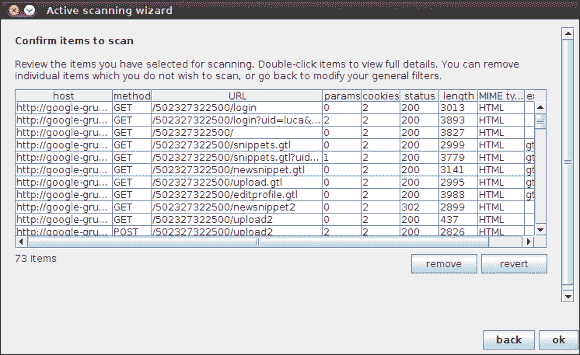

Burp扫描仪活动扫描向导

Burp Scanner 的默认配置适合大多数用例。但是，如果您想进一步调整扫描仪，您可以通过进入 Burp scanner 中的**选项**选项卡自定义所有配置。此选项卡包含许多选项，包括启用/禁用插入点的可能性：

*   **URL 参数值**：对所有 HTTP GET 参数进行篡改
*   **正文参数值**：对所有 HTTP POST 参数进行篡改
*   Apple T0\. Cookie 参数值 AUT1：考虑所有会话标记作为可能的入口点
*   参数 Tr.T1：考虑 HTTP GET/POST 参数作为可能的入口点
*   **HTTP 头**：对所有请求头进行篡改，包括标准头和自定义头
*   **AMF 字符串参数**：对于使用 Adobe Flex 开发的应用程序，Burp Scanner 将解析动作消息格式二进制协议，并对所有字符串参数进行篡改
*   **REST 风格 URL 参数**：在应用程序实现 REST 接口的情况下，Burp Scanner 会篡改部分 URL，该 URL 通常用于识别操作和参数

如果您正在查找特定类别的漏洞，您可以通过选择/取消选择**主动扫描区域**s 部分和**被动扫描区域**部分中的相应复选框来启用/禁用工具执行的每个单项检查。例如，如果您正在测试无法访问 LDAP 子系统的应用程序，则可以通过取消选中**LDAP 注入**复选框来优化扫描。

此外，Burp Scanner 中的**选项**选项卡允许限制工具使用的线程数或增加连续请求之间的时间。根据服务器上可用的系统资源，您可以通过调整**活动扫描引擎**部分中的所有选项来决定加快或减慢扫描速度。

### 注

重要的不要试图在未经授权的网站中使用 Burp Scanner 或其他 Burp 工具查找安全漏洞。尽管所有Burp扫描仪检查都是为了避免故障，但它们可能会导致严重故障，甚至造成不可逆转的损坏。即使你被授权，也要考虑在测试之前执行系统和数据的备份。请务必小心，并不断监视扫描进度和服务器状态。

启动扫描后，您可以通过检查 Burp Scanner 中的**扫描队列**选项卡来监控进度。此表提供有关已完成和正在进行的扫描请求的信息。此外，它还通过显示每个端点发现的问题数量，提供了结果的概述。从该表中，您还可以通过选择这些资源，右键单击该表，然后单击**删除项目**来删除项目。此外，您可以通过右键单击表格并选择**暂停扫描仪**或**恢复扫描仪**来暂停并重新启动整个扫描仪。


Burp扫描队列

扫描整个 web 应用程序可能需要几分钟，有时甚至几小时。不过，您可以随时通过检查Burp扫描仪的**结果**选项卡中的结果树来分析结果。与站点地图中一样，此可视化使用方便的树表示法按端点和类别对漏洞进行分组。

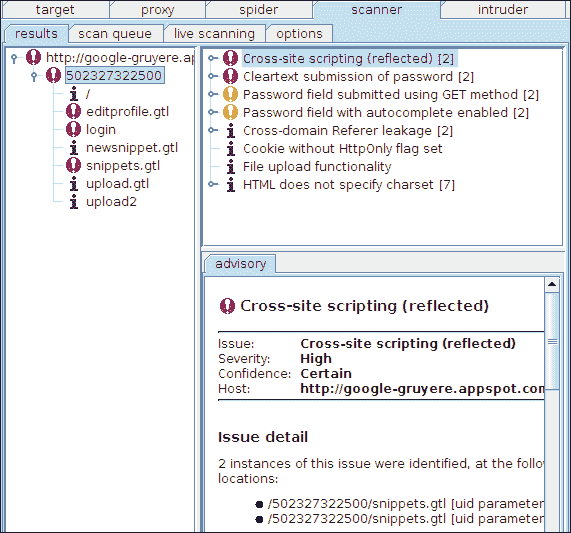

Burp扫描结果

如果单击特定项目，将显示所选安全漏洞的提示。将显示错误的精确描述，包括以下详细信息：

*   **问题**：漏洞类别（如跨站点脚本）。
*   **严重程度**：对受影响系统影响的估计。偏离最佳实践通常被归类为**信息**或**低**，而可能导致系统受损的漏洞被标记为**高**。
*   **置信度**：对工具置信度的估计（**确定的**、**确定的**、**暂定的**）。对于某些类别的漏洞，需要手动干预以验证结果并确认是否存在安全漏洞。在其他情况下，该工具能够检测并确认漏洞，且无任何误差。
*   **主机**：受安全漏洞影响的系统。
*   **路径**：受安全漏洞影响的特定端点。

结果窗口中的上下文菜单允许删除问题（**删除所选问题**），或指定不同级别的严重性（**设置严重性**）和置信度（**设置置信度**）。

分析所有资源并完成扫描后，即可导出结果。Burp Scanner 允许您创建基本的 HTML 或 XML 报告，用于跟踪发现的 bug。此外，其他安全工具（例如 Rapid7 Metasploit）允许您导入这些结果以执行进一步的任务。以下步骤将解释如何导出结果：

1.  在Burp扫描仪的**结果**选项卡中，选择所有要导出的项目。在“结果”树中，还可以选择根节点以导出所有结果。
2.  右键单击以显示上下文菜单。选择**报告所选问题**。
3.  一个名为**Burp Scanner reporting wizard**的新窗口将引导您了解报告的格式。第一步包括选择报告类型；即，**屏幕友好 HTML**、**打印机友好 HTML**或**XML**报告。
4.  接下来，您可以对要包含在报告中的详细信息级别进行个性化设置。例如，您可以通过选中所有复选框来决定拥有最高级别的详细信息和详细信息。然后点击**下一步**。
5.  由于有时提供受影响 HTTP 请求和响应的快照很有用，因此您还可以决定在最终报告中包含相关摘录。选中相应的复选框并单击**下一步**。
6.  在下一步中，**Burp Scanner 报告向导**允许您选择/取消选择要导出的问题类别。做出决定并选中相应的复选框。然后点击**下一步**。
7.  最后，在最后一步中，您需要指定报告的文件名。点击**选择文件。。。**并浏览文件系统，找到要保存报告的文件夹。键入文件名，包括文件扩展名。例如，如果要在 HTML 报告中导出结果，请键入`BurpScannerReport.html`。点击**保存**。
8.  此外，您还可以通过更改内容顺序、选择**发布组织**和**目录级别**下滚列表来个性化文档布局。此外，您还可以通过填写**报告标题**和**报告副标题**文本字段来指定报告标题和副标题。点击**下一步**。
9.  向导结束时，进度条将为您提供有关报告生成的反馈。完成后，单击**确定**关闭此窗口。

报告应位于先前选择的文件夹中。如果将其保存为 HTML，则可以使用浏览器打开它并分析结果。

## 4–使用Burp入侵者自动化定制攻击

尽管 Burp Scanner 是自动检测漏洞的有用工具，但它不允许您为每个特定请求定制攻击向量。一旦您了解了 web 应用程序安全性的基础知识，您就会感到需要完全控制您的测试。Web 应用程序扫描器不是 Web 安全的灵丹妙药，因此也建议执行手动测试。

在高层，web 应用程序安全评估包括使用常见的攻击模式测试所有入口点（GET/POST 参数、cookie、标头等），并评估服务器的响应以识别安全缺陷。例如，如果怀疑某个端点易受 SQL 注入攻击，则可能希望通过为每个参数提供不同的攻击向量（例如，单引号、单引号和括号等），反复迭代同一请求。这是一项非常耗时的任务，需要不断的监督。幸运的是，Burp入侵者可以在几秒钟内发起攻击，发送所有请求并收集所有响应，从而显著加快进程。

使用 Burp 入侵者的第一步是在工具中导入 web 请求。在整个BurpSuite中，您可以使用标准上下文菜单向Burp入侵者发送请求。例如，如果您正在浏览 Burp Proxy**history**选项卡中的请求，右键单击特定项目并选择**send to 入侵者**。Burp 的**入侵者**标签应立即闪烁红色。在此阶段，在发起攻击之前，需要进行四步配置。

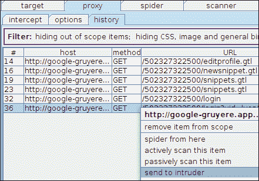

在 Burp 入侵者中导入 web 请求

### 配置目标

进入Burp入侵者中的**目标**选项卡。在此选项卡中，可以指定目标主机和端口。在大多数情况下，不需要更改任何内容，因此您只需重新检查预填充的内容并移动到下一个选项卡。

### 配置攻击类型和位置

在 Burp 入侵者的**位置**选项卡中，您需要选择有效负载位置，从而定义攻击的请求模板。默认情况下，Burp 入侵者将自动标记所有 GET/POST 参数和 Cookie 值。但是，我们鼓励您通过添加或删除位置来个性化攻击。例如，让我们看看如何选择 HTTP GET 请求中的第一个参数：

1.  通过右键单击项目并选择**发送至入侵者**，导入至少包含一个 GET 参数的 web 请求（例如，来自 Burp 代理）。例如，当使用 Google Gruyere 时，您可以使用登录请求。
2.  在Burp入侵者的**位置**选项卡中，点击**清除§**删除所有标记。
3.  将鼠标指针放在 URL 中第一个参数值的第一个字符之前（例如，在`GET /<Your Gruyere Instance ID>/login?uid=luca&pw=aa`中，鼠标指针应放在字符`=`和字母`l`之间）。
4.  单击**添加§**添加第一个标记。
5.  在相同参数值的最后一个字符后移动鼠标指针，再次点击**添加§**完成选择。

生成的请求模板应如以下屏幕截图所示：


Burp扫描仪中第一个位置的选择

在这个阶段，我们成功地标记了我们的第一个入口点。您可以继续并创建更多职位。通过点击**自动§**，可以恢复到初始设置，在初始设置中选择所有 GET/POST 参数和 cookie 值。

在Burp入侵者的**位置**选项卡中，还需要使用下拉列表定义特定的攻击类型。此设置定义工具使用的启发式方法，以攻击有效载荷替换先前标记的位置。

**攻击类型**下拉菜单包括以下四种模式：

*   **狙击手**：通过使用这种类型，Burp 将用单个有效载荷列表中的字符串替换所有位置。特别是，它将逐个遍历所有位置的所有有效负载。这允许您在模板请求中排列攻击有效载荷和原始值的所有组合。

    <colgroup><col style="text-align: left"><col style="text-align: left"><col style="text-align: left"></colgroup>
    | 

    要求

     | 

    位置

     | 

    有效载荷

     |
    | --- | --- | --- |
    |  | 1。 | 项目清单 1 |
    |  | 1。 | 项目 2.清单 1 |
    |  | 2。 | 项目清单 1 |
    |  | 2。 | 项目 2.清单 1 |

*   **打击锤**：与狙击手攻击类似，该启发式使用单一有效载荷列表。在这种情况下，所有位置同时替换为相同的攻击有效载荷。

    <colgroup><col style="text-align: left"><col style="text-align: left"><col style="text-align: left"></colgroup>
    | 

    要求

     | 

    位置

     | 

    有效载荷

     |
    | --- | --- | --- |
    |  | 1、2 | 项目清单 1 |
    |  | 1、2 | 项目 2.清单 1 |

*   **pitchfork**：在这种攻击类型中，Burp入侵者将根据标记位置的数量使用两个或多个有效负载列表。在第一次迭代期间，Burp 将用每个列表的相应第一次攻击有效载荷替换标记的位置。换句话说，它将使用第一个列表的第一个单词作为第一个位置，依此类推。

    <colgroup><col style="text-align: left"><col style="text-align: left"><col style="text-align: left"></colgroup>
    | 

    要求

     | 

    位置

     | 

    有效载荷

     |
    | --- | --- | --- |
    |  | 1、2 | 项目清单 1.项目清单 2 |
    |  | 1、2 | 项目 2.清单 1.项目 2.清单 2 |

*   **集束炸弹**：类似于**pitchfork**攻击，在这个启发式中使用了多个列表。然而，在这种情况下，Burp入侵者将遍历所有可能的组合。

    1、2

    <colgroup><col style="text-align: left"><col style="text-align: left"><col style="text-align: left"></colgroup>
    | 

    要求

     | 

    位置

     | 

    有效载荷

     |
    | --- | --- | --- |
    |  | 1、2 | 项目清单 1.项目清单 2 |
    |  | 1、2 | 项目 2.清单 1.项目 1.清单 2 |
    |  | 1、2 | 项目清单 1.项目清单 2 |
    |  | 项目 2.清单 1.项目 2.清单 2 |

### 配置有效载荷

选择所有位置和攻击类型后，有必要定义实际有效载荷。在 Burp 入侵者的**有效载荷**选项卡中，可以定义自定义列表。使用术语“攻击有效载荷”，Burp 的作者指的是常见攻击模式的列表，或者换句话说，如果注入易受攻击的参数，则可能允许检测安全漏洞的字符串列表。

如前所述，某些攻击需要多个有效负载列表。通过从**有效负载集**下拉列表中选择不同的列表编号，您可以逐个配置所有有效负载集。第二个下拉列表允许您定义有效载荷类型。

存在多种类型，但最常见的是：

*   **预置列表**：通过预置列表，用户可以从外部文本文件加载攻击向量列表（wordlist）。或者，也可以手动插入新词。Burp 专业用户也可以从预加载列表中获益。
*   **号码**：通过使用号码列表，Burp入侵者会根据具体配置自动生成号码。除了步骤数之外，用户还需要定义开始和结束编号。
*   **日期**：Burp 入侵者可以指定日期格式，并自动生成特定日期的起始日期。
*   **bruteforce**：通过使用此选择，Burp入侵者将在给定字符集和结果字符串的最小/最大长度的情况下生成所有可能的字符串排列。

假设我们要从头开始创建一个攻击向量列表来检测 SQL 注入漏洞：

1.  在Burp入侵者的**有效载荷**选项卡中，在**有效载荷集**下拉列表中选择**1**，并确保其标记为**预设列表**。
2.  在下面的文本字段中键入新向量，然后单击**添加**。例如，您可以从一个单引号（**）开始，这是一个在数据库驱动的应用程序中触发 SQL 异常的非常常见的字符串。**
***   继续添加新字符串。如果要删除字符串，请选择表中的项目，然后单击**删除**。否则，如果要删除所有字符串，请单击**清除**。请参阅以下屏幕截图：**

 **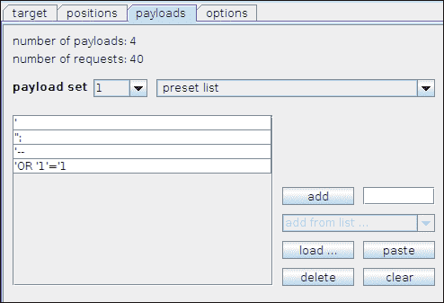

定义 Burp 入侵者中的有效负载

在**有效载荷**选项卡的底部，请注意请求部分中的有效载荷编码。默认情况下，Burp 入侵者将 URL 编码此文本字段中指定的所有字符。例如，字符**将替换为相应的`%27`URL 编码。如果不想对特定字符进行编码，请将其从列表中删除。**

 **### 额外Burp入侵者选项

Burp 入侵者是一个非常通用的工具，因此它有一套广泛的配置选项。我们鼓励您自己尝试和试验，以了解每个配置选项的影响。

例如，在 Burp 入侵者的**选项**选项卡中，您可以配置工具使用的线程数和重试之间的时间。此外，还可以指定请求之间的固定或可变调节时间。

另一个有趣的设置由**grep**部分表示。该工具允许指定要在 web 响应中搜索的字符串或正则表达式。这对于检测可能突出潜在漏洞的异常和常见错误字符串非常有用。

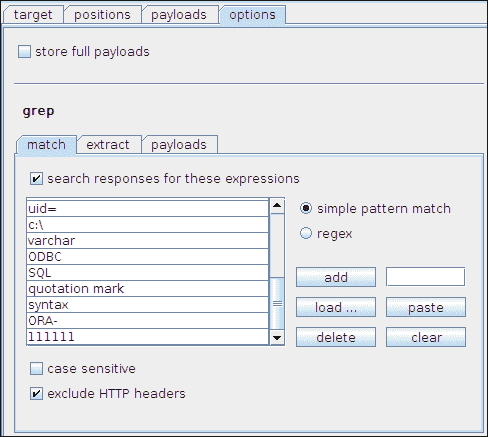

在 Burp 入侵者响应中定义搜索表达式

### 提示

Burp 入侵者的**grep**功能可用于通过搜索特定关键字来识别应用程序行为。假设您正在尝试访问未经授权的资源，搜索*错误*、*无效*、*未经授权*、*错误*等等。如果您注意到没有这些关键字的请求，那么您可能已经成功地猜测到了一个有效且可访问的资源。

### 发起攻击

此时，一切都已配置完毕，我们已准备好发起攻击。在 Burp 的顶部菜单中，进入**入侵者【开始攻击】**。Burp 将首先验证配置，并在出现问题时使用弹出式警报框向用户发出警报。然后，它将打开一个结果窗口并开始实际的攻击。

### 注

免费版中的 Burp 入侵者不包括专业版中提供的所有高级配置选项。最重要的是，它通过成倍增加每次请求后的时间来限制攻击速度。

在攻击过程中，您可以在**结果表**窗口中观察结果。根据配置，Burp 将显示不同的列，包括请求 ID、使用的有效负载、web 响应的 HTTP 状态代码、响应时间，以及如果启用了**grep**功能，是否存在指定的字符串。所有这些列都可以重新排序和排序。此外，Burp 入侵者允许将结果导出到平面文件中。

### 注

发现安全漏洞主要是关于奉献、耐心和大量动机。一旦开始执行安全评估，您就会发现响应中的最小更改如何帮助识别缺陷。请始终注意所有 web 响应的不同长度和不同 HTTP 状态代码。另外，使用**grep**功能识别导致错误消息和应用程序异常的 bug。

## 5–使用 Burp Repeater 处理和迭代 web 请求

在上一节中，我们已经了解了如何自动并以编程方式生成具有不同有效负载的多个请求。

如果您已经发现了安全漏洞，或者您想确保某个特定端点是安全的，有时需要手动重复请求并小心地调整攻击向量。这是一种反复试验的方法，需要耐心和经验。

Burp Repeater 允许修改 HTTP 请求的每个方面并多次发送。首先，使用传统的上下文菜单从任何 Burp Suite 工具导入 web 请求：

1.  从任何工具（例如，Burp Proxy**history**）中选择一个特定的 web 请求并右键单击它。然后，选择**发送至中继器**。
2.  去Burp复示器。您应该可以看到所选请求的全部内容。此外，Burp Repeater 将自动填写主机和端口号。
3.  At this point, you can modify every aspect of this web request. Let's start by transforming a GET request to POST or vice-versa. In the **request** window, right-click and choose **change request method**.

    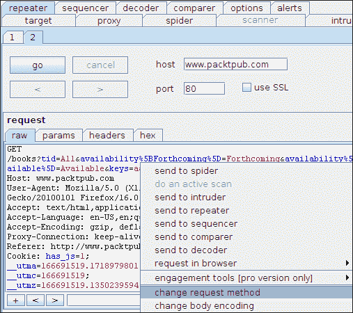

    带 Burp 中继器的变更请求方法

4.  另外，让我们通过在 URL 末尾添加字符串`&debug=true`来添加一个伪参数。
5.  最后，点击**go**发送请求。几秒钟后，Burp复示器应该能够显示响应。通常，您可以可视化原始响应、隔离参数或标题、审核 HTML 代码，甚至呈现页面。

尽管 Burp Repeater 看起来是一个非常简单的工具，但它实际上非常有用，并包含了一些高级功能。如果点击**中继器**菜单，如下图所示，您可以看到这些功能的列表：


Burp中继器选项

**更新内容长度**复选框允许动态更新 HTTP 请求中的`Content-Length`头字段。通过这种方式，Burp Repeater 将在通过线路发送请求之前自动计算修改请求的大小。

**跟随重定向**选项允许选择 Burp Repeater 是显示实际的 web 响应，还是跟随所有重定向（`302 Redirect`状态代码）并显示登录页。

通过选中重定向中的**处理 cookies 复选框，可以在应用程序重定向期间对请求的会话令牌进行 ad 操作。**

最后，Burp Repeater 允许创建、删除或重命名选项卡。如果您发现了一个漏洞，并且正在尝试构建一个有效的漏洞，那么在每次试用中创建新的选项卡并使用重命名功能为每个试用版分配一个有意义的标题非常有用，以避免混淆。

此外，如果您正在分析**跨站点请求伪造**（**CSRF**）漏洞或开发跨站点脚本攻击，您可以通过右键单击您的请求并选择**参与工具****生成 CSRF PoC**来自动创建概念验证。此功能允许您生成触发该漏洞的 HTML 页面。

## 6–使用 Burp Sequencer 分析应用数据的随机性

**Burp Sequencer**允许您分析应用程序数据的可预测性，例如会话 cookie 和反 CSRF 令牌。该工具允许您轻松收集和分析数据。让我们看看如何在一个真实的例子中使用此工具：

1.  After having configured Burp Proxy, point your browser to [https://www.packtpub.com/login](https://www.packtpub.com/login).

    ### 注

    免责声明尽管 Burp Sequencer 不执行任何注入攻击，但向远程 web 服务器发送大量请求可能会降低服务速度，并可能中断应用程序。我建议你用Burp测序器来测试你自己的目标。此示例仅供参考。

2.  在 Burp 代理的**历史**页签中，选择**登录**请求。右键点击并选择**发送至定序器**。
3.  我们已经将请求导入 Burp Sequencer，现在可以继续安装。**选择请求**表显示工具中导入的所有 web 请求。如果只有一个请求，则应已选择此项目。如果没有，请单击表中的请求。
4.  在**识别响应中的令牌**部分，在**实时捕获**选项卡中，需要配置 Burp Sequencer 如何识别令牌或我们希望在响应页面中分析的其他数据。为了加快流程，在**cookie**和**表单字段**下拉列表中，工具将显示页面中存在的所有 cookie 或表单参数。此外，还可以手动选择数据位置。
5.  点击**手动选择**。在响应内容中，查找**编辑验证码令牌**。此标记特定于正在分析的 web 应用程序。您还可以使用表单底部的**搜索**文本框轻松查找令牌位置。
6.  如您所见，*编辑验证码令牌*元素的值包含一个伪随机令牌。让我们研究一下这个弦的熵。将鼠标光标移动到整个字符串上。Burp Sequencer 将在右侧的分隔符文本字段中，在表达式和**之后自动填充**。实际上，该工具有助于识别可用于从响应页面提取令牌的分隔符。****
7.  Once done, click on **start** to collect samples. Burp Sequencer will repeat the same request multiple times and it will automatically extract the previously defined selection. The tool will also open a new window to monitor the process.

    

    配置 Burp Sequencer 实时捕获

或者，可以从文本文件或粘贴剪贴板的内容手动导入令牌和应用程序数据。如果您希望以这种方式加载令牌，请转到 Burp Sequencer 的**手动加载**选项卡。

在收集足够的数据（至少 100 个样本）后，可以通过点击**暂停**按钮暂停样本检索过程。您还会注意到**立即分析**按钮处于活动状态。点击它开始分析阶段。以下屏幕截图显示了暂停的实时捕获：

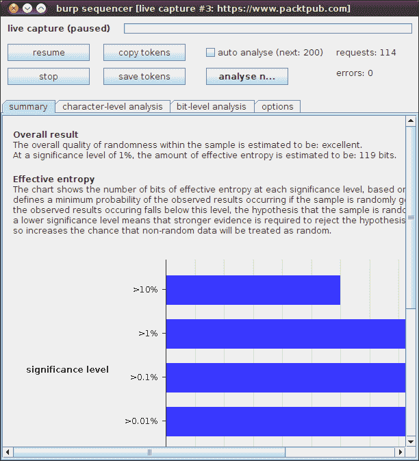

Burp测序器结果

几秒钟后，Burp Sequencer 应该能够显示结果。如果要验证收集的数据，请单击**复制令牌**并将内容粘贴到您喜爱的文本编辑器中。此外，如果您意识到您没有收集到足够的代币，您可以通过点击**resume**按钮来恢复该过程。

Burp Sequencer 结果显示在以下三个部分中：

*   **汇总**页签
*   **字级分析**页签
*   **位级分析**页签

**摘要**选项卡提供了分析的一般概述。通常，该视图足以理解令牌是否真的是伪随机的。在我们的示例中，该工具报告以下消息：

> 样本内随机性的总体质量估计为：优秀

此外，此选项卡还报告基于采集样本数量的分析可靠性评估。

尝试评估非伪随机令牌的随机性将导致以下警告：

> 样本中随机性的总体质量估计为：极差

一般来说，Burp Sequencer 将提供随机性总体质量的估计。尽管结果通常是正确的，但该工具并不总是可靠的。高级用户可以通过**字符级**和**位级**测试来了解数据的实际可预测性。**字符级分析**选项卡包括多个图表和比较表，以了解令牌中字符、位置和字符转换之间的相关性。**位级分析**选项卡对于识别异常特别有用，因为它包括一个图表，指示每个位位置的随机性置信度。

## 7–使用 Burp 解码器对数据进行解码和编码

**Burp解码器**是一个简单但有用的工具，用于对多种格式的字符串进行编码和解码。在 web 应用程序的安全审计期间，通常需要评估输入验证安全机制的健壮性。以多种格式编码字符串是绕过安全控制和筛选器的一种非常常见的技术。

从任何工具，您都可以使用标准上下文菜单项在 Burp Decoder 中导入部分请求和响应：

1.  用鼠标光标选择一个字符串，右击，选择**发送到解码器**。
2.  一旦字符串被导入，就可以通过从**解码中选择合适的编码模式对其进行编码或解码为。。。**或**编码为。。。**向下滚动列表。输出以下面的文本形式显示。

用户可以分别选择**十六进制**或**文本**复选框，以十六进制或文本格式可视化数据。Burp 支持的编码模式包括`URL encoding`、`HTML Entities`编码、`Base64`、十六进制转换和`GZIP`压缩编码。


Burp解码器

此外，Burp 解码器允许为常见的散列函数（包括 MD2、MD5、SHA、SHA256 和 SHA512）创建消息摘要。

以前转换的输出可以用作新转换的输入。这种机制允许连接多种编码技术。

此外，通过使用**智能解码**按钮，Burp 将尝试通过寻找可识别的格式来解码字符串的内容。虽然启发式算法并不总是产生正确的结果，但它们可以在识别模糊内容的过程中提供帮助。要了解可能的编码机制，请查看*XSS 过滤器规避备忘表*，该备忘表可在[在线获取 https://www.owasp.org/index.php/XSS_Filter_Evasion_Cheat_Sheet](https://www.owasp.org/index.php/XSS_Filter_Evasion_Cheat_Sheet) 。

## 8–比较现场地图

发现大型应用程序上的访问控制漏洞是一项困难的任务。Burp Suite 的**比较站点地图**功能允许比较两个站点地图并突出显示差异。简而言之，这个不可替代的特性提供了一种简单的方法，可以使用具有不同访问权限的帐户映射应用程序资源，并按顺序比较 web 响应。

例如，您可以使用标准用户帐户浏览应用程序，然后使用管理用户重复所有请求。这种方法可能有助于突出显示权限升级错误，通常称为垂直权限升级。或者，您可以使用具有相同权限级别的两个不同用户浏览应用程序，并验证对资源的访问控制。这种方法可能有助于突出显示水平权限升级错误。

此功能在该工具的专业版和免费版中都可用，尽管后者不允许您导入Burp状态文件作为比较基准。让我们用一个具体的例子来看看如何利用这个特性。在本练习中，我们将验证特定的 web 应用程序端点是否仅对经过身份验证的用户可用：

1.  After having configured Burp Proxy, point your browser to [https://www.packtpub.com/login](https://www.packtpub.com/login). Log in with your account and go to [https://www.packtpub.com/account](https://www.packtpub.com/account). Please note that the account page is a resource available to authenticated users only.

    ### 注

    免责声明尽管 Burp 的**比较站点地图**功能不执行任何注入攻击，但向远程 web 服务器发送大量请求可能会降低服务速度，并可能中断应用程序。我建议您针对自己的目标尝试此功能。此示例仅供参考。

2.  在 Burp 代理的**站点地图**页签中，搜索并选择**账户**端点。
3.  As shown in the following screenshot, right-click on the endpoint and select **compare site maps**. Make sure to have selected the **account** item only:

    

    从站点地图上下文菜单启动“比较站点地图”

4.  Burp 将打开一个包含**比较站点地图**向导的新窗口。第一步是定义**站点地图 1**的来源。此站点地图将用作我们比较的基线。如果您使用的是免费版本的 Burp，**使用当前站点地图**选项是您唯一可用的选项。选择它并点击**下一步**。
5.  In the second step, you have to select the specific items to include during your comparison. For this example, select use only selected branches. This option will limit the compare site functionality to the single account endpoint. While testing your application, you may want to evaluate all endpoints by selecting use all items with responses. Also, you may want to limit the tool to Burp's in-scope sites only, by selecting **include in-scope items only**. Then, click **next**.

    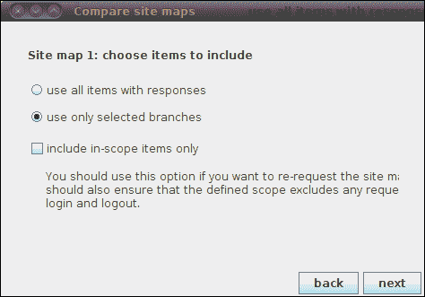

    定义要包含在 Burp compare 站点地图中的所有项目

6.  在第三步中，您必须为**站点地图 2**定义源。如果您使用的是免费版本的 Burp，**请求映射 1 在另一个会话上下文**选项中是您唯一可用的选项。选择它并点击**下一步**。
7.  Burp will use the current session (stored in Burp's **cookies jar**) to access all the resources defined in **site map 1**. During this exercise, we want to verify whether the **account** endpoint is available to both authenticated and unauthenticated users. In the previous steps, we have already recorded the **account** endpoint as seen by authenticated users. At this point, we need to invalidate our cookies and use the new session for **site map 2**. Minimize the **compare site maps** wizard and go to **options | sessions** in Burp Suite. Click on **view cookie jar**. This is the repository of all session tokens used by Burp.

    

    打开 Burp 的饼干罐

8.  由于我们想要模拟一个未经身份验证的用户，我们可以简单地篡改与[www.packtpub.com](http://www.packtpub.com)域相关的 jar 中的所有 cookie。逐个点击**编辑 cookie**并通过添加随机字符串篡改值。点击**完成**确认每个操作。最后，使用**关闭**按钮关闭饼干罐。
9.  此外，我们需要强制 Burp Target site map 使用那些被篡改的 cookie 执行比较。在BurpSuite中，进入**选项****会话**。点击**会话处理**表右侧的**编辑**。
10.  Burp will open a new window, named **Session handling rule editor**. Go to the **scope** tab and select the **target** checkbox in the **Tools scope** section. This is a very important step, thus make sure to properly configure the session handling as shown in the following screenshot. Finally, click on **Done** and get back to the **compare site maps** wizard window:

    

    Burp 的会话处理规则编辑器

11.  在**比较站点地图**向导的第四步中，除了其他计时选项外，Burp 还允许自定义分析期间使用的线程数。我们可以保留所有选项，点击**下一步**继续。
12.  在第五步（**请求匹配**中），建议使用默认设置，因为它们在大多数情况下都有效。只需点击**下一步**。
13.  同样，在第六步（**响应比较**中），建议使用默认设置。只需点击**下一步**。
14.  此时，Burp 将开始使用修改的会话请求**站点地图 1**资源，以构建**站点地图 2**。完成此过程后，Burp 将自动计算所有差异并向用户显示结果。

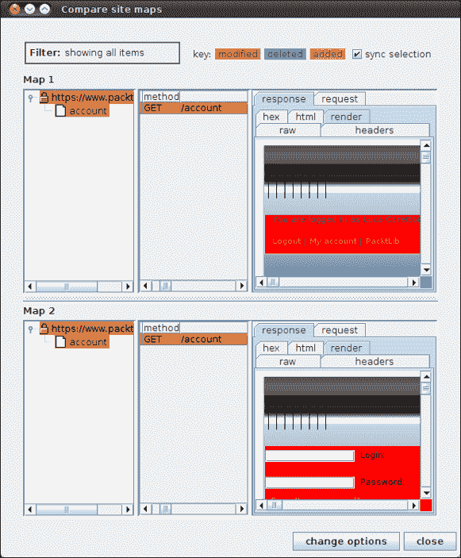

Burp 比较站点地图结果

结果页面允许轻松比较来自**站点地图 1**和**站点地图 2**的资源。通过使用**同步选择**复选框，Burp 将同步两个站点的资源，使您能够同时向下滚动两个面板和项目。在这种情况下，我们可以很容易地验证，使用未经验证的会话请求**帐户**端点会产生不同的响应，用户会被重定向到登录页面。正如所料，未经身份验证的用户无法使用此端点。

在实际的 web 应用程序评估期间，您可以使用此功能测试应用程序的所有端点。例如，您可以首先验证已验证会话和未验证会话之间的差异。然后，您可以使用两个不同的用户创建**站点地图 1**和**站点地图 2**，并验证访问控制机制是否到位。最后，您可能希望使用标准用户和管理员用户构建**站点地图 1**和**站点地图 2**，以确保低权限帐户无法使用特权操作。

### 提示

页面之间的微小差异可能是由动态组件（如一次性令牌和时间相关资源）造成的。一般而言，建议将分析重点放在增加的资源和响应中的重大变化上。

# 你应该了解的人和地方

如果您在BurpSuite方面需要帮助，以下是一些非常有价值的人员和场所：

## 官方网站

*   **首页**：[http://www.portswigger.net/](http://www.portswigger.net/)
*   **手册和文件**：[http://www.portswigger.net/burp/help/](http://www.portswigger.net/burp/help/)
*   **常见问题**：[http://portswigger.net/burp/faq.html](http://portswigger.net/burp/faq.html)

## 文章和教程

*   *使用 Burp 套件进行 Pentesting：将 Web 从自动扫描仪中取回*：一个涵盖 Burp 套件以及与其他安全工具集成的多功能演示文稿。值得一看！以下是链接：
    *   [http://www.securityaegis.com/pentesting-with-burp-suite-taking-the-web-back-from-automated-scanners/](http://www.securityaegis.com/pentesting-with-burp-suite-taking-the-web-back-from-automated-scanners/) （幻灯片和视频）
    *   [http://bit.ly/adYQrR](http://bit.ly/adYQrR) （短链接）
*   关于如何设置开发环境以构建 Burp 扩展的优秀教程：
    *   [http://console-cowboys.blogspot.com/2012/07/setting-up-burp-development-environment.html](http://console-cowboys.blogspot.com/2012/07/setting-up-burp-development-environment.html)
    *   [http://bit.ly/RZFnPt](http://bit.ly/RZFnPt) （短链接）
*   关于如何使用Burp的 15 分钟分步视频教程。它涵盖了本书中解释的大部分功能。然而，它可以帮助你刷新BurpSuite的技能；可在[找到 http://vimeo.com/11553558](http://vimeo.com/11553558) 。
*   *网络应用黑客手册：发现和利用安全漏洞*。本书可能是学习基本和高级 web 应用程序安全技术的最佳资源之一。这本书由 Burp Suite 的同一位作者撰写，涵盖了使用 Burp 作为参考工具的 web 安全性；以下是链接：
    *   [www.amazon.com/The-Web-Application-Hackers-handle/dp/1118026470/](http://www.amazon.com/The-Web-Application-Hackers-Handbook/dp/1118026470/)

## 社区

*   **Official forums**: [http://forum.portswigger.net/](http://forum.portswigger.net/)

    特别是看看**我该怎么做？**和**Burp extensions**论坛，学习如何执行高级任务，并使用第三方插件扩展工具。

## 博客

*   尽管 Burp Suite 已经存在了好几年，现在它被认为是测试 web 应用程序的事实标准，但专门针对该工具的博客并不多。接收更新和学习如何使用新功能的最佳资源可能是官方博客：[http://blog.portswigger.net/](http://blog.portswigger.net/)

## 推特

*   在 Twitter 上[关注 Dafydd Stuttard（BurpSuite的创建者）https://twitter.com/PortSwigger](https://twitter.com/PortSwigger) 。
*   关注推特上的卢卡·卡雷托尼（本书作者）[https://twitter.com/_ikki](https://twitter.com/_ikki) 。
*   Follow Michal Melewski on Twitter. Every now and then, he provides useful tips and tricks on how to use Burp; he can be found at

    [https://twitter.com/carste1n](https://twitter.com/carste1n) 。

*   在推特[上关注杰米·芬尼根 https://twitter.com/chair6](https://twitter.com/chair6) 。他是 Hiccup 的维护者，Hiccup 是一个基于 Python 的 Burp 扩展框架。
*   有关更多开源信息，请参见[中的 Packthttp://twitter.com/packtopensource](http://twitter.com/packtopensource) 。****