# 一、安装和配置 Kali Linux

本章将引导您了解 Kali Linux 2018.2 的精彩世界，这是一个专门用于渗透测试的 Linux 发行版。在本章中，我们将介绍以下主题：

*   卡利简史
*   卡利的几种常见用法
*   下载和安装 Kali
*   配置和更新 Kali

# 技术要求

在本章和本书中，如果将 Kali Linux 和测试实验室环境安装为虚拟机，读者将需要一台笔记本电脑或台式机，其内存为 6GB 或更大，硬盘空间为 100GB。如果在闪存驱动器或 SD/micro SD 卡上安装 Kali，则最小存储空间应为 8 GB（建议使用 16 GB 或更大）。读者还需要下载以下内容：

*   VirtualBox（[https://www.virtualbox.org/wiki/Downloads](https://www.virtualbox.org/wiki/Downloads) ）
*   Vmware 播放器（[https://my.vmware.com/en/web/vmware/free#desktop_end_user_computing/vmware_workstation_player/14_0](https://my.vmware.com/en/web/vmware/free#desktop_end_user_computing/vmware_workstation_player/14_0) ）
*   Kali Linux（[https://www.kali.org/downloads/](https://www.kali.org/downloads/) ）

# Kali Linux 工具类别

在撰写本文时，Kali Linux 的最新版本是 2018.2 版，于发布。如官方网站[所列 https://bugs.kali.org/changelog_page.php](https://bugs.kali.org/changelog_page.php) ，本版本包括：

*   更好地支持 AMD GPU
*   针对幽灵和熔毁漏洞的 x86 和 x64 体系结构修复
*   使用`metasploit-framework-4.16.34-0Kali2`和更新版本更容易访问 Metasploit
*   更新工具，包括猎犬 1.51 版、收割者 1.6.4 版、PixieWPS 1.42 版、Burpusuite 1.7.32 版、Hashcat 4.0 版等
*   对 Wpscan、Openvas、Xplico、Responder 和 Dradis 的改进

Kali Linux 包含许多可在渗透测试过程中使用的工具。Kali Linux 中包含的渗透测试工具可分为以下几类：

*   **信息收集**：此类别包含多个工具，可用于收集有关 DNS、ID/IP、网络扫描、操作系统、路由、SSL、SMB、VPN、IP 语音、SNMP、电子邮件地址和 VPN 的信息。
*   **漏洞评估**：在这一类中，您可以找到扫描漏洞的工具。它还包含用于评估 Cisco 网络的工具，以及用于评估多个数据库服务器中的漏洞的工具。这个类别还包括几个模糊工具。
*   **Web 应用**：该类别包含与 Web 应用相关的工具，如内容管理系统扫描程序、数据库攻击、Web 应用模糊程序、Web 应用代理、Web 爬虫程序和 Web 漏洞扫描程序。
*   **数据库评估**：这类工具测试各种数据库的安全性。有许多工具是专门为测试 SQL 数据库而设计的。
*   **密码攻击**：在这个类别中，您会发现一些工具，可以用于在线或离线执行密码攻击。
*   **无线攻击**：测试无线安全越来越普遍。此类别包括攻击蓝牙、RFID/NFC 和无线设备的工具。
*   **攻击工具**：该类别包含可用于攻击目标环境中发现的漏洞的工具。您可以找到网络、web 和数据库的利用工具。还有一些工具可以执行社会工程攻击和查找漏洞信息。
*   **嗅探和欺骗**：此类工具可用于嗅探网络和 web 流量。这一类别还包括网络欺骗工具，如 Ettercap 和 Yersinia。
*   **后期开发**：此类别的工具将能够帮助您维护对目标机器的访问。在安装此类别的工具之前，您可能需要获得计算机中的最高特权级别。在这里，您可以找到操作系统和 web 应用的后门工具。您还可以找到隧道工具。
*   **取证**：该类别包含执行数字取证采集、数据恢复、事件响应和文件雕刻的工具。
*   **报告工具**：在该类别中，您将找到帮助您记录渗透测试过程和结果的工具。
*   **社会工程工具**：该类别包含非常强大的 Maltego 和**社会工程工具包**（**集**）等，在渗透测试的侦察和开发阶段非常有用。
*   **系统服务**：这个类别包含几个在渗透测试任务中可能有用的服务，例如 Apache 服务、MySQL 服务、SSH 服务和 Metasploit 服务。

为了简化渗透测试人员的生命周期，Kali Linux 为我们提供了一个名为**十大安全工具**的类别。顾名思义，这些是渗透测试人员最常用的十大安全工具。这类工具包括`aircrack-ng`、`burp-suite`、`hydra`、`john`、`maltego`、`metasploit`、`nmap`、`sqlmap`、`wireshark`和`zaproxy`。

除了包含可用于渗透测试任务的工具外，Kali Linux 还提供了几个可用于以下任务的工具：

*   **逆向工程**：该类别包含可用于调试程序或反汇编可执行文件的工具。
*   **压力测试**：此类工具可用于帮助您对网络、无线、网络和 VOIP 环境进行压力测试。
*   **硬件黑客**：如果您想使用 Android 和 Arduino 应用，可以使用此类工具。
*   **取证**：此类工具可用于各种数字取证任务。这包括成像磁盘、分析内存图像和文件雕刻。Kali Linux 提供的最好的取证工具之一是 Volatility。此命令行工具具有许多用于分析内存图像的功能。还有一些 GUI 工具可用，如尸检和 Guymager，还有 Xplico，已经修复。

在本书中，我们只关注 Kali Linux 的渗透测试工具。

# 下载 Kali Linux

在安装和使用 Kali Linux 之前要做的第一件事就是下载它。您可以从 Kali Linux 网站（[上获得 Kali Linuxhttp://www.kali.org/downloads/](http://www.kali.org/downloads/) ）。

在下载页面上，您可以根据以下项目选择正式的 Kali Linux 映像：


机器架构：i386、x64 和 armhf

VMware、VirtualBox 和 Hyper-V 的图像也可以从[的攻击性安全下载页面下载 https://www.offensive-security.com/kali-linux-vm-vmware-virtualbox-hyperv-image-download/](https://www.offensive-security.com/kali-linux-vm-vmware-virtualbox-hyperv-image-download/) ，如以下截图所示：

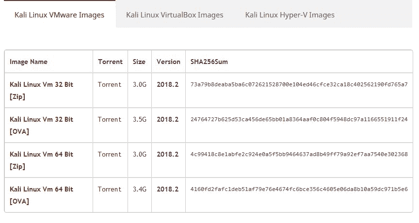

这些图像文件可以直接下载，也可以作为 OVA、ZIP 和 7-ZIP 文件下载

Kali Linux 自定义 ARM 下载可从[下载 https://www.offensive-security.com/kali-linux-arm-images/](https://www.offensive-security.com/kali-linux-arm-images/) 。通过单击设备名称右侧的箭头，可以下载 Chromebooks、Raspberry Pi 等设备的图像。

Kali NetHunter v3.o 可从攻击性安全网站[下载 https://www.offensive-security.com/kali-linux-nethunter-download/](https://www.offensive-security.com/kali-linux-nethunter-download/) 。

有关选择、安装和使用适当版本的 NetHunter 的更多信息将在后面的章节中讨论：


Kali Linux Nethunter 下载页面

如果要将映像刻录到 DVD 或在计算机上安装 Kali Linux，可能需要下载 ISO 映像版本。但是，如果您想在虚拟环境（如 VirtualBox、VMWare 或 Hyper-V）中使用 Kali Linux，您可以使用相关的映像文件来加速虚拟环境的安装和配置，网址为[https://www.offensive-security.com/kali-linux-vm-vmware-virtualbox-hyperv-image-download/](https://www.offensive-security.com/kali-linux-vm-vmware-virtualbox-hyperv-image-download/.) 。

成功下载图像文件后，需要将下载图像的 SHA 哈希值与下载页面上提供的`sha256sum`哈希值进行比较。检查 SHA-256 值的目的是确保保存下载图像的完整性。这可以防止用户安装损坏的图像或被恶意篡改的图像文件。

在 UNIX/Linux/BSD 操作系统中，您可以使用`sha256sum`命令检查下载图像文件的 SHA-256 哈希值。请记住，由于 Kali Linux 映像文件的大小，计算其哈希值可能需要一些时间。例如，要生成`kali-linux-2018.2-amd64.iso`文件的哈希值，使用以下命令：

```
sha256sum kali-linux-2018.2-amd64.iso
```

对于 Windows 用户，可以使用 Raymond Lin 创建的一个小型免费工具，称为 MD5&SHA 校验和实用程序。此工具计算文件的 MD5、SHA-1、SHA-256 甚至 SHA-512 哈希值，还允许比较和验证哈希值。

MD5&SHA 校验和实用程序可在以下网址下载：[https://download.cnet.com/MD5-SHA-Checksum-Utility/3000-2092_4-10911445.html](https://download.cnet.com/MD5-SHA-Checksum-Utility/3000-2092_4-10911445.html) 。下载并运行后，单击浏览按钮并浏览到下载文件的路径。在本例中，我将使用我的`kali-linux-2018.2-amd64.iso`文件，如此屏幕截图所示：

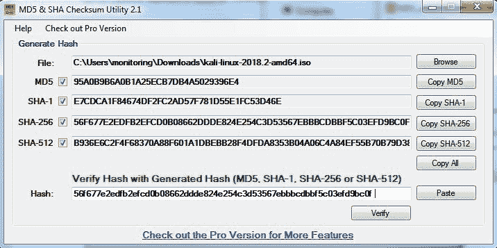

在前面的屏幕截图中，`kali-linux-2018.2-amd64.iso`文件的散列也从 Kali Linux 下载页面复制并粘贴到散列字段中进行验证。单击验证按钮以比较和验证 SHA-256 哈希：

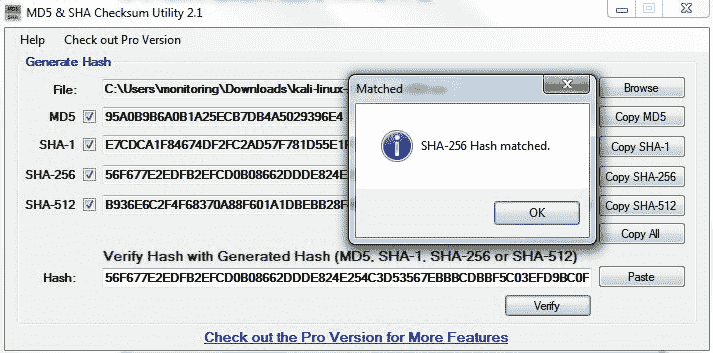

SHA-256 哈希匹配

如果两个值都匹配，您可以直接转到使用 Kali Linux 的*部分。但是，如果它们不匹配，则表示图像文件已损坏；您可能希望从官方下载镜像再次下载该文件。当我们运行下载文件的散列并将其与网站上的散列进行比较时，我们会看到它们匹配，这表明包已完全下载并已完成。*

# 使用 Kali Linux

您可以通过以下方式之一使用 Kali Linux：

*   您可以直接从 Live DVD 运行 Kali Linux
*   您可以在硬盘上安装 Kali Linux，然后运行它
*   您可以在 USB 磁盘上安装 Kali Linux（作为便携式 Kali Linux）

在以下各节中，我们将简要介绍每种方法。

# 使用实时 DVD 运行 Kali

如果您想使用 Kali Linux 而不首先安装它，可以通过将 ISO 映像文件刻录到 DVD 来实现。刻录过程成功完成后，使用该 DVD 启动计算机。您需要确保已将机器设置为从 DVD 引导。

将 Kali Linux 用作实时 DVD 的优点是，它的设置速度非常快，而且非常易于使用。

不幸的是，直播 DVD 有几个缺点；例如，重新启动后不会保存任何文件或配置更改。此外，从 DVD 运行 Kali Linux 比从硬盘运行 Kali Linux 慢，因为 DVD 的读取速度比硬盘的读取速度慢。

只有当您只想测试 Kali 时，才建议使用这种运行 Kali 的方法。但是，如果您想广泛使用 Kali Linux，我们建议您安装 Kali Linux。

# 在硬盘上安装

要在硬盘上安装 Kali Linux，可以选择以下方法之一：

*   在物理/真实机器上安装（常规安装）
*   在虚拟机上安装

您可以选择任何适合您的方法，但我们个人更喜欢在虚拟机上安装 Kali Linux。

# 在物理机器上安装 Kali

在物理/真实机器上安装 Kali Linux 之前，请确保将其安装在空硬盘上。如果硬盘上已经有一些数据，则在安装过程中这些数据将丢失，因为安装程序将格式化硬盘。为了便于安装，建议您使用整个硬盘。对于更高级的设置，可以选择在单个逻辑驱动器的分区上安装 Kali Linux。要做到这一点，您必须有一个引导操作系统的主分区和另一个用于 Kali Linux 的分区。执行此操作时请小心，因为可引导操作系统很容易损坏。

有关如何在 Windows 操作系统上安装 Kali Linux 的官方 Kali Linux 文档，请参见[http://docs.kali.org/installation/dual-boot-kali-with-windows](https://docs.kali.org/installation/dual-boot-kali-with-windows) 。

有几种工具可以帮助您执行磁盘分区。在开源领域，提供了以下 Linux Live CD：

*   系统拯救 CD（[http://www.sysresccd.org/](http://www.system-rescue-cd.org/) ）
*   GParted Live（[http://gparted.sourceforge.net/livecd.php](https://gparted.sourceforge.io/livecd.php) ）
*   Kali Linux（[http://www.kali.org](https://www.kali.org/) ）

要使用 LinuxLiveCD，只需启动它，就可以进行磁盘分区了。确保在使用 Linux Live CD 磁盘分区工具之前备份数据。根据我们的经验，即使它们可以安全使用，但谨慎也没有错，特别是如果硬盘上有重要数据的话。

完成磁盘分区后（或者您只想使用所有硬盘空间），可以使用 Kali Linux Live DVD 启动计算机，并在出现 Kali Linux Live CD 菜单提示时选择安装或图形安装选项：


Kali Linux 启动屏幕-选择图形化安装

之后，您将看到一个安装窗口。在安装过程中，您需要设置以下几项：

1.  设置语言：默认为英语。
2.  选择位置：使用下拉菜单选择您的国家/地区。
3.  配置键盘：选择最适合您需要的键盘。
4.  系统的主机名：默认为 Kali。对于初学者，可以保留默认设置。主机名通常用于企业环境，其中需要对连接到网络的所有系统进行记帐。
5.  设置域：对于初学者，该域应留空。仅当安装是网络域的一部分时，才会使用此选项。
6.  设置密码：这将是根帐户的密码。选择一个坚强的，不要分享，也不要忘记。
7.  配置时钟：选择您的时区。
8.  磁盘分区：安装程序将指导您完成磁盘分区过程。如果您使用的是空硬盘，为方便起见，只需选择默认的引导-使用整个磁盘选项。如果您的机器上安装了其他操作系统，您可能首先要为 Kali Linux 创建一个单独的分区，然后在此菜单中选择 Manual。选择合适的菜单后，安装程序将创建分区。
9.  安装程序将询问您有关分区方案的信息；默认方案是一个分区中的所有文件。请记住，如果要将文件存储在主目录中，应选择单独的/home 分区，以便在重新安装系统时不会删除这些文件。主/主分区的大小实际上取决于您的需要。如果要将所有数据放在该目录中，则可能需要较大的分区大小（大于 50GB）。对于一般使用，您可以继续使用 10 到 20 GB。
10.  对于初学者，建议您选择引导-使用整个磁盘选项。然后，选择要安装 Kali Linux 的磁盘。选择一个分区中的所有文件。

11.  安装程序将显示当前配置分区的概览，如以下屏幕截图所示：


12.  确保选中“完成分区并将更改写入磁盘”，然后单击“继续”。最后，单击 Yes 单选按钮并单击 Continue 将更改写入磁盘。
13.  网络镜像：对于初学者，选择否。我们将介绍更新 Kali Linux。
14.  接下来，安装程序将安装 Kali Linux 系统。安装将在几分钟内完成，之后您将在硬盘上安装 Kali Linux。在我们的测试机器中，安装大约需要 20 分钟。
15.  安装完成后，安装程序将要求您配置软件包管理器。接下来，它将要求您将 GRUB 安装到主引导记录（MBR）中。您可以为这两个问题选择默认值。注意：如果在同一台机器上有其他操作系统，则不应选择将 GRUB 安装到 MBR。

16.  如果您看到以下消息，则表示您的 Kali 安装已完成：


17.  通过选择 Continue（继续）按钮，可以重新启动计算机以测试新的 Kali 安装。重新启动后，您将看到以下 Kali 登录屏幕。您可以使用在安装过程中配置的凭据登录。默认用户名为`root`：

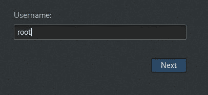

默认密码为`toor`：


# 在虚拟机上安装 Kali

您还可以在虚拟机环境中作为来宾操作系统安装 Kali Linux。这种类型安装的优点是，您不需要为 Kali Linux 映像准备单独的物理硬盘分区，并且可以按原样使用现有的操作系统。

我们将使用**VirtualBox**（[http://www.virtualbox.org](http://www.virtualbox.org) 作为虚拟机软件。VirtualBox 是一种开源虚拟化软件，可用于 Windows、Linux、OS X 和 Solaris 操作系统。

不幸的是，在虚拟机上运行 Kali Linux 还有一个缺点；它比在物理机器上运行 Kali Linux 慢。

有两个选项可用于在虚拟机上安装 Kali Linux。第一个选项是将 Kali Linux ISO 映像安装到虚拟机中。与 VMware 映像安装相比，此选项需要更多的时间。这种方法的优点是，您可以自定义您的 Kali 安装。

# 从 ISO 映像在虚拟机上安装 Kali

要在虚拟机上安装 Kali Linux ISO 映像，请执行以下步骤：

1.  通过从 VirtualBox 工具栏菜单中选择“新建”来创建新的虚拟机：


2.  之后，您需要定义虚拟机的名称和操作系统的类型。在这里，我们将 VM 的名称设置为`Kali Linux`，并选择 Linux 作为操作系统类型，选择 Debian 作为版本。

3.  然后，您需要定义 VM 的基本内存大小。您提供的内存越多，虚拟机就越好。在这里，我们为 Kali Linux 虚拟机分配了 2048 MB 内存。请记住，您不能将所有物理内存都提供给 VM，因为您仍然需要内存来运行主机操作系统：


4.  接下来，将要求您创建一个虚拟硬盘。您可以选择 VDI 作为硬盘类型，同时选择动态分配的虚拟磁盘文件。我们建议至少创建一个 32 GB 的虚拟硬盘。如果以后要安装一些软件包，可能需要创建一个更大的虚拟硬盘。选择“立即创建虚拟硬盘”，然后单击“创建”：


5.  现在选择一个文件位置和大小。单击创建：


6.  阅读对话框并单击“继续”。

7.  在此之后，新创建的 VM 将列在 VirtualBox 菜单中：


8.  双击新的 Kali Linux 虚拟机：


9.  使用文件图标，导航到您选择的 Kali Linux 2018.2 ISO 所在的位置。选择后，单击开始。
10.  安装开始后，按照上一节安装 Kali Linux 2.0 中定义的说明进行操作。

# 使用提供的 Kali Linux VM 映像在虚拟机上安装 Kali Linux

第二个选项是使用 Kali Linux 提供的 VMware 映像。

使用此选项，您可以轻松地在虚拟机上安装 Kali Linux；它位于 Kali Linux 下载页面上的[https://www.offensive-security.com/kali-linux-vm-vmware-virtualbox-image-download/](https://www.offensive-security.com/kali-linux-vm-vmware-virtualbox-image-download/) ：


虚拟平台可用的 Kali 映像列表

单击 Kali Virtual Images 后，我们将进入另一个页面，列出攻击性安全页面上的软件包及其相关的`sha256sum`值：

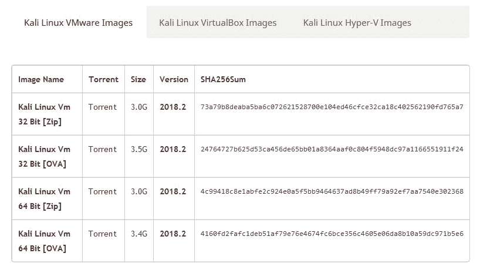

下载 Kali Linux VMware 映像（`kali-linux-2018.2-vm-amd64.zip`后，需要使用下载页面上提供的哈希值验证下载文件的 SHA256 哈希。如果哈希值相同，则可以将图像文件提取到相应的文件夹中。

由于 VMware 映像以 ZIP 格式压缩，因此您可以使用任何可以提取`.gz`文件的软件，例如`gzip`，或者`7-Zip`，如果您使用的是 Windows 操作系统。如果您已成功解压缩，您将在目录中找到 13 个文件：

1.  要使用此 VM 映像文件创建新虚拟机，请从 VirtualBox 图标工具栏中选择“新建”。
2.  我们将使用 Kali Linux from VM 作为 VM 名称，并选择 Linux 作为操作系统，Debian 作为版本。
3.  我们将 Kali Linux 虚拟机配置为使用 2048 MB 作为其内存大小。
4.  接下来，我们定义虚拟硬盘以使用现有的虚拟硬盘驱动器文件。然后，我们为硬盘选择`kali-linux-2018.2-vm-amd64.vmdk`文件。之后，我们选择 Create 来创建虚拟机，如下面的屏幕截图所示：


以下是 Kali Linux VMware 映像的默认配置：

*   硬盘大小：30 GB
*   网络类型：NAT
*   用户名：`root`
*   密码：`toor`

出于渗透目的，我们应该避免使用 NAT 作为网络类型。建议的网络类型是桥接的。配置 Kali VM 时更改 Kali 的默认密码。

如果成功，您将在 virtual Box 中的 virtual manager 列表中看到新虚拟机。

要运行 Kali Linux 虚拟机，请单击 VirtualBox 菜单栏顶部的开始图标。启动过程结束后，Kali Linux 将显示其登录提示。

如果存在任何错误消息，请安装 VirtualBox 扩展包。您可以从[获取 http://www.virtualbox.org/wiki/Downloads.](http://www.virtualbox.org/wiki/Downloads)

单击“确定”将进入以下对话框：

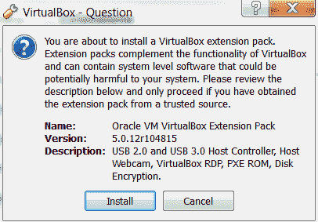

继续，单击 Install，然后单击 OK。

# 保存或移动虚拟机

使用 Kali Linux 作为虚拟机还有另外两个优点。首先是虚拟机可以轻松地暂停。暂停虚拟机允许您暂停活动，而不会丢失任何工作。例如，如果您必须关闭主机系统，而虚拟机仍在处理某个操作，则挂起该操作将允许您从停止的位置重新开始。要暂停虚拟机，请单击位于虚拟机窗口左上角的暂停按钮。

虚拟机的另一个功能是能够将其从一台主机移动到另一台主机。如果您需要更改主机系统，例如，在笔记本电脑上运行，然后将其移动到更新、更强大的笔记本电脑上，这非常方便。这可以确保您所做的任何配置或修改都保留下来，这样您就不必再次经历整个过程。

要导出虚拟机，请转到文件并单击导出设备。然后将指导您导出 Kali Linux 虚拟机。选择要导出到的位置，并保持应用设置不变。最后，单击导出，虚拟机将导出到该位置。这可能需要一些时间，具体取决于虚拟机的大小。

导出完成后，您可以使用想要的任何存储设备，并将虚拟机传输到另一个主机系统。请记住，如果使用 Oracle VirtualBox 创建虚拟机，请在新主机上使用相同的版本。传输完毕后，您可以通过转到文件、导入设备并按照说明导入虚拟机。

# 在 USB 磁盘上安装 Kali

使用 Kali Linux 的第三种选择是将其安装在 USB 闪存上；我们称这种方法为**便携式 Kali Linux**。根据官方的 Kali 文档，这是 Kali 开发者最喜欢的、最快的启动和安装 Kali 的方法。与硬盘安装相比，您可以使用任何支持使用此方法从 USB 闪存启动的计算机运行 Kali Linux。

USB 闪存的安装程序也适用于存储卡（SSD、SDHC、SDXC 等）的安装。

有几种工具可用于创建可移植的 Kali Linux。其中一个是**鲁弗斯**（[http://rufus.akeo.ie/](http://rufus.akeo.ie/) ）。此工具只能从 Windows 操作系统运行。

您可以使用其他工具从 ISO 映像创建可引导磁盘，例如：

*   Win32DiskImager（[https://launchpad.net/win32-image-writer](https://launchpad.net/win32-image-writer) ）
*   通用 USB 安装程序（[http://www.pendrivelinux.com/universal-usb-installer-easy-as-1-2-3/](http://www.pendrivelinux.com/universal-usb-installer-easy-as-1-2-3/) ）
*   LinuxLive USB Creator（[http://www.linuxliveusb.com](http://www.linuxliveusb.com/) ）

在创建便携式 Kali Linux 之前，您需要准备几件事：

*   **Kali Linux ISO 镜像**：虽然在使 Kali Linux 可移植的同时，您可以使用 portable creator 工具直接下载镜像，但我们认为最好先下载 ISO，然后配置 Rufus 使用镜像文件。
*   **U 盘**：您需要一个有足够空间的空 U 盘。我们建议使用最小尺寸为 16 GB 的 USB 闪存磁盘。

下载 Rufus 后，您可以双击`rufus.exe`文件在 Windows 计算机上运行它。然后你会看到鲁弗斯的窗户。

如果使用基于 UNIX 的操作系统，则可以使用`dd`命令创建映像。以下是一个成像示例：

```
    dd if=kali-linux-2.0-i386.iso of=/dev/sdb bs=512k

```

这里，`/dev/sdb`是您的 U 盘。

要创建可引导的 Kali USB 闪存，我们需要填写以下选项：

1.  对于**设备**，我们选择 U 盘的位置。在我的情况下，它是我的 Windows 系统中的 E 驱动器。
2.  对于分区方案和目标系统类型，将其设置为 BIOS 或 UEFI 计算机的 MBR 分区方案。

3.  在使用创建可引导磁盘选项中，将该值设置为 ISO 映像，并使用磁盘图标选择 ISO 映像：

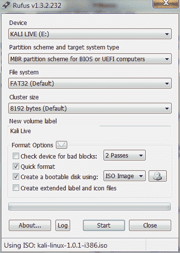

4.  单击 Start 创建可引导映像。

完成此过程后，如果要立即尝试使用 USB 闪存，请先保存所有工作，然后重新启动系统。您可能需要配置您的**基本输入输出系统**（**BIOS**）以从 USB 磁盘引导。如果没有错误，您可以从 USB 闪存磁盘启动 Kali Linux。

Rufus 还可以用于在 SD 卡上安装 Kali Linux。确保使用 10 级 SD 卡以获得最佳效果。

如果您想向 U 盘添加持久性功能，可以按照文档部分 A*中描述的步骤将持久性添加到您的 Kali Live USB*，位于[http://docs.kali.org/installation/kali-linux-live-usb-install](http://docs.kali.org/installation/kali-linux-live-usb-install) 。

# 配置虚拟机

安装后，Kali Linux 虚拟机需要执行几个配置步骤。这些步骤允许更大的功能性和可用性。

# VirtualBox 来宾添加

建议您在使用 VirtualBox 成功创建 Kali Linux 虚拟机后，安装`VirtualBox guest additions`。此附加模块将为您提供以下附加功能：

*   它将使虚拟机能够全屏查看
*   这将使鼠标在虚拟机中移动更快
*   它将使您能够在主机和来宾计算机之间复制和粘贴文本
*   它将使来宾机和主机能够共享文件夹

要安装来宾添加，请执行以下步骤：

1.  从 VirtualBox 菜单，导航到设备|安装来宾添加。然后，您将看到 VirtualBox 来宾添加文件作为磁盘装载。
2.  然后，VirtualBox 将显示以下消息。单击“取消”关闭窗口：


3.  打开终端控制台并更改 VirtualBox 来宾添加 CD ROM 装载点（`/media/cdrom0`：


4.  执行`VBoxLinuxAdditions.run`以通过键入`sh ./VBoxLinuxAdditions.run`来运行 VirtualBox guest additions 安装程序，如下所示：


您可能需要等待几分钟，直到成功构建并安装所有必需的模块。按照以下步骤将 VM 切换到全屏模式：

1.  切换到`root`主目录。
2.  右键单击图标并从菜单中选择“弹出”，弹出 VBoxAdditions CD 图像。如果成功，VBoxAdditions 图标将从桌面上消失。

3.  在终端控制台中键入`reboot`命令，重新启动虚拟机。
4.  重新启动后，您可以从 VirtualBox 菜单切换到全屏（查看|切换到全屏）。

# 建立网络

在下一节中，我们将讨论如何在 Kali Linux 中为有线和无线网络设置网络。

# 设置有线连接

在默认的 Kali Linux VMware 映像或 ISO 配置中，Kali Linux 使用**网络地址转换**（**NAT**作为网络的连接类型。在此连接模式下，Kali Linux 机器将能够通过主机操作系统连接到外部世界，而外部世界，包括主机操作系统，将无法连接到 Kali Linux 虚拟机。

对于渗透测试任务，您可能需要将此联网方法更改为**桥接适配器**。以下是更改它的步骤：

1.  首先，确保已关闭虚拟机的电源。
2.  然后，打开 VirtualBox 管理器，选择适当的虚拟机。在本例中，我们使用的是 Kali Linux 虚拟机，然后单击右侧的网络图标，并在适配器 1 中将“连接到”下拉框从 NAT 更改为“桥接适配器”。在名称字段中，您可以选择连接到要测试的网络的网络接口，如以下屏幕截图所示：

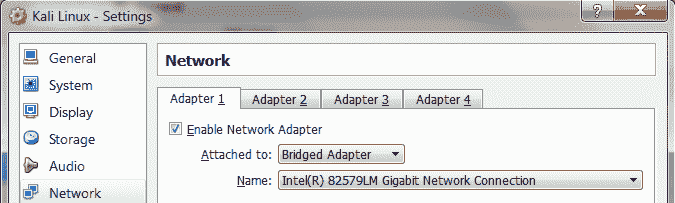

为了能够使用网桥网络连接，主机需要连接到可以通过 DHCP 为您提供 IP 地址的网络设备，如路由器或交换机。

您可能知道，DHCP IP 地址不是永久 IP 地址；这只是一个租赁 IP 地址。几次之后（如 DHCP 租约时间中所定义），Kali Linux 虚拟机将需要再次获取租约 IP 地址。此 IP 地址可能与前一个 IP 地址相同，也可能是另一个 IP 地址。

如果要使 IP 地址永久化，可以将 IP 地址保存在`/etc/network/interfaces`文件中。

以下是 Kali Linux 中此文件的默认内容：

*   `auto lo`
*   `iface lo inet loopback`

在默认配置中，所有网卡都设置为使用 DHCP 获取 IP 地址。要使网卡永久绑定到 IP 地址，我们必须编辑该文件并将内容更改为以下内容：

*   `auto eth0`
*   `iface eth0 inet static`
*   `address 10.0.2.15`
*   `netmask 255.255.255.0`
*   `network 10.0.2.0`
*   `broadcast 10.0.2.255`
*   `gateway 10.0.2.2`

这里我们设置第一张网卡（`eth0`绑定到`10.0.2.15`的 IP 地址。您可能需要根据要测试的网络环境调整此配置。

# 设置无线连接

通过将 Kali Linux 作为虚拟机运行，您无法使用嵌入主机操作系统中的无线网卡。幸运的是，您可以使用基于 USB 的外部无线卡。

在本演示中，我们使用的是 USB Ralink 无线卡/外部天线（稍后将在有关无线穿透测试的章节中深入讨论无线天线的选择）：

1.  要在 Kali 虚拟机中激活基于 USB 的无线网卡，请将无线网卡插入 USB 端口，导航到设备| USB 设备，然后从 VirtualBox 菜单中选择无线网卡：

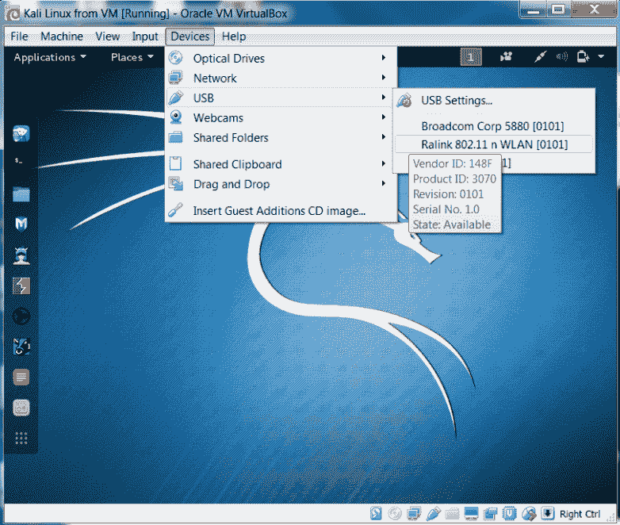

在这个屏幕截图中，我们可以看到列出的 USB 设备。

2.  如果您的 USB 无线网卡已被 Kali 成功识别，您可以使用`dmesg`程序查看无线网卡的信息。确定无线设备是否正确连接的另一个选项是打开终端并运行以下命令：

```
 ifconfig
```

如果无线连接配置正确，您应该在输出下看到一个列表，其中列出了`WLAN0`或`WLAN1`：

3.  输出应包括 WLAN 的列表。这是无线网络连接。
4.  在 Kali 菜单的右上部分，您将看到网络连接图标。您可以单击它来显示您的网络信息。
5.  您将看到多个网络名称，有线或无线，可用于您的机器：


6.  要连接到无线网络，只需通过双击其名称来选择所需的特定 SSID。如果无线网络需要身份验证，系统将提示您输入密码。只有在您提供正确的密码后，才允许您连接到该无线网络。

# 更新 Kali Linux

Kali Linux 由数百个应用软件和一个操作系统内核组成。如果要获得最新功能，可能需要更新软件。我们建议您仅从 Kali Linux 软件包存储库更新软件和内核。

成功安装和配置 Kali Linux 后要做的第一件事是更新它。由于 Kali 基于 Debian，您可以使用 Debian 命令（`apt-get`）进行更新过程。

`apt-get`命令将参考`/etc/apt/sources.list`文件以获取更新服务器。您需要确保在该文件中放置了正确的服务器。

要更新`sources.list`文件，请打开终端并键入以下命令：

```
leafpad /etc/apt/sources.list
```

从官方网站[复制存储库 https://docs.kali.org/general-use/kali-linux-sources-list-repositories](https://docs.kali.org/general-use/kali-linux-sources-list-repositories) ，粘贴到 leafpad 中，保存：

```
 deb http://http.kali.org/kali kali-rolling main contrib non-free
 # For source package access, uncomment the following line
 # deb-src http://http.kali.org/kali kali-rolling main contrib non-free 
```

您需要从`/etc/apt/sources.list`文件中指定的存储库同步包的索引文件，然后才能执行更新过程。以下是此同步的命令：

```
    apt-get update  
```

在 Kali 中执行软件更新或安装之前，请确保始终运行`apt-get`更新。同步包索引后，可以执行软件更新。

有两个命令选项可用于执行升级：

*   `apt-get upgrade`：此命令将当前安装在机器上的所有软件包升级到最新版本。如果升级包时出现问题，则该包将在当前版本中保持不变。
*   `apt-get dist-upgrade`：此命令将升级整个 Kali Linux 发行版；例如，如果要从 Kali Linux 1.0.2 升级到 Kali Linux 2.0，可以使用以下命令。此命令将升级当前安装的所有软件包，并将处理升级过程中的任何冲突；但是，执行升级可能需要一些特定操作。

选择适当的命令选项以更新 Kali Linux 后，`apt-get`程序将列出将要安装、升级或删除的所有软件包。`apt-get`命令将等待您的确认。

如果您确认，升级过程将开始。注意：根据您的 internet 连接速度，升级过程可能需要很长时间才能完成。

# 在 Amazon AWS 云上设置 Kali Linux AMI

Kali Linux 也可以在云上设置为亚马逊 Web 服务平台上的**亚马逊机器镜像**（**AM****I**），作为云计算服务。虽然列出的成本为每小时 0.046 美元，但如果专门配置为基本服务，且用户不超过某些设定的限制，则可以免费使用。尽管注册和配置需要信用卡，但如果超出上述限制，您将在收费前收到通知。

在我们开始在云中设置 Kali Linux 之前，您可以首先访问 Amazon Marketplace，通过以下链接查看 AMI 的详细信息：[https://aws.amazon.com/marketplace/pp/B01M26MMTT](https://aws.amazon.com/marketplace/pp/B01M26MMTT) 。请注意，它被列为自由层。

要开始安装并在云中配置 Kali Linux，我们必须执行以下步骤：

1.  首先，在 Amazon 的 AWS 门户上创建一个帐户。访问[https://aws.amazon.com/](https://aws.amazon.com/) 点击新建账户。请务必记住所使用的凭据以及您创建的 AWA 名称，如屏幕截图所示：


2.  单击“继续”后，完成所需的其他详细信息。当您输入信用卡详细信息时，系统可能会提示您让 Amazon 给您打电话，并让您输入一个用于验证和安全目的的代码。完成后，AWS 控制台将向您致意。

3.  您还应收到一封电子邮件通知，通知您已成功创建帐户。您现在可以登录 AWS 控制台，在那里可以完成配置。在构建解决方案部分下，单击启动虚拟机：

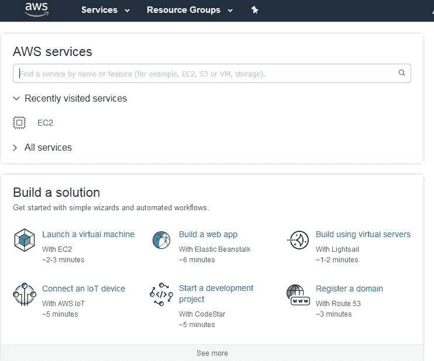

4.  在 AWS 控制台的 EC2 仪表板的左侧窗格中，单击网络和安全类别下的密钥对：

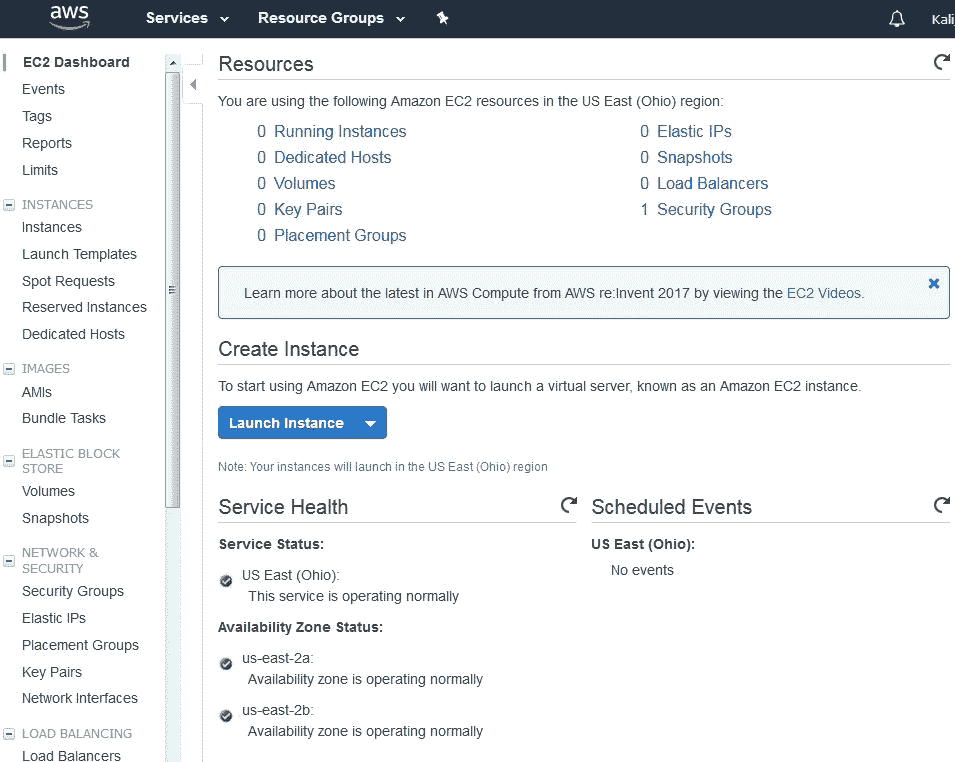

接下来，单击创建密钥对。

出现提示时，键入密钥对的名称。建议您选择易于记忆的名称和位置，因为您需要此密钥对进行身份验证和验证：

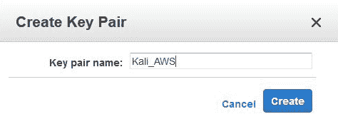

将密钥对保存到您选择的目的地。请注意，密钥对扩展名列为`.pem`，并且它还有一个十六进制格式的数字指纹，如下所示：


保存密钥对后，返回 AWS 控制台，单击控制台顶部的资源组，然后选择启动虚拟机。在控制台左侧的菜单中，单击 AWS Marketplace 并在搜索栏中输入 Kali Linux，如下所示：


目前市场上只有一个 Kali Linux AMI 实例。请注意，它在 Kali 徽标下被列为免费层。单击“选择”以使用此 AMI：

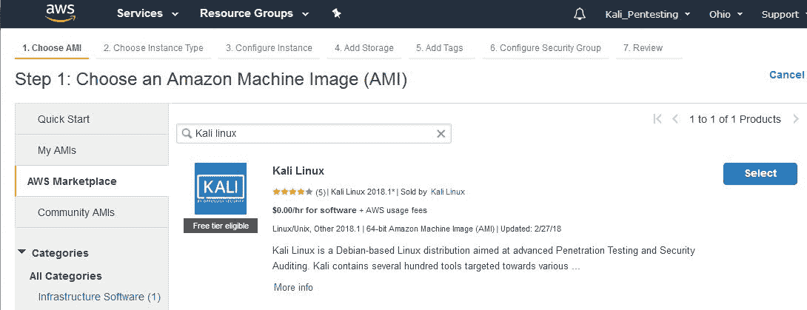

这就引出了 AMI 各种实例类型的定价细节，这些实例类型包含了 AMI 可用的内存和处理器使用等规范，T2 Nano 的最低小时费率为 0.006 美元/小时。查看完实例类型后，滚动到页面底部并单击 Continue:


对于免费版本，选择**t2 micro**类型，因为这是通用型，并且符合免费层的条件：


单击“查看并启动”按钮。确认选择的实例类型为**t2.micro**并点击启动：


现在应该提示您使用以前保存的密钥对。在第一个下拉菜单中，选择“选择和现有密钥对”。在“选择密钥对”菜单中，浏览到保存的密钥对的位置。单击复选框确认条款，然后最后单击启动实例。

现在应该会通知您 Kali Linux AMI 的启动状态。如果超过 AWS 的免费层使用率，您还可以创建计费警报：

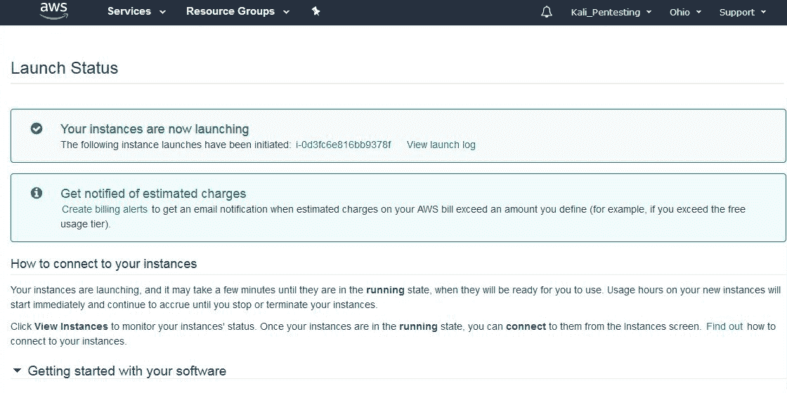

向下滚动并单击查看使用说明：


返回到启动状态页面，然后单击在 AWS Marketplace 上打开软件。在软件订阅和 AMI 选项卡中，单击查看实例。

这将显示一个弹出框，显示实例的详细信息，包括 ID、操作系统信息和状态。单击 AWS 控制台中的管理：

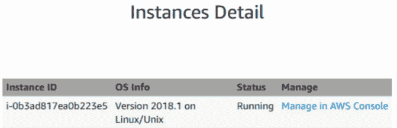

单击“连接”按钮：

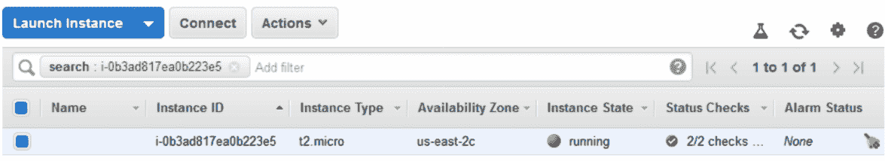

然后，我们将看到可用于连接实例的选项，以及如何使用 SSH 客户端（如 PuTTY）进行连接的说明。注意，在所列示例中，密钥对的名称为`Kali_AWS.pem`。通过 SSH 客户端连接时，请确保使用在前面步骤中选择的密钥对名称：

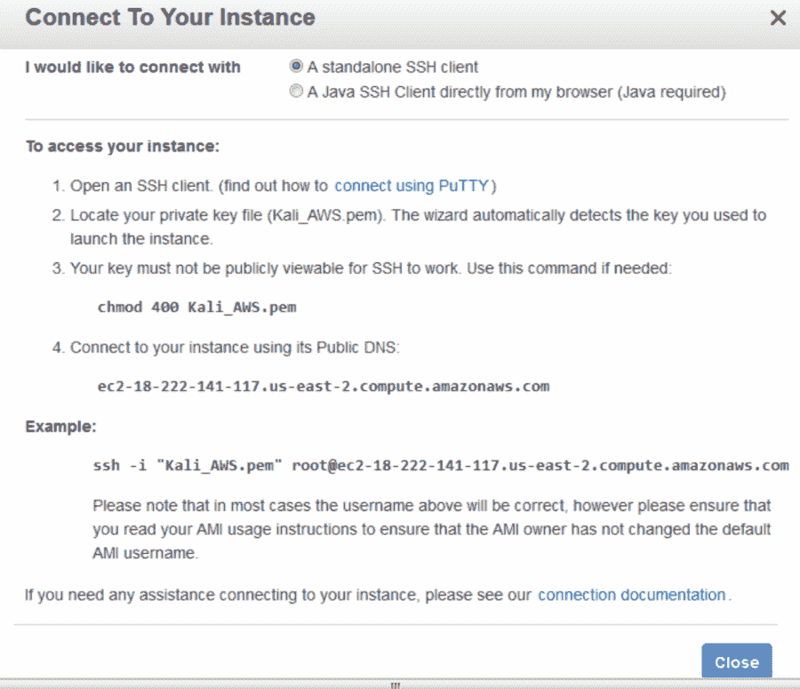

现在我们需要一个独立的**安全 Shell**（**SSH】**客户端，以便能够连接到云中的 Kali Linux 实例。我们将使用 Putty 作为我们的独立客户端，我们还将要求 Puttygen 能够使用我们以前下载的密钥对通过我们的云实例进行身份验证。Putty 和 Puttygen 都有 32 位和 64 位版本，可以从以下链接下载：[https://www.chiark.greenend.org.uk/~sgtatham/putty/latest.html？](https://www.chiark.greenend.org.uk/~sgtatham/putty/latest.html?)。

请务必下载`putty.exe`和`puttygen.exe`这两个 Windows 可执行文件。我使用的机器是 64 位架构，因此我将使用 64 位版本。

下载后，先运行`puttygen.exe`。单击文件，然后单击加载私钥。现在，浏览到先前下载的密钥对文件。您可能需要将文件类型从**PFF**更改为**所有文件**，因为密钥文件采用较旧的`.pem`格式。

选择后，应提示您保存私钥，以便能够以 Putty 格式保存它。

找到密钥后，单击保存私钥按钮：

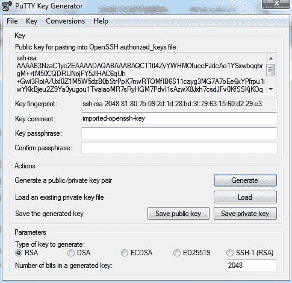

现在，我们可以使用必要的设置运行并配置`Putty.exe`，以连接到 AWS 云中的 Kali 实例。

在 Putty 左侧窗格中的会话类别中，输入仪表板中实例类别中显示的公共 DNS URL。它应该与此屏幕截图中的 URL 类似：

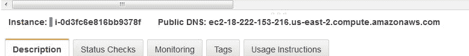

在 Putty 中的主机名区域中输入公共 DNS 地址，如屏幕截图所示：


接下来，向下滚动到左侧窗格中的**SSH**类别，并单击**Auth**子类别。点击右窗格上的**浏览**按钮，浏览到保存的`.ppk`私钥。

对于用户名，我们将使用**Ec2 用户**：


单击 Open 按钮，您现在应该可以登录到云中的 Kali 实例。一旦连接，记得更新 Kali。

# 总结

在查看最新版本的 Kali Linux 中的大量工具时，我们可以看到，它具有用于各种安全任务的功能。这些包括数字取证、无线安全评估、逆向工程软件、黑客硬件和渗透测试。

还讨论了 Kali Linux 的各种部署方式。可以使用实时 DVD 或 USB 或 SD 卡部署 Kali Linux，将其作为虚拟机安装，还可以将其作为独立系统甚至云中的主操作系统。

与任何其他软件一样，Kali Linux 也需要更新，无论我们是只更新软件应用还是发行版中包含的 Linux 内核。

在下一章中，我们将介绍如何建立我们的 pentesting 实验室。

# 问题

1.  Kali Linux 的移动版本的名称是什么？
2.  可以使用什么 Windows 工具来验证下载的 Kali Linux 映像文件的完整性？
3.  什么是 Linux 命令来验证下载的 Kali Linux 映像文件的完整性？
4.  可用于在闪存驱动器或 SD/micro SD 卡上安装 Kali Linux 和其他 Linux 发行版的工具的名称是什么？
5.  使用 Kali Linux 的各种实时模式是什么？
6.  使用什么命令更新 Kali Linux？
7.  在使用 Amazon 在云中安装 Kali Linux 时，哪个通用实例有资格免费使用？

# 进一步阅读

有关 Kali Linux 安装的其他信息可在此处找到：[https://docs.kali.org/category/installation](https://docs.kali.org/category/installation) 。 [](https://docs.kali.org/category/installation) 

有关使用 Windows 双引导 Kali Linux 的更多信息，请参见此处：[https://docs.kali.org/installation/dual-boot-kali-with-windows](https://docs.kali.org/installation/dual-boot-kali-with-windows) 。