# 扫描和规避技术

在本章中，我们将描述使用 Kali Linux 中的各种工具以及 GitHub 提供的其他工具在目标网络上发现设备的过程。我们将研究以下主题：

*   目标发现过程的描述
*   使用 Kali Linux 中的工具识别目标机器的方法
*   查找目标机器的操作系统所需的步骤（操作系统指纹）
*   带锁扣的自动扫描
*   Nipe 匿名化

为了帮助您轻松理解这些概念，我们将使用虚拟网络作为目标网络。

# 技术要求

这些是技术要求：

*   最低硬件要求：6 GB RAM、四核 2.4 GHz 处理器和 500 GB HDD
*   卡利 Linux 2018
*   用于测试的虚拟机，例如 Metasploitable 或 BadStore 等。（参见[第二章](02.html)、*搭建您的测试实验室*）

# 识别目标机器

此类工具用于识别渗透测试仪可以访问的目标机器。在我们开始识别流程之前，我们需要了解客户的条款和协议。如果协议要求我们隐藏渗透测试活动，我们需要隐藏我们的活动。隐形技术也可用于测试**入侵检测系统**（**IDS**）或**入侵防御系统**（**IPS**的功能。如果没有此类要求，我们可能不需要隐瞒渗透测试活动。

# 发出砰的声响

`ping`是最著名的工具，用于检查特定主机是否可用。`ping`工具通过向目标主机发送**互联网控制消息协议**（**ICMP**）回显请求包来工作。如果目标主机可用且防火墙未阻止 ICMP 回送请求数据包，则它将使用 ICMP 回送回复数据包进行回复。

ICMP 回显请求和 ICMP 回显回复是两种可用的 ICMP 控制消息。对于其他 ICMP 控制消息，您可以参考以下 URL:[https://en.wikipedia.org/wiki/Internet_Control_Message_Protocol#Control_messages](https://en.wikipedia.org/wiki/Internet_Control_Message_Protocol#Control_messages) 。

虽然在 Kali Linux 菜单中找不到`ping`，但您可以打开控制台并键入`ping`命令及其选项。

要使用`ping`，只需输入`ping`和目的地址，如下图所示：

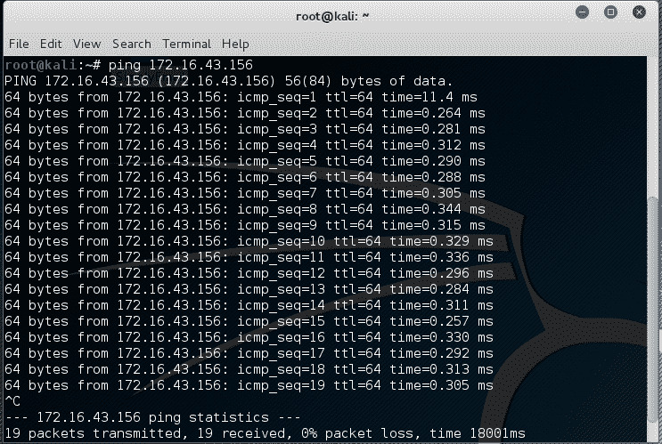

在 Kali Linux 中，默认情况下，`ping`将持续运行，直到您按下*Ctrl*+*C*为止。

`ping`工具有很多选项，但以下是一些常用的选项：

*   **`-c`**计数**：这是要发送的回显请求包数。**
***   **`-I`**接口地址**：这是源地址的网络接口。参数可以是数字 IP 地址（如`192.168.56.102`）或设备名称（如`eth0`）。如果要 ping IPv6 链路本地地址，则需要此选项。*****   **`-s`**数据包大小**：指定要发送的数据字节数。默认值为 56 字节，与 ICMP 头数据的 8 个字节组合时，转换为 64 个 ICMP 数据字节。******

 ****让我们在实践中使用前面的信息。

假设您从内部渗透测试工作开始。客户向您提供了使用局域网电缆访问其网络的权限，并向您提供了目标服务器的 IP 地址列表。

在启动全渗透测试库之前，您要做的第一件事是检查这些服务器是否可以从您的机器访问。您可以使用`ping`完成此任务。

目标服务器位于`172.16.43.156`，而您的机器的 IP 地址为`172.16.43.150`。要检查目标服务器的可用性，可以发出以下命令：

```
    ping -c 1 172.16.43.156
```

除了 IP 地址，`ping`还接受主机名作为目的地。

下面的屏幕截图是前面`ping`命令的结果：


从前面的屏幕截图中，我们知道一个 ICMP 回送请求数据包被发送到目的地（IP 地址=`172.16.43.156`。此外，发送主机（IP 地址=`172.16.43.150`接收到一个 ICMP 回送回复数据包。所需往返时间为`.869 ms`，过程中没有丢包。

让我们看看我们的机器发送和接收的网络数据包。我们将在机器上使用网络协议分析仪 Wireshark 来捕获这些数据包，如以下屏幕截图所示：


从前面的屏幕截图中，我们可以看到我们的主机（`172.16.43.150`向目标主机（`172.16.43.156`）发送了一个 ICMP 回送请求数据包。由于目标是活动的并且允许 ICMP 回送请求数据包，它将 ICMP 回送回复数据包发送回我们的机器。我们将在[第 9 章](05.html)、*权限提升*中的*网络嗅探器*部分详细介绍*Wireshark*。

如果您的目标使用 IPv6 地址，如`fe80::20c:29ff:fe18:f08`，您可以使用`ping6`工具检查其可用性。您需要为命令提供`-I`选项，以针对链接本地地址工作：

```
    # ping6 -c 1 fe80::20c:29ff:fe18:f08 -I eth0
    PING fe80::20c:29ff:fe18:f08(fe80::20c:29ff:fe18:f08) from fe80::20c:29ff:feb3:137 eth0: 56 data bytes
    64 bytes from fe80::20c:29ff:fe18:f08: icmp_seq=1 ttl=64 time=7.98 ms

    --- fe80::20c:29ff:fe18:f08 ping statistics ---
    1 packets transmitted, 1 received, 0% packet loss, time 0ms
    rtt min/avg/max/mdev = 7.988/7.988/7.988/0.000 ms

```

以下屏幕截图显示为完成`ping6`请求而发送的数据包：


从前面的屏幕截图中，我们知道`ping6`正在使用`ICMPv6`请求和回复。

为了阻止`ping`请求，可以将防火墙配置为仅允许来自特定主机的 ICMP`echo`请求数据包，并丢弃从其他主机发送的数据包。****  ****# fping

`ping`和`fping`之间的区别在于`fping`工具可用于同时向多台主机发送 ping（ICMP echo）请求。可以在命令行上指定多个目标，也可以使用包含要 ping 的主机的文件。

在默认模式下，`fping`通过监视目标主机的回复来工作。如果目标主机发送回复，则会记录该回复并将其从目标列表中删除。如果主机在一定时间内没有响应，则会标记为`unreachable`。默认情况下，`fping`将尝试向每个目标发送三个 ICMP 回显请求数据包。

要访问`fping`，您可以使用控制台执行以下命令：

```
    # fping -h
```

这将显示`fping`中可用的使用说明和选项。

以下场景将让您了解`fping`的用法。

如果我们想同时知道`172.16.43.156`、`172.16.43.150`、`172.16.43.155`的活主机，可以使用以下命令：

```
fping 172.16.43.156 172.16.43.150 172.16.43.155  
```

以下是上述命令的结果：

```
    # fping 172.16.43.156 172.16.43.150 172.16.43.155
    172.16.43.156 is alive
    172.16.43.150 is alive
    ICMP Host Unreachable from 172.16.43.150 for ICMP Echo sent to 172.16.43.155
    ICMP Host Unreachable from 172.16.43.150 for ICMP Echo sent to 172.16.43.155
    ICMP Host Unreachable from 172.16.43.150 for ICMP Echo sent to 172.16.43.155
    ICMP Host Unreachable from 172.16.43.150 for ICMP Echo sent to 172.16.43.155
    172.16.43.155 is unreachable 
```

我们还可以自动生成主机列表，而无需逐个定义 IP 地址并识别活动主机。假设我们想在`172.16.43.0/24`网络中找到活动主机；我们可以使用`-g`选项，使用以下命令定义要检查的网络：

```
# fping -g 172.16.43.0/24  
```

如果我们想更改对目标的 ping 尝试次数，可以使用`-r`选项（重试限制），如下命令行所示。默认情况下，有三次 ping 尝试：

```
    fping  -r 1 -g 172.16.43.149 172.16.43.160

```

命令的结果如下所示：

```
    # fping -r 1 -g 172.16.43.149 172.16.43.160
    172.16.43.150 is alive
    172.16.43.156 is alive
    172.16.43.149 is unreachable
    172.16.43.151 is unreachable
    172.16.43.152 is unreachable
    172.16.43.153 is unreachable
    172.16.43.154 is unreachable
    172.16.43.155 is unreachable
    172.16.43.157 is unreachable
    172.16.43.158 is unreachable
    172.16.43.159 is unreachable
    172.16.43.160 is unreachable

```

通过`-s`选项（打印累计统计信息）可以显示累计统计信息，如下所示：

```
    fping -s www.yahoo.com www.google.com www.msn.com

```

以下是前面命令行的结果：

```
    #fping -s www.yahoo.com www.google.com www.msn.com
    www.yahoo.com is alive
    www.google.com is alive
    www.msn.com is alive

           3 targets
           3 alive
           0 unreachable
           0 unknown addresses

           0 timeouts (waiting for response)
           3 ICMP Echos sent
           3 ICMP Echo Replies received
           0 other ICMP received

     28.8 ms (min round trip time)
     30.5 ms (avg round trip time)
     33.6 ms (max round trip time)
            0.080 sec (elapsed real time)

```

# hping3

`hping3`工具是一个命令行网络数据包生成器和分析器工具。创建自定义网络数据包的功能允许`hping3`用于 TCP/IP 和安全测试，如端口扫描、防火墙规则测试和网络性能测试。

根据开发商的说法，以下是`hping3`的几种其他用途：

*   测试防火墙规则
*   测试 ID
*   利用 TCP/IP 堆栈中的已知漏洞

要访问`hping3`，请转到控制台并键入`hping3`。

您可以通过命令行、交互式 shell 或脚本以多种方式向`hping3`发出命令。

如果没有任何给定的命令行选项，`hping3`将向端口`0`发送一个空 TCP 数据包。

要更改为其他协议，可以在命令行中使用以下选项来定义协议：

| 不 | 空头期权 | 长期权 | 描述 |
| 1. | `-0` | `--raw-ip` | 这将发送原始 IP 数据包 |
| 2. | `-1` | `--icmp` | 这将发送 ICMP 数据包 |
| 3. | `-2` | `--udp` | 这将发送 UDP 数据包 |
| 4. | `-8` | `--scan` | 这表示使用扫描模式 |
| 5. | `-9` | `--listen` | 这表示使用了侦听模式 |

使用 TCP 协议时，我们可以使用不带任何标志的 TCP 数据包（这是默认行为），也可以提供以下标志选项之一：

| 不 | 选项 | 旗名 |
| 1. | `-S` | `syn` |
| 2. | `-A` | `ack` |
| 3. | `-R` | `rst` |
| 4. | `-F` | `fin` |
| 5. | `-P` | `psh` |
| 6. | `-U` | `urg` |
| 7. | `-X` | `xmas: flags fin, urg, psh set` |
| 8. | `-Y` | `ymas` |

让我们将`hping3`用于以下几种情况。

向`192.168.56.101`机器发送一个 ICMP 回送请求数据包。使用的选项有`-1`（用于 ICMP 协议）和`-c 1`（用于将计数设置为一个数据包）：

```
hping3 -1 172.16.43.156 -c 1
```

以下是此命令的输出：

```
    # hping3  -1 172.16.43.156 -c 1
    HPING 172.16.43.156 (eth0 172.16.43.156): icmp mode set, 28 headers + 0 data bytes
    len=46 ip=172.16.43.156 ttl=64 id=63534 icmp_seq=0 rtt=2.5 ms

    --- 172.16.43.156 hping statistic ---
    1 packets transmitted, 1 packets received, 0% packet loss
    round-trip min/avg/max = 2.5/2.5/2.5 ms

```

从前面的输出中，我们可以确定目标机器是活动的，因为它已经响应了我们的 ICMP 回显请求。

为了验证这一点，我们使用`tcpdump`捕获了流量，下面的屏幕截图显示了数据包：


我们可以看到目标已使用 ICMP 回送回复数据包进行响应。

除了在命令行中提供选项外，还可以交互使用`hping3`。打开控制台并键入`hping3`。然后，您将看到一个提示，您可以在其中键入 Tcl 命令。

以下链接是 Tcl 的资源：[http://www.invece.org/tclwise/](http://www.invece.org/tclwise/) 和[http://wiki.tcl.tk/](http://wiki.tcl.tk/) 。

对于前面的示例，下面是相应的 Tcl 脚本：

```
    hping3> hping send {ip(daddr=172.16.43.156)+icmp(type=8,code=0)}
```

打开命令行窗口并发出以下命令以从目标服务器获取响应：

```
    hping recv eth0
```

之后，打开另一个命令行窗口以输入发送请求。

以下屏幕截图显示收到的响应：

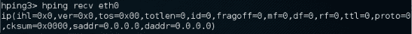

您还可以使用`hping3`检查防火墙规则。假设您有以下防火墙规则：

*   接受定向到端口`22`（SSH）的任何 TCP 数据包
*   接受与已建立连接相关的任何 TCP 数据包
*   丢弃任何其他数据包

要检查这些规则，您可以在`hping3`中发出以下命令，以便发送 ICMP 回显请求数据包：

```
hping3 -1 172.16.43.156 -c 1  
```

以下代码是结果：

```
# hping3 -1 172.16.43.156 -c 1 
HPING 172.16.43.156 (eth0 172.16.43.156): icmp mode set, 28 headers + 0 data bytes 
--- 172.16.43.156 hping statistic --- 
1 packets transmitted, 0 packets received, 100% packet loss 
round-trip min/avg/max = 0.0/0.0/0.0 ms 
```

我们可以看到目标机器没有响应我们的 ping 探测。

发送一个将 SYN 标志设置为端口`22`的 TCP 数据包，我们将得到如下截图所示的结果：

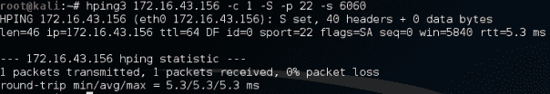

从前面的屏幕截图中，我们可以看到目标机器的防火墙允许我们的 SYN 数据包到达端口`22`。

我们来检查 UDP 包是否允许到达端口`22`：


从前面的屏幕截图中，我们可以看到目标机器的防火墙不允许我们的 UDP 数据包到达端口`22`。

您还可以使用`hping3`进行其他操作，但在本章中，我们将只讨论其功能的一小部分。如果您想了解更多信息，请访问`hping3`文档站点[http://wiki.hping.org](http://wiki.hping.org) 。

# 操作系统指纹

在我们确定目标机器是活动的之后，我们可以找出目标机器使用的操作系统。这种方法通常被称为**操作系统**（**操作系统**）指纹识别。操作系统指纹识别有两种方法：主动和被动。

在主动方法中，工具向目标机器发送网络数据包，然后分析它接收到的响应，以确定目标机器的操作系统。这种方法的优点是指纹识别过程很快。然而，缺点是目标机器可能会注意到我们试图获取其操作系统的信息。

为了克服主动方法的缺点，存在一种操作系统指纹的被动方法。这种方法是由 Michal Zalewsky 在发布名为`p0f`的工具时首创的。被动操作系统指纹识别的主要优点是，它在减少测试机器和目标之间的交互的同时完成了工作，大大提高了指纹识别的隐蔽性。被动方法的最大缺点是过程比主动方法慢。

在本节中，我们将描述两个可用于 OS 指纹识别的工具。

# p0f

`p0f`工具用于被动识别操作系统。它可用于识别以下机器上的操作系统：

*   连接到机箱的计算机（SYN 模式；这是默认模式）
*   您连接到的机器（`SYN`+`ACK`模式）
*   无法连接到的机器（`RST`+模式）
*   可以观察其通信的机器

`p0f`工具通过分析网络活动期间发送的 TCP 数据包来工作。然后，它收集默认情况下未被任何公司标准化的特殊数据包的统计信息。例如，Linux 内核使用 64 字节的 ping 数据报，而 Windows 操作系统使用 32 字节的 ping 数据报或**生存时间**（**TTL**值。对于 Windows，TTL 值为`128`，而对于 Linux，此 TTL 值因 Linux 发行版而异。然后`p0f`使用该信息确定远程机器的操作系统。

当使用 Kali Linux 附带的`p0f`工具时，我们无法在远程机器上对操作系统进行指纹识别。我们发现`p0f`工具没有更新指纹数据库。不幸的是，我们找不到指纹数据库的最新版本。因此，我们改用了`p0f v3`（版本 3.06b）。要使用此版本的`p0f`，只需从[下载`TARBALL`文件即可 http://lcamtuf.coredump.cx/p0f3/releases/p0f-3.06b.tgz](http://lcamtuf.coredump.cx/p0f3/releases/p0f-3.06b.tgz) 并通过运行`build.sh`脚本编译代码。默认情况下，指纹数据库文件的（`p0f.fp`位置在当前目录中。例如，如果要将位置更改为`/etc/p0f/p0f.fp`，则需要在`config.h`文件中更改此位置并重新编译`p0f`。如果不更改位置，可能需要使用`-f`选项定义指纹数据库文件位置。

要访问`p0f`，请打开控制台并键入`p0f -h`。这将显示其用法和选项说明。让我们使用`p0f`来识别我们正在连接的远程机器中使用的操作系统。只需在控制台中键入以下命令：

```
 p0f -f /etc/p0f/p0f.fp -o p0f.log
```

这将从文件中读取指纹数据库，并将日志信息保存到`p0f.log`文件中。然后，它将显示以下信息：

```
        --- p0f 3.07b by Michal Zalewski <lcamtuf@coredump.cx> ---

    [+] Closed 1 file descriptor.
    [+] Loaded 320 signatures from '/usr/share/p0f/p0f.fp'.
    [+] Intercepting traffic on default interface 'eth0'.
    [+] Default packet filtering configured [+VLAN].
    [+] Log file 'p0f.log' opened for writing.
    [+] Entered main event loop.

```

接下来，您需要生成涉及 TCP 连接的网络活动，例如浏览远程机器或让远程机器连接到您的机器。出于本演示的目的，已建立到 2 机器上 HTTP 站点的连接。

如果`p0f`已成功对操作系统进行指纹识别，您将在控制台和日志文件（`p0f.log`中看到远程机器操作系统的信息。

以下是控制台上显示的简要信息：

```
    .-[ 172.16.43.150/41522 -> 172.16.43.156/80 (syn+ack) ]-
    |
    | server   = 172.16.43.156/80
    | os       = Linux 2.6.x
    | dist     = 0
    | params   = none
    | raw_sig  = 4:64+0:0:1460:mss*4,5:mss,sok,ts,nop,ws:df:0

```

以下屏幕截图显示了日志文件的内容：

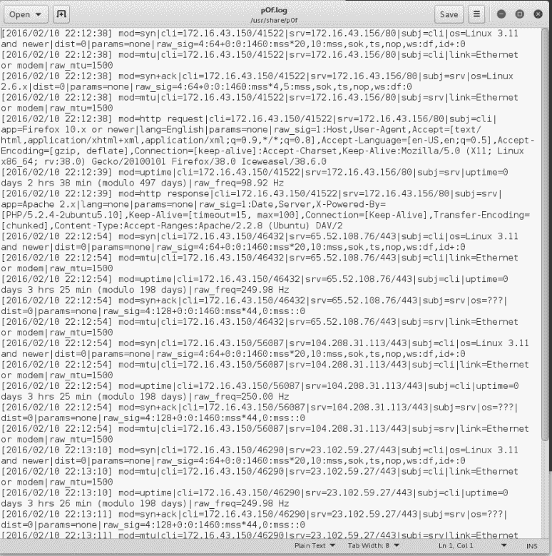

根据前面的结果，我们知道目标是一台`Linux 2.6`机器。

以下屏幕截图显示了来自目标机器的信息：


通过比较这些信息，我们知道`p0f`正确获取了操作系统信息。远程计算机正在使用 Linux 2.6 版。

您可以按*Ctrl*+*C*组合键停止`p0f`。

# 介绍端口扫描

端口扫描最简单的定义是，它是一种用于确定目标机器上的**传输控制协议**（**TCP**）和**用户数据报协议**（**UDP**端口）状态的方法。开放端口可能意味着有一个网络服务正在侦听该端口，并且该服务是可访问的，而封闭端口意味着没有网络服务在侦听该端口。

获取端口状态后，攻击者将检查网络服务使用的软件版本，并找出该版本软件的漏洞。例如，假设服务器 A 的 web 服务器软件版本为 1.0。几天前，发布了一条安全公告。该公告提供了有关 web 服务器软件版本 1.0 中漏洞的信息。如果攻击者发现服务器 A 的 web 服务器并能够获取版本信息，则攻击者可以使用此信息攻击服务器。这只是一个简单的示例，说明了攻击者在获取有关计算机上可用服务的信息后可以做什么。

在深入研究端口扫描之前，让我们先讨论一下 TCP/IP 协议理论。

# 理解 TCP/IP 协议

在 TCP/IP 协议套件中，有几十种不同的协议，但最重要的是 TCP 和 IP。IP 提供寻址、数据报路由和其他功能，用于将一台机器连接到另一台机器，而 TCP 负责管理连接，并在两台机器上的进程之间提供可靠的数据传输。在**开放系统互连**（**OSI**）模型中，IP 位于网络层（第 3 层），而 TCP 位于 OSI 的传输层（第 4 层）。

除了 TCP，传输层中的另一个关键协议是 UDP。您可能会问这两个协议之间有什么区别。

简言之，TCP 具有以下特点：

*   **这是一个面向连接的协议**：在使用 TCP 发送数据之前，需要通信的客户端和服务器必须使用三方握手机制建立 TCP 连接，如下所示：
    *   客户端通过向服务器发送包含 SYN（同步）标志的数据包来启动连接。客户端还发送 SYN 段序列号字段中的**初始序列号**（**ISN**）。这不是随机选择的。
    *   服务器使用自己的包含其 ISN 的 SYN 段进行响应。服务器通过发送包含客户端`ISN`+`1`值的 ACK（确认）标志来确认客户端的 SYN。
    *   客户端通过发送包含服务器 ISN+`1`的 ACK 标志来确认服务器。此时，客户端和服务器可以交换数据。
    *   要终止连接，TCP 必须遵循以下机制：
        *   客户端发送包含`FIN`（完成）标志集的数据包。
        *   服务器发送`ACK`（确认）数据包，通知客户端服务器已收到 FIN 数据包。
        *   应用服务器准备关闭后，服务器发送一个 FIN 数据包。
        *   然后，客户端发送`ACK`数据包以确认接收到服务器的`FIN`数据包。在正常情况下，每一方（客户端或服务器）都可以通过发送`FIN`数据包独立终止其通信结束。
*   **这是一个可靠的协议**：TCP 使用序列号和确认来识别数据包数据。接收方在收到数据包时发送确认。当一个数据包丢失时，如果它没有收到来自接收方的任何确认，TCP 将自动重新传输它。如果数据包到达时顺序不正确，TCP 将在将其提交给应用程序之前对其重新排序。
*   需要传输文件或重要数据的应用程序使用 TCP，如**超文本传输协议**（**HTTP**）和**文件传输协议**（**FTP**）。

UDP 具有与 TCP 相反的特性，如下所示：

*   这是一个无连接协议。要发送数据，客户端和服务器不需要首先建立 UDP 连接。
*   它将尽最大努力将数据包发送到目的地，但如果数据包丢失，UDP 将不会自动重新发送。由应用程序重新传输数据包。

能够承受某些数据包丢失的应用程序（如视频流和其他多媒体应用程序）使用 UDP。其他使用 UDP 的知名应用有**域名系统**（**DNS**）、**动态主机配置协议**（**DHCP**）和**简单网络管理协议**（**SNMP**）。

为了使应用程序能够正确通信，传输层使用称为端口的寻址。软件进程侦听服务器端的特定端口号，客户机将数据发送到该服务器端口，由服务器应用程序处理。端口号有一个 16 位地址，其范围可以是`0`到`65,535`。为了避免端口号的混乱使用，有关于端口号范围的通用协议，如下所示：

*   **众所周知的端口号（**`0`**至**`1,023`**：此范围内的端口号为保留端口号，通常由系统管理员或特权用户运行的服务器进程使用。应用服务器使用的端口号示例有 SSH（端口`22`）和 HTTP（端口`80`）、HTTPS（端口`443`）。**
***   **注册端口号（**`1,024`**至**`49,151`**：用户可以向**互联网分配号码管理局**（**IANA**）发送请求，为其客户机-服务器应用程序保留其中一个端口号。*****   **专用或动态端口号（**`49,152`**至**`65,535`**：任何人都可以使用此范围内的端口号，无需向 IANA 注册。******

 ******在简要讨论了 TCP 和 UDP 之间的差异之后，让我们描述一下 TCP 和 UDP 消息格式。******  ******# 了解 TCP 和 UDP 消息格式

TCP 消息称为段。TCP 段由头和数据段组成。TCP 头的长度通常为 20 字节（没有 TCP 选项）。可以使用以下屏幕截图进行描述：


以下是每个字段的简要说明：

*   **源端口**和**目的端口**各有 16 位的长度。源端口是发送机器上传输数据包的端口，而目标端口是目标机器上接收数据包的端口。
*   在正常传输中，**序列号（32 位）**是该段数据的第一个字节的序列号。
*   **确认号（32 位）**包含发送方的序列号，增加 1。
*   **H.Len。（4 位）**是 TCP 头的大小，以 32 位字表示。
*   **Rsvd。**保留供将来使用。它是一个 4 位字段，必须为零。
*   **控制位**（控制标志）包含八个 1 位标志。原始规范（RFC 793；RFC 可从[下载）http://www.ietf.org/rfc/rfc793.txt](http://www.ietf.org/rfc/rfc793.txt) ），TCP 只有六个标志，如下所示：
*   **SYN**：该标志同步序列号。此位在会话建立期间使用。

*   **确认**：此标志表示 TCP 报头中的**确认**字段有效。如果数据包包含此标志，则表示它是对先前接收的数据包的确认。
*   **RST**：此标志重置连接。
*   **FIN**：该标志表示该方没有更多的数据要发送。它用于优雅地断开连接。
*   **PSH**：此标志表示缓冲数据应立即推送到应用程序，而不是等待更多数据。
*   **URG**：此标志表示 TCP 头中的**紧急指针**字段有效。紧急指针指的是重要的数据序列号。

稍后，RFC 3168（RFC 可从[下载）http://www.ietf.org/rfc/rfc3168.txt](http://www.ietf.org/rfc/rfc3168.txt) ）又增加了两个扩展标志，如下所示：

*   **拥塞窗口减少（CWR）**：数据发送方使用此窗口通知数据接收方，由于网络拥塞，待发送的未完成数据包队列已减少
*   **显式连接通知回显（ECN 回显）**：表示网络连接发生拥塞
*   **窗口大小（16 位）**指定接收器愿意接受的字节数
*   **校验和（16 位）**用于 TCP 报头和数据的错误检查

这些标志可以彼此独立设置。

要获得有关 TCP 的更多信息，请咨询 RFC 793 和 RFC 3168。

当使用发送到目标计算机的 SYN 数据包在 TCP 端口上执行端口扫描时，攻击者可能面临以下行为：

*   目标机器使用 SYN+ACK 数据包进行响应。如果我们收到这个数据包，我们知道端口是开放的。此行为在 TCP 规范（RFC 793）中定义，该规范规定，如果端口打开，则必须使用 SYN+ACK 数据包响应 SYN 数据包，而不考虑 SYN 数据包负载。
*   目标机器发回设置了 RST 和 ACK 位的数据包。这意味着端口已关闭。

*   目标机器发送 ICMP 消息，如`ICMP Port Unreachable`，这意味着我们无法访问该端口，很可能是因为它被防火墙阻止。
*   目标机器没有向我们发送任何信息。这可能表示该端口上没有网络服务侦听，或者防火墙正在静默地阻止我们的 SYN 数据包。

从 pentester 的角度来看，有趣的行为是当端口打开时，因为这意味着该端口上有一个可用的服务可以进一步测试。

如果您进行端口扫描攻击，您应该了解列出的各种 TCP 行为，以便能够更有效地进行攻击。

当扫描 UDP 端口时，您将看到不同的行为；这些将在后面解释。在继续查看各种 UDP 行为之前，让我们先看看 UDP 标头格式，如以下屏幕截图所示：


以下是对上图所示 UDP 报头中每个字段的简要说明。

与 TCP 报头一样，UDP 报头也有**源端口**和**目的端口**，每个端口的长度为 16 位。源端口是发送机器上传输数据包的端口，而目标端口是接收数据包的目标机器上的端口：

*   **UDP 长度**是 UDP 报头的长度
*   **UDP 校验和（16 位）**用于 UDP 报头和数据的错误检查

请注意，UDP 报头中没有序列号、确认号和控制位字段。

在对目标计算机上的 UDP 端口进行端口扫描活动期间，攻击者可能会面临以下行为：

*   目标计算机使用 UDP 数据包进行响应。如果我们收到这个数据包，我们知道端口是开放的。
*   目标机器发送 ICMP 消息，如`ICMP Port Unreachable`。可以断定该港口已关闭。但是，如果发送的消息不是 ICMP 无法访问的消息，则表示该端口已被防火墙过滤。
*   目标机器没有向我们发送任何信息。这可能表示以下情况之一：
    *   港口关闭了
    *   入站 UDP 数据包被阻止
    *   响应被阻止

与 TCP 端口扫描相比，UDP 端口扫描的可靠性较低，因为有时 UDP 端口是打开的，但侦听该端口的服务正在查找特定的 UDP 负载。因此，该服务不会发送任何回复。

现在我们简要介绍了端口扫描理论，让我们将其付诸实践。在下面的部分中，我们将介绍几种可用于帮助我们执行网络扫描的工具。

对于本章中的实际场景，我们将使用 Metasploitable 虚拟机作为我们的目标机，如[第 2 章](02.html)、*设置您的测试实验室*中所述。它的 IP 地址为`172.16.43.156`，而我们的攻击机器的 IP 地址为`172.16.43.150`。

# 网络扫描器

在本节中，我们将介绍几种工具，这些工具可用于查找打开的端口、对远程操作系统进行指纹识别以及枚举远程计算机上的服务。

服务枚举是一种方法，用于查找目标系统上特定端口上可用的服务版本。此版本信息非常重要，因为有了此信息，渗透测试人员可以搜索该软件版本存在的安全漏洞。

虽然经常使用标准端口，但有时系统管理员会更改某些服务的默认端口。例如，SSH 服务可以绑定到端口`22`（作为约定），但系统管理员可以将其更改为绑定到端口`2222`。如果渗透测试仪仅对 SSH 的公共端口进行端口扫描，则可能找不到该服务。渗透测试仪在处理在非标准端口上运行的专有应用程序时也会遇到困难。通过使用服务枚举工具，可以缓解这两个问题，因此无论绑定到哪个端口，都有可能找到该服务。

# Nmap

Nmap 是一款端口扫描仪，功能全面，指纹丰富，被 IT 安全社区广泛使用。由 Fyodor 编写和维护。由于其质量和灵活性，它是渗透测试仪的必备工具。

除了用作端口扫描程序外，Nmap 还具有以下几个其他功能：

*   **主机发现**：Nmap 可用于在目标系统上查找活动主机。默认情况下，Nmap 将发送 ICMP 回显请求、TCP SYN 数据包到端口`443`、TCP ACK 数据包到端口`80`以及 ICMP 时间戳请求以执行主机发现。
*   **服务/版本检测**：Nmap 发现端口后，可以进一步检查服务协议、应用名称、目标机器上使用的版本号。
*   **操作系统检测**：Nmap 向远程主机发送一系列数据包，并检查响应。然后，它将这些响应与操作系统指纹数据库进行比较，如果匹配，则打印出详细信息。如果无法确定操作系统，Nmap 将提供一个 URL，您可以向该 URL 提交指纹以更新其操作系统指纹数据库。当然，如果您知道目标系统上使用的操作系统，您应该提交指纹。
*   **网络跟踪路由**：用于确定最有可能到达目标系统的端口和协议。Nmap traceroute 从 TTL 的高值开始，然后递减，直到 TTL 值为零。
*   **Nmap 脚本引擎**：通过此功能，可以对 Nmap 进行扩展。如果要添加未包含在默认 Nmap 中的检查，可以使用 Nmap 脚本引擎编写检查。目前，正在检查网络服务中的漏洞以及目标系统上的资源枚举。

始终检查 Nmap 的新版本是一种很好的做法。如果找到可用于 Kali Linux 的最新版本的 Nmap，可以通过发出以下命令来更新 Nmap：

```
apt-get update
apt-get install nmap  
```

要启动 Nmap，您可以导航到应用程序，然后导航到信息收集。也可以通过转到控制台执行以下命令来启动 Nmap：

```
nmap  
```

这将显示所有 Nmap 选项及其说明。

刚接触 Nmap 的用户会发现可用选项非常多。

幸运的是，您只需要一个选项即可扫描远程计算机。如果 DNS 设置正确，则该选项是您的目标 IP 地址或主机名。这是通过以下命令完成的：

```
    nmap 172.16.43.156
```

以下是不带任何其他选项的扫描结果：

```
    Nmap scan report for 172.16.43.156
    Host is up (0.00025s latency).
    Not shown: 977 closed ports
    PORT     STATE SERVICE
    21/tcp   open  ftp
    22/tcp   open  ssh
    23/tcp   open  telnet
    25/tcp   open  smtp
    53/tcp   open  domain
    80/tcp   open  http
    111/tcp  open  rpcbind
    139/tcp  open  netbios-ssn
    445/tcp  open  microsoft-ds
    512/tcp  open  exec
    513/tcp  open  login
    514/tcp  open  shell
    1099/tcp open  rmiregistry
    1524/tcp open  ingreslock
    2049/tcp open  nfs
    2121/tcp open  ccproxy-ftp
    3306/tcp open  mysql
    5432/tcp open  postgresql
    5900/tcp open  vnc
    6000/tcp open  X11
    6667/tcp open  irc
    8009/tcp open  ajp13
    8180/tcp open  unknown
    MAC Address: 00:0C;29:18:0F:08 (VMware)

    Nmap done: 1 IP address (1 host up) scanned in 1.7 seconds
```

从前面的结果中，我们可以看到目标机器非常容易受到攻击，因为它有许多开放端口。

在我们继续使用 NMAP 之前，让我们看看 NMAP 可以识别的端口状态。Nmap 可识别六个端口状态，如下所示：

*   **打开**：这意味着存在接受 TCP 连接、UDP 数据报或 SCTP 关联的应用程序。
*   **关闭**：这意味着虽然端口可以访问，但没有应用程序监听端口。
*   **过滤**：这意味着 Nmap 无法确定端口是否打开，因为有一个包过滤设备阻止探针到达目标。
*   **未过滤**：表示端口可以访问，但 Nmap 无法确定端口是否打开或关闭。
*   **打开**过滤：这意味着 Nmap 无法确定端口是打开的还是过滤的。当扫描打开的端口未给出响应时，会发生这种情况。可以通过设置防火墙来丢弃数据包。
*   **已关闭**已过滤：表示 Nmap 无法确定端口是否已关闭或过滤。

在描述端口状态之后，我们将描述渗透测试期间常用的几个选项，然后，我们将在实践中使用这些选项。

# Nmap 目标规范

Nmap 将把命令行中不是选项或选项参数的所有内容都视为目标主机规范。我们建议您使用 IP 地址规范而不是主机名。通过使用 IP 地址，Nmap 不需要首先进行 DNS 解析。这将加快端口扫描过程。

在当前版本中，Nmap 支持以下 IPv4 地址规范：

*   支持单台主机，如`172.16.43.156`。
*   它通过使用 CIDR 表示法（如`172.16.43.0/24`）支持相邻主机的整个网络。本规范将包括 256 个 IP 地址，范围从`172.16.43.0`到`172.16.43.255`。
*   支持八位组范围寻址，如`172.16.2-4,6.1`。此寻址将包括四个 IP 地址：`172.16.2.1`、`172.16.3.1`、`172.16.4.1`和`172.16.6.1`。
*   支持多种主机规范，如`172.16.43.1 172.168.3-5,9.1`。

对于 IPv6 地址，Nmap 仅支持完全限定的 IPv6 格式和主机名，例如`fe80::a8bb:ccff:fedd:eeff%eth0`。

除了从命令行获取目标规范外，Nmap 还通过使用`-iL <inputfilename>`选项从文本文件接受目标定义。如果我们已经拥有来自另一个程序的 IP 地址，则此选项非常有用。

确保该文件中的条目使用 Nmap 支持的目标规范格式。每个条目必须用空格、制表符或新行分隔。

以下代码是该文件的示例：

```
172.16.1.1-254 
172.16.2.1-254 
```

现在，让我们扫描一个网络以查找`172.16.430/24`。我们希望看到 Nmap 发送的数据包。为了监控发送的数据包，我们可以使用数据包捕获实用程序，如`tcpdump`。

打开控制台并键入以下命令：

```
tcpdump -nnX tcp and host 172.16.43.150  
```

`172.16.43.150`IP 地址属于启动 Nmap 的机器。您需要根据您的配置对其进行调整。

在同一台机器上打开另一个控制台并键入以下命令：

```
    nmap 172.16.43.0/24

```

在`tcpdump`控制台中，您将看到以下数据包：

```
    22:42:12.107532 IP 172.16.43.150.49270 >172.16.43.156.23: Flags [S], seq 239440322, win 1024, options [mss 1460], length 0
      0x0000:  4500 002c eb7f 0000 3006 ad2e c0a8 3866  E..,....0.....8f
      0x0010:  c0a8 3867 c076 0017 0e45 91c2 0000 0000  ..8g.v...E......
      0x0020:  6002 0400 4173 0000 0204 05b4            `...As......

```

根据前面的数据包信息，我们知道攻击机器从端口`49270`向目标机器端口`23`（Telnet）发送了一个设置了 SYN 标志的数据包。如果 Nmap 由特权用户运行（如 Kali Linux 中的`root`），则默认设置 SYN 标志。

以下屏幕截图显示了攻击机器发送到目标网络上其他机器和端口的数据包：

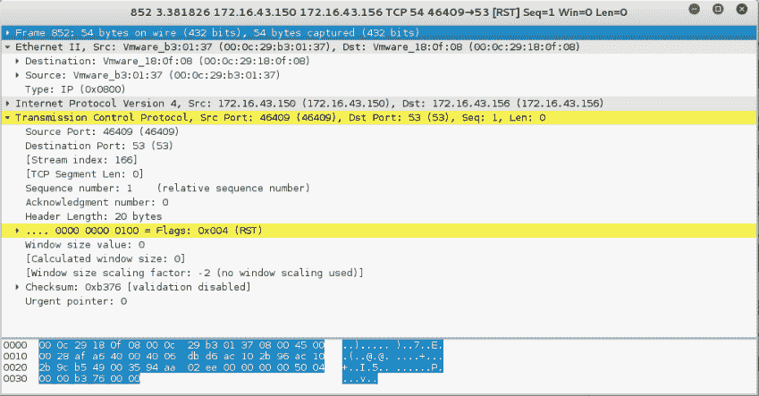

如果远程机器响应，响应数据包将类似于以下代码：

```
22:36:19.939881 IP 172.16.43.150.1720 >172.16.43.156.47823: Flags [R.], seq 0, ack 1053563675, win 0, length 0 
  0x0000:  4500 0028 0000 4000 4006 48b2 c0a8 3867  E..(..@.@.H...8g 
  0x0010:  c0a8 3866 06b8 bacf 0000 0000 3ecc 1b1b  ..8f........>... 
  0x0020:  5014 0000 a243 0000 0000 0000 0000       P....C........ 
```

注意，发送的标志由字符`R`表示，该字符被重置。表示目标机器中的端口`1720`已关闭。我们可以用前面的 Nmap 结果来验证这一点。

但是，如果端口打开，您将看到以下网络流量：

```
22:42:12.108741 IP 172.16.43.156.23 >172.16.43.150.49270:Flags [S.], seq 1611132106, ack 239440323, win 5840,options [mss 1460], length 0 
  0x0000:  4500 002c 0000 4000 4006 48ae c0a8 3867  E..,..@.@.H...8g 
  0x0010:  c0a8 3866 0017 c076 6007 ecca 0e45 91c3  ..8f...v`....E.. 
  0x0020:  6012 16d0 e1bf 0000 0204 05b4 0000 
```

您可以看到，前面代码中的数据包用于确认显示的前一个数据包的序列号。此数据包的确认号为`239440323`，而前一个数据包的序列号为`239440322`。

# Nmap TCP 扫描选项

为了能够使用大多数 TCP 扫描选项，Nmap 需要一个特权用户（Unix 世界中的根级别帐户或 Windows 世界中的管理员级别帐户）。这用于发送和接收原始数据包。默认情况下，Nmap 将使用 TCP SYN 扫描，但如果 Nmap 没有特权用户，则将使用 TCP connect 扫描。Nmap 使用的各种扫描如下所示：

*   **TCP 连接扫描（**`-sT`**：此选项将完成与每个目标端口的三方握手。如果连接成功，则认为端口已打开。由于需要对每个端口执行三向握手，因此此扫描类型速度较慢，很可能由目标系统记录。如果 Nmap 由没有任何权限的用户运行，则使用此默认扫描选项。**
***   **同步扫描**`-sS`**：该选项也称为**半开**或**同步隐形**。使用此选项，Nmap 发送一个 SYN 数据包，然后等待响应。SYN/ACK 响应表示端口正在侦听，而 RST/ACK 响应表示端口未侦听。如果没有响应或 ICMP 无法访问错误消息响应，则认为端口已被过滤。这种扫描类型可以快速执行，而且，由于三方握手从未完成，因此它不引人注目且隐蔽。如果以特权用户身份运行 Nmap，则这是默认扫描选项。****

 *****   **TCP 空扫描（**`-sN`**）、FIN 扫描（**`-sF`**）和圣诞节扫描（**`-sX`**）：`NULL`扫描没有设置任何控制位。FIN 扫描仅设置 FIN 标志位，`XMAS`扫描设置 FIN、`PSH`和 URG 标志。如果作为响应接收到 RST 数据包，则认为端口已关闭，而无响应表示端口已打开/过滤。**
***   **TCP Maimon 扫描（**`-sM`**：TCP Maimon 扫描由 Uriel Maimon 发现。这种类型的扫描将发送设置了 FIN/ACK 标志位的数据包。BSD 派生的系统将在端口打开时丢弃数据包，并在端口关闭时用 RST 响应。*****   **TCP ACK 扫描（**`-sA`**：此扫描类型用于确定防火墙是否有状态，以及过滤哪些端口。这种类型的网络数据包只设置 ACK 位。如果返回 RST，则表示目标未过滤。*****   **TCP 窗口扫描（**`-sW`**：该扫描类型通过检查 RST 数据包响应的 TCP 窗口字段来工作。打开的端口将具有正的**TCP 窗口**值，而关闭的端口将具有零 TCP 窗口值。*****   **TCP 空闲扫描（**`-sI`**：使用此技术，您的机器不会向目标发送数据包；相反，扫描将跳转到您指定的僵尸主机。IDS 会将僵尸报告为攻击者。*****   Nmap 还支持您创建自己的自定义 TCP 扫描，方法是为您提供**扫描标志**选项。该选项的参数可以是数字，例如 PSH 和 FIN 的`9`或符号名称。只需将 URG、ACK、PSH、RST、SYN、FIN、ECE、CWR、ALL 和 NONE 的任意组合按任何顺序组合在一起；例如，`--scanflags URGACKPSH`将设置标志 URG、ACK 和 PSH。**************  ****# 禁用主机发现

如果主机正在阻止 ping 请求，Nmap 可能会检测到该主机未处于活动状态；因此，Nmap 可能不会执行繁重的探测，例如端口扫描、版本检测和操作系统检测。为了克服这一问题，Nmap 具有禁用主机发现的功能。使用此选项，Nmap 将假定目标机器可用，并将对该机器执行大量探测。

使用`-Pn`选项激活此选项。

# Nmap UDP 扫描选项

虽然 TCP 扫描有多种类型的扫描，但 UDP 扫描只有一种类型，即 UDP 扫描（`-sU`。尽管 UDP 扫描不如 TCP 扫描可靠，但作为渗透测试人员，您不应该忽略此扫描，因为这些 UDP 端口上可能有有趣的服务。

UDP 扫描的最大问题是如何快速执行扫描。Linux 内核将`ICMP Port Unreachable`消息的发送限制为每秒一条消息。对机器执行 65536 个端口的 UDP 扫描需要 18 个多小时才能完成。

为了帮助缓解此问题，可以使用以下几种方法：

*   并行运行 UDP 扫描
*   首先扫描最流行的端口
*   在防火墙后面扫描
*   将`--host-timeout`选项设置为跳过慢速主机

这些方法有助于减少进行 UDP 端口扫描所需的时间。

让我们看一个场景，其中我们希望找到目标机器上打开的 UDP 端口。为了加快扫描过程，我们将只检查端口`53`（DNS）和`161`（SNMP）。以下是用于执行此操作的命令：

```
nmap -sU 172.16.43.156 -p 53,161  
```

以下是此命令的结果：

```
Nmap scan report for 172.16.43.156
Host is up (0.0016s latency).
PORT    STATE  SERVICE
53/udp  open   domain
161/udp closed snmp  
```

# Nmap 端口规范

在默认配置中，Nmap 仅随机扫描每个协议的 1000 个最常见端口。`nmap-services`文件包含选择顶级端口的流行度分数。

要更改该配置，Nmap 提供了几个选项：

*   `-p`**端口范围**：只扫描定义的端口。扫描端口`1`至`1024`，命令为`-p 1-1024`。扫描端口`1`至`65535`，命令为`-p-`。
*   `-F`**（快速）**：这将只扫描 100 个公共端口。
*   `-r`**（不随机化端口）**：此选项将设置顺序端口扫描（从最低到最高）。
*   `--top-ports <1 or greater>`：此选项将只扫描在`nmap-service`文件中找到的`N`比率最高的端口。

要使用 TCP NULL 扫描方法扫描端口`22`和`25`，可以使用以下命令：

```
nmap -sN -p 22,25 172.16.43.156 
```

结果显示以下命令行：

```
    Nmap scan report for 172.16.43.156
    Host is up (0.00089s latency).
    PORT     STATE         SERVICE
    22/tcp   open|filtered ssh
    25/tcp   open|filtered smtp
    MAC Address: 00:0C:29:18:0F:08 (VMware)
    Nmap done: 1 IP address (1 host up) scanned in 1.52 seconds
```

以下是数据包的转储片段：

```
23:23:38.581818 IP 172.16.43.150.61870 >172.16.43.156.22: Flags [], win 1024, length 0 
  0x0000:  4500 0028 06e4 0000 2f06 92ce c0a8 3866  E..(..../.....8f 
  0x0010:  c0a8 3867 f1ae 0016 dd9e bf90 0000 0000  ..8g............ 
  0x0020:  5000 0400 2ad2 0000                      P...*... 

23:23:38.581866 IP 172.16.43.150.61870 >172.16.43.156.25: Flags [], win 1024, length 0 
  0x0000:  4500 0028 1117 0000 3106 869b c0a8 3866  E..(....1.....8f 
  0x0010:  c0a8 3867 f1ae 0019 dd9e bf90 0000 0000  ..8g............ 
  0x0020:  5000 0400 2acf 0000                      P...*... 

23:23:39.683483 IP 172.16.43.150.61871 >172.16.43.156.25: Flags [], win 1024, length 0 
  0x0000:  4500 0028 afaf 0000 2706 f202 c0a8 3866  E..(....'.....8f 
  0x0010:  c0a8 3867 f1af 0019 dd9f bf91 0000 0000  ..8g............ 
  0x0020:  5000 0400 2acc 0000                      P...*... 

23:23:39.683731 IP 172.16.43.150.61871 >172.16.43.156.22: Flags [], win 1024, length 0 
  0x0000:  4500 0028 5488 0000 3506 3f2a c0a8 3866  E..(T...5.?*..8f 
  0x0010:  c0a8 3867 f1af 0016 dd9f bf91 0000 0000  ..8g............ 
  0x0020:  5000 0400 2acf 0000                      P...*...   
```

从前面代码中显示的数据包中，我们可以看到以下内容：

*   在第一个和第二个数据包中，攻击机器检查目标机器上的端口`22`是否打开。一段时间后，检查目标机器上的端口`25`。
*   在第三和第四个数据包中，攻击机器检查目标机器上的端口`25`是否打开。一段时间后，检查目标机器上的端口`22`。
*   等待一段时间后，由于目标计算机仍然没有响应，Nmap 断定这两个端口已打开或已过滤。

# Nmap 输出选项

Nmap 结果可以保存到外部文件中。如果要使用其他工具处理 Nmap 结果，此选项非常有用。即使将输出保存到文件中，Nmap 仍会在屏幕上显示结果。

Nmap 支持多种输出格式，如下所示：

*   **交互输出**：默认输出格式，结果发送到标准输出。
*   **正常输出（**`-oN`**：此格式类似于交互输出，但不包含运行时信息和警告。**
***   **XML 输出（**`-oX`**：此格式可以转换为 HTML 格式，由 Nmap 图形用户界面（GUI）解析，或导入数据库。我们建议您尽可能多地使用此输出格式。*****   **可分组输出（**`-oG`**：该格式已被弃用，但仍相当流行。可归格输出由注释（以磅符号（`#`开头的行）和目标行组成。目标行包括六个标记字段的组合，这些字段由制表符分隔，后跟冒号。字段为`Host`、`Ports`、`Protocols`、`Ignored State`、`OS`、`Seq Index`、`IP ID Seq`和`Status`。如果我们想使用 UNIX 命令（如`grep`和`awk`）处理 Nmap 输出，有时会使用此输出。******

 ******您可以使用`-oA`选项以三种格式（普通、XML 和可搜索）一次性保存 Nmap 结果。

要将扫描结果保存到 XML 文件（`myscan.xml`，请使用以下命令：

```
nmap 172.16.43.156 -oX myscan.xml  
```

以下是 XML 文件的一个片段：

```
<?xml version="1.0" encoding="UTF-8"?> 
<!DOCTYPE nmaprun> 
<?xml-stylesheet href="file:///usr/bin/../share/nmap/nmap.xsl" type="text/xsl"?> 
<!-- Nmap 6.49BETA4 scan initiated Mon Feb 15 18:06:20 2016 as: nmap -oX metasploitablescan.xml 172.16.43.156 --> 
<nmaprun scanner="nmap" args="nmap -oX metasploitablescan.xml 172.16.43.156" start="1455588380" startstr="Mon Feb 15 18:06:20 2016" version="6.49BETA4" 
<scaninfo type="syn" protocol="tcp" numservices="1000" services="1,3-4,6-7,9,13,17,19-26,30,32-33,37,42-43,49,53,70,79-85,88-90,99-100,106,109-111,113,119,125,135,139,143-144,146,161,163,179,199,211-212,222,254-256,259,264,280,301,306,311,340,366,389,406-407,416-417,425,427,443-445,458,464-465,481,497,500,512-515,524,541,543-545,548,554-555,563,587,593,616-617,625,631,636,646,648,666-668,683,687,691,700, 
```

为了简洁起见，从前面的代码段中删除了许多端口。在 XML 输出中，您将看到 Nmap 扫描的每个端口。下面显示了分别扫描的每个端口以及响应。同样，为简洁起见，未包括所有端口：

```
    <verbose level="0"/>
    <debugging level="0"/>
    <host starttime="1455588380" endtime="1455588382"><status state="up" reason="arp-response" reason_ttl="0"/>
    <address addr="172.16.43.156" addrtype="ipv4"/>
    <address addr="00:0C:29:18:0F:08" addrtype="mac" vendor="VMware"/>
    <hostnames>
    </hostnames>
    <ports><extraports state="closed" count="977">
    <extrareasons reason="resets" count="977"/>
    </extraports>
    <port protocol="tcp" portid="21"><state state="open" reason="syn-ack" reason_ttl="64"/><service name="ftp" method="table" conf="3"/></port>
    <port protocol="tcp" portid="22"><state state="open" reason="syn-ack" reason_ttl="64"/><service name="ssh" method="table" conf="3"/></port>
    <port protocol="tcp" portid="23"><state state="open" reason="syn-ack" reason_ttl="64"/><service name="telnet" method="table" conf="3"/></port>
    <port protocol="tcp" portid="25"><state state="open" reason="syn-ack" reason_ttl="64"/><service name="smtp" method="table" conf="3"/></port>
    <port protocol="tcp" portid="53"><state state="open" reason="syn-ack" reason_ttl="64"/><service name="domain" method="table" conf="3"/></port>
    <port protocol="tcp" portid="80"><state state="open" reason="syn-ack" reason_ttl="64"/><service name="http" method="table" conf="3"/></port>
    <port protocol="tcp" portid="111"><state state="open" reason="syn-ack" reason_ttl="64"/><service name="rpcbind" method="table" conf="3"/></port>
    <port protocol="tcp" portid="139"><state state="open" reason="syn-ack" reason_ttl="64"/><service name="netbios-ssn" method="table" conf="3"/></port>

```

XML 输出有点让人望而生畏。为了方便起见，可以将 Nmap XML 文件转换为 HTML。这样，您就可以使用干净的输出进行报告，因为您可能报告的一些非技术人员可能不习惯查看原始输出。要转换 XML 文件，可以使用`xsltproc`程序。以下命令用于将 XML 文件转换为 HTML 文件：

```
xsltproc myscan.xml -o myscan.html 
```

以下是 HTML 报告的一部分，由 Kali Linux 中包含的 Firefox ESR 浏览器显示：

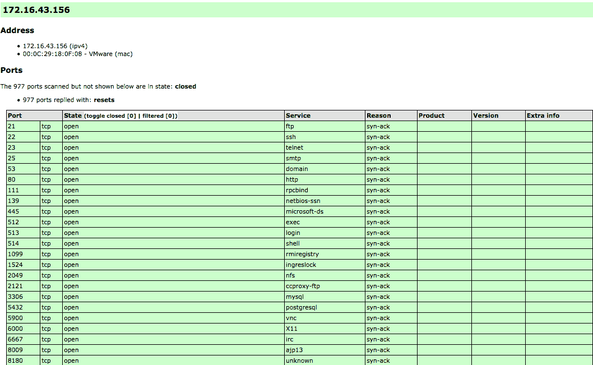

如果您希望根据自己的喜好处理 Nmap XML 输出，那么有几种编程语言通用 XML 库可用于此目的。此外，还有几个专门开发用于处理 Nmap 输出的库：

*   **Perl**：Nmap 解析器（[http://search.cpan.org/dist/Nmap-Parser/](http://search.cpan.org/dist/Nmap-Parser/)
*   **Python**：Python nmap（[http://xael.org/norman/python/python-nmap/](http://xael.org/norman/python/python-nmap/)
*   **Ruby**：Ruby Nmap（[http://rubynmap.sourceforge.net/](http://rubynmap.sourceforge.net/)
*   **PowerShell**：解析 Nmap XML 输出的 PowerShell 脚本（[http://www.sans.org/windows-security/2009/06/11/powershell-script-to-parse-nmap-xml-output](http://www.sans.org/windows-security/2009/06/11/powershell-script-to-parse-nmap-xml-output)******  ****# Nmap 定时选项

Nmap 提供了六种计时模式，您可以使用选项（`-T`进行设置：

*   `paranoid (0)`：在这种定时模式下，每五分钟发送一个数据包。这些数据包是串行发送的。此模式有助于避免 IDS 检测。
*   `sneaky (1)`：该模式每 15 秒发送一个数据包，没有并行发送的数据包。
*   `polite (2)`：该模式每 0.4 秒发送一个数据包，没有并行传输。
*   `normal (3)`：该模式同时向多个目标发送多个数据包。这是 Nmap 使用的默认计时模式。它平衡了时间和网络负载。
*   `aggressive (4)`：Nmap 将只扫描给定主机五分钟，然后再移动到下一个目标。Nmap 等待响应的时间不会超过 1.25 秒。
*   `insane (5)`：在此模式下，Nmap 只扫描给定主机 75 秒，然后再移动到下一个目标。Nmap 等待响应的时间不会超过 0.3 秒。

根据我们的经验，默认定时模式通常运行良好，除非您希望进行更隐蔽或更快的扫描。

# 有用的 Nmap 选项

在本节中，我们将讨论在进行渗透测试工作时非常有用的几个 Nmap 选项。

# 服务版本检测

在进行端口扫描时，还可以要求 Nmap 检查服务版本。当您稍后执行漏洞识别过程时，此信息非常有用。

要使用此功能，请为 Nmap 提供`-sV`选项。

下面是此功能使用的示例。我们想找到端口`22`上使用的软件版本：

```
    nmap -sV 172.16.43.156 -p 22
```

以下是此命令的结果：

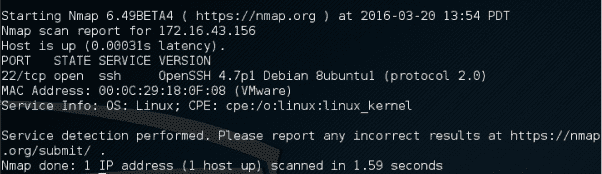

从前面的信息中，我们知道在端口`22`上有一个使用`OpenSSH`软件版本 4.7p1 的 SSH 服务，SSH 协议为`2.0`。

# 操作系统检测

还可以要求 Nmap 检查目标机器上使用的操作系统。当您稍后执行漏洞识别过程时，此信息非常有用。

要使用此功能，请为 Nmap 提供`-O`选项。

以下是此功能使用的示例。我们希望找到目标计算机上使用的操作系统：

```
    nmap -O 172.16.43.156 
```

以下命令行是此命令的结果：

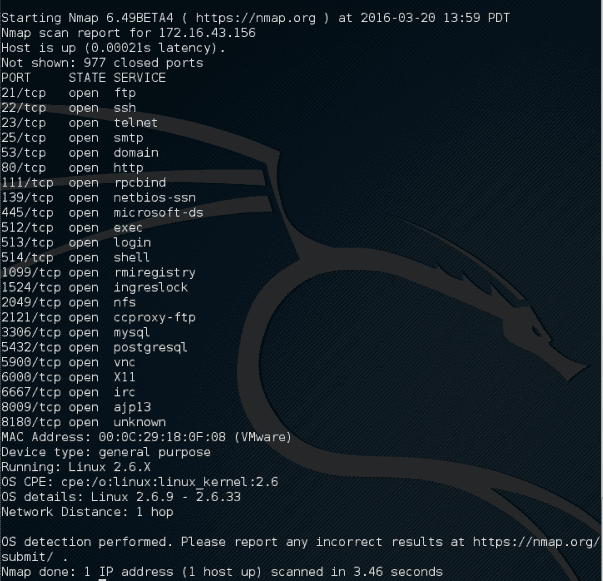

根据前面的信息，我们可以看到远程系统是一个使用 Linux 内核版本`2.6.9 - 2.6.33`的 Linux 操作系统。如果这些 Linux 内核上存在漏洞，我们可以利用它们。

# 主动扫描

如果您使用`-A`选项，它将启用以下探针：

*   服务版本检测（`-sV`
*   操作系统检测（`-O`）
*   脚本扫描（`-sC`
*   示踪路由（`--traceroute`）

此扫描类型可能需要一些时间才能完成。以下命令可用于主动扫描：

```
    nmap -A 172.16.43.156
```

以下是该命令的简要结果：


除了有关端口、服务和证书的详细信息外，我们还将进一步获得有关此目标计算机上配置的 Apache Web 服务器的详细信息：


# 用于扫描 IPv6 目标的 Nmap

在上一节中，我们提到可以在 Nmap 中指定 IPv6 目标。在本节中，我们将对此进行深入讨论。

对于此场景，以下是涉及的每台计算机的 IPv6 地址：

```
    Target machine: fe80::20c:29ff:fe18:f08
```

要扫描 IPv6 目标，只需使用`-6`选项并定义 IPv6 目标地址。目前，您只能指定单个 IPv6 地址。以下是端口扫描 IPv6 地址的示例命令：

```
    nmap -6 fe80::20c:29ff:fe18:f08
```

以下是此命令的结果：


我们可以看到，在 IPv6 测试中，打开的端口数少于 IPv4 测试中的端口数。这可能是因为远程计算机上的服务尚不支持 IPv6。

# 使用 Netdiscover 进行扫描

Netdiscover 是另一种发现工具，内置于 Kali Linux 2018.2 中。目前是.03-pre-beta7 版本，由 Jaime Penalba 编写，Netdiscover 可以使用 ARP 请求在无线和交换网络上改革侦察和发现。

要启动 Netdiscover，请键入`netdiscover –h`以查看使用选项。（如果您仅键入`netdiscover`命令本身，Netdiscover 将启动默认扫描。）

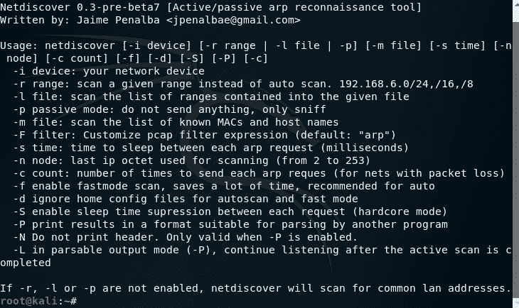

要扫描 IP 范围，请键入`netdiscover –r`，后跟 IP 范围。在这个例子中，我们使用了`netdiscover –r 10.10.0.0/24`。您也可以选择使用`netdiscover –p`选项进行被动扫描：

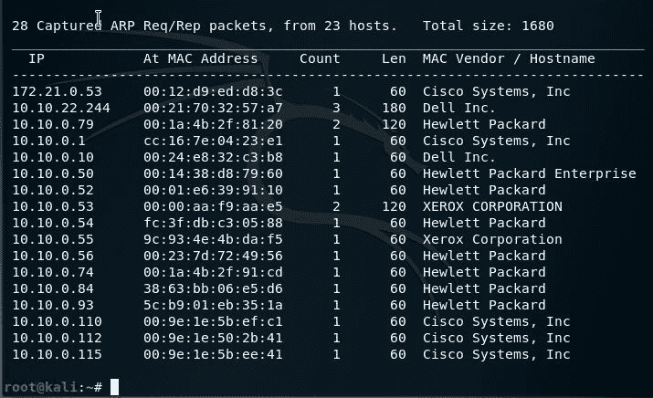

在前面的扫描中，我们可以看到发现包括 Dell 和 HP 工作站、Cisco 设备，甚至包括 Xerox 多功能设备。

# Nmap 脚本引擎

尽管 Nmap 本身已经成为一个强大的网络探索工具，但通过额外的脚本引擎功能，Nmap 成为了一个更强大的工具。使用**Nmap 脚本引擎**（**NSE**），用户可以自动执行各种网络任务，例如检查应用程序中的新安全漏洞、检测应用程序版本或 Nmap 中不可用的其他功能。Nmap 已经在它的包中包含了各种 NSE 脚本，但是用户也可以编写自己的脚本来满足他们的需要。

NSE 脚本使用 Lua 编程语言（[http://www.lua.org](http://www.lua.org) ）嵌入 Nmap，目前 NSE 脚本分类如下：

*   `auth`：此类脚本用于查找目标系统上设置的认证；例如，通过使用蛮力技术。
    *   `default`：这些脚本使用`-sC`或`-A`选项运行。如果脚本满足以下要求，则将其分组为默认类别：
    *   一定很快
    *   它需要产生有价值和可操作的信息
    *   它的输出需要冗长和简洁
    *   它必须是可靠的
    *   它不应该侵入目标系统
    *   它应该向第三方泄露信息
*   `discovery`：这些脚本用于查找网络。
*   **DoS**：此类脚本可能会在目标系统上造成**拒绝服务**（**DoS**）。请小心使用。
*   `exploit`：这些脚本将利用目标系统上的安全漏洞进行攻击。渗透测试人员需要有在目标系统上运行这些脚本的权限。
*   `external`：这些脚本可能会向第三方泄露信息。
*   `fuzzer`：这些脚本用于对目标系统进行模糊处理。
*   `intrusive`：这些脚本可能导致目标系统崩溃或使用目标系统的所有资源。
*   `malware`：这些脚本将检查目标系统上是否存在恶意软件或后门。
*   `safe`：这些脚本不应导致服务崩溃、**拒绝服务**（**DoS**）或攻击目标系统。
*   `version`：这些脚本与版本检测选项（`-sV`一起使用，对目标系统上的服务进行高级检测。
*   `vuln`：这些脚本用于检查目标系统上的安全漏洞。

在 Kali Linux 中，这些 Nmap 脚本位于`the /usr/share/nmap/scripts`目录中，目前，Kali Linux 附带的 Nmap 版本 7.70 包含 588 个脚本。

有几个命令行参数可用于调用 NSE，如下所示：

*   `-sC or --script=default`：使用默认脚本执行扫描。
*   `--script <filename> | <category> | <directories>`：使用文件名、类别或目录中定义的脚本执行扫描。
*   `--script-args <args>`：提供一个脚本参数。这些参数的一个例子是用户名或密码（如果您使用`auth`类别）。

要对`172.16.43.156`主机进行端口扫描并使用默认脚本类别，我们可以发出以下命令：

```
    nmap -sC 172.16.43.156

```

以下是简要结果：

```
    Starting Nmap 6.49BETA4 ( https://nmap.org ) at 2016-02-22 17:09 PST
    Nmap scan report for 172.16.43.156
    Host is up (0.000099s latency).
    Not shown: 977 closed ports
    PORT     STATE SERVICE
    21/tcp   open  ftp
    |_ftp-anon: Anonymous FTP login allowed (FTP code 230)
    22/tcp   open  ssh
    | ssh-hostkey: 
    |   1024 60:0f:cf:e1:c0:5f:6a:74:d6:90:24:fa:c4:d5:6c:cd (DSA)
    |_  2048 56:56:24:0f:21:1d:de:a7:2b:ae:61:b1:24:3d:e8:f3 (RSA)
    23/tcp   open  telnet
    25/tcp   open  smtp
    |_smtp-commands: metasploitable.localdomain, PIPELINING, SIZE 10240000, VRFY, ETRN, STARTTLS, ENHANCEDSTATUSCODES, 8BITMIME, DSN, 
    | ssl-cert: Subject: commonName=ubuntu804-base.localdomain/organizationName=OCOSA/stateOrProvinceName=There is no such thing outside US/countryName=XX
    | Not valid before: 2010-03-17T14:07:45
    |_Not valid after:  2010-04-16T14:07:45
    |_ssl-date: 2016-02-12T05:51:52+00:00; -10d19h17m25s from scanner time.
    53/tcp   open  domain
    | dns-nsid: 
    |_  bind.version: 9.4.2
    80/tcp   open  http
    |_http-methods: No Allow or Public header in OPTIONS response (status code 200)
    |_http-title: Metasploitable2 - Linux
    8009/tcp open  ajp13
    |_ajp-methods: Failed to get a valid response for the OPTION request
    8180/tcp open  unknown
    |_http-favicon: Apache Tomcat
    |_http-methods: No Allow or Public header in OPTIONS response (status code 200)
    |_http-title: Apache Tomcat/5.5
    MAC Address: 00:0C:29:18:0F:08 (VMware)

    Host script results:
    |_nbstat: NetBIOS name: METASPLOITABLE, NetBIOS user: <unknown>, NetBIOS MAC: <unknown> (unknown)
    | smb-os-discovery: 
    |   OS: Unix (Samba 3.0.20-Debian)
    |   NetBIOS computer name: 
    |   Workgroup: WORKGROUP
    |_  System time: 2016-02-12T00:51:49-05:00

    Nmap done: 1 IP address (1 host up) scanned in 12.76 seconds

```

从前面的信息中，您可以看到 Nmap 结果现在更全面了。这是因为它使用了 NSE 默认脚本。

但是，如果您只需要有关目标系统的特定信息，则可以单独使用脚本。如果我们想收集关于 HTTP 服务器的信息，我们可以在 NSE 中使用几个 HTTP 脚本，例如`http-enum`、`http-headers`、`http-methods`、`http-php-version`，使用以下命令：

```
    nmap --script http-enum,http-headers,http-methods,http-php-version -p 80 172.16.43.156  
```

以下是此命令的结果：


通过使用与 HTTP 相关的四个 NSE 脚本，我们获得了有关目标系统 web 服务器的更多信息：

*   有几个有趣的目录需要检查：`Tikiwiki`、`test`和`phpMyAdmin`
*   我们有一个有趣的文件：`phpinfo.php`
*   我们知道服务器使用的是 PHP 版本`5.2.3 -5.2.5`

在讨论 Nmap 之后，让我们讨论另一个端口扫描工具。

有一个有用的 NSE 脚本称为 Nmap NSE Vulscan（[http://www.computec.ch/mruef/software/nmap_nse_vulscan-1.0.tar.gz](http://www.computec.ch/mruef/software/nmap_nse_vulscan-1.0.tar.gz) ），可帮助您将从目标机器获得的版本信息映射到漏洞数据库，如 CVE（[http://cve.mitre.org/](http://cve.mitre.org/) 、VulDB（[https://vuldb.com/?](https://vuldb.com/?) 、SecurityTracker（[http://securitytracker.com/](http://securitytracker.com/) 和 SecurityFocus（[http://www.securityfocus.com/](http://www.securityfocus.com/) 。

以下屏幕截图显示了 CVE 脚本的示例结果：

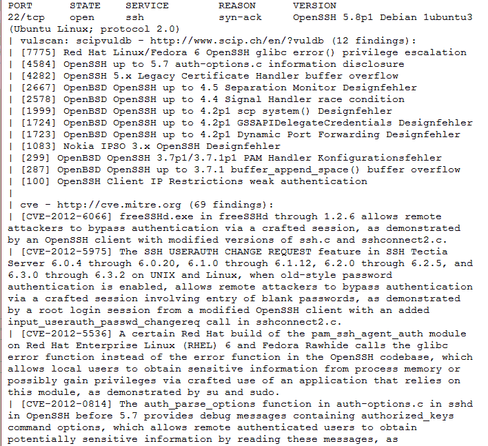

# 用于防火墙/IDS 规避的 Nmap 选项

在渗透测试期间，您可能会遇到使用防火墙和 IDS 保护系统的系统。如果仅使用默认设置，则可能会检测到您的操作，或者可能无法从 Nmap 获得正确的结果。以下选项可用于帮助您避开防火墙/IDS：

*   `-f`**（片段数据包）**：此选项的目的是使数据包更难检测。通过指定此选项一次，Nmap 将在 IP 头之后将数据包拆分为 8 个字节或更少的字节。
*   `--mtu`：使用此选项，您可以指定自己的数据包大小。**最大传输单元**（**MTU**必须是 8 的倍数，否则 Nmap 将给出错误并退出。
*   `-D`**（诱饵）**：通过使用此选项，Nmap 将从用户指定的伪造 IP 地址发送一些探测。其思想是在日志文件中屏蔽用户的真实 IP 地址。用户 IP 地址仍在日志中。您可以使用`RND`生成随机 IP 地址，也可以使用`RND:number`生成`<number>`IP 地址。用于诱饵的主机应该启动，否则会淹没目标。还请记住，通过使用许多诱饵，您可能会导致网络拥塞，因此您可能希望避免这种情况，尤其是在扫描客户端网络时。
*   `--source-port <portnumber> or -g (spoof source port)`：如果防火墙设置为允许来自特定端口的所有传入流量，则此选项将非常有用。
*   `--data-length`：此选项用于更改 Nmap 发送的默认数据长度，以避免被检测为 Nmap 扫描。
*   `--max-parallelism`：此选项通常设置为一，以指示 Nmap 一次向目标主机发送不超过一个探测器。
*   `--scan-delay <time>`：此选项可用于规避使用阈值检测端口扫描活动的 IDS/IPS。

如 Nmap 手册（[中所述，您还可以尝试使用其他 Nmap 选项进行规避 http://nmap.org/book/man-bypass-firewalls-ids.html](http://nmap.org/book/man-bypass-firewalls-ids.html) ）。

# 带锁扣的自动扫描

Striker 是 Python 内置的自动扫描和深度信息收集工具，它执行端口/服务和漏洞扫描。与我们在前一章中使用的自动化工具（Red_Hawk 和 Devploit）非常相似，Striker 的安装和使用非常简单。

我们必须先下载《前锋》。要执行此操作，请打开终端并通过键入以下内容更改为`Desktop`（或您选择的目录）：

```
cd Desktop
```

输入以下内容以将 Striker 克隆到桌面或（或您选择的目录）：

```
git clone https://github.com/s0md3v/Striker.git
```

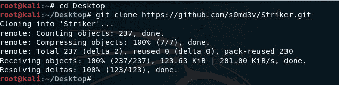

下载成功后（如前一个屏幕截图所示，对象和增量为 100%），通过键入`cd Striker`，然后使用`ls`命令列出 Striker 文件夹中的文件，切换到 Striker 目录。您应该会看到列出的五个文件，包括`requirements.txt`和`striker.py`。


为了使 Striker 运行无误，我们必须首先使用软件包管理安装程序（`pip`，以确保满足运行 Striker 所需的所有要求，包括 Whois 模块（信息收集所需）。

为此，我们运行以下两个命令，`pip install -r requirements.txt`后跟`pip install whois`：

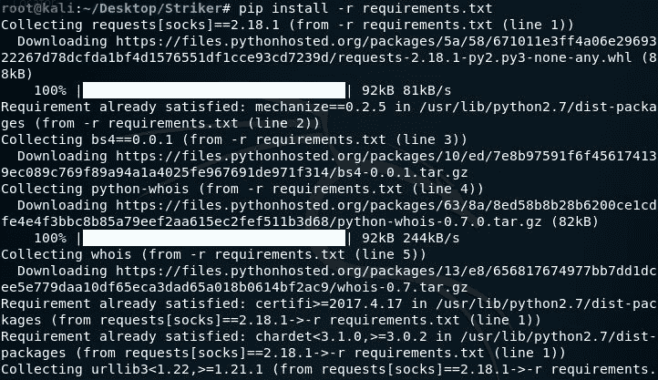

成功安装所有要求后，键入`pip install whois`（即使要求可能已经安装）：


最后，要运行 Striker，我们输入`python striker.py`：


前锋 GUI 现在将运行。作为一个完全自动化的工具，从这一点开始所需要的只是目标 IP 或 URL。

在本例中，我们使用了[http://scanme.nmap.org/](http://scanme.nmap.org/) Nmap 扫描部分使用的网站。将扫描结果与 Nmap 先前发现的结果进行比较：


请注意，Striker 还找到了 DNS 记录信息以及两个电子邮件地址，如以下屏幕截图所示：

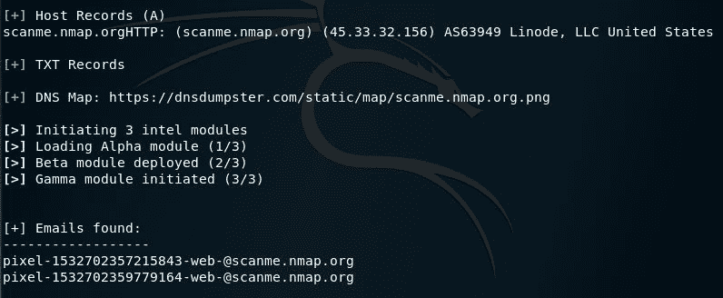

# 使用 Nipe 的匿名性

Nipe 是一种工具，它利用 Tor 网络作为用户的默认网关，从而通过 Tor 网络路由所有流量，Tor 网络通常用于提供某种程度的隐私和匿名性。应注意，当使用隐私和匿名工具时，仅屏蔽 IP 地址不会提供匿名性，因为 DNS 信息可能仍然可用。必须屏蔽 IP 和 DNS 信息。

我们首先通过将 Nipe 克隆到您选择的桌面或目录上的机器上来安装 Nipe。打开终端并将目录更改为桌面（或您选择的目录）：

```
Cd Desktop
```

通过键入以下命令将 Nipe 克隆到您的计算机：

```
git clone https://github.com/GouveaHeitor/nipe.git
```

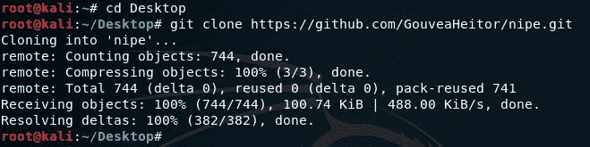

键入`cd Nipe`切换到 Nipe 目录，然后键入`ls`列出目录的内容：


要安装 Nipe，请键入`cpan install Switch JSON LWP::UserAgent`。当提示执行自动安装时，按*进入*：


要安装 Nipe 依赖项，请运行命令`perl nipe.pl install`：

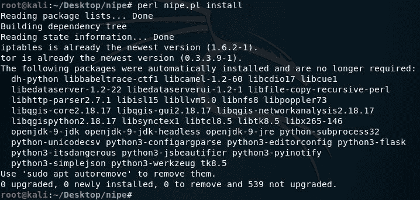

在启动 Nipe 之前，请检查您的公共 IP 地址和 DNS IP，并在启动 Nipe 后将它们与给定的 IP 进行比较。可用于查看公共 IP 的网站示例有[www.whatsmyipaddress.com](http://www.whatsmyipaddress.com)和[www.dnsleak.com](http://www.dnsleak.com)

要启动 Nipe 服务类型`perl nipe.pl start`：


您也可以重新启动服务，通过键入`perl nipe.pl restart`将您的 IP 屏蔽到不同的区域。用于安装和使用 Nipe 工具的所有命令也可以在其 GitHub 页面的[上找到 https://github.com/GouveaHeitor/nipe](https://github.com/GouveaHeitor/nipe)

使用前面列出的 IP 和 DNS 验证网站检查您的设置是否确实已更改。

# 总结

在本章中，我们讨论了目标发现过程。我们首先讨论了目标发现的目的：识别目标机器并找出目标机器使用的操作系统。然后，我们继续使用 Kali Linux 和 GitHub 附带的工具，这些工具可用于发现和识别目标机器。

我们讨论了几种主机发现和扫描工具，如`ping`、Nmap、`p0f`和 Striker，还研究了使用 Nipe 屏蔽 IP 和 DNS 以逃避检测。

在下一章中，我们将讨论漏洞扫描和可在 Kali Linux 中用于此目的的工具。

# 问题

1.  哪种工具可用于同时向多个主机发送 ICMP 回显请求？（`fping`
2.  Nmap 7.7 中有多少脚本可用？（588 个脚本）
3.  FIN 标志的用途是什么？（这表示没有更多的数据要发送，连接应该终止。）
4.  过滤端口表示什么？（数据包阻止设备阻止探测器到达目标。）
5.  在躲避防火墙和 ID 时，哪个 Nmap 选项可以使检测数据包变得更加困难？（`-f`，用于对数据包进行分段）
6.  使用 Netdiscover 工具扫描一系列 IP 时使用的命令是什么？（netdiscover`-r`
7.  Netdiscover 中可以使用哪个选项来运行被动扫描？（`-p`
8.  哪个网站可以用来确保 DNS 信息不被泄露？（[www.dnsleak.com](http://www.dnsleak.com/)

# 进一步阅读

Linux 网络工具：[https://gist.github.com/miglen/70765e663c48ae0544da08c07006791f](https://gist.github.com/miglen/70765e663c48ae0544da08c07006791f)

Nmap 脚本引擎：[https://nmap.org/book/nse.html](https://nmap.org/book/nse.html)

端口扫描技术：[https://nmap.org/book/man-port-scanning-techniques.html](https://nmap.org/book/man-port-scanning-techniques.html)******************