# 六、漏洞扫描

漏洞映射是识别和分析目标环境中关键安全缺陷的过程。这有时也称为脆弱性评估。它是漏洞管理计划的关键领域之一，通过它可以针对已知漏洞分析 It 基础设施的安全控制。一旦信息收集、发现和枚举的操作完成，就应该调查目标基础架构中可能导致危害目标并破坏业务系统机密性、完整性和可用性的漏洞。

在本章中，我们将讨论两种常见的漏洞类型，介绍各种漏洞分类标准，并解释 Kali Linux 操作系统下提供的一些著名漏洞评估工具。本章探讨以下主题：

*   两种通用漏洞类型的概念：本地和远程。
*   指向行业标准的漏洞分类法，可用于根据统一的通用模式对任何漏洞进行分类。
*   许多安全工具可以帮助我们发现和分析目标环境中存在的安全漏洞。本文介绍的工具根据其在安全评估过程中的基本功能进行分类。这些工具包括 Nessus、Cisco、模糊化工具、SMB、SNMP 和 web 应用分析工具。

请注意，在处理任何类型的渗透测试任务（无论是内部还是外部）时，应平等对待手动和自动漏洞评估程序。严格依靠自动化有时会产生误报和漏报。在进行渗透测试时，审计师对技术相关评估工具的了解程度可能是一个决定因素。应不断更新所使用的工具和测试人员的技能，以确保成功。此外，有必要提及的是，自动脆弱性评估不是最终解决方案；在某些情况下，自动化工具无法识别逻辑错误、未发现的漏洞、未发布的软件漏洞以及影响安全性的人为变量。

因此，建议使用综合方法，利用自动和手动漏洞评估方法。这将提高渗透测试成功的概率，并提供纠正漏洞的最佳信息。

# 技术要求

笔记本电脑或台式机，至少有 6 GB RAM、四核 CPU 和 500 GB 硬盘空间。对于操作系统，我们将使用 Kali Linux 2018.2 或 2018.3（作为虚拟机，或安装在 HDD、SD 卡或 USB 闪存驱动器上）。

# 漏洞类型

有三类主要的漏洞，通过它们可以区分本地和远程缺陷的类型。这些类别通常分为设计、实施和操作漏洞类别：

*   **设计漏洞**：这些漏洞是由于软件规范中发现的缺陷而发现的。
*   **实现漏洞**：这些是在系统代码中发现的技术安全漏洞。
*   **操作漏洞**：这些漏洞可能是由于系统在特定环境中配置和部署不当而产生的。

基于这三个类别，我们有两种通用类型的漏洞，本地和远程，它们可以出现在所解释的任何类别的漏洞中。

# 局部脆弱性

攻击者需要本地访问才能通过执行一段代码触发漏洞的情况称为本地漏洞。通过利用此类漏洞，攻击者可以增加其访问权限，以获得对计算机的无限制访问。

让我们举一个例子，其中 Bob 可以本地访问运行 MS Windows Server 2008（32 位，x86 平台）的系统。管理员通过实施安全策略限制了他的访问权限，该策略不允许他运行特定的应用。在极端情况下，他发现通过使用恶意代码，他可以获得对计算机的系统级或内核级访问。通过利用一个众所周知的漏洞（例如，CVE-2013-0232，GP 陷阱处理程序 nt！KiTrap0D），他获得了升级的权限，允许他执行所有管理任务并获得对应用的无限制访问。这清楚地向我们展示了恶意对手如何利用该漏洞获得对系统的未经授权访问。

有关 CVE-2013-0232 MS Windows 权限提升漏洞的更多信息，请访问[http://www.exploit-db.com/exploits/11199/](http://www.exploit-db.com/exploits/11199/) 。

# 远程漏洞

远程漏洞是指攻击者事先没有访问权限，但仍然可以通过在网络上触发恶意代码来利用该漏洞。这种类型的漏洞允许攻击者远程访问计算机，而无需面对任何物理或本地障碍。

例如，Bob 和 Alice 分别连接到 internet。它们都有不同的 IP 地址，并且在地理上分散在两个不同的区域。让我们假设 Alice 的计算机运行在 Windows XP 操作系统上，并且保存着机密的生物技术信息。我们还假设 Bob 已经知道 Alice 机器的操作系统和 IP 地址。Bob 现在正在寻找一种解决方案，使他能够远程访问她的计算机。随着时间的推移，他发现 MS08-067 Windows Server 服务的漏洞很容易被远程攻击 Windows XP 机器。

然后，他触发对 Alice 的计算机的攻击，并获得对它的完全访问权限。

有关 MS08-067 MS Windows Server 服务漏洞的更多信息，请访问[http://www.exploit-db.com/exploits/6841/](http://www.exploit-db.com/exploits/6841/) 。

# 漏洞分类法

在过去几年中，随着可用技术数量的增加，出现了各种尝试，以引入能够对所有常见漏洞集进行分类的最佳分类法。然而，还没有一种分类法能够代表所有可能影响系统安全性的常见编码错误。这是因为单个漏洞可能属于多个类别或类别。此外，每个系统平台都有自己的连接性、复杂性和可扩展性基础，可以与环境进行交互。因此，下表中提供的分类标准将尽可能帮助您识别大多数常见的安全问题。请注意，这些分类法中的大多数已经在许多安全评估工具中实现，用于实时调查软件安全问题：

| **安全分类法** | **资源链接** |
| 七大恶国 | [http://www.cigital.com/papers/download/bsi11-taxonomy.pdf](http://www.cigital.com/papers/download/bsi11-taxonomy.pdf) |
| 常见弱点枚举 | [http://cwe.mitre.org/data/index.html](http://cwe.mitre.org/data/index.html) |
| OWASP 前 10 名 | [http://www.owasp.org/index.php/Category:OWASP_Top_Ten_Project](http://www.owasp.org/index.php/Category:OWASP_Top_Ten_Project) |
| 斜纹布 | [http://www.klocwork.com/products/documentation/Insight-9.1/Taxonomy](http://www.klocwork.com/products/documentation/Insight-9.1/Taxonomy) |
| WASC 威胁分类 | [http://projects.webappsec.org/Threat-Classification](http://projects.webappsec.org/Threat-Classification) |

这些分类法的主要功能是组织一组安全漏洞，安全从业人员和开发人员可以使用这些漏洞来识别可能影响系统安全的特定错误。因此，不应认为任何单一的分类法是完整和准确的。

# 自动漏洞扫描

纯粹的渗透测试人员通常会评论说，使用自动漏洞扫描器是欺骗行为，但在某些情况下，如在有限的可用时间内进行渗透测试，漏洞扫描器对于在短时间内获得大量有关目标网络的信息至关重要。

# 使用 Nessus 7 进行漏洞扫描

Tenable 的 Nessus 是一种非常流行的脆弱性评估工具，已经存在了近二十年。Nessus 可通过年度订阅访问；然而，Tenable 的好心人已经将 Nessus Professional 作为一个 7 天的试用期提供给了那些希望尝试它的人。

在安装 Nessus 之前，您可能希望注意您正在运行的 Kali Linux 版本，以确保您下载了 Nessus 的适当版本。

为此，只需在终端中键入`uname –a`，如下所示：

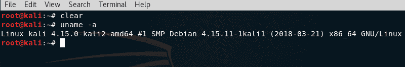

在这个屏幕截图中，我们可以看到我正在使用基于 Debian 的 64 位版本（amd64）的 Kali Linux。因此，我需要下载用于 Debian 构建的 64 位版本。

# 安装 Nessus 漏洞扫描程序

要在 Kali Linux 中安装 Nessus，请打开浏览器并导航到位于[的 Nessus 评估页面 https://www.tenable.com/try](https://www.tenable.com/try) 。除 16-IP 限制扫描外，评估版具有完整版的所有功能。

您需要向 Tenable 注册，以便将评估代码发送到您的电子邮件中。

收到带有评估代码的电子邮件后，您可以在 Kali Linux 中下载 Nessus 的相应版本，如下所示：

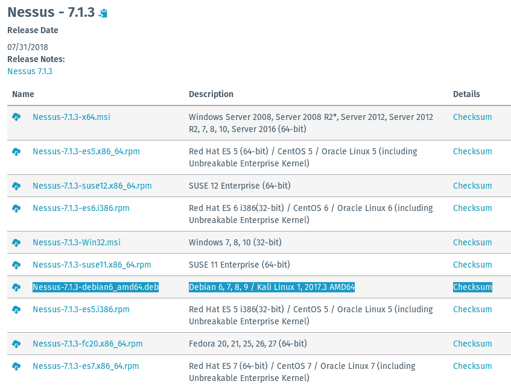

选择要安装的 Nessus 版本，单击“接受”以同意 Nessus 使用条款，然后在出现提示时单击“保存文件”选项保存 Nessus 下载。这将把文件保存到 Kali Linux 中的下载文件夹中。对于本例，我选择了 Nessus 的 64 位版本（`Nessus-7.1.3-debian6_amd64.deb`。

下载完成后，打开一个新终端，通过键入`cd Downloads`切换到下载目录。键入`ls`查看下载目录的内容。这样做也很有用，因为我们可以复制 Nessus 下载文件的名称并将其粘贴到以下命令中。然后，我们通过键入`dpkg –i Nessus-7.1.3-debian6_amd64.deb`安装 Nessus，如下所示：

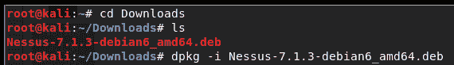

如果 Nessus 的更新版本可用，请在执行`dpkg -i`命令时复制特定下载文件的名称和版本。

当仍在下载文件夹中时，通过键入`service nessusd start`启动 Nessus 服务。出现提示时输入 Kali Linux 的密码，如下所示：

要使用 Nessus，请打开浏览器，在地址栏中键入`https://localhost:8834`URL，然后按*输入*。当显示不安全警告横幅时，单击高级按钮，然后单击添加异常，最后单击确认安全异常，如下所示：

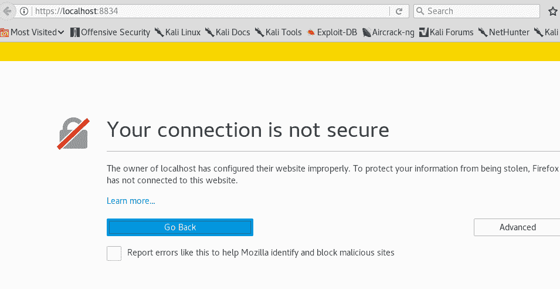

按照提示执行步骤 1-3，首先创建一个帐户，指定用户名和帐户，然后单击“继续”。

在步骤 2 中，将默认扫描仪类型选项设置为 Home、Professional 或 Manager，然后将通过电子邮件收到的激活码粘贴到激活码字段中。单击“继续”继续。如果一切正常，Nessus 将通过下载和编译所需插件开始初始化，如下所示：

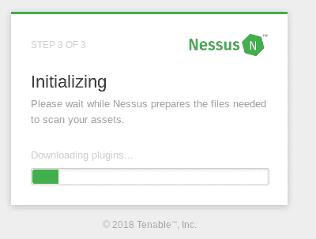

这可能需要几分钟，具体取决于您的 internet 连接速度。同时，您可以在[www.packtpub.com](http://www.packtpub.com)上浏览 Packt Publishing 关于渗透测试和 Kali Linux 的许多标题。

完成所有更新后，将加载 Nessus 接口。单击右上角的“新建扫描”按钮，查看所有可用的扫描类型，如以下屏幕截图所示：

有多种扫描模板可供选择，除了少数仅在付费订阅时可用。除了执行主机发现和高级扫描外，Nessus 还可以执行多种类型的高级漏洞扫描，包括以下内容：

*   云基础设施扫描
*   本地和远程坏壳检测扫描
*   内部 PCI 网络扫描
*   Linux 和 Windows 恶意软件扫描
*   幽灵和熔毁扫描
*   Wannacry 勒索软件扫描
*   Web 漏洞扫描

以下屏幕截图中显示了其中一些：

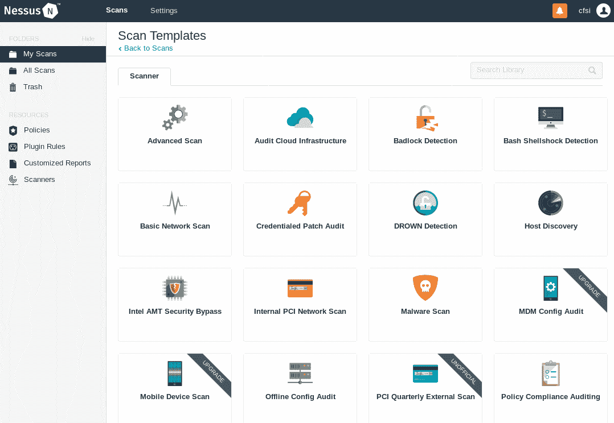

在本次评估中，我将使用易受攻击的 Linux web 服务器来演示漏洞暴露。正如[第 2 章](02.html)中提到的*设置您的测试实验室*您可以选择设置 Metasploitable 2、Metasploitable 3、该死的易受攻击的 Linux，甚至 BadStore。

单击扫描仪窗口中的高级扫描模板，并填充基本部分中的字段。在目标字段中，指定要使用高级扫描模板扫描的主机或主机范围，如下所示：

浏览左列的其他部分，因为有许多不同的设置。其中每一项都允许您自定义扫描以满足您的特定要求：

*   发现：Nessus 使用多种不同的方法来发现活动主机。您可以在此处为主机发现设置特定参数。
*   评估：这允许您设置扫描的类型和深度。
*   报告：当准备渗透测试报告时，拥有关于漏洞扫描的详细信息非常重要。此功能允许您设置报告参数。
*   高级：高级设置允许您更改一次扫描的主机数量和其他计时参数。

配置扫描后，您可以选择保存或启动。现在，您将在“我的扫描”下看到您的扫描。

单击给定扫描名称右侧的播放图标。这将运行扫描。如果在扫描名称运行时单击该名称，您将看到主机和一般漏洞信息，如下所示：

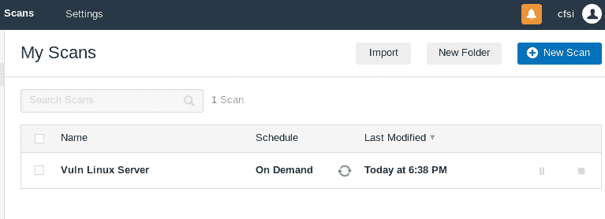

单击主机可查看发现的漏洞的更详细列表。这些漏洞的颜色编码如下：

*   红色-关键
*   橙色-高
*   黄色-中等
*   绿色-低
*   蓝色-信息性

如下面的屏幕截图所示，扫描结果显示总共发现了 70 个漏洞，其中 6 个是关键漏洞，17 个是高漏洞，这意味着这台机器非常容易受到攻击：

单击彩色漏洞类别，按最易受攻击（即严重）到最不易受攻击（信息性）的顺序显示漏洞：

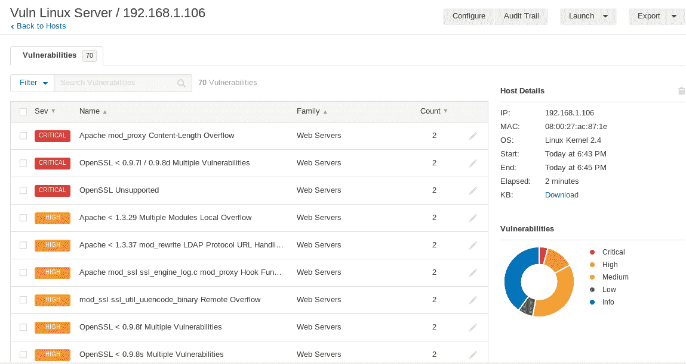

单击漏洞可向测试人员提供有关该漏洞的更详细信息，如下所示：

此信息不仅包括有关漏洞的信息，还包括有关是否存在可用漏洞的信息。这使渗透测试人员能够针对这些漏洞设计其他攻击：

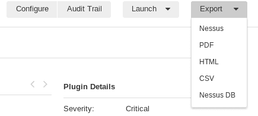

Nessus 是任何渗透测试活动中使用的强大工具。它提供了本节中无法解决的大量信息和功能。建议您花一些时间了解可用的功能以及如何使用它们。此外，Tenable 还为您免费制作了家庭版供您测试。如果您拥有外部 IP，或正在为客户使用 Nessus，则必须使用付费版本。

# 使用 OpenVAS 进行漏洞扫描

**开放漏洞评估系统**（**OpenVAS**是一个开源漏洞扫描框架。OpenVAS 易于安装，并具有用于执行漏洞评估的用户友好界面。根据 OpenVAS 网站（[http://www.openvas.org/about.html](http://www.openvas.org/about.html) ），框架内有超过 50000 个**网络漏洞测试**（**NVT**），是绿骨网络商业漏洞管理框架的一部分。

要安装 OpenVAS，请打开一个新的终端并键入`apt-get install openvas`，如下所示：

成功安装 OpenVAS 后，在终端中键入`openvas-setup`以启动设置和配置。此过程可能需要相当长的时间，具体取决于您的下载速度：

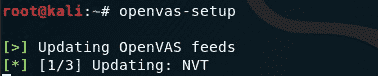

在设置和配置过程结束时，OpenVAS 将生成启动 OpenVAS 时所需的密码密钥：

要启动 OpenVAS 服务，请键入`openvas-start`，然后通过在浏览器窗口中键入`https://127.0.0.1:9392`或`https://localhost:9392`连接到 web 界面。

再次使用 OpenVAS 时，只需打开一个终端并键入`openvas-start`，因为无需再次运行安装程序。

您还必须单击 Advanced，然后添加 Exception，最后在输入上一个 URL 后确认 Security Exception，如以下屏幕截图所示：

出现提示时，使用用户名`admin`和设置过程中生成的密码登录。请确保安全存储此登录，因为无论何时使用 OpenVAS，您都需要登录，如下所示：

要运行扫描，请单击扫描，然后单击任务。将打开一个信息框，提示您将鼠标放在任务向导上，屏幕左上角的紫色图标，如下所示：

单击高级任务向导。在给定字段中输入相关信息。请注意，“扫描配置”字段有几种扫描类型可供选择，包括“发现”、“完全和快速”、“完全和快速终极版”以及“完全和非常深入终极版”（最耗费时间和资源的选项）。开始时间选项允许渗透测试仪计划扫描。这非常有用，因为扫描可能会中断网络，因此您可能希望在工作时间后或周末（如有必要）运行扫描：

完成所有相关字段后，向下滚动并单击创建。这将启动扫描并显示扫描详细信息和状态的摘要，如下所示：

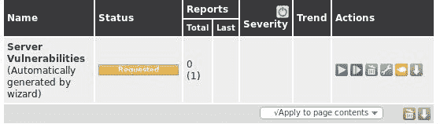

要查看任务的更多详细信息，请单击名称字段中的任务名称：

扫描完成后，单击“完成”。这将生成一份报告，列出发现的漏洞，以及每个漏洞的严重性评级：

单击列出的每个漏洞可显示更多信息，包括摘要、影响、解决方案、受影响的软件/操作系统和其他见解，如以下屏幕截图中的详细信息所示：

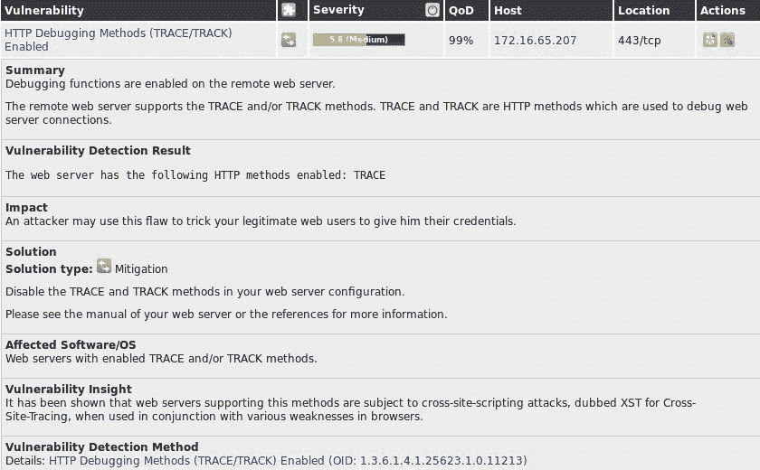

# 使用 Lynis 扫描 Linux 漏洞

Lynis 由 Cisofy（[www.Cisofy.com](http://www.cisofy.com)开发），是 Kali Linux 中可用的命令行安全审计工具。Lynis 是免费使用的，但也有企业版。Lynis 可用于在各种版本的 Linux、macOS X 和基于 Unix 的操作系统上执行自动安全审计评估和漏洞扫描。

Lynis 之所以脱颖而出，是因为它专注于执行各种 HIPAA、PCIDS、SOX 和 GLBA 合规审计，这些审计在采用各种合规标准的企业中具有很大价值。Lynis 可以下载并安装在独立系统上，从而消除远程审计和漏洞评估工具产生的大部分流量，尽管可以选择执行远程评估。

Lynis 是 Kali Linux 套件的一部分，但也可以从 GitHub（[中克隆 https://github.com/CISOfy/lynis](https://github.com/CISOfy/lynis) 或直接从官网下载[https://cisofy.com/documentation/lynis/get-started/#installation](https://cisofy.com/documentation/lynis/get-started/#installation) ）。

要在 Kali 中运行 Lynis，您可以通过主菜单单击应用，然后单击**漏洞分析，然后单击 Lynis，或者在终端中键入`lynis`来运行。此命令显示已安装的 Lynis 版本（本例中为 2.6.2）并初始化程序。还将显示有用的命令选项，如以下屏幕截图所示：**

 **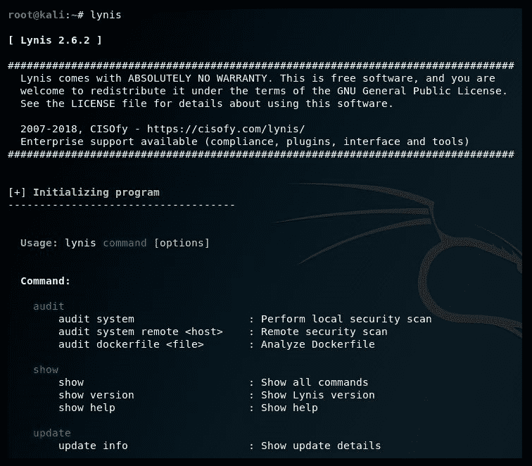

您也可以随时键入**`lynis show commands`**查看 Lynis 中可用的命令：

由于 Lynis 是一个完全自动化的审计评估工具，因此可以使用的命令非常少。要审核整个 Kali Linux 机器，只需键入`lynis audit system`。此评估的时间范围取决于运行评估的 Kali Linux 机器的规格，但通常为 15 到 30 分钟。审计如下所示：

针对系统执行的一些测试和审核包括以下内容：

*   Debian 测试
*   启动和服务
*   内核
*   内存和进程
*   用户、组和身份验证
*   贝壳
*   文件系统
*   USB 设备
*   网络和防火墙
*   端口和打印机
*   核硬化

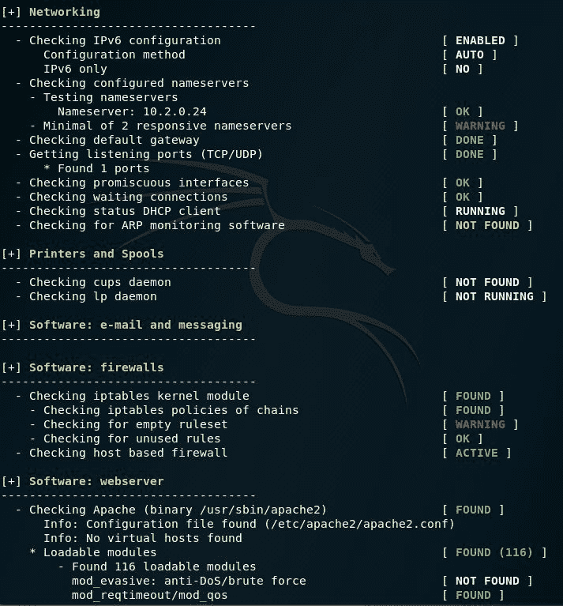

以下屏幕截图显示了 Lynis 审核结果的一个片段，其中包含 4 条警告和 40 条建议：

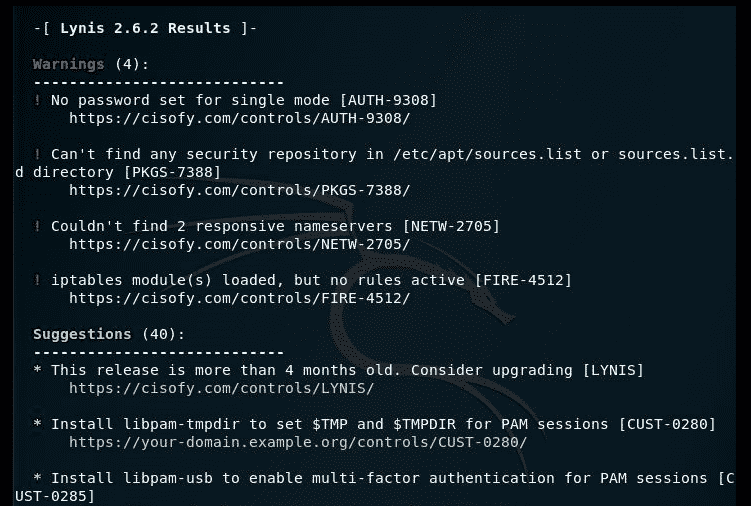

滚动到审计评估的末尾，我们可以找到 Lynis 审计的总结细节，如下所示：

**  **# 使用 SPARTA 进行漏洞扫描和枚举

SPARTA 是一个 GUI 网络基础设施渗透测试工具，由 SECFORCE 的 Antonio Quina 和 Leonidas Stavliotis 编写，可在 Kali Linux 中使用。SPARTA 在一个工具内自动执行扫描、枚举和漏洞评估过程。除了扫描和枚举功能外，SPARTA 还内置了破解密码的暴力工具。

还可以从 GitHub 下载 SPARTA 的最新版本，并使用`git clone https://github.com/secforce/sparta.git`命令将其克隆到本地计算机上。

要在 Kali Linux 2018 中启动 SPARTA，请单击应用，然后单击漏洞分析，然后选择 SPARTA。

在 SPARTA 1.0.3 GUI 中，单击左侧窗格将您的主机添加到范围中。也可以通过单击文件，然后将主机添加到作用域来完成此操作，如下所示：

添加主机后，将针对目标运行 Nmap 主机发现和分级 Nmap 扫描，因为在上一个屏幕截图中选择了这些选项。以下屏幕截图显示正在进行的扫描：

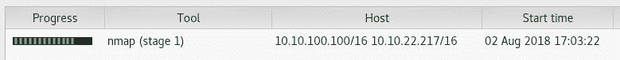

Nmap 扫描完成后，SPARTA 在主窗口中提供了几个选项卡，如服务、脚本、信息、注释、Nikto 和屏幕截图选项卡，所有这些都包含非常有用的信息。

默认情况下，首先会在“服务”选项卡下显示打开的端口和服务的列表，如下所示：

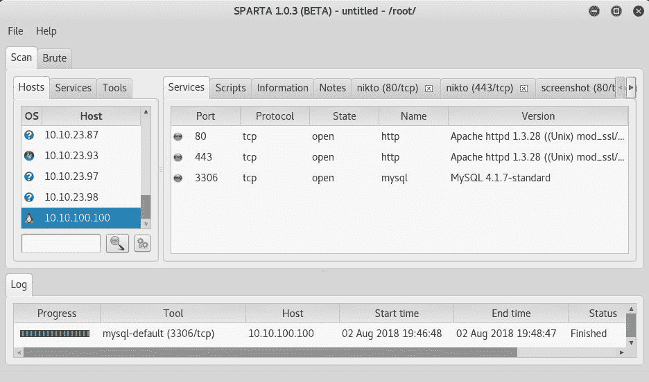

单击信息选项卡显示收集的主机信息，包括 IP 信息；打开、关闭和过滤的端口数（如果有）；以及具有精度等级的操作系统和版本：

由于本例中的目标是 Linux web 服务器，Nikto web 扫描工具也作为过程的一部分运行。单击 nikto（80/tcp）选项卡可显示发现的漏洞列表：

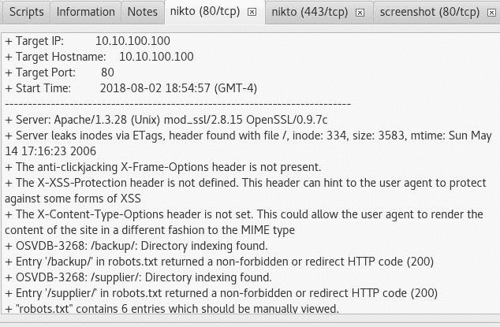

发现的许多漏洞都有前缀 OSVBD，这表明它们可以在数据库中搜索，如**常见漏洞和暴露**（**CVE**）和**开源漏洞数据库**（**OSVDB**）网站。例如，渗透测试人员可以使用简单的谷歌搜索 OSVDB-3268（SPARTA 在上一次扫描中显示为当前漏洞）来查找有关此漏洞的更多信息。然后，他们可以通过各种工具（如 Metasploit）利用这一点，本书以下章节将对此进行讨论。

查看扫描中包含的另一台 Windows 计算机（**10.10.22.217**），单击“服务”选项卡显示几个打开的端口，如以下屏幕截图所示：

当检测到 Windows 机器时，SPARTA 运行`smbenum`工具枚举 Windows 机器以检查空会话并执行枚举任务，包括搜索用户和共享，如下所示：

SPARTA 允许渗透测试人员实际执行各种网络渗透测试功能，从而使扫描、枚举和漏洞评估更进一步。在“服务”选项卡中，我们可以右键单击任何打开的端口来执行这些任务。

在下面的屏幕截图中，右键单击 open port 3306 显示尝试使用 Telnet、Netcat 或 MySQL 客户端（以 root 用户身份）打开端口的选项。还有一个选项可发送给暴力破解，以尝试通过暴力破解密码：

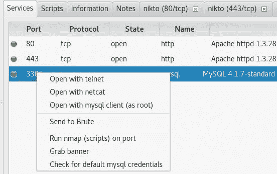

单击 Send to Brute 可尝试使用 THC Hydra 密码破解工具通过所选端口进行暴力攻击。用户名和密码列表也可用于尝试，以及尝试空白密码、尝试作为密码登录等各种选项。指定选项后，单击“运行”尝试攻击：

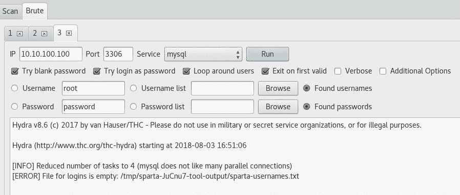

这些绝非斯巴达唯一可用的工具。例如，右键单击 Windows 计算机上的 open port 445（打开端口 445）可显示渗透测试仪可用的更多选项，如下所示：

# 总结

在本章中，我们讨论了基于 Kali Linux 中使用的一系列工具识别和分析关键安全漏洞的过程。我们还提到了三类主要的漏洞设计、实施和操作，并讨论了如何将它们分为两类：本地和远程。之后，我们讨论了安全审核员可以遵循的几种漏洞分类法，以根据统一的共性模式对安全缺陷进行分类。为了进行漏洞评估，我们向您展示了许多允许自动扫描和漏洞评估的工具，包括 Nessus、OpenVAS、Lynis 和 SPARTA。

在下一章中，我们将讨论欺骗的艺术，并解释利用人类弱点获取目标的各种方法。尽管此过程有时是可选的，但在缺少可用信息以允许我们利用目标基础设施时，它被认为是至关重要的。

# 问题

1.  漏洞和利用漏洞之间的关系是什么？
2.  哪类漏洞被认为是最难解决的？
3.  可以使用哪个网站获取有关最新漏洞的信息？
4.  远程漏洞的定义是什么？
5.  哪种工具可以执行内部和外部 PCI DSS 扫描？
6.  哪个工具是专门为审核 Linux 系统而构建的？
7.  哪种工具集成到 Sparta 中来执行网站扫描？

# 进一步阅读

*   漏洞和漏洞信息：[https://www.exploit-db.com/](https://www.exploit-db.com/)
*   常见漏洞和暴露数据库：[https://cve.mitre.org/](https://cve.mitre.org/)
*   Rapid7 漏洞和漏洞数据库：[https://www.rapid7.com/db](https://www.rapid7.com/db)
*   Nessus 扫描教程：[https://docs.tenable.com/nessus/Content/Scans.htm](https://docs.tenable.com/nessus/Content/Scans.htm)
*   OpenVAS 社区论坛：[https://community.greenbone.net/](https://community.greenbone.net/)**