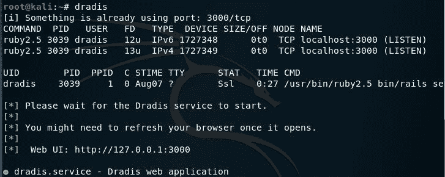
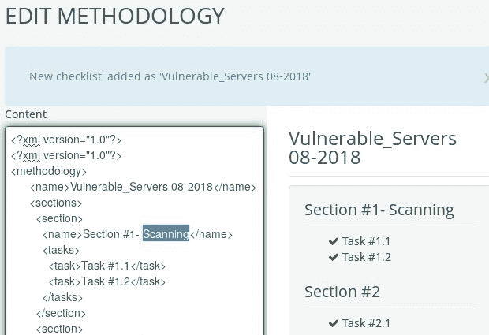
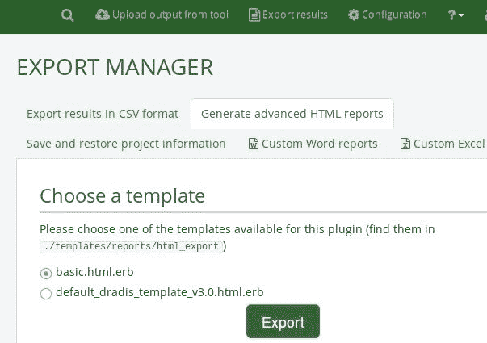
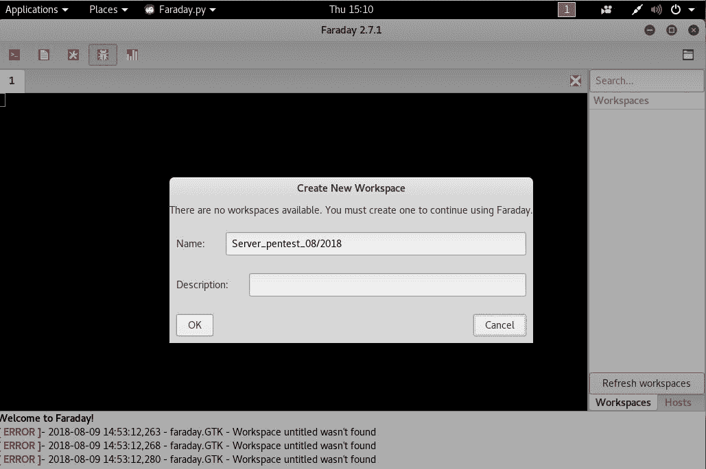
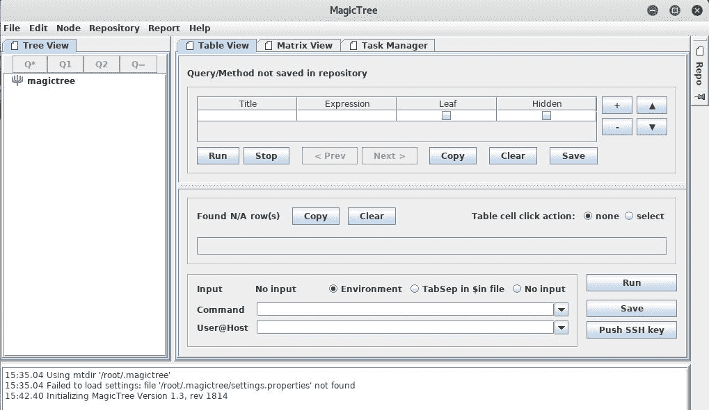

# 渗透测试报告工具

评估跟踪和记录是专业渗透测试的一个关键方面。应记录测试工具的每个输入和输出，以确保在需要时以准确和一致的方式再现结果。请记住，渗透测试过程的一部分包括向客户展示测试结果。这些客户端很可能希望缓解漏洞，然后尝试模仿您的步骤，以确保其缓解措施有效。根据范围的不同，您可能需要执行额外的测试，以验证客户端所做的任何改进是否确实消除了您发现的漏洞。准确记录您的步骤将有助于您确保在后续过程中进行相同的测试。

适当的测试文档提供了所执行操作的记录，从而允许您在客户在商定的测试窗口期间遇到与测试无关的事件时跟踪您的步骤。详细记录您的操作可能非常乏味，但作为一名专业的渗透测试人员，您不应忽视这一步骤。

文档、报告编制和演示是必须以系统、结构化和一致的方式处理的核心领域。本章提供详细说明，帮助您调整文档和报告策略。本章将介绍以下主题：

*   结果验证，确保只报告经验证的结果。
*   将从执行、管理和技术角度讨论报告类型及其报告结构，以最好地反映渗透测试项目相关当局的利益。
*   演示部分提供了一些一般性提示和指导原则，有助于了解您的受众及其对给定信息的接受程度。
*   测试后程序；也就是说，您应将纠正措施和建议作为报告的一部分，并将其用于向相关组织的纠正团队提供建议。这种练习非常具有挑战性，需要在安全考虑的情况下深入了解目标基础设施。

以下每一节都将为准备文档、报告和演示提供坚实的基础，尤其是为突出其角色提供坚实的基础。即使是一个小小的错误也会导致法律问题。您创建的报告必须与您的发现保持一致，并且应该做的不仅仅是指出在目标环境中发现的潜在弱点。例如，它应该准备充分，并根据客户要求的已知合规性要求（如有）证明支持。此外，还应明确说明攻击者的操作方式、应用的工具和技术，并列出发现的漏洞和经验证的攻击方法。主要是关注弱点，而不是解释发现弱点的事实或程序。

# 技术要求

需要一台笔记本电脑或台式电脑，至少有 6 GB RAM、一个四核 CPU 和 500 GB 硬盘空间。对于操作系统，我们使用 Kali Linux 2018.2 或 2018.3 作为虚拟机，或安装在 HDD、SD 卡或 USB 闪存驱动器上。

# 文件和结果核查

在大多数情况下，需要进行大量的漏洞验证，以确保您的发现实际上是可利用的。缓解措施可能代价高昂，因此，就您的声誉和完整性而言，漏洞验证是一项关键任务。根据我们的经验，我们注意到有几种情况，人们只是运行一个工具，获取结果，然后直接向客户展示。这种不负责任和对你的评估缺乏控制的行为可能会导致严重的后果，并导致你职业生涯的崩溃。在出现假阴性的情况下，它甚至可能通过销售虚假的安全感而使客户处于风险之中。因此，测试数据的完整性不应受到错误和不一致的影响。

以下是一些程序，可帮助您在将测试结果转换为最终报告之前记录和验证测试结果：

*   **详细记录**：详细记录渗透测试过程中的信息收集、发现、枚举、漏洞映射、社会工程、利用、权限提升和持久访问阶段所做的每一步。
*   **记录模板**：为您针对卡利目标执行的每一个工具制作一个记录模板。模板应明确说明其目的、执行选项和与目标评估一致的配置文件，并为记录各自的测试结果提供空间。在从特定工具得出最终结论之前，至少重复练习两次也是至关重要的。通过这种方式，您可以针对任何不可预见的情况验证和测试您的结果。例如，当使用 Nmap 进行端口扫描时，我们应该用任何必要的部分来布置模板，例如使用目的、目标主机、执行选项和配置文件（服务检测、操作系统类型、MAC 地址、开放端口、设备类型等），并相应地记录输出结果。
*   **可靠性**：不要依赖单一工具。依靠单一工具（例如，用于信息收集）是绝对不切实际的，并且可能会给渗透测试带来差异。因此，我们强烈建议您使用为类似目的制作的不同工具来练习相同的练习。这将确保验证过程的透明度，提高生产率，减少误报和漏报。换句话说，每种工具都有其处理特定情况的特殊性。如果适用，还值得手动测试某些条件，并使用您的知识和经验验证所有报告的结果。

# 报告类型

在收集每一个经过验证的测试结果之后，您必须将它们组合成一个系统的、结构化的报告，然后再将它们提交给目标干系人。有三种不同类型的报告；每个都有自己的模式和布局，与渗透测试项目中涉及的业务实体的利益相关。报告类型如下：

*   执行报告
*   管理报告
*   技术报告

这些报告是根据接收者的理解水平和掌握渗透测试仪传达信息的能力编制的。在下一节中，我们将研究每种报告类型及其报告结构，以及实现目标所需的基本元素。

需要注意的是，所有这些报告在提交给利益相关者之前，都应遵守保密政策、法律通知和渗透测试协议。

# 执行报告

执行报告是一种评估报告，它更短、更简洁，从业务战略的角度指出了渗透测试输出的高级视图。该报告是为目标组织（首席执行官、首席技术官、首席信息官等）的 C 级主管编写的。它必须填充一些基本元素，如下所示：

*   **项目目标**：本节定义了您和您的客户之间就渗透测试项目共同商定的标准。
*   **漏洞风险分类**：本节解释了报告中使用的风险等级（关键、高、中、低和信息）。这些级别应明确区分，并应突出技术安全暴露的严重性。
*   **执行摘要**：本节简要描述了在定义的方法下渗透测试任务的目的和目标。它还强调了发现并成功利用的漏洞数量。
*   **统计**：本节详细介绍了在目标网络基础设施中发现的漏洞。这些也可以以饼图的形式绘制，或以任何其他直观的格式绘制。
*   **风险矩阵**：本节对所有已确定的漏洞进行量化和分类，确定可能受影响的资源，并以简写格式列出发现、参考和建议。

在编写执行报告时保持创造性和表达力始终是一种理想的方法，并记住，您不需要反思评估结果的技术依据，而是提供从这些结果中处理的事实信息。报告的总大小应为两到四页。有关示例报告，请参阅本章末尾的*进一步阅读*部分。

# 管理报告

管理报告通常旨在涵盖目标安全态势方面的问题，包括监管和合规性度量。实际上，它应该在执行报告中增加一些可能涉及**人力资源**（**人力资源**）和其他管理人员的章节，并协助他们进行法律诉讼。以下是关键部分，为您提供这样一份报告的宝贵基础：

*   **合规成就**：包含已知标准的列表，并将其每个部分或子部分与当前安全配置进行映射。它应该突出显示发生的任何违反管理法规的行为，这些行为可能会无意中暴露目标基础架构并造成严重威胁。
*   **测试方法**：应简要说明，并应包含足够的细节，以帮助管理人员了解渗透测试生命周期。
*   **假设和限制**：这突出了可能阻止渗透测试仪达到特定目标的已知因素。
*   **变更管理**：这有时被视为补救过程的一部分；但是，它主要针对在受控 it 环境中处理所有更改的战略方法和过程。安全评估产生的建议和建议应与程序中的任何更改保持一致，以便将意外事件对服务的影响降至最低。
*   **配置管理**：关注系统功能运行和性能的一致性。在系统安全上下文中，它遵循可能已引入目标环境（硬件、软件、物理属性和其他）的任何更改。应对这些配置更改进行监控，以保持系统配置状态。

作为一名负责任且知识渊博的渗透测试人员，在继续渗透测试生命周期之前，您有责任澄清任何管理条款。这项工作肯定涉及针对特定目标的评估标准的一对一对话和协议，如必须评估哪种合规性或标准框架，遵循特定测试路径时存在的任何限制，建议的变更是否在目标环境中可持续，以及如果引入任何配置更改，当前系统状态是否会受到影响。这些因素共同建立了目标环境中当前安全状态的管理视图，并在技术安全评估之后提供了建议和建议。

# 技术报告

技术评估报告在解决渗透测试过程中提出的安全问题方面起着非常重要的作用。这种类型的报告通常是为希望了解目标系统处理的核心安全特性的技术人员开发的。该报告将详细说明任何漏洞、如何利用这些漏洞、它们可能带来的业务影响，以及如何开发抵御任何已知威胁的解决方案。它必须与保护网络基础设施的一体化安全指南进行通信。到目前为止，我们已经讨论了执行和管理报告的基本内容。在技术报告中，我们扩展了这些要素，并包括一些可能引起目标组织技术团队极大兴趣的特殊主题。有时，项目目标、脆弱性风险分类、风险矩阵、统计数据、测试方法、假设和限制等部分也是技术报告的一部分。技术报告由以下部分组成：

*   **安全问题**：渗透测试过程中提出的安全问题应详细列举，这样对于每种应用的攻击方法，您必须提及受影响资源列表、其含义、原始请求和响应数据、模拟攻击请求和响应数据，为补救团队提供外部资源参考，并提供专业建议，以修复目标 IT 环境中发现的漏洞。
*   **漏洞映射**：提供在目标基础设施中发现的漏洞列表，每个漏洞都应与资源标识符（例如，IP 地址和目标名称）轻松匹配。
*   **漏洞利用图**：提供针对目标成功检查和验证的漏洞利用列表。同样重要的是要提及这种剥削是私人的还是公共的。详细说明利用漏洞代码的源代码及其可用时间可能会有所帮助。
*   **最佳实践**：强调目标公司可能缺乏的任何更好的设计、实施和运营安全程序。例如，在大型企业环境中，部署边缘级别的安全性可能有利于在威胁进入企业网络之前减少其数量。这样的解决方案非常方便，不需要与生产系统或遗留代码进行技术合作。

一般来说，技术报告向有关组织的有关成员提出了实际情况。本报告在风险管理过程中发挥着重要作用，可能用于创建可采取行动的补救任务。

# 网络渗透测试报告

正如渗透测试有不同的类型一样，报告结构也有不同的类型。我们提供了基于网络的渗透测试报告的通用版本，该报告可以扩展到几乎任何其他类型的渗透测试（例如，web 应用程序、防火墙、无线和网络）。除以下目录外，您还需要一个封面，说明测试公司的名称、报告类型、扫描日期、作者姓名、文件修订号以及简短的版权和保密声明。

以下是基于网络的渗透测试报告的目录：

*   法律公告
*   渗透测试协议
*   介绍
*   项目目标
*   假设和模仿
*   脆弱性风险等级
*   执行摘要
*   风险矩阵
*   测试方法
*   安全威胁
*   建议
*   漏洞图
*   利用地图
*   合规性评估
*   变革管理
*   最佳做法
*   附件

正如您所看到的，我们已经将所有类型的报告组合成一个具有最终结构的完整报告。这些部分中的每一部分都有自己的相关子部分，可以更好、更详细地对测试结果进行分类。例如，附件部分可用于列出测试过程的技术细节和分析、活动日志、各种安全工具的原始数据、所进行研究的细节、对任何互联网来源的引用以及词汇表。根据客户要求的报告类型，在开始渗透测试之前，您完全有责任了解您职位的重要性和价值。

# 准备演讲稿

为了完成一次成功的演讲，了解听众的技术能力和目标是很有帮助的。你需要根据你的受众调整材料；否则，你将面临负面反应。您的关键任务是让您的客户了解您测试的区域周围的潜在风险因素。例如，管理层的管理人员可能没有时间担心社会工程攻击向量的细节，但他们会对了解当前的安全状况以及采取何种补救措施来提高他们的安全姿态感兴趣。

虽然没有正式的程序来创建和展示您的发现，但您应该保持专业的视野，以充分利用您的技术和非技术受众。通过评估目标环境及其技术人员的技能水平并帮助他们了解您以及组织的任何关键资产，了解目标环境及其技术人员群体也是您职责的一部分。

指出当前安全态势中的不足，并在没有情感依恋的情况下暴露弱点，可以导致成功的专业演讲。记住，你在那里是为了坚持你的事实和发现，从技术上证明它们，并相应地向补救团队提供建议。因为这是一种面对面的练习，所以最好提前准备好回答任何问题，并提供支持性的事实和数据。

# 测试后程序

补救措施、纠正步骤和建议都是指测试后程序的术语。在这些过程中，您充当目标组织补救团队的顾问。在这个职位上，你可能需要与许多具有不同背景的技术人员进行交流，因此请记住，你的社交外表和社交技能在这里非常有价值。

此外，除非您接受过 it 培训，否则不可能拥有目标 it 环境所需的所有知识。在这种情况下，在没有得到专家网络的任何支持的情况下处理和补救脆弱资源的每一个实例是相当具有挑战性的。我们制定了一些通用指南，可帮助您向客户推荐关键建议：

*   重新审视网络设计，检查报告中指出的脆弱资源的可利用条件。
*   专注于边缘级别或以数据为中心的保护方案，以在安全威胁同时攻击后端服务器和工作站之前减少其数量。
*   客户端或社会工程攻击几乎不可能抵抗，但可以通过培训具有最新对策和意识的员工来减少。
*   根据渗透测试仪提供的建议缓解系统安全问题可能需要额外的调查，以确保系统中的任何变化不会影响其功能特性。
*   必要时部署经过验证和信任的第三方解决方案（IDS/IP、防火墙、内容保护系统、防病毒、IAM 技术等），并调整引擎以安全高效地工作。
*   使用分而治之的方法将安全网络区域与目标基础设施上不安全或面向公众的实体分开。
*   加强开发人员编写作为目标 IT 环境一部分的安全应用程序的技能。评估应用程序安全性和执行代码审核可以为组织带来有价值的回报。
*   采取物理安全对策。采用具有安全环境设计、机械和电子访问控制、入侵警报、闭路电视监控和人员识别的多层入口策略。
*   定期更新所有必要的安全系统，以确保其机密性、完整性和可用性。
*   检查并验证作为建议提供的所有文件化解决方案，以消除入侵或利用的可能性。

# 使用 Dradis 框架进行渗透测试报告

Dradis 框架是一个用户友好的报告框架，也支持协作。使用多种工具运行测试和评估是非常令人兴奋的；然而，当涉及到有组织的文档时，考虑到报告中包含输出文件，以及输出文件的屏幕截图，以及评估期间使用的命令（也必须记录），这可能会变得有点难以承受。Dradis 框架通过提供一个易于使用的界面来帮助实现这一点，该界面支持许多工具的插件、附加的法规遵从性指导原则以及轻松定制检查表的能力。

通过单击应用程序、12 个报告工具，然后单击 Dradis 框架，可以在 Kali 的菜单中找到 Dradis 框架。

也可以通过输入`dradis`从终端直接启动 Dradis：

上述两种方法都会导致 Dradis web 界面在浏览器中以`127.0.0.1:3000/setup`作为 URL 打开。输入访问服务器的每个人将使用的密码，然后单击创建共享密码并继续。

接下来，输入用户名和密码，然后单击“让我进来！”！这将带我们进入 Dradis CE（社区版）仪表板。Dradis CE 允许用户创建检查表作为一种方法。您可以通过单击方法（在左窗格上）或单击主窗口的方法进度部分下的+添加测试方法来执行此操作：

Dradis 为用户提供了创建新方法或在其他法规遵从性软件包（必须下载）之间进行选择的选项。如果您希望为您的方法使用特定的模板，而不是创建模板，则可以选择“下载更多”选项，该选项将用户引导到合规性软件包的页面（[https://dradisframework.com/academy/industry/compliance/](https://dradisframework.com/academy/industry/compliance/) ）提供各种包装，包括：

*   HIPAA 合规性审计工具
*   **攻击性安全认证专家**（**OSCP**报告
*   OWASP 测试指南 v4
*   PTES 技术指南

要为您的方法创建检查表，请选择“新建检查表”选项：

为新的检查表命名，然后单击“添加到项目”。这将创建一个带有两个部分标题的未填充清单，以便我们开始：

要编辑部分和任务，请单击 edit 按钮并编辑 XML 内容。例如，我在第 1 节区域中添加了`Scanning`。完成编辑后，滚动到 XML 文件的底部，然后单击更新方法：

在左侧窗格中，单击节点以添加 Dradisce 将在其上创建报告的设备。如果使用多个节点，请输入节点的 IP（每行一个），完成后单击“添加”：

单击左侧窗格中“注释”部分下的各个 IP 将打开节点摘要仪表板。在这里，您可以添加证据、注释，甚至在需要时添加子节点，如以下屏幕截图所示：

Dradis 还可以通过插件处理各种工具（包括 Acunetix、Burp、Metasploit、Nessus、Nikto、OpenVas 等）的输出，从而简化报告过程。单击仪表板顶部的上传输出工具。选择一个工具并选择一个文件上载到 Dradis，如以下屏幕截图所示：

要完成报告，请单击仪表板顶部的导出结果。可以生成 CSV 和 HTML 格式的报告，以及自定义 Word 和 Excel 报告。选择模板并单击“导出”以生成文件，如下所示：

# 渗透测试报告工具

Dradis 不是 Kali Linux 2018 中唯一可用的工具。单击应用程序，然后单击报告工具，我们可以看到其他可用工具，如法拉第 IDE、MagicTree 和 pipal：

# 法拉第集成电路

Faraday IDE 是另一个用于支持协作的工具，同时利用大约 40 个内置工具生成报告。支持的插件包括 Metasploit、Nmap 和 Nessus 插件。Faraday IDE 提出了多用户渗透测试的概念，该环境的功能与在终端内单独运行工具时完全相同。

要启动法拉第 IDE，请单击应用程序，然后单击法拉第。加载界面时，为您的工作区指定一个名称以开始使用该应用程序，如下所示：

有关安装和使用法拉第 IDE 的更多信息，请访问[https://github.com/infobyte/faraday/wiki](https://github.com/infobyte/faraday/wiki) 。

# 魔术师

MagicTree 是 Kali Linux 中提供的另一个工具，用于执行报告生成和管理。Nmap 用户在生成扫描报告时可能会发现此工具特别有用，因为它允许用户直接从应用程序本身运行 Nmap 扫描。通过单击应用程序，然后单击报告工具，可以启动 MagicTree。该工具应类似于以下屏幕截图：

有关使用 MagicTree 的更多信息，请访问[https://www.gremwell.com/using_magictree_quick_intro](https://www.gremwell.com/using_magictree_quick_intro) 。

# 总结

在本章中，我们探讨了创建渗透测试报告所需的一些基本步骤，并讨论了在客户面前进行演示的核心方面。首先，我们充分解释了使用单个工具记录结果的方法，并建议您不要依赖单个工具获得最终结果。因此，在记录测试结果之前，您的经验和知识在验证测试结果方面很重要。确保随时更新您的技能，并在需要时手动验证结果。

然后我们研究了报告工具，主要关注 Dradis 框架，同时讨论了 Faraday IDE 和 MagicTree。我们鼓励您尝试所有这些工具，因为您可能希望将这些工具组合起来用于各种目的和协作。

最后，我们希望您喜欢这本书，并祝愿您在网络安全和渗透测试冒险中一切顺利。

# 问题

1.  向客户提交渗透测试报告的三种主要类型是什么？
2.  在执行报告中，风险矩阵量化了什么？
3.  漏洞地图的用途是什么？
4.  开发地图的目的是什么？
5.  测试方法应包含哪些内容？
6.  如何减少客户端或社会工程攻击？

# 进一步阅读

*   样品渗透检测报告：[https://www.offensive-security.com/reports/sample-penetration-testing-report.pdf](https://www.offensive-security.com/reports/sample-penetration-testing-report.pdf)
*   编写渗透测试报告的技巧：[https://www.sans.org/reading-room/whitepapers/bestprac/writing-penetration-testing-report-33343](https://www.sans.org/reading-room/whitepapers/bestprac/writing-penetration-testing-report-33343)
*   Nessus 样本报告：[https://www.tenable.com/products/nessus/sample-reports](https://www.tenable.com/products/nessus/sample-reports)
*   技术渗透报告样本：[https://tbgsecurity.com/wordpress/wp-content/uploads/2016/11/Sample-Penetration-Test-Report.pdf](https://tbgsecurity.com/wordpress/wp-content/uploads/2016/11/Sample-Penetration-Test-Report.pdf)