# 选择发行版

自我们的书的第一版以来，Kali Linux 发生了很多变化。除了 Kali 现在是一个滚动发行版之外，它现在还附带了几个桌面环境和几个不同的内核架构。这意味着您可以从一个小的 Raspberry Pi 或一个为速度和功率而构建的成熟工作站运行 Kali。通过添加一个普通的用户帐户和一些额外的配置和软件包，您可以使 Kali 成为您的**日常驱动程序**操作系统。在本章中，我们将讨论几种桌面环境及其优缺点。这将帮助您决定下载哪个发行版，以便进入 Kali 黑客世界。如果您不熟悉 Linux，本章将帮助您了解 Linux 及其设计的一些基本知识。

*   桌面环境
*   选择您的外观和感觉
*   为日常驱动程序配置

# 桌面环境

Unix/Linux 系统和 Windows 之间的一个重大区别是，它们在设计上确实是模块化的。当然，我知道微软说 Windows 在设计上是模块化的，但事实并非如此。通过 Windows，桌面与操作系统无缝集成。因此，在 Server2012 之前，您必须运行带有运行 GUI 的 Windows 服务器。使用 Server 2012，您可以选择无头运行机器，但在这种模式下运行时，服务器的使用非常有限。尝试卸载 Internet Explorer；嗯，你不能。是的，Internet Explorer 是一个在所有常见应用程序中具有最大安全足迹的应用程序。是的，Internet Explorer 具有系统级访问权限。是的，这是一个问题，我们将在本书后面的部分利用它，但在本章中，我们将重点关注桌面环境。

Linux 在设计上确实是模块化的。Linux 之父是 Unix，而 Unix 的整个设计理念是可以链接在一起执行更大任务的小型交互式程序。Linux 也是这样设计的。事实上，Linux 只是由 Linus Torvalds 发明的操作系统的内核。几乎所有其他的东西都是一个小应用程序的集合，这些小应用程序通过螺栓连接在一起*让男孩走*。**GNU 工具集**这个名称包含了一个帮助内核与硬件交互的大而恒定的组件集。这些工具中的大多数都是从 Unix 移植的，或者是为了避免版权问题而重写的，但是仍然使用相同的输入和输出。

因此，在这种设计结构中，GUI 只是另一个模块，可以更改或完全从操作系统中删除，而不会对底层工作部件产生任何影响。这使 Linux 能够做任何事情，从智能手表到运行强子对撞机或。。。成为黑客机器。

# 桌面环境与窗口管理器

窗口管理器是一个重要的区别，它可以帮助您了解桌面环境如何在 Kali 和其他*Linux 产品*（Linux 的复数形式）上工作。桌面环境，也称为 GUI，通常包括文件夹、壁纸、桌面小部件、图标、窗口、工具栏和应用程序界面。Microsoft Windows 桌面环境可能是您发现的第一个此类隐喻结构。您的智能手机有一个桌面环境，而 Windows 8 桌面环境的重大失败是试图合并 Windows CE（电话 GUI）和 Windows 7/Server 2003 GUI 的开发。微软所犯的错误是假定有更多具有触摸屏功能的工作站。很明显，这项技术是存在的，但这种显示器价格昂贵，使用范围不广。Bo 和 Wolf 认为基于相同的设计假设，Ubuntu Unity 桌面环境是一个失败。鼠标驱动的工作站界面将在这里停留一段时间。

在 Kali 中，桌面环境通常与窗口系统（如 X Windows 系统或 Wayland）交互，该系统直接运行在硬件上，与窗口管理器应用程序交互，窗口管理器应用程序是用户看到并与用户交互的界面。窗口管理器提供了 Kali Linux 体验的外观和感觉。在 Kali Linux 中，有几个窗口管理器可以用于几乎任何桌面环境。其中之一是启蒙窗口管理器，它作为 E17 包含在 Kali ISO 下载中。E17 与完整桌面环境（如 KDE 或 Gnome）之间的主要区别在于，E17 没有专门为 E17 构建的应用程序，而 KDE 和 Gnome 有专门的应用程序，需要满足大量依赖项才能在其他桌面环境中运行。Kate 和 gedit 分别是 KDE 和 Gnome 的专用文本编辑器。

# 启蒙运动（E17）

安装 E17 ISO 与安装任何其他台式机非常相似，只要您使用默认安装选项即可。标准引导屏幕是运行级别 3，只有一个命令行界面，因此您必须使用`startx`命令才能查看桌面界面。这显示在以下屏幕截图中：

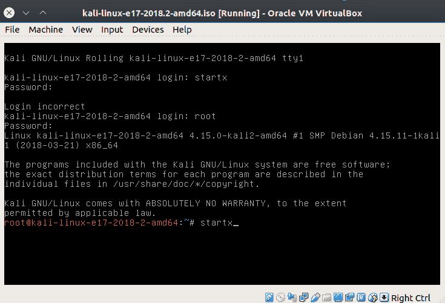

E17 启动屏幕

首次登录 E17 环境时，系统将向您询问一系列在安装过程中已回答的问题：

*   语言：突出显示的默认语言为美国英语。
*   键盘布局：默认高亮显示为英语（美国）。
*   配置文件：这是硬件配置文件，可选择手机和电脑。默认高亮显示的是计算机。
*   大小：这是标题大小。选择范围从 0.8 到 2.0。突出显示的默认值为 1.0。
*   窗口焦点：选择是单击并鼠标悬停。突出显示的默认值（以及常规 Linux 默认值）是鼠标悬停。
*   检查 Connman 是否存在：Connman 是网络连接管理器。单击以安装/启用 Connman。
*   合成：这是 E17 中大多数眼睛糖果的来源。默认设置是启用合成，但如果您正在进行裸机安装，则可能需要使用硬件加速（OpenGL）合成。如果 RAM 不足，或者您使用的是带有较旧处理器的机器，您可能根本不想使用合成：


第一引导合成选择

*   更新：您可以启用更新检查。默认设置是复选框，用于授权此更新。如果您在目标网络中运行，请清除此复选框。在[上进行随机网络检查并不特别隐蔽 https://www.enlightenment.org/](https://www.enlightenment.org/) 如果网络仅限于 Windows。
*   任务栏：启用任务栏可以让您在 Kali Linux E17 桌面上看到打开的应用程序和窗口。这是默认启用的。

完成配置后，E17 将显示桌面。下面的屏幕截图显示了默认桌面。你可能会注意到的第一件事是背景是一个白色的平板。顶部的菜单行来自虚拟框。下边缘的菜单栏让人想起苹果 Mac 工具栏。中间的浮动菜单栏是通过右击桌面实现的：


E17 默认桌面

下面的屏幕截图显示了基本的默认文件管理窗口。这本书可读性强，但并不令人兴奋。如果单击桌面菜单，可以添加小工具。我已经在任务栏上添加了一个系统小工具，但是你可以很容易地将它放在桌面上的任何地方。下面的屏幕截图显示了背光小工具的右键单击菜单。如果单击“开始移动小工具”，则可以移动所有小工具，直到单击“停止移动小工具”：


移动小工具

# E17 窗口管理器问题

1.  几乎所有的安全工具都集中在另一个菜单下，即应用程序菜单下，这可能会在某种程度上限制您的风格。

2.  如果打开的“单击”菜单过于靠近屏幕右边框，则子菜单将显示在屏幕外。以下屏幕截图显示了其他菜单过度拥挤的影响：

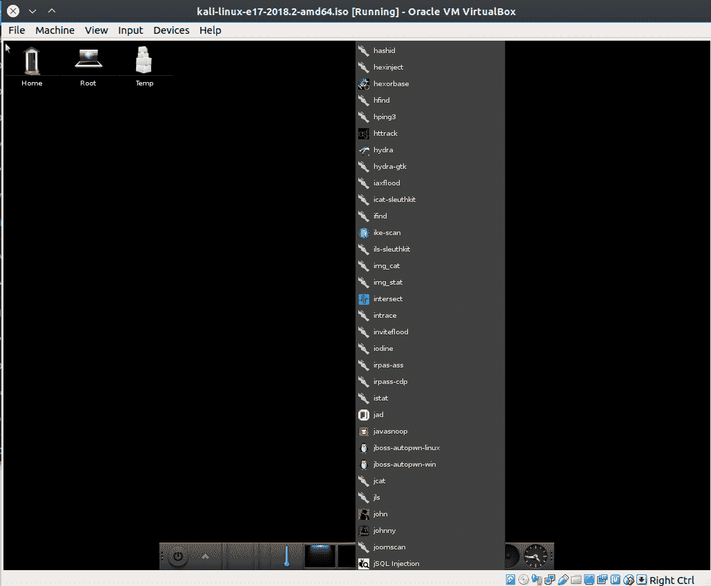

其他菜单过度拥挤的影响

3.  这个版本的启蒙运动已经有好几年的历史了。目前的主要版本是 22。也许是创建 Kali 的攻击性安全部门的人员决定将启蒙冻结在主要版本 17，因为启蒙开发者正在使用 Wayland 窗口系统，默认情况下 Kali-E17 使用的是**xorg**窗口系统。

要检查您的 Kali 版本是否运行 xorg 或 Wayland，请在命令行中键入`xdpyinfo`。如果它运行的是纯 Wayland 环境，则该命令将失败。如果使用 xorg，它将生成有关视频配置的几行信息。以下屏幕截图显示了默认安装结果的截断屏幕：


截断的 xpdyinfo 输出

4.  获取所有安全工具的最简单方法似乎是打开应用程序“运行一切”对话框，如前所示。当我试图打开 E17 中的默认终端模拟器**xterm**来安装我最喜欢的软件安装程序应用程序**Synaptic**时，我发现这返回了一个错误代码。我必须进入应用程序|系统菜单并从那里打开 xterm。对于失败的 RunEverything 小部件，似乎没有简单的修复方法。也许升级到目前稳定的启蒙版本（E22.x）可以解决这个问题，但解决方案可能需要改造窗口系统，这是一项非常重要的任务。

要安装`synaptic`：

```
#> apt install synaptic
```

要在 E17 中更改壁纸，请单击应用程序|设置|壁纸设置。这将打开以下屏幕截图中显示的对话框。您可以选择自己的桌面映像或一个 factory 映像：

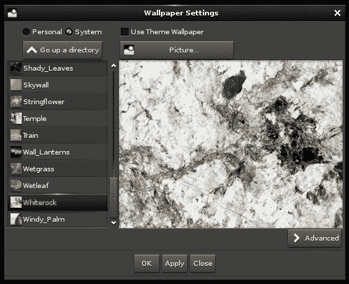

更换桌面壁纸

# Gnome 桌面

回溯到 Backtrack 时代，它是 Kali Linux 的前身安全平台，默认的桌面环境是一个非常精简的 KDE 版本。当 Backtrack 被弃用，进攻性安全发布 Kali 时，默认桌面被更改为 Gnome。Backtrack 只是一张实时磁盘 CD，不打算安装在任何计算机上。KDE 的回溯版本被剥离，以便能够从标准 CD 加载。这种剥离删除了许多桌面功能。当 Kali 发布时，它被设计为从实时 DVD 加载，并安装在 x386 和 amd_64 体系结构上。Gnome 有点让人想起 Windows3.11 的外观，并且比 KDE 使用更少的内存来绘制桌面。

Gnome 桌面在 Linux 早期就已经存在了。Kali Linux 默认桌面环境是 Gnome 3。执行标准安装时，桌面如下所示：

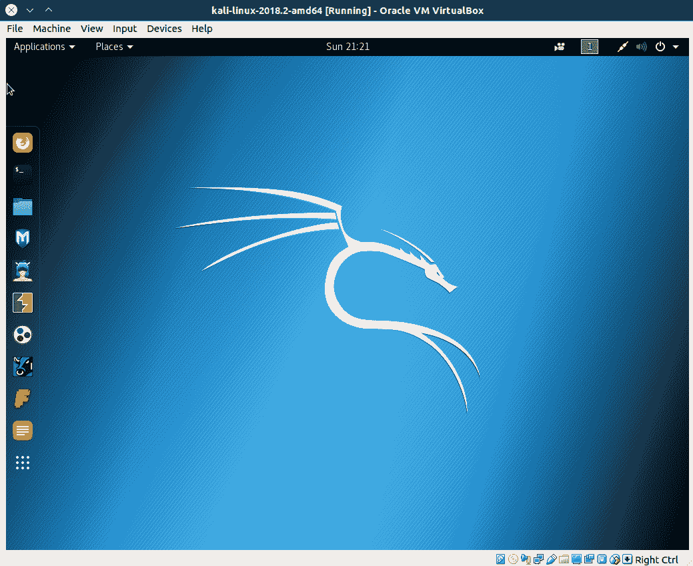

GNOME3 默认桌面

左侧边框上的工具栏是“收藏夹”组。打开任何应用程序时，其图标会出现在左侧的收藏夹组中，如下面的屏幕截图所示，我在其中打开了 OWASP ZAP：

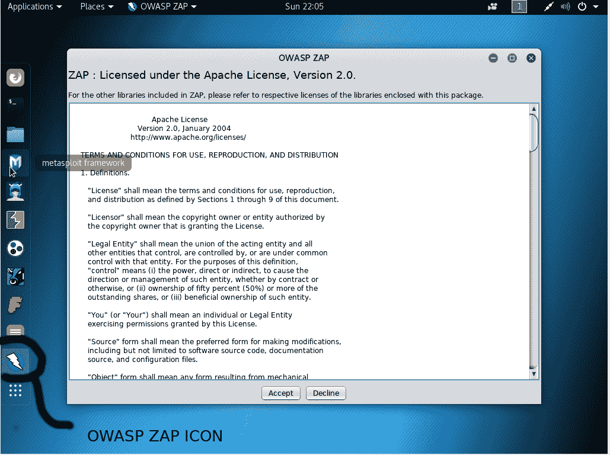

将应用程序添加到收藏夹组

安全工具菜单位于桌面左上角的应用程序选项卡下。这是一个非常好的分类列表，可以更容易地找到您想要使用的任何工具。该列表显示在以下屏幕截图中：

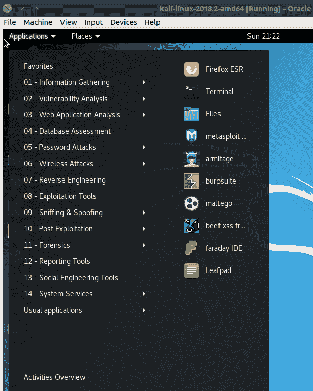

用于 Kali 的 Gnome 应用程序菜单

在 GNOME3 中更改桌面图像很容易，但是设置菜单有点难找到。它隐藏在右上角的图标下。以下屏幕截图显示了系统菜单，其中包含音量控制、网络连接对话框和设置编辑器：

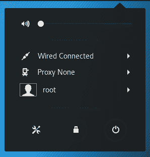

Gnome 系统菜单

Gnome 中的大多数设置都可以在设置对话框中找到，如下一个屏幕截图所示。有 Wi-Fi、背景、通知、搜索、区域和语言、通用访问、在线帐户、隐私、共享、声音、电源和网络的设置表。以下屏幕截图显示了桌面编辑器以及默认桌面图像：

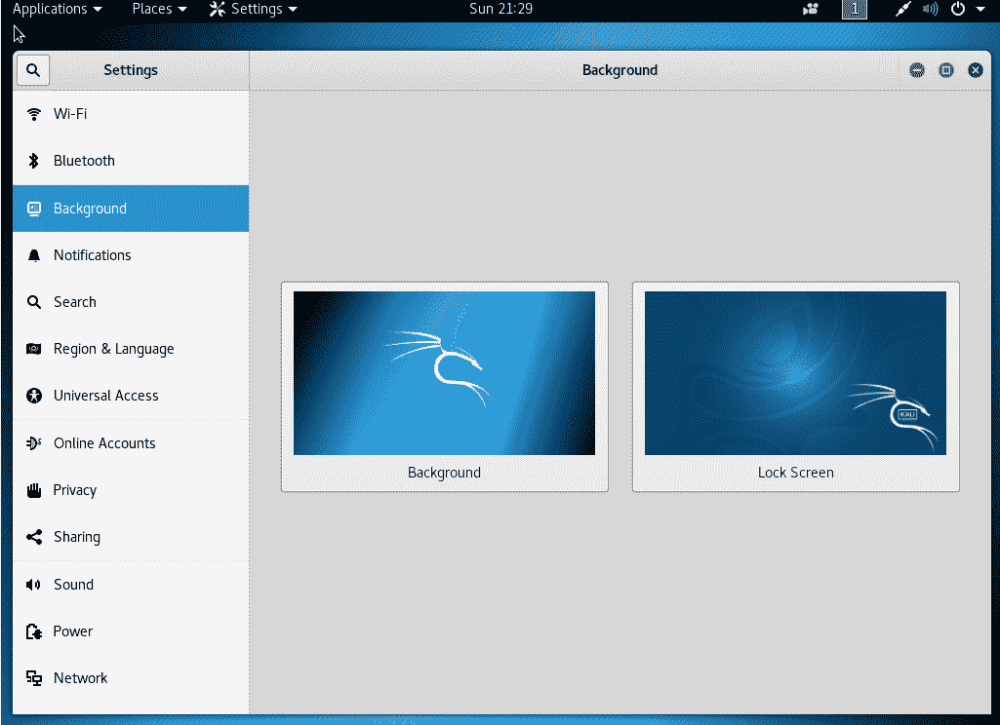

Gnome 设置对话框

要更改图像，只需单击要更改的图像。这将打开一个对话框，您可以从包含的多个图像中选择一个，也可以从图片目录中的图像中选择自己的图像：

# Gnome 3 桌面问题

*   似乎没有任何简单的方法可以将应用程序添加到收藏夹组
*   下拉菜单栏使用滑块将您带到常用的应用程序菜单，而不是全长子菜单

# KDE 桌面

KDE 在 Linux 早期就已经存在，是 Bo Weaver 的最爱。随着年龄的增长，稳定性也随之提高，KDE 是一款非常稳定的台式机。它的外观和感觉与 Windows 非常相似，因此对于 Windows 用户来说，它很容易使用。KDE 的一个优点是桌面高度可配置。如果你不喜欢它的样子，就改变它。这可能是一个很大的优势。KDE 配备了所有最新的跳跃猴子和功能。你可能喜欢你的桌面环境，就像我们一样。添加了什么最新的东西并不重要，只要您可以将桌面配置为多年来的样子。这有助于*肌肉记忆*。肌肉记忆发挥了作用，因为将所有东西都放在预期的位置可以降低工作的开销，因为没有任何时间花在搜索你每天使用的常用工具上。由于开发人员决定应用程序不再需要菜单栏，因此不必考虑工具在机器上的隐藏位置或如何保存文件更有效。有了 KDE，你可以把你的桌面改回一个老式的没有任何装饰的桌面，一切都和多年前一样。如果您觉得无聊，您可以自定义桌面，而不是默认的 Kali 外观。下一个屏幕截图显示默认桌面，应用程序中的“开始”菜单处于打开状态。菜单组织类似于您已经看到的 Gnome 3 菜单：

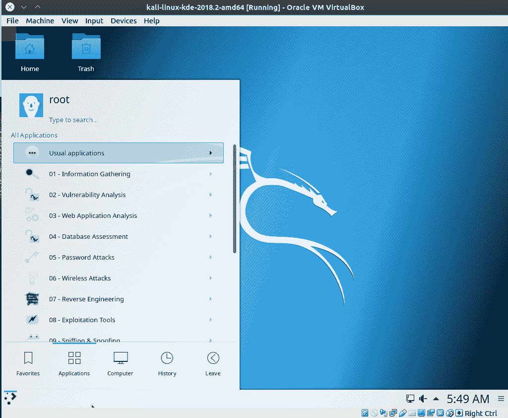

默认 KDE Kali 桌面

KDE 的一个缺点是，由于它是高度可配置的，并且具有许多内置功能，因此它对机器内存的要求非常高，对视频卡的要求也很高。KDE 确实需要在具有大量内存的现代机器上运行。此外，由于高度可配置，有时很容易将设置搞砸。

KDE 的一个优点是桌面小部件。桌面小部件是在桌面上运行的小型应用程序，用于执行许多操作。黑客攻击时，您需要密切关注本地系统资源。您可以使用一些小部件来快速查看系统内存、CPU 和网络使用情况。这是一件可悲的事，在工作的中间，再发射一个工具，让你的系统崩溃，因为你的内存用完了。使用小部件，您可以随时关注内存使用情况、网络和 CPU 使用情况。

KDE 在使用多个监视器时也能很好地工作，并且在分配哪个监视器是主监视器以及工具栏的位置时是完全可配置的。它还可以恢复为使用单个监视器，而无需重新启动或播放配置。这是伟大的，当你的机器是一台笔记本电脑，你可以移动很多。

KDE 开发者似乎明白平板电脑的桌面界面在使用鼠标的工作站上无法工作。自从平板电脑问世以来，KDE 现在真的有了两个接口，Plasma 和 Neon，当硬件发生变化时，它们会互换。它们都使用相同的后端工具集；从平板电脑模式切换到工作站模式时，只有外观和功能发生变化。这是 Windows 8 桌面的故障，也是 Gnome 桌面的故障。您不能设计一个使用手指和鼠标的界面。你最终得到的是一个界面，这两个界面都不能很好地工作。

# KDE 问题

KDE 在图形上很忙，并且使用了大量资源。这使得它不适用于非常旧的机器，或图形内存较低的机器。

*   **表演！**：这是安装程序问题，您可能无法获得此效果。创建 Kali Linux 的人会随着时间的推移向 ISO 磁盘文件添加更新，当 Wolf 安装时，它发现了这个问题。修复起来很容易，重要的是不要惊慌。如果你的安装出现这种情况，你没有做错什么。安装完成后，KDE 实例加载到 tty1 全屏 CLI，`startx`不会启动 GUI。`startx`是`xinit`包的一部分，因此您可以通过以 root 用户身份（您刚刚登录的帐户）输入以下内容来安装`xinit`：

```
#> xinit 
```

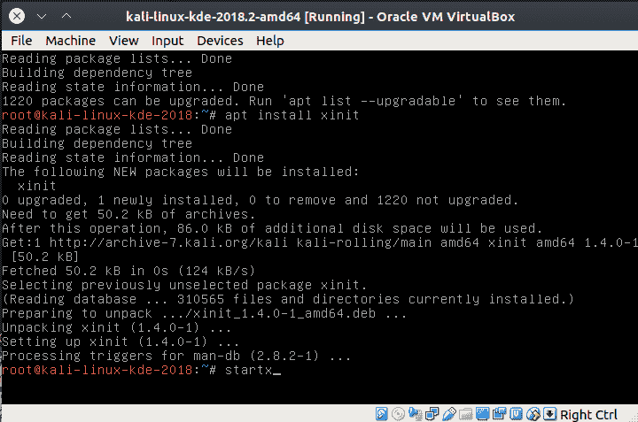

安装 xinit 后的 KDE startx

# LXDE 桌面

LXDE 代表轻量级 X11 桌面环境，由编写 LXDE 第一个模块的台湾程序员 Hong Jen Yee 于 2006 年设计。这是一个文件管理器。这让人想起 Linux 内核本身的创建，Linus Torvalds 从一个文件管理器模块开始。安装有问题，但实时磁盘似乎运行良好。我注意到 Kali Linux 图形化安装要求机器域，但常规安装不要求。下面的屏幕截图显示了默认的 LXDE 桌面。

这个桌面环境也让人联想到 Windows XP，它的菜单启动按钮位于左下角：

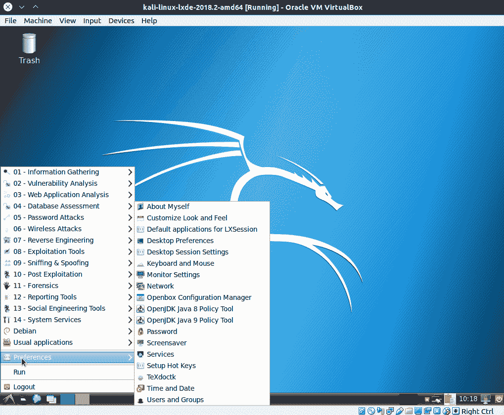

LXDE 默认桌面视图

要更改桌面背景，请转到左下角的菜单，然后选择“首选项”|桌面首选项。菜单显示在下一个屏幕截图中。如果你想在背景图像上有更好的选择，请查看[https://pixabay.com/](https://pixabay.com/) ：

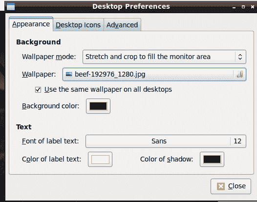

LXDE 桌面图像首选项对话框

# LXDE 问题

*   **SHOW STOPPER**：图形安装失败，因为**没有计划分区表，也没有计划创建文件系统**
*   **SHOW STOPPER**：由于**未安装操作系统**导致常规安装失败

# 配对桌面

MATE 桌面是现已弃用的 Gnome 2 桌面环境的分支。MATE 代表 MATE 先进的传统环境。这是一个类似于 GNU 首字母缩略词的结构，*GNU 不是 Unix*。将 fork 重命名为 MATE 避免了当前 gnome3 环境中的命名约定问题。

MATE 包括许多 Gnome 应用程序的分支，开发人员已经编写了新的应用程序。这些名字是西班牙文的，以反映马特的阿根廷血统。

MATE 应用程序包括以下内容：

*   **Caja**：文件管理员（来自鹦鹉螺）
*   **Atril**：文档查看器（来自 Evince）
*   **Engrampa**：档案管理员（来自档案管理员）
*   **配对终端**：终端仿真器（来自 GNOME 终端）
*   **马可**：窗口管理器（来自元城）
*   **Mozo**：菜单项编辑器（来自阿拉卡特）
*   **Pluma**：文本编辑器（来自 Gedit）

MATE 的第一次引导和所有后续引导将我们带入运行级别 3，如以下屏幕截图所示：

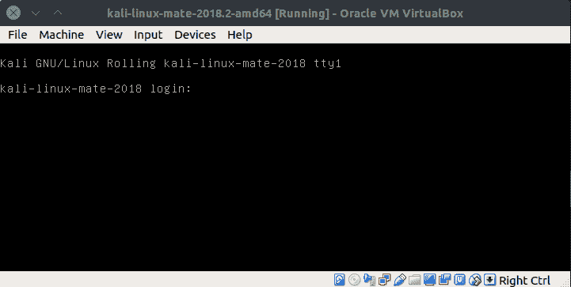

大副第一靴

MATE 的默认 GUI 为大多数 Linux 用户所熟悉，因为它是 GNOME2 的镜像。下一个屏幕截图显示带有默认 Kali 徽标的桌面。应用程序、位置和系统菜单结构是 Linux 桌面的一个长期标志，许多 Linux 老用户欢迎 MATE 团队为保持传统所做的努力：


梅特圭

以下屏幕截图显示了 MATE 桌面上所有三个系统菜单，其中代表性子菜单处于打开状态。“位置”菜单打开 Caja（文件管理）窗口：


配对系统菜单

“外观”菜单为您提供 12 个预设的外观首选项，然后可以进一步自定义这些首选项。以下屏幕截图显示了这些预设的选择：


配合外观预设

# 配偶问题

引导到运行级别 3 的行为是困难的，但并不是不可克服的，正如我们所知道的，当面对这个屏幕时，尝试`startx`。根据您下载 MATE 的日期，您可能会或可能不会遇到此问题。这是服务器的标准运行级别，但您可能希望在 Kali Linux 中同时使用 GUI 和 CLI 工具。

# Xfce 桌面

Xfce 桌面是一个轻量级桌面环境，是 Wolf Halton 的个人最爱。在编写本书第一版时，他使用 Xfce 保存资源。他今天使用它作为高度定制和吉诃德版本的 Ubuntu Studio 操作系统的一部分，来编写本书的最新版本。

该桌面环境的名称缩写为**ex eff cee ee**。它曾经是 X-Forms 公共环境的首字母缩写，但现在它使用的是 GTK 工具包而不是 X-Forms。Xfce 最初设计用于替代 CDE，CDE 是 1996 年的 Unix 通用桌面环境，当时后者仍然是专有的。有些人可能会认为 XFCE 在外观和外观上有点过时。默认的 Xfce 桌面显示在以下屏幕截图中：


Xfce 默认桌面

底部的工具栏最小，但功能齐全：

*   第一个按钮最小化所有窗口，显示桌面
*   第二个按钮打开命令行终端仿真器
*   第三个按钮打开 Thunar 文件管理器
*   第四个按钮打开 Firefox web 浏览器
*   第五个按钮是应用程序查找器
*   第六个按钮是活动用户的主文件夹

下面的屏幕截图显示了打开`root`主文件夹、终端模拟器、浏览器窗口和应用程序查找器的结果。`application`文件夹中有一个应用程序菜单，与左上角的应用程序按钮相同：

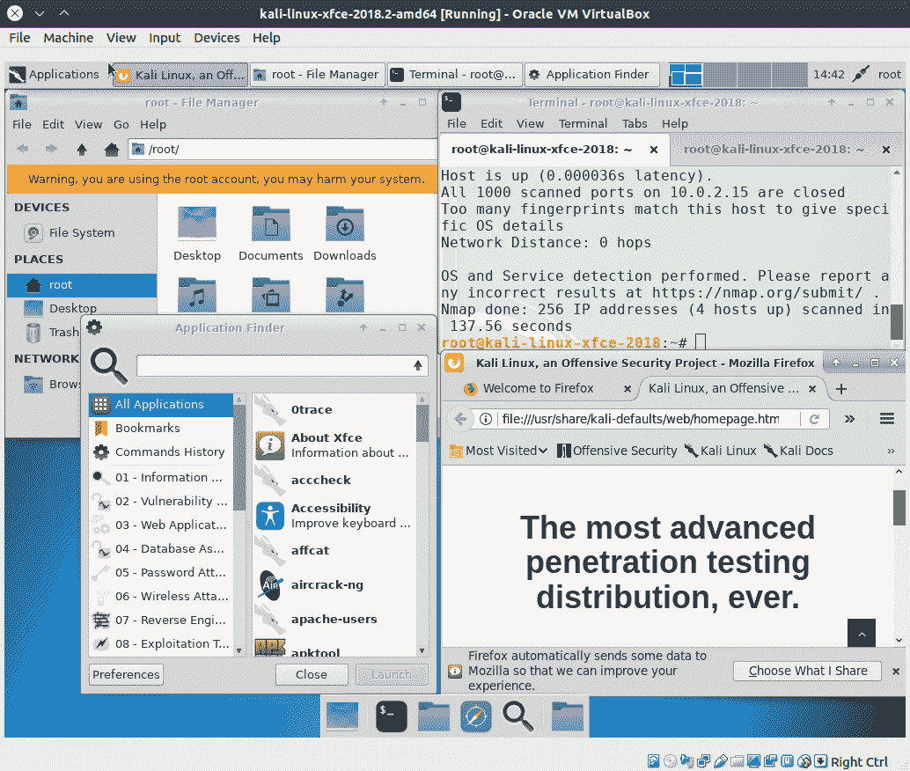

Xfce 下部工具栏示意图

更改个性化设置最明显的方法是将桌面更改为您选择的图像。有四个选项选项卡可以对桌面环境进行更深入、更微妙的更改，并使 Xfce 成为您自己的。以下屏幕截图显示了这四个选项卡中的三个：


Xfce 外观选项

# Xfce 问题

Xfce 台式机中没有真正的 ShowStopper。也许这是因为 Xfce 是一个非常稳定的桌面环境；它从未带来任何问题。

# 选择您的外观和感觉

外观和感觉是主观的。没有人有完全平均的气质。用例将在您的硬件选择和使您满意的定制量中扮演重要角色：

*   如果您总是使用 USB 记忆棒或实时 DVD 光盘运行，那么最好使用 Gnome 3 桌面，因为开发人员对它的测试最多，或者使用 Xfce 桌面，因为它使用的资源最少
*   如果要安装到虚拟机中，可能需要使用 Xfce 或 LXDE 桌面环境，因为虚拟机往往具有较低的资源级别
*   如果您正在加载到专用服务器或笔记本电脑，您可能拥有最高的资源级别，并且您不太可能经常将操作系统吹走，因此选择 E17 或 KDE 台式机，因为它们是最可定制的
*   如果您已经对任何桌面环境有了深入的了解，那么您可能应该选择它，仅仅是为了它为您提供的舒适度

# 将 Kali 配置为您的日常驱动程序

Kali 自首次开发以来已经走过了漫长的道路。它是 Linux 的第一个精简版本，设计为作为 VM 运行，或通过 USB 或 CD 运行。你的普通计算工具就在那里。您会注意到，Kali 被设计为在 root 帐户下运行。在安装过程中，与大多数其他发行版不同，安装中没有正常的设置用户帐户部分。当然，这通常是一个很大的安全问题。普通用户永远不应该有根级别的系统访问权限。今天，在大多数 Linux 发行版上，根帐户基本上被禁止进行交互式登录，系统管理说明告诉您使用`sudo`访问系统级文件。基于 GUI 的管理应用程序要求用户`sudo`进入并使用其凭据打开配置更改并保存到系统。这对于设置为正常使用的系统来说是一个好主意，但是当笔测试时，您需要直接访问硬件和系统级。在每个命令前面使用`sudo`并不是一个有用的选项。

下一个屏幕截图是 Bo 编写本章的机器的桌面。由于他在写文档、在互联网上查找信息和查看电子邮件，他使用了基本的非特权用户帐户。在桌面上记下他的个人照片。在系统上使用多个帐户时（特别是其中一个帐户是 root 帐户时），可能需要为每个帐户使用不同的墙纸。这有助于提醒您如何登录，并防止您在根帐户中执行愚蠢的操作。这也有助于保护您免受互联网上的恶习：


Bo Weaver 的桌面

以下屏幕截图是此计算机的根桌面。毫无疑问，当您使用此壁纸时，您所处的位置是：

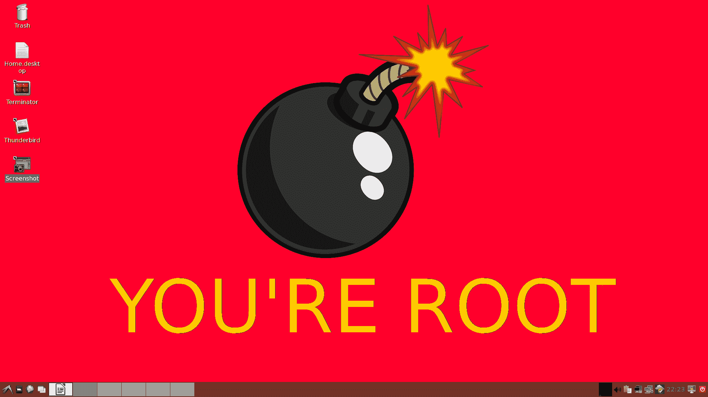

Bo Weaver 的根桌面

# 用户帐户设置

在您设置并运行 Kali 之后，您需要将普通用户帐户添加到系统中，使其成为您的日常驱动程序。用户管理器应用程序没有加载大多数 Kali 发行版。它们可以安装，但最简单的方法，也是在所有发行版上都可以使用的方法是从终端发出的旧的`useradd`命令，如下一个屏幕截图所示。

此用户进程和所有其他用户进程的用户是 root：


添加管理员用户

为了分解命令选项的含义，下面是添加密码为`Password`的用户`fred`的示例。确保将用户名和密码更改为您的唯一帐户；我们不再允许`fred`出现在我们的网络上：

```
useradd -m -U -G sudo -p LamePassword fred  
```

此命令使用的标志如下所示：

*   `-m`：在`/home`目录中为用户设置主目录。
*   `-U`：此标志为新用户设置唯一的用户组，组名与用户名相同。
*   `-G sudo`：这会将新用户添加到更多的组中。您希望您的普通用户帐户具有 sudo 访问权限，因此我们正在将该用户添加到 sudo 组。
*   -`p LamePassword`：此标志设置帐户的密码。请不要在这里用蹩脚的东西。
*   `fred`：我们使用帐户的新用户名结束命令。
*   接下来，只需点击*输入*键，即可设置新的用户帐号。

有两个应用程序需要加载才能有一个工作桌面：LibreOffice 或 apacheopenoffice，以及一个电子邮件客户端。OpenOffice 不在 Kali repos 中，因此在本演示中，我们将使用 LibreOffice。Mozilla Thunderbird 是一个有用的电子邮件/日程安排工具。我们将在演示中使用这个。Kali 没有默认安装的电子邮件客户端，因为它是在 root 下运行的。警告一句：永远不要打开根帐户下的电子邮件。坏事可能会发生！

首先，确保您的包列表是最新的，因此运行以下操作：

```
apt-get update  
```

接下来，安装 OpenOffice 和 Thunderbird：

```
apt-get -y install libreoffice thunderbird  
```

或者，使用以下命令：

```
apt install libreoffice thunderbird  
```

`-y`标志将回答是安装软件包。在这一点上，喝杯咖啡或散散步，因为这将需要一点时间来安装。第二个命令做同样的事情，但它让我们查看要安装和升级的包。下一个屏幕截图显示了第二个命令结果的节略读数。此屏幕截图显示了安装的主要部分之间的波浪线，以将实际存在的三个详细屏幕中的所有内容都放入图像窗口。这里有几十个建议的软件包，您可以忽略这些，只需点击*Y*键就可以了。您也可以稍后返回，从终端窗口复制所有建议的包名称，然后运行以下命令：

```
apt install [all those names you just copied]  
```

将它们添加到您的安装中：

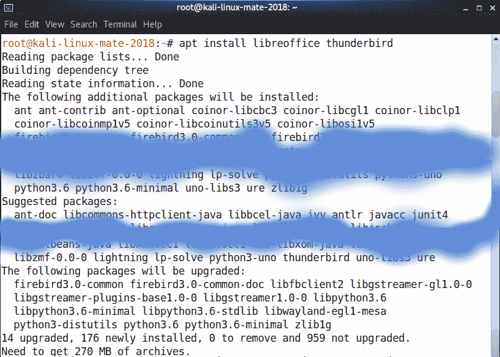

安装邮件客户端和 Office 应用程序

现在你准备好了。将 root 桌面更改为提醒您以 root 身份登录的桌面。从 root 注销，并在登录屏幕上输入新用户的凭据。一旦进入，您现在就拥有了一个与普通用户帐户完全安全的运行帐户。使用此帐户，您可以安全地浏览互联网、阅读电子邮件，以及执行您通常使用系统执行的所有其他操作。当您需要进行一些笔测试时，只需以 root 用户身份登录即可。

# 总结

在本章中，我们简要介绍了桌面环境的当前选项以及使用它们的一些理由。大多数定制都发生在笔记本电脑和台式机上的裸机安装上。最少的定制将发生在实时磁盘和 U 盘用例上，因为资源不足，更改将不会保留。