# 信息收集和脆弱性评估

有一种说法是所有 Windows 系统都很容易被利用。这并不完全正确。几乎任何 Windows 系统都可能被强化到需要很长时间才能利用其漏洞的程度。在本章中，您将学习如何在坏人之前发现您的 Windows 网络和漏洞。

您还将学习如何调查和映射您的 Windows 网络，以找到易受攻击的 Windows 系统。在某些情况下，这将增加您对前十大安全工具的了解；在其他案例中，我们将向您展示处理此类调查的全新工具。

本章将介绍以下主题：

*   网络足迹
*   带注释的 Nmap 命令选项列表
*   使用 OpenVAS
*   使用马尔蒂戈
*   使用 KeepNote

# 技术要求

要遵循本章，您需要以下内容：

*   Kali Linux 的运行版本
*   要扫描的网络上的某些 Windows 主机

# 网络足迹

没有一张好地图，你就找不到路。在本章中，我们将学习如何收集网络信息和评估网络上的漏洞。在黑客世界，这被称为**足迹**。这是任何正义黑客的第一步。这是你节省时间和大量头痛的地方。

没有你的目标，你只是在黑暗中射击。任何优秀渗透测试人员工具箱中最大的工具就是你的**心态**。你必须有狙击手的头脑。你可以了解目标的习惯和行动。您可以了解目标所在网络上的流量。你发现目标的弱点，然后攻击这些弱点。搜索并摧毁！

为了做好足迹，您必须使用 Kali 附带的几种工具。每个工具都有它的优点，并从不同的角度观察目标。你的目标视野越大，你的攻击计划就越好。

封装外形将根据您的目标是在公共网络上的外部，还是在局域网上的内部而有所不同。我们将涵盖这两个方面。

扫描和使用这些工具对公共网络上的机器进行攻击，而您没有访问该网络的书面许可，这属于联邦犯罪。

在本书中，对于 Kali Linux 的大多数实例，我们将使用专门为本书构建的在**VMware**和**Oracle VirtualBox**上运行的虚拟机。我们每天使用的 Kali 实例都是经过大量定制的，只需一本书就可以涵盖这些定制。对于外部网络，我们将使用 internet 上的几个实时服务器。

请尊重并不要提及这些地址，因为其中两个是 Bo 的个人服务器，还有几个位于亚特兰大云技术服务器集群中。

请再次阅读前面的说明，并记住您没有我们的许可来攻击这些机器。*如果你不能支付时间，就不要犯罪*。

# Nmap

如果不谈论**Nmap**，你就不能谈论网络。Nmap 是网络管理员的瑞士军刀。它不仅是一个伟大的足迹工具，而且是最好的和最便宜的网络分析工具，任何系统管理员可以在他们的机器上。这确实是网络分析的瑞士军刀：

*   它是检查单个服务器以确保端口正常运行的一个很好的工具
*   它可以对整个网段或网络上的多个主机进行心跳 ping
*   它甚至可以在关闭 ICMP（ping）时发现机器
*   它可用于压力测试服务。如果机器在负载下冻结，需要修理

Nmap 是由 Gordon Lyon 于 1997 年创建的，他在互联网上处理 Fyodor。Fyodor 仍然维护 Nmap，可以从[下载 http://insecure.org](http://insecure.org/) 。你也可以在那个网站上订购他的关于 Nmap 的书。这是一本好书。这价钱很值！Fyodor 和 Nmap 黑客在网站上收集了大量信息和安全电子邮件列表。因为您运行的是 Kali Linux，所以已经安装了 Nmap 的完整副本！

下面是一个针对 Kali Linux 实例运行的 Nmap 示例：

1.  从顶部栏上的图标或单击菜单链接打开终端：应用程序|附件|终端。如果需要，您也可以选择 Root 终端，但由于您已经以 Root 身份登录，因此不会看到任何差异。
2.  在命令提示下键入`nmap -A 10.0.0.4`。（您需要输入正在测试的机器的 IP。）
3.  输出显示 1000 个常用端口中打开的端口。在本例中，没有打开的端口，因此要使其更有趣，请执行以下操作。
4.  通过键入`/etc/init.d/apache2 start`启动内置 web 服务器。
5.  web 服务器启动后，再次运行 Nmap 命令，如下所示：`nmap -A 10.0.0.4`。

6.  如您所见，Nmap 正在尝试发现操作系统并告知 web 服务器版本：


下面是从 Git Bash 应用程序运行 Nmap 的示例，该应用程序允许您在 Windows 桌面上运行 Linux 命令。此视图显示了 Nmap 的一个简洁功能。如果您感到无聊或焦虑，并且认为系统扫描时间过长，您可以按下向下箭头键，它将打印一条状态行，告诉您扫描完成的百分比。这与告诉您还有多少时间进行扫描不同，但它确实让您了解已完成的操作：


Nmap 也是 Windows 计算机上可安装的 Windows 应用程序。如果你是一名网络管理员或系统管理员，你会发现这是一个很好的工具，不仅用于示意图，而且用于系统和网络故障排除。对于其他系统，您可以在[找到 Nmap 安装程序 https://nmap.org/download.html](https://nmap.org/download.html) 。

# Zenmap

Nmap 附带了一个名为**Zenmap**的 GUI。Zenmap 是 Nmap 应用程序的友好图形界面。您将在 Kali Linux |信息收集|网络扫描仪| Zenmap 下找到 Zenmap。界面如下所示：

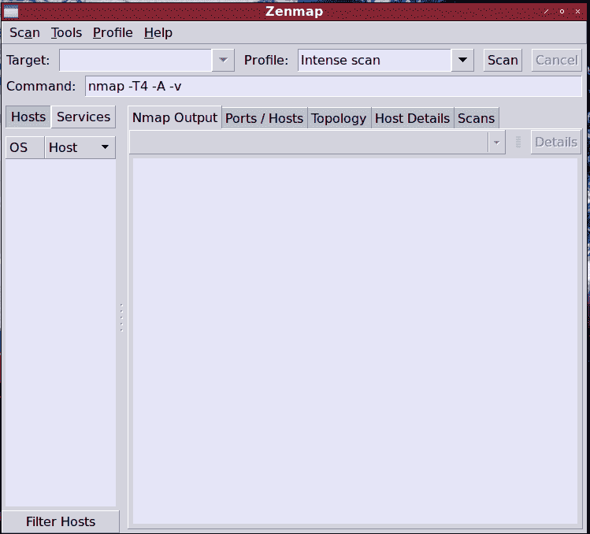

Zenmap 的一个很酷的特性是，当您使用按钮设置扫描时，应用程序还会写出命令的命令行版本，这将帮助您了解在命令行模式下与 Nmap 一起使用的命令行标志。

黑客提示：

大多数黑客在 Linux**命令行界面**（**CLI**上非常自如。您希望在命令行上学习 Nmap 命令，因为您可以在自动化 bash 脚本中使用 Nmap，并组成 cron 作业，以使例行扫描更加简单。您可以将 cron 作业设置为在网络较安静的非高峰时间运行测试，并且测试对网络合法用户的影响较小。

密集扫描选项产生一个命令行`nmap -T4 -A -v`：

*   这会产生快速扫描；`T`表示定时（从 1 到 5），默认定时为`-T3`。计时越快，测试越粗糙，如果网络正在运行一个**入侵检测系统**（**IDS**），您被检测的可能性就越大。
*   通过深度端口扫描，包括操作系统标识，并尝试查找端口上侦听的应用程序以及这些应用程序的版本。`-A`代表一切。
*   最后，`-v`代表冗长。`-vv`表示非常详细。

在下面的下拉框中，我们可以看到最常见的扫描列表：


# 长篇大论造成了不同

接下来的三个屏幕截图显示了详细程度在操作系统扫描中所起的作用。操作系统扫描包括隐形扫描，因此`nmap -O hostname`与`nmap -sS -O hostname`完全相同：

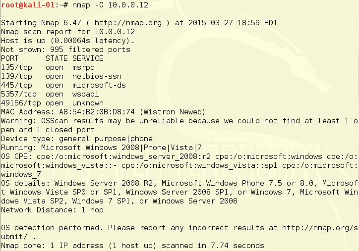

这里的详细版本经过了轻微调整，以将所有细节融入到屏幕截图中。当`-v`或`-vv`选项添加到搜索字符串时，不同的扫描选项具有不同的增强内容。当您使用基本显示选项选择了一些可能的目标时，使用`-v`或`-vv`是有意义的：


在下一个屏幕截图中，我们在详细性标志中添加了另一个`v`（`-vv`，并重新运行扫描。正如我们所看到的，输出了更多关于系统和扫描的信息：


# 扫描网络范围

以下示例的网络范围为`192.168.202.0/24`，选择的扫描类型为无 ping 的密集扫描。然后单击“扫描”按钮，即可运行扫描。在扫描过程中，您将在屏幕上的“Nmap 输出”选项卡中看到输出。通过扫描，我们看到网络上有六台活动主机。从 IP 地址旁边的图标可以看出，我们已经识别了两台 Windows 机器、两台 Linux 机器和两个未知的操作系统。请注意，在下面屏幕截图的命令字段中，当您设置扫描变量时，命令行变量如何显示在该字段中。这是从命令行学习如何使用 Nmap 的好方法：

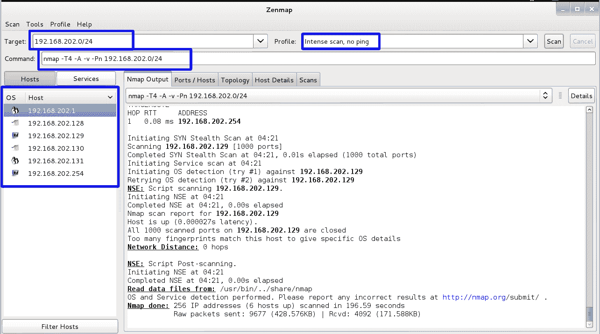

如果网络已关闭 ICMP，则尝试 ping 计算机会花费大量时间。在目标机器上 ping UDP 端口所需的时间几乎与 ping 相同。无论哪种情况，每台机器每个端口大约需要 75 秒。在第一种情况下，这意味着 6 台机器的 ping 需要 450 秒才能通过 ping 测试。UDP 搜索测试每台机器的多个端口。在每个标准 UDP 端口扫描测试 1000 个端口时，每台机器大约需要 21 小时来测试 UDP。如果您没有很好的理由使用 Nmap 检查 UDP 端口，那么这不是一个经济高效的做法。

通过单击“拓扑”选项卡，然后单击“主机查看器”按钮，可以获得一个很好的主机列表。通过单击地址，您可以查看每个主机的详细信息。请注意，地址是不同的颜色。Nmap 为您挑选低垂的水果。绿色表示安全，而黄色和红色表示存在漏洞或服务，可被利用：

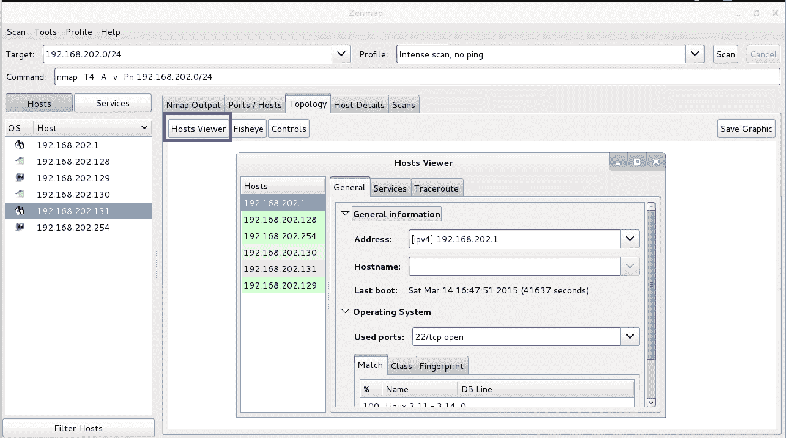

Zenmap 还有一个很好的比较扫描的功能。您可以在“工具”下的菜单栏中找到它|比较结果。在下面的屏幕截图中，您将看到我们在网络上运行了两次扫描。当我们比较两者时，我们可以看到，在第二次扫描中，发现了一台新机器。在第一次扫描的结果中，它被标记为红色，并且显示`192.168.202.131`为向下。绿色时，显示为 up，并显示打开的端口和系统信息：


以下屏幕截图是从命令行运行 Nmap 的结果。如前所述，Nmap 已移植到 Windows。如果您的公司允许，可以通过命令窗口中的命令行或通过 Windows PowerShell 在 Windows 系统上运行 Nmap：

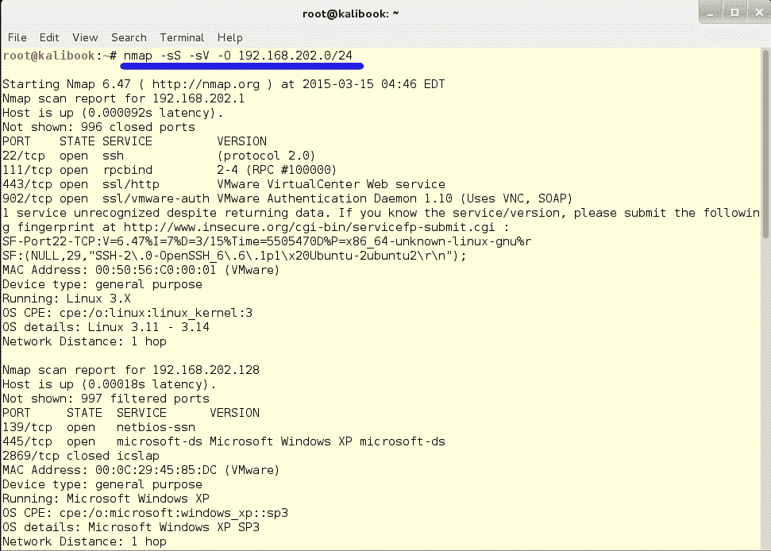

如果您有一个大型网络，并且只想查找 Windows 计算机以便关注 Windows 漏洞，则可以使用以下命令运行快速扫描：`nmap -T4 -F 10.0.0.0/24`。或者，您可以通过键入`nmap -sV -T4 -O -F -version-light 10.0.0.0/24`选择快速扫描增强版。这些将让你很好地了解你真正想要关注的机器。根据五个开放端口中的四个与 Windows 相关的事实，看起来`10.0.0.12`是一台 Windows 机器：

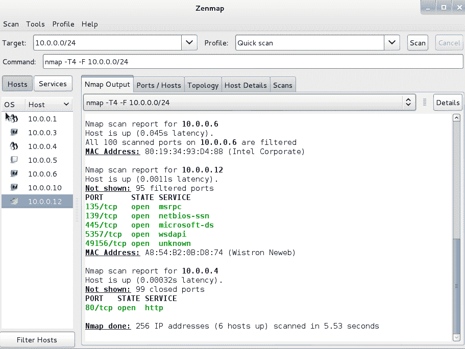

查看“拓扑”选项卡时，可以通过更改窗口底部控件的值来调整组的大小。通过增加**兴趣因子**来增加图形的大小。标准视图将本地主机置于分组的中心，但如果单击其他主机之一，则会将其置于中心，如下所示：


# 带注释的 Nmap 命令选项列表

尽管 Zenmap 有一个简短、有力的下拉列表，列出了流行和有用的扫描，但在定制扫描时可以使用各种各样的命令和选项。

**在哪里可以找到关于这件事的说明？**

在 Linux 设备上，有三个地方可以找到有关命令行应用程序的更多信息：

*   **帮助页面**：几乎所有 Unix 和 Linux 应用程序都有一个帮助文件，您可以通过在命令行上键入应用程序名和`-h`来访问该文件。考虑下面的例子：
*   **手册页**：这是大多数现代命令行应用程序的完整手册，您可以通过在命令行上键入`man`和应用程序名称来访问该手册。参见以下示例：`root@kali-01: ~#-`。这就很好地解释了如何使用 Rsync，一种安全的日志文件传输协议。手册页的质量参差不齐，许多手册页实际上是由火箭科学家编写的，因此新手可能需要研究如何阅读手册页，然后手册页才会对他们有用。Nmap 手册页写得很清楚，有可理解的示例可供试用。
*   **信息页面**：对于 Bash shell 内置，有一组信息页面，而不是手册页面。要进入信息页面，请键入`info`和应用程序名称。例如，`root@kali-01: ~# info ls`将向您显示 ls 命令的信息页面，这是 DOS 中 DIR 命令的 Linux 版本。

`-h`命令会在终端窗口中为您显示内嵌文本，因此在信息滚动过去后，您会立即返回到命令提示符。`man`和`info`命令启动文本阅读器，**减去**，因此即使您仍在终端窗口中，也可以在文档上下滚动。要退出**少**，只需按 Q 键即可。

Shift 键是您在 Linux 终端仿真器中的朋友。

如果您想在终端窗口中上下滚动，例如，如果`-h`帮助文件比单个屏幕长，只需按住 Shift+上下光标键即可。

复制和粘贴的热键顺序分别为*Shift*+*Ctrl*+*C*和*Shift*+*Ctrl*+*V*。*Ctrl*+*C*表示关闭 Bash Shell 中正在运行的应用程序，*Ctrl*+*V*根本不做任何事情。

Nmap 6.47 帮助文件可在[中找到 http://nmap.org](http://nmap.org) 。

| **用法**：`nmap [Scan Type(s)] [Options] {target specification}` |  |
| **目标规范**： |  |
| **Ex**： | `atlantacbudtech.com`、`aarrrggh.com/26`、`192.168.3.111`；`10.1-16.0-255.1-254` |
| `-L <inputfilename>`： | 来自主机/网络列表的输入。 |
| `-R <num hosts>`： | 选择随机目标。 |
| `-exclude <host1, [host2], [host3], ...>`： | 排除主机/网络。 |
| `-exludefile <exclude_file>`： | 从文件中排除列表。 |
| **主机发现**： |  |
| `-sL`： | 列表扫描-仅列出要扫描的目标。 |
| `-sn`： | Ping 扫描-禁用端口扫描。 |
| `-Pn`： | 将所有主机视为联机—跳过主机发现的 ping。 |
| `-PS/PA/PU/PY [portlist]`： | 对给定端口的 TCP SYN/ACK、UDP 或 SCTP 发现。 |
| `-PE/PP/PM`： | ICMP 回显、时间戳和网络掩码请求发现探测。 |
| `-PO [protocol list]`： | IP 协议 ping，与 ICMP ping 相反。 |
| `-n/-R`： | 从不进行 DNS 解析/始终解析[默认：有时]。 |

解析 DNS 为您提供了有关网络的更多信息，但它会创建 DNS 请求流量，这可能会提醒系统管理员发生了不完全正常的事情，尤其是在网络中未使用 DNS 的情况下。

这是 Nmap 附带的帮助文件的视图，包括我们的注释（您可以在[的手册页面上找到更多内容）http://nmap.org/book/man/](http://nmap.org/book/man/) ：

*   `--dns-servers <serv1[,serv2],...>`：指定自定义 DNS 服务器。
*   `--system-dns`：使用操作系统的 DNS 解析器。这是默认行为。
*   `--traceroute`：跟踪每个主机的跃点路径。这只有在大型、复杂、分段的网络中才有意义。

**扫描技术：**

*   `-sS/sT/sA/sW/sM`：TCP SYN/Connect（）/ACK/Window/Maimon 扫描
*   `-sU`：UDP 扫描
*   `-sN/sF/sX`：TCP Null、FIN 和 Xmas 扫描
*   `--scanflags <flags>`：自定义 TCP 扫描标志

NS-ECN 暂时隐藏保护（这是实验性的：有关更多信息，请参阅 RFC 3540）。

*   `CWR`：拥塞窗口缩小。用于指示数据包的大小正在减小，以在拥挤的网络条件下维持流量。
*   `ECE`：ECN Echo 具有双重作用，具体取决于 SYN 标志的值：
    *   如果设置了 SYN 标志（1），则表示 TCP 对等方支持 ECN。
    *   如果 SYN 标志清除（0），则表示在正常传输期间接收到 IP 报头集中具有拥塞经历标志的数据包（这由 RFC 3168 添加到报头）。
        *   `URG`：表示紧急指针字段有意义。
        *   `ACK`：表示确认字段有效。
        *   `PSH`：推送功能。请求将缓冲数据推送到接收应用程序。
        *   `RST`：重置连接。
        *   `SYN`：同步序列号。
        *   `FIN`：发送方不再提供数据。
*   `-sI <zombie host[:probeport]>`：空闲扫描。
*   `-sY/sZ`：SCTP 初始化/COOKIE-ECHO 扫描。
*   `-sO`：IP 协议扫描。
*   `-b <FTP relay host>`：FTP 弹跳扫描。

端口规格和扫描顺序：

`-p <port ranges>`：仅扫描指定端口。

例如，考虑下面的代码：

*   `-F`：快速模式扫描端口数少于默认扫描端口数
*   `-r`：连续扫描端口不会随机化
*   `--top-ports <number>`：扫描<号>最常用端口
*   `--port-ratio <ratio>`：扫描比给定`<ratio>`更常见的端口

服务/版本检测：

*   `-sV`：探测打开的端口以确定服务/版本信息
*   `--version-intensity <level>`：从 0（灯光）设置为 9（尝试所有探头）
*   `--version-light`：限制最可能的探头（强度 2）
*   `--version-all`：尝试每一个探头（强度 9）
*   `--version-trace`：显示扫描活动的详细版本（用于调试）

脚本扫描：

*   `-sC`：相当于`-script=default`
*   `--script=<Lua scripts>`：`<Lua scripts>`是以逗号分隔的目录、脚本文件或脚本类别列表
*   `--script-args=<n1=v1,[n2=v2,...]>`：为脚本提供参数
*   `--script-args-file=filename`：在文件中提供 NSE 脚本参数
*   `--script-trace`：显示所有发送和接收的数据
*   `--script-updatedb`：更新脚本数据库
*   `--script-help=<Lua scripts>`：显示关于脚本的帮助
*   `<Lua scripts>`是以逗号分隔的脚本文件或脚本类别列表

操作系统检测：

*   `-O`：启用操作系统检测
*   `--osscan-limit`：将 OS 检测限制在有希望的目标
*   `--osscan-guess`：尝试更积极地猜测操作系统

时间和性能：

指定时间间隔的选项以秒为单位，或者我们可以在值后面附加“ms”（毫秒）、“s”（秒）、“m”（分钟）或“h”（小时）。例如，`23ms`将转换为 23 毫秒。

*   `-T<0-5>`：设置计时模板（越高越快，噪音也越大）
*   `--min-hostgroup/max-hostgroup <size>`：并行主机扫描组大小
*   `--min-parallelism/max-parallelism <numprobes>`：探头并行化
*   `--min-rtt-timeout/max-rtt-timeout/initial-rtt-timeout <time>`：指定探头往返时间
*   `--max-retries <tries>`：限制端口扫描探头重新传输的次数
*   `--host-timeout <time>`：在此时间间隔后放弃目标
*   `--scan-delay/--max-scan-delay <time>`：调整探头之间的延迟
*   `--min-rate <number>`：每秒发送不低于<号>的数据包
*   `--max-rate <number>`：每秒发送包数不超过<个>

防火墙/IDs 规避和欺骗：

*   `-f; --mtu <val>`：片段数据包（可选具有给定 MTU）
*   `-D <decoy1,decoy2[,ME],...>`：用诱饵掩盖扫描
*   `-S <IP_Address>`：伪造源地址
*   `-e <iface>`：使用指定的接口
*   `-g/--source-port <portnum>`：使用给定的端口号
*   `--proxies <url1,[url2],...>`：通过 HTTP/SOCKS4 代理进行中继连接
*   `--data-length <num>`：向发送的数据包追加随机数据
*   `--ip-options <options>`：使用指定的 IP 选项发送数据包
*   `--ttl <val>`：设置 IP 生存时间字段
*   `--spoof-mac <mac address/prefix/vendor name>`：欺骗你的 MAC 地址
*   `--badsum`：使用伪 TCP/UDP/SCTP 校验和发送数据包

输出：

*   `-oN/-oX/-oS/-oG <file>`：分别以普通、XML、s|<和可分级格式将扫描输出到给定的文件名
*   `-oA <basename>`：三种主要格式同时输出
*   `-v`：增加详细程度（使用`-vv`或更大效果）
*   `-d`：提高调试级别（使用`-dd`或更大效果）
*   `--reason`：显示端口处于特定状态的原因
*   `--open`：仅显示打开（或可能打开）的端口
*   `--packet-trace`：显示所有发送和接收的数据包
*   `--iflist`：打印主机接口及路由（用于调试）
*   `--log-errors`：将错误/警告记录到正常格式的输出文件中
*   `--append-output`：附加到指定的输出文件，而不是删除指定的输出文件
*   `--resume <filename>`：恢复中止的扫描
*   `--stylesheet <path/URL>`：使用 XSL 样式表将 XML 输出转换为 HTML
*   `--webxml`：请参考 nmap.org 中的样式表以了解更具可移植性的 XML
*   `--no-stylesheet`：防止 XSL 样式表与 XML 输出关联

杂项：

*   `-6`：启用 IPv6 扫描。
*   `-A`：启用操作系统检测、版本检测、脚本扫描和跟踪路由。这是`-sS -sV --traceroute -O`的快捷方式。这是 Wolf 最喜欢的扫描选项。
*   `--datadir <dirname>`：指定自定义 Nmap 数据文件位置。
*   `--send-eth/--send-ip`：使用原始以太网帧或 IP 数据包发送。
*   `--privileged`：假设用户拥有完全权限。
*   `--unprivileged`：假设用户缺少原始套接字权限。
*   `-V`：打印 Nmap 版本号。不能与其他选项一起使用。
*   `-h`：打印帮助摘要页面。

示例：

```
nmap -v -A boweaver.com
nmap -v -sn 192.168.0.0/16 10.0.0.0/8
nmap -v -iR 10000 -Pn -p 80  
```

您可以构造自定义 Nmap 扫描字符串并将其复制到 Zenmap 中，这样您就可以享受 Zenmap 接口的好处。

# 使用 OpenVAS

在第 2 章中，我们为漏洞扫描设置了 OpenVAS。Nmap 在报告端口和服务方面做得很好，但缺乏扫描漏洞的能力。OpenVAS 将发现漏洞并生成系统报告。OpenVAS 的人员每周更新他们的漏洞列表，因此最好在运行扫描之前更新 OpenVAS。要在 Kali 上执行此操作，请从终端窗口运行以下命令：

```
root@kalibook : ~ # OpenVAS-nvt-sync  
```

这将为 OpenVAS 运行漏洞更新。第一次运行它时，您将看到以下屏幕截图中显示的信息，要求您迁移到使用 Rsync 更新漏洞。键入`Y`并点击*输入*键。更新将启动。第一次运行它时，它将花费相当长的时间，因为它必须为您提供可用插件和测试的完整列表。在`update`命令的后续运行中，它只添加新的或更改的数据，速度要快得多：


您还需要运行以下命令：

```
root@kalibook : ~ # OpenVAS-scapdata-sync  
```

更新完成后，我们就可以开始了。现在让我们启动 OpenVAS 服务。转到应用程序| Kali Linux |系统服务| OpenVAS | OpenVAS 启动。终端窗口将打开，您将看到相关服务正在启动。启动后，您可以关闭此窗口并转到以下链接：`https://localhost:9392`。

您什么时候不使用 OpenVAS？

在一些公司网络上，有扫描服务，可以用来扫描漏洞。执行两次没有任何意义，除非您怀疑官方公司扫描工具没有针对搜索范围进行正确配置，或者没有进行更新以包含对最新漏洞的搜索。Qualys、Nexpose 和 Nessus 等扫描服务都是很棒的扫描工具，可以完成与 OpenVAS 相同的任务。所有这些服务都以 XML 格式导出数据，随后可以将其导入 Metasploit 等工具。

现在，使用安装步骤中生成的非常长且复杂的密码登录到 OpenVAS web 界面。正常情况下，用户为`admin`。

现在是转到“管理”选项卡并将密码更改为更复杂但更容易记住的密码的好时机。

要运行第一次扫描，只需在扫描文本框中输入要扫描的计算机的网络子网或单个 IP 地址，然后单击按钮开始扫描。小极客女孩向导将为您设置几个正常参数并运行扫描。您还可以设置自定义扫描，甚至安排作业在给定日期和时间运行：

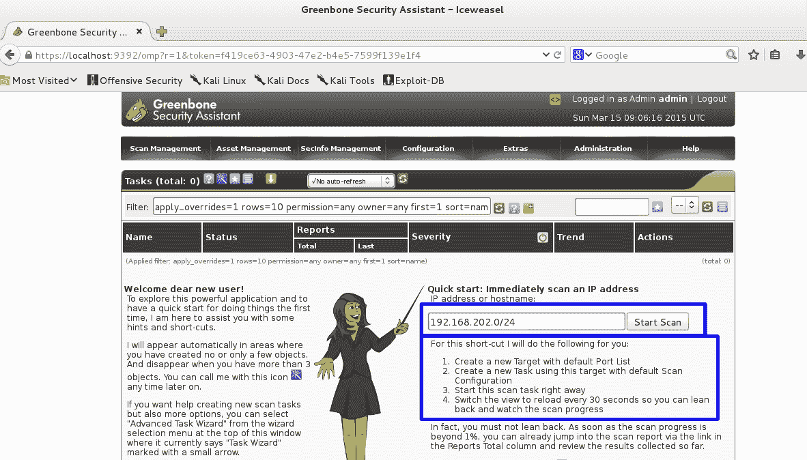

一旦开始扫描，您将看到以下屏幕。此时，您将看到它标记为 request，大约一分钟后屏幕将刷新，您将看到进度条开始移动。取决于你扫描的网络有多大，你可以去喝杯咖啡，吃顿饭，明天再来，或者去度周末。这需要一段时间。值得注意的一点是，在整个过程中，您不需要靠得太近就可以单击“下一步”按钮。

扫描完成后，您将看到如下屏幕。转到扫描管理选项卡，然后转到下拉菜单中的报告。这将带您进入报告页面，如下所示：


报告页面将为您提供扫描结果，将发现的漏洞从最严重到最低进行分类，如下所示：


从这里，您可以生成各种格式的报告。选择所需的格式并单击绿色按钮，如以下屏幕截图所示：


然后，您可以下载该报告。您可以对其进行编辑以显示您的公司徽标，以及文档中尚未包含的任何所需公司信息：

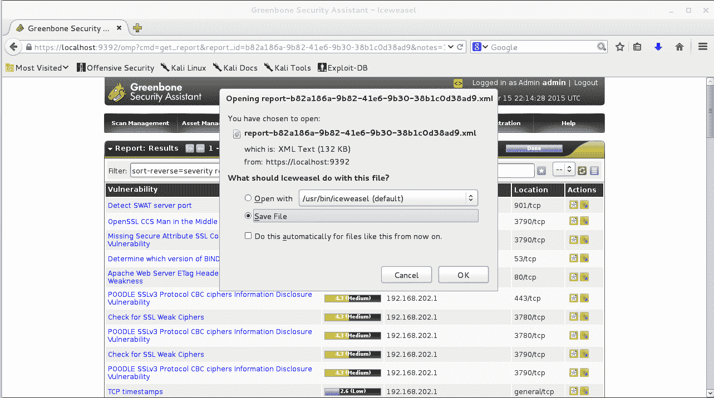

# 使用马尔蒂戈

**Maltego**是一种信息收集工具，除了收集网络信息外，还有很多用途。您还可以从各种来源收集有关人员和公司的信息。现在，我们将使用它来收集有关公共网络的网络信息。

第一次启动 Maltego 时，您需要进行一些设置，并在他们的网站上注册，以便登录到 Transform 服务器。这很简单，免费，而且没有垃圾邮件，所以给他们你的电子邮件地址不会有问题。首先，您需要选择要使用的版本。Maltego XL 和 Classic 是专业版，您必须付费才能获得许可证。CE 版本是免费版本，当您学习如何使用此工具时，我们将在下一节中使用的 CE 版本将正常工作。如果你以笔试为生，那么经典版本的许可证有点贵，但值得。付费版本将在其搜索中删除 10000 多个实体。CE 版本限制为每个实体 10 个。

1.  因此，选择 CE 版本并单击运行：


2.  接下来，填写用于注册的信息，解决验证码问题，然后单击下一步：

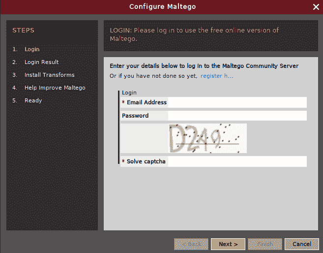

3.  所以，我们都注册了，我们得到了下面的窗口。单击“下一步”继续：

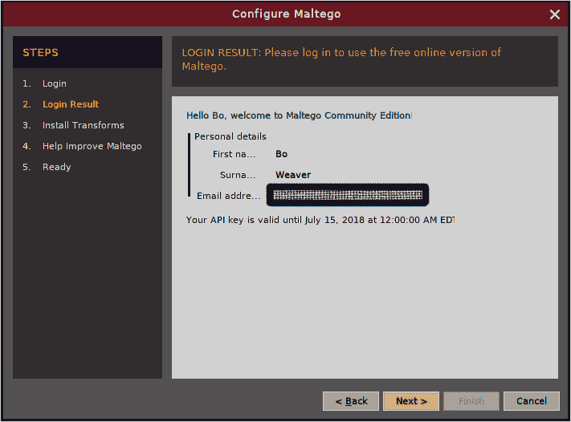

4.  接下来，我们会看到一个窗口，询问我们想要如何开始。我们将选择一个空白图表，然后单击 Finish，如下所示：


5.  单击“完成”后，将显示一个空白图表页，如下所示：

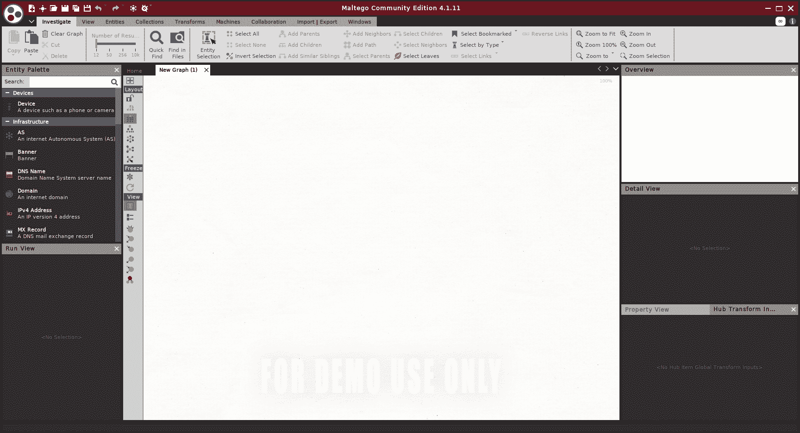

那么，让我们来封装一个域。

6.  单击左侧工具栏中的域图标并将其拖动到图形页面的中心。默认域显示为。这是 Maltego 的网站，现在只是一个占位符。

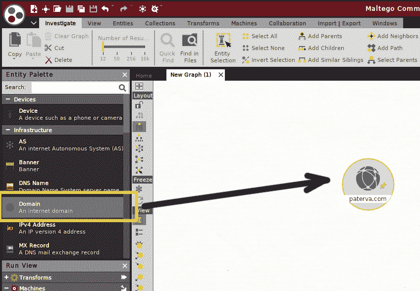

在右下角工具栏的“属性”视图中，将 paterva.com 更改为要填充的域。

记住：永远不要测试任何你不拥有或没有测试书面许可的东西！坐牢一点也不好玩，而且黑客攻击的力量越来越强大，你不想被贴上网络恐怖分子的标签。不，你没有权限测试我的东西。请好好玩！

在下一节中，我们将涉及作者的一个域：`boweaver.com`。由于我拥有该域，我授予自己测试该域的权限：


7.  接下来，右键单击域图标，您将看到一个命令窗口。
8.  单击双箭头。这将运行域上的所有转换。这将需要一分钟运行。


转换运行后，您将在屏幕上看到输出信息。只需单击一下，应用程序就退出了，检查了许多在线来源，并提取了许多有关域的基本信息：所有者、IP 地址、该地址的物理位置，以及更多信息。现在，您可以右键单击这些实体中的任何一个，以向下钻取并收集更多信息：


现在我们已经生成了一些数据，我们需要保存结果。单击 Maltego 图标（窗口左上角有三个彩色圆圈的圆圈），然后单击另存为并将文件保存到项目工作区，如下所示：


现在让我们看看收集到的一些信息。从第一行，我们可以看出该域已在 GoDaddy 注册。DNS 列出的管理员电子邮件地址为`postmaster@boweaver.com`。在第二行，我们看到其他 DNS 记录条目，其中显示邮件服务器（`bomail`和 web 服务器（`www`。我们也看到了与域`boweaver.net`的关系。在第三行，我们看到了搜索从转换源中找到的几个电子邮件地址。此外，域的 MX 记录列表显示了`bomail.boweaver.com`和该域的邮件服务器。第四行显示连接到域的 NS 服务器和实体。


我们可以在下面的屏幕截图中看到数据输出的左侧部分。通过查看此处列出的滥用电子邮件地址，我们可以看出域上设置了隐私块，因此电话号码和电子邮件地址指向 GoDaddy。我们也看到了相关网站`www.boweaver.com`的列表。因此，一个简单的一键搜索已经揭示了很多关于域名、域名结构和域名所有者的信息。

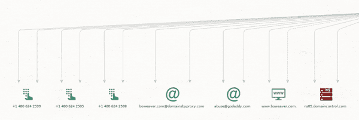

通过右键点击网站，我们得到以下窗口。通过单击 Resolve to IP 旁边的双箭头，我们可以获得站点的 IP 地址和网络信息：


因此，通过深入挖掘，我们找到了 IP 地址、分配的网络块以及**自治系统编号**（**ASN**）。我们还可以看到，该网站位于数字海洋纽约数据中心：

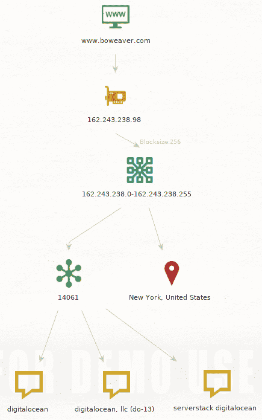

Maltego 允许您将此信息保存到表（CSV 文件）、生成报告或将图形导出为图像：


因此，在这个应用程序中只需点击两次鼠标，而不是一次实际接触目标的任何资产，我们就确定了很多关于目标的信息。

这只是这个工具的一个简单用法。这个工具能挖掘出的信息的深度是惊人的，也有点吓人，特别是如果你有专业版的话。充分利用这一工具超出了本书的范围。关于这个工具的深入使用，有很多在线资源。

# 使用 KeepNote

这里有一个关于笔记的词！渗透测试收集了大量数据，即使是在一个小型网络上，我的意思是很多！因此，当笔测试时，您需要能够在执行测试时收集传入数据。Kali 为此提供了多个应用程序。无论你选择哪一个，只要选择一个并使用它。测试运行六周后，你需要回去验证一些东西，你会很高兴你这么做了。此外，在高安全性环境中进行测试时，例如必须符合 HIPA 或 PCI 的网络，这些说明在构建报告时特别有用。此外，请确保将所有项目文件与此框架一起保存在一个目录中。做好笔记的另一个原因是，如果发生法律诉讼，你的笔记可能是你最好的辩护理由。

下面的屏幕截图显示了 Bo 使用的框架。他为客户组织创建一个文件夹，然后为实际测试创建一个文件夹，文件夹名称中包含日期。可以安全地假设，无论你在哪里交易，你都会一次又一次地看到相同的客户。如果你没有看到重复经营，那么你自己的商业模式就出了问题。Ext-20150315 转化为在 20150315 上进行的外部测试。20150315 是一个 Unix 样式的日期，分解为 YYYYMMDD。如果您看到 Unix 样式的邮戳看起来像 20150317213209，那么可以将其细分为第二个。在该文件夹中，Bo 设置了证据、注释和扫描文档的目录。所有收集到的证据，包括截图，都会放入`evidence`文件夹中。KeepNote 的笔记保存在`notes`文件夹中，扫描和其他相关文件保存在`scans-docs`文件夹中。当我们在本书后面开始进行测试时，您将看到正在使用这个框架。

以下是文件夹布局的屏幕截图。在这种情况下，我们使用 LXDE 文件管理器：


即使你只为一家公司工作，也要将每个测试的数据分开并注明日期；这将帮助您跟踪您的测试。

对于实际的笔记，Kali 附带了几个应用程序，如前所示；Maltego 就是这些工具之一，能够将所有数据保存在一个地方。

波最喜欢的是 KeepNote。您在[第一章](01.html)*选择发行版*中看到了 KeepNote 的介绍。KeepNote 是一个简单的笔记应用程序。在 Bo 进行测试时，他保存了手动漏洞攻击、个人扫描数据和屏幕截图的输出副本。这样做的好处在于，您能够在运行时格式化数据，因此以后将其导入模板只需复制/粘贴即可。

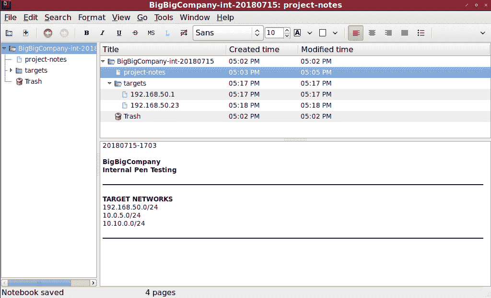

# 总结

在本章中，您已经了解了 Nmap 工具及其 GUI 界面 Zenmap 的一些用法。我们了解了 OpenVAS 漏洞扫描程序的详细使用，以及在攻击中使用这些数据。我们还学习了信息收集工具 Maltego 的使用。

# 进一步阅读

*   Fydor**Nmap 网络扫描[https://nmap.org/book/](https://nmap.org/book/)**
*   **OpenVAS 文档**：[http://www.openvas.org/documentation.html](http://www.openvas.org/documentation.html)
*   **Maltego 用户指南**：[https://www.paterva.com/web7/docs/userguides/user_guide.php](https://www.paterva.com/web7/docs/userguides/user_guide.php)