# 密码攻击

你遇到的任何人都会告诉你，弱密码是造成数十次成功入侵的原因，包括本地和远程入侵。作为一名训练有素的网络管理员或安全工程师，您多次建议用户增强密码的安全性。您可能没有注意到的是，许多技术专业人员使用弱密码或密码模式，这不仅会危及他们自己的帐户，还会危及他们维护的整个网络。本章将向您展示几种用于测试网络密码的工具，因此您可以帮助引导用户养成使用更好密码的习惯。

在本章中，我们将学习以下主题：

*   密码攻击计划
*   见见我的朋友，约翰尼
*   见见约翰尼的爸爸，开膛手约翰
*   见见前 xHydra

散列算法的本质是，所有散列的长度都应该大致相同，而且似乎不太可能有人破解以下内容：

```
$6$NB7JpssH$oDSf1tDxTVfYrpmldppb/vNtK3J.kT2QUjguR58mQAm0gmDHzsbVRSdsN08.lndGJ0cb1UUQgaPB6JV2Mw.Eq. 
```

比他们能破解的更快：

```
$6$fwiXgv3r$5Clzz0QKr42k23h0PYk/wm10spa2wGZhpVt0ZMN5mEUxJug93w1SAtOgWFkIF.pdOiU.CywnZwaVZDAw8JWFO0
```

不幸的是，即使是在速度较慢的计算机上，密码`Password`的第一个散列也将在不到 20 秒内被破解，而密码`GoodLuckTryingToCrackMyPassword!`的第二个散列可能需要几个月才能破解。下面的列表说明了在互联网上可以找到的几十个单词列表中，您可以找到一些密码，这使得破解密码变得更加容易。一些常见的散列可以被[破解 https://www.google.com](https://www.google.com) ，只需将散列粘贴到搜索栏即可。大多数 web 应用程序和操作系统在用户的密码选择中添加了几个字符，称为`salt`，从而使简单的加密哈希变得更复杂，更不易猜测。

以下屏幕截图显示了明文密码及其哈希值的一些示例：

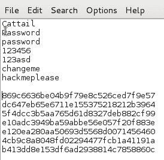

# 密码攻击计划

密码通常是任何系统或网络的密钥。自从计算机诞生以来，密码就一直被用来锁定系统数据，以防被人发现。因此，破解密码是黑客行业急需的技能。捕获或破解正确的密码，你就拥有了王国的钥匙，可以随时随地访问。我们还将讨论如何创建强密码。如果您是一名系统管理员，正在阅读本书，那么您就是我们正在谈论的人。这是攻击者要追踪的密码。当然，每次登录时输入 12 或 14 个字符的密码是件痛苦的事，但是你的网络有多重要？

就个人而言，我们希望这个函数从一开始就没有使用*密码*这个词。应该叫钥匙。系统的普通用户对受密码保护的数据哭哭啼啼。大多数人将*密码*一词与进入俱乐部或其他东西联系起来。用户将在其所有财产上安装锁和防盗警报器，但在其计算机上使用四个字母的密码。人们把*键*这个词与锁定重要的东西联系起来。事实上，如果你的密码只是一个*字*，你将在几分钟内被破解。最好使用密码短语。玛丽有一只小羊羔。比一句话好得多。我们将在本章中看到这一点的重要性，因为我们将考虑您使用的密码。

# 破解 NTLM 代码（重新访问）

[第 4 章](04.html)、*嗅探和欺骗*介绍了一种密码攻击方法。在运行 NetBIOS 的 Windows 网络上，捕获 NTLM 哈希值是儿戏。它们只是在 ARP 云中四处飘荡，等待着被采集。如前几章所示，当您使用 Metasploit 时，甚至不需要将此哈希破解为密码，只需将哈希传递给另一个 Windows 系统即可。

有时，您需要实际的密码。系统管理员有时会变得懒惰，在几类设备上使用相同的密码。假设你有一些 Windows 哈希，你需要进入一个路由器或一台 Linux 机器，你不知道密码。密码在其他系统上很有可能是相同的，因此您可以破解 NTLM 协议泄漏的哈希。我们中的许多人对重复使用基础设施设备的密码感到内疚，尽管我们知道得更多。为路由器和其他基础设施设备使用不同的用户名和密码可能更安全，并且永远不要使用域管理员帐户登录任何计算机，除非绝对必要。

黑客提示：
关闭 NetBIOS，将 Active Directory 与 Kerberos 和 LDAP 一起用于 Windows 登录和网络功能。

在本章中，我们将关注破解密码，而不仅仅是传递哈希。

# 密码列表

对于任何好的密码破解者来说，有时破解密码的最快方法是使用密码列表。有时，最好对系统上的用户运行一个 500 个最差密码的列表，找出那些使用错误密码的懒惰的失败者。与使用强密码短语时的小时、天或周相比，坏密码大多数情况下可以在几秒钟内被破解。

Kali 包含许多密码，您可以在以下目录`/usr/share/wordlists`中对其进行罚款。下面是一些好的密码文件的链接和列表。谷歌搜索还将引导您找到常见密码列表，以及从网站上窃取的密码列表。当使用被盗密码列表时，仅使用已清除用户名的列表。使用一整套被盗的凭证（用户名和密码）可能会给你带来麻烦。有了一个密码列表，你就有了一个没有链接到原始用户的单词列表。这是安全合法的使用：[https://wiki.skullsecurity.org/Passwords](https://wiki.skullsecurity.org/Passwords) 。


# 清理密码列表

有时，当您获得密码列表时，该列表可能是文本文件中的选项卡列，或者可能有奇怪的选项卡空间与文件中的单词混合在一起。您需要清理这些空格和选项卡，并在单词列表中每行有一个单词，以便使用密码破解程序。

Unix 最早的概念之一是系统中的小程序，它们可以通过管道连接在一起执行复杂的任务。Linux 是 Unix 的红发表亲，这些工具存在于 Linux 的每个发行版中，包括 Kali。这是一个古老的学校，但一旦你明白了怎么做，它就会运作得很好。我们将介绍使用的每个程序，然后展示如何将这些程序串在一起，以在一行命令中执行此任务。

以下是 500 个常用密码的列表。单词列在 HTML 表格中，行被编号，因此，当复制到文本文件时，我们在原始表单中得到的内容将显示在下一页。您可以找到的大多数单词列表都有几乎相同的极为常见的坏密码，尽管我们使用的是英语，但也有其他语言的单词列表。严格来说，弱密码不是英语国家的专利。

也就是说，下一个屏幕截图是一个非常常见但非常弱的英语密码的好例子。显示全部 500 字会浪费空间，因此我们在出版商网站上展示`500-common-original.txt`文件：

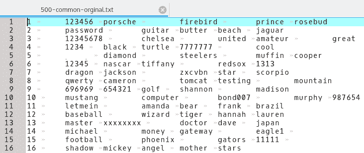

请注意，我们需要舍弃左侧的行号，每行有五个单词，由制表符和空格分隔。我们希望将每个单词移到新行。

`cat`命令读取一个文本文件并打印到屏幕或另一个文件。将其与`cut`命令一起使用，我们将首先去掉行号。`cut`命令将选项卡视为字段之间的分隔符，因此数字是行中的第一个字段。我们想删掉数字，留下单词，所以我们删掉第一个字段，保留其他字段。要执行此操作，请运行以下命令：

```
cat 500-common-orginal.txt | cut -f2  
```

我们得到返回的输出返回，如下所示。如果你看一下，你会发现这是一个只在每一行中列出第一个单词的列表，而不是整个列表。使用`-f2`标志，我们在每行中剪切除第二个字段之外的所有内容。下面的屏幕截图删除了一些单词，以保持本书的 G 级，但有些人天生粗俗。列表中的某些单词可能不适合打印，但它们位于前 500 个常用密码中。当黑客攻击时，你是在处理一个人的本性，这在社会上并不一定是正确的。当人们相信没有人会看到他们写的东西，或者他们认为自己是匿名的时候，他们经常会选择粗鲁的词语：

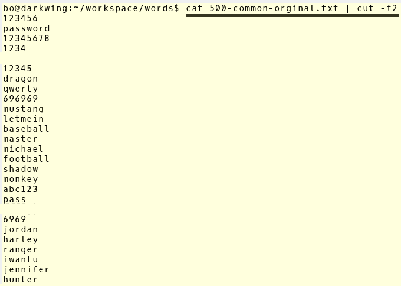

由于我们需要每行中的所有单词，因此必须在命令中包含其他五列。一行中的五个字加上数字，是一行中的六个字段，我们希望剪切第一个字段（数字）并保留其余字段，因此我们将`-f`标志更改为`-f2-6`；这将剪切字段 1 并打印字段 2 到 6。我们看到报税表删去了数字行，但每行仍有五个字。这将无法在密码破解程序中正确运行；我们仍然需要将所有单词移到它们自己的行：

```
cat 500-common-orginal.txt | cut -f2-6 
```

这个命令字符串去掉了行号，尽管保留行号不会超过几秒钟。不过，它不会那么整洁，有时整洁也很重要。以下屏幕截图是该命令的输出：

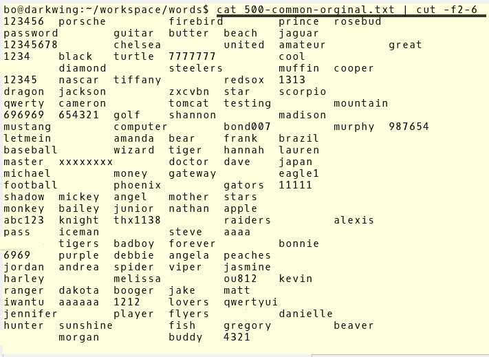

要获取新行上的所有单词，我们使用`--output-delimiter`标志并使用`$'\n'`的值，该值告诉每一个分隔符的输出，该分隔符是行中的制表符空间，用于将下一个字段移动到新行：

```
cat 500-common-orginal.txt | cut -f2-6 -output-delimiter=$'\n'   
```


现在，我们有一个新的行上的每个字，但我们还需要打印到一个文件中使用。为此，我们将使用重定向命令`>`将输出发送到新的文本文件。注意，`>`命令将正在运行的命令的输出发送到文件，但如果文件名存在，它将覆盖文件的内容。如果要增加现有文件的大小，请使用`>>`命令将输出附加到现有文件。

以下屏幕截图显示了将单词发送到弱密码工作文件的命令，并测试输出文件的内容和格式：


运行`ls`命令，再次检查您是否在正确的目录中，以及您选择的输出文件是否不存在，然后将以下输出运行到文件：

```
cat 500-common-orginal.txt | cut -f2-6 --output-delimiter=$'\n' > 500-common.txt

```

黑客提示：
如果您不小心以`cat 500-common-orginal.txt | cut -f2-6 --output-delimiter=$'\n' > 500-common-original.txt`的身份运行该命令，您将覆盖原始文件，并且在新文件内容不是您想要的情况下，您将无法重新创建任何内容。

请注意，这一次没有输出到屏幕，但是当再次运行`ls`命令时，我们会在工作目录中看到新文件。通过调用新文件，我们可以看到新密码文件已准备好使用。

# 我的朋友，约翰尼

首先，我们来谈谈我的朋友约翰尼。约翰尼是我另一个朋友约翰的 GUI 前端。对于大多数密码破解任务，这是一种使用 John 的简单方法。它使用大多数密码破解会话的正常默认值。捕获一些散列后，将它们保存到文本文件并打开 Johnny。

以下是 LxDE 桌面上的屏幕截图，显示了在哪里可以找到 Johnny。您也可以在同一标题位置下的所有其他桌面上找到它，应用程序| 05-密码攻击|约翰尼：

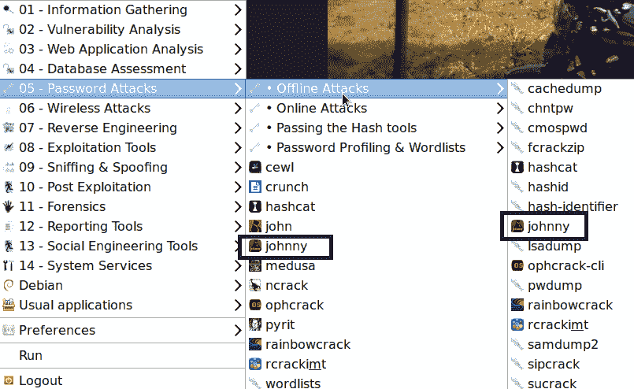

我们正在使用本书前面一次攻击中的密码散列，我们在那里传递散列。我们缩短了列表，仅包括我们认为对网络系统具有关键访问权限的两个帐户的哈希：


打开 Johnny 后，单击 open Passwd File 按钮并选择保存用户哈希值的文本文件。这将把文件加载到 Johnny 中。

黑客提示：
最好删除你不想破解的访客和任何其他用户帐户。这将缩短破解密码所需的时间。如你所见，我们只破获了两个账户。

下面的屏幕截图是您第一次看到 Johnny 的界面。非常简单，功能强大：


因为这是一个测试网络，所以对话框窗口中只有两个用户名。在生产网络中，组织中允许登录系统的用户的数量将与允许登录系统的用户的数量相同。这些用户中可能至少有一个具有管理权限。

黑客笔记：
记住，管理员的帐户总是 UID 500。有时，管理员会更改管理员帐户的名称。在某些情况下，这确实会隐藏帐户，但一旦获得帐户的 UID，找到管理员就很容易了。


我们知道这些散列来自 Windows7 系统。在 Windows7 中，默认情况下不再使用 LM 哈希，因此我们必须更改默认的 LM 哈希。如果未更改，则输出选项卡中将出现以下错误：

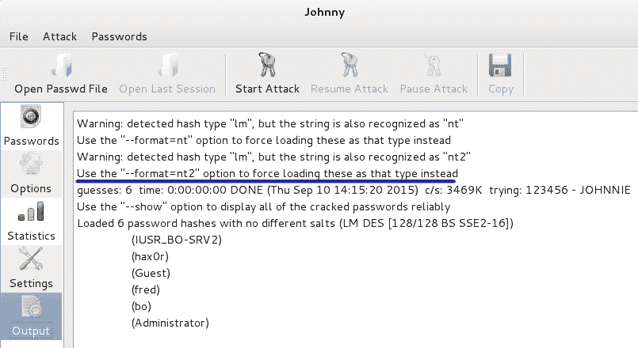

单击选项选项卡并将自动检测更改为 nt2，如以下屏幕截图所示：

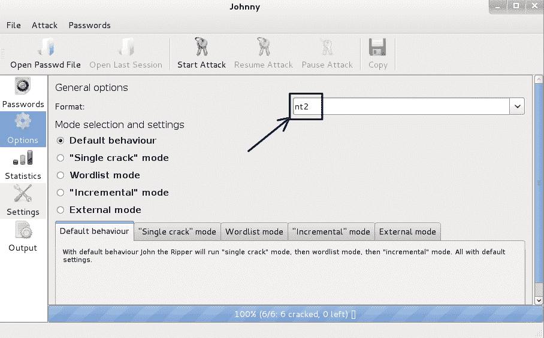

现在单击密码选项卡，然后单击开始攻击按钮。这将开始开裂过程。您可以在屏幕的底部选项卡中看到流程：


请注意，它现在将格式显示为 nt2 并正在运行。喝杯咖啡。这可能需要一段时间。
还要注意，我们有一个暂停攻击按钮。如果需要，可以暂停攻击。

有时候，开源应用程序有一些怪癖。约翰尼也一样。有时在执行破解运行时，进程将运行并破解密码，但它们不会显示在 GUI 窗口中。如果暂停攻击按钮变灰，并且只能单击开始按钮，则表示运行已完成，密码已被破解。单击“选项”按钮可以找到破解信息。此页面还将显示它运行的时间长度以及密码被破解的情况。这是获取所有运行结果的最佳页面。

您可以在下一个屏幕截图中看到，使用大小写字母、数字和特殊字符的复杂性，破解两个包含 6 个和 7 个字符的密码花费了 7 小时 18 分钟：


# 开膛手约翰（命令行）

开膛手约翰是约翰尼的基础应用。您可能和我们一样，在使用密码破解工具（如 John the Ripper）时，在命令行中比在 GUI 中更自如。您可能会选择 CLI，因为它使用的资源比 GUI 少，或者因为您正在通过 SSH 连接到没有 GUI 界面的服务器。使用 John the Ripper 很容易，通过使用尚未添加到 Johnny 中的命令行，可以使用更多的选项和方法来使用 John。

您可以查看 John 支持的所有各种哈希算法，并通过运行以下命令测试系统的破解速度：

```
john -test
```

这将运行 John 支持的所有各种散列算法，并为您提供各种散列所需的速度。以下屏幕截图显示了`test`标志的读数：

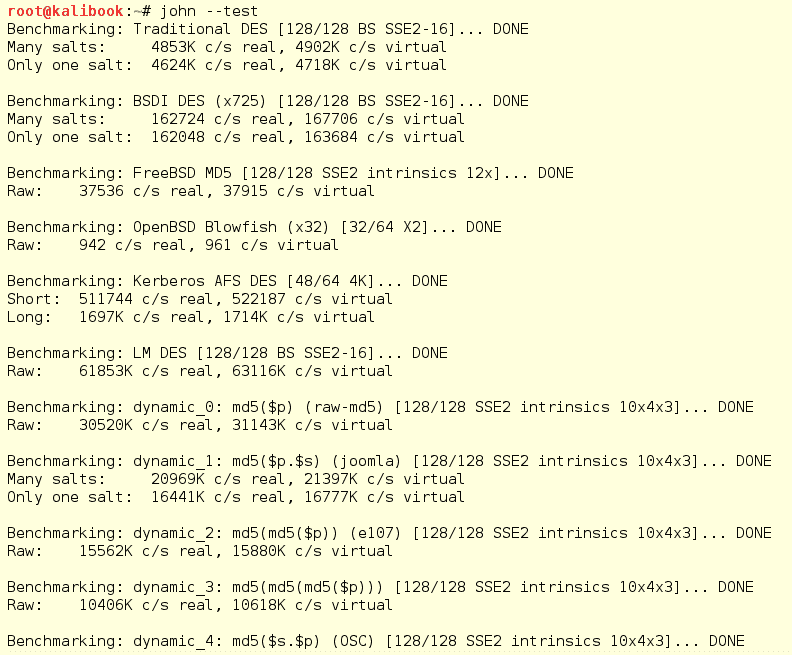

我们将对一组从系统早期攻击中获得的哈希值运行 John。请注意我们用于执行此操作的标志。我们正在使用`--format=nt2`然后选择文件：

```
john -format=nt2 hashdump.txt  
```

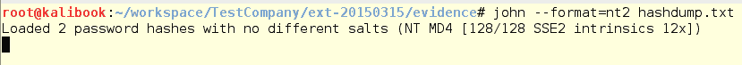

通过此破解运行，我们正在破解超过六个字符的密码。请注意运行此进程所花费的时间。这表明，对于密码，长度比复杂性更重要。

在下面的屏幕截图中，您可以看到破解一个非常简单的七个字符的密码花费了 1 天 23 个小时。第二个密码长达 8 个字符，在 4 天 14 小时 56 分钟后没有破解。是的，每个额外的字符都会使裂纹以指数形式增长：

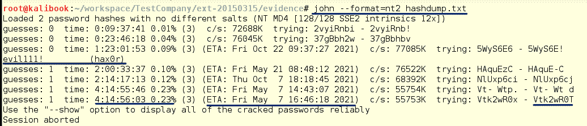

通过在运行后运行`-show`标志，您可以看到已破解的单词，我们还有一个单词需要破解：


这种破解是在一个运行处理器的 VM 上完成的。添加处理器将增加破解过程中运行的线程数量，从而缩短作业所需的时间。人们已经制造了装满处理器和 GPU 卡的机器，可以像我们在几个小时内使用的那样破解密码。有些人使用 AmazonAWS 并设置具有强大处理能力的实例，但这需要花费大量资金。众所周知，一些聪明的大学生已经启动了用于模拟太阳系的大学超级计算机，并使用这些系统快速破解密码。即使你的邻居邪恶黑客有这样的系统，密码越长越好。这样的系统是使用长度超过 14 个字符的密码或密码短语的原因。即使密码短语超过 14 个字符，这也表明，如果您拥有哈希，那么在获得密码之前，这只是时间、金钱和处理能力的问题。

# 希德拉

xHydra 是密码破解程序 Hydra 的 GUI 前端。Hydra 可用于离线和在线密码破解。Hydra 可用于多种类型的在线攻击，包括针对 MySQL、SMB、MSSQL 和多种类型的 HTTP/HTTPS 登录的攻击，仅举几例。

我们将使用 xHydra 攻击运行 WordPress 站点的机器上运行的 MySQL 服务。由于机器运行的是 WordPress 站点和 MySQL 服务，因此很容易猜测数据库登录名的用户名是`wordpress`，默认的管理员帐户。默认情况下，MySQL 不会阻止暴力攻击，因此我们知道这种攻击很有可能发生。

要在 Kali 版本 1.x 中启动 xHydra，请转到 05-密码攻击|在线攻击| hydra gtk。hydra gtk 将启动 xHydra。是的，我知道这很混乱，但它们是一样的。下面的屏幕截图显示了 LxDE 的菜单。（是的，背景是我的摩托车，是的，是哈雷）：


需要记住的是：在 Kali 中，与任何其他 Linux 发行版一样，您可以打开终端并在提示符下键入命令，也可以通过点击*Alt*+*F2*打开命令对话框。这将为您提供所谓的**跑步箱**。所有台式机都有此功能。在下面的两个屏幕截图中，我们展示了如何找到 xHydra，`# locate xhydra`以及如何从终端中的命令行启动它，只需使用名称`xhydra`；以及从*Alt*+*F2*键盘快捷键调用命令时的外观。以下是 Gnome 3 中的运行框：


黑客提示：
正如我们所讨论的，Gnome 3 做的事情*就是这样！*即使它是错误的和令人困惑的。您输入要运行的命令，然后点击*回车*来运行它。关闭按钮将取消您的操作，并将您带回桌面。对于所有其他桌面，“运行”框会为您提供一个“运行”或“确定”按钮，该按钮将运行该命令。此外，键入命令并点击*回车*将在这些运行框中运行该命令。

还可以通过键入以下命令从命令行打开 xHydra：

```
xhydra &  
```

ampersand 命令（`&`）告诉 Bash 终端对应用程序进行后台处理，并返回命令提示符。如果不添加符号，则在使用完 xHydra 之前，您已经锁定了终端窗口。它将运行，但如果关闭此终端窗口，xHydra 也将关闭。

使用符号将从命令行运行任何命令：


当 xHydra 打开时，我们会看到以下窗口。第一个选项卡 Target 用于设置攻击的目标和协议。您可以从文本文件攻击单个 IP 地址或主机的目标列表。协议字段用于选择协议的类型。注意，窗口底部是从命令行运行攻击时将使用的命令行字符串。

这是一个有助于学习命令行选项及其工作原理的学习工具：

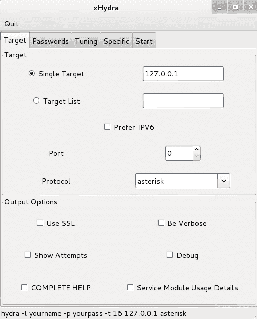

我们正在攻击单个主机，因此我们添加 IP 地址，将端口设置为默认 MySQL 服务端口`3306`，并选择 MySQL 作为协议。

请注意，此窗口的“选项”部分中有几个不错的选项。如果在 MySQL 服务器上启用了 SSL，您将在 SSL 复选框中打勾。还将检查使用 SSL 的任何其他服务，如 SSMTP、SIMAP 或 SLDAP。“详细”复选框将在运行时为您提供更详细的输出。运行时，“显示尝试次数”复选框将显示针对系统运行的实际密码。这很有趣，但会产生很多输出：

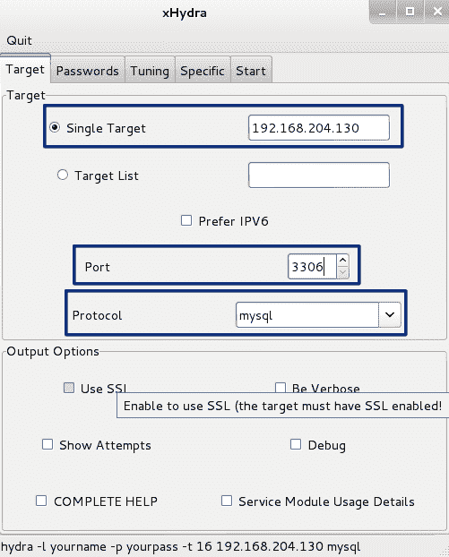

单击密码选项卡设置攻击的密码部分。在这里，我们添加用户`root`并选择 Generate 单选按钮，并将字段更改为`1:8:a`。在底部字段中，您可能希望检查 Try login as password 和 Try empty password 字段。

在生成字段中，我们添加了`1:8:a`。这会告诉 Hydra 运行一到八个字符的密码。小写字母`a`告诉 Hydra 只运行小写字母。如果我们添加字符串`1:8:aA1% .`，这将生成从 1 到 8 的密码，包括大小写字母、数字、百分号、空格（是的，在%和逗号之间有空格）和点。从这里混合搭配。

在这里，您将再次找到 Try login for password 的复选框字段，它将尝试将登录名作为密码，如`admin:admin`，以及空白密码的复选框。您还可以在此处找到一个用于反转登录名的复选框，例如，`admin`登录密码的`nimda`：


接下来设置“调整”选项卡：

*   因为我们攻击的是一台主机，所以将任务数减少到八个
*   由于主机位于同一网络上，请将超时值降低到 10
*   由于这是一台主机，且攻击使用的是一个用户名，因此选中该框可在找到第一对后退出

稍后您会发现任务集可能低于实际运行的任务。我们已经将其设置为 8，但稍后我们将看到实际运行的任务是 4。服务器将处理四个运行的线程，所以我们只能得到这些。随着负载的变化，正在运行的线程可能会根据 Kali 攻击工作站上发生的其他事情而变化，因此最好将其设置为大于正在运行的负载。请注意，将其与实际运行的任务设置得太高（例如，将其设置为 16）将导致应用程序挂起。此数字也可能更高或更低，具体取决于所利用的服务类型：


MySQL 攻击的特定选项卡将保留默认值。实际上，MySQL 攻击没有使用以下任何设置：


现在我们已经准备好单击 Start 选项卡，我们看到我们正在针对这台服务器运行四个线程。这可能需要一段时间：

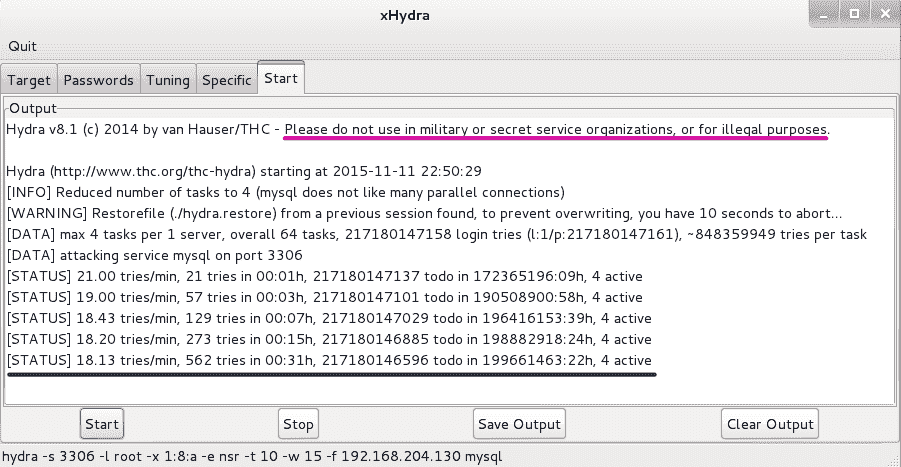

黑客提示：
请注意，该软件的作者与本书的作者一样，要求您不要将这些工具或信息用于军事、秘密服务或非法目的。记住，使用绝地异能只是为了好。

嗯，我们还有 217180146596 个密码组合需要尝试，估计需要 199661463 天 22 小时。也许是时候买一台更强壮的卡利工作站了。这需要一段时间。也许 546659 年的假期是邪恶黑客的最佳决定。

幸运的是，估计值很高。接下来，我们看到我们的测试已经运行了 70 小时 39 分钟，没有破解五个字符长的密码。在此期间，运行尝试了 75754 个密码，留下 12280876 个密码，估计运行时间为 11454 天 13 小时。因此，为了本书的利益，我们在这里停止测试，估计还有 32 年：


此测试的速度主要由受害者服务器的资源和设置决定。我们的受害者服务器是一个低租金的虚拟机，所以这是测试如此缓慢的原因之一。此外，在本次运行的第一部分，我们得到了一个警告，MySQL 不喜欢很多并行连接。针对运行更多资源的目标服务器，速度将提高。另一个限制因素是，目标服务器可能太弱，持续的暴力攻击可能会使机器脱离网络。即使是拥有大量可用资源的强大服务器也可能会遇到**拒绝服务**（**拒绝服务**的情况。在进行暴力攻击时，您可能希望以较低和较慢的攻击速度为目标。作为攻击者，您不希望向管理员发出攻击警报。

此测试还表明，捕获哈希并脱机破解它们通常比在线执行攻击更快。另一件要记住的事情是：如果系统上运行任何入侵服务，您的攻击在运行的几年中会被注意到。

那么，让我们在同一个系统上尝试密码列表攻击。请注意，我们已将设置从 Generate 更改为 Password List，并从 Kali 中包含的许多密码列表中选择了`rockyou.txt`密码列表。下面的屏幕截图列出了目录并显示了压缩的`rockyou.txt`文件。您需要将其解压缩以供使用：

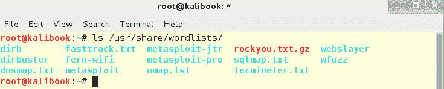

在下面的屏幕截图中，我们选择了未压缩的文件，可以开始了：


通过好莱坞的现代奇迹，我们看到我们破解了密码`evil1`。经过 562 次尝试和 31 个小时，我们成功了。对于尝试的次数来说，这是一段很长的时间。同样，服务接受密码的速度是决定性因素，需要一段时间。目标服务器上的软件防火墙和密码尝试限制可能会使其花费更长的时间，甚至不可能。

如果正确的密码位于密码列表的较低位置，则需要更长的时间：


# 总结

在本章中，您使用了三种新的密码破解工具，还学习了如何在主菜单中添加新项。Johnny 和他的祖先 John the Ripper 是您在 Kali 上可以找到的最流行的工具，用于在本地计算机上破解哈希，因此在测试用户的密码决定时，您可能会选择这两种工具之一。

Hydra 比基本的基于 John 的工具有更多的选择，但随着功能的改进，复杂性也增加了。Hydra 设计用于通过电线攻击特定设备，但正如您所发现的，攻击面非常小，工具噪音非常大。

您还了解到 Hydra 可以使用 GPU 而不是 CPU，使您的破解速度更快。

在下一章中，我们将了解古老的和破损的协议，NetBIOS 和 LLMR，以及如何利用其漏洞攻击和访问 Windows 系统。

# 进一步阅读

*   更多关于开膛手约翰的信息：[https://www.openwall.com/john/](https://www.openwall.com/john/)
*   关于 Hashcat 的更多信息：[https://hashcat.net/hashcat/](https://hashcat.net/hashcat/)
*   更多关于 Hydra 的信息：[https://github.com/vanhauser-thc/thc-hydra/](https://github.com/vanhauser-thc/thc-hydra/)