# 卡利——导言

在本章中，我们将介绍以下配方：

*   配置 Kali Linux
*   配置 Xfce 环境
*   配置 Mate 环境
*   配置 LXDE 环境
*   配置 e17 环境
*   配置 KDE 环境
*   准备使用自定义工具
*   Pentesting VPN 的 ike 扫描
*   设置代理链
*   和 Routerhunter 一起去打猎

# 介绍

Kali 于 2012 年首次推出，采用了全新的体系结构。这个基于 Debian 的发行版发布时附带了 300 多个专门用于渗透测试和数字取证的工具。它由进攻性安全有限公司维护和资助，核心开发商为 Mati Aharoni、Devon Kearns 和 Raphael Hertzog。

2016 年，随着大量新的更新和新的桌面环境，如 KDE、Mate、LXDE、e17 和 Xfce 构建，Kali 2.0 开始出现在人们的视野中。

虽然 Kali 已经预先配备了数百种令人惊叹的工具和实用程序，以帮助全球的渗透测试人员高效地执行其工作，但在本章中，我们将主要介绍一些定制调整，这些调整可用于为用户提供更好的测试体验。

# 配置 Kali Linux

我们将使用攻击性安全提供的官方 Kali Linux ISO 来安装和配置不同的桌面环境，如 Mate、e17、Xfce、LXDE 和 KDE 桌面。

# 准备

首先，我们将使用攻击性安全网站上列出的 64 位 Kali Linux ISO：

[https://www.kali.org/downloads/](https://www.kali.org/downloads/)

对于希望在 VMware、VirtualBox 等虚拟机中配置 Kali 的用户，可以从[下载预构建的 Linux 映像 https://www.offensive-security.com/kali-linux-vmware-virtualbox-image-download/](https://www.offensive-security.com/kali-linux-vmware-virtualbox-image-download/) 。

我们将在本章中使用虚拟映像，并使用一些其他工具对其进行自定义。

# 怎么做。。。

您可以在给定步骤的帮助下配置 Kali：

1.  双击 VirtualBox 图像，它将打开 VirtualBox：

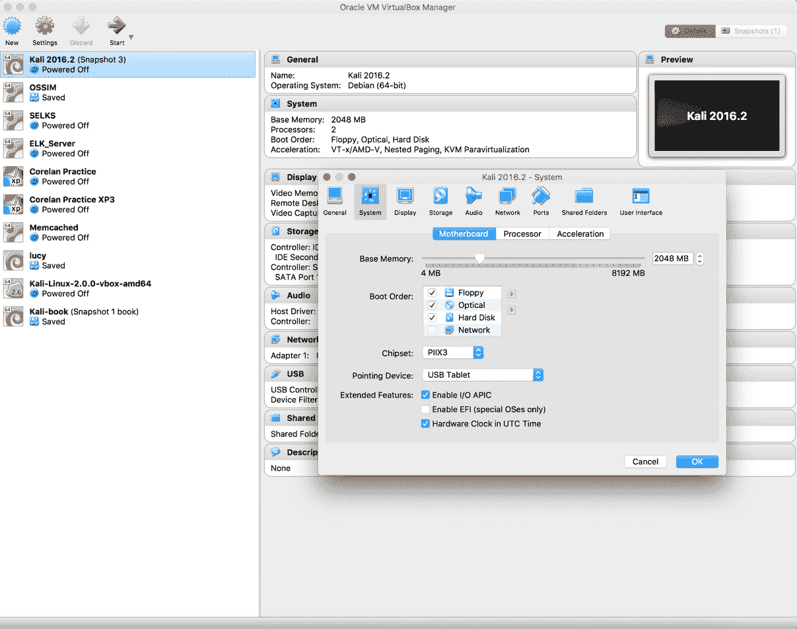

2.  单击导入：


3.  启动机器并输入密码为`toor`：

4.  现在，Kali 已启动，默认情况下，已使用 GNOME 桌面环境配置：


# 它是如何工作的。。。

使用预构建的映像，您无需担心安装过程。你可以把它看作是一个现成的解决方案。只需单击 run，虚拟机就会像普通机器一样启动 Linux。

# 配置 Xfce 环境

Xfce 是一个免费、快速、轻量级的桌面环境，适用于 Unix 和类 Unix 平台。它由奥利维尔·福丹于 1996 年创办。名称**Xfce**最初代表**XForms Common Environment**，但此后 Xfce 被重写了两次，不再使用 XForms 工具包。

# 怎么做。。。

要配置 Xfce 环境，请执行给定的步骤：

1.  我们首先使用以下命令安装 Xfce 以及所有插件和产品：

```
 apt-get install kali-defaults kali-root desktop-base xfce4
        xfce4-places-plugin xfce4-goodies
```

以下屏幕截图显示了前面的命令：


2.  当要求确认额外空间要求时，键入`Y`。
3.  在出现的对话框中选择“确定”。

4.  我们选择 lightdm 作为默认的桌面管理器，并按下*回车*键。
5.  安装完成后，我们打开终端窗口并键入以下命令：

```
 update-alternatives --config x-session-manager 
```

以下屏幕截图显示了前面命令的输出：


6.  选择选项`xfce4-session`（在本例中为`3`，然后按*回车*键。

7.  注销并再次登录，或者您可以重新启动计算机，我们将看到 Xfce 环境：


# 配置 Mate 环境

Mate 桌面环境是在 GNOME 2 的基础上构建的。它于 2011 年首次发布。

# 怎么做。。。

要配置 Mate 环境，请执行给定的步骤：

1.  我们首先使用以下命令安装 Mate 环境：

```
 apt-get install desktop-base mate-desktop-environment 
```

以下屏幕截图显示了前面的命令：

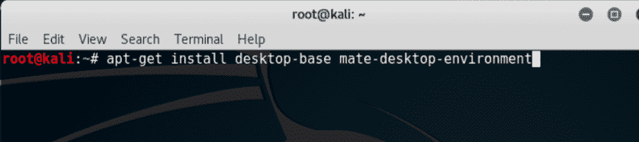

2.  当要求确认额外空间要求时，键入`Y`。
3.  安装完成后，我们将使用以下命令将 Mate 设置为默认环境：

```
 update-alternatives --config x-session-manager
```

4.  选择选项`mate-session`（在本例中为`2`，然后按*回车*键：

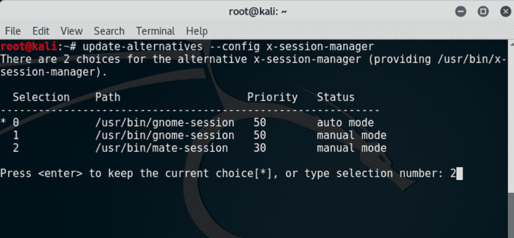

5.  注销并再次登录或重新启动，我们将看到 Mate 环境：

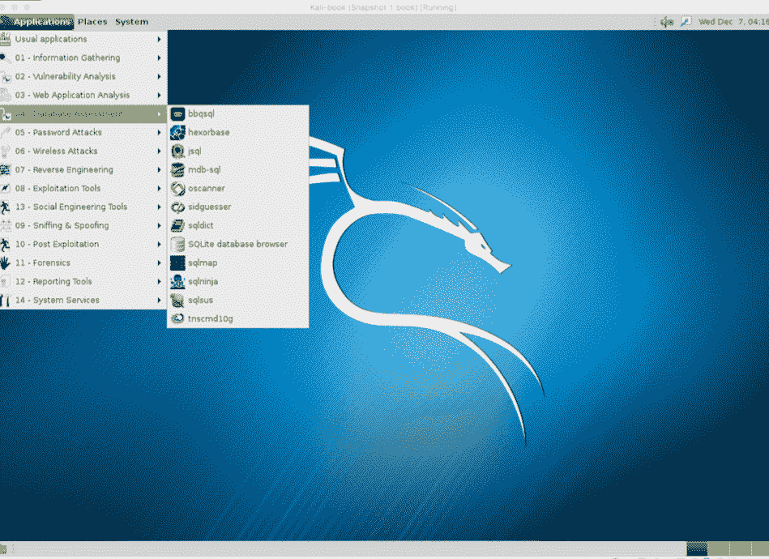

# 配置 LXDE 环境

LXDE 是一个免费的开源环境，使用 GTK+工具包用 C 编写，适用于 Unix 和其他 POSIX 平台。**轻量级 X11 桌面环境**（**LXDE**）是 Knoppix、Raspbian、Lubuntu 等许多操作系统的默认环境。

# 怎么做。。。

要配置 LXDE 环境，请执行给定的步骤：

1.  我们首先使用以下命令安装 LXDE：

```
 apt-get install lxde-core lxde
```

2.  当要求确认额外空间要求时，键入`Y`。
3.  安装完成后，我们打开终端窗口并键入以下命令：

```
 update-alternatives --config x-session-manager
```

以下屏幕截图显示了前面命令的输出：


4.  选择选项`lxsession`（在本例中为`4`，然后按*键进入*。

5.  注销并再次登录，我们将看到 LXDE 环境：

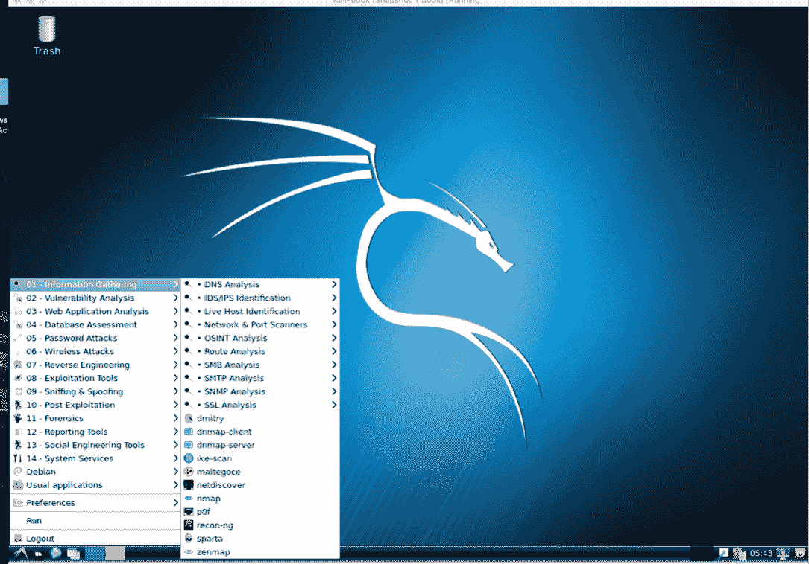

# 配置 e17 环境

**启蒙**或其他名称为**E**，是 X Windows 系统的窗口管理器。它于 1997 年首次发布。它具有许多功能，如 engage、虚拟桌面、平铺等。

# 怎么做。。。

由于兼容性问题和依赖性问题，最好将 Kali 环境设置为不同的机器。此 ISO 映像（Kali 64 位 e17）已在 Kali Linux 的官方网站上提供，可从以下 URL 下载：

[https://www.kali.org/downloads/](https://www.kali.org/downloads/) 。

# 配置 KDE 环境

KDE 是一个自由软件的国际社区。等离子桌面是 KDE 最受欢迎的项目之一；它是许多 Linux 发行版的默认桌面环境。它由马蒂亚斯·埃特里奇于 1996 年创立。

# 怎么做。。。

要配置 KDE 环境，请执行给定的步骤：

1.  我们使用以下命令安装 KDE：

```
 apt-get install kali-defaults kali-root-login desktop-base
        kde-plasma-desktop 
```

以下屏幕截图显示了前面命令的输出：


2.  当要求确认额外空间要求时，键入`Y`。
3.  在弹出的两个窗口上单击“确定”。
4.  安装完成后，我们打开终端窗口并键入以下命令：

```
 update-alternatives --config x-session-manager 
```

以下屏幕截图显示了前面命令的输出：


5.  选择选项 KDE 会话（在本例中为`2`），然后按*回车*。
6.  注销并再次登录，我们将看到 KDE 环境：

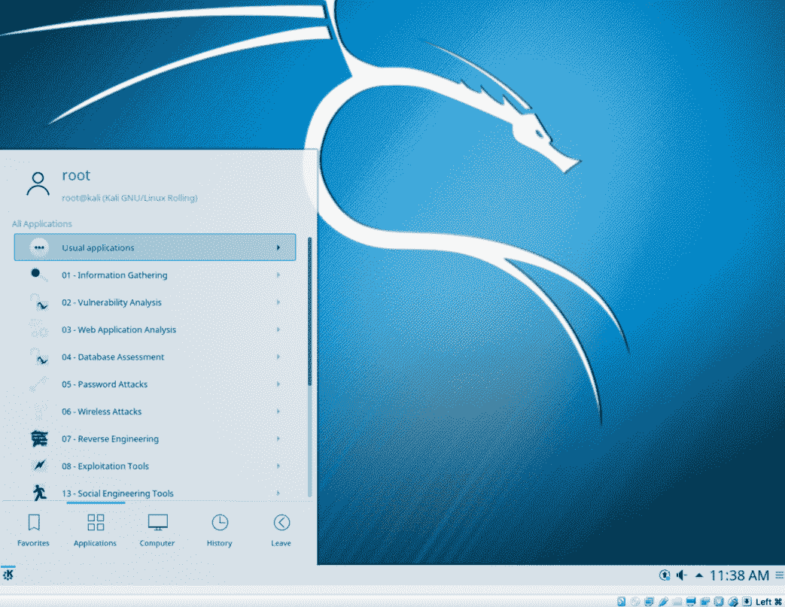

Kali 已经提供了不同桌面环境的预构建映像。可从此处下载：[https://www.kali.org/downloads/](https://www.kali.org/downloads/) 。

# 准备使用自定义工具

您将安装的这些工具在 GitHub 上是开源的。它们的速度要快得多，并且包含了人们在一段时间内在自己的 pentesting 体验中包含的不同调整的集合。

# 准备

在我们深入进行渗透测试之前，这里列出了一些您需要的工具。不用担心，在接下来的几章中，您将通过一些实际示例学习它们的用法。但是，如果您仍希望在早期阶段学习基础知识，只需使用简单的命令即可：

*   `toolname -help`
*   `toolname -h`

# 怎么做。。。

以下部分列出了一些工具。

# Dnscan

Dnscan 是一个 Python 工具，它使用字列表解析有效子域。要了解 Dnscan，请按照给定的步骤进行操作：

1.  我们将使用一个简单的命令克隆 git 存储库：

```
 git clone https://github.com/rbsec/dnscan.git
```

以下屏幕截图显示了前面的命令：


2.  您也可以从[下载并保存 https://github.com/rbsec/dnscan](https://github.com/rbsec/dnscan) 。
3.  接下来，我们浏览下载 Dnscan 的目录。

4.  使用以下命令运行 Dnscan：

```
 ./dnscan.py -h
```

以下屏幕截图显示了前面命令的输出：

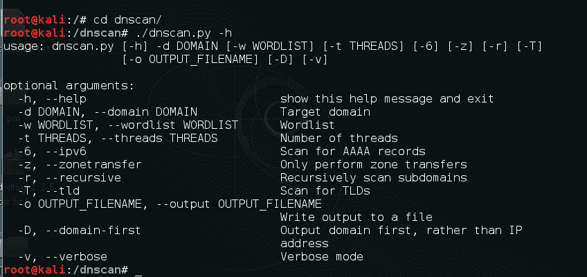

# 亚蛮

接下来我们将安装 subbrute。它的速度惊人，并提供了一个额外的匿名层，因为它使用公共解析器对子域进行暴力破解：

1.  这里的命令同样简单：

```
 git clone https://github.com/TheRook/subbrute.git
```

以下屏幕截图显示了前面的命令：


2.  也可以从[下载并保存 https://github.com/TheRook/subbrute](https://github.com/TheRook/subbrute) 。
3.  一旦安装完成，我们将需要一个单词列表来运行它，我们可以下载 dnspop 的列表。此列表也可用于上一个配方：[https://github.com/bitquark/dnspop/tree/master/results](https://github.com/bitquark/dnspop/tree/master/results) 。
4.  一旦两者都设置好，我们浏览到 subbrute 的目录，并使用以下命令运行它：

```
 ./subbrute.py
```

5.  要使用我们的单词列表在域上运行它，我们使用以下命令：

```
 ./subbrute.py -s /path/to/wordlist hostname.com
```

# 迪瑞

我们的下一个工具是 dirsearch。顾名思义，它是一个简单的命令行工具，可以用来强制目录。它比传统的 DIRB 快得多：

1.  要安装的命令是：

```
 git clone https://github.com/maurosoria/dirsearch.git
```

2.  也可以从[下载并保存 https://github.com/maurosoria/dirsearch](https://github.com/maurosoria/dirsearch) 。以下屏幕截图显示了前面的命令：


3.  克隆完成后，浏览目录并使用以下命令运行该工具：

```
 ./dirsearch.py -u hostname.com -e aspx,php
```

以下屏幕截图显示了前面命令的输出：


# Pentesting VPN 的 ike 扫描

通常在测试期间，我们可能会遇到 VPN 端点。然而，在这些端点中发现漏洞并加以利用并不是一种众所周知的方法。VPN 端点使用**互联网密钥交换**（**IKE**协议在多个客户端之间建立*安全关联*建立 VPN 隧道。

IKE 分为两个阶段，*阶段 1*负责建立安全的认证通信通道，*阶段 2*对数据进行加密和传输。

我们关注的焦点是*第一阶段*；它使用两种交换密钥的方法：

*   主模式
*   攻击模式

我们将使用 PSK 身份验证寻找支持攻击模式的 VPN 端点。

# 准备

对于该配方，我们将使用工具`ike-scan`和`ikeprobe`。首先，我们通过克隆 git 存储库来安装`ike-scan`：

```
git clone https://github.com/royhills/ike-scan.git
```

或者您可以使用以下 URL 从[下载 https://github.com/royhills/ike-scan](https://github.com/royhills/ike-scan) 。

# 怎么做。。。

要配置`ike-scan`，请按照给定步骤进行操作：

1.  浏览到`ike-scan`安装的目录。
2.  运行以下命令安装`autoconf`：

```
 apt-get install autoconf
```

3.  运行`autoreconf --install`生成`.configure`文件。
4.  运行`./configure`。
5.  运行`make`构建项目。
6.  运行`make check`以验证构建阶段。
7.  运行`make install`安装`ike-scan`。
8.  要扫描主机以获取主动模式握手，请使用以下命令：

```
 ike-scan x.x.x.x -M -A
```

以下屏幕截图显示了前面命令的输出：

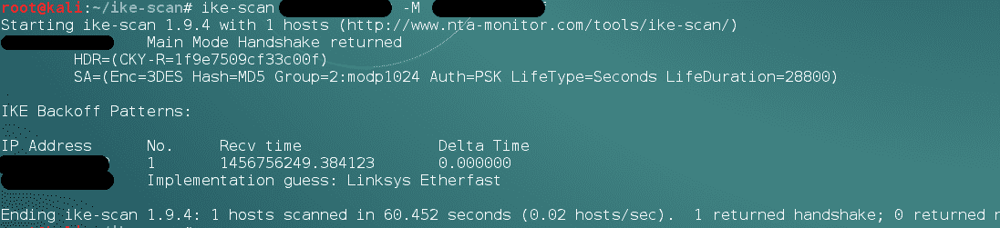

9.  有时，我们会在提供有效的组名后看到响应，如（vpn）：

```
 ike-scan x.x.x.x -M -A id=vpn
```

以下屏幕截图显示了上述命令的示例：


我们甚至可以使用以下脚本对群名进行暴力攻击：
[https://github.com/SpiderLabs/groupenum](https://github.com/SpiderLabs/groupenum) 。 [](https://github.com/SpiderLabs/groupenum) 
命令：
`./dt_group_enum.sh x.x.x.x groupnames.dic`

# 破解 PSK

要了解如何破解 PSK，请遵循给定的步骤：

1.  在`ike-scan`命令中添加`-P`标志，它将显示带有捕获的哈希的响应。
2.  为了保存散列，我们提供了一个文件名和`-P`标志。
3.  接下来我们可以通过以下命令使用`psk-crack`：

```
 psk-crack -b 5 /path/to/pskkey
```

4.  其中`-b`为蛮力模式，长度为`5`。
5.  要使用基于字典的攻击，我们使用以下命令：

```
 psk-crack -d /path/to/dictionary /path/to/pskkey 
```

以下屏幕截图显示了前面命令的输出：

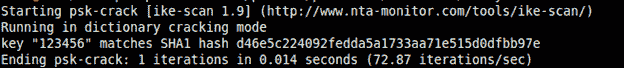

# 它是如何工作的。。。

在攻击模式下，身份验证哈希作为对尝试建立连接隧道（IPSEC）的 VPN 客户端的数据包的响应进行传输。此哈希未加密，因此它允许我们捕获哈希并对其执行暴力攻击以恢复 PSK。

这在主模式下是不可能的，因为它使用加密哈希和六方握手，而攻击模式只使用三方握手。

# 设置代理链

有时，我们需要在执行 pentest 活动时保持不可追踪。Proxychains 允许我们使用一个中间系统，该系统的 IP 可以保留在系统日志中，而不必担心它会追踪到我们。

Proxychains 是一种允许任何应用程序通过代理（如 SOCKS5、Tor 等）跟踪连接的工具。

# 怎么做。。。

Proxychains 已安装在 Kali 中。但是，我们需要在其配置文件中列出要使用的代理：

1.  为此，我们使用以下命令在文本编辑器中打开 proxychains 的配置文件：

```
 leafpad /etc/proxychains.conf
```

以下屏幕截图显示了前面命令的输出：

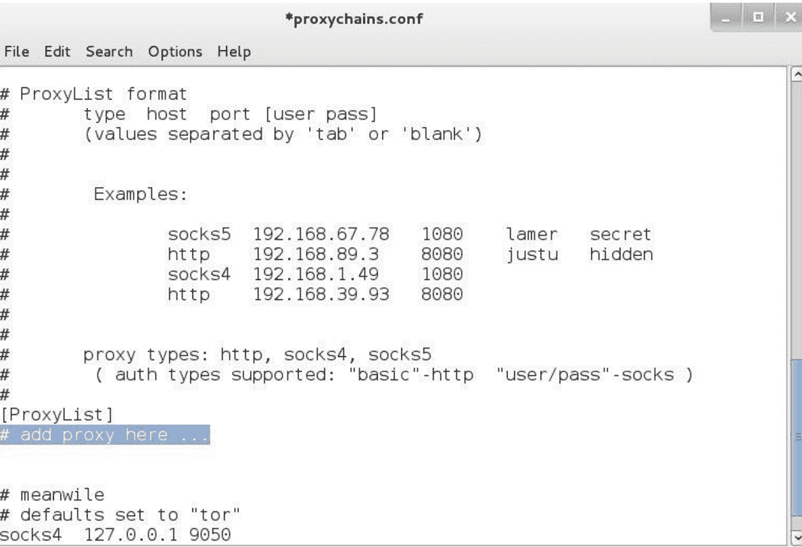

我们可以在前面突出显示的区域中添加所有需要的代理，然后保存。

Proxychains 还允许我们在连接到代理服务器时使用动态链或随机链。

2.  在配置文件中取消对**动态链**或**随机链**的注释：


# 将 proxychains 与 tor 一起使用

要了解`tor`，请按照给定的步骤进行操作：

1.  要在 tor 中使用 proxychains，我们首先需要使用以下命令安装 tor：

```
 apt-get install tor
```

2.  安装后，我们通过在终端中键入`tor`来运行 tor。
3.  然后，我们打开另一个终端并键入以下命令以通过代理链使用应用程序：

```
 proxychains toolname -arguments
```

以下屏幕截图显示了上述命令的示例：

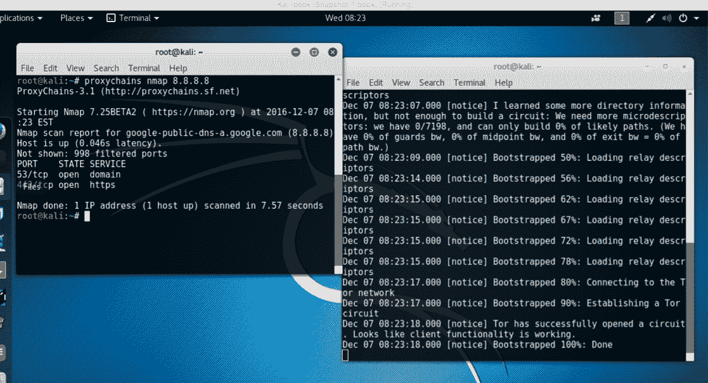

# 和 Routerhunter 一起去打猎

Routerhunter 是一种工具，用于查找网络上易受攻击的路由器，并对其执行各种攻击，以利用 Dnshanger 漏洞。此漏洞允许攻击者更改路由器的 DNS 服务器，从而将所有流量定向到所需网站。

# 准备

对于这个配方，您将再次需要克隆一个 git 存储库。

我们将使用以下命令：

```
git clone https://github.com/jh00nbr/RouterHunterBR.git
```

# 怎么做。。。

要执行`RouterHunterBR.php`，请按照给定的步骤执行：

1.  克隆文件后，输入目录。
2.  运行以下命令：

```
 php RouterHunterBR.php -h
```

以下屏幕截图显示了前面命令的输出：


3.  我们可以为 Routerhunter 提供 IP 范围、DNS 服务器 IP 等。