# 收集情报并规划攻击策略

在本章中，我们将介绍以下配方：

*   获取子域列表
*   使用 Shodan 以获得乐趣和利润
*   肖丹霍尼考尔酒店
*   Shodan 插件
*   使用 Nmap 查找打开的端口
*   使用 Nmap 绕过防火墙
*   搜索打开的目录
*   与德米特里一起表演深度魔法
*   寻找 SSL 漏洞
*   探索与脑内神经系统的联系
*   用收割机挖深
*   寻找 web 应用背后的技术
*   用 masscan 扫描 ip
*   和 Kismet 四处嗅探
*   用 firewalk 测试路由器

# 介绍

在上一章中，我们学习了搜索子域的基础知识。在本章中，我们将更深入地了解其他可用于收集目标公司英特尔信息的不同工具。我们首先使用声名狼藉的 Kali Linux 工具。

收集信息是执行渗透测试的一个非常关键的阶段，因为在此之后我们采取的每一步都将完全是我们在此阶段收集的所有信息的结果。因此，在进入开发阶段之前，收集尽可能多的信息是非常重要的。

# 获取子域列表

我们并不总是遇到这样一种情况，客户已经定义了一个完整详细的范围，需要什么被禁止。因此，我们将使用以下提到的食谱来收集尽可能多的信息，以执行 pentest。

# 激烈的

我们从跳进卡利的终端开始，使用第一个也是最广泛使用的工具`fierce`。

# 怎么做。。。

以下步骤演示了`fierce`的使用：

1.  要启动 Fear，我们键入`fierce -h`以查看帮助菜单：


2.  要执行子域扫描，请使用以下命令：

```
 fierce -dns host.com -threads 10
```

以下屏幕截图显示了前面命令的输出：

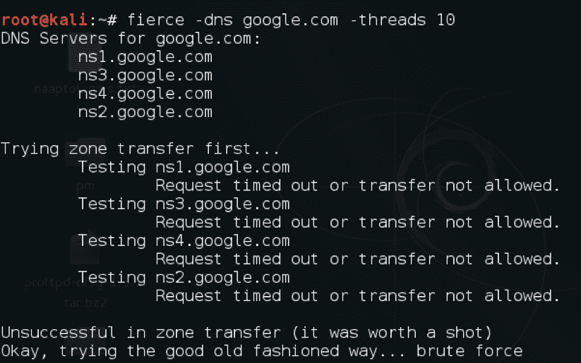

# DNSdumpster

这是一个免费的项目，由黑客目标查找子域。它依赖于[https://scans.io/](https://scans.io/) 为其结果。它还可以用于获取网站的子域。对于子域枚举，我们应该总是倾向于使用多个工具，因为我们可能会从其他工具中得到第一个工具未能选择的东西。

# 怎么做。。。

它使用起来非常简单。我们键入希望子域的域名，它将显示结果：

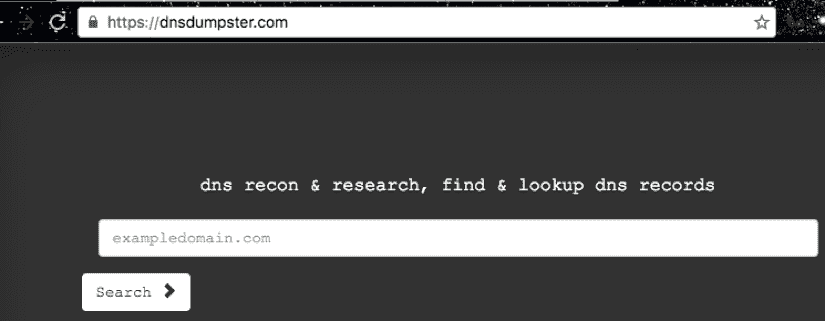

# 使用 Shodan 以获得乐趣和利润

Shodan 是世界上第一个搜索连接到互联网的设备的搜索引擎。它于 2009 年由约翰·马瑟利发起。Shodan 可用于查找网络摄像头、数据库、工业系统、视频游戏等。Shodan 主要收集运行在最流行的 web 服务上的数据，如 HTTP、HTTPS、MongoDB、FTP 等。

# 准备

要使用 Shodan，我们需要在 Shodan 上创建一个帐户。

# 怎么做。。。

要了解 Shodan，请遵循给定的步骤：

1.  打开浏览器并访问[https://www.shodan.io](https://www.shodan.io) ：


2.  我们首先对正在运行的 FTP 服务执行一个简单的搜索。为此，我们可以使用以下 Shodan dorks:`port:"21"`。以下屏幕截图显示了搜索结果：


3.  通过指定特定国家/组织，可以使此搜索更加具体：`port:"21" country:"IN"`。以下屏幕截图显示了搜索结果：

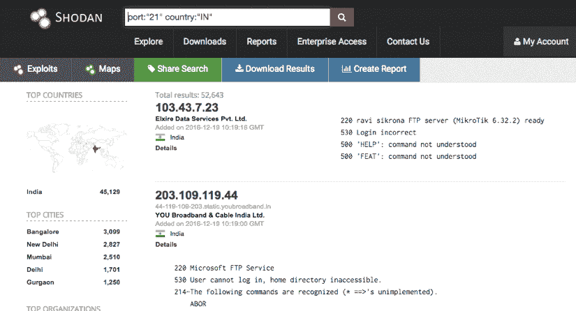

4.  我们现在可以看到所有的 FTP 服务器在印度运行；我们还可以看到允许匿名登录的服务器以及它们正在运行的 FTP 服务器的版本。
5.  接下来，我们尝试组织过滤器。输入`port:"21" country:"IN" org:"BSNL"`即可，如下图所示：

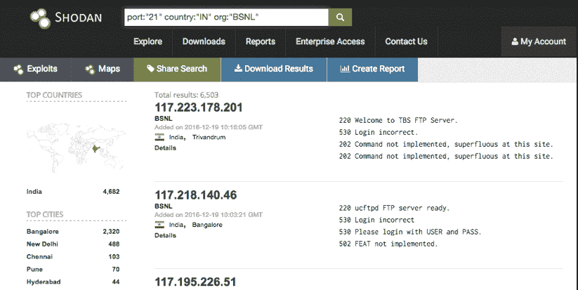

Shodan 还有其他标签可用于执行高级搜索，如：

*   `net`：扫描知识产权范围
*   `city`：按城市过滤

更多详情请访问[https://www.shodan.io/explore](https://www.shodan.io/explore) 。

# 肖丹霍尼考尔酒店

Shodan Honeycore 是 Python 中构建的另一个伟大项目。它帮助我们弄清楚我们拥有的 IP 地址是蜜罐还是真实的系统。

# 怎么做。。。

以下步骤演示了 Shodan Honeycore 的使用：

1.  要使用 Shodan Honeycore，我们访问[https://honeyscore.shodan.io/](https://honeyscore.shodan.io/) ：


2.  输入我们要检查的 IP 地址，就这样！

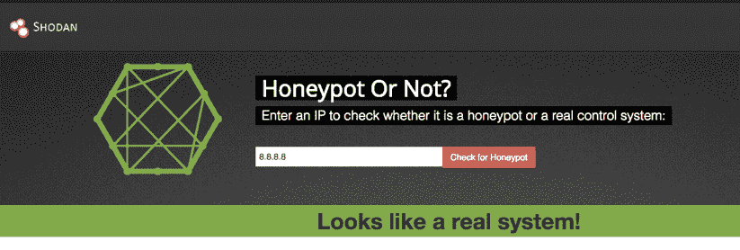

# Shodan 插件

为了让我们的生活更加轻松，Shodan 提供了 Chrome 和 Firefox 插件，可用于检查我们在旅途中访问的网站的开放端口！

# 怎么做。。。

我们从[下载并安装插件 https://www.shodan.io/](https://www.shodan.io/) 。浏览任何网站，我们都会看到，通过点击插件，我们可以看到打开的端口：


# 另见

*   来自[第一章](01.html)*卡利的*Dnscan*配方*简介
*   *用收割机*配方挖深

# 使用 Nmap 查找打开的端口

**网络映射器**（**Nmap**是 Gordon Lyon 编写的安全扫描程序。它用于查找网络中的主机和服务。它于 1997 年 9 月首次问世。Nmap 具有各种功能和脚本，可以执行各种测试，如查找操作系统、服务版本、强制默认登录等。

一些最常见的扫描类型包括：

*   TCP`connect()`扫描
*   同步隐形扫描
*   UDP 扫描
*   平扫
*   空闲扫描

# 怎么做。。。

以下是使用 Nmap 的方法：

1.  Nmap 已经安装在 Kali Linux 中。我们可以键入以下命令启动它并查看所有可用选项：

```
 nmap -h
```

以下屏幕截图显示了前面命令的输出：

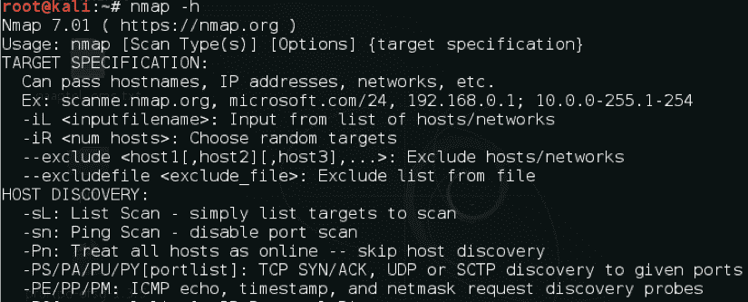

2.  要执行基本扫描，我们使用以下命令：

```
 nmap -sV -Pn x.x.x.x
```

以下屏幕截图显示了前面命令的输出：

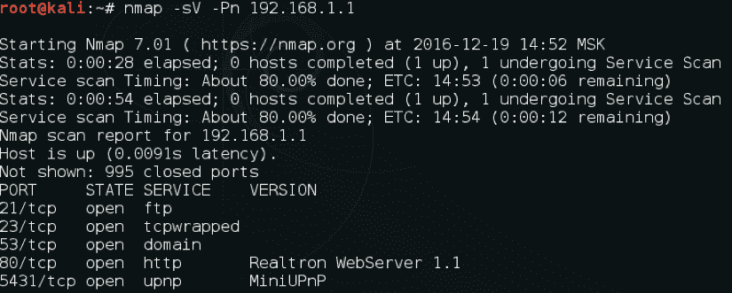

3.  `-Pn`表示我们不会先执行 ping 请求来检查主机是否启动。`-sV`参数用于列出找到的开放端口上所有正在运行的服务。
4.  我们可以使用的另一个标志是`-A`，它自动执行操作系统检测、版本检测、脚本扫描和跟踪路由。命令是：

```
 nmap -A -Pn x.x.x.x
```

5.  要扫描一个 IP 范围或多个 IP，我们可以使用以下命令：

```
 nmap -A -Pn x.x.x.0/24
```

# 使用脚本

**Nmap 脚本引擎**（**NSE**允许用户创建自己的脚本，自动执行不同的任务。当扫描运行时，这些脚本会并排执行。它们可用于执行更有效的版本检测、漏洞利用等。使用脚本的命令是：

```
nmap -Pn -sV host.com --script dns-brute
```


上述命令的输出如下所示：


在这里，脚本`dns-brute`试图通过对一组公共子域名称进行暴力强制来获取可用子域。

# 另见

*   *使用 Shodan 的乐趣和利润*配方
*   有关脚本的更多信息，请参见官方 NSE 文档[https://nmap.org/nsedoc/](https://nmap.org/nsedoc/)

# 使用 Nmap 绕过防火墙

在 pentest 的大部分时间里，我们会遇到受防火墙或**入侵检测系统**（**IDS**保护的系统。Nmap 提供了绕过这些 ID/防火墙在网络上执行端口扫描的不同方法。在本食谱中，我们将学习一些绕过防火墙的方法。

# TCP 确认扫描

ACK 扫描（`-sA`发送确认数据包而不是 SYN 数据包，防火墙不会创建 ACK 数据包日志，因为它会将 ACK 数据包视为对 SYN 数据包的响应。它主要用于映射正在使用的防火墙类型。

# 怎么做。。。

进行确认扫描以显示未过滤和过滤的端口，而不是打开的端口。

确认扫描的命令是：

```
nmap -sA x.x.x.x
```

让我们来比较一下正常扫描与确认扫描的区别：

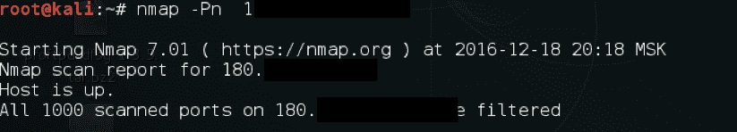

这里我们看到了正常扫描和确认扫描之间的区别：

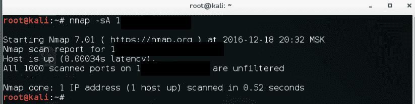

# 它是如何工作的。。。

过滤和未过滤端口的扫描结果取决于所使用的防火墙是有状态的还是无状态的。有状态防火墙检查传入的 ACK 数据包是否是现有连接的一部分。如果数据包不是任何请求连接的一部分，它将阻止它。因此，端口将在扫描期间显示为已过滤。

然而，在无状态防火墙的情况下，它不会阻止 ACK 数据包，端口将显示为未过滤。

# TCP 窗口扫描

窗口扫描（`-sW`与确认扫描几乎相同，只是显示打开和关闭的端口。

# 怎么做。。。

让我们看看普通扫描和 TCP 扫描之间的区别：

1.  要运行的命令是：

```
 nmap -sW x.x.x.x
```

2.  让我们来比较一下普通扫描与 TCP 窗口扫描的区别：


3.  我们可以在下面的屏幕截图中看到两次扫描之间的差异：


# 空闲扫描

空闲扫描是一种高级技术，在这种技术中，发送到目标的数据包无法追溯到攻击者的计算机。它需要指定一个僵尸主机。

# 怎么做。。。

执行空闲扫描的命令是：

```
nmap -sI zombiehost.com domain.com
```

# 它是如何工作的。。。

空闲扫描基于僵尸主机的可预测 IPID 或 IP 碎片 ID 工作。首先，检查僵尸主机的 IPID，然后从该主机向目标主机发送连接请求。如果端口已打开，则会将确认发送回僵尸主机，**重置**（**RST**）连接，因为它没有打开此类连接的历史记录。接下来，攻击者再次检查僵尸的 IPID；如果更改了一步，则表示从目标接收到 RST。但是，如果 IPID 已更改两步，则表示僵尸主机从目标主机接收到数据包，并且僵尸主机上存在 RST，这意味着端口已打开。

# 搜索打开的目录

在前面的配方中，我们讨论了如何在网络 IP 或域名上查找开放端口。我们经常看到开发人员在不同的端口上运行 web 服务器。有时，开发人员也可能会将可能包含丰富信息的目录配置错误。我们已经在上一章介绍了 dirsearch；在这里，我们将看看替代方案。

# dirb 工具

`dirb`工具是一个众所周知的工具，可以用来强行打开目录。虽然它通常很慢并且不支持多线程，但它仍然是查找可能由于配置错误而保持打开状态的目录/子目录的好方法。

# 怎么做。。。

键入以下命令以启动该工具：

```
    dirb https://domain.com
```

以下屏幕截图显示了前面命令的输出：

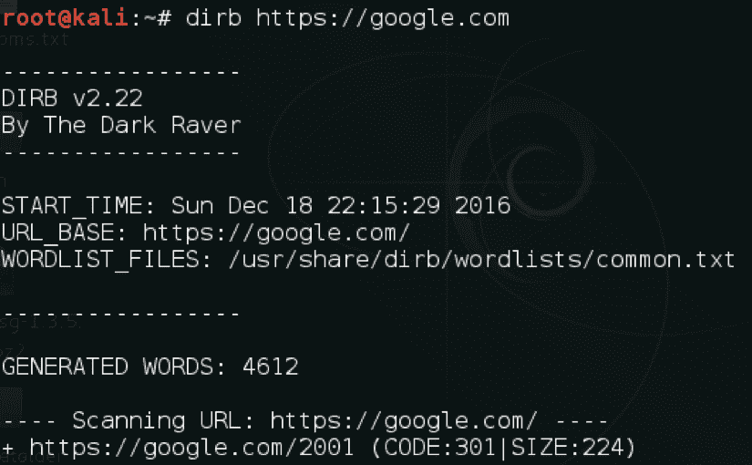

# 还有更多。。。

`dirb`中还有其他方便的选项：

*   `-a`：指定用户代理
*   `-c`：指定 cookie
*   `-H`：输入自定义表头
*   `-X`：指定文件扩展名

# 另见

*   来自[第一章](01.html)*卡利的*Dirsearch*配方*简介

# 与德米特里一起表演深度魔法

**Deepmagic 信息收集工具**（**DMitry**）是一个用 C 编码的命令行工具开源应用程序。它能够收集关于目标的子域、电子邮件地址、何人信息等。

# 怎么做。。。

要了解 DMitry，请按照给定的步骤进行操作：

1.  我们使用一个简单的命令：

```
        dmitry -h
```

以下屏幕截图显示了前面命令的输出：

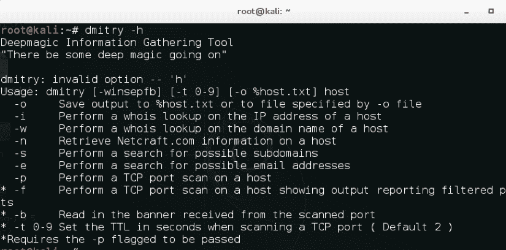

2.  接下来，我们尝试使用以下命令执行电子邮件、whois、TCP 端口扫描和子域搜索：

```
        dmitry -s -e -w -p domain.com
```

以下屏幕截图显示了前面命令的输出：


# 寻找 SSL 漏洞

今天的大多数 web 应用程序都使用 SSL 与服务器通信。`sslscan`是检查 SSL 是否存在缺陷或错误配置的绝佳工具。

# 怎么做。。。

要了解`sslscan`，请按照给定的步骤进行操作：

1.  我们将查看帮助手册，了解该工具的各种选项：

```
        sslscan -h    
```

以下屏幕截图显示了前面命令的输出：

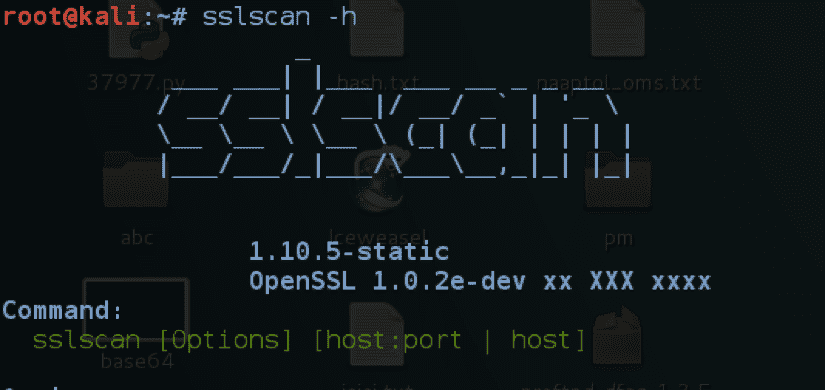

2.  要针对主机运行该工具，请键入以下内容：

```
        sslscan host.com:port 
```

以下屏幕截图显示了前面命令的输出：


# 另见

*   来自[第五章](05.html)的*一个流血的心的故事*配方，*网络开发对当前开发的影响*

TLSSLed 也是我们可以在 Kali 中用于对 SSL 执行检查的替代方案。

# 探索与脑内神经系统的联系

`intrace`工具是枚举现有 TCP 连接上的 IP 跃点的绝佳工具。它对于绕过防火墙和收集有关网络的更多信息非常有用。

# 怎么做。。。

运行以下命令：

```
    intrace -h hostname.com -p port -s sizeofpacket
```

以下屏幕截图显示了前面命令的输出：

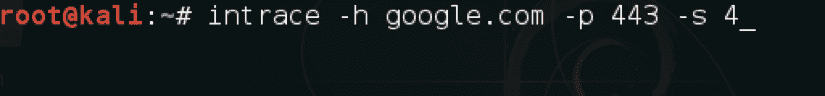

# 用收割机挖深

`theharvester`工具是渗透测试的一个很好的工具，因为它可以帮助我们找到关于一家公司的很多信息。它可以用于查找电子邮件帐户、子域等。在这个配方中，我们将学习如何使用它来发现数据。

# 怎么做。。。

命令非常简单：

```
    theharvester -d domain/name -l 20 -b all    
```

以下屏幕截图显示了前面命令的输出：


# 它是如何工作的。。。

在前面的配方中，`-d`表示我们要搜索的域名或关键字，`-l`表示限制搜索结果的数量，`-b`表示我们希望工具在收集信息时使用的来源。该工具支持 Google、Google CSE、Bing、Bing API、PGP、LinkedIn、Google Profiles、people123、Jigsaw、Twitter 和 Google Plus 资源。

# 寻找 web 应用背后的技术

在不了解 web 应用程序背后的实际技术的情况下，对其进行 pentest 是没有意义的。例如，当技术实际上是 ASP.NET 时，运行 dirsearch 来查找扩展名为`.php`的文件是完全无用的。因此，在这个食谱中，我们将学习使用一个简单的工具`whatweb`来理解 web 应用背后的技术。它默认在卡利出现。

也可以从 URL[手动安装 https://github.com/urbanadventurer/WhatWeb](https://github.com/urbanadventurer/WhatWeb) 。

# 怎么做。。。

`whatweb`的使用方法如下：

1.  可使用以下命令启动该工具：

```
        whatweb  
```

以下屏幕截图显示了前面命令的输出：

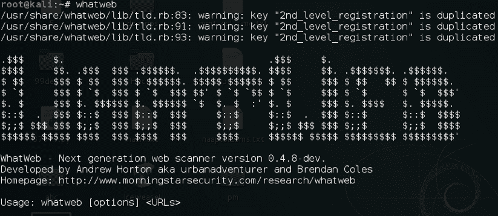

2.  域名可以作为参数给出，也可以通过`--input-file`参数输入多个域名：

```
        whatweb hostname.com  
```

以下屏幕截图显示了前面命令的输出：


# 用 masscan 扫描 ip

`masscan`工具是一种神奇的工具；它是最快的端口故障诊断仪。当它以每秒 1000 万包的速度传输时，它应该扫描整个互联网。当我们确切地知道在网络中寻找什么端口时，它是 Nmap 的一个很好的替代方案。

但与 Nmap 类似，它不支持默认端口扫描，所有端口必须使用`-p`指定。

# 怎么做。。。

`masscan`工具使用简单。我们可以使用以下命令开始网络扫描：

```
    masscan 192.168.1.0/24 -p 80,443,23   
```

以下屏幕截图显示了前面命令的输出：

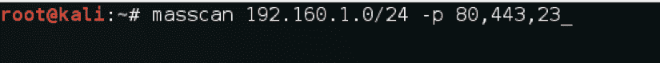

我们也可以使用`--max-rate`指定分组速率。默认情况下，速率为每秒`100`个数据包。不建议使用它，因为它会给网络设备带来大量负载。

# 和 Kismet 四处嗅探

Kismet 是第 2 层无线网络检测器。它很方便，因为在企业环境中执行 pentest 时，我们可能还需要寻找无线网络。Kismet 可以嗅探 802.11a/b/g/n 流量。它与任何支持原始监控模式的无线卡配合使用。

在本食谱中，我们将学习如何使用 Kismet 监控 Wi-Fi 网络。

# 怎么做。。。

要了解 Kismet，请遵循给定的步骤：

1.  我们使用以下命令启动 Kismet：

```
        kismet  
```

以下屏幕截图显示了前面命令的输出：


2.  一旦 GUI 启动，它会要求我们启动服务器，我们选择`yes`：


3.  接下来，我们需要指定一个源接口，在我们的例子中它是`wlan0`，所以我们键入它。在 Kismet 中初始化接口之前，确保接口处于监视模式：

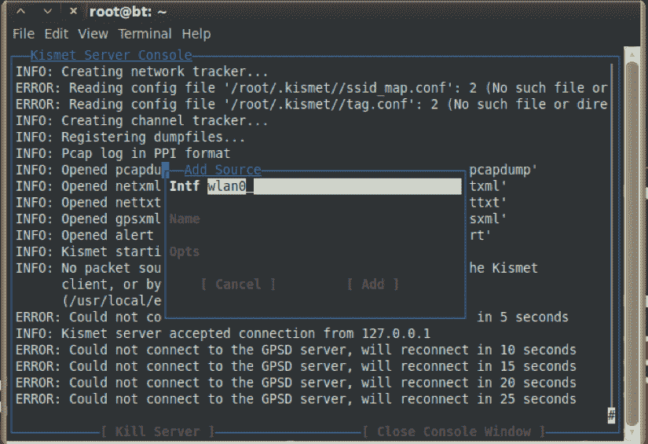

4.  现在，我们将看到我们周围所有无线网络的列表：


5.  默认情况下，Kismet 侦听所有通道，因此我们可以通过选择条目配置通道来指定特定通道。。。从 Kismet 菜单：


6.  我们可以在这里选择频道号：


7.  Kismet 还允许我们查看信噪比。我们可以通过选择频道详细信息看到。。。在 Windows 菜单中：

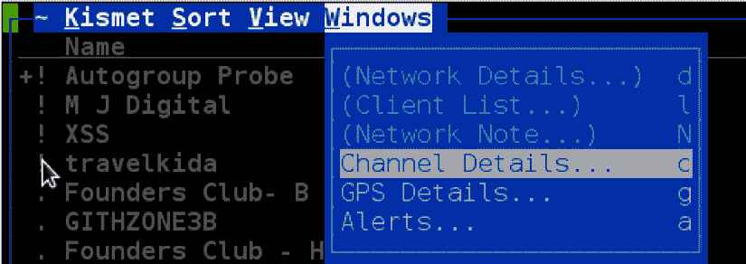

8.  此信噪比在转向期间非常有用：


# 用 firewalk 测试路由器

`firewalk`工具是一种网络安全侦察工具，它可以帮助我们确定我们的路由器是否真的在做他们应该做的工作。它试图找到路由器/防火墙将允许哪些协议以及它将阻止哪些协议。

该工具在测试期间非常有用，可以在公司环境中验证防火墙策略。

# 怎么做。。。

以下是使用`firewalk`的配方：

1.  如果找不到`firewalk`，我们可以使用以下方法安装：

```
        apt install firewalk
```

2.  我们可以使用以下命令运行 firewalk：

```
        firewalk -S1-23 -i eth0 192.168.1.1 192.168.10.1   
```

以下屏幕截图显示了前面命令的输出：


# 它是如何工作的。。。

在前面的命令中，`-i`用于指定网络接口，`-S`用于指定我们要测试的端口号，接下来的两个是我们要对照路由器检查的路由器 IP 地址和主机 IP 地址。

Nmap 还包括一个执行 firewalk 的脚本。更多信息请参见[https://nmap.org/nsedoc/](https://nmap.org/nsedoc/) 。