# 无线攻击–越过 Aircrack ng

在本章中，我们将介绍以下配方：

*   老好人
*   与 Gerix 一起动手
*   处理 WPA
*   拥有幽灵钓鱼者的员工帐户
*   精灵尘埃攻击

# 介绍

如其官方网站所述：

“Aircrack ng 是一套完整的评估 Wi-Fi 网络安全的工具。
它专注于 Wi-Fi 安全的不同领域：

*   *监控：通过第三方工具*
*   *攻击：通过数据包注入*

*   *测试：检查无线局域网卡和驱动程序能力（捕获和注入）*
*   *破解：WEP 和 WPA PSK（WPA 1 和 WPA 2）*

# 老好人

Aircrack 是一个网络软件套件，由网络检测器、数据包嗅探器和 WEP/WPA2 破解程序组成。它是开源的，专为 802.11 无线局域网构建（有关更多信息，请访问[https://en.wikipedia.org/wiki/IEEE_802.11](https://en.wikipedia.org/wiki/IEEE_802.11) ）。它由多种工具组成，如`aircrack-ng`、`airmon-ng`、`airdecap`、`aireplay-ng`、`packetforge-ng`等。

在本食谱中，我们将介绍使用 Aircrack 套件破解无线网络的一些基本知识。您将学会使用`airmon-ng`、`aircrack-ng`、`airodump-ng`等工具破解我们周围无线网络的密码。

# 准备

我们需要一个支持数据包注入的 Wi-Fi 硬件。阿尔法网络公司的阿尔法卡、TP-Link TL-WN821N 和 EDIMAX EW-7811UTC AC600 是我们可以使用的一些卡。在这个例子中，我们使用的是阿尔法卡。

# 怎么做。。。

以下步骤演示了机组：

1.  我们键入`airmon-ng`命令以检查我们的卡是否已被 Kali 检测到：


2.  接下来，我们需要使用以下命令将适配器设置为监视器模式：

```
 airmon-ng start wlan0mon 
```

以下屏幕截图显示了前面命令的输出：

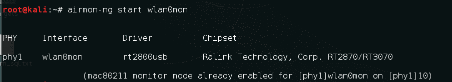

3.  现在，为了查看附近正在运行的路由器，我们使用以下命令：

```
 airodump-ng wlan0mon
```

以下屏幕截图显示了前面命令的输出：

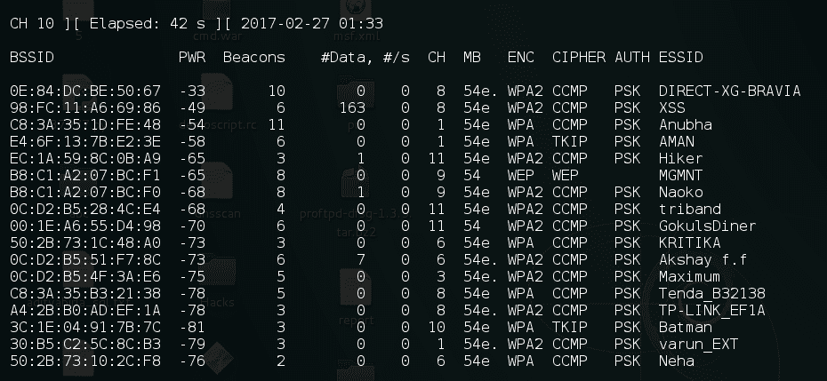

4.  在这里，我们注意到我们想要破解的网络的`BSSID`；在我们的例子中，它是`B8:C1:A2:07:BC:F1`，通道号是`9`。我们通过按*Ctrl*+*C*停止进程，并保持窗口打开。

5.  现在我们使用`airodump-ng`和`-w`开关捕获数据包，将这些数据包写入文件：

```
 airodump-ng -w packets -c 9 --bssid B8:C1:A2:07:BC:F1 wlan0mon
```

以下屏幕截图显示了前面命令的输出：


6.  现在我们需要观察信标和数据列；这些数字从`0`开始，并随着数据包在路由器和其他设备之间的传递而增加。我们需要至少 20000 个初始化向量才能成功破解**有线等效隐私**（**WEP**密码）：
7.  为了加快进程，我们打开另一个终端窗口并运行`aireplay-ng`并使用以下命令执行假身份验证：

```
 aireplay-ng -1 0 -e <AP ESSID> -a <AP MAC> -h <OUR MAC> wlan0mon 
       {fake authentication}
```

以下屏幕截图显示了上述命令的示例：

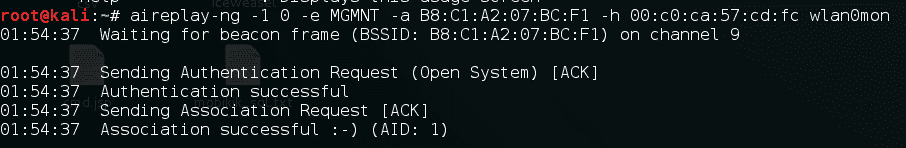

8.  现在，让我们使用以下命令执行 ARP 数据包重播：

```
 aireplay-ng -3 -b BSSID wlan0mon
```

以下屏幕截图显示了上述命令的示例：


9.  一旦我们有足够的数据包，我们启动`aircrack-ng`并提供保存数据包的文件名：

```
 aircrack-ng filename.cap
```

以下屏幕截图显示了上述命令的示例：


10.  一旦破解，我们将在屏幕上看到密码：


# 它是如何工作的。。。

这种攻击背后的想法是捕获尽可能多的数据包。每个数据包包含一个**初始化向量**（**IV**，大小为 3 字节，并与其关联。我们只需捕获尽可能多的 IVs，然后使用 Aircrack 获取密码。

# 与 Gerix 一起动手

在上一个配方中，您学习了如何使用 Aircrack 套件来破解 WEP。在这个方法中，我们将使用基于 GUI 的工具 Gerix，它使 Aircrack 套件易于使用，并使我们的无线网络审计更加容易。Gerix 是 J4r3tt 构建的基于 python 的工具。

# 准备

让我们使用以下命令安装 Gerix：

```
git clone https://github.com/J4r3tt/gerix-wifi-cracker-2.git
```

# 怎么做。。。

以下步骤演示了 Gerix 的使用：

1.  下载后，我们将转到下载目录并运行以下命令：

```
 cd gerix-wifi-cracker-2
```

2.  我们使用以下命令运行该工具：

```
 python gerix.py
```

在以下屏幕截图中可以看到前面的命令：


3.  窗口打开后，我们单击配置选项卡中的启用/禁用监视器模式，如以下屏幕截图所示：


4.  然后，单击重新扫描网络：

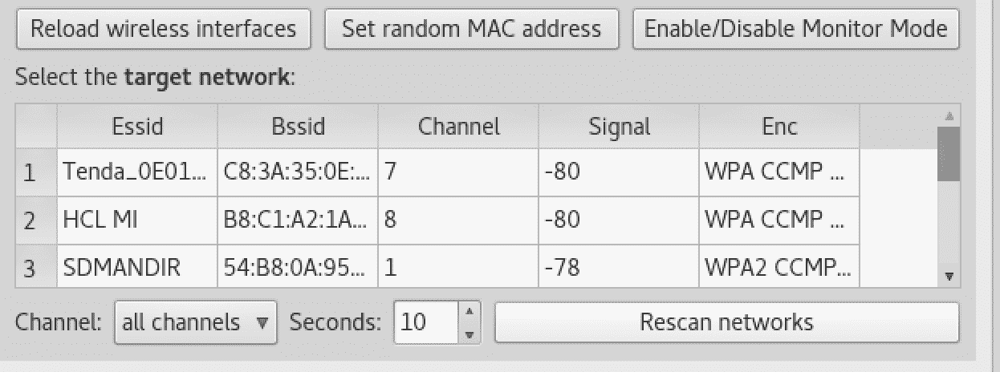

5.  这将向我们显示可用访问点的列表以及它们使用的身份验证类型。我们选择带有 WPA 的那个，然后切换到 WPA 选项卡。
6.  在这里，我们单击常规功能，然后单击开始捕获：


7.  由于 WPA 攻击需要捕获握手，因此我们需要一个已经连接到接入点的站点。因此，我们单击自动加载受害者客户端或输入自定义受害者 MAC：

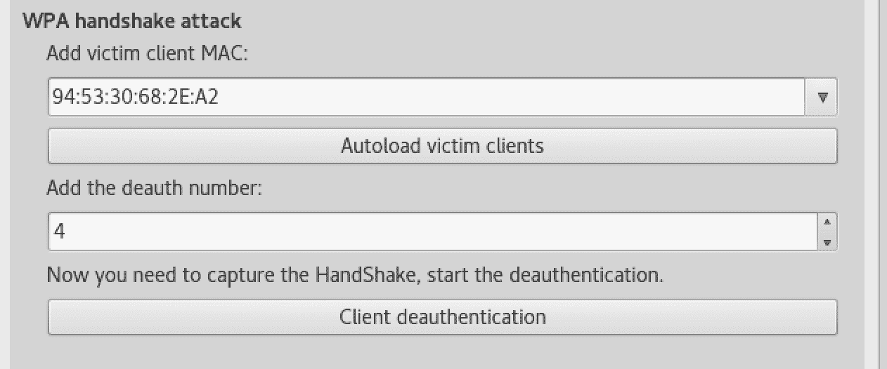

8.  接下来，我们选择 deauth 编号。我们在此处选择`0`以执行反身份验证攻击，并点击客户端反身份验证按钮：


9.  我们将看到弹出一个窗口，为我们执行反验证：

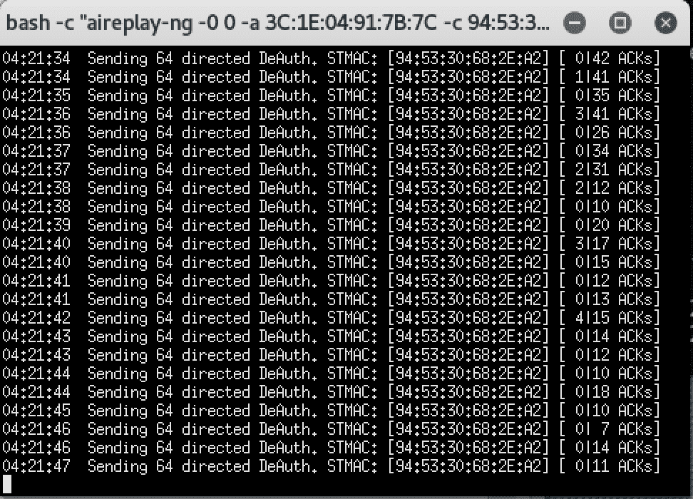

在 airodump 窗口中，我们应该看到握手已被捕获。

10.  现在我们已经准备好破解 WPA，我们切换到 WEP 破解选项卡，在 WPA 暴力破解中，我们给出字典的路径并单击 Aircrack ng-破解 WPA 密码：


11.  我们应该看到 Aircrack 窗口，当密码被破解时，它会显示密码：

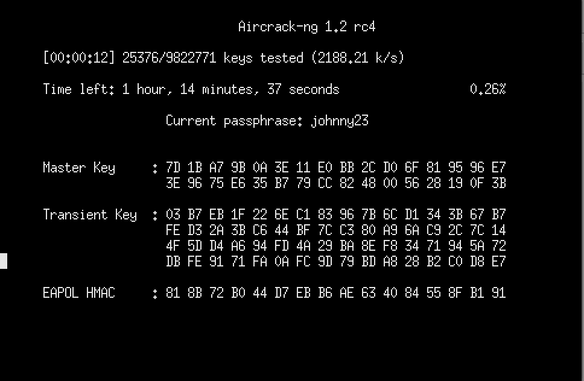

12.  同样，该工具也可用于破解 WEP/WPA2 网络。

# 处理 WPA

Wifite 是一个 Linux 专用工具，旨在自动化无线审计过程。它需要安装 Aircrack suite、Reaver、Pyri 等，才能正常运行。它预装了卡利。在本食谱中，您将学习如何使用 wifite 破解一些 WPA。

# 怎么做。。。

要了解 Wifite，请遵循给定的步骤：

1.  我们可以通过键入以下命令启动 Wifite：

```
 wifite
```

前面的命令显示所有可用网络的列表，如以下屏幕截图所示：


2.  然后按*Ctrl*+*C*停止；然后，它会要求您选择我们想要尝试破解的网络：


3.  我们输入我们的号码并按*输入*。该工具会自动尝试使用不同的方法来破解网络，最后，如果成功破解，它会向我们显示密码：


我们将看到以下密码：

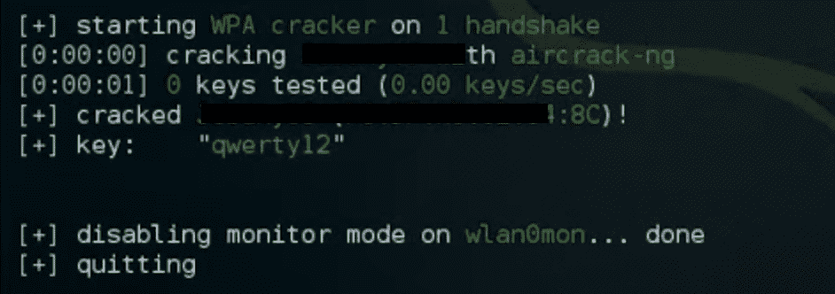

# 拥有幽灵钓鱼者的员工帐户

Ghost Phisher 是一种无线网络审计和攻击软件，它创建了一个虚假的网络接入点，欺骗受害者连接到该网络。然后它为受害者分配一个 IP 地址。该工具可用于执行各种攻击，例如凭据钓鱼和会话劫持。它还可用于向受害者提供计量器有效载荷。在本食谱中，您将学习如何使用该工具执行各种网络钓鱼攻击或窃取 cookie 等。

# 怎么做。。。

幽灵钓鱼者的使用情况如下所示：

1.  我们使用`ghost-phisher`命令启动它：


2.  在这里，我们选择界面并单击设置监视器：


3.  现在，我们输入要创建的接入点的详细信息：


4.  然后，我们单击 Start 创建一个具有该名称的新无线网络。

5.  然后，我们切换到一个假的 DNS 服务器。在此，我们需要提及受害者在打开任何网页时将被定向到的 IP 地址：

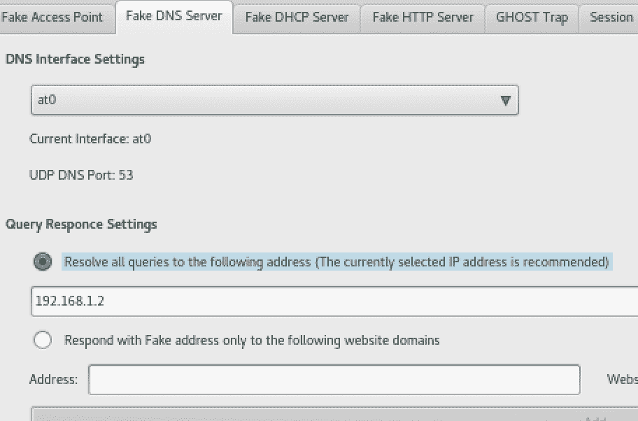

6.  然后启动 DNS 服务器。
7.  然后，我们切换到伪 DHCP 服务器。在这里，我们需要确保当受害者尝试连接时，他/她会获得分配给他的 IP 地址：


8.  完成后，单击 Start 启动 DHCP 服务。
9.  如果我们想仿冒某人并捕获凭据，我们可以通过设置“假冒 HTTP 服务器”选项卡中的选项将他们定向到仿冒页面。在这里，我们可以上传我们想要显示的 HTML 页面，或者提供我们想要克隆的 URL。我们启动服务器：

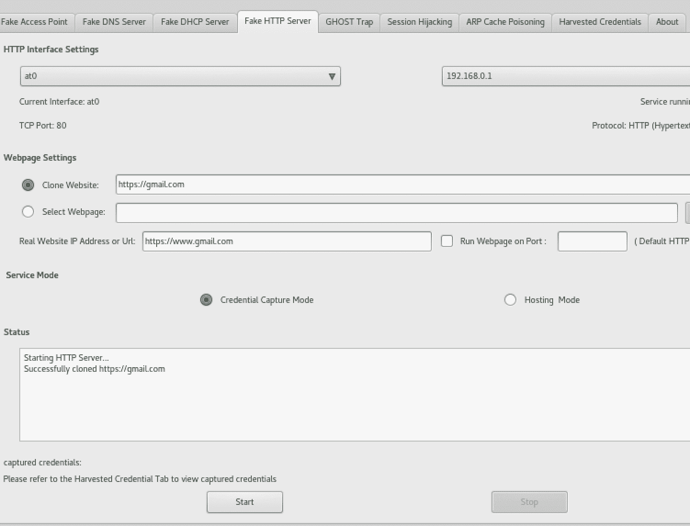

10.  在下一个选项卡中，我们将看到幽灵陷阱；此功能允许我们执行 Metasploit 有效负载攻击，这将要求受害者下载我们准备好的 MeterMeter 有效负载，一旦执行，我们将恢复 MeterMeter 连接。
11.  在会话劫持选项卡中，我们可以侦听和捕获可能通过网络的会话。在这里，我们只需输入网关或路由器的 IP 地址，然后单击开始，它将检测并显示捕获的任何 cookie/会话：

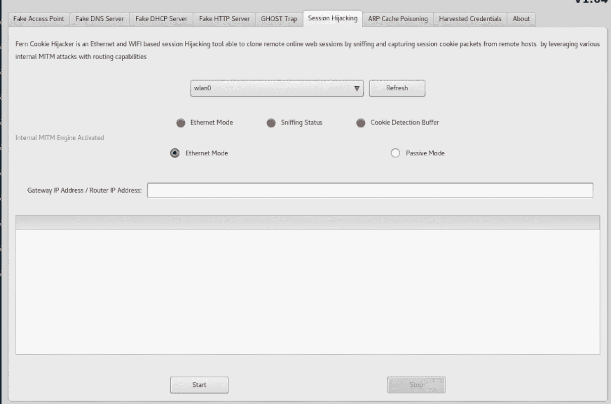

12.  我们在 HTTP 服务器中捕获的凭据可以在“获取的凭据”选项卡中看到。

# 精灵尘埃攻击

**Wi-Fi 保护设置**（**WPS**）于 2006 年推出，适用于希望连接到家庭网络而无需记住 Wi-Fi 复杂密码的家庭用户。它使用一个八位数的 pin 来验证网络客户端的身份。
精灵尘埃攻击是一种暴力强迫八位数 pin 的方式。如果路由器易受攻击，此攻击允许在几分钟内恢复 pin。另一方面，一个简单的暴力可能需要几个小时。在本食谱中，您将学习如何执行精灵尘埃攻击。

可在[找到攻击将在其上工作的易受攻击路由器列表 https://docs.google.com/spreadsheets/d/1tSlbqVQ59kGn8hgmwcPTHUECQ3o9YhXR91A_p7Nnj5Y/edit?pref=2 &pli=1#gid=2048815923](https://docs.google.com/spreadsheets/d/1tSlbqVQ59kGn8hgmwcPTHUECQ3o9YhXR91A_p7Nnj5Y/edit?pref=2&pli=1#gid=2048815923)。

# 准备

我们需要启用 WPS 的网络。否则，它将不起作用。

# 怎么做。。。

要了解 pixie dust，请按照给定步骤进行操作：

1.  我们使用以下命令在监控模式下启动界面：

```
 airmon-ng start wlan0
```

2.  然后，我们需要找到启用 WPS 的网络；我们可以使用以下命令执行此操作：

```
 wash -i <monitor mode interface> -C
```

以下屏幕截图显示了上述命令的示例：

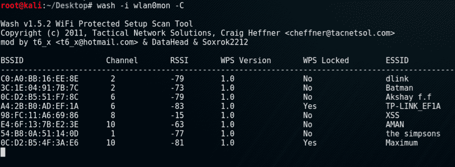

3.  现在我们使用以下命令运行`reaver`：

```
 reaver -i wlan0mon -b [BSSID] -vv -S -c [AP channel]
```

以下屏幕截图显示了上述命令的示例：

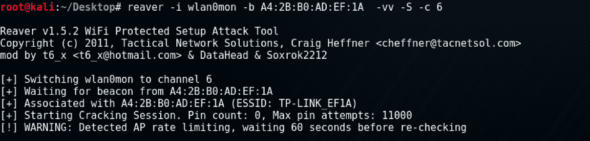

4.  一旦完成，我们应该看到别针。

# 还有更多。。。

以下是一些攻击无线网络时可以参考的优秀文章：

*   [http://www.hackingtutorials.org/wifi-hacking-tutorials/pixie-dust-attack-wps-in-kali-linux-with-reaver/](http://www.hackingtutorials.org/wifi-hacking-tutorials/pixie-dust-attack-wps-in-kali-linux-with-reaver/)
*   [http://www.kalitutorials.net/2014/04/hack-wpawpa2-wps-reaver-kali-linux.html](http://www.kalitutorials.net/2014/04/hack-wpawpa2-wps-reaver-kali-linux.html)