# 第二章网络信息采集

在本章中，我们将介绍以下配方：

*   通过网络发现实时服务器
*   绕过 IDS/IPS/防火墙
*   通过网络发现端口
*   使用 unicornscan 进行更快的端口扫描
*   服务指纹
*   使用 nmap 和 XPROB2 确定操作系统
*   服务枚举
*   开源信息收集

# 导言

在本章中，我们将研究如何通过网络检测实时服务器和网络设备，并执行服务指纹和枚举以收集信息。收集信息对于成功的漏洞评估和渗透测试至关重要。接下来，我们将运行扫描程序来查找检测到的服务中的漏洞。除此之外，我们还将编写 bash 脚本，以便加快发现枚举扫描的过程。

# 通过网络发现实时服务器

在本食谱中，我们将学习如何使用两种方法通过网络发现实时网络设备/机器：**被动信息收集**和**主动信息收集**。

作为被动信息收集的一部分，我们将检查我们环境的网络流量，然后是主动信息收集，在主动信息收集中，我们将通过网络发送数据包，以检测在其上运行的主动机器和服务。

## 准备好了吗

为了开始这个配方，我们将使用一个名为**netdiscover**的简单 ARP 嗅探/扫描工具。它是一种网络发现工具，可用于主动/被动 ARP 侦察。

## 怎么做。。。

让我们从被动侦察开始：

1.  To start netdiscover, ensure that you are connected via Wi-Fi with a valid IP address. Open the terminal and enter the following command for passive reconnaissance:

    ```
    netdiscover - p

    ```

    输出将如以下屏幕截图所示：

    

2.  To perform an active scan over the network to discover live IPs, type the following command in the terminal:

    ```
    netdiscover -i eth0

    ```

    输出将如以下屏幕截图所示：

    

3.  如果要保存 netdiscover 的输出，可以使用以下命令：

    ```
    netdiscover -i eth0 > localIPS.txt

    ```

4.  After a few seconds (for example, 10 seconds), terminate the program with *Ctrl* + *C*, and the output of the file will look something like the following:

    

5.  Another way to perform a quick and effective scan is by using the `nmap` command. To detect the live systems over the network range via a simple ping scan, use the following command in the terminal:

    ```
    nmap -sP 192.168.1.0/24

    ```

    输出将如以下屏幕截图所示：

    

6.  You can also save the outputs of the nmap tool into a file. All we have to do is add a bit of bash scripting and type the following command in terminal:

    ```
    nmap -sP <IP address range>/<class subnet> | grep "report for" |        cut -d " " -f5 > nmapliveIPs.txt

    ```

    让我们了解一下这个命令：第一个`nmap`命令的输出作为管道符号后面的第二个命令的输入。在第二个命令中，grep 命令搜索包含“report for”的行，因为这将是指定 IP 正在响应的语句。找到“report for”的行的输出被转发到管道符号之后的第三个命令。在第三个命令中，我们执行一个剪切操作，其中我们说比较分隔符是行中的一个“空格”，当分隔基于“空格”时，获取第五个字段，即第五个字。

    该文件的输出仅包含我们可以继续用于进一步评估的 IP 地址：

    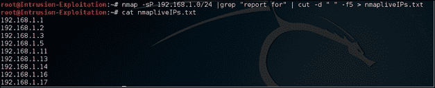

    由于所有 IP 都已提取到一个文件中，因此该文件将在进一步的参考中用于自动化扫描请求链。

## 它是如何工作的。。。

因此，我们使用的几个工具的工作原理如下：

*   `netdiscover`: The following switches are used with this command:

    *   `-p`：该开关用于被动模式下运行；它确保自己不发送任何数据包，只是充当我们网络接口卡上的侦听器
    *   `-i`：此开关用于指定用于检测活动 IP 的接口

我们还了解了如何将输出存储在文件中以供以后参考。

*   `nmap`: The following switches are used with this command:

    *   `-sP`：该开关也被视为用于 ping 扫描的`-sn`开关

我们还使用调用基本逻辑的 bash 脚本将 ping 扫描的输出保存在文件中。

在这个配方中，我们学习了如何检测网络中所有活动的 IP，并在下一个配方中确定它们的范围以进行开放端口分析。

## 还有更多。。。

netdiscover 工具中提供了更多功能，有助于加快此过程。详情如下:

*   `-h`：此功能加载使用 netdiscover 的帮助内容
*   `-r`：此功能允许您执行范围扫描，而不是自动扫描
*   `-s`：此功能为您提供了在每次请求之间睡眠的选项
*   `-l`：此功能允许您提供包含要扫描的 IP 范围列表的文件
*   `-f`：此功能可实现快速模式扫描；与常规检测技术相比，它节省了大量时间

nmap 工具还支持许多实时 IP 检测选项：

*   `-sL`：这是一个简单的列表扫描，用于指定要检查的具有 IP 地址的文件
*   `-sn`：这是一个简单的 ping 扫描器，用于确定活动 IP。
*   `-PS`/`PA`/`PU`/`PY TCP SYN`/`ACK`：用于基于 UDP 或 SCTP 的端口检测
*   `--traceroute`：此选项允许到每个主机的跟踪跃点路径

## 另见

有关主动扫描和被动扫描的更多信息，以及用于主动扫描和被动扫描的更多工具，请参阅以下链接：

*   [http://tools.kali.org/tools-listing](http://tools.kali.org/tools-listing) 用于工具集
*   [https://nmap.org/docs.html](https://nmap.org/docs.html)

# 绕过 IDS/IPS/防火墙

在本教程中，我们将介绍 nmap 支持的一些交换机，这些交换机可用于绕过 IDS/IP/防火墙。很多时候，当我们执行扫描时，我们会遇到防火墙。如果防火墙配置不正确，我们将能够执行以下 nmap 的防火墙规避命令。

## 准备好了吗

我们将使用 nmap 进行此活动。让我们从检测到运行一些规避开关的机器开始。

## 怎么做。。。

对于此配方，我们将执行以下步骤：

1.  We will use the fragment packet switch to perform the discovery:

    片段数据包交换机将 TCP 报头拆分为多个数据包，以使数据包过滤器、入侵检测系统和其他麻烦更难检测正在进行的活动扫描。在某些情况下，这可能会失败，因为某些程序可能无法处理微小的数据包。欲了解更多详情，请访问[https://nmap.org/book/man-bypass-firewalls-ids.html](https://nmap.org/book/man-bypass-firewalls-ids.html) 。

    我们将输入以下命令：

    ```
    nmap -f <ip address>

    ```

    输出将如以下屏幕截图所示：

    

2.  Another switch is the `mtu` switch available in nmap, when we perform a fragment scan nmap divides the packet in 8 bytes or less, so to understand a 30 byte packet would be divided in 4 packets on respecifying `-f` the packet would be divided in 16 bytes thus reducing the fragments, mtu allows us to specify our own offset size that we want to use for the purpose of scan.

    要在此处通过 MTU 执行规避，请在终端中输入以下命令：

    ```
    nmap -mtu 24 <ip address>

    ```

    ### 注

    有关 MTU 开关的更多信息，请参阅[https://nmap.org/book/man-bypass-firewalls-ids.html](https://nmap.org/book/man-bypass-firewalls-ids.html) 。

    输出将如以下屏幕截图所示：

    

3.  Here we will use a decoy attack. Enter the following command in terminal:

    ```
    nmap -D <Fake IP>,<Fake IP>,<Fake IP> <Real IP>

    ```

    输出将如以下屏幕截图所示：

    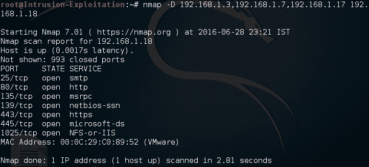

4.  Here we will do a custom port attack. Enter the following command in terminal:

    ```
    nmap -source-port 53 <IP address>

    ```

    输出将如以下屏幕截图所示：

    

    以下是帮助您更好地理解场景的示例：

    

请注意，与分段扫描相比，端口如何响应正常扫描。这表明我们能够绕过防火墙并检测开放端口。

## 它是如何工作的。。。

让我们了解这些开关是如何工作的：

*   `-f`：这种技术已经在配置错误的防火墙上使用了相当长的时间。它所做的是发送较小大小的数据包，以躲避防火墙。
*   `-mtu <8,16,24,32>`：**MTU**代表**最大传输单元**。在这里，我们可以手动指定数据包的大小；指定大小后，nmap 将发送输入大小的数据包以执行扫描活动。
*   `-D`：这用于欺骗提及我们选择的源 IP 的数据包，以便在日志中创建垃圾条目，并且很难找到启动扫描的系统。
*   `--source-port`：大多数情况下，防火墙为各种设备的网络中的某些端口设置允许传入规则。可通过使用自定义源端口利用此漏洞，该端口可能具有通过系统允许的入站访问权限，以执行扫描活动。

## 还有更多。。。

在规避标准中还有一些技术可用；例如，附加随机数据、MAC 欺骗和错误校验和扫描。这可以看作是自学。

# 通过网络发现端口

在此配方中，我们将使用扫描并保存在文件中的活动 IP 列表来执行信息收集，目的是扫描这些 IP 上的开放端口。我们将使用 nmap 及其功能来发现开放端口。

## 准备好了吗

我们将使用 nmap 工具来检测 IP 上的开放端口。让我们从检测特定 IP 上打开的端口的过程开始。

## 怎么做。。。

对于此配方，您需要执行以下步骤：

1.  We will run nmap by typing the following command in terminal:

    ```
    nmap <ip address>

    ```

    输出将如以下屏幕截图所示：

    

2.  We can even check what the tool is doing by using the verbose switch, by entering the following command in Terminal:

    ```
    nmap -v <IP address>

    ```

    输出将如以下屏幕截图所示：

    

3.  By default, it scans only 1,000 well-known sets of ports. If we are interested in setting the scan preference to the top 100 ports, we can run the following command in terminal:

    ```
    nmap --top-ports <number> <ip address>

    ```

    输出将如以下屏幕截图所示：

    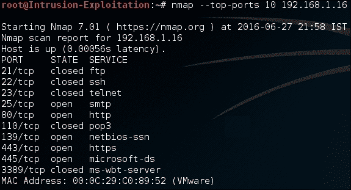

4.  We can even limit our port scanning to specific ports or a range of ports for any given IP(s) or IP range(s). We can run the following command to see the same:

    ```
    nmap -p <port range> <IP address>

    ```

    输出将如以下屏幕截图所示：

    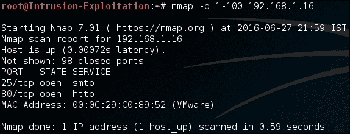

5.  There could be scenarios when we would like to know which IP(s) have a specific service running in the entire network range. We run the following command in Terminal:

    ```
    nmap -p <port number> <IP address>

    ```

    输出如下所示：

    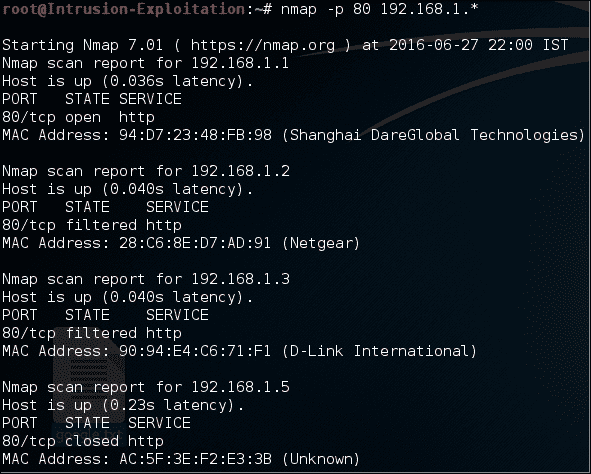

6.  Let's say we would like to check what UDP ports are open on a particular system. We can check this by typing the following command in Terminal:

    ```
    nmap -sU <IP Address>

    ```

    输出将如以下屏幕截图所示：

    

7.  In the previous recipe, we saw that we had saved the output of live IPs in one file; let us now look at how to import IPs from a file and perform a simple TCP scan.

    打开终端并键入以下命令，确保正确输入 IP 文件的路径：

    ```
    nmap -sT -iL /root/nmapliveIPs.txt

    ```

    输出将如以下屏幕截图所示：

    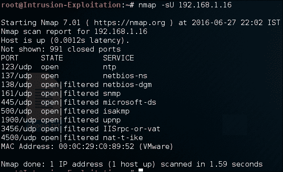

8.  可使用以下命令将实时 IP 扫描结果保存在文件中：

    ```
    nmap -sT -iL /root/nmapliveIPs.txt > openports.txt

    ```

9.  Nmap also has a graphical version of itself; it's named zenmap, and it looks as follows:

    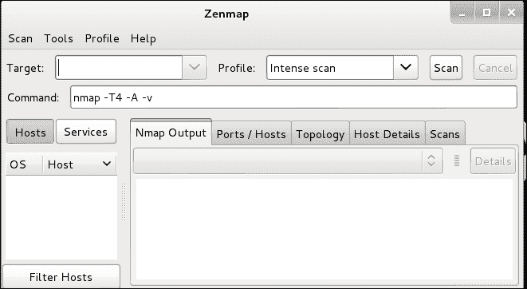

## 它是如何工作的。。。

让我们了解这些开关是如何工作的：

*   `Nmap < IP address>`：仅对著名端口执行 SYN 扫描，并导出基本信息集
*   `-v`：切换详细模式，从而提供有关扫描类型的更多信息
*   `--top-ports <number>`：此开关告诉 nmap 从著名的端口存储库中扫描给定数量的端口
*   `-p`：此交换机告诉 nmap 它应该只扫描交换机后面提到的端口号
*   `-sU`：这是 nmap 中的一个 UDP 交换机，告诉它通过发送 UDP 数据包并检测相应的响应来扫描打开的端口
*   `-sT`：这是一个 TCP 交换机，告诉 nmap 与目标网络建立连接，以确保端口完全打开
*   `-iL`：此开关告诉 nmap 可以从`-iL`开关后面提到的文件中获取输入

在这个配方中，我们看到了如何检测开放端口；这将帮助我们继续下一步的食谱。

## 还有更多。。。

nmap 中还有许多其他可用选项，可用于扫描基于协议的开放端口，还可以使用其他技术进行有效扫描，以尝试保持对网络中正在运行的扫描仪的低级别检测。工具中的有用命令如下所示：

*   `-sS`：此命令执行 SYN can（最快和最准确的扫描-推荐）
*   `-sX`：此命令执行圣诞节扫描
*   `-sF`：此命令执行 FIN 扫描
*   `-sN`：此命令执行空扫描
*   `-sU`：此命令执行 UDP 扫描。然而，它不是很准确，因为 UDP 是无状态的

## 另见

*   对于 Zenmap（nmap 的 GUI 版本），我们建议您访问[http://nmap.org/book/man-port-scanning-techniques.html](http://nmap.org/book/man-port-scanning-techniques.html) ，作为参考。可在**卡利 Linux****信息采集****网络扫描仪****Zenmap**下找到

# 使用 unicornscan 进行更快的端口扫描

Unicornscan 是另一种工作速度非常快的扫描仪，其核心原因是该工具实现的方法。它与异步无状态 TCP 扫描技术一起工作，其中它还使用 TCP 标志和 UDP 进行所有可能的更改。在本食谱中，我们将了解如何利用 unicornscan 及其高级功能。

## 准备好了吗

为了开始使用 unicornscan，我们将从我们的 IP 系列中获取一个 IP，并深入挖掘该工具的功能。

## 怎么做。。。

让我们完成以下步骤：

1.  Open terminal and type the following command for a simple unicornscan:

    ```
    unicornscan <IP address>

    ```

    输出将如以下屏幕截图所示：

    

2.  If you would like to see the details of what it is doing while we execute the command, we can make use of the verbose script by using the following command:

    ```
    unicornscan -v <IP address>

    ```

    输出将如以下屏幕截图所示：

    

    我们可以看到，它显示了在执行扫描时考虑的端口。

3.  Let's say we want to do the same with UDP as well. Enter the following command in terminal:

    ```
    unicornscan -v -m U <IP address>

    ```

    输出将如以下屏幕截图所示：

    

4.  There are more options available. To check them, type the following command in terminal:

    ```
    Unicornscan -h

    ```

    输出将如以下屏幕截图所示：

    

## 它是如何工作的。。。

配方中提到的命令如下所示：

*   `Unicornscan <IP address>`：在此场景中，unicornscan 运行默认的`TCP SYN`扫描（unicornscan 中的参数将是 IP 上的`-mTS`并扫描位于`/etc/Unicornscan/unicornscan.conf`的`unicornscan.conf`文件下的快速端口。
*   `-v`：开关告知扫描仪进入详细模式，并提供更多信息，说明其在执行扫描时正在执行的操作。
*   `-m U`：`-m`开关表示要使用的扫描模式。在这个场景中，我们使用了`U`，这意味着扫描类型应该是 UDP。

在这个配方中，我们看到了如何有效地使用 unicornscan 以闪电般的速度获取关于开放端口的信息，以及如何在不同交换机之间切换。

## 还有更多。。。

unicornscan 中有更多可用的开关，可用于临时设置扫描首选项。建议您尝试一下并熟悉它们：

```
Unicornscan -h

```

# 服务指纹

在本配方中，我们将了解如何分析开放端口，以确定开放端口上运行的是哪种服务。这将帮助我们了解目标 IP 是否运行任何易受攻击的软件。这就是为什么服务指纹识别是一个必要且非常重要的步骤。

## 准备好了吗

我们将使用 nmap 对目标 IP 的服务进行指纹识别。Nmap 是一个多功能工具，执行从主机发现到漏洞评估的任务；服务指纹也是其中的一部分。

## 怎么做。。。

步骤如下：

1.  Using nmap, run the following command in terminal to achieve the service enumeration result:

    ```
    nmap -sV <IP address>

    ```

    输出将如以下屏幕截图所示：

    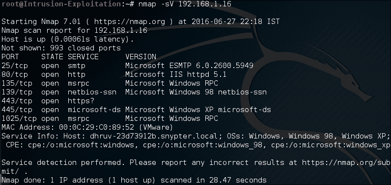

2.  We can even enumerate the UDP services running on the target IP, by using the UDP scan switch along with the service-detection switch:

    ```
    Nmap -sU -sV <IP address>

    ```

    输出将如以下屏幕截图所示：

    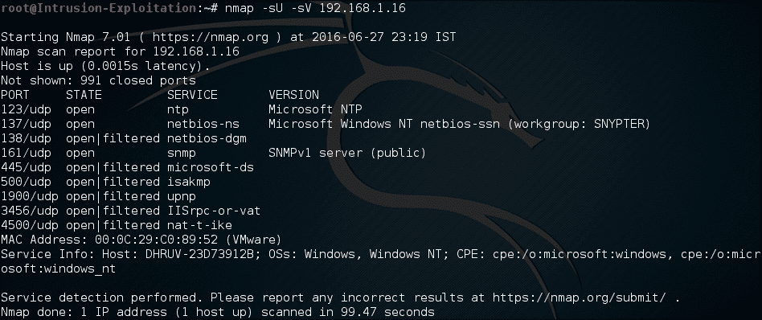

3.  We can speed up the scan using the following command:

    ```
    nmap -T4 -F -sV  <IP address>

    ```

    所用开关的详细信息见*如何工作*一节。有关更多详细信息，请访问[https://nmap.org/book/man-port-specification.html](https://nmap.org/book/man-port-specification.html) 和[https://nmap.org/book/man-version-detection.html](https://nmap.org/book/man-version-detection.html) 。

    输出将如以下屏幕截图所示：

    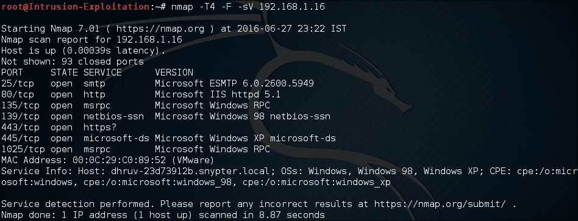

    在这里，我们可以看到正常扫描和定时扫描之间的差异几乎为 60 秒以上。

## 它是如何工作的。。。

以下是我们将使用的开关列表及其解释，以便更好地理解：

*   `-sV`：表示版本检测；它探测所有打开的端口，并尝试解析标题信息以确定正在运行的服务版本。
*   `-T4`：`T`表示细粒度定时控制，`4`表示执行扫描的速度级别。时间范围从 0 到 5：（0）偏执，（1）鬼鬼祟祟，（2）礼貌，（3）正常，（4）攻击，（5）疯狂。（0）和（1）通常有助于规避 IDS，而（4）告诉 nmap 假设我们在一个快速可靠的网络上，从而加快扫描速度。
*   `-F`：这是一种快速模式；它扫描的端口数少于默认扫描。

在本教程中，我们了解了 nmap 指纹如何打开端口来检测正在运行的服务及其相应的版本。这将在稍后用于帮助我们检测操作系统。

## 还有更多。。。

我们甚至可以查看 Kali 发行版中提供的处理服务枚举的其他工具。我们可以检查的一些工具列在**Kali Linux****信息收集****<服务>**下。

nmap`-sV`检测中也有详细的开关：

*   `--all-ports`：这告诉 nmap 确保对所有开放端口上运行的服务版本进行指纹识别。
*   `--version-intensity`：这告诉 nmap 以 0 到 9 的强度值进行扫描，9 是最有效的指纹。

在列举端口后，攻击者可以通过谷歌搜索或搜索[漏洞利用-db.com](http://exploit-db.com)、[securityfocus.com](http://securityfocus.com)等网站，发现端口上运行的软件版本是否容易受到任何攻击向量的攻击。

# 使用 nmap 和 XPROB2 确定操作系统

在这个配方中，我们将使用工具来确定目标 IP 运行在什么类型的操作系统上。将目标 IP 映射到相应的操作系统对于帮助筛选和验证漏洞是必要的。

## 准备好了吗

在此配方中，我们将使用 nmap 工具来确定操作系统。我们所需要的只是一个 IP 地址，我们将对其运行操作系统枚举扫描。其他可以使用的工具有 hping 和 xprobe2。

## 怎么做。。。

让我们从确定操作系统开始：

1.  Open terminal and type the following:

    ```
    nmap -O <IP address>

    ```

    输出将如以下屏幕截图所示：

    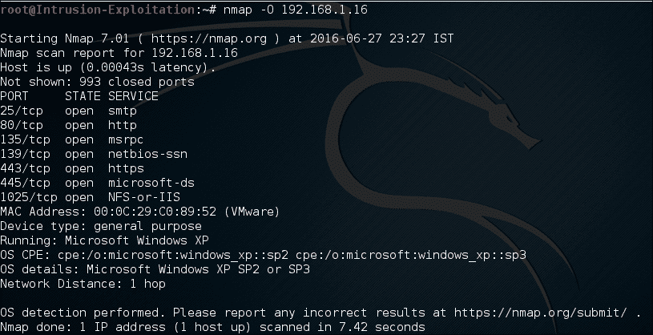

    我们可以使用高级操作员以更积极的方式帮助我们找到操作系统。在终端中键入以下命令：

    ```
    nmap O --osscan-guess <IP address>

    ```

    输出将如以下屏幕截图所示：

    

    这表明，在 nmap 中使用操作系统检测的附加参数，我们可以获得最佳拟合的可能想法。

2.  Xprobe2 uses a different approach to nmap. It uses fuzzy signature matching to provide the probable operating system. Open terminal and type the following command:

    ```
    xprobe2 <IP Address>

    ```

    输出将如以下屏幕截图所示：

    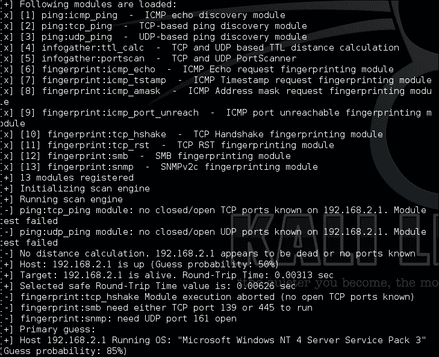

    我们无法确定哪一个是最好的扫描器，因为每个扫描器都有自己的实现方法。为了证明我们所说的，让我们看看下面的场景。我们为枚举操作系统设置了一个共同目标。目标是[www.google.com](http://www.google.com)。

    以下屏幕截图显示了 nmap 结果：

    

    以下屏幕截图显示了 Xprobe 结果：

    

## 它是如何工作的。。。

Nmap 执行基于 TCP/IP 堆栈指纹确定操作系统的活动。它发送一系列数据包，包括 TCP 和 UDP 数据包，并分析所有响应。然后将它们与 nmap 引擎提供的签名进行比较，以放入最适合的操作系统，并告诉我们目标机器的操作系统可能是什么。在前面的场景中，有一个目标 IP 没有提供任何操作系统详细信息；这是因为 nmap 工具无法将任何响应与工具中可用的签名相匹配。

让我们看看上面使用的开关的一些细节：

*   `-O`参数使 nmap 引擎能够根据从横幅检索到的信息开始确定可能的操作系统。它提到，如果在目标 IP 上找到一个打开和一个关闭的 TCP 端口，效果会更好。
*   `--osscan-guess`参数使 nmap 引擎能够在无法找到完美匹配的情况下显示检测到的签名的最佳可能匹配。

XPROB2 大约有 14 个模块，可用于扫描远程目标上运行的操作系统类型。

在这个配方中，我们学习了如何使用不同的扫描仪有效地确定操作系统。我们现在将使用此信息继续下一个配方。

## 还有更多。。。

nmap 操作系统发现模块中还有其他选项，如下所示：

*   `--osscan-limit`：该论点将检测范围仅限于有希望的目标；如果未找到任何打开的端口，它将跳过目标。这在扫描多个目标时节省了大量时间。
*   `--max-os-tries`：用于设置 nmap 失败时尝试检测的次数。默认情况下，它会尝试五次；这可以设置为较低的值，以避免时间消耗。

# 服务枚举

一旦对服务进行了指纹识别，我们就可以执行枚举。可以使用许多不同的来源来实现此配方的目标。在此配方中，我们将了解如何使用各种工具执行服务发现扫描，具体如下：

*   SMB 扫描
*   SNMP 扫描
*   使用**NSE**（**nmap 脚本引擎**引擎

**Nbtscan**是一个 Kali 脚本，用于枚举目标 IP 的 NetBIOS 名称。它可以用作 SMB 枚举的早期部分。它基本上要求以人类可读的格式对 NetBIOS 名称进行状态查询。

## 准备好了吗

在这个配方中，我们将使用工具来列举上面提到的所有服务。

## 怎么做。。。

对于该配方，步骤如下：

1.  To enumerate the NetBIOS name, we will run the following command in terminal:

    ```
    nbtscan <IP address>

    ```

    输出将如以下屏幕截图所示：

    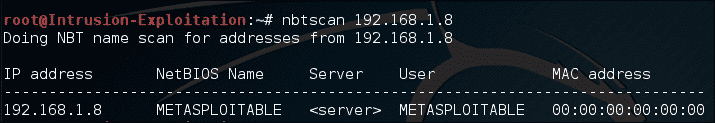

2.  You can run the NetBIOS enumeration over a class range as well, using the following command in terminal:

    ```
    nbtscan -r <IP address>/<class range>

    ```

    输出将如以下屏幕截图所示：

    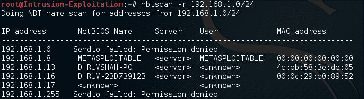

3.  To perform an SMB scan, we can use commands such as `enum4linux`. Enter the following command in terminal to start an SMB scan:

    ```
    enum4linux <IP address>

    ```

    输出将如以下屏幕截图所示：

    

    此外，它还提供共享枚举信息，以检查系统上的可用共享：

    

    它甚至向我们显示了目标上的密码策略（如果应用了）：

    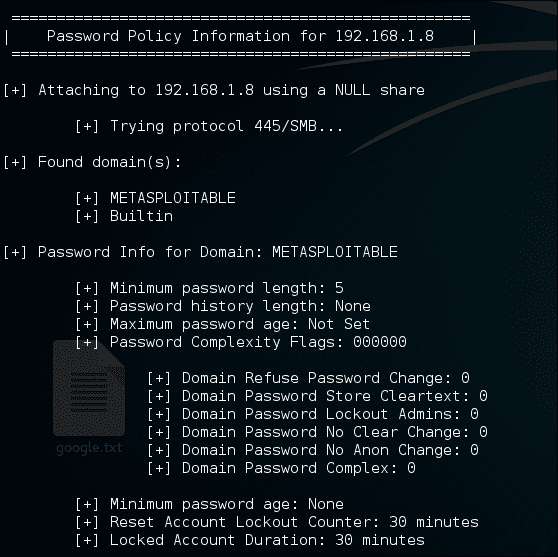

    如您所见，enum4 Linux 是一个强大的工具，特别是在启用空会话的场景中。

    ### 注

    理解空会话的维基百科参考：空会话是与基于 Windows 的计算机上的进程间通信网络服务的匿名连接。该服务旨在允许命名管道连接。但是，可以利用它来检索信息。有关空会话的基本了解，请访问[http://www.softheap.com/security/session-access.html](http://www.softheap.com/security/session-access.html) 。详细的 pentest 场景可参见[https://pen-testing.sans.org/blog/2013/07/24/plundering-windows-account-info-via-authenticated-smb-sessions](https://pen-testing.sans.org/blog/2013/07/24/plundering-windows-account-info-via-authenticated-smb-sessions) 。

4.  Let's move on to SNMP scanning. For this purpose, we will use a scanning tool called SnmpWalk and start browsing through the **MIB** (**management information base**) tree.

    首先在终端中键入以下命令：

    ```
    snmpwalk -c public -v1 <IP address>

    ```

    输出将如以下屏幕截图所示：

    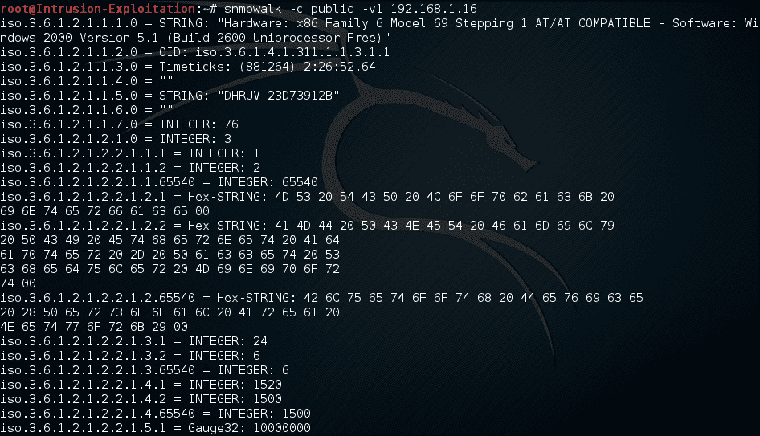

5.  We can see that a lot of information is fetched when we try to access the SNMP service, with the default string public if not changed. In order to make sure we do not get so much information, and to request information in an orderly manner, we can make use of the MIB tree.

    例如，如果我们希望只提取系统用户，那么我们可以使用此值`1.3.6.1.4.1.77.1.2.25`，在终端中输入以下命令：

    ```
    snmpwalk -c public -v1 <IP address> <MIB value>

    ```

    输出将如以下屏幕截图所示：

    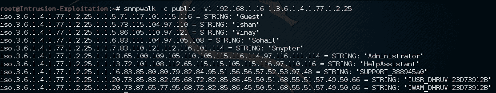

6.  We will be using nmap to find vulnerabilities in the open ports. Nmap has a huge list of scripts used for assessment purposes, which can be found at `/usr/share/nmap/scripts/`. The output will be as shown in the following screenshot:

    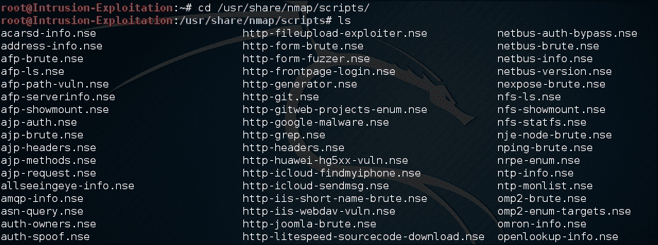

    这些脚本需要不时更新。

    一旦我们选择了一个目标，我们将在其上运行 nmap 脚本。

7.  Open terminal and type the following command to perform a script scan:

    ```
    nmap -sC <IP address >

    ```

    ### 注

    这将运行与打开的端口匹配的所有可能脚本。

    输出将如以下屏幕截图所示：

    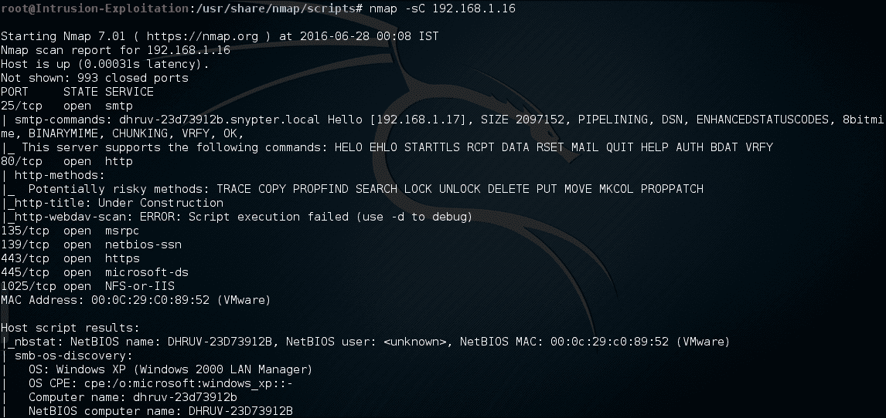

8.  We can even downsize the scope of scanning to specific services only. Type the following command in terminal to run all enumeration scripts related to SMB services only:

    ```
    nmap -sT --script *smb-enum* <IP address>

    ```

    输出将如以下屏幕截图所示：

    

9.  However, we should be aware that there are certain scripts that can stall or crash the service while trying to analyze if a target is vulnerable. These can be invoked by using the unsafe args, for example, on typing the following command in terminal:

    ```
    nmap -sT -p 139,443 --script smb-check-vulns --script-      args=unsafe=1 <IP address>

    ```

    输出将如以下屏幕截图所示：

    

    这告诉我们端口是否容易受到任何攻击。

## 它是如何工作的。。。

让我们了解一下本配方中使用的一些开关：

在 Nbtscan 中，我们使用了`-r`开关，它告诉 Nbtscan 扫描给定的整个类网络/子网；查询 UDP 端口`137`上的所有系统。此端口有一个引用到“网络邻居”的服务，也称为 netbios。当此端口接收到查询时，它将使用该系统上所有正在运行的服务进行响应。

`enum4linux`是一个脚本，它列举了几乎所有可能的信息，包括 RID 循环、用户列表、共享枚举、识别远程操作系统的类型、运行的服务是什么、密码策略等等，如果目标 IP 易受空会话身份验证的影响。

以下是 SnmpWalk 中使用的开关：

*   `-c`：此开关告诉 SnmpWalk 它是什么类型的社区字符串。默认情况下，SNMP 社区字符串是公共的。
*   `-v1`：此开关指定 SNMP 版本为 1。我们甚至可以使用 2c 或 3，这取决于运行它的 SNMP 服务版本的类型。
*   `dnsenum`：这是一个 DNS 枚举工具。它基本上枚举来自 DNS 服务器的所有 DNS 相关信息，甚至检查是否可以进行区域传输。
*   `-sC`：此开关使 nmap 能够从存储库为目标 IP 上检测到的所有打开端口运行默认 NSE 脚本。
*   `--script`：此开关允许我们指定要执行的脚本。我们可以使用 regex，如前面的示例所示。
*   `--script-args=unsafe=1`：此开关使 nmap 能够运行危险的脚本，以评估端口是否容易受到某种类型的攻击。它不是默认脚本分析的一部分的原因是，有时这些脚本可能会导致远程服务崩溃并呈现不可用状态，从而导致 DOS 情况。

在这个食谱中，我们学习了如何在 nmap 检测到的服务上运行不同的脚本，以及如何运行危险的枚举脚本。

## 还有更多。。。

有人建议，为了更好地运行脚本，我们应该使用 Zenmap。我们可以创建一个概要文件并选择要执行的脚本。

在 Zenmap 中，进入**配置文件****新配置文件**或**命令****脚本**，选择要测试的脚本。

# 开源信息采集

在本食谱中，我们将了解如何使用用于在线信息收集的工具。我们将介绍用于收集 Whois、域工具和 MX 邮件服务器相关信息的工具。Shodan 是一个强大的搜索引擎，通过互联网为我们定位驱动器。借助各种过滤器，我们可以找到有关目标的信息。在黑客中，它也被称为世界上最危险的搜索引擎。

## 准备好了吗

我们将利用 DNsenum 等工具进行 Whois 枚举，找出域中涉及的所有 IP 地址，以及 Shodan 如何向我们提供搜索目标的开放端口信息。

## 怎么做。。。

步骤如下：

1.  For DNS scan, we will use a tool called DNsenum. Let us start by typing the following command in terminal:

    ```
    dnsenum <domainname>

    ```

    输出将如以下屏幕截图所示：

    

2.  We can also use the function available to search for more subdomains via google scraping. Enter the following command:

    ```
    dnsenum -p 5 -s 20 facebook.com

    ```

    输出将如以下屏幕截图所示：

    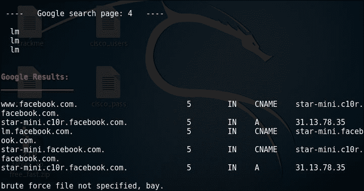

    正如我们可以看到的，`p`和`s`开关告诉 dnsenum 在谷歌的 4 个页面上搜索，以及从谷歌提取的最大刮条数。

3.  Another feature of dnsenum is to provide it a list of subdomain dictionary file to find out valid subdomains and their address. The same can be done by issuing the following command:

    ```
     dnsenum -f subdomains.txt facebook.com

    ```

    这里的子域是一个可能子域的自定义列表，我们得到如下输出：

    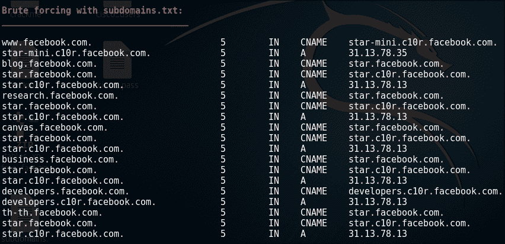

    回到 simplisting dns 枚举，我们执行了，对于上面的枚举，可以观察到输出包含很多信息，因此最好将输出保存在文件中。一个选项是使用以下命令将输出推送到文件：

    ```
    dnsenum <domain name> > dnsenum_info.txt

    ```

    输出将如以下屏幕截图所示：

    

    然而，如果我们需要为另一个工具使用输出枚举，我们必须使用 dnsenum 中提供的开关以 XML 格式获取输出，因为大多数工具都支持 XML 导入功能。使用以下命令：

    ```
    dnsenum -o dnsenum_info <domain name>

    ```

    输出将如以下屏幕截图所示：

    

4.  When we use the head command to the output file, we get the following:

    

5.  The `dnsenum` command gives you a lot of information about your target:

    *   名称服务器：名称服务器是一种处理有关域名各种服务位置的查询的服务器
    *   MX 记录：指定与给定主机的邮件服务器相对应的 IP。
    *   主机地址：指定服务器所在的 IP 地址
    *   子域：主站点的子集；例如，[mail.google.com](http://mail.google.com)和[drive.google.com](http://drive.google.com)是[google.com](http://google.com)的子域。
    *   反向查找：使用 IP 地址查询 DNS 服务器以查找域名的一种方法

6.  在[注册 Shodanhttp://www.shodan.io](http://www.shodan.io) ，然后单击“浏览”浏览您可以看到的可用功能列表。
7.  现在转到网络摄像头部分，您将看到系统上运行网络摄像头服务器的所有 IP 的列表。
8.  Let's say you manage to get the target IP or web URL; you can retrieve a lot of information just by entering the IP in the search filter, as shown in the following screenshot:

    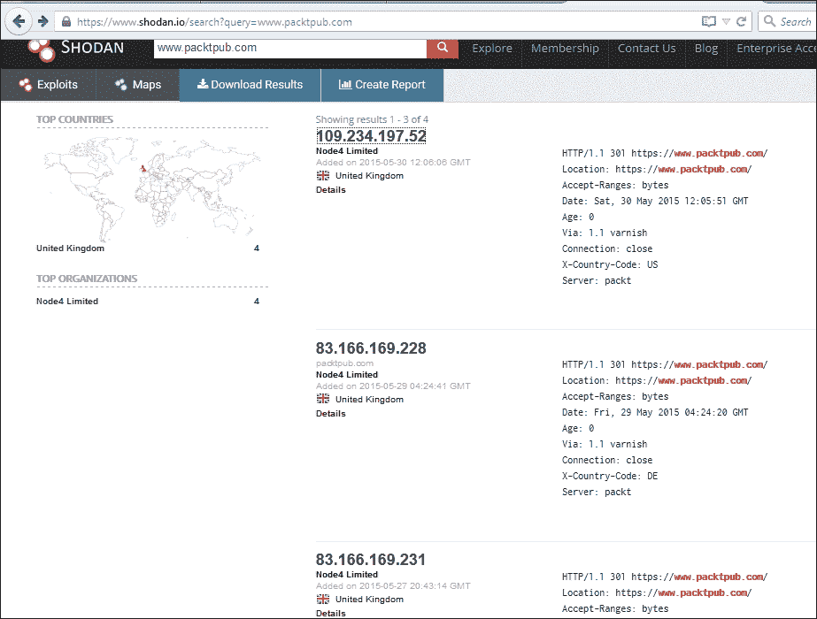

9.  Let's say you want to check for all the servers belonging to a country; in the search filter, enter `Country:IN`.

    您可以看到它如何获取巨大的输出：

    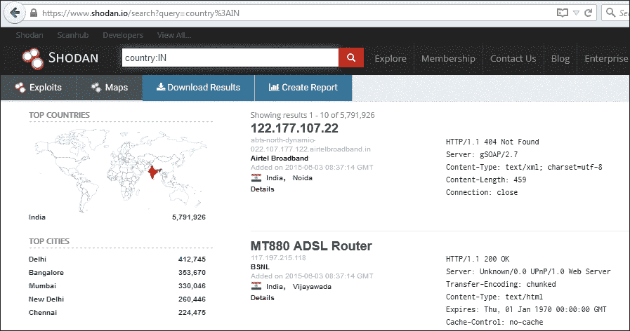

10.  This is how the output of a specific IP address would look:

    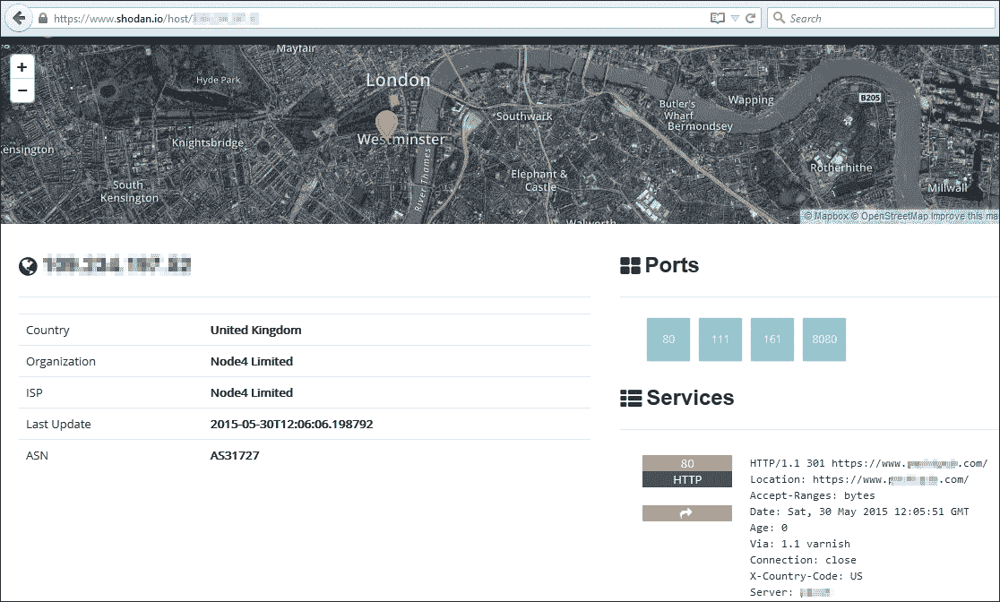

11.  In the top left-hand corner, when you click on the **View All...** tab, you will get a list of all the available features of Shodan:

    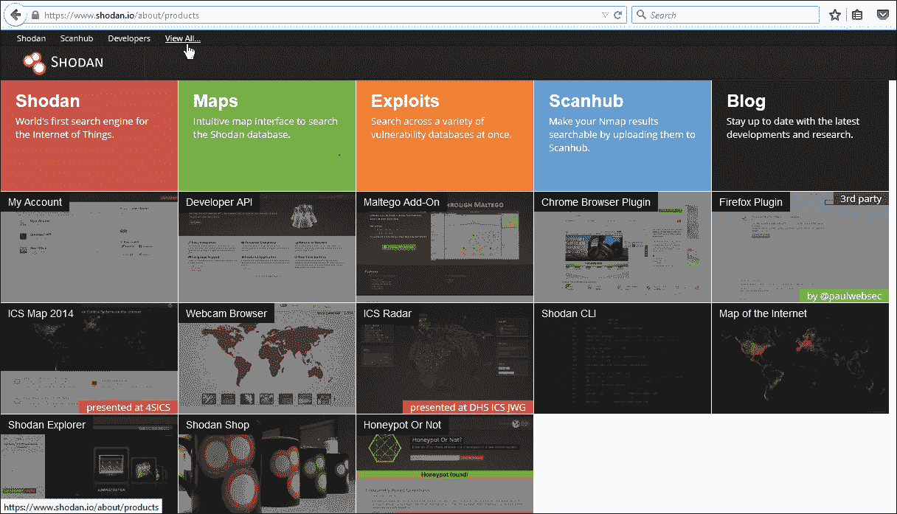

正如我们所看到的，提供的功能数量是巨大的。我们应该花时间一个接一个地探索所有的选择。

## 它是如何工作的。。。

`dnsenum <domain name>`语法查询所述域名的 DNS 服务器，然后是名称服务器和邮件服务器。它还检查是否可以进行分区转移。

使用的命令如下所示：

*   `-o`：当使用文件名指定时，将提供基于 XML 的 DNS 枚举输出
*   `-p = pages <value>`：抓取姓名时要处理的谷歌搜索页面数；默认为 20 页；必须指定`-s`开关
*   `-s = scrap <value>`：将从 google 刮取的最大子域数
*   `-f, = file <file>`：从该文件中读取子域以执行暴力

Shodan 有一个巨大的过滤器列表；上面使用的过滤器如下所示：

*   **国家**：指定搜索给定目标的国家；通常由国家代码标识

## 还有更多。。。

使用 Shodan 搜索引擎可以收集更多信息。

Shodan 搜索引擎允许用户通过不同的过滤器组合在互联网上查找特定类型的计算机或设备。这对于收集有关目标的信息来说是一个很好的资源。我们可以通过访问[了解更多关于 Shodan 过滤器的信息 http://www.shodanhq.com/help/filters](http://www.shodanhq.com/help/filters) 。