# 第五章网络应用信息采集

在本章中，我们将介绍以下配方：

*   设置用于侦察的 API 密钥
*   使用侦察机进行侦察
*   使用收割机收集信息
*   使用 DNS 协议进行信息收集
*   Web 应用程序防火墙检测
*   HTTP 和 DNS 负载平衡器检测
*   使用 DirBuster 发现隐藏文件/目录
*   使用 WhatWeb 和 p0f 检测 CMS 和插件
*   查找 SSL 密码漏洞

# 导言

攻击最重要的阶段之一是信息收集。

为了能够发动成功的攻击，我们需要收集尽可能多的目标信息。因此，我们获得的信息越多，成功攻击的概率就越高。

同样重要的是要注意，不仅要收集信息，而且要清晰地记录信息，这一点至关重要。Kali Linux 发行版有几个工具用于记录、整理和组织来自各种目标机器的信息，从而实现更好的侦察。诸如**Dradis**、**CASE FILE**和**KeepNote**等工具就是其中的一些例子。

# 设置用于侦察的 API 密钥

在本配方中，我们将了解在开始使用 recon ng 之前需要如何设置 API 密钥。侦察是最强大的信息收集工具之一；如果使用得当，它可以帮助 pentesters 从公共来源收集相当多的信息。凭借可用的最新版本，recon ng 可以灵活地将其设置为您在各种社交网站上的应用程序/客户端。

## 准备好了吗

对于此配方，您需要 Internet 连接和 web 浏览器。

## 怎么做。。。

1.  To set up recon-ng API Keys, open the terminal, launch recon-ng, and type the commands shown in the following screenshot:

    

2.  Next, type `keys list`, as shown in the following screenshot:

    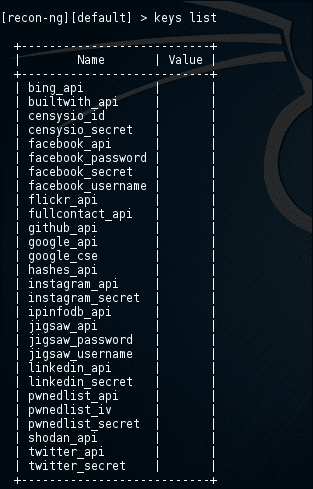

3.  Let's start by adding `twitter_api` and `twitter_secret`. Log in to Twitter, go to [https://apps.twitter.com/](https://apps.twitter.com/) , and create a new application, as shown in the following screenshot:

    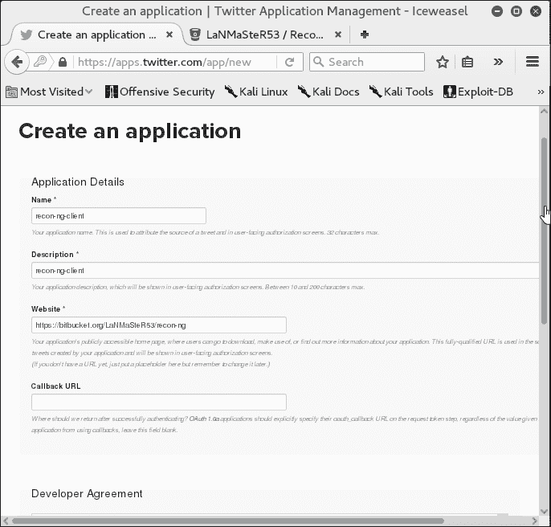

4.  Click on **Create Application**; once the application is created, navigate to the **Keys and Access Tokens** tab and copy the secret key and API key, as shown in the following screenshot:

    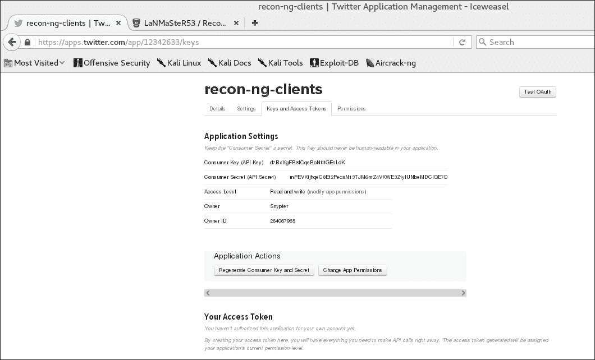

5.  复制 API 密钥，重新打开终端窗口，运行以下命令添加密钥：

    ```
    Keys add twitter_api <your-copied-api-key>

    ```

6.  现在使用以下命令在侦察中输入`twitter_secret`：

    ```
    keys add  twitter_secret <you_twitter_secret>

    ```

7.  添加钥匙后，您可以通过输入以下命令在 recon ng 工具中查看添加的钥匙：

    ```
    keys list

    ```

8.  Now, let's add the Shodan API key. Adding the Shodan API key is fairly simple; all you need to do is create an account at [https://shodan.io](https://shodan.io) and click on **My Account** in the top-right corner. You will see the **Account Overview** page, where you can see a QR code image and API key, as shown in the following screenshot:

    

9.  复制帐户中显示的 API 密钥，并使用以下命令将其添加到 recon ng 中：

    ```
    keys add shodan_api <apikey>

    ```

## 它是如何工作的。。。

在这个配方中，我们学习了如何将 API 键添加到 recon ng 工具中。在这里，为了演示这一点，我们创建了一个 Twitter 应用程序，使用了`twitter_api`和`twitter_secret`，并将它们添加到 recon ng 工具中。结果如以下屏幕截图所示：

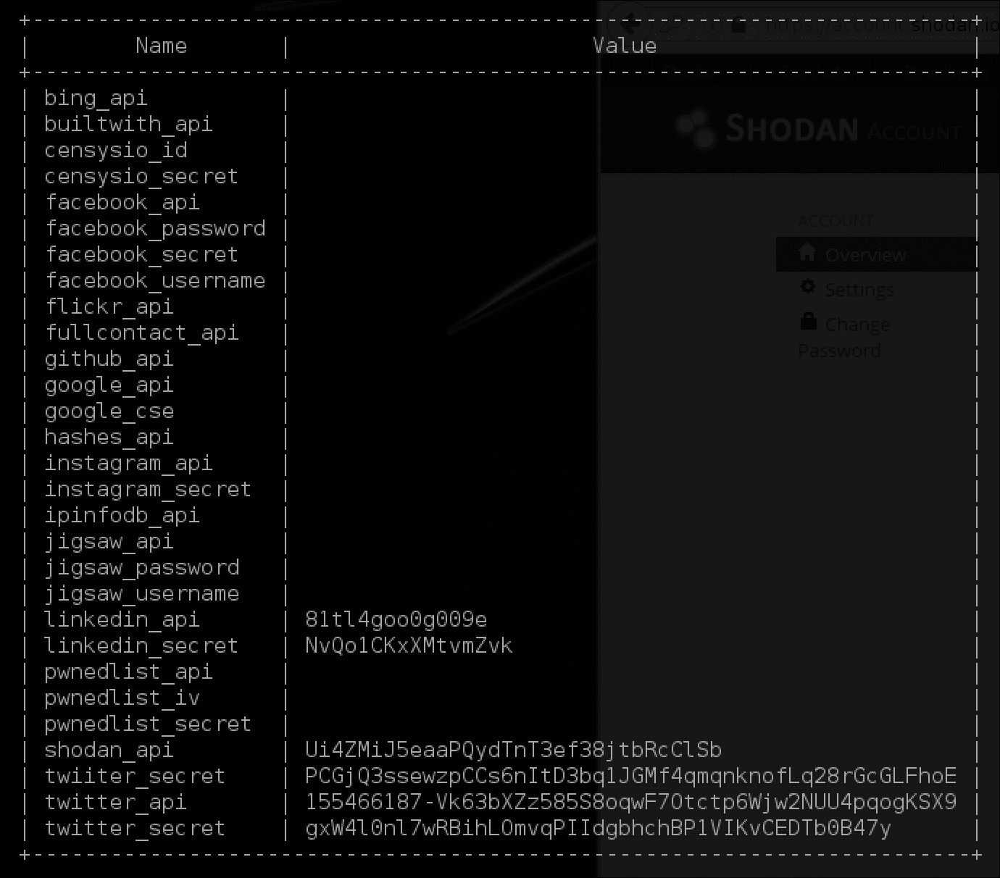

类似地，如果要从这些源收集信息，则需要在 recon ng 中包含此处的所有 API 键。

在下一个配方中，我们将学习如何使用 recon ng 进行信息收集。

# 使用侦察机进行侦察

在本食谱中，我们将学习使用侦察机进行侦察。Recon ng 是一个用 Python 编写的功能齐全的 web 侦察框架。通过独立模块、数据库交互、内置便利功能、交互式帮助和命令完成，recon ng 提供了一个强大的环境，在这个环境中，可以快速、彻底地进行基于 web 的开源侦察。

## 准备好了吗

在安装 Kali Linux 之前，您需要 Internet 连接。

## 怎么做。。。

1.  Open a terminal and start the recon-ng framework, as shown in the following screenshot:

    

2.  侦察 ng 的外观和感觉都像 Metasploit。要查看所有可用模块，请输入以下命令：

    ```
    show modules

    ```

3.  Recon-ng will list all the available modules, as shown in the following screenshot:

    

4.  让我们继续使用我们的第一个模块进行信息收集；输入以下命令：

    ```
    use recon/domains-vulnerabilities/punkspider

    ```

5.  Now, enter the commands shown in the following screenshot:

    

6.  正如您所看到的，已经发现了一些漏洞，这些漏洞可以公开使用。
7.  Let's use another module that fetches any known and reported vulnerabilities from [xssed.com](http://xssed.com/) . The XSSed project was created in early February 2007 by KF and DP. It provides information on all things related to cross-site scripting vulnerabilities and is the largest online archive of XSS vulnerable websites. It's a good repository of XSS to gather information. To begin with, enter the following command:

    ```
          Show module
          use recon/domains-vulnerabilities/xssed
          Show Options
          Set source Microsoft.com
          Show Options
          RUN

    ```

    您将在以下屏幕截图中看到输出：

    

8.  As you can see, recon-ng has aggregated publically available vulnerabilities from XSSed, as shown in the following screenshot:

    

9.  类似地，您可以继续使用不同的模块，直到和除非您获得有关目标的所需信息。

# 使用收割机收集信息

在本食谱中，我们将学习如何使用收割机。该计划的目标是收集来自不同公共来源（如搜索引擎、PGP 密钥服务器和 Shodan 计算机数据库）的电子邮件、子域、主机、员工姓名、开放端口和横幅。

## 准备好了吗

对于此配方，您需要 Internet 连接。

## 怎么做。。。

1.  Open the terminal and start theharvester, as shown in the following screenshot:

    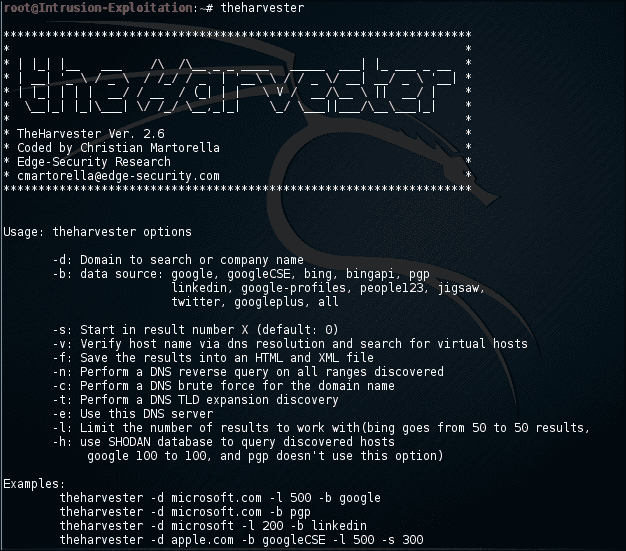

2.  Harvester 帮助还显示了示例语法。为了演示，我们将使用以下命令：

    ```
    # theharvester -d visa.com -l 500 -b all

    ```

3.  成功执行上述命令将提供以下信息：

    ```
    *******************************************************************
        *                                                                 *    * | |_| |__   ___    /\  /\__ _ _ ____   _____  ___| |_ ___ _ __  *
     * | __| '_ \ / _ \  / /_/ / _` | '__\ \ / / _ \/ __| __/ _ \ '__| *
     * | |_| | | |  __/ / __  / (_| | |   \ V /  __/\__ \ ||  __/ |    *
     *  \__|_| |_|\___| \/ /_/ \__,_|_|    \_/ \___||___/\__\___|_|    *
     *                                                                 *
        * TheHarvester Ver. 2.5                                           *
        * Coded by Christian Martorella                                   *
        * Edge-Security Research                                          *
        * cmartorella@edge-security.com                                   *
        *******************************************************************
    Full harvest..
    [-] Searching in Google..
     Searching 0 results...
     Searching 100 results...
     Searching 200 results...
    [-] Searching in PGP Key server..
    [-] Searching in Bing..
     Searching 50 results...
     Searching 100 results...
     ...
    [-] Searching in Exalead..
     Searching 50 results...
     Searching 100 results...
     ...
    [+] Emails found:
    ------------------
    phishing@visa.com
    vpp@visa.com
    v@e-visa.com
    ...
    [+] Hosts found in search engines:
    ------------------------------------
    [-] Resolving hostnames IPs... 
    23.57.249.100:usa.visa.com
    23.57.249.100:www.visa.com
    ...
    [+] Virtual hosts:
    ==================
    50.56.17.39  jobs.<strong>visa<
    50.56.17.39  jobs.visa.com
    ...

    ```

## 它是如何工作的。。。

在这个配方中，Harvester 搜索不同的来源，如搜索引擎、PGP 密钥服务器和 Shodan 计算机数据库以获取信息。对于任何想知道攻击者可以看到其组织的信息的人来说，它也很有用。您可以访问[http://tools.kali.org/information-gathering/theharvester](http://tools.kali.org/information-gathering/theharvester) 了解更多信息，如项目主页和 GitHub 代码库。

步骤 2 中，`-d`表示域，`-l`限制结果的数量，`-b`表示数据源。在我们的例子中，我们有`-b`作为一种手段来查找数据源中可用的电子邮件和公共主机。

# 使用 DNS 协议进行信息采集

在本教程中，我们将学习使用各种工具/脚本来收集有关 web 应用程序域的信息。**DNS**代表**域名系统**，如果您进行黑盒测试，可以为您提供大量信息。

## 准备好了吗

对于此配方，您需要 Internet 连接。

## 怎么做。。。

1.  我们将使用 DNSenum 进行 DNS 枚举。要启动 DNS 枚举，请打开终端并输入以下命令：

    ```
    dnsenum --enum zonetransfer.me

    ```

2.  We should get an output with information such as host, name server(s), e-mail server(s), and if we are lucky, a zone transfer:

    

3.  接下来，在 Kali Linux 中还提供了 DNSRecon 工具。DNSRecon 通常是任何其他工具的首选，因为它更可靠，结果被正确解析，并且可以轻松导入其他漏洞评估和利用工具。
4.  要使用 DNSRecon，请打开终端并输入以下命令：

    ```
          dnsrecon -d zonetransfer.me -D /usr/share/wordlists/dnsmap.txt      -t std --xml dnsrecon.xml

    ```

5.  The enumeration results output is as follows:

    

## 它是如何工作的。。。

在这个配方中，我们使用 DNSenum 枚举各种 DNS 记录，例如 NS、MX、SOA 和 PTR 记录。如果存在漏洞，DNSenum 还会尝试执行 DNS 区域传输。然而，DNSRecon 是一个更强大的 DNS 工具。它具有高度可靠、更好的结果解析以及更好地将结果集成到其他 VA/开发工具中。

在步骤 4 中，命令`-d`用于扫描域切换，大写`-D`用于对主机名执行字典暴力，`-D`的参数应该指向一个单词列表，例如`/usr/share/wordlists/dnsmap.txt`，为了指定这是一个标准扫描，我们使用了（`-t std`开关并将输出保存到一个文件（`-xml dnsrecon.xml`。

## 还有更多。。。

Kali Linux 中有多个可用的脚本，其中一些或多或少做相同的事情。根据您的评估类型和可用时间，您应该考虑使用以下 DNS 工具：

*   **DNSMap**：DNSMap 主要用于 pen 测试人员在基础设施安全评估的信息收集/枚举阶段使用。在枚举阶段，安全顾问通常会发现目标公司的 IP NetBlock、域名、电话号码等。
*   **DNSTracer**：确定给定 DNS 从何处获取信息，并沿着 DNS 服务器链返回到知道数据的服务器。
*   **凶猛**：这是专门用来定位公司网络内外可能的目标。仅列出这些目标（除非使用了`-nopattern`开关）。不会执行任何攻击（除非您故意使用`-connect`开关进行恶意攻击）。凶猛是一种侦察工具。Fear 是一个 Perl 脚本，它使用多种策略快速扫描域（通常只需几分钟，假设没有网络延迟）。

# Web 应用防火墙检测

在本食谱中，我们将学习使用名为**WAFW00F**的工具。WAFW00F 识别和指纹**web 应用防火墙**（**WAF**产品。

## 准备好了吗

对于此配方，您需要 Internet 连接。

## 怎么做。。。

1.  WAFW00F is fairly simple and easy to use. Just open the terminal and enter the following command:

    ```
    wafw00f https://www.microsoft.com

    ```

    输出将如以下屏幕截图所示：

    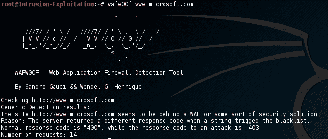

2.  类似地，您只需不断更改目标域即可找到 web 应用程序防火墙的存在。

## 它是如何工作的。。。

在此配方中，我们使用 WAFW00F 来确定是否有任何 web 应用程序防火墙正在运行。准确地检测 web 应用程序防火墙可以帮助您在渗透测试期间节省很多时间。

WAFW00F 的工作方式如下：

*   它发送一个正常的 HTTP 请求并分析响应；这确定了许多 WAF 解决方案
*   如果不成功，它将发送大量（可能是恶意的）HTTP 请求，并使用简单的逻辑推断它是哪个 WAF

*   如果这也不成功，它将分析先前返回的响应，并使用另一个简单算法猜测 WAF 或安全解决方案是否正在积极响应我们的攻击

有关更多详细信息，请查看主站点[github.com/sandrogauci/wafw00f](http://github.com/sandrogauci/wafw00f)上的源代码。

# HTTP 和 DNS 负载均衡器检测

在此配方中，我们将学习如何使用 lbd 检测 HTTP 和 DNS 负载平衡器。**Lbd**（**负载平衡检测器**）检测给定域是否使用 DNS 和/或 HTTP 负载平衡（通过服务器和日期：头和服务器应答之间的差异）。

## 准备好了吗

对于此配方，您需要 Internet 连接。

## 怎么做。。。

1.  打开终端，输入以下命令：

    ```
    lbd google.com

    ```

2.  Successful detection of HTTP and DNS load balancer results in the following output:

    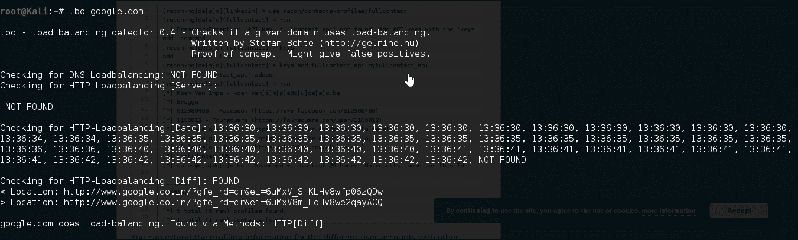

3.  Another example where DNS load balancer was detected and HTTP load balancing was detected is shown in the following screenshot:

    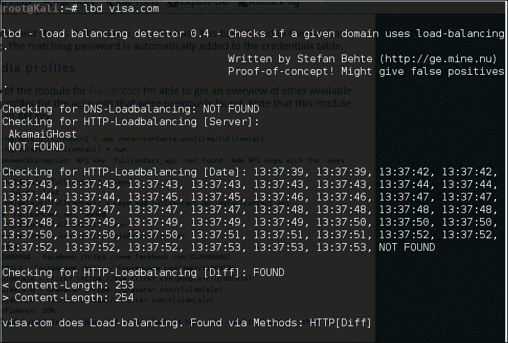

4.  One thing that needs to be understood here is that lbd is not completely reliable; it is just a proof of concept to check whether load balancing is done. One can read on the terminal that it may generate false positives, but it is a great tool to have.

    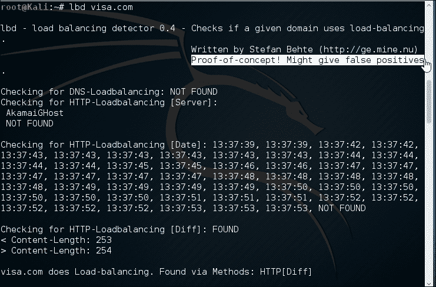

5.  Another tool that can help us understand whether a DNS-based load balancer is actually present or not is the dig tool. Let's look at it in more detail; enter the following command:

    ```
    dig A google.com

    ```

    输出将如以下屏幕截图所示：

    

6.  The `ANSWER SECTION` shows the different DNS-based load balancers available for [microsoft.com](http://microsoft.com). A tool for testing a HTTP-based load balancer is Halberd. In order to check how Halberd works, type the following in the Kali terminal:

    ```
    halberd http://www.vmware.com

    ```

    输出将如以下屏幕截图所示：

    

## 它是如何工作的。。。

在此配方中，我们使用 lbd 查找 DNS 和 HTTP 负载平衡器。在 pen 测试的早期阶段获得这些信息可以节省很多时间，因为您可以适当地选择工具和方法来查找 web 应用程序安全问题。

这个命令`lbd kali.org`非常简单。Ldb 是工具名，它接受一个参数，即需要检查的域名或 IP 名。上述工具的工作原理解释如下：

*   **Lbd**：该工具基于 DNS 和 HTTP 两个参数进行负载平衡。对于 DNS，它通常使用循环技术来确定是否存在多个负载平衡器。对于 HTTP，通过 cookies 检查负载平衡；它通过会话状态检查驻留在负载平衡器后面的实际服务器是否发送和接收不同的请求。另一种 HTTP 方法是时间戳；它试图检测时间戳中的差异，以帮助我们检测是否存在负载平衡器。在前面的示例中，我们看到负载平衡器是根据内容长度进行区分的。
*   **DIG**：表示**域信息 Groper**，是一个 Linux 命令，枚举给定域的详细信息。我们使用记录来检查 groper 上可用的 DNS 服务器，以确定是否存在基于 DNS 的负载平衡器。记录的多个条目通常表明存在 DNS 负载平衡器。
*   **戟**：这是一个基于 HTTP 的负载均衡检测器。它检查 HTTP 响应头、cookie、时间戳等方面的差异。上述参数中的任何差异都将证明存在基于 HTTP 的负载平衡器。在前面的示例中，我们检查 VMware 上是否存在基于 HTTP 的负载平衡器，如果我们看到检测到两个不同的实例，一个具有 Akamai 标头，另一个不具有相同的标头。

# 使用 DirBuster 发现隐藏文件/目录

在本食谱中，我们将学习使用 DirBuster 工具。DirBuster 工具在 web 服务器上查找隐藏的目录和文件。有时，开发人员会留下一个可访问但未链接的页面；DirBuster 旨在查找这些可能存在潜在漏洞的文件。这是一个基于 Java 的应用程序，由 OWASP 的优秀贡献者开发。

## 准备好了吗

对于此配方，您需要 Internet 连接。

## 怎么做。。。

1.  Launch DirBuster from the **Kali Linux** | **Web Application Analysis** | **Web Crawlers and Directory Brute** | **Dirbuster**, as shown in the following screenshot:

    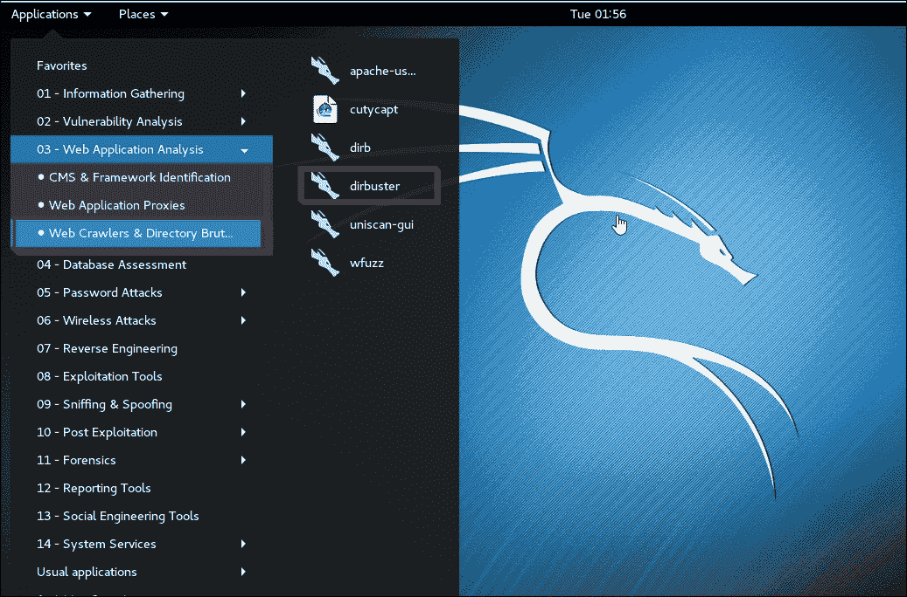

2.  Open DirBuster and enter your target URL; in our case, we will enter `http://demo.testfire.net` for the purpose of demonstration, as shown in the following screenshot:

    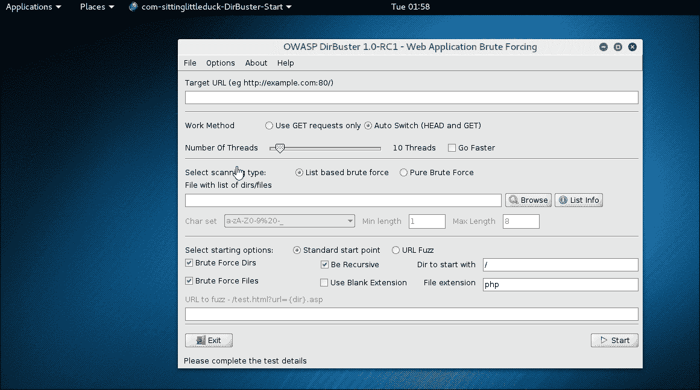

3.  Select list based brute force. Browse and navigate to `/usr/share/dirbuster/wordlists` and select `directory_list_medium.txt`, as shown in the following screenshot:

    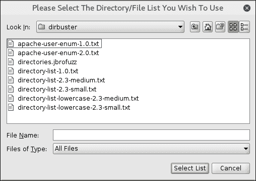

4.  Click on **Select List** and enter `php` (based on the technology used by target) in the file extension column, as shown in the following screenshot:

    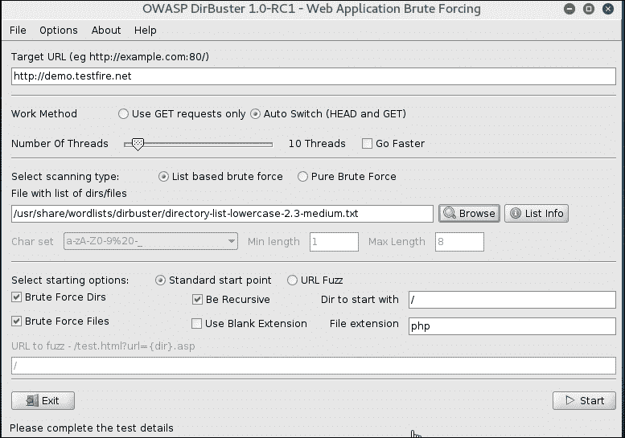

5.  Click on **Start** and DirBuster will start brute forcing directories and files, as shown in the following screenshot:

    

6.  As you can see, DirBuster has started brute forcing files and directories. You can click on the **Response** column to sort all files/folders with **200** HTTP code, as shown in the following screenshot:

    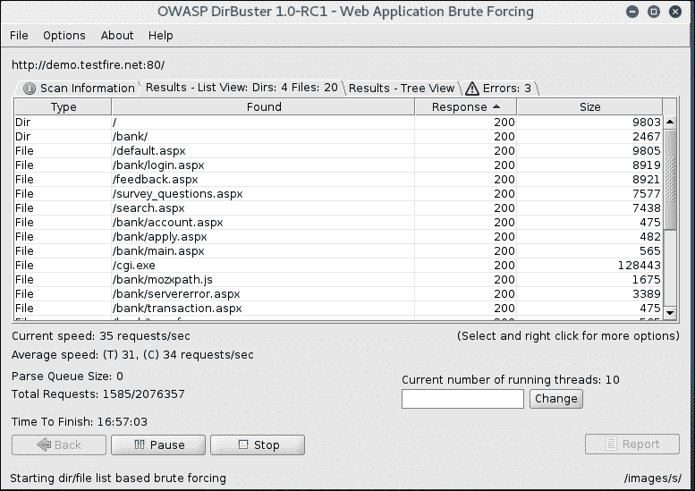

7.  Now you can spend some time going to each of these links and investigating which ones look interesting and could be used for further attacks. For example, in our case file, the `/pr/docs.xml` file seems to be the standalone file sitting on the server which isn't being mentioned in sitemap or `robots.txt` file. Right-click on that entry and select **Open In Browser**, as shown in the following screenshot:

    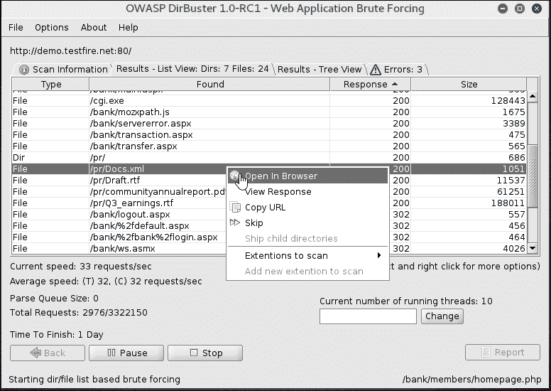

8.  The file has been opened in the browser; as you can see, this is an XML file, which wasn't supposed to be a public file and it's not linked anywhere in the application but is accessible, as shown in the following screenshot:

    

9.  同样，您可以继续调查可能泄露大量信息的其他文件和文件夹，或可能存在漏洞的某些备份文件或开发页面。

## 它是如何工作的。。。

在此配方中，我们使用 DirBuster 查找 web 服务器上可用的隐藏目录和文件。DirBuster 有一个由最常见的 web 服务器目录生成的字典文件，它从字典中读取值，并向 web 服务器发出检查其存在性的请求。如果服务器返回 200 HTTP 头代码，则表示该目录存在；如果服务器返回 404HTTP 头代码，则表示该目录不存在。然而，需要注意的是，401 和 403 的 HTTP 状态码也可能指向存在的文件或目录，但除非经过身份验证，否则不允许打开。

同时，一些架构良好的应用程序对于未知文件和文件夹也返回 200 OK，这只是为了搞乱 DirBuster 等工具。因此，了解应用程序的行为非常重要，在此基础上，您可以进一步优化扫描策略和配置。

通过这种方式，我们能够找到应用程序中未链接但在 web 服务器上可用的某些文件和文件夹。

# 使用 WhatWeb 和 p0f 检测 CMS 和插件

在这个食谱中，我们将学习使用 Kali 中提供的不同工具，我们可以使用这些工具来确定安装的插件。如果应用程序是基于 CMSE 构建的，那么它们很可能会使用某些插件。存在的主要漏洞通常存在于开发人员在这些 CMSE 中使用的第三方插件中。找出已安装的插件及其版本可以帮助您查找可用于易受攻击插件的漏洞。

## 准备好了吗

对于此配方，您需要 Internet 连接。

## 怎么做。。。

1.  Let's start with our first tool in Kali Linux which is **WhatWeb**. WhatWeb identifies websites. Its goal is to answer the question, "What is that Website?" WhatWeb recognizes web technologies, including **content management systems** (**CMS**), blogging platforms, statistic/analytics packages, JavaScript libraries, web servers, and embedded devices. WhatWeb has over 900 plugins, each to recognize something different. WhatWeb also identifies version numbers, e-mail addresses, account IDs, web framework modules, SQL errors, and more. WhatWeb is very easy to use. Open the terminal and enter the following command:

    ```
    whatweb ishangirdhar.com

    ```

    输出将如以下屏幕截图所示：

    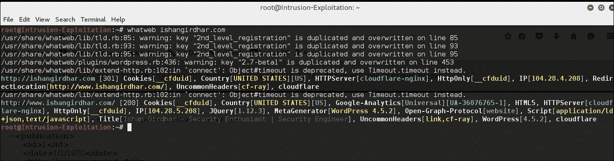

2.  正如你所看到的，它已经非常准确地发现它是一个 WordPress 安装。它还检测到 DNS 和 HTTP 负载平衡器使用的常见插件。
3.  假设您已经发现您的目标之一是使用 WordPress 或 Drupal 作为 CMS，并且您希望向前迈出一步，查找已安装的插件、其版本以及该插件的最新可用版本。
4.  Plecost 是 Kali 中另一个流行的检测 CMS 插件的工具和 WordPress 指纹工具。
5.  Open a terminal and enter the following commands:

    ```
          plecost -n 100 -s 10 -M 15 -i /usr/share/plecost      /wp_plugin_list.txt ishangirdhar.com

    ```

    此语法表示使用 100 个插件（`-n 100`），在探测（`-s 10`）之间睡眠 10 秒，但不超过 15（`-M 15`），并使用插件列表（`-i /usr/share/plecost/wp_plugin_list.txt`）扫描给定 URL（`ishangirdhar.com`。

## 它是如何工作的。。。

在这个配方中，我们学习了使用 WhatWeb，它非常准确地为服务器提取指纹，并提供 CMS、插件、web 服务器版本和所用编程语言以及 HTTP 和 DNS 负载平衡器的详细信息。在本教程的后面部分，我们还学习了使用 plecost 扫描 WordPress 安装，以对已安装的 WordPress 插件进行指纹识别。

大多数 WhatWeb 插件都是彻底的，能够识别从细微到明显的一系列线索。例如，大多数 WordPress 网站都可以通过 meta HTML 标记来识别，但是少数 WordPress 网站删除了这个识别标记，尽管这并不妨碍 WhatWeb。WordPress WhatWeb 插件有超过 15 个测试，包括检查 favicon、默认安装文件、登录页面，以及检查相关链接中的`/wp-content/`。

WordPress 指纹识别工具名为**plecost**，在运行 WordPress 的服务器上搜索和检索插件及其版本的信息。。它可以分析单个 URL，也可以根据 Google 索引的结果进行分析。此外，它还显示与每个插件关联的 CVE 代码（如果有）。Plecost 检索 WordPress 支持的网站上包含的信息，还允许搜索谷歌索引的结果。

## 还有更多。。。

除了我们刚才看到的，还有其他可用的工具。例如，对于扫描 WordPress、Drupal 和 Joomla，有以下可用工具：

*   **WpScan**：[http://wpscan.org/](http://wpscan.org/)
*   **DrupalScan**：[https://github.com/rverton/DrupalScan](https://github.com/rverton/DrupalScan)
*   **Joomscan**：[http://sourceforge.net/projects/joomscan/](http://sourceforge.net/projects/joomscan/)

# 查找 SSL 密码漏洞

在此配方中，我们将学习使用工具扫描易受攻击的 SSL 密码和 SSL 相关漏洞。

## 准备好了吗

对于此配方，您需要 Internet 连接。

## 怎么做。。。

1.  Open the terminal and launch the SSLScan tool, as shown in the following screenshot:

    

2.  要使用 SSLScan 扫描目标，请运行以下命令：

    ```
    sslscan demo.testfire.net

    ```

3.  SSLScan 将测试 SSL 证书是否支持所有密码。弱密码将显示为红色和黄色。强密码将显示为绿色：

    ```
    root@Intrusion-Exploitation:~# sslscan demo.testfire.net
    Version: -static
    OpenSSL 1.0.1m-dev xx XXX xxxx
    Testing SSL server demo.testfire.net on port 443
     TLS renegotiation:
    Secure session renegotiation supported
     TLS Compression:
    Compression disabled
     Heartbleed:
    TLS 1.0 not vulnerable to heartbleed
    TLS 1.1 not vulnerable to heartbleed
    TLS 1.2 not vulnerable to heartbleed
     Supported Server Cipher(s):
    Accepted  SSLv3    128 bits  RC4-SHA
    Accepted  SSLv3    128 bits  RC4-MD5
    Accepted  SSLv3    112 bits  DES-CBC3-SHA
    Accepted  TLSv1.0  256 bits  ECDHE-RSA-AES256-SHA
    Accepted  TLSv1.0  256 bits  AES256-SHA
    Accepted  TLSv1.0  128 bits  ECDHE-RSA-AES128-SHA
    Accepted  TLSv1.0  128 bits  AES128-SHA
    Accepted  TLSv1.0  128 bits  RC4-SHA
    Accepted  TLSv1.0  128 bits  RC4-MD5
    Accepted  TLSv1.0  112 bits  DES-CBC3-SHA
    Accepted  TLSv1.1  256 bits  ECDHE-RSA-AES256-SHA
    Accepted  TLSv1.1  256 bits  AES256-SHA
    Accepted  TLSv1.1  128 bits  ECDHE-RSA-AES128-SHA
    Accepted  TLSv1.1  128 bits  AES128-SHA
    Accepted  TLSv1.1  128 bits  RC4-SHA
    Accepted  TLSv1.1  128 bits  RC4-MD5
    Accepted  TLSv1.1  112 bits  DES-CBC3-SHA
    Accepted  TLSv1.2  256 bits  ECDHE-RSA-AES256-SHA
    Accepted  TLSv1.2  256 bits  AES256-SHA256
    Accepted  TLSv1.2  256 bits  AES256-SHA
    Accepted  TLSv1.2  128 bits  ECDHE-RSA-AES128-SHA256
    Accepted  TLSv1.2  128 bits  ECDHE-RSA-AES128-SHA
    Accepted  TLSv1.2  128 bits  AES128-SHA256
    Accepted  TLSv1.2  128 bits  AES128-SHA
    Accepted  TLSv1.2  128 bits  RC4-SHA
    Accepted  TLSv1.2  128 bits  RC4-MD5
    Accepted  TLSv1.2  112 bits  DES-CBC3-SHA
     Preferred Server Cipher(s):
    SSLv3    128 bits  RC4-SHA
    TLSv1.0  128 bits  AES128-SHA
    TLSv1.1  128 bits  AES128-SHA
    TLSv1.2  128 bits  AES128-SHA256
     SSL Certificate:
    Signature Algorithm: sha1WithRSA
    RSA Key Strength:    2048
    Subject:  demo.testfire.net
    Issuer:   demo.testfire.net
    root@Intrusion-Exploitation:~# D

    ```

4.  我们的下一个工具是 SSLyze，它是由 iSEC 合作伙伴开发的。
5.  Open the terminal and invoke SSLyze help, as shown in the following screenshot:

    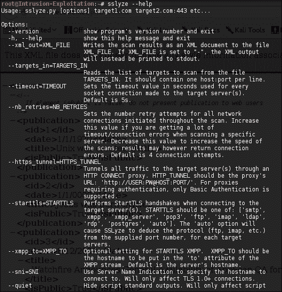

6.  要在域中测试支持的密码的综合列表，请在终端中输入以下命令：

    ```
    sslyze -regular demo.testfire.net

    ```

7.  If the server is running SSL on port `443`, the output should be like this:

    

8.  The last tool in this recipe is TLSSLed. Open a terminal and invoke the tool, as shown in the following screenshot:

    

9.  现在使用以下命令启动 TLSSLed:

    ```
    root@Intrusion-Exploitation:~# tlssled demo.testfire.net 443

    ```

10.  TLSSEled 还显示所有 cookie，这些 cookie 是否设置了 secure 和 HttpOnly 标志，这些标志在以后使用 XSS 开发应用程序时可能是有用的信息。

## 它是如何工作的。。。

在此配方中，我们使用了三种工具来扫描目标域上的 SSL 证书，以查找弱密码和 SSL 漏洞，例如 Heartbleed。每种工具都有其独特的信息表示方式。SSLScan 除了扫描目标是否存在弱密码外，还可以检查目标是否容易受到心脏出血的攻击。SSLyze 擅长于速度，它还支持 SMTP、XMPP、LDAP、POP、IMAP、RDP 和 FTP 协议上的 StartTLS 握手。TLSSLed 是为使用 SSLScan 而创建的工具，但它提供了更多信息。

SSLyze 是一个 Python 工具，它可以通过连接服务器来分析服务器的 SSL 配置。它被设计成快速和全面的，并且应该帮助组织和测试人员识别影响他们的 SSL 服务器的错误配置。SSLyze 由 iSEC 合作伙伴开发。

TLSSLed 是一个 Linux shell 脚本，其目的是评估目标 SSL/TLS（HTTPS）web 服务器实现的安全性。它基于 SSLScan（一种基于 OpenSSL 库的全面 SSL/TLS 扫描程序）和`openssl s_client`命令行工具。当前的测试包括基于密钥长度（40 或 56 位）、强密码（如 AES）的可用性、数字证书是否为 MD5 签名以及当前 SSL/TLS 重新协商能力，检查目标是否支持 SSLv2 协议、空密码和弱密码。

有时，您还应该彻底检查证书错误。您还可以根据证书错误发现属于同一组织的关联域和子域，因为有时组织会为不同的域购买 SSL 证书，但会重新使用它们，这也会导致无效的证书名称错误。