# 第七章 Web 应用开发

在本章中，我们将介绍以下配方：

*   使用打嗝进行主动/被动扫描
*   使用 sqlmap 在登录页面上查找 SQL 注入
*   使用 sqlmap 查找 URL 参数上的 SQL 注入
*   使用 commix 进行自动化操作系统命令注入
*   使用 weevely 解决文件上载漏洞
*   利用打嗝开发贝壳休克
*   使用 Metasploit 利用 Heartbleed
*   使用 FIMAP 工具进行文件包含攻击（RFI/LFI）

# 导言

Web 应用程序渗透测试是利用漏洞评估期间发现的漏洞的阶段。

渗透测试的成功取决于到目前为止发现了多少信息和漏洞。可能没有必要利用我们发现的所有漏洞。

Web 应用程序攻击不依赖于您使用的工具。这是一个在 web 应用程序中查找安全问题的练习。web 应用程序只不过是在 web 上而不是在本地操作系统上运行的软件。它是为了执行特定的任务和特定的用户。开发 web 应用程序的最佳方法是了解该应用程序是关于什么的，它完成了什么任务，并更多地关注应用程序的逻辑工作流程。Web 应用程序可以具有不同的类型和体系结构；例如，使用 PHP/Java/.NET 和 MySQL/MSSQL/Postgress 的动态网页或使用 webapi 的单页应用程序。当您了解 web 应用程序的体系结构、底层技术及其用途时，测试 web 应用程序将更加全面。

然而，在本章中，我们有几个在 Kali Linux 中可用的工具，可用于利用 web 应用程序中发现的漏洞。

### 注

不要针对非您自己的且不在您自己服务器上的公共网站运行本章中演示的工具。在本例中，我们设置了三个在 Docker 中运行的易受攻击的 web 应用程序，以演示本章中的工具/技术。*小心！*

# 使用打嗝进行主动/被动扫描

在这个配方中，我们将使用打嗝扫描仪，它是打嗝套件专业版的一部分，这是一个付费软件。它每年的价格大约是 350 美元。它加载了一些功能，其中一些功能在免费版本中不可用或不受限制。

Burp 套件不像其他 web 应用程序扫描仪那样昂贵，它提供了许多功能，这在 web 应用程序渗透测试中非常有用。不涵盖这些方法是不合适的，因为它是 web 应用程序渗透测试的渗透测试人员广泛使用的工具。说了这么多，让我们赶快投入其中吧。

## 准备好了吗

要逐步完成此步骤，您需要一个运行在 Oracle Virtualbox 或 VMware 中的 Kali Linux 和一个 Burp Suite Pro 许可证。

## 怎么做。。。

对于此配方，您需要执行以下步骤：

1.  Open Firefox and navigate to **Preferences** | **Advance** | **Network** | **Settings** | **Manual Proxy Configuration** and set the host as `127.0.0.1` and the host port as `8080` and check **Use this for all protocols**, as shown in the following screenshot:

    

2.  Open the terminal and pull the Docker container from the Docker hub, if you haven't pulled the Docker image already, using the following command:

    ```
    docker pull ishangirdhar/dvwabricks

    ```

    您应该看到以下输出：

    ```
            docker pull ishangirdhar/dvwabricks
            Using default tag: latest
            latest: Pulling from ishangirdhar/dvwabricks
    8387d9ff0016: Pull complete 
    3b52deaaf0ed: Pull complete 
    4bd501fad6de: Pull complete 
    a3ed95caeb02: Pull complete 
    790f0e8363b9: Pull complete 
    11f87572ad81: Pull complete 
    341e06373981: Pull complete 
    709079cecfb8: Pull complete 
    55bf9bbb788a: Pull complete 
    b41f3cfd3d47: Pull complete 
    70789ae370c5: Pull complete 
    43f2fd9a6779: Pull complete 
    6a0b3a1558bd: Pull complete 
    934438c9af31: Pull complete 
    1cfba20318ab: Pull complete 
    de7f3e54c21c: Pull complete 
    596da16c3b16: Pull complete 
    e94007c4319f: Pull complete 
    3c013e645156: Pull complete 
    235b6bb50743: Pull complete 
    85b524a6ea7a: Pull complete 
            Digest: sha256:        ffe0a1f90c2653ca8de89d074ff39ed634dc8010d4a96a0bba14200cdf574e3
            Status: Downloaded newer image for         ishangirdhar/dvwabricks:latest

    ```

3.  Run the downloaded Docker image using the following command:

    ```
    docker run ishangirdhar/dvwabricks

    ```

    您应该看到以下输出：

    ```
            docker run ishangirdhar/dvwabricks
            => An empty or uninitialized MySQL volume is detected in         /var/lib/mysql
            => Installing MySQL ...
            => Done!
            => Waiting for confirmation of MySQL service startup
            => Creating MySQL admin user with random password
            => Done!        ====================================================================
            You can now connect to this MySQL Server using:
            mysql -uadmin -pzYKhWYtlY0xF -h<host> -P<port>
            ======= snip===========
            supervisord started with pid 1
            2016-07-30 20:12:35,792 INFO spawned: 'mysqld' with pid 437
            2016-07-30 20:12:35,794 INFO spawned: 'apache2' with pid 438

    ```

4.  Now, to start Burp go to the **Proxy** tab, click on **turn intercept on** to turn it off, and then go to the **HTTP history** tab, as shown here:

    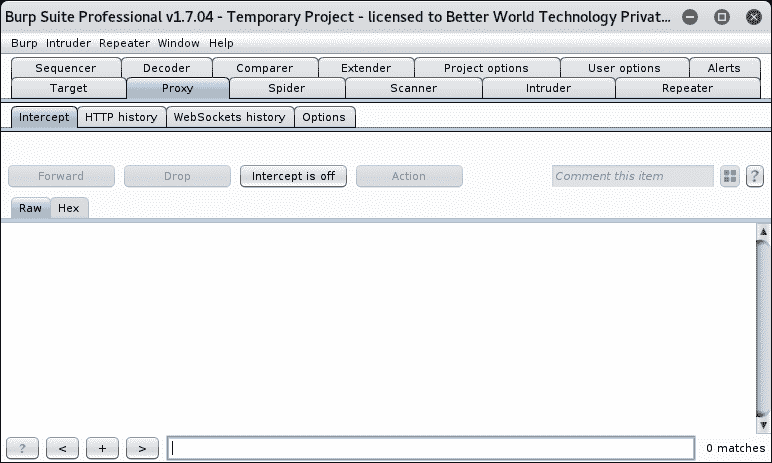

    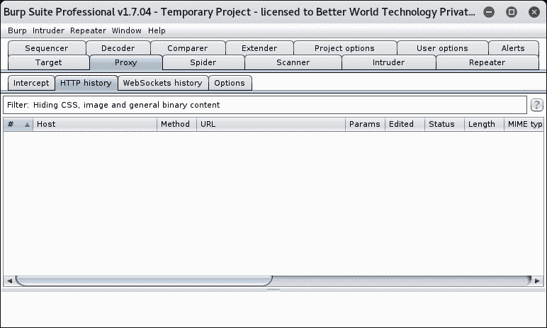

5.  现在，一切都准备好了；我们只需要找出运行易受攻击的 web 应用程序的容器的 IP 地址。运行以下命令：

    ```
    docker ps

    ```

6.  You should see the following output:

    

7.  复制容器 ID 并运行以下命令：

    ```
          docker inspect dda0a7880576 | grep -i ipaddress

    ```

8.  您应该看到以下输出：

    ```
          "SecondaryIPAddresses": null,
              "IPAddress": "172.17.0.2",
                "IPAddress": "172.17.0.2",

    ```

9.  Switch to the Firefox window and type the preceding IP address in the address bar, and you should see what is shown in the following screenshot:

    

10.  Click on **dvwa** and then click on **Create/Reset Database**, as shown in the following screenshot:

    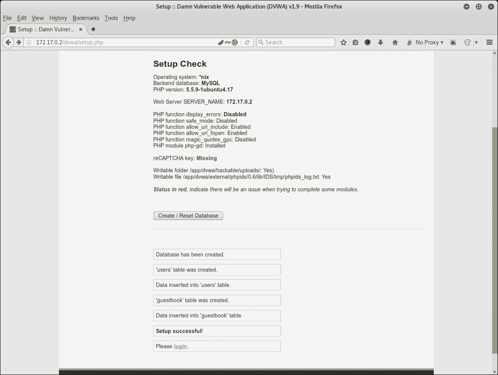

11.  You will be redirected to the login page; enter the username as `admin` and the password as `password`, which is the default user and password for `dvwa`. After login, you should see the following screenshot:

    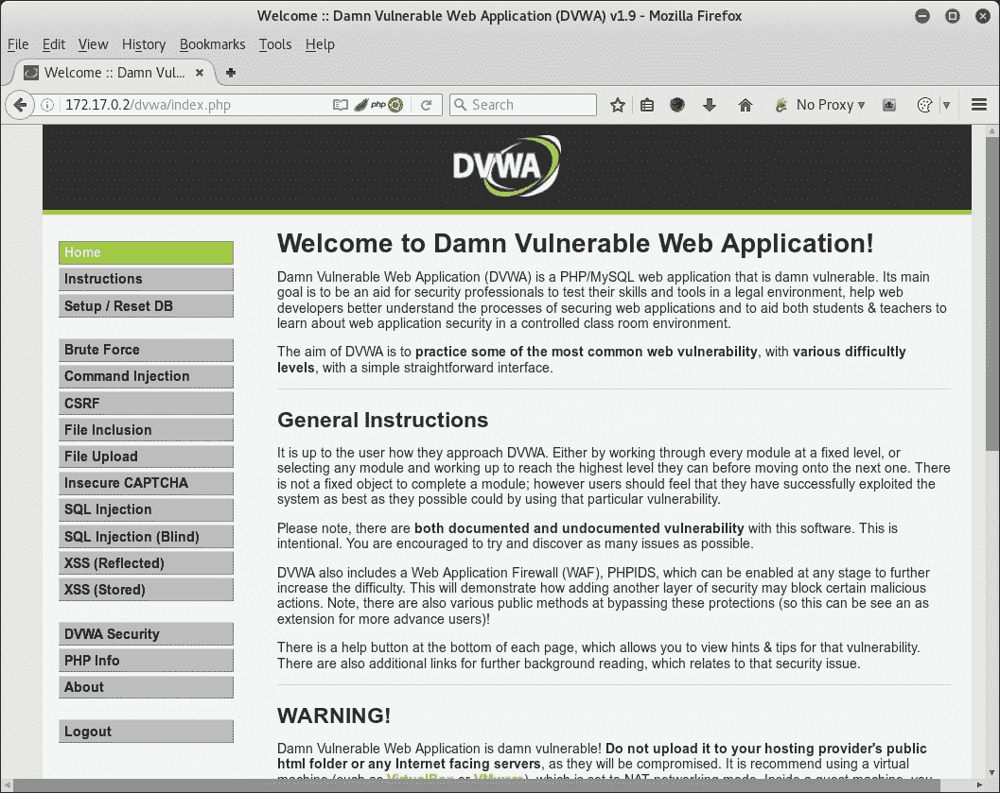

12.  遍历整个应用程序，使用不同的模块，单击所有可能的练习并尝试一次。
13.  Switch to the Burp window and you will see that Burp has captured all the requests in the **HTTP history** tab, as shown here:

    

14.  Now, go to the target tab and find your IP address, right-click on it, and click on **Add to scope**, as shown in the following screenshot:

    

15.  Then, right-click on the same IP and this time, click on **Spider this host**, as shown in the following screenshot:

    

16.  Answer any pop-up screens that may appear appropriately and note the additional application paths being discovered and listed in the **Target** tab, as shown in the following screenshot:

    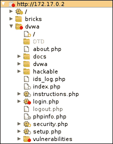

17.  Now, right-click on the same IP, and this time, click on **Actively scan this host**, as shown in the following screenshot:

    

18.  You have a few options to select and customize before the scan starts; check the last point that says **Remove items with the following extensions [20 items]**, as shown in the following screenshot:

    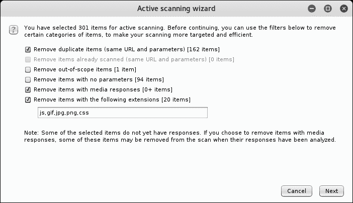

19.  Go to the scanner page; it will show progress of all the running tests on various URLs, as shown in the following screenshot:

    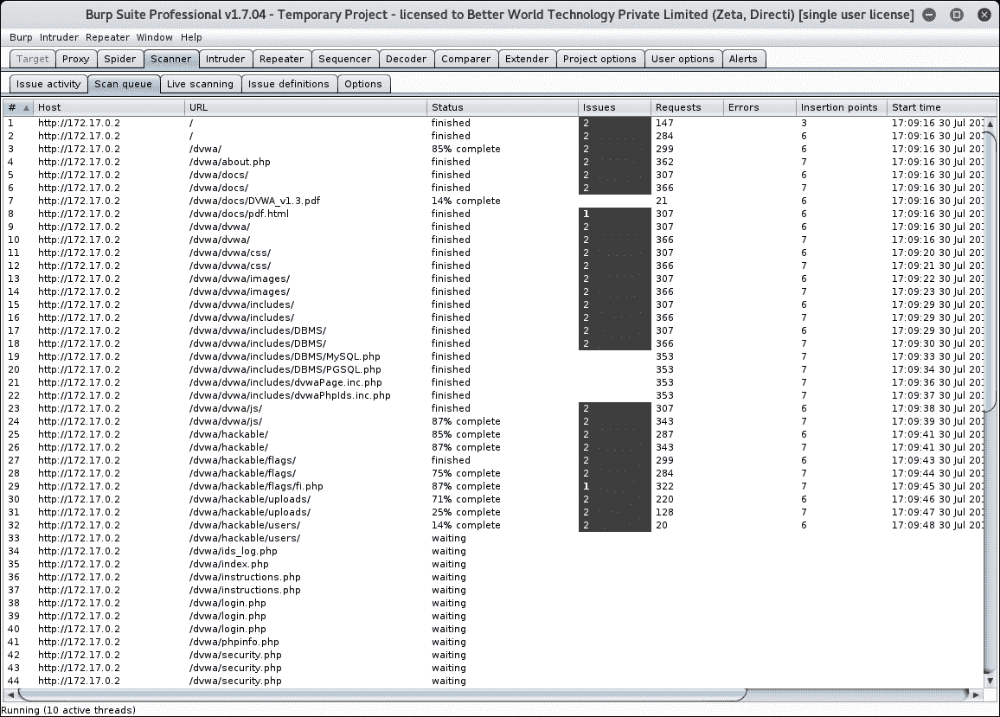

20.  Now, wait for the scans to complete and open the **Target** tab again and you will see the different vulnerabilities detected, as shown in the following screenshot:

    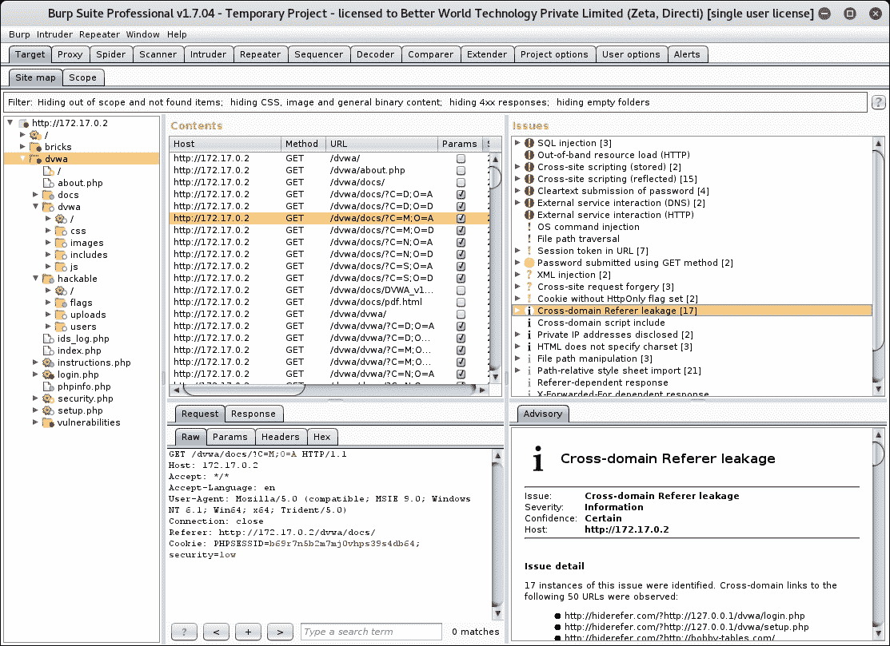

## 它是如何工作的。。。

我们已将浏览器配置为在`8080`端口的`127.0.0.1`上使用 Burp proxy，然后使用`docker pull <image-name>`命令从 Docker hub 下载易受攻击的 web 应用程序。然后，我们使用`docker run <image-name>`命令在 Docker 容器中启动 Docker 映像，并使用`docker inspect <container-id>`提取正在运行的容器的 IP 地址。

然后我们在浏览器中导航到相同的 IP 地址并遍历应用程序，然后我们看到 Burp 如何捕获我们通过浏览器发出的每个请求。我们在作用域中添加了相同的域，然后遍历整个应用程序，找出应用程序中所有可能的 URL。然后，我们终于开始在主机上进行主动扫描，发现了关键的 bug，如 SQL 注入、跨站点脚本和命令注入。在接下来的几个食谱中，我们将学习如何使用从这次扫描中获得的知识，以及如何使用特定的工具来利用这些知识。

# 在登录页面使用 sqlmap 查找 SQL 注入

在 OWASP Web 应用程序的每一次迭代中，SQL 注入总是排在 OWASP 前三位，这是有原因的。它们对 web 应用程序以及企业的危害最大。查找 SQL 注入是困难的，但是如果您碰巧找到了一个，那么在访问服务器之前手动利用它会更加困难和耗时。因此，使用自动化方法非常重要，因为在渗透测试活动期间，时间总是不多了，您总是希望尽早确认 SQL 注入的存在。

Sqlmap 是一种开源渗透测试工具，它可以自动检测和利用 SQL 注入缺陷，接管用 Python 编写并由开发人员定期维护的数据库服务器。SQLMap 已经成为一个强大的工具，在识别和检测各种参数中的 SQL 注入方面非常可靠。

在本教程中，我们将学习如何使用 sqlmap 在目标 web 应用程序的登录页面上查找 SQL 注入漏洞。

## 准备好了吗

要逐步完成此配方，您需要以下内容：

*   因特网连接
*   在 Oracle Virtualbox 中运行的 Kali Linux
*   Docker 安装了 Kali Linux
*   已下载入侵攻击 Docker 映像

## 怎么做。。。

对于此配方，您需要执行以下步骤：

1.  Open the terminal and type `sqlmap`, and sqlmap will show its correct usage syntax, as shown in the following screenshot:

    

2.  We will use `http://172.17.0.2/bricks/login-1/index.php` as our target. This is an OWASP bricks installation:

    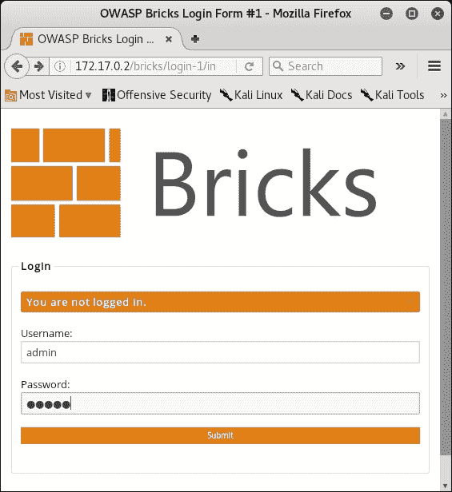

3.  Go to **Firefox Preference** | **Advanced** | **Network** | **Settings**, as shown in the following screenshot:

    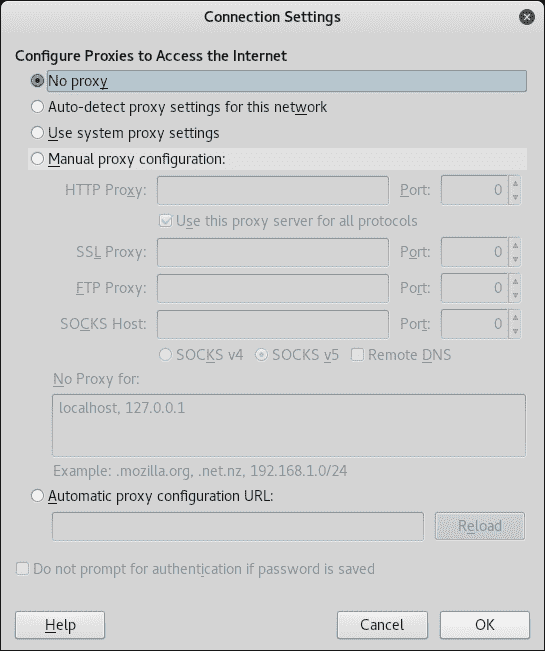

4.  Select **Manual proxy configuration** and enter **HTTP proxy** as `127.0.0.1` and **Proxy** as `8080` and check **Use this proxy for all protocols**, as shown in the following screenshot:

    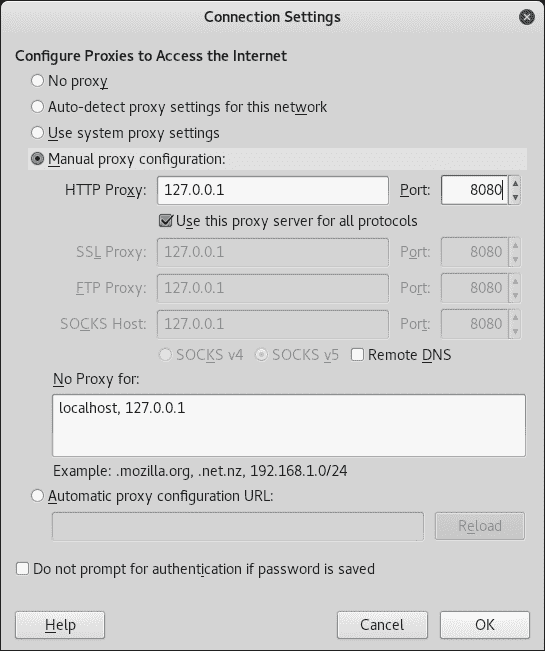

5.  Click on **OK** and come back to the **Bricks Login** page; start Burp Suite if you haven't started it already. You can navigate to **Application** | **Web Application Analysis** | **Burpsuite**, as shown in the following screenshot:

    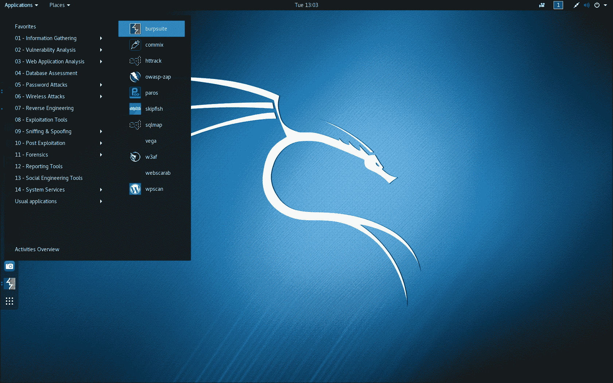

6.  Burp's window will open, and you can select a temporary project and click on **Start Burp**; your burp window will look like what is shown in the following screenshot:

    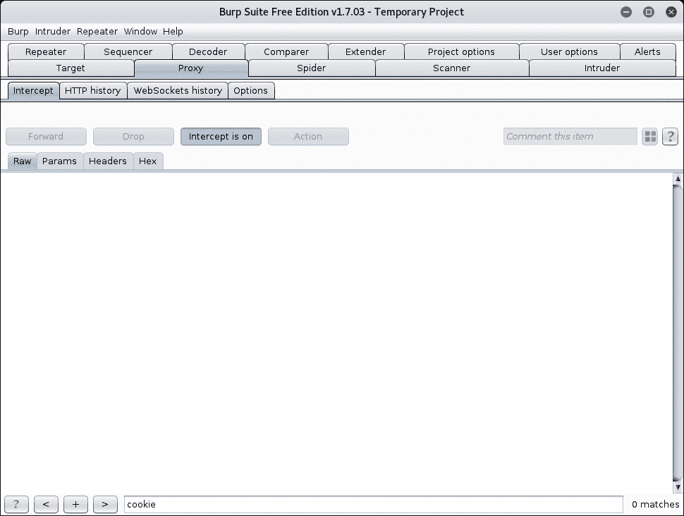

7.  Now open the bricks login page and enter the username and password with any string and click on **Submit**. It doesn't matter what you enter in the username and password fields because we will be intercepting the request at Burp; once you click on the **Submit** button on the login page, you will see the Burp window, as shown here:

    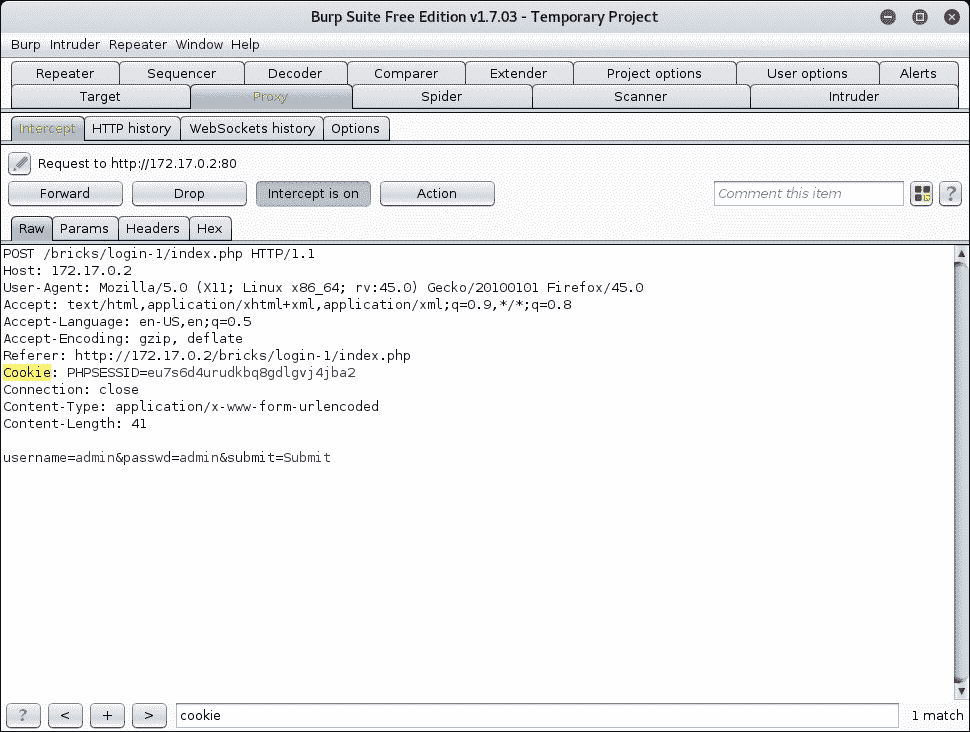

8.  Right-click anywhere on the Burp window and click on the **Copy to File** menu, as shown in the following screenshot:

    

9.  在终端上运行以下命令：

    ```
    sqlmap -r "./Desktop/bricks-login-request.txt" --is-dba --tables       -users

    ```

10.  The `sqlmap` command will run its heuristic checks and show the database identified as MySQL and ask for your confirmation if you want to skip looking for other possible databases; type *Y* and press *Enter*, as it is mostly accurate and it is better to generate as few requests as possible on the server. Take a look at the following screenshot:

    

11.  Once you press *Enter*, it will ask you whether you want to keep level and risk to value. What this means is that while looking for SQL Injection, it performs as few requests as possible and should be the least risky SQL statement as possible. It is always better to start with value `1`, and if that doesn't work, then increase the level and risk to 5; for now, we will type *Y* and press *Enter*, as shown in the following screenshot:

    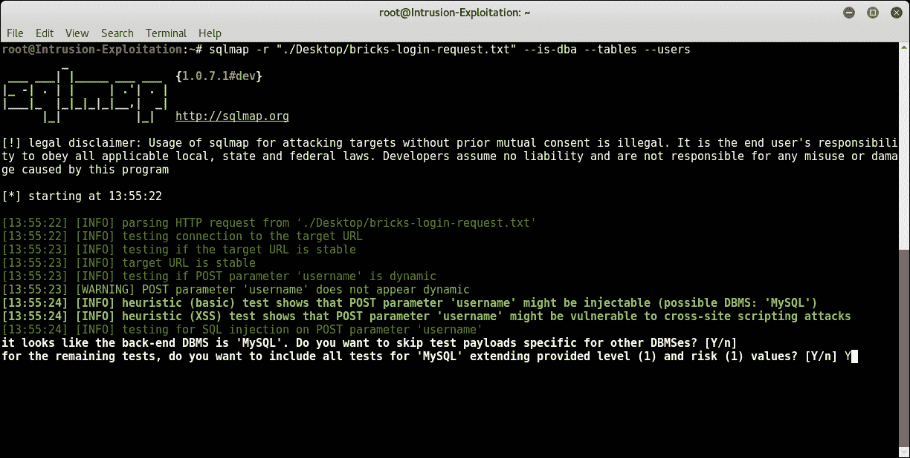

12.  After this, sqlmap will prompt you that it is not possible to inject with NULL values and ask you whether you wish to use a random integer value for the `- -union-char` option. The statement is clear enough to understand; type *Y* and press *Enter*, as shown in the following screenshot:

    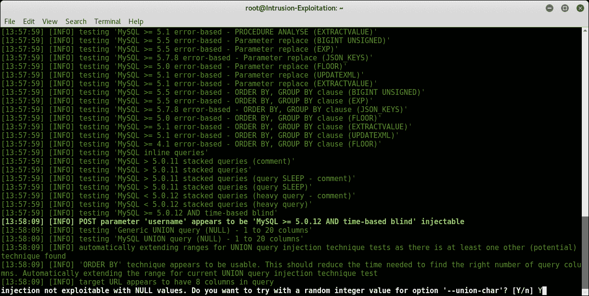

13.  Sqlmap has identified username to be injectable and vulnerable; now sqlmap is prompting whether you would like to keep looking for other vulnerable parameters or whether you want to start with exploiting the one parameter that is found to be vulnerable. It is usually a good option to look for all vulnerable parameters, as you would be able to report to your development about all the parameters on which input validation needs to be done; for now, we will type *Y* and press *Enter*, as shown in the following screenshot:

    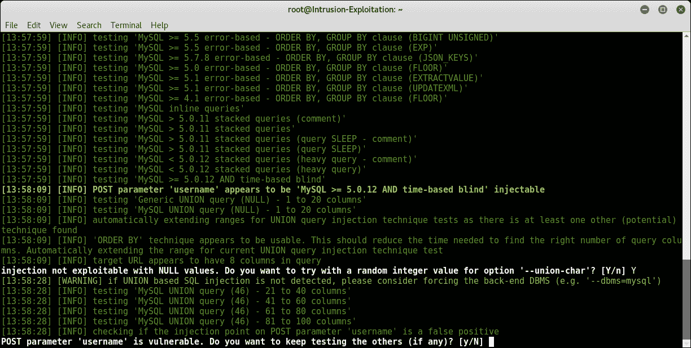

14.  It will keep prompting until all the parameters have been tested; once done, sqlmap will prompt you to choose which parameters should be exploited, as shown in the following screenshot:

    

15.  You can choose any parameters of your choice; for demo, we will choose the username parameter and type `**0**` and press *Enter* and immediately sqlmap will start retrieving the information you have mentioned in the switches, as shown in the following screenshot:

    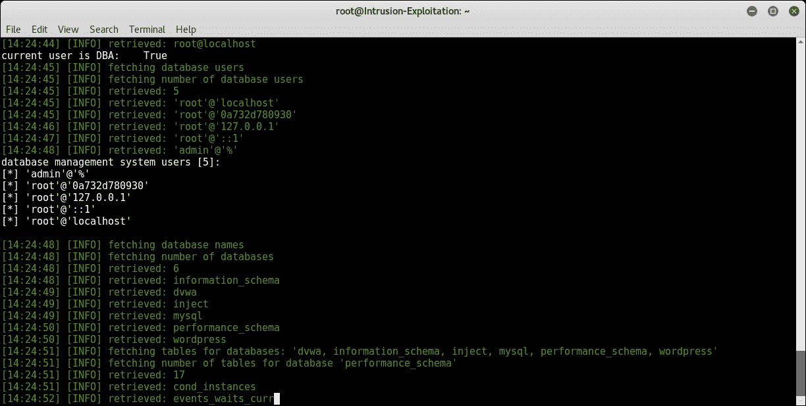

    正如您可以将 sqlmap 作为转储数据库表名称一样，如以下屏幕截图所示：

    

## 它是如何工作的。。。

在这个方法中，我们学习了如何使用 sqlmap 来检查登录页面上的参数是否容易受到 SQL 注入的攻击。在此命令中，我们使用了以下开关：

*   `--url`：此开关将目标 URL 提供给 sqlmap。这是运行 sqlmap 所必需的开关。
*   `--data`：这是一个特定的开关，您需要使用它来发送 post 数据。在我们的示例中，我们将发送`wp-username`、`wp-pass`和`wp-submit`及其各自的值作为 post 数据。
*   `-r`：此开关可代替`--url`开关使用。`-r`开关加载带有 post 数据的请求文件。`/path/to/file`。您可以通过右键单击代理并将其保存到文件选项，使用 Burp 将`POST`请求捕获到登录页面，从而创建请求文件。
*   `--dbs`：如果发现任何参数易受攻击且可注入，此开关将获取所有数据库名称。
*   `--tables`：如果发现任何参数易受攻击且可注入，此开关将获取数据库中的所有表名。
*   `--is-dba`：此开关检查使用数据库用户的应用程序是否具有 DBA 权限。
*   `QLMAP`：用于在 URL 参数中查找 SQL 注入

# 利用 SQL 注入对 URL 参数进行 SQL 注入

SQL 注入可以在应用程序中的任何位置找到，例如，在登录页面、`GET`、`POST`参数、身份验证之后，有时甚至在 cookie 本身上。使用 sqlmap 与我们在前面的配方中使用它的方式没有太大的不同，但是这个配方的目的是帮助您理解 sqlmap 如何也可以用于在只有经过身份验证后才能访问的页面上利用 SQL 注入。

在此配方中，我们将了解如何使用 sqlmap 在经过身份验证的页面上利用 SQL 注入。使用`-r`开关允许 sqlmap 在检查 URL 时在请求中使用 cookie，无论它们是否可访问。由于 sqlmap 可以处理来自已保存请求的 cookie，因此它允许 sqlmap 能够成功地识别和利用 SQL 注入。

## 准备好了吗

要完成这一步骤，您需要在 Oracle Virtualbox 中运行 Kali Linux 并连接到 Internet。不需要其他先决条件。

## 怎么做。。。

对于此配方，您需要执行以下步骤：

1.  We will use **Damn Vulnerable Web Application** (**DVWA**) hosted at `http://172.17.0.2`. Log in using the default DVWA credentials and click on **SQL Injection** present at the left-hand side menu. Enter `1` as user ID in the input box, and it will show you the details of the user with error messages on the top, as shown in the following screenshot:

    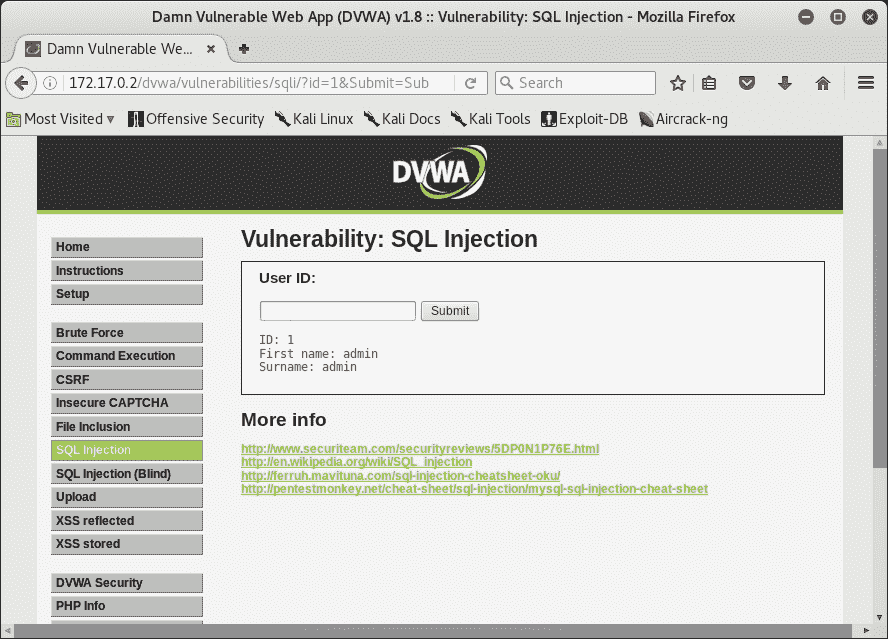

2.  前面的错误消息清楚地指出了潜在的 SQL 注入，我们将使用 sqlmap 使用以下命令利用此 SQL 注入：

    ```
          sqlmap --url="http://172.17.0.2/dvwa/vulnerabilities/sqli/?id=1&       Submit=Submit#" --cookie=" security=low;         PHPSESSID=eu7s6d4urudkbq8gdlgvj4jba2"

    ```

3.  On running the preceding command, sqlmap immediately determines that the backend database is MySQL and asks for your confirmation to skip any additional checks if possible. Press *Y* and continue as shown in the following screenshot:

    

4.  Sqlmap continues and verifies the vulnerable parameter and asks for user input to continue to check for other parameters, as shown in the following screenshot:

    

5.  On pressing *N*, it shows you the summary of the vulnerable parameters along with the injection type and query used, as shown in the following screenshot:

    

6.  在发现 ID 参数易受 SQL 注入攻击后，我们修改了原始命令以添加额外的开关，如以下屏幕截图所示：

    ```
          sqlmap --url="http://172.17.0.2/dvwa/vulnerabilities/sqli/?id=1&      Submit=Submit#" --cookie=" security=low;       PHPSESSID=k5c4em2sqm6j4btlm0gbs25v26" --current-db --current-user       --hostname

    ```

7.  On running the preceding command, you can see the following output:

    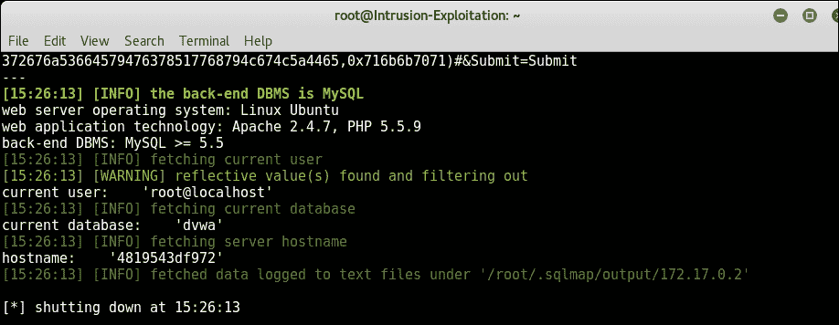

8.  类似地，您可以使用 sqlmap 中的其他开关继续并完全接管 web 服务器。

## 它是如何工作的。。。

在这个配方中，我们使用 sqlmap 来利用身份验证页面上的 ID 参数，并提取有关数据库、用户、当前用户、当前数据库和主机名等的信息。在上述步骤中，我们使用了以下新开关：

*   `--cookie`：此开关使用 HTTP cookie 头访问经过身份验证的资源
*   `--dbs`：此开关枚举 DBMS 数据库
*   `--users`：此开关枚举 DBMS 用户
*   `--current-user`：此开关检索 DBMS 当前用户
*   `--current-db`：此开关检索 DBMS 当前数据库
*   `--hostname`：此开关检索 DBMS 服务器主机名

使用 commix 进行自动化操作系统命令注入

在本章的第一个配方中，我们使用 Burp Scanner 查找 web 应用程序中的各种漏洞。如您所见，Burp 扫描仪检测到了 OS 命令注入漏洞。

现在，在本教程中，我们将学习如何使用 commix 工具，它是[comm]和[i]injection e[x]ploiter 的缩写，顾名思义，它是一种用于命令注入和利用的自动化工具。我们将使用 commix 来利用 burp 扫描仪识别的入口点。

## 准备好了吗

要逐步完成此配方，您需要以下内容：

*   在 Oracle Virtualbox/VMware 上运行的 Kali Linux
*   打嗝扫描仪的输出如本章第一个配方所示
*   Docker 上运行的易受攻击的 web 应用程序
*   因特网连接

## 怎么做。。。

对于此配方，您需要执行以下步骤：

1.  Open the Burp scanner **Target** window, as demonstrated in the previous recipe:

    

2.  Click on the command injection vulnerability identified by the Burp Scanner, go to the **Request** tab, and observe how the modified request was made and the response received by the Burp. We will use the same entry point parameter where Burp has identified the command injection and we use it in commix, as shown in the following screenshot:

    

3.  Now open the terminal and type `commix`; it will display the default help in the window, as shown in the following screenshot:

    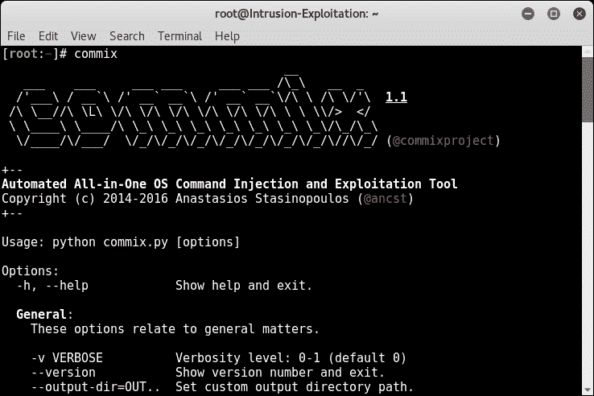

4.  我们将使用以下命令启动混合器：

    ```
          commix --url "http://172.17.0.2/dvwa/vulnerabilities/exec/"       --cookie='security=low; PHPSESSID=b69r7n5b2m7mj0vhps39s4db64'       --data='ip=INJECT_HERE&Submit=Submit' -all

    ```

5.  The commix will detect whether the URL is reachable and will fetch all the possible information possible and then ask you whether you want to open a pseudo terminal shell, as shown in the following screenshot:

    

6.  If you enter *Y*, you will see the shell prompt, as shown here:

    

    如果仔细查看伪随机 shell 之前的输出，您将注意到混合并收集主机名、当前用户、当前用户权限以及操作系统和密码文件，如下所示：

    

7.  You can type various commands in the pseudo terminal shell and get the output on screen; for example, type `pwd` for a present working directory and `id` for current user privileges, as shown in the following screenshot:

    

## 它是如何工作的。。。

在这个配方中，我们看到了如何使用 commix 进行命令注入和开发。由于我们已经确定了一个可能的参数，其中命令注入是可能的，因此我们在这里使用了**INJECT_**，以帮助 Comix 识别易受攻击的参数，以执行查询并显示输出。此外，我们在工具中使用了以下开关，其用途和说明如下：

*   `--url`：此开关用于提供目标 URL
*   `--cookie`：此开关用于在目标 URL 在认证之后时向 Comix 提供 cookies；commix 可以使用 cookies 来访问目标 URL
*   `--data`：此开关用于提供任何需要发送到目标 URL 才能发出有效请求的`POST`主体参数
*   `--all`：此开关用于从目标 OS X 命令注入中枚举尽可能多的信息，使用它我们可以进一步决定使用`netcat`在服务器上获得稳定外壳的方式

# 使用 Weevely 进行文件上传漏洞

在此配方中，我们将使用 Weevely 来利用文件上传漏洞。Weevely 是一个隐藏的 PHP web shell，它模拟类似 telnet 的连接。当您需要创建 web 外壳来利用文件上载漏洞时，它非常方便。它工作得非常好，您不需要寻找任何工具或外壳。让我们开始吧。

## 准备好了吗

要完成这一步骤，您需要在 Oracle Virtualbox 中运行 Kali Linux 并连接到 Internet。不需要其他先决条件。

## 怎么做。。。

对于此配方，您需要执行以下步骤：

1.  Open the target application file upload page, as shown in the following screenshot:

    

2.  Open the terminal and type `Weevely`; it will display the sample syntax for use, as shown in the following screenshot:

    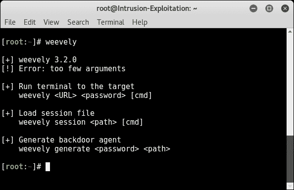

3.  现在我们需要在 PHP 中生成一个 shell，我们可以使用以下命令来实现：

    ```
          Weevely generate <password-to-connect> /root/weevely.php      Weevely generate uytutu765iuhkj /root/weevely.php

    ```

4.  键入`ls`，您将看到一个名为`weevely.php`的新文件已经创建，因为我们的应用程序只允许上传图像，所以我们需要将该文件重命名为`.jpg`扩展名，如下命令所示：

    ```
    mv weevely.php agent.php

    ```

5.  Open the target browser with the target application file upload module, click on **Browse**, and select this file from the `/root` directory and upload it, as shown the following screenshot:

    

6.  成功消息显示文件上载的路径。复制路径并打开终端并键入`weevely <Complete-path-to-uploaded-file> <password>`，如以下命令所示：

    ```
          Weevely http://172.17.0.2/dvwa/hackable/uploads/weevely.php.jpg       yoursecretpassword

    ```

7.  Weevely will try to connect to the uploaded file and will present to you the limited (or restricted) shell it has obtained, using which you can run system commands and perhaps use it to escalate your privileges, as shown in the following screenshot:

    

8.  Another good feature that Weevely provides is that you can use system commands directly from a single command. In order to understand this type `weevely help`, as shown in the following screenshot:

    

    ```
          Weevely http://dvwa.hackhunt.com/dvwa/hackable/uploads      /weevely.php.jpg yoursecretpass  :audit.etcpasswd

    ```

9.  On running this command, Weevely connects to the backdoor and fetches the `/etc./passwd` file, as shown in the following screenshot:

    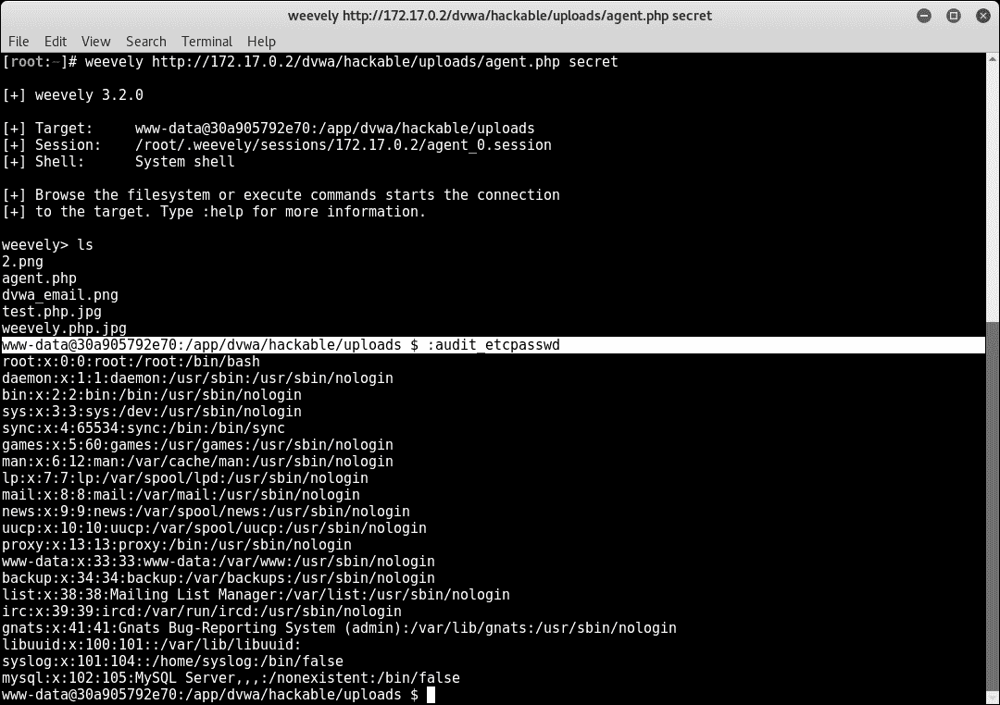

10.  类似地，您可以使用 Weevely 检查其余可用选项，并从目标服务器提取信息。您还可以通过脚本使用 Weevely 实现自动化。

## 它是如何工作的。。。

在这个配方中，我们学习了如何使用 Weevely 来利用文件上载漏洞，以及如何使用它来获得稳定的 shell 来升级根权限，或者直接使用 Weevely 在目标服务器上运行系统命令。

# 利用打嗝进行电击

在此配方中，我们将使用 Burp 来利用 Shellshock（CVE-2014-6271）漏洞。如果您没有听说过 Shellshock 漏洞（也称为 Bash bug），那么它就是 GNU Bash 远程代码执行漏洞，攻击者可以通过该漏洞访问目标机器。由于 Bash 被广泛使用，该漏洞具有巨大的攻击面，鉴于该漏洞的严重性和易利用性，它是 2014 年发现的影响最大的安全问题之一；因此，我们决定演示如何使用 Burp 来利用它。

## 准备好了吗

要逐步完成此配方，您需要以下内容：

*   在 Oracle Virtualbox/VMware 中运行的 Kali Linux
*   Docker 已在 Kali 中安装并运行
*   因特网连接

## 怎么做。。。

对于此配方，您需要执行以下步骤：

1.  We will start this recipe by searching and downloading a container from Docker hub, which is vulnerable to Shellshock, using the following command:

    ```
    docker search shellshock

    ```

    您将看到以下输出：

    

2.  我们将使用第一个 Docker 映像进行演示，并使用以下命令拉取 Docker 映像：

    ```
          docker pull hmlio/vaas-cve-2014-6271

    ```

3.  现在，我们将使用以下命令将 Docker 映像作为容器运行：

    ```
    docker run hmlio/vaas-cve-2014-6271

    ```

4.  Since it is a second container running in Kali, it has the `172.17.0.3` IP address; you can use `docker inspect <container-name>` to find out the IP address of your container. We will now open the browser and visit `72.17.0.3`, and you will see the following web page:

    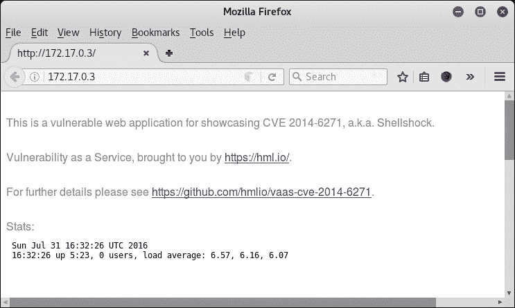

5.  Since we have already configured our browser to use Burp proxy, navigate to **Proxy** | **HTTP history** tab, as shown here:

    

6.  Now right-click on it and click on **Send it to Repeater**, as shown in the following screenshot:

    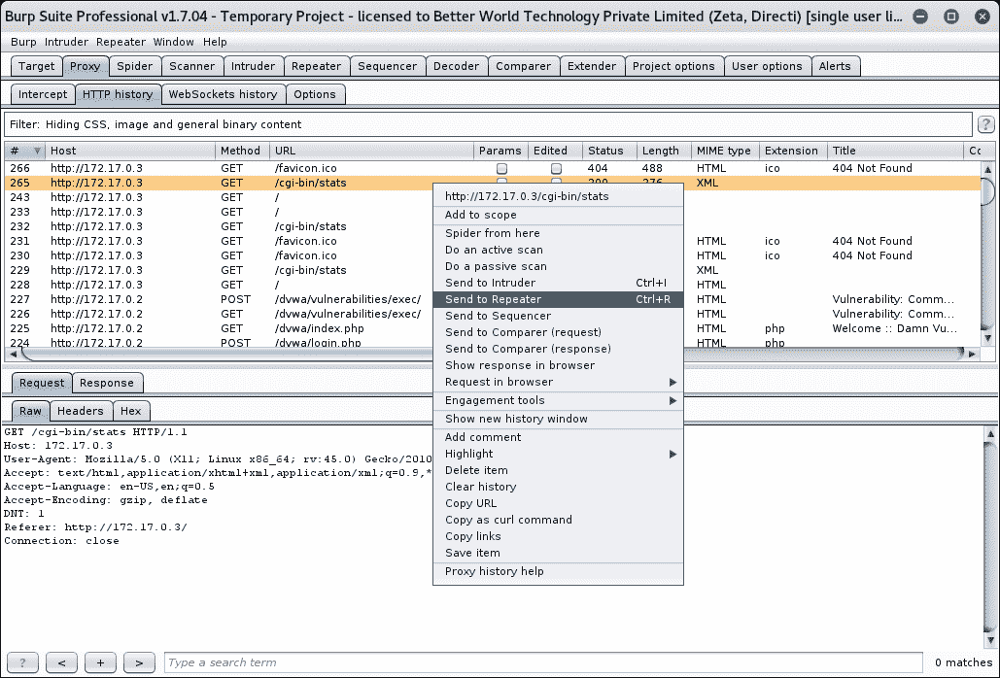

7.  Go to the repeater window and change the user agent to the following:

    ```
          User-Agent: () { :; }; echo; echo; /bin/bash -c 'cat       /etc/passwd;'

    ```

    请看以下屏幕截图：

    

8.  Now click on **Go** and you will see the `passwd` file contents in the **Response** window, as shown in the following screenshot:

    

    这就是使用 Burp 利用 shellshock 的容易程度。

## 它是如何工作的。。。

在此配方中，我们从 Docker hub 搜索并下载了 Docker 容器图像，该图像易受 Shellshock 攻击。然后启动容器并将浏览器指向容器 IP 地址。我们使用 Burp 代理选择`/cgi-bin/`请求并将其发送到中继器。在 repeater 窗口中，我们将`user agent`更改为 Shellshock 漏洞利用字符串来读取`/etc/passwd`文件，并得到`passwd`文件内容作为响应。

# 使用 Metasploit 开发心脏出血

在此配方中，我们将使用 Kali Linux 中提供的 Metasploit 来攻击 Heartbleed 漏洞。不强制使用 Metasploit 来利用 Heartbleed。可以使用简单的 Python 脚本或简单的 Burp 插件（免费版本）来确定服务器/服务是否容易受到 Heartbleed 的攻击。然而，我们想引入 Metasploit 漏洞和一个辅助模块，这有时会非常有用。

## 准备好了吗

要逐步完成此配方，您需要以下内容：

*   在 Oracle Virtualbox/VMware 上运行的 Kali Linux
*   在 Kali Linux 上运行的 Docker
*   易受攻击的 Web 应用程序 Docker 容器
*   因特网连接

## 怎么做。。。

对于此配方，您需要执行以下步骤：

1.  We will start this recipe by searching and downloading a container from the Docker hub that is vulnerable to Shellshock using the following command:

    ```
          docker search heartbleed

    ```

    您将看到以下输出：

    

2.  我们将使用第一个 Docker 映像进行演示，并使用以下命令拉取 Docker 映像：

    ```
          docker pull andrewmichaelsmith/docker-heartbleed

    ```

3.  现在，我们将使用以下命令将 Docker 映像作为容器运行：

    ```
          docker run andrewmichaelsmith/docker-heartbleed

    ```

4.  Since it is a third container running in our Kali, it has the `172.17.0.4` IP address. You can use `docker inspect <container-name>` to find out the IP address of your container. We will now open the browser and visit `72.17.0.4`. and you will see the following web page:

    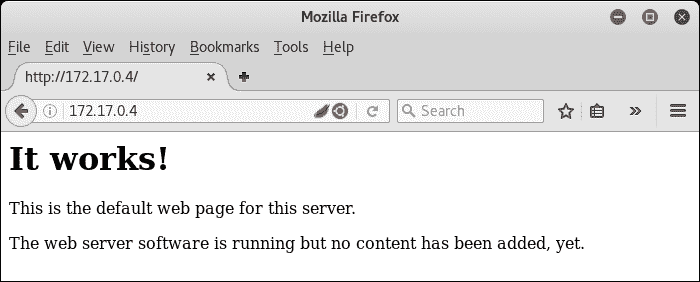

5.  Set up your bee-box image using VMware/Virtualbox and open `msfconsole` in your Kali Linux, as shown here:

    

6.  Type `search heartbleed` to locate Heartbleed-related auxiliary and exploits available in Metasploit, as shown here:

    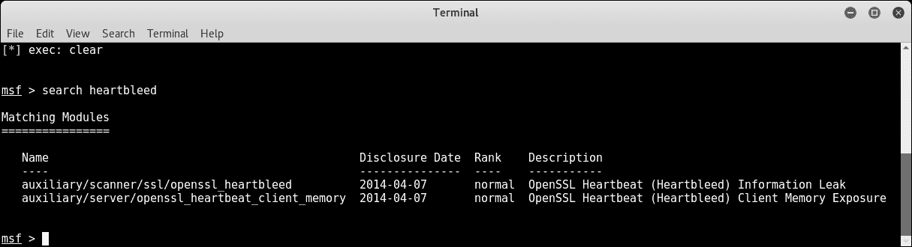

7.  正如我们所见，有一个辅助模块可用于心脏出血。我们将继续使用以下命令将其用于我们的开发：

    ```
          msf > use auxiliary/scanner/ssl/openssl_heartbleed      msf auxiliary(openssl_heartbleed) >

    ```

8.  Type `show options` to see the available options, as shown here:

    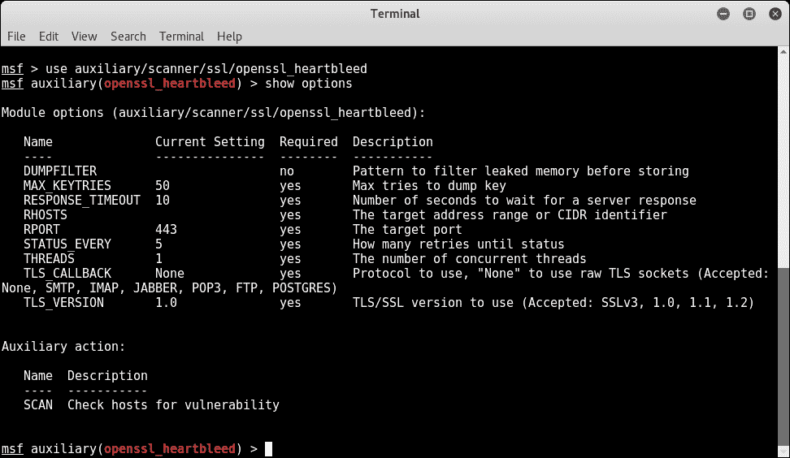

9.  您需要根据您的目标信息更改`rhost`和`rhost`；在我们的例子中，它如下：

    ```
          msf > set rhosts 172.17.0.4
          msf > set rport 443
          msf > set action SCAN

    ```

10.  After setting up appropriate settings, we will run the module by typing `run` on the `msf` console, and the output will be as shown here:

    

11.  The module has detected this server as vulnerable to Heartbleed. We will now go ahead and change the action to `DUMP` from `SCAN` using the command shown in the following screenshot:

    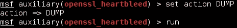

12.  After changing the action, we will run the module again and the output will be as follows:

    

13.  Data retrieved from the server has been dumped into the file on the directory path given by Metasploit. We will go ahead and change the action to `KEYS` from `DUMP` and run the module one last time to see whether we can retrieve any private keys from the server, as shown here:

    

14.  After changing the action, run the module once again to see whether Metasploit can retrieve private keys from the server, as shown here:

    

如您所见，Metasploit 已成功地从易受攻击的服务器提取私钥。

## 它是如何工作的。。。

在此配方中，我们使用 Metasploit 利用 SSL Heartbleed 漏洞进行攻击，该漏洞可以转储内存数据并提取服务器的私钥。

# 使用 FIMAP 工具进行文件包含攻击（RFI/LFI）

在第一个配方中，打嗝扫描程序还发现了文件路径旅行漏洞。在此配方中，我们将学习如何使用 Fimap 来利用文件路径遍历漏洞。

Fimap 是一个 Python 工具，可以帮助自动查找、准备、审核并最终利用 web 应用程序中的本地和远程文件包含错误。

## 准备好了吗

要逐步完成此配方，您需要以下内容：

*   在 Oracle Virtualbox/VMware 上运行的 Kali Linux
*   在 Kali Linux 上运行的 Docker
*   易受攻击的 Web 应用程序 Docker 容器
*   因特网连接

## 怎么做。。。

对于此配方，您需要执行以下步骤：

1.  Open the browser and navigate to `http:/dvwa.hackhunt.com/dvwa` and log in with the default credentials. Click on **File Inclusion** from the left-hand side menu, as shown in the following screenshot:

    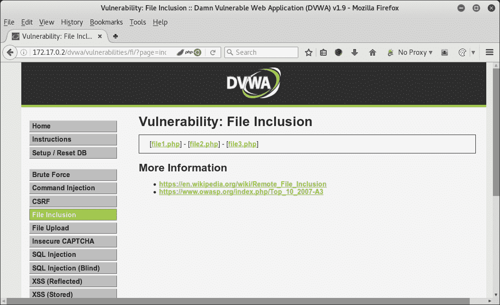

2.  Open the terminal and type `fimap`, which will show the version and author information, as shown in the following screenshot:

    

3.  要使用 Fimap 攻击 LFI/RFI 漏洞，我们需要使用以下命令：

    ```
          fimap -u 'http://172.17.0.2/dvwa/vulnerabilities       /fi/?page=include.php' --cookie="security=low;         PHPSESSID=b2qfpad4jelu36n6d2o5p6snl7" --enable-blind

    ```

4.  Fimap will start looking for the local file it can read from the server and will display it if the target is vulnerable to a file inclusion attack, as shown in the following screenshot:

    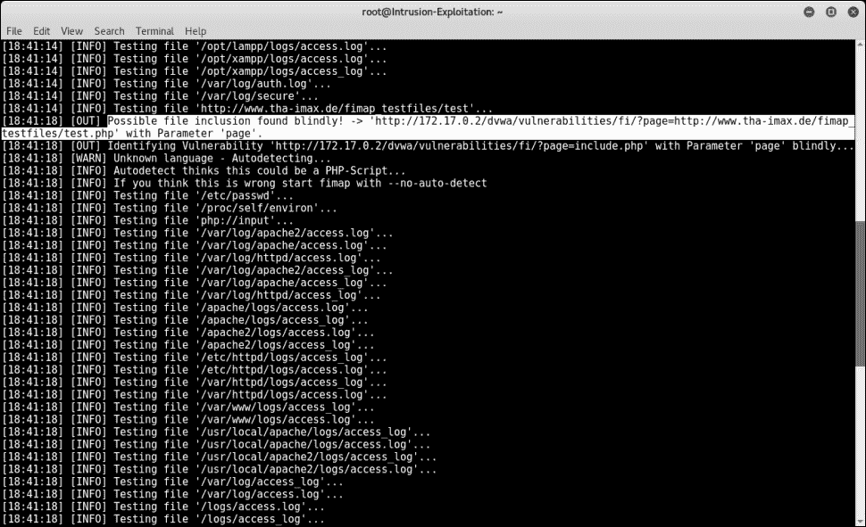

5.  At the end, Fimap will show all the files it was able to read from the server, as shown in the following screenshot:

    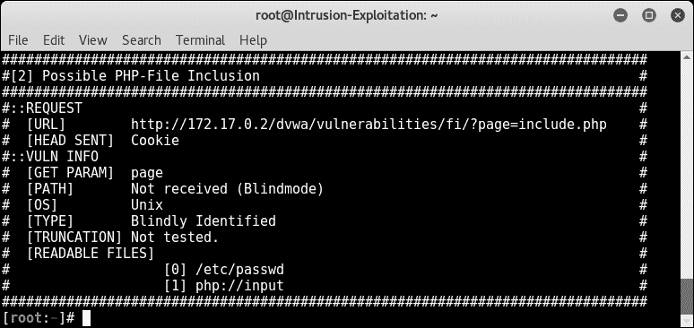

6.  现在，我们将使用前面使用的命令，并在结尾处使用`-x`，以便继续利用此文件包含并获得服务器外壳，如下所示：

    ```
          fimap -u http://dvwa.hackhunt.com/dvwa/vulnerabilities      /fi/?page=include.php        --cookie="PHPSESSID=376221ac6063449b0580c289399d89bc;      security=low" -x

    ```

7.  Fimap will start an interactive menu as and ask for the input; choose `1` as our domain is `dvwa.hackhunt.com`, as shown here:

    

8.  In the next step, it will ask you to choose the vulnerable bug to start with; for our example, we will choose `1`, as shown in following screenshot:

    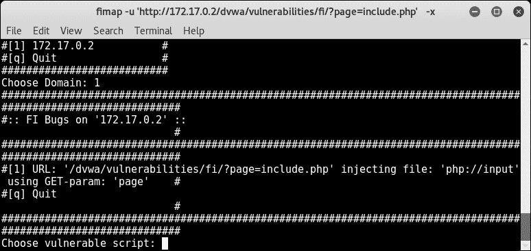

9.  In the next step, it gives you two options. `1` is to spawn a direct shell and the second is to create a reverse shell using the pentest monkey script. For our demonstration, we will use `1`, as shown in the following screenshot:

    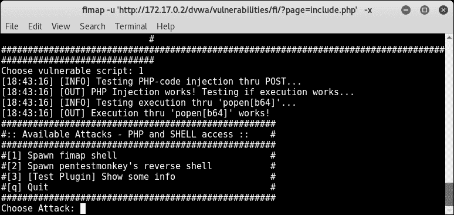

10.  As you can see, we have successfully received the shell, as shown in the following screenshot:

    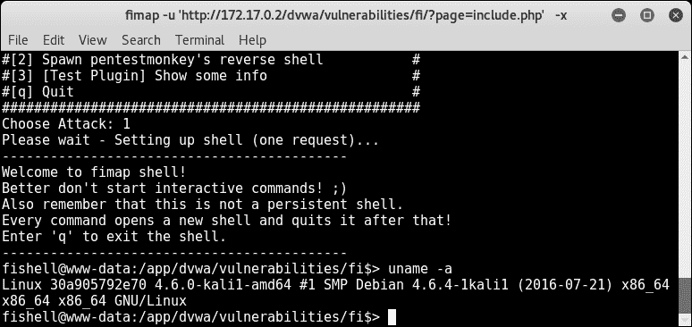

11.  我们可以使用此通道获得一个稳定的 shell，并最终升级以获得服务器上的 root 权限。

## 它是如何工作的。。。

在这个方法中，我们使用 Fimap 来利用本地和远程文件包含，并在服务器上获得 shell 访问。在此配方中，我们使用了以下开关：

*   *`-u`：表示目标 URL。
*   `--cookie`：由于我们的注入点是在身份验证之后，我们必须使用此选项来设置 cookies，以便 Fimap 可以访问注入点。
*   `--enable-blind`：当 Fimap 无法检测到某些东西或没有出现错误消息时，此开关非常有用。请注意，与此模式相比，此模式将导致大量请求
*   `-x`：用于攻击远程文件包含漏洞并自动生成外壳。