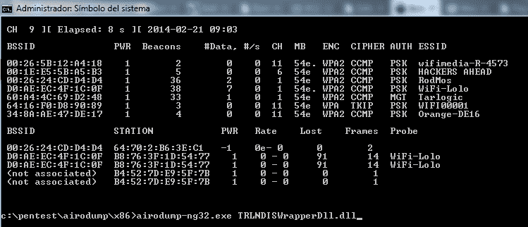
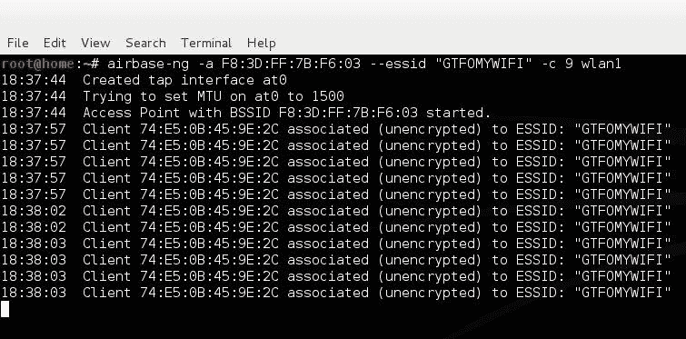
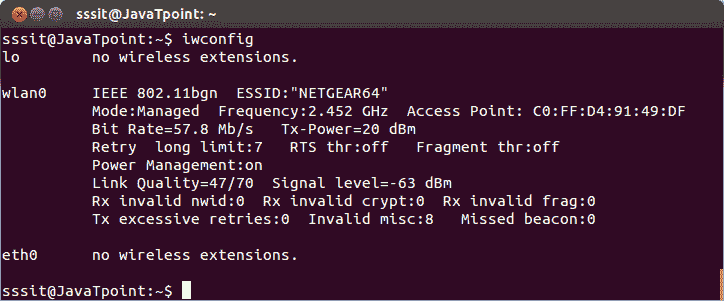
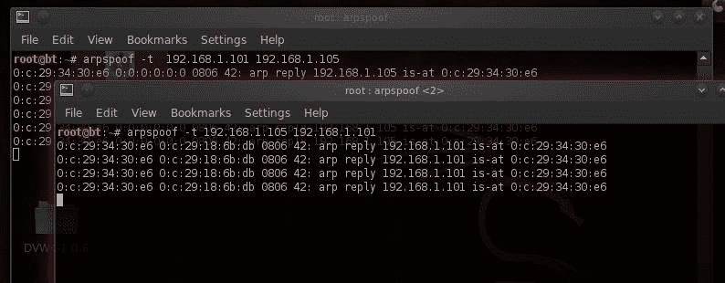
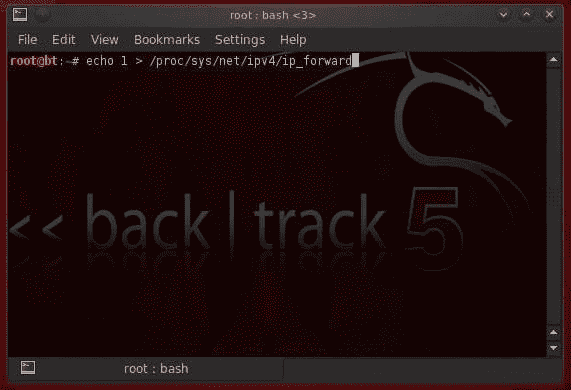
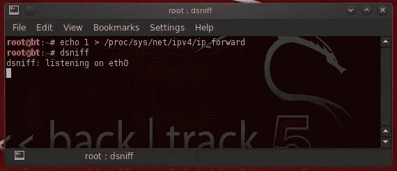
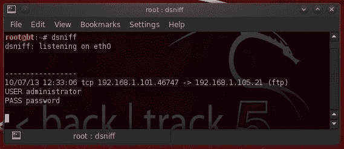

# 攻击机密性

在本章中，我们将介绍以下配方：

*   创造一个邪恶的孪生兄弟
*   中间人与无线
*   开裂 WEP

# 介绍

正如我们在上一章中了解到的，数据的完整性是安全性的一个重要组成部分，但它只是 CIA 三合会的一部分。这个三合会的另一个分支是保密方面，它解决了与保护信息免遭未经授权披露有关的问题。对于一个组织来说，这一方面可能是成败攸关的问题，因为失去对信息的控制，并让相同的信息出现在网站、报纸或其他渠道上，可能会导致包括诉讼在内的许多负面后果。

零售商 TJ Maxx 就是一个很好的例子，说明受损的无线网络会给公司带来严重后果。
在 21 世纪初，TJ Maxx 让无线网络处于不安全状态，正是这个接入点后来被网络犯罪分子发现并用于收集信用卡、姓名和地址等形式的敏感客户信息。
虽然攻击最终被发现并挫败，负责的犯罪分子受到审判和惩罚，但 TJ Maxx 在确保其技术安全方面仍存在实际犯罪之外的问题。TJ Maxx 是因零售商疏忽而导致其信息被盗的客户提起的大型集体诉讼的主体。这场官司最终导致零售商损失数百万美元。

在当今世界，数据的机密性对于一个组织来说非常重要，因此不能忽视。事实上，困扰商业环境中臭名昭著的无线网络的一个问题是，它们被认为是不安全的，并且有很大的潜力将数据暴露给未经授权的方。正是由于这个原因，许多企业在很长一段时间内都没有考虑实施无线网络，而且在许多情况下，这些企业完全禁止在企业场所使用无线设备。这意味着可以在企业中设置无线接入点。该企业还将避免购买任何具有无线功能的设备，以避免因有人连接到该企业拥有且包含业务敏感数据的设备上的恶意或不安全接入点而导致的任何问题。这是许多年前的事了，此后世界发生了变化；许多企业将无线网络作为其整体业务战略的一部分。尽管人们对这些无线网络的保密性和安全性仍有相当程度的担忧，但它们已被更广泛地采用，并且在许多以前没有出现过的企业中都可以看到。

导致人们对无线网络保密性担忧的是，除非使用专用天线或设备，否则无线网络会向各个方向发射信号。随着设计用于更好地聚焦信号的专用天线的加入，多年来，保护技术和其他技术得到了发展，使得无线网络得到更广泛的接受。

这些技术已经证明能够有效地保护无线网络的机密性；让我们来看看一些可以用来保护无线网络免受未经授权的破坏和数据泄露：

*   **加密**：加密可能是最简单、应用最广泛的技术之一，可用于提高无线网络或任何网络的安全性。我们在无线网络中讨论的加密类型旨在保护传输中的数据，或者换句话说，保护从 a 点移动到 B 点的数据。这对于无线网络至关重要，因为将数据从 a 点移动到 B 点的过程涉及通过空中传输信息；因此，任何能够截获无线电波的人都有可能窃听传输并查看不安全的数据。
*   **密码学**：无线网络有多种形式，使用许多不同的算法，如 AES 或 3DES，既可以保护数据的机密性，也可以提供其他机制确保数据在传输过程中不被修改。
*   **天线**：这是一个更有趣的领域，可用于保护无线网络和无线信号——使用专门的天线聚焦和控制信号及其传输，使其不会不加区分地发送信息。专用天线可用于将信号聚焦到特定区域，甚至控制信号可传播的范围或距离；因此，在这两种情况下，限制谁能够监听传输。需要注意的是，大多数无线接入点中包含的天线被视为全向天线，这意味着它们是设计为向所有方向均匀发射信号以最大程度覆盖其区域的天线。虽然这对于需要或需要最大覆盖区域的基于消费者或家庭的环境很好，但如果您处于多租户环境中，或者您希望将信号集中到只有需要信号的人才能访问的区域中，您可能希望控制这一点。
*   **预共享密钥**（**PSK**）：这种机制用于在多个工作站之间共享一个密钥和接入点，目的是使用该密钥对数据进行编码和保护，防止未经授权方修改或泄露数据。这些预共享密钥系统对于小型环境非常有用，甚至对于需要保护少量系统的基于家庭的环境也非常有用。这在很大程度上是因为密钥必须在单个系统上手动输入，而对于其他系统，它们可以集中管理。如果您必须手动向每个客户机系统以及接入点输入一个密钥，那么随着网络规模的增长，事情会变得非常乏味和麻烦。
*   **企业认证**：这类系统的工作方式与基于 PSK 的环境相同，只是通过使用 RADIUS 等系统集中进行密钥管理。这些企业系统的好处是，随着业务或部署规模的增长，它们几乎可以成倍增长，这意味着密钥管理和安全性仍然可以集中管理。企业身份验证系统确实有一个缺点，那就是它们需要更多的基础设施和时间来正确设置和配置；然而，一旦这样做了，它就变成了一个维护问题。

这只是一个简短的清单，列出了可以用来加强保密性的潜在措施；但是，在无线环境之外，还有许多其他功能可以补充或替代此列表中提到的功能。

一旦获得网络访问权，并且数据的完整性受到质疑，攻击者可能会选择为他们选择的任何目的更改内容。

# 攻击类型

针对无线网络的机密性攻击在技术娴熟、知识渊博的攻击者或入侵者手中非常有效和强大。用于保护无线网络的机制和设备被错误配置，或者这些网络的所有者不知道可用的攻击类型，这种情况并不少见。如果系统所有者不知道其无线网络或保护机制本身存在错误配置问题、缺陷或缺陷，那么他们将面临各种攻击，这些攻击可能会针对他们，在某些情况下会产生毁灭性的影响。请记住，无线网络是可以安全的，但就像任何事情一样，您必须花时间和精力确保安全性是充分的，并且按照预期的方式到位。

在我们开始探索每一次攻击之前，让我们首先列出本章将介绍的攻击：

*   嗅
*   数据重放
*   WEP 包注入
*   信标帧的检测
*   信标帧欺骗

请记住，这些只是可用于破坏无线网络机密性的攻击类型中的一小部分，决不能将它们视为唯一的攻击类型。

# 创造一个邪恶的孪生兄弟

可用于攻击机密性的第一种攻击类型称为邪恶孪生攻击，或邪恶孪生 AP。这种类型的攻击通常不是单独使用的攻击，而是与其他攻击一起使用，我们将看到。

我们在这里提到的攻击类型最常见的名字往往是邪恶的双胞胎名字。然而，听到诸如 rogue 接入点、shadow 接入点、无线蜜罐以及许多其他潜在的名称，不要感到惊讶。不管你怎么称呼它，如果你了解这次攻击的机制，不管它叫什么名字，你都会没事的。

当盗贼接入点以与合法接入点相同的方式配置并放置在附近时，就会发生邪恶孪生攻击。对于外部世界和用户来说，一对邪恶的孪生兄弟被放置得更近和/或产生更强的信号，将是他们最有可能依附的孪生兄弟，而不是一个合法的接入点。如果用户选择手动或自动连接到接入点，邪恶孪生兄弟将成为最终用户的接入点和互联网网关。由于恶意方将控制邪恶孪生兄弟，他们将能够拦截任何通过其 AP 的流量，甚至根据需要修改或重定向它。这意味着攻击者能够窃取信息，包括密码、用户名和其他数据等敏感数据。

在实践中，如果一个小小的想法和计划付诸实施，你会考虑一个邪恶的孪生攻击，这是非常有效的，你可以考虑用户连接到无线网络的方式。考虑这样一个事实，即大多数用户的设备，如笔记本电脑、手机或平板电脑被用来打开他们的无线设备，找到一个无线网络，并连接到它。如果他们进入机场、购物中心甚至咖啡馆等公共场所，他们习惯于打开无线设备，搜索免费无线网络。记住这一点，可以很容易地构建一个无线接入点，提供看似免费的互联网接入，并保持其不安全，以便受害者连接到无线网络并开始浏览互联网或检查电子邮件，从而使自己容易受到攻击。也要考虑这样一个事实，如果你要命名一个无线网络，类似于一个公司或组织拥有的东西，用户很可能会连接到它，认为它是一个完全合法和真实的接入点，而实际上它根本不是。一旦用户连接到此接入点并开始交换数据，他们保护自己可能为时已晚。连接到不安全或未知接入点（如邪恶孪生兄弟）的用户可能会无意中被重定向到其他人控制的网站，进而包含可部署到其客户端系统的恶意软件。

# 准备

要开始工作，您需要准备以下项目：

*   能够进入监控模式的无线网卡
*   卡利 Linux
*   连接到 internet 的第二个有线或无线适配器

# 怎么做。。。

为了创造一个邪恶的孪生兄弟，我们将遵循几个步骤，每个步骤旨在使系统的一部分准备好进行攻击。

# 步骤一–监视器模式 airmon ng

我们要做的第一步是将无线适配器置于混杂模式或监视模式。这与我们在前几章中所做的没有什么不同。在这种情况下，我们将假设我们的无线适配器使用名称`wlan0`，但请仔细检查它以确保您的系统上的名称相同。

```
    airmon-ng start wlan0  
```

与以前一样，`airmon-ng`实用程序将我们的无线网卡切换到监控模式，并在此过程中将其重命名为类似`mon0`的东西。一旦完成，我们将能够查看所有我们需要的流量。下图显示了`airmon-ng`命令的结果：


airmon ng 将 wlan0 切换到监控模式。

请记住，在本书中我们将多次使用此实用程序，并且在每种情况下，步骤几乎相同。当我们使用这个工具时，唯一经常改变的是连接后的步骤，以及我们使用的无线接口的名称。请特别注意此命令使用的语法，以便在将来使用此命令行应用程序的尝试或练习中使您的生活更加轻松。

# 第二步-空气卸载 ng

监控模式就绪后，我们现在将开始使用相同的无线适配器收集流量。要使用`airodump-ng`执行此操作，我们将键入以下内容：

```
    airodump-ng mon0

```

注意我们如何为监控界面`mon0`使用新名称；您应该使用`ifconfig`验证名称，以确保您的新接口名称相同。

完成此步骤后，您应该开始看到接入点；这取决于你选择一个你想要创造一个邪恶孪生兄弟的人：



很像以前，这个实用程序并不是你最后看到的一个-事实上，它在本书的其他一些食谱中使用，语法与你在这里看到的几乎完全相同。请密切注意语法和您如何使用它，以及它在做什么，因为它将节省您以后的时间。

# 第三步-创建具有相同 SSID 和 MAC 地址的新 AP

要使用相同的 SSID 和 MAC 地址创建一个新的 AP，有效地克隆好双胞胎和坏双胞胎，我们需要使用`airbase-ng`实用程序，并假设我们要从前面的屏幕截图克隆名为`Tarlogic`的网络：

```
    airbase-ng -a 60:A4:4C:69:D2:48 --essid "Tarlogic" -c 1 mon0

```

如果该过程有效，您将看到如下屏幕截图所示的结果：



使用空军基地 ng 的结果

请注意，在屏幕截图中，我们创建了一个访问点，然后不久就创建了一个与该访问点关联的客户端。

在您设置接入点并开始广播一个名称后，您可能会让客户端快速连接，但如果不发生这种情况，请不要气馁。在某些情况下，在客户端实际连接到您的访问点之前，您可能需要等待一段时间。需要多长时间取决于具体情况。如果您要设置一个模仿咖啡店接入点名称的接入点，并且那里有很多客户，则很可能会有人连接到您的接入点，因为它的外观和行为与咖啡店的接入点相似。请记住，我不建议您创建一个模仿咖啡店接入点或其他公共接入点的接入点，除非您有这样做的特定许可。设置一个，因为你想，往往是非法的。

# 第四步-强制重新连接

如果您想知道是否可以让客户端比等待更快地连接到访问点，那么您可以有效地将它们从当前的访问点“good twin”中删除，并让它们重新连接到您的访问点。为此，我们将融合一个反身份验证框架，将每个人从目标访问点引导出去。一旦他们被踢开，如果我们正确地定位自己，他们就会附在我们的邪恶孪生兄弟身上。我们的下一步是把邻居从他的接入点上赶走。

我们可以将`aireplay-ng`与`deauth`数据包一起使用：

```
    aireplay-ng --deauth 0 -a 60:A4:4C:69:D2:48

```

我们对`aireplay`所做的是发送一个包含`Tarlogic`接入点地址的`deauth`帧。下图显示了在`aireplay`中运行`-deauth`选项的结果：


发送 deauth 帧

# 第五步-通电

为了确保我们有最好的机会捕获客户端，我们需要确保我们的信号比我们正在克隆的接入点的信号好。如果你无法靠近自己，你可以随时调大电源，以确保你有一个更强的信号。

要生成更强大的信号，我们可以执行以下操作：

```
    iwconfig wlan0 txpower 27

```

下面显示了`iwconfig`命令的结果。注意`Tx-Power`设置：

通过发送神化数据包，我们有目的地引导已连接到网络外合法接入点的客户端，以使它们重新连接到我们的网络。虽然只向连接到的客户端发送神化帧，但特定的接入点不足以确保它们将重新连接到我们的接入点，而是给了它们这样做的机会。您可能已经捕获了一个连接到您的接入点的客户端，而无需进一步操作，但我们希望有更多的保险来实现这一点。那么，让我们继续。

下面显示了`iwconfig`命令的结果。注意`Tx-Power`设置：



iwconfig 命令的结果

该命令将把 AP 的功率提升到美国允许的最大功率，即 27 dBm 或 500 毫瓦。虽然某些卡的功率可能会超过此限制，例如 2000 毫瓦，但这不仅是非法的，而且会因为额外的热量和压力而缩短卡的寿命。

值得强调的是，不必要地增加接入点的功率会导致很多麻烦。正如我们所提到的，在贵国，将接入点的功率提高到某一阈值可能是非法的。将接入点或无线设备上的电源调高到超出容量的另一个问题是，当用于调制信号的收发器超出其设计规格时，它确实会产生产生更多热量的副作用。随着热量的增加，它会缩短设备的寿命。你甚至可以把你的设备变成火灾隐患。最后，不必要地将功率调高违反了法律标准，这意味着您可能会淹没接入点范围内其他无线设备的信号。虽然这听起来是个好主意，但它确实增加了你被抓住的可能性。确保您了解将无线设备的功率调至超出其设计规范或法律限制的问题。

此时，我们可以再次运行`airodump`以查看客户端是否连接到我们的访问点。我们还可以使用嗅探器来捕获流量或运行中间人攻击，稍后我们会这样做。请记住，到目前为止，我们所做的是捕获来自客户端的无线流量，并将它们重定向到我们的接入点。同样重要的是要知道，在这一点上，我们在这个食谱中所做的一切都是建立邪恶孪生兄弟。我们没有做的是让我们自己捕捉任何流量。我们如何做到这一点取决于我们自己。

# 中间人与无线

一种更高级的攻击形式，建立在以前的行动之上，称为中间人攻击。当第三方截获两个系统之间的通信并观察通信量或以某种方式改变通信量时，就会发生这种攻击。这种类型的攻击肯定比通过嗅探进行的任何窃听都要深入，但最初它以一种非常相似的方式开始。

让我们从讨论交换机和欺骗主题开始，讨论一些基本要点，以此开始攻击。

我们对交换机的解释旨在作为交换机功能、位置以及网络设备层次结构的入门或复习。这并不是要对开关的输入和输出进行详尽的讨论，也不是要对设备的功能和工作方式进行剖析。如果您不熟悉交换机、它们的工作方式、将它们放置在网络上的原因，以及它们与其他传统网络设备（如集线器）相比的优势，那么您可能希望在继续之前查看这些信息。这样做将有助于你从这个食谱中获得最大的收获，并具体了解我们正在努力实现的目标。

您可能已经知道，交换机是一种通过使用 MAC 地址来控制流量的设备。这些设备在当今的环境中被大量使用，您应该了解并处理这些设备，以便在它们阻止您的攻击企图时正确地与它们交战并击败它们。交换机很受欢迎，因为它们允许减少网络拥塞和相关的网络流量，更不用说它们只向 MAC 地址（即预定目的地）发送流量。正是由于这些能力，交换机取代了集线器，集线器是一种无法控制流量或防止其他客户端窃听不涉及它们的连接的设备。为了对抗交换机的安全性，已经开发了许多技术，包括 MAC 洪泛、DHCP 饥饿和 ARP 欺骗等操作。其中一些技术用于绕过交换机，而另一些技术旨在直接瞄准交换机，使其作为一个中心运行，从而使我们的攻击更容易实施。

通常，泛洪在过去十年或更长时间内部署的交换机上不起作用。通常，现代交换机不再工作，即使在旧交换机上，警惕的网络管理员也会注意到网络流量和容量的变化。为了让交换机知道在哪里发送流量，它们维护一个 CAM 表，该表基本上将 IP 地址映射到 MAC 地址。此表表示，当流量用于 IP 地址时，例如`192.168.1.101`，将该流量发送到 MAC 地址`11:22:33:44:EE:FF`。
如果我们可以更改该表中的条目，我们可以成功获取其他人的流量。这被称为**ARP 欺骗**，因为 CAM 表中的条目来自交换机发送的 ARP，用于从 NIC 收集此信息。

在配方中，我们将使用一种称为 ARP 欺骗的技术，该技术旨在让我们将自己插入目标之间，让他们相信他们仍然在直接交谈。

ARP 欺骗是一种攻击形式，通常用作另一种攻击的组成部分或前兆。在这种攻击中，恶意部分在本地网络上传输一系列伪造的 ARP 消息。这样做的目的是在系统或计算机上创建或更改 IP 和 MAC 地址的连接或链接，使其与实际情况不同。一旦攻击者完成了欺骗部分，他们就可以有效地改变网段上的流量。一旦攻击者的 MAC 地址连接到真实 IP 地址，攻击者将开始接收用于该 IP 地址的任何数据。

窃听需要记住的是，它可以使用许多不同的协议进行，如 FTP、HTTP 和其他协议。如果采用正确的方法，任何形式的在线通信都可能受到中间人攻击。在本节的配方中，我们将演示如何仅使用特定协议执行攻击，但该示例可以适当扩展到其他协议。

在讨论诸如 DCF 之类的工具时，需要记住的一点是，它利用了一个事实，即 FTP 和 HTTP 等许多协议都是在一个不考虑安全性的时代设计的。这些协议设计用于执行非常特定的功能，例如文件或其他信息的传输，并且它们的核心功能非常出色，几乎没有问题。然而，由于这些协议的设计者从未考虑到我们今天看到的安全问题，因此在实际设计过程中他们没有考虑到这些问题。因此，这种缺乏安全性的情况被 dsniff 或 Wireshark 等工具以及许多其他工具所利用。

在 Wi-Fi 网络中，由于环境的设计，中间人是一种特别有吸引力的攻击。在这种环境中，攻击者所要做的就是等待客户端连接，然后让乐趣和游戏开始。如前一章所述，使用诸如假接入点之类的方法，或破解 WEP 或 WPA 密钥并连接到现有网络，为执行中间人攻击提供了足够有效的方法。

对于中间人攻击，需要指出的重要一点是，在其他情况下，受到攻击的客户可能无法检测到这些攻击。就受害者而言，当中间人攻击发生时，他们正在与原本打算与之沟通的人进行沟通；他们不知道有第三方以某种方式拦截并可能操纵他们的流量。如果攻击者不做任何事情来让人知道他们的存在，或者向任何人透露他们在那里，那么很难发现他们的存在。然而，有办法做到这一点。诸如 one 的网络入侵检测系统之类的设备可以检测流量的变化，并通知系统所有者或管理员该变化，并允许他们采取相应的行动。

# 准备

要开始工作，您需要准备好以下各项：

*   能够进入监控模式的无线网卡
*   安装了 Wireshark 的 Kali Linux

# 怎么做。。。

为了执行中间人攻击，我们需要汇集一些新的和旧的工具和技术。说到这里，让我们开始吧。

这次攻击的一个重点是，我们将同时在 Kali 中使用多个终端窗口。事实上，在这个特定的配方中，我们将使用三个同时运行的终端窗口和实用程序，每个都执行流程的一个单独部分。所以，记住要保持你的注意力，并注意在这个食谱中你应该在哪个窗口。

请记住，在这本书中，以及在现实生活中，您将发现自己在许多情况下同时运行多个终端窗口。这通常是因为您需要在命令行中运行多个实用程序，每个实用程序都设计用于执行流程或任务的一部分。因此，在执行这些攻击时，请确保您在任何时候都真正注意您所在的窗口，以确保您不会无意中取消或运行会产生与预期不同结果的命令或序列。

在本食谱中，我们将执行一些旨在捕获我们正在寻找的信息的步骤。

将要进行的第一步是运行 ARP 欺骗，它旨在帮助我们重定向和捕获流量，然后能够在稍后从中捕获凭据。

尝试此攻击时需要记住的一点是，此攻击仅在本地网络上有效；它不能跨不同的子网工作，甚至不能在两个不同的网络上工作。原因是 ARP 协议只在本地网络上工作，而不是设计成本地网络。因此，尝试对本地网络以外的任何对象执行此攻击都不会导致任何结果。这是一个需要记住的非常重要的细节，因为忘记它可能会非常令人沮丧，因为攻击可能会失败。

我们将在客户端上执行第一步，将服务器的 MAC 地址替换为本地系统的 MAC 地址。这将把流量重定向到我们的系统，而不是实际的服务器。

我们通过在其中一个终端窗口中运行`arpspoof`来执行此操作，如下所示：

```
    arpspoof <client IP> <server IP> 

```

这将告诉客户端，当他们试图联系服务器时，我们就是他们正在寻找的系统。

下一步是用系统的 MAC 地址替换客户端的 MAC 地址。这只需颠倒之前使用的 IP 地址顺序即可完成：

```
Arpspoof <server IP> <client IP> 
```

以下屏幕截图显示了颠倒 IP 地址顺序的操作：


在这里，我们告诉服务器我们是客户机。

现在执行这两个命令。当我们这样做时，客户端会认为我们是服务器，服务器会认为我们是客户端！



一旦我们欺骗了客户端的 MAC 地址以重定向其流量，我们需要执行一个称为转发或 IP 转发的过程。本质上，我们所做的是通过我们的系统将流量从客户机转发到服务器，从服务器转发到客户机，以确保一方的请求到达另一方，反之亦然。如果我们不执行转发，连接将实际上被中断，因为从一个网络接口路由到另一个网络接口的流量将无法实现。

请记住，此攻击的成功取决于在客户端与其预期目标之间保持可靠和一致的连接。你将自己插入到连接尝试的中间和任何后续的信息交换中，只要你需要收集你正在寻找的信息，你就试图保持你的存在是未知的和未被发现的。

为了启用转发，我们使用`ip_forward`命令，默认情况下它是 Linux 的一部分，允许我们尝试配置的进程。在正常情况下，此功能被禁用，因此我们需要重新启用它。Linux 有一个内置的功能来转发它接收到的数据包。

我们使用以下命令执行此操作：

```
echo 1 > /proc/sys/net/ipv4/ip_forward
```



现在，将我们的系统插入到这些通信主机的中间，并调用我们的客户机和服务器，我们可以开始下一阶段，即开始嗅探流量，以查找将要使用的凭据。

请记住，当使用中间人攻击或任何其他使用嗅探的攻击时，未受保护的协议（如 HTTP 或 FTP）将使您的攻击更加容易。SSH 等技术采用了旨在保护信息机密性和完整性的加密技术，这将使嗅探在收集有用信息或凭据时极为无效，因为它们旨在保护客户端的数据。

为了执行这一步骤，我们将使用一套称为`dsniff`套件的工具，它已经存在了好几年，但在执行各种不同的攻击时仍然非常有用。此套件包括许多不同的工具，旨在捕获所有类型的通信量并提取有用的信息，例如来自 FTP、telnet、HTTP、SNMP、POP、LDAP 和许多其他易被截获和处理信息的凭据。

为了使用 dsniff，我们发出以下命令：

```
    dsniff

```



当我们执行此命令时，您将看到`dsniff`将立即响应它在`eth0`上丢失。但是，可以使用`- I`命令让它在不同的界面上监听。

执行此命令后，我们现在要做的就是等待。我们等待的是客户端连接到服务器。有了`dsniff`在我们的角落里，我们会发现一旦客户登录，他们将成为我们嗅探工作的受害者，他们的凭证将直接显示在我们的屏幕上，我们可以在屏幕上记录下来，然后使用它们，如下图所示：



在此屏幕截图中，您将注意到 DCF 已捕获连接到服务器的客户端的凭据。实际上，在这里，您可以看到谁与谁连接，从而能够建立客户机/服务器关系。

在屏幕上显示凭据后，您还将看到这些凭据发送到的 IP 地址，这意味着您现在所要做的就是打开 FTP 客户端并将其指向同一 IP 地址。在提供您刚刚捕获的用户名和密码后，您可以依次登录到该系统并浏览其中的任何信息和服务。

# 开裂 WEP

无线网络的一个独特特征当然是，它们不使用传统媒体，而是使用无线电波将信息从一点传送到另一点。这就是网络如此吸引人和流行的原因，因为人们可以在无线网络范围内的任何地方携带他们的设备，并且仍然可以保持这种访问，而不必担心电缆之类的问题。然而，这种力量是有代价的，那就是无线电信号是不分青红皂白的，任何能够接收它们的人也将能够处理它们所携带的信息。

幸运的是，无线网络的设计者将此视为一个问题，并决定以**有线等效协议**（**WEP**的形式在 IEEE 802.11b 网络设计的初始规范中添加保护。在发布的时候，WEP 被认为是一个很好的特性，然而，问题出现并随后滚雪球的时间不长。

WEP 是现有加密协议中最古老、最脆弱的一种。WEP 标准是作为无线安全的初始解决方案引入的，但很快就被发现存在缺陷且极易受到攻击。有无数的理由表明该议定书存在缺陷，因此容易受到攻击；其中之一是协议中的加密实现较差。不仅实现的设计和实现都很糟糕，而且没有经过经验丰富的密码学家的审查，他们可能已经能够检测到任何缺陷和漏洞并加以解决。
WPA 或 Wi-Fi 保护接入是 WEP 的继承者，旨在解决困扰 WEP 的许多问题。在许多领域，它取得了成功，制定了更加严格的安全协议。WPA 使用 TKIP、MIC 和 AES 加密作为其保护信息的主要机制。
WPA2 是 WPA 的升级或后续版本，旨在用 WPA 解决和替换问题。WPA2 强大得多，并以 AES 和 CCMP 的形式使用更严格的加密。该标准的版本还使用了更强大的系统，如 EAP、TKIP 和 AES（具有更长的密钥）。

然而，在我们进入问题之前，让我们看看 WEP 应该如何工作。之后，我们将继续探讨如何利用其问题。

WEP 是最早的无线加密协议，当最初引入并集成到 802.11b 标准时，它被视为或多或少地提供与有线网络相同的安全数据传输的一种方式。按照设计，WEP 协议利用了一些现有技术，包括 RC4 加密协议。

在设计和推出时，其目的是实现以下目标：

*   挫败对通信的窃听，并试图减少未经授权的数据泄露
*   检查数据在网络中流动时的完整性
*   在传输之前，使用共享密钥加密数据包
*   在一个轻量级、高效的系统中提供机密性、访问控制和完整性

其问题产生于以下情况：

*   该协议的设计没有经过经验丰富的密码学家、学术界甚至公众的审查。
*   除了必须手动输入到每个站点的预共享密钥外，它没有为密钥分发（如集中密钥管理）提供明确定义的方法。因此，大规模更改密钥非常麻烦，因此很少更改。
*   它的设计使得使用操作系统中免费提供的嗅探工具和破解工具（如基于 Linux 的 Kali）被动地发现密钥成为可能。
*   不同供应商使用的密钥生成器设计不一致，导致漏洞，如 40 位密钥的使用问题。
*   用于执行密钥调度的算法已被证明容易受到攻击。
*   完整性检查中使用的 CRC32 存在缺陷，只要稍加修改，攻击者就可以始终如一地修改数据包，以产生预期的结果。
*   **初始化向量**（**IVs**的长度只有 24 位，这意味着一个轻度活跃的网络可以在 5 小时或更短的时间内耗尽整个 IVs 池。
*   通过对数据包的分析，它容易受到已知的明文攻击。
*   可以通过分析数据包来发现密钥，从而允许创建解密表。
*   它容易通过使用未经 WEP 认证的关联和解除关联消息受到拒绝服务攻击。

# 准备

要开始工作，您需要准备好以下各项：

*   能够进入监控模式的无线网卡
*   卡利 Linux

这里列出的项目是基本要求，如果需要，您可以轻松使用更多（或不同）组件。例如，如果您想要增强范围，您可以使用基于 USB 的无线网卡，该网卡可以连接外部天线，从而获得更好的接收效果。

在本练习中需要记住的一点是，我们将使用一系列工具，这些工具都来自于一套专门用于破解和分析无线网络流量的工具。在接下来的章节中，我们将重新讨论套件中的不同工具，并将它们用于不同的目的。这将是您对 air crack 套件的一些成员的首次探索。

# 步骤一–监视器模式 airmon ng

我们要做的第一步是将无线适配器置于混杂模式或监视模式。这与我们在前几章中所做的没有什么不同。在这种情况下，我们将假设我们的无线适配器使用名称`wlan0`，但请仔细检查它以确保您的系统上的名称相同。

```
    airmon-ng start wlan0
```

很像以前，`airmon-ng`实用程序已经将我们的无线网卡切换到监控模式，应该将其重命名为类似于`mon0`的东西。一旦完成，我们现在将能够查看所有需要的流量。下面的屏幕截图显示了`airmon-ng`命令的结果：


airmon ng 将 wlan0 切换到监控模式。

# 第二步-空气卸载 ng

监控模式就绪后，我们现在将开始使用同一无线适配器收集流量。要使用`airodump-ng`执行此操作，我们将键入以下内容：

```
    airodump-ng mon0
```

注意我们是如何为监控界面使用新名称的，`mon0`。您应该使用`ifconfig`验证名称，以确保您的新接口名称相同。

完成此步骤后，您应该开始查看接入点，并由您选择您希望创建的邪恶孪生兄弟：


# 第三步-空中转储 ng 和流量捕获

从该屏幕截图中的接入点列表中，您会注意到有两个启用 WEP 的接入点，我们将选择其中一个名为`7871`。

```
airodump-ng --bssid 0A:86:3B:74:22:77 -c 6 -w crack mon0 
```

这将开始从通道`6`上的 SSID`7871`捕获数据包，并将它们写入文件 crack，该文件将采用`pcap`格式。这种方法的问题是，我们需要捕获大量的数据包或通信量，以便能够实际中断或检索密钥。如果你是一个喜欢耐心的人，你可以等待 50、60000 甚至 100000 个数据包被捕获，然后再继续破解过程。然而，这还不够好；我们想要钥匙，我们想在尽可能短的时间内拿到它。让我们通过设置能够实现这一目标的环境来实现这一点。

为了使这个破解过程成功，需要捕获的数据包的实际数量往往有一点争议，因此您可能需要做一些实验来获得一致、可靠的结果。然而，仅出于参考目的，需要收集的通信量往往介于 60000 个数据包到 100000 个或更多之间。

# 第四步-重播该流量

我们需要做的是加速这个过程，在很短的时间内产生大量的流量。为了做到这一点，我们将执行一个称为包注入的过程，我们还将欺骗一个 MAC 地址，以诱导我们可以反过来捕获的流量波。

有许多不同的方式来执行流量重放，事实上，这种技术用于在主机或应用程序之间重放网络上的身份验证流量和其他类型的流量。但是，请记住，某些类型的流量无法轻松重放，或者根本无法重放。事实上，能够阻止数据重放攻击的最大项目之一是时间戳，它包括数据包上的信息，告知数据包何时被传输以及有效期多长。幸运的是，ARP 通信在默认情况下没有这种保护，尽管它可以通过其他机制提供。我们在这里使用的技术不会遇到此限制，因为我们不会捕获或重放受此保护或限制的流量。

执行此步骤所需的组件将是接入点的 SSID、已连接到接入点的客户端的 MAC 地址以及称为`aireplay-ng`的工具。我们将使用以下格式的实用程序发出命令：

```
aireplay-ng -3 -b 0A:86:3B:74:22:77 -h 44:60:57:c8:58:A0 mon0 
```

如果到目前为止我们已经正确地完成了所有工作，那么我们在另一个窗口中运行的`airodump`仍将运行，并且将能够捕获我们生成的所有流量，并将其保存到名为 crack 的文件中，然后我们将使用该文件对其进行分析并检索密钥。

# 第五步——打破交通堵塞

在我们继续进行第五步之前，也就是我们将实际破解流量的地方，我们需要确保我们已经捕获了数万个数据包，以确保我们有足够的流量来正确分析。如果您没有捕获足够的流量，那么这个过程很可能会失败，您必须重新生成流量以捕获更多流量。因此，请记住要有耐心，并确保捕获足够的流量，以合理的成功率执行流程。

尝试从捕获的流量中恢复密钥时需要记住的一点是，根据尝试恢复密钥的系统上可用的资源，可能需要一段时间。如果您有一个较慢或较旧的系统，则此过程所需的时间可能比处理能力或内存更大的系统稍长。如果你已经收集了足够的流量，这个过程应该是成功的——不管需要多长时间。

为了破解流量，我们需要拥有一个捕获文件，这是我们之前使用`airodump`生成的。我们使用`aireplay`生成的所有流量都应捕获到此文件中，然后我们可以使用以下实用程序对其进行分析：

```
aircrack-ng crack.cap 
```

如果成功，`aircrack`将在屏幕上以十六进制显示键，当您与目标接入点关联时，您可以使用该键进入无线客户端。

如果您耐心小心地执行了此攻击的步骤，您会发现成功的机会很大，您应该能够按需访问任何启用 WEP 的网络。还请记住，需要一点练习才能确保使用`airodump`将足够的流量捕获到文件中；学习曲线是正常的。

这主要是因为在这个特殊的配方中利用了弱点，所以这种形式的无线网络保护被视为一种有效的保护形式而受到反对或回避。当这种保护机制在早期无线网络中首次出现时，它被视为一种体面的保护形式。然而，随着技术的发展和攻击者寻求不同的信息捕获方式，很快就发现了一个漏洞。正是这种脆弱性让我们在这个特别的食谱中祈祷。如今的网络不应该将这种保护措施作为保护无线通信的主要手段，因为这并不难打破——只需要一点技巧和耐心，就可以获得所需的信息。