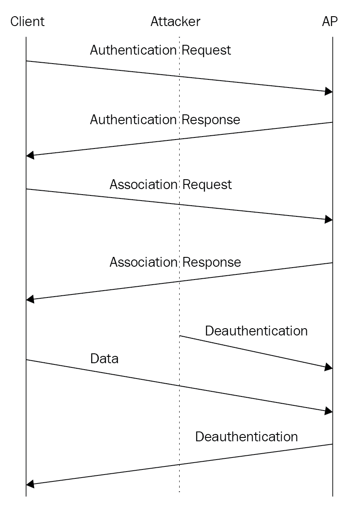
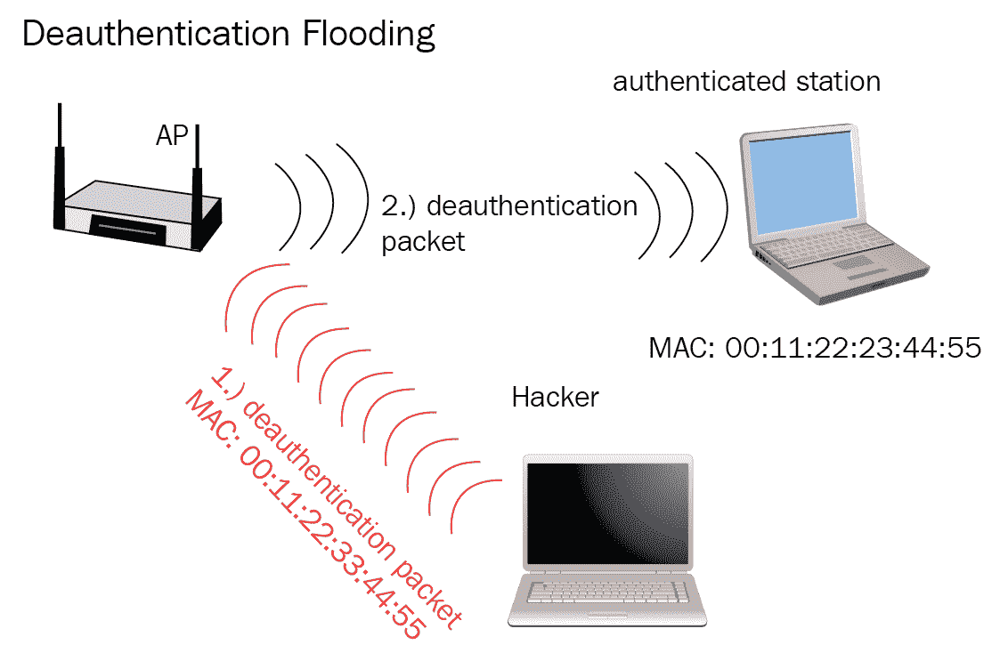
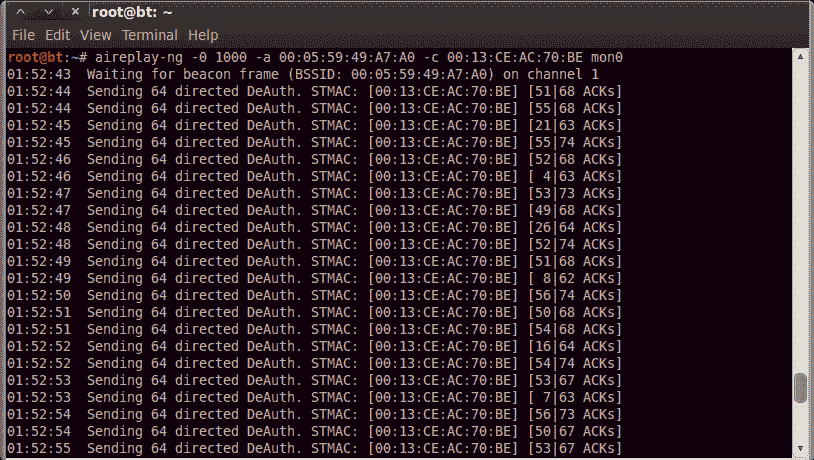
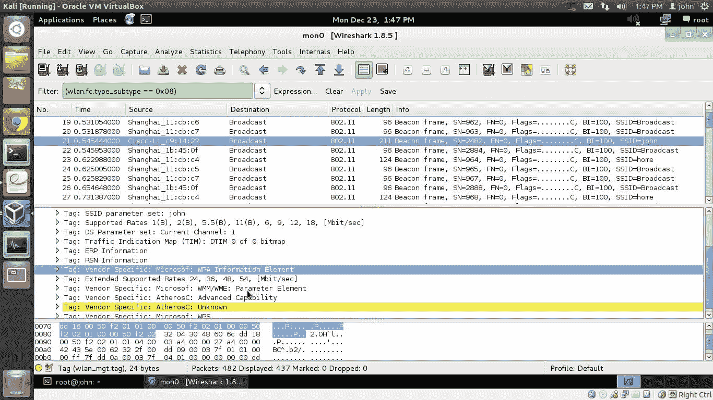
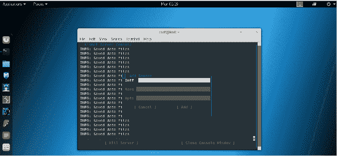
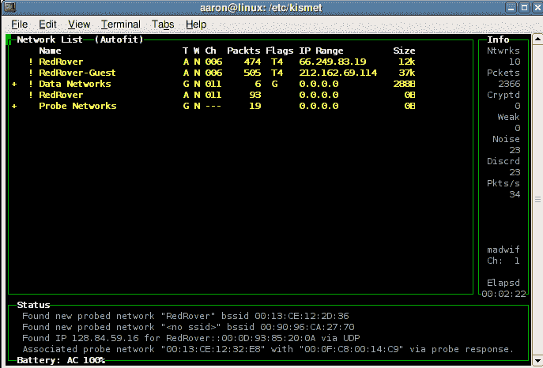
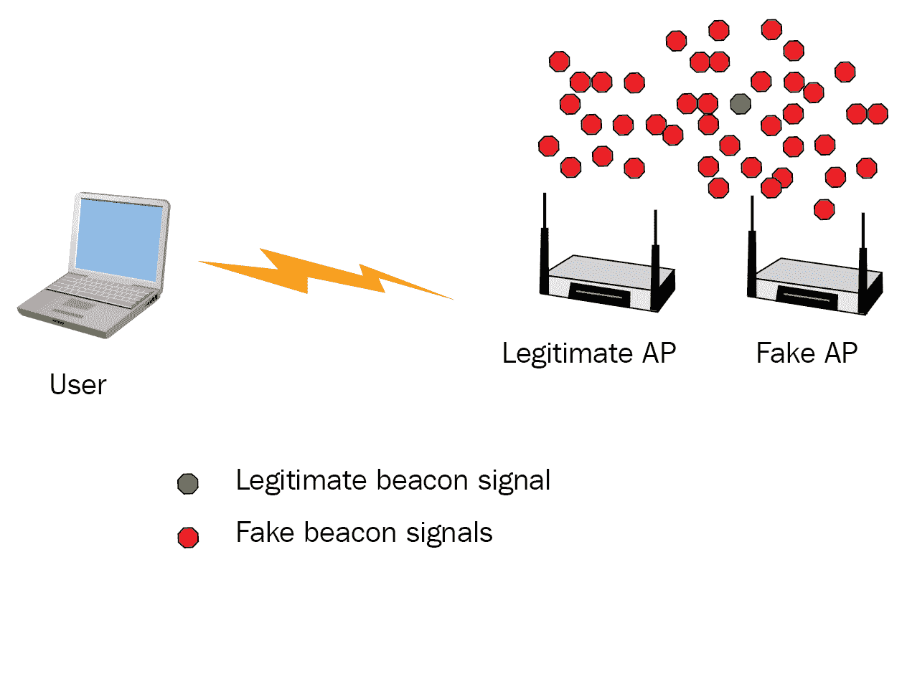
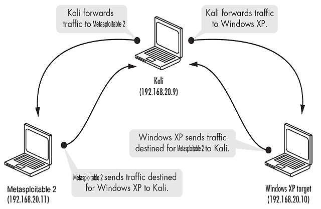

# 攻击可用性

在本章中，我们将介绍以下配方：

*   执行取消验证洪水
*   信标帧检测
*   欺骗信标帧
*   创造信标洪水
*   ARP 缓存中毒

# 介绍

到目前为止，我们已经研究了中情局三合会的三个组成部分中的两个。现在，我们来看看中情局三合会的第三部分，也是最后一部分，即可用性。简言之，可用性处理的是围绕着失去对资源（如文件、计算机甚至整个网络）的访问而产生的问题，我们将在本章中看到。正如您可以想象的那样，可用性的丧失是一个大问题，这主要是由于这样一个事实：如果您无法访问某个东西，无论它可能是什么，在您能够再次访问它之前，它对您来说基本上是毫无价值的。也可以毫不夸张地说，失去对某个项目的访问权也是相当令人沮丧的，因为这意味着在重新获得访问权之前，您可能无法完成您的工作或任务。

在讨论可用性的概念时，让我们考虑一下这一点。想象一下，在一个无线基础网络或环境中，客户端依赖于对文件、服务器甚至互联网的持续可靠访问，而无线访问将丢失。在这种情况下，如果这些客户依赖该访问来执行他们的工作，那么您可以拥有一个实际上无法运营的业务或客户，这意味着业务本身可能无法运营，这绝对不是一个理想的情况。请记住，在某些情况下，即使部分损失或可用性受阻也足以严重影响业务。我们可以想象这种情况，只要想想我们自己可能遇到过的情况，比如在咖啡馆、机场，甚至在酒店连接到无线网络。一个拥挤不堪、速度极慢且无法可靠访问资源的网络也将对业务运营产生重大影响。事实上，在这种情况下，即使存在访问权限，但访问速度非常慢，仍然会导致业务陷入停顿，这是不可接受的，需要避免。

在无线网络中，对抗可用性的影响是一个棘手的过程，但非常可行。您会发现，您有多种选择来应对我们将在本章中看到的攻击类型，并使您的无线网络更具弹性和抵抗可用性损失的影响。为了让您一窥究竟，我们可以采取以下一些对策来限制可用性丧失的影响，甚至消除这种可能性：

*   **调谐**：我所说的调谐是指设置和配置您的无线接入点，以避免使用该地区其他接入点可能使用的频道和频率。通过避免使用这些频道，您可以在很大程度上防止因争夺频率和拥挤的频道而导致的可用性和范围的降低和损失。现在，请记住，为什么您可能不总是能够在特定区域独家使用频道和频率。你可以选择一个比该地区其他监狱更拥挤的频道和频率，给你一个比拥挤的频道多一点的阅览室。
*   **冗余**：使用这种技术仅仅意味着我们实现了一种称为网状网络的东西，这是一种蜘蛛网，建立在用于覆盖一个区域的多个接入点之间。通过使用此设置，可以使多个接入点覆盖一个区域，如果这些接入点中的任何一个，甚至多个接入点，变得拥挤，我们可以安排发出强信号，其他节点或接入点可以接收并向客户端发出更强、更可靠的信号。虽然这种设置确实需要一点计划和努力才能使其正常工作，但它可以为任何处理缓慢或拥挤网络带来的挫折的人带来巨大的收益。还值得注意的是，与前几年提供的一些解决方案不同，我们提供了更为用户友好甚至基于消费者的解决方案，可以从家庭环境到大规模企业部署，以更低的成本快速建立网状网络。
*   **企业身份验证**：虽然在前面关于机密性和完整性的章节中提到了此解决方案，但实际上它在可用性方面有不同的用途。使用 radius 或 diameter 等技术的企业身份验证系统可以使无线网络的身份验证方面更难离线，从而使其在面对基于拒绝服务的攻击时更具弹性。主要采用这种类型的系统或机制意味着攻击者必须付出更多的努力，通过身份验证系统使该网络离线，而不是如果他们有一个单独完成所有任务的接入点。解决方案的缺点是，它确实需要更多的努力和更多的知识来建立和使它有效地工作，但是如果你想给自己多一点保护，那就要考虑一下。
*   **修补和更新**：对于任何一个已经在 IT 行业工作了足够长时间的人来说，你可能不需要我解释定期修补和更新任何固件软件的概念，但值得一提。我们在客户端和接入点中修补和更新固件的原因是为了确保我们利用最新的功能和修复程序，其中一些功能和修复程序可以使我们抵御拒绝服务和其他可用性攻击。
*   **配置**：最后一个是一个很大的区域，覆盖了很多地面，可以极大地帮助您击败影响可用性的攻击。当我说这是一个大的区域时，配置涵盖了从接入点的位置和设置，要使用的天线类型，要覆盖的设施或校园的部分，甚至是一些小细节，比如你需要覆盖的范围，与你的客户在工作日移动的距离有关，以及他们在移动时需要访问无线网络。

再一次，这是一个简短的列表，只是为了让您了解一些可能会阻碍可用性的事情。您应该始终了解可用性问题和无线网络的最新情况，因为它往往是影响您的客户群对无线网络的感知和接受程度的最大影响领域之一。虽然保密性和完整性很重要，但客户比其他两个更容易注意到与可用性相关的问题。缓慢的网络和不可用的网络更为明显，因此，不仅应该从用户幸福感的角度来解决，还应该从安全的角度来解决。

# 攻击类型

如前所述，有很多方法可以影响无线网络的可用性。它们都有相同的基本目标，那就是阻止无线网络被有效地连接和使用，或者根本没有。

在开始深入讨论每种攻击之前，我们应该首先定义本章将要讨论的攻击：

*   执行解除关联洪水
*   信标帧检测
*   欺骗信标帧
*   执行信标洪水
*   执行取消验证洪水
*   ARP 缓存中毒
*   执行拒绝服务
*   隐藏无线网络

这些攻击代表了影响无线网络可用性的一些比较流行的方式，因此我们在这里介绍它们。和往常一样，还有其他故意和意外的可用性攻击可能会困扰您的无线环境，您需要自己进行更多研究。

# 执行取消验证洪水

这第一次可用性攻击是一次有趣的攻击，也是一次有效的攻击。这种攻击被称为分离洪水。在这种类型的攻击中，恶意方试图破坏客户端与访问点的关联。当执行这种类型的攻击时，客户端将遇到一种情况，即他们被从无线接入点撞出，并将发现自己试图重新连接到接入点。这里的关键词是他们是否可以连接到无线接入点。如果此洪水以足够大的容量进行，并保持在该级别，则可能意味着没有客户端能够连接到无线网络很长时间，或者根本无法连接，具体取决于情况如何。

需要明确的是，我们在本配方中讨论的攻击类型不是基于干扰的攻击。我们所说的干扰是指不存在用于阻止或阻止无线网络使用频率的无线电信号或发出的任何干扰。在执行基于干扰的攻击时，通常您会使用一些东西，例如一个特定的重建设备，在这种情况下，设计用于用无线电通信轰炸电波。虽然这种攻击会起作用，因为干扰会干扰无线频率，但它的工作方式也不分青红皂白。基本上，您不能选择哪些客户端将保持连接，哪些客户端不保持连接，也不能选择要阻止的无线网络。在这些频率范围内运行的任何东西都将被阻止。这种类型的攻击也有一个非常现实的问题，即非法，如果使用，将面临高额罚款甚至入狱。在本书中，我们不会在任何地方使用干扰。

提出这一点的唯一原因是，有时 deuthentication 洪水被错误地称为干扰攻击。我们所说的攻击类型是非常有选择性的，这意味着它可以摧毁无线网络或单个客户端。它也不会用不分青红皂白的无线电通信轰炸电波，而是使用精心制作的帧来瞄准一个或多个受害者。

这类攻击带来的一个问题是，为什么无线网络中首先会存在反身份验证帧？事实上，有一个很好的答案，最明显的是，它可以用来断开那些行为不端或出于某种原因需要断开的无线客户端。存在此框架类型还有其他原因。例如，在恶意客户端连接到无线网络的情况下，可以使用反身份验证框架启动客户端。当它们被发现时，它们可以被选择性地锁定并断开连接。此身份验证框架的另一个更恶意的用途可能不仅仅是导致拒绝服务，还可能是迫使客户端连接到我们控制的恶意访问点。在这种情况下，我们将在靠近合法接入点的位置设置自己的无线接入点。然后，我们会发送去验证帧，将人们踢出合法网络，并可能迫使或诱使他们连接到我们控制的接入点。这个接入点恰好是可用的，并且随时准备好与他们一起工作。下图显示了对无线网络进行身份验证的正常过程：



无线网络的正常认证过程和反认证

如果我没有提到另一种半合法的（我很轻率地使用这个术语）使用一些企业使用的去验证框架，那真是我的失职。这种半合法使用反认证框架的一个例子发生在美国，一家连锁酒店被发现强迫人们使用酒店的 Wi-Fi，而不是其他供应商的 Wi-Fi。在这种情况下，酒店使用的设备会传输反验证帧，阻止酒店客人使用外部 Wi-Fi，而不是为酒店自己的 Wi-Fi 服务付费。一旦发现酒店正在使用这种设备，客人和客户很快就会对其提出法律挑战。最后，调查发现，美国任何和所有酒店使用这种技术强制使用其服务都是非法的，任何使用这种技术的企业都被处以重罚，并受到联邦通信委员会的法律诉讼。

值得一提的是，关于是否可以在需要设施安全和数据传输的地区使用反认证洪水，目前正在进行辩论。在这一点上，答案似乎是确实没有直接的答案，因为反认证洪水已经被用于创建安全空间，其中只有授权网络可供特定业务领域的人员使用。

下图显示了反验证洪水的概念：



取消认证洪水

还有另一种使用去验证帧的方法，对于针对无线网络或一般网络执行笔测试的人来说非常方便，即使用它获取网络的密码或密钥。在这种情况下，攻击者将发送 AE 取消身份验证洪水，并从目标网络中拦截客户端的客户端。当该客户端尝试重新连接时，攻击者将嗅探该连接期间生成的流量，并尝试提取连接信息交换。这种类型的攻击还可用于诱导中间人，在这种情况下，攻击者将取消对受害者的身份验证，然后迫使他们通过流氓接入点重新进行身份验证。然后，他们会将流量引导到互联网连接或任何实际的合法网络。本质上，我们将首先发出一个去验证帧或洪水，然后我们将使用我们在上一章中探讨的中间人或流氓接入点设置，然后我们将能够拿起这些凭证作为握手。

# 准备

要开始工作，您需要准备好以下各项：

*   能够进入监控模式的无线网卡
*   卡利 Linux

# 怎么做。。。

要执行关联洪水，我们只需要使用前面章节中看到的步骤组合，并添加一些额外的步骤来调整它。

在这个场景中，我们有一个连接到无线接入点或无线路由器的客户机来处理他们的业务。攻击者将试图断开与网络的连接：

1.  为了开始，我们需要首先将网卡置于监视模式。同样，这与我们在以前的食谱中所做的没有什么不同。为了简单起见，我们假设我们的无线适配器使用名称`wlan0`，但请仔细检查以确保您的系统上的名称相同：

```
    airmon-ng start wlan0
```

很像以前，`airmon-ng`实用程序已经将我们的无线网卡切换到监控模式，应该将其重命名为类似于`mon0`的东西。一旦完成，我们将能够查看所有我们需要的流量。下面的屏幕截图显示了`airmon-ng`命令的结果：


airmon ng 将 wlan0 切换到监控模式。

2.  接下来，我们需要使用`airodump-ng`工具从监视器界面捕获信息，如下所示：

```
 airodump-ng mon0 
```

此时，攻击者将能够访问目标系统范围内无线接入点的相关信息（ESSID、通道、BSSID 等）：

3.  有了网络列表，我们现在可以选择一个，并将该网络的十六进制值输入到`airodump-ng`命令中，以关注特定的网络。此命令的结果是，我们将能够检索当前活动连接到访问点的客户端列表。要查找此信息，我们将使用以下命令：

```
 airodump-ng mon0 -c 1 -bssid 00:05:59:49:A7:A0 
```

其中`airodump-ng`为工具，`mon0`为接口，`-c`为通道，`-bssid`为接入点 MAC 地址：


仔细检查后，结果将显示当前连接到接入点的客户端。为了简化这一过程，您只需浏览客户机列表，选择要删除的客户机，并记下其 MAC 地址，如`00:13:CE:AC:70:BE`。

4.  最后一步是实际取消客户端与访问点的身份验证或解除其关联。我们这样做：

```
 aireplay-ng -0 1000 -a  00:05:59:49:A7:A0 -c 
    00:13:CE:AC:70:BE mon0 
```

其中`aireplay-ng`为工具，`-0`为反认证攻击参数，`1000`为待发送的反认证数量，`-a`为无线路由器 MAC 地址，`-c`为客户端 MAC 地址，`mon0`接口：



前面的屏幕截图显示攻击已成功执行。客户端已断开与网络的连接，并且在攻击者停止发送取消身份验证消息之前无法建立连接。

# 信标帧检测

之前，我们讨论了信标帧及其对无线网络的重要性，以及如何在无线网络中使用信标帧。现在，让我们仔细看看它们，看看信标框架中的内容以及如何分析它，这样我们就可以在后面的章节中使用这些信息。

那么，什么是信标帧？信标帧是由无线接入点发送的东西，该无线接入点识别无线网络的名称、有关该无线网络的一些参数，以及隐藏在其中用于内务管理和其他任务的一些其他信息。信标帧由每个无线网络定期发送，用于向该接入点范围内的无线客户端和设备宣布该网络的存在。

让我们分解无线 LAN 发送的信标帧中的一些片段或组件：

*   **时间戳**：时间戳作为信标帧的一部分，用于此特定目的：时间戳用于通知该网络上的所有无线客户端和设备同步或将其时钟设置为该时间。这使得网络能够比时钟运行不同的时间间隔且彼此不同步时更高效地运行。该时间戳与信标一起发送，客户端不会查看该时间戳并将时钟设置为该时间，因此参与无线 LAN 的每个人都是同步的。
*   **信标间隔**：您可以想象，用一个像信标间隔这样的名称，这必须告诉我们信标帧发送的频率。该值将告知无线 LAN 上的节点必须发送信标帧的频率。在某些无线网络上，这是用户或系统管理员的可配置设置。但是，在大多数消费级接入点和设备上，这是不可访问的，由制造商在制造接入点时定义。
*   **能力信息**：这实际上是信标帧的一个重要组成部分，因为它描述了网络的格式，它是运行基础设施还是临时模式，它是否使用了某些安全功能，甚至它支持什么类型的加密（如果有的话）。正如你所想象的那样，获得这些信息并能够对其进行剖析，可以告诉你很多关于网络是如何运作的，以及你需要知道什么才能战胜它。

关于信标帧的间隔，需要记住的是，虽然它们可以在无线网络上进行调整，但在各种情况下改变间隔可能并不理想。虽然有好处，但也有一些缺点需要谨慎。例如，加快信标帧的传输有利于更频繁地发送这些信标帧，但也会导致网络上的额外流量，这意味着带宽或吞吐量（更具体地说）远离网络上的用户，这意味着您有效地降低了网络的速度。

加快信标帧的好处是，客户端可以更快地与网络关联，如果他们四处漫游，他们将能够更快地跟踪网络和服务的变化。另一方面，延长信标帧之间的时间将减少网络上的开销。这样做的直接影响是关联速度较慢，而倾向于漫游的客户端的关联过程要慢得多，并且不会像以前那样快速获得有关数据吞吐量的网络变化的信息。如果您是一名无线网络工程师，通常最好不要使用信标间隔，因为它既可以产生积极影响，也可以产生消极影响。

实际上，信标帧确实会给无线网络上产生的流量增加一点。然而，它通常是最小的，发送此信标以使网络正常工作非常重要。当无线客户端在其支持的信道上扫描和查找无线网络时，它正在查找信标帧，该信标帧将告诉它存在一个接入点区域以及有关该接入点的一些详细信息。该信息还允许客户端不仅确定该区域中的无线网络和功能，还允许客户端根据其提供的功能和服务对其进行优先级排序，从而允许用户或客户端本身确定要连接的最佳网络。以下屏幕截图显示了 Wireshark 中捕获的信标帧：



Wireshark 中显示的信标帧

请记住，即使在客户机与无线网络关联之后，扫描过程仍在继续，并且客户机仍在通过其他信道寻找标识其他无线网络的信标。这背后的想法是通过不断扫描和寻找其他无线网络，它让用户能够在当前网络不足或不可用时切换到替代网络。信标帧还具有同步时钟的优点，这种情况不仅会发生一次，而且会定期发生，以确保时钟始终保持同步，并保持紧密的公差，并且它们不会慢慢失去彼此的同步，因此可以达到这一关键目的。信标帧还可以作为一种方便的机制，通知连接到网络的客户端网络中即将发生的变化，如速度或通道，他们需要对此做好准备并预测变化。

话虽如此，让我们继续实际捕获和分析信标帧，以便我们能够直接看到其中包含的内容，以及这对我们意味着什么。这些信息本身并不是攻击，但它可以作为我们将在本章中看到的攻击的前兆；因此，我们将使用此配方让您熟悉这一点。

# 准备

要开始工作，您需要准备好以下各项：

*   能够进入监控模式的无线网卡
*   安装了 Wireshark 的 Kali Linux

# 怎么做。。。

Kismet 是从无线接入点和设备定位和提取有用信息的有效工具，在这种情况下，它将用于检测传输的信标帧。

在此配方中，我们将从命令提示符启动 Kismet。但是，也可以从“应用程序”菜单的“无线攻击”部分启动。在任何一种情况下，启动 Kismet 都将导致以下步骤：

1.  打开终端窗口。
2.  在命令提示下，输入`kismet`命令。
3.  现在，您将在半图形化环境中配置 Kismet。您将使用*选项卡*和*输入*键进行导航。

4.  如果看不到灰色字母行，请使用*选项卡*键高亮显示`No`。否则，请突出显示`Yes`。
5.  按一次*回车*键。
6.  按一次*回车*键，确认 Kismet 正在以 root 用户身份运行。
7.  按一次*回车*键，自动启动 Kismet 服务器。
8.  按一次*回车*键，确认您想要启动 Kismet 服务器。
9.  按*输入*键确认您可以添加捕获源。
10.  使用`ifconfig`输入无线接口的名称。如果您不记得，可以打开另一个控制台窗口，再次运行`ifconfig`命令以确定正确的界面（通常命名为以`wlan`开头的名称）。以下屏幕截图显示了界面输入屏幕：



Kismet 接口配置

11.  按一次*Tab*键。
12.  在`Name`字段中键入无线接口的名称。
13.  按一次*Tab*键。
14.  再次按*Tab*键。
15.  按一次*回车*键。
16.  如果输入的名称正确，Kismet 应该能够识别指定的无线接口。它还将生成不需要的虚拟接口的名称，如`wlan0mon`、`wlan0monmon`和`wmaster0`。

17.  当外壳右下角（Kismet 窗口）显示`Close Console Window`时，按一次*Tab*键，高亮显示`Close Console Window`。
18.  按一次*回车*键。
19.  无线接入点列表将显示在 Shell 的左上象限（Kismet 窗口）。
20.  单击下拉菜单上的“视图”。
21.  单击监视活动。

一旦达到这一点，您将看到访问点名称（以及客户端）将开始快速填充接口。正如我们之前使用此工具所看到的，列表中显示的每个网络名称或 SSID 都有相关的详细信息。这些条目中的每一个都是根据从信标帧中提取的信息填充的，信标帧将开始填充窗口。您将看到与每个设备相关的名称、频道、无线标准和其他信息。如果您等待的时间足够长，您会注意到将出现其他设备，并且列出的其他项目可能包含以前没有出现过的更多信息。

在查看 Kismet 窗口中显示的网络列表时，您可能会看到一些看起来稍有不同的条目。例如，请查看以下屏幕截图：



显示 Kismet 主窗口，显示检测到的无线客户端。

如果您查看窗口中的项目，您会注意到，如果您移动列表中的该项目并使用*+*或*-*键打开或关闭选择，则会有一个`Probe Networks`条目。展开项目时，将显示项目列表。此列表记录了来自附近系统的探测请求。这些问题是由一个启用无线功能的系统发送的，该系统正试图连接到它过去连接的网络。仔细分析 probe 请求下显示的网络名称可以揭示系统所连接的不同接入点的名称，并让您了解系统的使用方式或位置。请记住，只要设备与无线网络无关，许多操作系统就会发送这些探测。

还有其他软件包可以用来做 Kismet 正在做的事情，但是 Kismet 具有高度可定制和被动的优势。被动意味着软件不会发送任何信息，以从该区域的无线接入点获取响应。相反，软件监听与接入点相关的连接和流量，以显示其存在并确定其名称。此外，软件包能够检测隐藏在其他类似软件包可能无法执行相同操作的地方的接入点。

# 欺骗信标帧

在本食谱中，我们将看一看欺骗信标帧。现在我们已经看到了信标帧的实际外观，以及信标帧的一些属性，我们可以理解伪造信标帧的价值，以及如何利用它来影响无线网络或接入点的可用性。

在检查信标帧的内容之后，我们可以看到重要信息，例如时间的下沉、网络的标识以及其他属性都包含在这个重要帧中。如果攻击者想要中断无线网络的运行，例如减慢网络速度或使网络不可用，则信标帧是执行此操作的理想位置。

重要的是要预先知道是什么使得欺骗信标帧成为可能。破坏无线网络的一种可接受形式是缺乏对伪造帧的验证或确认。虽然在过去几年中，市场上出现了旨在帮助检测伪造到无线网络的帧的产品和技术，但这远远不是可用于保护无线网络的常见情况。对于采用某种伪造帧检测的无线网络，还存在另一个问题，由于无线网络的不稳定性质以及不同供应商之间可用的不同通信形式，检测伪造帧变得更加棘手。同样，系统管理员和网络管理员可以将各种技术结合起来，以覆盖整个范围，并允许检测伪造帧，从而防止此类攻击。

在检查可用于目标网络的信标帧时要考虑的一件非常重要的事情是，它不是一个容易执行的攻击。虽然我们让它听起来很简单，但在实践中，它需要一些耐心和努力才能正确工作。尽管恶意方可以在网上查找如何执行此攻击的详细信息，甚至可以阅读此处的步骤，但仍然需要一些尝试、错误和耐心。
这种类型的攻击需要记住的另一件事是，随着技术和技术的进步，它们提供了一种有效的检测伪造信标帧的方法，这种攻击肯定可以被检测到。网络所有者面临的挑战是了解这是一种潜在的攻击。他们需要了解，这是他们应该部署或采取保护措施的事情，以降低发生此类攻击的风险。

在我们完成使此攻击成功发生的各个步骤之前，让我们简要地看一下欺骗信标帧的过程。我将要做的是描述各个组件，并给出这种类型攻击的解剖结构，然后我们将继续，并在真实环境中实施攻击。

在最基本的层面上，实施欺骗信标帧攻击实际上有两个阶段，其中一个阶段依赖于我们已知的工具，即`airmon-ng`。此工具用于将我们的无线适配器置于监视模式，以便它能够观察该地区所有无线网络的流量，即使它与任何无线网络都没有关联。使用此实用程序欺骗信标帧与您使用它的任何其他时间都不会有任何不同。我们将告诉实用程序在一个特定的接口上进入监视模式，然后这个阶段就完成了。

第二阶段的欺骗，或伪造，一个信标帧是一个魔术发生，使过程是什么。为了执行第二阶段，我们将使用一个名为`mdk3`的工具，这是该诊所发行版中的另一个命令行实用程序。此实用程序将允许我们生成具有任何名称和属性的信标帧，这些名称和属性是我们选择在开放环境中传输的。最终结果是，该实用程序可以发送大量信标帧，这些帧可以从文本文件中读取，您可以使用自己的名称预先填充文本文件。这将在该地区产生大量虚假接入点，这些接入点将减慢速度并使客户端感到困惑，在某些情况下，如果名称恰好相同，甚至会破坏它们与当前网络的关联。我们在这里所做的是通过使用此单一实用程序创建拒绝服务。

# 准备

要开始工作，您需要准备好以下各项：

*   能够进入监控模式的无线网卡
*   卡利 Linux

这里列出的项目是基本要求，如果需要，您可以轻松使用更多（或不同）组件。例如，如果你想要一个增强的范围，你可以使用一个基于 USB 的无线网卡，它可以连接一个可以获得更好接收效果的外部天线。

在本练习中需要记住的一点是，我们将使用一系列工具，这些工具都来自一个套件，旨在破解和分析无线网络的流量。虽然套件中可能包含十几种工具，但在本章中我们只使用了大约三到四种。但是，我们将在后面的章节中重新讨论套件中的不同工具，并在此过程中使用它们。这将是您对 air crack 套件的一些成员的首次探索。

# 怎么做。。。

第一步是将无线适配器置于监视器模式。在这种情况下，我们将假设我们的无线适配器使用名称`wlan0`（与之前非常相似），但请仔细检查以确保您的系统上的名称相同：

```
    airmon-ng start wlan0

```

很像以前，`airmon-ng`实用程序已经将我们的无线网卡切换到监控模式，应该将其重命名为类似于`mon0`的东西。完成后，我们将能够查看所需的所有流量：


airmon ng 将 wlan0 切换到监控模式。

接下来，我们需要使用`airodump-ng`工具从监视器界面捕获信息，如下所示：

```
airodump-ng mon0 
```

此时，攻击者将能够访问目标系统范围内的无线接入点信息（ESSID、通道、BSSID 等）。

一旦我们从列表中选择了要欺骗的网络，我们就可以进入下一步，即使用称为`mdk3`的工具。`mdk3`是一个用于利用 802.11 标准中存在的漏洞和其他问题的实用程序，其中之一是伪造信标帧的能力。

要使用`mdk3`工具，我们可以从列表中选择一个接入点或使用我们制作的名称。一旦我们记住了一个名称，我们就使用以下语法运行`mdk3`命令（我们将伪造一个名为`impa`的网络）：

```
mdk3 mon0 b -n "impa" -b 54 -w a -m -c 11 
```

`b`激活信标泛洪模式，`-n`设置名称，`-b 54`设置为`54`MB，`-w a`仅启用 WPA2/AES，`-m`使`mdk3`仅使用有效地址，因此攻击者将难以进行过滤，`-c`设置正确的通道。

此时，如果您使用另一个无线设备检查该区域的无线网络，您将看到正在广播的新网络，在本例中，该网络名为 IMPA。

# 创造信标洪水

在这个配方中，我们将继续我们的思路和探索，从上一个配方中我们伪造了一个信标帧，但我们将通过尝试大量信标帧来提高强度。在前面的配方中，我们主要关注如何创建伪造的信标帧。在这里，我们要做的是发送一波又一波的假接入点，目的是混淆该地区的客户机，导致他们出现性能问题。事实上，执行信标洪水的迷人之处在于，在某些情况下，它会导致扫描仪、软件甚至驱动程序不仅性能不足，而且会导致系统崩溃，甚至锁定他们所在的系统。您可以想象这是一种拒绝服务，对于那些软件设备的所有者或任何有问题的节点来说都是非常令人沮丧的。下图显示了信标泛洪的概念：



信标洪水概念

通过信标洪水，我们可以生成大量的假接入点，并改变这些假接入点的参数和通道，进一步完善和增强攻击，从而造成更大的伤害。您会发现，此攻击的初始步骤与上一个配方中的步骤完全相同。变化发生的地方是当我们开始使用`mdk`实用程序开始改变这些参数以产生影响时。

# 准备

要开始工作，您需要准备好以下各项：

*   能够进入监控模式的无线网卡
*   卡利 Linux

这里列出的项目是基本要求，如果需要，您可以轻松使用更多（或不同）组件。例如，如果你想要一个增强的范围，你可以使用一个基于 USB 的无线网卡，它可以连接一个可以获得更好接收效果的外部天线。

在本练习中需要记住的一点是，我们将使用一系列工具，这些工具都来自于一套用于破解和分析无线网络流量的工具，以及为什么套件中可能包含十几种工具，而在本章中我们只使用了其中的三到四种。然而，在接下来的章节中，我们将实际回顾套件中的不同工具，并将它们用于不同的目的。因此，这将作为您对 air crack 套件的一些成员的首次探索。

第一步是将无线适配器置于混杂模式或监视模式。这与我们在[第 4 章](4.html)中所做的*攻击机密性*没有什么不同。在这种情况下，我们将假设我们的无线适配器使用名称`wlan0`，但请仔细检查以确保您的系统上的名称相同：

```
airmon-ng start wlan0 
```

很像以前，`airmon-ng`实用程序已经将我们的无线网卡切换到监控模式，应该将其重命名为类似于`mon0`的东西。一旦完成，我们将能够查看所有我们需要的流量。下面的屏幕截图显示了`airmon-ng`命令的结果：


airmon ng 将 wlan0 切换到监控模式。

下一步是再次激活`airodump-ng`实用程序，查看该区域的无线网络或接入点列表。记住，我们需要有一个目标网络来进行攻击，否则这将不会产生预期的效果。我们将创建的信标将使用我们将提供的给定网络的 SSID 生成：

```
airodump-ng mon0 
```

如果命令执行正确，我们将看到该区域的无线网络列表。此时，您将选择一个目标。您特别需要标记为 ESSID 的信息，用于您希望定位的站点；其他任何内容（如 BSSID）都需要修改该命令。

选择目标后，需要使用以下命令：

```
mdk3 mon0 b -t <BSSID target> -c <channel> 
```

如果要更改洪水的计时，可以添加`-s`命令行，以便：

```
mdk3 mon0 b -t station/bssid -s 360 
```

在这种情况下，`360`是每秒将传输的数据包数。

如果你想查看信标的流量，你可以在另一个 Kali 工作站上运行 Kismet，你会看到该站接收到大量信标，代表我们原始攻击系统的努力。

# ARP 缓存中毒

在这个配方中，我们不会直接攻击无线网络，而是操纵网络中存在的东西来执行操作，例如嗅探或中间人攻击。我们在这里探讨的技术被称为 ARP 缓存中毒，可以在任何使用 TCP/IP 协议的网络上使用。

那么什么是 ARP 呢？ARP（地址解析协议）是 TCP/IP 协议的一个组成部分，用于将逻辑地址或 IP 地址链接到物理地址或 MAC 地址。在实践中，ARP 会发生以下情况。

让我们设想一种情况，您有两个位于同一子网上的客户机希望启动彼此的通信。在这种情况下，通常不需要 IP 地址，因为不存在路由要求。在这种情况下，如果一个客户端希望向另一个客户端发送流量，它将首先检查其 ARP 缓存，以查看它之前是否与预期目标通信。如果 ARP 缓存或表中存在 IP 到 MAC 地址映射，则发送站将仅使用该信息将其希望发送的数据发送给该接收方。但是，如果传输信息所需的信息不在 ARP 缓存中，则它将在该子网上发送 ARP 广播。当发送方正在寻找的客户端接收到此广播时，接收方将向发送方发回其 IP 地址和 MAC 地址组合。此时，发送方将使用此信息正确寻址和传输数据，从而确保数据到达其预期目的地，IP 和 MAC 地址组合也将保留在本地 ARP 缓存中，以便将来的传输更快。以下屏幕截图显示了 ARP 缓存的内容：


Linux 中的 ARP 缓存

在执行 ARP 缓存中毒时，需要记住的一件事是，您可以使用我们正在讨论的技术主动对其进行中毒，并将信息放入目标的缓存中。但是，如果目标用户或受害者重新启动该系统，则您在其缓存中放置的信息将被删除，您必须重新启动毒药。

让我们剖析一个 ARP 中毒攻击，这样我们就可以了解我们试图做什么来造成危害。正如我们所发现的，ARP 有一种非常特殊的工作方式，允许提升方定位其预期接收者的 IP 地址和 MAC 地址组合，这个过程在设计上相当简单。当形成缓存中毒攻击时，我们希望向受害者发送伪造或伪造的 ARP 回复，目的是让他们缓存我们的回复，然后在稍后的操作中尝试发送信息时使用。现在，仔细看看我刚才说的我们正在尝试做的事情。我说我们正试图发出 ARP 回复，但我从来没有说过要出去得到那个回复。换句话说，这就像我走到你跟前说再见然后走开。如果我在现实生活中这样做，你会认为我有点疯狂，因为我没有什么可以说再见的。然而，由于 ARP 的工作方式，这种情况在数字世界中实际上是可行的。

所以这里的问题是，我发出的回复中有什么内容试图毒害你的缓存？答案很简单：里面有什么？发送 ARP 广播是因为系统在本地子网上有一个客户端的 IP 地址。因为它不使用 IP 地址和本地子网，所以它希望使用 MAC 地址。所以，通过发送这个请求说，“我有这个 IP 地址，谁现在拥有这个 IP 地址”，其中 MAC 地址在你的网卡上，我得到的是 IP 和 MAC 的组合。攻击者将修改此回复，以便在您查找某个 IP 地址时，转到另一个 MAC 地址，该地址恰好是恶意方控制的系统上网卡的 MAC 地址。通过主动将该组合发送给受害者，ARP 过程将被颠覆，因为传输系统将查看是否有关于其试图将数据传输到的站点的信息，因为这些信息将被主动缓存，并且不会进行广播以找到具有合法 IP 地址到 MAC 地址组合的真正所有者。结果是，流量将被定向到一个不同于接收者认为正确的客户端。

下图显示了正在进行的 ARP 攻击：



ARP 缓存中毒攻击

就 IP 到 MAC 地址的分辨率和组合而言，问题有两个方面。ARP 用于将 IP 地址解析为 MAC 地址。然而，有一种称为 RARP（反向地址解析协议）的配套协议，用于将 MAC 地址解析为 IP 地址。虽然这两种协议都存在于彼此的伙伴关系中，但我们实际上只需要 ARP，而不需要反向 ARP。然而，重要的是要知道存在一个伴随协议。

# 准备

要开始工作，您需要准备好以下各项：

*   能够进入监控模式的无线网卡
*   卡利 Linux

这里列出的项目是基本要求，如果需要，您可以轻松使用更多（或不同）组件。例如，如果你想要一个增强的范围，你可以使用一个基于 USB 的无线网卡，它可以连接一个可以获得更好接收效果的外部天线。

第一步是启用 IP 转发；这将启用流量转发，以便通过攻击者的系统重定向流量。为了实施这次攻击，我们执行以下命令：

```
#echo "1″ > /proc/sys/net/ipv4/ip_forward 
```

查看 IP 转发设置的值；这将返回一个值`1`。如果没有，请重复前面的步骤：

```
#cat /proc/sys/net/ipv4/ip_forward 
```

输出将为：`1`

```
#sysctl -p 
```

注意这里的`1`值表示我们正在启用 IP 转发。如果我们想关闭这个功能，我们可以用一个`0`来运行相同的命令。

下一步是在流量通过我们的系统时重定向流量，通过使用`iptables`命令很容易做到这一点。

在此设置中，在端口`80`上接收的流量将重定向到不同的端口号。在这种情况下，端口`80`被重定向到端口`8080`，端口`443`被重定向到端口`8883.`，有了这组简单的规则，流量将被相应地重定向。

为了实现我们的设置，我们只需在命令行中输入以下内容：

```
#iptables -t nat -A PREROUTING -p tcp -destination-port 80 -j REDIRECT -to-port 8880 
#iptables -t nat -A PREROUTING -p tcp -destination-port 443 -j REDIRECT -to-port 8883 
```

iptables 是一个命令行实用程序，在 Linux 中已经存在很长时间，用于在 Linux 内核中配置防火墙设置。该实用程序远比这里介绍的复杂，但我们只需要使用基本的设置。

现在是重要的部分，这是执行实际的 ARP 欺骗。为此，我们将使用`arpspoof`命令更改受害系统的缓存，使其具有不同的值。在本例中，我们将把默认网关更改为其他网关。我们可以使用以下命令执行此操作：

```
arpspoof -i interface -t target-ip target-gateway-ip 
```

更具体地说，我们将更改受害计算机以包括网关的不同地址：

```
arpspoof -i eth0 -t 192.168.1.23 192.168.0.253 
```

我们也可以对网关执行相同的操作，如下所示：

```
arpspoof -i eth0 -t 192.168.0.253 192.168.1.23 
```

一旦这些步骤完成，我们将进入一个阶段，在该阶段中，我们可以在请求在网络中移动时拦截请求。在这种情况下，我们在卡利有一些以`sslstrip`/`drifnet`形式收集信息的选择。让我们简单地看一下每一个设置。

`sslstrip`是一个嗅探和中间人实用程序，旨在捕获通过 SSL 协议移动的信息。使用此命令可能会截获用户名、密码、电子邮件帐户和数据库用户详细信息等信息。

以下命令将允许攻击者嗅探目标 PC`192.168.1.23`的流量，并指定`iptable nat`规则中定义的端口：

```
python /usr/share/sslstrip/sslstrip.py -p -s -l 8880 
```

等待片刻，在`/usr/share/sslstrip/sslstrip.log`中记录嗅探数据，或者您可以使用用户定义的文件转储捕获的数据。

另一个有趣的实用程序称为`driftnet`。漂移网**是一个基于 GUI 的工具，旨在捕获从浏览器访问的任何内容。此实用程序使用非常简单，只需在命令行中使用`driftnet`命令即可激活，结果将开始显示为交通流。以下是使用该实用程序获得的输出示例：**

 **

漂移网命令的输出**