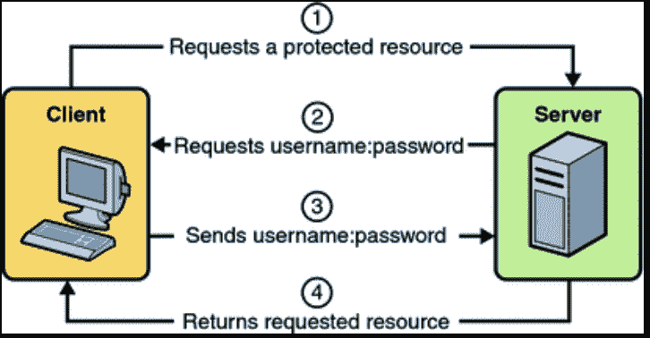
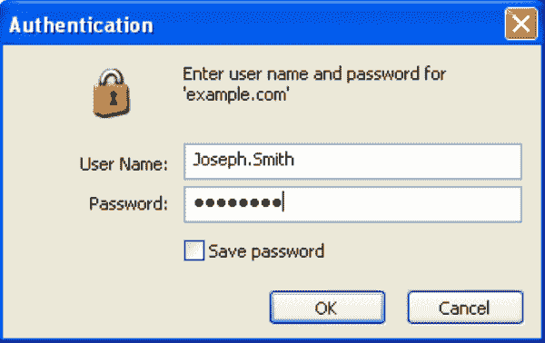
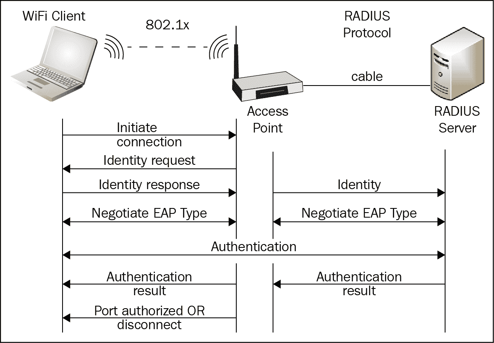
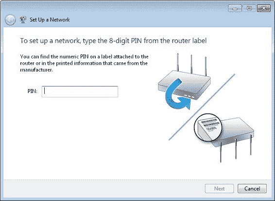
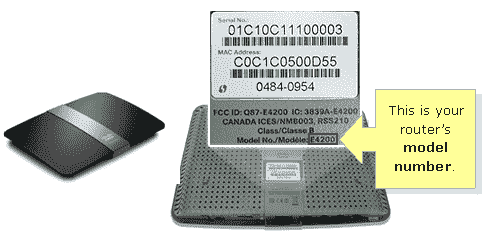
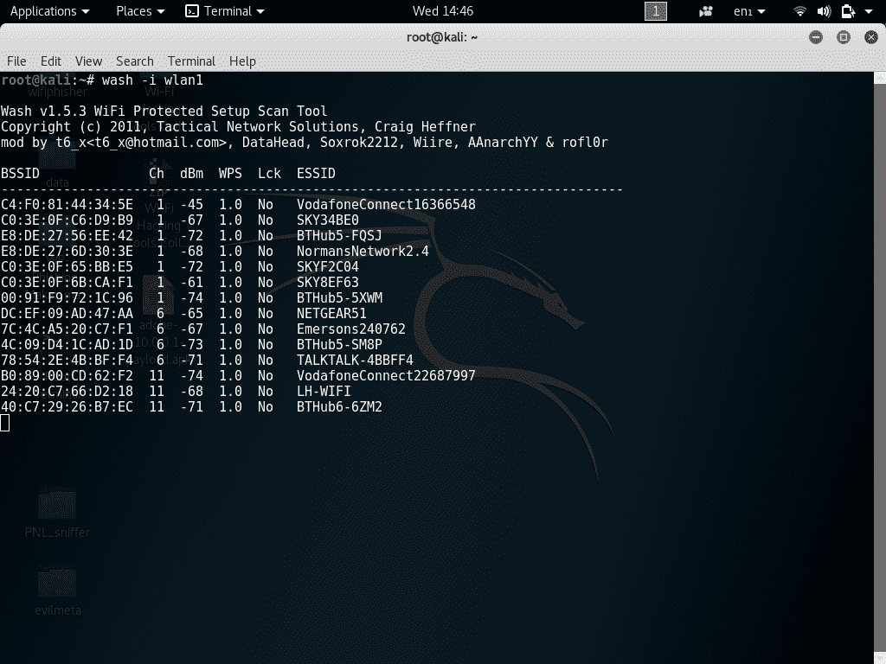

# 身份验证攻击

在本章中，我们将介绍以下配方：

*   WEP 攻击
*   WPA 攻击和 WPA2 攻击
*   攻击 WPS

# 针对身份验证的攻击

在本章中，我们将探讨另一种形式的攻击：针对身份验证机制和系统周围组件的攻击。攻击无线网络上的身份验证机制可以使攻击者能够访问系统的某些部分以及承载在其中的资源，而几乎没有或根本没有任何阻力。事实上，拥有身份验证机制的真正原因是能够验证用户或主机的身份，如果以某种方式破坏或规避了这一点，那么我们最终会遇到各种访问和操作都可以执行的情况。然而，在我们进入本章之前，让我们来看看认证是什么，它是如何完成的，以及它是如何工作在一个非常抽象的形式，然后我们可以使用这些知识来理解本章中的攻击更好。

因此，首先让我们从讨论用户尝试登录系统时发生的情况开始，实际上是任何系统。当用户登录到一个系统时，他们将受到一系列事件的影响。他们要做的第一件事是提供一个身份，这是一个声明，说明他们在试图访问的系统中声称自己是谁。现在，身份本身并不是用来允许访问系统的，因为它只是对某人的声明或断言；这在任何方面都不是决定性的。这意味着我可以声称自己是电影明星、政治家，甚至是美国总统，但在没有提供任何东西来验证身份的情况下，这只是一个没有任何价值或权重的声明，因此不足以进入允许访问可信信息资源的后续步骤。为此，我们需要转到身份验证步骤。下图显示了身份验证过程：



身份验证过程

当我们说身份验证时，我们正在执行某种操作，以证明用户关于他们是谁的声明实际上是有效的。最常见的方法是使用密码；我们中的许多人都有过这样的情况：我们提供一个用户名，这是我们的身份，然后我们提供一个密码，这是一个只有我们知道的秘密信息，可以用来表明我们是我们所说的人，你可以信任我们。因此，我们可以看到，用户名形式的身份本身并不足以证明任何事情；必须对其进行身份验证，以验证该方是否可以被其信任，并提供只有具有该身份的人才能知道的答案。他们正在验证的系统将有某种方式将他们提供的答案或密码与他们已经存储在本地的内容进行比较，以确保提供的答案正确无误。以下屏幕截图是 Windows 登录框的示例：



登录框

在实践中，有三种公认的身份验证方法，应将其视为对资源进行身份验证的一般类别。为了完成你对这些不同方法的了解，让我们简单地看看它们中的每一个：

*   因素 1 身份验证涵盖任何情况，其中必须提供一段信息，如通行码或密码短语或 PIN 码，以便对身份进行身份验证。认证的第一个因素的重要细节或要素是，它是你知道的东西，储存在你的大脑中，并在需要时提供。正如我们将看到的，这是迄今为止在计算机网络、软件以及无线网络中使用的最常见的身份验证形式。
*   因素 2 认证涵盖了必须提供物理项目以认证个人或系统的任何情况。可以使用诸如门钥匙、ATM 卡甚至令牌之类的项目向系统显示或生成一个特殊代码，该代码可以像以前一样用于验证用户的身份。这种形式的认证有时也被称为你拥有的东西，比如我们可以在车门钥匙的情况下看到的你拥有的东西。这种类型的身份验证在无线网络中并不常见，但也存在一些例外情况，例如，根据情况需要，可能会生成特殊代码以登录到公司网络或来宾网络。

下图显示了 factor 2 认证技术的一个示例：


RSA 实验室提供的 factor 2 身份验证令牌

*   因子 3 认证是一种证明形式，它依赖于通常所称的生物特征识别。简言之，生物特征识别是一种方法，通过这种方法，我们可以测量物理有机体的特征或特征，并将其用作验证身份的一种方法，就像你对前两个因素所做的那样。指纹、眼球、掌纹甚至面部识别等特征都被用来提供这种认证因素。虽然这种形式的身份验证可能非常准确和高度可靠，但与其他因素相比，它确实有一个缺点，这些因素往往使其不太常见，因为考虑到建立此类系统所涉及的费用和复杂性，它的实现更为棘手。还值得注意的是，将无线网络中的这种类型的身份验证因素视为身份验证的一种形式是极其罕见的。这并不意味着你不能在无线网络中使用这些认证机制；这只是意味着在大多数情况下，它们不用于向无线网络进行身份验证。此类型的身份验证仅包含在此处供您参考。在这本书中，我们将不会看到颠覆或规避。下图显示了 factor 3 身份验证技术的示例：


因子 3 指纹读取器

现在我们已经介绍了身份验证，接下来要介绍的是在系统验证了您所声称的身份之后会发生什么。请记住，身份验证所做的只是验证您提供给系统的身份不仅仅是一个声明，它实际上是真实和正确的，并且可以信任其准确性。这绝不意味着您已被授予访问系统的权限。可以将其视为向官员提供驾照或其他信息。仅仅因为文件证明了你是你所声称的人，并不意味着你将被允许进入禁区或采取其他行动，因为它所做的只是证明你是你所声称的人，仅此而已。为了能够进入下一步，您必须经历一个称为授权的过程。

那么，什么是授权？授权其实很简单。授权获取您的已验证身份，并将其与系统上配置的一组规则进行比较。这些规则用于确定您与系统的特定访问和交互级别，并由系统所有者管理员根据他们的指导和他们希望实施的标准进行配置和实施。

一旦授权完成，用户将以系统所有者希望的任何身份或级别访问系统。因此，他们可以继续进行他们被授予的任何互动。

关于身份验证，需要记住的是，身份验证不是无线网络独有的。它在控制对不同应用程序、设备、网络和其他项目的访问方面发挥着作用。如果没有身份验证，系统和设备的安全性将成为一个更大的挑战，因此它必须在各种各样的项目中出现。在本章中，我们将在无线设备和技术的背景下讨论身份验证，但不要忘记，身份验证不仅存在于无线中，也存在于通过无线方式访问的网络应用程序以及通过传统有线方式访问的网络应用程序中。

在无线网络中，有许多攻击可以针对身份验证，在本书中我们只能介绍其中的一些攻击。但我们将介绍的是您将遇到的一些更常见的问题，它们可能会影响无线网络和性能。无线网络上的身份验证包括多种技术和机制，我们在前几章中已经介绍了其中的许多技术和机制，但为了完整起见，让我们在此讨论几个不同的项目：

*   **加密**：加密的使用在几乎所有可用的身份验证机制中都是至关重要的，因为它提供了一种方法来确保凭据的机密性以及这些凭据和存储它们的系统的完整性。如果没有加密，在存储和传输凭据时都很难对其进行保护。当这些凭证通过网络传输时，或者如果它们已从原始形式更改，则要确保这些凭证的准确性也是非常困难的。可以肯定地说，如果没有加密技术，我们就不会像现在这样以多种形式提供身份验证。
*   **预共享密钥**（**PSK**）**系统**：这涉及到在设备的每个工作站上输入公共密钥的系统的使用，该系统允许设备向无线接入点进行身份验证。此类保护通常以非企业 WEP、WPA 或 WPA2 的形式提供。值得注意的是，预共享密钥系统在家庭和小型企业环境中非常常见，但当您开始将环境扩展到中型、大型和企业规模的环境时，往往会避免预共享密钥系统，而采用企业身份验证系统。
*   **企业身份验证**：在大型环境中，以企业身份验证机制的形式出现重型身份验证系统并不少见。这些机制允许扩展身份验证以及集中控制和管理身份验证。这意味着，在这种情况下，这些身份验证系统不仅可以提供对无线客户端进行身份验证的可靠方法，而且还可以用于设置统一的规则集，甚至可以对这些规则进行微调，以便逐个站点进行授权。

虽然这只是企业身份验证的三个组成部分的列表，但还有更多的内容可以部署。然而，我们将避免过多地进入一些更奇异和复杂的形式，只是坚持你在探索中最有可能遇到的基本形式。

# 攻击类型

针对无线网络身份验证的攻击多种多样，每种攻击都有各自的优缺点，使其在任何特定情况下都有用或无用。

在我们开始探索每一种攻击之前，让我们首先列出本章将介绍的攻击。

*   WEP 攻击
*   WPA 攻击
*   WPA2 攻击
*   WPS 攻击

请记住，这些只是可用于破坏无线网络身份验证的几种攻击类型中的一种；它们绝不应被视为唯一的攻击类型。

# WEP 攻击

在这一章中，我们将要研究或重新检查的第一个攻击是对有线等效隐私协议（WEP）的攻击。在阅读本书的过程中，我们已经多次遇到该协议，我们将在这里再看一看，添加一些以前没有的附加项目，并努力扩展此攻击，以便讨论此协议中使其如此容易受到攻击的真正弱点。

请记住，WEP 协议是在无线安全被认为是一个问题时实施和设计的，但设计无线技术公司的人员并不真正了解如何正确实施安全，也没有与本可以帮助他们做得更好的外部各方协商。在所有实际意义上，WEP 不应再用于任何活动网络，因为它为希望在传输过程中窃取您的数据或修改您网络上的数据而对您造成伤害的人提供了太多的机会。几年前，成功实施针对该协议的攻击要比现在困难得多，因为这些工具需要更高程度的知识和经验才能操作。如今，针对该协议而设计的工具更加完善和易于使用，并且可以被更广泛的受众访问；他们只需要了解这些工具，并愿意遵循一些食谱式的指导，使它们以一种能够取得成功结果的方式工作。

让我们在 WEP 协议上再补充一点背景知识，充分充实我们处理问题的角度。该协议早在 1997 年就被设计为原始无线标准的一部分。它被设计为使用一个相当强大的加密协议，称为 RC4，旨在保护流量免受意外泄露，并使用 CRC 32 进行完整性保护。这些保护措施都不是一个坏决定。然而，它们在 WEP 的设计和实现中使用不当。

为了理解 WEP 的一个问题，我们需要了解在这个协议中密钥是如何生成的。实际上，标准 64 位 WEP 协议使用一个 40 位密钥加上一个 24 位初始化向量或 IV，这两个向量一起构成了所谓的 RC4 密钥。此密钥用于在传输过程中加密和保护流量。

精明的读者会很快发现，我们正在使用一个 40 位密钥加上一个 24 位初始化向量，这是一个问题——具体来说，40 位密钥是一个我们需要关注的大问题。在确定这个 40 位数字时，已经有技术可以在合理的时间内破解短版本的密钥。如今，破解这种钥匙非常容易，而且几乎不需要时间。因此，不可避免地会出现这样一个问题：在大多数情况下，当更长的加密密钥更强更好时，为什么该协议的开发人员决定使用如此短的密钥。最大的原因是，在 WEP 设计时，美国政府对加密技术以及实施或使用此类加密工具的任何技术或设备有严格的出口管制。正是由于这些限制，密钥大小被限制在这样的程度。后来，在取消了这些限制之后，关键链路增加到 104 位，并带有 24 位初始化向量。有一些更长的链接可用，但即使使用 128 位密钥大小，该协议仍然存在漏洞，因此不应使用。

在大多数使用 WEP 的接入点中，密钥被输入为十六进制值或转换为十六进制值，这意味着它使用的密钥包含从`0`到`9`和`A`到`F`的值。在其接入点上使用 WEP 的消费者或系统管理员将直接在接入点上输入密钥，然后在他们希望连接的所有客户端上输入相同的密钥，所有操作都将相应地工作。

我们在这里关注的 WEP 加密系统中可以使用的东西是不同类型的身份验证，用于向网络标识客户端，而不是用户。两种认证方式为**开放系统认证**（**OSA**）和**共享密钥认证**（**SKA**）。这两种方法都在不同程度上发挥了作用，大多数人选择后者而不是前者，尽管前者在许多情况下都会出现。

在 OSA 的情况下，客户机能够连接到无线接入点，而无需提供任何凭证或任何标识。实际上，任何客户机都能够直接向接入点进行身份验证并与之关联。这实际上意味着，如果你一刀切，根本就不会发生身份验证，即使它以系统的名义这样说。但是，客户机可以在事后通过访问 WEP 密钥对其流量进行加密。这意味着必须向客户端提供密钥才能实现这一点。

在我们的第二种身份验证机制（即共享密钥）中，客户机必须提供 WEP 密钥以向网络进行身份验证，以便在该网络上正确关联和通信。在实践中，它分解为四个步骤，我们应该讨论这四个步骤，以了解我们为恢复密钥而使用的过程：

1.  客户端将向无线网络，特别是接入点发送身份验证请求。
2.  接入点将响应此请求，以与明文信息或质询关联。
3.  然后，客户端将获取此明文消息，并使用预配置的 WEP 密钥对其进行加密，然后获取结果并作为另一个身份验证请求传输回接入点。
4.  此时，接入点将获取其 WEP 密钥的副本，使用它对其接收到的加密密钥进行解密，然后将得到的结果与其原始明文响应进行比较；如果结果匹配，则会发生关联。如果没有，它将被拒绝。下图显示了 WEP 流程的流程：


WEP 身份验证过程

解密过程完成后，WEP 密钥不会被推送到后台，等待另一次身份验证；相反，它现在用于加密客户端和网络上任何其他点或接入点之间传输的流量。

需要指出的是，尽管共享密钥身份验证更安全，因为在允许客户端与网络关联之前，会进行身份验证，这一点非常重要，但事实并非如此。事实上，情况正好相反，因为在共享密钥系统中，数据在加密之前交换，如果密钥很短，则可以从认证客户端到网络的序列中提取密钥。

该协议在可用的关键链路中构建的方式导致了一些明确的问题，这些问题使得我们的攻击概率和成功率相当高。您应该检查为什么这是可能的，以便我们能够理解为什么我们正在使用的攻击工作得这么好。首先让我们了解一下，RC4 是一种对称流密码，如果在同一数据传输过程中使用同一密钥两次，它会很快失去有效性。如果钥匙用了两次，它会打开一扇门，让我们可以比较交通状况，寻找可能会露出钥匙的模式。设计者决定克服这种情况的方法是使用 24 位初始化向量，当与 40 位密钥结合使用时，该向量旨在防止密钥在同一传输过程中被重复使用。然而，初始化向量的 24 位长度很短，这意味着在一个足够繁忙的网络上，同一密钥被反复使用的机会会急剧增加。事实上，仅仅抛开一些数字，在传输了大约 5000 个数据包后，重复使用同一密钥的几率增加到 50%左右。因此，不难想象，在一个足够繁忙的网络上，你可以很快收集到这么多的数据包。事实上，我们的攻击依赖于这样一个事实：我们能够捕获数千或十万多个数据包，并使用它们成功地恢复密钥。

为了给你一些数字，说明成功和快速地打破这个协议是多么容易，想想记录在案的一些案例。2005 年的研究表明，使用该协议从无线网络中恢复 WEP 密钥只需大约三分钟，甚至更少，具体取决于环境。随后几年出现的攻击进一步减少了这一时间，一些人甚至声称，他们能够使用 40000 个数据包从流量中恢复密钥，每次成功的概率都超过 50%。这应该引起人们的注意，为什么这不是一个好的协议，应该大力鼓励那些仍在使用它的人，在他们最终陷入糟糕的情况之前，远离这项技术。

# 准备

要开始工作，您需要准备好以下各项：

*   能够进入监控模式的无线网卡
*   卡利 Linux
*   连接到 internet 的第二个有线或无线适配器

# 怎么做。。。

为了破解运行该协议的接入点的 WEP 密钥，需要收集称为**初始化向量**（**IVs**）的过程。这个过程的问题是，在正常情况下，网络不会在短时间内生成大量这些项目。在正常情况下，这意味着我们必须等待很长一段时间才能获得足够的 IVs 来检索网络密钥。然而，我们可以通过利用我们以前配方中的信息以及一些新技能来检索钥匙，从而加快这一过程。简单地说，我们将向网络中注入数据包，以使接入点在更短的时间内生成大量数据包，这意味着增加了捕获更多弱 IVs 数据包的能力。

完成此过程后，我们可以使用捕获的通信量检索密钥。

简言之，我们将在本食谱中看到的步骤如下：

1.  在特定 AP 通道上以监视器模式启动无线接口。
2.  测试无线设备向 AP 的注入能力。
3.  使用`aireplay-ng`对接入点进行虚假认证。
4.  使用`bssid`过滤器在 AP 通道上启动`airodump-ng`以收集新的唯一 IVs。
5.  在 ARP 请求重播模式下启动`aireplay-ng`注入数据包。
6.  运行`aircrack-ng`使用收集的 IVs 破解钥匙。

打破 WEP 需要执行的第一步是将我们的卡切换到监视器，就像我们以前做的那样。在大多数情况下，如果系统附带内置无线网络适配器，则系统中安装的卡将很容易切换到监视器模式。如果不是，那么您可以始终使用第三方适配器，例如 USB 适配器或直接安装到系统中以支持此功能的适配卡。我们需要这种模式，以便允许网络接口检测由附近网络传输的每个数据包，而不与那些相同的网络相关联。要在名为`wlan0`的网络接口上执行此操作：

1.  `airodump-ng start wlan0 9`（`9`会将卡锁定在通道`9`上监听，但这可以更改为您希望观察的接入点上的通道。您可以通过在不使用通道指示器的情况下运行命令来发现您希望锁定的接入点的通道）。
2.  按`Enter`。

需要记住的一个重要细节是，大多数无线网络往往运行在三个通道中的一个，即`1`、`6`或`11`。原因是，这是该范围内仅有的三个通道没有完全重叠，因此，如果使用其中一个通道，则会降低干扰风险。您可以使用此处指定的频道以外的其他频道，但您可能会受到一定程度的干扰，其程度可能高于您所希望的。在这个食谱中，我坚持使用频道`9`作为一个例子。当您扫描您所在区域的目标时，请检查您希望使用的目标通道并使用该通道。

一旦卡响应它处于监视模式，我们现在可以进入下一步，即准备在目标网络上执行数据包注入。因此，请确认您在屏幕上收到的任何提示正在验证您确实已在指定频道上切换到监视器模式，然后您可以继续。如果没有收到指示已切换到监视模式的响应，请重试该命令，以查看是否输入了错误的内容或出现了其他问题。

我们的下一步是确保我们能够正确地对目标网络执行数据包注入。因此，我们想要验证我们是否离得足够近，或者是否得到了足够强的信号，以便能够执行这个数据包注入，并得到我们正在寻找的结果。幸运的是，我们有一个工具，旨在帮助我们应对这种情况，并确保我们处于需要的位置：

```
aireplay-ng -9 -e ganon -a 00:28:6C:E4:40:80 wlan0
```

`-e ganon`是无线网络的名称，`-a 00:28:6C:E4:40:80`是接入点的 MAC 地址。

系统应做出响应，提示其正在等待信标帧，并且在短时间内还应响应注入过程正在工作，并且已找到您定义的接入点。如果你没有得到这个响应，以及指示信道、速度甚至功率的信息，那么你可以试着靠近你的目标或者改变位置，或者甚至考虑使用天线或者不同的适配器来获得更好的信号。

理想情况下，此时您应该返回的响应应该表明您正在接近 100%的信号来自接入点或目标网络。如果你得到的任何信息表明你的得分低于 100%，这不一定是坏事，但当你的得分低于 90%，然后低于 80%，然后低于 70%，你会得到一个不太可靠的信号，这可能会影响这次攻击成功的几率。不要总是期望得到 100%的信号或响应，但你希望得到尽可能接近的信号或响应。较小的值可能会成功，您不应该让较低的值阻止您的攻击尝试，但请注意，您可能最终得到不太理想的结果。

现在，通过以上步骤，我们可以进入实际捕获初始化向量或 IVs 的步骤。如果您还记得本次攻击的介绍，这是确保同一密钥不会在流量中重复使用的关键项。我们还了解到，初始化向量的短长度导致了高容量网络上的流量，在仅传输了 5000 个数据包之后，可能会重用相同的密钥。因此，我们需要做的是准备捕捉这些流量。

为此，您将打开第二个控制台会话。因此，保持上一个会话处于打开状态，并在 Kali 界面中打开第二个会话以运行以下命令（不要关闭第一个控制台）：

```
airodump-ng -c 9 --bssid 00:14:6C:7E:40:80 -w output wlan0 
```

`--bssid 00:14:6C:7E:40:80`是接入点的 MAC 地址。这消除了无关的流量。`-w`capture 是包含 IVs 的文件的文件名前缀。

执行此命令后，您将开始看到正在捕获流量，尽管与我们将在接下来的几个步骤中生成更多流量相比，捕获速度非常慢。请记住，在生成 5000 个数据包后，WEP 有超过 50%的机会重用密钥。所以我们要做的是诱导一种情况，在很短的时间内产生大量的数据包。如果您只是等待并观看屏幕上正在生成的内容，就像您在这个阶段一样，您将看到正在收集的数据包或信息的数量以逐渐且不稳定的速度上升。

可以想象，您可以按照网络的正常速度以这种方式收集流量，但请记住，如果我们必须生成或收集数千个数据包才能成功增加成功的机会，您可能需要等待一段时间。网络越不活跃，你就越不可能被动地坐在旁边，在短时间内收集到足够的信息，以便能够恢复密钥。事实上，您可能会发现自己需要等待两三天，以获得足够的流量来成功恢复密钥。这可能有点挑战性，也会大大增加你被发现的机会。

现在，我们将使用访问点执行身份验证。我们需要这样做，因为我们将向无线网络注入数据包，为了能够做到这一点，我们需要创建一个身份验证。如果我们没有通过身份验证并与网络关联，那么我们就会遇到这样的情况：我们的连接尝试将被彻底拒绝，并失败。我们正在做的是执行假身份验证并尝试连接到网络。我们这样做的方式是通过成功获取已经与该无线网络关联的客户端的 MAC 地址。

为了将客户端与接入点关联，我们将使用假身份验证：

```
 aireplay-ng -1 0 -e ganon -a 00:14:6C:7E:40:80 -h 00:0F:B5:88:AC:82 wlan0 

-1 means fake authentication 
0 reassociation timing in seconds 
-e ganon is the wireless network name 
-a 00:14:6C:7E:40:80 is the access point MAC address 
-h 00:0F:B5:88:AC:82 is our card MAC address 
```

或其他针对挑剔接入点的变体：

```
aireplay-ng -1 6000 -o 1 -q 10 -e ganon -a 00:14:6C:7E:40:80 -h 00:0F:B5:88:AC:82 wlan0 

6000 - Reauthenticate every 6000 seconds. The long period also causes keep alive packets to be sent. 
-o 1 - Send only one set of packets at a time. Default is multiple and this confuses some APs. 
-q 10 - Send keep alive packets every 10 seconds. 
```

如果一切顺利，您应该会收到一条消息，说明您已成功关联。如果没有，您将收到一条消息，指示您尚未成功地与无线网络关联，此时您需要重试，但一般来说，如果您按照此处的步骤进行操作，您应该更有可能与目标关联。如果您没有通过欺骗受害者的 MAC 地址成功地与您的无线网络进行关联和身份验证，那么您将无法进入下一步。

现在让我们进入关键时刻，我们将生成或诱导目标网络生成可用于恢复密钥的通信量。这个过程的工作方式是使用 ARP 请求或广播。我们要做的是发送一个 ARP 请求，就像任何普通的网络客户端一样。然而，当这个广播出去寻找一个客户机时，根据设计，接入点会在我们每次发送一个客户机时将其重新广播到网络上。因此，它产生了大量的通信量，这些通信量又被 WEP 密钥加密和保护。由于我们将监听并捕获文件中的流量，如果一切正常，我们将记录使用密钥的大量流量（如果我们有耐心的话），我们可以对这些流量执行破解操作或恢复操作。

要执行注入，我们需要打开另一个控制台并输入：

```
 aireplay-ng -3 -b 00:14:6C:7E:40:80 -h 00:0F:B5:88:AC:82 wlan0 
```

它将开始监听 ARP 请求，当它听到一个请求时，`aireplay-ng`将立即开始注入。

您可以通过检查`airodump-ng`屏幕确认您正在注射。数据包应该迅速增加。`#/s`应该是一个合适的数字。然而，“体面”取决于多种因素。典型的范围是每秒 300 到 400 个数据包。它可以低至 100/秒，也可以高至 500/秒。

现在我们已经捕获到一个`.cap`文件的流量，我们现在将尝试从捕获的数据包中检索密钥。为此，我们采取以下措施：

打开另一个新的控制台会话并输入：

```
 aircrack-ng -b 00:14:6C:7E:40:80 output*.cap 

-b 00:14:6C:7E:40:80 selects the one access point we are interested in.  

*.cap selects all files starting with "output" and ending in ".cap". 
```

您可以在生成数据包时运行此操作。在短时间内，将计算并显示 WEP 密钥。64 位密钥需要大约 250000 个 IVs，128 位密钥需要 1500000 个 IVs。请注意，这些值是粗略的指导原则，其他变量可能会影响实际需要收集的流量和 IVs 的数量。

如果该过程成功完成，您将看到以下内容：


请注意，该键不会按预期显示。方括号中`Key Found`旁边的字符是十六进制的密钥。如果在提示与网络关联时删除冒号，然后将其余字符粘贴到无线客户端，则该功能仍能正常工作。

# WPA 和 WPA2 攻击

我们的下一个攻击目标是一种被称为 WPA 或 Wi-Fi 保护访问的技术。正如在我们之前的配方中所看到的，WEP 有许多缺点和漏洞，可以很简单地利用这些缺点和漏洞来访问和公开受此协议保护的网络上的信息。由于 WEP 的漏洞和问题，寻求更换，并以 WPA 的形式立即更换。WPA 被设计为对 WEP 的更新或升级，可以严格按照无线网卡以及能够支持较新标准的无线接入点上的固件升级来实施。当这项新技术被引入时，它解决了 WEP 带来的许多问题，并使系统管理员和消费者的呼吸更加轻松。

需要注意的是，虽然大多数无线网卡都能够执行简单的固件更新，以包括 WPA 提供的新功能和功能，但并非所有无线网卡都可以通过固件升级以支持新技术。在某些情况下，无线网卡必须彻底更换，以利用新技术的优势。另一方面，用于锚定无线网络的接入点需要进行比大多数情况下标准固件更新更广泛的升级和工作。因此，2003 年之前可用的大多数接入点都无法升级以支持 WPA，这意味着用户必须更换这些接入点，而不是升级它们。在大多数情况下，这是因为旧的硬件没有足够的处理能力来支持新标准中更强大的要求。

WPA 建立在称为 IEEE 802.11i 的标准之上。该标准规定了许多事项，但并非所有这些事项都将通过 WPA 立即实施；有些人将不得不等待新的 WPA2 标准协议的实施。然而，从这个标准中，我们确实看到了所谓的时间密钥完整性协议（TKIP）的实现。这项技术旨在用 64 位或 128 位密钥取代 WEP 使用的密钥。在这个新协议中，密钥是在每个数据包的基础上动态生成的，每个数据包都有一个新的 128 位密钥，这意味着我们在 WEP 中看到的攻击在 WPA 中不再可能发生。下图显示了 WPA 过程：


湿法磷酸工艺

WPA 还更新并简化了 WEP 中的完整性检查。WPA 使用所谓的消息完整性检查，其目的与以前的技术相同，这意味着它旨在阻止攻击者在所谓的数据重放攻击中更改或重新发送数据包。替换旧的 CRC 协议的原因是旧的协议不足以防止各种数据完整性检查和重放攻击。因此，决定在 WPA 中实现实际上已经在许多形式中使用了一段时间的较新消息完整性检查。实际上值得一提的是，一些旧网卡和接入点无法更新为新 WPA 协议的原因之一是消息完整性检查实际上比 WEP 中使用的旧 CRC 检查在计算上更密集。

请注意，自从实施了具有消息完整性检查的较新 WPA 协议以来，已经发现与此技术相关的协议中存在一些缺陷。还需要注意的是，WPA 中使用的加密技术也存在缺陷。然而，同样重要的是要注意，虽然 WPA 中存在缺陷，但它们并不像 WEP 中存在的缺陷那样引人注目。然而，在一天结束时，如果一个人有升级到 WPA2 的选择，他们应该选择这个选项，而不是留在 WPA 甚至 WEP。

在 WPA 协议中，有一些与身份验证相关的术语，您应该知道：

*   **WPA 个人**：这种身份验证机制，也称为 WPA–PSK，主要针对不需要或没有集中身份验证系统的家庭和小型办公网络。在此设置中，每个无线设备将从共享的 256 位密钥派生唯一的 128 位加密密钥。该密钥分别输入接入点以及将连接到此接入点或无线网络的每个客户端。此密钥可以输入 64 位十六进制数字，也可以根据需要输入 8 到 63 个字符的密码。
*   **WPA 企业**：这是一种身份验证模式，有时也称为 WPA–802.1x。这种类型的设置是为企业级网络而设计的，它依赖于这样一个事实，即存在一个集中式身份验证服务器或系统，并且可以将其配置为支持此部署。预期在企业级网络中会出现一个集中式身份验证系统，因为它非常适合这些环境。它还有一个缺点，即设置比 WPA personal 复杂得多，但是与共享密钥系统相比，由于额外的设置和复杂性，我们还可以获得额外安全性的好处。下图显示了 WPA 企业身份验证过程的概念：



WPA 企业流程

*   **Wi-Fi 保护设置**：该技术也称为 WPS，是 WPA 和 WPA2 都实现的另一种身份验证机制。它适用于消费者希望简化与密钥相关的配置过程的情况。使用该技术，消费者只需单击接入点和无线设备（如果支持 WPS）上的两个按钮，设备将执行握手式操作并交换密钥，以允许与无线网络进行通信。这种技术的优点是方便，但缺点是在无线网络环境中存在一个主要漏洞。因为这是我们在与 Wi-Fi 相关时的一个重要问题，我们将在本章后面的配方中介绍这项技术以及如何击败它。

# 准备

要开始工作，您需要准备好以下各项：

*   能够进入监控模式的无线网卡
*   卡利 Linux
*   连接到 internet 的第二个有线或无线适配器。

# 怎么做。。。

在这个特殊的配方中，我们将要做的是，通过几个步骤，了解如何打破使用弱密码短语的 WPA：

1.  打开终端窗口并找到无线适配器的名称。这个适配器很可能会被命名为类似于`wlan0`的名称。您应该使用`ifconfig`或`iwconfig`进行此操作。
2.  现在，我们使用`airmon-ng`在第一步所述的界面上启用监控模式：

```
airmon-ng start wlan0 
```

对于某些无线网卡，当您尝试在其上启用监视器模式时，可能会收到错误消息。如果发生这种情况，请使用`airmon-ng` check kill 命令。

1.  接下来，使用以下命令查看目标访问点以及连接到这些访问点的客户端的列表：

```
 airodump-ng wlan0 
```

2.  现在，让这个终端打开，因为它将帮助我们知道我们的攻击是否成功。我们将为以下步骤打开一个新的终端窗口。
3.  现在，在下一步中，我们将尝试从目标无线网络捕获空中数据包：

```
 airodump-ng -c channel -bssid [bssid of wifi] -w [path to 
    write the data of packets]   wlan0mon[interface]. 
```

4.  接下来，我们要对连接到 Wi-Fi 的客户端进行身份验证：

```
 aireplay-ng -deauth 10 -a [router bssid] interface 
```

在前面的命令中，可以选择提供客户机 MAC 地址；由`-c <client mac>`给出。

从网络上引导客户端，以便客户端再次尝试连接到 Wi-Fi。此时，我们将捕获从客户端发送的数据包。根据这个结果，我们将得到一个 WPA 握手。

现在我们应该开始破解 Wi-Fi 了。用于此操作的捕获数据包命令是：

```
 aircrack-ng -b [bssid of router] -w [path to word list] 
    [path to capture packets] 
```

`-w`是单词列表的路径。就我而言，它是`/root/Desktop/wordlist.txt`。

如果您没有单词列表，您可以通过下载一个或使用 Kali Linux 中内置的其中一个来获得。

现在按*回车键。*`aircrack`将开始破解 Wi-Fi 并找到一把钥匙。

# 攻击 WPS

本章中的下一个攻击是针对 WPS 或 Wi-Fi 保护设置技术。这项技术是十多年前引入的，作为一种简化无线网络客户端配置的方法。这些功能实际上针对的是消费者和那些没有 IT 背景的人，或者那些有 IT 背景的人，他们只想购买一台电脑或其他设备，点击几个按钮就可以连接到他们的无线网络。如果我们仅仅考虑这个能力或特性，那么 WPS 实际上已经相当有效地完成了它的工作。然而，存在安全风险，这就是为什么我们要讨论它，并学习如何在这个特定的配方中利用它。但在我们走得太远之前，让我们再深入研究一下 WPS 的机制，来建立这个配方。

WPS 只有在路由器和 Wi-Fi 客户端都支持该技术的情况下才能工作。在讨论 WPS 时还需要记住的一点是，尽管 Wi-Fi 联盟竭尽全力确保 WPS 在供应商及其各自设备之间实现标准化，但在某些情况下，两个不同供应商的两个不同设备上的技术不兼容。然而，重要的是要记住，现代设备不仅包括接入点，还包括智能手机、平板电脑和笔记本电脑，以及支持此功能的操作系统，而互操作性问题很少甚至没有。

为了建立一个关于 WPS 的讨论，让我们首先设想一个我们想要使用 WPS 的场景。设想一个网络在个人配置中使用 WPA 或 WPA2，而不是企业配置。在这种情况下，我们将在接入点中输入一个密钥，然后与希望连接到该接入点的任何客户端共享该密钥，以便他们能够对其流量进行身份验证和加密。正如我们在前面的配方中所讨论的，如果您想使用此设置或将其安装在您的环境中，这意味着您在接入点上输入的密钥现在必须手动转到每个客户端，此时他们将能够连接到无线网络并开始他们的业务。这就是 WPS 试图解决的场景。WPS 技术正试图简化这个过程，只需按下一个按钮，就可以配置密钥。

WPS 需要记住的是，它不适用于不推荐使用的技术，只适用于 WPA 或其后续产品。具体来说，这意味着 WPS 将不会以任何方式、形状或形式与 WEP 一起工作，因此，如果您的路由器不支持任何更新的东西，那么 WEP 将不具有此功能。如果您的路由器确实支持 WPA 或其后继者，那么它也可能不支持 WPS，如果它是在刚刚引入 WPS 的时间范围内出现的。这些路由器中的一些可能仍然存在或存在于您的环境中。

在此设置中，试图共享密钥的用户需要执行一些任务，才能到达可以输入密钥的位置。首先，他们将进入接入点，按照他们选择的协议要求的准则或规则输入密钥。然后他们会去每个设备，打开他们的无线客户端，选择他们想要连接的无线网络；在本例中，他们使用密钥配置的。一旦他们通过点击选择网络，客户端就会发出连接到无线网络的请求，无线网络会发出质询，并提示用户输入密钥，然后将密钥输入。对于那些在技术上不精通或处理起来有点不舒服的人来说，问题很多。最大的问题之一是，他们可能会输入错误的密钥，并且必须再次执行此过程。毫无疑问，他们会检查接入点以确保他们实际获得了正确的密钥，这将导致一些人感到沮丧，并需要漫长的配置过程。

根据 Wi-Fi 联盟提出的规范，WPS 以多种不同的方式工作。让我们来看看我们可以使用的一些方法。

*   我们使用 WPS 的第一种方法是只需按下路由器上的 WPS 按钮，即可发现新设备。此时，您将转到设备，然后从无线客户端选择要连接到的网络。此时，设备将自动连接到无线网络，而无需输入密码或密钥。下图显示路由器上的 WPS 按钮：


路由器上的 WPS 按钮。

*   下一种方法是当您有无线设备（如打印机或范围扩展器）时，它们有自己的 WPS 按钮，当需要快速连接到这些项目时将使用这些按钮。当您需要将这些设备连接到无线网络时，您将要做的是按下路由器上的 WPS 按钮，然后按下您希望连接到无线网络的每个设备上的 WPS 按钮。在此过程中，您不必输入任何数据或任何其他内容，因为设备将自行处理握手并执行信息通信。一旦该过程完成，您就不必担心再次使用 WPS，除非您更改密码或以某种方式重新配置网络，因为设备将自己记住 WPS 凭据。下图显示了前端带有 WPS 按钮的范围扩展器：


带 WPS 的 Wi-Fi 范围扩展器

*   使用 WPS 的另一种方法是使用八位 PIN 码。任何拥有或使用 WPS 的路由器都将有一个 PIN 码，该 PIN 码将自动生成，用户无法更改。该 PIN 通常位于手册的配置页或路由器本身上，应予以注意。在某些情况下，仍然支持 WPS 的 WPS 按钮设备将请求 PIN，因此记录此信息非常重要。在这些情况下，当您尝试连接到无线网络时，系统会提示您输入该代码，当您输入该代码时，设备将为自己设置无线网络本身的密钥，然后执行交换正确密钥的过程。
*   最后，还可以使用最后一种方法，即在 WPS 配置过程中使用八位 PIN 对客户端进行身份验证。在没有 WPS 按钮且恰好支持 WPS 的设备上，将生成特定的客户端 PIN 码。在这些情况下，您将获取此 PIN 并输入路由器的无线配置选项。路由器将使用它来识别正在添加的设备，然后将其添加到网络中，并像以前一样交换密钥。

就性能而言，此列表中的前两种方法非常快速，最具吸引力，更容易受到不懂技术的消费者的青睐。最后两种方法是最慢的，最后一个选项是所有四个可用选项中最慢的，因为它需要登录到路由器并在路由器上进行一些配置，然后才能对设备中工作的任何进程进行身份验证。还值得注意的是，没有什么需要供应商在其技术中实现 WPS 来实现所有四种方法。如果他们愿意，他们可以选择只启用这些方法中的一种。

作为本次讨论的一个脚注，您可能会遇到另一种方法，从路由器与客户端同步或共享 WPS pin 码。此方法使用 NFC 或近场通信。在这种情况下，希望连接到无线网络的客户端将携带平板电脑或智能手机在路由器上的某个点上挥手，路由器将把代码读入设备，并允许其与网络同步。使用的方法类似于如果你碰巧是使用苹果支付或安卓支付（Android Pay）等技术的消费者，你只需在收银机的终端上挥动你的设备，就可以进行支付。

几乎所有现代路由器都支持 WPS，因为 WPS 是绝大多数无线网络的核心组件，尤其是在家庭或小型企业等消费领域。由于这些构成了核心组件，因此该设备对于支持该网络安全标准至关重要。在许多路由器上，您甚至会发现 WPS 技术在默认情况下处于启用状态，一旦路由器通电并成为网络的一部分，就可以立即使用。在某些情况下，您必须通过直接进入无线路由器并使用界面中的选项来手动启用 WPS 以打开此功能，但在大多数情况下，您必须手动关闭此功能，因为默认情况下它通常处于打开状态。

关于在路由器中支持 WPS 的一个小脚注是，许多路由器不仅启用了 WPS 支持，而且即使不是不可能关闭，也非常困难。在某些路由器中，您可能必须禁用路由器上的其他可用功能，以便能够禁用 WPS 本身。例如，在某些无线接入点上，您可能必须禁用主无线网络，而使用来宾网络作为主网络。在其他无线网络中，如果您执行诸如关闭网络 SSID 广播之类的操作，则接入点将允许启用 WPS。然而，在后一种情况下，这可能不是您想要做的事情。如果您选择禁用 WPS，请始终查看您的访问点以了解如何禁用 WPS。

就操作系统中对 WPS 的支持而言，几乎存在对该特性的普遍支持和包含。以微软为例，自 2007 年以来的每一个操作系统版本都支持 Windows WPS，从 Windows Vista 到更高版本的所有操作系统都支持 Windows WPS。在安卓方面，自 2011 年以来，安卓版本 4“冰激凌三明治”全面支持 WPS。Android 的每个版本都完全支持 WPS。Linux 等操作系统中的支持几乎是通用的，一些版本的操作系统不支持它，因为发行版的开发人员已将其删除或禁用，但在大多数情况下，操作系统中提供了总体支持。这就给我们留下了苹果系列的操作系统，无论是在他们的电脑上，还是在任何使用 iOS 的电脑上，我们都没有对 WPS 的原生支持；它只能通过第三方的附加组件或其他增强功能提供。

以下屏幕截图显示了 Windows 7 中的 WPS 对话框：



Windows7 中的 WPS 对话框

既然我们知道了 WPS 是什么，那么在我们进入旨在击败该技术的特定配方之前，让我们先讨论一下它的问题是什么。WPS 标准存在许多问题，我们要看看这些问题，看看它们对我们评估这项技术的人来说意味着什么：

*   WPS 最大的问题之一是，如果有人能够物理访问路由器，他们可以简单地翻转路由器并拍照；在很多情况下，路由器上的标签将有一个代码，允许覆盖 WPA2 密码。下图显示了标签上带有代码的路由器：



包括 PIN 码的标签

*   在许多路由器中，WPS 协议的使用不能很容易地被禁用（如果有的话），这意味着如果你将来不打算使用它，你就不能采取基本的安全措施来关闭它。
*   另一个大问题是 WPS 的实现方式，因为它所交换的协议是一个 8 个字符长的 PIN 码，并且它的存储方式存在一些问题。在不涉及所有细节的情况下，基本上这个八位 PIN 被分成两个四位数据块，在客户端和接入点之间进行交换。由于在客户端和访问点之间检查此代码的方式，因此没有一个强大的系统来验证此代码。由于此代码分为两个块的方式以及此过程之后的行为，攻击者很容易使用软件猜测正确的 PIN 码。事实上，只是为了让事情变得简单，并且为了整个过程的数学计算，由于 PIN 码的验证方式，我们发现，一个人只需进行 5500 次猜测就可以得到正确的代码，这对于现代计算机来说是很容易做到的。在卡利，我们发现我们有一个软件，可以让我们非常快速和有效地进行 11000 次猜测，而我们只需付出很少的努力。

如果你是一个对此进行计算并试图找出可能存在多少 PIN 码组合的人，那么你得到的数字可能比本文中所述的要大得多。事实上，如果考虑到 PIN 码只允许在 PIN 码中的八个槽中的每一个使用数字 0 到九，则可以进行数学运算，并产生大约 1 亿种可能的代码组合。然而，事实并非如此。

首先，我们的 PIN 码甚至没有八位数字，因为最后一位数字用作校验和或验证代码是否正确传输以及是否存在缺陷的方法。这就剩下七位数了。然而，这里的问题是，尽管七位数字不是作为一个连续数字计算的；事实上，它被分成了两部分。启用 Wi-Fi 的设备将向路由器发送前四位数字，这将得到验证，然后将分别发送后三位进行验证。如果我们在这个水平上做数学运算，我们会发现四位数有 10000 个不同的组合，三位数有 1000 个不同的组合；如果我们把这两个加在一起，我们就有 11000 种可能的代码组合。如果我们多做一点数学运算，使用一点逻辑，我们会发现攻击者很可能必须猜测大约一半的代码，然后才能获得成功解决问题的方法。这就是我们得到上述 5500 个猜测的地方。然而，如果我们想要它，并对所有可能的代码进行彻底的暴力搜索，这将是 11000 种不同的组合，这仍然不是任何一种现代计算机无法克服的重大任务。

# 准备

要开始工作，您需要准备好以下各项：

*   能够进入监控模式的无线网卡
*   卡利 Linux

这里列出的项目是基本要求，如果需要，您可以轻松使用更多（或不同）组件。例如，如果您想要增强范围，您可以使用基于 USB 的无线网卡，该网卡可以连接外部天线，从而获得更好的接收效果。

# 怎么做。。。

在这个特殊的配方中，我们将要做的是，通过几个步骤，了解如何打破使用弱密码短语的 WPA。

我们攻击 WPS 的方式是使用熟悉的命令`airmon-ng`：

```
airmon-ng start wlan0 
```

我们再次将卡置于监控模式，以检测该地区的无线网络。我们可以使用`airodump-ng`来执行此命令，就像我们使用 WEP 和 WPA/WPA2 一样，但我们将转而使用`reaver`套件并使用其内置命令。在这种情况下，我们将发出以下命令：

```
wash -i mon0 
```

此命令旨在搜寻专门使用 WPA 的网络。运行该命令时，您将获得类似以下内容的输出：



wash 命令的结果

结果应该能在该地区找到网络。显示的网络将包括邻近区域的所有内容。在这些网络中，可能存在一些易受攻击的网络。在结果中，您将注意到 WPS 锁定列；这远不是一个确定的指标，但一般来说，你会发现被列为未锁定的 AP 更容易受到我们在这里尝试的暴力的影响。您仍然可以尝试对 WPS 锁定的网络发起攻击，但成功的机会会大大降低。

一旦你找到了一个你想要运行攻击的网络，操作`reaver`就非常简单了。basic 命令只需要指定本地接口、通道和 ESSID。

例如，针对 mordred 网络启动`reaver`的命令如下所示：

```
reaver -i mon0 -c 6 -b 00:23:69:48:33:95 -vv 
```

上述命令中唯一不明显的部分是`-vv`；这将启用详细的输出，这在试图衡量`reaver`的运行情况时非常有帮助。

一旦启动`reaver`，您将看到如下输出：


该输出显示 WPS 引脚正在针对目标成功进行测试（此处我们看到`12345670`和`00005678`正在测试中），并且`reaver`工作正常。

这一过程可能需要很长时间，但您会看到反馈，告诉您攻击正在进行并正在运行。可能减慢攻击速度的是，许多供应商一直在尝试实施针对 WPS 攻击的保护，并且可能需要额外的选项来移动攻击。

幸运的是，`reaver`自动保存了一个进度日志文件，因此您可以随时停止攻击，并在方便的时候恢复。每天花几个小时在同一个网络上运行`reaver`应该会发现它的 PIN 码，并通过该密码短语找到 WPA 密码。